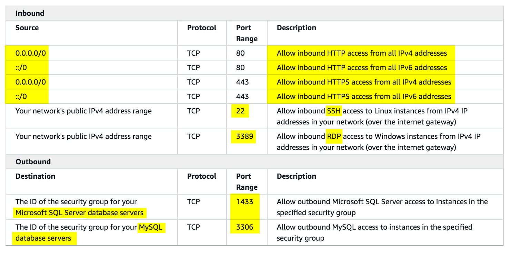
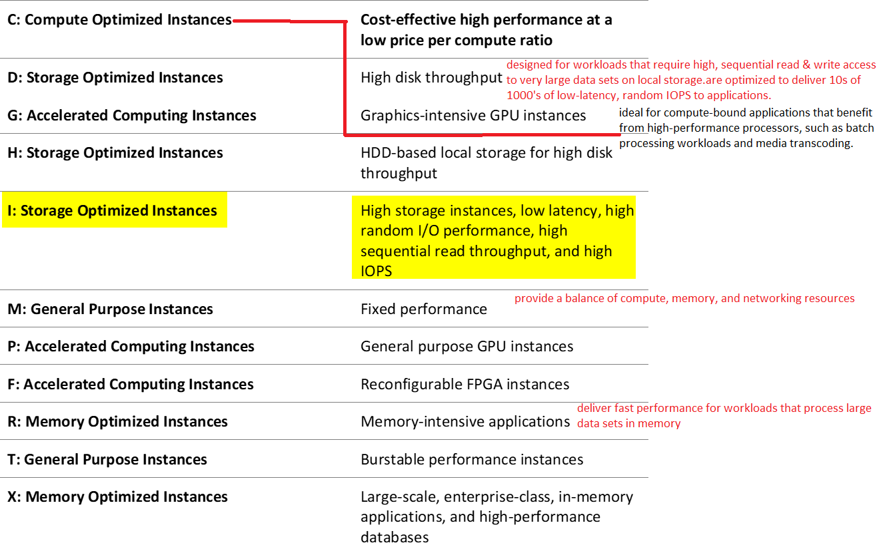

==**AWS VPC**:==
**Network Access Control List(NACL)**:
	\- is an optional layer of security for your VPC that acts as a firewall for ==controlling traffic in and out of one or more subnets==. You might set up network ACLs with rules similar to your security groups in order to add an additional layer of security to your VPC.
	\- ==Rules are evaluated starting with the lowest numbered rule. As soon as a rule matches traffic, it's applied immediately regardless of any higher-numbered rule that may contradict it==.IT is recommend that rules are created in increments (for example, increments of 10 or 100) so that you can insert new rules where you need to later on.
	 \- Your VPC automatically comes with a modifiable default network ACL. By default, it allows all inbound and outbound IPv4 traffic and, if applicable, IPv6 traffic.
 	\- You can create a custom network ACL and associate it with a subnet. By default, each custom network ACL denies all inbound and outbound traffic until you add rules.
 	\- Each subnet in your VPC must be associated with a network ACL. If you don't explicitly associate a subnet with a network ACL, the subnet is automatically associated with the default network ACL.
	 \- You can associate a network ACL with multiple subnets; however, a subnet can be associated with only one network ACL at a time. When you associate a network ACL with a subnet, the previous association is removed.
	 \- has separate inbound and outbound rules, and each rule can either allow or deny traffic.
	 \- ==are stateless; responses to allowed inbound traffic are subject to the rules for outbound traffic== (and vice versa).
	\- are not effective in blocking SQL injection and cross-site scripting attacks
	\- new EC2 instance will not automatically get a DNS hostname if the **DNS resolution** and **DNS hostnames** attributes are disabled in the newly created VPC.

**VPC endpoint**:
    a. enables you to privately connect your VPC to supported AWS services and VPC endpoint services powered by PrivateLink without requiring an Internet gateway, NAT device, VPN connection, or AWS Direct Connect connection, by creating a entry in VPC route table to direct data to the AWS service. 
    b. Instances in your VPC do not require public IP addresses to communicate with resources in the service. 
	c. Traffic between your VPC and the other services does not leave the Amazon network.
	d. **gateway VPC endpoint** 
			is a gateway that you specify in your route table to access AWS S3\DynamoDB from your VPC over the AWS network. 
			==There is no additional charge for using gateway endpoints==. However, standard charges for data transfer and resource usage still apply.
			==for S3 and DynamoDB service, you have to use a **Gateway** VPC Endpoint== 
	e. **Interface VPC endpoints** 
			is an elastic network interface with a private IP address that serves as an entry point for traffic destined to a supported service
			extend the functionality of gateway endpoints by using private IP addresses to route requests to AWS services from within your VPC, on-premises, or from a different AWS Region. 
			==you still get billed for the time your interface endpoint is running== and the GB data it has processed. 
			==for all AWS services other than S3 and DynamoDB service, you use a **Interface** VPC Endpoint== 
	f. Interface endpoints are compatible with gateway endpoints. 
	g. If you have an existing gateway endpoint in the VPC, you can use both types of endpoints in the same VPC.


**AWS Direct Connect** 
	\- links your internal network to an AWS Direct Connect location over a standard Ethernet fiber-optic cable. One end of the cable is connected to your router, the other to an AWS Direct Connect router. 
	\- With this connection, you can create virtual interfaces directly to public AWS services (for example, to Amazon S3) or to Amazon VPC, bypassing internet service providers in your network path. 
	\- An AWS Direct Connect location provides access to AWS in the region with which it is associated. 
	\- You can use a single connection in a public Region or AWS GovCloud (US) to access public AWS services in all other public Regions
	\- To connect programmatically to an AWS service, you will need to use an **AWS Direct Connect service endpoint**


**Endpoints** are virtual devices, that allow communication between instances in your VPC and services without imposing constraints on your network traffic.
==**VPC peering connection:**==
    a. ==networking connection between two VPCs that enables you to route traffic between them privately.== Instances in either VPC can communicate with each other as if they are within the same network. 
    b. You can create a VPC peering connection between your own VPCs, with a VPC in another AWS account, or with a VPC in a different AWS Region.
    c. AWS uses the existing infrastructure of a VPC to create a VPC peering connection; it is neither a gateway nor a VPN connection and does not rely on a separate piece of physical hardware. 
    d. There is no single point of failure for communication or a bandwidth bottleneck
	e. the route table’s target and destination of the instances’ subnet has to be re-configured

**Transit Gateway:** used for interconnecting VPCs and onpremises networks through a central hub
**Direct Connect gateway** 
	By attaching a transit gateway to a Direct Connect gateway using a transit virtual interface, you can manage a single connection for multiple VPCs or VPNs that are in the same AWS Region.
	**link aggregation group (LAG)** is just a logical interface that uses the Link Aggregation Control Protocol (LACP) to aggregate multiple connections at a single AWS Direct Connect endpoint, allowing you to treat them as a single, managed connection. 
**Transit Gateway & Direct Connect gateway**	
	a. simplify the management of connections between an Amazon VPC and your networks over a private connection. 
	b. minimize network costs, 
	c. improve bandwidth throughput
	d. provide a more reliable network experience than Internet-based connections.
	e. ==**Transit Gateway** mainly used for connecting VPCs and on-premises networks through a central hub.==
	

==**inter-region VPC peering**== 
	==allows peering relationships to be established between VPCs across different AWS regions.== 
	ensure that the traffic will always stay on the global AWS backbone and will never traverse the public Internet 
	==would require a lot of manual set up and management overhead to successfully build a functional, error-free inter-region VPC network compared with just using a Transit Gateway.== 
	cost-effective way to share resources between regions or replicate data for geographic redundancy, 
	==its connections are not dedicated and highly available.== 
	doesn't support the company's on-premises data centers in multiple AWS Regions.

to fix slow connectivity issues between AWS Site-to-Site VPN connections placed between their VPCs and their remote network, associate the VPCs to an **Equal Cost Multipath Routing (ECMR)-enabled transit gateway** and attach additional VPN tunnels.

**VPC Flow Logs** enables you to capture information about the IP traffic going to and from network interfaces ==in your VPC.== 
**transit VPC** is primarily used to connect multiple VPCs and remote networks in order to create a global network transit center and not for establishing a dedicated connection to your on-premises network.

**AWS DataSync**
	simplifies, automates, and ==accelerates copying large amounts of data to(also long term storage like AWS Glacier or AWS Glacier Deep Archive) and from AWS storage services over the internet or AWS Direct Connect.==
	You deploy an AWS DataSync agent to your on-premises hypervisor or in Amazon EC2. ==To connect programmatically to an AWS service, you will need to use an **AWS Direct Connect service endpoint**.==
	does not work with Amazon EBS volumes. 
	can copy data between Network File System (NFS) shares, Server Message Block (SMB) shares, self-managed object storage, AWS Snowcone, Amazon Simple Storage Service (Amazon S3) buckets, Amazon Elastic File System (Amazon EFS) file systems, and Amazon FSx for Windows File Server file systems.


**VPN connection** 
	a. traverses the public Internet
	b. doesn't use a dedicated connection
	c. allows you to connect your AWS cloud resources to your on-premises data center using secure and private sessions with IP Security (IPSec) or Transport Layer Security (TLS) tunnels

**VPN connectivity options**
You can connect your Amazon VPC to remote networks and users using the following VPN connectivity options:
**AWS Site-to-Site VPN** - creates an IPsec VPN connection between your VPC and your remote network. On the AWS side of the Site-to-Site VPN connection, a virtual private gateway or transit gateway provides two VPN endpoints (tunnels) for automatic failover.
**AWS Client VPN -** a managed client-based VPN service that provides secure TLS VPN connections between your AWS resources and on-premises networks.
**AWS VPN CloudHub -** capable of wiring multiple AWS Site-to-Site VPN connections together on a virtual private gateway. This is useful if you want to enable communication between different remote networks that uses a Site-to-Site VPN connection.
**Third-party software VPN appliance -** You can create a VPN connection to your remote network by using an Amazon EC2 instance in your VPC that's running a third party software VPN appliance.


**Integrate customer network with AWS VPC, using site to site VPN connection**


------

**AWS security group** 
	acts as a virtual firewall for your instance to control inbound and outbound traffic. 
	When you launch an instance in a VPC, you can assign up to five security groups to the instance. 
	Security groups act at the instance level, not the subnet level. Therefore, each instance in a subnet in your VPC can be assigned to a different set of security groups.
	If you launch an instance and you don't specify a security group, the instance is automatically assigned to the default security group for the VPC. 
	For each security group, you add *rules* that control the inbound traffic to instances, and a separate set of rules that control the outbound traffic.
	Amazon security groups and network ACLs don't filter traffic to or from link-local addresses (`169.254.0.0/16`) or AWS reserved IPv4 addresses (these are the first four IPv4 addresses of the subnet, including the Amazon DNS server address for the VPC). Similarly, flow logs do not capture IP traffic to or from these addresses.
	==The FTP protocol uses TCP via ports 20 and 21.==
	==The **/32** in the the CIDR notation denotes one IP address and the **/0** refers to the entire network.==



------

**In order for you to establish an SSH connection from your home computer to your EC2 instance, you need to**
\- On the Security Group, add an Inbound Rule to allow SSH traffic to your EC2 instance.
\- On the NACL, add both an Inbound and Outbound Rule to allow SSH traffic to your EC2 instance.
The reason why you have to add both Inbound and Outbound SSH rule is due to the fact that ==Network ACLs are stateless which means that responses to allow inbound traffic are subject to the rules for outbound traffic (and vice versa)==. In other words, ==if you only enabled an Inbound rule in NACL, the traffic can only go in but the SSH response will not go out since there is no Outbound rule.==
==Security groups are stateful which means that if an incoming request is granted, then the outgoing traffic will be automatically granted as well, regardless of the outbound rules.==

------

**Internet Gateway** 
	is used to provide Internet access to your instances in the public subnet of your VPC, and not for private subnets. 
	traffic originating from the public Internet will also be able to reach your instances.
**egress-only Internet gateway** 
	allows outbound communication over IPv6 from instances in your VPC to the Internet, and prevents the Internet from initiating an IPv6 connection with your instances.
**NAT Gateway:** 
	\- ==allows instances in the private subnet to gain access to the Internet over IPv4==
	\- are charged on an hourly basis even for idle time.
	\- ==is created in a specific AZ and implemented with redundancy in that zone.== 
	\- there is a limit on the number of NAT gateways you can create in an AZ.


------

**web and application tiers need to access the Internet to fetch data from public APIs. However, these servers should be inaccessible from the Internet.**

a. create a NAT gateway, by specifing the public subnet in which the NAT gateway should reside. You must also specify an Elastic IP address to associate with the NAT gateway when you create it. The Elastic IP address cannot be changed once you associate it with the NAT Gateway.
b. After you've created a NAT gateway, you must update the route table associated with one or more of your private subnets to point Internet-bound traffic to the NAT gateway. This enables instances in your private subnets to communicate with the internet. 


------

**AWS IAM:**

​	Every AWS resource is owned by an AWS account
​	permissions to create or access the AWS resources are governed by permissions policies. 
​	permissions policies can be attached to IAM identities (that is, users, groups, and roles)
​	services such as AWS Lambda also support attaching permissions policies to AWS resources.
​	**IAM roles** are global services that are available to all regions
​	**IAM role** is an AWS identity with permission policies that determine what the identity can and cannot do in AWS. However, instead of being uniquely associated with one person, a role is intended to be assumable by anyone who needs it. Also, a role does not have standard long-term credentials (password or access keys) associated with it. Instead, if a user assumes a role, temporary security credentials are created dynamically and provided to the user.
​	==if an IAM policy has an **Allow Effect statement** followed by the **Deny Effect statement**, then the deny statement will take precedence.== eg:  this policy will not allow any actions on all DynamoDB tables of the AWS account.

```
{
  "Version": "2012-10-17",
  "Statement": [
    {
      "Sid": "TutorialsdojoTablePolicy1",
      "Effect": "Allow",
      "Action": [
        "dynamodb:PutItem",
        "dynamodb:DeleteItem"
      ],
      "Resource": "arn:aws:dynamodb:us-east-1:1206189812061898:table/tutorialsdojo"
    },
    {
      "Sid": "TutorialsdojoTablePolicy2",
      "Effect": "Deny",
      "Action": "dynamodb:*",
      "Resource": "arn:aws:dynamodb:us-east-1:1206189812061898:table/*"
    }
  ]
}
```

​	**web identity federation**, users of your app can sign in using a well-known identity provider (IdP) —such as Login with Amazon, Facebook, Google, or any other OpenID Connect (OIDC)-compatible IdP, receive an authentication token, and then exchange that token for temporary security credentials in AWS that map to an IAM role with permissions to use the resources in your AWS account. Using an IdP helps you keep your AWS account secure because you don’t have to embed and distribute long-term security credentials with your application.

------

**Integrate the directory service(which is not compatible with SAML) from the on-premises data center to the AWS VPC using IAM:**

If your identity store is not compatible with SAML 2.0 then you can build a custom identity broker application to perform a similar function. The broker application authenticates users, requests temporary credentials for users from AWS, and then provides them to the user to access AWS resources.
The application verifies that employees are signed into the existing corporate network's identity and authentication system, which might use LDAP, Active Directory, or another system. The identity broker application then obtains temporary security credentials for the employees.
To get temporary security credentials, the identity broker application calls either **`AssumeRole`** or **`GetFederationToken`** to obtain temporary security credentials. The call returns temporary security credentials consisting of an AWS access key ID, a secret access key, and a session token. The identity broker application makes these temporary security credentials available to the internal company application. The app can then use the temporary credentials to make calls to AWS directly. The app caches the credentials until they expire, and then requests a new set of temporary credentials.


------

**RAID (Redundant Array of Independent Disks):** data storage virtualization technology that combines multiple storage devices to achieve higher performance or data durability. 
==**RAID 0:**==
	==enables you to improve your storage volumes' performance by distributing the I/O across the volumes in a stripe.==
==**RAID 1 configuration** can mirror two volumes together== to achieve on-instance redundancy.


**Private Virtual Interface** 
	allows you to connect to your VPC resources on your private IP address or endpoint.
**AWS CloudFormation:** You can create a template that describes all the AWS resources that you want (like Amazon EC2 instances or Amazon RDS DB instances), and AWS CloudFormation takes care of provisioning and configuring those resources for you. With this, you can deploy an exact copy of your AWS architecture, along with all of the AWS resources which are hosted in one region to another.

------

**AWS EBS:** 
    \- block-level ==storage device that you can attach to a single EC2 instance.== 
    \- Is not a concurrently accessible storage
	\- EBS volumes behave like raw, unformatted block devices. 
	\- EBS volumes that are attached to an instance are exposed as storage volumes that persist independently from the life of the instance.
	\- is the persistent block storage volume. 
	\- It is mainly used as the root volume to store the OS of an EC2 instance. 
	\- To encrypt an EBS volume at rest, you can use AWS KMS customer master keys(or Amazon managed keys) for the encryption of both the boot and data volumes of an EC2 instance
	\- for high IOPS performance, SSD volumes are more suitable to use instead of HDD volumes.
	\- SSD's are best for workloads with small, random I/O operations
	\- HDD's are best for large, sequential I/O operations.
	==\- provides lowest latency access compared to EFS==
	\- ==does not store data redundantly across multiple AZs by default, unlike EFS.==
	\- ==instance store volumes have greater I/O performance than EBS volumes.==
	\- When you create an encrypted EBS volume and attach it to a supported instance type, 
		Data at rest inside the volume, 
		==All data moving between the volume and the instance,== 
		All snapshots created from the volume, 
		All volumes created from those snapshots are encrypted.
	\- Snapshots occur asynchronously. The EBS volume can be used while the snapshot is in progress.
	\- When you create an EBS volume in an Availability Zone, it is automatically replicated within that AZ.
	\- After you create a volume, you can attach it to any EC2 instance in the same AZ
	\- **AWS EBS Multi-Attach** enables you to attach a single Provisioned IOPS SSD (io1) volume to multiple Nitro-based instances that are ==**in the same AZ**==. However, other EBS types are not supported.
	\- You can specify not to terminate the EBS volume when you terminate the EC2 instance during instance creation.
	\- ==EBS volumes support live configuration changes while in production which means that you can modify the volume type, volume size, and IOPS capacity without service interruptions.==
	\- Amazon EBS encryption uses 256-bit Advanced Encryption Standard algorithms (AES-256)
	\- EBS Volumes offer 99.999% SLA.

 **EBS type of Provisioned IOPS SSD(io1)**
 	provides sustained performance for ==mission-critical== low-latency workloads.
	offer storage with consistent and low-latency performance and are designed for I/O intensive applications such as large relational or NoSQL databases.
**EBS General Purpose SSD (gp2)** 
	it does not provide the high IOPS required by the application, unlike the Provisioned IOPS SSD volume.
	are suitable for a broad range of workloads, including small to medium sized databases, development, and test environments, and boot volumes.
**EBS Throughput Optimized HDD (st1)**
	these are HDD volumes which are more suitable for large streaming workloads rather than transactional database workloads.
**EBS Cold HDD (sc1)** 
	these are HDD volumes which are more suitable for large streaming workloads rather than transactional database workloads	
**Magnetic volumes:**
	are ideal for workloads where data are accessed infrequently, and applications where the lowest storage cost is important. 
	this is a Previous Generation Volume. 

|                                | **EBS type of Provisioned IOPS SSD(io1)**                    | **EBS General Purpose SSD (gp2)**                            | EBS Throughput Optimized HDD (st1)                           | **EBS Cold HDD (sc1)**                                       | Magnetic volumes                                             |
| ------------------------------ | ------------------------------------------------------------ | ------------------------------------------------------------ | ------------------------------------------------------------ | ------------------------------------------------------------ | ------------------------------------------------------------ |
|                                | provides sustained performance for ==mission-critical== low-latency workloads.<br/>offer storage with consistent and low-latency performance and are designed for I/O intensive applications such as large relational or NoSQL databases.<br />==30,000 IOPS== | it does not provide the high IOPS required by the application, unlike the Provisioned IOPS SSD volume.<br/>are suitable for a broad range of workloads, including small to medium sized databases, development, and test environments, and boot volumes.<br />==less than 30,000 IOPS== | are more suitable for large streaming workloads rather than transactional database workloads. | are more suitable for large streaming workloads rather than transactional database workloads | are ideal for workloads where data are accessed infrequently, and applications where the lowest storage cost is important. <br/>this is a Previous Generation Volume. |
| Best for workloads with        | small random I\O operations                                  | small random I\O operations                                  | large sequential I\O operations                              | large sequential I\O operations                              | large sequential I\O operations                              |
| Can be used as bootable volume | Yes                                                          | Yes                                                          | No                                                           | No                                                           | No                                                           |
| Cost                           | Moderate\high                                                | Moderate\high                                                | low                                                          | low                                                          | low                                                          |
| Dominant Performance attribute | IOPS                                                         | IOPS                                                         | throughout(MiB/s)                                            | throughout(MiB/s)                                            | throughout(MiB/s)                                            |
| Suitable use cases             | Best for transactional workloads                             | Best for transactional workloads                             | Best for large streaming workloads requiring consistent, fast throughput at low price | Best for large streaming workloads requiring consistent, fast throughput at low price | Best for large streaming workloads requiring consistent, fast throughput at low price |


------

**AWS EFS:**
    file storage service for use with Amazon EC2. 
    provides a file system interface, file system access semantics (such as strong consistency and file locking), and concurrently-accessible storage for up to thousands of Amazon EC2 instances. 
	stores data redundantly across multiple AZs by default
	provides the same level of high availability and high scalability like S3 however, ==EFS is more suitable for scenarios where it is required to have a POSIX-compatible file system or if you are storing rapidly changing data. It offers strong consistency and file locking which the S3 service lacks..==

------

**AWS S3:** 
	\-an object storage service.
	\-supports SNS topic, SQS queue, AWS Lambda destinations where it can publish events.	
	\-`s3:ObjectRemoved:DeleteMarkerCreated` type is triggered when a delete marker is created for a versioned object and not when an object is deleted or a versioned object is permanently deleted.
	\-`s3:ObjectRemoved:Delete` type is triggered when an object is deleted or a versioned object is permanently deleted.
	\-All objects and buckets by default are private which means that only the AWS account holder (resource owner) that created it has access to the resource. The resource owner can optionally grant access permissions to others by writing an access policy. 
	\-you also set the permissions of the object during upload to make it public.
	\-Under ***Manage public permissions**,* you can grant read access to your objects to everyone in the world, for all of the files that you're uploading. eg: when buckets are used for websites. in this case, the S3 bucket policy is configured to set all objects to public read.
	\-You may choose to use resource-based policies, user policies, or some combination of these to manage permissions to your Amazon S3 resources.
	h.1.  **resource-based policies** and user policies. Access policies you attach to your resources (buckets and objects) are referred to as resource-based policies. eg: bucket policies and access control lists (ACLs) are resource-based policies. 
	h.2. **user policies:** You can also attach access policies to users in your account.
	\-Objects can be encrypted using Server-side encryption (SSE).
	\-S3 supports at least 3,500 requests per second to add data and 5,500 requests per second to retrieve data
	\-==If you are transitioning noncurrent objects (in versioned buckets), you can transition only objects that are at least 30 days noncurrent to STANDARD_IA or ONEZONE_IA storage.==
	\-==**Server Access Logging feature of Amazon S3**: provides more detailed information about every access request sent to the S3 bucket including the referrer and turn-around time information compared to **CloudTrail Logging feature of Amazon S3.**==
	\-**CORS(Cross Origin Resource Sharing)** will only allow objects from one domain (travel.cebu.com) to be loaded and accessible to a different domain (palawan.com). 
	\-does not provide low-latency file operations as it does not reside within your VPC by default, which means the data will traverse the public Internet that may result to higher latency. You can set up a VPC Endpoint for S3 yet still, its latency is greater than that of EBS.
	\-**CRR(Cross-Region Replication)** 
		When you upload your data in S3, your objects are redundantly stored on multiple devices across multiple facilities within the region only, where you created the bucket.
		enables you to automatically copy S3 objects from one bucket to another bucket that is placed in a different AWS Region or within the same Region.
	\-**Cross-Account Access** is primarily used if you want to grant access to your objects to another AWS account. eg: Account `MANILA` can grant another AWS account (Account `CEBU)` permission to access its resources such as buckets and objects

|                                 | S3 Standard                      | S3 Intelligent-Tiering              | S3 Standard-IA                                               | S3 One Zone-IA                      | S3 Glacier                                                   | S3 Deep Archive                                        |
| ------------------------------- | -------------------------------- | ----------------------------------- | ------------------------------------------------------------ | ----------------------------------- | ------------------------------------------------------------ | ------------------------------------------------------ |
|                                 | active, frequently accessed data | Data with changing access patterns  | \-Infrequently accessed data<br />\-entails an additional fee for monitoring and automation of each object in your S3 bucket | Re-creatable less accessed data     | Data archiving<br />For all but the largest archives (250 MB+), data accessed using **Expedited retrievals** are typically made available within 1–5 minutes. <br />**Provisioned Capacity** ensures that retrieval capacity for Expedited retrievals is available when you need it. | cheapest storage class for long term retention of data |
| Minimum storage duration charge | N\A                              | 30 days min storage duration charge | 30 days min storage duration charge                          | 30 days min storage duration charge | 90 days min storage duration charge                          | 180 days min storage duration charge                   |
| First byte latency              | milliseconds access              | milliseconds access                 | milliseconds access                                          | milliseconds access                 | retrievable within mins or hours                             | retrievable within  hours                              |
| A\Z                             | >=3 AZ's                         | >=3 AZ's                            | >=3 AZ's                                                     | 1 AZ's                              | >=3 AZ's                                                     | >=3 AZ's                                               |


**S3 Object Lock** can help prevent objects from being deleted or overwritten for a fixed amount of time or indefinitely.

**Comparison between AWS cloudTrail S3 logging and S3 server logs:**


**AWS S3 event notification** feature enables you to receive notifications when certain events happen in your bucket. **Supported S3 event notifications destination are Lambda function, SQS queue, SNS Topic.** 
**S3 Batch Operations** runs multiple S3 operations in a single request. 

**Amazon S3 access points** are named network endpoints that are attached to buckets that you can use to perform S3 object operations, such as uploading and retrieving objects.
**To securely serve private content in S3 by using CloudFront**:
	a. Require that your users access your private content by using special CloudFront signed URLs or signed cookies.
	b. Require that your users access your Amazon S3 content by using CloudFront URLs, not Amazon S3 URLs. This prevents users from bypassing the restrictions that you specify in signed URLs or signed cookies. You can do this by setting up an origin access identity (OAI) for your Amazon S3 bucket. You can also configure the custom headers for a private HTTP server or an Amazon S3 bucket configured as a website endpoint.	
==**AWS S3 Transfer Acceleration**== 
	==enables fast,== & secure ==transfers of files== over long distances ==between your client and your Amazon S3 bucket.== 
	leverages Amazon CloudFront's globally distributed AWS Edge Locations. As data arrives at an AWS Edge Location, data is routed to your Amazon S3 bucket over an optimized network path.

**Pre-signed URLs**: 
	a. are useful if you want your user/customer to be able to upload a specific object to your bucket, but you don't require them to have AWS security credentials or permissions.
**S3 payments:** you dont pay for bandwidth into\out of S3 when 
\- Data transferred in from the Internet.
\- Data transferred out to an Amazon EC2 instance, when the instance is in the same AWS Region as the S3 bucket (including to a different account in the same AWS region).
\- Data transferred out to Amazon CloudFront.
==\- there is no data transfer cost between S3 and EC2 in the same AWS Region==
in all other cases you pay for all bandwidth into and out of Amazon S3.

**Multipart Upload** 
	allows you to upload a single object as a set of parts. 
	You can upload these object parts independently and in any order. 
	If transmission of any part fails, you can retransmit that part without affecting other parts. 
	After all parts of your object are uploaded, Amazon S3 assembles these parts and creates the object. 
	In general, when your object size reaches 100 MB, you should consider using multipart uploads instead of uploading the object in a single operation.

**Amazon S3 Select** help analyze and process data within an object in Amazon S3 buckets

**options for protecting data at rest in Amazon S3:**
**Use Server-Side Encryption** – You request Amazon S3 to encrypt your object before saving it on disks in its data centers and decrypt it when you download the objects.

1. Use Server-Side Encryption with Amazon S3-Managed Keys (SSE-S3)
2. Use Server-Side Encryption with AWS KMS-Managed Keys (SSE-KMS)
3. Use Server-Side Encryption with Customer-Provided Keys (SSE-C)

**Use Client-Side Encryption** – You can encrypt data client-side and upload the encrypted data to Amazon S3. In this case, you manage the encryption process, the encryption keys, and related tools.

1. Use Client-Side Encryption with AWS KMS–Managed Customer Master Key (CMK)
2. Use Client-Side Encryption Using a Client-Side Master Key

------

**AWS Glacier** 
An **Amazon S3 Glacier (Glacier) vault** can have one resource-based vault access policy and one Vault Lock policy attached to it. A ***Vault Lock policy*** is a vault access policy that you can lock. Using a Vault Lock policy can help you enforce regulatory and compliance requirements.
Amazon S3 Glacier supports the following archive operations: Upload, Download, and Delete. Archives are immutable and cannot be modified.

**AWS Glacier Select** 
	a. is not an archive retrieval option 
	b. is primarily used to perform filtering operations using simple Structured Query Language (SQL) statements directly on your data archive in Glacier.
**Expedited retrievals** 
	a. allow you to quickly access your data when occasional urgent requests for a subset of archives are required.
	b. For all but the largest archives (250 MB+), data accessed using Expedited retrievals are typically made available within 1–5 minutes
**Provisioned Capacity** 
	a. ensures that retrieval capacity for Expedited retrievals is available when you need it.
	b. You should purchase provisioned retrieval capacity if your workload requires highly reliable and predictable access to a subset of your data in minutes. 
**Bulk Retrieval** 
	a. typically complete within 5–12 hours
	b. The provisioned capacity option is also not compatible with Bulk retrievals.
**AWS S3 Glacier Deep Archive** has long retrieval time.

**Elastic IP(EIP) address** is just a static, public IPv4 address.
**AWS ParallelCluster** 
	is just an AWS-supported open-source cluster management tool that makes it easy for you to deploy and manage High-Performance Computing (HPC) clusters on AWS. 
	uses a simple text file to model and provision all the resources needed for your HPC applications in an automated and secure manner.

------

**AWS EC2** 	
	root device for an instance launched from the AMI is an instance store volume created from a template stored in Amazon S3. The data on instance store volumes persist only during the life of the instance which means that if the instance is terminated, the data will be automatically deleted.
	Instance metadata is data about your EC2 instance that you can use to configure or manage the running instance. 
	To view the private IPv4 address, public IPv4 address, and all other categories of instance metadata from within a running instance, use the http://169.254.169.254/latest/meta-data/ URL

**When EC2 instance is stopped and started**
	The underlying host for the instance is possibly changed.
	All data on the attached instance-store devices will be lost.
	Elastic IP address(EIP) will actually remain associated with your instance even after stopping it.
	if it is an EC2-Classic instance, its Elastic IP address is disassociated from the instance. 
	if it is an EC2-VPC instance, the Elastic IP address remains associated.
	ENI will stay attached even if you stopped your EC2 instance.
	

**add an existing EC2 instance to an Auto Scaling group**
	 \- The instance is in the **`running`** state.
	\- The AMI used to launch the instance must still exist.
	\- The instance is not a member of another Auto Scaling group.
	\- The instance is launched into one of the Availability Zones defined in your Auto Scaling group.
	 \- If the Auto Scaling group has an attached load balancer, the instance and the load balancer must both be in EC2-Classic or the same VPC. If the Auto Scaling group has an attached target group, the instance and the load balancer must both be in the same VPC.

**EC2 Instance Types** 	
**Reserved Instance:** 
	a. when a Reserved Instance expires, any instances that were covered by the Reserved Instance are billed at the on-demand price
	b. provide you with a significant discount (up to 75%) compared to On-Demand instance pricing.
	c. are recommended for:
	Applications with steady state usage
	Applications that may require reserved capacity
	need to commit to using EC2 over a 1 or 3 year term
	==cost less than on demand price==. 

**Reserved Instance Marketplace** is a platform that supports the sale of third-party and AWS customers' unused Standard Reserved Instances, which vary in terms of lengths and pricing options
**Spot instances** are spare compute capacity in the AWS cloud available to you at steep discounts compared to On-Demand prices. It can be interrupted by AWS EC2 with two minutes of notification when the EC2 needs the capacity back.

**EC2 Billing**:
	when your On-Demand instance is preparing to hibernate with a `stopping` state
	when your Reserved instance is in `terminated` state
	a running EC2 Instance
	EBS Volumes attached to stopped EC2 Instances
	no charge for using Amazon VPC

==**Import SSL\TLS certificate of application:**==
	**Amazon Certificate manager**: lets you import third-party certificates. 
	If ACM is not available in your region, use AWS CLI to upload your third-party certificate to the **IAM certificate store**.

**placement strategies**
**Cluster placement**– packs instances close together inside an Availability Zone. This strategy enables workloads to achieve the low-latency network performance necessary for tightly-coupled node-to-node communication that is typical of HPC applications.
	recommended to launch the number of instances that is needed in the placement group in a single launch request and that you use the same instance type for all instances in the placement group. **Partition** – spreads your instances across logical partitions such that groups of instances in one partition do not share the underlying hardware with groups of instances in different partitions. This strategy is typically used by large distributed and replicated workloads, such as Hadoop, Cassandra, and Kafka.
**Spread** – strictly places a small group of instances across distinct underlying hardware to reduce correlated failures.

**Amazon Data Lifecycle Manager (Amazon DLM)** to automate the creation, retention, and deletion of snapshots taken to back up your Amazon EBS volumes. 

------

**Storage Instance Types:**
====**storage optimized instance**== 
	==is designed for workloads that require high, sequential read and write access to very large data sets on local storage.== 
	You can join multiple volumes together in a RAID 0 configuration to use the available bandwidth for these instances.
**Memory optimized instances with EBS volume** 
	this type of instance is suitable for a NoSQL database
	it is not designed for workloads that require high, sequential read and write access to very large data sets on local storage.

**General purpose instances with EBS volume** 
	this instance provides a balance of computing, memory, and networking resources. 



------

**==AWS Storage Gateway==** 
	==\- connects an on-premises software appliance with cloud-based storage== to provide seamless integration with data security features between your on-premises IT environment and the AWS storage infrastructure. ==You can use the service to store data in the AWS Cloud.==
	\-  ==is used only for creating a backup of data from your on-premises server==
	\- is used in providing low-latency access to data by caching frequently accessed data on-premises while storing archive data in Amazon cloud storage services. 
	\- optimizes data transfer to AWS by sending only changed data and compressing data.

​	**AWS Storage Gateway - Cached Volumes:** data is stored in AWS S3 and you retain a copy of frequently accessed data subsets locally in your on-premises network. Cached volumes offer substantial cost savings on primary storage and minimize the need to scale your storage on-premises. You also retain low-latency access to your frequently accessed data. 
​	**AWS Storage Gateway - Stored Volumes:** are used if you need low-latency access to your entire dataset.


**Tape Gateway** 
	==is type of AWS storage gateway.==
	enables you to replace using physical tapes on-premises with virtual tapes in AWS without changing existing backup workflows. 	
	supports all leading backup applications and caches virtual tapes on-premises for low-latency data access. 
	encrypts data between the gateway and AWS 
	compresses data and transitions virtual tapes between ==Amazon S3 and Amazon S3 Glacier, or Amazon S3 Glacier Deep Archive==

| AWS Storage Gateway-File gateway                             | **Amazon FSx for Windows File Server**                       |
| ------------------------------------------------------------ | ------------------------------------------------------------ |
| can be used as a shared file system for Windows <br />can also be integrated with Microsoft Active Directory,<br />has lower level of throughput and IOPS compared with Amazon FSx for Windows File Server | can be used as a shared file system for Windows <br />can also be integrated with Microsoft Active Directory,<br />has higher level of throughput and IOPS compared with AWS Storage Gateway. |
|                                                              | provides fully managed, highly reliable, and ==scalable file storage accessible over Service Message Block (SMB) protocol.== |

**AWS STS(Security Token Service)** is the service that you can use to create and provide trusted users with temporary security credentials that can control access to your AWS resources. 
**AWS SSO(Single Sign-On)** is a cloud SSO service that makes it easy to centrally manage SSO access to multiple AWS accounts and business applications.
Amazon Cognito service is primarily used for user authentication and not for providing access to your AWS resources. 
**JSON Web Token (JWT)** is meant to be used for user authentication and session management.
**Amazon WorkDocs** is a fully managed, secure content creation, storage, and collaboration service.
**Bastion host** is a special purpose computer on a network specifically designed and configured to withstand attacks. If you have a bastion host in AWS, it is basically just an EC2 instance. It should be in a public subnet with either a public or Elastic IP address with sufficient RDP or SSH access defined in the security group. Users log on to the bastion host via SSH or RDP and then use that session to manage other hosts in the private subnets
**Amazon Kinesis** is the streaming data platform of AWS and has four distinct services under it: Kinesis Data Firehose, Kinesis Data Streams, Kinesis Video Streams, and Amazon Kinesis Data Analytics.
**Amazon Kinesis Data Firehose** allows you to load streaming data into data stores and analytics tools. It can capture, transform, and load streaming data, enabling near real-time analytics with existing business intelligence tools and dashboards you are already using today. It is a fully managed service that automatically scales to match the throughput of your data and requires no ongoing administration. It can also batch, compress, and encrypt the data before loading it, minimizing the amount of storage used at the destination and increasing security. You can use Amazon Kinesis Data Firehose in conjunction with Amazon Kinesis Data Streams if you need to implement real-time processing of streaming big data. 
	 only supports AWS S3, AWS Redshift, AWS Elasticsearch, and an HTTP endpoint as the destination, ==does not support AWS Lambda as destination==

**Kinesis Data Streams** 
	\- ==enables real-time processing of streaming big data.== provides an ordering of records, as well as the ability to read and/or replay records in the same order to multiple Amazon Kinesis Applications.
	\- is used to collect and process large streams of data records in real-time. 
	\- can be used for rapid and continuous data intake and aggregation.
	\- has a built-in enhanced fan-out feature
	\- is a real-time data streaming service that requires the provisioning of shards.

**AWS Kinesis Client Library (KCL)** delivers all records for a given partition key to the same record processor, making it easier to build multiple applications reading from the same Amazon Kinesis data stream
**AWS Redshift** 
	a. data warehouse that makes it simple and cost-effective to analyze all your data across your data warehouse and data lake. 
	b. delivers ten times faster performance than other data warehouses by using machine learning, massively parallel query execution, and columnar storage on high-performance disk.
	c. **Cross-Region snapshots:** You can configure Amazon Redshift to copy snapshots for a cluster to another region. 
	To configure cross-region snapshot copy, you need to enable this copy feature for each cluster and configure where to copy snapshots and how long to keep copied automated snapshots in the destination region. 

**Amazon Redshift with AWS Cloud Development Kit (AWS CDK)** 
	a. is mainly used for data warehousing making it simple and cost-effective to analyze your data across your data warehouse and data lake. 
	b. cannot collect and process large streams of data in real-time. 
**Amazon Managed Streaming for Apache Kafka (Amazon MSK)** 
	a. can process streaming data in real-time with Amazon MSK, 
	b. still entails a lot of administrative overhead, unlike Amazon Kinesis. 
	c. doesn't have a built-in enhanced fan-out feature
**AWS Redshift Spectrum**, 
	allowing you to directly run SQL queries against exabytes of unstructured data in Amazon S3. 
	No loading or transformation is required, and you can use open data formats. 	
	automatically scales query compute capacity based on the data being retrieved, so queries against Amazon S3 run fast, regardless of data set size.

==**AWS Key Management Service (AWS KMS)**== 

**Server-side encryption** is the encryption of data at its destination by the application or service that receives it. 
**customer master key (CMK)** 
	is a logical representation of a master key. 
	includes metadata, such as the key ID, creation date, description, and key state. 
	contains the key material used to encrypt and decrypt data. 
	You can use a CMK to encrypt and decrypt up to 4 KB (4096 bytes) of data. 
**Envelope encryption.**: Typically, you use CMKs to generate, encrypt, and decrypt the data keys that you use outside of AWS KMS to encrypt your data. 

**AWS Key Management Service (AWS KMS)** 
	a. is a service that provide a key management system scaled for the cloud. 
	b. Amazon S3 uses AWS KMS customer master keys (CMKs) to encrypt your Amazon S3 objects. 
	c. SSE-KMS encrypts only the object data. Any object metadata is not encrypted.
	d. ==provides an audit trail that shows when your CMK was used and by whom==
	e. ==provides envelope encryption== where we use CMKs to generate, encrypt, and decrypt the data keys that you use outside of AWS KMS to encrypt your data.  
	==f.  can configure automatic key rotation==

**options depending on how you choose to manage the encryption keys:**
==**Use Server-Side Encryption with Amazon S3-Managed Keys (SSE-S3)** –== 
	a. Each object is encrypted with a unique key. 
	b. ==it encrypts the key itself with a master key that it regularly rotates.== 
	c. uses 256-bit Advanced Encryption Standard (AES-256)-one of the strongest block ciphers available, to encrypt your data.
	d. ==do not provide you with an audit trail that shows when your CMK was used and by whom==
	e. can configure automatic key rotation

==**Use Server-Side Encryption with Customer Master Keys (CMKs) Stored in AWS Key Management Service (SSE-KMS)**== – Similar to SSE-S3, but with some additional benefits and charges for using this service. There are separate permissions for the use of a CMK that provides added protection against unauthorized access of your objects in Amazon S3. SSE-KMS also provides you with an audit trail that shows when your CMK was used and by whom. Additionally, you can create and manage customer-managed CMKs or use AWS managed CMKs that are unique to you, your service, and your Region.
==**Use Server-Side Encryption with Customer-Provided Keys (SSE-C)** –== 
	a. ==You manage the encryption keys== 
	b. ==Amazon S3 manages the encryption, as it writes to disks, and decryption when you access your objects.==
	 c. ==do not provide you with an audit trail that shows when your CMK was used and by whom==
	d. can configure automatic key rotation

==**AWS SQS**:==
	\- When a consumer receives and processes a message from a queue, the message remains in the queue. the consumer must delete the message from the queue after receiving and processing it. 
	\- The default message retention period is 4 days. you can increase the message retention period to a maximum of 14 days using the [SetQueueAttributes](http://docs.aws.amazon.com/AWSSimpleQueueService/latest/APIReference/API_SetQueueAttributes.html) action.
	\- To prevent other consumers from processing the message again, Amazon SQS sets a **visibility timeout**, a period of time during which Amazon SQS prevents other consumers from receiving and processing the message. The default visibility timeout for a message is 30 seconds. The maximum is 12 hours.

| Short Polling                                                | Long Polling                                                 |
| ------------------------------------------------------------ | ------------------------------------------------------------ |
| queries only a subset of the servers to determine whether any messages are available for inclusion in the response | eliminates false empty responses by querying all (rather than a limited number) of the servers. Long polling returns messages as soon any message becomes available. |
| works for scenarios that require higher throughput           | works for scenarios that require you to reduce cost          |
|                                                              | reduces the number of empty responses by allowing Amazon SQS to wait until a message is available in the queue before sending a response. Unless the connection times out, the response to the `ReceiveMessage` request contains at least one of the available messages, up to the maximum number of messages specified in the `ReceiveMessage` action. |
| if the **ReceiveMessageWaitTimeSeconds** queue attribute is zero it means that we are using Short polling. If it is set to a value greater than zero, then it is Long polling. | if the **ReceiveMessageWaitTimeSeconds** queue attribute is greater than zero it means that we are using Long polling. |

​	\- **fanout pattern** is when an Amazon SNS message is sent to a topic and then replicated and pushed to multiple Amazon SQS queues, HTTP endpoints, or email addresses. This allows for parallel asynchronous processing. 

​	**Standard Queue:**
​		a. supports unlimited no of tx's per second per API action
​		b. ==a message is delivered at least once. occasionally more than one copy of message is delivered==
​		c. ==occasionally messages might be delivered in an order different from which they were send==
​		d. ==by default queue is standard queue.==

​	**FIFO Queue:**
​		support  upto 3000 messages per second per API action through batching
​		==a mesage is delivered once and remains available until a consumer processses and deletes it. duplicates are not introduced into the queue.==
​		==the order in which messages are send and received is strickly preserved.== 

**Amazon MQ** 
	is a managed message broker service for Apache ActiveMQ that makes it easy to set up and operate message brokers in the cloud. 
	If you're using messaging with existing applications and want to move your messaging service to the cloud quickly and easily, it is recommended that you consider Amazon MQ. 
	It supports industry-standard APIs and protocols( NMS and MQTT messaging protocol) so you can switch from any standards-based message broker to Amazon MQ without rewriting the messaging code in your applications.

==**AWS SWF**== 
	is a fully-managed state tracker and task coordinator service. 
	does not provide serverless orchestration to multiple AWS resources.
	==ensures that a task is never duplicated and is assigned only once.== 

------

**Databases**
**AWS RDS** 
	\- is a "managed" service and not "fully managed"
	\- one still have to manually scale up your resources and create Read Replicas to improve scalability
	\- provides metrics in real time for the OS that your DB instance runs on. You can view the metrics for your DB instance using the console, or consume the Enhanced Monitoring JSON output from CloudWatch Logs in a monitoring system of your choice.
	 IAM database authentication works with MySQL and PostgreSQL. Authentication is handled by `AWSAuthenticationPlugin`—an AWS-provided plugin that works seamlessly with IAM to authenticate your IAM users. **Benefits:** Network traffic to and from the database is encrypted using Secure Sockets Layer (SSL) You can use IAM to centrally manage access to your database resources, instead of managing access individually on each DB instance. For applications running on Amazon EC2, you can use profile credentials specific to your EC2 instance to access your database instead of a password, for greater security
	\- **transparent data encryption (TDE)** is primarily used to encrypt stored data on your DB instances running Microsoft SQL Server, and not the data that are in transit.

​	\- **CloudWatch** gathers metrics about CPU utilization from the hypervisor for a DB instance, and Enhanced Monitoring gathers its metrics from an agent on the instance.  ==**Enhanced Monitoring** metrics are useful when you want to see how different processes or threads on a DB instance use the CPU.==
​	e. ==**Regular items provided by Amazon RDS Metrics in CloudWatch:** CPU Utilization, Database Connections, and Freeable Memory== 
​	f. **==Enhanced Monitoring metrics:==**
​	==**RDS child processes**== – Shows a summary of the RDS processes that support the DB instance, for example `aurora` for Amazon Aurora DB clusters and `mysqld` for MySQL DB instances. Process threads appear nested beneath the parent process. Process threads show CPU utilization only as other metrics are the same for all threads for the process. The console displays a maximum of 100 processes and threads. The results are a combination of the top CPU consuming and memory consuming processes and threads. If there are more than 50 processes and more than 50 threads, the console displays the top 50 consumers in each category. This display helps you identify which processes are having the greatest impact on performance.
​	==**RDS processes**== – Shows a summary of the resources used by the RDS management agent, diagnostics monitoring processes, and other AWS processes that are required to support RDS DB instances.
​	==**OS processes**== – Shows a summary of the kernel and system processes, which generally have minimal impact on performance.

**securing in-flight data between your web servers and RDS, using SSL:**
	\- Force SSL for all connections — this happens transparently to the client, and the client doesn't have to do any work to use SSL, by ==Force all connections to your DB instance to use SSL by setting the `rds.force_ssl` parameter to true. Once done, reboot your DB instance.==
	\- Encrypt specific connections — this sets up an SSL connection from a specific client computer by ==download the Amazon RDS Root CA certificate, Import the certificate to your servers and configure your application to use SSL to encrypt the connection to RDS.==

------

**AWS Database Migration Service** 
	helps you migrate databases to AWS . 
	The source database remains fully operational during the migration. 
	can migrate your data to and from most widely used commercial and open-source databases.
	**AWS Schema Conversion Tool** is used to convert the source schema and code to match that of the target database

**AWS DynamoDB** 
	\- is a "fully managed" service.
	\- cannot be added to auto scaling group.
	\- Autoscaling is not enabled by default
	\- The partition key portion of a table’s primary key determines the logical partitions in which a table’s data is stored which in turn affects the underlying physical partitions. ==use partition keys which have a large number of distinct values for each item==
	\- **composite primary key is composed of a partition key and a sort key**, will provide more partition for the table and in turn, improves the performance.
    \- **Global Secondary Index** is an index with a partition and sort key that can be different from those in the table. It is considered "global" because queries on the index can span all of the data in a table, across all partitions.commands for searching data on the table
    \- **A scan operation** examines every item on the table and returns all the data attributes for each one of them. When you initially navigate to the Items tab for a table, a scan is performed by default. 
    \- query operation

​	**DynamoDB Streams:** If you enable DynamoDB Streams on a table, you can associate the stream ARN with a Lambda function that you write. Immediately after an item in the table is modified, a new record appears in the table's stream. AWS Lambda polls the stream and invokes your Lambda function synchronously when it detects new stream records.

**DynamoDB auto scaling** uses the AWS Application Auto Scaling service to dynamically adjust provisioned throughput capacity on your behalf, in response to actual traffic patterns. This enables a table or a global secondary index to increase its provisioned read and write capacity to handle sudden increases in traffic, without throttling. When the workload decreases, Application Auto Scaling decreases the throughput so that you don’t pay for unused provisioned capacity.
**AppSync** use appsync with DynamoDB to make it easy for you to build collaborative apps that keep shared data updated in real time.
**Amazon DynamoDB Accelerator (DAX)** 
	a. fully managed, highly available, in-memory cache for DynamoDB. 
	b. add in-memory acceleration to your DynamoDB tables, without requiring developers to manage cache invalidation, data population, or cluster management.


**AWS Redis:**
	authenticate the users using Redis AUTH by creating a new Redis Cluster with both the `--transit-encryption-enabled` and `--auth-token` parameters enabled. This will require the user to enter a password before they are granted permission to execute Redis commands on a password-protected Redis server.

**AWS Aurora:**
	 is a fully managed relational database engine that's compatible with MySQL and PostgreSQL. 
	can deliver up to five times the throughput of MySQL and up to three times the throughput of PostgreSQL 
	its underlying storage can grow automatically as needed.
	if we use Amazon Aurora replicas, we get read replication latency of less than 1 second, compared to RDS read replicas where it is more than 1 second. 
	typically involves a cluster of DB instances instead of a single instance. Each connection is handled by a specific DB instance. When you connect to an Aurora cluster, the hostname and port that you specify point to an intermediate handler called an ***endpoint***. 
	**a cluster endpoint** (**writer endpoint**) simply connects to the current primary DB instance for that DB cluster. This endpoint can perform write operations in the database but not suitable for handling queries for reporting .
	A ***reader endpoint*** for an Aurora DB cluster provides load-balancing support for read-only connections to the DB cluster. Each Aurora DB cluster has one reader endpoint. If the cluster contains one or more Aurora Replicas, the reader endpoint load-balances each connection request among the Aurora Replicas. If the cluster only contains a primary instance and no Aurora Replicas, the reader endpoint connects to the primary instance.
	**AWS Aurora Parallel Query** enables Amazon Aurora to push down and distribute the computational load of a single query across thousands of CPUs in Aurora’s storage layer.

​	**Failover:** 
​	Failover is automatically handled by Amazon Aurora so that your applications can resume database operations as quickly as possible without manual administrative intervention.
​	==If you have an Amazon Aurora Replica in the same or a different Availability Zone, when failing over, Amazon Aurora flips the canonical name record (CNAME) for your DB Instance to point at the healthy replica, which in turn is promoted to become the new primary==. Start-to-finish, failover typically completes within 30 seconds.
​	If you are running Aurora Serverless and the DB instance or AZ become unavailable, Aurora will automatically recreate the DB instance in a different AZ.
​	If you do not have an Amazon Aurora Replica (i.e. single instance) and are not running Aurora Serverless, Aurora will attempt to create a new DB Instance in the same Availability Zone as the original instance. This replacement of the original instance is done on a best-effort basis and may not succeed, for example, if there is an issue that is broadly affecting the Availability Zone.


------

**AWS API Gateway** 
	lets you create an API that acts as a "front door" for applications to access data, business logic, or functionality from your back-end services, such as code running on AWS Lambda. 
	handles all of the tasks involved in accepting and processing API calls, including traffic management, authorization and access control, monitoring, and API version management. 
	has no minimum fees or startup costs.

**AWS Config** 
	is a service that enables you to assess, audit, and evaluate the configurations of your AWS resources. 
	continuously monitors and records your AWS resource configurations and allows you to automate the evaluation of recorded configurations against desired configurations. 

==**AWS Lambda:**==
**Lambda@Edge** 
	a. is a feature of Amazon CloudFront that lets you run code closer to users of your application, which improves performance and reduces latency.
	b. runs your code in response to events generated by the Amazon CloudFront content delivery network (CDN).
	c. You pay only for the compute time you consume – there is no charge when your code is not running.
	d. By using Lambda@Edge and Kinesis together, you can process real-time streaming data 

**AWS Inspector** is simply a security assessments service which only helps you in checking for unintended network accessibility of your EC2 instances and for vulnerabilities on those EC2 instances.

------

**AWS CloudWatch**
==**CloudWatch agent** enables you to collect both system metrics and log files from Amazon EC2 instances== and on-premises servers. 
==**<u>By default, CloudWatch doesn't monitor memory usage</u>** but only the CPU utilization, Network utilization, Disk performance, and Disk Reads/Writes.==
To collect logs from your Amazon EC2 instances and on-premises servers into **CloudWatch Logs**, AWS offers both a new unified **CloudWatch agent**, and an **older CloudWatch Logs agent**.

**CloudWatch Logs Insights** enables you to interactively search and analyze your log data in Amazon CloudWatch Logs. You can perform queries to help you quickly and effectively respond to operational issues. If an issue occurs, you can use CloudWatch Logs Insights to identify potential causes and validate deployed fixes.

------

**AWS Systems Manager**
**managed instance** is any Amazon EC2 instance or on-premises machine in your hybrid environment that has been configured for Systems Manager.
**AWS Systems Manager Agent (SSM Agent)**
	can be installed on each EC2 instance. This will automatically collect and push data to CloudWatch Logs. Less efficient than using Cloudwatch agent. 
**AWS Systems Manager Run Command** lets you remotely and securely manage the configuration of your managed instances.  

------

**AWS Cloudformation**: 
	**Outputs** is an optional section of the CloudFormation template that describes the values that are returned whenever you view your stack's properties.
	`UpdateReplacePolicy` attribute is primarily used to retain or in some cases, back up the existing physical instance of a resource when it is replaced during a stack update operation.
	`UpdatePolicy` attribute is primarily used for updating resources and for stack update rollback operations.
	**cfn-init** helper script is not suitable to be used to signal another resource. You have to use **cfn-signal** instead. 
	you can use the **DependsOn** attribute to ensure the creation of a specific resource follows another, it is still better to use the **CreationPolicy** attribute instead as it ensures that the applications are properly running before the stack creation proceeds.

**AWS ElastiCache** 
	use for the website's in-memory data store or cache.
	improves the performance of your database through caching query results.

------

**AWS CloudFront**
	a. improves performance for both cacheable content (such as images and videos) and dynamic content (such as API acceleration and dynamic site delivery). 
	b. use the AWS global network and its edge locations around the world.	
	c. integrate with AWS Shield for DDoS protection.
**Using CloudFront to serve content that is stored in S3, but not publicly accessible from S3 directly:**
	\- Grant the CloudFront **origin access identity(OAI)** the applicable permissions on the bucket.
	\- Deny access to anyone that you don't want to have access using Amazon S3 URLs.

**Using CloudFront with origin failover for scenarios that require high availability:**
	An **origin group** may contain two origins: a primary and a secondary. If the primary origin is unavailable or returns specific HTTP response status codes that indicate a failure, CloudFront automatically switches to the secondary origin. 
	To set up origin failover, you must have a distribution with at least two origins. we can use an EC2 instance or a custom origin in configuring CloudFront. To achieve high availability in an EC2 instance, we need to deploy the instances in two or more Availability Zones. You also need to configure the instances to be part of the origin group to ensure that the application is highly available.

**control the versions of files that are served from your distribution**, 
	you can either invalidate files or give them versioned file names. 
	If you want to update your files frequently, AWS recommends that you primarily use file versioning as Versioning is less expensive. 
	You still have to pay for CloudFront to transfer new versions of your files to edge locations, but you don't have to pay for invalidating files.

------

**AWS CloudTrail** 
	\- is primarily used for IT audits and API logging of all of your AWS resources. 
	\- It does not have the capability to trace and analyze user requests as they travel through your Amazon API Gateway APIs, unlike AWS X-Ray.
	\- When activity occurs in your AWS account, that activity is recorded in a CloudTrail event. You can easily view events in the CloudTrail console by going to **Event history**. Event history allows you to view, search, and download the past 90 days of supported activity in your AWS account. In addition, you can create a CloudTrail trail to further archive, analyze, and respond to changes in your AWS resources. 
	\- A **AWS CloudTrail trail** is a configuration that enables delivery of events to an Amazon S3 bucket that you specify.
	\- By default, CloudTrail event log files are encrypted using Amazon S3 server-side encryption (SSE). 
	\- can be used for track all of the activities of all AWS resources(regional services like EC2, S3, RDS etc.) in all regions, with **multi-region trail** enabled(`--is-multi-region-trail` in your AWS CLI command). to track global services such as IAM, CloudFront, AWS WAF, and Route 53, add the `--include-global-service-events` parameter in your AWS CLI command.
\- **types of events that you configure your CloudTrail for:**
		**Management Events** provide visibility into management operations that are performed on resources in your AWS account. 
		**Data Events**, provide visibility into the resource operations performed on or within a resource

**AWS X-Ray** 
	used to trace and analyze user requests as they travel through your Amazon API Gateway APIs to the underlying services. 
	gives you an end-to-end view of an entire request, so you can analyze latencies in your APIs and their backend services. 
	you can configure sampling rules to tell X-Ray which requests to record, at what sampling rates, according to criteria that you specif

**AWS Global Accelerator** 
	\- is primarily used to optimize the path from your users to your applications which improves the performance of your TCP and UDP traffic.
	\- provides static IP addresses that act as a fixed entry point to your application endpoints in a single or multiple AWS Regions, such as your Application Load Balancers, Network Load Balancers or Amazon EC2 instances.
	\- uses the AWS global network to optimize the path from your users to your applications, improving the performance of your TCP and UDP traffic. 
	\- continually monitors the health of your application endpoints and will detect an unhealthy endpoint and redirect traffic to healthy endpoints in less than 1 minute.
	\- use the AWS global network and its edge locations around the world.
	\- is a good fit for non-HTTP use cases, such as gaming (UDP), IoT (MQTT), or Voice over IP, as well as for HTTP use cases that specifically require static IP addresses or deterministic, fast regional failover. 
	\- integrate with AWS Shield for DDoS protection.
	\- can be used to divert and proportion the HTTP and HTTPS traffic between the on-premises and AWS-hosted application, by assigning weights across the endpoints.

**AWS Route53**
	**Route 53 with Failover routing policy:** is primarily used if you want to configure active-passive failover to your application architecture.
	can use **Route 53 with Weighted routing policy** to divert the a percentage of traffic between the on-premises and AWS-hosted application. 
	**Active-Active Failover configuration** 
		\- when you want all of your resources to be available the majority of the time. When a resource becomes unavailable, Route 53 can detect that it's unhealthy and stop including it when responding to queries. 
		\- In active-active failover, all the records that have the same name, the same type (such as A or AAAA), and the same routing policy (such as weighted or latency) are active

​	**Active-Passive Failover configuration**
​		\- when you want a primary resource or group of resources to be available the majority of the time and you want a secondary resource or group of resources to be on standby in case all the primary resources become unavailable. 
​		\- When responding to queries, Route 53 includes only the healthy primary resources. 
​		\- If all the primary resources are unhealthy, Route 53 begins to include only the healthy secondary resources in response to DNS queries.

| **Weighted routing** policy                                  | ==**Latency routing** policy==                               | Simple routing policy                                        | Geolocation routing policy                                   | **Geoproximity routing policy**                              | Failover routing policy                                      | **Multivalue answer routing policy**                         |
| ------------------------------------------------------------ | ------------------------------------------------------------ | ------------------------------------------------------------ | ------------------------------------------------------------ | ------------------------------------------------------------ | ------------------------------------------------------------ | ------------------------------------------------------------ |
| lets you associate multiple resources with a single domain name (tutorialsdojo.com) or subdomain name (portal.tutorialsdojo.com) and choose how much traffic is routed to each resource. | ==Use when you have resources in multiple AWS Regions and you want to route traffic to the Region that provides the best latency with less round-trip time.== | Use for a single resource that performs a given function for your domain, for example, a web server that serves content for the example.com website. | Use when you want to route traffic based on the location of your users. | Use when you want to route traffic based on the location of your resources and, optionally, shift traffic from resources in one location to resources in another. | is used if you want to configure active-passive failover to your application architecture. | Use when you want Route 53 to respond to DNS queries with up to eight healthy records selected at random. |
| used for load balancing and testing new versions of software. |                                                              |                                                              |                                                              |                                                              |                                                              |                                                              |

**configure the DNS zone apex record in Route53 to point to the ALB**

Route 53's DNS implementation connects user requests to infrastructure running inside (and outside) of Amazon Web Services (AWS). For example, if you have multiple web servers running on EC2 instances behind an Elastic Load Balancing load balancer, Route 53 will route all traffic addressed to your website (e.g. `www.tutorialsdojo.com`) to the load balancer DNS name (e.g. `elbtutorialsdojo123.elb.amazonaws.com`).
Additionally, ==Route 53 supports the alias resource record set, which lets you map your **zone apex (**e.g. `tutorialsdojo.com`) DNS name to your load balancer DNS name.== IP addresses associated with Elastic Load Balancing can change at any time due to scaling or software updates. Route 53 responds to each request for an Alias resource record set with one IP address for the load balancer. ==CNAME records cannot be created for your **zone** apex.==


------

**AWS Elastic Load Balancer(ELB)** 
	==is designed to only run in one region and not across multiple regions==.	
	Health checks ensure your ELB won't send traffic to unhealthy (crashed) instances
	provides access logs that capture detailed information about requests sent to your load balancer, disabled by default. logs are stored in the Amazon S3 bucket that you specify as compressed files. You can disable access logging at any time.

| Elastic Load Balancing types | NLB(Network load balancer)                                   | **Application load balancer**                                | Gateway load balancer                         | Classic load balancer                                        |
| ---------------------------- | ------------------------------------------------------------ | ------------------------------------------------------------ | --------------------------------------------- | ------------------------------------------------------------ |
|                              | Operates at connection level(layer 4 of OSI model)<br />Supports TCP health check | operates at request level<br />operates at the application layer(layer 4 of the OSI model)<br />Supports http, https health checks<br /> **health check:** periodically sends requests to its registered targets to test their status. Each load balancer node routes requests only to the healthy targets in the enabled Availability Zones for the load balancer.<br />If the load balancer uses an encrypted connection to communicate with the instances, you can optionally enable authentication of the instances. This ensures that the load balancer communicates with an instance only if its public key matches the key that you specified to the load balancer for this purpose. |                                               | operates at both connection and request level<br />Supports TCP health check |
| Protocol supported           | TCP, ==UDP==                                                 | http, https, websocket, does not support TCP                 |                                               |                                                              |
|                              | does not support path-based routing and host-based routing   | ==support path-based routing, host-based routing==, and support for containerized applications |                                               | does not support path-based routing and host-based routing   |
|                              | Routes traffic to targets within VPC<br />exposes a public static IP address | can route to different target groups based on hostname, request path, source ip but not geography. <br />exposes a static DNS(URL) |                                               | exposes a static DNA(URL)                                    |
| Used when                    | ==extreme performance and static IP is needed for your application== | you need flexible application management and TLS termination |                                               | your application is built within the EC2 Classic network     |
| Protocol listeners           | TCP\UDP\TLS                                                  | ==HTTP\HTTPS\gRPC==                                          | IP                                            | HTTP\HTTPS\TCP\SSL\TLS                                       |
| Use cases                    | ==Handling millions of requests per second while maintaining ultra low latencies==<br />use the Bring Your Own IP (BYOIP) feature to use the trusted IPs as Elastic IP addresses (EIP) to a NLB. | For web apps, microservices and containers                   | Running third party virtual appliances in AWS | For legacy applications in AWS, for implementing custom security policies and TCP passthrough configuration |
|                              | **Cannot** use an Network Load balancer with Weighted Target Groups to divert and proportion the traffic between different application. | **can** use an Application Elastic Load balancer with **Weighted Target Groups** to divert and proportion the traffic between different application. |                                               |                                                              |
| slow start mode              | does not support                                             | supported                                                    |                                               |                                                              |


| Scaling Policies | Simple Scaling Policy                                        | Step Scaling Policy                                          | Target Tracking scaling Policy                               | Scheduled Scaling Policy                                     |
| ---------------- | ------------------------------------------------------------ | ------------------------------------------------------------ | ------------------------------------------------------------ | ------------------------------------------------------------ |
|                  | Increase or decrease the current capacity of the group based on a single scaling adjustment. | Increase or decrease the current capacity of the group based on a set of scaling adjustments(*step adjustments*), that vary based on the size of the alarm breach.<br />When you create a step scaling policy, you can specify the number of seconds that it takes for a newly launched instance to warm up. | Increase or decrease the current capacity of the group **based on a target value for a specific metric**. This is similar to the way that your thermostat maintains the temperature of your home – you select a temperature and the thermostat does the rest. | is based on a schedule that allows you to set your own scaling schedule for **predictable** load changes. |
| Recommendation   |                                                              | used If you are **<u>not</u>** scaling based on a utilization metric that increases or decreases proportionally to the number of instances in an Auto Scaling group | used if you are scaling based on a utilization metric that increases or decreases proportionally to the number of instances in an Auto Scaling group |                                                              |
|                  | ==you need to wait for the cooldown period to complete before initiating additional scaling activities.== | ==can trigger a scaling activity immediately without waiting for the cooldown period to expire.== | ==can trigger a scaling activity immediately without waiting for the cooldown period to expire.== | this policy is mainly used for predictable traffic patterns  |
|                  | Require you to create CloudWatch alarms for the scaling policies. <br />require you to specify the high and low thresholds for the alarms.<br />require you to define whether to add or remove instances, and how many, or set the group to an exact size. | Require you to create CloudWatch alarms for the scaling policies. <br />require you to specify the high and low thresholds for the alarms.<br />require you to define whether to add or remove instances, and how many, or set the group to an exact size. |                                                              |                                                              |

**suspend and resume scaling** is used to temporarily pause scaling activities triggered by your scaling policies and scheduled actions.

 **Cross-Zone Load Balancing**
	allows every load balancer node to distribute requests across all  availability zones, although for the Network Load Balancer there are data transfer charges when this feature is enabled.
	reduces the need to maintain equivalent numbers of instances in each enabled Availability Zone, and improves your application's ability to handle the loss of one or more instances. 
	still recommended that you maintain approximately equivalent numbers of instances in each enabled Availability Zone for higher fault tolerance.	

**AWS ASG(Auto Scaling Group)**
	\- monitors your applications and automatically adjusts capacity to maintain steady, predictable performance at the lowest possible cost. 
	\- lets you build scaling plans for AWS EC2 instances and Spot Fleets, AWS ECS tasks, AWS DynamoDB tables and indexes, and AWS Aurora Replicas.
	\- The capacity of your ASG cannot go over the maximum capacity you have allocated during scale out events
	\- If the ASG has been configured to leverage the ALB health checks, unhealthy instances will be terminated
	\- You can create a CloudWatch custom metric and build an alarm on this to scale your ASG
	\- ==If you have a web application hosted in EC2 and managed by an ASG and you are exposing this application through an ALB, you would configure the EC2 instance security group to ensure only the ALB can access the port 80 by opening EC2 security on port 80 to ALB's security group.==
	\- ==The Default Termination Policy for ASG is that it tries to balance across AZ first, and then delete based on the age of the launch configuration.==
	\- **cooldown period** helps to ensure that it doesn't launch or terminate additional instances before the previous scaling activity takes effect. 
	\- You ==can only specify one launch configuration for an Auto Scaling group at a time==, and you can't modify a launch configuration after you've created it. Therefore, if you want to change the launch configuration for an Auto Scaling group, you must create a launch configuration and then update your Auto Scaling group with the new launch configuration.

**automate the log collection for Auto Scaling group of Amazon EC2 instances across multiple AZ behind an ALB**

​	Add a lifecycle hook to your Auto Scaling group to move instances in the `Terminating` state to the `Terminating:Wait` state to delay the termination of unhealthy Amazon EC2 instances. Configure a CloudWatch Events rule for the `EC2 Instance-terminate Lifecycle Action` Auto Scaling Event with an associated Lambda function. Trigger the CloudWatch agent to push the application logs and then resume the instance termination once all the logs are sent to CloudWatch Logs.


**AWS ALB(Application Load Balancer)**: 
	periodically sends requests to its registered targets to test their status. These tests are called *health checks*. Each load balancer node routes requests only to the healthy targets in the enabled Availability Zones for the load balancer.
	is a managed resource. You cannot track nor view its resource utilization.

==**SNI (Server Name Indication)** is a feature allowing you to expose multiple SSL certs if the client supports it.== 
	 some older browsers do not support SNI and will not be able to establish a connection with CloudFront to load the HTTPS version of your content. 
	If you need to support non-SNI compliant browsers for HTTPS content, it is recommended to use the **Dedicated IP Custom SSL feature**.
	**to secure web application which is hosted in an ASG of EC2 instances behind a Classic Load Balancer, by allowing multiple domains to serve SSL traffic over the same IP address:** 
		\- Generate an SSL certificate with AWS Certificate Manager and create a CloudFront web distribution. 
		\- Associate the certificate with your web distribution and enable the support for Server Name Indication (SNI).

------

**AWS Backup** 
	a. is a centralized backup service to backup your application data across AWS services in the AWS Cloud.
	b. provides a central place where you can configure and audit the AWS resources you want to backup, automate backup scheduling, set retention policies, and monitor all recent backup and restore activity.
	c. **Backup plan** is a policy expression that defines when and how you want to back up your AWS resources.	
**AWS App Mesh** is a service mesh that provides application-level networking to make it easy for your services to communicate with each other across multiple types of compute infrastructure.	
**AWS Cloud Map** is a cloud resource discovery service that enables you to name your application resources with custom names and automatically update the locations of your dynamically changing resources.
**CloudEndure Migration** is highly automated lift-and-shift (rehost) solution that simplifies, expedites, and reduces the cost of migrating applications to AWS. 
**AWS Snowball** 
	is a migration tool that lets you transfer large amounts of data from your on-premises data center to AWS S3 and vice versa. 
	when you provision Snowball, you bear the responsibility of securing the device.
	**Snowball Edge** Each Snowball Edge device can transport data at speeds faster than the internet. This transport is done by shipping the data in the appliances through a regional carrier. **The AWS Snowball Edge device differs from the standard Snowball because it can bring the power of the AWS Cloud to your on-premises location, with local storage and compute functionality**. can't directly integrate backups to S3 Glacier.
	As a rule of thumb, if it takes more than one week to upload your data to AWS using the spare capacity of your existing Internet connection, then you should consider using Snowball. 

**AWS Import/Export** 
	is similar to AWS Snowball.
	is used as a migration tool.

**To protect your system from DDoS attack, you can:**
	a. Use an Amazon CloudFront service for distributing both static and dynamic content.
	b. Use an Application Load Balancer with Auto Scaling groups for your EC2 instances. 
	c. Prevent direct Internet traffic to your Amazon RDS database by deploying it to a new private subnet.
	d. Set up alerts in Amazon CloudWatch to look for high **`Network In`** and CPU utilization metrics.	
	e. use AWS Shield and AWS WAF to fortify your cloud network. 
	f. Services that are available in AWS edge locations(CloudFront, AWS WAF, Amazon Route53, and Amazon API Gateway) allow you to take advantage of a global network of edge locations that can provide your application with greater fault tolerance and increased scale for managing larger volumes of traffic.
**AWS Shield** 
	a. is a managed DDoS protection service that is available in two tiers: Standard and Advanced. 
	b. **AWS Shield Standard** applies always-on detection and inline mitigation techniques, such as deterministic packet filtering and priority-based traffic shaping, to minimize application downtime and latency. you receive comprehensive availability protection against all known infrastructure (Layer 3 and 4) attacks.

------

**AWS WAF(Web application firewall)** 
	\- web application firewall that helps protect web applications from common web exploits
	\- gives you control over how traffic reaches your applications by enabling you to create security rules that block common attack patterns, such as SQL injection or cross-site scripting, and rules that filter out specific traffic patterns you define. 
	\- You can use AWS WAF to define customizable web security rules that control which traffic accesses your web applications. 
	\- If you use **AWS Shield Advanced**, you can use AWS WAF at no extra cost for those protected resources.
	\- **rate-based rule** counts the requests that arrive from any individual address in any five-minute period.
	\- can deploy AWS WAF on:
		\- AWS CloudFront as part of your CDN solution
		\- the ALB that fronts your web servers or origin servers running on EC2
		\- AWS API Gateway for your APIs.
	\- **allows or blocks web requests based on the country that the requests originate from but still allow specific IP addresses from that country.**
		\- Using AWS WAF, create a web ACL with a rule that explicitly allows requests from approved IP addresses declared in an IP Set.
		\- Add another rule in the AWS WAF web ACL with a geo match condition that blocks requests that originate from a specific country.


**AWS GuardDuty** is an intelligent threat detection service	
 **AWS EFA(Elastic Fabric Adapter)** 
	 \- is simply an Elastic Network Adapter (ENA) with added OS-bypass capabilities. **OS-Bypass** is an access model that allow the HPC and machine learning applications to communicate directly with the network interface hardware to provide low-latency, reliable transport functionality. The OS-bypass capabilities of EFAs are not supported on Windows instances. If you attach an EFA to a Windows instance, the instance functions as an Elastic Network Adapter, without the added EFA capabilities.
	\- you can attach only one EFA per EC2 instance.	

**AWS ENI(Elastic Network Interface)** 
	is a logical networking component in a VPC that represents a virtual network card. 
	It doesn’t have OS-bypass capabilities that allow the HPC to communicate directly with the network interface hardware to provide low-latency, reliable transport functionality.
**AWS ENA(Elastic Network Adapter)** 	
	It doesn’t have OS-bypass capabilities that allow the HPC to communicate directly with the network interface hardware to provide low-latency, reliable transport functionality.
	provide traditional IP networking features that are required to support VPC networking.
	**Enhanced networking** uses **single root I/O virtualization (SR-IOV)** to provide high-performance networking capabilities on supported instance types. ==SR-IOV is a method of device virtualization that provides higher I/O performance and lower CPU utilization when compared to traditional virtualized network interfaces.== Enhanced networking provides higher bandwidth, higher packet per second (PPS) performance, and consistently lower inter-instance latencies. There is no additional charge for using enhanced networking. supports network speeds of up to 100 Gbps for supported instance types.

**AWS EMR(Elastic MapReduce)** ==is a managed cluster platform that simplifies running big data frameworks, such as Apache Hadoop and Apache Spark, on AWS to process and analyze vast amounts of data.== By using these frameworks and related open-source projects such as Apache Hive and Apache Pig, you can process data for analytics purposes and business intelligence workloads. Additionally, you can use Amazon EMR to transform and move large amounts of data into and out of other AWS data stores and databases such as Amazon Simple Storage Service (Amazon S3) and Amazon DynamoDB.


**AWS Single Sign-On (SSO)** is a cloud SSO service that just makes it easy to centrally manage SSO access to multiple AWS accounts and business applications. 	
**AWS Firewall Manager** simplifies your AWS WAF and AWS Shield Advanced administration and maintenance tasks across multiple accounts and resources.
**AWS Batch** is primarily used to efficiently run hundreds of thousands of batch computing jobs in AWS.

**AWS Step Functions** provides serverless orchestration for modern applications.

**AWS PrivateLink** provides private connectivity between VPCs, AWS services, and on-premises applications, securely on the Amazon network.
**AWS Athena** 
	is an interactive query service that makes it easy to analyze data in Amazon S3 using standard SQL expressions. 
	Athena is serverless. 
**AWS Data Pipeline ** is primarily used as a cloud-based data workflow service that helps you process and move data between different AWS services and on-premises data sources. 
**Systems Manager Automation service** is primarily used to simplify common maintenance and deployment tasks of Amazon EC2 instances and other AWS resources. 

==**AWS Trusted Advisor**== is an online tool that provides you real-time guidance to help you provision your resources following AWS best practices. It ==inspects your AWS environment and makes recommendations for saving money, improving system performance and reliability, or closing security gaps.==
==***\*AWS Cost Explorer\**** enables you to view and analyze your costs and usage.== You can explore your usage and costs using the main graph, the Cost Explorer cost and usage reports, or the Cost Explorer RI reports. It has an easy-to-use interface that lets you visualize, understand, and manage your AWS costs and usage over time.
==**AWS Budgets** gives you the ability to set custom budgets that alert you when your costs or usage exceed (or are forecasted to exceed) your budgeted amount.== You can also use AWS Budgets to set reservation utilization or coverage targets and receive alerts when your utilization drops below the threshold you define.
==**AWS Inspector** is an automated security assessment service that helps improve the security and compliance of applications deployed on AWS.== Amazon Inspector automatically assesses applications for exposure, vulnerabilities, and deviations from best practices.
**AWS Workspace** is used to create the needed virtual desktops in your VPC.
**AWS Certificate Manager (ACM)** provides SSL certificates.
**AWS CloudHSM** you only store keys in CloudHSM. 
	Attempting to log in as the administrator more than twice with the wrong password zeroizes your HSM appliance. When an HSM is zeroized, all keys, certificates, and other data on the HSM is destroyed. You can use your cluster's security group to prevent an unauthenticated user from zeroizing your HSM.
	Amazon does not have access to your keys nor to the credentials of your Hardware Security Module (HSM) and therefore has no way to recover your keys if you lose your credentials. It is strongly recommends that you use two or more HSMs in separate Availability Zones in any production CloudHSM Cluster to avoid loss of cryptographic keys.
**AWS OpsWorks** 
	configuration management service that provides managed instances of Chef and Puppet. Chef and Puppet are automation platforms that allow you to use code to automate the configurations of your servers.
**AWS Glue** 
	is a fully managed extract, transform, and load (ETL) service that makes it easy for customers to prepare and load their data for analytics. 
**Horizontal scaling** means scaling by adding more machines to your pool of resources (also described as “scaling out”), whereas **vertical scaling** refers to scaling by adding more power (e.g. CPU, RAM) to an existing machine (also described as “scaling up”).
**Ingress** refers to the right to enter a property, while **egress** refers to the right to exit a property.
**AWS Connect** is not a VPN connectivity option. It is actually a self-service, cloud-based contact center service in AWS that makes it easy for any business to deliver better customer service at a lower cost. Amazon Connect is based on the same contact center technology used by Amazon customer service associates around the world to power millions of customer conversations.
**AWS CodeDeploy** is a deployment service that automates application deployments to Amazon EC2 instances, on-premises instances, or serverless Lambda functions.
**AWS Organizations** 
	is an account management service that lets you consolidate multiple AWS accounts into an organization that you create and centrally manage. You can organize those accounts into groups and attach policy-based controls.
	offers policy-based management for multiple AWS accounts. 
	you can create groups of accounts, automate account creation, apply and manage policies for those groups. 
	enables you to centrally manage policies across multiple accounts. It allows you to create **Service Control Policies (SCPs)** that centrally control AWS service use across multiple AWS accounts.
**AWS RAM(Resource Access Manager)** 
	is a service that enables you to easily and securely share AWS resources with any AWS account or within your AWS Organization. 
	You can share AWS Transit Gateways, Subnets, AWS License Manager configurations, and Amazon Route 53 Resolver rules resources with RAM.
**AWS Control Tower** offers the easiest way to set up and govern a new, secure, multi-account AWS environment.
**AWS Elastic Beanstalk** 
	supports the deployment of web applications from Docker containers. 
	==By using Docker with Elastic Beanstalk, you have an infrastructure that automatically handles the details of capacity provisioning, load balancing, scaling, and application health monitoring.== 
**AWS ECS(Elastic container service)**:
	provides Service Auto Scaling, Service Load Balancing, and Monitoring with CloudWatch but it is not ***automatically\*** enabled by default unlike with Elastic Beanstalk. 
==**AWS Macie** is an ML-powered security service that== helps you prevent data loss by ==automatically discovering, classifying, and protecting sensitive data stored in Amazon S3==. Amazon Macie uses machine learning to recognize sensitive data such as personally identifiable information (PII) or intellectual property, assigns a business value, and provides visibility into where this data is stored and how it is being used in your organization. Amazon Macie ==continuously monitors data access activity== for anomalies, and ==delivers alerts when it detects== risk of unauthorized access or inadvertent data leaks. Amazon Macie has ability to detect global access permissions inadvertently being set on sensitive data, detect uploading of API keys inside source code, and verify sensitive customer data is being stored and accessed in a manner that meets their compliance standards.
**Decoupled architecture** is a type of computing architecture that enables computing components or layers to execute independently while still interfacing with each other. eg: **AWS SQS** and **AWS SWF**. 

**<u>==Questions to review:==</u>**

Review Mode-4: Incorrect questions=> Question 24(EBS), **CSAA - Design Resilient Architectures**=>9, 15, 

Review Mode-6: Incorrect questions=> 
section 4=> 16 

**Correct questions:** 
**Section 1:** 1, 2, 3 
**Section 2:** 1, 2, 3, 4, 5, 6, 7, 9, 10, 11, 13, 14, 15, 16, 17, 19, 20, 21, 22, 25  
**Section 3:** 2, 3, 5, 7, 9, 10, 11, 12, 13, 16, 18, 20  
**Section 4:** 5, 6, 7, 10, 11, 12, 13, 14, 15

**Timed Mode 1**: question 29, 51, 53, 
**Timed Mode 2:** 
<u>**Incorrect questions:**</u>
**CSAA - Design High-Performing Architectures**:
**CSAA - Design Resilient Architectures**: 3, 13, 19
**CSAA - Design Secure Applications and Architectures**: 9
**<u>Correct Questions:</u>**
**CSAA - Design Cost-Optimized Architectures**: 
**CSAA - Design High-Performing Architectures**: 1,2,3,4,6,7,8,9, 10,12, 13, 
**CSAA - Design Resilient Architectures**: 1,2,4,5,6,7,8,9,10,11,12,14,15,16,17,20,21,23,24,25, 
**CSAA - Design Secure Applications and Architectures**: 1,2,3,5,8,10,11,12,13,16,17

**Timed Mode 3:** +review Correct answers
**CSAA - Design Cost-Optimized Architectures**:
**CSAA - Design High-Performing Architectures**: 
**CSAA - Design Resilient Architectures**: 5
**CSAA - Design Secure Applications and Architectures**: 

**Timed Mode 4:** +review Correct answers
**CSAA - Design Cost-Optimized Architectures**:
**CSAA - Design High-Performing Architectures**: 24, 27
**CSAA - Design Resilient Architectures**: 9
**CSAA - Design Secure Applications and Architectures**: 
