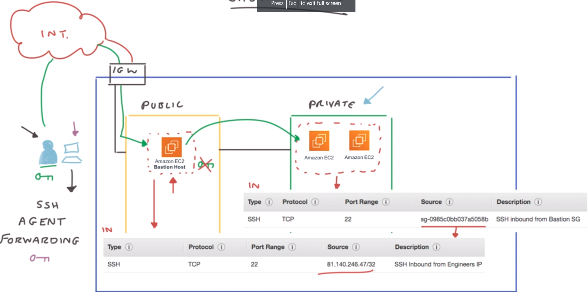

AWS CodeCommit
AWS CodeBuild\Jenkins CI
AWS CodeDeploy, 
AWS CloudFormation=> 
	Resources, 
	Parameters, 
	Outputs
	**CloudFormation StackSet:** Creat, update, delete CloudFormation stacks across multiple accounts and regions with single operation.
AWS CodePipeline
AWS Step Functions
**AWS Simple Workflow service(SWF):** if you need external signals to intervenet in the processes or child processes that return values to parent processes. 
Amazon Elastic MapReduce(EMR):
**AWS OpsWorks:** Managed Chef and Puppet: Allows you to perform server configuration automatically or repetitive actions. 
**AWS Elastic Transcoder:**
AWS workspaces:
AWS AppSync:
Cognito Sync:
Cost Explorer:

**CodeCommit:** service where you can store your code. Similar service is GitHub
**CodeBuild:** build and testing service in your CICD pipelines
**CodeDeploy:** deploy the packaged code onto EC2 and AWS Lambda
**CodePipeline:** orchestrate the actions of your CICD pipelines (build stages, manual approvals, many deploys, etc)
**CloudFormation:** Infrastructure as Code for AWS. Declarative way to manage, create and update resources.
**ECS (Elastic Container Service):** Docker container management system on AWS. Helps with creating micro-services.
**ECR (Elastic Container Registry):** Docker images repository on AWS. Docker Images can be pushed and pulled from there
**Step Functions:** Orchestrate / Coordinate Lambda functions and ECS containers into a workflow
**SWF (Simple Workflow Service):** Old way of orchestrating a big workflow.
**EMR (Elastic Map Reduce):** Big Data / Hadoop / Spark clusters on AWS, deployed on EC2 for you
**Glue:** ETL (Extract Transform Load) service on AWS
**OpsWorks:** managed Chef & Puppet on AWS
**ElasticTranscoder:** managed media (video, music) converter service into various optimized formats
**Organizations:** hierarchy and centralized management of multiple AWS accounts
**Workspaces:** Virtual Desktop on Demand in the Cloud. Replaces traditional on-premise VDI infrastructure
**AppSync:** GraphQL as a service on AWS
**SSO (Single Sign On):** One login managed by AWS to log in to various business SAML 2.0-compatible applications (office 365 etc)

**<u>AWS VM Import/Export</u>** enables you to easily import virtual machine images from your existing environment to Amazon EC2 instances and export them back to your on-premises environment.   
**<u>AWS Trusted Advisor:</u>**  An online resource to help you reduce cost, increase performance,and improve security by optimizing your AWS environment,Trust Advisor provides real time guidance to help you provison your resources following AWS best practices
<u>**AWS VPC Flow Logs**</u> is a feature that enables you to capture information about the IP traffic going to and from network interfaces in your VPC. Flow log data can be published to Amazon CloudWatch Logs and Amazon S3. After you've created a flow log, you can retrieve and view its data in the chosen destination.  

**<u>AWS Lambda:</u>**
	Function Policy
	Execution Policy
	Lambda Runtime API
	Lambda Container Image
	ECS
	Fargate
	CloudWatch Events EventBridge
	Execution Role
	Log Stream
	Execution Limits
	Deployment Limits
	SAM: Serverless application model
	**function policy** simply specifies which AWS resources are allowed to invoke your function. If I added an S3 as a trigger, and so Lambda automatically added the following function policy. The Function policy defines which AWS resources are allowed to invoke your function. 
	**role execution policies** determine what resources the function role has access to when the function is being run. 
	**Lambda: Networking section**: by default, AWS Lambda is only allowed to access resources that are accessible over the internet. For example, S3. Therefore, any resources that can only be accessed directly from within your VPC requires additional configuration. So this network section provides you with the capability of allowing your function to access your resources via your VPC. When configured, AWS Lambda assigns ENIs, which are Elastic Network Interfaces, to your resources using a private IP address. When this is configured like this, it's important to note that the previous default ability of accessing publicly accessible resources over the internet is removed.
And to overcome this you must attach the function to a private subnet which has access to a NAT instance or a NAT Gateway. Do not attach it to a public subnet. It should be within a private subnet for greater security and reduced exposure to external threats. Also, in addition to this, Lambda only assigns it a private ENI and not a public address. The network section allows you to add the following. VPC, so from here you can select the VPC that the function will need to access resources within. You could look at the subnets. And here you can select at least one subnet that the function can operate in within your VPC. For high availability and scalability, you really should add an additional subnet. Under security groups, here you can specify the security group for your function to use as a part of the VPC configuration. Once this information is added to your function, Lambda can then set up and configure ENIs as required to securely connect your VPC resources. 
You should also be aware of your limits on your selected subnets, as Functions will fail if those subnets run out of IP addresses or ENIs. An important point to be made aware of is that the execution role of Lambda will need to have specific permissions that allow it to operate within a VPC. And these include permissions that are required to configure the required ENIs, such as ec2:CreateNetworkInterface, ec2:DescribeNetworkInterfaces, and also ec2:DeleteNetworkInterface. 

​		

​		

​	Lambda Edge

​		

**DynamoDB:**
**A Global Secondary Index** is an index with a partition and sort key that can be different from those in the table. It is considered "global" because queries on the index can span all of the data in a table, across all partitions.
DynamoDB provides two commands for searching data on the table: scan and query. **A scan operation** examines every item on the table and returns all the data attributes for each one of them. When you initially navigate to the **Items** tab for a table, a scan is performed by default. 

**RDS subnet Group:** Amazon Relational Database Service (Amazon RDS) makes it easy to set up, operate, and scale a relational database in the cloud. Before launching actual RDS instances, you need to configure a DB Subnet Group.
==Subnets are segments of a VPC's IP address range that allow you to group your resources based on security and operational needs.== A DB Subnet Group is a collection of subnets (typically private) that you create in a VPC and designate for your DB instances. Each DB subnet group should have subnets in at least two Availability Zones in a given region. Note that SQL Server Mirroring with a SQL Server DB instance requires at least 3 subnets in distinct Availability Zones.
When creating a DB instance in a VPC, you must select a DB subnet group. Amazon RDS uses that DB subnet group and your preferred Availability Zone to select a subnet and an IP address within that subnet to associate with your DB instance. When Amazon RDS creates a DB instance in a VPC, it assigns a network interface to your DB instance by using an IP address selected from your DB Subnet Group. If the primary DB instance of a Multi-AZ deployment fails, Amazon RDS can promote the corresponding standby and subsequently create a new standby using an IP address from an assigned subnet in one of the other Availability Zones.
You can create an RDS Subnet Group using the RDS launch wizard.

**<u>Amazon Neptune:</u>** Used in Fraud Detection, Recommendation engine
	Database cluster volume
	Instances
	Storage
	Neptune Storage Auto Repair
	Cluster endpoint, Reader endpoint, Instance Endpoint

**Redshift:**
	Cluster
	Redshift engine
	Leader node
	Compute Node
		Node slice
		**<u>types:</u>** RA3-high performance nodes, Dense-legacy node types
	Massively Parallel processing(MPP)
	Columnar Data storage
	Result caching

**Quantum Ledger Database (QLDB):**
	

**DocumentDB:**
**Keyspaces:**

**Setting up Security Group Rules for Connecting to the RDS Instance:** You will use an EC2 instance to run queries against the RDS database in upcoming Lab Steps. In order to allow incoming traffic from EC2 instances to the RDS instance inside the same VPC. ==The rules of a Security Group control the inbound traffic that's allowed to reach the instances that are associated with the security group and the outbound traffic that's allowed to leave them. By default, security groups allow all outbound traffic and deny all inbound traffic.== You can add new rules to a VPC Security Group using the AWS Management Console.

**RDS Storage type:** 
***General Purpose (SSD)*** storage is suitable for a broad range of database workloads. Provides baseline of 3 IOPS/GiB and ability to burst to 3,000 IOPS.
***Provisioned IOPS (SSD)*** storage is suitable for I/O-intensive database workloads. Provides flexibility to provision I/O ranging from 1,000 to 80,000 IOPS.

**Starting an AWS Systems Manager Session Manager Browser Shell Session:** Session Manager is part of AWS Systems Manager suite of tools for gaining operational insights and taking action on AWS resources. Session Manager gives you browser-based shell access to EC2 instances running the Systems Manager agent. Both Windows and Linux instances are supported. Session manager provides secure access to instances without the need to distribute passwords or SSH keys. Session Manager also allows you to connect to instances without having to open any inbound ports. All communication is encrypted and IAM policies can restrict access to sessions running in Session Manager.

You will use Session Manager to start a session on an EC2 instance running in your Cloud Academy Lab environment in this Lab Step.

**Fan-Out Orders using Amazon SNS and SQS:** Fanning-out messages is a common technique to increase the scalability of background processing tasks. It involves publishing a message which is then consumed by multiple endpoints asynchronously. In AWS this can easily be achieved by combining the Amazon Simple Notification Service (Amazon SNS) with the Amazon Simple Queue Service (Amazon SQS). Learning how to implement a fan-out scenario will increase your ability to build scalable and resilient solutions using Amazon Web Services.

**Configuring a Static Website With S3 And CloudFront:** AWS doesn't recommend serving websites directly from Amazon S3. Instead, they recommend using Amazon S3 as an origin for a Content Delivery Network (CDN). A CDN pulls copies of the site from the origin and stores them in multiple global locations. The main benefit of using a CDN is lower latency for users when they access the site.
**Amazon CloudFront** is a global Content Delivery Network (CDN) that delivers data securely and efficiently. CloudFront pulls your website out to the edge of the network, reducing latency when accessed from different global locations. ==There are two main types of origin that Amazon CloudFront supports, Amazon S3 buckets, and custom origins.== A custom origin could be a website being served by an EC2 instance, or it could be a web server outside of AWS.

<u>**Key Management Service (KMS) terms:**</u> 
==**Customer Master Keys (CMK)**== - The primary resources in AWS KMS are customer master keys (CMKs). Typically ==you use CMKs to protect data encryption keys (or data keys) which are then used to encrypt or decrypt larger amounts of data outside of the service.== CMKs never leave AWS KMS unencrypted, but data keys can. AWS KMS does not store, manage, or track your data keys. There is one AWS-managed CMK for each service that is integrated with AWS KMS. When you create an encrypted resource in these services, you can choose to protect that resource under the AWS-managed CMK for that service. This CMK is unique to your AWS account and the AWS region in which it is used, and it protects the data keys used by the AWS services to protect your data.

==**Data keys** - Data keys are used encrypt large data objects within an application outside AWS KMS.== In the context of S3 server-side encryption using KMS keys, the application is S3 itself.

**Key rotation and Backing Keys** - When you create a customer master key (CMK) in AWS KMS, the service creates a key ID for the CMK and key material referred to as a backing key that is tied to the key ID of the CMK. If you choose to enable key rotation for a given CMK, AWS KMS will create a new version of the backing key for each rotation. It is the backing key that is used to perform cryptographic operations such as encryption and decryption. Automated key rotation currently retains all prior backing keys so that decryption of encrypted data can take place transparently. CMK is simply a logical resource that does not change regardless of whether or of how many times the underlying backing keys have been rotated.

**<u>Key Types:</u>** 
==**Symmetric:** A single encryption key that is used for both encrypt and decrypt operations==
==**Asymmetric:** A public and private key pair that can be used for encrypt/decrypt or sign/verify operations==

**<u>Server-Side Encryption with KMS Managed Keys (SSE-KMS):</u>** With your own CMK created and enabled you are now able to use it for server-side encryption of data in S3 in the same region as the CMK. This is referred to as ==server-side encryption with customer master keys (CMKs) stored in AWS Key Management Service or more simply SSE-KMS.== ==In SSE-KMS, the CMK generates data keys that S3 uses to encrypt objects.== Not only do users need to have access to the S3 bucket and object with SSE-KMS users must also have permission to use the CMK. In comparison to the other server-side encryption option for S3, server-side encryption with Amazon S3-managed keys (SSE-S3), the user only needs permission to access the object and does not require separate permission to use S3's underlying key. SSE-KMS provides a higher degree of control, although it requires additional charges for the key and for performing operations with the key. SSE-KMS also provides an additional audit trail showing when the CMK was used and by who.

If you do not create your own CMK, S3 can still use an AWS managed KMS CMK that is created by default in your account in the S3 bucket's region. This key is visible in the KMS console under AWS Managed Keys and is named aws/s3. However, because the key is managed by AWS you don't have the same degree of access control over key as you do with a customer managed key.

==**<u>Bucket policies</u>** are IAM policies applied to a bucket rather than to a user or role as is conventionally done with IAM policies.==

==**<u>AWS CloudTrail</u>** is a service that enables you to log, monitor, and capture <u>**API-related events**</u> across your AWS infrastructure and most AWS services.== Events that CloudTrail captures get delivered to an S3 bucket, and are also available for viewing from the CloudTrail console. CloudTrail captures, creates, modifies, and deletes API calls triggered from the console, API, command line tools, or even other AWS services. Optionally, CloudTrail can be configured to send events to CloudWatch as well (and this Lab does indeed tackle that, too). Typical use cases for CloudTrail, operating with CloudWatch, are monitoring, auditing, and security (governance, compliance, analysis).

It is important to know that CloudTrail is not a replacement for CloudWatch. It simply adds to the monitoring capabilities offered by AWS. Notice the focus for each service:

- ==CloudTrail focuses on API activity==
- ==CloudWatch focuses on performance monitoring and overall system health==

==**<u>AWS Identity and Access Management (IAM)</u>** enables you to securely control access to AWS services and resources for your users.== With IAM, you can centrally manage users, security credentials such as access keys, and permissions that control which AWS resources users can access.
==**<u>An IAM role**</u> is an IAM entity that has specific permissions.== An IAM role is similar to an IAM user in that you can manage its access to AWS resources using policies. IAM roles are attachable to other IAM services like AWS EC2 and AWS Lambda, to manage resource access for those services.
==In AWS, you can designate an IAM role to attach to an EC2 instance when launching the instance, or any time after. Attaching an IAM role to an instance allows you to manage permissions for instances centrally with IAM.==
==Instead of creating and distributing your AWS credentials,  you can use IAM roles to delegate permission for making API requests.== 
==**A security group** is a set of firewall rules that control the traffic for your instance.== On this page, you can add rules to allow specific traffic to reach your instance. For example, if you want to set up a web server and allow Internet traffic to reach your instance, add rules that allow unrestricted access to the HTTP and HTTPS ports. You can create a new security group or select from an existing one below 
==Amazon Linux AMIs typically use `ec2-user` as a username. Other popular Linux distributions use the following user names:==

- ==Debian: admin==
- ==RedHat: ec2-user==
- ==Ubuntu: ubuntu==

**<u>Auto Scaling Group,</u>**

==**Groups** Your EC2 instances are organized into groups so that they can be treated as a logical unit for the purposes of scaling and management.== When you create a group, you can specify its minimum, maximum, and desired number of EC2 instances. 
**Launch configurations** Your group uses a launch configuration as a template for its EC2 instances. When you create a launch configuration, you can specify information such as the AMI ID, instance type, key pair, security groups, and block device mapping for your instances. 
**Launch template** A launch template is similar to a launch configuration, in that it specifies instance configuration information. ... However, defining a launch template instead of a launch configuration allows you to have multiple versions of a template. With versioning, you can create a subset of the full set of parameters and then reuse it to create other templates or template versions.
==**Elastic Load Balancing (ELB)** automatically distributes incoming application traffic across multiple Amazon EC2 instances.== They enable you to achieve greater fault tolerance in your applications and seamlessly provide the correct amount of load balancing capacity needed in response to incoming application requests. ELB detects unhealthy instances within a pool and automatically reroutes traffic to healthy instances until the unhealthy instances have been restored. Elastic Load Balancers can be enabled within a single Availability Zone or across multiple zones for greater consistent application performance. The **network load balancer** is a network layer (layer-4) load balancer operating on TCP connections and UDP. It can scale to millions of requests per second. With a network load balancer, backend targets are organized into *target groups* which the network load balancer distributes traffic across. 

**<u>Types of Load Balancers:</u>**
**Application Load Balancer** when you need a flexible feature set for your web applications with HTTP and HTTPS traffic. Operating at the request level, Application Load Balancers provide advanced routing and visibility features targeted at application architectures, including microservices and containers.
**Network Load Balancer** when you need ultra-high performance, TLS offloading at scale, centralized certificate deployment, support for UDP, and static IP addresses for your application. Operating at the connection level, Network Load Balancers are capable of handling millions of requests per second securely while maintaining ultra-low latencies.
**Gateway Load Balancer** when you need to deploy and manage a fleet of third-party virtual appliances that support GENEVE. These appliances enable you to improve security, compliance, and policy controls.
**Classic Load Balancer** when you have an existing application running in the EC2-Classic network.

==**<u>Cross-Zone Load Balancing</u>** allows every load balancer node to distribute requests across all availability zones,== although for the Network Load Balancer there are data transfer charges when this feature is enabled. (There are no data charges for other types of load balancers)

<u>**Subnet**:</u> 
	segment VPC infrastructure into multiple different network 
	assigned at availability zone level
	

​		

<u>**Network Access Control Lists (NACLs)**:</u> 
	virtual network level firewall associated with subnet
	stateless

​		

<u>**Security Groups**:</u> 
	works at instance level in subnet
	no rule # or allow/deny in security group
	stateful

​			

<u>**NAT Gateway:**</u> 
	allows private instances to be able to access internet while blocking connections initiated from internet.
	 if you have multiple public subnets in different Availability Zones, you will need to set up another NAT gateway within that subnet as well. 
	allows OS is kept upto date
	patch management is taken care as well. 

​	

**<u>Bastion Hosts</u>**

**VPN & Direct Connect**
**VPC Peering**
**Transit Gateway**

<u>**Basic Networking Concepts**</u>
**Elastic IP Addresses (EIPs)**
**Elastic Network Interfaces (ENIs)**
**EC2 Enhanced Networking with the Elastic Network Adaptor (ENA)**
**VPC Endpoints**: ==VPC Endpoints allow you to privately access [AWS](https://cloudacademy.com/library/amazon-web-services/) services using the AWS internal network instead of connecting to such services via the internet using public DNS endpoints.== This means that you can connect to the supported services without configuring an Internet Gateway, NAT Gateway, a Virtual Private Network or a Direct Connect connection. 
There are 2 types of VPC Endpoints: Interface Endpoints and Gateway Endpoints. ==**<u>Interface Endpoints</u>** are essentially ENIs that are placed within a subnet that act as a target for any traffic that is being sent to a supported services and operates through the use of PrivateLink. **<u>PrivateLink</u>** allows a private and secure connection between VPCs, AWS services, and on-premises applications, via the AWS internal network.==
As an example of supported services, this list only shows a very small subset of what’s available via an Interface Endpoint.
One point to make is that when an interface endpoint is configured within your chosen subnet, the service that it is associated with is NOT able to initiate a connection through to your VPC, communication across this interface HAS to originate from within your VPC first before a response can be made by the service.
You might be wondering how you connect and make use of the endpoints, and the process is seamless to the end user when working with AWS services. When an interface endpoint is created for a service, a specific DNS hostname is created and is associated with a private hosted zone in your VPC. Within this hosted zone a record set for the default DNS name of the service is created resolving to the IP address of your interface endpoint. As a result, any applications using that service already does not need to be reconfigured, requests to that service using the default DNS name will now be resolved to the private IP address of the interface endpoint and will route through the internal AWS network instead of the internet.
==A **<u>Gateway Endpoint</u>** is a target that is used within your route tables to allow you to reach supported services, currently the only supported services using a Gateway Endpoint are Amazon S3 and DynamoDB,== but this like is likely to change over time to please ensure you check the latest supported services.
During the creation of your Gateway endpoint you will be asked which route tables within your VPC should be updated to add the new Target of the gateway endpoint. Any route table selected with then have a route automatically added to include the new Gateway Endpoint. The entry of the route will have a prefix list ID of the associated service (Amazon S3 or DynamoDB) and the target entry will be the VPC Endpoint ID, examples of these are shown on screen. You should also be aware that GateWay Endpoint only works with IPv4.

**AWS Global Accelerator**: Hello and welcome to this lecture covering the AWS Global Accelerator, which is a Global [AWS](https://cloudacademy.com/library/amazon-web-services/) service and therefore not tied to a specific region.

The ultimate aim of the AWS Global Accelerator is to get UDP and TCP traffic from your end user clients to your applications faster and quicker and more reliably, through the use of the AWS global infrastructure and specified endpoints, instead of having to traverse the public internet, which is not as reliable and carries a higher security risk.

Global Accelerator uses two static IP addresses associated with a DNS name which is used as a fixed source to gain access to your application which could be sitting behind a load balancer, such as a network or application load balancer, or directly connected to your EC2 instance or the Elastic IP address. These IP addresses can be mapped to multiple different endpoints, each operating in a different region if a multi-region application is deployed to enhance performance of routing choices.

Because the routing of your request is based across the AWS Global Infrastructure, Global Accelerator intelligently routes customers requests across the most optimized path using its global reach of edge locations, for the lowest latency and avoids any resources that are unhealthy. This helps to improve regional failover and high availability across your deployment.

To set up and configure AWS Global Accelerator there are effectively four steps to follow.

Firstly, you must create your accelerator and give it a name. You must also select if you want to use two IP addresses from AWS' pool of IP addresses or use your own. For each accelerator created, you must select two IP addresses.

Next, you need to create a listener. The listener is used to receive and process incoming connections based upon both the protocol and ports specified, which can either be UDP or TCP based.

Once your listener is created you must associate it with an endpoint group. Each endpoint group is associated with a different region, and within each group there are multiple endpoints. You can also set a traffic dial for the endpoint group, and this is essentially a percentage of how much traffic you would like to go to that endpoint group. And this helps you with blue and green deployments of your application to control the amount of traffic to specific regions. At the stage of adding your endpoint groups you can also configure health checks to allow the global accelerator to understand what should be deemed as healthy and unhealthy. 

Finally, you must associate and register your endpoints for your application. And this can either be an application load balancer, a network load balancer, an EC2 instance or an EIP. For each endpoint, you can also assign a weight to route the percentage of traffic to that endpoint in each of your endpoint groups.

Let me now provide a very quick demonstration to show you how this creation looks within the AWS Console.

Okay so I'm logged in to my AWS Management Console and I need to go to the Global Accelerator which is under the Network and Content Delivery category. So if I select the Global Accelerator, now at the moment I don't have any Global Accelerators configured. So from here I'll simply click Create Accelerator.

Now, to start with, I need to select a name for my accelerator. So let me just call this MyAccelerator. Now here we have the IP address type, which is IPv4, and then we have the IP address pool selection. And the default is to use Amazon's pool of IP addresses but if you want to use your own pool of addresses, then this is where you could change it. And also you can add any tags to this service if you need to.

So onto the next stage, this is where we add our listeners. So we can add in a port, for example, port 80. Either TCP or UDP as the protocol, and then you also have Client affinity here. And we can see that if you have state full applications, Global Accelerator can direct all requests from a user at a specific client IP address to the same endpoint resource to maintain client affinity. The default for this option is None. We don't need that for this demonstration, so I'm just gonna leave that as None. And if you want to add any more listeners, simply click on Add Listener, and fill in the relevant details.

For this demonstration, I'm just gonna leave it as the one listener. Once your listeners are configured as you need to, click on Next. And here we have our endpoint groups. Here you select your regions that you want your application to reside in. So, for example, I'll select the London region. And also we have our traffic dial, which as I explained previously, is essentially the percentage of traffic to this region. We can add additional endpoints, so we can have multiple regions if we want to. And you can keep going, add in more more regions. So let's go and remove those two, just leave it as the one region. If you select on the configure Health checks, then you can set your health check configuration as need be just so the AWS Global Accelerator knows what it deems as healthy.

Once you have set your health checks, then you can select Next. On the final stage we need to add our endpoints. So here we have our endpoint group, and we select add endpoint. Now we can either add an Application Load Balancer, Network Load Balancer, an EC2 instance or an Elastic IP address. For this example, I'm gonna select an EC2 instance. And I won't need to select the specific instance. I have one here called MyApplication. And again we have weight information, which directs the amount of traffic to each of your endpoint in your groups. I only have the single endpoint in this group, so I'm just gonna change that to 255. It can be from zero all the way to 255.

To add additional endpoints, simply click on Add endpoint. Select the endpoint that you'd like and then the related resource. I'm just gonna have the one endpoint in this endpoint group. And then once you've done that, simply click Create accelerator. And this would take a few minutes to configure itself and become active. And as you can see the status is in progress.

Also, as I explained earlier, we can see that this Global Accelerator has been given a DNS name, which results to this two static IP addresses. And these are the two IP addresses from the AWS pool of addresses. So that means you can add or change your endpoint groups and related endpoints in any of the regions without having to change the DNS name or the static IP addresses that it results to. So it's very easy to change and increase region availability and high availability for your Global Accelerator. And it's as simple as that.

<u>**DNS & Content Delivery on AWS**</u>
**Amazon Route 53**
**Amazon CloudFront**:[
Amazon CloudFront](https://cloudacademy.com/course/introduction-dns-content-delivery-aws/amazon-cloudfront/) is AWS's fault-tolerant and globally scalable content [delivery network service](https://cloudacademy.com/course/introduction-dns-content-delivery-aws/introduction/). It provides seamless integration with other Amazon Web Services services to provide an easy way to distribute content.

==Amazon CloudFront speeds up distribution of your static and dynamic content through its worldwide network of edge locations.== Normally, when a user requests content that you're hosting without a CDN, the request is routed back to the source web server which could reside in a different continent to the user initiating the request. However, if you're using CloudFront, the request is instead routed to the closest edge to the user's location which provides the lowest latency to deliver the best performance through cached data.

So essentially Amazon CloudFront acts as a content delivery network service, which provides a means of distributing the source data of your web traffic closer to the end-user requesting the content via AWS edge locations as cached data. As this data is cached, after a set period, this cached data will expire and so AWS CloudFront doesn't provide durability of your data. Instead, it distributes the source data which resides on durable storage, such as Amazon S3.

AWS edge locations are sites deployed in major cities and highly populated areas across the globe. While edge locations are not used to deploy your main infrastructure, such as EC2 instances or EBS storage, they are used by [AWS](https://cloudacademy.com/library/amazon-web-services/) services such as AWS CloudFront to cache data and reduce latency for end user access. For example, you may have your website hosted on EC2 instances or S3 within the Ohio region, with an associated CloudFront distribution. When a user accesses your website from Europe, they would then be redirected to their closest edge location in Europe, where cached data could be read off your website. This significantly reduces latency.

==CloudFront uses distributions to control which source data it needs to redistribute and to where.== These distributions can be configured as one of two different delivery methods. ==Firstly, a web distribution and this type of distribution is used if you want to speed up distribution of static and dynamic content==, for example, .html, .css, .php, and graphics files, distribute media files using HTTP or HTTPS, add, update, or delete objects, and submit data from web forms, and use live streaming to stream an event in real-time. Alternatively, ==you can create an RTMP distribution, which is used if you want to distribute streaming media with the Adobe Flash media service RTMP protocol.== The benefit of using RTMP distribution is that your end user can start viewing the media before the complete file has been downloaded from the edge location. The source data for an RTMP distribution can only exist within an S3 bucket and not an EC2 web server.

==When configuring your distributions, you will be required to enter your origin information==, this is essentially where the distribution is going to get the data to distribute across edge locations and it will be the DNS name of the S3 bucket or the HTTP server. If the origin is an S3 bucket, then it can be selected from a drop-down list. If you are using S3 as a static website you must enter the static hosting website endpoint.

==If using an S3 bucket as your origin, then== for additional security ==you can create a CloudFront user called an origin access identity, known as OAI, which can be associated with your newly created distribution.== ==This== simply ==ensures that only this OAI can access and serve content from your bucket and therefore preventing anyone circumventing your CloudFront distribution by accessing the files directly in the bucket using the object URL.==

==You will also be required to select a host of different caching behavior options, defining how you want the data at the edge location to be cached== via various methods and policies. ==Lastly, you will define the distribution settings themselves, and this will look at which edge locations you want your data to be distributed to,== which can either be US, Canada, and Europe, US, Canada, Europe, and Asia, or all edge locations for the best performance. ==You can also define if you want your distribution to be associated to a web application firewall access control list for additional security and web application protection.== For more information on AWS WAF, please see the following [course](https://cloudacademy.com/course/protecting-web-apps-aws-waf-shield-firewall-manager/introduction/). In addition to using a web application firewall access control list, ==you can also implement additional encryption security by specifying an SSL certificate that must be used with a distribution.==

==Once your distribution is configured, you simply enable the distribution for it to be created.== When content from your website is accessed, the end-user will be directed to their closest edge location in terms of latency, to see if the content is cached by CloudFront at that edge location. If the content is there, the user will access the content from the edge location instead of the origin, therefore reducing latency. If the content is not there, or the cache has expired for that content at the edge location, then CloudFront will request the content from the source origin again. This content will then be used to maintain a fresh cache for any future request until it again expires.

**Introduction to Amazon EBS and EC2 Instance Storage**

**AWS Storage Services:**
Hello, and welcome to this very quick lecture where I want to give a brief introduction as to why there are so many different AWS storage services to choose from. As we know, more and more organizations are moving and migrating to the cloud, for the many benefits the cloud brings, such as flexibility, scalability, cost efficiencies, security, and more. AWS offers many different services that allows for almost any migration of a solution or new solution to exist, and take advantage of these benefits. This means that from a foundational and infrastructure as a service perspective, AWS has to provide services, components, and features that provide these core infrastructure elements, covering compute, storage, database, and network, and AWS does this very well. This course is going to focus on the storage element of these components. 

So, why does AWS provide so many different storage services, if all you need to do is store your data in the cloud? Well, it's effectively the same reasons why you have range of storage products and solutions in your own on-premise environment. For example, you are likely using different storage devices, such as a storage area network, known as a SAN, network attached storage, known as a NAS, directly attached storage, and also taped backup, to name but a few. Now, for this course, it's not important to understand in detail what each of these solutions are and do, however, the point I'm trying to make here is that they all perform the same function, the ability to store data. But at the same time, each solution also provides different benefits and features, such as cost variants, storage capacity, security features, such as encryption and access control, varied levels of durability and availability, different read/write speeds, different accessibility options, different media types, some can be auditable and traceable, and also use case, such as backup and file storage. 

AWS is fully aware that not all of your data is to be treated exactly the same and that sometimes, data can require very specific requirements. This is the reason why AWS has so many different storage services available, to allow you to select the most appropriate service for your needs. Understanding which AWS storage can provide these features and more is critical to being able to select the most appropriate service, allowing you to implement an effective and efficient solution. Data storage can be categorized between block, file, and object storage. So, what's the difference between these and AWS? 

Block storage. Block storage stores the data in chunks of data known as blocks, and these blocks are stored in a volume, and attached to a single instance. They generally provide very low latency, and can be considered similar to your directly attached disks within your own data center. 

File storage. Your data is stored as separate files within a series of directories, forming a data structure hierarchy. The data is then stored on top of a file system, and provides shared access, allowing for multiple users to access the data. File storage in AWS can be associated to your network attached storage systems you may have in your own data center. 

Object Storage. Each object does not conform to a data structure hierarchy. Instead, it exists across a flat address space, and is referenced by a unique key. Each object can also have associated metadata to help categorize and identify the object. Now that you have an understanding of why AWS has curated and developed a range of storage services for you to select, let me know start by introducing each of these services to provide information on exactly what the service is and does, and highlighting its key features, and when and why you might select the service.

**EC2 Instance Storage:**
Hello, and welcome to this lecture covering EC2 Instance Level Storage. Which is referred to as an instance store volume. The first point to make about EC2 instance store volumes, is that the volumes physically reside on the same host that provides your EC2 instance itself, acting as local disc drives, allowing you to store data locally to that instance. Up until now within this course we have discussed persistent storage options. But instance store volumes provide ephemeral storage for you EC2 instances. 

Ephemeral storage means that the block level storage that it provides offers no means of persistency. Any data stored on these volumes is considered temporary. With this in mind, it is not recommended to store critical or valuable data on these ephemeral instance store volumes, as it could be lost, should an event occur. By an event, let me explain under what conditions that your data would be lost, should it be stored on one of these volumes. 

If your instance is either stopped or terminated, then any data that you have stored on that instance store volume associated with this instance will be deleted without any means of data recovery. However, if your instance was simply rebooted, your data would remain intact. Although, you can control when your instances are stopped or terminated, giving you the opportunity to either back-up the data or move it to another persistent volume store, such as the elastic block store service. Sometimes this control is not always possible. Let's consider you had critical data stored on an ephemeral instance store volume and then the underlying host that provided your EC2 instance and storage failed. You had no warning that this failure was going to occur, and as a result of this failure, the instance was stopped or terminated. Now all of your data on these volumes is lost. When a stop and start, or termination occurs, all the blocks on the storage volume are reset, essentially wiping data. So, you might be thinking, why use these volumes? What use do they have if there is a chance that you are going to lose data? They do, in fact, have a number of benefits. 

From a cost perspective, the storage used is included in the price of the EC2 instance. So, you don't have an additional spend on storage cost. The I/O speed on these volumes can far exceed those provided by the alternative instance block storage, EBS for example. When using store optimized instance families, such as the I3 Family, it's potentially possible to reach 3.3 million random read IOPS, and 1.4 million write IOPS. With speeds like this, it makes it ideal to handle the high demands of no SQL databases. However, any persistent data required would need to be replicate or copied to a persistent data store in this scenario. Instance store volumes are generally used for data that is frequently changing; that doesn't need to be retained, as such, they are great to be used as a cache or buffer. They are also commonly used for service within a load balancing group, where data is replicated across the fleet such as a web server pool. 

Not all instance types support instance store volumes. So, if you do have a need where these instance store volumes would work for your use case, then be sure to check the latest AWS documentation to ascertain if the instance type you're looking to use supports the volume. The size of your volumes, however, will increase as you increase the EC2 instance size. 

From a security stance, instance store volumes don't offer any additional security features. As to be honest, they are not separate service like the previous storage options I have already explained. They are simply storage volumes attached to the same host on the EC2 instance, and they are provided as a part of the EC2 service. So, they effectively have the same security mechanisms provided by EC2. This can be IIM policies dictating which instances can and can't be launched, and what action you can perform on the EC2 instance, itself. If you have data that needs to remain persistent, or that needs to be accessed and shared by others, then EC2 instance store volumes are not recommended. If you need to use block level storage and want a quick and easy method to maintain persistency, then there is another block level service that is recommended. This being the elastic block store service.

**Amazon Elastic Block Store(EBS):
In this lecture, I shall be talking about the [Amazon Elastic Block Store](https://cloudacademy.com/course/introduction-to-amazon-elastic-block-store-ebs-1060/course-introduction/) service, known as EBS, which provides storage to your EC2 instances via EBS volumes, which offer different benefits to that of instance store volumes used with some EC2 instances.

EBS provides persistent and durable block level storage. As a result, EBS volumes offer far more flexibility with regards to managing the data when compared to data stored on instance store volumes. EBS volumes can be attached to your EC2 instances, and are primarily used for data that is rapidly changing that might require a specific Input/Output operations Per Second rate, also known as IOPS.

EBS volumes are independent of the EC2 instance, meaning that they exist as two different resources. They are logically attached to the instance instead of directly attached like instance store volumes. From a connectivity perspective, only a single EBS volume can only ever be attached to a single EC2 instance. However, multiple EBS volumes can be attached to a single instance.

Due to the EBS ability to enforce persistence of data, it doesn't matter if your instances are intentionally or unintentionally stopped, restarted, or even terminated, the data will remain intact when configured to do so. EBS also offers the ability to provide point in time backups of the entire volume as and when you need to. These backups are known as snapshots and you can manually invoke a snapshot of your volume at any time, or use Amazon CloudWatch events to perform an automated schedule of backups to be taken at a specific date or time that can be recurring.

The snapshots themselves are then stored on Amazon S3 and so are very durable and reliable. They are also incremental, meaning that each snapshot will only copy data that has changed since the previous snapshot was taken. Once you have a snapshot of an EBS volume, you can then create a new volume from that snapshot. So, if for any reason you lost access to your EBS volume through or incident or disaster, you can recreate the data volume from an existing snapshot and then attach that volume to a new EC2 instance. To add additional flexibility and resilience, it is possible to copy a snapshot from one region to another.

Looking at the subject of high availability and resiliency, your EBS volumes are, by default, created with reliability in mind. Every write to a EBS volume is replicated multiple times within the same availability zone of your region to help prevent the complete loss of data. This means that your EBS volume itself is only available in a single availability zone. As a result, should your availability zone fail, you will lose access to your EBS volume. Should this occur, you can simply recreate the volume from your previous snapshot and attach it to another instance in another availability zone.

There are two types of EBS volumes available. Each have their own characteristics. These being SSD backed storage, solid state drive, and HDD backed storage, hard disk drive. This allows you to optimize your storage to fit your requirements from a cost to performance perspective.

SSD backed storage is better suited for scenarios that work with smaller blocks. Such as databases using transactional workloads. Or often as boot volumes for your EC2 instances. Whereas HDD backed volumes are designed for better workloads that require a higher rate of throughput, such as processing big data and logging information. So, essentially working with larger blocks of data.

These volume types can be broken down even further. Looking at the following table we can see how different volumes can be used for both SSD and HDD volumes types.

You can see that depending on the use case for your EBS volume you can select the most appropriate type. Each of these volumes also offer different performance factors which include: Volume size, Max IOPS per volume, Max throughput per volume, Max IOPS per instance, Max Throughput per instance, and Dominant performance.

The performance of volumes change frequently and so for the latest information on these volume types, please refer to the [AWS](https://cloudacademy.com/library/amazon-web-services/) documentation found [here](https://docs.aws.amazon.com/AWSEC2/latest/UserGuide/ebs-volume-types.html).

For those who are not familiar with provisioned IOPS (input/output operations per second) volumes, they deliver enhanced predictable performance for applications requiring I/O intensive workloads. When working with these volumes you also have the ability to specify at IOPS rate during the creation of a new EBS volume, and when the volume is attached to an EBS-optimized instance, EBS will deliver the IOPS defined and required within 10%, 99.9% of the time throughout the year.

The throughput optimized HDD volumes are designed for frequently accessed data and are ideally suited to work well with large data sets requiring throughput-intensive workloads, such as data streaming, big data, and log processing. These volumes will deliver the expected throughput 99% of the time over a given year, and an important point to make is that these volumes can’t be used as boot volumes for your instances.

The cold HDD volumes offer the lowest cost compared to all other EBS volumes types. They are suited for workloads that are large in size and accessed infrequently. They will deliver the expected throughput 99% of the time over a given year, and again, it is not possible to use these as boot volumes for your EC2 instances.

One great feature of EBS is its ability to enhance the security of your data, both at rest and when in transit, through data encryption. This is especially useful when you have sensitive data, such as personally identifiable information, stored in your EBS volume. And in this case, you may be required to have some form of encryption from a regulatory or governance perspective. EBS offers a very simple encryption mechanism. Simple in the fact that you don't have to worry about managing the data keys to perform the encryption process yourself. It's all managed and implemented by EBS. All you are required to do is to select if you want the volume encrypted or not during its creation via a checkbox.

The encryption process uses the AES-256 encryption algorithm and provides its encryption process by interacting with another AWS service, the key management service, known as KMS. KMS uses customer master keys, CMKs, enabling the encryption of data across a range of AWS services, such as EBS in this instance.

To learn more about the Key Management Service, please see our existing course [here](https://cloudacademy.com/course/amazon-web-services-key-management-service-kms/kms-encryption-introduction/).

Any snapshot taken from an encrypted volume will also be encrypted, and also any volume created from this encrypted snapshot will also be encrypted. You should also be aware that this encryption option is only available on selected instance types.

One final point to make on EBS encryption is that you can create a default region setting that ensures that all EBS volumes created will be encrypted by default.

For a detailed overview of exactly how this encryption process works, please take a look at the following [blog post](https://cloudacademy.com/blog/how-to-encrypt-an-ebs-volume-the-new-amazon-ebs-encryption/).

As EBS volumes are separate to EC2 instances, you can create an EBS volume in a couple of different ways from within the management console. During the creation of a new instance and attach it at the time of launch, or from within the EC2 dashboard of the AWS management console as a standalone volume ready to be attached to an instance when required. When creating an EBS volume during an EC2 instance launch, at step four of creating that instance, you are presented with the storage configuration options. Here you can either create a new blank volume or create it from an existing snapshot. You can also specify the size and the volume type, which we discussed previously. Importantly, you can decide what happens to the volume when the instance terminates. You can either have the volume to be deleted with the termination of the EC2 instance, or retain the volume, allowing you to maintain the data and attach it to another EC2 instance. Lastly, you also have the option of encrypting the data if required.

You can also create the EBS volume as a standalone volume. By selecting the volume option under EBS from within the EC2 dashboard of the management console, you can create a new EBS volume where you'll be presented with the following screen.

Here you will have many of the same options. However, you can specify which availability zone that the volume will exist in, allowing you to attach it to any EC2 instance within that same availability zone. As you might remember, EBS volumes can only be attached to EC2 instances that exist within the same availability zone.

EBS volumes also offer the additional flexibility of being able to resize them elastically should the requirement arise. Perhaps you're running out of disk space and need to scale up your volume. This can be achieved by modifying the volume within the console or via the AWS CLI. You can also perform the same resize of the volume by creating a snapshot of your existing volume, and then creating a new volume from that snapshot with an increased capacity size.

As we can see, EBS offers a number of benefits over EC2 instance store volumes. But EBS is not well suited for all storage requirements. For example, if you only needed temporary storage or multi-instance storage access, then EBS is not recommended, as EBS volumes can only be accessed by one instance at a time. Also, if you needed very high durability and availability of data storage, then you would be better suited to use Amazon S3 or EFS, the elastic file system.

That now brings me to the end of this lecture and to the end of this introductory course and you should now have a greater understanding of the Amazon Elastic Block Store service and how it can be used as a storage option for your EC2 instances.

If you have any feedback, positive or negative, please do contact us at [support@cloudacademy.com](mailto:support@cloudacademy.com). Your feedback is greatly appreciated. Thank you for your time and good luck with your continued learning of cloud computing. Thank you.

**Understanding the Costs of Amazon S3**
Hello and welcome to this lecture. Let me start by providing a high-level overview of Amazon S3 and Glacier. Amazon S3 is a fully managed object-based storage that is highly available, highly durable, very cost-effective, and widely accessible. S3 is also promoted as having unlimited storage capabilities making this service extremely scalable, far more scalable than your own on-premise storage solutions could ever be.

Amazon Glacier is an extremely low cost, long-term, durable storage solution which is often referred to as cold storage, ideally suited for long-term back up and archival requirements. It's capable of storing the same data types as Amazon S3 effectively any object. However, it does not provide instant access to your data.

To understand the costs associated with S3 and Glacier I will start by looking at the storage classes available to you when storing data. Over the years there has been a number of changes to these services including an array of additional storage classes.

Each class offers different attributes to fit specific needs, such as the number of availability zones used to store your object data, the minimum storage duration (in days), the minimum billable object size, durability and availability percentages, and retrieval times and fees, etc. As you can see from this chart, as of January 2020 there are 6 different storage classes.

Using this table, we can clearly see the differences between each of them. [AWS](https://cloudacademy.com/library/amazon-web-services/) summarises each of these storage classes as follows: 

- ==**S3 Standard** - General purpose storage for any type of data, typically used for frequently accessed data==
- ==**S3 Intelligent - Tiering** - Automatic cost savings for data with unknown or changing access patterns==
- ==**S3 Standard - Infrequent Access** - For long-lived but infrequently accessed data that needs millisecond access==
- ==**S3 One Zone - Infrequent Access** - For re-creatable infrequently accessed data that needs millisecond access==
- ==**S3 Glacier** - For long-term backups and archives with retrieval option from 1 minute to 12 hours==
- ==**S3 Glacier Deep Archive** - For long-term data archiving that is accessed once or twice in a year and can be restored within 12 hours==

For those curious with the ‘automatic cost-saving’ feature of intelligent tiering, let me provide a high-level overview of its operation. Depending on data access patterns of objects in the intelligent-tiering class, S3 will move the objects between two different tiers, these being, frequent and infrequent access. These tiers are a part of the intelligent tiering class itself and are separate from existing classes. When objects are moved to intelligent tiering, they are placed within the ‘frequent access’ tier. If an object is not accessed for 30 days, then AWS will automatically move that object to the cheaper tier, known as the 'infrequent access tier’. Once that same object is accessed again, it will automatically be moved back to the ‘frequent tier’.

When selecting your class for your data you need to ask yourself the following questions which will help you identify which storage class you should be using, and in turn, help you identify the most cost-effective option: How critical is the data? How reproducible is the data, so can it easily be created again if need be? What is the access pattern of the data likely to be? Will latency a factor when accessing the object? Answering these questions will help you to establish which options are viable and which are not.

Another point to bear in mind is that some of these storage classes have a tiered pricing structure, what do I mean by this? Well for the Standard and S3 Intelligent storage class your costs vary depending on how much data is stored within a single month. As you can see from the table below (based on the London region) for the Standard storage, your price is reduced as you add more and more data within the same month.

A similar pricing structure exists for the Intelligent-tiering too as shown, specifically for the frequent access tier, but take note, you are also charged a monitoring and automation fee which covers the cost for intelligently and automating the movement of objects between different classes.

For all other storage classes, a flat rate exists regardless of how much you store, this can be seen here.

Using the right storage class is one way to optimize your costs, however, reviewing the profile of your data might not be the only factor when optimizing the cost of your storage. You should also be familiar with request and data retrieval costs, data transfer costs and also management and replication costs. So let’s take a look at each of these in a bit more detail and how they impact your costs, starting with request and data retrieval costs.

Firstly, let me look at the request costs. Requests can be split into the following main request types:

- PUT
- COPY
- POST
- LIST
- GET
- SELECT
- Lifecycle Transition

These requests themselves are split into 3 categories, each with a different price point, but all are costed per 1000 requests. This table shows the request costs from the London region for each storage class. Do bear in mind that both the DELETE and CANCEL requests are free. 

Now from a retrieval perspective, the costs are very different, specifically when we look at S3 Glacier and S3 Glacier Deep Archive. Instead of basing the costs on per 1000 requests, the cost is associated on a per-gigabyte basis. As you can see in the table there are no retrieval costs for the S3 standard and intelligent tiering classes and $0.01 cost per GB for Infrequent access and one-zone infrequent access. However, when we get to the Glacier classes, the costs are expanded depending on which data retrieval method you use.

Expedited. This is used when you have an urgent requirement to retrieve your data but the request has to less than 250 MB. The data is then made available to you in one to five minutes.

Standard. This can be used to retrieve any of your archives no matter their size, but your data will be available in three to five hours. So it takes much longer than the Expedited option. 

Bulk. This option is used to retrieve petabytes of data at a time. However, this typically takes between five and twelve hours to complete. This is the cheapest of the retrieval options. So it really depends on how much data and how quickly you need it as to the retrieval speed and cost to you made by your retrieval option.

Provisioned Capacity Unit. Finally, this option allows you to pay an upfront fee within a month at a fixed cost to expedite data retrievals from Glacier vaults. This is typically used if you have a lot of data stored in Glacier and you are planning to perform a greater than usual amount of retrievals within a given month within a quick retrieval time. A similar breakdown exists for Glacier Deep archive as well for its Standard and Bulk retrieval fees.

Data Transfer Costs. It can be difficult to understand what data transfer costs will be incurred when storing data on Amazon S3, and it really depends on how and where you are transferring data to and from. Let me try and break it down for clarity.

Firstly, let’s look at when it’s free to transfer data into and out of Amazon S3 (Please note this excludes S3 Transfer Acceleration, which I will cover separately). Data transfer is free when:

- Data is transferred INTO Amazon S3 From the internet.
- Data is transferred OUT to your EC2 instances which reside in the same Region as the source S3 bucket in which the data is located.
- Data is transferred OUT to Amazon CloudFront.

When looking at transferring data OUT, the following costs apply when transferring out to the internet (again, this is taken from the London region). As you can see, the more you transfer out per month, the cheaper and more cost-effective the data transfer rates become. When transferring out to other AWS services, other than Amazon CloudFront, which is free, costs are charged at a per-gigabyte rate. For London, this is a flat rate across all services as of January 2020 at $0.02 per gigabyte.

Transfer Acceleration. When we look at Transfer acceleration, the pricing structure for transfer costs changes and this is largely due to the fact that your data is routed through an optimized network path to Amazon S3 via CloudFront edge locations.

Whereas normal data transfer into amazon S3 is free from the internet, with transfer acceleration, this is a cost associated per gigabyte dependant on which edge location is used. Also, there is an increased cost for any data transferred OUT of S3, either to the internet or to another Region, again due to the edge location acceleration involved.

Management and Replication. The final element of cost association with Amazon S3 and associated Glacier tiers relates to Management and replication of your data. From an S3 management perspective, there are three different features that if enabled on your bucket have an associated cost for each. These features are:

- Amazon S3 inventory (Used for auditing and reporting for replication and encryption actions). This feature is priced per million objects listed.
- Analytics, which is used to analyze access patterns to assist in ensuring you are using the right storage class for your objects. This feature is priced per million objects monitored per month.
- Object tagging, which is using tags allows you to categorize your storage. This feature is priced per 10,000 tags applied per month.

The pricing shown reflects the current London region pricing at the time of recording this course.

S3 Batch Operations. Batch operations allow you to carry out management operations across millions or even billions of your S3 Objects at the same time using a single API or by using the S3 Management Console.

Batch operations also integrate with AWS CloudTrail to monitor all changes made using the APIs selected. It also includes the ability to notify you when specific events occur and provide a completion report keeping you aware of the progress of your batch changes.

Being able to run huge batch management across your data storage in S3 can save you a huge amount of time by trying to develop other alternate methods in trying to achieve the same result. It’s also compatible with AWS Lambda, allowing you to run your functions across billions of objects at once.

Pricing for this feature has two price points, firstly on per batch job, and secondly per million object operations performed.

S3 and Glacier Select. S3 and Glacier select is available with all storage classes except Glacier Deep Archive. Select allows you to use SQL expressions to retrieve only the data that you want from your objects instead of the whole objects which could be many gigabyes in size. This enables you to retrieve the data faster and cheaper!

Again, there are 2 price points related to Select: data scanned (per GB) and data returned (per GB). And much like when we looked at retrieval costs, Glacier is broken down into the 3 different retrieval modes: Expedited, Standard and Bulk.

Replication. There are 2 different modes for S3 replication: CRR - Cross-Region Replication between 2 different buckets and SRR - Same-Region Replication between 2 different buckets. There are no specific costs for the use of the S3 replication feature itself, instead, you are simply charged for the cost for the storage class in your destination where your replicated objects will reside. You will also incur costs for any COPY and PUT requests which will also be based upon the rates of the destination region. When using Cross-Region replication, there will also be the addition of the inter-region data transfer fees, which will be priced upon the source region.

S3 Replication Time Control. S3-RTC is an advanced feature built on top of S3 replication that provides an SLA of ensuring that 99.9% of objects are replicated within 15 minutes of the start of the upload. This process can be monitored through the use of CloudWatch metrics (which are charged separately), however, the cost to use S3-RTC is currently set at a flat rate across all regions as shown.

Data Management controls. The final point I want to make about Amazon S3 and cost optimization is both Versioning and Life Cycle policies, both of which can have an impact on your overall costs.

Versioning. When you enable versioning on a bucket it allows for multiple versions of the same object to exist. This is useful to allow you to retrieve previous versions of a file or recover from some accidental deletion, or indeed intended malicious deletion of an object. Versioning is not enabled by default, however, once you have enabled it, versioning will be an added cost to you as you are storing multiple versions of the same object and as we know, the Amazon S3 cost model is based on actual usage of storage.

Lifecycle Policies. Amazon S3 lifecycle rules provide an automatic method of managing the life of your data while it is being stored within a particular storage class. By adding a lifecycle rule to a bucket you are able to configure and set specific criteria that can automatically move your data from one storage class to another, or delete it from S3 altogether. You may want to implement these measures as a cost-saving exercise, by moving data to a cheaper storage class after a set period of time. Or perhaps you may only be required to keep some data for a set period of time, for example, 90 days, before it can be deleted, by setting up a life cycle policy you can configure a bucket to automatically delete anything older than 90 days.

Ok, so now we have reviewed the wide variety of charges that can be incurred when using Amazon S3 and Glacier. Some of these you may already be familiar with, some might have been new to you.

The main points of consideration when trying to optimize your storage costs when using these services focus on the following:

- Storage class (Priced per GB of storage): You need to understand the profile of your storage, its access patterns, its criticality, availability and if latency plays a factor when accessing the data. Understanding more about your data will help you to optimize the most cost-efficient storage class. For example, it would be an unnecessary cost to store your secondary backup of on-premise data to the S3 Standard storage class, instead, it would make more financial sense to use the infrequent access or one-zone infrequent access storage class.
- Data requests (Priced per 1000 requests): This requires you to again understand the data request patterns of your objects to allow you to gain a comprehensive understanding of your predicted costs. Identify who or what is going to be accessing your data and how often.
- Retrieval requests (Priced per GB retrieved): This element plays a much bigger factor when utilizing S3 Glacier and Glacier Deep Archive due to the different retrieval methods when using these services. Your chosen method will be very dependant on how quickly you need to retrieve your data, the quicker you need it, the more you will pay.

Sometimes there can be confusion between Data requests, such as a GET request and data retrieval. The key difference here is to understand that a GET Request is simply the process of requesting a file retrieval, priced per 1000 requests, whereas data retrieval is charged per GB of the actual data being retrieved.

- Data Transfer (Priced per GB): Once your data is in Amazon S3, what do you intend to do with it? Will it simply be kept there for cold storage, for example in Glacier or Deep Archive, or will it be shared across numerous applications and services and transferred out to different regions? If you plan to transfer data from S3 out from your bucket to EC2 instances for example, then ensure you architect your infrastructure so that those EC2 instances or Buckets are in the same region as each other to take advantage of the free data transfer. Understand where your data is being transferred to and from, as this could help you optimize your costs. Before using transfer acceleration, do you actually need it, is it worth the additional cost? Can you architect your infrastructure through the use or regions better to remove the need of using transfer acceleration?
- Management Operations: S3 offers some great management features, and it can be easy to select these options when storing your data, but ONLY if it’s going to provide a positive impact and financially viable. Again, it comes down to understanding the data profile of your objects.
- Replication: Depending on your design, service and resiliency needs you may need to adopt a level of replication, and when doing so be mindful of the fact you will be charged for storage and requests made in the destination bucket, plus any additional costs if using replication time control.
- Data Management controls: Be aware of the additional costs that are incurred when versioning is enabled on a bucket. Make use of lifecycle policies to automatically move or delete your data based upon your own data policies, this could lead to significant savings.

One final note before I finish this lecture, please ensure that you check all the latest prices on the official AWS Amazon S3 pricing page when designing your solutions.

------

<u>**01 Introduction - AWS Certified Solutions Architect Associate**</u>
<u>**02 Code & Slides Download**</u>
<u>**03 Getting started with AWS**</u>
<u>**04 IAM & AWS CLI**</u>
<u>**05 EC2 Fundamentals**</u>
<u>**06 EC2 - Solutions Architect Associate Level**</u>
<u>**==07 EC2 Instance Storage==**</u>
==The Elastic File System service uses the NFS protocol for its file systems. Security groups associated with NFS file systems need to allow access to port **2049** for the allowed entities:==
==Update the ownership of the efs folder to the ec2-user using the following command: sudo chown ec2-user efs/==

<u>**==08 High Availability and Scalability_ ELB(Elastic load balancer) & ASG(Auto scaling group)==**</u>
Health checks ensure your ELB won't send traffic to unhealthy (crashed) instances
Elastic load balancer

| Elastic Load Balancing types | Network load balancer                                        | **Application load balancer**                                | Gateway load balancer                         | Classic load balancer                                        |
| ---------------------------- | ------------------------------------------------------------ | ------------------------------------------------------------ | --------------------------------------------- | ------------------------------------------------------------ |
|                              | Operates at connection level(layer 4 of OSI model) Supports TCP health check | operates at request level operates at the application layer(layer 4 of the OSI model) Supports http, https health checks |                                               | operates at both connection and request level Supports TCP health check |
| Protocol supported           | TCP                                                          | http, https, websocket, does not support TCP                 |                                               |                                                              |
|                              | does not support path-based routing and host-based routing   | ==support path-based routing, host-based routing==, and support for containerized applications |                                               | does not support path-based routing and host-based routing   |
|                              | Routes traffic to targets within VPC exposes a public static IP address | can route to different target groups based on hostname, request path, source ip but not geography.  exposes a static DNS(URL) |                                               | exposes a static DNA(URL)                                    |
| Used when                    | ==extreme performance and static IP is needed for your application== | you need flexible application management and TLS termination |                                               | your application is built within the EC2 Classic network     |
| Protocol listeners           | TCP\UDP\TLS                                                  | ==HTTP\HTTPS\gRPC==                                          | IP                                            | HTTP\HTTPS\TCP\SSL\TLS                                       |
| Use cases                    | ==Handling millions of requests per second while maintaining ultra low latencies== | For web apps, microservices and containers                   | Running third party virtual appliances in AWS | For legacy applications in AWS, for implementing custom security policies and TCP passthrough configuration |

****
​    **Cross-Zone Load Balancing**
​        allows every load balancer node to distribute requests across all 
​        availability zones, although for the Network Load Balancer 
​        there are data transfer charges when this feature is enabled.

The capacity of your ASG cannot go over the maximum capacity you have allocated during scale out events
If the ASG has been configured to leverage the ALB health checks, unhealthy instances will be terminated
You can create a CloudWatch custom metric and build an alarm on this to scale your ASG
==If you have a web application hosted in EC2 and managed by an ASG and you are exposing this application through an Application Load Balancer, you would configure the EC2 instance security group to ensure only the ALB can access the port 80 by opening EC2 security on port 80 to ALB's security group.==
==**SNI (Server Name Indication)** is a feature allowing you to expose multiple SSL certs if the client supports it.== Read more here: https://aws.amazon.com/blogs/aws/new-application-load-balancer-sni/
==The Default Termination Policy for ASG is that it tries to balance across AZ first, and then delete based on the age of the launch configuration.==
**Cross Zone Load Balancing**

| Scaling Policies | Simple Scaling Policy                                        | Step Scaling Policy                                          | Target Tracking                                              | Scheduled Scaling                                           |
| ---------------- | ------------------------------------------------------------ | ------------------------------------------------------------ | ------------------------------------------------------------ | ----------------------------------------------------------- |
|                  | you need to wait for the cooldown period to complete before initiating additional scaling activities. | Target tracking or step scaling policies can trigger a scaling activity immediately without waiting for the cooldown period to expire. | Target tracking or step scaling policies can trigger a scaling activity immediately without waiting for the cooldown period to expire. | this policy is mainly used for predictable traffic patterns |
|                  | Require you to create CloudWatch alarms for the scaling policies.  require you to specify the high and low thresholds for the alarms. require you to define whether to add or remove instances, and how many, or set the group to an exact size. | Require you to create CloudWatch alarms for the scaling policies.  require you to specify the high and low thresholds for the alarms. require you to define whether to add or remove instances, and how many, or set the group to an exact size. |                                                              |                                                             |

<u>**09 AWS Fundamentals_ RDS + Aurora + ElastiCache**</u>
==<u>**10 Route 53**</u>:== managed DNS(domain name system). DNS is a collection of rules and records which helps clients understand how to search server through its domain name. 
	Records:
	**<u>A:</u>** 
		hostname to IPV4
		simple routing policy
		Weighted Routing Policy
		Latency Routing Policy
		Failover routing policy: Failover record type=>Primary, Secondary
		Geolocation routing policy
		Geoproximity routing policy
		**<u>Multi Value Routing Policy:</u>** not alternative to ELB		

​	**<u>AAA:</u>** hostname to IPv6
​	==**<u>CName:</u>**== 
​		==hostname to hostname,== 
​		====works only for non-root domain eg:something.mydomain.com==
​		==costs money==

​	==**<u>Alias:</u>**== 
​		==hostname to AWS resource,==
​		==works for root domain and non-root domain eg:something.mydomain.com==
​		==free of charge==
​	native health check
nslookup
TTL
Health check
Route 53 Traffic Flow
Domain Registrar
**3rd Party Domains & Route 53**: Hosted Zone, Named servers

<u>**11 Classic Solutions Architecture Discussions**</u>
<u>**12 Amazon S3 Introduction**</u>
<u>**13 AWS CLI, SDK, IAM Roles & Policies**</u>
<u>**14 Advanced Amazon S3 & Athena**</u>
<u>**15 CloudFront & AWS Global Accelerator**</u>
<u>**==16 AWS Storage Extras==**</u>
	Snowball Edge storage optimized
	Snowball Edge compute optimized
	AWS Snowcone
	AWS snowmobile
	
	Edge computing
	AWS OpsHub
	Types 

<u>**17 Decoupling applications_ SQS, SNS, Kinesis, Active MQ**</u>
<u>**18 Containers on AWS_ ECS, Fargate, ECR & EKS**</u>
	Amazon ECS: 
		ECS launch type, 
		Elastic container service, 
		ECS Agent, 
		ECS Task, 
		EC2 Instance Profile: used by ECS Agent
		ECS Task Role
	AWS Fargate: 
		Fargate launch type
	Amazon EKS

<u>**==19 Serverless Overviews from a Solution Architect Perspective==**</u>
<u>**==20 Serverless Solution Architecture Discussions==**</u>
<u>**21 Databases in AWS**</u>
<u>**22 AWS Monitoring & Audit_ CloudWatch, CloudTrail & Config**</u>

**AWS Config** is a powerful tool in your security and governance toolkit. AWS Config can record and track changes to the configuration of many types of resources in AWS. Config Rules can be used to monitor compliance with your security and governance policies. You can leverage AWS Config managed rules to quickly get started with compliance checking of common policies. You are also able to write custom rules to cover whatever policy you care to enforce.

<u>**23 Identity and Access Management (IAM) - Advanced**</u>
<u>**24 AWS Security & Encryption_ KMS, SSM Parameter Store, CloudHSM, Shield, WAF**</u>
<u>**25 Networking - VPC**</u>
<u>**26 Disaster Recovery & Migrations**</u>
<u>**27 More Solution Architectures**</u>
<u>**==28 Other Services==**</u>
<u>**29 WhitePapers and Architectures - AWS Certified Solutions Architect Associate**</u>
<u>**30 Preparing for the Exam + Practice Exam - AWS Certified Solutions Architect Assoc**</u>
<u>**31 Congratulations - AWS Certified Solutions Architect Associate**</u>

------

**Global Tables: Multi-Region Replication with DynamoDB:** There are two versions of DynamoDB global tables available: [Version 2019.11.21 (Current)](https://docs.aws.amazon.com/amazondynamodb/latest/developerguide/globaltables.V2.html) and [Version 2017.11.29](https://docs.aws.amazon.com/amazondynamodb/latest/developerguide/globaltables.V1.html). To find out which version you are using, see [Determine Version](https://docs.aws.amazon.com/amazondynamodb/latest/developerguide/globaltables.DetermineVersion.html).

Amazon DynamoDB global tables provide a fully managed solution for deploying a multiregion, multi-active database, without having to build and maintain your own replication solution. With global tables you can specify the AWS Regions where you want the table to be available. DynamoDB performs all of the necessary tasks to create identical tables in these Regions and propagate ongoing data changes to all of them.

For example, suppose that you have a large customer base spread across three geographic areas—the US East Coast, the US West Coast, and Western Europe. Customers can update their profile information using your application. To satisfy this use case, you need to create three identical DynamoDB tables named `CustomerProfiles`, in three different AWS Regions where the customers are located. These three tables would be entirely separate from each other. Changes to the data in one table would not be reflected in the other tables. Without a managed replication solution, you could write code to replicate data changes among these tables. However, doing this would be a time-consuming and labor-intensive effort.

==Instead of writing your own code, you could create a global table consisting of your three Region-specific `CustomerProfiles` tables. DynamoDB would then automatically replicate data changes among those tables so that changes to `CustomerProfiles` data in one Region would seamlessly propagate to the other Regions. In addition, if one of the AWS Regions were to become temporarily unavailable, your customers could still access the same `CustomerProfiles` data in the other Regions.==

DynamoDB global tables are ideal for massively scaled applications with globally dispersed users. In such an environment, users expect very fast application performance. Global tables provide automatic multi-active replication to AWS Regions worldwide. They enable you to deliver low-latency data access to your users no matter where they are located.

------

------

**Introduction to Cloud Computing and AWS**  

**<u>Amazon Elastic Compute Cloud and Amazon Elastic Block Store</u>**  

**AWS Storage**  

**Amazon Virtual Private Cloud**  

**<u>Database services:</u>**

**<u>Authentication and Authorization—AWS Identity and Access Management</u>**  

https://tutorialsdojo.com/aws-certified-solutions-architect-associate-saa-c02/#common-exam-scenarios

### **Common Exam Scenarios for the SAA-C02 exam** 

| ***\*Scenario\****                                           | ***\*Solution\****                                           |
| ------------------------------------------------------------ | ------------------------------------------------------------ |
| ***\*Domain 1: Design Resilient Architectures\****           |                                                              |
| Set up asynchronous data replication to another RDS DB instance hosted in another AWS Region | Create a Read Replica                                        |
| A parallel file system for “hot” (frequently accessed) data  | Amazon FSx For Lustre                                        |
| Implement synchronous data replication across Availability Zones with automatic failover in Amazon RDS. | Enable Multi-AZ deployment in Amazon RDS.                    |
| Needs a storage service to host “cold” (infrequently accessed) data | Amazon S3 Glacier                                            |
| Set up a relational database and a disaster recovery plan with an RPO of 1 second and RTO of less than 1 minute. | Use Amazon Aurora Global Database.                           |
| Monitor database metrics and send email notifications if a specific threshold has been breached. | Create an SNS topic and add the topic in the CloudWatch alarm. |
| Set up a DNS failover to a static website.                   | Use Route 53 with the failover option to a static S3 website bucket or CloudFront distribution. |
| Implement an automated backup for all the EBS Volumes.       | Use Amazon Data Lifecycle Manager to automate the creation of EBS snapshots. |
| Monitor the available swap space of your EC2 instances       | Install the CloudWatch agent and monitor the SwapUtilizationmetric. |
| Implement a 90-day backup retention policy on Amazon Aurora. | Use AWS Backup                                               |
| ***\*Domain 2: Design High-Performing Architectures\****     |                                                              |
| Implement a fanout messaging.                                | Create an SNS topic with a message filtering policy and configure multiple SQS queues to subscribe to the topic. |
| A database that has a read replication latency of less than 1 second. | Use Amazon Aurora with cross-region replicas.                |
| A specific type of Elastic Load Balancer that uses UDP as the protocol for communication between clients and thousands of game servers around the world. | Use Network Load Balancer for TCP/UDP protocols.             |
| Monitor the memory and disk space utilization of an EC2 instance. | Install Amazon CloudWatch agent on the instance.             |
| Retrieve a subset of data from a large CSV file stored in the S3 bucket. | Perform an S3 Select operation based on the bucket’s name and object’s key. |
| Upload 1 TB file to an S3 bucket.                            | Use Amazon S3 multipart upload API to upload large objects in parts. |
| Improve the performance of the application by reducing the response times from milliseconds to microseconds. | Use Amazon DynamoDB Accelerator (DAX)                        |
| Retrieve the instance ID, public keys, and public IP address of an EC2 instance. | Access the URL: http://169.254.169.254/latest/meta-data/ using the EC2 instance. |
| Route the internet traffic to the resources based on the location of the user. | Use Route 53 Geolocation Routing policy.                     |
| ***\*Domain 3: Design Secure Applications and Architectures\**** |                                                              |
| Encrypt EBS volumes restored from the unencrypted EBS snapshots | Copy the snapshot and enable encryption with a new symmetric CMK while creating an EBS volume using the snapshot. |
| Limit the maximum number of requests from a single IP address. | Create a rate-based rule in AWS WAF and set the rate limit.  |
| Grant the bucket owner full access to all uploaded objects in the S3 bucket. | Create a bucket policy that requires users to set the object’s ACL to bucket-owner-full-control. |
| Protect objects in the S3 bucket from accidental deletion or overwrite. | Enable versioning and MFA delete.                            |
| Access resources on both on-premises and AWS using on-premises credentials that are stored in Active Directory. | Set up SAML 2.0-Based Federation by using a Microsoft Active Directory Federation Service. |
| Secure the sensitive data stored in EBS volumes              | Enable EBS Encryption                                        |
| Ensure that the data-in-transit and data-at-rest of the Amazon S3 bucket is always encrypted | Enable Amazon S3 Server-Side or use Client-Side Encryption   |
| Secure the web application by allowing multiple domains to serve SSL traffic over the same IP address. | Use AWS Certificate Manager to generate an SSL certificate. Associate the certificate to the CloudFront distribution and enable Server Name Indication (SNI). |
| Control the access for several S3 buckets by using a gateway endpoint to allow access to trusted buckets. | Create an endpoint policy for trusted S3 buckets.            |
| Enforce strict compliance by tracking all the configuration changes made to any AWS services. | Set up a rule in AWS Config to identify compliant and non-compliant services. |
| Provide short-lived access tokens that act as temporary security credentials to allow access to AWS resources. | Use AWS Security Token Service                               |
| Encrypt and rotate all the database credentials, API keys, and other secrets on a regular basis. | Use AWS Secrets Manager and enable automatic rotation of credentials. |
| ***\*Domain 4: Design Cost-Optimized Architectures\****      |                                                              |
| A cost-effective solution for over-provisioning of resources. | Configure a target tracking scaling in ASG.                  |
| The application data is stored in a tape backup solution. The backup data must be preserved for up to 10 years. | Use AWS Storage Gateway to backup the data directly to Amazon S3 Glacier Deep Archive. |
| Accelerate the transfer of historical records from on-premises to AWS over the Internet in a cost-effective manner. | Use AWS DataSync and select Amazon S3 Glacier Deep Archive as the destination. |
| Globally deliver the static contents and media files to customers around the world with low latency. | Store the files in Amazon S3 and create a CloudFront distribution. Select the S3 bucket as the origin. |
| An application must be hosted to two EC2 instances and should continuously run for three years. The CPU utilization of the EC2 instances is expected to be stable and predictable. | Deploy the application to a Reserved instance.               |
| Implement a cost-effective solution for S3 objects that are accessed less frequently. | Create an Amazon S3 lifecyle policy to move the objects to Amazon S3 Standard-IA. |
| Minimize the data transfer costs between two EC2 instances.  | Deploy the EC2 instances in the same Region.                 |
| Import the SSL/TLS certificate of the application.           | Import the certificate into AWS Certificate Manager or upload it to AWS IAM. |

## 7 Steps to Passing the Exam: AWS Certified Solutions Architect Exam Tips

And now for the details of exactly how to go about AWS Certified Solutions Architect exam preparation even if you do not have any formal engineering or [AWS training](https://www.toptal.com/aws/aws-cloud-infrastructure-benefits).

### 1. Earn the AWS Certified Cloud Practitioner [Certification](https://aws.amazon.com/certification/certified-cloud-practitioner/)

Yes, this article promises steps on how to earn your Solutions Architect - Associate certificate, but if you do not have prior AWS engineering experience or knowledge, I would *strongly* recommend passing this first. This exam is just a 1,000-foot overview and can be passed in just two weeks if you study daily.

Honestly, even if you *do* have prior experience with AWS, it may still be good to take this as the certification exams cover AWS services that you may have never actually used.

Here’s what you need to pass this exam in only two weeks:

- Take the A Cloud Guru (ACG) Certified Cloud Practitioner [course](https://acloudguru.com/course/aws-certified-cloud-practitioner-2020). You will want a full subscription to this—not just the standalone Udemy version—because you will need to use ACG heavily for the AWS Solutions Architect exam. ACG also has a section of hands-on AWS labs that are incredibly helpful for passing the exam.
- Take [these practice exams](https://www.udemy.com/course/aws-certified-cloud-practitioner-practice-test/). **Note:** These practice exams represent only the most difficult questions on the exam. If you are struggling on the practice exams but still close to passing, then you should do well on the actual test itself. The actual test is much easier than these.

#### TIPS FOR PASSING

- Take notes throughout the course and organize them so you can use that as part of your study guide for the Solutions Architect exam.
- Re-watch all of Ryan’s summaries on the day of your exam at 2x speed. This is incredibly helpful to recap everything you need to know.

### 2. Complete ACG’s AWS Certified Solutions Architect - Associate [Course](https://acloud.guru/learn/aws-certified-solutions-architect-associate)

While this course alone is not enough for a complete newbie to pass, it is still an incredible course and will be the foundation of your exam prep. It covers everything on the test, in one way or another, with some gaps here and there (we’ll get to that).

#### TIPS FOR THE COURSE

- Take detailed notes and build an organized study guide.
- Use the A Cloud Guru app and download the lectures for offline listening. Play lectures and summaries over again while doing things like driving or walking your dog. My prep strategy involved a lot of daily immersion, like this.
- Do not skip the hands-on labs. In my opinion, using AWS is the best way to learn AWS. This will really help internalize the content from the lectures.

### 3. Deep Dives on Specific AWS Services

As mentioned above, the ACG course lectures alone are not enough for most people to pass. There are a few services that will come up on the exam **a lot**, and you will need a strong understanding of them in order to pass. The best way to learn what you need is to just use them with hands-on labs.

The areas to deep dive are as follows:

#### ==AMAZON VPC==

I struggled with an overall understanding of VPCs initially, and [Cole Morrison’s article](https://start.jcolemorrison.com/aws-vpc-core-concepts-analogy-guide/) and its analogies helped immensely. I strongly suggest reading it if you are confused about VPCs. Also:

- Complete the ACG Hands-on Labs for VPCs. These are outside of the course from step #2, in the Hands-on Lab section. Filter on “AWS” and “VPC” and complete each lab. They are only a few minutes apiece but are incredibly helpful.
- The exam is very heavy in VPC questions. Learn to build one from memory.
- ==Understand the differences between using a VPN and Direct Connect.==

#### ==AMAZON S3==

Take *parts* of the A Cloud Guru S3 Masterclass [course](https://acloud.guru/learn/s3-masterclass). You do not need to take this entire course for the exam, just a few areas that come up often, including:

- ==Bucket policies vs. access control lists==
- ==S3 encryption options==
- ==Storage types==
- ==Lifecycle policies==

------

#### ==AMAZON RDS==

Take the ACG Intro to RDS [course](https://acloud.guru/learn/aws-rds), with a focus on areas that come up often, which include:

- ==Multi-AZ Replication==
- ==Read Replicas==
- ==Understand snapshots==

#### ==AMAZON KINESIS==

Be sure that you understand AWS Analytics and data warehousing tools at a high level:

- ==Kinesis: Streams vs. Firehose vs. Analytics==
- ==Kinesis vs. Redshift vs. EMR (you will get scenario-based questions with these)==
- ==Athena’s differences from Kinesis==

#### ==AMAZON LAMBDA AND SERVERLESS COMPONENTS==

Take the ACG Intro to Lambda [course](https://acloud.guru/learn/aws-lambda) but focus on:

- ==Limits/timeouts==
- ==Events and what services are generally used with Lambda triggers==

Serverless will probably show up more and more on AWS exams over time, so you’ll want to know this.

### 4. Read the AWS Storage Services Overview [Whitepaper](https://d0.awsstatic.com/whitepapers/AWS Storage Services Whitepaper-v9.pdf)

You will get *many* scenario-based questions about what kind of storage to use. You’ll want to know the differences between them and when to use each (e.g., EFS vs. EBS, S3, DynamoDB vs. RDS)

### 5. Learn the Test-taking Strategies for This Exam

**When presented with a scenario-based question**, *read the kicker first.* Scenario-based questions always start with a large paragraph, followed by a “kicker” that actually asks you the question. Read the kicker and *then* read the scenario. Example:

*“You are building a transcription service for a company in which a fleet of EC2 worker instances processes an uploaded audio file and generates a text file as an output. You must store both of these frequently accessed files in the same durable storage until the text file is retrieved by the uploader. Due to an expected surge in demand, you have to ensure that the storage is scalable and can be retrieved within minutes.*

*“Which storage option in AWS can you use in this situation that is both cost-efficient and scalable?”*

The kicker here is the last line. Pay attention to exactly what they’re asking. Many times, they’ll present multiple solutions that would work, but you have to select the ones that meet the specific requirements (in this case, cost efficiency and scalability).

**Use process of elimination for every question.** Questions will almost always have one or two options that are definitely *not* the answer. If you can get rid of these right off the bat, your odds of selecting the right one will improve. While this may seem obvious, it is really important to use on the AWS SA exam because in many cases, they will try to trick you. Look for the obvious tricks and mentally cross them out.

**Read questions twice.** Most of the questions are designed to be tricky. Do not just glance and then answer immediately. One small nuance in the wording can easily change what the right answer is, and if you go too fast, you can make the wrong choice.

**Use the “Mark for Review” feature.** The real exam will allow you to mark answers for review and then go back at the end to check them again. When a question is tough, select the best choice and then mark it for review at the end based on how much time you have left. Use this feature.

**Use questions to answer other questions on the real exam.** This is one of the main reasons to use “Mark for Review.” In many cases, one question can actually give you the answer to another question. On my exam, I noticed this a few times and was able to go back and adjust a previous answer because of that. This is why you want to “mark for review” anything you are unsure of.

### 6. Take Udemy Practice Exams

Purchase this set of [Udemy practice exams](https://www.udemy.com/course/aws-certified-solutions-architect-associate-amazon-practice-exams/) and work through them. Note that these practice exams are incredibly difficult and represent the most challenging questions you would be presented with on the exam. The actual test is easier than these.

As a rule of thumb, if you are passing these practice exams (even just barely), you should be good to pass the real thing with room to spare.

### 7. Optional: Take this [Udemy course](https://www.udemy.com/course/aws-certified-solutions-architect-associate-saa-c01/) to fill in the gaps.

If you are finding that there are still some gaps in your knowledge and you can’t pass the practice exams, purchase this course. I would not go through this entire course, but rather focus on the areas where you have knowledge gaps. The practice exams will show you where these gaps are.

Udemy courses also have a very cool feature where you can simply search for a keyword, and it will show you everywhere in the entire course that this word is mentioned, which you can then click on and listen to that portion. So for example, if you keep missing questions about AWS KMS, you could just search that in the Udemy course, and it will show you every section where it was discussed.

As with Cloud Practitioner, be sure to rewatch all of the ACG Solutions Architect Summary lectures on 2x speed the morning of your exam. This helps a lot with recapping everything you’ve learned.

## AWS Certified Solutions Architect Exam Prep: Practice Makes Perfect

As with any test, studying will ensure success, and the AWS Certified Solutions Architect exam is no different. While it may take up some of your free time, the benefits are worth it. Besides validating your technical skills, this certification will foster your expertise, making you more attractive to potential recruiters, which will only continue to [advance your career](https://www.toptal.com/aws/boost-your-productivity-with-aws) in the long haul.

Good luck, and please reach out with any tips you’ve found helpful!