Question #1*Topic 1*

A solutions architect is designing a solution where users will be directed to a backup static error page if the primary website is unavailable. The primary websiteג€™s
DNS records are hosted in Amazon Route 53 where their domain is pointing to an Application Load Balancer (ALB).
Which configuration should the solutions architect use to meet the companyג€™s needs while minimizing changes and infrastructure overhead?

- A. Point a Route 53 alias record to an Amazon CloudFront distribution with the ALB as one of its origins. Then, create custom error pages for the distribution.
- ==B. Set up a Route 53 active-passive failover configuration. Direct traffic to a static error page hosted within an Amazon S3 bucket when Route 53 health checks determine that the ALB endpoint is unhealthy.==
- C. Update the Route 53 record to use a latency-based routing policy. Add the backup static error page hosted within an Amazon S3 bucket to the record so the traffic is sent to the most responsive endpoints.
- D. Set up a Route 53 active-active configuration with the ALB and an Amazon EC2 instance hosting a static error page as endpoints. Route 53 will only send requests to the instance if the health checks fail for the ALB.

[Hide Solution](https://www.examtopics.com/exams/amazon/aws-certified-solutions-architect-associate-saa-c02/view/#) [  Discussion  **126**](https://www.examtopics.com/exams/amazon/aws-certified-solutions-architect-associate-saa-c02/view/#)

**Correct Answer:** *B*
Active-passive failover -
Use an active-passive failover configuration when you want a primary resource or group of resources to be available the majority of the time and you want a secondary resource or group of resources to be on standby in case all the primary resources become unavailable. When responding to queries, Route 53 includes only the healthy primary resources. If all the primary resources are unhealthy, Route 53 begins to include only the healthy secondary resources in response to
DNS queries.
To create an active-passive failover configuration with one primary record and one secondary record, you just create the records and specify Failover for the routing policy. When the primary resource is healthy, Route 53 responds to DNS queries using the primary record. When the primary resource is unhealthy, Route
53 responds to DNS queries using the secondary record.
How Amazon Route 53 averts cascading failures
As a first defense against cascading failures, each request routing algorithm (such as weighted and failover) has a mode of last resort. In this special mode, when all records are considered unhealthy, the Route 53 algorithm reverts to considering all records healthy.
For example, if all instances of an application, on several hosts, are rejecting health check requests, Route 53 DNS servers will choose an answer anyway and return it rather than returning no DNS answer or returning an NXDOMAIN (non-existent domain) response. An application can respond to users but still fail health checks, so this provides some protection against misconfiguration.
Similarly, if an application is overloaded, and one out of three endpoints fails its health checks, so that it's excluded from Route 53 DNS responses, Route 53 distributes responses between the two remaining endpoints. If the remaining endpoints are unable to handle the additional load and they fail, Route 53 reverts to distributing requests to all three endpoints.
Reference:
https://docs.aws.amazon.com/Route53/latest/DeveloperGuide/dns-failover-types.html https://docs.aws.amazon.com/Route53/latest/DeveloperGuide/dns-failover-problems.html

Question #2*Topic 1*

A solutions architect is designing a high performance computing (HPC) workload on Amazon EC2. The EC2 instances need to communicate to each other frequently and require network performance with low latency and high throughput.
Which EC2 configuration meets these requirements?

- ==A. Launch the EC2 instances in a cluster placement group in one Availability Zone.==
- B. Launch the EC2 instances in a spread placement group in one Availability Zone.
- C. Launch the EC2 instances in an Auto Scaling group in two Regions and peer the VPCs.
- D. Launch the EC2 instances in an Auto Scaling group spanning multiple Availability Zones.

[Hide Solution](https://www.examtopics.com/exams/amazon/aws-certified-solutions-architect-associate-saa-c02/view/#) [  Discussion  **75**](https://www.examtopics.com/exams/amazon/aws-certified-solutions-architect-associate-saa-c02/view/#)

**Correct Answer:** *A*
Placement groups -
When you launch a new EC2 instance, the EC2 service attempts to place the instance in such a way that all of your instances are spread out across underlying hardware to minimize correlated failures. You can use placement groups to influence the placement of a group of interdependent instances to meet the needs of your workload. Depending on the type of workload.
Cluster ג€" packs instances close together inside an Availability Zone. This strategy enables workloads to achieve the low-latency network performance necessary for tightly-coupled node-to-node communication that is typical of HPC applications.
Reference:
https://docs.aws.amazon.com/AWSEC2/latest/UserGuide/placement-groups.html

Question #3*Topic 1*

A company wants to host a scalable web application on AWS. The application will be accessed by users from different geographic regions of the world.
Application users will be able to download and upload unique data up to gigabytes in size. The development team wants a cost-effective solution to minimize upload and download latency and maximize performance.
What should a solutions architect do to accomplish this?

- ==A. Use Amazon S3 with Transfer Acceleration to host the application.==
- B. Use Amazon S3 with CacheControl headers to host the application.
- C. Use Amazon EC2 with Auto Scaling and Amazon CloudFront to host the application.
- D. Use Amazon EC2 with Auto Scaling and Amazon ElastiCache to host the application.

[Hide Solution](https://www.examtopics.com/exams/amazon/aws-certified-solutions-architect-associate-saa-c02/view/#) [  Discussion  **234**](https://www.examtopics.com/exams/amazon/aws-certified-solutions-architect-associate-saa-c02/view/#)

**Correct Answer:** *C*
Reference:
https://aws.amazon.com/ec2/autoscaling/

Question #4*Topic 1*

A company is migrating from an on-premises infrastructure to the AWS Cloud. One of the companyג€™s applications stores files on a Windows file server farm that uses Distributed File System Replication (DFSR) to keep data in sync. A solutions architect needs to replace the file server farm.
Which service should the solutions architect use?

- A. Amazon EFS
- ==B. Amazon FSx for Windows File Server Using AWS DataSync==
- C. Amazon S3
- D. AWS Storage Gateway

[Hide Solution](https://www.examtopics.com/exams/amazon/aws-certified-solutions-architect-associate-saa-c02/view/#) [  Discussion  **50**](https://www.examtopics.com/exams/amazon/aws-certified-solutions-architect-associate-saa-c02/view/#)

**Correct Answer:** *B*
Migrating Existing Files to Amazon FSx for Windows File Server Using AWS DataSync
We recommend using AWS DataSync to transfer data between Amazon FSx for Windows File Server file systems. DataSync is a data transfer service that simplifies, automates, and accelerates moving and replicating data between on-premises storage systems and other AWS storage services over the internet or
AWS Direct Connect. DataSync can transfer your file system data and metadata, such as ownership, time stamps, and access permissions.
Reference:
https://docs.aws.amazon.com/fsx/latest/WindowsGuide/migrate-files-to-fsx-datasync.html

Question #5*Topic 1*

A company has a legacy application that processes data in two parts. The second part of the process takes longer than the first, so the company has decided to rewrite the application as two microservices running on Amazon ECS that can scale independently.
How should a solutions architect integrate the microservices?

- A. Implement code in microservice 1 to send data to an Amazon S3 bucket. Use S3 event notifications to invoke microservice 2.
- B. Implement code in microservice 1 to publish data to an Amazon SNS topic. Implement code in microservice 2 to subscribe to this topic.
- C. Implement code in microservice 1 to send data to Amazon Kinesis Data Firehose. Implement code in microservice 2 to read from Kinesis Data Firehose.
- ==D. Implement code in microservice 1 to send data to an Amazon SQS queue. Implement code in microservice 2 to process messages from the queue.==

[Hide Solution](https://www.examtopics.com/exams/amazon/aws-certified-solutions-architect-associate-saa-c02/view/#) [  Discussion  **67**](https://www.examtopics.com/exams/amazon/aws-certified-solutions-architect-associate-saa-c02/view/#)

**Correct Answer:** *D*

Question #6*Topic 1*

A company captures clickstream data from multiple websites and analyzes it using batch processing. The data is loaded nightly into Amazon Redshift and is consumed by business analysts. The company wants to move towards near-real-time data processing for timely insights. The solution should process the streaming data with minimal effort and operational overhead.
Which combination of AWS services are MOST cost-effective for this solution? (Choose two.)

- A. Amazon EC2
- B. AWS Lambda
- ==C. Amazon Kinesis Data Streams==
- D. Amazon Kinesis Data Firehose
- ==E. Amazon Kinesis Data Analytics==

[Hide Solution](https://www.examtopics.com/exams/amazon/aws-certified-solutions-architect-associate-saa-c02/view/#) [  Discussion  **51**](https://www.examtopics.com/exams/amazon/aws-certified-solutions-architect-associate-saa-c02/view/#)

**Correct Answer:** *BD*
Kinesis Data Streams and Kinesis Client Library (KCL) ג€" Data from the data source can be continuously captured and streamed in near real-time using Kinesis
Data Streams. With the Kinesis Client Library (KCL), you can build your own application that can preprocess the streaming data as they arrive and emit the data for generating incremental views and downstream analysis. Kinesis Data Analytics ג€" This service provides the easiest way to process the data that is streaming through Kinesis Data Stream or Kinesis Data Firehose using SQL. This enables customers to gain actionable insight in near real-time from the incremental stream before storing it in Amazon S3.
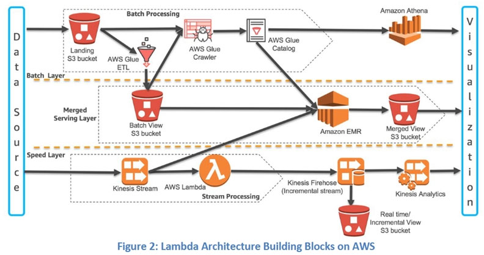
Reference:
https://d1.awsstatic.com/whitepapers/lambda-architecure-on-for-batch-aws.pdf

Question #7*Topic 1*

A companyג€™s application runs on Amazon EC2 instances behind an Application Load Balancer (ALB). The instances run in an Amazon EC2 Auto Scaling group across multiple Availability Zones. On the first day of every month at midnight, the application becomes much slower when the month-end financial calculation batch executes. This causes the CPU utilization of the EC2 instances to immediately peak to 100%, which disrupts the application.
What should a solutions architect recommend to ensure the application is able to handle the workload and avoid downtime?

- A. Configure an Amazon CloudFront distribution in front of the ALB.
- B. Configure an EC2 Auto Scaling simple scaling policy based on CPU utilization.
- ==C. Configure an EC2 Auto Scaling scheduled scaling policy based on the monthly schedule.==
- D. Configure Amazon ElastiCache to remove some of the workload from the EC2 instances.

[Hide Solution](https://www.examtopics.com/exams/amazon/aws-certified-solutions-architect-associate-saa-c02/view/#) [  Discussion  **59**](https://www.examtopics.com/exams/amazon/aws-certified-solutions-architect-associate-saa-c02/view/#)

**Correct Answer:** *C*
Scheduled Scaling for Amazon EC2 Auto Scaling
Scheduled scaling allows you to set your own scaling schedule. For example, let's say that every week the traffic to your web application starts to increase on
Wednesday, remains high on Thursday, and starts to decrease on Friday. You can plan your scaling actions based on the predictable traffic patterns of your web application. Scaling actions are performed automatically as a function of time and date.
Reference:
https://docs.aws.amazon.com/autoscaling/ec2/userguide/schedule_time.html

Question #8*Topic 1*

A company runs a multi-tier web application that hosts news content. The application runs on Amazon EC2 instances behind an Application Load Balancer. The instances run in an EC2 Auto Scaling group across multiple Availability Zones and use an Amazon Aurora database. A solutions architect needs to make the application more resilient to periodic increases in request rates.
Which architecture should the solutions architect implement? (Choose two.)

- A. Add AWS Shield.
- ==B. Add Aurora Replica.==
- C. Add AWS Direct Connect.
- D. Add AWS Global Accelerator.
- ==E. Add an Amazon CloudFront distribution in front of the Application Load Balancer.==

[Hide Solution](https://www.examtopics.com/exams/amazon/aws-certified-solutions-architect-associate-saa-c02/view/#) [  Discussion  **129**](https://www.examtopics.com/exams/amazon/aws-certified-solutions-architect-associate-saa-c02/view/#)

**Correct Answer:** *DE*
AWS Global Accelerator -
Acceleration for latency-sensitive applications
Many applications, especially in areas such as gaming, media, mobile apps, and financials, require very low latency for a great user experience. To improve the user experience, Global Accelerator directs user traffic to the application endpoint that is nearest to the client, which reduces internet latency and jitter. Global
Accelerator routes traffic to the closest edge location by using Anycast, and then routes it to the closest regional endpoint over the AWS global network. Global
Accelerator quickly reacts to changes in network performance to improve your usersג€™ application performance.

Amazon CloudFront -
Amazon CloudFront is a fast content delivery network (CDN) service that securely delivers data, videos, applications, and APIs to customers globally with low latency, high transfer speeds, all within a developer-friendly environment.
Reference:
https://docs.aws.amazon.com/global-accelerator/latest/dg/introduction-benefits-of-migrating.html

Question #9*Topic 1*

An application running on AWS uses an Amazon Aurora Multi-AZ deployment for its database. When evaluating performance metrics, a solutions architect discovered that the database reads are causing high I/O and adding latency to the write requests against the database.
What should the solutions architect do to separate the read requests from the write requests?

- A. Enable read-through caching on the Amazon Aurora database.
- B. Update the application to read from the Multi-AZ standby instance.
- ==C. Create a read replica and modify the application to use the appropriate endpoint.==
- D. Create a second Amazon Aurora database and link it to the primary database as a read replica.

[Hide Solution](https://www.examtopics.com/exams/amazon/aws-certified-solutions-architect-associate-saa-c02/view/#) [  Discussion  **85**](https://www.examtopics.com/exams/amazon/aws-certified-solutions-architect-associate-saa-c02/view/#)

**Correct Answer:** *C*
Amazon RDS Read Replicas -
Amazon RDS Read Replicas provide enhanced performance and durability for RDS database (DB) instances. They make it easy to elastically scale out beyond the capacity constraints of a single DB instance for read-heavy database workloads. You can create one or more replicas of a given source DB Instance and serve high-volume application read traffic from multiple copies of your data, thereby increasing aggregate read throughput. Read replicas can also be promoted when needed to become standalone DB instances. Read replicas are available in Amazon RDS for MySQL, MariaDB, PostgreSQL, Oracle, and SQL Server as well as
Amazon Aurora.
For the MySQL, MariaDB, PostgreSQL, Oracle, and SQL Server database engines, Amazon RDS creates a second DB instance using a snapshot of the source
DB instance. It then uses the engines' native asynchronous replication to update the read replica whenever there is a change to the source DB instance. The read replica operates as a DB instance that allows only read-only connections; applications can connect to a read replica just as they would to any DB instance.
Amazon RDS replicates all databases in the source DB instance.
Amazon Aurora further extends the benefits of read replicas by employing an SSD-backed virtualized storage layer purpose-built for database workloads. Amazon
Aurora replicas share the same underlying storage as the source instance, lowering costs and avoiding the need to copy data to the replica nodes. For more information about replication with Amazon Aurora, see the online documentation.
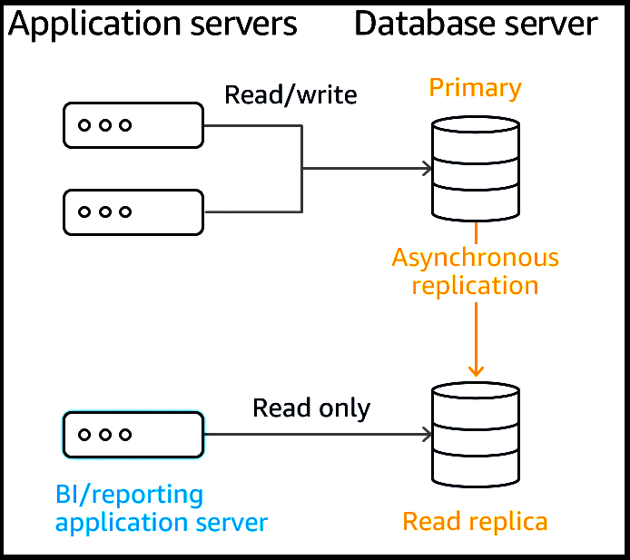
Reference:
https://docs.aws.amazon.com/AmazonRDS/latest/UserGuide/USER_ReadRepl.html https://aws.amazon.com/rds/features/read-replicas/

Question #10*Topic 1*

A recently acquired company is required to build its own infrastructure on AWS and migrate multiple applications to the cloud within a month. Each application has approximately 50 TB of data to be transferred. After the migration is complete, this company and its parent company will both require secure network connectivity with consistent throughput from their data centers to the applications. A solutions architect must ensure one-time data migration and ongoing network connectivity.
Which solution will meet these requirements?

- A. AWS Direct Connect for both the initial transfer and ongoing connectivity.
- B. AWS Site-to-Site VPN for both the initial transfer and ongoing connectivity.
- ==C. AWS Snowball for the initial transfer and AWS Direct Connect for ongoing connectivity.==
- D. AWS Snowball for the initial transfer and AWS Site-to-Site VPN for ongoing connectivity.

[Hide Solution](https://www.examtopics.com/exams/amazon/aws-certified-solutions-architect-associate-saa-c02/view/#) [  Discussion  **117**](https://www.examtopics.com/exams/amazon/aws-certified-solutions-architect-associate-saa-c02/view/#)

**Correct Answer:** *C*
Reference:
https://docs.aws.amazon.com/dms/latest/userguide/CHAP_LargeDBs.html https://aws.amazon.com/directconnect/

Question #11*Topic 1*

A company serves content to its subscribers across the world using an application running on AWS. The application has several Amazon EC2 instances in a private subnet behind an Application Load Balancer (ALB). Due to a recent change in copyright restrictions, the chief information officer (CIO) wants to block access for certain countries.
Which action will meet these requirements?

- A. Modify the ALB security group to deny incoming traffic from blocked countries.
- B. Modify the security group for EC2 instances to deny incoming traffic from blocked countries.
- ==C. Use Amazon CloudFront to serve the application and deny access to blocked countries.==
- D. Use ALB listener rules to return access denied responses to incoming traffic from blocked countries.

[Hide Solution](https://www.examtopics.com/exams/amazon/aws-certified-solutions-architect-associate-saa-c02/view/2/#) [  Discussion  **86**](https://www.examtopics.com/exams/amazon/aws-certified-solutions-architect-associate-saa-c02/view/2/#)

**Correct Answer:** *C*
"block access for certain countries." You can use geo restriction, also known as geo blocking, to prevent users in specific geographic locations from accessing content that you're distributing through a CloudFront web distribution.
Reference:
https://docs.aws.amazon.com/AmazonCloudFront/latest/DeveloperGuide/georestrictions.html

Question #12*Topic 1*

A product team is creating a new application that will store a large amount of data. The data will be analyzed hourly and modified by multiple Amazon EC2 Linux instances. The application team believes the amount of space needed will continue to grow for the next 6 months.
Which set of actions should a solutions architect take to support these needs?

- A. Store the data in an Amazon EBS volume. Mount the EBS volume on the application instances.
- ==B. Store the data in an Amazon EFS file system. Mount the file system on the application instances.==
- C. Store the data in Amazon S3 Glacier. Update the vault policy to allow access to the application instances.
- D. Store the data in Amazon S3 Standard-Infrequent Access (S3 Standard-IA). Update the bucket policy to allow access to the application instances.

[Hide Solution](https://www.examtopics.com/exams/amazon/aws-certified-solutions-architect-associate-saa-c02/view/2/#) [  Discussion  **62**](https://www.examtopics.com/exams/amazon/aws-certified-solutions-architect-associate-saa-c02/view/2/#)

**Correct Answer:** *B*
Amazon Elastic File System -
Amazon Elastic File System (Amazon EFS) provides a simple, scalable, fully managed elastic NFS file system for use with AWS Cloud services and on-premises resources. It is built to scale on demand to petabytes without disrupting applications, growing and shrinking automatically as you add and remove files, eliminating the need to provision and manage capacity to accommodate growth.
Amazon EFS is designed to provide massively parallel shared access to thousands of Amazon EC2 instances, enabling your applications to achieve high levels of aggregate throughput and IOPS with consistent low latencies.
Amazon EFS is well suited to support a broad spectrum of use cases from home directories to business-critical applications. Customers can use EFS to lift-and- shift existing enterprise applications to the AWS Cloud. Other use cases include: big data analytics, web serving and content management, application development and testing, media and entertainment workflows, database backups, and container storage.
Amazon EFS is a regional service storing data within and across multiple Availability Zones (AZs) for high availability and durability. Amazon EC2 instances can access your file system across AZs, regions, and VPCs, while on-premises servers can access using AWS Direct Connect or AWS VPN.
Reference:
https://aws.amazon.com/efs/

Question #13*Topic 1*

A company is migrating a three-tier application to AWS. The application requires a MySQL database. In the past, the application users reported poor application performance when creating new entries. These performance issues were caused by users generating different real-time reports from the application during working hours.
Which solution will improve the performance of the application when it is moved to AWS?

- A. Import the data into an Amazon DynamoDB table with provisioned capacity. Refactor the application to use DynamoDB for reports.
- B. Create the database on a compute optimized Amazon EC2 instance. Ensure compute resources exceed the on-premises database.
- ==C. Create an Amazon Aurora MySQL Multi-AZ DB cluster with multiple read replicas. Configure the application to use the reader endpoint for reports.==
- D. Create an Amazon Aurora MySQL Multi-AZ DB cluster. Configure the application to use the backup instance of the cluster as an endpoint for the reports.

[Hide Solution](https://www.examtopics.com/exams/amazon/aws-certified-solutions-architect-associate-saa-c02/view/2/#) [  Discussion  **89**](https://www.examtopics.com/exams/amazon/aws-certified-solutions-architect-associate-saa-c02/view/2/#)

**Correct Answer:** *C*
Amazon RDS Read Replicas Now Support Multi-AZ Deployments
Starting today, Amazon RDS Read Replicas for MySQL and MariaDB now support Multi-AZ deployments. Combining Read Replicas with Multi-AZ enables you to build a resilient disaster recovery strategy and simplify your database engine upgrade process.
Amazon RDS Read Replicas enable you to create one or more read-only copies of your database instance within the same AWS Region or in a different AWS
Region. Updates made to the source database are then asynchronously copied to your Read Replicas. In addition to providing scalability for read-heavy workloads, Read Replicas can be promoted to become a standalone database instance when needed.
Amazon RDS Multi-AZ deployments provide enhanced availability for database instances within a single AWS Region. With Multi-AZ, your data is synchronously replicated to a standby in a different Availability Zone (AZ). In the event of an infrastructure failure, Amazon RDS performs an automatic failover to the standby, minimizing disruption to your applications.
You can now use Read Replicas with Multi-AZ as part of a disaster recovery (DR) strategy for your production databases. A well-designed and tested DR plan is critical for maintaining business continuity after a disaster. A Read Replica in a different region than the source database can be used as a standby database and promoted to become the new production database in case of a regional disruption.
You can also combine Read Replicas with Multi-AZ for your database engine upgrade process. You can create a Read Replica of your production database instance and upgrade it to a new database engine version. When the upgrade is complete, you can stop applications, promote the Read Replica to a standalone database instance, and switch over your applications. Since the database instance is already a Multi-AZ deployment, no additional steps are needed.
Overview of Amazon RDS Read Replicas
Deploying one or more read replicas for a given source DB instance might make sense in a variety of scenarios, including the following:
Scaling beyond the compute or I/O capacity of a single DB instance for read-heavy database workloads. You can direct this excess read traffic to one or more read replicas.
Serving read traffic while the source DB instance is unavailable. In some cases, your source DB instance might not be able to take I/O requests, for example due to I/O suspension for backups or scheduled maintenance. In these cases, you can direct read traffic to your read replicas. For this use case, keep in mind that the data on the read replica might be "stale" because the source DB instance is unavailable.
Business reporting or data warehousing scenarios where you might want business reporting queries to run against a read replica, rather than your primary, production DB instance.
Implementing disaster recovery. You can promote a read replica to a standalone instance as a disaster recovery solution if the source DB instance fails.
Reference:
https://aws.amazon.com/about-aws/whats-new/2018/01/amazon-rds-read-replicas-now-support-multi-az-deployments/ https://docs.aws.amazon.com/AmazonRDS/latest/UserGuide/USER_ReadRepl.html

Question #14*Topic 1*

A solutions architect is deploying a distributed database on multiple Amazon EC2 instances. The database stores all data on multiple instances so it can withstand the loss of an instance. The database requires block storage with latency and throughput to support several million transactions per second per server.
Which storage solution should the solutions architect use?

- A. Amazon EBS
- ==B. Amazon EC2 instance store==
- C. Amazon EFS
- D. Amazon S3

[Hide Solution](https://www.examtopics.com/exams/amazon/aws-certified-solutions-architect-associate-saa-c02/view/2/#) [  Discussion  **146**](https://www.examtopics.com/exams/amazon/aws-certified-solutions-architect-associate-saa-c02/view/2/#)

**Correct Answer:** *B*

Question #15*Topic 1*

Organizers for a global event want to put daily reports online as static HTML pages. The pages are expected to generate millions of views from users around the world. The files are stored in an Amazon S3 bucket. A solutions architect has been asked to design an efficient and effective solution.
Which action should the solutions architect take to accomplish this?

- A. Generate presigned URLs for the files.
- B. Use cross-Region replication to all Regions.
- C. Use the geoproximity feature of Amazon Route 53.
- ==D. Use Amazon CloudFront with the S3 bucket as its origin.==

[Hide Solution](https://www.examtopics.com/exams/amazon/aws-certified-solutions-architect-associate-saa-c02/view/2/#) [  Discussion  **39**](https://www.examtopics.com/exams/amazon/aws-certified-solutions-architect-associate-saa-c02/view/2/#)

**Correct Answer:** *D*
Using Amazon S3 Origins, MediaPackage Channels, and Custom Origins for Web Distributions
Using Amazon S3 Buckets for Your Origin
When you use Amazon S3 as an origin for your distribution, you place any objects that you want CloudFront to deliver in an Amazon S3 bucket. You can use any method that is supported by Amazon S3 to get your objects into Amazon S3, for example, the Amazon S3 console or API, or a third-party tool. You can create a hierarchy in your bucket to store the objects, just as you would with any other Amazon S3 bucket.
Using an existing Amazon S3 bucket as your CloudFront origin server doesn't change the bucket in any way; you can still use it as you normally would to store and access Amazon S3 objects at the standard Amazon S3 price. You incur regular Amazon S3 charges for storing the objects in the bucket.
Using Amazon S3 Buckets Configured as Website Endpoints for Your Origin
You can set up an Amazon S3 bucket that is configured as a website endpoint as custom origin with CloudFront.
When you configure your CloudFront distribution, for the origin, enter the Amazon S3 static website hosting endpoint for your bucket. This value appears in the
Amazon S3 console, on the Properties tab, in the Static website hosting pane. For example: http://bucket-name.s3-website-region.amazonaws.com
For more information about specifying Amazon S3 static website endpoints, see Website endpoints in the Amazon Simple Storage Service Developer Guide.
When you specify the bucket name in this format as your origin, you can use Amazon S3 redirects and Amazon S3 custom error documents. For more information about Amazon S3 features, see the Amazon S3 documentation.
Using an Amazon S3 bucket as your CloudFront origin server doesnג€™t change it in any way. You can still use it as you normally would and you incur regular
Amazon S3 charges.
Reference:
https://docs.aws.amazon.com/AmazonCloudFront/latest/DeveloperGuide/DownloadDistS3AndCustomOrigins.html

Question #16*Topic 1*

A solutions architect is designing a new service behind Amazon API Gateway. The request patterns for the service will be unpredictable and can change suddenly from 0 requests to over 500 per second. The total size of the data that needs to be persisted in a backend database is currently less than 1 GB with unpredictable future growth. Data can be queried using simple key-value requests.
Which combination of AWS services would meet these requirements? (Choose two.)

- A. AWS Fargate
- B. ==AWS Lambda==
- ==C. Amazon DynamoDB==
- D. Amazon EC2 Auto Scaling
- E. MySQL-compatible Amazon Aurora

[Hide Solution](https://www.examtopics.com/exams/amazon/aws-certified-solutions-architect-associate-saa-c02/view/2/#) [  Discussion  **67**](https://www.examtopics.com/exams/amazon/aws-certified-solutions-architect-associate-saa-c02/view/2/#)

**Correct Answer:** *BC*
Reference:
https://aws.amazon.com/about-aws/whats-new/2017/11/amazon-api-gateway-supports-endpoint-integrations-with-private-vpcs

Question #17*Topic 1*

A start-up company has a web application based in the us-east-1 Region with multiple Amazon EC2 instances running behind an Application Load Balancer across multiple Availability Zones. As the companyג€™s user base grows in the us-west-1 Region, it needs a solution with low latency and high availability.
What should a solutions architect do to accomplish this?

- A. Provision EC2 instances in us-west-1. Switch the Application Load Balancer to a Network Load Balancer to achieve cross-Region load balancing.
- B. Provision EC2 instances and an Application Load Balancer in us-west-1. Make the load balancer distribute the traffic based on the location of the request.
- ==C. Provision EC2 instances and configure an Application Load Balancer in us-west-1. Create an accelerator in AWS Global Accelerator that uses an endpoint group that includes the load balancer endpoints in both Regions.==
- D. Provision EC2 instances and configure an Application Load Balancer in us-west-1. Configure Amazon Route 53 with a weighted routing policy. Create alias records in Route 53 that point to the Application Load Balancer.

[Hide Solution](https://www.examtopics.com/exams/amazon/aws-certified-solutions-architect-associate-saa-c02/view/2/#) [  Discussion  **93**](https://www.examtopics.com/exams/amazon/aws-certified-solutions-architect-associate-saa-c02/view/2/#)

**Correct Answer:** *C*
Register endpoints for endpoint groups: You register one or more regional resources, such as Application Load Balancers, Network Load Balancers, EC2
Instances, or Elastic IP addresses, in each endpoint group. Then you can set weights to choose how much traffic is routed to each endpoint.
Endpoints in AWS Global Accelerator
Endpoints in AWS Global Accelerator can be Network Load Balancers, Application Load Balancers, Amazon EC2 instances, or Elastic IP addresses. A static IP address serves as a single point of contact for clients, and Global Accelerator then distributes incoming traffic across healthy endpoints. Global Accelerator directs traffic to endpoints by using the port (or port range) that you specify for the listener that the endpoint group for the endpoint belongs to.
Each endpoint group can have multiple endpoints. You can add each endpoint to multiple endpoint groups, but the endpoint groups must be associated with different listeners.
Global Accelerator continually monitors the health of all endpoints that are included in an endpoint group. It routes traffic only to the active endpoints that are healthy. If Global Accelerator doesnג€™t have any healthy endpoints to route traffic to, it routes traffic to all endpoints.
Reference: https://docs.aws.amazon.com/global-accelerator/latest/dg/about-endpoints.html https://aws.amazon.com/global-accelerator/faqs/

"ELB provides load balancing within one Region, AWS Global Accelerator provides traffic management across multiple Regions [...] AWS Global Accelerator complements ELB by extending these capabilities beyond a single AWS Region, allowing you to provision a global interface for your applications in any number of Regions. If you have workloads that cater to a global client base, we recommend that you use AWS Global Accelerator. If you have workloads hosted in a single AWS Region and used by clients in and around the same Region, you can use an Application Load Balancer or Network Load Balancer to manage your resources." https://aws.amazon.com/global-accelerator/faqs/

Question #18*Topic 1*

A solutions architect is designing a solution to access a catalog of images and provide users with the ability to submit requests to customize images. Image customization parameters will be in any request sent to an AWS API Gateway API. The customized image will be generated on demand, and users will receive a link they can click to view or download their customized image. The solution must be highly available for viewing and customizing images.
What is the MOST cost-effective solution to meet these requirements?

- A. Use Amazon EC2 instances to manipulate the original image into the requested customization. Store the original and manipulated images in Amazon S3. Configure an Elastic Load Balancer in front of the EC2 instances.
- ==B. Use AWS Lambda to manipulate the original image to the requested customization. Store the original and manipulated images in Amazon S3. Configure an Amazon CloudFront distribution with the S3 bucket as the origin.==
- C. Use AWS Lambda to manipulate the original image to the requested customization. Store the original images in Amazon S3 and the manipulated images in Amazon DynamoDB. Configure an Elastic Load Balancer in front of the Amazon EC2 instances.
- D. Use Amazon EC2 instances to manipulate the original image into the requested customization. Store the original images in Amazon S3 and the manipulated images in Amazon DynamoDB. Configure an Amazon CloudFront distribution with the S3 bucket as the origin.

[Hide Solution](https://www.examtopics.com/exams/amazon/aws-certified-solutions-architect-associate-saa-c02/view/2/#) [  Discussion  **46**](https://www.examtopics.com/exams/amazon/aws-certified-solutions-architect-associate-saa-c02/view/2/#)

**Correct Answer:** *B*
AWS Lambda is a compute service that lets you run code without provisioning or managing servers. AWS Lambda executes your code only when needed and scales automatically, from a few requests per day to thousands per second. You pay only for the compute time you consume ג€" there is no charge when your code is not running. With AWS Lambda, you can run code for virtually any type of application or backend service ג€" all with zero administration. AWS Lambda runs your code on a high-availability compute infrastructure and performs all of the administration of the compute resources, including server and operating system maintenance, capacity provisioning and automatic scaling, code monitoring and logging. All you need to do is supply your code in one of the languages that AWS
Lambda supports.
Storing your static content with S3 provides a lot of advantages. But to help optimize your applicationג€™s performance and security while effectively managing cost, we recommend that you also set up Amazon CloudFront to work with your S3 bucket to serve and protect the content. CloudFront is a content delivery network
(CDN) service that delivers static and dynamic web content, video streams, and APIs around the world, securely and at scale. By design, delivering data out of
CloudFront can be more cost effective than delivering it from S3 directly to your users.
CloudFront serves content through a worldwide network of data centers called Edge Locations. Using edge servers to cache and serve content improves performance by providing content closer to where viewers are located. CloudFront has edge servers in locations all around the world.
Reference:
https://docs.aws.amazon.com/lambda/latest/dg/welcome.html
https://aws.amazon.com/blogs/networking-and-content-delivery/amazon-s3-amazon-cloudfront-a-match-made-in-the-cloud/

Question #19*Topic 1*

A company is planning to migrate a business-critical dataset to Amazon S3. The current solution design uses a single S3 bucket in the us-east-1 Region with versioning enabled to store the dataset. The company's disaster recovery policy states that all data multiple AWS Regions.
How should a solutions architect design the S3 solution?

- A. Create an additional S3 bucket in another Region and configure cross-Region replication.
- B. Create an additional S3 bucket in another Region and configure cross-origin resource sharing (CORS).
- ==C. Create an additional S3 bucket with versioning in another Region and configure cross-Region replication.==
- D. Create an additional S3 bucket with versioning in another Region and configure cross-origin resource (CORS).

[Hide Solution](https://www.examtopics.com/exams/amazon/aws-certified-solutions-architect-associate-saa-c02/view/2/#) [  Discussion  **73**](https://www.examtopics.com/exams/amazon/aws-certified-solutions-architect-associate-saa-c02/view/2/#)

**Correct Answer:** *C*
Reference:
https://medium.com/@KerrySheldon/s3-exercise-2-4-adding-objects-to-an-s3-bucket-with-cross-region-replication-a78b332b7697

Question #20*Topic 1*

A company has application running on Amazon EC2 instances in a VPC. One of the applications needs to call an Amazon S3 API to store and read objects. The companyג€™s security policies restrict any internet-bound traffic from the applications.
Which action will fulfill these requirements and maintain security?

- A. Configure an S3 interface endpoint.
- ==B. Configure an S3 gateway endpoint.==
- C. Create an S3 bucket in a private subnet.
- D. Create an S3 bucket in the same Region as the EC2 instance.

[Hide Solution](https://www.examtopics.com/exams/amazon/aws-certified-solutions-architect-associate-saa-c02/view/2/#) [  Discussion  **124**](https://www.examtopics.com/exams/amazon/aws-certified-solutions-architect-associate-saa-c02/view/2/#)

**Correct Answer:** *B*

Question #21*Topic 1*

A companyג€™s web application uses an Amazon RDS PostgreSQL DB instance to store its application data. During the financial closing period at the start of every month, Accountants run large queries that impact the database's performance due to high usage. The company wants to minimize the impact that the reporting activity has on the web application.
What should a solutions architect do to reduce the impact on the database with the LEAST amount of effort?

- ==A. Create a read replica and direct reporting traffic to the replica.==
- B. Create a Multi-AZ database and direct reporting traffic to the standby.
- C. Create a cross-Region read replica and direct reporting traffic to the replica.
- D. Create an Amazon Redshift database and direct reporting traffic to the Amazon Redshift database.

[Hide Solution](https://www.examtopics.com/exams/amazon/aws-certified-solutions-architect-associate-saa-c02/view/3/#) [  Discussion  **51**](https://www.examtopics.com/exams/amazon/aws-certified-solutions-architect-associate-saa-c02/view/3/#)

**Correct Answer:** *A*
Amazon RDS uses the MariaDB, MySQL, Oracle, PostgreSQL, and Microsoft SQL Server DB engines' built-in replication functionality to create a special type of
DB instance called a read replica from a source DB instance. Updates made to the source DB instance are asynchronously copied to the read replica. You can reduce the load on your source DB instance by routing read queries from your applications to the read replica.
When you create a read replica, you first specify an existing DB instance as the source. Then Amazon RDS takes a snapshot of the source instance and creates a read-only instance from the snapshot. Amazon RDS then uses the asynchronous replication method for the DB engine to update the read replica whenever there is a change to the source DB instance. The read replica operates as a DB instance that allows only read-only connections. Applications connect to a read replica the same way they do to any DB instance. Amazon RDS replicates all databases in the source DB instance.
Reference:
https://docs.aws.amazon.com/AmazonRDS/latest/UserGuide/USER_ReadRepl.html

Question #22*Topic 1*

A company wants to migrate a high performance computing (HPC) application and data from on-premises to the AWS Cloud. The company uses tiered storage on premises with hot high-performance parallel storage to support the application during periodic runs of the application, and more economical cold storage to hold the data when the application is not actively running.
Which combination of solutions should a solutions architect recommend to support the storage needs of the application? (Choose two.)

- ==A. Amazon S3 for cold data storage==
- B. Amazon EFS for cold data storage
- C. Amazon S3 for high-performance parallel storage
- ==D. Amazon FSx for Lustre for high-performance parallel storage==
- E. Amazon FSx for Windows for high-performance parallel storage

[Hide Solution](https://www.examtopics.com/exams/amazon/aws-certified-solutions-architect-associate-saa-c02/view/3/#) [  Discussion  **49**](https://www.examtopics.com/exams/amazon/aws-certified-solutions-architect-associate-saa-c02/view/3/#)

**Correct Answer:** *AD*

Question #23*Topic 1*

A companyג€™s application is running on Amazon EC2 instances in a single Region. In the event of a disaster, a solutions architect needs to ensure that the resources can also be deployed to a second Region. Which combination of actions should the solutions architect take to accomplish this? (Choose two.)

- A. Detach a volume on an EC2 instance and copy it to Amazon S3.
- B. ==Launch a new EC2 instance from an Amazon Machine Image (AMI) in a new Region.==
- C. Launch a new EC2 instance in a new Region and copy a volume from Amazon S3 to the new instance.
- ==D. Copy an Amazon Machine Image (AMI) of an EC2 instance and specify a different Region for the destination.==
- E. Copy an Amazon Elastic Block Store (Amazon EBS) volume from Amazon S3 and launch an EC2 instance in the destination Region using that EBS volume.

[Hide Solution](https://www.examtopics.com/exams/amazon/aws-certified-solutions-architect-associate-saa-c02/view/3/#) [  Discussion  **71**](https://www.examtopics.com/exams/amazon/aws-certified-solutions-architect-associate-saa-c02/view/3/#)

**Correct Answer:** *BD*
Cross Region EC2 AMI Copy -
We know that you want to build applications that span AWS Regions and weג€™re working to provide you with the services and features needed to do so. We started out by launching the EBS Snapshot Copy feature late last year. This feature gave you the ability to copy a snapshot from Region to Region with just a couple of clicks. In addition, last month we made a significant reduction (26% to 83%) in the cost of transferring data between AWS Regions, making it less expensive to operate in more than one AWS region.
Today we are introducing a new feature: Amazon Machine Image (AMI) Copy. AMI Copy enables you to easily copy your Amazon Machine Images between AWS
Regions. AMI Copy helps enable several key scenarios including:
Simple and Consistent Multi-Region Deployment ג€" You can copy an AMI from one region to another, enabling you to easily launch consistent instances based on the same AMI into different regions.
Scalability ג€" You can more easily design and build world-scale applications that meet the needs of your users, regardless of their location.
Performance ג€" You can increase performance by distributing your application and locating critical components of your application in closer proximity to your users.
You can also take advantage of region-specific features such as instance types or other AWS services.
Even Higher Availability ג€" You can design and deploy applications across AWS regions, to increase availability.
Once the new AMI is in an Available state the copy is complete.
Reference:
https://aws.amazon.com/blogs/aws/ec2-ami-copy-between-regions/

Question #24*Topic 1*

A solutions architect needs to ensure that API calls to Amazon DynamoDB from Amazon EC2 instances in a VPC do not traverse the internet.
What should the solutions architect do to accomplish this? (Choose two.)

- ==A. Create a route table entry for the endpoint.==
- ==B. Create a gateway endpoint for DynamoDB.==
- C. Create a new DynamoDB table that uses the endpoint.
- D. Create an ENI for the endpoint in each of the subnets of the VPC.
- E. Create a security group entry in the default security group to provide access.

[Hide Solution](https://www.examtopics.com/exams/amazon/aws-certified-solutions-architect-associate-saa-c02/view/3/#) [  Discussion  **42**](https://www.examtopics.com/exams/amazon/aws-certified-solutions-architect-associate-saa-c02/view/3/#)

**Correct Answer:** *AB*
A VPC endpoint enables you to privately connect your VPC to supported AWS services and VPC endpoint services powered by AWS PrivateLink without requiring an internet gateway, NAT device, VPN connection, or AWS Direct Connect connection. Instances in your VPC do not require public IP addresses to communicate with resources in the service. Traffic between your VPC and the other service does not leave the Amazon network.

Gateway endpoints -
A gateway endpoint is a gateway that you specify as a target for a route in your route table for traffic destined to a supported AWS service. The following AWS services are supported:

Amazon S3 -

DynamoDB -
Reference:
https://docs.aws.amazon.com/vpc/latest/userguide/vpc-endpoints.html

Question #25*Topic 1*

A companyג€™s legacy application is currently relying on a single-instance Amazon RDS MySQL database without encryption. Due to new compliance requirements, all existing and new data in this database must be encrypted. How should this be accomplished?

- A. Create an Amazon S3 bucket with server-side encryption enabled. Move all the data to Amazon S3. Delete the RDS instance.
- B. Enable RDS Multi-AZ mode with encryption at rest enabled. Perform a failover to the standby instance to delete the original instance.
- ==C. Take a Snapshot of the RDS instance. Create an encrypted copy of the snapshot. Restore the RDS instance from the encrypted snapshot.==
- D. Create an RDS read replica with encryption at rest enabled. Promote the read replica to master and switch the over to the new master. Delete the old RDS instance.

[Hide Solution](https://www.examtopics.com/exams/amazon/aws-certified-solutions-architect-associate-saa-c02/view/3/#) [  Discussion  **51**](https://www.examtopics.com/exams/amazon/aws-certified-solutions-architect-associate-saa-c02/view/3/#)

**Correct Answer:** *C*
How do I encrypt Amazon RDS snapshots?
The following steps are applicable to Amazon RDS for MySQL, Oracle, SQL Server, PostgreSQL, or MariaDB.
Important: If you use Amazon Aurora, you can restore an unencrypted Aurora DB cluster snapshot to an encrypted Aurora DB cluster if you specify an AWS Key
Management Service (AWS KMS) encryption key when you restore from the unencrypted DB cluster snapshot. For more information, see Limitations of Amazon
RDS Encrypted DB Instances.
Open the Amazon RDS console, and then choose Snapshots from the navigation pane.
Select the snapshot that you want to encrypt.
Under Snapshot Actions, choose Copy Snapshot.
Choose your Destination Region, and then enter your New DB Snapshot Identifier.
Change Enable Encryption to Yes.
Select your Master Key from the list, and then choose Copy Snapshot.
After the snapshot status is available, the Encrypted field will be True to indicate that the snapshot is encrypted.
You now have an encrypted snapshot of your DB. You can use this encrypted DB snapshot to restore the DB instance from the DB snapshot.
Reference:
https://aws.amazon.com/premiumsupport/knowledge-center/encrypt-rds-snapshots/

Question #26*Topic 1*

A manufacturing company wants to implement predictive maintenance on its machinery equipment. The company will install thousands of IoT sensors that will send data to AWS in real time. A solutions architect is tasked with implementing a solution that will receive events in an ordered manner for each machinery asset and ensure that data is saved for further processing at a later time.
Which solution would be MOST efficient?

- ==A. Use Amazon Kinesis Data Streams for real-time events with a partition for each equipment asset. Use Amazon Kinesis Data Firehose to save data to Amazon S3.==
- B. Use Amazon Kinesis Data Streams for real-time events with a shard for each equipment asset. Use Amazon Kinesis Data Firehose to save data to Amazon EBS.
- C. Use an Amazon SQS FIFO queue for real-time events with one queue for each equipment asset. Trigger an AWS Lambda function for the SQS queue to save data to Amazon EFS.
- D. Use an Amazon SQS standard queue for real-time events with one queue for each equipment asset. Trigger an AWS Lambda function from the SQS queue to save data to Amazon S3.

[Hide Solution](https://www.examtopics.com/exams/amazon/aws-certified-solutions-architect-associate-saa-c02/view/3/#) [  Discussion  **97**](https://www.examtopics.com/exams/amazon/aws-certified-solutions-architect-associate-saa-c02/view/3/#)

**Correct Answer:** *D*

Amazon Kinesis Data Streams collect and process data in real time. 
**A Kinesis data stream is a set of shards.** Each shard has a sequence of data records. Each data record has a sequence number that is assigned by Kinesis Data Streams. **A shard is a uniquely identified sequence of data records in a stream.** 
**A partition key is used to group data by shard within a stream.** Kinesis Data Streams segregates the data records belonging to a stream into multiple shards. It uses the partition key that is associated with each data record to determine which shard a given data record belongs to. 
For this scenario, the solutions architect can use a partition key for each device. This will ensure the records for that device are grouped by shard and the shard will ensure ordering. Amazon S3 is a valid destination for saving the data records. https://docs.aws.amazon.com/streams/latest/dev/key-concepts.html

Question says ordered manner so SQS standard queue already falls short, that no ordered, SQS FIFO would be but ==**using lambda to process large amounts of realtime data is not as efficient as Kinesis Data Streams + Kinesis Data Firehose**==. And ==EBS is not a target of Firehose== so S3 is the correct option here

Question #27*Topic 1*

A companyג€™s website runs on Amazon EC2 instances behind an Application Load Balancer (ALB). The website has a mix of dynamic and static content. Users around the globe are reporting that the website is slow.
Which set of actions will improve website performance for users worldwide?

- ==A. Create an Amazon CloudFront distribution and configure the ALB as an origin. Then update the Amazon Route 53 record to point to the CloudFront distribution.==
- B. Create a latency-based Amazon Route 53 record for the ALB. Then launch new EC2 instances with larger instance sizes and register the instances with the ALB.
- C. Launch new EC2 instances hosting the same web application in different Regions closer to the users. Then register instances with the same ALB using cross- Region VPC peering.
- D. Host the website in an Amazon S3 bucket in the Regions closest to the users and delete the ALB and EC2 instances. Then update an Amazon Route 53 record to point to the S3 buckets.

[Hide Solution](https://www.examtopics.com/exams/amazon/aws-certified-solutions-architect-associate-saa-c02/view/3/#) [  Discussion  **33**](https://www.examtopics.com/exams/amazon/aws-certified-solutions-architect-associate-saa-c02/view/3/#)

**Correct Answer:** *A*
What Is Amazon CloudFront?
Amazon CloudFront is a web service that speeds up distribution of your static and dynamic web content, such as .html, .css, .js, and image files, to your users.
CloudFront delivers your content through a worldwide network of data centers called edge locations. When a user requests content that you're serving with
CloudFront, the user is routed to the edge location that provides the lowest latency (time delay), so that content is delivered with the best possible performance.
Routing traffic to an Amazon CloudFront web distribution by using your domain name.
If you want to speed up delivery of your web content, you can use Amazon CloudFront, the AWS content delivery network (CDN). CloudFront can deliver your entire website ג€" including dynamic, static, streaming, and interactive content ג€" by using a global network of edge locations. Requests for your content are automatically routed to the edge location that gives your users the lowest latency.
To use CloudFront to distribute your content, you create a web distribution and specify settings such as the Amazon S3 bucket or HTTP server that you want
CloudFront to get your content from, whether you want only selected users to have access to your content, and whether you want to require users to use HTTPS.
When you create a web distribution, CloudFront assigns a domain name to the distribution, such asd111111abcdef8.cloudfront.net. You can use this domain name in the URLs for your content, for example:
[1]
Alternatively, you might prefer to use your own domain name in URLs, for example:
[1]
If you want to use your own domain name, use Amazon Route 53 to create an alias record that points to your CloudFront distribution. An alias record is a Route
53 extension to DNS. It's similar to a CNAME record, but you can create an alias record both for the root domain, such as example.com, and for subdomains, such aswww.example.com. (You can create CNAME records only for subdomains.) When Route 53 receives a DNS query that matches the name and type of an alias record, Route 53 responds with the domain name that is associated with your distribution.
Reference:
https://docs.aws.amazon.com/Route53/latest/DeveloperGuide/routing-to-cloudfront-distribution.html https://docs.aws.amazon.com/AmazonCloudFront/latest/DeveloperGuide/Introduction.html

Question #28*Topic 1*

A company has been storing analytics data in an Amazon RDS instance for the past few years. The company asked a solutions architect to find a solution that allows users to access this data using an API. The expectation is that the application will experience periods of inactivity but could receive bursts of traffic within seconds.
Which solution should the solutions architect suggest?

- A. Set up an Amazon API Gateway and use Amazon ECS.
- B. Set up an Amazon API Gateway and use AWS Elastic Beanstalk.
- ==C. Set up an Amazon API Gateway and use AWS Lambda functions.==
- D. Set up an Amazon API Gateway and use Amazon EC2 with Auto Scaling.

[Hide Solution](https://www.examtopics.com/exams/amazon/aws-certified-solutions-architect-associate-saa-c02/view/3/#) [  Discussion  **24**](https://www.examtopics.com/exams/amazon/aws-certified-solutions-architect-associate-saa-c02/view/3/#)

**Correct Answer:** *C*
AWS Lambda -
With Lambda, you can run code for virtually any type of application or backend service ג€" all with zero administration. Just upload your code and Lambda takes care of everything required to run and scale your code with high availability. You can set up your code to automatically trigger from other AWS services or call it directly from any web or mobile app.

How it works -
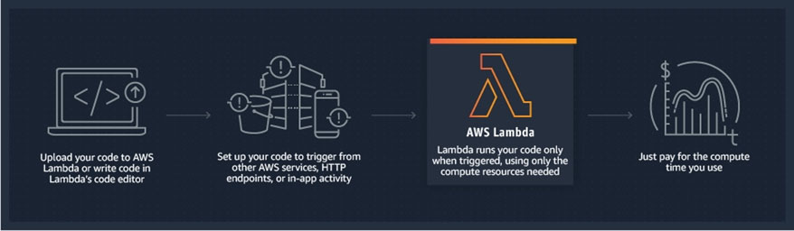

Amazon API Gateway -
Amazon API Gateway is a fully managed service that makes it easy for developers to create, publish, maintain, monitor, and secure APIs at any scale. APIs act as the "front door" for applications to access data, business logic, or functionality from your backend services. Using API Gateway, you can create RESTful APIs and
WebSocket APIs that enable real-time two-way communication applications. API Gateway supports containerized and serverless workloads, as well as web applications.
API Gateway handles all the tasks involved in accepting and processing up to hundreds of thousands of concurrent API calls, including traffic management, CORS support, authorization and access control, throttling, monitoring, and API version management. API Gateway has no minimum fees or startup costs. You pay for the API calls you receive and the amount of data transferred out and, with the API Gateway tiered pricing model, you can reduce your cost as your API usage scales.
Reference:
https://aws.amazon.com/lambda/
https://aws.amazon.com/api-gateway/

Question #29*Topic 1*

A company must generate sales reports at the beginning of every month. The reporting process launches 20 Amazon EC2 instances on the first of the month. The process runs for 7 days and cannot be interrupted. The company wants to minimize costs.
Which pricing model should the company choose?

- A. Reserved Instances
- B. Spot Block Instances
- C. On-Demand Instances
- D. Scheduled Reserved Instances

[Hide Solution](https://www.examtopics.com/exams/amazon/aws-certified-solutions-architect-associate-saa-c02/view/3/#) [  Discussion  **36**](https://www.examtopics.com/exams/amazon/aws-certified-solutions-architect-associate-saa-c02/view/3/#)

**Correct Answer:** *D*
Explanation -

Scheduled Reserved Instances -
Scheduled Reserved Instances (Scheduled Instances) enable you to purchase capacity reservations that recur on a daily, weekly, or monthly basis, with a specified start time and duration, for a one-year term. You reserve the capacity in advance, so that you know it is available when you need it. You pay for the time that the instances are scheduled, even if you do not use them.
Scheduled Instances are a good choice for workloads that do not run continuously, but do run on a regular schedule. For example, you can use Scheduled
Instances for an application that runs during business hours or for batch processing that runs at the end of the week.
If you require a capacity reservation on a continuous basis, Reserved Instances might meet your needs and decrease costs.

How Scheduled Instances Work -
Amazon EC2 sets aside pools of EC2 instances in each Availability Zone for use as Scheduled Instances. Each pool supports a specific combination of instance type, operating system, and network.
To get started, you must search for an available schedule. You can search across multiple pools or a single pool. After you locate a suitable schedule, purchase it.
==You must launch your Scheduled Instances during their scheduled time periods, using a launch configuration that matches the following attributes of the schedule that you purchased==: instance type, Availability Zone, network, and platform. When you do so, Amazon EC2 launches EC2 instances on your behalf, based on the specified launch specification. Amazon EC2 must ensure that the EC2 instances have terminated by the end of the current scheduled time period so that the capacity is available for any other Scheduled Instances it is reserved for. Therefore, Amazon EC2 terminates the EC2 instances three minutes before the end of the current scheduled time period.
==You can't stop or reboot Scheduled Instances, but you can terminate them manually as needed.== If you terminate a Scheduled Instance before its current scheduled time period ends, you can launch it again after a few minutes. Otherwise, you must wait until the next scheduled time period.
The following diagram illustrates the lifecycle of a Scheduled Instance.
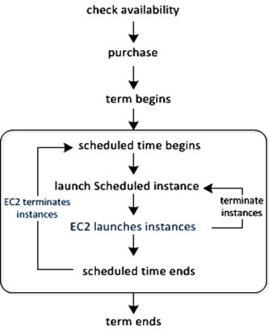
Reference:
https://docs.aws.amazon.com/AWSEC2/latest/UserGuide/ec2-scheduled-instances.html

Question #30*Topic 1*

A gaming company has multiple Amazon EC2 instances in a single Availability Zone for its multiplayer game that communicates with users on Layer 4. The chief technology officer (CTO) wants to make the architecture highly available and cost-effective.
What should a solutions architect do to meet these requirements? (Choose two.)?

- A. Increase the number of EC2 instances.
- B. Decrease the number of EC2 instances.
- ==C. Configure a Network Load Balancer in front of the EC2 instances.==
- D. Configure an Application Load Balancer in front of the EC2 instances.
- ==E. Configure an Auto Scaling group to add or remove instances in multiple Availability Zones automatically.==

[Hide Solution](https://www.examtopics.com/exams/amazon/aws-certified-solutions-architect-associate-saa-c02/view/3/#) [  Discussion  **44**](https://www.examtopics.com/exams/amazon/aws-certified-solutions-architect-associate-saa-c02/view/3/#)

**Correct Answer:** *CE*
Network Load Balancer overview -
A Network Load Balancer functions at the fourth layer of the Open Systems Interconnection (OSI) model. It can handle millions of requests per second. After the load balancer receives a connection request, it selects a target from the target group for the default rule. It attempts to open a TCP connection to the selected target on the port specified in the listener configuration.
When you enable an Availability Zone for the load balancer, Elastic Load Balancing creates a load balancer node in the Availability Zone. By default, each load balancer node distributes traffic across the registered targets in its Availability Zone only. If you enable cross-zone load balancing, each load balancer node distributes traffic across the registered targets in all enabled Availability Zones. For more information, see Availability Zones.
If you enable multiple Availability Zones for your load balancer and ensure that each target group has at least one target in each enabled Availability Zone, this increases the fault tolerance of your applications. For example, if one or more target groups does not have a healthy target in an Availability Zone, we remove the
IP address for the corresponding subnet from DNS, but the load balancer nodes in the other Availability Zones are still available to route traffic. If a client doesn't honor the time-to-live (TTL) and sends requests to the IP address after it is removed from DNS, the requests fail.
For TCP traffic, the load balancer selects a target using a flow hash algorithm based on the protocol, source IP address, source port, destination IP address, destination port, and TCP sequence number. The TCP connections from a client have different source ports and sequence numbers, and can be routed to different targets. Each individual TCP connection is routed to a single target for the life of the connection.
For UDP traffic, the load balancer selects a target using a flow hash algorithm based on the protocol, source IP address, source port, destination IP address, and destination port. A UDP flow has the same source and destination, so it is consistently routed to a single target throughout its lifetime. Different UDP flows have different source IP addresses and ports, so they can be routed to different targets.
An Auto Scaling group contains a collection of Amazon EC2 instances that are treated as a logical grouping for the purposes of automatic scaling and management. An Auto Scaling group also enables you to use Amazon EC2 Auto Scaling features such as health check replacements and scaling policies. Both maintaining the number of instances in an Auto Scaling group and automatic scaling are the core functionality of the Amazon EC2 Auto Scaling service.
The size of an Auto Scaling group depends on the number of instances that you set as the desired capacity. You can adjust its size to meet demand, either manually or by using automatic scaling.
An Auto Scaling group starts by launching enough instances to meet its desired capacity. It maintains this number of instances by performing periodic health checks on the instances in the group. The Auto Scaling group continues to maintain a fixed number of instances even if an instance becomes unhealthy. If an instance becomes unhealthy, the group terminates the unhealthy instance and launches another instance to replace it.
Reference:
https://docs.aws.amazon.com/elasticloadbalancing/latest/network/introduction.html https://docs.aws.amazon.com/autoscaling/ec2/userguide/AutoScalingGroup.html

Question #31*Topic 1*

A company currently operates a web application backed by an Amazon RDS MySQL database. It has automated backups that are run daily and are not encrypted. A security audit requires future backups to be encrypted and the unencrypted backups to be destroyed. The company will make at least one encrypted backup before destroying the old backups.
What should be done to enable encryption for future backups?

- A. Enable default encryption for the Amazon S3 bucket where backups are stored.
- B. Modify the backup section of the database configuration to toggle the Enable encryption check box.
- ==C. Create a snapshot of the database. Copy it to an encrypted snapshot. Restore the database from the encrypted snapshot.==
- D. Enable an encrypted read replica on RDS for MySQL. Promote the encrypted read replica to primary. Remove the original database instance.

[Hide Solution](https://www.examtopics.com/exams/amazon/aws-certified-solutions-architect-associate-saa-c02/view/4/#) [  Discussion  **68**](https://www.examtopics.com/exams/amazon/aws-certified-solutions-architect-associate-saa-c02/view/4/#)

**Correct Answer:** *C*
However, because you can encrypt a copy of an unencrypted DB snapshot, you can effectively add encryption to an unencrypted DB instance. That is, you can create a snapshot of your DB instance, and then create an encrypted copy of that snapshot. You can then restore a DB instance from the encrypted snapshot, and thus you have an encrypted copy of your original DB instance.
DB instances that are encrypted can't be modified to disable encryption.
You can't have an encrypted read replica of an unencrypted DB instance or an unencrypted read replica of an encrypted DB instance.
Encrypted read replicas must be encrypted with the same key as the source DB instance when both are in the same AWS Region.
You can't restore an unencrypted backup or snapshot to an encrypted DB instance.
To copy an encrypted snapshot from one AWS Region to another, you must specify the KMS key identifier of the destination AWS Region. This is because KMS encryption keys are specific to the AWS Region that they are created in.
Reference:
https://docs.aws.amazon.com/AmazonRDS/latest/UserGuide/Overview.Encryption.html

Question #32*Topic 1*

A company is hosting a website behind multiple Application Load Balancers. The company has different distribution rights for its content around the world. A solutions architect needs to ensure that users are served the correct content without violating distribution rights.
Which configuration should the solutions architect choose to meet these requirements?

- A. Configure Amazon CloudFront with AWS WAF.
- B. Configure Application Load Balancers with AWS WAF.
- ==C. Configure Amazon Route 53 with a geolocation policy.==
- D. Configure Amazon Route 53 with a geoproximity routing policy.

[Hide Solution](https://www.examtopics.com/exams/amazon/aws-certified-solutions-architect-associate-saa-c02/view/4/#) [  Discussion  **93**](https://www.examtopics.com/exams/amazon/aws-certified-solutions-architect-associate-saa-c02/view/4/#)
==A is not scorrect answer as Putting WAF on cloudfront don't stop from hitting ELB directly and getting access to restricted content.==
==cloudfront Geo restriction applies to an entire distribution. If you need to apply one restriction to part of your content and a different restriction (or no restriction) to another part of your content, you must either create separate CloudFront distributions or use a third-party geolocation service==

**Correct Answer:** *C*
Reference:
https://docs.aws.amazon.com/Route53/latest/DeveloperGuide/routing-policy.html
(geolocation routing)

Question #33*Topic 1*

A solutions architect has created a new AWS account and must secure AWS account root user access.
Which combination of actions will accomplish this? (Choose two.)

- ==A. Ensure the root user uses a strong password.==
- ==B. Enable multi-factor authentication to the root user.==
- C. Store root user access keys in an encrypted Amazon S3 bucket.
- D. Add the root user to a group containing administrative permissions.
- E. Apply the required permissions to the root user with an inline policy document.

[Hide Solution](https://www.examtopics.com/exams/amazon/aws-certified-solutions-architect-associate-saa-c02/view/4/#) [  Discussion  **54**](https://www.examtopics.com/exams/amazon/aws-certified-solutions-architect-associate-saa-c02/view/4/#)

**Correct Answer:** *AB*

Question #34*Topic 1*

A solutions architect at an ecommerce company wants to back up application log data to Amazon S3. The solutions architect is unsure how frequently the logs will be accessed or which logs will be accessed the most. The company wants to keep costs as low as possible by using the appropriate S3 storage class.
Which S3 storage class should be implemented to meet these requirements?

- A. S3 Glacier
- ==B. S3 Intelligent-Tiering==
- C. S3 Standard-Infrequent Access (S3 Standard-IA)
- D. S3 One Zone-Infrequent Access (S3 One Zone-IA)

[Hide Solution](https://www.examtopics.com/exams/amazon/aws-certified-solutions-architect-associate-saa-c02/view/4/#) [  Discussion  **76**](https://www.examtopics.com/exams/amazon/aws-certified-solutions-architect-associate-saa-c02/view/4/#)

**Correct Answer:** *B*
S3 Intelligent-Tiering -
S3 Intelligent-Tiering is a new Amazon S3 storage class designed for customers who want to optimize storage costs automatically when data access patterns change, without performance impact or operational overhead. S3 Intelligent-Tiering is the first cloud object storage class that delivers automatic cost savings by moving data between two access tiers ג€" frequent access and infrequent access ג€" when access patterns change, and is ideal for data with unknown or changing access patterns.
S3 Intelligent-Tiering stores objects in two access tiers: one tier that is optimized for frequent access and another lower-cost tier that is optimized for infrequent access. For a small monthly monitoring and automation fee per object, S3 Intelligent-Tiering monitors access patterns and moves objects that have not been accessed for 30 consecutive days to the infrequent access tier. There are no retrieval fees in S3 Intelligent-Tiering. If an object in the infrequent access tier is accessed later, it is automatically moved back to the frequent access tier. No additional tiering fees apply when objects are moved between access tiers within the S3 Intelligent-Tiering storage class. S3 Intelligent-Tiering is designed for 99.9% availability and 99.999999999% durability, and offers the same low latency and high throughput performance of S3 Standard.
Reference:
https://aws.amazon.com/about-aws/whats-new/2018/11/s3-intelligent-tiering/

Question #35*Topic 1*

A companyג€™s website is used to sell products to the public. The site runs on Amazon EC2 instances in an Auto Scaling group behind an Application Load Balancer
(ALB). There is also an Amazon CloudFront distribution, and AWS WAF is being used to protect against SQL injection attacks. The ALB is the origin for the
CloudFront distribution. A recent review of security logs revealed an external malicious IP that needs to be blocked from accessing the website.
What should a solutions architect do to protect the application?

- A. Modify the network ACL on the CloudFront distribution to add a deny rule for the malicious IP address.
- ==B. Modify the configuration of AWS WAF to add an IP match condition to block the malicious IP address.==
- C. Modify the network ACL for the EC2 instances in the target groups behind the ALB to deny the malicious IP address.
- D. Modify the security groups for the EC2 instances in the target groups behind the ALB to deny the malicious IP address.

[Hide Solution](https://www.examtopics.com/exams/amazon/aws-certified-solutions-architect-associate-saa-c02/view/4/#) [  Discussion  **31**](https://www.examtopics.com/exams/amazon/aws-certified-solutions-architect-associate-saa-c02/view/4/#)

**Correct Answer:** *B*
If you want to allow or block web requests based on the IP addresses that the requests originate from, create one or more IP match conditions. An IP match condition lists up to 10,000 IP addresses or IP address ranges that your requests originate from. Later in the process, when you create a web ACL, you specify whether to allow or block requests from those IP addresses.
AWS Web Application Firewall (WAF) ג€" Helps to protect your web applications from common application-layer exploits that can affect availability or consume excessive resources. As you can see in my post (New ג€" AWS WAF), WAF allows you to use access control lists (ACLs), rules, and conditions that define acceptable or unacceptable requests or IP addresses. You can selectively allow or deny access to specific parts of your web application and you can also guard against various SQL injection attacks. We launched WAF with support for Amazon CloudFront.
Reference:
https://aws.amazon.com/blogs/aws/aws-web-application-firewall-waf-for-application-loadbalancers/ https://docs.aws.amazon.com/waf/latest/developerguide/classic-web-acl-ip-conditions.html https://docs.aws.amazon.com/waf/latest/developerguide/classic-web-acl-ip-conditions.html https://aws.amazon.com/blogs/aws/aws-web-application-firewall-waf-for-application-load-balancers/

Question #36*Topic 1*

A solutions architect is designing an application for a two-step order process. The first step is synchronous and must return to the user with little latency. The second step takes longer, so it will be implemented in a separate component. Orders must be processed exactly once and in the order in which they are received.
How should the solutions architect integrate these components?

- ==A. Use Amazon SQS FIFO queues.==
- B. Use an AWS Lambda function along with Amazon SQS standard queues.
- C. Create an SNS topic and subscribe an Amazon SQS FIFO queue to that topic.
- D. Create an SNS topic and subscribe an Amazon SQS Standard queue to that topic.

[Hide Solution](https://www.examtopics.com/exams/amazon/aws-certified-solutions-architect-associate-saa-c02/view/4/#) [  Discussion  **153**](https://www.examtopics.com/exams/amazon/aws-certified-solutions-architect-associate-saa-c02/view/4/#)

==Amazon SNS does not currently support forwarding messages to Amazon SQS FIFO queues. You can use SNS to forward messages to standard queues.==

**Correct Answer:** *C*
Reference:
https://docs.aws.amazon.com/AWSSimpleQueueService/latest/SQSDeveloperGuide/FIFO-queues.html

Question #37*Topic 1*

A web application is deployed in the AWS Cloud. It consists of a two-tier architecture that includes a web layer and a database layer. The web server is vulnerable to cross-site scripting (XSS) attacks.
What should a solutions architect do to remediate the vulnerability?

- A. Create a Classic Load Balancer. Put the web layer behind the load balancer and enable AWS WAF.
- B. Create a Network Load Balancer. Put the web layer behind the load balancer and enable AWS WAF.
- ==C. Create an Application Load Balancer. Put the web layer behind the load balancer and enable AWS WAF.==
- D. Create an Application Load Balancer. Put the web layer behind the load balancer and use AWS Shield Standard.

[Hide Solution](https://www.examtopics.com/exams/amazon/aws-certified-solutions-architect-associate-saa-c02/view/4/#) [  Discussion  **46**](https://www.examtopics.com/exams/amazon/aws-certified-solutions-architect-associate-saa-c02/view/4/#)

**Correct Answer:** *C*
Working with cross-site scripting match conditions
Attackers sometimes insert scripts into web requests in an effort to exploit vulnerabilities in web applications. You can create one or more cross-site scripting match conditions to identify the parts of web requests, such as the URI or the query string, that you want AWS WAF Classic to inspect for possible malicious scripts. Later in the process, when you create a web ACL, you specify whether to allow or block requests that appear to contain malicious scripts.

Web Application Firewall -
You can now use AWS WAF to protect your web applications on your Application Load Balancers. AWS WAF is a web application firewall that helps protect your web applications from common web exploits that could affect application availability, compromise security, or consume excessive resources.
Reference:
https://docs.aws.amazon.com/waf/latest/developerguide/classic-web-acl-xss-conditions.html https://aws.amazon.com/elasticloadbalancing/features/

Question #38*Topic 1*

A companyג€™s website is using an Amazon RDS MySQL Multi-AZ DB instance for its transactional data storage. There are other internal systems that query this DB instance to fetch data for internal batch processing. The RDS DB instance slows down significantly when the internal systems fetch data. This impacts the websiteג€™s read and write performance, and the users experience slow response times.
Which solution will improve the website's performance?

- A. Use an RDS PostgreSQL DB instance instead of a MySQL database.
- B. Use Amazon ElastiCache to cache the query responses for the website.
- C. Add an additional Availability Zone to the current RDS MySQL Multi-AZ DB instance.
- ==D. Add a read replica to the RDS DB instance and configure the internal systems to query the read replica.==

[Hide Solution](https://www.examtopics.com/exams/amazon/aws-certified-solutions-architect-associate-saa-c02/view/4/#) [  Discussion  **44**](https://www.examtopics.com/exams/amazon/aws-certified-solutions-architect-associate-saa-c02/view/4/#)

**Correct Answer:** *D*
Amazon RDS Read Replicas -

Enhanced performance -
You can reduce the load on your source DB instance by routing read queries from your applications to the read replica. Read replicas allow you to elastically scale out beyond the capacity constraints of a single DB instance for read-heavy database workloads. Because read replicas can be promoted to master status, they are useful as part of a sharding implementation.
To further maximize read performance, Amazon RDS for MySQL allows you to add table indexes directly to Read Replicas, without those indexes being present on the master.
Reference:
https://aws.amazon.com/rds/features/read-replicas

Question #39*Topic 1*

An application runs on Amazon EC2 instances across multiple Availability Zones. The instances run in an Amazon EC2 Auto Scaling group behind an Application
Load Balancer. The application performs best when the CPU utilization of the EC2 instances is at or near 40%.
What should a solutions architect do to maintain the desired performance across all instances in the group?

- A. Use a simple scaling policy to dynamically scale the Auto Scaling group.
- ==B. Use a target tracking policy to dynamically scale the Auto Scaling group.==
- C. Use an AWS Lambda function to update the desired Auto Scaling group capacity.
- D. Use scheduled scaling actions to scale up and scale down the Auto Scaling group.

[Hide Solution](https://www.examtopics.com/exams/amazon/aws-certified-solutions-architect-associate-saa-c02/view/4/#) [  Discussion  **43**](https://www.examtopics.com/exams/amazon/aws-certified-solutions-architect-associate-saa-c02/view/4/#)

**Correct Answer:** *B*
ג€With target tracking scaling policies, you select a scaling metric and set a target value. Amazon EC2 AutoScaling creates and manages the CloudWatch alarms that trigger the scaling policy and calculates the scaling djustment based on the metric and the target value. The scaling policy adds or removes capacity as required to keep the metric at, or close to, the specified target value. In addition to keeping the metric close to the targetvalue, a target tracking scaling policy also adjusts to changes in the metric due to a changing load pattern. For example, you can use target tracking scaling to: Configure a target tracking scaling policy to keep the average aggregate CPU utilization of your Auto Scaling group at 40 percent. Configure a target tracking scaling policy to keep the request count per target of your Application Load Balancer target group at 1000 for your AutoScaling group.ג€
Reference:
https://docs.aws.amazon.com/autoscaling/ec2/userguide/as-scaling-target-tracking.html

Question #40*Topic 1*

A company runs an internal browser-based application. The application runs on Amazon EC2 instances behind an Application Load Balancer. The instances run in an Amazon EC2 Auto Scaling group across multiple Availability Zones. The Auto Scaling group scales up to 20 instances during work hours, but scales down to
2 instances overnight. Staff are complaining that the application is very slow when the day begins, although it runs well by mid-morning.
How should the scaling be changed to address the staff complaints and keep costs to a minimum?

- A. Implement a scheduled action that sets the desired capacity to 20 shortly before the office opens.
- B. Implement a step scaling action triggered at a lower CPU threshold, and decrease the cooldown period.
- ==C. Implement a target tracking action triggered at a lower CPU threshold, and decrease the cooldown period.==
- D. Implement a scheduled action that sets the minimum and maximum capacity to 20 shortly before the office opens.

[Hide Solution](https://www.examtopics.com/exams/amazon/aws-certified-solutions-architect-associate-saa-c02/view/4/#) [  Discussion  **129**](https://www.examtopics.com/exams/amazon/aws-certified-solutions-architect-associate-saa-c02/view/4/#)

~~**Correct Answer:** *A*~~
~~Reference:~~
~~https://docs.aws.amazon.com/autoscaling/ec2/userguide/as-scaling-simple-step.html~~

==Answers A & D are incorrect because the question states to keep costs to a minimum. This means, NOT running 20 instances from the start. Answers B & C are both a better options. The problem in the morning is not that there should have been 20 instances running and that they are not running. The problem is that the auto scaling is not responding fast enough to the increase in demand. That is why decreasing the cool down period will make the auto scaling more aggressive (and responsive) but will still run less than 20 instances from the get go, and therefore will cost less money. Also, AWS recommends using target scaling as much as possible. https://docs.aws.amazon.com/autoscaling/ec2/userguide/as-scaling-simple-step.html “We strongly recommend that you use a target tracking scaling policy to scale on...” So between B & C, the recommend AWS option is answer C.==

Question #41*Topic 1*

A financial services company has a web application that serves users in the United States and Europe. The application consists of a database tier and a web server tier. The database tier consists of a MySQL database hosted in us-east-1. Amazon Route 53 geoproximity routing is used to direct traffic to instances in the closest Region. A performance review of the system reveals that European users are not receiving the same level of **query** performance as those in the United
States.
Which changes should be made to the database tier to improve performance?

- A. Migrate the database to Amazon RDS for MySQL. Configure Multi-AZ in one of the European Regions.
- B. Migrate the database to Amazon DynamoDB. Use DynamoDB global tables to enable replication to additional Regions.
- C. Deploy MySQL instances in each Region. Deploy an Application Load Balancer in front of MySQL to reduce the load on the primary instance.
- ==D. Migrate the database to an Amazon Aurora global database in MySQL compatibility mode. Configure read replicas in one of the European Regions.==

[Hide Solution](https://www.examtopics.com/exams/amazon/aws-certified-solutions-architect-associate-saa-c02/view/5/#) [  Discussion  **85**](https://www.examtopics.com/exams/amazon/aws-certified-solutions-architect-associate-saa-c02/view/5/#)

**Correct Answer:** *D*

==We could use "Cross-Region Read Replicas for Amazon RDS for MySQL" see https://aws.amazon.com/blogs/aws/cross-region-read-replicas-for-amazon-rds-for-mysql/ but there is no such option and and option C says " Deploy MySQL instances in each Region. Deploy an Application Load Balancer in front of MySQL to reduce the load on the primary instance." and we cannot do this since **we cannot deploy MySQL instance to different region. though "Cross-Region Read Replicas for Amazon RDS for MySQL" are supported**. So the oly option left is "Migrate the database to an Amazon Aurora global database in MySQL compatibility mode. Configure read replicas in one of the European Regions." i.e. D so D is the correct Answer.==

Question #42*Topic 1*

A company hosts a static website on-premises and wants to migrate the website to AWS. The website should load as quickly as possible for users around the world. The company also wants the most cost-effective solution.
What should a solutions architect do to accomplish this?

- A. Copy the website content to an Amazon S3 bucket. Configure the bucket to serve static webpage content. Replicate the S3 bucket to multiple AWS Regions.
- ==B. Copy the website content to an Amazon S3 bucket. Configure the bucket to serve static webpage content. Configure Amazon CloudFront with the S3 bucket as the origin.==
- C. Copy the website content to an Amazon EBS-backed Amazon EC2 instance running Apache HTTP Server. Configure Amazon Route 53 geolocation routing policies to select the closest origin.
- D. Copy the website content to multiple Amazon EBS-backed Amazon EC2 instances running Apache HTTP Server in multiple AWS Regions. Configure Amazon CloudFront geolocation routing policies to select the closest origin.

[Hide Solution](https://www.examtopics.com/exams/amazon/aws-certified-solutions-architect-associate-saa-c02/view/5/#) [  Discussion  **54**](https://www.examtopics.com/exams/amazon/aws-certified-solutions-architect-associate-saa-c02/view/5/#)

**Correct Answer:** *B*
What Is Amazon CloudFront?
Amazon CloudFront is a web service that speeds up distribution of your static and dynamic web content, such as .html, .css, .js, and image files, to your users.
CloudFront delivers your content through a worldwide network of data centers called edge locations. When a user requests content that you're serving with
CloudFront, the user is routed to the edge location that provides the lowest latency (time delay), so that content is delivered with the best possible performance.
Using Amazon S3 Buckets for Your Origin
When you use Amazon S3 as an origin for your distribution, you place any objects that you want CloudFront to deliver in an Amazon S3 bucket. You can use any method that is supported by Amazon S3 to get your objects into Amazon S3, for example, the Amazon S3 console or API, or a third-party tool. You can create a hierarchy in your bucket to store the objects, just as you would with any other Amazon S3 bucket.
Using an existing Amazon S3 bucket as your CloudFront origin server doesn't change the bucket in any way; you can still use it as you normally would to store and access Amazon S3 objects at the standard Amazon S3 price. You incur regular Amazon S3 charges for storing the objects in the bucket.
Reference:
https://docs.aws.amazon.com/AmazonCloudFront/latest/DeveloperGuide/Introduction.html https://docs.aws.amazon.com/AmazonCloudFront/latest/DeveloperGuide/DownloadDistS3AndCustomOrigins.html

Question #43*Topic 1*

A solutions architect is designing storage for a high performance computing (HPC) environment based on Amazon Linux. The workload stores and processes a large amount of engineering drawings that require shared storage and heavy computing.
Which storage option would be the optimal solution?

- A. Amazon Elastic File System (Amazon EFS)
- ==B. Amazon FSx for Lustre==
- C. Amazon EC2 instance store
- D. Amazon EBS Provisioned IOPS SSD (io1)

[Hide Solution](https://www.examtopics.com/exams/amazon/aws-certified-solutions-architect-associate-saa-c02/view/5/#) [  Discussion  **35**](https://www.examtopics.com/exams/amazon/aws-certified-solutions-architect-associate-saa-c02/view/5/#)

**Correct Answer:** *B*
Explanation -

Amazon FSx for Lustre -
Amazon FSx for Lustre is a new, fully managed service provided by AWS based on the Lustre file system. Amazon FSx for Lustre provides a high-performance file system optimized for fast processing of workloads such as machine learning, high performance computing (HPC), video processing, financial modeling, and electronic design automation (EDA).
FSx for Lustre allows customers to create a Lustre filesystem on demand and associate it to an Amazon S3 bucket. As part of the filesystem creation, Lustre reads the objects in the buckets and adds that to the file system metadata. Any Lustre client in your VPC is then able to access the data, which gets cached on the high- speed Lustre filesystem. This is ideal for HPC workloads, because you can get the speed of an optimized Lustre file system without having to manage the complexity of deploying, optimizing, and managing the Lustre cluster.
Additionally, having the filesystem work natively with Amazon S3 means you can shut down the Lustre filesystem when you donג€™t need it but still access objects in Amazon S3 via other AWS Services. FSx for Lustre also allows you to also write the output of your HPC job back to Amazon S3.
Reference:
https://d1.awsstatic.com/whitepapers/AWS%20Partner%20Network_HPC%20Storage%20Options_2019_FINAL.pdf
(p.8)

Question #44*Topic 1*

A company is performing an AWS Well-Architected Framework review of an existing workload deployed on AWS. The review identified a public-facing website running on the same Amazon EC2 instance as a Microsoft Active Directory domain controller that was install recently to support other AWS services. A solutions architect needs to recommend a new design that would improve the security of the architecture and minimize the administrative demand on IT staff.
What should the solutions architect recommend?

- ==A. Use AWS Directory Service to create a managed Active Directory. Uninstall Active Directory on the current EC2 instance.==
- B. Create another EC2 instance in the same subnet and reinstall Active Directory on it. Uninstall Active Directory.
- C. Use AWS Directory Service to create an Active Directory connector. Proxy Active Directory requests to the Active domain controller running on the current EC2 instance.
- D. Enable AWS Single Sign-On (AWS SSO) with Security Assertion Markup Language (SAML) 2.0 federation with the current Active Directory controller. Modify the EC2 instanceג€™s security group to deny public access to Active Directory.

[Hide Solution](https://www.examtopics.com/exams/amazon/aws-certified-solutions-architect-associate-saa-c02/view/5/#) [  Discussion  **48**](https://www.examtopics.com/exams/amazon/aws-certified-solutions-architect-associate-saa-c02/view/5/#)
Reduce risk = remove AD from that EC2. Minimize admin = remove AD from any EC2 -> use AWS Directory Service

**Correct Answer:** *A*
AWS Managed Microsoft AD -
==AWS Directory Service lets you run Microsoft Active Directory (AD) as a managed service==. AWS Directory Service for Microsoft Active Directory, also referred to as AWS Managed Microsoft AD, is powered by Windows Server 2012 R2. When you select and launch this directory type, ==it is created as a highly available pair of domain controllers connected to your virtual private cloud (VPC)==. The domain controllers run in different Availability Zones in a region of your choice. Host monitoring and recovery, data replication, snapshots, and software updates are automatically configured and managed for you.
Reference:
https://docs.aws.amazon.com/directoryservice/latest/admin-guide/directory_microsoft_ad.html

Question #45*Topic 1*

A company hosts a static website within an Amazon S3 bucket. A solutions architect needs to ensure that data can be recovered in case of accidental deletion.
Which action will accomplish this?

- ==A. Enable Amazon S3 versioning.==
- B. Enable Amazon S3 Intelligent-Tiering.
- C. Enable an Amazon S3 lifecycle policy.
- D. Enable Amazon S3 cross-Region replication.

[Hide Solution](https://www.examtopics.com/exams/amazon/aws-certified-solutions-architect-associate-saa-c02/view/5/#) [  Discussion  **40**](https://www.examtopics.com/exams/amazon/aws-certified-solutions-architect-associate-saa-c02/view/5/#)

**Correct Answer:** *A*
Data can be recover if versioning enable, also it provide a extra protection like file delete,MFA delete. MFA. Delete only works for CLI or API interaction, not in the
AWS Management Console. Also, you cannot make version DELETE actions with MFA using IAM user credentials. You must use your root AWS account.

Object Versioning -
[1]
(version 222222) in a single bucket. S3 Versioning protects you from the consequences of unintended overwrites and deletions. You can also use it to archive objects so that you have access to previous versions.
You must explicitly enable S3 Versioning on your bucket. By default, S3 Versioning is disabled. Regardless of whether you have enabled Versioning, each object in your bucket has a version ID. If you have not enabled Versioning, Amazon S3 sets the value of the version ID to null. If S3 Versioning is enabled, Amazon S3 assigns a version ID value for the object. This value distinguishes it from other versions of the same key.
Reference:
https://books.google.com.sg/books?id=wv45DQAAQBAJ&pg=PA39&lpg=PA39&dq=hosts+a+static+website+within+an+Amazon+S3+bucket.+A
+solutions+architect+needs+to+ensure+that+data+can+be+recovered+in+case+of+accidental
+deletion&source=bl&ots=0NolP5igY5&sig=ACfU3U3opL9Jha6jM2EI8x7EcjK4rigQHQ&hl=en&sa=X&ved=2ahUKEwiS9e3yy7vpAhVx73MBHZNoDnQQ6AEwAH oECBQQAQ#v=onepage&q=hosts%20a%20static%20website%20within%20an%20Amazon%20S3%20bucket.%20A%20solutions%20architect%20needs%20to
%20ensure%20that%20data%20can%20be%20recovered%20in%20case%20of%20accidental%20deletion&f=false https://aws.amazon.com/blogs/security/securing-access-to-aws-using-mfa-part-3/ https://docs.aws.amazon.com/AmazonS3/latest/dev/ObjectVersioning.html

Question #46*Topic 1*

A companyג€™s production application runs online transaction processing (OLTP) transactions on an Amazon RDS MySQL DB instance. The company is launching a new reporting tool that will access the same data. The reporting tool must be highly available and not impact the performance of the production application.
How can this be achieved?

- A. Create hourly snapshots of the production RDS DB instance.
- ==B. Create a Multi-AZ RDS Read Replica of the production RDS DB instance.==
- C. Create multiple RDS Read Replicas of the production RDS DB instance. Place the Read Replicas in an Auto Scaling group.
- D. Create a Single-AZ RDS Read Replica of the production RDS DB instance. Create a second Single-AZ RDS Read Replica from the replica.

[Hide Solution](https://www.examtopics.com/exams/amazon/aws-certified-solutions-architect-associate-saa-c02/view/5/#) [  Discussion  **48**](https://www.examtopics.com/exams/amazon/aws-certified-solutions-architect-associate-saa-c02/view/5/#)

**Correct Answer:** *B*
Amazon RDS Read Replicas Now Support Multi-AZ Deployments
Amazon RDS Read Replicas enable you to create one or more read-only copies of your database instance within the same AWS Region or in a different AWS
Region. Updates made to the source database are then asynchronously copied to your Read Replicas. In addition to providing scalability for read-heavy workloads, Read Replicas can be promoted to become a standalone database instance when needed.
Amazon RDS Multi-AZ deployments provide enhanced availability for database instances within a single AWS Region. With Multi-AZ, your data is synchronously replicated to a standby in a different Availability Zone (AZ). In the event of an infrastructure failure, Amazon RDS performs an automatic failover to the standby, minimizing disruption to your applications.
You can now use Read Replicas with Multi-AZ as part of a disaster recovery (DR) strategy for your production databases. A well-designed and tested DR plan is critical for maintaining business continuity after a disaster. A Read Replica in a different region than the source database can be used as a standby database and promoted to become the new production database in case of a regional disruption.
Reference:
https://aws.amazon.com/about-aws/whats-new/2018/01/amazon-rds-read-replicas-now-support-multi-az-deployments/#:~

Question #47*Topic 1*

A company runs an application in a branch office within a small data closet with no virtualized compute resources. The application data is stored on an NFS volume. Compliance standards require a daily offsite backup of the NFS volume.
Which solution meet these requirements?

- A. Install an AWS Storage Gateway file gateway on premises to replicate the data to Amazon S3.
- ==B. Install an AWS Storage Gateway file gateway hardware appliance on premises to replicate the data to Amazon S3.==
- C. Install an AWS Storage Gateway volume gateway with stored volumes on premises to replicate the data to Amazon S3.
- D. Install an AWS Storage Gateway volume gateway with cached volumes on premises to replicate the data to Amazon S3.

[Hide Solution](https://www.examtopics.com/exams/amazon/aws-certified-solutions-architect-associate-saa-c02/view/5/#) [  Discussion  **108**](https://www.examtopics.com/exams/amazon/aws-certified-solutions-architect-associate-saa-c02/view/5/#)

**Correct Answer:** *B*
AWS Storage Gateway Hardware Appliance

Hardware Appliance -
==Storage Gateway is available as a hardware appliance,== adding to the existing support for VMware ESXi, Microsoft Hyper-V, and Amazon EC2. This means that ==you can now make use of Storage Gateway in situations where you do not have a virtualized environment==, server-class hardware or IT staff with the specialized skills that are needed to manage them. You can order appliances from Amazon.com for delivery to branch offices, warehouses, and ג€outpostג€ offices that lack dedicated IT resources. ==Setup== (as you will see in a minute) is quick and easy, and ==gives you access to three storage solutions==:
==File Gateway ג€" A file interface to Amazon S3, accessible via NFS or SMB. The files are stored as S3 objects, allowing you to make use of specialized S3 features== such as lifecycle management and cross-region replication. You can trigger AWS Lambda functions, run Amazon Athena queries, and use Amazon Macie to discover and classify sensitive data.
Reference:
https://aws.amazon.com/blogs/aws/new-aws-storage-gateway-hardware-appliance/ https://aws.amazon.com/storagegateway/file/

Question #48*Topic 1*

A companyג€™s web application is using multiple Linux Amazon EC2 instances and storing data on Amazon EBS volumes. The company is looking for a solution to increase the resiliency of the application in case of a failure and to provide storage that complies with atomicity, consistency, isolation, and durability (ACID).
What should a solutions architect do to meet these requirements?

- A. Launch the application on EC2 instances in each Availability Zone. Attach EBS volumes to each EC2 instance.
- B. Create an Application Load Balancer with Auto Scaling groups across multiple Availability Zones. Mount an instance store on each EC2 instance.
- ==C. Create an Application Load Balancer with Auto Scaling groups across multiple Availability Zones. Store data on Amazon EFS and mount a target on each instance.==
- D. Create an Application Load Balancer with Auto Scaling groups across multiple Availability Zones. Store data using Amazon S3 One Zone-Infrequent Access (S3 One Zone-IA).

[Hide Solution](https://www.examtopics.com/exams/amazon/aws-certified-solutions-architect-associate-saa-c02/view/5/#) [  Discussion  **28**](https://www.examtopics.com/exams/amazon/aws-certified-solutions-architect-associate-saa-c02/view/5/#)

**Correct Answer:** *C*
How Amazon EFS Works with Amazon EC2
The following illustration shows an example VPC accessing an Amazon EFS file system. Here, EC2 instances in the VPC have file systems mounted.
In this illustration, the VPC has three Availability Zones, and each has one mount target created in it. We recommend that you access the file system from a mount target within the same Availability Zone. One of the Availability Zones has two subnets. However, a mount target is created in only one of the subnets.
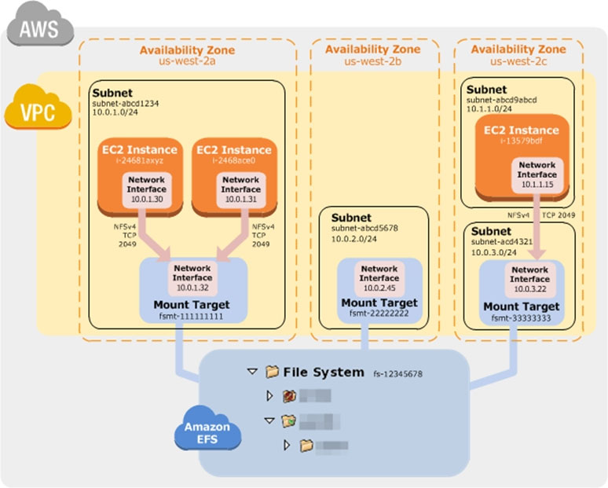

Benefits of Auto Scaling -
Better fault tolerance. Amazon EC2 Auto Scaling can detect when an instance is unhealthy, terminate it, and launch an instance to replace it. You can also configure Amazon EC2 Auto Scaling to use multiple Availability Zones. If one Availability Zone becomes unavailable, Amazon EC2 Auto Scaling can launch instances in another one to compensate.
Better availability. Amazon EC2 Auto Scaling helps ensure that your application always has the right amount of capacity to handle the current traffic demand.
Better cost management. Amazon EC2 Auto Scaling can dynamically increase and decrease capacity as needed. Because you pay for the EC2 instances you use, you save money by launching instances when they are needed and terminating them when they aren't.
Reference:
https://docs.aws.amazon.com/efs/latest/ug/how-it-works.html#how-it-works-ec2 https://docs.aws.amazon.com/autoscaling/ec2/userguide/auto-scaling-benefits.html

Question #49*Topic 1*

A security team to limit access to specific services or actions in all of the teamג€™s AWS accounts. All accounts belong to a large organization in AWS Organizations.
The solution must be scalable and there must be a single point where permissions can be maintained.
What should a solutions architect do to accomplish this?

- A. Create an ACL to provide access to the services or actions.
- B. Create a security group to allow accounts and attach it to user groups.
- C. Create cross-account roles in each account to deny access to the services or actions.
- ==D. Create a service control policy in the root organizational unit to deny access to the services or actions.==

[Hide Solution](https://www.examtopics.com/exams/amazon/aws-certified-solutions-architect-associate-saa-c02/view/5/#) [  Discussion  **34**](https://www.examtopics.com/exams/amazon/aws-certified-solutions-architect-associate-saa-c02/view/5/#)

**Correct Answer:** *D*
Service Control Policy concepts -
SCPs offer central access controls for all IAM entities in your accounts. You can use them to enforce the permissions you want everyone in your business to follow. Using SCPs, you can give your developers more freedom to manage their own permissions because you know they can only operate within the boundaries you define.
You create and apply SCPs through AWS Organizations. When you create an organization, AWS Organizations automatically creates a root, which forms the parent container for all the accounts in your organization. Inside the root, you can group accounts in your organization into organizational units (OUs) to simplify management of these accounts. You can create multiple OUs within a single organization, and you can create OUs within other OUs to form a hierarchical structure. You can attach SCPs to the organization root, OUs, and individual accounts. SCPs attached to the root and OUs apply to all OUs and accounts inside of them.
SCPs use the AWS Identity and Access Management (IAM) policy language; however, they do not grant permissions. SCPs enable you set permission guardrails by defining the maximum available permissions for IAM entities in an account. If a SCP denies an action for an account, none of the entities in the account can take that action, even if their IAM permissions allow them to do so. The guardrails set in SCPs apply to all
IAM entities in the account, which include all users, roles, and the account root user.
Reference:
https://aws.amazon.com/blogs/security/how-to-use-service-control-policies-to-set-permission-guardrails-across-accounts-in-your-aws-organization/
\#:~:text=Central%20security%20administrators%20use%20service,users%20and%20roles)%20adhere%20to.&text=Now%2C%20using%20SCPs%2C%20you%
20can,your%20organization%20or%20organizational%20unit
https://docs.aws.amazon.com/organizations/latest/userguide/orgs_manage_policies_scp.html

Question #50*Topic 1*

A data science team requires storage for nightly log processing. The size and number of logs is unknown and will persist for 24 hours only.
What is the MOST cost-effective solution?

- A. Amazon S3 Glacier
- ==B. Amazon S3 Standard==
- C. Amazon S3 Intelligent-Tiering
- D. Amazon S3 One Zone-Infrequent Access (S3 One Zone-IA)

[Hide Solution](https://www.examtopics.com/exams/amazon/aws-certified-solutions-architect-associate-saa-c02/view/5/#) [  Discussion  **147**](https://www.examtopics.com/exams/amazon/aws-certified-solutions-architect-associate-saa-c02/view/5/#)

**Correct Answer:** *B*
Reference:
https://aws.amazon.com/s3/storage-classes/#Unknown_or_changing_access

The S3 Standard-IA and S3 One Zone-IA storage classes are suitable for objects larger than 128 KB that you plan to store for at least 30 days. If you delete an object before the end of the 30-day minimum storage duration period, you are charged for 30 days.

Question #51*Topic 1*

A company is hosting a web application on AWS using a single Amazon EC2 instance that stores user-uploaded documents in an Amazon EBS volume. For better scalability and availability, the company duplicated the architecture and created a second EC2 instance and EBS volume in another Availability Zone, placing both behind an Application Load Balancer. After completing this change, users reported that each time they refreshed the website, they could see one subset of their documents or the other, but never all of the documents at the same time.
What should a solutions architect propose to ensure users see all of their documents at once?

- A. Copy the data so both EBS volumes contain all the documents.
- B. Configure the Application Load Balancer to direct a user to the server with the documents.
- ==C. Copy the data from both EBS volumes to Amazon EFS. Modify the application to save new documents to Amazon EFS.==
- D. Configure the Application Load Balancer to send the request to both servers. Return each document from the correct server.

[Hide Solution](https://www.examtopics.com/exams/amazon/aws-certified-solutions-architect-associate-saa-c02/view/6/#) [  Discussion  **25**](https://www.examtopics.com/exams/amazon/aws-certified-solutions-architect-associate-saa-c02/view/6/#)

**Correct Answer:** *C*
Amazon EFS provides file storage in the AWS Cloud. With Amazon EFS, you can create a file system, mount the file system on an Amazon EC2 instance, and then read and write data to and from your file system. You can mount an Amazon EFS file system in your VPC, through the Network File System versions 4.0 and
4.1 (NFSv4) protocol. We recommend using a current generation Linux NFSv4.1 client, such as those found in the latest Amazon Linux, Redhat, and Ubuntu
AMIs, in conjunction with the Amazon EFS Mount Helper. For instructions, see Using the amazon-efs-utils Tools.
For a list of Amazon EC2 Linux Amazon Machine Images (AMIs) that support this protocol, see NFS Support. For some AMIs, you'll need to install an NFS client to mount your file system on your Amazon EC2 instance. For instructions, see Installing the NFS Client.
You can access your Amazon EFS file system concurrently from multiple NFS clients, so applications that scale beyond a single connection can access a file system. Amazon EC2 instances running in multiple Availability Zones within the same AWS Region can access the file system, so that many users can access and share a common data source.
How Amazon EFS Works with Amazon EC2
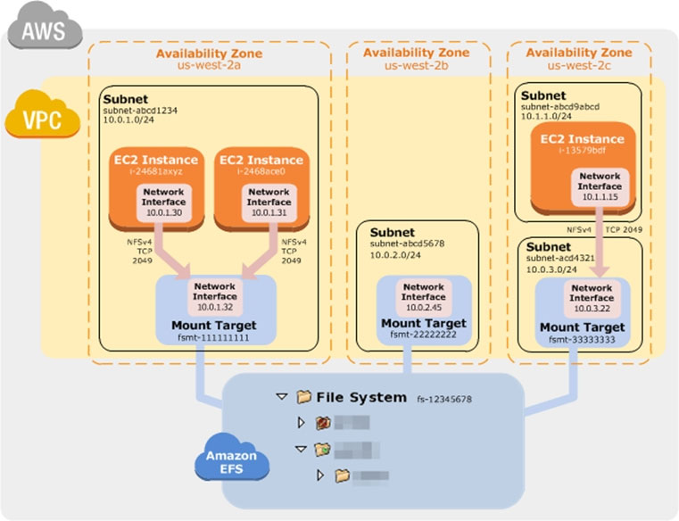
Reference:
https://docs.aws.amazon.com/efs/latest/ug/how-it-works.html#how-it-works-ec2

Question #52*Topic 1*

A company is planning to use Amazon S3 to store images uploaded by its users. The images must be encrypted at rest in Amazon S3. The company does not want to spend time managing and rotating the keys, but it does want to control who can access those keys.
What should a solutions architect use to accomplish this?

- A. Server-Side Encryption with keys stored in an S3 bucket
- B. Server-Side Encryption with Customer-Provided Keys (SSE-C)
- C. Server-Side Encryption with Amazon S3-Managed Keys (SSE-S3)
- ==D. Server-Side Encryption with AWS KMS-Managed Keys (SSE-KMS)==

[Hide Solution](https://www.examtopics.com/exams/amazon/aws-certified-solutions-architect-associate-saa-c02/view/6/#) [  Discussion  **32**](https://www.examtopics.com/exams/amazon/aws-certified-solutions-architect-associate-saa-c02/view/6/#)

**Correct Answer:** *D*
"Server-Side Encryption with Customer Master Keys (CMKs) Stored in AWS Key Management Service (SSE-KMS) is similar to SSE-S3, but with some additional benefits and charges for using this service. There are separate permissions for the use of a CMK that provides added protection against unauthorized access of your objects in Amazon S3. ==SSE-KMS also provides you with an audit trail that shows when your CMK was used and by whom==."
Server-Side Encryption: Using SSE-KMS
You can protect data at rest in Amazon S3 by using three different modes of server-side encryption: SSE-S3, SSE-C, or SSE-KMS.
==SSE-S3 requires that Amazon S3 manage the data and master encryption keys==. For more information about SSE-S3, see Protecting Data Using Server-Side Encryption with Amazon S3-Managed Encryption Keys (SSE-S3).
==SSE-C requires that you manage the encryption key==. For more information about SSE-C, see Protecting Data Using Server-Side Encryption with Customer-Provided Encryption Keys (SSE-C).
==SSE-KMS requires that AWS manage the data key but you manage the customer master key (CMK) in AWS KMS.==
The remainder of this topic discusses how to protect data by using server-side encryption with AWS KMS-managed keys (SSE-KMS).
You can request encryption and select a CMK by using the Amazon S3 console or API. In the console, check the appropriate box to perform encryption and select your CMK from the list. For the Amazon S3 API, specify encryption and choose your CMK by setting the appropriate headers in a GET or PUT request.
Reference:
https://aws.amazon.com/kms/faqs/
https://docs.aws.amazon.com/AmazonS3/latest/dev/serv-side-encryption.html https://docs.aws.amazon.com/kms/latest/developerguide/services-s3.html#sse

Question #53*Topic 1*

A company is running an ecommerce application on Amazon EC2. The application consists of a stateless web tier that requires a minimum of 10 instances, and a peak of 250 instances to support the applicationג€™s usage. The application requires 50 instances 80% of the time.
Which solution should be used to minimize costs?

- A. Purchase Reserved Instances to cover 250 instances.
- B. Purchase Reserved Instances to cover 80 instances. Use Spot Instances to cover the remaining instances.
- C. Purchase On-Demand Instances to cover 40 instances. Use Spot Instances to cover the remaining instances.
- ==D. Purchase Reserved Instances to cover 50 instances. Use On-Demand and Spot Instances to cover the remaining instances.==

[Hide Solution](https://www.examtopics.com/exams/amazon/aws-certified-solutions-architect-associate-saa-c02/view/6/#) [  Discussion  **51**](https://www.examtopics.com/exams/amazon/aws-certified-solutions-architect-associate-saa-c02/view/6/#)

**Correct Answer:** *D*
Reserved Instances -
Having 50 EC2 RIs provide a discounted hourly rate and an optional capacity reservation for EC2 instances. AWS Billing automatically applies your RIג€™s discounted rate when attributes of EC2 instance usage match attributes of an active RI.
If an Availability Zone is specified, EC2 reserves capacity matching the attributes of the RI. The capacity reservation of an RI is automatically utilized by running instances matching these attributes.
You can also choose to forego the capacity reservation and purchase an RI that is scoped to a region. RIs that are scoped to a region automatically apply the RIג€™s discount to instance usage across AZs and instance sizes in a region, making it easier for you to take advantage of the RIג€™s discounted rate.

On-Demand Instance -
On-Demand instances let you pay for compute capacity by the hour or second (minimum of 60 seconds) with no long-term commitments. This frees you from the costs and complexities of planning, purchasing, and maintaining hardware and transforms what are commonly large fixed costs into much smaller variable costs.
The pricing below includes the cost to run private and public AMIs on the specified operating system (ג€Windows Usageג€ prices apply to Windows Server 2003 R2,
2008, 2008 R2, 2012, 2012 R2, 2016, and 2019). Amazon also provides you with additional instances for Amazon EC2 running Microsoft Windows with SQL
Server, Amazon EC2 running SUSE Linux Enterprise Server, Amazon EC2 running Red Hat Enterprise Linux and Amazon EC2 running IBM that are priced differently.

Spot Instances -
A Spot Instance is an unused EC2 instance that is available for less than the On-Demand price. Because Spot Instances enable you to request unused EC2 instances at steep discounts, you can lower your Amazon EC2 costs significantly. The hourly price for a Spot Instance is called a Spot price. The Spot price of each instance type in each Availability Zone is set by Amazon EC2, and adjusted gradually based on the long-term supply of and demand for Spot Instances. Your
Spot Instance runs whenever capacity is available and the maximum price per hour for your request exceeds the Spot price.
Reference:
https://aws.amazon.com/ec2/pricing/reserved-instances/
https://aws.amazon.com/ec2/pricing/on-demand/
https://docs.aws.amazon.com/AWSEC2/latest/UserGuide/using-spot-instances.html

==Question #54*Topic 1*==

A company has deployed an API in a VPC behind an internet-facing Application Load Balancer (ALB). An application that consumes the API as a client is deployed in a second account in private subnets behind a NAT gateway. When requests to the client application increase, the NAT gateway costs are higher than expected. A solutions architect has configured the ALB to be internal.
Which combination of architectural changes will reduce the NAT gateway costs? (Choose two.)

- ==A. Configure a VPC peering connection between the two VPCs. Access the API using the private address.==
- B. Configure an AWS Direct Connect connection between the two VPCs. Access the API using the private address.
- C. Configure a ClassicLink connection for the API into the client VPC. Access the API using the ClassicLink address.
- ==D. Configure a PrivateLink connection for the API into the client VPC. Access the API using the PrivateLink address.==
- ==E. Configure an AWS Resource Access Manager connection between the two accounts. Access the API using the private address.==

[Hide Solution](https://www.examtopics.com/exams/amazon/aws-certified-solutions-architect-associate-saa-c02/view/6/#) [  Discussion  **152**](https://www.examtopics.com/exams/amazon/aws-certified-solutions-architect-associate-saa-c02/view/6/#)

**Correct Answer:** *DE*

Question #55*Topic 1*

A solutions architect is tasked with transferring 750 TB of data from a network-attached file system located at a branch office Amazon S3 Glacier. The solution must avoid saturating the branch officeג€™s low-bandwidth internet connection.
What is the MOST cost-effective solution?

- A. Create a site-to-site VPN tunnel to an Amazon S3 bucket and transfer the files directly. Create a bucket policy to enforce a VPC endpoint.
- B. Order 10 AWS Snowball appliances and select an S3 Glacier vault as the destination. Create a bucket policy to enforce a VPC endpoint.
- C. Mount the network-attached file system to Amazon S3 and copy the files directly. Create a lifecycle policy to transition the S3 objects to Amazon S3 Glacier.
- ==D. Order 10 AWS Snowball appliances and select an Amazon S3 bucket as the destination. Create a lifecycle policy to transition the S3 objects to Amazon S3 Glacier.==

[Hide Solution](https://www.examtopics.com/exams/amazon/aws-certified-solutions-architect-associate-saa-c02/view/6/#) [  Discussion  **12**](https://www.examtopics.com/exams/amazon/aws-certified-solutions-architect-associate-saa-c02/view/6/#)

**Correct Answer:** *B*

Question #56*Topic 1*

A company has a two-tier application architecture that runs in public and private subnets. Amazon EC2 instances running the web application are in the public subnet and a database runs on the private subnet. The web application instances and the database are running in a single Availability Zone (AZ).
Which combination of steps should a solutions architect take to provide high availability for this architecture? (Choose two.)

- A. Create new public and private subnets in the same AZ for high availability.
- ==B. Create an Amazon EC2 Auto Scaling group and Application Load Balancer spanning multiple AZs.==
- C. Add the existing web application instances to an Auto Scaling group behind an Application Load Balancer.
- D. Create new public and private subnets in a new AZ. Create a database using Amazon EC2 in one AZ.
- ==E. Create new public and private subnets in the same VPC, each in a new AZ. Migrate the database to an Amazon RDS multi-AZ deployment.==

[Hide Solution](https://www.examtopics.com/exams/amazon/aws-certified-solutions-architect-associate-saa-c02/view/6/#) [  Discussion  **52**](https://www.examtopics.com/exams/amazon/aws-certified-solutions-architect-associate-saa-c02/view/6/#)

**Correct Answer:** *BE*

Question #57*Topic 1*

A solutions architect is implementing a document review application using an Amazon S3 bucket for storage. The solution must prevent an accidental deletion of the documents and ensure that all versions of the documents are available. Users must be able to download, modify, and upload documents.
Which combination of actions should be taken to meet these requirements? (Choose two.)

- A. Enable a read-only bucket ACL.
- ==B. Enable versioning on the bucket.==
- C. Attach an IAM policy to the bucket.
- ==D. Enable MFA Delete on the bucket.==
- E. Encrypt the bucket using AWS KMS.

[Hide Solution](https://www.examtopics.com/exams/amazon/aws-certified-solutions-architect-associate-saa-c02/view/6/#) [  Discussion  **54**](https://www.examtopics.com/exams/amazon/aws-certified-solutions-architect-associate-saa-c02/view/6/#)

**Correct Answer:** *BD*
Object Versioning -
[1]
(version 222222) in a single bucket. S3 Versioning protects you from the consequences of unintended overwrites and deletions. You can also use it to archive objects so that you have access to previous versions.
To customize your data retention approach and control storage costs, use object versioning with Object lifecycle management. For information about creating S3
Lifecycle policies using the AWS Management Console, see How Do I Create a Lifecycle Policy for an S3 Bucket? in the Amazon Simple Storage Service Console
User Guide.
If you have an object expiration lifecycle policy in your non-versioned bucket and you want to maintain the same permanent delete behavior when you enable versioning, you must add a noncurrent expiration policy. The noncurrent expiration lifecycle policy will manage the deletes of the noncurrent object versions in the version-enabled bucket. (A version-enabled bucket maintains one current and zero or more noncurrent object versions.)
You must explicitly enable S3 Versioning on your bucket. By default, S3 Versioning is disabled. Regardless of whether you have enabled Versioning, each object in your bucket has a version ID. If you have not enabled Versioning, Amazon S3 sets the value of the version ID to null. If S3 Versioning is enabled, Amazon S3 assigns a version ID value for the object. This value distinguishes it from other versions of the same key.
Enabling and suspending versioning is done at the bucket level. When you enable versioning on an existing bucket, objects that are already stored in the bucket are unchanged. The version IDs (null), contents, and permissions remain the same. After you enable S3 Versioning for a bucket, each object that is added to the bucket gets a version ID, which distinguishes it from other versions of the same key.
Only Amazon S3 generates version IDs, and they canג€™t be edited. Version IDs are Unicode, UTF-8 encoded, URL-ready, opaque strings that are no more than
1,024 bytes long. The following is an example: 3/L4kqtJlcpXroDTDmJ+rmSpXd3dIbrHY+MTRCxf3vjVBH40Nr8X8gdRQBpUMLUo.

Using MFA delete -
If a bucket's versioning configuration is MFA Deleteג€"enabled, the bucket owner must include the x-amz-mfa request header in requests to permanently delete an object version or change the versioning state of the bucket. Requests that include x-amz-mfa must use HTTPS. The header's value is the concatenation of your authentication device's serial number, a space, and the authentication code displayed on it. If you do not include this request header, the request fails.
Reference:
https://aws.amazon.com/s3/features/
https://docs.aws.amazon.com/AmazonS3/latest/dev/ObjectVersioning.html https://docs.aws.amazon.com/AmazonS3/latest/dev/UsingMFADelete.html

Question #58*Topic 1*

An application hosted on AWS is experiencing performance problems, and the application vendor wants to perform an analysis of the log file to troubleshoot further. The log file is stored on Amazon S3 and is 10 GB in size. The application owner will make the log file available to the vendor for a limited time.
What is the MOST secure way to do this?

- A. Enable public read on the S3 object and provide the link to the vendor.
- B. Upload the file to Amazon WorkDocs and share the public link with the vendor.
- ==C. Generate a presigned URL and have the vendor download the log file before it expires.==
- D. Create an IAM user for the vendor to provide access to the S3 bucket and the application. Enforce multi-factor authentication.

[Hide Solution](https://www.examtopics.com/exams/amazon/aws-certified-solutions-architect-associate-saa-c02/view/6/#) [  Discussion  **34**](https://www.examtopics.com/exams/amazon/aws-certified-solutions-architect-associate-saa-c02/view/6/#)

**Correct Answer:** *C*
Share an object with others -
All objects by default are private. Only the object owner has permission to access these objects. However, the object owner can optionally share objects with others by creating a presigned URL, using their own security credentials, to grant time-limited permission to download the objects.
When you create a presigned URL for your object, you must provide your security credentials, specify a bucket name, an object key, specify the HTTP method
(GET to download the object) and expiration date and time. The presigned URLs are valid only for the specified duration.
Anyone who receives the presigned URL can then access the object. For example, if you have a video in your bucket and both the bucket and the object are private, you can share the video with others by generating a presigned URL.
Reference:
https://docs.aws.amazon.com/AmazonS3/latest/dev/ShareObjectPreSignedURL.html

Question #59*Topic 1*

A solutions architect is designing a two-tier web application. The application consists of a public-facing web tier hosted on Amazon EC2 in public subnets. The database tier consists of Microsoft SQL Server running on Amazon EC2 in a private subnet. Security is a high priority for the company.
How should security groups be configured in this situation? (Choose two.)

- ==A. Configure the security group for the web tier to allow inbound traffic on port 443 from 0.0.0.0/0.==
- B. Configure the security group for the web tier to allow outbound traffic on port 443 from 0.0.0.0/0.
- ==C. Configure the security group for the database tier to allow inbound traffic on port 1433 from the security group for the web tier.==
- D. Configure the security group for the database tier to allow outbound traffic on ports 443 and 1433 to the security group for the web tier.
- E. Configure the security group for the database tier to allow inbound traffic on ports 443 and 1433 from the security group for the web tier.

[Hide Solution](https://www.examtopics.com/exams/amazon/aws-certified-solutions-architect-associate-saa-c02/view/6/#) [  Discussion  **12**](https://www.examtopics.com/exams/amazon/aws-certified-solutions-architect-associate-saa-c02/view/6/#)

**Correct Answer:** *AC*

Question #60*Topic 1*

A company allows its developers to attach existing IAM policies to existing IAM roles to enable faster experimentation and agility. However, the security operations team is concerned that the developers could attach the existing administrator policy, which would allow the developers to circumvent any other security policies.
How should a solutions architect address this issue?

- A. Create an Amazon SNS topic to send an alert every time a developer creates a new policy.
- B. Use service control policies to disable IAM activity across all account in the organizational unit.
- C. Prevent the developers from attaching any policies and assign all IAM duties to the security operations team.
- ==D. Set an IAM permissions boundary on the developer IAM role that explicitly denies attaching the administrator policy.==

[Hide Solution](https://www.examtopics.com/exams/amazon/aws-certified-solutions-architect-associate-saa-c02/view/6/#) [  Discussion  **29**](https://www.examtopics.com/exams/amazon/aws-certified-solutions-architect-associate-saa-c02/view/6/#)
you can assign permission boundaries only to users and roles, not groups

**Correct Answer:** *D*
Reference:
https://docs.aws.amazon.com/IAM/latest/UserGuide/access_policies_boundaries.html

Question #61*Topic 1*

A company has a multi-tier application that runs six front-end web servers in an Amazon EC2 Auto Scaling group in a single Availability Zone behind an
Application Load Balancer (ALB). A solutions architect needs to modify the infrastructure to be highly available without modifying the application.
Which architecture should the solutions architect choose that provides high availability?

- A. Create an Auto Scaling group that uses three instances across each of two Regions.
- ==B. Modify the Auto Scaling group to use three instances across each of two Availability Zones.==
- C. Create an Auto Scaling template that can be used to quickly create more instances in another Region.
- D. Change the ALB in front of the Amazon EC2 instances in a round-robin configuration to balance traffic to the web tier.

[Hide Solution](https://www.examtopics.com/exams/amazon/aws-certified-solutions-architect-associate-saa-c02/view/7/#) [  Discussion  **44**](https://www.examtopics.com/exams/amazon/aws-certified-solutions-architect-associate-saa-c02/view/7/#)

**Correct Answer:** *B*
Expanding Your Scaled and Load-Balanced Application to an Additional Availability Zone.
When one Availability Zone becomes unhealthy or unavailable, Amazon EC2 Auto Scaling launches new instances in an unaffected zone. When the unhealthy
Availability Zone returns to a healthy state, Amazon EC2 Auto Scaling automatically redistributes the application instances evenly across all of the zones for your
Auto Scaling group. Amazon EC2 Auto Scaling does this by attempting to launch new instances in the Availability Zone with the fewest instances. If the attempt fails, however, Amazon EC2 Auto Scaling attempts to launch in other Availability Zones until it succeeds.
You can expand the availability of your scaled and load-balanced application by adding an Availability Zone to your Auto Scaling group and then enabling that zone for your load balancer. After you've enabled the new Availability Zone, the load balancer begins to route traffic equally among all the enabled zones.
Reference:
https://docs.aws.amazon.com/autoscaling/ec2/userguide/as-add-availability-zone.html

Question #62*Topic 1*

A company runs an application on a group of Amazon Linux EC2 instances. The application writes log files using standard API calls. For compliance reasons, all log files must be retained indefinitely and will be analyzed by a reporting tool that must access all files concurrently.
Which storage service should a solutions architect use to provide the MOST cost-effective solution?

- A. Amazon EBS
- B. Amazon EFS
- C. Amazon EC2 instance store
- ==D. Amazon S3==

[Hide Solution](https://www.examtopics.com/exams/amazon/aws-certified-solutions-architect-associate-saa-c02/view/7/#) [  Discussion  **41**](https://www.examtopics.com/exams/amazon/aws-certified-solutions-architect-associate-saa-c02/view/7/#)

**Correct Answer:** *D*
Amazon S3 -
Requests to Amazon S3 can be authenticated or anonymous. Authenticated access requires credentials that AWS can use to authenticate your requests. When making REST API calls directly from your code, you create a signature using valid credentials and include the signature in your request. Amazon Simple Storage
Service (Amazon S3) is an object storage service that offers industry-leading scalability, data availability, security, and performance. This means customers of all sizes and industries can use it to store and protect any amount of data for a range of use cases, such as websites, mobile applications, backup and restore, archive, enterprise applications, IoT devices, and big data analytics. Amazon S3 provides easy-to-use management features so you can organize your data and configure finely-tuned access controls to meet your specific business, organizational, and compliance requirements. Amazon S3 is designed for 99.999999999%
(11 9's) of durability, and stores data for millions of applications for companies all around the world.
Reference:
https://aws.amazon.com/s3/

Question #63*Topic 1*

A media streaming company collects real-time data and stores it in a disk-optimized database system. The company is not getting the expected throughput and wants an in-memory database storage solution that performs faster and provides high availability using data replication.
Which database should a solutions architect recommend?

- A. Amazon RDS for MySQL
- B. Amazon RDS for PostgreSQL.
- ==C. Amazon ElastiCache for Redis==
- D. Amazon ElastiCache for Memcached

[Hide Solution](https://www.examtopics.com/exams/amazon/aws-certified-solutions-architect-associate-saa-c02/view/7/#) [  Discussion  **39**](https://www.examtopics.com/exams/amazon/aws-certified-solutions-architect-associate-saa-c02/view/7/#)

**Correct Answer:** *C*
In-memory databases on AWS Amazon Elasticache for Redis.
Amazon ElastiCache for Redis is a blazing fast in-memory data store that provides submillisecond latency to power internet-scale, real-time applications.
Developers can use ElastiCache for Redis as an in-memory nonrelational database. The ElastiCache for Redis cluster configuration supports up to 15 shards and enables customers to run Redis workloads with up to 6.1 TB of in-memory capacity in a single cluster. ElastiCache for Redis also provides the ability to add and remove shards from a running cluster. You can dynamically scaleout and even scale in your Redis cluster workloads to adapt to changes in demand.
Reference:
https://aws.amazon.com/elasticache/redis/faqs/
https://aws.amazon.com/nosql/in-memory/

Question #64*Topic 1*

A company hosts its product information webpages on AWS. The existing solution uses multiple Amazon C2 instances behind an Application Load Balancer in an
Auto Scaling group. The website also uses a custom DNS name and communicates with HTTPS only using a dedicated SSL certificate. The company is planning a new product launch and wants to be sure that users from around the world have the best possible experience on the new website.
What should a solutions architect do to meet these requirements?

- ==A. Redesign the application to use Amazon CloudFront.==
- B. Redesign the application to use AWS Elastic Beanstalk.
- C. Redesign the application to use a Network Load Balancer.
- D. Redesign the application to use Amazon S3 static website hosting.

[Hide Solution](https://www.examtopics.com/exams/amazon/aws-certified-solutions-architect-associate-saa-c02/view/7/#) [  Discussion  **31**](https://www.examtopics.com/exams/amazon/aws-certified-solutions-architect-associate-saa-c02/view/7/#)

**Correct Answer:** *A*
What Is Amazon CloudFront?
Amazon CloudFront is a web service that speeds up distribution of your static and dynamic web content, such as .html, .css, .js, and image files, to your users.
CloudFront delivers your content through a worldwide network of data centers called edge locations. When a user requests content that you're serving with
CloudFront, the user is routed to the edge location that provides the lowest latency (time delay), so that content is delivered with the best possible performance.
If the content is already in the edge location with the lowest latency, CloudFront delivers it immediately.
If the content is not in that edge location, CloudFront retrieves it from an origin that you've defined ג€" such as an Amazon S3 bucket, a MediaPackage channel, or an HTTP server (for example, a web server) that you have identified as the source for the definitive version of your content.
As an example, suppose that you're serving an image from a traditional web server, not from CloudFront. For example, you might serve an image,
[1]
Your users can easily navigate to this URL and see the image. But they probably don't know that their request was routed from one network to another ג€" through the complex collection of interconnected networks that comprise the internet ג€" until the image was found.
CloudFront speeds up the distribution of your content by routing each user request through the AWS backbone network to the edge location that can best serve your content. Typically, this is a CloudFront edge server that provides the fastest delivery to the viewer. Using the AWS network dramatically reduces the number of networks that your users' requests must pass through, which improves performance. Users get lower latency ג€" the time it takes to load the first byte of the file ג€" and higher data transfer rates.
You also get increased reliability and availability because copies of your files (also known as objects) are now held (or cached) in multiple edge locations around the world.
Reference:
https://docs.aws.amazon.com/AmazonCloudFront/latest/DeveloperGuide/Introduction.html

Question #65*Topic 1*

A solutions architect is designing the cloud architecture for a new application being deployed on AWS. The process should run in parallel while adding and removing application nodes as needed based on the number of jobs to be processed. The processor application is stateless. The solutions architect must ensure that the application is loosely coupled and the job items are durably stored.
Which design should the solutions architect use?

- A. Create an Amazon SNS topic to send the jobs that need to be processed. Create an Amazon Machine Image (AMI) that consists of the processor application. Create a launch configuration that uses the AMI. Create an Auto Scaling group using the launch configuration. Set the scaling policy for the Auto Scaling group to add and remove nodes based on CPU usage.
- B. Create an Amazon SQS queue to hold the jobs that need to be processed. Create an Amazon Machine Image (AMI) that consists of the processor application. Create a launch configuration that uses the AMI. Create an Auto Scaling group using the launch configuration. Set the scaling policy for the Auto Scaling group to add and remove nodes based on network usage.
- ==C. Create an Amazon SQS queue to hold the jobs that need to be processed. Create an Amazon Machine Image (AMI) that consists of the processor application. Create a launch template that uses the AMI. Create an Auto Scaling group using the launch template. Set the scaling policy for the Auto Scaling group to add and remove nodes based on the number of items in the SQS queue.==
- D. Create an Amazon SNS topic to send the jobs that need to be processed. Create an Amazon Machine Image (AMI) that consists of the processor application. Create a launch template that uses the AMI. Create an Auto Scaling group using the launch template. Set the scaling policy for the Auto Scaling group to add and remove nodes based on the number of messages published to the SNS topic.

[Hide Solution](https://www.examtopics.com/exams/amazon/aws-certified-solutions-architect-associate-saa-c02/view/7/#) [  Discussion  **43**](https://www.examtopics.com/exams/amazon/aws-certified-solutions-architect-associate-saa-c02/view/7/#)

**Correct Answer:** *C*
Amazon Simple Queue Service -
Amazon Simple Queue Service (SQS) is a fully managed message queuing service that enables you to decouple and scale microservices, distributed systems, and serverless applications. SQS eliminates the complexity and overhead associated with managing and operating message oriented middleware, and empowers developers to focus on differentiating work. Using SQS, you can send, store, and receive messages between software components at any volume, without losing messages or requiring other services to be available. Get started with SQS in minutes using the AWS console, Command Line Interface or SDK of your choice, and three simple commands.
SQS offers two types of message queues. Standard queues offer maximum throughput, best-effort ordering, and at-least-once delivery. SQS FIFO queues are designed to guarantee that messages are processed exactly once, in the exact order that they are sent.

Scaling Based on Amazon SQS -
There are some scenarios where you might think about scaling in response to activity in an Amazon SQS queue. For example, suppose that you have a web app that lets users upload images and use them online. In this scenario, each image requires resizing and encoding before it can be published. The app runs on EC2 instances in an Auto Scaling group, and it's configured to handle your typical upload rates. Unhealthy instances are terminated and replaced to maintain current instance levels at all times. The app places the raw bitmap data of the images in an SQS queue for processing. It processes the images and then publishes the processed images where they can be viewed by users. The architecture for this scenario works well if the number of image uploads doesn't vary over time. But if the number of uploads changes over time, you might consider using dynamic scaling to scale the capacity of your Auto Scaling group.
Reference:
https://aws.amazon.com/sqs/#:~:text=Amazon%20SQS%20leverages%20the%20AWS,queues%20provide%20nearly%20unlimited%20throughput https://docs.aws.amazon.com/autoscaling/ec2/userguide/as-using-sqs-queue.html

Question #66*Topic 1*

A marketing company is storing CSV files in an Amazon S3 bucket for statistical analysis. An application on an Amazon EC2 instance needs permission to efficiently process the CSV data stored in the S3 bucket.
Which action will MOST securely grant the EC2 instance access to the S3 bucket?

- A. Attach a resource-based policy to the S3 bucket.
- B. Create an IAM user for the application with specific permissions to the S3 bucket.
- ==C. Associate an IAM role with least privilege permissions to the EC2 instance profile.==
- D. Store AWS credentials directly on the EC2 instance for applications on the instance to use for API calls.

[Hide Solution](https://www.examtopics.com/exams/amazon/aws-certified-solutions-architect-associate-saa-c02/view/7/#) [  Discussion  **46**](https://www.examtopics.com/exams/amazon/aws-certified-solutions-architect-associate-saa-c02/view/7/#)

**Correct Answer:** *C*

Question #67*Topic 1*

A company has on-premises servers running a relational database. The current database serves high read traffic for users in different locations. The company wants to migrate to AWS with the least amount of effort. The database solution should support disaster recovery and not affect the companyג€™s current traffic flow.
Which solution meets these requirements?

- ==A. Use a database in Amazon RDS with Multi-AZ and at least one read replica.==
- B. Use a database in Amazon RDS with Multi-AZ and at least one standby replica.
- C. Use databases hosted on multiple Amazon EC2 instances in different AWS Regions.
- D. Use databases hosted on Amazon EC2 instances behind an Application Load Balancer in different Availability Zones.

[Hide Solution](https://www.examtopics.com/exams/amazon/aws-certified-solutions-architect-associate-saa-c02/view/7/#) [  Discussion  **57**](https://www.examtopics.com/exams/amazon/aws-certified-solutions-architect-associate-saa-c02/view/7/#)

**Correct Answer:** *A*
Reference:
https://aws.amazon.com/blogs/database/implementing-a-disaster-recovery-strategy-with-amazon-rds/

Question #68*Topic 1*

A companyג€™s application is running on Amazon EC2 instances within an Auto Scaling group behind an Elastic Load Balancer. Based on the applicationג€™s history the company anticipates a spike in traffic during a holiday each year. A solutions architect must design a strategy to ensure that the Auto Scaling group proactively increases capacity to minimize any performance impact on application users.
Which solution will meet these requirements?

- A. Create an Amazon CloudWatch alarm to scale up the EC2 instances when CPU utilization exceeds 90%.
- ==B. Create a recurring scheduled action to scale up the Auto Scaling group before the expected period of peak demand.==
- C. Increase the minimum and maximum number of EC2 instances in the Auto Scaling group during the peak demand period.
- D. Configure an Amazon Simple Notification Service (Amazon SNS) notification to send alerts when there are autoscaling EC2_INSTANCE_LAUNCH events.

[Hide Solution](https://www.examtopics.com/exams/amazon/aws-certified-solutions-architect-associate-saa-c02/view/7/#) [  Discussion  **41**](https://www.examtopics.com/exams/amazon/aws-certified-solutions-architect-associate-saa-c02/view/7/#)

**Correct Answer:** *B*

Question #69*Topic 1*

A company hosts an application on multiple Amazon EC2 instances. The application processes messages from an Amazon SQS queue, writes for an Amazon

RDS table, and deletes -
the message from the queue. Occasional duplicate records are found in the RDS table. The SQS queue does not contain any duplicate messages.
What should a solutions architect do to ensure messages are being processed once only?

- A. Use the CreateQueue API call to create a new queue.
- B. Use the AddPermission API call to add appropriate permissions.
- C. Use the ReceiveMessage API call to set an appropriate wait time.
- ==D. Use the ChangeMessageVisibility API call to increase the visibility timeout.==

[Hide Solution](https://www.examtopics.com/exams/amazon/aws-certified-solutions-architect-associate-saa-c02/view/7/#) [  Discussion  **33**](https://www.examtopics.com/exams/amazon/aws-certified-solutions-architect-associate-saa-c02/view/7/#)

**Correct Answer:** *D*

Question #70*Topic 1*

An Amazon EC2 administrator created the following policy associated with an IAM group containing several users:
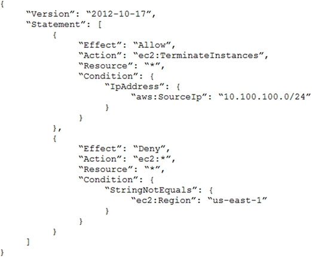
What is the effect of this policy?

- A. Users can terminate an EC2 instance in any AWS Region except us-east-1.
- B. Users can terminate an EC2 instance with the IP address 10.100.100.1 in the us-east-1 Region.
- ==C. Users can terminate an EC2 instance in the us-east-1 Region when the userג€™s source IP is 10.100.100.254.==
- D. Users cannot terminate an EC2 instance in the us-east-1 Region when the userג€™s source IP is 10.100.100.254.

[Hide Solution](https://www.examtopics.com/exams/amazon/aws-certified-solutions-architect-associate-saa-c02/view/7/#) [  Discussion  **60**](https://www.examtopics.com/exams/amazon/aws-certified-solutions-architect-associate-saa-c02/view/7/#)

**Correct Answer:** *C*

Question #71*Topic 1*

A solutions architect is optimizing a website for an upcoming musical event. Videos of the performances will be streamed in real time and then will be available on demand. The event is expected to attract a global online audience.
Which service will improve the performance of both the real-time and on-demand steaming?

- ==A. Amazon CloudFront==
- B. AWS Global Accelerator
- C. Amazon Route S3
- D. Amazon S3 Transfer Acceleration

[Hide Solution](https://www.examtopics.com/exams/amazon/aws-certified-solutions-architect-associate-saa-c02/view/8/#) [  Discussion  **32**](https://www.examtopics.com/exams/amazon/aws-certified-solutions-architect-associate-saa-c02/view/8/#)

**Correct Answer:** *A*
Reference:
https://docs.aws.amazon.com/AmazonCloudFront/latest/DeveloperGuide/on-demand-streaming-video.html

Question #72*Topic 1*

A company has a three-tier image-sharing application. It uses an Amazon EC2 instance for the front-end layer, another for the backend tier, and a third for the
MySQL database. A solutions architect has been tasked with designing a solution that is highly available, and requires the least amount of changes to the application
Which solution meets these requirements?

- A. Use Amazon S3 to host the front-end layer and AWS Lambda functions for the backend layer. Move the database to an Amazon DynamoDB table and use Amazon S3 to store and serve usersג€™ images.
- B. Use load-balanced Multi-AZ AWS Elastic Beanstalk environments for the front-end and backend layers. Move the database to an Amazon RDS instance with multiple read replicas to store and serve usersג€™ images.
- C. Use Amazon S3 to host the front-end layer and a fleet of Amazon EC2 instances in an Auto Scaling group for the backend layer. Move the database to a memory optimized instance type to store and serve usersג€™ images.
- ==D. Use load-balanced Multi-AZ AWS Elastic Beanstalk environments for the front-end and backend layers. Move the database to an Amazon RDS instance with a Multi-AZ deployment. Use Amazon S3 to store and serve usersג€™ images.==

[Hide Solution](https://www.examtopics.com/exams/amazon/aws-certified-solutions-architect-associate-saa-c02/view/8/#) [  Discussion  **61**](https://www.examtopics.com/exams/amazon/aws-certified-solutions-architect-associate-saa-c02/view/8/#)

**Correct Answer:** *D*

Question #73*Topic 1*

A solutions architect is designing a system to analyze the performance of financial markets while the markets are closed. The system will run a series of compute- intensive jobs for 4 hours every night. The time to complete the compute jobs is expected to remain constant, and jobs cannot be interrupted once started. Once completed, the system is expected to run for a minimum of 1 year.
Which type of Amazon EC2 instances should be used to reduce the cost of the system?

- A. Spot Instances
- B. On-Demand Instances
- C. Standard Reserved Instances
- ==D. Scheduled Reserved Instances==

[Hide Solution](https://www.examtopics.com/exams/amazon/aws-certified-solutions-architect-associate-saa-c02/view/8/#) [  Discussion  **41**](https://www.examtopics.com/exams/amazon/aws-certified-solutions-architect-associate-saa-c02/view/8/#)

**Correct Answer:** *D*
Reference:
https://docs.aws.amazon.com/AWSEC2/latest/UserGuide/ec2-scheduled-instances.html

Question #74*Topic 1*

A company built a food ordering application that captures user data and stores it for future analysis. The applicationג€™s static front end is deployed on an Amazon
EC2 instance. The front-end application sends the requests to the backend application running on separate EC2 instance. The backend application then stores the data in Amazon RDS.
What should a solutions architect do to decouple the architecture and make it scalable?

- A. Use Amazon S3 to serve the front-end application, which sends requests to Amazon EC2 to execute the backend application. The backend application will process and store the data in Amazon RDS.
- B. Use Amazon S3 to serve the front-end application and write requests to an Amazon Simple Notification Service (Amazon SNS) topic. Subscribe Amazon EC2 instances to the HTTP/HTTPS endpoint of the topic, and process and store the data in Amazon RDS.
- C. Use an EC2 instance to serve the front end and write requests to an Amazon SQS queue. Place the backend instance in an Auto Scaling group, and scale based on the queue depth to process and store the data in Amazon RDS.
- ==D. Use Amazon S3 to serve the static front-end application and send requests to Amazon API Gateway, which writes the requests to an Amazon SQS queue. Place the backend instances in an Auto Scaling group, and scale based on the queue depth to process and store the data in Amazon RDS.==

[Hide Solution](https://www.examtopics.com/exams/amazon/aws-certified-solutions-architect-associate-saa-c02/view/8/#) [  Discussion  **39**](https://www.examtopics.com/exams/amazon/aws-certified-solutions-architect-associate-saa-c02/view/8/#)

**Correct Answer:** *D*

Question #75*Topic 1*

A solutions architect needs to design a managed storage solution for a companyג€™s application that includes high-performance machine learning. This application runs on AWS Fargate, and the connected storage needs to have concurrent access to files and deliver high performance.
Which storage option should the solutions architect recommend?

- A. Create an Amazon S3 bucket for the application and establish an IAM role for Fargate to communicate with Amazon S3.
- ==B. Create an Amazon FSx for Lustre file share and establish an IAM role that allows Fargate to communicate with FSx for Lustre.==
- C. Create an Amazon Elastic File System (Amazon EFS) file share and establish an IAM role that allows Fargate to communicate with Amazon EFS.
- D. Create an Amazon Elastic Block Store (Amazon EBS) volume for the application and establish an IAM role that allows Fargate to communicate with Amazon EBS.

[Hide Solution](https://www.examtopics.com/exams/amazon/aws-certified-solutions-architect-associate-saa-c02/view/8/#) [  Discussion  **100**](https://www.examtopics.com/exams/amazon/aws-certified-solutions-architect-associate-saa-c02/view/8/#)

**Correct Answer:** *B*

Question #76*Topic 1*

A bicycle sharing company is developing a multi-tier architecture to track the location of its bicycles during peak operating hours. The company wants to use these data points in its existing analytics platform. A solutions architect must determine the most viable multi-tier option to support this architecture. The data points must be accessible from the REST API.
Which action meets these requirements for storing and retrieving location data?

- A. Use Amazon Athena with Amazon S3.
- B. Use Amazon API Gateway with AWS Lambda.
- C. Use Amazon QuickSight with Amazon Redshift.
- ==D. Use Amazon API Gateway with Amazon Kinesis Data Analytics.==

[Hide Solution](https://www.examtopics.com/exams/amazon/aws-certified-solutions-architect-associate-saa-c02/view/8/#) [  Discussion  **116**](https://www.examtopics.com/exams/amazon/aws-certified-solutions-architect-associate-saa-c02/view/8/#)

**Correct Answer:** *D*
Reference:
https://aws.amazon.com/kinesis/data-analytics/

Question #77*Topic 1*

A solutions architect is designing a web application that will run on Amazon EC2 instances behind an Application Load Balancer (ALB). The company strictly requires that the application be resilient against malicious internet activity and attacks, and protect against new common vulnerabilities and exposures.
What should the solutions architect recommend?

- A. Leverage Amazon CloudFront with the ALB endpoint as the origin.
- B. Deploy an appropriate managed rule for AWS WAF and associate it with the ALB.
- ==C. Subscribe to AWS Shield Advanced and ensure common vulnerabilities and exposures are blocked.==
- D. Configure network ACLs and security groups to allow only ports 80 and 443 to access the EC2 instances.

[Hide Solution](https://www.examtopics.com/exams/amazon/aws-certified-solutions-architect-associate-saa-c02/view/8/#) [  Discussion  **112**](https://www.examtopics.com/exams/amazon/aws-certified-solutions-architect-associate-saa-c02/view/8/#)

**Correct Answer:** *B*

Question #78*Topic 1*

A company has an application that calls AWS Lambda functions. A recent code review found database credentials stored in the source code. The database credentials need to be removed from the Lambda source code. The credentials must then be securely stored and rotated on an ongoing basis to meet security policy requirements.
What should a solutions architect recommend to meet these requirements?

- A. Store the password in AWS CloudHSM. Associate the Lambda function with a role that can retrieve the password from CloudHSM given its key ID.
- ==B. Store the password in AWS Secrets Manager. Associate the Lambda function with a role that can retrieve the password from Secrets Manager given its secret ID.==
- C. Move the database password to an environment variable associated with the Lambda function. Retrieve the password from the environment variable upon execution.
- D. Store the password in AWS Key Management Service (AWS KMS). Associate the Lambda function with a role that can retrieve the password from AWS KMS given its key ID.

[Hide Solution](https://www.examtopics.com/exams/amazon/aws-certified-solutions-architect-associate-saa-c02/view/8/#) [  Discussion  **36**](https://www.examtopics.com/exams/amazon/aws-certified-solutions-architect-associate-saa-c02/view/8/#)

**Correct Answer:** *B*
Reference:
https://aws.amazon.com/blogs/security/how-to-use-aws-secrets-manager-rotate-credentials-amazon-rds-database-types-oracle/

Question #79*Topic 1*

A company is managing health records on-premises. The company must keep these records indefinitely, disable any modifications to the records once they are stored, and granularly audit access at all levels. The chief technology officer (CTO) is concerned because there are already millions of records not being used by any application, and the current infrastructure is running out of space. The CTO has requested a solutions architect design a solution to move existing data and support future records.
Which services can the solutions architect recommend to meet these requirements?

- ==A. Use AWS DataSync to move existing data to AWS. Use Amazon S3 to store existing and new data. Enable Amazon S3 object lock and enable AWS CloudTrail with data events.==
- B. Use AWS Storage Gateway to move existing data to AWS. Use Amazon S3 to store existing and new data. Enable Amazon S3 object lock and enable AWS CloudTrail with management events.
- C. Use AWS DataSync to move existing data to AWS. Use Amazon S3 to store existing and new data. Enable Amazon S3 object lock and enable AWS CloudTrail with management events.
- D. Use AWS Storage Gateway to move existing data to AWS. Use Amazon Elastic Block Store (Amazon EBS) to store existing and new data. Enable Amazon S3 object lock and enable Amazon S3 server access logging.

[Hide Solution](https://www.examtopics.com/exams/amazon/aws-certified-solutions-architect-associate-saa-c02/view/8/#) [  Discussion  **82**](https://www.examtopics.com/exams/amazon/aws-certified-solutions-architect-associate-saa-c02/view/8/#)

**Correct Answer:** *A*

Question #80*Topic 1*

A company wants to use Amazon S3 for the secondary copy of its on-premises dataset. The company would rarely need to access this copy. The storage solution's cost should be minimal.
Which storage solution meets these requirements?

- A. S3 Standard
- B. S3 Intelligent-Tiering
- C. S3 Standard-Infrequent Access (S3 Standard-IA)
- ==D. S3 One Zone-Infrequent Access (S3 One Zone-IA)==

[Hide Solution](https://www.examtopics.com/exams/amazon/aws-certified-solutions-architect-associate-saa-c02/view/8/#) [  Discussion  **66**](https://www.examtopics.com/exams/amazon/aws-certified-solutions-architect-associate-saa-c02/view/8/#)

**Correct Answer:** *D*

Question #81*Topic 1*

A company's operations team has an existing Amazon S3 bucket configured to notify an Amazon SQS queue when new objects are created within the bucket. The development team also wants to receive events when new objects are created. The existing operations team workflow must remain intact.
Which solution would satisfy these requirements?

- A. Create another SQS queue. Update the S3 events in the bucket to also update the new queue when a new object is created.
- B. Create a new SQS queue that only allows Amazon S3 to access the queue. Update Amazon S3 to update this queue when a new object is created.
- C. Create an Amazon SNS topic and SQS queue for the bucket updates. Update the bucket to send events to the new topic. Updates both queues to poll Amazon SNS.
- ==D. Create an Amazon SNS topic and SQS queue for the bucket updates. Update the bucket to send events to the new topic. Add subscriptions for both queues in the topic.==

[Hide Solution](https://www.examtopics.com/exams/amazon/aws-certified-solutions-architect-associate-saa-c02/view/9/#) [  Discussion  **32**](https://www.examtopics.com/exams/amazon/aws-certified-solutions-architect-associate-saa-c02/view/9/#)

**Correct Answer:** *D*

Question #82*Topic 1*

An application runs on Amazon EC2 instances in private subnets. The application needs to access an Amazon DynamoDB table. What is the MOST secure way to access the table while ensuring that the traffic does not leave the AWS network?

- ==A. Use a VPC endpoint for DynamoDB.==
- B. Use a NAT gateway in a public subnet.
- C. Use a NAT instance in a private subnet.
- D. Use the internet gateway attached to the VPC.

[Hide Solution](https://www.examtopics.com/exams/amazon/aws-certified-solutions-architect-associate-saa-c02/view/9/#) [  Discussion  **59**](https://www.examtopics.com/exams/amazon/aws-certified-solutions-architect-associate-saa-c02/view/9/#)

**Correct Answer:** *A*

Question #83*Topic 1*

A company built an application that lets users check in to places they visit, rank the places, and add reviews about their experiences. The application is successful with a rapid increase in the number of users every month.
The chief technology officer fears the database supporting the current Infrastructure may not handle the new load the following month because the single Amazon
RDS for MySQL instance has triggered alarms related to resource exhaustion due to read requests.
What can a solutions architect recommend to prevent service Interruptions at the database layer with minimal changes to code?

- ==A. Create RDS read replicas and redirect read-only traffic to the read replica endpoints. Enable a Multi-AZ deployment.==
- B. Create an Amazon EMR cluster and migrate the data to a Hadoop Distributed File System (HDFS) with a replication factor of 3.
- C. Create an Amazon ElastiCache cluster and redirect all read-only traffic to the cluster. Set up the cluster to be deployed in three Availability Zones.
- D. Create an Amazon DynamoDB table to replace the RDS instance and redirect all read-only traffic to the DynamoDB table. Enable DynamoDB Accelerator to offload traffic from the main table.

[Hide Solution](https://www.examtopics.com/exams/amazon/aws-certified-solutions-architect-associate-saa-c02/view/9/#) [  Discussion  **29**](https://www.examtopics.com/exams/amazon/aws-certified-solutions-architect-associate-saa-c02/view/9/#)

**Correct Answer:** *A*

Question #84*Topic 1*

A company is looking for a solution that can store video archives in AWS from old news footage. The company needs to minimize costs and will rarely need to restore these files. When the files are needed, they must be available in a maximum of five minutes.
What is the MOST cost-effective solution?

- ==A. Store the video archives in Amazon S3 Glacier and use Expedited retrievals.==
- B. Store the video archives in Amazon S3 Glacier and use Standard retrievals.
- C. Store the video archives in Amazon S3 Standard-Infrequent Access (S3 Standard-IA).
- D. Store the video archives in Amazon S3 One Zone-Infrequent Access (S3 One Zone-IA).

[Hide Solution](https://www.examtopics.com/exams/amazon/aws-certified-solutions-architect-associate-saa-c02/view/9/#) [  Discussion  **51**](https://www.examtopics.com/exams/amazon/aws-certified-solutions-architect-associate-saa-c02/view/9/#)

**Correct Answer:** *A*

Question #85*Topic 1*

A company has created a VPC with multiple private subnets in multiple Availability Zones (AZs) and one public subnet in one of the AZs. The public subnet is used to launch a NAT gateway. There are instances in the private subnets that use a NAT gateway to connect to the internet. In case of an AZ failure, the company wants to ensure that the instances are not all experiencing internet connectivity issues and that there is a backup plan ready.
Which solution should a solutions architect recommend that is MOST highly available?

- A. Create a new public subnet with a NAT gateway in the same AZ. Distribute the traffic between the two NAT gateways.
- B. Create an Amazon EC2 NAT instance in a new public subnet. Distribute the traffic between the NAT gateway and the NAT instance.
- ==C. Create public subnets in each AZ and launch a NAT gateway in each subnet. Configure the traffic from the private subnets in each AZ to the respective NAT gateway.==
- D. Create an Amazon EC2 NAT instance in the same public subnet. Replace the NAT gateway with the NAT instance and associate the instance with an Auto Scaling group with an appropriate scaling policy.

[Hide Solution](https://www.examtopics.com/exams/amazon/aws-certified-solutions-architect-associate-saa-c02/view/9/#) [  Discussion  **32**](https://www.examtopics.com/exams/amazon/aws-certified-solutions-architect-associate-saa-c02/view/9/#)

**Correct Answer:** *C*

Question #86*Topic 1*

A healthcare company stores highly sensitive patient records. Compliance requires that multiple copies be stored in different locations. Each record must be stored for 7 years. The company has a service level agreement (SLA) to provide records to government agencies immediately for the first 30 days and then within
4 hours of a request thereafter.
What should a solutions architect recommend?

- ==A. Use Amazon S3 with cross-Region replication enabled. After 30 days, transition the data to Amazon S3 Glacier using lifecycle policy.==
- B. Use Amazon S3 with cross-origin resource sharing (CORS) enabled. After 30 days, transition the data to Amazon S3 Glacier using a lifecycle policy.
- C. Use Amazon S3 with cross-Region replication enabled. After 30 days, transition the data to Amazon S3 Glacier Deep Achieve using a lifecycle policy.
- D. Use Amazon S3 with cross-origin resource sharing (CORS) enabled. After 30 days, transition the data to Amazon S3 Glacier Deep Archive using a lifecycle policy.

[Hide Solution](https://www.examtopics.com/exams/amazon/aws-certified-solutions-architect-associate-saa-c02/view/9/#) [  Discussion  **35**](https://www.examtopics.com/exams/amazon/aws-certified-solutions-architect-associate-saa-c02/view/9/#)

**Correct Answer:** *A*

Question #87*Topic 1*

A company recently deployed a new auditing system to centralize information about operating system versions, patching, and installed software for Amazon EC2 instances. A solutions architect must ensure all instances provisioned through EC2 Auto Scaling groups successfully send reports to the auditing system as soon as they are launched and terminated.
Which solution achieves these goals MOST efficiently?

- A. Use a scheduled AWS Lambda function and execute a script remotely on all EC2 instances to send data to the audit system.
- ==B. Use EC2 Auto Scaling lifecycle hooks to execute a custom script to send data to the audit system when instances are launched and terminated.==
- C. Use an EC2 Auto Scaling launch configuration to execute a custom script through user data to send data to the audit system when instances are launched and terminated.
- D. Execute a custom script on the instance operating system to send data to the audit system. Configure the script to be executed by the EC2 Auto Scaling group when the instance starts and is terminated.

[Hide Solution](https://www.examtopics.com/exams/amazon/aws-certified-solutions-architect-associate-saa-c02/view/9/#) [  Discussion  **23**](https://www.examtopics.com/exams/amazon/aws-certified-solutions-architect-associate-saa-c02/view/9/#)

**Correct Answer:** *B*

Question #88*Topic 1*

A company recently implemented hybrid cloud connectivity using AWS Direct Connect and is migrating data to Amazon S3. The company is looking for a fully managed solution that will automate and accelerate the replication of data between the on-premises storage systems and AWS storage services.
Which solution should a solutions architect recommend to keep the data private?

- ==A. Deploy an AWS DataSync agent for the on-premises environment. Configure a sync job to replicate the data and connect it with an AWS service endpoint.==
- B. Deploy an AWS DataSync agent for the on-premises environment. Schedule a batch job to replicate point-in-time snapshots to AWS.
- C. Deploy an AWS Storage Gateway volume gateway for the on-premises environment. Configure it to store data locally, and asynchronously back up point-in- time snapshots to AWS.
- D. Deploy an AWS Storage Gateway file gateway for the on-premises environment. Configure it to store data locally, and asynchronously back up point-in-time snapshots to AWS.

[Hide Solution](https://www.examtopics.com/exams/amazon/aws-certified-solutions-architect-associate-saa-c02/view/9/#) [  Discussion  **81**](https://www.examtopics.com/exams/amazon/aws-certified-solutions-architect-associate-saa-c02/view/9/#)

**Correct Answer:** *A*

 ==You can **use AWS DataSync with your Direct Connect link** **to access public service endpoints or private VPC endpoints**. When using VPC endpoints, data transferred between the DataSync agent and AWS services does not traverse the public internet or need public IP addresses, increasing the security of data as it is copied over the network.==

Question #89*Topic 1*

A company has 150 TB of archived image data stored on-premises that needs to be moved to the AWS Cloud within the next month. The company's current network connection allows up to 100 Mbps uploads for this purpose during the night only.
What is the MOST cost-effective mechanism to move this data and meet the migration deadline?

- A. Use AWS Snowmobile to ship the data to AWS.
- ==B. Order multiple AWS Snowball devices to ship the data to AWS.==
- C. Enable Amazon S3 Transfer Acceleration and securely upload the data.
- D. Create an Amazon S3 VPC endpoint and establish a VPN to upload the data.

[Hide Solution](https://www.examtopics.com/exams/amazon/aws-certified-solutions-architect-associate-saa-c02/view/9/#) [  Discussion  **30**](https://www.examtopics.com/exams/amazon/aws-certified-solutions-architect-associate-saa-c02/view/9/#)

**Correct Answer:** *B*

Question #90*Topic 1*

A public-facing web application queries a database hosted on an Amazon EC2 instance in a private subnet. A large number of queries involve multiple table joins, and the application performance has been degrading due to an increase in complex queries. The application team will be performing updates to improve performance.
What should a solutions architect recommend to the application team? (Choose two.)

- A. Cache query data in Amazon SQS
- ==B. Create a read replica to offload queries==
- C. Migrate the database to Amazon Athena
- D. Implement Amazon DynamoDB Accelerator to cache data.
- ==E. Migrate the database to Amazon RDS==

[Hide Solution](https://www.examtopics.com/exams/amazon/aws-certified-solutions-architect-associate-saa-c02/view/9/#) [  Discussion  **36**](https://www.examtopics.com/exams/amazon/aws-certified-solutions-architect-associate-saa-c02/view/9/#)

**Correct Answer:** *BE*

Question #91*Topic 1*

A company is seeing access requests by some suspicious IP addresses. The security team discovers the requests are from different IP addresses under the same CIDR range.
What should a solutions architect recommend to the team?

- A. Add a rule in the inbound table of the security group to deny the traffic from that CIDR range.
- B. Add a rule in the outbound table of the security group to deny the traffic from that CIDR range.
- ==C. Add a deny rule in the inbound table of the network ACL with a lower number than other rules.==
- D. Add a deny rule in the outbound table of the network ACL with a lower rule number than other rules.

[Hide Solution](https://www.examtopics.com/exams/amazon/aws-certified-solutions-architect-associate-saa-c02/view/10/#) [  Discussion  **31**](https://www.examtopics.com/exams/amazon/aws-certified-solutions-architect-associate-saa-c02/view/10/#)

**Correct Answer:** *C*

Question #92*Topic 1*

A company recently expanded globally and wants to make its application accessible to users in those geographic locations. The application is deployed on
Amazon EC2 instances behind an Application Load Balancer in an Auto Scaling group. The company needs the ability shift traffic from resources in one region to another.
What should a solutions architect recommend?

- A. Configure an Amazon Route 53 latency routing policy.
- B. Configure an Amazon Route 53 geolocation routing policy.
- ==C. Configure an Amazon Route 53 geoproximity routing policy.==
- D. Configure an Amazon Route 53 multivalue answer routing policy.

[Hide Solution](https://www.examtopics.com/exams/amazon/aws-certified-solutions-architect-associate-saa-c02/view/10/#) [  Discussion  **49**](https://www.examtopics.com/exams/amazon/aws-certified-solutions-architect-associate-saa-c02/view/10/#)

**Correct Answer:** *C*

Question #93*Topic 1*

A company wants to replicate its data to AWS to recover in the event of a disaster. Today, a system administrator has scripts that copy data to a NFS share.
Individual backup files need to be accessed with low latency by application administrators to deal with errors in processing.
What should a solutions architect recommend to meet these requirements?

- A. Modify the script to copy data to an Amazon S3 bucket instead of the on-premises NFS share.
- B. Modify the script to copy data to an Amazon S3 Glacier Archive instead of the on-premises NFS share.
- C. Modify the script to copy data to an Amazon Elastic File System (Amazon EFS) volume instead of the on-premises NFS share.
- ==D. Modify the script to copy data to an AWS Storage Gateway for File Gateway virtual appliance instead of the on-premises NFS share.==

[Hide Solution](https://www.examtopics.com/exams/amazon/aws-certified-solutions-architect-associate-saa-c02/view/10/#) [  Discussion  **30**](https://www.examtopics.com/exams/amazon/aws-certified-solutions-architect-associate-saa-c02/view/10/#)

**Correct Answer:** *D*

Question #94*Topic 1*

An application requires a development environment (DEV) and production environment (PROD) for several years. The DEV instances will run for 10 hours each day during normal business hours, while the PROD instances will run 24 hours each day. A solutions architect needs to determine a compute instance purchase strategy to minimize costs.
Which solution is the MOST cost-effective?

- A. DEV with Spot Instances and PROD with On-Demand Instances
- B. DEV with On-Demand Instances and PROD with Spot Instances
- ==C. DEV with Scheduled Reserved Instances and PROD with Reserved Instances==
- D. DEV with On-Demand Instances and PROD with Scheduled Reserved Instances

[Hide Solution](https://www.examtopics.com/exams/amazon/aws-certified-solutions-architect-associate-saa-c02/view/10/#) [  Discussion  **60**](https://www.examtopics.com/exams/amazon/aws-certified-solutions-architect-associate-saa-c02/view/10/#)

**Correct Answer:** *C*

Question #95*Topic 1*

A company runs multiple Amazon EC2 Linux instances in a VPC with applications that use a hierarchical directory structure. The applications need to rapidly and concurrently read and write to shared storage.
How can this be achieved?

- ==A. Create an Amazon EFS file system and mount it from each EC2 instance.==
- B. Create an Amazon S3 bucket and permit access from all the EC2 instances in the VPC.
- C. Create a file system on an Amazon EBS Provisioned IOPS SSD (io1) volume. Attach the volume to all the EC2 instances.
- D. Create file systems on Amazon EBS volumes attached to each EC2 instance. Synchronize the Amazon EBS volumes across the different EC2 instances.

[Hide Solution](https://www.examtopics.com/exams/amazon/aws-certified-solutions-architect-associate-saa-c02/view/10/#) [  Discussion  **27**](https://www.examtopics.com/exams/amazon/aws-certified-solutions-architect-associate-saa-c02/view/10/#)

**Correct Answer:** *A*

Question #96*Topic 1*

A solutions architect observes that a nightly batch processing job is automatically scaled up for 1 hour before the desired Amazon EC2 capacity is reached. The peak capacity is the same every night and the batch jobs always start at 1 AM. The solutions architect needs to find a cost-effective solution that will allow for the desired EC2 capacity to be reached quickly and allow the Auto Scaling group to scale down after the batch jobs are complete.
What should the solutions architect do to meet these requirements?

- A. Increase the minimum capacity for the Auto Scaling group.
- B. Increase the maximum capacity for the Auto Scaling group.
- ==C. Configure scheduled scaling to scale up to the desired compute level.==
- D. Change the scaling policy to add more EC2 instances during each scaling operation.

[Hide Solution](https://www.examtopics.com/exams/amazon/aws-certified-solutions-architect-associate-saa-c02/view/10/#) [  Discussion  **19**](https://www.examtopics.com/exams/amazon/aws-certified-solutions-architect-associate-saa-c02/view/10/#)

**Correct Answer:** *C*

Question #97*Topic 1*

A Solutions Architect must design a web application that will be hosted on AWS, allowing users to purchase access to premium, shared content that is stored in an
S3 bucket. Upon payment, content will be available for download for 14 days before the user is denied access.
Which of the following would be the LEAST complicated implementation?

- A. Use an Amazon CloudFront distribution with an origin access identity (OAI). Configure the distribution with an Amazon S3 origin to provide access to the file through signed URLs. Design a Lambda function to remove data that is older than 14 days.
- B. Use an S3 bucket and provide direct access to the file. Design the application to track purchases in a DynamoDB table. Configure a Lambda function to remove data that is older than 14 days based on a query to Amazon DynamoDB.
- ==C. Use an Amazon CloudFront distribution with an OAI. Configure the distribution with an Amazon S3 origin to provide access to the file through signed URLs. Design the application to set an expiration of 14 days for the URL.==
- D. Use an Amazon CloudFront distribution with an OAI. Configure the distribution with an Amazon S3 origin to provide access to the file through signed URLs. Design the application to set an expiration of 60 minutes for the URL and recreate the URL as necessary.

[Hide Solution](https://www.examtopics.com/exams/amazon/aws-certified-solutions-architect-associate-saa-c02/view/10/#) [  Discussion  **26**](https://www.examtopics.com/exams/amazon/aws-certified-solutions-architect-associate-saa-c02/view/10/#)

**Correct Answer:** *C*

Question #98*Topic 1*

A solutions architect is designing a mission-critical web application. It will consist of Amazon EC2 instances behind an Application Load Balancer and a relational database. The database should be highly available and fault tolerant.
Which database implementations will meet these requirements? (Choose two.)

- A. Amazon Redshift
- B. Amazon DynamoDB
- C. Amazon RDS for MySQL
- ==D. MySQL-compatible Amazon Aurora Multi-AZ==
- ==E. Amazon RDS for SQL Server Standard Edition Multi-AZ==

[Hide Solution](https://www.examtopics.com/exams/amazon/aws-certified-solutions-architect-associate-saa-c02/view/10/#) [  Discussion  **36**](https://www.examtopics.com/exams/amazon/aws-certified-solutions-architect-associate-saa-c02/view/10/#)

**Correct Answer:** *DE*

Question #99*Topic 1*

A company's web application is running on Amazon EC2 instances behind an Application Load Balancer. The company recently changed its policy, which now requires the application to be accessed from one specific country only.
Which configuration will meet this requirement?

- A. Configure the security group for the EC2 instances.
- B. Configure the security group on the Application Load Balancer.
- ==C. Configure AWS WAF on the Application Load Balancer in a VPC.==
- D. Configure the network ACL for the subnet that contains the EC2 instances.

[Hide Solution](https://www.examtopics.com/exams/amazon/aws-certified-solutions-architect-associate-saa-c02/view/10/#) [  Discussion  **21**](https://www.examtopics.com/exams/amazon/aws-certified-solutions-architect-associate-saa-c02/view/10/#)

**Correct Answer:** *C*
Reference:
https://aws.amazon.com/es/blogs/security/how-to-use-aws-waf-to-filter-incoming-traffic-from-embargoed-countries/

Question #100*Topic 1*

A solutions architect has created two IAM policies: Policy1 and Policy2. Both policies are attached to an IAM group.

A cloud engineer is added as an IAM user to the IAM group. Which action will the cloud engineer be able to perform?

- A. Deleting IAM users
- B. Deleting directories
- ==C. Deleting Amazon EC2 instances==
- D. Deleting logs from Amazon CloudWatch Logs

[Hide Solution](https://www.examtopics.com/exams/amazon/aws-certified-solutions-architect-associate-saa-c02/view/10/#) [  Discussion  **21**](https://www.examtopics.com/exams/amazon/aws-certified-solutions-architect-associate-saa-c02/view/10/#)

**Correct Answer:** *C*

Question #101*Topic 1*

A company has an Amazon EC2 instance running on a private subnet that needs to access a public website to download patches and updates. The company does not want external websites to see the EC2 instance IP address or initiate connections to it.
How can a solutions architect achieve this objective?

- A. Create a site-to-site VPN connection between the private subnet and the network in which the public site is deployed.
- ==B. Create a NAT gateway in a public subnet. Route outbound traffic from the private subnet through the NAT gateway.==
- C. Create a network ACL for the private subnet where the EC2 instance deployed only allows access from the IP address range of the public website.
- D. Create a security group that only allows connections from the IP address range of the public website. Attach the security group to the EC2 instance.

[Hide Solution](https://www.examtopics.com/exams/amazon/aws-certified-solutions-architect-associate-saa-c02/view/11/#) [  Discussion  **26**](https://www.examtopics.com/exams/amazon/aws-certified-solutions-architect-associate-saa-c02/view/11/#)

**Correct Answer:** *B*

Question #102*Topic 1*

A company must migrate 20 TB of data from a data center to the AWS Cloud within 30 days. The company's network bandwidth is limited to 15 Mbps and cannot exceed 70% utilization. What should a solutions architect do to meet these requirements?

- ==A. Use AWS Snowball.==
- B. Use AWS DataSync.
- C. Use a secure VPN connection.
- D. Use Amazon S3 Transfer Acceleration.

[Hide Solution](https://www.examtopics.com/exams/amazon/aws-certified-solutions-architect-associate-saa-c02/view/11/#) [  Discussion  **42**](https://www.examtopics.com/exams/amazon/aws-certified-solutions-architect-associate-saa-c02/view/11/#)

**Correct Answer:** *A*

Question #103*Topic 1*

A company has a website running on Amazon EC2 instances across two Availability Zones. The company is expecting spikes in traffic on specific holidays, and wants to provide a consistent user experience. How can a solutions architect meet this requirement?

- A. Use step scaling.
- B. Use simple scaling.
- C. Use lifecycle hooks.
- ==D. Use scheduled scaling.==

[Hide Solution](https://www.examtopics.com/exams/amazon/aws-certified-solutions-architect-associate-saa-c02/view/11/#) [  Discussion  **22**](https://www.examtopics.com/exams/amazon/aws-certified-solutions-architect-associate-saa-c02/view/11/#)

**Correct Answer:** *D*

Question #104*Topic 1*

An ecommerce company is running a multi-tier application on AWS. The front-end and backend tiers both run on Amazon EC2, and the database runs on Amazon
RDS for MySQL. The backend tier communicates with the RDS instance. There are frequent calls to return identical datasets from the database that are causing performance slowdowns.
Which action should be taken to improve the performance of the backend?

- A. Implement Amazon SNS to store the database calls.
- ==B. Implement Amazon ElastiCache to cache the large datasets.==
- C. Implement an RDS for MySQL read replica to cache database calls.
- D. Implement Amazon Kinesis Data Firehose to stream the calls to the database.

[Hide Solution](https://www.examtopics.com/exams/amazon/aws-certified-solutions-architect-associate-saa-c02/view/11/#) [  Discussion  **37**](https://www.examtopics.com/exams/amazon/aws-certified-solutions-architect-associate-saa-c02/view/11/#)

**Correct Answer:** *B*

Question #105*Topic 1*

A company has an on-premises data center that is running out of storage capacity. The company wants to migrate its storage infrastructure to AWS while minimizing bandwidth costs. The solution must allow for immediate retrieval of data at no additional cost.
How can these requirements be met?

- A. Deploy Amazon S3 Glacier Vault and enable expedited retrieval. Enable provisioned retrieval capacity for the workload.
- ==B. Deploy AWS Storage Gateway using cached volumes. Use Storage Gateway to store data in Amazon S3 while retaining copies of frequently accessed data subsets locally.==
- C. Deploy AWS Storage Gateway using stored volumes to store data locally. Use Storage Gateway to asynchronously back up point-in-time snapshots of the data to Amazon S3.
- D. Deploy AWS Direct Connect to connect with the on-premises data center. Configure AWS Storage Gateway to store data locally. Use Storage Gateway to asynchronously back up point-in-time snapshots of the data to Amazon S3.

[Hide Solution](https://www.examtopics.com/exams/amazon/aws-certified-solutions-architect-associate-saa-c02/view/11/#) [  Discussion  **80**](https://www.examtopics.com/exams/amazon/aws-certified-solutions-architect-associate-saa-c02/view/11/#)

**Correct Answer:** *B*

Question #106*Topic 1*

A company is processing data on a daily basis. The results of the operations are stored in an Amazon S3 bucket, analyzed daily for one week, and then must remain immediately accessible for occasional analysis.
What is the MOST cost-effective storage solution alternative to the current configuration?

- A. Configure a lifecycle policy to delete the objects after 30 days.
- B. Configure a lifecycle policy to transition the objects to Amazon S3 Glacier after 30 days.
- C. Configure a lifecycle policy to transition the objects to Amazon S3 Standard-Infrequent Access (S3 Standard-IA) after 30 days.
- ==D. Configure a lifecycle policy to transition the objects to Amazon S3 One Zone-Infrequent Access (S3 One Zone-IA) after 30 days.==

[Hide Solution](https://www.examtopics.com/exams/amazon/aws-certified-solutions-architect-associate-saa-c02/view/11/#) [  Discussion  **126**](https://www.examtopics.com/exams/amazon/aws-certified-solutions-architect-associate-saa-c02/view/11/#)

**Correct Answer:** *D*

Question #107*Topic 1*

A company delivers files in Amazon S3 to certain users who do not have AWS credentials. These users must be given access for a limited time. What should a solutions architect do to securely meet these requirements?

- A. Enable public access on an Amazon S3 bucket.
- ==B. Generate a presigned URL to share with the users.==
- C. Encrypt files using AWS KMS and provide keys to the users.
- D. Create and assign IAM roles that will grant GetObject permissions to the users.

[Hide Solution](https://www.examtopics.com/exams/amazon/aws-certified-solutions-architect-associate-saa-c02/view/11/#) [  Discussion  **17**](https://www.examtopics.com/exams/amazon/aws-certified-solutions-architect-associate-saa-c02/view/11/#)

**Correct Answer:** *B*

Question #108*Topic 1*

A company wants to run a hybrid workload for data processing. The data needs to be accessed by on-premises applications for local data processing using an
NFS protocol, and must also be accessible from the AWS Cloud for further analytics and batch processing.
Which solution will meet these requirements?

- ==A. Use an AWS Storage Gateway file gateway to provide file storage to AWS, then perform analytics on this data in the AWS Cloud.==
- B. Use an AWS storage Gateway tape gateway to copy the backup of the local data to AWS, then perform analytics on this data in the AWS cloud.
- C. Use an AWS Storage Gateway volume gateway in a stored volume configuration to regularly take snapshots of the local data, then copy the data to AWS.
- D. Use an AWS Storage Gateway volume gateway in a cached volume configuration to back up all the local storage in the AWS cloud, then perform analytics on this data in the cloud.

[Hide Solution](https://www.examtopics.com/exams/amazon/aws-certified-solutions-architect-associate-saa-c02/view/11/#) [  Discussion  **67**](https://www.examtopics.com/exams/amazon/aws-certified-solutions-architect-associate-saa-c02/view/11/#)

**Correct Answer:** *A*
Reference:
https://aws.amazon.com/storagegateway/file/

Question #109*Topic 1*

A company plans to store sensitive user data on Amazon S3. Internal security compliance requirement mandate encryption of data before sending it to Amazon
S3.
What should a solutions architect recommend to satisfy these requirements?

- A. Server-side encryption with customer-provided encryption keys
- B. Client-side encryption with Amazon S3 managed encryption keys
- C. Server-side encryption with keys stored in AWS key Management Service (AWS KMS)
- ==D. Client-side encryption with a master key stored in AWS Key Management Service (AWS KMS==)

[Hide Solution](https://www.examtopics.com/exams/amazon/aws-certified-solutions-architect-associate-saa-c02/view/11/#) [  Discussion  **41**](https://www.examtopics.com/exams/amazon/aws-certified-solutions-architect-associate-saa-c02/view/11/#)

**Correct Answer:** *D*
 ==there is no such thing called "Client-side encryption with Amazon S3 managed encryption keys"==

Question #110*Topic 1*

A solutions architect is moving the static content from a public website hosted on Amazon EC2 instances to an Amazon S3 bucket. An Amazon CloudFront distribution will be used to deliver the static assets. The security group used by the EC2 instances restricts access to a limited set of IP ranges. Access to the static content should be similarly restricted.
Which combination of steps will meet these requirements? (Choose two.)

- ==A. Create an origin access identity (OAI) and associate it with the CloudFront distribution. Change the permissions in the bucket policy so that only the OAI can read the objects.==
- ==B. Create an AWS WAF web ACL that includes the same IP restrictions that exist in the EC2 security group. Associate this new web ACL with the CloudFront distribution.==
- C. Create a new security group that includes the same IP restrictions that exist in the current EC2 security group. Associate this new security group with the CloudFront distribution.
- D. Create a new security group that includes the same IP restrictions that exist in the current EC2 security group. Associate this new security group with the S3 bucket hosting the static content.
- E. Create a new IAM role and associate the role with the distribution. Change the permissions either on the S3 bucket or on the files within the S3 bucket so that only the newly created IAM role has read and download permissions.

[Hide Solution](https://www.examtopics.com/exams/amazon/aws-certified-solutions-architect-associate-saa-c02/view/11/#) [  Discussion  **28**](https://www.examtopics.com/exams/amazon/aws-certified-solutions-architect-associate-saa-c02/view/11/#)

**Correct Answer:** *AB*

Question #111*Topic 1*

A company is investigating potential solutions that would collect, process, and store users' service usage data. The business objective is to create an analytics capability that will enable the company to gather operational insights quickly using standard SQL queries. The solution should be highly available and ensure
Atomicity, Consistency, Isolation, and Durability (ACID) compliance in the data tier.
Which solution should a solutions architect recommend?

- A. Use Amazon DynamoDB transactions.
- B. Create an Amazon Neptune database in a Multi-AZ design
- ==C. Use a fully managed Amazon RDS for MySQL database in a Multi-AZ design.==
- D. Deploy PostgreSQL on an Amazon EC2 instance that uses Amazon EBS Throughput Optimized HDD (st1) storage.

[Hide Solution](https://www.examtopics.com/exams/amazon/aws-certified-solutions-architect-associate-saa-c02/view/12/#) [  Discussion  **72**](https://www.examtopics.com/exams/amazon/aws-certified-solutions-architect-associate-saa-c02/view/12/#)

**Correct Answer:** *C*

Question #112*Topic 1*

A company recently launched its website to serve content to its global user base. The company wants to store and accelerate the delivery of static content to its users by leveraging Amazon CloudFront with an Amazon EC2 instance attached as its origin.
How should a solutions architect optimize high availability for the application?

- ==A. Use Lambda@Edge for CloudFront.==
- B. Use Amazon S3 Transfer Acceleration for CloudFront.
- C. Configure another EC2 instance in a different Availability Zone as part of the origin group.
- D. Configure another EC2 instance as part of the origin server cluster in the same Availability Zone.

[Hide Solution](https://www.examtopics.com/exams/amazon/aws-certified-solutions-architect-associate-saa-c02/view/12/#) [  Discussion  **90**](https://www.examtopics.com/exams/amazon/aws-certified-solutions-architect-associate-saa-c02/view/12/#)

**Correct Answer:** *A*

Question #113*Topic 1*

An application running on an Amazon EC2 instance in VPC-A needs to access files in another EC2 instance in VPC-B. Both are in separate AWS accounts. The network administrator needs to design a solution to enable secure access to EC2 instance in VPC-B from VPC-A. The connectivity should not have a single point of failure or bandwidth concerns.
Which solution will meet these requirements?

- ==A. Set up a VPC peering connection between VPC-A and VPC-B.==
- B. Set up VPC gateway endpoints for the EC2 instance running in VPC-B.
- C. Attach a virtual private gateway to VPC-B and enable routing from VPC-A.
- D. Create a private virtual interface (VIF) for the EC2 instance running in VPC-B and add appropriate routes from VPC-B.

[Hide Solution](https://www.examtopics.com/exams/amazon/aws-certified-solutions-architect-associate-saa-c02/view/12/#) [  Discussion  **50**](https://www.examtopics.com/exams/amazon/aws-certified-solutions-architect-associate-saa-c02/view/12/#)

**Correct Answer:** *D*

Question #114*Topic 1*

A company currently stores symmetric encryption keys in a hardware security module (HSM). A solutions architect must design a solution to migrate key management to AWS. The solution should allow for key rotation and support the use of customer provided keys.
Where should the key material be stored to meet these requirements?

- A. Amazon S3
- B. AWS Secrets Manager
- C. AWS Systems Manager Parameter store
- ==D. AWS Key Management Service (AWS KMS)==

[Hide Solution](https://www.examtopics.com/exams/amazon/aws-certified-solutions-architect-associate-saa-c02/view/12/#) [  Discussion  **73**](https://www.examtopics.com/exams/amazon/aws-certified-solutions-architect-associate-saa-c02/view/12/#)

**Correct Answer:** *D*

Question #115*Topic 1*

A recent analysis of a company's IT expenses highlights the need to reduce backup costs. The company's chief information officer wants to simplify the on- premises backup infrastructure and reduce costs by eliminating the use of physical backup tapes. The company must preserve the existing investment in the on- premises backup applications and workflows.
What should a solutions architect recommend?

- A. Set up AWS Storage Gateway to connect with the backup applications using the NFS interface.
- B. Set up an Amazon EFS file system that connects with the backup applications using the NFS interface.
- C. Set up an Amazon EFS file system that connects with the backup applications using the iSCSI interface.
- ==D. Set up AWS Storage Gateway to connect with the backup applications using the iSCSI-virtual tape library (VTL) interface.==

[Hide Solution](https://www.examtopics.com/exams/amazon/aws-certified-solutions-architect-associate-saa-c02/view/12/#) [  Discussion  **40**](https://www.examtopics.com/exams/amazon/aws-certified-solutions-architect-associate-saa-c02/view/12/#)

**Correct Answer:** *D*

Question #116*Topic 1*

A company hosts an application on an Amazon EC2 instance that requires a maximum of 200 GB storage space. The application is used infrequently, with peaks during mornings and evenings. Disk I/O varies, but peaks at 3,000 IOPS. The chief financial officer of the company is concerned about costs and has asked a solutions architect to recommend the most cost-effective storage option that does not sacrifice performance.
Which solution should the solutions architect recommend?

- A. Amazon EBS Cold HDD (sc1)
- ==B. Amazon EBS General Purpose SSD (gp2)==
- C. Amazon EBS Provisioned IOPS SSD (io1)
- D. Amazon EBS Throughput Optimized HDD (st1)

[Hide Solution](https://www.examtopics.com/exams/amazon/aws-certified-solutions-architect-associate-saa-c02/view/12/#) [  Discussion  **53**](https://www.examtopics.com/exams/amazon/aws-certified-solutions-architect-associate-saa-c02/view/12/#)

**Correct Answer:** *B*

Question #117*Topic 1*

A company's application hosted on Amazon EC2 instances needs to access an Amazon S3 bucket. Due to data sensitivity, traffic cannot traverse the internet.
How should a solutions architect configure access?

- A. Create a private hosted zone using Amazon Route 53.
- ==B. Configure a VPC gateway endpoint for Amazon S3 in the VPC.==
- C. Configure AWS PrivateLink between the EC2 instance and the S3 bucket.
- D. Set up a site-to-site VPN connection between the VPC and the S3 bucket.

[Hide Solution](https://www.examtopics.com/exams/amazon/aws-certified-solutions-architect-associate-saa-c02/view/12/#) [  Discussion  **16**](https://www.examtopics.com/exams/amazon/aws-certified-solutions-architect-associate-saa-c02/view/12/#)

**Correct Answer:** *B*

Question #118*Topic 1*

A company has two applications it wants to migrate to AWS. Both applications process a large set of files by accessing the same files at the same time. Both applications need to read the files with low latency.
Which architecture should a solutions architect recommend for this situation?

- A. Configure two AWS Lambda functions to run the applications. Create an Amazon EC2 instance with an instance store volume to store the data.
- B. Configure two AWS Lambda functions to run the applications. Create an Amazon EC2 instance with an Amazon Elastic Block Store (Amazon EBS) volume to store the data.
- C. Configure one memory optimized Amazon EC2 instance to run both applications simultaneously. Create an Amazon Elastic Block Store (Amazon EBS) volume with Provisioned IOPS to store the data.
- ==D. Configure two Amazon EC2 instances to run both applications. Configure Amazon Elastic File System (Amazon EFS) with General Purpose performance mode and Bursting Throughput mode to store the data.==

[Hide Solution](https://www.examtopics.com/exams/amazon/aws-certified-solutions-architect-associate-saa-c02/view/12/#) [  Discussion  **26**](https://www.examtopics.com/exams/amazon/aws-certified-solutions-architect-associate-saa-c02/view/12/#)

**Correct Answer:** *D*

Question #119*Topic 1*

An ecommerce company has noticed performance degradation of its Amazon RDS based web application. The performance degradation is attributed to an increase in the number of read-only SQL queries triggered by business analysts. A solutions architect needs to solve the problem with minimal changes to the existing web application.
What should the solutions architect recommend?

- A. Export the data to Amazon DynamoDB and have the business analysts run their queries.
- B. Load the data into Amazon ElastiCache and have the business analysts run their queries.
- ==C. Create a read replica of the primary database and have the business analysts run their queries.==
- D. Copy the data into an Amazon Redshift cluster and have the business analysts run their queries.

[Hide Solution](https://www.examtopics.com/exams/amazon/aws-certified-solutions-architect-associate-saa-c02/view/12/#) [  Discussion  **25**](https://www.examtopics.com/exams/amazon/aws-certified-solutions-architect-associate-saa-c02/view/12/#)

**Correct Answer:** *C*

Question #120*Topic 1*

A company is running a highly sensitive application on Amazon EC2 backed by an Amazon RDS database. Compliance regulations mandate that all personally identifiable information (PII) be encrypted at rest.
Which solution should a solutions architect recommend to meet this requirement with the LEAST amount of changes to the infrastructure?

- A. Deploy AWS Certificate Manager to generate certificates. Use the certificates to encrypt the database volume.
- B. Deploy AWS CloudHSM, generate encryption keys, and use the customer master key (CMK) to encrypt database volumes.
- C. Configure SSL encryption using AWS Key Management Service customer master keys (AWS KMS CMKs) to encrypt database volumes.
- ==D. Configure Amazon Elastic Block Store (Amazon EBS) encryption and Amazon RDS encryption with AWS Key Management Service (AWS KMS) keys to encrypt instance and database volumes.==

[Hide Solution](https://www.examtopics.com/exams/amazon/aws-certified-solutions-architect-associate-saa-c02/view/12/#) [  Discussion  **34**](https://www.examtopics.com/exams/amazon/aws-certified-solutions-architect-associate-saa-c02/view/12/#)

**Correct Answer:** *D*

Question #121*Topic 1*

A company running an on-premises application is migrating the application to AWS to increase its elasticity and availability. The current architecture uses a
Microsoft SQL Server database with heavy read activity. The company wants to explore alternate database options and migrate database engines, if needed.
Every 4 hours, the development team does a full copy of the production database to populate a test database. During this period, users experience latency.
What should a solutions architect recommend as replacement database?

- A. Use Amazon Aurora with Multi-AZ Aurora Replicas and restore from mysqldump for the test database.
- B. Use Amazon Aurora with Multi-AZ Aurora Replicas and restore snapshots from Amazon RDS for the test database.
- C. Use Amazon RDS for MySQL with a Multi-AZ deployment and read replicas, and use the standby instance for the test database.
- ==D. Use Amazon RDS for SQL Server with a Multi-AZ deployment and read replicas, and restore snapshots from RDS for the test database.==

[Hide Solution](https://www.examtopics.com/exams/amazon/aws-certified-solutions-architect-associate-saa-c02/view/13/#) [  Discussion  **112**](https://www.examtopics.com/exams/amazon/aws-certified-solutions-architect-associate-saa-c02/view/13/#)

**Correct Answer:** *D*

Question #122*Topic 1*

A company has enabled AWS CloudTrail logs to deliver log files to an Amazon S3 bucket for each of its developer accounts. The company has created a central
AWS account for streamlining management and audit reviews. An internal auditor needs to access the CloudTrail logs, yet access needs to be restricted for all developer account users. The solution must be secure and optimized.
How should a solutions architect meet these requirements?

- A. Configure an AWS Lambda function in each developer account to copy the log files to the central account. Create an IAM role in the central account for the auditor. Attach an IAM policy providing read-only permissions to the bucket.
- B. Configure CloudTrail from each developer account to deliver the log files to an S3 bucket in the central account. Create an IAM user in the central account for the auditor. Attach an IAM policy providing full permissions to the bucket.
- ==C. Configure CloudTrail from each developer account to deliver the log files to an S3 bucket in the central account. Create an IAM role in the central account for the auditor. Attach an IAM policy providing read-only permissions to the bucket.==
- D. Configure an AWS Lambda function in the central account to copy the log files from the S3 bucket in each developer account. Create an IAM user in the central account for the auditor. Attach an IAM policy providing full permissions to the bucket.

[Hide Solution](https://www.examtopics.com/exams/amazon/aws-certified-solutions-architect-associate-saa-c02/view/13/#) [  Discussion  **76**](https://www.examtopics.com/exams/amazon/aws-certified-solutions-architect-associate-saa-c02/view/13/#)

**Correct Answer:** *C*

Question #123*Topic 1*

A company has several business systems that require access to data stored in a file share. The business systems will access the file share using the Server
Message Block (SMB) protocol. The file share solution should be accessible from both of the company's legacy on-premises environments and with AWS.
Which services meet the business requirements? (Choose two.)

- A. Amazon EBS
- B. Amazon EFS
- C. Amazon FSx for Windows
- ==D. Amazon S3==
- ==E. AWS Storage Gateway file gateway==

[Hide Solution](https://www.examtopics.com/exams/amazon/aws-certified-solutions-architect-associate-saa-c02/view/13/#) [  Discussion  **41**](https://www.examtopics.com/exams/amazon/aws-certified-solutions-architect-associate-saa-c02/view/13/#)

**Correct Answer:** *CE*

Question #124*Topic 1*

A company is using Amazon EC2 to run its big data analytics workloads. These variable workloads run each night, and it is critical they finish by the start of business the following day. A solutions architect has been tasked with designing the MOST cost-effective solution.
Which solution will accomplish this?

- ==A. Spot Fleet==
- B. Spot Instances
- C. Reserved Instances
- D. On-Demand Instances

[Hide Solution](https://www.examtopics.com/exams/amazon/aws-certified-solutions-architect-associate-saa-c02/view/13/#) [  Discussion  **92**](https://www.examtopics.com/exams/amazon/aws-certified-solutions-architect-associate-saa-c02/view/13/#)

**Correct Answer:** *A*

Question #125*Topic 1*

A company has a Microsoft Windows-based application that must be migrated to AWS. This application requires the use of a shared Windows file system attached to multiple Amazon EC2 Windows instances.
What should a solutions architect do to accomplish this?

- A. Configure a volume using Amazon EFS. Mount the EFS volume to each Windows instance.
- B. Configure AWS Storage Gateway in Volume Gateway mode. Mount the volume to each Windows instance.
- ==C. Configure Amazon FSx for Windows File Server. Mount the Amazon FSx volume to each Windows instance.==
- D. Configure an Amazon EBS volume with the required size. Attach each EC2 instance to the volume. Mount the file system within the volume to each Windows instance.

[Hide Solution](https://www.examtopics.com/exams/amazon/aws-certified-solutions-architect-associate-saa-c02/view/13/#) [  Discussion  **24**](https://www.examtopics.com/exams/amazon/aws-certified-solutions-architect-associate-saa-c02/view/13/#)

**Correct Answer:** *C*

Question #126*Topic 1*

A company has created an isolated backup of its environment in another Region. The application is running in warm standby mode and is fronted by an
Application Load Balancer (ALB). The current failover process is manual and requires updating a **DNS** alias record to point to the secondary ALB in another
Region.
What should a solutions architect do to automate the failover process?

- A. Enable an ALB health check
- ==B. Enable an Amazon Route 53 health check.==
- C. Crate an CNAME record on Amazon Route 53 pointing to the ALB endpoint.
- D. Create conditional forwarding rules on Amazon Route 53 pointing to an internal BIND DNS server.

[Hide Solution](https://www.examtopics.com/exams/amazon/aws-certified-solutions-architect-associate-saa-c02/view/13/#) [  Discussion  **53**](https://www.examtopics.com/exams/amazon/aws-certified-solutions-architect-associate-saa-c02/view/13/#)

**Correct Answer:** *C*
==Route 53 health check with active-passive failover record.== 
==ALB health check is to identify the health of targets (EC2 instances). It cannot redirect clients to another Region.==

Question #127*Topic 1*

A company has a mobile chat application with a data store based in Amazon DynamoDB. Users would like new messages to be read with as little latency as possible. A solutions architect needs to design an optimal solution that requires minimal application changes.
Which method should the solutions architect select?

- ==A. Configure Amazon DynamoDB Accelerator (DAX) for the new messages table. Update the code to use the DAX endpoint.==
- B. Add DynamoDB read replicas to handle the increased read load. Update the application to point to the read endpoint for the read replicas.
- C. Double the number of read capacity units for the new messages table in DynamoDB. Continue to use the existing DynamoDB endpoint.
- D. Add an Amazon ElastiCache for Redis cache to the application stack. Update the application to point to the Redis cache endpoint instead of DynamoDB.

[Hide Solution](https://www.examtopics.com/exams/amazon/aws-certified-solutions-architect-associate-saa-c02/view/13/#) [  Discussion  **58**](https://www.examtopics.com/exams/amazon/aws-certified-solutions-architect-associate-saa-c02/view/13/#)

**Correct Answer:** *A*
Reference:
https://aws.amazon.com/blogs/aws/amazon-dynamodb-accelerator-dax-in-memory-caching-for-read-intensive-workloads/

Question #128*Topic 1*

A company is creating an architecture for a mobile app that requires minimal latency for its users. The company's architecture consists of Amazon EC2 instances behind an Application Load Balancer running in an Auto Scaling group. The EC2 instances connect to Amazon RDS. Application beta testing showed there was a slowdown when reading the data. However the metrics indicate that the EC2 instances do not cross any CPU utilization thresholds.
How can this issue be addressed?

- A. Reduce the threshold for CPU utilization in the Auto Scaling group.
- B. Replace the Application Load Balancer with a Network Load Balancer.
- ==C. Add read replicas for the RDS instances and direct read traffic to the replica.==
- D. Add Multi-AZ support to the RDS instances and direct read traffic to the new EC2 instance.

[Hide Solution](https://www.examtopics.com/exams/amazon/aws-certified-solutions-architect-associate-saa-c02/view/13/#) [  Discussion  **31**](https://www.examtopics.com/exams/amazon/aws-certified-solutions-architect-associate-saa-c02/view/13/#)

**Correct Answer:** *C*

Question #129*Topic 1*

A company has implemented one of its microservices on AWS Lambda that accesses an Amazon DynamoDB table named Books. A solutions architect is designing an IAM policy to be attached to the Lambda function's IAM role, giving it access to put, update, and delete items in the Books table. The IAM policy must prevent function from performing any other actions on the Books table or any other.
Which IAM policy would fulfill these needs and provide the LEAST privileged access?
==A.==
==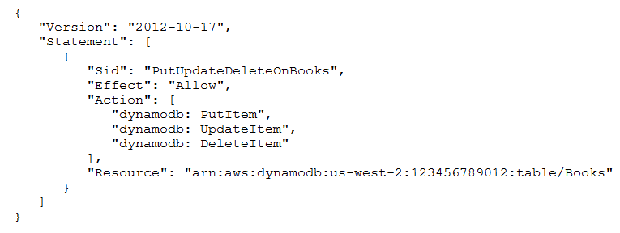==
B.
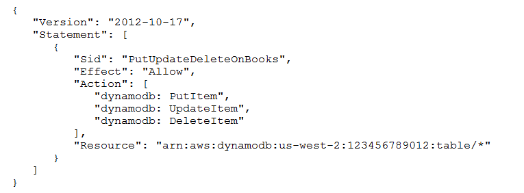
C.
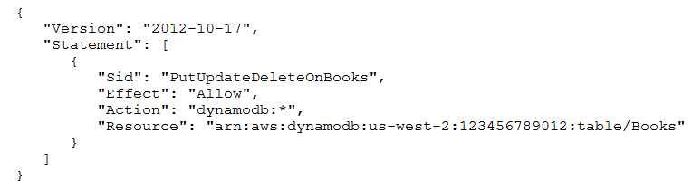
D.
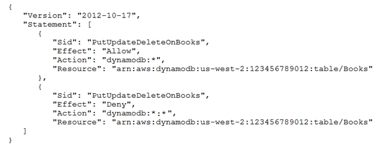

[Hide Solution](https://www.examtopics.com/exams/amazon/aws-certified-solutions-architect-associate-saa-c02/view/13/#) [  Discussion  **25**](https://www.examtopics.com/exams/amazon/aws-certified-solutions-architect-associate-saa-c02/view/13/#)

**Correct Answer:** *A*

Question #130*Topic 1*

A company hosts its website on Amazon S3. The website serves petabytes of outbound traffic monthly, which accounts for most of the company's AWS costs.
What should a solutions architect do to reduce costs?

- ==A. Configure Amazon CloudFront with the existing website as the origin.==
- B. Move the website to Amazon EC2 with Amazon EBS volumes for storage.
- C. Use AWS Global Accelerator and specify the existing website as the endpoint.
- D. Rearchitect the website to run on a combination of Amazon API Gateway and AWS Lambda.

[Hide Solution](https://www.examtopics.com/exams/amazon/aws-certified-solutions-architect-associate-saa-c02/view/13/#) [  Discussion  **40**](https://www.examtopics.com/exams/amazon/aws-certified-solutions-architect-associate-saa-c02/view/13/#)

**Correct Answer:** *A*

Question #131*Topic 1*

A company runs a website on Amazon EC2 instances behind an ELB Application Load Balancer. Amazon Route 53 is used for the DNS. The company wants to set up a backup website with a message including a phone number and email address that users can reach if the primary website is down.
How should the company deploy this solution?

- ==A. Use Amazon S3 website hosting for the backup website and Route 53 failover routing policy.==
- B. Use Amazon S3 website hosting for the backup website and Route 53 latency routing policy.
- C. Deploy the application in another AWS Region and use ELB health checks for failover routing.
- D. Deploy the application in another AWS Region and use server-side redirection on the primary website.

[Hide Solution](https://www.examtopics.com/exams/amazon/aws-certified-solutions-architect-associate-saa-c02/view/14/#) [  Discussion  **25**](https://www.examtopics.com/exams/amazon/aws-certified-solutions-architect-associate-saa-c02/view/14/#)

**Correct Answer:** *A*

Question #132*Topic 1*

A media company is evaluating the possibility of moving its systems to the AWS Cloud. The company needs at least 10 TB of storage with the maximum possible
I/O performance for video processing, 300 TB of very durable storage for storing media content, and 900 TB of storage to meet requirements for archival media that is not in use anymore.
Which set of services should a solutions architect recommend to meet these requirements?

- A. Amazon EBS for maximum performance, Amazon S3 for durable data storage, and Amazon S3 Glacier for archival storage
- B. Amazon EBS for maximum performance, Amazon EFS for durable data storage, and Amazon S3 Glacier for archival storage
- C. Amazon EC2 instance store for maximum performance, Amazon EFS for durable data storage, and Amazon S3 for archival storage
- ==D. Amazon EC2 instance store for maximum performance, Amazon S3 for durable data storage, and Amazon S3 Glacier for archival storage==

[Hide Solution](https://www.examtopics.com/exams/amazon/aws-certified-solutions-architect-associate-saa-c02/view/14/#) [  Discussion  **106**](https://www.examtopics.com/exams/amazon/aws-certified-solutions-architect-associate-saa-c02/view/14/#)

**Correct Answer:** *A*

Question #133*Topic 1*

A company uses Amazon S3 as its object storage solution. The company has thousands of S3 buckets it uses to store data. Some of the S3 buckets have data that is accessed less frequently than others. A solutions architect found that lifecycle policies are not consistently implemented or are implemented partially, resulting in data being stored in high-cost storage.
Which solution will lower costs without compromising the availability of objects?

- A. Use S3 ACLs.
- B. Use Amazon Elastic Block Store (Amazon EBS) automated snapshots.
- ==C. Use S3 Intelligent-Tiering storage.==
- D. Use S3 One Zone-Infrequent Access (S3 One Zone-IA).

[Hide Solution](https://www.examtopics.com/exams/amazon/aws-certified-solutions-architect-associate-saa-c02/view/14/#) [  Discussion  **24**](https://www.examtopics.com/exams/amazon/aws-certified-solutions-architect-associate-saa-c02/view/14/#)

**Correct Answer:** *C*

Question #134*Topic 1*

An application is running on Amazon EC2 instances. Sensitive information required for the application is stored in an Amazon S3 bucket. The bucket needs to be protected from internet access while only allowing services within the VPC access to the bucket.
Which combination of actions should solutions archived take to accomplish this? (Choose two.)

- ==A. Create a VPC endpoint for Amazon S3.==
- B. Enable server access logging on the bucket.
- ==C. Apply a bucket policy to restrict access to the S3 endpoint.==
- D. Add an S3 ACL to the bucket that has sensitive information.
- E. Restrict users using the IAM policy to use the specific bucket.

[Hide Solution](https://www.examtopics.com/exams/amazon/aws-certified-solutions-architect-associate-saa-c02/view/14/#) [  Discussion  **69**](https://www.examtopics.com/exams/amazon/aws-certified-solutions-architect-associate-saa-c02/view/14/#)

**Correct Answer:** *AC*

Question #135*Topic 1*

A web application runs on Amazon EC2 instances behind an Application Load Balancer. The application allows users to create custom reports of historical weather data. Generating a report can take up to 5 minutes. These long-running requests use many of the available incoming connections, making the system unresponsive to other users.
How can a solutions architect make the system more responsive?

- ==A. Use Amazon SQS with AWS Lambda to generate reports.==
- B. Increase the idle timeout on the Application Load Balancer to 5 minutes.
- C. Update the client-side application code to increase its request timeout to 5 minutes.
- D. Publish the reports to Amazon S3 and use Amazon CloudFront for downloading to the user.

[Hide Solution](https://www.examtopics.com/exams/amazon/aws-certified-solutions-architect-associate-saa-c02/view/14/#) [  Discussion  **26**](https://www.examtopics.com/exams/amazon/aws-certified-solutions-architect-associate-saa-c02/view/14/#)

**Correct Answer:** *A*

Question #136*Topic 1*

A solutions architect must create a highly available bastion host architecture. The solution needs to be resilient within a single AWS Region and should require only minimal effort to maintain.
What should the solutions architect do to meet these requirements?

- A. Create a Network Load Balancer backed by an Auto Scaling group with a UDP listener.
- B. Create a Network Load Balancer backed by a Spot Fleet with instances in a partition placement group.
- C. Create a Network Load Balancer backed by the existing servers in different Availability Zones as the target.
- ==D. Create a Network Load Balancer backed by an Auto Scaling group with instances in multiple Availability Zones as the target.==

[Hide Solution](https://www.examtopics.com/exams/amazon/aws-certified-solutions-architect-associate-saa-c02/view/14/#) [  Discussion  **26**](https://www.examtopics.com/exams/amazon/aws-certified-solutions-architect-associate-saa-c02/view/14/#)

**Correct Answer:** *D*

Question #137*Topic 1*

A three-tier web application processes orders from customers. The web tier consists of Amazon EC2 instances behind an Application Load Balancer, a middle tier of three EC2 instances decoupled from the web tier using Amazon SQS, and an Amazon DynamoDB backend. At peak times, customers who submit orders using the site have to wait much longer than normal to receive confirmations due to lengthy processing times. A solutions architect needs to reduce these processing times.
Which action will be MOST effective in accomplishing this?

- A. Replace the SQS queue with Amazon Kinesis Data Firehose.
- B. Use Amazon ElastiCache for Redis in front of the DynamoDB backend tier.
- C. Add an Amazon CloudFront distribution to cache the responses for the web tier.
- ==D. Use Amazon EC2 Auto Scaling to scale out the middle tier instances based on the SQS queue depth.==

[Hide Solution](https://www.examtopics.com/exams/amazon/aws-certified-solutions-architect-associate-saa-c02/view/14/#) [  Discussion  **35**](https://www.examtopics.com/exams/amazon/aws-certified-solutions-architect-associate-saa-c02/view/14/#)

**Correct Answer:** *D*

Question #138*Topic 1*

A company relies on an application that needs at least 4 Amazon EC2 instances during regular traffic and must scale up to 12 EC2 instances during peak loads.
The application is critical to the business and must be ==**highly available.**==
Which solution will meet these requirements?

- ==A. Deploy the EC2 instances in an Auto Scaling group. Set the minimum to 4 and the maximum to 12, with 2 in Availability Zone A and 2 in Availability Zone B.==
- B. Deploy the EC2 instances in an Auto Scaling group. Set the minimum to 4 and the maximum to 12, with all 4 in Availability Zone A.
- C. Deploy the EC2 instances in an Auto Scaling group. Set the minimum to 8 and the maximum to 12, with 4 in Availability Zone A and 4 in Availability Zone B.
- D. Deploy the EC2 instances in an Auto Scaling group. Set the minimum to 8 and the maximum to 12, with all 8 in Availability Zone A.

[Hide Solution](https://www.examtopics.com/exams/amazon/aws-certified-solutions-architect-associate-saa-c02/view/14/#) [  Discussion  **149**](https://www.examtopics.com/exams/amazon/aws-certified-solutions-architect-associate-saa-c02/view/14/#)

**Correct Answer:** *C*
==High availability = two in Availability Zone A and two in Availability Zone B== 
==Fault-tolerant = four in Availability Zone A and four in Availability Zone B==

Question #139*Topic 1*

A solutions architect must design a solution for a persistent database that is being migrated from on-premises to AWS. The database requires 64,000 IOPS according to the database administrator. If possible, the database administrator wants to use a single Amazon Elastic Block Store (Amazon EBS) volume to host the database instance.
Which solution effectively meets the database administrator's criteria?

- A. Use an instance from the I3 I/O optimized family and leverage local ephemeral storage to achieve the IOPS requirement.
- ==B. Create an Nitro-based Amazon EC2 instance with an Amazon EBS Provisioned IOPS SSD (io1) volume attached. Configure the volume to have 64,000 IOPS.==
- C. Create and map an Amazon Elastic File System (Amazon EFS) volume to the database instance and use the volume to achieve the required IOPS for the database.
- D. Provision two volumes and assign 32,000 IOPS to each. Create a logical volume at the operating system level that aggregates both volumes to achieve the IOPS requirements.

[Hide Solution](https://www.examtopics.com/exams/amazon/aws-certified-solutions-architect-associate-saa-c02/view/14/#) [  Discussion  **24**](https://www.examtopics.com/exams/amazon/aws-certified-solutions-architect-associate-saa-c02/view/14/#)

**Correct Answer:** *B*

Question #140*Topic 1*

A solutions architect is designing an architecture for a new application that requires low network latency and high network throughput between Amazon EC2 instances. Which component should be included in the architectural design?

- A. An Auto Scaling group with Spot Instance types.
- ==B. A placement group using a cluster placement strategy.==
- C. A placement group using a partition placement strategy.
- D. An Auto Scaling group with On-Demand instance types.

[Hide Solution](https://www.examtopics.com/exams/amazon/aws-certified-solutions-architect-associate-saa-c02/view/14/#) [  Discussion  **50**](https://www.examtopics.com/exams/amazon/aws-certified-solutions-architect-associate-saa-c02/view/14/#)

**Correct Answer:** *B*

Question #141*Topic 1*

A company has global users accessing an application deployed in different AWS Regions, exposing public static IP addresses. The users are experiencing poor performance when accessing the application over the internet.
What should a solutions architect recommend to reduce internet latency?

- ==A. Set up AWS Global Accelerator and add endpoints.==
- B. Set up AWS Direct Connect locations in multiple Regions.
- C. Set up an Amazon CloudFront distribution to access an application.
- D. Set up an Amazon Route 53 geoproximity routing policy to route traffic.

[Hide Solution](https://www.examtopics.com/exams/amazon/aws-certified-solutions-architect-associate-saa-c02/view/15/#) [  Discussion  **41**](https://www.examtopics.com/exams/amazon/aws-certified-solutions-architect-associate-saa-c02/view/15/#)

**Correct Answer:** *A*

Question #142*Topic 1*

A company wants to migrate a workload to AWS. The chief information security officer requires that all data be encrypted at rest when stored in the cloud. The company wants complete control of encryption key lifecycle management.
The company must be able to immediately remove the key material and audit key usage independently of AWS CloudTrail. The chosen services should integrate with other storage services that will be used on AWS.
Which services satisfies these security requirements?

- A. AWS CloudHSM with the CloudHSM client
- ==B. AWS Key Management Service (AWS KMS) with AWS CloudHSM==
- C. AWS Key Management Service (AWS KMS) with an external key material origin
- D. AWS Key Management Service (AWS KMS) with AWS managed customer master keys (CMKs)

[Hide Solution](https://www.examtopics.com/exams/amazon/aws-certified-solutions-architect-associate-saa-c02/view/15/#) [  Discussion  **72**](https://www.examtopics.com/exams/amazon/aws-certified-solutions-architect-associate-saa-c02/view/15/#)

**Correct Answer:** *A*

Question #143*Topic 1*

A company recently deployed a two-tier application in two Availability Zones in the us-east-1 Region. The databases are deployed in a private subnet while the web servers are deployed in a public subnet. An internet gateway is attached to the VPC. The application and database run on Amazon EC2 instances. The database servers are unable to access patches on the internet. A solutions architect needs to design a solution that maintains database security with the least operational overhead.
Which solution meets these requirements?

- ==A. Deploy a NAT gateway inside the public subnet for each Availability Zone and associate it with an Elastic IP address. Update the routing table of the private subnet to use it as the default route.==
- B. Deploy a NAT gateway inside the private subnet for each Availability Zone and associate it with an Elastic IP address. Update the routing table of the private subnet to use it as the default route.
- C. Deploy two NAT instances inside the public subnet for each Availability Zone and associate them with Elastic IP addresses. Update the routing table of the private subnet to use it as the default route.
- D. Deploy two NAT instances inside the private subnet for each Availability Zone and associate them with Elastic IP addresses. Update the routing table of the private subnet to use it as the default route.

[Hide Solution](https://www.examtopics.com/exams/amazon/aws-certified-solutions-architect-associate-saa-c02/view/15/#) [  Discussion  **74**](https://www.examtopics.com/exams/amazon/aws-certified-solutions-architect-associate-saa-c02/view/15/#)

**Correct Answer:** *A*

Question #144*Topic 1*

A company has an application with a REST-based interface that allows data to be received in near-real time from a third-party vendor. Once received, the application processes and stores the data for further analysis. The application is running on Amazon EC2 instances.
The third-party vendor has received many 503 Service Unavailable Errors when sending data to the application. When the data volume spikes, the compute capacity reaches its maximum limit and the application is unable to process all requests.
Which design should a solutions architect recommend to provide a more scalable solution?

- ==A. Use Amazon Kinesis Data Streams to ingest the data. Process the data using AWS Lambda functions.==
- B. Use Amazon API Gateway on top of the existing application. Create a usage plan with a quota limit for the third-party vendor.
- C. Use Amazon Simple Notification Service (Amazon SNS) to ingest the data. Put the EC2 instances in an Auto Scaling group behind an Application Load Balancer.
- D. Repackage the application as a container. Deploy the application using Amazon Elastic Container Service (Amazon ECS) using the EC2 launch type with an Auto Scaling group.

[Hide Solution](https://www.examtopics.com/exams/amazon/aws-certified-solutions-architect-associate-saa-c02/view/15/#) [  Discussion  **48**](https://www.examtopics.com/exams/amazon/aws-certified-solutions-architect-associate-saa-c02/view/15/#)

**Correct Answer:** *A*

Question #145*Topic 1*

A solutions architect needs to design a low-latency solution for a static single-page application accessed by users utilizing a custom domain name. The solution must be serverless, encrypted in transit, and cost-effective.
Which combination of AWS services and features should the solutions architect use? (Choose two.)

- ==A. Amazon S3==
- B. Amazon EC2
- C. AWS Fargate
- ==D. Amazon CloudFront==
- E. Elastic Load Balancer

[Hide Solution](https://www.examtopics.com/exams/amazon/aws-certified-solutions-architect-associate-saa-c02/view/15/#) [  Discussion  **66**](https://www.examtopics.com/exams/amazon/aws-certified-solutions-architect-associate-saa-c02/view/15/#)

**Correct Answer:** *AD*

Question #146*Topic 1*

A company is migrating to the AWS Cloud. A file server is the first workload to migrate. Users must be able to access the file share using the Server Message
Block (SMB) protocol. Which AWS managed service meets these requirements?

- A. Amazon EBS
- B. Amazon EC2
- ==C. Amazon FSx==
- D. Amazon S3

[Hide Solution](https://www.examtopics.com/exams/amazon/aws-certified-solutions-architect-associate-saa-c02/view/15/#) [  Discussion  **25**](https://www.examtopics.com/exams/amazon/aws-certified-solutions-architect-associate-saa-c02/view/15/#)

**Correct Answer:** *C*

Question #147*Topic 1*

A solutions architect is designing a customer-facing application. The application is expected to have a variable amount of reads and writes depending on the time of year and clearly defined access patterns throughout the year. Management requires that database auditing and scaling be managed in the AWS Cloud. The
Recovery Point Objective (RPO) must be less than 5 hours.
Which solutions can accomplish this? (Choose two.)

- A. Use Amazon DynamoDB with auto scaling. Use on-demand backups and AWS CloudTrail.
- B. Use Amazon DynamoDB with auto scaling. Use on-demand backups and Amazon DynamoDB Streams.
- C. Use Amazon Redshift Configure concurrency scaling. Enable audit logging. Perform database snapshots every 4 hours.
- D. Use Amazon RDS with Provisioned IOPS. Enable the database auditing parameter. Perform database snapshots every 5 hours.
- E. Use Amazon RDS with auto scaling. Enable the database auditing parameter. Configure the backup retention period to at least 1 day.

[Hide Solution](https://www.examtopics.com/exams/amazon/aws-certified-solutions-architect-associate-saa-c02/view/15/#) [  Discussion  **84**](https://www.examtopics.com/exams/amazon/aws-certified-solutions-architect-associate-saa-c02/view/15/#)

**Correct Answer:** *AB*

Question #148*Topic 1*

A company has migrated an on-premises Oracle database to an Amazon RDS for Oracle Multi-AZ DB instance in the us-east-l Region. A solutions architect is designing a disaster recovery strategy to have the database provisioned in the us-west-2 Region in case the database becomes unavailable in the us-east-1
Region. The design must ensure the database is provisioned in the us-west-2 Region in a maximum of 2 hours, with a data loss window of no more than 3 hours.
How can these requirements be met?

- A. Edit the DB instance and create a read replica in us-west-2. Promote the read replica to master in us-west-2 in case the disaster recovery environment needs to be activated.
- B. Select the multi-Region option to provision a standby instance in us-west-2. The standby instance will be automatically promoted to master in us-west-2 in case the disaster recovery environment needs to be created.
- C. Take automated snapshots of the database instance and copy them to us-west-2 every 3 hours. Restore the latest snapshot to provision another database instance in us-west-2 in case the disaster recovery environment needs to be activated.
- D. Create a multimaster read/write instances across multiple AWS Regions. Select VPCs in us-east-1 and us-west-2 to make that deployment. Keep the master read/write instance in us-west-2 available to avoid having to activate a disaster recovery environment.

[Hide Solution](https://www.examtopics.com/exams/amazon/aws-certified-solutions-architect-associate-saa-c02/view/15/#) [  Discussion  **107**](https://www.examtopics.com/exams/amazon/aws-certified-solutions-architect-associate-saa-c02/view/15/#)

**Correct Answer:** *B*

Question #149*Topic 1*

A monolithic application was recently migrated to AWS and is now running on a single Amazon EC2 instance. Due to application limitations, it is not possible to use automatic scaling to scale out the application. The chief technology officer (CTO) wants an automated solution to restore the EC2 instance in the unlikely event the underlying hardware fails.
What would allow for automatic recovery of the EC2 instance as quickly as possible?

- A. Configure an Amazon CloudWatch alarm that triggers the recovery of the EC2 instance if it becomes impaired.
- B. Configure an Amazon CloudWatch alarm to trigger an SNS message that alerts the CTO when the EC2 instance is impaired.
- C. Configure AWS CloudTrail to monitor the health of the EC2 instance, and if it becomes impaired, trigger instance recovery.
- D. Configure an Amazon EventBridge event to trigger an AWS Lambda function once an hour that checks the health of the EC2 instance and triggers instance recovery if the EC2 instance is unhealthy.

[Hide Solution](https://www.examtopics.com/exams/amazon/aws-certified-solutions-architect-associate-saa-c02/view/15/#) [  Discussion  **45**](https://www.examtopics.com/exams/amazon/aws-certified-solutions-architect-associate-saa-c02/view/15/#)

**Correct Answer:** *A*

Question #150*Topic 1*

A solutions architect is working on optimizing a legacy document management application running on Microsoft Windows Server in an on-premises data center.
The application stores a large number of files on a network file share. The chief information officer wants to reduce the on-premises data center footprint and minimize storage costs by moving on-premises storage to AWS.
What should the solutions architect do to meet these requirements?

- A. Set up an AWS Storage Gateway file gateway.
- B. Set up Amazon Elastic File System (Amazon EFS)
- C. Set up AWS Storage Gateway as a volume gateway
- D. Set up an Amazon Elastic Block Store (Amazon EBS) volume.

[Hide Solution](https://www.examtopics.com/exams/amazon/aws-certified-solutions-architect-associate-saa-c02/view/15/#) [  Discussion  **25**](https://www.examtopics.com/exams/amazon/aws-certified-solutions-architect-associate-saa-c02/view/15/#)

**Correct Answer:** *A*

Question #151*Topic 1*

A solutions architect is designing a hybrid application using the AWS cloud. The network between the on-premises data center and AWS will use an AWS Direct
Connect (DX) connection. The application connectivity between AWS and the on-premises data center must be highly resilient.
Which DX configuration should be implemented to meet these requirements?

- A. Configure a DX connection with a VPN on top of it.
- B. Configure DX connections at multiple DX locations.
- C. Configure a DX connection using the most reliable DX partner.
- D. Configure multiple virtual interfaces on top of a DX connection.

[Hide Solution](https://www.examtopics.com/exams/amazon/aws-certified-solutions-architect-associate-saa-c02/view/16/#) [  Discussion  **17**](https://www.examtopics.com/exams/amazon/aws-certified-solutions-architect-associate-saa-c02/view/16/#)

**Correct Answer:** *B*

Question #152*Topic 1*

A company runs an application on Amazon EC2 instances. The application is deployed in private subnets in three Availability Zones of the us-east-1 Region. The instances must be able to connect to the internet to download files. The company wants a design that is highly available across the Region.
Which solution should be implemented to ensure that there are no disruptions to internet connectivity?

- A. Deploy a NAT instance in a private subnet of each Availability Zone.
- B. Deploy a NAT gateway in a public subnet of each Availability Zone.
- C. Deploy a transit gateway in a private subnet of each Availability Zone.
- D. Deploy an internet gateway in a public subnet of each Availability Zone.

[Hide Solution](https://www.examtopics.com/exams/amazon/aws-certified-solutions-architect-associate-saa-c02/view/16/#) [  Discussion  **23**](https://www.examtopics.com/exams/amazon/aws-certified-solutions-architect-associate-saa-c02/view/16/#)

**Correct Answer:** *B*

Question #153*Topic 1*

Application developers have noticed that a production application is very slow when business reporting users run large production reports against the Amazon
RDS instance backing the application. The CPU and memory utilization metrics for the RDS instance do not exceed 60% while the reporting queries are running.
The business reporting users must be able to generate reports without affecting the applicationג€™s performance.
Which action will accomplish this?

- A. Increase the size of the RDS instance.
- B. Create a read replica and connect the application to it.
- C. Enable multiple Availability Zones on the RDS instance.
- D. Create a read replica and connect the business reports to it.

[Hide Solution](https://www.examtopics.com/exams/amazon/aws-certified-solutions-architect-associate-saa-c02/view/16/#) [  Discussion  **31**](https://www.examtopics.com/exams/amazon/aws-certified-solutions-architect-associate-saa-c02/view/16/#)

**Correct Answer:** *D*

Question #154*Topic 1*

A company is running a two-tier ecommerce website using services. The current architect uses a publish-facing Elastic Load Balancer that sends traffic to Amazon
EC2 instances in a private subnet. The static content is hosted on EC2 instances, and the dynamic content is retrieved from a MYSQL database. The application is running in the United States. The company recently started selling to users in Europe and Australia. A solutions architect needs to design solution so their international users have an improved browsing experience.
Which solution is MOST cost-effective?

- A. Host the entire website on Amazon S3.
- B. Use Amazon CloudFront and Amazon S3 to host static images.
- C. Increase the number of public load balancers and EC2 instances.
- D. Deploy the two-tier website in AWS Regions in Europe and Australia.

[Hide Solution](https://www.examtopics.com/exams/amazon/aws-certified-solutions-architect-associate-saa-c02/view/16/#) [  Discussion  **26**](https://www.examtopics.com/exams/amazon/aws-certified-solutions-architect-associate-saa-c02/view/16/#)

**Correct Answer:** *B*

Question #155*Topic 1*

A companyג€™s website provides users with downloadable historical performance reports. The website needs a solution that will scale to meet the companyג€™s website demands globally. The solution should be cost-effective, limit the provisioning of infrastructure resources, and provide the fastest possible response time.
Which combination should a solutions architect recommend to meet these requirements?

- A. Amazon CloudFront and Amazon S3
- B. AWS Lambda and Amazon DynamoDB
- C. Application Load Balancer with Amazon EC2 Auto Scaling
- D. Amazon Route 53 with internal Application Load Balancers

[Hide Solution](https://www.examtopics.com/exams/amazon/aws-certified-solutions-architect-associate-saa-c02/view/16/#) [  Discussion  **17**](https://www.examtopics.com/exams/amazon/aws-certified-solutions-architect-associate-saa-c02/view/16/#)

**Correct Answer:** *A*

Question #156*Topic 1*

A company wants to deploy a shared file system for its .NET application servers and Microsoft SQL Server databases running on Amazon EC2 instances with
Windows Server 2016. The solution must be able to be integrated into the corporate Active Directory domain, be highly durable, be managed by AWS, and provide high levels of throughput and IOPS.
Which solution meets these requirements?

- A. Use Amazon FSx for Windows File Server.
- B. Use Amazon Elastic File System (Amazon EFS).
- C. Use AWS Storage Gateway in file gateway mode.
- D. Deploy a Windows file server on two On Demand instances across two Availability Zones.

[Hide Solution](https://www.examtopics.com/exams/amazon/aws-certified-solutions-architect-associate-saa-c02/view/16/#) [  Discussion  **33**](https://www.examtopics.com/exams/amazon/aws-certified-solutions-architect-associate-saa-c02/view/16/#)

**Correct Answer:** *A*

Question #157*Topic 1*

A company that develops web applications has launched hundreds of Application Load Balancers (ALBs) in multiple Regions. The company wants to create an allow list for the IPs of all the load balancers on its firewall device. A solutions architect is looking for a one-time, highly available solution to address this request, which will also help reduce the number of IPs that need to be allowed by the firewall.
What should the solutions architect recommend to meet these requirements?

- A. Create a AWS Lambda function to keep track of the IPs for all the ALBs in different Regions. Keep refreshing this list.
- B. Set up a Network Load Balancer (NLB) with Elastic IPs. Register the private IPs of all the ALBs as targets to this NLB.
- C. Launch AWS Global Accelerator and create endpoints for all the Regions. Register all the ALBs in different Regions to the corresponding endpoints.
- D. Set up an Amazon EC2 instance, assign an Elastic IP to this EC2 instance, and configure the instance as a proxy to forward traffic to all the ALBs.

[Hide Solution](https://www.examtopics.com/exams/amazon/aws-certified-solutions-architect-associate-saa-c02/view/16/#) [  Discussion  **22**](https://www.examtopics.com/exams/amazon/aws-certified-solutions-architect-associate-saa-c02/view/16/#)

**Correct Answer:** *C*

Question #158*Topic 1*

A company runs an application using Amazon ECS. The application creates resized versions of an original image and then makes Amazon S3 API calls to store the resized images in Amazon S3. How can a solutions architect ensure that the application has permission to access Amazon S3?

- A. Update the S3 role in AWS IAM to allow read/write access from Amazon ECS, and then relaunch the container.
- B. Create an IAM role with S3 permissions, and then specify that role as the taskRoleArn in the task definition.
- C. Create a security group that allows access from Amazon ECS to Amazon S3, and update the launch configuration used by the ECS cluster.
- D. Create an IAM user with S3 permissions, and then relaunch the Amazon EC2 instances for the ECS cluster while logged in as this account.

[Hide Solution](https://www.examtopics.com/exams/amazon/aws-certified-solutions-architect-associate-saa-c02/view/16/#) [  Discussion  **31**](https://www.examtopics.com/exams/amazon/aws-certified-solutions-architect-associate-saa-c02/view/16/#)

**Correct Answer:** *B*

Question #159*Topic 1*

A company is planning to migrate its virtual server-based workloads to AWS. The company has internet-facing load balancers backed by application servers. The application servers rely on patches from an internet-hosted repository.
Which services should a solutions architect recommend be hosted on the public subnet? (Choose two.)

- A. NAT gateway
- B. Amazon RDS DB instances
- C. Application Load Balancers
- D. Amazon EC2 application servers
- E. Amazon Elastic File System (Amazon EFS) volumes

[Hide Solution](https://www.examtopics.com/exams/amazon/aws-certified-solutions-architect-associate-saa-c02/view/16/#) [  Discussion  **51**](https://www.examtopics.com/exams/amazon/aws-certified-solutions-architect-associate-saa-c02/view/16/#)

**Correct Answer:** *AC*

Question #160*Topic 1*

A company has established a new AWS account. The account is newly provisioned and no changed have been made to the default settings. The company is concerned about the security of the AWS account root user.
What should be done to secure the root user?

- A. Create IAM users for daily administrative tasks. Disable the root user.
- B. Create IAM users for daily administrative tasks. Enable multi-factor authentication on the root user.
- C. Generate an access key for the root user. Use the access key for daily administration tasks instead of the AWS Management Console.
- D. Provide the root user credentials to the most senior solutions architect. Have the solutions architect use the root user for daily administration tasks.

[Hide Solution](https://www.examtopics.com/exams/amazon/aws-certified-solutions-architect-associate-saa-c02/view/16/#) [  Discussion  **46**](https://www.examtopics.com/exams/amazon/aws-certified-solutions-architect-associate-saa-c02/view/16/#)

**Correct Answer:** *B*

Question #161*Topic 1*

A company is using a tape backup solution to store its key application data offsite. The daily data volume is around 50 TB. The company needs to retain the backups for 7 years for regulatory purposes. The backups are rarely accessed, and a week's notice is typically given if a backup needs to be restored.
The company is now considering a cloud-based option to reduce the storage costs and operational burden of managing tapes. The company also wants to make sure that the transition from tape backups to the cloud minimizes disruptions.
Which storage solution is MOST cost-effective?

- A. Use Amazon Storage Gateway to back up to Amazon Glacier Deep Archive.
- B. Use AWS Snowball Edge to directly integrate the backups with Amazon S3 Glacier.
- C. Copy the backup data to Amazon S3 and create a lifecycle policy to move the data to Amazon S3 Glacier.
- D. Use Amazon Storage Gateway to back up to Amazon S3 and create a lifecycle policy to move the backup to Amazon S3 Glacier.

[Hide Solution](https://www.examtopics.com/exams/amazon/aws-certified-solutions-architect-associate-saa-c02/view/17/#) [  Discussion  **124**](https://www.examtopics.com/exams/amazon/aws-certified-solutions-architect-associate-saa-c02/view/17/#)

**Correct Answer:** *A*

Question #162*Topic 1*

A company requires a durable backup storage solution for its on-premises database servers while ensuring on-premises applications maintain access to these backups for quick recovery. The company will use AWS storage services as the destination for these backups. A solutions architect is designing a solution with minimal operational overhead.
Which solution should the solutions architect implement?

- A. Deploy an AWS Storage Gateway file gateway on-premises and associate it with an Amazon S3 bucket.
- B. Back up the databases to an AWS Storage Gateway volume gateway and access it using the Amazon S3 API.
- C. Transfer the database backup files to an Amazon Elastic Block Store (Amazon EBS) volume attached to an Amazon EC2 instance.
- D. Back up the database directly to an AWS Snowball device and use lifecycle rules to move the data to Amazon S3 Glacier Deep Archive.

[Hide Solution](https://www.examtopics.com/exams/amazon/aws-certified-solutions-architect-associate-saa-c02/view/17/#) [  Discussion  **51**](https://www.examtopics.com/exams/amazon/aws-certified-solutions-architect-associate-saa-c02/view/17/#)

**Correct Answer:** *A*

Question #163*Topic 1*

A company decides to migrate its three-tier web application from on-premises to the AWS Cloud. The new database must be capable of dynamically scaling storage capacity and performing table joins.
Which AWS service meets these requirements?

- A. Amazon Aurora
- B. Amazon RDS for SqlServer
- C. Amazon DynamoDB Streams
- D. Amazon DynamoDB on-demand

[Hide Solution](https://www.examtopics.com/exams/amazon/aws-certified-solutions-architect-associate-saa-c02/view/17/#) [  Discussion  **33**](https://www.examtopics.com/exams/amazon/aws-certified-solutions-architect-associate-saa-c02/view/17/#)

**Correct Answer:** *A*

Question #164*Topic 1*

A company mandates that an Amazon S3 gateway endpoint must allow traffic to trusted buckets only.
Which method should a solutions architect implement to meet this requirement?

- A. Create a bucket policy for each of the company's trusted S3 buckets that allows traffic only from the company's trusted VPCs.
- B. Create a bucket policy for each of the company's trusted S3 buckets that allows traffic only from the company's S3 gateway endpoint IDs.
- C. Create an S3 endpoint policy for each of the company's S3 gateway endpoints that blocks access from any VPC other than the company's trusted VPCs.
- D. Create an S3 endpoint policy for each of the company's S3 gateway endpoints that provides access to the Amazon Resource Name (ARN) of the trusted S3 buckets.

[Hide Solution](https://www.examtopics.com/exams/amazon/aws-certified-solutions-architect-associate-saa-c02/view/17/#) [  Discussion  **27**](https://www.examtopics.com/exams/amazon/aws-certified-solutions-architect-associate-saa-c02/view/17/#)

**Correct Answer:** *D*

Question #165*Topic 1*

A company is using a VPC peering strategy to connect its VPCs in a single Region to allow for cross-communication. A recent increase in account creations and
VPCs has made it difficult to maintain the VPC peering strategy, and the company expects to grow to hundreds of VPCs. There are also new requests to create site-to-site VPNs with some of the VPCs. A solutions architect has been tasked with creating a centrally managed networking setup for multiple accounts, VPCs, and VPNs.
Which networking solution meets these requirements?

- A. Configure shared VPCs and VPNs and share to each other.
- B. Configure a hub-and-spoke VPC and route all traffic through VPC peering.
- C. Configure an AWS Direct Connect connection between all VPCs and VPNs.
- D. Configure a transit gateway with AWS Transit Gateway and connect all VPCs and VPNs.

[Hide Solution](https://www.examtopics.com/exams/amazon/aws-certified-solutions-architect-associate-saa-c02/view/17/#) [  Discussion  **7**](https://www.examtopics.com/exams/amazon/aws-certified-solutions-architect-associate-saa-c02/view/17/#)

**Correct Answer:** *D*

Question #166*Topic 1*

A solutions architect is helping a developer design a new ecommerce shopping cart application using AWS services. The developer is unsure of the current database schema and expects to make changes as the ecommerce site grows. The solution needs to be highly resilient and capable of automatically scaling read and write capacity.
Which database solution meets these requirements?

- A. Amazon Aurora PostgreSQL
- B. Amazon DynamoDB with on-demand enabled
- C. Amazon DynamoDB with DynamoDB Streams enabled
- D. Amazon SQS and Amazon Aurora PostgreSQL

[Hide Solution](https://www.examtopics.com/exams/amazon/aws-certified-solutions-architect-associate-saa-c02/view/17/#) [  Discussion  **61**](https://www.examtopics.com/exams/amazon/aws-certified-solutions-architect-associate-saa-c02/view/17/#)

**Correct Answer:** *B*

Question #167*Topic 1*

A solutions architect must migrate a Windows internet information Services (IIS) web application to AWS. The application currently relies on a file share hosted in the userג€™s on-premises network-attached storage (NAS). The solutions architected has proposed migrating the IIS web servers to Amazon EC2 instances in multiple Availability Zones that are connected to the storage solution, and configuring an Elastic Load Balancer attached to the instances.
Which replacement to the on-premises file share is MOST resilient and durable?

- A. Migrate the file Share to Amazon RDS.
- B. Migrate the file Share to AWS Storage Gateway
- C. Migrate the file Share to Amazon FSx for Windows File Server.
- D. Migrate the file share to Amazon Elastic File System (Amazon EFS)

[Hide Solution](https://www.examtopics.com/exams/amazon/aws-certified-solutions-architect-associate-saa-c02/view/17/#) [  Discussion  **9**](https://www.examtopics.com/exams/amazon/aws-certified-solutions-architect-associate-saa-c02/view/17/#)

**Correct Answer:** *C*

Question #168*Topic 1*

A company needs to implement a relational database with a multi-Region disaster recovery Recovery Point Objective (RPO) of 1 second and a Recovery Time
Objective (RTO) of 1 minute.
Which AWS solution can achieve this?

- A. Amazon Aurora Global Database
- B. Amazon DynamoDB global tables
- C. Amazon RDS for MySQL with Multi-AZ enabled
- D. Amazon RDS for MySQL with a cross-Region snapshot copy

[Hide Solution](https://www.examtopics.com/exams/amazon/aws-certified-solutions-architect-associate-saa-c02/view/17/#) [  Discussion  **41**](https://www.examtopics.com/exams/amazon/aws-certified-solutions-architect-associate-saa-c02/view/17/#)

**Correct Answer:** *A*

Question #169*Topic 1*

A company runs a web service on Amazon EC2 instances behind an Application Load Balancer. The instances run in an Amazon EC2 Auto Scaling group across two Availability Zones. The company needs a minimum of four instances at all times to meet the required service level agreement (SLA) while keeping costs low.
If an Availability Zone fails, how can the company remain compliant with the SLA?

- A. Add a target tracking scaling policy with a short cooldown period.
- B. Change the Auto Scaling group launch configuration to use a larger instance type.
- C. Change the Auto Scaling group to use six servers across three Availability Zones.
- D. Change the Auto Scaling group to use eight servers across two Availability Zones.

[Hide Solution](https://www.examtopics.com/exams/amazon/aws-certified-solutions-architect-associate-saa-c02/view/17/#) [  Discussion  **121**](https://www.examtopics.com/exams/amazon/aws-certified-solutions-architect-associate-saa-c02/view/17/#)

**Correct Answer:** *A*

Question #170*Topic 1*

A company is reviewing its AWS Cloud deployment to ensure its data is not accessed by anyone without appropriate authorization. A solutions architect is tasked with identifying all open Amazon S3 buckets and recording any S3 bucket configuration changes.
What should the solutions architect do to accomplish this?

- A. Enable AWS Config service with the appropriate rules
- B. Enable AWS Trusted Advisor with the appropriate checks.
- C. Write a script using an AWS SDK to generate a bucket report
- D. Enable Amazon S3 server access logging and configure Amazon CloudWatch Events.

[Hide Solution](https://www.examtopics.com/exams/amazon/aws-certified-solutions-architect-associate-saa-c02/view/17/#) [  Discussion  **38**](https://www.examtopics.com/exams/amazon/aws-certified-solutions-architect-associate-saa-c02/view/17/#)

**Correct Answer:** *A*

Question #171*Topic 1*

A company is planning to build a new web application on AWS. The company expects predictable traffic most of the year and very high traffic on occasion. The web application needs to be highly available and fault tolerant with minimal latency.
What should a solutions architect recommend to meet these requirements?

- A. Use an Amazon Route 53 routing policy to distribute requests to two AWS Regions, each with one Amazon EC2 instance.
- B. Use Amazon EC2 instances in an Auto Scaling group with an Application Load Balancer across multiple Availability Zones.
- C. Use Amazon EC2 instances in a cluster placement group with an Application Load Balancer across multiple Availability Zones.
- D. Use Amazon EC2 instances in a cluster placement group and include the cluster placement group within a new Auto Scaling group.

[Hide Solution](https://www.examtopics.com/exams/amazon/aws-certified-solutions-architect-associate-saa-c02/view/18/#) [  Discussion  **34**](https://www.examtopics.com/exams/amazon/aws-certified-solutions-architect-associate-saa-c02/view/18/#)

**Correct Answer:** *B*

Question #172*Topic 1*

A company is designing a web application using AWS that processes insurance quotes. Users will request quotes from the application. Quotes must be separated by quote type must be responded to within 24 hours, and must not be lost. The solution should be simple to set up and maintain.
Which solution meets these requirements?

- A. Create multiple Amazon Kinesis data streams based on the quote type. Configure the web application to send messages to the proper data stream. Configure each backend group of application servers to pool messages from its own data stream using the Kinesis Client Library (KCL).
- B. Create multiple Amazon Simple Notification Service (Amazon SNS) topics and register Amazon SQS queues to their own SNS topic based on the quote type. Configure the web application to publish messages to the SNS topic queue. Configure each backend application server to work its own SQS queue.
- C. Create a single Amazon Simple Notification Service (Amazon SNS) topic and subscribe the Amazon SQS queues to the SNS topic. Configure SNS message filtering to publish messages to the proper SQS queue based on the quote type. Configure each backend application server to work its own SQS queue.
- D. Create multiple Amazon Kinesis Data Firehose delivery streams based on the quote type to deliver data streams to an Amazon Elasticsearch Service (Amazon ES) cluster. Configure the web application to send messages to the proper delivery stream. Configure each backend group of application servers to search for the messages from Amazon ES and process them accordingly.

[Hide Solution](https://www.examtopics.com/exams/amazon/aws-certified-solutions-architect-associate-saa-c02/view/18/#) [  Discussion  **21**](https://www.examtopics.com/exams/amazon/aws-certified-solutions-architect-associate-saa-c02/view/18/#)

**Correct Answer:** *D*

Question #173*Topic 1*

A solutions architect has configured the following IAM policy.
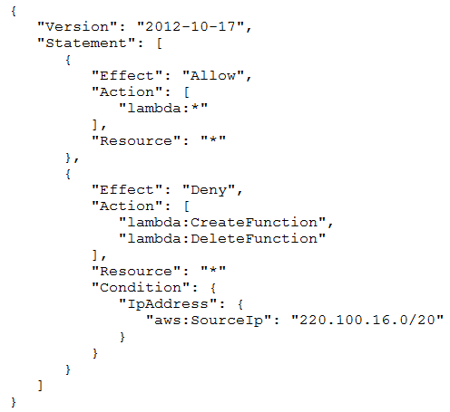
Which action will be allowed by the policy?

- A. An AWS Lambda function can be deleted from any network.
- B. An AWS Lambda function can be created from any network.
- C. An AWS Lambda function can be deleted from the 100.220.0.0/20 network.
- D. An AWS Lambda function can be deleted from the 220.100.16.0/20 network.

[Hide Solution](https://www.examtopics.com/exams/amazon/aws-certified-solutions-architect-associate-saa-c02/view/18/#) [  Discussion  **14**](https://www.examtopics.com/exams/amazon/aws-certified-solutions-architect-associate-saa-c02/view/18/#)

**Correct Answer:** *C*

Question #174*Topic 1*

A solutions architect is using Amazon S3 to design the storage architecture of a new digital media application. The media files must be resilient to the loss of an
Availability Zone. Some files are accessed frequently while other files are rarely accessed in an unpredictable pattern. The solutions architect must minimize the costs of storing and retrieving the media files.
Which storage option meets these requirements?

- A. S3 Standard
- B. S3 Intelligent-Tiering
- C. S3 Standard-Infrequent Access (S3 Standard-IA)
- D. S3 One Zone-Infrequent Access (S3 One Zone-IA)

[Hide Solution](https://www.examtopics.com/exams/amazon/aws-certified-solutions-architect-associate-saa-c02/view/18/#) [  Discussion  **21**](https://www.examtopics.com/exams/amazon/aws-certified-solutions-architect-associate-saa-c02/view/18/#)

**Correct Answer:** *B*

Question #175*Topic 1*

A company is running a three-tier web application to process credit card payments. The front-end user interface consists of static webpages. The application tier can have long-running processes. The database tier uses MySQL.
The application is currently running on a single, general purpose large Amazon EC2 instance. A solutions architect needs to decouple the services to make the web application highly available.
Which solution would provide the HIGHEST availability?

- A. Move static assets to Amazon CloudFront. Leave the application in EC2 in an Auto Scaling group. Move the database to Amazon RDS to deploy Multi-AZ.
- B. Move static assets and the application into a medium EC2 instance. Leave the database on the large instance. Place both instances in an Auto Scaling group.
- C. Move static assets to Amazon S3. Move the application to AWS Lambda with the concurrency limit set. Move the database to Amazon DynamoDB with on- demand enabled.
- D. Move static assets to Amazon S3. Move the application to Amazon Elastic Container Service (Amazon ECS) containers with Auto Scaling enabled. Move the database to Amazon RDS to deploy Multi-AZ.

[Hide Solution](https://www.examtopics.com/exams/amazon/aws-certified-solutions-architect-associate-saa-c02/view/18/#) [  Discussion  **64**](https://www.examtopics.com/exams/amazon/aws-certified-solutions-architect-associate-saa-c02/view/18/#)

**Correct Answer:** *B*

Question #176*Topic 1*

A media company stores video content in an Amazon Elastic Block Store (Amazon EBS) volume. A certain video file has become popular and a large number of users across the world are accessing this content. This has resulted in a cost increase.
Which action will DECREASE cost without compromising user accessibility?

- A. Change the EBS volume to Provisioned IOPS (PIOPS).
- B. Store the video in an Amazon S3 bucket and create an Amazon CloudFront distribution.
- C. Split the video into multiple, smaller segments so users are routed to the requested video segments only.
- D. Clear an Amazon S3 bucket in each Region and upload the videos so users are routed to the nearest S3 bucket.

[Hide Solution](https://www.examtopics.com/exams/amazon/aws-certified-solutions-architect-associate-saa-c02/view/18/#) [  Discussion  **17**](https://www.examtopics.com/exams/amazon/aws-certified-solutions-architect-associate-saa-c02/view/18/#)

**Correct Answer:** *B*

Question #177*Topic 1*

A solutions architect is designing the cloud architecture for a new application being deployed to AWS. The application allows users to interactively download and upload files. Files older than 2 years will be accessed less frequently. The solutions architect needs to ensure that the application can scale to any number of files while maintaining high availability and durability.
Which scalable solutions should the solutions architect recommend? (Choose two.)

- A. Store the files on Amazon S3 with a lifecycle policy that moves objects older than 2 years to S3 Glacier.
- B. Store the files on Amazon S3 with a lifecycle policy that moves objects older than 2 years to S3 Standard-Infrequent Access (S3 Standard-IA)
- C. Store the files on Amazon Elastic File System (Amazon EFS) with a lifecycle policy that moves objects older than 2 years to EFS Infrequent Access (EFS IA).
- D. Store the files in Amazon Elastic Block Store (Amazon EBS) volumes. Schedule snapshots of the volumes. Use the snapshots to archive data older than 2 years.
- E. Store the files in RAID-striped Amazon Elastic Block Store (Amazon EBS) volumes. Schedule snapshots of the volumes. Use the snapshots to archive data older than 2 years.

[Hide Solution](https://www.examtopics.com/exams/amazon/aws-certified-solutions-architect-associate-saa-c02/view/18/#) [  Discussion  **70**](https://www.examtopics.com/exams/amazon/aws-certified-solutions-architect-associate-saa-c02/view/18/#)

**Correct Answer:** *AC*

Question #178*Topic 1*

A company has recently updated its internal security standards. The company must now ensure all Amazon S3 buckets and Amazon Elastic Block Store (Amazon
EBS) volumes are encrypted with keys created and periodically rotated by internal security specialists. The company is looking for a native, software-based AWS service to accomplish this goal.
What should a solutions architect recommend as a solution?

- A. Use AWS Secrets Manager with customer master keys (CMKs) to store master key material and apply a routine to create a new CMK periodically and replace it in AWS Secrets Manager.
- B. Use AWS Key Management Service (AWS KMS) with customer master keys (CMKs) to store master key material and apply a routine to re-create a new key periodically and replace it in AWS KMS.
- C. Use an AWS CloudHSM cluster with customer master keys (CMKs) to store master key material and apply a routine to re-create a new key periodically and replace it in the CloudHSM cluster nodes.
- D. Use AWS Systems Manager Parameter Store with customer master keys (CMKs) to store master key material and apply a routine to re-create a new key periodically and replace it in the Parameter Store.

[Hide Solution](https://www.examtopics.com/exams/amazon/aws-certified-solutions-architect-associate-saa-c02/view/18/#) [  Discussion  **89**](https://www.examtopics.com/exams/amazon/aws-certified-solutions-architect-associate-saa-c02/view/18/#)

**Correct Answer:** *A*

Question #179*Topic 1*

A company's dynamic website is hosted using on-premises servers in the United States. The company is launching its product in Europe, and it wants to optimize site loading times for new European users. The site's backend must remain in the United States. The product is being launched in a few days, and an immediate solution is needed.
What should the solutions architect recommend?

- A. Launch an Amazon EC2 instance in us-east-1 and migrate the site to it.
- B. Move the website to Amazon S3. Use cross-Region replication between Regions.
- C. Use Amazon CloudFront with a custom origin pointing to the on-premises servers.
- D. Use an Amazon Route 53 geo-proximity routing policy pointing to on-premises servers.

[Hide Solution](https://www.examtopics.com/exams/amazon/aws-certified-solutions-architect-associate-saa-c02/view/18/#) [  Discussion  **30**](https://www.examtopics.com/exams/amazon/aws-certified-solutions-architect-associate-saa-c02/view/18/#)

**Correct Answer:** *C*

Question #180*Topic 1*

A development team needs to host a website that will be accessed by other teams. The website contents consist of HTML, CSS, client-side JavaScript, and images.
Which method is the MOST cost-effective for hosting the website?

- A. Containerize the website and host it in AWS Fargate.
- B. Create an Amazon S3 bucket and host the website there.
- C. Deploy a web server on an Amazon EC2 instance to host the website.
- D. Configure an Application Load Balancer with an AWS Lambda target that uses the Express.js framework.

[Hide Solution](https://www.examtopics.com/exams/amazon/aws-certified-solutions-architect-associate-saa-c02/view/18/#) [  Discussion  **29**](https://www.examtopics.com/exams/amazon/aws-certified-solutions-architect-associate-saa-c02/view/18/#)

**Correct Answer:** *B*

Question #181*Topic 1*

A company is hosting multiple websites for several lines of business under its registered parent domain. Users accessing these websites will be routed to appropriate backend Amazon EC2 instances based on the subdomain. The websites host static webpages, images, and server-side scripts like PHP and
JavaScript.
Some of the websites experience peak access during the first two hours of business with constant usage throughout the rest of the day. A solutions architect needs to design a solution that will automatically adjust capacity to these traffic patterns while keeping costs low.
Which combination of AWS services or features will meet these requirements? (Choose two.)

- A. AWS Batch
- B. Network Load Balancer
- C. Application Load Balancer
- D. Amazon EC2 Auto Scaling
- E. Amazon S3 website hosting

[Hide Solution](https://www.examtopics.com/exams/amazon/aws-certified-solutions-architect-associate-saa-c02/view/19/#) [  Discussion  **69**](https://www.examtopics.com/exams/amazon/aws-certified-solutions-architect-associate-saa-c02/view/19/#)

**Correct Answer:** *DE*

Question #182*Topic 1*

A company uses an Amazon S3 bucket to store static images for its website. The company configured permissions to allow access to Amazon S3 objects by privileged users only.
What should a solutions architect do to protect against data loss? (Choose two.)

- A. Enable versioning on the S3 bucket.
- B. Enable access logging on the S3 bucket.
- C. Enable server-side encryption on the S3 bucket.
- D. Configure an S3 lifecycle rule to transition objects to Amazon S3 Glacier.
- E. Use MFA Delete to require multi-factor authentication to delete an object.

[Hide Solution](https://www.examtopics.com/exams/amazon/aws-certified-solutions-architect-associate-saa-c02/view/19/#) [  Discussion  **34**](https://www.examtopics.com/exams/amazon/aws-certified-solutions-architect-associate-saa-c02/view/19/#)

**Correct Answer:** *AE*

Question #183*Topic 1*

An operations team has a standard that states IAM policies should not be applied directly to users. Some new team members have not been following this standard. The operations manager needs a way to easily identify the users with attached policies.
What should a solutions architect do to accomplish this?

- A. Monitor using AWS CloudTrail.
- B. Create an AWS Config rule to run daily.
- C. Publish IAM user changes to Amazon SNS.
- D. Run AWS Lambda when a user is modified.

[Hide Solution](https://www.examtopics.com/exams/amazon/aws-certified-solutions-architect-associate-saa-c02/view/19/#) [  Discussion  **41**](https://www.examtopics.com/exams/amazon/aws-certified-solutions-architect-associate-saa-c02/view/19/#)

**Correct Answer:** *C*

Question #184*Topic 1*

A company wants to use an AWS Region as a disaster recovery location for its on-premises infrastructure. The company has 10 TB of existing data, and the on- premise data center has a 1 Gbps internet connection. A solutions architect must find a solution so the company can have its existing data on AWS in 72 hours without transmitting it using an unencrypted channel.
Which solution should the solutions architect select?

- A. Send the initial 10 TB of data to AWS using FTP.
- B. Send the initial 10 TB of data to AWS using AWS Snowball.
- C. Establish a VPN connection between Amazon VPC and the company's data center.
- D. Establish an AWS Direct Connect connection between Amazon VPC and the company's data center.

[Hide Solution](https://www.examtopics.com/exams/amazon/aws-certified-solutions-architect-associate-saa-c02/view/19/#) [  Discussion  **38**](https://www.examtopics.com/exams/amazon/aws-certified-solutions-architect-associate-saa-c02/view/19/#)

**Correct Answer:** *C*

Question #185*Topic 1*

A company is building applications in containers. The company wants to migrate its on-premises development and operations services from its on-premises data center to AWS. Management states that production system must be cloud agnostic and use the same configuration and administrator tools across production systems. A solutions architect needs to design a managed solution that will align open-source software.
Which solution meets these requirements?

- A. Launch the containers on Amazon EC2 with EC2 instance worker nodes.
- B. Launch the containers on Amazon Elastic Kubernetes Service (Amazon EKS) and EKS workers nodes.
- C. Launch the containers on Amazon Elastic Containers service (Amazon ECS) with AWS Fargate instances.
- D. Launch the containers on Amazon Elastic Container Service (Amazon ECS) with Amazon EC2 instance worker nodes.

[Hide Solution](https://www.examtopics.com/exams/amazon/aws-certified-solutions-architect-associate-saa-c02/view/19/#) [  Discussion  **26**](https://www.examtopics.com/exams/amazon/aws-certified-solutions-architect-associate-saa-c02/view/19/#)

**Correct Answer:** *B*

Question #186*Topic 1*

A company hosts its website on AWS. To address the highly variable demand, the company has implemented Amazon EC2 Auto Scaling. Management is concerned that the company is over-provisioning its infrastructure, especially at the front end of the three-tier application. A solutions architect needs to ensure costs are optimized without impacting performance.
What should the solutions architect do to accomplish this?

- A. Use Auto Scaling with Reserved Instances.
- B. Use Auto Scaling with a scheduled scaling policy.
- C. Use Auto Scaling with the suspend-resume feature.
- D. Use Auto Scaling with a target tracking scaling policy.

[Hide Solution](https://www.examtopics.com/exams/amazon/aws-certified-solutions-architect-associate-saa-c02/view/19/#) [  Discussion  **27**](https://www.examtopics.com/exams/amazon/aws-certified-solutions-architect-associate-saa-c02/view/19/#)

**Correct Answer:** *C*

Question #187*Topic 1*

A solutions architect is performing a security review of a recently migrated workload. The workload is a web application that consists of Amazon EC2 instances in an Auto Scaling group behind an Application Load Balancer. The solutions architect must improve the security posture and minimize the impact of a DDoS attack on resources.
Which solution is MOST effective?

- A. Configure an AWS WAF ACL with rate-based rules. Create an Amazon CloudFront distribution that points to the Application Load Balancer. Enable the WAF ACL on the CloudFront distribution.
- B. Create a custom AWS Lambda function that adds identified attacks into a common vulnerability pool to capture a potential DDoS attack. Use the identified information to modify a network ACL to block access.
- C. Enable VPC Flow Logs and store then in Amazon S3. Create a custom AWS Lambda functions that parses the logs looking for a DDoS attack. Modify a network ACL to block identified source IP addresses.
- D. Enable Amazon GuardDuty and configure findings written to Amazon CloudWatch. Create an event with CloudWatch Events for DDoS alerts that triggers Amazon Simple Notification Service (Amazon SNS). Have Amazon SNS invoke a custom AWS Lambda function that parses the logs, looking for a DDoS attack. Modify a network ACL to block identified source IP addresses.

[Hide Solution](https://www.examtopics.com/exams/amazon/aws-certified-solutions-architect-associate-saa-c02/view/19/#) [  Discussion  **43**](https://www.examtopics.com/exams/amazon/aws-certified-solutions-architect-associate-saa-c02/view/19/#)

**Correct Answer:** *B*

Question #188*Topic 1*

A company has multiple AWS accounts for various departments. One of the departments wants to share an Amazon S3 bucket with all other department.
Which solution will require the LEAST amount of effort?

- A. Enable cross-account S3 replication for the bucket.
- B. Create a pre-signed URL for the bucket and share it with other departments.
- C. Set the S3 bucket policy to allow cross-account access to other departments.
- D. Create IAM users for each of the departments and configure a read-only IAM policy.

[Hide Solution](https://www.examtopics.com/exams/amazon/aws-certified-solutions-architect-associate-saa-c02/view/19/#) [  Discussion  **41**](https://www.examtopics.com/exams/amazon/aws-certified-solutions-architect-associate-saa-c02/view/19/#)

**Correct Answer:** *C*
Reference:
https://docs.aws.amazon.com/AmazonS3/latest/dev/example-walkthroughs-managing-access-example2.html

Question #189*Topic 1*

A company needs to share an Amazon S3 bucket with an external vendor. The bucket owner must be able to access all objects.
Which action should be taken to share the S3 bucket?

- A. Update the bucket to be a Requester Pays bucket.
- B. Update the bucket to enable cross-origin resource sharing (CORS).
- C. Create a bucket policy to require users to grant bucket-owner-full-control when uploading objects.
- D. Create an IAM policy to require users to grant bucket-owner-full-control when uploading objects.

[Hide Solution](https://www.examtopics.com/exams/amazon/aws-certified-solutions-architect-associate-saa-c02/view/19/#) [  Discussion  **32**](https://www.examtopics.com/exams/amazon/aws-certified-solutions-architect-associate-saa-c02/view/19/#)

**Correct Answer:** *C*
By default, an S3 object is owned by the AWS account that uploaded it. This is true even when the bucket is owned by another account. To get access to the object, the object owner must explicitly grant you (the bucket owner) access. The object owner can grant the bucket owner full control of the object by updating the access control list (ACL) of the object. The object owner can update the ACL either during a put or copy operation, or after the object is added to the bucket.
Similar:
https://aws.amazon.com/it/premiumsupport/knowledge-center/s3-require-object-ownership/
Resolution Add a bucket policy that grants users access to put objects in your bucket only when they grant you (the bucket owner) full control of the object.
Reference:
https://aws.amazon.com/it/premiumsupport/knowledge-center/s3-bucket-owner-access/

Question #190*Topic 1*

A company is developing a real-time multiplier game that uses UDP for communications between client and servers in an Auto Scaling group. Spikes in demand are anticipated during the day, so the game server platform must adapt accordingly. Developers want to store gamer scores and other non-relational data in a database solution that will scale without intervention.
Which solution should a solutions architect recommend?

- A. Use Amazon Route 53 for traffic distribution and Amazon Aurora Serverless for data storage.
- B. Use a Network Load Balancer for traffic distribution and Amazon DynamoDB on-demand for data storage.
- C. Use a Network Load Balancer for traffic distribution and Amazon Aurora Global Database for data storage.
- D. Use an Application Load Balancer for traffic distribution and Amazon DynamoDB global tables for data storage.

[Hide Solution](https://www.examtopics.com/exams/amazon/aws-certified-solutions-architect-associate-saa-c02/view/19/#) [  Discussion  **31**](https://www.examtopics.com/exams/amazon/aws-certified-solutions-architect-associate-saa-c02/view/19/#)

**Correct Answer:** *B*

Question #191*Topic 1*

A company collects temperature, humidity, and atmospheric pressure data in cities across multiple continents. The average volume of data collected per site each day is 500 GB. Each site has a high-speed internet connection. The company's weather forecasting applications are based in a single Region and analyze the data daily.
What is the FASTEST way to aggregate data from all of these global sites?

- A. Enable Amazon S3 Transfer Acceleration on the destination bucket. Use multipart uploads to directly upload site data to the destination bucket.
- B. Upload site data to an Amazon S3 bucket in the closest AWS Region. Use S3 cross-Region replication to copy objects to the destination bucket.
- C. Schedule AWS Snowball jobs daily to transfer data to the closest AWS Region. Use S3 cross-Region replication to copy objects to the destination bucket.
- D. Upload the data to an Amazon EC2 instance in the closest Region. Store the data in an Amazon EBS volume. Once a day take an EBS snapshot and copy it to the centralized Region. Restore the EBS volume in the centralized Region and run an analysis on the data daily.

[Hide Solution](https://www.examtopics.com/exams/amazon/aws-certified-solutions-architect-associate-saa-c02/view/20/#) [  Discussion  **53**](https://www.examtopics.com/exams/amazon/aws-certified-solutions-architect-associate-saa-c02/view/20/#)

**Correct Answer:** *A*
Step-1: To transfer to S3 from global sites: Amazon S3 Transfer Acceleration enables fast, easy, and secure transfers of files over long distances between your client and your Amazon S3 bucket. S3 Transfer Acceleration leverages Amazon CloudFrontג€™s globally distributed AWS Edge Locations. Used to accelerate object uploads to S3 over long distances (latency). Transfer acceleration is as secure as a direct upload to S3.
Step-2: When the application analyze/aggregate the data from S3 and then again upload the results - Multipart upload
Reference:
http://lavnish.blogspot.com/2017/06/aws-s3-cross-region-replication.html https://aws.amazon.com/s3/transfer-acceleration/

Question #192*Topic 1*

A company has a custom application running on an Amazon EC instance that:
ג€¢ Reads a large amount of data from Amazon S3
ג€¢ Performs a multi-stage analysis
ג€¢ Writes the results to Amazon DynamoDB
The application writes a significant number of large, temporary files during the multi-stage analysis. The process performance depends on the temporary storage performance.
What would be the fastest storage option for holding the temporary files?

- A. Multiple Amazon S3 buckets with Transfer Acceleration for storage.
- B. Multiple Amazon EBS drives with Provisioned IOPS and EBS optimization.
- C. Multiple Amazon EFS volumes using the Network File System version 4.1 (NFSv4.1) protocol.
- D. Multiple instance store volumes with software RAID 0.

[Hide Solution](https://www.examtopics.com/exams/amazon/aws-certified-solutions-architect-associate-saa-c02/view/20/#) [  Discussion  **33**](https://www.examtopics.com/exams/amazon/aws-certified-solutions-architect-associate-saa-c02/view/20/#)

**Correct Answer:** *A*

Question #193*Topic 1*

A leasing company generates and emails PDF statements every month for all its customers. Each statement is about 400 KB in size. Customers can download their statements from the website for up to 30 days from when the statements were generated. At the end of their 3-year lease, the customers are emailed a ZIP file that contains all the statements.
What is the MOST cost-effective storage solution for this situation?

- A. Store the statements using the Amazon S3 Standard storage class. Create a lifecycle policy to move the statements to Amazon S3 Glacier storage after 1 day.
- B. Store the statements using the Amazon S3 Glacier storage class. Create a lifecycle policy to move the statements to Amazon S3 Glacier Deep Archive storage after 30 days.
- C. Store the statements using the Amazon S3 Standard storage class. Create a lifecycle policy to move the statements to Amazon S3 One Zone-Infrequent Access (S3 One Zone-IA) storage after 30 days.
- D. Store the statements using the Amazon S3 Standard-Infrequent Access (S3 Standard-IA) storage class. Create a lifecycle policy to move the statements to Amazon S3 Glacier storage after 30 days.

[Hide Solution](https://www.examtopics.com/exams/amazon/aws-certified-solutions-architect-associate-saa-c02/view/20/#) [  Discussion  **81**](https://www.examtopics.com/exams/amazon/aws-certified-solutions-architect-associate-saa-c02/view/20/#)

**Correct Answer:** *B*

Question #194*Topic 1*

A company recently released a new type of internet-connected sensor. The company is expecting to sell thousands of sensors, which are designed to stream high volumes of data each second to a central location. A solutions architect must design a solution that ingests and stores data so that engineering teams can analyze it in near-real time with millisecond responsiveness.
Which solution should the solutions architect recommend?

- A. Use an Amazon SQS queue to ingest the data. Consume the data with an AWS Lambda function, which then stores the data in Amazon Redshift.
- B. Use an Amazon SQS queue to ingest the data. Consume the data with an AWS Lambda function, which then stores the data in Amazon DynamoDB.
- C. Use Amazon Kinesis Data Streams to ingest the data. Consume the data with an AWS Lambda function, which then stores the data in Amazon Redshift.
- D. Use Amazon Kinesis Data Streams to ingest the data. Consume the data with an AWS Lambda function, which then stores the data in Amazon DynamoDB.

[Hide Solution](https://www.examtopics.com/exams/amazon/aws-certified-solutions-architect-associate-saa-c02/view/20/#) [  Discussion  **76**](https://www.examtopics.com/exams/amazon/aws-certified-solutions-architect-associate-saa-c02/view/20/#)

**Correct Answer:** *D*

Question #195*Topic 1*

A website runs a web application that receives a burst of traffic each day at noon. The users upload new pictures and content daily, but have been complaining of timeouts. The architecture uses Amazon EC2 Auto Scaling groups, and the custom application consistently takes 1 minute to initiate upon boot up before responding to user requests.
How should a solutions architect redesign the architecture to better respond to changing traffic?

- A. Configure a Network Load Balancer with a slow start configuration.
- B. Configure AWS ElastiCache for Redis to offload direct requests to the servers.
- C. Configure an Auto Scaling step scaling policy with an instance warmup condition.
- D. Configure Amazon CloudFront to use an Application Load Balancer as the origin.

[Hide Solution](https://www.examtopics.com/exams/amazon/aws-certified-solutions-architect-associate-saa-c02/view/20/#) [  Discussion  **55**](https://www.examtopics.com/exams/amazon/aws-certified-solutions-architect-associate-saa-c02/view/20/#)

**Correct Answer:** *D*

Question #196*Topic 1*

A company is concerned that two NAT instances in use will no longer be able to support the traffic needed for the company's application. A solutions architect wants to implement a solution that is highly available fault tolerant, and automatically scalable.
What should the solutions architect recommend?

- A. Remove the two NAT instances and replace them with two NAT gateways in the same Availability Zone.
- B. Use Auto Scaling groups with Network Load Balancers for the NAT instances in different Availability Zones.
- C. Remove the two NAT instances and replace them with two NAT gateways in different Availability Zones.
- D. Replace the two NAT instances with Spot Instances in different Availability Zones and deploy a Network Load Balancer.

[Hide Solution](https://www.examtopics.com/exams/amazon/aws-certified-solutions-architect-associate-saa-c02/view/20/#) [  Discussion  **34**](https://www.examtopics.com/exams/amazon/aws-certified-solutions-architect-associate-saa-c02/view/20/#)

**Correct Answer:** *C*

Question #197*Topic 1*

A company operates a website on Amazon EC2 Linux instances. Some of the instances are failing. Troubleshooting points to insufficient swap space on the failed instances. The operations team lead needs a solution to monitor this.
What should a solutions architect recommend?

- A. Configure an Amazon CloudWatch SwapUsage metric dimension. Monitor the SwapUsage dimension in the EC2 metrics in CloudWatch.
- B. Use EC2 metadata to collect information, then publish it to Amazon CloudWatch custom metrics. Monitor SwapUsage metrics in CloudWatch.
- C. Install an Amazon CloudWatch agent on the instances. Run an appropriate script on a set schedule. Monitor SwapUtilization metrics in CloudWatch.
- D. Enable detailed monitoring in the EC2 console. Create an Amazon CloudWatch SwapUtilization custom metric. Monitor SwapUtilization metrics in CloudWatch.

[Hide Solution](https://www.examtopics.com/exams/amazon/aws-certified-solutions-architect-associate-saa-c02/view/20/#) [  Discussion  **40**](https://www.examtopics.com/exams/amazon/aws-certified-solutions-architect-associate-saa-c02/view/20/#)

**Correct Answer:** *B*
Reference:
https://docs.aws.amazon.com/AWSEC2/latest/UserGuide/mon-scripts.html

Question #198*Topic 1*

A company has a web server running on an Amazon EC2 instance in a public subnet with an Elastic IP address. The default security group is assigned to the EC2 instance. The default network ACL has been modified to block all traffic. A solutions architect needs to make the web server accessible from everywhere on port
443.
Which combination of steps will accomplish this task? (Choose two.)

- A. Create a security group with a rule to allow TCP port 443 from source 0.0.0.0/0.
- B. Create a security group with a rule to allow TCP port 443 to destination 0.0.0.0/0.
- C. Update the network ACL to allow TCP port 443 from source 0.0.0.0/0.
- D. Update the network ACL to allow inbound/outbound TCP port 443 from source 0.0.0.0/0 and to destination 0.0.0.0/0.
- E. Update the network ACL to allow inbound TCP port 443 from source 0.0.0.0/0 and outbound TCP port 32768-65535 to destination 0.0.0.0/0.

[Hide Solution](https://www.examtopics.com/exams/amazon/aws-certified-solutions-architect-associate-saa-c02/view/20/#) [  Discussion  **81**](https://www.examtopics.com/exams/amazon/aws-certified-solutions-architect-associate-saa-c02/view/20/#)

**Correct Answer:** *AE*

Question #199*Topic 1*

A company must re-evaluate its need for the Amazon EC2 instances it currently has provisioned in an Auto Scaling group. At present, the Auto Scaling group is configured for a minimum of two instances and a maximum of four instances across two Availability Zones. A Solutions architect reviewed Amazon CloudWatch metrics and found that CPU utilization is consistently low for all the EC2 instances.
What should the solutions architect recommend to maximize utilization while ensuring the application remains fault tolerant?

- A. Remove some EC2 instances to increase the utilization of remaining instances.
- B. Increase the Amazon Elastic Block Store (Amazon EBS) capacity of instances with less CPU utilization.
- C. Modify the Auto Scaling group scaling policy to scale in and out based on a higher CPU utilization metric.
- D. Create a new launch configuration that uses smaller instance types. Update the existing Auto Scaling group.

[Hide Solution](https://www.examtopics.com/exams/amazon/aws-certified-solutions-architect-associate-saa-c02/view/20/#) [  Discussion  **38**](https://www.examtopics.com/exams/amazon/aws-certified-solutions-architect-associate-saa-c02/view/20/#)

**Correct Answer:** *D*
As the Launch Configuration canג€™t be modified once created, only way to update the Launch Configuration for an Auto Scaling group is to create a new one and associate it with the Auto Scaling group

Question #200*Topic 1*

A company has an application that posts messages to Amazon SQS. Another application polls the queue and processes the messages in an I/O-intensive operation. The company has a service level agreement (SLA) that specifies the maximum amount of time that can elapse between receiving the messages and responding to the users. Due to an increase in the number of messages, the company has difficulty meeting its SLA consistently.
What should a solutions architect do to help improve the application's processing time and ensure it can handle the load at any level?

- A. Create an Amazon Machine Image (AMI) from the instance used for processing. Terminate the instance and replace it with a larger size.
- B. Create an Amazon Machine Image (AMI) from the instance used for processing. Terminate the instance and replace it with an Amazon EC2 Dedicated Instance.
- C. Create an Amazon Machine image (AMI) from the instance used for processing. Create an Auto Scaling group using this image in its launch configuration. Configure the group with a target tracking policy to keep its aggregate CPU utilization below 70%.
- D. Create an Amazon Machine Image (AMI) from the instance used for processing. Create an Auto Scaling group using this image in its launch configuration. Configure the group with a target tracking policy based on the age of the oldest message in the SQS queue.

[Hide Solution](https://www.examtopics.com/exams/amazon/aws-certified-solutions-architect-associate-saa-c02/view/20/#) [  Discussion  **22**](https://www.examtopics.com/exams/amazon/aws-certified-solutions-architect-associate-saa-c02/view/20/#)

**Correct Answer:** *D*

Question #201*Topic 1*

A company is designing a new web service that will run on Amazon EC2 instances behind an Elastic Load Balancer. However, many of the web service clients can only reach IP addresses whitelisted on their firewalls.
What should a solutions architect recommend to meet the clientsג€™ needs?

- A. A Network Load Balancer with an associated Elastic IP address.
- B. An Application Load Balancer with an associated Elastic IP address
- C. An A record in an Amazon Route 53 hosted zone pointing to an Elastic IP address
- D. An EC2 instance with a public IP address running as a proxy in front of the load balancer

[Hide Solution](https://www.examtopics.com/exams/amazon/aws-certified-solutions-architect-associate-saa-c02/view/21/#) [  Discussion  **22**](https://www.examtopics.com/exams/amazon/aws-certified-solutions-architect-associate-saa-c02/view/21/#)

**Correct Answer:** *A*

Question #202*Topic 1*

A company wants to host a web application on AWS that will communicate to a database within a VPC. The application should be highly available.
What should a solutions architect recommend?

- A. Create two Amazon EC2 instances to host the web servers behind a load balancer, and then deploy the database on a large instance.
- B. Deploy a load balancer in multiple Availability Zones with an Auto Scaling group for the web servers, and then deploy Amazon RDS in multiple Availability Zones.
- C. Deploy a load balancer in the public subnet with an Auto Scaling group for the web servers, and then deploy the database on an Amazon EC2 instance in the private subnet.
- D. Deploy two web servers with an Auto Scaling group, configure a domain that points to the two web servers, and then deploy a database architecture in multiple Availability Zones.

[Hide Solution](https://www.examtopics.com/exams/amazon/aws-certified-solutions-architect-associate-saa-c02/view/21/#) [  Discussion  **29**](https://www.examtopics.com/exams/amazon/aws-certified-solutions-architect-associate-saa-c02/view/21/#)

**Correct Answer:** *B*

Question #203*Topic 1*

A company's packaged application dynamically creates and returns single-use text files in response to user requests. The company is using Amazon CloudFront for distribution, but wants to further reduce data transfer costs. The company cannot modify the application's source code.
What should a solutions architect do to reduce costs?

- A. Use Lambda@Edge to compress the files as they are sent to users.
- B. Enable Amazon S3 Transfer Acceleration to reduce the response times.
- C. Enable caching on the CloudFront distribution to store generated files at the edge.
- D. Use Amazon S3 multipart uploads to move the files to Amazon S3 before returning them to users.

[Hide Solution](https://www.examtopics.com/exams/amazon/aws-certified-solutions-architect-associate-saa-c02/view/21/#) [  Discussion  **47**](https://www.examtopics.com/exams/amazon/aws-certified-solutions-architect-associate-saa-c02/view/21/#)

**Correct Answer:** *A*

Question #204*Topic 1*

A database is on an Amazon RDS MySQL 5.6 Multi-AZ DB instance that experiences highly dynamic reads. Application developers notice a significant slowdown when testing read performance from a secondary AWS Region. The developers want a solution that provides less than 1 second of read replication latency.
What should the solutions architect recommend?

- A. Install MySQL on Amazon EC2 in the secondary Region.
- B. Migrate the database to Amazon Aurora with cross-Region replicas.
- C. Create another RDS for MySQL read replica in the secondary Region.
- D. Implement Amazon ElastiCache to improve database query performance.

[Hide Solution](https://www.examtopics.com/exams/amazon/aws-certified-solutions-architect-associate-saa-c02/view/21/#) [  Discussion  **47**](https://www.examtopics.com/exams/amazon/aws-certified-solutions-architect-associate-saa-c02/view/21/#)

**Correct Answer:** *B*
Reference:
https://aws.amazon.com/rds/aurora/global-database/

Question #205*Topic 1*

A company is planning to deploy an Amazon RDS DB instance running Amazon Aurora. The company has a backup retention policy requirement of 90 days.
Which solution should a solutions architect recommend?

- A. Set the backup retention period to 90 days when creating the RDS DB instance.
- B. Configure RDS to copy automated snapshots to a user-managed Amazon S3 bucket with a lifecycle policy set to delete after 90 days.
- C. Create an AWS Backup plan to perform a daily snapshot of the RDS database with the retention set to 90 days. Create an AWS Backup job to schedule the execution of the backup plan daily.
- D. Use a daily scheduled event with Amazon CloudWatch Events to execute a custom AWS Lambda function that makes a copy of the RDS automated snapshot. Purge snapshots older than 90 days.

[Hide Solution](https://www.examtopics.com/exams/amazon/aws-certified-solutions-architect-associate-saa-c02/view/21/#) [  Discussion  **87**](https://www.examtopics.com/exams/amazon/aws-certified-solutions-architect-associate-saa-c02/view/21/#)

**Correct Answer:** *B*
Reference:
https://docs.aws.amazon.com/AmazonRDS/latest/UserGuide/USER_WorkingWithAutomatedBackups.html

Question #206*Topic 1*

A company currently has 250 TB of backup files stored in Amazon S3 in a vendor's proprietary format. Using a Linux-based software application provided by the vendor, the company wants to retrieve files from Amazon S3, transform the files to an industry-standard format, and re-upload them to Amazon S3. The company wants to minimize the data transfer charges associated with this conversation.
What should a solutions architect do to accomplish this?

- A. Install the conversion software as an Amazon S3 batch operation so the data is transformed without leaving Amazon S3.
- B. Install the conversion software onto an on-premises virtual machine. Perform the transformation and re-upload the files to Amazon S3 from the virtual machine.
- C. Use AWS Snowball Edge devices to export the data and install the conversion software onto the devices. Perform the data transformation and re-upload the files to Amazon S3 from the Snowball Edge devices.
- D. Launch an Amazon EC2 instance in the same Region as Amazon S3 and install the conversion software onto the instance. Perform the transformation and re- upload the files to Amazon S3 from the EC2 instance.

[Hide Solution](https://www.examtopics.com/exams/amazon/aws-certified-solutions-architect-associate-saa-c02/view/21/#) [  Discussion  **66**](https://www.examtopics.com/exams/amazon/aws-certified-solutions-architect-associate-saa-c02/view/21/#)

**Correct Answer:** *D*

Question #207*Topic 1*

A company is migrating a NoSQL database cluster to Amazon EC2. The database automatically replicates data to maintain at least three copies of the data. I/O throughput of the servers is the highest priority. Which instance type should a solutions architect recommend for the migration?

- A. Storage optimized instances with instance store
- B. Burstable general purpose instances with an Amazon Elastic Block Store (Amazon EBS) volume
- C. Memory optimized instances with Amazon Elastic Block Store (Amazon EBS) optimization enabled
- D. Compute optimized instances with Amazon Elastic Block Store (Amazon EBS) optimization enabled

[Hide Solution](https://www.examtopics.com/exams/amazon/aws-certified-solutions-architect-associate-saa-c02/view/21/#) [  Discussion  **58**](https://www.examtopics.com/exams/amazon/aws-certified-solutions-architect-associate-saa-c02/view/21/#)

**Correct Answer:** *A*

Question #208*Topic 1*

A company has a large Microsoft SharePoint deployment running on-premises that requires Microsoft Windows shared file storage. The company wants to migrate this workload to the AWS Cloud and is considering various storage options. The storage solution must be highly available and integrated with Active
Directory for access control.
Which solution will satisfy these requirements?

- A. Configure Amazon EFS storage and set the Active Directory domain for authentication.
- B. Create an SMB file share on an AWS Storage Gateway file gateway in two Availability Zones.
- C. Create an Amazon S3 bucket and configure Microsoft Windows Server to mount it as a volume.
- D. Create an Amazon FSx for Windows File Server file system on AWS and set the Active Directory domain for authentication.

[Hide Solution](https://www.examtopics.com/exams/amazon/aws-certified-solutions-architect-associate-saa-c02/view/21/#) [  Discussion  **16**](https://www.examtopics.com/exams/amazon/aws-certified-solutions-architect-associate-saa-c02/view/21/#)

**Correct Answer:** *D*
Reference:
https://aws.amazon.com/fsx/windows/

Question #209*Topic 1*

A company has a web application with sporadic usage patterns. There is heavy usage at the beginning of each month, moderate usage at the start of each week, and unpredictable usage during the week. The application consists of a web server and a MySQL database server running inside the data center. The company would like to move the application to the AWS Cloud, and needs to select a cost-effective database platform that will not require database modifications.
Which solution will meet these requirements?

- A. Amazon DynamoDB
- B. Amazon RDS for MySQL
- C. MySQL-compatible Amazon Aurora Serverless
- D. MySQL deployed on Amazon EC2 in an Auto Scaling group

[Hide Solution](https://www.examtopics.com/exams/amazon/aws-certified-solutions-architect-associate-saa-c02/view/21/#) [  Discussion  **51**](https://www.examtopics.com/exams/amazon/aws-certified-solutions-architect-associate-saa-c02/view/21/#)

**Correct Answer:** *B*

Question #210*Topic 1*

A solutions architect is designing the storage architecture for a new web application used for storing and viewing engineering drawings. All application components will be deployed on the AWS infrastructure.
The application design must support caching to minimize the amount of time that users wait for the engineering drawings to load. The application must be able to store petabytes of data. Which combination of storage and caching should the solutions architect use?

- A. Amazon S3 with Amazon CloudFront
- B. Amazon S3 Glacier with Amazon ElastiCache
- C. Amazon Elastic Block Store (Amazon EBS) volumes with Amazon CloudFront
- D. AWS Storage Gateway with Amazon ElastiCache

[Hide Solution](https://www.examtopics.com/exams/amazon/aws-certified-solutions-architect-associate-saa-c02/view/21/#) [  Discussion  **44**](https://www.examtopics.com/exams/amazon/aws-certified-solutions-architect-associate-saa-c02/view/21/#)

**Correct Answer:** *B*

https://www.examtopics.com/exams/amazon/aws-certified-solutions-architect-associate-saa-c02/view/22/

