QuestionPointsCorrectIncorrectTime (hh:mm:ss)ResultsCategory: **CSAA - Design Cost-Optimized Architectures**1

A company plans to set up a cloud infrastructure in AWS. In the planning, it was discussed that you need to deploy two EC2 instances that should continuously run for three years. The CPU utilization of the EC2 instances is also expected to be stable and predictable.

Which is the most cost-efficient Amazon EC2 Pricing type that is most appropriate for this scenario?

[(view)](https://portal.tutorialsdojo.com/my-dashboard/#)11000:00:29

-  ==Reserved Instances==
-  On-Demand instances
-  Spot instances
-  Dedicated Hosts

**Reserved Instances** provide you with a significant discount (up to 75%) compared to On-Demand instance pricing. In addition, when Reserved Instances are assigned to a specific Availability Zone, they provide a capacity reservation, giving you additional confidence in your ability to launch instances when you need them.

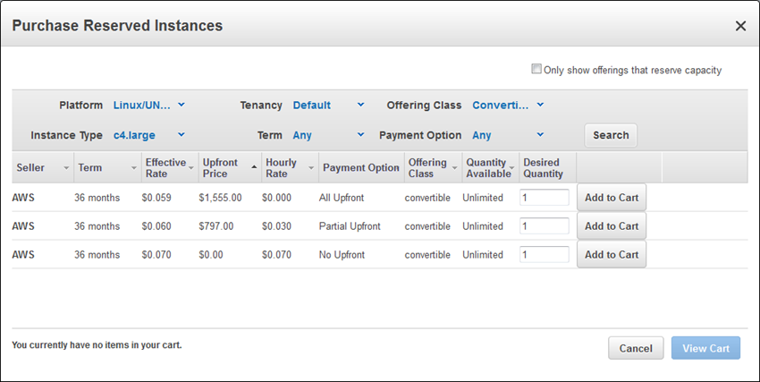

For applications that have steady state or predictable usage, Reserved Instances can provide significant savings compared to using On-Demand instances.

Reserved Instances are recommended for:

\- Applications with steady state usage

\- Applications that may require reserved capacity

\- Customers that can commit to using EC2 over a 1 or 3 year term to reduce their total computing costs

 

**References:** 

https://aws.amazon.com/ec2/pricing/

https://aws.amazon.com/ec2/pricing/reserved-instances/

 

**Check out this Amazon EC2 Cheat Sheet:**

https://tutorialsdojo.com/amazon-elastic-compute-cloud-amazon-ec2/

2

A Solutions Architect is working for a financial company. The manager wants to have the ability to automatically transfer obsolete data from their S3 bucket to a low-cost storage system in AWS.

What is the best solution that the Architect can provide to them?

[(view)](https://portal.tutorialsdojo.com/my-dashboard/#)11000:01:08

-  Use an EC2 instance and a scheduled job to transfer the obsolete data from their S3 location to Amazon S3 Glacier.
-  ==Use Lifecycle Policies in S3 to move obsolete data to Glacier.==
-  Use Amazon SQS.
-  Use CloudEndure Migration.

In this scenario, you can use lifecycle policies in S3 to automatically move obsolete data to Glacier.

Lifecycle configuration in Amazon S3 enables you to specify the lifecycle management of objects in a bucket. The configuration is a set of one or more rules, where each rule defines an action for Amazon S3 to apply to a group of objects.

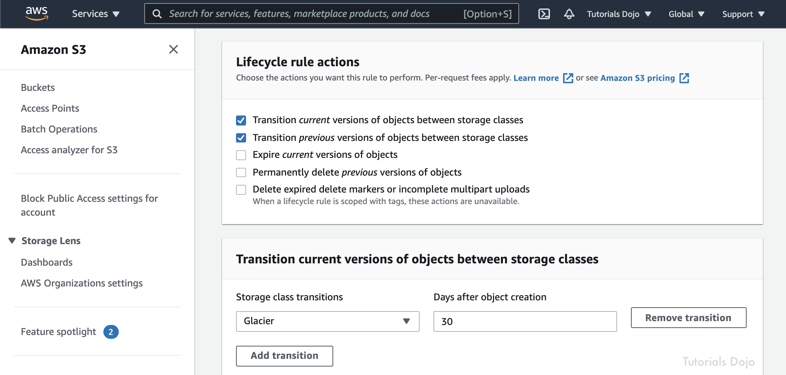

These actions can be classified as follows:

**Transition actions** – In which you define when objects transition to another storage class. For example, you may choose to transition objects to the STANDARD_IA (IA, for infrequent access) storage class 30 days after creation, or archive objects to the GLACIER storage class one year after creation.

**Expiration actions** – In which you specify when the objects expire. Then Amazon S3 deletes the expired objects on your behalf.

The option that says: **Use an EC2 instance and a scheduled job to transfer the obsolete data from their S3 location to Amazon S3 Glacier** is incorrect because you don't need to create a scheduled job in EC2 as you can simply use the lifecycle policy in S3.

The option that says: **Use Amazon SQS** is incorrect as SQS is not a storage service. Amazon SQS is primarily used to decouple your applications by queueing the incoming requests of your application.

The option that says: **Use CloudEndure Migration** is incorrect because this service is just a highly automated lift-and-shift (rehost) solution that simplifies, expedites, and reduces the cost of migrating applications to AWS. You cannot use this to automatically transition your S3 objects to a cheaper storage class.

 

**References:**

http://docs.aws.amazon.com/AmazonS3/latest/dev/object-lifecycle-mgmt.html

https://aws.amazon.com/blogs/aws/archive-s3-to-glacier/

 

**Check out this Amazon S3 Cheat Sheet:**

https://tutorialsdojo.com/amazon-s3/

 

**Tutorials Dojo's AWS Certified Solutions Architect Associate Exam Study Guide:**

https://tutorialsdojo.com/aws-certified-solutions-architect-associate/

3

A company is hosting EC2 instances that are on non-production environment and processing non-priority batch loads, which can be interrupted at any time.

What is the best instance purchasing option which can be applied to your EC2 instances in this case?

[(view)](https://portal.tutorialsdojo.com/my-dashboard/#)11000:04:02

-  Reserved Instances
-  On-Demand Instances
-  ==Spot Instances==
-  Scheduled Reserved Instances

Amazon EC2 Spot instances are spare compute capacity in the AWS cloud available to you at steep discounts compared to On-Demand prices. It can be interrupted by AWS EC2 with two minutes of notification when the EC2 needs the capacity back.

To use Spot Instances, you create a Spot Instance request that includes the number of instances, the instance type, the Availability Zone, and the maximum price that you are willing to pay per instance hour. If your maximum price exceeds the current Spot price, Amazon EC2 fulfills your request immediately if capacity is available. Otherwise, Amazon EC2 waits until your request can be fulfilled or until you cancel the request.

**References:**

http://docs.aws.amazon.com/AWSEC2/latest/UserGuide/using-spot-instances.html

https://aws.amazon.com/ec2/spot/

 

**Check out this Amazon EC2 Cheat Sheet:**

https://tutorialsdojo.com/amazon-elastic-compute-cloud-amazon-ec2/

4

The media company that you are working for has a video transcoding application running on Amazon EC2. Each EC2 instance polls a queue to find out which video should be transcoded, and then runs a transcoding process. If this process is interrupted, the video will be transcoded by another instance based on the queuing system. This application has a large backlog of videos which need to be transcoded. Your manager would like to reduce this backlog by adding more EC2 instances, however, these instances are only needed until the backlog is reduced.

In this scenario, which type of Amazon EC2 instance is the most cost-effective type to use?

[(view)](https://portal.tutorialsdojo.com/my-dashboard/#)11000:00:23

-  Reserved instances
-  Spot instances
-  Dedicated instances
-  On-demand instances

You require an instance that will be used not as a primary server but as a spare compute resource to augment the transcoding process of your application. These instances should also be terminated once the backlog has been significantly reduced. In addition, the scenario mentions that if the current process is interrupted, the video can be transcoded by another instance based on the queuing system. This means that the application can gracefully handle an unexpected termination of an EC2 instance, like in the event of a Spot instance termination when the Spot price is greater than your set maximum price. Hence, an Amazon EC2 Spot instance is the best and cost-effective option for this scenario.


Amazon EC2 Spot instances are **spare** compute capacity in the AWS cloud available to you at steep discounts compared to On-Demand prices. EC2 Spot enables you to optimize your costs on the AWS cloud and scale your application's throughput up to 10X for the same budget. By simply selecting Spot when launching EC2 instances, you can save up-to 90% on On-Demand prices. The only difference between On-Demand instances and Spot Instances is that Spot instances can be interrupted by EC2 with two minutes of notification when the EC2 needs the capacity back.

You can specify whether Amazon EC2 should hibernate, stop, or terminate Spot Instances when they are interrupted. You can choose the interruption behavior that meets your needs.

Take note that there is no *"bid price"* anymore for Spot EC2 instances **since March 2018**. You simply have to set your **maximum price** instead.

**Reserved instances** and **Dedicated instances** are incorrect as both do not act as spare compute capacity.

**On-demand instances** is a valid option but a Spot instance is much cheaper than On-Demand.

 

**References:** 

https://docs.aws.amazon.com/AWSEC2/latest/UserGuide/spot-interruptions.html

http://docs.aws.amazon.com/AWSEC2/latest/UserGuide/how-spot-instances-work.html

https://aws.amazon.com/blogs/compute/new-amazon-ec2-spot-pricing

 

**Check out this Amazon EC2 Cheat Sheet:**

https://tutorialsdojo.com/amazon-elastic-compute-cloud-amazon-ec2/

5

A company has an e-commerce application that saves the transaction logs to an S3 bucket. You are instructed by the CTO to configure the application to keep the transaction logs for one month for troubleshooting purposes, and then afterward, purge the logs.

What should you do to accomplish this requirement?

[(view)](https://portal.tutorialsdojo.com/my-dashboard/#)11000:00:57

-  Add a new bucket policy on the Amazon S3 bucket.
-  Configure the lifecycle configuration rules on the Amazon S3 bucket to purge the transaction logs after a month
-  Create a new IAM policy for the Amazon S3 bucket that automatically deletes the logs after a month
-  Enable CORS on the Amazon S3 bucket which will enable the automatic monthly deletion of data

In this scenario, the best way to accomplish the requirement is to simply configure the lifecycle configuration rules on the Amazon S3 bucket to purge the transaction logs after a month.


Lifecycle configuration enables you to specify the lifecycle management of objects in a bucket. The configuration is a set of one or more rules, where each rule defines an action for Amazon S3 to apply to a group of objects. These actions can be classified as follows:

**Transition actions** – In which you define when objects transition to another storage class. For example, you may choose to transition objects to the STANDARD_IA (IA, for infrequent access) storage class 30 days after creation or archive objects to the GLACIER storage class one year after creation.

**Expiration actions** – In which you specify when the objects expire. Then Amazon S3 deletes the expired objects on your behalf.

Hence, the correct answer is: **Configure the lifecycle configuration rules on the Amazon S3 bucket to purge the transaction logs after a month.**

The option that says: **Add a new bucket policy on the Amazon S3 bucket** is incorrect as it does not provide a solution to any of your needs in this scenario. You add a bucket policy to a bucket to grant other AWS accounts or IAM users access permissions for the bucket and the objects in it.

The option that says: **Create a new IAM policy for the Amazon S3 bucket that automatically deletes the logs after a month** is incorrect because IAM policies are primarily used to specify what actions are allowed or denied on your S3 buckets. You cannot configure an IAM policy to automatically purge logs for you in any way.

The option that says: **Enable CORS on the Amazon S3 bucket which will enable the automatic monthly deletion of data** is incorrect. CORS allows client web applications that are loaded in one domain to interact with resources in a different domain.

 

**References:**

https://docs.aws.amazon.com/AmazonS3/latest/dev/object-lifecycle-mgmt.html

https://docs.amazonaws.cn/en_us/AmazonS3/latest/userguide/lifecycle-transition-general-considerations.html

 

**Check out this Amazon S3 Cheat Sheet:**

https://tutorialsdojo.com/amazon-s3/

 

**Tutorials Dojo's AWS Certified Solutions Architect Associate Exam Study Guide:**

https://tutorialsdojo.com/aws-certified-solutions-architect-associate/

6

In Amazon EC2, you can manage your instances from the moment you launch them up to their termination. You can flexibly control your computing costs by changing the EC2 instance state.

Which of the following statements is true regarding EC2 billing? (Select TWO.)

[(view)](https://portal.tutorialsdojo.com/my-dashboard/#)10100:01:17

-  You will be billed when your On-Demand instance is in `pending` state.
-  You will be billed when your Spot instance is preparing to stop with a `stopping` state.
-  ==You will be billed when your On-Demand instance is preparing to hibernate with a `stopping` state.==
-  ==You will be billed when your Reserved instance is in `terminated` state.==
-  You will not be billed for any instance usage while an instance is not in the `running` state.

By working with Amazon EC2 to manage your instances from the moment you launch them through their termination, you ensure that your customers have the best possible experience with the applications or sites that you host on your instances. The following illustration represents the transitions between instance states. Notice that you can't stop and start an instance store-backed instance:


Below are the valid EC2 lifecycle instance states:

- **`pending`** - The instance is preparing to enter the running state. An instance enters the pending state when it launches for the first time, or when it is restarted after being in the stopped state.
- **`running`** - The instance is running and ready for use.
- **`stopping`** - The instance is preparing to be stopped. Take note that you will not billed if it is preparing to stop however, you will still be billed if it is just preparing to hibernate.
- **`stopped`** - The instance is shut down and cannot be used. The instance can be restarted at any time.
- **`shutting-down`** - The instance is preparing to be terminated.
- **`terminated`** - The instance has been permanently deleted and cannot be restarted. Take note that Reserved Instances that applied to terminated instances are ***still billed\*** until the end of their term according to their payment option.

The option that says: **You will be billed when your On-Demand instance is preparing to hibernate with a `stopping` state** is correct because when the instance state is **`stopping`**, you will not billed if it is preparing to stop however, you **will still be billed** if it is just preparing to hibernate.

The option that says: **You will be billed when your Reserved instance is in `terminated` state** is correct because Reserved Instances that applied to terminated instances are still billed until the end of their term according to their payment option. I actually raised a pull-request to Amazon team about the billing conditions for Reserved Instances, which has been approved and reflected on your official AWS Documentation: https://github.com/awsdocs/amazon-ec2-user-guide/pull/45

The option that says: **You will be billed when your On-Demand instance is in `pending` state** is incorrect because you will not be billed if your instance is in **`pending`** state.

The option that says: ==**You will be billed when your Spot instance is preparing to stop with a `stopping` state** is incorrect because you will not be billed if your instance is preparing to stop with a **`stopping`** state.==

The option that says: **You will not be billed for any instance usage while an instance is not in the `running` state** is incorrect because the statement is not entirely true. You can still be billed if your instance is preparing to hibernate with a **`stopping `**state.

**References:**

https://github.com/awsdocs/amazon-ec2-user-guide/pull/45

http://docs.aws.amazon.com/AWSEC2/latest/UserGuide/ec2-instance-lifecycle.html

**Check out this Amazon EC2 Cheat Sheet:**

https://tutorialsdojo.com/amazon-elastic-compute-cloud-amazon-ec2/

===> 7==

A company has established a dedicated network connection from its on-premises data center to AWS Cloud using AWS Direct Connect (DX). The core network services, such as the Domain Name System (DNS) service and Active Directory services, are all hosted on-premises. The company has new AWS accounts that will also require consistent and dedicated access to these network services.

Which of the following can satisfy this requirement with the LEAST amount of operational overhead and in a cost-effective manner?

[(view)](https://portal.tutorialsdojo.com/my-dashboard/#)10100:04:49

-  Set up another Direct Connect connection for each and every new AWS account that will be added.
-  Set up a new Direct Connect gateway and integrate it with the existing Direct Connect connection. Configure a VPC peering connection between AWS accounts and associate it with Direct Connect gateway.
-  Create a new AWS VPN CloudHub. Set up a Virtual Private Network (VPN) connection for additional AWS accounts.
-  ==Create a new Direct Connect gateway and integrate it with the existing Direct Connect connection. Set up a Transit Gateway between AWS accounts and associate it with the Direct Connect gateway.==

**AWS Transit Gateway** provides a hub and spoke design for connecting VPCs and on-premises networks. You can attach all your hybrid connectivity (VPN and Direct Connect connections) to a single Transit Gateway consolidating and controlling your organization's entire AWS routing configuration in one place. It also controls how traffic is routed among all the connected spoke networks using route tables. This hub and spoke model simplifies management and reduces operational costs because VPCs only connect to the Transit Gateway to gain access to the connected networks.


By attaching a transit gateway to a Direct Connect gateway using a transit virtual interface, you can manage a single connection for multiple VPCs or VPNs that are in the same AWS Region. You can also advertise prefixes from on-premises to AWS and from AWS to on-premises.

The AWS Transit Gateway and AWS Direct Connect solution simplify the management of connections between an Amazon VPC and your networks over a private connection. It can also minimize network costs, improve bandwidth throughput, and provide a more reliable network experience than Internet-based connections.

Hence, the correct answer is: **Create a new Direct Connect gateway and integrate it with the existing Direct Connect connection.** **Set up a Transit Gateway between AWS accounts and associate it with the Direct Connect gateway.**

The option that says: **Set up another Direct Connect connection for each and every new AWS account that will be added** is incorrect because this solution entails a significant amount of additional cost. Setting up a single DX connection requires a substantial budget and takes a lot of time to establish. It also has high management overhead since you will need to manage all of the Direct Connect connections for all AWS accounts.

The option that says: **Create a new AWS VPN CloudHub. Set up a Virtual Private Network (VPN) connection for additional AWS accounts** is incorrect because a VPN connection is not capable of providing consistent and dedicated access to the on-premises network services. Take note that a VPN connection traverses the public Internet and doesn't use a dedicated connection.

The option that says: **Set up a new Direct Connect gateway and integrate it with the existing Direct Connect connection. Configure a VPC peering connection between AWS accounts and associate it with Direct Connect gateway** is incorrect because VPC peering is not supported in a Direct Connect connection. VPC peering does not support transitive peering relationships.

**References:**

https://docs.aws.amazon.com/directconnect/latest/UserGuide/direct-connect-transit-gateways.html

https://docs.aws.amazon.com/whitepapers/latest/aws-vpc-connectivity-options/aws-direct-connect-aws-transit-gateway.html

https://aws.amazon.com/blogs/networking-and-content-delivery/integrating-sub-1-gbps-hosted-connections-with-aws-transit-gateway/

**Check out this AWS Transit Gateway Cheat Sheet:**

https://tutorialsdojo.com/aws-transit-gateway/

===> 8==

A company is hosting an application on EC2 instances that regularly pushes and fetches data in Amazon S3. Due to a change in compliance, the instances need to be moved on a private subnet. Along with this change, the company wants to lower the data transfer costs by configuring its AWS resources.

How can this be accomplished in the MOST cost-efficient manner?

[(view)](https://portal.tutorialsdojo.com/my-dashboard/#)10100:01:06

-  Set up a NAT Gateway in the public subnet to connect to Amazon S3.
-  Create an Amazon S3 interface endpoint to enable a connection between the instances and Amazon S3.
-  ==Create an Amazon S3 gateway endpoint to enable a connection between the instances and Amazon S3.==
-  Set up an AWS Transit Gateway to access Amazon S3.

VPC endpoints for Amazon S3 simplify access to S3 from within a VPC by providing configurable and highly reliable secure connections to S3 that do not require an internet gateway or Network Address Translation (NAT) device. When you create an S3 VPC endpoint, you can attach an endpoint policy to it that controls access to Amazon S3.

You can use two types of VPC endpoints to access Amazon S3: **gateway endpoints and interface endpoints**. A gateway endpoint is a gateway that you specify in your route table to access Amazon S3 from your VPC over the AWS network. Interface endpoints extend the functionality of gateway endpoints by using private IP addresses to route requests to Amazon S3 from within your VPC, on-premises, or from a different AWS Region. Interface endpoints are compatible with gateway endpoints. If you have an existing gateway endpoint in the VPC, you can use both types of endpoints in the same VPC.

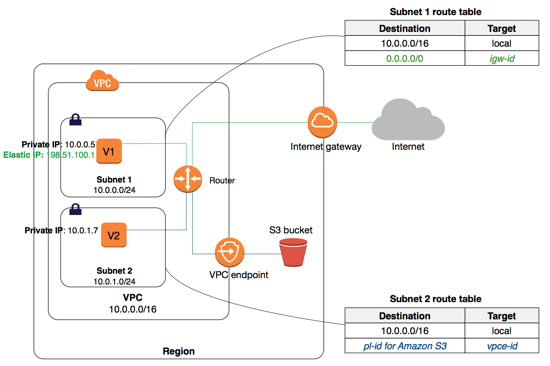

There is no additional charge for using gateway endpoints. However, standard charges for data transfer and resource usage still apply.

Hence, the correct answer is: **Create an Amazon S3 gateway endpoint to enable a connection between the instances and Amazon S3.**

The option that says: **Set up a NAT Gateway in the public subnet to connect to Amazon S3** is incorrect. This will enable a connection between the private EC2 instances and Amazon S3 but it is not the most cost-efficient solution. NAT Gateways are charged on an hourly basis even for idle time.

The option that says: **Create an Amazon S3 interface endpoint to enable a connection between the instances and Amazon S3** is incorrect. This is also a possible solution but it's not the most cost-effective solution. You pay an hourly rate for every provisioned Interface endpoint.

The option that says: **Set up an AWS Transit Gateway to access Amazon S3** is incorrect because this service is mainly used for connecting VPCs and on-premises networks through a central hub.

 

**References:**

https://docs.aws.amazon.com/AmazonS3/latest/userguide/privatelink-interface-endpoints.html

https://docs.aws.amazon.com/vpc/latest/privatelink/vpce-gateway.html

 

**Check out this Amazon S3 Cheat Sheet:**

https://tutorialsdojo.com/amazon-s3/

Sub-Total:85 (62.5%)3 (37.5%)00:14:1162.5%Category: **CSAA - Design High-Performing Architectures**1

A Solutions Architect needs to deploy a mobile application that can collect votes for a popular singing competition. Millions of users from around the world will submit votes using their mobile phones. These votes must be collected and stored in a highly scalable and highly available data store which will be queried for real-time ranking.

Which of the following combination of services should the architect use to meet this requirement?

[(view)](https://portal.tutorialsdojo.com/my-dashboard/#)11000:00:57

-  Amazon DynamoDB and AWS AppSync
-  Amazon Redshift and AWS Mobile Hub
-  Amazon Relational Database Service (RDS) and Amazon MQ
-  Amazon Aurora and Amazon Cognito

When the word durability pops out, the first service that should come to your mind is Amazon S3. Since this service is not available in the answer options, we can look at the other data store available which is Amazon DynamoDB.

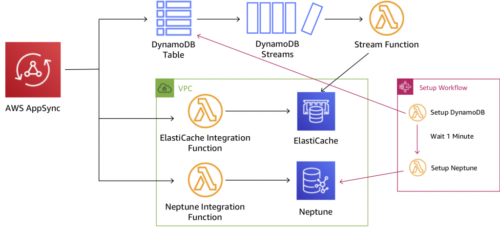

**DynamoDB** is durable, scalable, and highly available data store which can be used for real-time tabulation. You can also use **AppSync** with DynamoDB to make it easy for you to build collaborative apps that keep shared data updated in real time. You just specify the data for your app with simple code statements and AWS AppSync manages everything needed to keep the app data updated in real time. This will allow your app to access data in Amazon DynamoDB, trigger AWS Lambda functions, or run Amazon Elasticsearch queries and combine data from these services to provide the exact data you need for your app.

**Amazon Redshift and AWS Mobile Hub** are incorrect as Amazon Redshift is mainly used as a data warehouse and for online analytic processing (*OLAP*). Although this service can be used for this scenario, DynamoDB is still the top choice given its better durability and scalability.

**Amazon Relational Database Service (RDS) and Amazon MQ** and **Amazon Aurora and Amazon Cognito** are possible answers in this scenario, however, DynamoDB is much more suitable for simple mobile apps that do not have complicated data relationships compared with enterprise web applications. It is stated in the scenario that the mobile app will be used from around the world, which is why you need a data storage service which can be supported globally. It would be a management overhead to implement multi-region deployment for your RDS and Aurora database instances compared to using the Global table feature of DynamoDB.

 

**References:** 

https://aws.amazon.com/dynamodb/faqs/

https://aws.amazon.com/appsync/

 

**Amazon DynamoDB Overview:**


<iframe title="YouTube video player" src="https://www.youtube.com/embed/3ZOyUNIeorU" frameborder="0" allowfullscreen="allowfullscreen" data-mce-fragment="1" name="fitvid0" style="box-sizing: border-box; margin: 0px; max-width: 100%; width: 2129.76px; line-height: 1; border: none; position: absolute; top: 0px; left: 0px; height: 1197.99px;"></iframe>


**Check out this Amazon DynamoDB Cheat Sheet:**

https://tutorialsdojo.com/amazon-dynamodb/

 

**Tutorials Dojo's AWS Certified Solutions Architect Associate Exam Study Guide:**

https://tutorialsdojo.com/aws-certified-solutions-architect-associate/

2

A company deployed a high-performance computing (HPC) cluster that spans multiple EC2 instances across multiple Availability Zones and processes various wind simulation models. Currently, the Solutions Architect is experiencing a slowdown in their applications and upon further investigation, it was discovered that it was due to latency issues.

Which is the MOST suitable solution that the Solutions Architect should implement to provide low-latency network performance necessary for tightly-coupled node-to-node communication of the HPC cluster?

[(view)](https://portal.tutorialsdojo.com/my-dashboard/#)11000:06:40

-  Set up a spread placement group across multiple Availability Zones in multiple AWS Regions.
-  Set up AWS Direct Connect connections across multiple Availability Zones for increased bandwidth throughput and more consistent network experience.
-  Use EC2 Dedicated Instances.
-  Set up a cluster placement group within a single Availability Zone in the same AWS Region.

When you launch a new EC2 instance, the EC2 service attempts to place the instance in such a way that all of your instances are spread out across underlying hardware to minimize correlated failures. You can use *placement groups* to influence the placement of a group of *interdependent* instances to meet the needs of your workload. Depending on the type of workload, you can create a placement group using one of the following placement strategies:

***Cluster\*** – packs instances close together inside an Availability Zone. This strategy enables workloads to achieve the low-latency network performance necessary for tightly-coupled node-to-node communication that is typical of HPC applications.

***Partition\*** – spreads your instances across logical partitions such that groups of instances in one partition do not share the underlying hardware with groups of instances in different partitions. This strategy is typically used by large distributed and replicated workloads, such as Hadoop, Cassandra, and Kafka.

***Spread\*** – strictly places a small group of instances across distinct underlying hardware to reduce correlated failures.

Cluster placement groups are recommended for applications that benefit from low network latency, high network throughput, or both. They are also recommended when the majority of the network traffic is between the instances in the group. To provide the lowest latency and the highest packet-per-second network performance for your placement group, choose an instance type that supports enhanced networking.

 


 

Partition placement groups can be used to deploy large distributed and replicated workloads, such as HDFS, HBase, and Cassandra, across distinct racks. When you launch instances into a partition placement group, Amazon EC2 tries to distribute the instances evenly across the number of partitions that you specify. You can also launch instances into a specific partition to have more control over where the instances are placed.

 

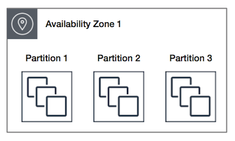

 

Spread placement groups are recommended for applications that have a small number of critical instances that should be kept separate from each other. Launching instances in a spread placement group reduces the risk of simultaneous failures that might occur when instances share the same racks. Spread placement groups provide access to distinct racks, and are therefore suitable for mixing instance types or launching instances over time. A spread placement group can span multiple Availability Zones in the same Region. You can have a maximum of seven running instances per Availability Zone per group.

 


 

Hence, the correct answer is: **Set up a cluster placement group within a single Availability Zone in the same AWS Region.**

The option that says:**Set up a spread placement group across multiple Availability Zones in multiple AWS Regions** is incorrect because although using a placement group is valid for this particular scenario, you can only set up a placement group in a **single** AWS Region only. A spread placement group can span multiple Availability Zones in the same Region.

The option that says: **Set up AWS Direct Connect connections across multiple Availability Zones for increased bandwidth throughput and more consistent network experience** is incorrect because this is primarily used for hybrid architectures. It bypasses the public Internet and establishes a secure, dedicated connection from your on-premises data center into AWS, and not used for having low latency within your AWS network.

The option that says: **Use EC2 Dedicated Instances** is incorrect because these are EC2 instances that run in a VPC on hardware that is dedicated to a single customer and are physically isolated at the host hardware level from instances that belong to other AWS accounts. It is not used for reducing latency.

 

**References:**

http://docs.aws.amazon.com/AWSEC2/latest/UserGuide/placement-groups.html

https://aws.amazon.com/hpc/

 

**Check out this Amazon EC2 Cheat Sheet:**

https://tutorialsdojo.com/amazon-elastic-compute-cloud-amazon-ec2/

3

A data analytics company is setting up an innovative checkout-free grocery store. Their Solutions Architect developed a real-time monitoring application that uses smart sensors to collect the items that the customers are getting from the grocery’s refrigerators and shelves then automatically deduct it from their accounts. The company wants to analyze the items that are frequently being bought and store the results in S3 for durable storage to determine the purchase behavior of its customers.

What service must be used to easily capture, transform, and load streaming data into Amazon S3, Amazon Elasticsearch Service, and Splunk?

[(view)](https://portal.tutorialsdojo.com/my-dashboard/#)10100:01:00

-  ==Amazon Kinesis Data Firehose==
-  Amazon Kinesis
-  Amazon Redshift
-  Amazon SQS

==Amazon Kinesis Data Firehose is the easiest way to load streaming data into data stores and analytics tools. It can capture, transform, and load streaming data into Amazon S3, Amazon Redshift, Amazon Elasticsearch Service, and Splunk, enabling near real-time analytics with existing business intelligence tools and dashboards you are already using today.==

==It is a fully managed service that automatically scales to match the throughput of your data and requires no ongoing administration. It can also batch, compress, and encrypt the data before loading it, minimizing the amount of storage used at the destination and increasing security.==

In the diagram below, you gather the data from your smart refrigerators and use Kinesis Data firehouse to prepare and load the data. S3 will be used as a method of durably storing the data for analytics and the eventual ingestion of data for output using analytical tools.


You can use Amazon Kinesis Data Firehose in conjunction with Amazon Kinesis Data Streams if you need to implement real-time processing of streaming big data. ==Kinesis Data Streams provides an ordering of records, as well as the ability to read and/or replay records in the same order to multiple Amazon Kinesis Applications.== ==The Amazon Kinesis Client Library (KCL) delivers all records for a given partition key to the same record processor, making it easier to build multiple applications reading from the same Amazon Kinesis data stream== (for example, to perform counting, aggregation, and filtering).

Amazon Simple Queue Service (Amazon SQS) is different from Amazon Kinesis Data Firehose. SQS offers a reliable, highly scalable hosted queue for storing messages as they travel between computers. Amazon SQS lets you easily move data between distributed application components and helps you build applications in which messages are processed independently (with message-level ack/fail semantics), such as automated workflows. Amazon Kinesis Data Firehose is primarily used to load streaming data into data stores and analytics tools.

Hence, the correct answer is: **Amazon Kinesis Data Firehose.**

==**Amazon Kinesis** is== incorrect because this is ==the streaming data platform of AWS and has four distinct services under it: Kinesis Data Firehose, Kinesis Data Streams, Kinesis Video Streams, and Amazon Kinesis Data Analytics.== For the specific use case just as asked in the scenario, use Kinesis Data Firehose.

**Amazon Redshift** is incorrect because this is mainly used for data warehousing making it simple and cost-effective to analyze your data across your data warehouse and data lake. It does not meet the requirement of being able to load and stream data into data stores for analytics. You have to use Kinesis Data Firehose instead.

**Amazon SQS** is incorrect because you can't capture, transform, and load streaming data into Amazon S3, Amazon Elasticsearch Service, and Splunk using this service. You have to use Kinesis Data Firehose instead.

**References:**

https://aws.amazon.com/kinesis/data-firehose/

https://aws.amazon.com/kinesis/data-streams/faqs/

4

A global online sports betting company has its popular web application hosted in AWS. They are planning to develop a new online portal for their new business venture and they hired you to implement the cloud architecture for a new online portal that will accept bets globally for world sports. You started to design the system with a relational database that runs on a single EC2 instance, which requires a single EBS volume that can support up to 30,000 IOPS.

In this scenario, which Amazon EBS volume type can you use that will meet the performance requirements of this new online portal?

[(view)](https://portal.tutorialsdojo.com/my-dashboard/#)11000:00:25

-  EBS Provisioned IOPS SSD (io1)
-  EBS Throughput Optimized HDD (st1)
-  EBS General Purpose SSD (gp2)
-  EBS Cold HDD (sc1)

The scenario requires a storage type for a relational database with a high IOPS performance. For these scenarios, SSD volumes are more suitable to use instead of HDD volumes. Remember that the dominant performance attribute of SSD is **IOPS** while HDD is **Throughput**.

In the exam, always consider the difference between SSD and HDD as shown on the table below. This will allow you to easily eliminate specific EBS-types in the options which are not SSD or not HDD, depending on whether the question asks for a storage type which has ***small, random\*** I/O operations or ***large, sequential\*** I/O operations.

Since the requirement is 30,000 IOPS, you have to use an EBS type of Provisioned IOPS SSD. This provides sustained performance for mission-critical low-latency workloads. Hence, **EBS Provisioned IOPS SSD (io1)** is the correct answer.


**EBS Throughput Optimized HDD (st1)** and **EBS Cold HDD (sc1)** are incorrect because these are HDD volumes which are more suitable for large streaming workloads rather than transactional database workloads.

**EBS General Purpose SSD (gp2)** is incorrect because although a General Purpose SSD volume can be used for this scenario, it does not provide the high IOPS required by the application, unlike the Provisioned IOPS SSD volume.

**Reference:** 

https://aws.amazon.com/ebs/details/

**Amazon EBS Overview - SSD vs HDD:**

https://www.youtube.com/embed/LW7x8wyLFvw

**Check out this Amazon EBS Cheat Sheet:**

https://tutorialsdojo.com/amazon-ebs/

5

A document sharing website is using AWS as its cloud infrastructure. Free users can upload a total of 5 GB data while premium users can upload as much as 5 TB. Their application uploads the user files, which can have a max file size of 1 TB, to an S3 Bucket.

In this scenario, what is the best way for the application to upload the large files in S3?

[(view)](https://portal.tutorialsdojo.com/my-dashboard/#)11000:00:38

-  Use a single PUT request to upload the large file
-  Use AWS Snowball
-  Use AWS Import/Export
-  Use Multipart Upload

The total volume of data and number of objects you can store are unlimited. Individual Amazon S3 objects can range in size from a minimum of 0 bytes to a maximum of 5 terabytes. The largest object that can be uploaded in a single PUT is 5 gigabytes. For objects larger than 100 megabytes, customers should consider using the Multipart Upload capability.

The Multipart upload API enables you to upload large objects in parts. You can use this API to upload new large objects or make a copy of an existing object. Multipart uploading is a three-step process: you initiate the upload, you upload the object parts, and after you have uploaded all the parts, you complete the multipart upload. Upon receiving the complete multipart upload request, Amazon S3 constructs the object from the uploaded parts and you can then access the object just as you would any other object in your bucket.

**Using a single PUT request to upload the large file** is incorrect because the largest file size you can upload using a single PUT request is 5 GB. Files larger than this will fail to be uploaded.

**Using AWS Snowball** is incorrect because this is a migration tool that lets you transfer large amounts of data from your on-premises data center to AWS S3 and vice versa. This tool is not suitable for the given scenario. And when you provision Snowball, the device gets transported to you, and not to your customers. Therefore, you bear the responsibility of securing the device.

**Using AWS Import/Export** is incorrect because Import/Export is similar to AWS Snowball in such a way that it is meant to be used as a migration tool, and not for multiple customer consumption such as in the given scenario.

**References:**

https://docs.aws.amazon.com/AmazonS3/latest/dev/mpuoverview.html

https://aws.amazon.com/s3/faqs/

**Check out this Amazon S3 Cheat Sheet:**

https://tutorialsdojo.com/amazon-s3/

6

A Solutions Architect is designing a highly available environment for an application. She plans to host the application on EC2 instances within an Auto Scaling Group. One of the conditions requires data stored on root EBS volumes to be preserved if an instance terminates.

What should be done to satisfy the requirement?

[(view)](https://portal.tutorialsdojo.com/my-dashboard/#)10100:01:06

-  Use AWS DataSync to replicate root volume data to Amazon S3.
-  ==Set the value of `DeleteOnTermination` attribute of the EBS volumes to `False`.==
-  Configure ASG to suspend the health check process for each EC2 instance.
-  Enable the Termination Protection option for all EC2 instances.

By default, Amazon EBS root device volumes are automatically deleted when the instance terminates. However, by default, any additional EBS volumes that you attach at launch, or any EBS volumes that you attach to an existing instance persist even after the instance terminates. This behavior is controlled by the volume's `DeleteOnTermination` attribute, which you can modify.

To preserve the root volume when an instance terminates, change the `DeleteOnTermination` attribute for the root volume to False.

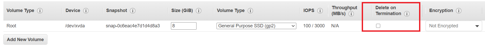

This EBS attribute can be changed through the AWS Console upon launching the instance or through CLI/API command.

Hence, the correct answer is the option that says: **Set the value of `DeleteOnTermination` attribute of the EBS volumes to `False`**.

The option that says: **Use AWS DataSync to replicate root volume data to Amazon S3** is incorrect because AWS DataSync does not work with Amazon EBS volumes. DataSync can copy data between Network File System (NFS) shares, Server Message Block (SMB) shares, self-managed object storage, AWS Snowcone, Amazon Simple Storage Service (Amazon S3) buckets, Amazon Elastic File System (Amazon EFS) file systems, and Amazon FSx for Windows File Server file systems.

The option that says: **Configure ASG to suspend the health check process for each EC2 instance** is incorrect because suspending the health check process will prevent the ASG from replacing unhealthy EC2 instances. This can cause availability issues to the application.

The option that says: **Enable the Termination Protection option for all EC2 instances** is incorrect. Termination Protection will just prevent your instance from being accidentally terminated using the Amazon EC2 console.

**References:**

https://aws.amazon.com/premiumsupport/knowledge-center/deleteontermination-ebs/

https://docs.aws.amazon.com/AWSEC2/latest/UserGuide/terminating-instances.html

**Check out this Amazon EBS Cheat Sheet:**

https://tutorialsdojo.com/amazon-ebs/

7

A company needs to collect gigabytes of data per second from websites and social media feeds to gain insights on its product offerings and continuously improve the user experience. To meet this design requirement, you have developed an application hosted on an Auto Scaling group of Spot EC2 instances which processes the data and stores the results to DynamoDB and Redshift. The solution should have a built-in enhanced fan-out feature.

Which fully-managed AWS service can you use to collect and process large streams of data records in real-time with the LEAST amount of administrative overhead?

[(view)](https://portal.tutorialsdojo.com/my-dashboard/#)10100:01:02

-  Amazon S3 Access Points
-  Amazon Redshift with AWS Cloud Development Kit (AWS CDK)
-  Amazon Managed Streaming for Apache Kafka (Amazon MSK)
-  ==Amazon Kinesis Data Streams==

==**Amazon Kinesis Data Streams** is used to collect and process large streams of data records in real-time. You can use Kinesis Data Streams for rapid and continuous data intake and aggregation.== The type of data used includes IT infrastructure log data, application logs, social media, market data feeds, and web clickstream data. Because the response time for the data intake and processing is in real-time, the processing is typically lightweight.

The following diagram illustrates the high-level architecture of Kinesis Data Streams. The producers continually push data to Kinesis Data Streams, and the consumers process the data in real-time. Consumers (such as a custom application running on Amazon EC2 or an Amazon Kinesis Data Firehose delivery stream) can store their results using an AWS service such as Amazon DynamoDB, Amazon Redshift, or Amazon S3.

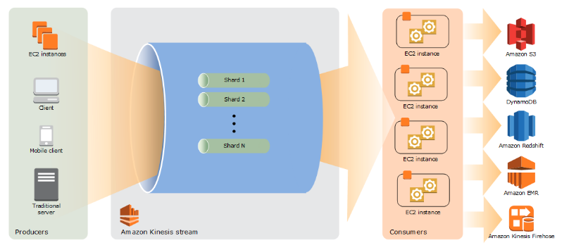

Hence, the correct answer is: **Amazon Kinesis Data Streams.**

**Amazon S3 Access Points** is incorrect because this is mainly used to manage access of your S3 objects. ==Amazon S3 access points are named network endpoints that are attached to buckets that you can use to perform S3 object operations, such as uploading and retrieving objects.==

**Amazon Redshift with AWS Cloud Development Kit (AWS CDK)** is incorrect because this is mainly used for data warehousing making it simple and cost-effective to analyze your data across your data warehouse and data lake. Again, it does not meet the requirement of being able to collect and process large streams of data in real-time. Using the AWS Cloud Development Kit (AWS CDK) with Amazon Redshift still won't satisfy this requirement.

**Amazon Managed Streaming for Apache Kafka (Amazon MSK)** is incorrect. Although you can process streaming data in real-time with Amazon MSK, this service still entails a lot of administrative overhead, unlike Amazon Kinesis. Moreover, it doesn't have a built-in enhanced fan-out feature as required in the scenario.

**References:**

https://docs.aws.amazon.com/streams/latest/dev/introduction.html

https://aws.amazon.com/kinesis/

**Check out this Amazon Kinesis Cheat Sheet:**

https://tutorialsdojo.com/amazon-kinesis/

**Tutorials Dojo's AWS Certified Solutions Architect Associate Exam Study Guide:**

https://tutorialsdojo.com/aws-certified-solutions-architect-associate/

8

A large financial firm in the country has an AWS environment that contains several Reserved EC2 instances hosting a web application that has been decommissioned last week. To save costs, you need to stop incurring charges for the Reserved instances as soon as possible.

What cost-effective steps will you take in this circumstance? (Select TWO.)

[(view)](https://portal.tutorialsdojo.com/my-dashboard/#)10100:01:17

-  Stop the Reserved instances as soon as possible.
-  Contact AWS to cancel your AWS subscription.
-  ==Go to the AWS Reserved Instance Marketplace and sell the Reserved instances.==
-  ==Terminate the Reserved instances as soon as possible to avoid getting billed at the on-demand price when it expires.==
-  Go to the Amazon.com online shopping website and sell the Reserved instances.

==The **Reserved Instance Marketplace** is a platform that supports the sale of third-party and AWS customers' unused Standard Reserved Instances, which vary in terms of lengths and pricing options.== For example, you may want to sell Reserved Instances after moving instances to a new AWS region, changing to a new instance type, ending projects before the term expiration, when your business needs change, or if you have unneeded capacity.

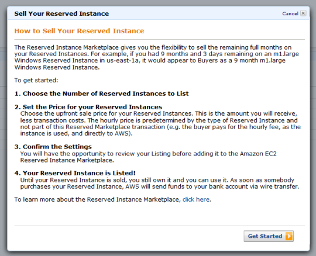

Hence, the correct answers are:

**- Go to the AWS Reserved Instance Marketplace and sell the Reserved instances.**

**- Terminate the Reserved instances as soon as possible to avoid getting billed at the on-demand price when it expires.**

**Stopping the Reserved instances as soon as possible** is incorrect because a stopped instance can still be restarted. Take note that ==when a Reserved Instance expires, any instances that were covered by the Reserved Instance are billed at the on-demand price which costs significantly higher.== Since the application is already decommissioned, there is no point of keeping the unused instances. It is also possible that there are associated Elastic IP addresses, which will incur charges if they are associated with stopped instances

**Contacting AWS to cancel your AWS subscription** is incorrect as you don't need to close down your AWS account.

**Going to the Amazon.com online shopping website and selling the Reserved instances** is incorrect as you have to use AWS Reserved Instance Marketplace to sell your instances.

 

**References:**

https://docs.aws.amazon.com/AWSEC2/latest/UserGuide/ri-market-general.html

https://docs.aws.amazon.com/AWSEC2/latest/UserGuide/ec2-instance-lifecycle.html

 

**Check out this Amazon EC2 Cheat Sheet:**

https://tutorialsdojo.com/amazon-elastic-compute-cloud-amazon-ec2/

9

A company has a global online trading platform in which the users from all over the world regularly upload terabytes of transactional data to a centralized S3 bucket.

What AWS feature should you use in your present system to improve throughput and ensure consistently fast data transfer to the Amazon S3 bucket, regardless of your user's location?

[(view)](https://portal.tutorialsdojo.com/my-dashboard/#)11000:00:26

-  FTP
-  AWS Direct Connect
-  Amazon S3 Transfer Acceleration
-  Use CloudFront Origin Access Identity

**Amazon S3 Transfer Acceleration** enables fast, easy, and secure transfers of files over long distances between your client and your Amazon S3 bucket. Transfer Acceleration leverages Amazon CloudFront’s globally distributed AWS Edge Locations. As data arrives at an AWS Edge Location, data is routed to your Amazon S3 bucket over an optimized network path.


**FTP** is incorrect because the File Transfer Protocol does not guarantee fast throughput and consistent, fast data transfer.

**AWS Direct Connect** is incorrect because you have users all around the world and not just on your on-premises data center. Direct Connect would be too costly and is definitely not suitable for this purpose.

**Using CloudFront Origin Access Identity** is incorrect because this is a feature which ensures that only CloudFront can serve S3 content. It does not increase throughput and ensure fast delivery of content to your customers.

 

**Reference:**

http://docs.aws.amazon.com/AmazonS3/latest/dev/transfer-acceleration.html

 

**Check out this Amazon S3 Cheat Sheet:**

https://tutorialsdojo.com/amazon-s3/

 

**S3 Transfer Acceleration vs Direct Connect vs VPN vs Snowball vs Snowmobile:**

https://tutorialsdojo.com/s3-transfer-acceleration-vs-direct-connect-vs-vpn-vs-snowball-vs-snowmobile/

 

**Comparison of AWS Services Cheat Sheets:**

https://tutorialsdojo.com/comparison-of-aws-services/

10

A Solutions Architect working for a startup is designing a High Performance Computing (HPC) application which is publicly accessible for their customers. The startup founders want to mitigate distributed denial-of-service (DDoS) attacks on their application.

Which of the following options are not suitable to be implemented in this scenario? (Select TWO.)

[(view)](https://portal.tutorialsdojo.com/my-dashboard/#)11000:00:55

-  Use Dedicated EC2 instances to ensure that each instance has the maximum performance possible.
-  Add multiple Elastic Fabric Adapters (EFA) to each EC2 instance to increase the network bandwidth.
-  Use an Amazon CloudFront service for distributing both static and dynamic content.
-  Use an Application Load Balancer with Auto Scaling groups for your EC2 instances. Prevent direct Internet traffic to your Amazon RDS database by deploying it to a new private subnet.
-  Use AWS Shield and AWS WAF.

Take note that the question asks about the viable mitigation techniques that are **NOT** suitable to prevent Distributed Denial of Service (DDoS) attack.

A Denial of Service (DoS) attack is an attack that can make your website or application unavailable to end users. To achieve this, attackers use a variety of techniques that consume network or other resources, disrupting access for legitimate end users.

To protect your system from DDoS attack, you can do the following:

\- Use an Amazon CloudFront service for distributing both static and dynamic content.

\- Use an Application Load Balancer with Auto Scaling groups for your EC2 instances. Prevent direct Internet traffic to your Amazon RDS database by deploying it to a new private subnet.

\- Set up alerts in Amazon CloudWatch to look for high **`Network In`** and CPU utilization metrics.

Services that are available within AWS Regions, like Elastic Load Balancing and Amazon Elastic Compute Cloud (EC2), allow you to build Distributed Denial of Service resiliency and scale to handle unexpected volumes of traffic within a given region. Services that are available in AWS edge locations, like Amazon CloudFront, AWS WAF, Amazon Route53, and Amazon API Gateway, allow you to take advantage of a global network of edge locations that can provide your application with greater fault tolerance and increased scale for managing larger volumes of traffic.

In addition, you can also use **AWS Shield** and **AWS WAF** to fortify your cloud network. AWS Shield is a managed DDoS protection service that is available in two tiers: Standard and Advanced. AWS Shield Standard applies always-on detection and inline mitigation techniques, such as deterministic packet filtering and priority-based traffic shaping, to minimize application downtime and latency.

**AWS WAF** is a web application firewall that helps protect web applications from common web exploits that could affect application availability, compromise security, or consume excessive resources. You can use AWS WAF to define customizable web security rules that control which traffic accesses your web applications. If you use AWS Shield Advanced, you can use AWS WAF at no extra cost for those protected resources and can engage the DRT to create WAF rules.

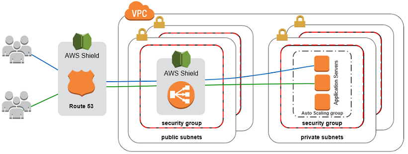

**Using Dedicated EC2 instances to ensure that each instance has the maximum performance possible** is not a viable mitigation technique because Dedicated EC2 instances are just an instance billing option. Although it may ensure that each instance gives the maximum performance, that by itself is not enough to mitigate a DDoS attack.

**Adding multiple Elastic Fabric Adapters (EFA) to each EC2 instance to increase the network bandwidth** is also not a viable option as this is mainly done for performance improvement, and not for DDoS attack mitigation. Moreover, you can attach only one EFA per EC2 instance. An Elastic Fabric Adapter (EFA) is a network device that you can attach to your Amazon EC2 instance to accelerate High-Performance Computing (HPC) and machine learning applications.

The following options are valid mitigation techniques that can be used to prevent DDoS:

**- Use an Amazon CloudFront service for distributing both static and dynamic content.**

**- Use an Application Load Balancer with Auto Scaling groups for your EC2 instances. Prevent direct Internet traffic to your Amazon RDS database by deploying it to a new private subnet.**

**- Use AWS Shield and AWS WAF.**

 

**References**:

https://aws.amazon.com/answers/networking/aws-ddos-attack-mitigation/

https://d0.awsstatic.com/whitepapers/DDoS_White_Paper_June2015.pdf

 

**Best practices on DDoS Attack Mitigation:**


<iframe src="https://www.youtube.com/embed/HnoZS5jj7pk" frameborder="0" allowfullscreen="allowfullscreen" name="fitvid2" style="box-sizing: border-box; margin: 0px; max-width: 100%; width: 2129.76px; line-height: 1; border: none; position: absolute; top: 0px; left: 0px; height: 1197.99px;"></iframe>


11

A company currently has an Augment Reality (AR) mobile game that has a serverless backend. It is using a DynamoDB table which was launched using the AWS CLI to store all the user data and information gathered from the players and a Lambda function to pull the data from DynamoDB. The game is being used by millions of users each day to read and store data.

How would you design the application to improve its overall performance and make it more scalable while keeping the costs low? (Select TWO

[(view)](https://portal.tutorialsdojo.com/my-dashboard/#)11000:02:27

-  Enable DynamoDB Accelerator (DAX) and ensure that the Auto Scaling is enabled and increase the maximum provisioned read and write capacity.
-  Configure CloudFront with DynamoDB as the origin; cache frequently accessed data on the client device using ElastiCache.
-  Use AWS SSO and Cognito to authenticate users and have them directly access DynamoDB using single-sign on. Manually set the provisioned read and write capacity to a higher RCU and WCU.
-  Use API Gateway in conjunction with Lambda and turn on the caching on frequently accessed data and enable DynamoDB global replication.
-  Since Auto Scaling is enabled by default, the provisioned read and write capacity will adjust automatically. Also enable DynamoDB Accelerator (DAX) to improve the performance from milliseconds to microseconds.

The correct answers are the options that say:

**- Enable DynamoDB Accelerator (DAX) and ensure that the Auto Scaling is enabled and increase the maximum provisioned read and write capacity.**

**- Use API Gateway in conjunction with Lambda and turn on the caching on frequently accessed data and enable DynamoDB global replication.**

**Amazon DynamoDB Accelerator (DAX)** is a fully managed, highly available, in-memory cache for DynamoDB that delivers up to a 10x performance improvement – from milliseconds to microseconds – even at millions of requests per second. DAX does all the heavy lifting required to add in-memory acceleration to your DynamoDB tables, without requiring developers to manage cache invalidation, data population, or cluster management.


**Amazon API Gateway** lets you create an API that acts as a "front door" for applications to access data, business logic, or functionality from your back-end services, such as code running on AWS Lambda. Amazon API Gateway handles all of the tasks involved in accepting and processing up to hundreds of thousands of concurrent API calls, including traffic management, authorization and access control, monitoring, and API version management. Amazon API Gateway has no minimum fees or startup costs.

**AWS Lambda** scales your functions automatically on your behalf. Every time an event notification is received for your function, AWS Lambda quickly locates free capacity within its compute fleet and runs your code. Since your code is stateless, AWS Lambda can start as many copies of your function as needed without lengthy deployment and configuration delays.

The option that says: **Configure CloudFront with DynamoDB as the origin; cache frequently accessed data on the client device using ElastiCache** is incorrect. Although CloudFront delivers content faster to your users using edge locations, you still cannot integrate DynamoDB table with CloudFront as these two are incompatible.

The option that says: **Use AWS SSO and Cognito to authenticate users and have them directly access DynamoDB using single-sign on. Manually set the provisioned read and write capacity to a higher RCU and WCU** is incorrect because AWS Single Sign-On (SSO) is a cloud SSO service that just makes it easy to centrally manage SSO access to multiple AWS accounts and business applications. This will not be of much help on the scalability and performance of the application. It is costly to manually set the provisioned read and write capacity to a higher RCU and WCU because this capacity will run round the clock and will still be the same even if the incoming traffic is stable and there is no need to scale.

The option that says: **Since Auto Scaling is enabled by default, the provisioned read and write capacity will adjust automatically. Also enable DynamoDB Accelerator (DAX) to improve the performance from milliseconds to microseconds** is incorrect because, by default, Auto Scaling is not enabled in a DynamoDB table which is created using the AWS CLI.

 

**References:**

https://aws.amazon.com/lambda/faqs/

https://aws.amazon.com/api-gateway/faqs/

https://aws.amazon.com/dynamodb/dax/

 

**Tutorials Dojo's AWS Certified Solutions Architect Associate Exam Study Guide:**

https://tutorialsdojo.com/aws-certified-solutions-architect-associate/

12

A new online banking platform has been re-designed to have a microservices architecture in which complex applications are decomposed into smaller, independent services. The new platform is using Docker considering that application containers are optimal for running small, decoupled services. The new solution should remove the need to provision and manage servers, let you specify and pay for resources per application, and improve security through application isolation by design.

Which of the following is the MOST suitable service to use to migrate this new platform to AWS?

[(view)](https://portal.tutorialsdojo.com/my-dashboard/#)11000:01:01

-  Amazon EKS
-  Amazon EFS
-  AWS Fargate
-  Amazon EBS

**AWS Fargate** is a serverless compute engine for containers that works with both Amazon Elastic Container Service (ECS) and Amazon Elastic Kubernetes Service (EKS). Fargate makes it easy for you to focus on building your applications. Fargate removes the need to provision and manage servers, lets you specify and pay for resources per application, and improves security through application isolation by design.

Fargate allocates the right amount of compute, eliminating the need to choose instances and scale cluster capacity. You only pay for the resources required to run your containers, so there is no over-provisioning and paying for additional servers. Fargate runs each task or pod in its own kernel providing the tasks and pods their own isolated compute environment. This enables your application to have workload isolation and improved security by design. This is why customers such as Vanguard, Accenture, Foursquare, and Ancestry have chosen to run their mission critical applications on Fargate.


Hence, the correct answer is: **AWS Fargate.**

**Amazon EKS** is incorrect because this is more suitable to run the Kubernetes management infrastructure and not Docker. It does not remove the need to provision and manage servers nor let you specify and pay for resources per application, unlike AWS Fargate.

**Amazon EFS** is incorrect because this is a file system for Linux-based workloads for use with AWS Cloud services and on-premises resources.

**Amazon EBS** is incorrect because this is primarily used to provide persistent block storage volumes for use with Amazon EC2 instances in the AWS Cloud.

 

**References:**

https://aws.amazon.com/fargate/

https://docs.aws.amazon.com/AmazonECS/latest/developerguide/ECS_GetStarted_Fargate.html

 

**Check out this Amazon ECS Cheat Sheet:**

https://tutorialsdojo.com/amazon-elastic-container-service-amazon-ecs/

13

A large telecommunications company needs to run analytics against all combined log files from the Application Load Balancer as part of the regulatory requirements.

Which AWS services can be used together to collect logs and then easily perform log analysis?

[(view)](https://portal.tutorialsdojo.com/my-dashboard/#)11000:00:37

-  Amazon DynamoDB for storing and EC2 for analyzing the logs.
-  Amazon EC2 with EBS volumes for storing and analyzing the log files.
-  Amazon S3 for storing the ELB log files and an EC2 instance for analyzing the log files using a custom-built application.
-  Amazon S3 for storing ELB log files and Amazon EMR for analyzing the log files.

In this scenario, it is best to use a combination of Amazon S3 and Amazon EMR: Amazon S3 for storing ELB log files and Amazon EMR for analyzing the log files. Access logging in the ELB is stored in Amazon S3 which means that the following are valid options:

\- Amazon S3 for storing the ELB log files and an EC2 instance for analyzing the log files using a custom-built application.

\- Amazon S3 for storing ELB log files and Amazon EMR for analyzing the log files.

However, log analysis can be automatically provided by Amazon EMR, which is more economical than building a custom-built log analysis application and hosting it in EC2. Hence, the option that says: **Amazon S3 for storing ELB log files and Amazon EMR for analyzing the log files** is the best answer between the two.

Access logging is an optional feature of Elastic Load Balancing that is disabled by default. After you enable access logging for your load balancer, Elastic Load Balancing captures the logs and stores them in the Amazon S3 bucket that you specify as compressed files. You can disable access logging at any time.


**Amazon EMR** provides a managed Hadoop framework that makes it easy, fast, and cost-effective to process vast amounts of data across dynamically scalable Amazon EC2 instances. It securely and reliably handles a broad set of big data use cases, including log analysis, web indexing, data transformations (ETL), machine learning, financial analysis, scientific simulation, and bioinformatics. You can also run other popular distributed frameworks such as Apache Spark, HBase, Presto, and Flink in Amazon EMR, and interact with data in other AWS data stores such as Amazon S3 and Amazon DynamoDB.

The option that says: **Amazon DynamoDB for storing and EC2 for analyzing the logs** is incorrect because DynamoDB is a noSQL database solution of AWS. It would be inefficient to store logs in DynamoDB while using EC2 to analyze them.

The option that says: **Amazon EC2 with EBS volumes for storing and analyzing the log files** is incorrect because using EC2 with EBS would be costly, and EBS might not provide the most durable storage for your logs, unlike S3.

The option that says: **Amazon S3 for storing the ELB log files and an EC2 instance for analyzing the log files using a custom-built application** is incorrect because using EC2 to analyze logs would be inefficient and expensive since you will have to program the analyzer yourself.

 

**References:**

https://aws.amazon.com/emr/

https://docs.aws.amazon.com/elasticloadbalancing/latest/application/load-balancer-access-logs.html

 

**Check out this Amazon EMR Cheat Sheet:**

https://tutorialsdojo.com/amazon-emr/

 

**Check out this AWS Elastic Load Balancing (ELB) Cheat Sheet:**

https://tutorialsdojo.com/aws-elastic-load-balancing-elb/

14

A media company recently launched their newly created web application. Many users tried to visit the website, but they are receiving a 503 Service Unavailable Error. The system administrator tracked the EC2 instance status and saw the capacity is reaching its maximum limit and unable to process all the requests. To gain insights from the application's data, they need to launch a real-time analytics service.

Which of the following allows you to read records in batches?

[(view)](https://portal.tutorialsdojo.com/my-dashboard/#)11000:00:54

-  Create an Amazon S3 bucket to store the captured data and use Amazon Athena to analyze the data.
-  Create a Kinesis Data Firehose and use AWS Lambda to read records from the data stream.
-  Create an Amazon S3 bucket to store the captured data and use Amazon Redshift Spectrum to analyze the data.
-  Create a Kinesis Data Stream and use AWS Lambda to read records from the data stream.

**Amazon Kinesis Data Streams (KDS)** is a massively scalable and durable real-time data streaming service. KDS can continuously capture gigabytes of data per second from hundreds of thousands of sources. You can use an AWS Lambda function to process records in Amazon KDS. By default, Lambda invokes your function as soon as records are available in the stream. Lambda can process up to 10 batches in each shard simultaneously. If you increase the number of concurrent batches per shard, Lambda still ensures in-order processing at the partition-key level.

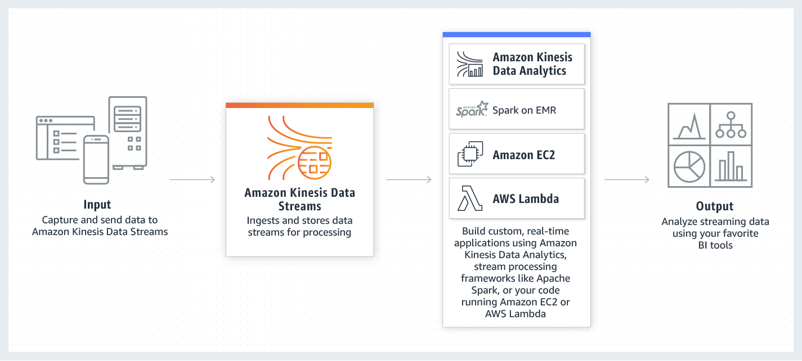

The first time you invoke your function, AWS Lambda creates an instance of the function and runs its handler method to process the event. When the function returns a response, it stays active and waits to process additional events. If you invoke the function again while the first event is being processed, Lambda initializes another instance, and the function processes the two events concurrently. As more events come in, Lambda routes them to available instances and creates new instances as needed. When the number of requests decreases, Lambda stops unused instances to free upscaling capacity for other functions.

Since the media company needs a real-time analytics service, you can use Kinesis Data Streams to gain insights from your data. The data collected is available in milliseconds. Use AWS Lambda to read records in batches and invoke your function to process records from the batch. If the batch that Lambda reads from the stream only has one record in it, Lambda sends only one record to the function.

Hence, the correct answer in this scenario is: **Create a Kinesis Data Stream and use AWS Lambda to read records from the data stream**.

The option that says: **Create a Kinesis Data Firehose and use AWS Lambda to read records from the data stream** is incorrect. Although Amazon Kinesis Data Firehose captures and loads data in near real-time, AWS Lambda can't be set as its destination. You can write Lambda functions and integrate it with Kinesis Data Firehose to request additional, customized processing of the data before it is sent downstream. However, this integration is primarily used for stream processing and not the actual consumption of the data stream. You have to use a Kinesis Data Stream in this scenario.

The options that say: **Create an Amazon S3 bucket to store the captured data and use Amazon Athena to analyze the data** and **Create an Amazon S3 bucket to store the captured data and use Amazon Redshift Spectrum to analyze the data** are both incorrect. As per the scenario, the company needs a real-time analytics service that can ingest and process data. You need to use Amazon Kinesis to process the data in real-time.

 

**References:**

https://aws.amazon.com/kinesis/data-streams/

https://docs.aws.amazon.com/lambda/latest/dg/with-kinesis.html

https://aws.amazon.com/premiumsupport/knowledge-center/503-error-classic/

 

**Check out this Amazon Kinesis Cheat Sheet:**

https://tutorialsdojo.com/amazon-kinesis/

15

A company plans to build a web architecture using On-Demand EC2 instances and a database in AWS. However, due to budget constraints, the company instructed the Solutions Architect to choose a database service in which they no longer need to worry about database management tasks such as hardware or software provisioning, setup, configuration, scaling, and backups.

Which of the following services should the Solutions Architect recommend?

[(view)](https://portal.tutorialsdojo.com/my-dashboard/#)10100:00:19

-  Amazon RDS
-  ==Amazon DynamoDB==
-  Amazon ElastiCache
-  Amazon Redshift

Basically, a database service in which you no longer need to worry about database management tasks such as hardware or software provisioning, setup, and configuration is called a fully managed database. This means that AWS *fully manages* all of the database management tasks and the underlying host server. The main differentiator here is the keyword "**scaling**" in the question. ==In RDS, you still have to manually scale up your resources and create Read Replicas to improve scalability while in DynamoDB, this is automatically done.==

**Amazon DynamoDB** is the best option to use in this scenario. It is a fully managed non-relational database service – you simply create a database table, set your target utilization for Auto Scaling, and let the service handle the rest. You no longer need to worry about database management tasks such as hardware or software provisioning, setup, and configuration, software patching, operating a reliable, distributed database cluster, or partitioning data over multiple instances as you scale. DynamoDB also lets you backup and restore all your tables for data archival, helping you meet your corporate and governmental regulatory requirements.


==**Amazon RDS** is== incorrect because this is just ==a "managed" service and not "fully managed".== This means that you still have to handle the backups and other administrative tasks such as when the automated OS patching will take place.

**Amazon ElastiCache** is incorrect. Although ElastiCache is fully managed, it is not a database service but an In-Memory Data Store.

**Amazon Redshift** is incorrect. Although this is fully managed, it is not a database service but a Data Warehouse.

**References:** 

https://aws.amazon.com/dynamodb/

https://aws.amazon.com/products/databases/

**Check out this Amazon DynamoDB Cheat Sheet:**

https://tutorialsdojo.com/amazon-dynamodb/

16

An on-premises server is using an SMB network file share to store application data. The application produces around 50 MB of data per day but it only needs to access some of it for daily processes. To save on storage costs, the company plans to copy all the application data to AWS, however, they want to retain the ability to retrieve data with the same low-latency access as the local file share. The company does not have the capacity to develop the needed tool for this operation.

Which AWS service should the company use?

[(view)](https://portal.tutorialsdojo.com/my-dashboard/#)11000:00:42

-  AWS Virtual Private Network (VPN)
-  Amazon FSx for Windows File Server
-  AWS Snowball Edge
-  AWS Storage Gateway

**AWS Storage Gateway** is a hybrid cloud storage service that gives you on-premises access to virtually unlimited cloud storage. Customers use Storage Gateway to simplify storage management and reduce costs for key hybrid cloud storage use cases. These include moving backups to the cloud, using on-premises file shares backed by cloud storage, and providing low latency access to data in AWS for on-premises applications.


Specifically for this scenario, you can use Amazon FSx File Gateway to support the SMB file share for the on-premises application. It also meets the requirement for low-latency access. Amazon FSx File Gateway helps accelerate your file-based storage migration to the cloud to enable faster performance, improved data protection, and reduced cost.

Hence, the correct answer is: **AWS Storage Gateway.**

**AWS Virtual Private Network (VPN)** is incorrect because this service is mainly used for establishing encryption connections from an on-premises network to AWS.

**Amazon FSx for Windows File Server** is incorrect. This won't provide low-latency access since all the files are stored on AWS, which means that they will be accessed via the internet. AWS Storage Gateway supports local caching without any development overhead making it suitable for low-latency applications.

**AWS Snowball Edge** is incorrect. A Snowball edge is a type of Snowball device with on-board storage and compute power that can do local processing in addition to transferring data between your local environment and the AWS Cloud. It's just a data migration tool and not a storage service.

**References:**

https://aws.amazon.com/storagegateway/

https://docs.aws.amazon.com/storagegateway/latest/userguide/CreatingAnSMBFileShare.html

**AWS Storage Gateway Overview:**

https://www.youtube.com/embed/pNb7xOBJjHE

**Check out this AWS Storage Gateway Cheat Sheet:**

https://tutorialsdojo.com/aws-storage-gateway/

17

Due to the large volume of query requests, the database performance of an online reporting application significantly slowed down. The Solutions Architect is trying to convince her client to use Amazon RDS Read Replica for their application instead of setting up a Multi-AZ Deployments configuration.

What are two benefits of using Read Replicas over Multi-AZ that the Architect should point out? (Select TWO.)

[(view)](https://portal.tutorialsdojo.com/my-dashboard/#)11000:00:47

-  It elastically scales out beyond the capacity constraints of a single DB instance for read-heavy database workloads.
-  Allows both read and write operations on the read replica to complement the primary database.
-  Provides asynchronous replication and improves the performance of the primary database by taking read-heavy database workloads from it.
-  Provides synchronous replication and automatic failover in the case of Availability Zone service failures.
-  It enhances the read performance of your primary database by increasing its IOPS and accelerates its query processing via AWS Global Accelerator.

Amazon RDS Read Replicas provide enhanced performance and durability for database (DB) instances. This feature makes it easy to elastically scale out beyond the capacity constraints of a single DB instance for read-heavy database workloads.

You can create one or more replicas of a given source DB Instance and serve high-volume application read traffic from multiple copies of your data, thereby increasing aggregate read throughput. Read replicas can also be promoted when needed to become standalone DB instances.

For the MySQL, MariaDB, PostgreSQL, and Oracle database engines, Amazon RDS creates a second DB instance using a snapshot of the source DB instance. It then uses the engines' native asynchronous replication to update the read replica whenever there is a change to the source DB instance. The read replica operates as a DB instance that allows only read-only connections; applications can connect to a read replica just as they would to any DB instance. Amazon RDS replicates all databases in the source DB instance.


When you create a read replica for Amazon RDS for MySQL, MariaDB, PostgreSQL, and Oracle, Amazon RDS sets up a secure communications channel using public-key encryption between the source DB instance and the read replica, even when replicating across regions. Amazon RDS establishes any AWS security configurations such as adding security group entries needed to enable the secure channel.

You can also create read replicas within a Region or between Regions for your Amazon RDS for MySQL, MariaDB, PostgreSQL, and Oracle database instances encrypted at rest with AWS Key Management Service (KMS).

Hence, the correct answers are:

  **- It elastically scales out beyond the capacity constraints of a single DB instance for read-heavy database workloads.**

  **- Provides asynchronous replication and improves the performance of the primary database by taking read-heavy database workloads from it.**

The option that says: **Allows both read and write operations on the read replica to complement the primary database** is incorrect as Read Replicas are primarily used to offload read-only operations from the primary database instance. By default, you can't do a write operation to your Read Replica.

The option that says: **Provides synchronous replication and automatic failover in the case of Availability Zone service failures** is incorrect as this is a benefit of Multi-AZ and not of a Read Replica. Moreover, Read Replicas provide an asynchronous type of replication and not synchronous replication.

The option that says: **It enhances the read performance of your primary database by increasing its IOPS and accelerates its query processing via AWS Global Accelerator** is incorrect because Read Replicas do not do anything to upgrade or increase the read throughput on the primary DB instance per se, but it provides a way for your application to fetch data from replicas. In this way, it improves the overall performance of your entire database-tier (and not just the primary DB instance). It doesn't increase the IOPS nor use AWS Global Accelerator to accelerate the compute capacity of your primary database. AWS Global Accelerator is a networking service, not related to RDS, that direct user traffic to the nearest application endpoint to the client, thus reducing internet latency and jitter. It simply routes the traffic to the closest edge location via Anycast.

 

**References:**

https://aws.amazon.com/rds/details/read-replicas/

https://aws.amazon.com/rds/features/multi-az/

 

**Check out this Amazon RDS Cheat Sheet:**

https://tutorialsdojo.com/amazon-relational-database-service-amazon-rds/

 

**Additional tutorial - How do I make my RDS MySQL read replica writable?**

https://youtu.be/j5da6d2TIPc

18

A solutions architect is formulating a strategy for a startup that needs to transfer 50 TB of on-premises data to Amazon S3. The startup has a slow network transfer speed between its data center and AWS which causes a bottleneck for data migration.

Which of the following should the solutions architect implement?

[(view)](https://portal.tutorialsdojo.com/my-dashboard/#)11000:00:48

-  Request an Import Job to Amazon S3 using a Snowball device in the AWS Snowball Console.
-  Deploy an AWS Migration Hub Discovery agent in the on-premises data center.
-  Enable Amazon S3 Transfer Acceleration on the target S3 bucket.
-  Integrate AWS Storage Gateway File Gateway with the on-premises data center.

**AWS Snowball** uses secure, rugged devices so you can bring AWS computing and storage capabilities to your edge environments, and transfer data into and out of AWS. The service delivers you Snowball Edge devices with storage and optional Amazon EC2 and AWS IOT Greengrass compute in shippable, hardened, secure cases. With AWS Snowball, you bring cloud capabilities for machine learning, data analytics, processing, and storage to your edge for migrations, short-term data collection, or even long-term deployments. AWS Snowball devices work with or without the internet, do not require a dedicated IT operator, and are designed to be used in remote environments.

Hence, the correct answer is: **Request an Import Job to Amazon S3 using a Snowball device in the AWS Snowball Console.**

The option that says: **Deploy an AWS Migration Hub Discovery agent in the on-premises data center** is incorrect. The AWS Migration Hub service is just a central service that provides a single location to track the progress of application migrations across multiple AWS and partner solutions.

The option that says: **Enable Amazon S3 Transfer Acceleration on the target S3 bucket** is incorrect because this S3 feature is not suitable for large-scale data migration. Enabling this feature won't always guarantee faster data transfer as it's only beneficial for long-distance transfer to and from your Amazon S3 buckets.

The option that says: **Integrate AWS Storage Gateway File Gateway with the on-premises data center** is incorrect because this service is mostly used for building hybrid cloud solutions where you still need on-premises access to unlimited cloud storage. Based on the scenario, this service is not the best option because you would still rely on the existing low bandwidth internet connection.

**References:**

https://aws.amazon.com/snowball

https://aws.amazon.com/blogs/storage/making-it-even-simpler-to-create-and-manage-your-aws-snow-family-jobs/

 **Check out this AWS Snowball Cheat Sheet:**

https://tutorialsdojo.com/aws-snowball/

 **AWS Snow Family Overview:**

https://www.youtube.com/embed/9Ar-51Ip53Q

19

A company is storing its financial reports and regulatory documents in an Amazon S3 bucket. To comply with the IT audit, they tasked their Solutions Architect to track all new objects added to the bucket as well as the removed ones. It should also track whether a versioned object is permanently deleted. The Architect must configure Amazon S3 to publish notifications for these events to a queue for post-processing and to an Amazon SNS topic that will notify the Operations team.

Which of the following is the MOST suitable solution that the Architect should implement?

[(view)](https://portal.tutorialsdojo.com/my-dashboard/#)10100:01:56

-  ==Create a new Amazon SNS topic and Amazon SQS queue. Add an S3 event notification configuration on the bucket to publish `s3:ObjectCreated:*` and `s3:ObjectRemoved:Delete` event types to SQS and SNS.==
-  Create a new Amazon SNS topic and Amazon MQ. Add an S3 event notification configuration on the bucket to publish `s3:ObjectAdded:*` and `s3:ObjectRemoved:*` event types to SQS and SNS.
-  Create a new Amazon SNS topic and Amazon SQS queue. Add an S3 event notification configuration on the bucket to publish `s3:ObjectCreated:*` and `ObjectRemoved:DeleteMarkerCreated` event types to SQS and SNS.
-  Create a new Amazon SNS topic and Amazon MQ. Add an S3 event notification configuration on the bucket to publish `s3:ObjectCreated:*` and `ObjectRemoved:DeleteMarkerCreated` event types to SQS and SNS.

==The **Amazon S3 notification** feature enables you to receive notifications when certain events happen in your bucket.== To enable notifications, you must first add a notification configuration that identifies the events you want Amazon S3 to publish and the destinations where you want Amazon S3 to send the notifications. You store this configuration in the *notification* subresource that is associated with a bucket. Amazon S3 provides an API for you to manage this subresource.

**Amazon S3 event notifications** typically deliver events in seconds but can sometimes take a minute or longer. If two writes are made to a single non-versioned object at the same time, it is possible that only a single event notification will be sent. If you want to ensure that an event notification is sent for every successful write, you can enable versioning on your bucket. With versioning, every successful write will create a new version of your object and will also send an event notification.


Amazon S3 can publish notifications for the following events:

\1. New object created events

\2. Object removal events

\3. Restore object events

\4. Reduced Redundancy Storage (RRS) object lost events

\5. Replication events


==Amazon S3 supports the following destinations where it can publish events:==

==\1. Amazon Simple Notification Service (Amazon SNS) topic==

==\2. Amazon Simple Queue Service (Amazon SQS) queue==

==\3. AWS Lambda==

If your notification ends up writing to the bucket that triggers the notification, this could cause an execution loop. For example, if the bucket triggers a Lambda function each time an object is uploaded and the function uploads an object to the bucket, then the function indirectly triggers itself. To avoid this, use two buckets, or configure the trigger to only apply to a prefix used for incoming objects.

Hence, the correct answers is: **Create a new Amazon SNS topic and Amazon SQS queue. Add an S3 event notification configuration on the bucket to publish `s3:ObjectCreated:\*` and `s3:ObjectRemoved:Delete` event types to SQS and SNS.**

The option that says: **Create a new Amazon SNS topic and Amazon MQ. Add an S3 event notification configuration on the bucket to publish `s3:ObjectAdded:\*` and `s3:ObjectRemoved:\*` event types to SQS and SNS** is incorrect. There is no `s3:ObjectAdded:*` type in Amazon S3**.** You should add an S3 event notification configuration on the bucket to publish events of the `s3:ObjectCreated:*` type instead. Moreover, Amazon S3 does support Amazon MQ as a destination to publish events.

The option that says: **Create a new Amazon SNS topic and Amazon SQS queue. Add an S3 event notification configuration on the bucket to publish `s3:ObjectCreated:\*` and `ObjectRemoved:DeleteMarkerCreated` event types to SQS and SNS** is incorrect because the ==`s3:ObjectRemoved:DeleteMarkerCreated` type is only triggered when a delete marker is created for a versioned object and not when an object is deleted or a versioned object is permanently deleted.==

The option that says: **Create a new Amazon SNS topic and Amazon MQ. Add an S3 event notification configuration on the bucket to publish `s3:ObjectCreated:\*` and `ObjectRemoved:DeleteMarkerCreated` event types to SQS and SNS** is incorrect because Amazon S3 does public event messages to Amazon MQ. You should use an Amazon SQS instead. In addition, the `s3:ObjectRemoved:DeleteMarkerCreated` type is only triggered when a delete marker is created for a versioned object. Remember that the scenario asked to publish events when an object is deleted or a versioned object is permanently deleted.

**References:**

https://docs.aws.amazon.com/AmazonS3/latest/dev/NotificationHowTo.html

https://docs.aws.amazon.com/AmazonS3/latest/dev/ways-to-add-notification-config-to-bucket.html

https://aws.amazon.com/blogs/aws/s3-event-notification/

**Check out this Amazon S3 Cheat Sheet:**

https://tutorialsdojo.com/amazon-s3/

**Amazon SNS Overview:**

https://www.youtube.com/embed/ft5R45lEUJ8

20

An application needs to retrieve a subset of data from a large CSV file stored in an Amazon S3 bucket by using simple SQL expressions. The queries are made within Amazon S3 and must only return the needed data.

Which of the following actions should be taken?

[(view)](https://portal.tutorialsdojo.com/my-dashboard/#)11000:00:50

-  Perform an S3 Select operation based on the bucket's name and object's key.
-  Perform an S3 Select operation based on the bucket's name and object's metadata.
-  Perform an S3 Select operation based on the bucket's name and object tags.
-  Perform an S3 Select operation based on the bucket’s name.

**S3 Select** enables applications to retrieve only a subset of data from an object by using simple SQL expressions. By using S3 Select to retrieve only the data needed by your application, you can achieve drastic performance increases. 

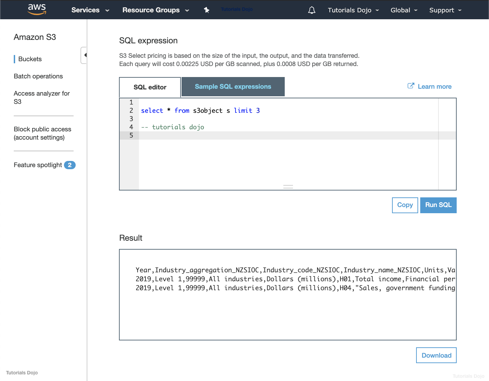

Amazon S3 is composed of buckets, object keys, object metadata, object tags, and many other components as shown below:

- An Amazon S3 bucket name is globally unique, and the namespace is shared by all AWS accounts.
- An Amazon S3 object key refers to the key name, which uniquely identifies the object in the bucket.
- An Amazon S3 object metadata is a name-value pair that provides information about the object.
-  An Amazon S3 object tag is a key-pair value used for object tagging to categorize storage.

You can perform S3 Select to query only the necessary data inside the CSV files based on the bucket's name and the object's key.

The following snippet below shows how it is done using boto3 ( AWS SDK for Python ):

```
client = boto3.client('s3')
resp = client.select_object_content(
Bucket='tdojo-bucket', # Bucket Name.
Key='s3-select/tutorialsdojofile.csv', # Object Key.
ExpressionType= 'SQL',
Expression = "select \"Sample\" from s3object s where s.\"tutorialsdojofile\" in ['A', 'B']"
```

Hence, the correct answer is the option that says: **Perform an S3 Select operation based on the bucket's name and object's key.**

The option that says: **Perform an S3 Select operation based on the bucket's name and object's metadata** is incorrect because metadata is not needed when querying subsets of data in an object using S3 Select.

The option that says: **Perform an S3 Select operation based on the bucket's name and object tags** is incorrect because object tags just provide additional information to your object. This is not needed when querying with S3 Select although this can be useful for S3 Batch Operations. You can categorize objects based on tag values to provide S3 Batch Operations with a list of objects to operate on.

The option that says: **Perform an S3 Select operation based on the bucket's name** is incorrect because you need both the bucket’s name and the object key to successfully perform an S3 Select operation.

 

**References:**

https://docs.aws.amazon.com/AmazonS3/latest/dev/s3-glacier-select-sql-reference-select.html

https://docs.aws.amazon.com/AmazonS3/latest/dev/UsingObjects.html

 

**Check out this Amazon S3 Cheat Sheet:**

https://tutorialsdojo.com/amazon-s3/

21

A company is deploying a Microsoft SharePoint Server environment on AWS using CloudFormation. The Solutions Architect needs to install and configure the architecture that is composed of Microsoft Active Directory (AD) domain controllers, Microsoft SQL Server 2012, multiple Amazon EC2 instances to host the Microsoft SharePoint Server and many other dependencies. The Architect needs to ensure that the required components are properly running before the stack creation proceeds.

Which of the following should the Architect do to meet this requirement?

[(view)](https://portal.tutorialsdojo.com/my-dashboard/#)11000:01:17

-  Configure the `DependsOn` attribute in the CloudFormation template. Send a success signal after the applications are installed and configured using the `cfn-init` helper script.
-  Configure a `UpdatePolicy` attribute to the instance in the CloudFormation template. Send a success signal after the applications are installed and configured using the `cfn-signal` helper script.
-  Configure the `UpdateReplacePolicy` attribute in the CloudFormation template. Send a success signal after the applications are installed and configured using the `cfn-signal` helper script.
-  Configure a `CreationPolicy` attribute to the instance in the CloudFormation template. Send a success signal after the applications are installed and configured using the `cfn-signal` helper script.

You can associate the **`CreationPolicy`** attribute with a resource to prevent its status from reaching create complete until AWS CloudFormation receives a specified number of success signals or the timeout period is exceeded. To signal a resource, you can use the cfn-signal helper script or SignalResource API. AWS CloudFormation publishes valid signals to the stack events so that you track the number of signals sent.

The creation policy is invoked only when AWS CloudFormation creates the associated resource. Currently, the only AWS CloudFormation resources that support creation policies are `AWS::AutoScaling::AutoScalingGroup`, `AWS::EC2::Instance`, and `AWS::CloudFormation::WaitCondition`.

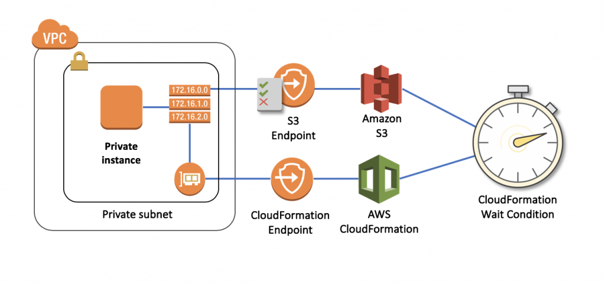

Use the **`CreationPolicy`** attribute when you want to wait on resource configuration actions before stack creation proceeds. For example, if you install and configure software applications on an EC2 instance, you might want those applications to be running before proceeding. In such cases, you can add a `CreationPolicy` attribute to the instance, and then send a success signal to the instance after the applications are installed and configured.

Hence, the option that says: **Configure a `CreationPolicy` attribute to the instance in the CloudFormation template. Send a success signal after the applications are installed and configured using the `cfn-signal` helper script** is correct.

The option that says: **Configure the `DependsOn` attribute in the CloudFormation template. Send a success signal after the applications are installed and configured using the `cfn-init` helper script** is incorrect because the cfn-init helper script is not suitable to be used to signal another resource. You have to use cfn-signal instead. And although you can use the DependsOn attribute to ensure the creation of a specific resource follows another, it is still better to use the CreationPolicy attribute instead as it ensures that the applications are properly running before the stack creation proceeds.

The option that says: **Configure a `UpdatePolicy` attribute to the instance in the CloudFormation template. Send a success signal after the applications are installed and configured using the `cfn-signal` helper script** is incorrect because the `UpdatePolicy` attribute is primarily used for updating resources and for stack update rollback operations.

The option that says: **Configure the `UpdateReplacePolicy` attribute in the CloudFormation template. Send a success signal after the applications are installed and configured using the `cfn-``signal` helper script** is incorrect because the `UpdateReplacePolicy` attribute is primarily used to retain or in some cases, back up the existing physical instance of a resource when it is replaced during a stack update operation.

 

**References:**

https://docs.aws.amazon.com/AWSCloudFormation/latest/UserGuide/aws-attribute-creationpolicy.html

https://docs.aws.amazon.com/AWSCloudFormation/latest/UserGuide/deploying.applications.html#deployment-walkthrough-cfn-signal

https://aws.amazon.com/blogs/devops/use-a-creationpolicy-to-wait-for-on-instance-configurations/

 

**Check out this AWS CloudFormation Cheat Sheet:**

https://tutorialsdojo.com/aws-cloudformation/

 

**AWS CloudFormation - Templates, Stacks, Change Sets:**


<iframe title="YouTube video player" src="https://www.youtube.com/embed/9Xpuprxg7aY" frameborder="0" allowfullscreen="allowfullscreen" data-mce-fragment="1" name="fitvid6" style="box-sizing: border-box; margin: 0px; max-width: 100%; width: 2129.76px; line-height: 1; border: none; position: absolute; top: 0px; left: 0px; height: 1197.99px;"></iframe>


Sub-Total:2115 (71.43%)6 (28.57%)00:26:0471.43%Category: **CSAA - Design Resilient Architectures**1

A Solutions Architect for a global news company is configuring a fleet of EC2 instances in a subnet that currently is in a VPC with an Internet gateway attached. All of these EC2 instances can be accessed from the Internet. The architect launches another subnet and deploys an EC2 instance in it, however, the architect is not able to access the EC2 instance from the Internet.

What could be the possible reasons for this issue? (Select TWO.)

[(view)](https://portal.tutorialsdojo.com/my-dashboard/#)11000:00:49

-  The Amazon EC2 instance does not have a public IP address associated with it.
-  The Amazon EC2 instance is not a member of the same Auto Scaling group.
-  The Amazon EC2 instance does not have an attached Elastic Fabric Adapter (EFA).
-  The route table is not configured properly to send traffic from the EC2 instance to the Internet through the Internet gateway.
-  The route table is not configured properly to send traffic from the EC2 instance to the Internet through the customer gateway (CGW).

Your VPC has an implicit router and you use route tables to control where network traffic is directed. Each subnet in your VPC must be associated with a route table, which controls the routing for the subnet (subnet route table). You can explicitly associate a subnet with a particular route table. Otherwise, the subnet is implicitly associated with the main route table.

A subnet can only be associated with one route table at a time, but you can associate multiple subnets with the same subnet route table. You can optionally associate a route table with an internet gateway or a virtual private gateway (gateway route table). This enables you to specify routing rules for inbound traffic that enters your VPC through the gateway

Be sure that the subnet route table also has a route entry to the internet gateway. If this entry doesn't exist, the instance is in a private subnet and is inaccessible from the internet.

In cases where your EC2 instance cannot be accessed from the Internet (or vice versa), you usually have to check two things:

\- Does it have an EIP or public IP address?

\- Is the route table properly configured?

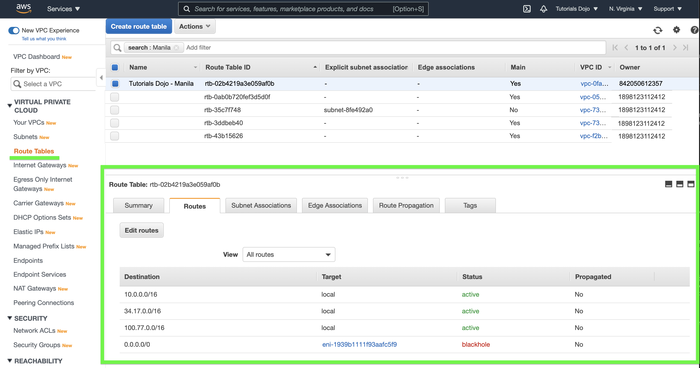

Below are the correct answers:

**- Amazon EC2 instance does not have a public IP address associated with it.**

**- The route table is not configured properly to send traffic from the EC2 instance to the Internet through the Internet gateway.**

The option that says: **The Amazon EC2 instance is not a member of the same Auto Scaling group** is incorrect since Auto Scaling Groups do not affect Internet connectivity of EC2 instances.

The option that says: **The Amazon EC2 instance doesn't have an attached Elastic Fabric Adapter (EFA)** is incorrect because Elastic Fabric Adapter is just a network device that you can attach to your Amazon EC2 instance to accelerate High Performance Computing (HPC) and machine learning applications. EFA enables you to achieve the application performance of an on-premises HPC cluster, with the scalability, flexibility, and elasticity provided by AWS. However, this component is not required in order for your EC2 instance to access the public Internet.

The option that says: **The route table is not configured properly to send traffic from the EC2 instance to the Internet through the customer gateway (CGW)** is incorrect since CGW is used when you are setting up a VPN. The correct gateway should be an Internet gateway.

 

**References:** 

http://docs.aws.amazon.com/AmazonVPC/latest/UserGuide/VPC_Scenario2.html

https://docs.aws.amazon.com/vpc/latest/userguide/VPC_Route_Tables.html

 

**Check out this Amazon VPC Cheat Sheet:**

https://tutorialsdojo.com/amazon-vpc/

2

A tech startup is launching an on-demand food delivery platform using Amazon ECS cluster with an AWS Fargate serverless compute engine and Amazon Aurora. It is expected that the database read queries will significantly increase in the coming weeks ahead. A Solutions Architect recently launched two Read Replicas to the database cluster to improve the platform's scalability.

Which of the following is the MOST suitable configuration that the Architect should implement to load balance all of the incoming read requests equally to the two Read Replicas?

[(view)](https://portal.tutorialsdojo.com/my-dashboard/#)11000:00:35

-  Use the built-in Reader endpoint of the Amazon Aurora database.
-  Use the built-in Cluster endpoint of the Amazon Aurora database.
-  Enable Amazon Aurora Parallel Query.
-  Create a new Network Load Balancer to evenly distribute the read queries to the Read Replicas of the Amazon Aurora database.

**Amazon Aurora** typically involves a cluster of DB instances instead of a single instance. Each connection is handled by a specific DB instance. When you connect to an Aurora cluster, the hostname and port that you specify point to an intermediate handler called an *endpoint*. Aurora uses the endpoint mechanism to abstract these connections. Thus, you don't have to hardcode all the hostnames or write your own logic for load-balancing and rerouting connections when some DB instances aren't available.

For certain Aurora tasks, different instances or groups of instances perform different roles. For example, the primary instance handles all data definition language (DDL) and data manipulation language (DML) statements. Up to 15 Aurora Replicas handle read-only query traffic.

Using endpoints, you can map each connection to the appropriate instance or group of instances based on your use case. For example, to perform DDL statements you can connect to whichever instance is the primary instance. To perform queries, you can connect to the reader endpoint, with Aurora automatically performing load-balancing among all the Aurora Replicas. For clusters with DB instances of different capacities or configurations, you can connect to custom endpoints associated with different subsets of DB instances. For diagnosis or tuning, you can connect to a specific instance endpoint to examine details about a specific DB instance.

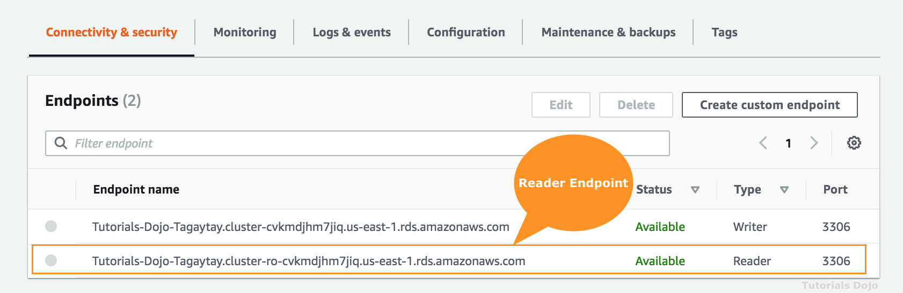

A *reader endpoint* for an Aurora DB cluster provides load-balancing support for read-only connections to the DB cluster. Use the reader endpoint for read operations, such as queries. By processing those statements on the read-only Aurora Replicas, this endpoint reduces the overhead on the primary instance. It also helps the cluster to scale the capacity to handle simultaneous `SELECT` queries, proportional to the number of Aurora Replicas in the cluster. Each Aurora DB cluster has one reader endpoint.

If the cluster contains one or more Aurora Replicas, the reader endpoint load-balances each connection request among the Aurora Replicas. In that case, you can only perform read-only statements such as `SELECT` in that session. If the cluster only contains a primary instance and no Aurora Replicas, the reader endpoint connects to the primary instance. In that case, you can perform write operations through the endpoint.

Hence, the correct answer is to **use the built-in Reader endpoint of the Amazon Aurora database.**

The option that says: **Use the built-in Cluster endpoint of the Amazon Aurora database** is incorrect because a cluster endpoint (also known as a writer endpoint) simply connects to the current primary DB instance for that DB cluster. This endpoint can perform write operations in the database such as DDL statements, which is perfect for handling production traffic but not suitable for handling queries for reporting since there will be no write database operations that will be sent.

The option that says: **Enable Amazon Aurora Parallel Query** is incorrect because this feature simply enables Amazon Aurora to push down and distribute the computational load of a single query across thousands of CPUs in Aurora's storage layer. Take note that it does not load balance all of the incoming read requests equally to the two Read Replicas. With Parallel Query, query processing is pushed down to the Aurora storage layer. The query gains a large amount of computing power, and it needs to transfer far less data over the network. In the meantime, the Aurora database instance can continue serving transactions with much less interruption. This way, you can run transactional and analytical workloads alongside each other in the same Aurora database, while maintaining high performance.

The option that says: **Create a new Network Load Balancer to evenly distribute the read queries to the Read Replicas of the Amazon Aurora database** is incorrect because a Network Load Balancer is not the suitable service/component to use for this requirement since an NLB is primarily used to distribute traffic to servers, not Read Replicas. You have to use the built-in Reader endpoint of the Amazon Aurora database instead.

 

**References**:

https://docs.aws.amazon.com/AmazonRDS/latest/AuroraUserGuide/Aurora.Overview.Endpoints.html

https://docs.aws.amazon.com/AmazonRDS/latest/AuroraUserGuide/Aurora.Overview.html

https://aws.amazon.com/rds/aurora/parallel-query/

 

**Check out this Amazon Aurora Cheat Sheet:**

https://tutorialsdojo.com/amazon-aurora/

3

A manufacturing company has EC2 instances running in AWS. The EC2 instances are configured with Auto Scaling. There are a lot of requests being lost because of too much load on the servers. The Auto Scaling is launching new EC2 instances to take the load accordingly yet, there are still some requests that are being lost.

Which of the following is the MOST suitable solution that you should implement to avoid losing recently submitted requests?

[(view)](https://portal.tutorialsdojo.com/my-dashboard/#)11000:01:15

-  Use an Amazon SQS queue to decouple the application components and scale-out the EC2 instances based upon the `ApproximateNumberOfMessages` metric in Amazon CloudWatch.
-  Replace the Auto Scaling group with a cluster placement group to achieve a low-latency network performance necessary for tightly-coupled node-to-node communication.
-  Use larger instances for your application with an attached Elastic Fabric Adapter (EFA).
-  Set up Amazon Aurora Serverless for on-demand, auto-scaling configuration of your EC2 Instances and also enable Amazon Aurora Parallel Query feature for faster analytical queries over your current data.

**Amazon Simple Queue Service (SQS)** is a fully managed message queuing service that makes it easy to decouple and scale microservices, distributed systems, and serverless applications. Building applications from individual components that each perform a discrete function improves scalability and reliability, and is best practice design for modern applications. SQS makes it simple and cost-effective to decouple and coordinate the components of a cloud application. Using SQS, you can send, store, and receive messages between software components at any volume, without losing messages or requiring other services to be always available.


The number of messages in your Amazon SQS queue does not solely define the number of instances needed. In fact, the number of instances in the fleet can be driven by multiple factors, including how long it takes to process a message and the acceptable amount of latency (queue delay).

The solution is to use a *backlog per instance* metric with the target value being the *acceptable backlog per instance* to maintain. You can calculate these numbers as follows:

**Backlog per instance**: To determine your backlog per instance, start with the Amazon SQS metric `ApproximateNumberOfMessages` to determine the length of the SQS queue (number of messages available for retrieval from the queue). Divide that number by the fleet's running capacity, which for an Auto Scaling group is the number of instances in the `InService` state, to get the backlog per instance.

**Acceptable backlog per instance**: To determine your target value, first calculate what your application can accept in terms of latency. Then, take the acceptable latency value and divide it by the average time that an EC2 instance takes to process a message.

To illustrate with an example, let's say that the current `ApproximateNumberOfMessages` is 1500 and the fleet's running capacity is 10. If the average processing time is 0.1 seconds for each message and the longest acceptable latency is 10 seconds then the acceptable backlog per instance is 10 / 0.1, which equals 100. This means that 100 is the target value for your target tracking policy. Because the backlog per instance is currently at 150 (1500 / 10), your fleet scales out by five instances to maintain proportion to the target value.

Hence, the correct answer is: **Use an Amazon SQS queue to decouple the application components and scale-out the EC2 instances based upon the `ApproximateNumberOfMessages` metric in Amazon CloudWatch.**

**Replacing the Auto Scaling group with a cluster placement group to achieve a low-latency network performance necessary for tightly-coupled node-to-node communication** is incorrect because although it is true that a cluster placement group allows you to achieve a low-latency network performance, you still need to use Auto Scaling for your architecture to add more EC2 instances.

**Using larger instances for your application with an attached Elastic Fabric Adapter (EFA)** is incorrect because using a larger EC2 instance would not prevent data from being lost in case of a larger spike. You can take advantage of the durability and elasticity of SQS to keep the messages available for consumption by your instances. Elastic Fabric Adapter (EFA) is simply a network interface for Amazon EC2 instances that enables customers to run applications requiring high levels of inter-node communications at scale on AWS.

**Setting up Amazon Aurora Serverless for on-demand, auto-scaling configuration of your EC2 Instances and also enabling Amazon Aurora Parallel Query feature for faster analytical queries over your current data** is incorrect because although the Amazon Aurora Parallel Query feature provides faster analytical queries over your current data, Amazon Aurora Serverless is an on-demand, auto-scaling configuration for your database, and NOT for your EC2 instances. This is actually an auto-scaling configuration for your Amazon Aurora database and not for your compute services.

 

**References:**

https://aws.amazon.com/sqs/

https://docs.aws.amazon.com/AWSSimpleQueueService/latest/SQSDeveloperGuide/welcome.html

https://docs.aws.amazon.com/autoscaling/ec2/userguide/as-using-sqs-queue.html

 

**Check out this Amazon SQS Cheat Sheet:**

https://tutorialsdojo.com/amazon-sqs/

4

A company installed sensors to track the number of people who visit the park. The data is sent every day to an Amazon Kinesis stream with default settings for processing, in which a consumer is configured to process the data every other day. You noticed that the S3 bucket is not receiving all of the data that is being sent to the Kinesis stream. You checked the sensors if they are properly sending the data to Amazon Kinesis and verified that the data is indeed sent every day.

What could be the reason for this?

[(view)](https://portal.tutorialsdojo.com/my-dashboard/#)11000:01:08

-  There is a problem in the sensors. They probably had some intermittent connection hence, the data is not sent to the stream.
-  By default, Amazon S3 stores the data for 1 day and moves it to Amazon Glacier.
-  Your AWS account was hacked and someone has deleted some data in your Kinesis stream.
-  By default, the data records are only accessible for 24 hours from the time they are added to a Kinesis stream.

**Kinesis Data Streams** supports changes to the data record retention period of your stream. A Kinesis data stream is an ordered sequence of data records meant to be written to and read from in real-time. Data records are therefore stored in shards in your stream temporarily.

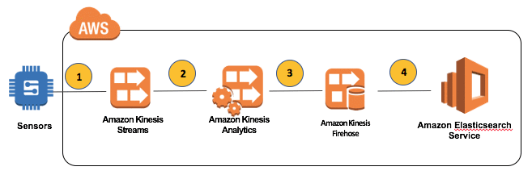

The time period from when a record is added to when it is no longer accessible is called the *retention period*. A Kinesis data stream stores records from **24 hours by default** to a maximum of 168 hours.

This is the reason why there are missing data in your S3 bucket. To fix this, you can either configure your sensors to send the data everyday instead of every other day or alternatively, you can increase the retention period of your Kinesis data stream.

The option that says: **There is a problem in the sensors. They probably had some intermittent connection hence, the data is not sent to the stream** is incorrect. You already verified that the sensors are working as they should be hence, this is not the root cause of the issue.

The option that says: **By default, Amazon S3 stores the data for 1 day and moves it to Amazon Glacier** is incorrect because by default, Amazon S3 does not store the data for 1 day only and move it to Amazon Glacier.

The option that says: **Your AWS account was hacked and someone has deleted some data in your Kinesis stream** is incorrect. Although this could be a possibility, you should verify first if there are other more probable reasons for the missing data in your S3 bucket. Be sure to follow and apply security best practices as well to prevent being hacked by someone.

**By default, the data records are only accessible for 24 hours from the time they are added to a Kinesis stream**, which depicts the root cause of this issue.

 

**Reference:**

http://docs.aws.amazon.com/streams/latest/dev/kinesis-extended-retention.html

 

**Check out this Amazon Kinesis Cheat Sheet:**

https://tutorialsdojo.com/amazon-kinesis/

5

A large insurance company has an AWS account that contains three VPCs (DEV, UAT and PROD) in the same region. UAT is peered to both PROD and DEV using a VPC peering connection. All VPCs have non-overlapping CIDR blocks. The company wants to push minor code releases from Dev to Prod to speed up time to market.

Which of the following options helps the company accomplish this?

[(view)](https://portal.tutorialsdojo.com/my-dashboard/#)10100:00:27

-  ==Create a new VPC peering connection between PROD and DEV with the appropriate routes.==
-  Create a new entry to PROD in the DEV route table using the VPC peering connection as the target.
-  Change the DEV and PROD VPCs to have overlapping CIDR blocks to be able to connect them.
-  Do nothing. Since these two VPCs are already connected via UAT, they already have a connection to each other.

A VPC peering connection is a networking connection between two VPCs that enables you to route traffic between them privately. Instances in either VPC can communicate with each other as if they are within the same network. You can create a VPC peering connection between your own VPCs, with a VPC in another AWS account, or with a VPC in a different AWS Region.


AWS uses the existing infrastructure of a VPC to create a VPC peering connection; it is neither a gateway nor a VPN connection and does not rely on a separate piece of physical hardware. There is no single point of failure for communication or a bandwidth bottleneck.

**Creating a new entry to PROD in the DEV route table using the VPC peering connection as the target** is incorrect because even if you configure the route tables, the two VPCs will still be disconnected until you set up a VPC peering connection between them.

**Changing the DEV and PROD VPCs to have overlapping CIDR blocks to be able to connect them** is incorrect because you cannot peer two VPCs with overlapping CIDR blocks.

The option that says: **Do nothing. Since these two VPCs are already connected via UAT, they already have a connection to each other** is incorrect as transitive VPC peering is not allowed hence, even though DEV and PROD are both connected in UAT, these two VPCs do not have a direct connection to each other.

**Reference:** 

https://docs.aws.amazon.com/AmazonVPC/latest/UserGuide/vpc-peering.html

**Check out these Amazon VPC and VPC Peering Cheat Sheets:**

https://tutorialsdojo.com/amazon-vpc/

https://tutorialsdojo.com/vpc-peering/

6

A company generates large financial datasets with millions of rows. The Solutions Architect needs to store all the data in a columnar fashion to reduce the number of disk I/O requests and reduce the amount of data needed to load from the disk. The bank has an existing third-party business intelligence application that will connect to the storage service and then generate daily and monthly financial reports for its clients around the globe.

In this scenario, which is the best storage service to use to meet the requirement?

[(view)](https://portal.tutorialsdojo.com/my-dashboard/#)10100:01:05

-  ==Amazon Redshift==
-  Amazon RDS
-  Amazon Aurora
-  Amazon DynamoDB

**Amazon Redshift** is a fast, scalable data warehouse that makes it simple and cost-effective to analyze all your data across your data warehouse and data lake. Redshift delivers ten times faster performance than other data warehouses by using machine learning, massively parallel query execution, and columnar storage on high-performance disk.

In this scenario, there is a requirement to have a storage service that will be used by a business intelligence application and where the data must be stored in a columnar fashion. Business Intelligence reporting systems are a type of Online Analytical Processing (OLAP) which Redshift is known to support. In addition, Redshift also provides columnar storage, unlike the other options.

Hence, the correct answer in this scenario is **Amazon Redshift**.

**References:**

https://docs.aws.amazon.com/redshift/latest/dg/c_columnar_storage_disk_mem_mgmnt.html

https://aws.amazon.com/redshift/

**Check out this Amazon Redshift Cheat Sheet:**

https://tutorialsdojo.com/amazon-redshift/

 

**Here is a case study on finding the most suitable analytical tool - Kinesis vs EMR vs Athena vs Redshift:**


<iframe src="https://www.youtube.com/embed/wEOm6aiN4ww" frameborder="0" allowfullscreen="allowfullscreen" name="fitvid7" style="box-sizing: border-box; margin: 0px; max-width: 100%; width: 2129.76px; line-height: 1; border: none; position: absolute; top: 0px; left: 0px; height: 1197.99px;"></iframe>


7

A Solutions Architect is working for a large IT consulting firm. One of the clients is launching a file sharing web application in AWS which requires a durable storage service for hosting their static contents such as PDFs, Word Documents, high-resolution images, and many others.

Which type of storage service should the Architect use to meet this requirement?

[(view)](https://portal.tutorialsdojo.com/my-dashboard/#)11000:00:49

-  Amazon EBS volume
-  Amazon S3
-  Amazon EC2 instance store
-  Amazon RDS instance

**Amazon S3** is storage for the Internet. It’s a simple storage service that offers software developers a durable, highly-scalable, reliable, and low-latency data storage infrastructure at very low costs. Amazon S3 provides customers with a highly durable storage infrastructure. Versioning offers an additional level of protection by providing a means of recovery when customers accidentally overwrite or delete objects. Remember that the scenario requires a ***durable\*** *storage for* ***static\*** *content.* These two keywords are actually referring to S3, since it is highly durable and suitable for storing static content.

Hence, **Amazon S3** is the correct answer.


**Amazon EBS volume** is incorrect because this is not as durable compared with S3. In addition, it is best to store the static contents in S3 rather than EBS.

**Amazon EC2 instance store** is incorrect because it is definitely not suitable - the data it holds will be wiped out immediately once the EC2 instance is restarted.

**Amazon RDS instance** is incorrect because an RDS instance is just a database and not suitable for storing static content. By default, RDS is not durable, unless you launch it to be in Multi-AZ deployments configuration.

 

**Reference:** 

https://aws.amazon.com/s3/faqs/

[https://d1.awsstatic.com/whitepapers/Storage/AWS%20Storage%20Services%20Whitepaper-v9.pdf#page=24](https://d1.awsstatic.com/whitepapers/Storage/AWS Storage Services Whitepaper-v9.pdf#page=24)

 

**Check out this Amazon S3 Cheat Sheet:**

https://tutorialsdojo.com/amazon-s3/

===> 8==

An online stocks trading application that stores financial data in an S3 bucket has a lifecycle policy that moves older data to Glacier every month. There is a strict compliance requirement where a surprise audit can happen at anytime and you should be able to retrieve the required data in under 15 minutes under all circumstances. Your manager instructed you to ensure that retrieval capacity is available when you need it and should handle up to 150 MB/s of retrieval throughput.

Which of the following should you do to meet the above requirement? (Select TWO.)

[(view)](https://portal.tutorialsdojo.com/my-dashboard/#)10100:01:08

-  Retrieve the data using Amazon Glacier Select.
-  ==Use Expedited Retrieval to access the financial data.==
-  Use Bulk Retrieval to access the financial data.
-  Specify a range, or portion, of the financial data archive to retrieve.
-  ==Purchase provisioned retrieval capacity.==

==**Expedited retrievals** allow you to quickly access your data when occasional urgent requests for a subset of archives are required.== For all but the largest archives (250 MB+), data accessed using Expedited retrievals are typically made available within 1–5 minutes. Provisioned Capacity ensures that retrieval capacity for Expedited retrievals is available when you need it.

To make an Expedited, Standard, or Bulk retrieval, set the Tier parameter in the Initiate Job (POST jobs) REST API request to the option you want, or the equivalent in the AWS CLI or AWS SDKs. If you have purchased provisioned capacity, then all expedited retrievals are automatically served through your provisioned capacity.

==**Provisioned capacity** ensures that your retrieval capacity for expedited retrievals is available when you need it.== Each unit of capacity provides that at least three expedited retrievals can be performed every five minutes and provides up to 150 MB/s of retrieval throughput. ==You should purchase provisioned retrieval capacity if your workload requires highly reliable and predictable access to a subset of your data in minutes.== Without provisioned capacity Expedited retrievals are accepted, except for rare situations of unusually high demand. However, if you require access to Expedited retrievals under all circumstances, you must purchase provisioned retrieval capacity.


**Retrieving the data using Amazon Glacier Select** is incorrect because this ==is not an archive retrieval option and is primarily used to perform filtering operations using simple Structured Query Language (SQL) statements directly on your data archive in Glacier.==

**Using Bulk Retrieval to access the financial data** is incorrect because ==bulk retrievals typically complete within 5–12 hours hence, this does not satisfy the requirement of retrieving the data within 15 minutes. The provisioned capacity option is also not compatible with Bulk retrievals.==

**Specifying a range, or portion, of the financial data archive to retrieve** is incorrect because using ranged archive retrievals is not enough to meet the requirement of retrieving the whole archive in the given timeframe. In addition, it does not provide additional retrieval capacity which is what the provisioned capacity option can offer.

**References:**

https://docs.aws.amazon.com/amazonglacier/latest/dev/downloading-an-archive-two-steps.html

https://docs.aws.amazon.com/amazonglacier/latest/dev/glacier-select.html

**Check out this Amazon S3 Glacier Cheat Sheet:**

https://tutorialsdojo.com/amazon-glacier/

9

A company is using Amazon VPC that has a CIDR block of `10.31.0.0/27` that is connected to the on-premises data center. There was a requirement to create a Lambda function that will process massive amounts of cryptocurrency transactions every minute and then store the results to EFS. After setting up the serverless architecture and connecting the Lambda function to the VPC, the Solutions Architect noticed an increase in invocation errors with EC2 error types such as `EC2ThrottledException` at certain times of the day.

Which of the following are the possible causes of this issue? (Select TWO.)

[(view)](https://portal.tutorialsdojo.com/my-dashboard/#)11000:01:03

-  You only specified one subnet in your Lambda function configuration. That single subnet runs out of available IP addresses and there is no other subnet or Availability Zone which can handle the peak load.
-  Your VPC does not have a NAT gateway.
-  Your VPC does not have sufficient subnet ENIs or subnet IPs.
-  The associated security group of your function does not allow outbound connections.
-  The attached IAM execution role of your function does not have the necessary permissions to access the resources of your VPC.

You can configure a function to connect to a virtual private cloud (VPC) in your account. Use Amazon Virtual Private Cloud (Amazon VPC) to create a private network for resources such as databases, cache instances, or internal services. Connect your function to the VPC to access private resources during execution.

AWS Lambda runs your function code securely within a VPC by default. However, to enable your Lambda function to access resources inside your private VPC, you must provide additional VPC-specific configuration information that includes VPC subnet IDs and security group IDs. AWS Lambda uses this information to set up elastic network interfaces (ENIs) that enable your function to connect securely to other resources within your private VPC.

Lambda functions cannot connect directly to a VPC with dedicated instance tenancy. To connect to resources in a dedicated VPC, peer it to a second VPC with default tenancy.

https://www.youtube.com/embed/JcRKdEP94jM

Your Lambda function automatically scales based on the number of events it processes. If your Lambda function accesses a VPC, you must make sure that your VPC has sufficient ENI capacity to support the scale requirements of your Lambda function. It is also recommended that you specify at least one subnet in each Availability Zone in your Lambda function configuration.

By specifying subnets in each of the Availability Zones, your Lambda function can run in another Availability Zone if one goes down or runs out of IP addresses. If your VPC does not have sufficient ENIs or subnet IPs, your Lambda function will not scale as requests increase, and you will see an increase in invocation errors with EC2 error types like `EC2ThrottledException`. For asynchronous invocation, if you see an increase in errors without corresponding CloudWatch Logs, invoke the Lambda function synchronously in the console to get the error responses.

Hence, the correct answers for this scenario are:

**- You only specified one subnet in your Lambda function configuration. That single subnet runs out of available IP addresses and there is no other subnet or Availability Zone which can handle the peak load.**

**- Your VPC does not have sufficient subnet ENIs or subnet IPs.**


The option that says: **Your VPC does not have a NAT gateway** is incorrect because an issue in the NAT Gateway is unlikely to cause a request throttling issue or produce an `EC2ThrottledException` error in Lambda. As per the scenario, the issue is happening only at certain times of the day, which means that the issue is only intermittent and the function works at other times. We can also conclude that an availability issue is not an issue since the application is already using a highly available NAT Gateway and not just a NAT instance.

The option that says: **The associated security group of your function does not allow outbound connections** is incorrect because if the associated security group does not allow outbound connections then the Lambda function will not work at all in the first place. Remember that as per the scenario, the issue only happens intermittently. In addition, Internet traffic restrictions do not usually produce `EC2ThrottledException` errors.

The option that says: **The attached IAM execution role of your function does not have the necessary permissions to access the resources of your VPC** is incorrect because just as what is explained above, the issue is intermittent and thus, the IAM execution role of the function does have the necessary permissions to access the resources of the VPC since it works at those specific times. In case the issue is indeed caused by a permission problem then an `EC2AccessDeniedException` the error would most likely be returned and not an `EC2ThrottledException` error.

 

**References:**

https://docs.aws.amazon.com/lambda/latest/dg/vpc.html

https://aws.amazon.com/premiumsupport/knowledge-center/internet-access-lambda-function/

https://aws.amazon.com/premiumsupport/knowledge-center/lambda-troubleshoot-invoke-error-502-500/

 

**Check out this AWS Lambda Cheat Sheet:**

https://tutorialsdojo.com/aws-lambda/

10

A tech company is currently using Auto Scaling for their web application. A new AMI now needs to be used for launching a fleet of EC2 instances. Which of the following changes needs to be done?

[(view)](https://portal.tutorialsdojo.com/my-dashboard/#)11000:01:56

-  Do nothing. You can start directly launching EC2 instances in the Auto Scaling group with the same launch configuration.
-  Create a new launch configuration.
-  Create a new target group.
-  Create a new target group and launch configuration.

A launch configuration is a template that an Auto Scaling group uses to launch EC2 instances. When you create a launch configuration, you specify information for the instances such as the ID of the Amazon Machine Image (AMI), the instance type, a key pair, one or more security groups, and a block device mapping. If you've launched an EC2 instance before, you specified the same information in order to launch the instance.


You can specify your launch configuration with multiple Auto Scaling groups. However, you can only specify one launch configuration for an Auto Scaling group at a time, and you can't modify a launch configuration after you've created it. Therefore, if you want to change the launch configuration for an Auto Scaling group, you must create a launch configuration and then update your Auto Scaling group with the new launch configuration.

For this scenario, you have to create a new launch configuration. Remember that you can't modify a launch configuration after you've created it.

Hence, the correct answer is: **Create a new launch configuration.**

The option that says: **Do nothing. You can start directly launching EC2 instances in the Auto Scaling group with the same launch configuration** is incorrect because what you are trying to achieve is change the AMI being used by your fleet of EC2 instances. Therefore, you need to change the launch configuration to update what your instances are using.

The option that says: **create a new target group** and **create a new target group and launch configuration** are both incorrect because you only want to change the AMI being used by your instances, and not the instances themselves. Target groups are primarily used in ELBs and not in Auto Scaling. The scenario didn't mention that the architecture has a load balancer. Therefore, you should be updating your launch configuration, not the target group.

 

**References:** 

http://docs.aws.amazon.com/autoscaling/latest/userguide/LaunchConfiguration.html

https://docs.aws.amazon.com/autoscaling/ec2/userguide/AutoScalingGroup.html

 

**Check out this AWS Auto Scaling Cheat Sheet:**

https://tutorialsdojo.com/aws-auto-scaling/

11

A company is setting up a cloud architecture for an international money transfer service to be deployed in AWS which will have thousands of users around the globe. The service should be available 24/7 to avoid any business disruption and should be resilient enough to handle the outage of an entire AWS region. To meet this requirement, the Solutions Architect has deployed their AWS resources to multiple AWS Regions. He needs to use Route 53 and configure it to set all of the resources to be available all the time as much as possible. When a resource becomes unavailable, Route 53 should detect that it's unhealthy and stop including it when responding to queries.

Which of the following is the most fault-tolerant routing configuration that the Solutions Architect should use in this scenario?

[(view)](https://portal.tutorialsdojo.com/my-dashboard/#)11000:01:57

-  Configure an Active-Active Failover with Weighted routing policy.
-  Configure an Active-Passive Failover with Weighted Records.
-  Configure an Active-Active Failover with One Primary and One Secondary Resource.
-  Configure an Active-Passive Failover with Multiple Primary and Secondary Resources.

You can use **Route 53 health checking** to configure active-active and active-passive failover configurations. You configure active-active failover using any routing policy (or combination of routing policies) other than failover, and you configure active-passive failover using the failover routing policy.

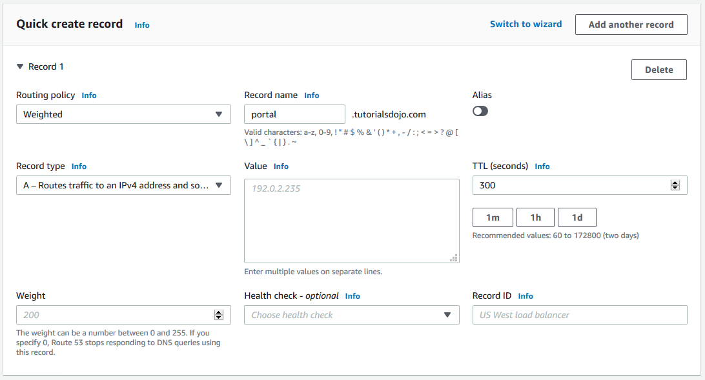

**Active-Active Failover**

Use this failover configuration when you want all of your resources to be available the majority of the time. When a resource becomes unavailable, Route 53 can detect that it's unhealthy and stop including it when responding to queries.

In active-active failover, all the records that have the same name, the same type (such as A or AAAA), and the same routing policy (such as weighted or latency) are active unless Route 53 considers them unhealthy. Route 53 can respond to a DNS query using any healthy record.

**Active-Passive Failover**

Use an active-passive failover configuration when you want a primary resource or group of resources to be available the majority of the time and you want a secondary resource or group of resources to be on standby in case all the primary resources become unavailable. When responding to queries, Route 53 includes only the healthy primary resources. If all the primary resources are unhealthy, Route 53 begins to include only the healthy secondary resources in response to DNS queries.

**Configuring an Active-Passive Failover with Weighted Records** and **configuring an Active-Passive Failover with Multiple Primary and Secondary Resources** are incorrect because an Active-Passive Failover is mainly used when you want a primary resource or group of resources to be available most of the time and you want a secondary resource or group of resources to be on standby in case all the primary resources become unavailable. In this scenario, all of your resources should be available all the time as much as possible which is why you have to use an Active-Active Failover instead.

**Configuring an Active-Active Failover with One Primary and One Secondary Resource** is incorrect because you cannot set up an Active-Active Failover with One Primary and One Secondary Resource. Remember that an Active-Active Failover uses all available resources all the time without a primary nor a secondary resource.

**References:**

https://docs.aws.amazon.com/Route53/latest/DeveloperGuide/dns-failover-types.html

https://docs.aws.amazon.com/Route53/latest/DeveloperGuide/routing-policy.html

https://docs.aws.amazon.com/Route53/latest/DeveloperGuide/dns-failover-configuring.html

**Amazon Route 53 Overview:**

https://www.youtube.com/embed/Su308t19ubY

**Check out this Amazon Route 53 Cheat Sheet:**

https://tutorialsdojo.com/amazon-route-53/

12

A company plans to use a durable storage service to store on-premises database backups to the AWS cloud. To move their backup data, they need to use a service that can store and retrieve objects through standard file storage protocols for quick recovery.

Which of the following options will meet this requirement?

[(view)](https://portal.tutorialsdojo.com/my-dashboard/#)11000:00:48

-  Use the AWS Storage Gateway volume gateway to store the backup data and directly access it using Amazon S3 API actions.
-  Use Amazon EBS volumes to store all the backup data and attach it to an Amazon EC2 instance.
-  Use AWS Snowball Edge to directly backup the data in Amazon S3 Glacier.
-  Use the AWS Storage Gateway file gateway to store all the backup data in Amazon S3.

**File Gateway** presents a file-based interface to Amazon S3, which appears as a network file share. It enables you to store and retrieve Amazon S3 objects through standard file storage protocols. File Gateway allows your existing file-based applications or devices to use secure and durable cloud storage without needing to be modified. With File Gateway, your configured S3 buckets will be available as Network File System (NFS) mount points or Server Message Block (SMB) file shares.


To store the backup data from on-premises to a durable cloud storage service, you can use File Gateway to store and retrieve objects through standard file storage protocols (SMB or NFS). File Gateway enables your existing file-based applications, devices, and workflows to use Amazon S3, without modification. File Gateway securely and durably stores both file contents and metadata as objects while providing your on-premises applications low-latency access to cached data.

Hence, the correct answer is: **Use the AWS Storage Gateway file gateway to store all the backup data in Amazon S3**.

The option that says: **Use the AWS Storage Gateway volume gateway to store the backup data and directly access it using Amazon S3 API actions** is incorrect. Although this is a possible solution, you cannot directly access the volume gateway using Amazon S3 APIs. You should use File Gateway to access your data in Amazon S3.

The option that says: **Use Amazon EBS volumes to store all the backup data and attached it to an Amazon EC2 instance** is incorrect. Take note that in the scenario, you are required to store the backup data in a durable storage service. An Amazon EBS volume is not highly durable like Amazon S3. Also, file storage protocols such as NFS or SMB, are not directly supported by EBS.

The option that says: **Use AWS Snowball Edge to directly backup the data in Amazon S3 Glacier** is incorrect because AWS Snowball Edge cannot store and retrieve objects through standard file storage protocols. Also, Snowball Edge can’t directly integrate backups to S3 Glacier.

 

**References:**

https://aws.amazon.com/storagegateway/faqs/

https://aws.amazon.com/s3/storage-classes/

 

**Check out this AWS Storage Gateway Cheat Sheet:**

https://tutorialsdojo.com/aws-storage-gateway/

13

A company has a web application that is relying entirely on slower disk-based databases, causing it to perform slowly. To improve its performance, the Solutions Architect integrated an in-memory data store to the web application using ElastiCache.

How does Amazon ElastiCache improve database performance?

[(view)](https://portal.tutorialsdojo.com/my-dashboard/#)11000:00:43

-  It securely delivers data to customers globally with low latency and high transfer speeds.
-  It provides an in-memory cache that delivers up to 10x performance improvement from milliseconds to microseconds or even at millions of requests per second.
-  By caching database query results.
-  It reduces the load on your database by routing read queries from your applications to the Read Replica.

**ElastiCache** improves the performance of your database through caching query results.

The primary purpose of an in-memory key-value store is to provide ultra-fast (submillisecond latency) and inexpensive access to copies of data. Most data stores have areas of data that are frequently accessed but seldom updated. Additionally, querying a database is always slower and more expensive than locating a key in a key-value pair cache. Some database queries are especially expensive to perform, for example, queries that involve joins across multiple tables or queries with intensive calculations.

By caching such query results, you pay the price of the query once and then are able to quickly retrieve the data multiple times without having to re-execute the query.


The option that says: **It securely delivers data to customers globally with low latency and high transfer speeds** is incorrect because this option describes what CloudFront does and not ElastiCache.

The option that says: **It provides an in-memory cache that delivers up to 10x performance improvement from milliseconds to microseconds or even at millions of requests per second** is incorrect because this option describes what Amazon DynamoDB Accelerator (DAX) does and not ElastiCache. Amazon DynamoDB Accelerator (DAX) is a fully managed, highly available, in-memory cache for DynamoDB. Amazon ElastiCache cannot provide a performance improvement from milliseconds to microseconds, let alone millions of requests per second like DAX can.

The option that says: **It reduces the load on your database by routing read queries from your applications to the Read Replica** is incorrect because this option describes what an RDS Read Replica does and not ElastiCache. Amazon RDS Read Replicas enable you to create one or more read-only copies of your database instance within the same AWS Region or in a different AWS Region.

**References:**

https://aws.amazon.com/elasticache/

https://docs.aws.amazon.com/AmazonElastiCache/latest/red-ug/elasticache-use-cases.html

**Check out this Amazon Elasticache Cheat Sheet:**

https://tutorialsdojo.com/amazon-elasticache/

14

A major TV network has a web application running on eight Amazon T3 EC2 instances. The number of requests that the application processes are consistent and do not experience spikes. To ensure that eight instances are running at all times, the Solutions Architect should create an Auto Scaling group and distribute the load evenly between all instances.

Which of the following options can satisfy the given requirements?

[(view)](https://portal.tutorialsdojo.com/my-dashboard/#)10100:01:50

-  Deploy eight EC2 instances with Auto Scaling in one Availability Zone behind an Amazon Elastic Load Balancer.
-  Deploy four EC2 instances with Auto Scaling in one region and four in another region behind an Amazon Elastic Load Balancer.
-  ==Deploy four EC2 instances with Auto Scaling in one Availability Zone and four in another availability zone in the same region behind an Amazon Elastic Load Balancer.==
-  Deploy two EC2 instances with Auto Scaling in four regions behind an Amazon Elastic Load Balancer.

The best option to take is to deploy four EC2 instances in one Availability Zone and four in another availability zone in the same region behind an Amazon Elastic Load Balancer. In this way, if one availability zone goes down, there is still another available zone that can accommodate traffic.


When the first AZ goes down, the second AZ will only have an initial 4 EC2 instances. This will eventually be scaled up to 8 instances since the solution is using Auto Scaling.

The 110% compute capacity for the 4 servers might cause some degradation of the service, but not a total outage since there are still some instances that handle the requests. Depending on your scale-up configuration in your Auto Scaling group, the additional 4 EC2 instances can be launched in a matter of minutes.

T3 instances also have a Burstable Performance capability to burst or go beyond the current compute capacity of the instance to higher performance as required by your workload. So your 4 servers will be able to manage 110% compute capacity for a short period of time. This is the power of cloud computing versus our on-premises network architecture. It provides elasticity and unparalleled scalability.

Take note that Auto Scaling will launch additional EC2 instances to the remaining Availability Zone/s in the event of an Availability Zone outage in the region. Hence, the correct answer is the option that says: **Deploy four EC2 instances with Auto Scaling in one Availability Zone and four in another availability zone in the same region behind an Amazon Elastic Load Balancer.**

The option that says: **Deploy eight EC2 instances with Auto Scaling in one Availability Zone behind an Amazon Elastic Load Balancer** is incorrect because this architecture is not highly available. If that Availability Zone goes down then your web application will be unreachable.

The options that say: **Deploy four EC2 instances with Auto Scaling in one region and four in another region behind an Amazon Elastic Load Balancer** and **Deploy two EC2 instances with Auto Scaling in four regions behind an Amazon Elastic Load Balancer** are incorrect because the ==ELB is designed to only run in one region and not across multiple regions.==

**References:** 

https://aws.amazon.com/elasticloadbalancing/

https://docs.aws.amazon.com/AWSEC2/latest/UserGuide/ec2-increase-availability.html

**AWS Elastic Load Balancing Overview:**

https://www.youtube.com/embed/UBl5dw59DO8

**Check out this AWS Elastic Load Balancing (ELB) Cheat Sheet:**

https://tutorialsdojo.com/aws-elastic-load-balancing-elb/

15

A Solutions Architect needs to set up a bastion host in the cheapest, most secure way. The Architect should be the only person that can access it via SSH.

Which of the following steps would satisfy this requirement?

[(view)](https://portal.tutorialsdojo.com/my-dashboard/#)11000:00:14

-  Set up a small EC2 instance and a security group that only allows access on port 22 via your IP address
-  Set up a large EC2 instance and a security group that only allows access on port 22 via your IP address
-  Set up a large EC2 instance and a security group that only allows access on port 22
-  Set up a small EC2 instance and a security group that only allows access on port 22

A **bastion host** *is* a server whose purpose is to provide access to a private network from an external network, such as the Internet. Because of its exposure to potential attack, a *bastion host* must minimize the chances of penetration.

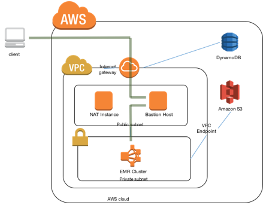

To create a bastion host, you can create a new EC2 instance which should only have a security group from a particular IP address for maximum security. Since the cost is also considered in the question, you should choose a small instance for your host. By default, t2.micro instance is used by AWS but you can change these settings during deployment.

**Setting up a large EC2 instance and a security group which only allows access on port 22 via your IP address** is incorrect because you don't need to provision a large EC2 instance to run a single bastion host. At the same time, you are looking for the cheapest solution possible.

The options that say: **Set up a large EC2 instance and a security group which only allows access on port 22** and **Set up a small EC2 instance and a security group which only allows access on port 22** are both incorrect because you did not set your specific IP address to the security group rules, which possibly means that you publicly allow traffic from all sources in your security group. This is wrong as you should only be the one to have access to the bastion host.

 

**References:**

https://docs.aws.amazon.com/quickstart/latest/linux-bastion/architecture.html

https://aws.amazon.com/blogs/security/how-to-record-ssh-sessions-established-through-a-bastion-host/

 

**Check out this Amazon EC2 Cheat Sheet:**

https://tutorialsdojo.com/amazon-elastic-compute-cloud-amazon-ec2/

===> 16==

A FinTech startup deployed an application on an Amazon EC2 instance with attached Instance Store volumes and an Elastic IP address. The server is only accessed from 8 AM to 6 PM and can be stopped from 6 PM to 8 AM for cost efficiency using Lambda with the script that automates this based on tags.

Which of the following will occur when the EC2 instance is stopped and started? (Select TWO.)

[(view)](https://portal.tutorialsdojo.com/my-dashboard/#)10100:01:48

-  ==The underlying host for the instance is possibly changed.==
-  The ENI (Elastic Network Interface) is detached.
-  ==All data on the attached instance-store devices will be lost.==
-  The Elastic IP address is disassociated with the instance.
-  There will be no changes.

This question did not mention the specific type of EC2 instance, however, it says that it will be stopped and started. Since only EBS-backed instances can be stopped and restarted, it is implied that the instance is EBS-backed. Remember that an instance store-backed instance can only be rebooted or terminated and its data will be erased if the EC2 instance is either stopped or terminated.

If you stopped an EBS-backed EC2 instance, the volume is preserved but the data in any attached instance store volume will be erased. Keep in mind that an EC2 instance has an underlying physical host computer. If the instance is stopped, AWS usually moves the instance to a new host computer. Your instance may stay on the same host computer if there are no problems with the host computer. In addition, its Elastic IP address is disassociated from the instance if it is an EC2-Classic instance. Otherwise, if it is an EC2-VPC instance, the Elastic IP address remains associated.

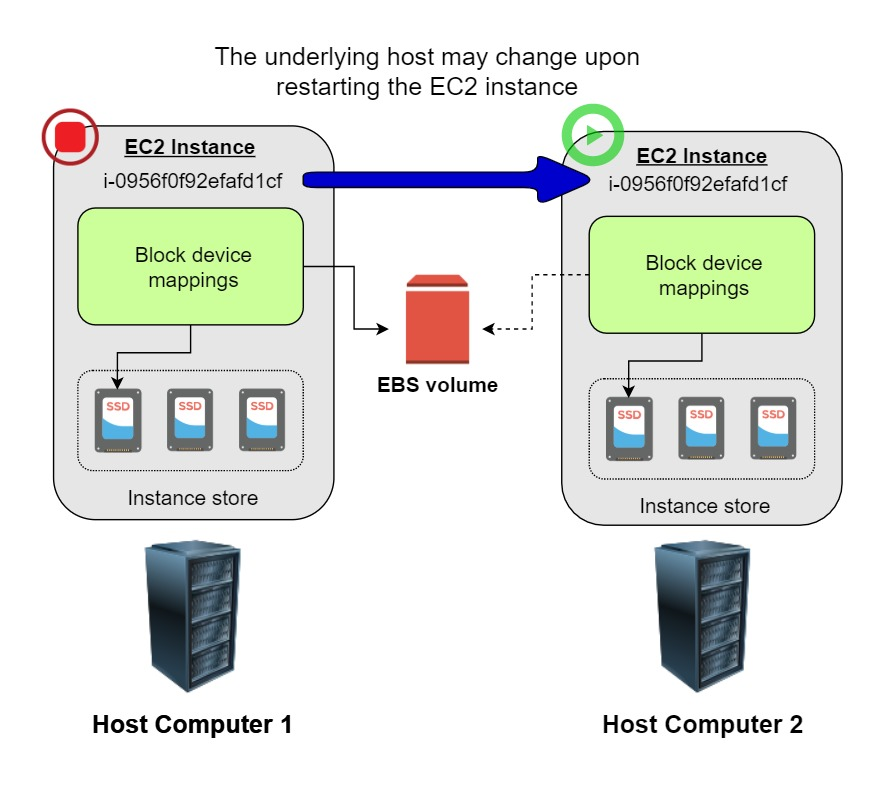

Take note that an EBS-backed EC2 instance can have attached Instance Store volumes. This is the reason why there is an option that mentions the Instance Store volume, which is placed to test your understanding of this specific storage type. You can launch an EBS-backed EC2 instance and attach several Instance Store volumes but remember that there are some EC2 Instance types that don't support this kind of set up.

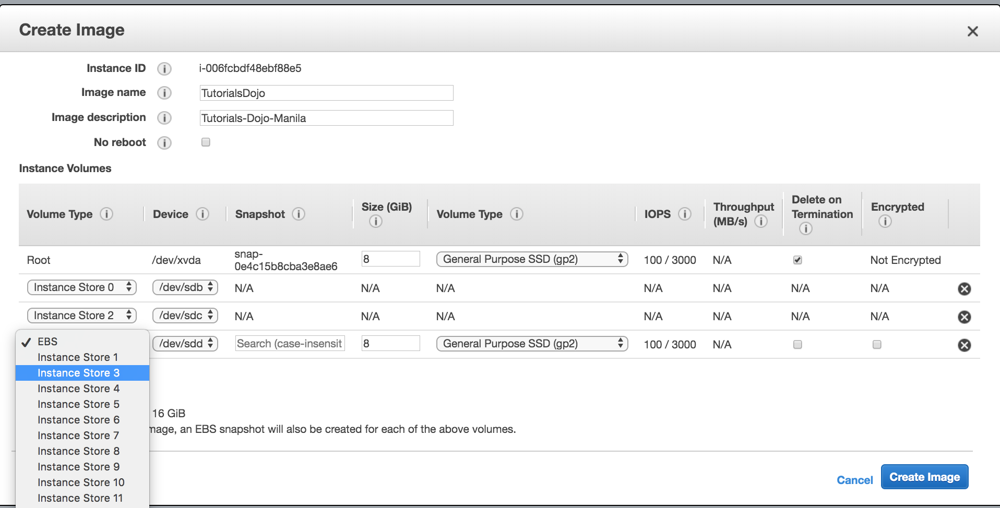

Hence, the correct answers are:

**- The underlying host for the instance is possibly changed.**

**- All data on the attached instance-store devices will be lost.**

The option that says: **The ENI (Elastic Network Interface) is detached** is incorrect because the ENI will stay attached even if you stopped your EC2 instance.

The option that says: **The Elastic IP address is disassociated with the instance** is incorrect because the EIP will actually remain associated with your instance even after stopping it.

The option that says: **There will be no changes** is incorrect because there will be a lot of possible changes in your EC2 instance once you stop and start it again. AWS may move the virtualized EC2 instance to another host computer; the instance may get a new public IP address, and the data in your attached instance store volumes will be deleted.

 

**References:**

http://docs.aws.amazon.com/AWSEC2/latest/UserGuide/ec2-instance-lifecycle.html

https://docs.aws.amazon.com/AWSEC2/latest/UserGuide/ComponentsAMIs.html#storage-for-the-root-device

 

**Check out this Amazon EC2 Cheat Sheet:**

https://tutorialsdojo.com/amazon-elastic-compute-cloud-amazon-ec2/

 

**Tutorials Dojo's AWS Certified Solutions Architect Associate Exam Study Guide:**

https://tutorialsdojo.com/aws-certified-solutions-architect-associate-saa-c02/

17

A production MySQL database hosted on Amazon RDS is running out of disk storage. The management has consulted its solutions architect to increase the disk space without impacting the database performance.

How can the solutions architect satisfy the requirement with the LEAST operational overhead?

[(view)](https://portal.tutorialsdojo.com/my-dashboard/#)11000:00:47

-  Modify the DB instance settings and enable storage autoscaling.
-  Increase the allocated storage for the DB instance.
-  Change the `default_storage_engine` of the DB instance’s parameter group to `MyISAM`.
-  Modify the DB instance storage type to Provisioned IOPS.

**RDS Storage Auto Scaling** automatically scales storage capacity in response to growing database workloads, with zero downtime.

Under-provisioning could result in application downtime, and over-provisioning could result in underutilized resources and higher costs. With RDS Storage Auto Scaling, you simply set your desired maximum storage limit, and Auto Scaling takes care of the rest.

RDS Storage Auto Scaling continuously monitors actual storage consumption, and scales capacity up automatically when actual utilization approaches provisioned storage capacity. Auto Scaling works with new and existing database instances. You can enable Auto Scaling with just a few clicks in the AWS Management Console. There is no additional cost for RDS Storage Auto Scaling. You pay only for the RDS resources needed to run your applications.

Hence, the correct answer is: **Modify the DB instance settings and enable storage autoscaling.**

The option that says: **Increase the allocated storage for the DB instance** is incorrect. Although this will solve the problem of low disk space, increasing the allocated storage might cause performance degradation during the change.

The option that says: **Change the `default_storage_engine` of the DB instance’s parameter group to `MyISAM`** is incorrect. This is just a storage engine for MySQL. It won't increase the disk space in any way.

The option that says: **Modify the DB instance storage type to Provisioned IOPS** is incorrect. This may improve disk performance but it won't solve the problem of low database storage.

 

**References:**

https://aws.amazon.com/about-aws/whats-new/2019/06/rds-storage-auto-scaling/

https://docs.aws.amazon.com/AmazonRDS/latest/UserGuide/USER_PIOPS.StorageTypes.html#USER_PIOPS.Autoscaling

 

**Check out this Amazon RDS Cheat Sheet:**

https://tutorialsdojo.com/amazon-relational-database-service-amazon-rds/

18

A company needs to use Amazon Aurora as the Amazon RDS database engine of their web application. The Solutions Architect has been instructed to implement a 90-day backup retention policy.

Which of the following options can satisfy the given requirement?

[(view)](https://portal.tutorialsdojo.com/my-dashboard/#)10100:01:29

-  Configure an automated backup and set the backup retention period to 90 days.
-  ==Create an AWS Backup plan to take daily snapshots with a retention period of 90 days.==
-  Configure RDS to export the automated snapshot automatically to Amazon S3 and create a lifecycle policy to delete the object after 90 days.
-  Create a daily scheduled event using CloudWatch Events and AWS Lambda to directly download the RDS automated snapshot to an S3 bucket. Archive snapshots older than 90 days to Glacier.

==**AWS Backup** is a centralized backup service that makes it easy and cost-effective for you to backup your application data across AWS services in the AWS Cloud==, helping you meet your business and regulatory backup compliance requirements. AWS Backup makes protecting your AWS storage volumes, databases, and file systems simple by providing a central place where you can configure and audit the AWS resources you want to backup, automate backup scheduling, set retention policies, and monitor all recent backup and restore activity.

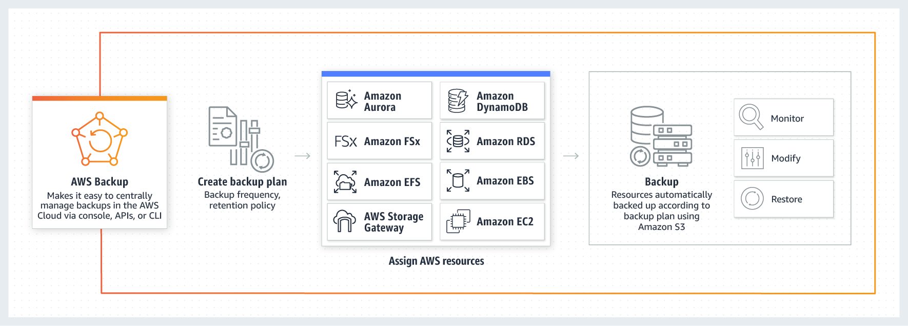

In this scenario, you can use AWS Backup to create a backup plan with a retention period of 90 days. ==A backup plan is a policy expression that defines when and how you want to back up your AWS resources.== You assign resources to backup plans, and AWS Backup then automatically backs up and retains backups for those resources according to the backup plan.

Hence, the correct answer is: **Create an AWS Backup plan to take daily snapshots with a retention period of 90 days.**

The option that says: **Configure an automated backup and set the backup retention period to 90 days** is incorrect because the maximum backup retention period for automated backup is only 35 days.

The option that says: **Configure RDS to export the automated snapshot automatically to Amazon S3 and create a lifecycle policy to delete the object after 90 days** is incorrect because you can't export an automated snapshot automatically to Amazon S3. You must export the snapshot manually.

The option that says: **Create a daily scheduled event using CloudWatch Events and AWS Lambda to directly download the RDS automated snapshot to an S3 bucket. Archive snapshots older than 90 days to Glacier** is incorrect because you cannot directly download or export an automated snapshot in RDS to Amazon S3. You have to copy the automated snapshot first for it to become a manual snapshot, which you can move to an Amazon S3 bucket. A better solution for this scenario is to simply use AWS Backup.

**References:**

https://docs.aws.amazon.com/aws-backup/latest/devguide/create-a-scheduled-backup.html

https://aws.amazon.com/backup/faqs/

**Check out these AWS Cheat Sheets:**

[https://tutorialsdojo.com/links-to-all-aws-cheat-sheets/](https://tutorialsdojo.com/amazon-elastic-compute-cloud-amazon-ec2/)

19

A company has a decoupled application in AWS using EC2, Auto Scaling group, S3, and SQS. The Solutions Architect designed the architecture in such a way that the EC2 instances will consume the message from the SQS queue and will automatically scale up or down based on the number of messages in the queue.

In this scenario, which of the following statements is false about SQS?

[(view)](https://portal.tutorialsdojo.com/my-dashboard/#)11000:01:03

-  Standard queues provide at-least-once delivery, which means that each message is delivered at least once.
-  Standard queues preserve the order of messages.
-  Amazon SQS can help you build a distributed application with decoupled components.
-  FIFO queues provide exactly-once processing.

All of the answers are correct except for the option that says: **Standard queues preserve the order of messages**. Only FIFO queues can preserve the order of messages and not standard queues.

 

**Reference:** 

https://aws.amazon.com/sqs/faqs/

 

**Check out this Amazon SQS Cheat Sheet:**

https://tutorialsdojo.com/amazon-sqs/

20

You are automating the creation of EC2 instances in your VPC. Hence, you wrote a python script to trigger the Amazon EC2 API to request 50 EC2 instances in a single Availability Zone. However, you noticed that after 20 successful requests, subsequent requests failed.

What could be a reason for this issue and how would you resolve it?

[(view)](https://portal.tutorialsdojo.com/my-dashboard/#)11000:00:13

-  There was an issue with the Amazon EC2 API. Just resend the requests and these will be provisioned successfully.
-  By default, AWS allows you to provision a maximum of 20 instances per region. Select a different region and retry the failed request.
-  By default, AWS allows you to provision a maximum of 20 instances per Availability Zone. Select a different Availability Zone and retry the failed request.
-  There is a vCPU-based On-Demand Instance limit per region which is why subsequent requests failed. Just submit the limit increase form to AWS and retry the failed requests once approved.

You are limited to running On-Demand Instances per your vCPU-based On-Demand Instance limit, purchasing 20 Reserved Instances, and requesting Spot Instances per your dynamic Spot limit per region. New AWS accounts may start with limits that are lower than the limits described here.

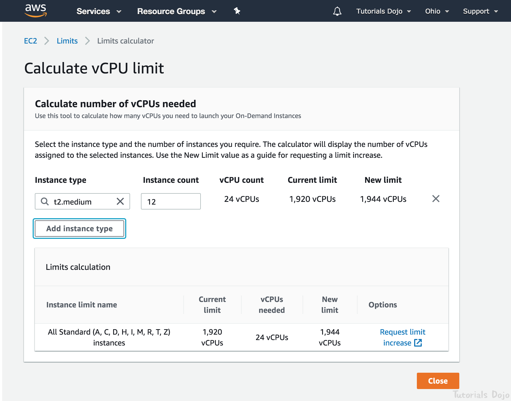

If you need more instances, complete the Amazon EC2 limit increase request form with your use case, and your limit increase will be considered. Limit increases are tied to the region they were requested for.

Hence, the correct answer is: **There is a vCPU-based On-Demand Instance limit per region which is why subsequent requests failed. Just submit the limit increase form to AWS and retry the failed requests once approved.**

The option that says: **There was an issue with the Amazon EC2 API. Just resend the requests and these will be provisioned successfully** is incorrect because you are limited to running On-Demand Instances per your vCPU-based On-Demand Instance limit. There is also a limit of purchasing 20 Reserved Instances, and requesting Spot Instances per your dynamic Spot limit per region hence, there is no problem with the EC2 API.

The option that says: **By default, AWS allows you to provision a maximum of 20 instances per region. Select a different region and retry the failed request** is incorrect. There is no need to select a different region since this limit can be increased after submitting a request form to AWS.

The option that says: **By default, AWS allows you to provision a maximum of 20 instances per Availability Zone. Select a different Availability Zone and retry the failed request** is incorrect because the vCPU-based On-Demand Instance limit is set per region and not per Availability Zone. This can be increased after submitting a request form to AWS.

 

**References:** 

https://docs.aws.amazon.com/general/latest/gr/aws_service_limits.html#limits_ec2

https://aws.amazon.com/ec2/faqs/#How_many_instances_can_I_run_in_Amazon_EC2

 

**Check out this Amazon EC2 Cheat Sheet:**

https://tutorialsdojo.com/amazon-elastic-compute-cloud-amazon-ec2/

21

An aerospace engineering company recently adopted a hybrid cloud infrastructure with AWS. One of the Solutions Architect’s tasks is to launch a VPC with both public and private subnets for their EC2 instances as well as their database instances.

Which of the following statements are true regarding Amazon VPC subnets? (Select TWO.)

[(view)](https://portal.tutorialsdojo.com/my-dashboard/#)11000:01:40

-  EC2 instances in a private subnet can communicate with the Internet only if they have an Elastic IP.
-  Each subnet maps to a single Availability Zone.
-  The allowed block size in VPC is between a /16 netmask (65,536 IP addresses) and /27 netmask (32 IP addresses).
-  Every subnet that you create is automatically associated with the main route table for the VPC.
-  Each subnet spans to 2 Availability Zones.

A **VPC** spans all the Availability Zones in the region. After creating a VPC, you can add one or more subnets in each Availability Zone. When you create a subnet, you specify the CIDR block for the subnet, which is a subset of the VPC CIDR block. Each subnet must reside entirely within one Availability Zone and cannot span zones. Availability Zones are distinct locations that are engineered to be isolated from failures in other Availability Zones. By launching instances in separate Availability Zones, you can protect your applications from the failure of a single location.

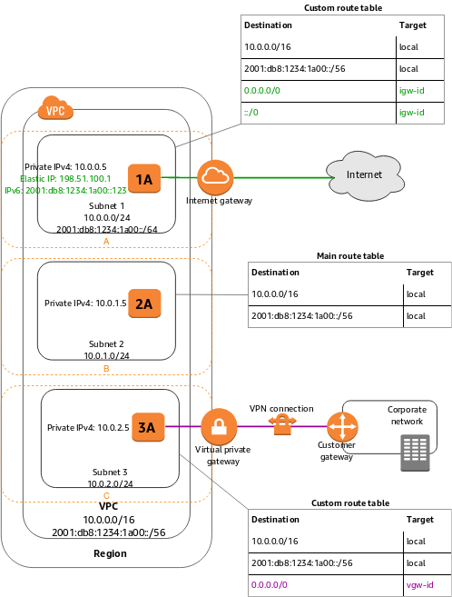

Below are the important points you have to remember about subnets:

**- Each subnet maps to a single Availability Zone.**

**- Every subnet that you create is automatically associated with the main route table for the VPC.**

\- If a subnet's traffic is routed to an Internet gateway, the subnet is known as a public subnet.

The option that says: **EC2 instances in a private subnet can communicate with the Internet only if they have an Elastic IP** is incorrect. EC2 instances in a private subnet can communicate with the Internet not just by having an Elastic IP, but also with a public IP address via a NAT Instance or a NAT Gateway. Take note that there is a distinction between private and public IP addresses. To enable communication with the Internet, a public IPv4 address is mapped to the primary private IPv4 address through network address translation (NAT).

The option that says: **The allowed block size in VPC is between a /16 netmask (65,536 IP addresses) and /27 netmask (32 IP addresses)** is incorrect because the allowed block size in VPC is between a /16 netmask (65,536 IP addresses) and /28 netmask (16 IP addresses) and not /27 netmask.

The option that says: **Each subnet spans to 2 Availability Zones** is incorrect because each subnet must reside entirely within one Availability Zone and cannot span zones.

 

**References:** 

https://docs.aws.amazon.com/AmazonVPC/latest/UserGuide/VPC_Subnets.html

https://docs.aws.amazon.com/vpc/latest/userguide/vpc-ip-addressing.html

 

**Check out this Amazon VPC Cheat Sheet:**

https://tutorialsdojo.com/amazon-vpc/

 

**Tutorials Dojo's AWS Certified Solutions Architect Associate Exam Study Guide:**

https://tutorialsdojo.com/aws-certified-solutions-architect-associate/

Sub-Total:2115 (71.43%)6 (28.57%)00:22:4771.43%Category: **CSAA - Design Secure Applications and Architectures**1

A travel company has a suite of web applications hosted in an Auto Scaling group of On-Demand EC2 instances behind an Application Load Balancer that handles traffic from various web domains such as `i-love-manila.com`,`i-love-boracay.com` `i-love-cebu.com` and many others. To improve security and lessen the overall cost, you are instructed to secure the system by allowing multiple domains to serve SSL traffic without the need to reauthenticate and reprovision your certificate everytime you add a new domain. This migration from HTTP to HTTPS will help improve their SEO and Google search ranking.

Which of the following is the most cost-effective solution to meet the above requirement?

[(view)](https://portal.tutorialsdojo.com/my-dashboard/#)11000:00:53

-  Use a wildcard certificate to handle multiple sub-domains and different domains.
-  Add a Subject Alternative Name (SAN) for each additional domain to your certificate.
-  Create a new CloudFront web distribution and configure it to serve HTTPS requests using dedicated IP addresses in order to associate your alternate domain names with a dedicated IP address in each CloudFront edge location.
-  Upload all SSL certificates of the domains in the ALB using the console and bind multiple certificates to the same secure listener on your load balancer. ALB will automatically choose the optimal TLS certificate for each client using Server Name Indication (SNI).

SNI Custom SSL relies on the SNI extension of the Transport Layer Security protocol, which allows multiple domains to serve SSL traffic over the same IP address by including the hostname which the viewers are trying to connect to.

You can host multiple TLS secured applications, each with its own TLS certificate, behind a single load balancer. In order to use SNI, all you need to do is bind multiple certificates to the same secure listener on your load balancer. ALB will automatically choose the optimal TLS certificate for each client. These features are provided at no additional charge.


To meet the requirements in the scenario, you can upload all SSL certificates of the domains in the ALB using the console and bind multiple certificates to the same secure listener on your load balancer. ALB will automatically choose the optimal TLS certificate for each client using Server Name Indication (SNI).

Hence, the correct answer is the option that says: **Upload all SSL certificates of the domains in the ALB using the console and bind multiple certificates to the same secure listener on your load balancer. ALB will automatically choose the optimal TLS certificate for each client using Server Name Indication (SNI).**

**Using a wildcard certificate to handle multiple sub-domains and different domains** is incorrect because a wildcard certificate can only handle multiple sub-domains but not different domains.

**Adding a Subject Alternative Name (SAN) for each additional domain to your certificate** is incorrect because although using SAN is correct, you will still have to reauthenticate and reprovision your certificate every time you add a new domain. One of the requirements in the scenario is that you should not have to reauthenticate and reprovision your certificate hence, this solution is incorrect.

The option that says: **Create a new CloudFront web distribution and configure it to serve HTTPS requests using dedicated IP addresses in order to associate your alternate domain names with a dedicated IP address in each CloudFront edge location** is incorrect because although it is valid to use dedicated IP addresses to meet this requirement, this solution is not cost-effective. Remember that if you configure CloudFront to serve HTTPS requests using dedicated IP addresses, you incur an additional monthly charge. The charge begins when you associate your SSL/TLS certificate with your CloudFront distribution. You can just simply upload the certificates to the ALB and use SNI to handle multiple domains in a cost-effective manner.

 

**References:**

https://aws.amazon.com/blogs/aws/new-application-load-balancer-sni/

https://docs.aws.amazon.com/AmazonCloudFront/latest/DeveloperGuide/cnames-https-dedicated-ip-or-sni.html#cnames-https-dedicated-ip

https://docs.aws.amazon.com/elasticloadbalancing/latest/application/create-https-listener.html

 

**Check out this Amazon CloudFront Cheat Sheet:**

https://tutorialsdojo.com/amazon-cloudfront/

 

**SNI Custom SSL vs Dedicated IP Custom SSL:**

https://tutorialsdojo.com/sni-custom-ssl-vs-dedicated-ip-custom-ssl/

 

**Comparison of AWS Services Cheat Sheets:**

https://tutorialsdojo.com/comparison-of-aws-services/

===> 2==

A company has an existing VPC which is quite unutilized for the past few months. The Business Manager instructed the Solutions Architect to integrate the company’s on-premises data center and its VPC. The architect explained the list of tasks that he’ll be doing and discussed the Virtual Private Network (VPN) connection. The Business Manager is not tech-savvy but he is interested to know what a VPN is and its benefits.

What is one of the major advantages of having a VPN in AWS?

[(view)](https://portal.tutorialsdojo.com/my-dashboard/#)10100:01:55

-  It provides a cost-effective, hybrid connection from your VPC to your on-premises data centers which bypasses the public Internet.
-  ==It allows you to connect your AWS cloud resources to your on-premises data center using secure and private sessions with IP Security (IPSec) or Transport Layer Security (TLS) tunnels.==
-  It provides a networking connection between two VPCs which enables you to route traffic between them using private IPv4 addresses or IPv6 addresses.
-  It enables you to establish a private and dedicated network connection between your network and your VPC

**Amazon VPC** offers you the flexibility to fully manage both sides of your Amazon VPC connectivity by creating a VPN connection between your remote network and a software VPN appliance running in your Amazon VPC network. This option is recommended if you must manage both ends of the VPN connection either for compliance purposes or for leveraging gateway devices that are not currently supported by Amazon VPC’s VPN solution.

You can connect your Amazon VPC to remote networks and users using the following VPN connectivity options:

**AWS Site-to-Site VPN** - creates an IPsec VPN connection between your VPC and your remote network. On the AWS side of the Site-to-Site VPN connection, a virtual private gateway or transit gateway provides two VPN endpoints (tunnels) for automatic failover.

**AWS Client VPN -** a managed client-based VPN service that provides secure TLS VPN connections between your AWS resources and on-premises networks.

**AWS VPN CloudHub -** capable of wiring multiple AWS Site-to-Site VPN connections together on a virtual private gateway. This is useful if you want to enable communication between different remote networks that uses a Site-to-Site VPN connection.

**Third-party software VPN appliance -** You can create a VPN connection to your remote network by using an Amazon EC2 instance in your VPC that's running a third party software VPN appliance.

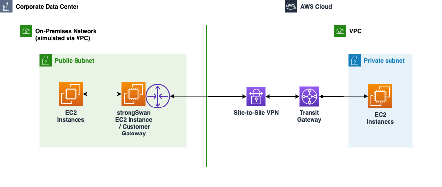

With **a VPN connection**, you can connect to an Amazon VPC in the cloud the same way you connect to your branches while establishing secure and private sessions with IP Security (IPSec) or Transport Layer Security (TLS) tunnels.

Hence, the correct answer is the option that says: **It allows you to connect your AWS cloud resources to your on-premises data center using secure and private sessions with IP Security (IPSec) or Transport Layer Security (TLS) tunnels** since one of the main advantages of having a VPN connection is that you will be able to connect your Amazon VPC to other remote networks securely.

The option that says: **It provides a cost-effective, hybrid connection from your VPC to your on-premises data centers which bypasses the public Internet** is incorrect. Although it is true that a VPN provides a cost-effective, hybrid connection from your VPC to your on-premises data centers, it certainly does not bypass the public Internet. A VPN connection actually goes through the public Internet, unlike the AWS Direct Connect connection which has a direct and dedicated connection to your on-premises network.

The option that says: **It provides a networking connection between two VPCs which enables you to route traffic between them using private IPv4 addresses or IPv6 addresses** is incorrect because this actually describes VPC Peering and not a VPN connection.

The option that says: **It enables you to establish a private and dedicated network connection between your network and your VPC** is incorrect because this is the advantage of an AWS Direct Connect connection and not a VPN.

 **References:**

http://docs.aws.amazon.com/AmazonVPC/latest/UserGuide/vpn-connections.html

https://docs.aws.amazon.com/whitepapers/latest/aws-vpc-connectivity-options/software-vpn-network-to-amazon.html

 **Amazon VPC Overview:**

https://www.youtube.com/embed/oIDHKeNxvQQ

**Check out this Amazon VPC Cheat Sheet:**

https://tutorialsdojo.com/amazon-vpc/

 **Tutorials Dojo's AWS Certified Solutions Architect Associate Exam Study Guide:**

https://tutorialsdojo.com/aws-certified-solutions-architect-associate/

3

A Solutions Architect is managing a company's AWS account of approximately 300 IAM users. They have a new company policy that requires changing the associated permissions of all 100 IAM users that control the access to Amazon S3 buckets.

What will the Solutions Architect do to avoid the time-consuming task of applying the policy to each user?

[(view)](https://portal.tutorialsdojo.com/my-dashboard/#)11000:00:55

-  Create a new IAM group and then add the users that require access to the S3 bucket. Afterwards, apply the policy to IAM group.
-  Create a new policy and apply it to multiple IAM users using a shell script.
-  Create a new S3 bucket access policy with unlimited access for each IAM user.
-  Create a new IAM role and add each user to the IAM role.

In this scenario, the best option is to **group the set of users in an IAM Group and then apply a policy with the required access to the Amazon S3 bucket**. This will enable you to easily add, remove, and manage the users instead of manually adding a policy to each and every 100 IAM users.

**Creating a new policy and applying it to multiple IAM users using a shell script** is incorrect because you need a new IAM Group for this scenario and not assign a policy to each user via a shell script. This method can save you time but afterward, it will be difficult to manage all 100 users that are not contained in an IAM Group.

**Creating a new S3 bucket access policy with unlimited access for each IAM user** is incorrect because you need a new IAM Group and the method is also time-consuming.

**Creating a new IAM role and adding each user to the IAM role** is incorrect because you need to use an IAM Group and not an IAM role.


 

**Reference:** 

http://docs.aws.amazon.com/IAM/latest/UserGuide/id_groups.html

 

**Check out this AWS IAM Cheat Sheet:**

https://tutorialsdojo.com/aws-identity-and-access-management-iam/

 

**Tutorials Dojo's AWS Certified Solutions Architect Associate Exam Study Guide:**

https://tutorialsdojo.com/aws-certified-solutions-architect-associate/

4

A company has an On-Demand EC2 instance located in a subnet in AWS that hosts a web application. The security group attached to this EC2 instance has the following Inbound Rules:


The Route table attached to the VPC is shown below. You can establish an SSH connection into the EC2 instance from the Internet. However, you are not able to connect to the web server using your Chrome browser.

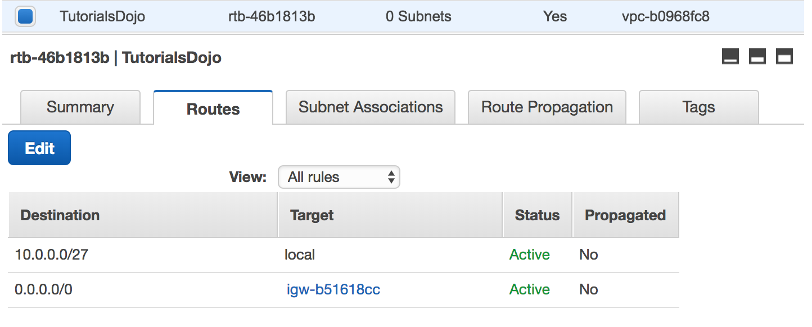

Which of the below steps would resolve the issue?

[(view)](https://portal.tutorialsdojo.com/my-dashboard/#)11000:01:49

-  In the Security Group, add an Inbound HTTP rule.
-  In the Security Group, remove the SSH rule.
-  In the Route table, add this new route entry: 0.0.0.0 -> igw-b51618cc
-  In the Route table, add this new route entry: 10.0.0.0/27 -> local

In this particular scenario, you can already connect to the EC2 instance via SSH. This means that there is no problem in the Route Table of your VPC. To fix this issue, you simply need to update your Security Group and add an Inbound rule to allow HTTP traffic.

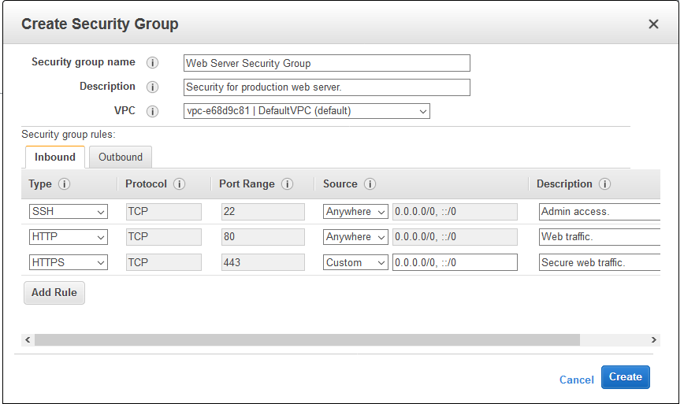

The option that says: **In the Security Group, remove the SSH rule** is incorrect as doing so will not solve the issue. It will just disable SSH traffic that is already available.

The options that say: **In the Route table, add this new route entry: 0.0.0.0 -> igw-b51618cc** and **In the Route table, add this new route entry: 10.0.0.0/27 -> local** are incorrect as there is no need to change the Route Tables.

 

**Reference:**

http://docs.aws.amazon.com/AmazonVPC/latest/UserGuide/VPC_SecurityGroups.html

 

**Check out this Amazon VPC Cheat Sheet:**

https://tutorialsdojo.com/amazon-vpc/

5

A company has clients all across the globe that access product files stored in several S3 buckets, which are behind each of their own CloudFront web distributions. They currently want to deliver their content to a specific client, and they need to make sure that only that client can access the data. Currently, all of their clients can access their S3 buckets directly using an S3 URL or through their CloudFront distribution. The Solutions Architect must serve the private content via CloudFront only, to secure the distribution of files.

Which combination of actions should the Architect implement to meet the above requirements? (Select TWO.)

[(view)](https://portal.tutorialsdojo.com/my-dashboard/#)10100:01:41

-  Use AWS App Mesh to ensure that only their client can access the files.
-  Use AWS Cloud Map to ensure that only their client can access the files.
-  Use S3 pre-signed URLs to ensure that only their client can access the files. Remove permission to use Amazon S3 URLs to read the files for anyone else.
-  ==Restrict access to files in the origin by creating an origin access identity (OAI) and give it permission to read the files in the bucket.==
-  ==Require the users to access the private content by using special CloudFront signed URLs or signed cookies.==

Many companies that distribute content over the Internet want to restrict access to documents, business data, media streams, or content that is intended for selected users, for example, users who have paid a fee. ==To securely serve this private content by using CloudFront, you can do the following:==

==\- Require that your users access your private content by using special CloudFront signed URLs or signed cookies.==

==\- Require that your users access your Amazon S3 content by using CloudFront URLs, not Amazon S3 URLs. Requiring CloudFront URLs isn't necessary, but it is recommended to prevent users from bypassing the restrictions that you specify in signed URLs or signed cookies. You can do this by setting up an origin access identity (OAI) for your Amazon S3 bucket. You can also configure the custom headers for a private HTTP server or an Amazon S3 bucket configured as a website endpoint.==

All objects and buckets by default are private. ==The pre-signed URLs are useful if you want your user/customer to be able to upload a specific object to your bucket, but you don't require them to have AWS security credentials or permissions.==

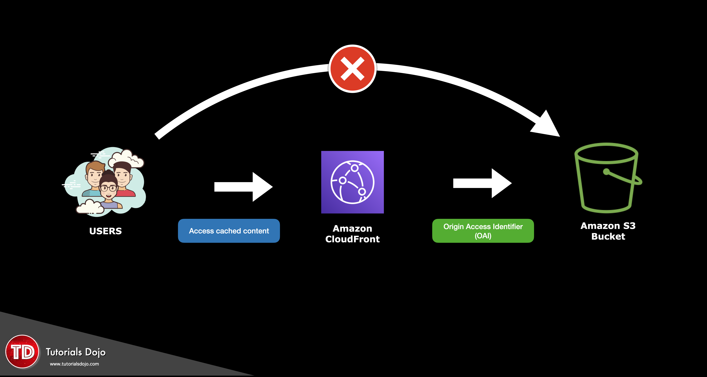

You can generate a pre-signed URL programmatically using the AWS SDK for Java or the AWS SDK for .NET. If you are using Microsoft Visual Studio, you can also use AWS Explorer to generate a pre-signed object URL without writing any code. Anyone who receives a valid pre-signed URL can then programmatically upload an object.

Hence, the correct answers are:

  **- Restrict access to files in the origin by creating an origin access identity (OAI) and give it permission to read the files in the bucket.** 

  **- Require the users to access the private content by using special CloudFront signed URLs or signed cookies.** 

The option that says: **Use AWS App Mesh to ensure that only their client can access the files** is incorrect because ==AWS App Mesh is just a service mesh that provides application-level networking to make it easy for your services to communicate with each other across multiple types of compute infrastructure.==

The option that says: **Use AWS Cloud Map to ensure that only their client can access the files** is incorrect because ==AWS Cloud Map is simply a cloud resource discovery service that enables you to name your application resources with custom names and automatically update the locations of your dynamically changing resources.==

The option that says: **Use S3 pre-signed URLs to ensure that only their client can access the files. Remove permission to use Amazon S3 URLs to read the files for anyone else** is incorrect. Although this could be a valid solution, it doesn't satisfy the requirement to serve the private content via CloudFront only to secure the distribution of files. A better solution is to set up an origin access identity (OAI) then use Signed URL or Signed Cookies in your CloudFront web distribution.

 **References**:

https://docs.aws.amazon.com/AmazonCloudFront/latest/DeveloperGuide/PrivateContent.html

https://docs.aws.amazon.com/AmazonS3/latest/dev/PresignedUrlUploadObject.html

 **Check out this Amazon CloudFront cheat sheet:**

https://tutorialsdojo.com/amazon-cloudfront/

 **S3 Pre-signed URLs vs CloudFront Signed URLs vs Origin Access Identity (OAI)**

https://tutorialsdojo.com/s3-pre-signed-urls-vs-cloudfront-signed-urls-vs-origin-access-identity-oai/

 **Comparison of AWS Services Cheat Sheets:**

https://tutorialsdojo.com/comparison-of-aws-services/

6

A startup has resources deployed on the AWS Cloud. It is now going through a set of scheduled audits by an external auditing firm for compliance.

Which of the following services available in AWS can be utilized to help ensure the right information are present for auditing purposes?

[(view)](https://portal.tutorialsdojo.com/my-dashboard/#)11000:00:17

-  AWS CloudTrail
-  Amazon VPC
-  Amazon EC2
-  Amazon CloudWatch

**AWS CloudTrail** is a service that enables governance, compliance, operational auditing, and risk auditing of your AWS account. With CloudTrail, you can log, continuously monitor, and retain account activity related to actions across your AWS infrastructure. CloudTrail provides event history of your AWS account activity, including actions taken through the AWS Management Console, AWS SDKs, command line tools, and other AWS services. This event history simplifies security analysis, resource change tracking, and troubleshooting.


CloudTrail provides visibility into user activity by recording actions taken on your account. CloudTrail records important information about each action, including who made the request, the services used, the actions performed, parameters for the actions, and the response elements returned by the AWS service. This information helps you to track changes made to your AWS resources and troubleshoot operational issues. CloudTrail makes it easier to ensure compliance with internal policies and regulatory standards.

Hence, the correct answer is: **AWS CloudTrail.**

**Amazon VPC** is incorrect because a VPC is a logically isolated section of the AWS Cloud where you can launch AWS resources in a virtual network that you define. It does not provide you the auditing information that were asked for in this scenario.

**Amazon EC2** is incorrect because EC2 is a service that provides secure, resizable compute capacity in the cloud and does not provide the needed information in this scenario just like the option above.

**Amazon CloudWatch** is incorrect because this is a monitoring tool for your AWS resources. Like the above options, it does not provide the needed information to satisfy the requirement in the scenario.

 

**Reference:**

https://aws.amazon.com/cloudtrail/

 

**Check out this AWS CloudTrail Cheat Sheet:**

https://tutorialsdojo.com/aws-cloudtrail/

 

**Tutorials Dojo's AWS Certified Solutions Architect Associate Exam Study Guide:**

https://tutorialsdojo.com/aws-certified-solutions-architect-associate/

7

A Solutions Architect is unable to connect to the newly deployed EC2 instance via SSH using a home computer. However, the Architect was able to successfully access other existing instances in the VPC without any issues.

Which of the following should the Architect check and possibly correct to restore connectivity?

[(view)](https://portal.tutorialsdojo.com/my-dashboard/#)11000:00:50

-  Use Amazon Data Lifecycle Manager.
-  Configure the Network Access Control List of your VPC to permit ingress traffic over port 22 from your IP.
-  Configure the Security Group of the EC2 instance to permit ingress traffic over port 3389 from your IP.
-  Configure the Security Group of the EC2 instance to permit ingress traffic over port 22 from your IP.

When connecting to your EC2 instance via SSH, you need to ensure that port 22 is allowed on the security group of your EC2 instance.

A **security group** acts as a virtual firewall that controls the traffic for one or more instances. When you launch an instance, you associate one or more security groups with the instance. You add rules to each security group that allow traffic to or from its associated instances. You can modify the rules for a security group at any time; the new rules are automatically applied to all instances that are associated with the security group.


**Using Amazon Data Lifecycle Manager** is incorrect because this is primarily used to manage the lifecycle of your AWS resources and not to allow certain traffic to go through.

**Configuring the Network Access Control List of your VPC to permit ingress traffic over port 22 from your IP** is incorrect because this is not necessary in this scenario as it was specified that you were able to connect to other EC2 instances. In addition, Network ACL is much suitable to control the traffic that goes in and out of your entire VPC and not just on one EC2 instance.

**Configure the Security Group of the EC2 instance to permit ingress traffic over port 3389 from your IP** is incorrect because this is relevant to RDP and not SSH.

 

**Reference:** 

http://docs.aws.amazon.com/AWSEC2/latest/UserGuide/using-network-security.html

 

**Check out these AWS Comparison of Services Cheat Sheets:**

https://tutorialsdojo.com/comparison-of-aws-services/

8

A Solutions Architect is working for a large insurance firm. To maintain compliance with HIPAA laws, all data that is backed up or stored on Amazon S3 needs to be encrypted at rest.

In this scenario, what is the best method of encryption for the data, assuming S3 is being used for storing financial-related data? (Select TWO.)

[(view)](https://portal.tutorialsdojo.com/my-dashboard/#)11000:01:50

-  Enable SSE on an S3 bucket to make use of AES-256 encryption
-  Store the data in encrypted EBS snapshots
-  Encrypt the data using your own encryption keys then copy the data to Amazon S3 over HTTPS endpoints.
-  Store the data on EBS volumes with encryption enabled instead of using Amazon S3
-  Use AWS Shield to protect your data at rest

Data protection refers to protecting data while in-transit (as it travels to and from Amazon S3) and at rest (while it is stored on disks in Amazon S3 data centers). You can protect data in transit by using SSL or by using client-side encryption. You have the following options for protecting data at rest in Amazon S3.

**Use Server-Side Encryption** – You request Amazon S3 to encrypt your object before saving it on disks in its data centers and decrypt it when you download the objects.

**Use Client-Side Encryption** – You can encrypt data client-side and upload the encrypted data to Amazon S3. In this case, you manage the encryption process, the encryption keys, and related tools.

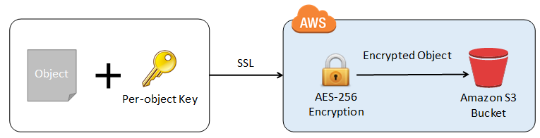

Hence, the following options are the correct answers:

**- Enable SSE on an S3 bucket to make use of AES-256 encryption**

**- Encrypt the data using your own encryption keys then copy the data to Amazon S3 over HTTPS endpoints. This refers to using a Server-Side Encryption with Customer-Provided Keys (SSE-C).** 

**Storing the data in encrypted EBS snapshots** and **storing the data on EBS volumes with encryption enabled instead of using Amazon S3** are both incorrect because all these options are for protecting your data in your EBS volumes. Note that an S3 bucket does not use EBS volumes to store your data.

**Using AWS Shield to protect your data at rest** is incorrect because AWS Shield is mainly used to protect your entire VPC against DDoS attacks.

 

**References:**

https://docs.aws.amazon.com/AmazonS3/latest/dev/serv-side-encryption.html

https://docs.aws.amazon.com/AmazonS3/latest/dev/UsingClientSideEncryption.html

 

**Check out this Amazon S3 Cheat Sheet:**

https://tutorialsdojo.com/amazon-s3/

9

A large financial firm needs to set up a Linux bastion host to allow access to the Amazon EC2 instances running in their VPC. For security purposes, only the clients connecting from the corporate external public IP address 175.45.116.100 should have SSH access to the host.

Which is the best option that can meet the customer's requirement?

[(view)](https://portal.tutorialsdojo.com/my-dashboard/#)11000:01:05

-  Security Group Inbound Rule: Protocol – TCP. Port Range – 22, Source 175.45.116.100/32
-  Security Group Inbound Rule: Protocol – UDP, Port Range – 22, Source 175.45.116.100/32
-  Network ACL Inbound Rule: Protocol – UDP, Port Range – 22, Source 175.45.116.100/32
-  Network ACL Inbound Rule: Protocol – TCP, Port Range-22, Source 175.45.116.100/0

A **bastion host** is a special purpose computer on a network specifically designed and configured to withstand attacks. The computer generally hosts a single application, for example a proxy server, and all other services are removed or limited to reduce the threat to the computer.


When setting up a bastion host in AWS, you should only allow the individual IP of the client and not the entire network. Therefore, in the **Source,** the proper CIDR notation should be used. The **/32** denotes one IP address and the **/0** refers to the entire network.

The option that says: **Security Group Inbound Rule: Protocol – UDP, Port Range – 22, Source 175.45.116.100/32** is incorrect since the SSH protocol uses TCP and port 22, and not UDP.

The option that says: **Network ACL Inbound Rule: Protocol – UDP, Port Range – 22, Source 175.45.116.100/32** is incorrect since the SSH protocol uses TCP and port 22, and not UDP. Aside from that, network ACLs act as a firewall for your whole VPC subnet while security groups operate on an instance level. Since you are securing an EC2 instance, you should be using security groups.

The option that says: **Network ACL Inbound Rule: Protocol – TCP, Port Range-22, Source 175.45.116.100/0** is incorrect as it allowed the entire network instead of a single IP to gain access to the host.

 

**Reference:** 

http://docs.aws.amazon.com/AWSEC2/latest/UserGuide/ec2-instance-metadata.html

 

**Check out this Amazon EC2 Cheat Sheet:**

https://tutorialsdojo.com/amazon-elastic-compute-cloud-amazon-ec2/

10

A company deployed several EC2 instances in a private subnet. The Solutions Architect needs to ensure the security of all EC2 instances. Upon checking the existing Inbound Rules of the Network ACL, she saw this configuration:


If a computer with an IP address of 110.238.109.37 sends a request to the VPC, what will happen?

[(view)](https://portal.tutorialsdojo.com/my-dashboard/#)10100:01:11

-  Initially, it will be allowed and then after a while, the connection will be denied.
-  Initially, it will be denied and then after a while, the connection will be allowed.
-  It will be allowed.
-  It will be denied.

Rules are evaluated starting with the lowest numbered rule. As soon as a rule matches traffic, it's applied immediately regardless of any higher-numbered rule that may contradict it.

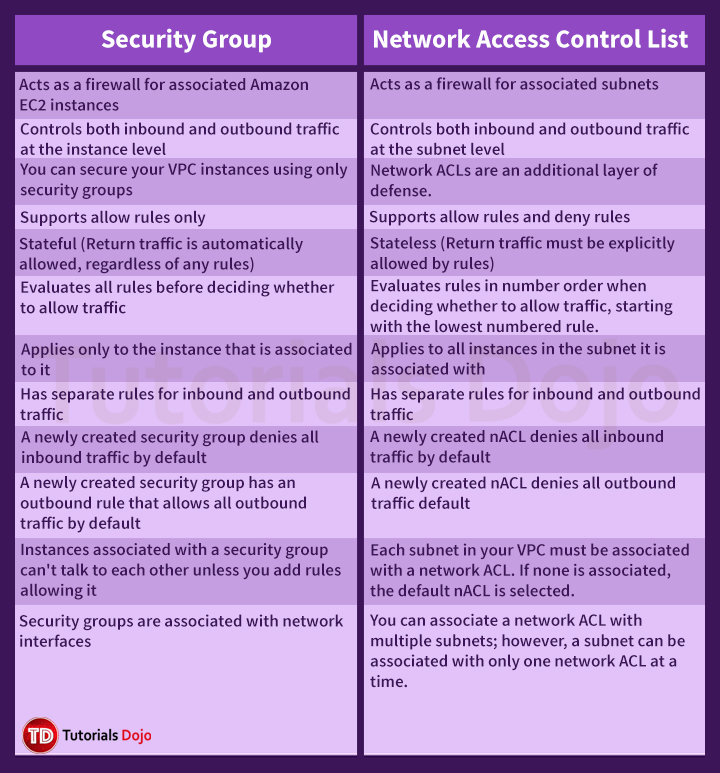

We have 3 rules here:

\1. Rule 100 permits all traffic from any source.

\2. Rule 101 denies all traffic coming from 110.238.109.37

\3. The Default Rule (*) denies all traffic from any source.

The Rule 100 will first be evaluated. If there is a match then it will allow the request. Otherwise, it will then go to Rule 101 to repeat the same process until it goes to the default rule. In this case, when there is a request from 110.238.109.37, it will go through Rule 100 first. As Rule 100 says it will permit all traffic from any source, it will allow this request and will not further evaluate Rule 101 (which denies 110.238.109.37) nor the default rule.

 

**Reference:**

http://docs.aws.amazon.com/AmazonVPC/latest/UserGuide/VPC_ACLs.html

 

**Check out this Amazon VPC Cheat Sheet:**

https://tutorialsdojo.com/amazon-vpc/

11

A company hosted a web application on a Linux Amazon EC2 instance in the public subnet that uses a default network ACL. The instance uses a default security group and has an attached Elastic IP address. The network ACL has been configured to block all traffic to the instance. The Solutions Architect must allow incoming traffic on port 443 to access the application from any source.

Which combination of steps will accomplish this requirement? (Select TWO.)

[(view)](https://portal.tutorialsdojo.com/my-dashboard/#)11000:04:03

-  In the Security Group, add a new rule to allow TCP connection on port 443 from source `0.0.0.0/0`
-  In the Network ACL, update the rule to allow both inbound and outbound TCP connection on port 443 from source `0.0.0.0/0` and to destination `0.0.0.0/0`
-  In the Security Group, create a new rule to allow TCP connection on port 443 to destination `0.0.0.0/0`
-  In the Network ACL, update the rule to allow outbound TCP connection on port `32768 - 65535` to destination `0.0.0.0/0`
-  In the Network ACL, update the rule to allow inbound TCP connection on port 443 from source `0.0.0.0/0` and outbound TCP connection on port `32768 - 65535` to destination `0.0.0.0/0`

To enable the connection to a service running on an instance, the associated network ACL must allow both inbound traffic on the port that the service is listening on as well as allow outbound traffic from ephemeral ports. When a client connects to a server, a random port from the ephemeral port range (1024-65535) becomes the client's source port.

The designated ephemeral port then becomes the destination port for return traffic from the service, so outbound traffic from the ephemeral port must be allowed in the network ACL. By default, network ACLs allow all inbound and outbound traffic. If your network ACL is more restrictive, then you need to explicitly allow traffic from the ephemeral port range.

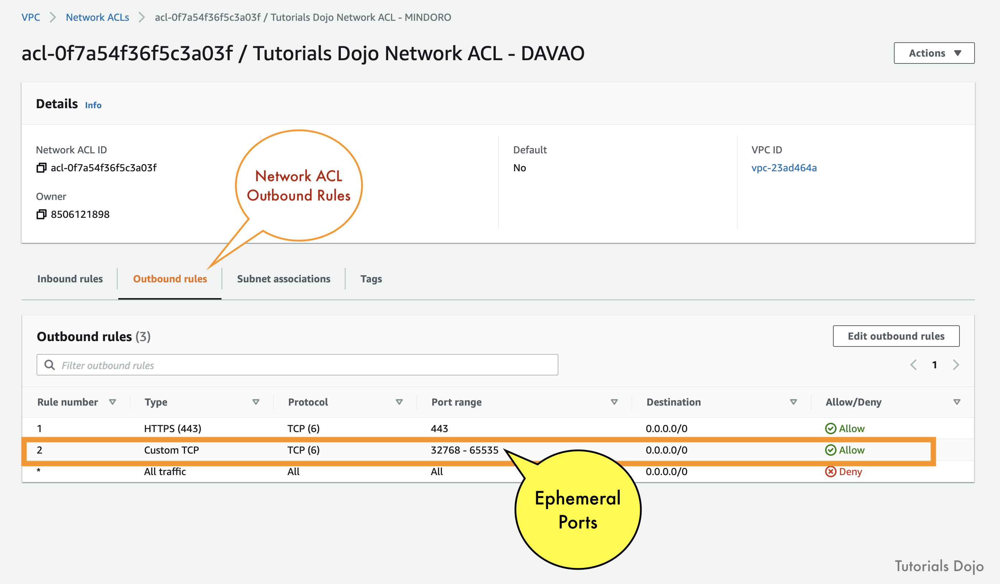

The client that initiates the request chooses the ephemeral port range. The range varies depending on the client's operating system.

\- Many Linux kernels (including the Amazon Linux kernel) use ports 32768-61000.

\- Requests originating from Elastic Load Balancing use ports 1024-65535.

\- Windows operating systems through Windows Server 2003 use ports 1025-5000.

\- Windows Server 2008 and later versions use ports 49152-65535.

\- A NAT gateway uses ports 1024-65535.

\- AWS Lambda functions use ports 1024-65535.

For example, if a request comes into a web server in your VPC from a Windows 10 client on the Internet, your network ACL must have an outbound rule to enable traffic destined for ports 49152 - 65535. If an instance in your VPC is the client initiating a request, your network ACL must have an inbound rule to enable traffic destined for the ephemeral ports specific to the type of instance (Amazon Linux, Windows Server 2008, and so on).

In this scenario, you only need to allow the incoming traffic on port 443. Since security groups are stateful, you can apply any changes to an incoming rule and it will be automatically applied to the outgoing rule.

To enable the connection to a service running on an instance, the associated network ACL must allow both inbound traffic on the port that the service is listening on as well as allow outbound traffic from ephemeral ports. When a client connects to a server, a random port from the ephemeral port range (32768 - 65535) becomes the client's source port.

Hence, the correct answers are:

**- In the Security Group, add a new rule to allow TCP connection on port 443 from source `0.0.0.0/0`.**

**- In the Network ACL, update the rule to allow inbound TCP connection on port 443 from source `0.0.0.0/0` and outbound TCP connection on port `32768 - 65535` to destination `0.0.0.0/0`.**

The option that says: **In the Security Group, create a new rule to allow TCP connection on port 443 to destination `0.0.0.0/0`** is incorrect because this step just allows outbound connections from the EC2 instance out to the public Internet which is unnecessary. Remember that a default security group already includes an outbound rule that allows all outbound traffic.

The option that says: **In the Network ACL, update the rule to allow both inbound and outbound TCP connection on port 443 from source 0.0.0.0/0 and to destination `0.0.0.0/0`** is incorrect because your network ACL must have an outbound rule to allow ephemeral ports (`32768 - 65535`). These are the specific ports that will be used as the client's source port for the traffic response.

The option that says: **In the Network ACL, update the rule to allow outbound TCP connection on port `32768 - 65535` to destination `0.0.0.0/0`** is incorrect because this step is just partially right. You still need to add an inbound rule from port 443 and not just the outbound rule for the ephemeral ports (`32768 - 65535`).

 

**References:**

https://aws.amazon.com/premiumsupport/knowledge-center/connect-http-https-ec2/

https://docs.amazonaws.cn/en_us/vpc/latest/userguide/vpc-network-acls.html#nacl-ephemeral-ports

 

**Check out this Amazon VPC Cheat Sheet:**

https://tutorialsdojo.com/amazon-vpc/

12

An investment bank is working with an IT team to handle the launch of the new digital wallet system. The applications will run on multiple EBS-backed EC2 instances which will store the logs, transactions, and billing statements of the user in an S3 bucket. Due to tight security and compliance requirements, the IT team is exploring options on how to safely store sensitive data on the EBS volumes and S3.

Which of the below options should be carried out when storing sensitive data on AWS? (Select TWO.)

[(view)](https://portal.tutorialsdojo.com/my-dashboard/#)11000:01:02

-  Create an EBS Snapshot
-  Enable EBS Encryption
-  Migrate the EC2 instances from the public to private subnet.
-  Enable Amazon S3 Server-Side or use Client-Side Encryption
-  Use AWS Shield and WAF

**Enabling EBS Encryption** and **enabling Amazon S3 Server-Side or use Client-Side Encryption** are correct. Amazon EBS encryption offers a simple encryption solution for your EBS volumes without the need to build, maintain, and secure your own key management infrastructure.


In Amazon S3, data protection refers to protecting data while in-transit (as it travels to and from Amazon S3) and at rest (while it is stored on disks in Amazon S3 data centers). You can protect data in transit by using SSL or by using client-side encryption. You have the following options to protect data at rest in Amazon S3.

- **Use Server-Side Encryption** – You request Amazon S3 to encrypt your object before saving it on disks in its data centers and decrypt it when you download the objects.
- **Use Client-Side Encryption** – You can encrypt data client-side and upload the encrypted data to Amazon S3. In this case, you manage the encryption process, the encryption keys, and related tools.

**Creating an EBS Snapshot** is incorrect because this is a backup solution of EBS. It does not provide security of data inside EBS volumes when executed.

**Migrating the EC2 instances from the public to private subnet** is incorrect because the data you want to secure are those in EBS volumes and S3 buckets. Moving your EC2 instance to a private subnet involves a different matter of security practice, which does not achieve what you want in this scenario.

**Using AWS Shield and WAF** is incorrect because these protect you from common security threats for your web applications. However, what you are trying to achieve is securing and encrypting your data inside EBS and S3.

 

**References:**

http://docs.aws.amazon.com/AWSEC2/latest/UserGuide/EBSEncryption.html

http://docs.aws.amazon.com/AmazonS3/latest/dev/UsingEncryption.html

 

**Check out this Amazon EBS Cheat Sheet:**

https://tutorialsdojo.com/amazon-ebs/

13

A company needs to launch an Amazon EC2 instance with a persistent block storage to host its application. The stored data must be encrypted at rest.

Which of the following is the most suitable storage solution in this scenario?

[(view)](https://portal.tutorialsdojo.com/my-dashboard/#)10100:00:24

-  Encrypted Amazon EBS volume using AWS KMS.
-  Amazon EC2 Instance Store with SSL encryption.
-  Amazon EBS volume with server-side encryption (SSE) enabled.
-  Encrypted Amazon EC2 Instance Store using AWS KMS.

**Amazon Elastic Block Store (Amazon EBS)** provides block-level storage volumes for use with EC2 instances. EBS volumes behave like raw, unformatted block devices. You can mount these volumes as devices on your instances. EBS volumes that are attached to an instance are exposed as storage volumes that persist independently from the life of the instance.


Amazon EBS is the persistent block storage volume among the options given. It is mainly used as the root volume to store the operating system of an EC2 instance. To encrypt an EBS volume at rest, you can use AWS KMS customer master keys for the encryption of both the boot and data volumes of an EC2 instance.

Hence, the correct answer is: **Encrypted Amazon EBS volume using AWS KMS.**

The options that say: **Amazon EC2 Instance Store with SSL encryption** and **Encrypted Amazon EC2 Instance Store using AWS KMS** are both incorrect because the scenario requires persistent block storage and not temporary storage. Also, enabling SSL is not a requirement in the scenario as it is primarily used to encrypt data in transit.

The option that says: **Amazon EBS volume with server-side encryption (SSE) enabled** is incorrect because EBS volumes are only encrypted using AWS KMS. Server-side encryption (SSE) is actually an option for Amazon S3, but not for Amazon EC2.

 

**References:**

https://aws.amazon.com/ebs/faqs/

https://docs.aws.amazon.com/AWSEC2/latest/UserGuide/AmazonEBS.html

 

**Check out this Amazon EBS Cheat Sheet:**

https://tutorialsdojo.com/amazon-ebs/

14

A company is using multiple AWS accounts that are consolidated using AWS Organizations. They want to copy several S3 objects to another S3 bucket that belonged to a different AWS account which they also own. The Solutions Architect was instructed to set up the necessary permissions for this task and to ensure that the destination account owns the copied objects and not the account it was sent from.

How can the Architect accomplish this requirement?

[(view)](https://portal.tutorialsdojo.com/my-dashboard/#)11000:00:44

-  Enable the Requester Pays feature in the source S3 bucket. The fees would be waived through Consolidated Billing since both AWS accounts are part of AWS Organizations.
-  Configure cross-account permissions in S3 by creating an IAM customer-managed policy that allows an IAM user or role to copy objects from the source bucket in one account to the destination bucket in the other account. Then attach the policy to the IAM user or role that you want to use to copy objects between accounts.
-  Set up cross-origin resource sharing (CORS) in S3 by creating a bucket policy that allows an IAM user or role to copy objects from the source bucket in one account to the destination bucket in the other account.
-  Connect the two S3 buckets from two different AWS accounts to Amazon WorkDocs. Set up cross-account access to integrate the two S3 buckets. Use the Amazon WorkDocs console to copy the objects from one account to the other with modified object ownership assigned to the destination account.

By default, an S3 object is owned by the account that uploaded the object. That's why granting the destination account the permissions to perform the cross-account copy makes sure that the destination owns the copied objects. You can also change the ownership of an object by changing its access control list (ACL) to bucket-owner-full-control.

However, object ACLs can be difficult to manage for multiple objects, so it's a best practice to grant programmatic cross-account permissions to the destination account. Object ownership is important for managing permissions using a bucket policy. For a bucket policy to apply to an object in the bucket, the object must be owned by the account that owns the bucket. You can also manage object permissions using the object's ACL. However, object ACLs can be difficult to manage for multiple objects, so it's best practice to use the bucket policy as a centralized method for setting permissions.


To be sure that a destination account owns an S3 object copied from another account, grant the destination account the permissions to perform the cross-account copy. Follow these steps to configure cross-account permissions to copy objects from a source bucket in Account A to a destination bucket in Account B:

\- Attach a bucket policy to the source bucket in Account A.

\- Attach an AWS Identity and Access Management (IAM) policy to a user or role in Account B.

\- Use the IAM user or role in Account B to perform the cross-account copy.

Hence, the correct answer is: **Configure cross-account permissions in S3 by creating an IAM customer-managed policy that allows an IAM user or role to copy objects from the source bucket in one account to the destination bucket in the other account. Then attach the policy to the IAM user or role that you want to use to copy objects between accounts.**

The option that says: **Enable the Requester Pays feature in the source S3 bucket. The fees would be waived through Consolidated Billing since both AWS accounts are part of AWS Organizations** is incorrect because the Requester Pays feature is primarily used if you want the requester, instead of the bucket owner, to pay the cost of the data transfer request and download from the S3 bucket. This solution lacks the necessary IAM Permissions to satisfy the requirement. The most suitable solution here is to configure cross-account permissions in S3.

The option that says: **Set up cross-origin resource sharing (CORS) in S3 by creating a bucket policy that allows an IAM user or role to copy objects from the source bucket in one account to the destination bucket in the other account** is incorrect because CORS simply defines a way for client web applications that are loaded in one domain to interact with resources in a different domain, and not on a different AWS account.

The option that says: **Connect the two S3 buckets from two different AWS accounts to Amazon WorkDocs. Set up cross-account access to integrate the two S3 buckets. Use the Amazon WorkDocs console to copy the objects from one account to the other with modified object ownership assigned to the destination account** is incorrect because Amazon WorkDocs is commonly used to easily collaborate, share content, provide rich feedback, and collaboratively edit documents with other users. There is no direct way for you to integrate WorkDocs and an Amazon S3 bucket owned by a different AWS account. A better solution here is to use cross-account permissions in S3 to meet the requirement.

 

**References:**

https://docs.aws.amazon.com/AmazonS3/latest/dev/example-walkthroughs-managing-access-example2.html

https://aws.amazon.com/premiumsupport/knowledge-center/copy-s3-objects-account/

https://aws.amazon.com/premiumsupport/knowledge-center/cross-account-access-s3/

 

**Check out this Amazon S3 Cheat Sheet:**

https://tutorialsdojo.com/amazon-s3/

15

A company is generating confidential data that is saved on their on-premises data center. As a backup solution, the company wants to upload their data to an Amazon S3 bucket. In compliance with its internal security mandate, the encryption of the data must be done before sending it to Amazon S3. The company must spend time managing and rotating the encryption keys as well as controlling who can access those keys.

Which of the following methods can achieve this requirement? (Select TWO.)

[(view)](https://portal.tutorialsdojo.com/my-dashboard/#)11000:02:05

-  Set up Server-Side Encryption with keys stored in a separate S3 bucket.
-  Set up Client-Side Encryption with a customer master key stored in AWS Key Management Service (AWS KMS).
-  Set up Client-Side Encryption with Amazon S3 managed encryption keys.
-  Set up Server-Side Encryption (SSE) with EC2 key pair.
-  Set up Client-Side Encryption using a client-side master key.

Data protection refers to protecting data while in-transit (as it travels to and from Amazon S3) and at rest (while it is stored on disks in Amazon S3 data centers). You can protect data in transit by using SSL or by using client-side encryption. You have the following options for protecting data at rest in Amazon S3:

**Use Server-Side Encryption** – You request Amazon S3 to encrypt your object before saving it on disks in its data centers and decrypt it when you download the objects.

1. Use Server-Side Encryption with Amazon S3-Managed Keys (SSE-S3)
2. Use Server-Side Encryption with AWS KMS-Managed Keys (SSE-KMS)
3. Use Server-Side Encryption with Customer-Provided Keys (SSE-C)

**Use Client-Side Encryption** – You can encrypt data client-side and upload the encrypted data to Amazon S3. In this case, you manage the encryption process, the encryption keys, and related tools.

1. Use Client-Side Encryption with AWS KMS–Managed Customer Master Key (CMK)
2. Use Client-Side Encryption Using a Client-Side Master Key


Hence, the correct answers are:

**- Set up Client-Side Encryption with a customer master key stored in AWS Key Management Service (AWS KMS).**

**- Set up Client-Side Encryption using a client-side master key.**

The option that says: **Set up Server-Side Encryption with keys stored in a separate S3 bucket** is incorrect because you have to use AWS KMS to store your encryption keys or alternatively, choose an AWS-managed CMK instead to properly implement Server-Side Encryption in Amazon S3. In addition, storing any type of encryption key in Amazon S3 is actually a security risk and is not recommended.

The option that says: **Set up Client-Side encryption with Amazon S3 managed encryption keys** is incorrect because you can't have an Amazon S3 managed encryption key for client-side encryption. As its name implies, an Amazon S3 managed key is fully managed by AWS and also rotates the key automatically without any manual intervention. For this scenario, you have to set up a customer master key (CMK) in AWS KMS that you can manage, rotate, and audit or alternatively, use a client-side master key that you manually maintain.

The option that says: **Set up Server-Side encryption (SSE) with EC2 key pair** is incorrect because you can't use a key pair of your Amazon EC2 instance for encrypting your S3 bucket. You have to use a client-side master key or a customer master key stored in AWS KMS.

 

**References:**

http://docs.aws.amazon.com/AmazonS3/latest/dev/UsingEncryption.html

https://docs.aws.amazon.com/AmazonS3/latest/dev/UsingClientSideEncryption.html

 

**Check out this Amazon S3 Cheat Sheet:**

https://tutorialsdojo.com/amazon-s3/

Sub-Total:1511 (73.33%)4 (26.67%)00:20:4473.33%Total6546 (70.77%)19 (29.23%)01:23:4670.77%