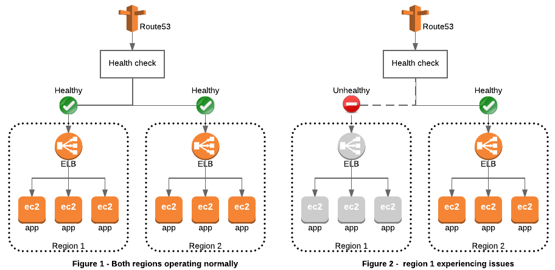
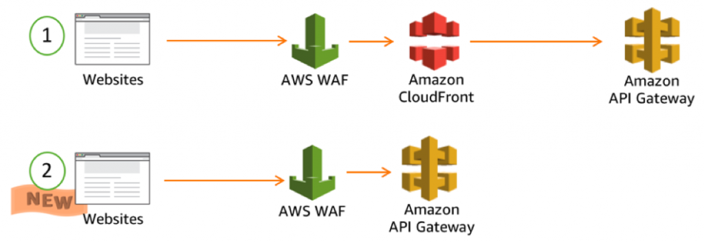
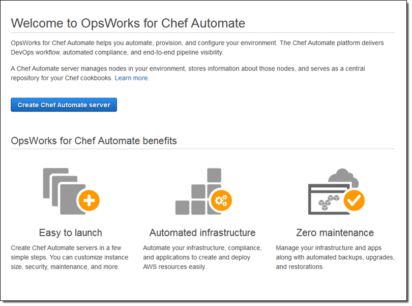
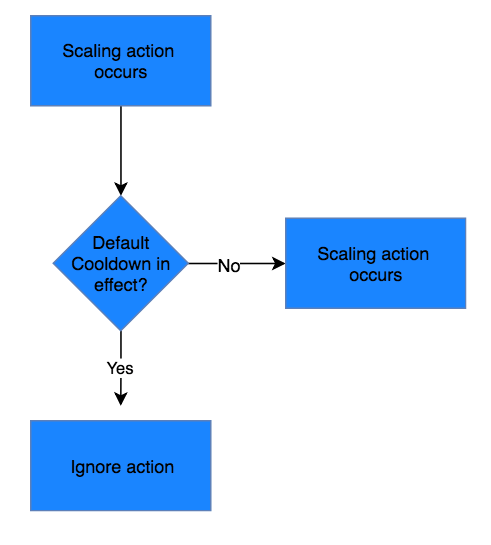
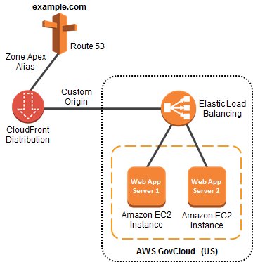
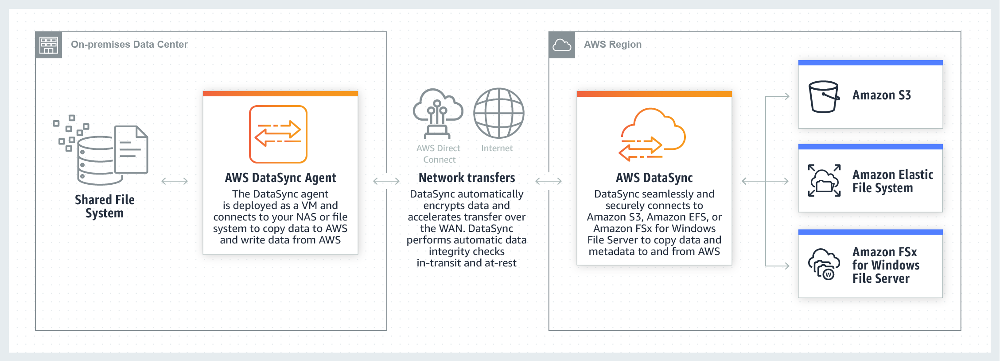
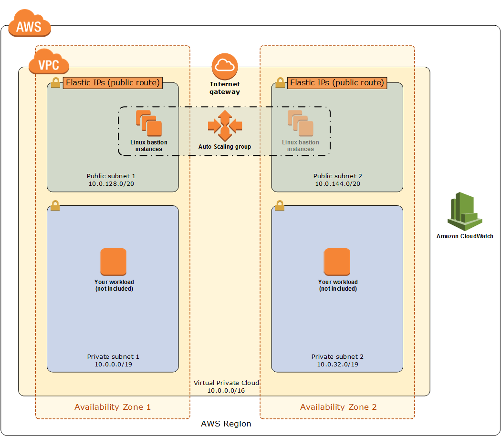
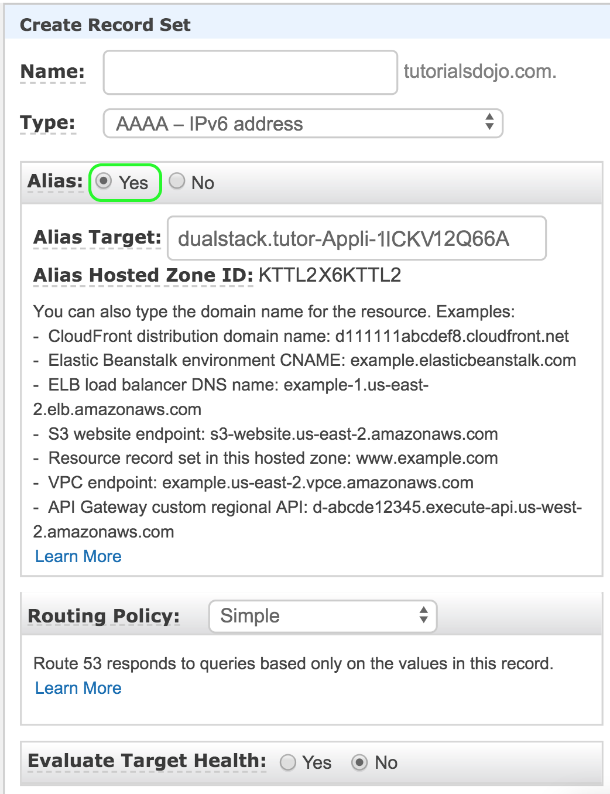
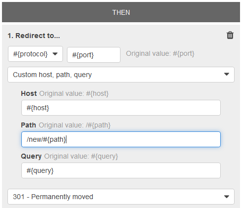

1. ##### 1. QUESTION

   A company has a dynamic web app written in MEAN stack that is going to be launched in the next month. There is a probability that the traffic will be quite high in the first couple of weeks. In the event of a load failure, how can you set up DNS failover to a static website?

   

   - Duplicate the exact application architecture in another region and configure DNS weight-based routing.
   - Enable failover to an application hosted in an on-premises data center.
   - Use Route 53 with the failover option to a static S3 website bucket or CloudFront distribution.
   - Add more servers in case the application fails.

   

   **Correct**

   

   For this scenario, ***\*using Route 53 with the failover option to a static S3 website bucket or CloudFront distribution\**** is correct. You can create a new Route 53 with the failover option to a static S3 website bucket or CloudFront distribution as an alternative.

   

   ***\*Duplicating the exact application architecture in another region and configuring DNS weight-based routing\**** is incorrect because running a duplicate system is not a cost-effective solution. Remember that you are trying to build a failover mechanism for your web app, not a distributed setup.

   ***\*Enabling failover to an application hosted in an on-premises data center\**** is incorrect. Although you can set up failover to your on-premises data center, you are not maximizing the AWS environment such as using Route 53 failover.

   ***\*Adding more servers in case the application fails\**** is incorrect because this is not the best way to handle a failover event. If you add more servers only in case the application fails, then there would be a period of downtime in which your application is unavailable. Since there are no running servers on that period, your application will be unavailable for a certain period of time until your new server is up and running.

    

   **Reference:**

   https://aws.amazon.com/premiumsupport/knowledge-center/fail-over-s3-r53/

   http://docs.aws.amazon.com/Route53/latest/DeveloperGuide/dns-failover.html

    

   **Check out this Amazon Route 53 Cheat Sheet:**

   https://tutorialsdojo.com/amazon-route-53/

   

   

2. ##### 2. QUESTION

   A company has an enterprise web application hosted on Amazon ECS Docker containers that use an Amazon FSx for Lustre filesystem for its high-performance computing workloads. A warm standby environment is running in another AWS region for disaster recovery. A Solutions Architect was assigned to design a system that will automatically route the live traffic to the disaster recovery (DR) environment only in the event that the primary application stack experiences an outage.

   What should the Architect do to satisfy this requirement?

   

   - Set up a CloudWatch Alarm to monitor the primary Route 53 DNS endpoint and create a custom Lambda function. Execute the `ChangeResourceRecordSets` API call using the function to initiate the failover to the secondary DNS record.
   - Set up a failover routing policy configuration in Route 53 by adding a health check on the primary service endpoint. Configure Route 53 to direct the DNS queries to the secondary record when the primary resource is unhealthy. Configure the network access control list and the route table to allow Route 53 to send requests to the endpoints specified in the health checks. Enable the `Evaluate Target Health` option by setting it to `Yes`.
   - Set up a CloudWatch Events rule to monitor the primary Route 53 DNS endpoint and create a custom Lambda function. Execute the `ChangeResourceRecordSets` API call using the function to initiate the failover to the secondary DNS record.
   - Set up a Weighted routing policy configuration in Route 53 by adding health checks on both the primary stack and the DR environment. Configure the network access control list and the route table to allow Route 53 to send requests to the endpoints specified in the health checks. Enable the `Evaluate Target Health` option by setting it to `Yes`.

   

   **Correct**

   

   Use an active-passive failover configuration when you want a primary resource or group of resources to be available majority of the time and you want a secondary resource or group of resources to be on standby in case all the primary resources become unavailable. When responding to queries, Route 53 includes only the healthy primary resources. If all the primary resources are unhealthy, Route 53 begins to include only the healthy secondary resources in response to DNS queries.

   To create an active-passive failover configuration with one primary record and one secondary record, you just create the records and specify **Failover** for the routing policy. When the primary resource is healthy, Route 53 responds to DNS queries using the primary record. When the primary resource is unhealthy, Route 53 responds to DNS queries using the secondary record.

   You can configure a health check that monitors an endpoint that you specify either by IP address or by domain name. At regular intervals that you specify, Route 53 submits automated requests over the Internet to your application, server, or other resource to verify that it’s reachable, available, and functional. Optionally, you can configure the health check to make requests similar to those that your users make, such as requesting a web page from a specific URL.

   

   When Route 53 checks the health of an endpoint, it sends an HTTP, HTTPS, or TCP request to the IP address and port that you specified when you created the health check. For a health check to succeed, your router and firewall rules must allow inbound traffic from the IP addresses that the Route 53 health checkers use.

   Hence, the correct answer is: ***\*Set up a failover routing policy configuration in Route 53 by adding a health check on the primary service endpoint. Configure Route 53 to direct the DNS queries to the secondary record when the primary resource is unhealthy. Configure the network access control list and the route table to allow Route 53 to send requests to the endpoints specified in the health checks. Enable the \*`Evaluate Target Health`\* option by setting it to \*`Yes.`\*\****

   The option that says: ***\*Set up a Weighted routing policy configuration in Route 53 by adding health checks on both the primary stack and the DR environment. Configure the network access control list and the route table to allow Route 53 to send requests to the endpoints specified in the health checks. Enable the `Evaluate Target Health` option by setting it to \*`Yes`\*\**** is incorrect because Weighted routing simply lets you associate multiple resources with a single domain name (tutorialsdojo.com) or subdomain name (blog.tutorialsdojo.com) and choose how much traffic is routed to each resource. This can be useful for a variety of purposes, including load balancing and testing new versions of software, but not for a failover configuration. Remember that the scenario says that the solution should automatically route the live traffic to the disaster recovery (DR) environment only in the event that the primary application stack experiences an outage. This configuration is incorrectly distributing the traffic on both the primary and DR environment.

   The option that says: ***\*Set up a CloudWatch Alarm to monitor the primary Route 53 DNS endpoint and create a custom Lambda function. Execute the `ChangeResourceRecordSets` API call using the function to initiate the failover to the secondary DNS record\**** is incorrect because setting up a CloudWatch Alarm and using the Route 53 API is not applicable nor useful at all in this scenario. Remember that CloudWatch Alam is primarily used for monitoring CloudWatch metrics. You have to use a Failover routing policy instead.

   The option that says: ***\*Set up a CloudWatch Events rule to monitor the primary Route 53 DNS endpoint and create a custom Lambda function. Execute the`ChangeResourceRecordSets` API call using the function to initiate the failover to the secondary DNS record\**** is incorrect because the Amazon CloudWatch Events service is commonly used to deliver a near real-time stream of system events that describe changes in **some** Amazon Web Services (AWS) resources. There is no direct way for CloudWatch Events to monitor the status of your Route 53 endpoints. You have to configure a health check and a failover configuration in Route 53 instead to satisfy the requirement in this scenario.

    

   **References:**

   https://docs.aws.amazon.com/Route53/latest/DeveloperGuide/dns-failover-types.html

   https://docs.aws.amazon.com/Route53/latest/DeveloperGuide/health-checks-types.html

   https://docs.aws.amazon.com/Route53/latest/DeveloperGuide/dns-failover-router-firewall-rules.html

    

   **Check out this Amazon Route 53 Cheat Sheet:**

   https://tutorialsdojo.com/amazon-route-53/

   

   

3. ##### 3. QUESTION

   A company has two On-Demand EC2 instances inside the Virtual Private Cloud in the same Availability Zone but are deployed to different subnets. One EC2 instance is running a database and the other EC2 instance a web application that connects with the database. You need to ensure that these two instances can communicate with each other for the system to work properly.

   What are the things you have to check so that these EC2 instances can communicate inside the VPC? (Select TWO.)

   

   - Check if the default route is set to a NAT instance or Internet Gateway (IGW) for them to communicate.
   - Check if all security groups are set to allow the application host to communicate to the database on the right port and protocol.
   - Check if both instances are the same instance class.
   - Check the Network ACL if it allows communication between the two subnets.
   - Ensure that the EC2 instances are in the same Placement Group.

   

   **Correct**

   

   First, the Network ACL should be properly set to allow communication between the two subnets. The security group should also be properly configured so that your web server can communicate with the database server.

   

   Hence, these are the correct answers:

   1. ***\*Check if all security groups are set to allow the application host to communicate to the database on the right port and protocol.\****
   2. ***\*Check the Network ACL if it allows communication between the two subnets.\****

   The option that says: ***\*Check if both instances are the same instance class\**** is incorrect because the EC2 instances do not need to be of the same class in order to communicate with each other.

   The option that says: ***\*Check if the default route is set to a NAT instance or Internet Gateway (IGW) for them to communicate\**** is incorrect because an Internet gateway is primarily used to communicate to the Internet.

   The option that says: ***\*Ensure that the EC2 instances are in the same Placement Group\**** is incorrect because Placement Group is mainly used to provide low-latency network performance necessary for tightly-coupled node-to-node communication.

    

   **Reference:** 

   http://docs.aws.amazon.com/AmazonVPC/latest/UserGuide/VPC_Subnets.html

    

   **Check out this Amazon VPC Cheat Sheet:**

   https://tutorialsdojo.com/amazon-vpc/

    

   ***\*Tutorials Dojo’s AWS Certified Solutions Architect Associate Exam Study Guide:\****

   **https://tutorialsdojo.com/aws-certified-solutions-architect-associate/**

   

   

4. ##### 4. QUESTION

   A company is hosting its web application in an Auto Scaling group of EC2 instances behind an Application Load Balancer. Recently, the Solutions Architect identified a series of SQL injection attempts and cross-site scripting attacks to the application, which had adversely affected their production data.

   Which of the following should the Architect implement to mitigate this kind of attack?

   

   - Use Amazon GuardDuty to prevent any further SQL injection and cross-site scripting attacks in your application.
   - Set up security rules that block SQL injection and cross-site scripting attacks in AWS Web Application Firewall (WAF). Associate the rules to the Application Load Balancer.
   - Using AWS Firewall Manager, set up security rules that block SQL injection and cross-site scripting attacks. Associate the rules to the Application Load Balancer.
   - Block all the IP addresses where the SQL injection and cross-site scripting attacks originated using the Network Access Control List.

   

   **Incorrect**

   

   **AWS WAF** is a web application firewall that lets you monitor the HTTP and HTTPS requests that are forwarded to an Amazon API Gateway API, Amazon CloudFront or an Application Load Balancer. AWS WAF also lets you control access to your content. Based on conditions that you specify, such as the IP addresses that requests originate from or the values of query strings, API Gateway, CloudFront or an Application Load Balancer responds to requests either with the requested content or with an HTTP 403 status code (Forbidden). You also can configure CloudFront to return a custom error page when a request is blocked.

   

   At the simplest level, AWS WAF lets you choose one of the following behaviors:

   **Allow all requests except the ones that you specify** – This is useful when you want CloudFront or an Application Load Balancer to serve content for a public website, but you also want to block requests from attackers.

   **Block all requests except the ones that you specify** – This is useful when you want to serve content for a restricted website whose users are readily identifiable by properties in web requests, such as the IP addresses that they use to browse to the website.

   **Count the requests that match the properties that you specify** – When you want to allow or block requests based on new properties in web requests, you first can configure AWS WAF to count the requests that match those properties without allowing or blocking those requests. This lets you confirm that you didn’t accidentally configure AWS WAF to block all the traffic to your website. When you’re confident that you specified the correct properties, you can change the behavior to allow or block requests.

   Hence, the correct answer in this scenario is: ***\*Set up security rules that block SQL injection and cross-site scripting attacks in AWS Web Application Firewall (WAF). Associate the rules to the Application Load Balancer.\****

   ***\*Using Amazon GuardDuty to prevent any further SQL injection and cross-site scripting attacks in your application\**** is incorrect because Amazon GuardDuty is just a threat detection service that continuously monitors for malicious activity and unauthorized behavior to protect your AWS accounts and workloads.

   ***\*Using AWS Firewall Manager to set up security rules that block SQL injection and cross-site scripting attacks, then associating the rules to the Application Load Balancer\**** is incorrect because AWS Firewall Manager just simplifies your AWS WAF and AWS Shield Advanced administration and maintenance tasks across multiple accounts and resources.

   ***\*Blocking all the IP addresses where the SQL injection and cross-site scripting attacks originated using the Network Access Control List\**** is incorrect because this is an optional layer of security for your VPC that acts as a firewall for controlling traffic in and out of one or more subnets. NACLs are not effective in blocking SQL injection and cross-site scripting attacks

    

   **References:**

   https://aws.amazon.com/waf/

   https://docs.aws.amazon.com/waf/latest/developerguide/what-is-aws-waf.html

    

   **Check out this AWS WAF Cheat Sheet:**

   https://tutorialsdojo.com/aws-waf/

    

   ***\*AWS Security Services Overview – WAF, Shield, CloudHSM, KMS:\****

   

   <iframe title="YouTube video player" src="https://www.youtube.com/embed/-1S-RdeAmMo" frameborder="0" allowfullscreen="allowfullscreen" name="fitvid0" style="box-sizing: border-box; margin: 0px; position: absolute; top: 0px; left: 0px; width: 1137.5px; height: 639.844px;"></iframe>

   

   

   

5. ##### 5. QUESTION

   A Solutions Architect created a new Standard-class S3 bucket to store financial reports that are not frequently accessed but should immediately be available when an auditor requests them. To save costs, the Architect changed the storage class of the S3 bucket from Standard to Infrequent Access storage class.

   In Amazon S3 Standard – Infrequent Access storage class, which of the following statements are true? (Select TWO.)

   

   - It is designed for data that requires rapid access when needed.
   - It automatically moves data to the most cost-effective access tier without any operational overhead.
   - Ideal to use for data archiving.
   - It provides high latency and low throughput performance.
   - It is designed for data that is accessed less frequently.

   

   **Correct**

   

   **Amazon S3 Standard – Infrequent Access (Standard – IA)** is an Amazon S3 storage class for data that is accessed less frequently, but requires rapid access when needed. Standard – IA offers the high durability, throughput, and low latency of Amazon S3 Standard, with a low per GB storage price and per GB retrieval fee.

   

   This combination of low cost and high performance make Standard – IA ideal for long-term storage, backups, and as a data store for disaster recovery. The Standard – IA storage class is set at the object level and can exist in the same bucket as Standard, allowing you to use lifecycle policies to automatically transition objects between storage classes without any application changes.

   **Key Features:**

   – Same low latency and high throughput performance of Standard

   – Designed for durability of 99.999999999% of objects

   – Designed for 99.9% availability over a given year

   – Backed with the Amazon S3 Service Level Agreement for availability

   – Supports SSL encryption of data in transit and at rest

   – Lifecycle management for automatic migration of objects

   Hence, the correct answers are:

   – ***\*It is designed for data that is accessed less frequently.\****

   – ***\*It is designed for data that requires rapid access when needed.\****

   The option that says: ***\*It automatically moves data to the most cost-effective access tier without any operational overhead\**** is incorrect as it actually refers to Amazon S3 – Intelligent Tiering, which is the only cloud storage class that delivers automatic cost savings by moving objects between different access tiers when access patterns change.

   The option that says: ***\*It provides high latency and low throughput performance\**** is incorrect as it should be “low latency” and “high throughput” instead. S3 automatically scales performance to meet user demands.

   The option that says: ***\*Ideal to use for data archiving\**** is incorrect because this statement refers to Amazon S3 Glacier. Glacier is a secure, durable, and extremely low-cost cloud storage service for data archiving and long-term backup.

    

   **References:**

   https://aws.amazon.com/s3/storage-classes/

   https://aws.amazon.com/s3/faqs

    

   **Check out this Amazon S3 Cheat Sheet:**

   https://tutorialsdojo.com/amazon-s3/

   

   

6. ##### 6. QUESTION

   A Solutions Architect is working for a company that uses Chef Configuration management in their data center. She needs to leverage their existing Chef recipes in AWS.

   Which of the following services should she use?

   

   - AWS CloudFormation
   - Amazon Simple Workflow Service
   - AWS Elastic Beanstalk
   - AWS OpsWorks

   

   **Correct**

   

   **AWS OpsWorks** is a configuration management service that provides managed instances of Chef and Puppet. Chef and Puppet are automation platforms that allow you to use code to automate the configurations of your servers. OpsWorks lets you use Chef and Puppet to automate how servers are configured, deployed, and managed across your Amazon EC2 instances or on-premises compute environments. OpsWorks has three offerings – AWS Opsworks for Chef Automate, AWS OpsWorks for Puppet Enterprise, and AWS OpsWorks Stacks.

   

   ***\*Amazon Simple Workflow Service\**** is incorrect because AWS SWF is a fully-managed state tracker and task coordinator in the Cloud. It does not let you leverage Chef recipes.

   ***\*AWS Elastic Beanstalk\**** is incorrect because this handles an application’s deployment details of capacity provisioning, load balancing, auto-scaling, and application health monitoring. It does not let you leverage Chef recipes just like Amazon SWF.

   ***\*AWS CloudFormation\**** is incorrect because this is a service that lets you create a collection of related AWS resources and provision them in a predictable fashion using infrastructure as code. It does not let you leverage Chef recipes just like Amazon SWF and AWS Elastic Beanstalk.

    

   **Reference:** 

   https://aws.amazon.com/opsworks/

    

   **Check out this AWS OpsWorks Cheat Sheet:**

   https://tutorialsdojo.com/aws-opsworks/

    

   **Elastic Beanstalk vs  CloudFormation vs OpsWorks vs CodeDeploy:**

   https://tutorialsdojo.com/elastic-beanstalk-vs-cloudformation-vs-opsworks-vs-codedeploy/

    

   **Comparison of AWS Services Cheat Sheets:**

   https://tutorialsdojo.com/comparison-of-aws-services/

   

   

7. ##### 7. QUESTION

   A Solutions Architect of a multinational gaming company develops video games for PS4, Xbox One, and Nintendo Switch consoles, plus a number of mobile games for Android and iOS. Due to the wide range of their products and services, the architect proposed that they use API Gateway.

   What are the key features of API Gateway that the architect can tell to the client? (Select TWO.)

   

   - Enables you to run applications requiring high levels of inter-node communications at scale on AWS through its custom-built operating system (OS) bypass hardware interface.
   - You pay only for the API calls you receive and the amount of data transferred out.
   - Enables you to build RESTful APIs and WebSocket APIs that are optimized for serverless workloads.
   - Provides you with static anycast IP addresses that serve as a fixed entry point to your applications hosted in one or more AWS Regions.
   - It automatically provides a query language for your APIs similar to GraphQL.

   

   **Correct**

   

   **Amazon API Gateway** is a fully managed service that makes it easy for developers to create, publish, maintain, monitor, and secure APIs at any scale. With a few clicks in the AWS Management Console, you can create an API that acts as a “front door” for applications to access data, business logic, or functionality from your back-end services, such as workloads running on Amazon Elastic Compute Cloud (Amazon EC2), code running on AWS Lambda, or any web application. Since it can use AWS Lambda, you can run your APIs without servers.

   

   Amazon API Gateway handles all the tasks involved in accepting and processing up to hundreds of thousands of concurrent API calls, including traffic management, authorization and access control, monitoring, and API version management. Amazon API Gateway has no minimum fees or startup costs. You pay only for the API calls you receive and the amount of data transferred out.

   Hence, the correct answers are:

     ***\*– Enables you to build RESTful APIs and WebSocket APIs that are optimized for serverless workloads\****

     ***\*– You pay only for the API calls you receive and the amount of data transferred out.\****

   The option that says: ***\*It automatically provides a query language for your APIs similar to GraphQL\**** is incorrect because this is not provided by API Gateway.

   The option that says: ***\*Provides you with static anycast IP addresses that serve as a fixed entry point to your applications hosted in one or more AWS Regions\**** is incorrect because this is a capability of AWS Global Accelerator and not API Gateway.

   The option that says: ***\*Enables you to run applications requiring high levels of inter-node communications at scale on AWS through its custom-built operating system (OS) bypass hardware interface\**** is incorrect because this is a capability of Elastic Fabric Adapter and not API Gateway.

    

   **References:**

   https://aws.amazon.com/api-gateway/

   https://aws.amazon.com/api-gateway/features/

    

   **Check out this Amazon API Gateway Cheat Sheet:**

   https://tutorialsdojo.com/amazon-api-gateway/

    

   ***\*Tutorials Dojo’s AWS Certified Solutions Architect Associate Exam Study Guide:\****

   **https://tutorialsdojo.com/aws-certified-solutions-architect-associate/**

   

   

8. ##### 8. QUESTION

   As part of the Business Continuity Plan of your company, your IT Director instructed you to set up an automated backup of all of the EBS Volumes for your EC2 instances as soon as possible.

   What is the fastest and most cost-effective solution to automatically back up all of your EBS Volumes?

   

   - Use Amazon Data Lifecycle Manager (Amazon DLM) to automate the creation of EBS snapshots.
   - Set your Amazon Storage Gateway with EBS volumes as the data source and store the backups in your on-premises servers through the storage gateway.
   - Use an EBS-cycle policy in Amazon S3 to automatically back up the EBS volumes.
   - For an automated solution, create a scheduled job that calls the "create-snapshot" command via the AWS CLI to take a snapshot of production EBS volumes periodically.

   

   **Correct**

   

   You can use Amazon Data Lifecycle Manager (Amazon DLM) to automate the creation, retention, and deletion of snapshots taken to back up your Amazon EBS volumes. Automating snapshot management helps you to:

   – Protect valuable data by enforcing a regular backup schedule.

   – Retain backups as required by auditors or internal compliance.

   – Reduce storage costs by deleting outdated backups.

   Combined with the monitoring features of Amazon CloudWatch Events and AWS CloudTrail, Amazon DLM provides a complete backup solution for EBS volumes at no additional cost.

   Hence, ***\*using Amazon Data Lifecycle Manager (Amazon DLM) to automate the creation of EBS snapshots\**** is the correct answer as it is the fastest and most cost-effective solution that provides an automated way of backing up your EBS volumes.

   The option that says: ***\*For an automated solution, create a scheduled job that calls the “create-snapshot” command via the AWS CLI to take a snapshot of production EBS volumes periodically\**** is incorrect because even though this is a valid solution, you would still need additional time to create a scheduled job that calls the “create-snapshot” command. It would be better to use Amazon Data Lifecycle Manager (Amazon DLM) instead as this provides you the fastest solution which enables you to automate the creation, retention, and deletion of the EBS snapshots without having to write custom shell scripts or creating scheduled jobs.

   ***\*Setting your Amazon Storage Gateway with EBS volumes as the data source and storing the backups in your on-premises servers through the storage gateway\**** is incorrect as the Amazon Storage Gateway is used only for creating a backup of data from your on-premises server and not from the Amazon Virtual Private Cloud.

   ***\*Using an EBS-cycle policy in Amazon S3 to automatically back up the EBS volumes\**** is incorrect as there is no such thing as EBS-cycle policy in Amazon S3.

    

   **References:**

   https://docs.aws.amazon.com/AWSEC2/latest/UserGuide/snapshot-lifecycle.html

   http://docs.aws.amazon.com/AWSEC2/latest/UserGuide/ebs-creating-snapshot.html

    

   **Check out this Amazon EBS Cheat Sheet:**

   https://tutorialsdojo.com/amazon-ebs/

    

   **Amazon EBS Overview – SSD vs HDD:**

   

   <iframe title="YouTube video player" src="https://www.youtube.com/embed/LW7x8wyLFvw" frameborder="0" allowfullscreen="allowfullscreen" name="fitvid1" style="box-sizing: border-box; margin: 0px; position: absolute; top: 0px; left: 0px; width: 1137.5px; height: 639.844px;"></iframe>

   

   

   

9. ##### 9. QUESTION

   A company developed a web application and deployed it on a fleet of EC2 instances that uses Amazon SQS. The requests are saved as messages in the SQS queue, which is configured with the maximum message retention period. However, after thirteen days of operation, the web application suddenly crashed and there are 10,000 unprocessed messages that are still waiting in the queue. Since they developed the application, they can easily resolve the issue but they need to send a communication to the users on the issue.

   What information should they provide and what will happen to the unprocessed messages?

   

   - Tell the users that unfortunately, they have to resubmit all of the requests since the queue would not be able to process the 10,000 messages together.
   - Tell the users that the application will be operational shortly, however, requests sent over three days ago will need to be resubmitted.
   - Tell the users that the application will be operational shortly and all received requests will be processed after the web application is restarted.
   - Tell the users that unfortunately, they have to resubmit all the requests again.

   

   **Correct**

   

   In **Amazon SQS**, you can configure the message retention period to a value from 1 minute to 14 days. The default is 4 days. Once the message retention limit is reached, your messages are automatically deleted.

   A single Amazon SQS message queue can contain an unlimited number of messages. However, there is a 120,000 limit for the number of inflight messages for a standard queue and 20,000 for a FIFO queue. Messages are inflight after they have been received from the queue by a consuming component, but have not yet been deleted from the queue.

   In this scenario, it is stated that the SQS queue is configured with the maximum message retention period. The maximum message retention in SQS is 14 days that is why the option that says: ***\*Tell the users that the application will be operational shortly and all received requests will be processed after the web application is restarted\**** is the correct answer i.e. there will be no missing messages.

   The options that say: ***\*Tell the users that unfortunately, they have to resubmit all the requests again\**** and ***\*Tell the users that the application will be operational shortly, however, requests sent over three days ago will need to be resubmitted\**** are incorrect as there are no missing messages in the queue thus, there is no need to resubmit any previous requests.

   The option that says: ***\*Tell the users that unfortunately, they have to resubmit all of the requests since the queue would not be able to process the 10,000 messages together\**** is incorrect as the queue can contain an unlimited number of messages, not just 10,000 messages.

    

   **Reference:**

   https://aws.amazon.com/sqs/

    

   **Check out this Amazon SQS Cheat Sheet:**

   https://tutorialsdojo.com/amazon-sqs/

   

   

10. ##### 10. QUESTION

    A company plans to migrate all of their applications to AWS. The Solutions Architect suggested to store all the data to EBS volumes. The Chief Technical Officer is worried that EBS volumes are not appropriate for the existing workloads due to compliance requirements, downtime scenarios, and IOPS performance.

    Which of the following are valid points in proving that EBS is the best service to use for migration? (Select TWO.)

    

    - Amazon EBS provides the ability to create snapshots (backups) of any EBS volume and write a copy of the data in the volume to Amazon RDS, where it is stored redundantly in multiple Availability Zones
    - When you create an EBS volume in an Availability Zone, it is automatically replicated on a separate AWS region to prevent data loss due to a failure of any single hardware component.
    - EBS volumes can be attached to any EC2 Instance in any Availability Zone.
    - An EBS volume is off-instance storage that can persist independently from the life of an instance.
    - EBS volumes support live configuration changes while in production which means that you can modify the volume type, volume size, and IOPS capacity without service interruptions.

    

    **Incorrect**

    

    An Amazon EBS volume is a durable, block-level storage device that you can attach to a single EC2 instance. You can use EBS volumes as primary storage for data that requires frequent updates, such as the system drive for an instance or storage for a database application. You can also use them for throughput-intensive applications that perform continuous disk scans. EBS volumes persist independently from the running life of an EC2 instance.

    Here is a list of important information about EBS Volumes:

    – When you create an EBS volume in an Availability Zone, it is automatically replicated within that zone to prevent data loss due to a failure of any single hardware component.

    – After you create a volume, you can attach it to any EC2 instance in the same Availability Zone

    – Amazon EBS Multi-Attach enables you to attach a single Provisioned IOPS SSD (io1) volume to multiple Nitro-based instances that are in the same Availability Zone. However, other EBS types are not supported.

    – An EBS volume is off-instance storage that can persist independently from the life of an instance. You can specify not to terminate the EBS volume when you terminate the EC2 instance during instance creation.

    – EBS volumes support live configuration changes while in production which means that you can modify the volume type, volume size, and IOPS capacity without service interruptions.

    – Amazon EBS encryption uses 256-bit Advanced Encryption Standard algorithms (AES-256)

    – EBS Volumes offer 99.999% SLA.

    The option that says: ***\*When you create an EBS volume in an Availability Zone, it is automatically replicated on a separate AWS region to prevent data loss due to a failure of any single hardware component\**** is incorrect because when you create an EBS volume in an Availability Zone, it is automatically replicated within that zone only, and not on a separate AWS region, to prevent data loss due to a failure of any single hardware component.

    The option that says: ***\*EBS volumes can be attached to any EC2 Instance in any Availability Zone\**** is incorrect as EBS volumes can only be attached to an EC2 instance in the same Availability Zone.

    The option that says: ***\*Amazon EBS provides the ability to create snapshots (backups) of any EBS volume and write a copy of the data in the volume to Amazon RDS, where it is stored redundantly in multiple Availability Zones\**** is almost correct. But instead of storing the volume to Amazon RDS, the EBS Volume snapshots are actually sent to Amazon S3.

     

    **References:**

    http://docs.aws.amazon.com/AWSEC2/latest/UserGuide/EBSVolumes.html

    https://aws.amazon.com/ebs/features/

     

    **Check out this Amazon EBS Cheat Sheet:**

    **https://tutorialsdojo.com/aws-cheat-sheet-amazon-ebs/**

     

    **Here is a short video tutorial on EBS:**

    

    <iframe src="https://www.youtube.com/embed/ljYH5lHQdxo" frameborder="0" allowfullscreen="allowfullscreen" name="fitvid2" style="box-sizing: border-box; margin: 0px; position: absolute; top: 0px; left: 0px; width: 1137.5px; height: 639.844px;"></iframe>

    

    

    

11. ##### 11. QUESTION

    A media company hosts large volumes of archive data that are about 250 TB in size on their internal servers. They have decided to move these data to S3 because of its durability and redundancy. The company currently has a 100 Mbps dedicated line connecting their head office to the Internet.

    Which of the following is the FASTEST and the MOST cost-effective way to import all these data to Amazon S3?

    

    - Upload it directly to S3
    - Establish an AWS Direct Connect connection then transfer the data over to S3.
    - Use AWS Snowmobile to transfer the data over to S3.
    - Order multiple AWS Snowball devices to upload the files to Amazon S3.

    

    **Correct**

    

    AWS Snowball is a petabyte-scale data transport solution that uses secure appliances to transfer large amounts of data into and out of the AWS cloud. Using Snowball addresses common challenges with large-scale data transfers including high network costs, long transfer times, and security concerns. Transferring data with Snowball is simple, fast, secure, and can be as little as one-fifth the cost of high-speed Internet.

    

    Snowball is a strong choice for data transfer if you need to more securely and quickly transfer terabytes to many petabytes of data to AWS. Snowball can also be the right choice if you don’t want to make expensive upgrades to your network infrastructure, if you frequently experience large backlogs of data, if you’re located in a physically isolated environment, or if you’re in an area where high-speed Internet connections are not available or cost-prohibitive.

    As a rule of thumb, if it takes more than one week to upload your data to AWS using the spare capacity of your existing Internet connection, then you should consider using Snowball. For example, if you have a 100 Mb connection that you can solely dedicate to transferring your data and need to transfer 100 TB of data, it takes more than 100 days to complete data transfer over that connection. You can make the same transfer by using multiple Snowballs in about a week.

     

    

     

    Hence, ***\*ordering multiple AWS Snowball devices to upload the files to Amazon S3\**** is the correct answer.

    ***\*Uploading it directly to S3\**** is incorrect since this would take too long to finish due to the slow Internet connection of the company.

    ***\*Establishing an AWS Direct Connect connection then transferring the data over to S3\**** is incorrect since provisioning a line for Direct Connect would take too much time and might not give you the fastest data transfer solution. In addition, the scenario didn’t warrant an establishment of a dedicated connection from your on-premises data center to AWS. The primary goal is to just do a one-time migration of data to AWS which can be accomplished by using AWS Snowball devices.

    ***\*Using AWS Snowmobile to transfer the data over to S3\**** is incorrect because Snowmobile is more suitable if you need to move extremely large amounts of data to AWS or need to transfer up to 100PB of data. This will be transported on a 45-foot long ruggedized shipping container, pulled by a semi-trailer truck. Take note that you only need to migrate 250 TB of data, hence, this is not the most suitable and cost-effective solution.

     

    **References:**

    https://aws.amazon.com/snowball/

    https://aws.amazon.com/snowball/faqs/

     

    **Check out this AWS Snowball Cheat Sheet:**

    https://tutorialsdojo.com/aws-snowball/

     

    **S3 Transfer Acceleration vs Direct Connect vs VPN vs Snowball vs Snowmobile:**

    https://tutorialsdojo.com/s3-transfer-acceleration-vs-direct-connect-vs-vpn-vs-snowball-vs-snowmobile/

     

    **Comparison of AWS Services Cheat Sheets:**

    https://tutorialsdojo.com/comparison-of-aws-services/

    

    

12. ##### 12. QUESTION

    A company has a requirement to move 80 TB data warehouse to the cloud. It would take 2 months to transfer the data given their current bandwidth allocation.

    Which is the most cost-effective service that would allow you to quickly upload their data into AWS?

    

    - AWS Snowmobile
    - AWS Snowball Edge
    - AWS Direct Connect
    - Amazon S3 Multipart Upload

    

    **Correct**

    

    **AWS Snowball Edge** is a type of Snowball device with on-board storage and compute power for select AWS capabilities. Snowball Edge can undertake local processing and edge-computing workloads in addition to transferring data between your local environment and the AWS Cloud.

    Each Snowball Edge device can transport data at speeds faster than the internet. This transport is done by shipping the data in the appliances through a regional carrier. The appliances are rugged shipping containers, complete with E Ink shipping labels. The AWS Snowball Edge device differs from the standard Snowball because it can bring the power of the AWS Cloud to your on-premises location, with local storage and compute functionality.

    Snowball Edge devices have three options for device configurations – storage optimized, compute optimized, and with GPU.

    Hence, the correct answer is: ***\*AWS Snowball Edge.\****

    ***\*AWS Snowmobile\**** is incorrect because this is an Exabyte-scale data transfer service used to move extremely large amounts of data to AWS. It is not suitable for transferring a small amount of data, like 80 TB in this scenario. You can transfer up to 100PB per Snowmobile, a 45-foot long ruggedized shipping container, pulled by a semi-trailer truck. A more cost-effective solution here is to order a Snowball Edge device instead.

    ***\*AWS Direct Connect\**** is incorrect because it is primarily used to establish a dedicated network connection from your premises network to AWS. This is not suitable for one-time data transfer tasks, like what is depicted in the scenario.

    ***\*Amazon S3 Multipart Upload\**** is incorrect because this feature simply enables you to upload large objects in multiple parts. It still uses the same Internet connection of the company, which means that the transfer will still take time due to its current bandwidth allocation.

     

    **References:**

    https://docs.aws.amazon.com/snowball/latest/ug/whatissnowball.html 

    https://docs.aws.amazon.com/snowball/latest/ug/device-differences.html

     

    **Check out this AWS Snowball Edge Cheat Sheet:**

    https://tutorialsdojo.com/aws-snowball-edge/

     

    ***\*AWS Snow Family Overview:\****

    

    <iframe title="YouTube video player" src="https://www.youtube.com/embed/9Ar-51Ip53Q" frameborder="0" allowfullscreen="allowfullscreen" name="fitvid3" style="box-sizing: border-box; margin: 0px; position: absolute; top: 0px; left: 0px; width: 1137.5px; height: 639.844px;"></iframe>

    

    

    

13. ##### 13. QUESTION

    A Data Engineer is working for a litigation firm for their case history application. The engineer needs to keep track of all the cases that the firm has handled. The static assets like .jpg, .png, and .pdf files are stored in S3 for cost efficiency and high durability. As these files are critical to the business, the engineer wants to keep track of what’s happening in the S3 bucket. The engineer found out that S3 has an event notification whenever a delete or write operation happens within the S3 bucket.

    What are the possible Event Notification destinations available for S3 buckets? (Select TWO.)

    

    - SES
    - Kinesis
    - SQS
    - SWF
    - Lambda function

    

    **Incorrect**

    

    The **Amazon S3 notification** feature enables you to receive notifications when certain events happen in your bucket. To enable notifications, you must first add a notification configuration identifying the events you want Amazon S3 to publish, and the destinations where you want Amazon S3 to send the event notifications.

    

    Amazon S3 supports the following destinations where it can publish events:

    **Amazon Simple Notification Service (Amazon SNS) topic –** A web service that coordinates and manages the delivery or sending of messages to subscribing endpoints or clients.

    **Amazon Simple Queue Service (Amazon SQS) queue –** Offers reliable and scalable hosted queues for storing messages as they travel between computer.

    **AWS Lambda –** AWS Lambda is a compute service where you can upload your code and the service can run the code on your behalf using the AWS infrastructure. You package up and upload your custom code to AWS Lambda when you create a Lambda function

    ***\*Kinesis\**** is incorrect because this is used to collect, process, and analyze real-time, streaming data so you can get timely insights and react quickly to new information, and not used for event notifications. You have to use SNS, SQS or Lambda.

    ***\*SES\**** is incorrect because this is mainly used for sending emails designed to help digital marketers and application developers send marketing, notification, and transactional emails, and not for sending event notifications from S3. You have to use SNS, SQS or Lambda.

    ***\*SWF\**** is incorrect because this is mainly used to build applications that use Amazon’s cloud to coordinate work across distributed components and not used as a way to trigger event notifications from S3. You have to use SNS, SQS or Lambda.

    Here’s what you need to do in order to start using this new feature with your application:

    1. Create the queue, topic, or Lambda function (which I’ll call the target for brevity) if necessary.
    2. Grant S3 permission to publish to the target or invoke the Lambda function. For SNS or SQS, you do this by applying an appropriate policy to the topic or the queue. For Lambda, you must create and supply an IAM role, then associate it with the Lambda function.
    3. Arrange for your application to be invoked in response to activity on the target. As you will see in a moment, you have several options here.
    4. Set the bucket’s Notification Configuration to point to the target.

    

     

    **Reference:** 

    https://docs.aws.amazon.com/AmazonS3/latest/dev/NotificationHowTo.html

     

    **Check out this Amazon S3 Cheat Sheet:**

    https://tutorialsdojo.com/amazon-s3/

     

    ***\*Tutorials Dojo’s AWS Certified Solutions Architect Associate Exam Study Guide:\****

    **https://tutorialsdojo.com/aws-certified-solutions-architect-associate/**

    

    

14. ##### 14. QUESTION

    A company has a cryptocurrency exchange portal that is hosted in an Auto Scaling group of EC2 instances behind an Application Load Balancer and is deployed across multiple AWS regions. The users can be found all around the globe, but the majority are from Japan and Sweden. Because of the compliance requirements in these two locations, you want the Japanese users to connect to the servers in the `ap-northeast-1` Asia Pacific (Tokyo) region, while the Swedish users should be connected to the servers in the `eu-west-1` EU (Ireland) region.

    Which of the following services would allow you to easily fulfill this requirement?

    

    - Use Route 53 Geolocation Routing policy.
    - Set up a new CloudFront web distribution with the geo-restriction feature enabled.
    - Set up an Application Load Balancers that will automatically route the traffic to the proper AWS region.
    - Use Route 53 Weighted Routing policy.

    

    **Correct**

    

    **Geolocation routing** lets you choose the resources that serve your traffic based on the geographic location of your users, meaning the location that DNS queries originate from. For example, you might want all queries from Europe to be routed to an ELB load balancer in the Frankfurt region.

    When you use geolocation routing, you can localize your content and present some or all of your website in the language of your users. You can also use geolocation routing to restrict distribution of content to only the locations in which you have distribution rights. Another possible use is for balancing load across endpoints in a predictable, easy-to-manage way, so that each user location is consistently routed to the same endpoint.

    

    ***\*Setting up an Application Load Balancers that will automatically route the traffic to the proper AWS region\**** is incorrect because Elastic Load Balancers distribute traffic among EC2 instances across multiple Availability Zones but not across AWS regions.

    ***\*Setting up a new CloudFront web distribution with the geo-restriction feature enabled\**** is incorrect because the CloudFront geo-restriction feature is primarily used to prevent users in specific geographic locations from accessing content that you’re distributing through a CloudFront web distribution. It does not let you choose the resources that serve your traffic based on the geographic location of your users, unlike the Geolocation routing policy in Route 53.

    ***\*Using Route 53 Weighted Routing policy\**** is incorrect because this is not a suitable solution to meet the requirements of this scenario. It just lets you associate multiple resources with a single domain name (tutorialsdojo.com) or subdomain name (forums.tutorialsdojo.com) and choose how much traffic is routed to each resource. You have to use a Geolocation routing policy instead.

     

    **References:**

    https://docs.aws.amazon.com/Route53/latest/DeveloperGuide/routing-policy.html

    https://aws.amazon.com/premiumsupport/knowledge-center/geolocation-routing-policy

     

    **Check out this Amazon Route 53 Cheat Sheet:**

    https://tutorialsdojo.com/amazon-route-53/

     

    **Latency Routing vs Geoproximity Routing vs Geolocation Routing:**

    https://tutorialsdojo.com/latency-routing-vs-geoproximity-routing-vs-geolocation-routing/

     

    **Comparison of AWS Services Cheat Sheets:**

    https://tutorialsdojo.com/comparison-of-aws-services/

    

    

15. ##### 15. QUESTION

    All objects uploaded to an Amazon S3 bucket must be encrypted for security compliance. The bucket will use server-side encryption with Amazon S3-Managed encryption keys (SSE-S3) to encrypt data using 256-bit Advanced Encryption Standard (AES-256) block cipher.

    Which of the following request headers must be used?

    

    - `x-amz-server-side-encryption-customer-algorithm`
    - `x-amz-server-side-encryption`
    - `x-amz-server-side-encryption-customer-key`
    - `x-amz-server-side-encryption-customer-key-MD5`

    

    **Correct**

    

    **Server-side encryption** protects data at rest. If you use Server-Side Encryption with Amazon S3-Managed Encryption Keys (SSE-S3), Amazon S3 will encrypt each object with a unique key and as an additional safeguard, it encrypts the key itself with a master key that it rotates regularly. Amazon S3 server-side encryption uses one of the strongest block ciphers available, 256-bit Advanced Encryption Standard (AES-256), to encrypt your data.

    

    If you need server-side encryption for all of the objects that are stored in a bucket, use a bucket policy. For example, the following bucket policy denies permissions to upload an object unless the request includes the **x-amz-server-side-encryption** header to request server-side encryption:

    However, if you chose to use server-side encryption with customer-provided encryption keys (SSE-C), you must provide encryption key information using the following request headers:

    - `x-amz-server-side-encryption-customer-algorithm`
    - `x-amz-server-side-encryption-customer-key`
    - `x-amz-server-side-encryption-customer-key-MD5`

    Hence, using the ***\*x-amz-server-side-encryption\**** header is correct as this is the one being used for Amazon S3-Managed Encryption Keys (SSE-S3).

    All other options are incorrect since they are used for SSE-C.

     

    **References:**

    https://docs.aws.amazon.com/AmazonS3/latest/dev/serv-side-encryption.html

    https://docs.aws.amazon.com/AmazonS3/latest/dev/UsingServerSideEncryption.html

    https://docs.aws.amazon.com/AmazonS3/latest/dev/ServerSideEncryptionCustomerKeys.html

     

    **Check out this Amazon S3 Cheat Sheet:**

    https://tutorialsdojo.com/amazon-s3/

    

    

16. ##### 16. QUESTION

    A company has a static corporate website hosted in a standard S3 bucket and a new web domain name that was registered using Route 53. You are instructed by your manager to integrate these two services in order to successfully launch their corporate website.

    What are the prerequisites when routing traffic using Amazon Route 53 to a website that is hosted in an Amazon S3 Bucket? (Select TWO.)

    

    - A registered domain name
    - The S3 bucket must be in the same region as the hosted zone
    - The S3 bucket name must be the same as the domain name
    - The record set must be of type "MX"
    - The Cross-Origin Resource Sharing (CORS) option should be enabled in the S3 bucket

    

    **Correct**

    

    Here are the prerequisites for routing traffic to a website that is hosted in an Amazon S3 Bucket:

    – An S3 bucket that is configured to host a static website. The bucket must have the same name as your domain or subdomain. For example, if you want to use the subdomain portal.tutorialsdojo.com, the name of the bucket must be portal.tutorialsdojo.com.

    – A registered domain name. You can use Route 53 as your domain registrar, or you can use a different registrar.

    – Route 53 as the DNS service for the domain. If you register your domain name by using Route 53, we automatically configure Route 53 as the DNS service for the domain.

    

    The option that says: ***\*The record set must be of type “MX”\**** is incorrect since an MX record specifies the mail server responsible for accepting email messages on behalf of a domain name. This is not what is being asked by the question.

    The option that says: ***\*The S3 bucket must be in the same region as the hosted zone\**** is incorrect. There is no constraint that the S3 bucket must be in the same region as the hosted zone in order for the Route 53 service to route traffic into it.

    The option that says: ***\*The Cross-Origin Resource Sharing (CORS) option should be enabled in the S3 bucket\**** is incorrect because you only need to enable Cross-Origin Resource Sharing (CORS) when your client web application on one domain interacts with the resources in a different domain.

     

    **Reference:**

    https://docs.aws.amazon.com/Route53/latest/DeveloperGuide/RoutingToS3Bucket.html

     

    ***\*Amazon Route 53 Overview:\****

    

    <iframe title="YouTube video player" src="https://www.youtube.com/embed/Su308t19ubY" frameborder="0" allowfullscreen="allowfullscreen" data-mce-fragment="1" name="fitvid4" style="box-sizing: border-box; margin: 0px; position: absolute; top: 0px; left: 0px; width: 1137.5px; height: 639.844px;"></iframe>

    

    **Check out this Amazon Route 53 Cheat Sheet:**

    https://tutorialsdojo.com/amazon-route-53/

    

    

17. ##### 17. QUESTION

    You have built a web application that checks for new items in an S3 bucket once every hour. If new items exist, a message is added to an SQS queue. You have a fleet of EC2 instances which retrieve messages from the SQS queue, process the file, and finally, send you and the user an email confirmation that the item has been successfully processed. Your officemate uploaded one test file to the S3 bucket and after a couple of hours, you noticed that you and your officemate have 50 emails from your application with the same message.

    Which of the following is most likely the root cause why the application has sent you and the user multiple emails?

    

    - Your application does not issue a delete command to the SQS queue after processing the message, which is why this message went back to the queue and was processed multiple times.
    - By default, SQS automatically deletes the messages that were processed by the consumers. It might be possible that your officemate has submitted the request 50 times which is why you received a lot of emails.
    - The sqsSendEmailMessage attribute of the SQS queue is configured to 50.
    - There is a bug in the application.

    

    **Correct**

    

    In this scenario, the main culprit is that your application does not issue a delete command to the SQS queue after processing the message, which is why this message went back to the queue and was processed multiple times.

    The option that says: ***\*The sqsSendEmailMessage attribute of the SQS queue is configured to 50\**** is incorrect as there is no sqsSendEmailMessage attribute in SQS.

    The option that says: ***\*There is a bug in the application\**** is a valid answer but since the scenario did not mention that the EC2 instances deleted the processed messages, the most likely cause of the problem is that the application does not issue a delete command to the SQS queue as mentioned above.

    The option that says: ***\*By default, SQS automatically deletes the messages that were processed by the consumers. It might be possible that your officemate has submitted the request 50 times which is why you received a lot of emails\**** is incorrect as SQS does not automatically delete the messages.

     

    **Reference:**

    https://aws.amazon.com/sqs/faqs/

     

    **Check out this Amazon SQS Cheat Sheet:**

    https://tutorialsdojo.com/amazon-sqs/

    

    

18. ##### 18. QUESTION

    An organization is currently using a tape backup solution to store its application data on-premises. They plan to use a cloud storage service to preserve the backup data for up to 10 years that may be accessed about once or twice a year.

    Which of the following is the most cost-effective option to implement this solution?

    

    - Use Amazon S3 to store the backup data and add a lifecycle rule to transition the current version to Amazon S3 Glacier.
    - Use AWS Storage Gateway to backup the data directly to Amazon S3 Glacier.
    - Order an AWS Snowball Edge appliance to import the backup directly to Amazon S3 Glacier.
    - Use AWS Storage Gateway to backup the data directly to Amazon S3 Glacier Deep Archive.

    

    **Incorrect**

    

    **Tape Gateway** enables you to replace using physical tapes on-premises with virtual tapes in AWS without changing existing backup workflows. Tape Gateway supports all leading backup applications and caches virtual tapes on-premises for low-latency data access. Tape Gateway encrypts data between the gateway and AWS for secure data transfer and compresses data and transitions virtual tapes between Amazon S3 and Amazon S3 Glacier, or Amazon S3 Glacier Deep Archive, to minimize storage costs.

    

    The scenario requires you to backup your application data to a cloud storage service for long-term retention of data that will be retained for 10 years. Since it uses a tape backup solution, an option that uses AWS Storage Gateway must be the possible answer. Tape Gateway can move your virtual tapes archived in Amazon S3 Glacier or Amazon S3 Glacier Deep Archive storage class, enabling you to further reduce the monthly cost to store long-term data in the cloud by up to 75%.

    Hence, the correct answer is: ***\*Use AWS Storage Gateway to backup the data directly to Amazon S3 Glacier Deep Archive\****.

    The option that says: ***\*Use AWS Storage Gateway to backup the data directly to Amazon S3 Glacier\**** is incorrect. Although this is a valid solution, moving to S3 Glacier is more expensive than directly backing it up to Glacier Deep Archive.

    The option that says: ***\*Order an AWS Snowball Edge appliance to import the backup directly to Amazon S3 Glacier\**** is incorrect because Snowball Edge can’t directly integrate backups to S3 Glacier. Moreover, you have to use the Amazon S3 Glacier Deep Archive storage class as it is more cost-effective than the regular Glacier class.

    The option that says: ***\*Use Amazon S3 to store the backup data and add a lifecycle rule to transition the current version to Amazon S3 Glacier\**** is incorrect. Although this is a possible solution, it is difficult to directly integrate a tape backup solution to S3 without using Storage Gateway.

     

    **References:**

    https://aws.amazon.com/storagegateway/faqs/

    https://aws.amazon.com/s3/storage-classes/

     

    ***\*AWS Storage Gateway Overview:\****

    

    <iframe title="YouTube video player" src="https://www.youtube.com/embed/pNb7xOBJjHE" frameborder="0" allowfullscreen="allowfullscreen" data-mce-fragment="1" name="fitvid5" style="box-sizing: border-box; margin: 0px; position: absolute; top: 0px; left: 0px; width: 1137.5px; height: 639.844px;"></iframe>

    

    **Check out this AWS Storage Gateway Cheat Sheet:**

    https://tutorialsdojo.com/aws-storage-gateway/

    

    

19. ##### 19. QUESTION

    An insurance company plans to implement a message filtering feature in their web application. To implement this solution, they need to create separate Amazon SQS queues for each type of quote request. The entire message processing should not exceed 24 hours.

    As the Solutions Architect of the company, which of the following should you do to meet the above requirement?

    

    - Create a data stream in Amazon Kinesis Data Streams. Use the Amazon Kinesis Client Library to deliver all the records to the designated SQS queues based on the quote request type.
    - Create multiple Amazon SNS topics and configure the Amazon SQS queues to subscribe to the SNS topics. Publish the message to the designated SQS queue based on the quote request type.
    - Create one Amazon SNS topic and configure the Amazon SQS queues to subscribe to the SNS topic. Publish the same messages to all SQS queues. Filter the messages in each queue based on the quote request type.
    - Create one Amazon SNS topic and configure the Amazon SQS queues to subscribe to the SNS topic. Set the filter policies in the SNS subscriptions to publish the message to the designated SQS queue based on its quote request type.

    

    **Correct**

    

    **Amazon SNS** is a fully managed pub/sub messaging service. With Amazon SNS, you can use topics to simultaneously distribute messages to multiple subscribing endpoints such as Amazon SQS queues, AWS Lambda functions, HTTP endpoints, email addresses, and mobile devices (SMS, Push).

    **Amazon SQS** is a message queue service used by distributed applications to exchange messages through a polling model. It can be used to decouple sending and receiving components without requiring each component to be concurrently available.

    A fanout scenario occurs when a message published to an SNS topic is replicated and pushed to multiple endpoints, such as Amazon SQS queues, HTTP(S) endpoints, and Lambda functions. This allows for parallel asynchronous processing.

    

    For example, you can develop an application that publishes a message to an SNS topic whenever an order is placed for a product. Then, two or more SQS queues that are subscribed to the SNS topic receive identical notifications for the new order. An Amazon Elastic Compute Cloud (Amazon EC2) server instance attached to one of the SQS queues can handle the processing or fulfillment of the order. And you can attach another Amazon EC2 server instance to a data warehouse for analysis of all orders received.

    By default, an Amazon SNS topic subscriber receives every message published to the topic. You can use Amazon SNS message filtering to assign a filter policy to the topic subscription, and the subscriber will only receive a message that they are interested in. Using Amazon SNS and Amazon SQS together, messages can be delivered to applications that require immediate notification of an event. This method is known as fanout to Amazon SQS queues.

    Hence, the correct answer is: ***\*Create one Amazon SNS topic and configure the Amazon SQS queues to subscribe to the SNS topic. Set the filter policies in the SNS subscriptions to publish the message to the designated SQS queue based on its quote request type.\****

    The option that says: ***\*Create one Amazon SNS topic and configure the Amazon SQS queues to subscribe to the SNS topic. Publish the same messages to all SQS queues. Filter the messages in each queue based on the quote request type\**** is incorrect because this option will distribute the same messages on all SQS queues instead of its designated queue. You need to fan-out the messages to multiple SQS queues using a filter policy in Amazon SNS subscriptions to allow parallel asynchronous processing. By doing so, the entire message processing will not exceed 24 hours.

    The option that says: ***\*Create multiple Amazon SNS topics and configure the Amazon SQS queues to subscribe to the SNS topics. Publish the message to the designated SQS queue based on the quote request type\**** is incorrect because to implement the solution asked in the scenario, you only need to use one Amazon SNS topic. To publish it to the designated SQS queue, you must set a filter policy that allows you to fanout the messages. If you didn’t set a filter policy in Amazon SNS, the subscribers would receive all the messages published to the SNS topic. Thus, using multiple SNS topics is not an appropriate solution for this scenario.

    The option that says: ***\*Create a data stream in Amazon Kinesis Data Streams. Use the Amazon Kinesis Client Library to deliver all the records to the designated SQS queues based on the quote request type\**** is incorrect because Amazon KDS is not a message filtering service. You should use Amazon SNS and SQS to distribute the topic to the designated queue.

     

    **References:**

    https://aws.amazon.com/getting-started/hands-on/filter-messages-published-to-topics/

    https://docs.aws.amazon.com/sns/latest/dg/sns-message-filtering.html

    https://docs.aws.amazon.com/sns/latest/dg/sns-sqs-as-subscriber.html

     

    **Check out this Amazon SNS and SQS Cheat Sheets:**

    https://tutorialsdojo.com/amazon-sns/

    https://tutorialsdojo.com/amazon-sqs/

     

    ***\*Amazon SNS Overview:\****

    

    <iframe title="YouTube video player" src="https://www.youtube.com/embed/ft5R45lEUJ8" frameborder="0" allowfullscreen="allowfullscreen" data-mce-fragment="1" name="fitvid6" style="box-sizing: border-box; margin: 0px; position: absolute; top: 0px; left: 0px; width: 1137.5px; height: 639.844px;"></iframe>

    

    

    

20. ##### 20. QUESTION

    A company is building an internal application that serves as a repository for images uploaded by a couple of users. Whenever a user uploads an image, it would be sent to Kinesis Data Streams for processing before it is stored in an S3 bucket. If the upload was successful, the application will return a prompt informing the user that the operation was successful. The entire processing typically takes about 5 minutes to finish.

    Which of the following options will allow you to asynchronously process the request to the application from upload request to Kinesis, S3, and return a reply in the most cost-effective manner?

    

    - Use a combination of SNS to buffer the requests and then asynchronously process them using On-Demand EC2 Instances.
    - Replace the Kinesis Data Streams with an Amazon SQS queue. Create a Lambda function that will asynchronously process the requests.
    - Use a combination of SQS to queue the requests and then asynchronously process them using On-Demand EC2 Instances.
    - Use a combination of Lambda and Step Functions to orchestrate service components and asynchronously process the requests.

    

    **Correct**

    

    **AWS Lambda** supports the synchronous and asynchronous invocation of a Lambda function. You can control the invocation type only when you invoke a Lambda function. When you use an AWS service as a trigger, the invocation type is predetermined for each service. You have no control over the invocation type that these event sources use when they invoke your Lambda function. Since processing only takes 5 minutes, Lambda is also a cost-effective choice.

    

    You can use an AWS Lambda function to process messages in an Amazon Simple Queue Service (Amazon SQS) queue. Lambda event source mappings support standard queues and first-in, first-out (FIFO) queues. With Amazon SQS, you can offload tasks from one component of your application by sending them to a queue and processing them asynchronously.

    Kinesis Data Streams is a real-time data streaming service that requires the provisioning of shards. Amazon SQS is a cheaper option because you only pay for what you use. Since there is no requirement for real-time processing in the scenario given, replacing Kinesis Data Streams with Amazon SQS would save more costs.

    Hence, the correct answer is: ***\*Replace the Kinesis stream with an Amazon SQS queue. Create a Lambda function that will asynchronously process the requests.\****

    ***\*Using a combination of Lambda and Step Functions to orchestrate service components and asynchronously process the requests\**** is incorrect. The AWS Step Functions service lets you coordinate multiple AWS services into serverless workflows so you can build and update apps quickly. Although this can be a valid solution, it is not cost-effective since the application does not have a lot of components to orchestrate. Lambda functions can effectively meet the requirements in this scenario without using Step Functions. This service is not as cost-effective as Lambda.

    ***\*Using a combination of SQS to queue the requests and then asynchronously processing them using On-Demand EC2 Instances\**** and ***\*Using a combination of SNS to buffer the requests and then asynchronously processing them using On-Demand EC2 Instances\**** are both incorrect as using On-Demand EC2 instances is not cost-effective. It is better to use a Lambda function instead.

     

    **References:**

    https://docs.aws.amazon.com/lambda/latest/dg/welcome.html

    https://docs.aws.amazon.com/lambda/latest/dg/lambda-invocation.html

    https://aws.amazon.com/blogs/compute/new-aws-lambda-controls-for-stream-processing-and-asynchronous-invocations/

     

    **AWS Lambda Overview – Serverless Computing in AWS:**

    

    <iframe title="YouTube video player" src="https://www.youtube.com/embed/bPVX1zHwAnY" frameborder="0" allowfullscreen="allowfullscreen" data-mce-fragment="1" name="fitvid7" style="box-sizing: border-box; margin: 0px; position: absolute; top: 0px; left: 0px; width: 1137.5px; height: 639.844px;"></iframe>

    

    **Tutorials Dojo’s AWS Certified Solutions Architect Associate Exam Study Guide:**

    https://tutorialsdojo.com/aws-certified-solutions-architect-associate/

    

    

21. ##### 21. QUESTION

    A company has a data analytics application that updates a real-time, foreign exchange dashboard and another separate application that archives data to Amazon Redshift. Both applications are configured to consume data from the same stream concurrently and independently by using Amazon Kinesis Data Streams. However, they noticed that there are a lot of occurrences where a shard iterator expires unexpectedly. Upon checking, they found out that the DynamoDB table used by Kinesis does not have enough capacity to store the lease data.

    Which of the following is the most suitable solution to rectify this issue?

    

    - Use Amazon Kinesis Data Analytics to properly support the data analytics application instead of Kinesis Data Stream.
    - Enable In-Memory Acceleration with DynamoDB Accelerator (DAX).
    - Upgrade the storage capacity of the DynamoDB table.
    - Increase the write capacity assigned to the shard table.

    

    **Correct**

    

    A new shard iterator is returned by every **GetRecords** request (as `NextShardIterator`), which you then use in the next **GetRecords** request (as `ShardIterator`). Typically, this shard iterator does not expire before you use it. However, you may find that shard iterators expire because you have not called **GetRecords** for more than 5 minutes, or because you’ve performed a restart of your consumer application.

    

    If the shard iterator expires immediately before you can use it, this might indicate that the DynamoDB table used by Kinesis does not have enough capacity to store the lease data. This situation is more likely to happen if you have a large number of shards. To solve this problem, increase the write capacity assigned to the shard table.

    Hence, ***\*increasing the write capacity assigned to the shard table\**** is the correct answer.

    ***\*Upgrading the storage capacity of the DynamoDB table\**** is incorrect because DynamoDB is a fully managed service which automatically scales its storage, without setting it up manually. The scenario refers to the **write capacity** of the shard table as it says that the DynamoDB table used by Kinesis does not have enough *capacity* to store the lease data.

    ***\*Enabling In-Memory Acceleration with DynamoDB Accelerator (DAX)\**** is incorrect because the DAX feature is primarily used for read performance improvement of your DynamoDB table from *milliseconds* response time to *microseconds*. It does not have any relationship with Amazon Kinesis Data Stream in this scenario.

    ***\*Using Amazon Kinesis Data Analytics to properly support the data analytics application instead of Kinesis Data Stream\**** is incorrect. Although Amazon Kinesis Data Analytics can support a data analytics application, it is still not a suitable solution for this issue. You simply need to increase the write capacity assigned to the shard table in order to rectify the problem which is why switching to Amazon Kinesis Data Analytics is not necessary.

     

    **Reference:**

    https://docs.aws.amazon.com/streams/latest/dev/kinesis-record-processor-ddb.html

    https://docs.aws.amazon.com/streams/latest/dev/troubleshooting-consumers.html

     

    **Check out this Amazon Kinesis Cheat Sheet:**

    https://tutorialsdojo.com/amazon-kinesis/

    

    

22. ##### 22. QUESTION

    A website that consists of HTML, CSS, and other client-side Javascript will be hosted on the AWS environment. Several high-resolution images will be displayed on the webpage. The website and the photos should have the optimal loading response times as possible, and should also be able to scale to high request rates.

    Which of the following architectures can provide the most cost-effective and fastest loading experience?

    

    - Create a Nginx web server in an EC2 instance to host the HTML, CSS, and Javascript files then enable caching. Upload the images in an S3 bucket. Use CloudFront as a CDN to deliver the images closer to your end-users.
    - Create a Nginx web server in an Amazon LightSail instance to host the HTML, CSS, and Javascript files then enable caching. Upload the images in an S3 bucket. Use CloudFront as a CDN to deliver the images closer to your end-users.
    - Launch an Auto Scaling Group using an AMI that has a pre-configured Apache web server, then configure the scaling policy accordingly. Store the images in an Elastic Block Store. Then, point your instance’s endpoint to AWS Global Accelerator.
    - Upload the HTML, CSS, Javascript, and the images in a single bucket. Then enable website hosting. Create a CloudFront distribution and point the domain on the S3 website endpoint.

    

    **Correct**

    

    **Amazon S3** is an object storage service that offers industry-leading scalability, data availability, security, and performance. Additionally, You can use Amazon S3 to host a static website. On a static website, individual webpages include static content. Amazon S3 is **highly scalable and you only pay for what you use**, you can start small and grow your application as you wish, with no compromise on performance or reliability.

    **Amazon CloudFront** is a fast content delivery network (CDN) service that securely delivers data, videos, applications, and APIs to customers globally with low latency, high transfer speeds. CloudFront can be integrated with Amazon S3 for fast delivery of data originating from an S3 bucket to your end-users. By design, delivering data out of CloudFront can be more cost-effective than delivering it from S3 directly to your users.

    

    The scenario given is about storing and hosting images and a static website respectively. Since we are just dealing with static content, we can leverage the web hosting feature of S3. Then we can improve the architecture further by integrating it with CloudFront. This way, users will be able to load both the web pages and images faster than if we are serving them from a standard webserver.

    Hence, the correct answer is: ***\*Upload the HTML, CSS, Javascript, and the images in a single bucket. Then enable website hosting. Create a CloudFront distribution and point the domain on the S3 website endpoint.\****

    The option that says: ***\*Create an Nginx web server in an EC2 instance to host the HTML, CSS, and Javascript files then enable caching. Upload the images in a S3 bucket. Use CloudFront as a CDN to deliver the images closer to your end-users\**** is incorrect. Creating your own web server just to host a static website in AWS is a costly solution. Web Servers on an EC2 instance is usually used for hosting dynamic web applications. Since static websites contain web pages with fixed content, we should use S3 website hosting instead.

    The option that says: ***\*Launch an Auto Scaling Group using an AMI that has a pre-configured Apache web server, then configure the scaling policy accordingly. Store the images in an Elastic Block Store. Then, point your instance’s endpoint to AWS Global Accelerator\**** is incorrect. This is how we serve static websites in the old days. Now, with the help of S3 website hosting, we can host our static contents from a durable, high-availability, and highly scalable environment without managing any servers. Hosting static websites in S3 is cheaper than hosting it in an EC2 instance. In addition, Using ASG for scaling instances that host a static website is an over-engineered solution that carries unnecessary costs. S3 automatically scales to high requests and you only pay for what you use.

    The option that says: ***\*Create an Nginx web server in an Amazon LightSail instance to host the HTML, CSS, and Javascript files then enable caching. Upload the images in an S3 bucket. Use CloudFront as a CDN to deliver the images closer to your end-users\**** is incorrect because although LightSail is cheaper than EC2, creating your own LightSail web server for hosting static websites is still a relatively expensive solution when compared to hosting it on S3. In addition, S3 automatically scales to high request rates.

     

    **References:**

    https://docs.aws.amazon.com/AmazonS3/latest/dev/WebsiteHosting.html

    https://aws.amazon.com/blogs/networking-and-content-delivery/amazon-s3-amazon-cloudfront-a-match-made-in-the-cloud/

     

    **Check out these Amazon S3 and CloudFront Cheat Sheets:**

    https://tutorialsdojo.com/amazon-s3/

    https://tutorialsdojo.com/amazon-cloudfront/

    

    

23. ##### 23. QUESTION

    A music publishing company is building a multitier web application that requires a key-value store which will save the document models. Each model is composed of band ID, album ID, song ID, composer ID, lyrics, and other data. The web tier will be hosted in an Amazon ECS cluster with AWS Fargate launch type.

    Which of the following is the MOST suitable setup for the database-tier?

    

    - Use Amazon WorkDocs to store the document models.
    - Launch an Amazon RDS database with Read Replicas.
    - Launch an Amazon Aurora Serverless database.
    - Launch a DynamoDB table.

    

    **Correct**

    

    **Amazon DynamoDB** is a fast and flexible NoSQL database service for all applications that need consistent, single-digit millisecond latency at any scale. It is a fully managed cloud database and supports both document and key-value store models. Its flexible data model, reliable performance, and automatic scaling of throughput capacity makes it a great fit for mobile, web, gaming, ad tech, IoT, and many other applications.

    

    Hence, the correct answer is: ***\*Launch a DynamoDB table.\****

    The option that says: ***\*Launch an Amazon RDS database with Read Replicas\**** is incorrect because this is a relational database. This is not suitable to be used as a key-value store. A better option is to use DynamoDB as it supports both document and key-value store models.

    The option that says: ***\*Use Amazon WorkDocs to store the document models\**** is incorrect because Amazon WorkDocs simply enables you to share content, provide rich feedback, and collaboratively edit documents. It is not a key-value store like DynamoDB.

    The option that says: ***\*Launch an Amazon Aurora Serverless database\**** is incorrect because this type of database is not suitable to be used as a key-value store. Amazon Aurora Serverless is an on-demand, auto-scaling configuration for Amazon Aurora where the database will automatically start-up, shut down, and scale capacity up or down based on your application’s needs. It enables you to run your database in the cloud without managing any database instances. It’s a simple, cost-effective option for infrequent, intermittent, or unpredictable workloads and not as a key-value store.

     

    **References:**

    https://aws.amazon.com/dynamodb/

    https://aws.amazon.com/nosql/key-value/

     

    **Check out this Amazon DynamoDB Cheat Sheet:**

    https://tutorialsdojo.com/amazon-dynamodb/

     

    ***\*Amazon DynamoDB Overview:\****

    

    <iframe title="YouTube video player" src="https://www.youtube.com/embed/3ZOyUNIeorU" frameborder="0" allowfullscreen="allowfullscreen" data-mce-fragment="1" name="fitvid8" style="box-sizing: border-box; margin: 0px; position: absolute; top: 0px; left: 0px; width: 1137.5px; height: 639.844px;"></iframe>

    

    

    

24. ##### 24. QUESTION

    An organization needs to control the access for several S3 buckets. They plan to use a gateway endpoint to allow access to trusted buckets.

    Which of the following could help you achieve this requirement?

    

    - Generate a bucket policy for trusted VPCs.
    - Generate a bucket policy for trusted S3 buckets.
    - Generate an endpoint policy for trusted S3 buckets.
    - Generate an endpoint policy for trusted VPCs.

    

    **Correct**

    

    A **VPC endpoint** enables you to privately connect your VPC to supported AWS services and VPC endpoint services powered by AWS PrivateLink without requiring an internet gateway, NAT device, VPN connection, or AWS Direct Connect connection. Instances in your VPC do not require public IP addresses to communicate with resources in the service. Traffic between your VPC and the other service does not leave the Amazon network.

    When you create a VPC endpoint, you can attach an endpoint policy that controls access to the service to which you are connecting. You can modify the endpoint policy attached to your endpoint and add or remove the route tables used by the endpoint. An endpoint policy does not override or replace IAM user policies or service-specific policies (such as S3 bucket policies). It is a separate policy for controlling access from the endpoint to the specified service.

    

    We can use a bucket policy or an endpoint policy to allow the traffic to trusted S3 buckets. The options that have ‘trusted S3 buckets’ key phrases will be the possible answer in this scenario. It would take you a lot of time to configure a bucket policy for each S3 bucket instead of using a single endpoint policy. Therefore, you should use an endpoint policy to control the traffic to the trusted Amazon S3 buckets.

    Hence, the correct answer is: ***\*Generate an endpoint policy for trusted S3 buckets.\****

    The option that says: ***\*Generate a bucket policy for trusted S3 buckets\**** is incorrect. Although this is a valid solution, it takes a lot of time to set up a bucket policy for each and every S3 bucket. This can simply be accomplished by creating an S3 endpoint policy.

    The option that says: ***\*Generate a bucket policy for trusted VPCs\**** is incorrect because you are generating a policy for trusted VPCs. Remember that the scenario only requires you to allow the traffic for trusted S3 buckets, and not to the VPCs.

    The option that says: ***\*Generate an endpoint policy for trusted VPCs\**** is incorrect because it only allows access to trusted VPCs, and not to trusted Amazon S3 buckets.

     

    **References:**

    https://docs.aws.amazon.com/vpc/latest/userguide/vpc-endpoints-s3.html

    https://aws.amazon.com/premiumsupport/knowledge-center/connect-s3-vpc-endpoint/

     

    ***\*Amazon VPC Overview:\****

    

    <iframe title="YouTube video player" src="https://www.youtube.com/embed/oIDHKeNxvQQ" frameborder="0" allowfullscreen="allowfullscreen" name="fitvid9" style="box-sizing: border-box; margin: 0px; position: absolute; top: 0px; left: 0px; width: 1137.5px; height: 639.844px;"></iframe>

    

    **Check out this Amazon VPC Cheat Sheet:**

    https://tutorialsdojo.com/amazon-vpc/

    

    

25. ##### 25. QUESTION

    A media company has two VPCs: VPC-1 and VPC-2 with peering connection between each other. VPC-1 only contains private subnets while VPC-2 only contains public subnets. The company uses a single AWS Direct Connect connection and a virtual interface to connect their on-premises network with VPC-1.

    Which of the following options increase the fault tolerance of the connection to VPC-1? (Select TWO.)

    

    - Establish a new AWS Direct Connect connection and private virtual interface in the same region as VPC-2.
    - Establish a hardware VPN over the Internet between VPC-2 and the on-premises network.
    - Establish a hardware VPN over the Internet between VPC-1 and the on-premises network.
    - Establish another AWS Direct Connect connection and private virtual interface in the same AWS region as VPC-1.
    - Use the AWS VPN CloudHub to create a new AWS Direct Connect connection and private virtual interface in the same region as VPC-2.

    

    **Incorrect**

    

    In this scenario, you have two VPCs which have peering connections with each other. Note that a VPC peering connection does not support edge to edge routing. This means that if either VPC in a peering relationship has one of the following connections, you cannot extend the peering relationship to that connection:

    – A VPN connection or an AWS Direct Connect connection to a corporate network

    – An Internet connection through an Internet gateway

    – An Internet connection in a private subnet through a NAT device

    – A gateway VPC endpoint to an AWS service; for example, an endpoint to Amazon S3.

    – (IPv6) A ClassicLink connection. You can enable IPv4 communication between a linked EC2-Classic instance and instances in a VPC on the other side of a VPC peering connection. However, IPv6 is not supported in EC2-Classic, so you cannot extend this connection for IPv6 communication.

     

    

     

    For example, if VPC A and VPC B are peered, and VPC A has any of these connections, then instances in VPC B cannot use the connection to access resources on the other side of the connection. Similarly, resources on the other side of a connection cannot use the connection to access VPC B.

    Hence, this means that you cannot use VPC-2 to extend the peering relationship that exists between VPC-1 and the on-premises network. For example, traffic from the corporate network can’t directly access VPC-1 by using the VPN connection or the AWS Direct Connect connection to VPC-2, which is why the following options are incorrect:

    ***\*– Use the AWS VPN CloudHub to create a new AWS Direct Connect connection and private virtual interface in the same region as VPC-2.\****

    ***\*– Establish a hardware VPN over the Internet between VPC-2 and the on-premises network.\****

    ***\*– Establish a new AWS Direct Connect connection and private virtual interface in the same region as VPC-2.\****

    You can do the following to provide a highly available, fault-tolerant network connection:

    ***\*– Establish a hardware VPN over the Internet between the VPC and the on-premises network.\****

    ***\*– Establish another AWS Direct Connect connection and private virtual interface in the same AWS region.\**** 

     

    **References:**

    https://docs.aws.amazon.com/vpc/latest/peering/invalid-peering-configurations.html#edge-to-edge-vgw

    https://aws.amazon.com/premiumsupport/knowledge-center/configure-vpn-backup-dx/

    https://aws.amazon.com/answers/networking/aws-multiple-data-center-ha-network-connectivity/

     

    **Check out this Amazon VPC Cheat Sheet:**

    https://tutorialsdojo.com/amazon-vpc/

    

    

26. ##### 26. QUESTION

    A company plans to migrate its suite of containerized applications running on-premises to a container service in AWS. The solution must be cloud-agnostic and use an open-source platform that can automatically manage containerized workloads and services. It should also use the same configuration and tools across various production environments.

    What should the Solution Architect do to properly migrate and satisfy the given requirement?

    

    - Migrate the application to Amazon Container Registry (ECR) with Amazon EC2 instance worker nodes.
    - Migrate the application to Amazon Elastic Kubernetes Service with EKS worker nodes.
    - Migrate the application to Amazon Elastic Container Service with ECS tasks that use the Amazon EC2 launch type.
    - Migrate the application to Amazon Elastic Container Service with ECS tasks that use the AWS Fargate launch type.

    

    **Correct**

    

    **Amazon EKS** provisions and scales the Kubernetes control plane, including the API servers and backend persistence layer, across multiple AWS availability zones for high availability and fault tolerance. Amazon EKS automatically detects and replaces unhealthy control plane nodes and provides patching for the control plane. Amazon EKS is integrated with many AWS services to provide scalability and security for your applications. These services include Elastic Load Balancing for load distribution, IAM for authentication, Amazon VPC for isolation, and AWS CloudTrail for logging.

    

    To migrate the application to a container service, you can use Amazon ECS or Amazon EKS. But the key point in this scenario is cloud-agnostic and open-source platform. Take note that Amazon ECS is an AWS proprietary container service. This means that it is not an open-source platform. Amazon EKS is a portable, extensible, and open-source platform for managing containerized workloads and services. Kubernetes is considered cloud-agnostic because it allows you to move your containers to other cloud service providers.

    Amazon EKS runs up-to-date versions of the open-source Kubernetes software, so you can use all of the existing plugins and tools from the Kubernetes community. Applications running on Amazon EKS are fully compatible with applications running on any standard Kubernetes environment, whether running in on-premises data centers or public clouds. This means that you can easily migrate any standard Kubernetes application to Amazon EKS without any code modification required.

    Hence, the correct answer is: ***\*Migrate the application to Amazon Elastic Kubernetes Service with EKS worker nodes.\****

    The option that says: ***\*Migrate the application to Amazon Container Registry (ECR) with Amazon EC2 instance worker nodes\**** is incorrect because Amazon ECR is just a fully-managed Docker container registry. Also, this option is not an open-source platform that can manage containerized workloads and services.

    The option that says: ***\*Migrate the application to Amazon Elastic Container Service with ECS tasks that use the AWS Fargate launch type\**** is incorrect because it is stated in the scenario that you have to migrate the application suite to an open-source platform. AWS Fargate is just a serverless compute engine for containers. It is not cloud-agnostic since you cannot use the same configuration and tools if you moved it to another cloud service provider such as Microsoft Azure or Google Cloud Platform (GCP).

    The option that says: ***\*Migrate the application to Amazon Elastic Container Service with ECS tasks that use the Amazon EC2 launch type.\**** is incorrect because Amazon ECS is an AWS proprietary managed container orchestration service. You should use Amazon EKS since Kubernetes is an open-source platform and is considered cloud-agnostic. With Kubernetes, you can use the same configuration and tools that you’re currently using in AWS even if you move your containers to another cloud service provider.

     

    **References:**

    https://docs.aws.amazon.com/eks/latest/userguide/what-is-eks.html

    https://aws.amazon.com/eks/faqs/

     

    **Check out our library of AWS Cheat Sheets:**

    https://tutorialsdojo.com/links-to-all-aws-cheat-sheets/

    

    

27. ##### 27. QUESTION

    A commercial bank has a forex trading application. They created an Auto Scaling group of EC2 instances that allow the bank to cope with the current traffic and achieve cost-efficiency. They want the Auto Scaling group to behave in such a way that it will follow a predefined set of parameters before it scales down the number of EC2 instances, which protects the system from unintended slowdown or unavailability.

    Which of the following statements are true regarding the cooldown period? (Select TWO.)

    

    - It ensures that before the Auto Scaling group scales out, the EC2 instances have an ample time to cooldown.
    - It ensures that the Auto Scaling group does not launch or terminate additional EC2 instances before the previous scaling activity takes effect.
    - Its default value is 600 seconds.
    - It ensures that the Auto Scaling group launches or terminates additional EC2 instances without any downtime.
    - Its default value is 300 seconds.

    

    **Correct**

    

    In Auto Scaling, the following statements are correct regarding the cooldown period:

    1. It ensures that the Auto Scaling group does not launch or terminate additional EC2 instances before the previous scaling activity takes effect.
    2. Its default value is 300 seconds.
    3. It is a configurable setting for your Auto Scaling group.

    The following options are incorrect:

    ***\*– It ensures that before the Auto Scaling group scales out, the EC2 instances have ample time to cooldown.\****

    ***\*– It ensures that the Auto Scaling group launches or terminates additional EC2 instances without any downtime.\****

    ***\*– Its default value is 600 seconds.\****

    These statements are inaccurate and don’t depict what the word “cooldown” actually means for Auto Scaling. The cooldown period is a configurable setting for your Auto Scaling group that helps to ensure that it doesn’t launch or terminate additional instances before the previous scaling activity takes effect. After the Auto Scaling group dynamically scales using a simple scaling policy, it waits for the cooldown period to complete before resuming scaling activities.

    The figure below demonstrates the scaling cooldown:

    

     

    **Reference:** 

    http://docs.aws.amazon.com/autoscaling/latest/userguide/as-instance-termination.html

     

    **Check out this AWS Auto Scaling Cheat Sheet:**

    https://tutorialsdojo.com/aws-auto-scaling/

     

    ***\*Tutorials Dojo’s AWS Certified Solutions Architect Associate Exam Study Guide:\****

    **https://tutorialsdojo.com/aws-certified-solutions-architect-associate/**

    

    

28. ##### 28. QUESTION

    A start-up company has an EC2 instance that is hosting a web application. The volume of users is expected to grow in the coming months and hence, you need to add more elasticity and scalability in your AWS architecture to cope with the demand.

    Which of the following options can satisfy the above requirement for the given scenario? (Select TWO.)

    

    - Set up two EC2 instances and then put them behind an Elastic Load balancer (ELB).
    - Set up an S3 Cache in front of the EC2 instance.
    - Set up two EC2 instances and use Route 53 to route traffic based on a Weighted Routing Policy.
    - Set up an AWS WAF behind your EC2 Instance.
    - Set up two EC2 instances deployed using Launch Templates and integrated with AWS Glue.

    

    **Correct**

    

    Using an Elastic Load Balancer is an ideal solution for adding elasticity to your application. Alternatively, you can also create a policy in Route 53, such as a Weighted routing policy, to evenly distribute the traffic to 2 or more EC2 instances. Hence, ***\*setting up two EC2 instances and then put them behind an Elastic Load balancer (ELB)\**** and ***\*setting up two EC2 instances and using Route 53 to route traffic based on a Weighted Routing Policy\**** are the correct answers.

    

    ***\*Setting up an S3 Cache in front of the EC2 instance\**** is incorrect because doing so does not provide elasticity and scalability to your EC2 instances.

    ***\*Setting up an AWS WAF behind your EC2 Instance\**** is incorrect because AWS WAF is a web application firewall that helps protect your web applications from common web exploits. This service is more on providing security to your applications.

    ***\*Setting up two EC2 instances deployed using Launch Templates and integrated with AWS Glue\**** is incorrect because AWS Glue is a fully managed extract, transform, and load (ETL) service that makes it easy for customers to prepare and load their data for analytics. It does not provide scalability or elasticity to your instances.

     

    **References**:

    https://aws.amazon.com/elasticloadbalancing

    http://docs.aws.amazon.com/Route53/latest/DeveloperGuide/Welcome.html

     

    **Check out this AWS Elastic Load Balancing Cheat Sheet:**

    https://tutorialsdojo.com/aws-elastic-load-balancing-elb/

     

    **Check out this Amazon Route 53 Cheat Sheet:**

    https://tutorialsdojo.com/amazon-route-53/

    

    

29. ##### 29. QUESTION

    A company plans to conduct a network security audit. The web application is hosted on an Auto Scaling group of EC2 Instances with an Application Load Balancer in front to evenly distribute the incoming traffic. A Solutions Architect has been tasked to enhance the security posture of the company’s cloud infrastructure and minimize the impact of DDoS attacks on its resources.

    Which of the following is the most effective solution that should be implemented?

    

    - Configure Amazon CloudFront distribution and set Application Load Balancer as the origin. Create a rate-based web ACL rule using AWS WAF and associate it with Amazon CloudFront.
    - Configure Amazon CloudFront distribution and set a Network Load Balancer as the origin. Use VPC Flow Logs to monitor abnormal traffic patterns. Set up a custom AWS Lambda function that processes the flow logs and invokes Amazon SNS for notification.
    - Configure Amazon CloudFront distribution and set a Network Load Balancer as the origin. Use Amazon GuardDuty to block suspicious hosts based on its security findings. Set up a custom AWS Lambda function that processes the security logs and invokes Amazon SNS for notification.
    - Configure Amazon CloudFront distribution and set an Application Load Balancer as the origin. Create a security group rule and deny all the suspicious addresses. Use Amazon SNS for notification.

    

    **Incorrect**

    

    **AWS WAF** is a web application firewall that helps protect your web applications or APIs against common web exploits that may affect availability, compromise security, or consume excessive resources. AWS WAF gives you control over how traffic reaches your applications by enabling you to create security rules that block common attack patterns, such as SQL injection or cross-site scripting, and rules that filter out specific traffic patterns you define. You can deploy AWS WAF on Amazon CloudFront as part of your CDN solution, the Application Load Balancer that fronts your web servers or origin servers running on EC2, or Amazon API Gateway for your APIs.

    To detect and mitigate DDoS attacks, you can use **AWS WAF** in addition to AWS Shield. AWS WAF is a web application firewall that helps detect and mitigate web application layer DDoS attacks by inspecting traffic inline. Application layer DDoS attacks use well-formed but malicious requests to evade mitigation and consume application resources. You can define custom security rules that contain a set of conditions, rules, and actions to block attacking traffic. After you define web ACLs, you can apply them to CloudFront distributions, and web ACLs are evaluated in the priority order you specified when you configured them.

    

    By using AWS WAF, you can configure web access control lists (Web ACLs) on your CloudFront distributions or Application Load Balancers to filter and block requests based on request signatures. Each Web ACL consists of rules that you can configure to string match or regex match one or more request attributes, such as the URI, query-string, HTTP method, or header key. In addition, by using AWS WAF’s rate-based rules, you can automatically block the IP addresses of bad actors when requests matching a rule exceed a threshold that you define. Requests from offending client IP addresses will receive 403 Forbidden error responses and will remain blocked until request rates drop below the threshold. This is useful for mitigating HTTP flood attacks that are disguised as regular web traffic.

    It is recommended that you add web ACLs with rate-based rules as part of your AWS Shield Advanced protection. These rules can alert you to sudden spikes in traffic that might indicate a potential DDoS event. A rate-based rule counts the requests that arrive from any individual address in any five-minute period. If the number of requests exceeds the limit that you define, the rule can trigger an action such as sending you a notification.

    Hence, the correct answer is: ***\*Configure Amazon CloudFront distribution and set Application Load Balancer as the origin. Create a rate-based web ACL rule using AWS WAF and associate it with Amazon CloudFront.\****

    The option that says: ***\*Configure Amazon CloudFront distribution and set a Network Load Balancer as the origin. Use VPC Flow Logs to monitor abnormal traffic patterns. Set up a custom AWS Lambda function that processes the flow logs and invokes Amazon SNS for notification\**** is incorrect because this option only allows you to monitor the traffic that is reaching your instance. You can’t use VPC Flow Logs to mitigate DDoS attacks.

    The option that says: ***\*Configure Amazon CloudFront distribution and set an Application Load Balancer as the origin. Create a security group rule and deny all the suspicious addresses. Use Amazon SNS for notification\**** is incorrect. To deny suspicious addresses, you must manually insert the IP addresses of these hosts. This is a manual task which is not a sustainable solution. Take note that attackers generate large volumes of packets or requests to overwhelm the target system. Using a security group in this scenario won’t help you mitigate DDoS attacks.

    The option that says: ***\*Configure Amazon CloudFront distribution and set a Network Load Balancer as the origin. Use Amazon GuardDuty to block suspicious hosts based on its security findings. Set up a custom AWS Lambda function that processes the security logs and invokes Amazon SNS for notification\**** is incorrect because Amazon GuardDuty is just a threat detection service. You should use AWS WAF and create your own AWS WAF rate-based rules for mitigating HTTP flood attacks that are disguised as regular web traffic.

     

    **References:**

    https://docs.aws.amazon.com/waf/latest/developerguide/ddos-overview.html

    https://docs.aws.amazon.com/waf/latest/developerguide/ddos-get-started-rate-based-rules.html

    https://d0.awsstatic.com/whitepapers/Security/DDoS_White_Paper.pdf

     

    **Check out this AWS WAF Cheat Sheet:**

    https://tutorialsdojo.com/aws-waf/

     

    ***\*AWS Security Services Overview – WAF, Shield, CloudHSM, KMS:\****

    

    <iframe title="YouTube video player" src="https://www.youtube.com/embed/-1S-RdeAmMo" frameborder="0" allowfullscreen="allowfullscreen" name="fitvid10" style="box-sizing: border-box; margin: 0px; position: absolute; top: 0px; left: 0px; width: 1137.5px; height: 639.844px;"></iframe>

    

    

    

30. ##### 30. QUESTION

    A company is building a transcription service in which a fleet of EC2 worker instances processes an uploaded audio file and generates a text file as an output. They must store both of these frequently accessed files in the same durable storage until the text file is retrieved by the uploader. Due to an expected surge in demand, they have to ensure that the storage is scalable and can be retrieved within minutes.

    Which storage option in AWS can they use in this situation, which is both cost-efficient and scalable?

    

    - Multiple instance stores
    - Amazon S3 Glacier Deep Archive
    - Multiple Amazon EBS volume with snapshots
    - A single Amazon S3 bucket

    

    **Correct**

    

    **Amazon Simple Storage Service (Amazon S3)** is an object storage service that offers industry-leading scalability, data availability, security, and performance. It provides easy-to-use management features so you can organize your data and configure finely-tuned access controls to meet your specific business, organizational, and compliance requirements. Amazon S3 is designed for 99.999999999% (11 9’s) of durability, and stores data for millions of applications for companies all around the world.

    

    In this scenario, the requirement is to have cost-efficient and scalable storage. Among the given options, the best option is to use Amazon S3. It’s a simple storage service that offers a highly-scalable, reliable, and low-latency data storage infrastructure at very low costs.

    Hence, the correct answer is: ***\*A single Amazon S3 bucket.\****

    The option that says: ***\*Multiple Amazon EBS volume with snapshots\**** is incorrect because Amazon S3 is more cost-efficient than EBS volumes.

    The option that says: ***\*Multiple instance stores\**** is incorrect. Just like the option above, you must use Amazon S3 since it is scalable and cost-efficient than instance store volumes.

    The option that says: ***\*Amazon S3 Glacier Deep Archive\**** is incorrect because this is mainly used for data archives with data retrieval times that can take more than 12 hours. Hence, it is not suitable for the transcription service where the data are stored and frequently accessed.

     

    **References:**

    https://aws.amazon.com/s3/pricing/

    https://docs.aws.amazon.com/AmazonS3/latest/gsg/GetStartedWithS3.html

     

    **Check out this Amazon S3 Cheat Sheet:**

    https://tutorialsdojo.com/amazon-s3/

    

    

31. ##### 31. QUESTION

    A company has developed public APIs hosted in Amazon EC2 instances behind an Elastic Load Balancer. The APIs will be used by various clients from their respective on-premises data centers. A Solutions Architect received a report that the web service clients can only access trusted IP addresses whitelisted on their firewalls.

    What should you do to accomplish the above requirement?

    

    - Associate an Elastic IP address to an Application Load Balancer.
    - Create a CloudFront distribution whose origin points to the private IP addresses of your web servers.
    - Create an Alias Record in Route 53 which maps to the DNS name of the load balancer.
    - Associate an Elastic IP address to a Network Load Balancer.

    

    **Incorrect**

    

    A **Network Load Balancer** functions at the fourth layer of the Open Systems Interconnection (OSI) model. It can handle millions of requests per second. After the load balancer receives a connection request, it selects a target from the default rule’s target group. It attempts to open a TCP connection to the selected target on the port specified in the listener configuration.

    

    Based on the given scenario, web service clients can only access trusted IP addresses. To resolve this requirement, you can use the Bring Your Own IP (BYOIP) feature to use the trusted IPs as Elastic IP addresses (EIP) to a Network Load Balancer (NLB). This way, there’s no need to re-establish the whitelists with new IP addresses.

    Hence, the correct answer is: ***\*Associate an Elastic IP address to a Network Load Balancer.\****

    The option that says: ***\*Associate an Elastic IP address to an Application Load Balancer\**** is incorrect because you can’t assign an Elastic IP address to an Application Load Balancer. The alternative method you can do is assign an Elastic IP address to a Network Load Balancer in front of the Application Load Balancer.

    The option that says: ***\*Create a CloudFront distribution whose origin points to the private IP addresses of your web servers\**** is incorrect because web service clients can only access trusted IP addresses. The fastest way to resolve this requirement is to attach an Elastic IP address to a Network Load Balancer.

    The option that says: ***\*Create an Alias Record in Route 53 which maps to the DNS name of the load balancer\**** is incorrect. This approach won’t still allow them to access the application because of trusted IP addresses on their firewalls.

     

    **References:**

    https://aws.amazon.com/premiumsupport/knowledge-center/elb-attach-elastic-ip-to-public-nlb/

    https://aws.amazon.com/blogs/networking-and-content-delivery/using-static-ip-addresses-for-application-load-balancers/

    https://docs.aws.amazon.com/elasticloadbalancing/latest/network/introduction.html

     

    **Check out this AWS Elastic Load Balancing Cheat Sheet:**

    https://tutorialsdojo.com/aws-elastic-load-balancing-elb/

    

    

32. ##### 32. QUESTION

    A Solutions Architect is building a cloud infrastructure where EC2 instances require access to various AWS services such as S3 and Redshift. The Architect will also need to provide access to system administrators so they can deploy and test their changes.

    Which configuration should be used to ensure that the access to the resources is secured and not compromised? (Select TWO.)

    

    - Enable Multi-Factor Authentication.
    - Assign an IAM role to the Amazon EC2 instance.
    - Store the AWS Access Keys in the EC2 instance.
    - Assign an IAM user for each Amazon EC2 Instance.
    - Store the AWS Access Keys in ACM.

    

    **Correct**

    

    In this scenario, the correct answers are:

    ***\*– Enable Multi-Factor Authentication\****

    ***\*– Assign an IAM role to the Amazon EC2 instance\****

    Always remember that you should associate IAM roles to EC2 instances and not an IAM user, for the purpose of accessing other AWS services. IAM roles are designed so that your applications can securely make API requests from your instances, without requiring you to manage the security credentials that the applications use. Instead of creating and distributing your AWS credentials, you can delegate permission to make API requests using IAM roles.

    

    **AWS Multi-Factor Authentication (MFA)** is a simple best practice that adds an extra layer of protection on top of your user name and password. With MFA enabled, when a user signs in to an AWS website, they will be prompted for their user name and password (the first factor—what they know), as well as for an authentication code from their AWS MFA device (the second factor—what they have). Taken together, these multiple factors provide increased security for your AWS account settings and resources. You can enable MFA for your AWS account and for individual IAM users you have created under your account. MFA can also be used to control access to AWS service APIs.

    ***\*Storing the AWS Access Keys in the EC2 instance\**** is incorrect. This is not recommended by AWS as it can be compromised. Instead of storing access keys on an EC2 instance for use by applications that run on the instance and make AWS API requests, you can use an IAM role to provide temporary access keys for these applications.

    ***\*Assigning an IAM user for each Amazon EC2 Instance\**** is incorrect because there is no need to create an IAM user for this scenario since IAM roles already provide greater flexibility and easier management.

    ***\*Storing the AWS Access Keys in ACM\**** is incorrect because ACM is just a service that lets you easily provision, manage, and deploy public and private SSL/TLS certificates for use with AWS services and your internal connected resources. It is not used as a secure storage for your access keys.

     

    **References:**

    https://aws.amazon.com/iam/details/mfa/

    https://docs.aws.amazon.com/AWSEC2/latest/UserGuide/iam-roles-for-amazon-ec2.html

     

    **Check out this AWS IAM Cheat Sheet:**

    https://tutorialsdojo.com/aws-identity-and-access-management-iam/

    

    

33. ##### 33. QUESTION

    A company needs to assess and audit all the configurations in their AWS account. It must enforce strict compliance by tracking all configuration changes made to any of its Amazon S3 buckets. Publicly accessible S3 buckets should also be identified automatically to avoid data breaches.

    Which of the following options will meet this requirement?

    

    - Use AWS CloudTrail and review the event history of your AWS account.
    - Use AWS Trusted Advisor to analyze your AWS environment.
    - Use AWS IAM to generate a credential report.
    - Use AWS Config to set up a rule in your AWS account.

    

    **Incorrect**

    

    **AWS Config** is a service that enables you to assess, audit, and evaluate the configurations of your AWS resources. Config continuously monitors and records your AWS resource configurations and allows you to automate the evaluation of recorded configurations against desired configurations. With Config, you can review changes in configurations and relationships between AWS resources, dive into detailed resource configuration histories, and determine your overall compliance against the configurations specified in your internal guidelines. This enables you to simplify compliance auditing, security analysis, change management, and operational troubleshooting.

    

    You can use AWS Config to evaluate the configuration settings of your AWS resources. By creating an AWS Config rule, you can enforce your ideal configuration in your AWS account. It also checks if the applied configuration in your resources violates any of the conditions in your rules. The AWS Config dashboard shows the compliance status of your rules and resources. You can verify if your resources comply with your desired configurations and learn which specific resources are noncompliant.

    Hence, the correct answer is: ***\*Use AWS Config to set up a rule in your AWS account\****.

    The option that says: ***\*Use AWS Trusted Advisor to analyze your AWS environment\**** is incorrect because AWS Trusted Advisor only provides best practice recommendations. It cannot define rules for your AWS resources.

    The option that says: ***\*Use AWS IAM to generate a credential report\**** is incorrect because this report will not help you evaluate resources. The IAM credential report is just a list of all IAM users in your AWS account.

    The option that says: ***\*Use AWS CloudTrail and review the event history of your AWS account\**** is incorrect. Although it can track changes and store a history of what happened to your resources, this service still cannot enforce rules to comply with your organization’s policies.

     

    **References:**

    https://aws.amazon.com/config/

    https://docs.aws.amazon.com/config/latest/developerguide/evaluate-config.html

     

    **Check out this AWS Config Cheat Sheet:**

    https://tutorialsdojo.com/aws-config/

    

    

34. ##### 34. QUESTION

    An accounting application uses an RDS database configured with Multi-AZ deployments to improve availability. What would happen to RDS if the primary database instance fails?

    

    - The IP address of the primary DB instance is switched to the standby DB instance.
    - The primary database instance will reboot.
    - A new database instance is created in the standby Availability Zone.
    - The canonical name record (CNAME) is switched from the primary to standby instance.

    

    **Correct**

    

    In **Amazon RDS**, failover is automatically handled so that you can resume database operations as quickly as possible without administrative intervention in the event that your primary database instance went down. When failing over, Amazon RDS simply flips the canonical name record (CNAME) for your DB instance to point at the standby, which is in turn promoted to become the new primary.

    

    The option that says: ***\*The IP address of the primary DB instance is switched to the standby DB instance\**** is incorrect since IP addresses are per subnet, and subnets cannot span multiple AZs.

    The option that says: ***\*The primary database instance will reboot\**** is incorrect since in the event of a failure, there is no database to reboot with.

    The option that says: ***\*A new database instance is created in the standby Availability Zone\**** is incorrect since with multi-AZ enabled, you already have a standby database in another AZ.

     

    **References:** 

    https://aws.amazon.com/rds/details/multi-az/

    https://aws.amazon.com/rds/faqs/

     

    ***\*Amazon RDS Overview:\****

    

    <iframe title="YouTube video player" src="https://www.youtube.com/embed/aZmpLl8K1UU" frameborder="0" allowfullscreen="allowfullscreen" data-mce-fragment="1" name="fitvid11" style="box-sizing: border-box; margin: 0px; position: absolute; top: 0px; left: 0px; width: 1137.5px; height: 639.844px;"></iframe>

    

    **Check out this Amazon RDS Cheat Sheet:**

    https://tutorialsdojo.com/amazon-relational-database-service-amazon-rds/

    

    

35. ##### 35. QUESTION

    A company has multiple VPCs with IPv6 enabled for its suite of web applications. The Solutions Architect tried to deploy a new Amazon EC2 instance but she received an error saying that there is no IP address available on the subnet.

    How should the Solutions Architect resolve this problem?

    

    - Set up a new IPv4 subnet with a larger CIDR range. Associate the new subnet with the VPC and then launch the instance.
    - Ensure that the VPC has IPv6 CIDRs only. Remove any IPv4 CIDRs associated with the VPC.
    - Set up a new IPv6-only subnet with a large CIDR range. Associate the new subnet with the VPC then launch the instance.
    - Disable the IPv4 support in the VPC and use the available IPv6 addresses.

    

    **Incorrect**

    

    **Amazon Virtual Private Cloud (VPC)** is a service that lets you launch AWS resources in a logically isolated virtual network that you define. You have complete control over your virtual networking environment, including selection of your own IP address range, creation of subnets, and configuration of route tables and network gateways. You can use both IPv4 and IPv6 for most resources in your virtual private cloud, helping to ensure secure and easy access to resources and applications.

    A subnet is a range of IP addresses in your VPC. You can launch AWS resources into a specified subnet. When you create a VPC, you must specify a range of IPv4 addresses for the VPC in the form of a CIDR block. Each subnet must reside entirely within one Availability Zone and cannot span zones. You can also optionally assign an IPv6 CIDR block to your VPC, and assign IPv6 CIDR blocks to your subnets.

    

    If you have an existing VPC that supports IPv4 only and resources in your subnet that are configured to use IPv4 only, you can enable IPv6 support for your VPC and resources. Your VPC can operate in dual-stack mode — your resources can communicate over IPv4, or IPv6, or both. IPv4 and IPv6 communication are independent of each other. You cannot disable IPv4 support for your VPC and subnets since this is the default IP addressing system for Amazon VPC and Amazon EC2.

    By default, a new EC2 instance uses an IPv4 addressing protocol. To fix the problem in the scenario, you need to create a new IPv4 subnet and deploy the EC2 instance in the new subnet.

    Hence, the correct answer is: ***\*Set up a new IPv4 subnet with a larger CIDR range. Associate the new subnet with the VPC and then launch the instance.\****

    The option that says: ***\*Set up a new IPv6-only subnet with a large CIDR range. Associate the new subnet with the VPC then launch the instance\**** is incorrect because you need to add IPv4 subnet first before you can create an IPv6 subnet.

    The option that says: ***\*Ensure that the VPC has IPv6 CIDRs only. Remove any IPv4 CIDRs associated with the VPC\**** is incorrect because you can’t have a VPC with IPv6 CIDRs only. The default IP addressing system in VPC is IPv4. You can only change your VPC to dual-stack mode where your resources can communicate over IPv4, or IPv6, or both, but not exclusively with IPv6 only.

    The option that says: ***\*Disable the IPv4 support in the VPC and use the available IPv6 addresses\**** is incorrect because you cannot disable the IPv4 support for your VPC and subnets since this is the default IP addressing system.

     

    **References:**

    https://docs.aws.amazon.com/vpc/latest/userguide/vpc-migrate-ipv6.html

    https://docs.aws.amazon.com/vpc/latest/userguide/vpc-ip-addressing.html

    https://aws.amazon.com/vpc/faqs/

     

    **Check out this Amazon VPC Cheat Sheet:**

    https://tutorialsdojo.com/amazon-vpc/

    

    

36. ##### 36. QUESTION

    A web application, which is used by your clients around the world, is hosted in an Auto Scaling group of EC2 instances behind a Classic Load Balancer. You need to secure your application by allowing multiple domains to serve SSL traffic over the same IP address.

    Which of the following should you do to meet the above requirement?

    

    - Use Server Name Indication (SNI) on your Classic Load Balancer by adding multiple SSL certificates to allow multiple domains to serve SSL traffic.
    - Generate an SSL certificate with AWS Certificate Manager and create a CloudFront web distribution. Associate the certificate with your web distribution and enable the support for Server Name Indication (SNI).
    - Use an Elastic IP and upload multiple 3rd party certificates in your Classic Load Balancer using the AWS Certificate Manager.
    - It is not possible to allow multiple domains to serve SSL traffic over the same IP address in AWS.

    

    **Incorrect**

    

    **SNI Custom SSL** relies on the SNI extension of the Transport Layer Security protocol, which allows multiple domains to serve SSL traffic over the same IP address by including the hostname which the viewers are trying to connect to.

    **Amazon CloudFront** delivers your content from each edge location and offers the same security as the Dedicated IP Custom SSL feature. SNI Custom SSL works with most modern browsers, including Chrome version 6 and later (running on Windows XP and later or OS X 10.5.7 and later), Safari version 3 and later (running on Windows Vista and later or Mac OS X 10.5.6. and later), Firefox 2.0 and later, and Internet Explorer 7 and later (running on Windows Vista and later).

    

    Some users may not be able to access your content because some older browsers do not support SNI and will not be able to establish a connection with CloudFront to load the HTTPS version of your content. If you need to support non-SNI compliant browsers for HTTPS content, it is recommended to use the Dedicated IP Custom SSL feature.

    ***\*Using Server Name Indication (SNI) on your Classic Load Balancer by adding multiple SSL certificates to allow multiple domains to serve SSL traffic\**** is incorrect because a Classic Load Balancer does not support Server Name Indication (SNI). You have to use an Application Load Balancer instead or a CloudFront web distribution to allow the SNI feature.

    ***\*Using an Elastic IP and uploading multiple 3rd party certificates in your Application Load Balancer using the AWS Certificate Manager\**** is incorrect because just like in the above, a Classic Load Balancer does not support Server Name Indication (SNI) and the use of an Elastic IP is not a suitable solution to allow multiple domains to serve SSL traffic. You have to use Server Name Indication (SNI).

    The option that says: ***\*It is not possible to allow multiple domains to serve SSL traffic over the same IP address in AWS\**** is incorrect because AWS does support the use of Server Name Indication (SNI).

     

    **References:**

    https://aws.amazon.com/about-aws/whats-new/2014/03/05/amazon-cloudront-announces-sni-custom-ssl/

    https://aws.amazon.com/blogs/security/how-to-help-achieve-mobile-app-transport-security-compliance-by-using-amazon-cloudfront-and-aws-certificate-manager/

     

    **Check out this Amazon CloudFront Cheat Sheet:**

    https://tutorialsdojo.com/amazon-cloudfront/

     

    **SNI Custom SSL vs Dedicated IP Custom SSL:**

    https://tutorialsdojo.com/sni-custom-ssl-vs-dedicated-ip-custom-ssl/

     

    ***\*AWS Security Services Overview – Secrets Manager, ACM, Macie:\****

    

    <iframe title="YouTube video player" src="https://www.youtube.com/embed/ogVamzF2Dzk" frameborder="0" allowfullscreen="allowfullscreen" name="fitvid12" style="box-sizing: border-box; margin: 0px; position: absolute; top: 0px; left: 0px; width: 1137.5px; height: 639.844px;"></iframe>

    

    

    

37. ##### 37. QUESTION

    Both historical records and frequently accessed data are stored on an on-premises storage system. The amount of current data is growing at an exponential rate. As the storage’s capacity is nearing its limit, the company’s Solutions Architect has decided to move the historical records to AWS to free up space for the active data.

    Which of the following architectures deliver the best solution in terms of cost and operational management?

    

    - Use AWS DataSync to move the historical records from on-premises to AWS. Choose Amazon S3 Standard to be the destination for the data. Modify the S3 lifecycle configuration to move the data from the Standard tier to Amazon S3 Glacier Deep Archive after 30 days.
    - Use AWS DataSync to move the historical records from on-premises to AWS. Choose Amazon S3 Glacier Deep Archive to be the destination for the data.
    - Use AWS Storage Gateway to move the historical records from on-premises to AWS. Choose Amazon S3 Glacier to be the destination for the data. Modify the S3 lifecycle configuration to move the data from the Standard tier to Amazon S3 Glacier Deep Archive after 30 days.
    - Use AWS Storage Gateway to move the historical records from on-premises to AWS. Choose Amazon S3 Glacier Deep Archive to be the destination for the data.

    

    **Correct**

    

    **AWS DataSync** makes it simple and fast to move large amounts of data online between on-premises storage and Amazon S3, Amazon Elastic File System (Amazon EFS), or Amazon FSx for Windows File Server. Manual tasks related to data transfers can slow down migrations and burden IT operations. DataSync eliminates or automatically handles many of these tasks, including scripting copy jobs, scheduling, and monitoring transfers, validating data, and optimizing network utilization. The DataSync software agent connects to your Network File System (NFS), Server Message Block (SMB) storage, and your self-managed object storage, so you don’t have to modify your applications.

    DataSync can transfer hundreds of terabytes and millions of files at speeds up to 10 times faster than open-source tools, over the Internet or AWS Direct Connect links. You can use DataSync to migrate active data sets or archives to AWS, transfer data to the cloud for timely analysis and processing, or replicate data to AWS for business continuity. Getting started with DataSync is easy: deploy the DataSync agent, connect it to your file system, select your AWS storage resources, and start moving data between them. You pay only for the data you move.

    

    Since the problem is mainly about moving historical records from on-premises to AWS, using AWS DataSync is a more suitable solution. You can use DataSync to move cold data from expensive on-premises storage systems directly to durable and secure long-term storage, such as Amazon S3 Glacier or Amazon S3 Glacier Deep Archive.

    Hence, the correct answer is the option that says: ***\*Use AWS DataSync to move the historical records from on-premises to AWS. Choose Amazon S3 Glacier Deep Archive to be the destination for the data.\****

    The following options are both incorrect:

    ***\*– Use AWS Storage Gateway to move the historical records from on-premises to AWS. Choose Amazon S3 Glacier Deep Archive to be the destination for the data.\****

    ***\*– Use AWS Storage Gateway to move the historical records from on-premises to AWS. Choose Amazon S3 Glacier to be the destination for the data. Modify the S3 lifecycle configuration to move the data from the Standard tier to Amazon S3 Glacier Deep Archive after 30 days.\**** 

    Although you can copy data from on-premises to AWS with Storage Gateway, it is not suitable for transferring large sets of data to AWS. Storage Gateway is mainly used in providing low-latency access to data by caching frequently accessed data on-premises while storing archive data securely and durably in Amazon cloud storage services. Storage Gateway optimizes data transfer to AWS by sending only changed data and compressing data.

    The option that says: ***\*Use AWS DataSync to move the historical records from on-premises to AWS. Choose Amazon S3 Standard to be the destination for the data. Modify the S3 lifecycle configuration to move the data from the Standard tier to Amazon S3 Glacier Deep Archive after 30 days\**** is incorrect because, with AWS DataSync, you can transfer data from on-premises directly to Amazon S3 Glacier Deep Archive. You don’t have to configure the S3 lifecycle policy and wait for 30 days to move the data to Glacier Deep Archive.

     

    **References:**

    https://aws.amazon.com/datasync/faqs/

    https://aws.amazon.com/storagegateway/faqs/

     

    **Check out these AWS DataSync and Storage Gateway Cheat Sheets:**

    https://tutorialsdojo.com/aws-datasync/

    https://tutorialsdojo.com/aws-storage-gateway/

     

    **AWS Storage Gateway vs DataSync:**

    

    <iframe title="YouTube video player" src="https://www.youtube.com/embed/tmfe1rO-AUs" frameborder="0" allowfullscreen="allowfullscreen" data-mce-fragment="1" name="fitvid13" style="box-sizing: border-box; margin: 0px; position: absolute; top: 0px; left: 0px; width: 1137.5px; height: 639.844px;"></iframe>

    

    

    

38. ##### 38. QUESTION

    A software company has resources hosted in AWS and on-premises servers. You have been requested to create a decoupled architecture for applications which make use of both resources.

    Which of the following options are valid? (Select TWO.)

    

    - Use DynamoDB to utilize both on-premises servers and EC2 instances for your decoupled application
    - Use SQS to utilize both on-premises servers and EC2 instances for your decoupled application
    - Use RDS to utilize both on-premises servers and EC2 instances for your decoupled application
    - Use VPC peering to connect both on-premises servers and EC2 instances for your decoupled application
    - Use SWF to utilize both on-premises servers and EC2 instances for your decoupled application

    

    **Incorrect**

    

    **Amazon Simple Queue Service (SQS)** and **Amazon Simple Workflow Service (SWF)** are the services that you can use for creating a decoupled architecture in AWS. Decoupled architecture is a type of computing architecture that enables computing components or layers to execute independently while still interfacing with each other.

    Amazon SQS offers reliable, highly-scalable hosted queues for storing messages while they travel between applications or microservices. Amazon SQS lets you move data between distributed application components and helps you decouple these components. Amazon SWF is a web service that makes it easy to coordinate work across distributed application components.

    ***\*Using RDS to utilize both on-premises servers and EC2 instances for your decoupled application\**** and ***\*using DynamoDB to utilize both on-premises servers and EC2 instances for your decoupled application\**** are incorrect as RDS and DynamoDB are database services.

    ***\*Using VPC peering to connect both on-premises servers and EC2 instances for your decoupled application\**** is incorrect because you can’t create a VPC peering for your on-premises network and AWS VPC.

     

    **References:**

    https://aws.amazon.com/sqs/

    http://docs.aws.amazon.com/amazonswf/latest/developerguide/swf-welcome.html

     

    **Check out this Amazon SQS Cheat Sheet:**

    https://tutorialsdojo.com/amazon-sqs/

     

    **Amazon Simple Workflow (SWF) vs AWS Step Functions vs Amazon SQS:**

    https://tutorialsdojo.com/amazon-simple-workflow-swf-vs-aws-step-functions-vs-amazon-sqs/

     

    **Comparison of AWS Services Cheat Sheets:**

    https://tutorialsdojo.com/comparison-of-aws-services/

    

    

39. ##### 39. QUESTION

    An organization stores and manages financial records of various companies in its on-premises data center, which is almost out of space. The management decided to move all of their existing records to a cloud storage service. All future financial records will also be stored in the cloud. For additional security, all records must be prevented from being deleted or overwritten.

    Which of the following should you do to meet the above requirement?

    

    - Use AWS Storage Gateway to establish hybrid cloud storage. Store all of your data in Amazon S3 and enable object lock.
    - Use AWS DataSync to move the data. Store all of your data in Amazon S3 and enable object lock.
    - Use AWS DataSync to move the data. Store all of your data in Amazon EFS and enable object lock.
    - Use AWS Storage Gateway to establish hybrid cloud storage. Store all of your data in Amazon EBS and enable object lock.

    

    **Correct**

    

    **AWS DataSync** allows you to copy large datasets with millions of files, without having to build custom solutions with open source tools, or license and manage expensive commercial network acceleration software. You can use DataSync to migrate active data to AWS, transfer data to the cloud for analysis and processing, archive data to free up on-premises storage capacity, or replicate data to AWS for business continuity.

    

    AWS DataSync enables you to migrate your on-premises data to Amazon S3, Amazon EFS, and Amazon FSx for Windows File Server. You can configure DataSync to make an initial copy of your entire dataset, and schedule subsequent incremental transfers of changing data towards Amazon S3. Enabling S3 Object Lock prevents your existing and future records from being deleted or overwritten.

    AWS DataSync is primarily used to migrate existing data to Amazon S3. On the other hand, AWS Storage Gateway is more suitable if you still want to retain access to the migrated data and for ongoing updates from your on-premises file-based applications.

    Hence, the correct answer in this scenario is: ***\*Use AWS DataSync to move the data. Store all of your data in Amazon S3 and enable object lock\****.

    The option that says: ***\*Use AWS DataSync to move the data. Store all of your data in Amazon EFS and enable object lock\**** is incorrect because Amazon EFS only supports file locking. Object lock is a feature of Amazon S3 and not Amazon EFS.

    The options that says: ***\*Use AWS Storage Gateway to establish hybrid cloud storage. Store all of your data in Amazon S3 and enable object lock\**** is incorrect because the scenario requires that all of the existing records must be migrated to AWS. The future records will also be stored in AWS and not in the on-premises network. This means that setting up a hybrid cloud storage is not necessary since the on-premises storage will no longer be used.

    The option that says: ***\*Use AWS Storage Gateway to establish hybrid cloud storage. Store all of your data in Amazon EBS and enable object lock\**** is incorrect because Amazon EBS does not support object lock. Amazon S3 is the only service capable of locking objects to prevent an object from being deleted or overwritten.

     

    **References:**

    https://aws.amazon.com/datasync/faqs/

    https://docs.aws.amazon.com/datasync/latest/userguide/what-is-datasync.html

    [https://docs.aws.amazon.com/AmazonS3/latest/dev/object-lock.html](https://docs.aws.amazon.com/general/latest/gr/dc.html)

     

    **Check out this AWS DataSync Cheat Sheet:**

    [https://tutorialsdojo.com/aws-datasync/](https://tutorialsdojo.com/aws-cheat-sheet-amazon-s3/)

     

    **AWS Storage Gateway vs DataSync:**

    

    <iframe title="YouTube video player" src="https://www.youtube.com/embed/tmfe1rO-AUs" frameborder="0" allowfullscreen="allowfullscreen" data-mce-fragment="1" name="fitvid14" style="box-sizing: border-box; margin: 0px; position: absolute; top: 0px; left: 0px; width: 1137.5px; height: 639.844px;"></iframe>

    

    **Amazon S3 vs EBS vs EFS Cheat Sheet:**

    https://tutorialsdojo.com/amazon-s3-vs-ebs-vs-efs/

    

    

40. ##### 40. QUESTION

    A Network Architect developed a food ordering application. The Architect needs to retrieve the instance ID, public keys, and public IP address of the EC2 server made for tagging and grouping the attributes into the internal application running on-premises.

    Which of the following options fulfills this requirement?

    

    - Amazon Machine Image
    - Instance user data
    - Resource tags
    - Instance metadata

    

    **Correct**

    

    **Instance metadata** is the data about your instance that you can use to configure or manage the running instance. You can get the instance ID, public keys, public IP address and many other information from the instance metadata by firing a URL command in your instance to this URL:

    http://169.254.169.254/latest/meta-data/

    

    ***\*Instance user data\**** is incorrect because this is mainly used to perform common automated configuration tasks and run scripts after the instance starts.

    ***\*Resource tags\**** is incorrect because these are labels that you assign to an AWS resource. Each tag consists of a key and an optional value, both of which you define.

    ***\*Amazon Machine Image\**** is incorrect because this mainly provides the information required to launch an instance, which is a virtual server in the cloud.

     

    **Reference:**

    http://docs.aws.amazon.com/AWSEC2/latest/UserGuide/ec2-instance-metadata.htm

     

    ***\*Amazon EC2 Overview:\****

    

    <iframe title="YouTube video player" src="https://www.youtube.com/embed/7VsGIHT_jQE" frameborder="0" allowfullscreen="allowfullscreen" name="fitvid15" style="box-sizing: border-box; margin: 0px; position: absolute; top: 0px; left: 0px; width: 1137.5px; height: 639.844px;"></iframe>

    

    **Check out this Amazon EC2 Cheat Sheet:**

    https://tutorialsdojo.com/amazon-elastic-compute-cloud-amazon-ec2/

     

    ***\*Tutorials Dojo’s AWS Certified Solutions Architect Associate Exam Study Guide:\****

    **https://tutorialsdojo.com/aws-certified-solutions-architect-associate/**

    

    

41. ##### 41. QUESTION

    A media company is setting up an ECS batch architecture for its image processing application. It will be hosted in an Amazon ECS Cluster with two ECS tasks that will handle image uploads from the users and image processing. The first ECS task will process the user requests, store the image in an S3 input bucket, and push a message to a queue. The second task reads from the queue, parses the message containing the object name, and then downloads the object. Once the image is processed and transformed, it will upload the objects to the S3 output bucket. To complete the architecture, the Solutions Architect must create a queue and the necessary IAM permissions for the ECS tasks.

    Which of the following should the Architect do next?

    

    - Launch a new Amazon Kinesis Data Firehose and configure the second ECS task to read from it. Create an IAM role that the ECS tasks can assume in order to get access to the S3 buckets and Kinesis Data Firehose. Specify the ARN of the IAM Role in the (`taskDefinitionArn`) field of the task definition.
    - Launch a new Amazon AppStream 2.0 queue and configure the second ECS task to read from it. Create an IAM role that the ECS tasks can assume in order to get access to the S3 buckets and AppStream 2.0 queue. Declare the IAM Role (`taskRoleArn`) in the task definition.
    - Launch a new Amazon MQ queue and configure the second ECS task to read from it. Create an IAM role that the ECS tasks can assume in order to get access to the S3 buckets and Amazon MQ queue. Set the (`EnableTaskIAMRole`) option to true in the task definition.
    - Launch a new Amazon SQS queue and configure the second ECS task to read from it. Create an IAM role that the ECS tasks can assume in order to get access to the S3 buckets and SQS queue. Declare the IAM Role (`taskRoleArn`) in the task definition.

    

    **Correct**

    

    Docker containers are particularly suited for batch job workloads. Batch jobs are often short-lived and embarrassingly parallel. You can package your batch processing application into a Docker image so that you can deploy it anywhere, such as in an Amazon ECS task.

    Amazon ECS supports batch jobs. You can use Amazon ECS *Run Task* action to run one or more tasks once. The Run Task action starts the ECS task on an instance that meets the task’s requirements including CPU, memory, and ports.For example, you can set up an ECS Batch architecture for an image processing application. You can set up an AWS CloudFormation template that creates an Amazon S3 bucket, an Amazon SQS queue, an Amazon CloudWatch alarm, an ECS cluster, and an ECS task definition. Objects uploaded to the input S3 bucket trigger an event that sends object details to the SQS queue. The ECS task deploys a Docker container that reads from that queue, parses the message containing the object name and then downloads the object. Once transformed it will upload the objects to the S3 output bucket.

    By using the SQS queue as the location for all object details, you can take advantage of its scalability and reliability as the queue will automatically scale based on the incoming messages and message retention can be configured. The ECS Cluster will then be able to scale services up or down based on the number of messages in the queue.

    You have to create an IAM Role that the ECS task assumes in order to get access to the S3 buckets and SQS queue. Note that the permissions of the IAM role don’t specify the S3 bucket ARN for the incoming bucket. This is to avoid a circular dependency issue in the CloudFormation template. You should always make sure to assign the least amount of privileges needed to an IAM role.

    Hence, the correct answer is: ***\*Launch a new Amazon SQS queue and configure the second ECS task to read from it. Create an IAM role that the ECS tasks can assume in order to get access to the S3 buckets and SQS queue. Declare the IAM Role (`taskRoleArn`) in the task definition.\****

    The option that says: ***\*Launch a new Amazon AppStream 2.0 queue and configure the second ECS task to read from it. Create an IAM role that the ECS tasks can assume in order to get access to the S3 buckets and AppStream 2.0 queue. Declare the IAM Role (`taskRoleArn`) in the task definition\**** is incorrect because Amazon AppStream 2.0 is a fully managed application streaming service and can’t be used as a queue. You have to use Amazon SQS instead.

    The option that says: ***\*Launch a new Amazon Kinesis Data Firehose and configure the second ECS task to read from it. Create an IAM role that the ECS tasks can assume in order to get access to the S3 buckets and Kinesis Data Firehose. Specify the ARN of the IAM Role in the (`taskDefinitionArn`) field of the task definition\**** is incorrect because Amazon Kinesis Data Firehose is a fully managed service for delivering real-time streaming data. Although it can stream data to an S3 bucket, it is not suitable to be used as a queue for a batch application in this scenario. In addition, the ARN of the IAM Role should be declared in the `taskRoleArn` and not in the `taskDefinitionArn` field.

    The option that says: ***\*Launch a new Amazon MQ queue and configure the second ECS task to read from it. Create an IAM role that the ECS tasks can assume in order to get access to the S3 buckets and Amazon MQ queue. Set the (`EnableTaskIAMRole`) option to true in the task definition\**** is incorrect because Amazon MQ is primarily used as a managed message broker service and not a queue. The `EnableTaskIAMRole` option is only applicable for Windows-based ECS Tasks that require extra configuration.

     

    **References:**

    https://github.com/aws-samples/ecs-refarch-batch-processing

    https://docs.aws.amazon.com/AmazonECS/latest/developerguide/common_use_cases.html

    https://aws.amazon.com/ecs/faqs/

    

    

42. ##### 42. QUESTION

    A company is running a custom application in an Auto Scaling group of Amazon EC2 instances. Several instances are failing due to insufficient swap space. The Solutions Architect has been instructed to troubleshoot the issue and effectively monitor the available swap space of each EC2 instance.

    Which of the following options fulfills this requirement?

    

    - Install the CloudWatch agent on each instance and monitor the `SwapUtilization` metric.
    - Create a CloudWatch dashboard and monitor the `SwapUsed` metric.
    - Enable detailed monitoring on each instance and monitor the `SwapUtilization` metric.
    - Create a new trail in AWS CloudTrail and configure Amazon CloudWatch Logs to monitor your trail logs.

    

    **Correct**

    

    **Amazon CloudWatch** is a monitoring service for AWS cloud resources and the applications you run on AWS. You can use Amazon CloudWatch to collect and track metrics, collect and monitor log files, and set alarms. Amazon CloudWatch can monitor AWS resources such as Amazon EC2 instances, Amazon DynamoDB tables, and Amazon RDS DB instances, as well as custom metrics generated by your applications and services, and any log files your applications generate. You can use Amazon CloudWatch to gain system-wide visibility into resource utilization, application performance, and operational health.

    

    The main requirement in the scenario is to monitor the `SwapUtilization` metric. Take note that you can’t use the default metrics of CloudWatch to monitor the `SwapUtilization` metric. To monitor custom metrics, you must install the CloudWatch agent on the EC2 instance. After installing the CloudWatch agent, you can now collect system metrics and log files of an EC2 instance.

    Hence, the correct answer is: ***\*Install the CloudWatch agent on each instance and monitor the `SwapUtilization` metric.\****

    The option that says: ***\*Enable detailed monitoring on each instance and monitor the `SwapUtilization`\** \**metric\**** is incorrect because you can’t monitor the `SwapUtilization` metric by just enabling the detailed monitoring option. You must install the CloudWatch agent on the instance.

    The option that says: ***\*Create a CloudWatch dashboard and monitor the `SwapUsed` metric\**** is incorrect because you must install the CloudWatch agent first to add the custom metric in the dashboard.

    The option that says: ***\*Create a new trail in AWS CloudTrail and configure Amazon CloudWatch Logs to monitor your trail logs\**** is incorrect because CloudTrail won’t help you monitor custom metrics. CloudTrail is specifically used for monitoring API activities in an AWS account.

     

    **References:**

    https://docs.aws.amazon.com/AWSEC2/latest/UserGuide/mon-scripts.html

    https://aws.amazon.com/cloudwatch/faqs/

     

    **Check out this Amazon CloudWatch Cheat Sheet:**

    https://tutorialsdojo.com/amazon-cloudwatch/

     

    ***\*Amazon CloudWatch Overview:\****

    

    <iframe title="YouTube video player" src="https://www.youtube.com/embed/q0DmxfyGkeU" frameborder="0" allowfullscreen="allowfullscreen" data-mce-fragment="1" name="fitvid16" style="box-sizing: border-box; margin: 0px; position: absolute; top: 0px; left: 0px; width: 1137.5px; height: 639.844px;"></iframe>

    

    

    

43. ##### 43. QUESTION

    An application is hosted in AWS Fargate and uses RDS database in Multi-AZ Deployments configuration with several Read Replicas. A Solutions Architect was instructed to ensure that all of their database credentials, API keys, and other secrets are encrypted and rotated on a regular basis to improve data security. The application should also use the latest version of the encrypted credentials when connecting to the RDS database.

    Which of the following is the MOST appropriate solution to secure the credentials?

    

    - Store the database credentials, API keys, and other secrets to Systems Manager Parameter Store each with a `SecureString` data type. The credentials are automatically rotated by default.
    - Use AWS Secrets Manager to store and encrypt the database credentials, API keys, and other secrets. Enable automatic rotation for all of the credentials.
    - Store the database credentials, API keys, and other secrets to AWS ACM.
    - Store the database credentials, API keys, and other secrets in AWS KMS.

    

    **Correct**

    

    **AWS Secrets Manager** is an AWS service that makes it easier for you to manage secrets. *Secrets* can be database credentials, passwords, third-party API keys, and even arbitrary text. You can store and control access to these secrets centrally by using the Secrets Manager console, the Secrets Manager command line interface (CLI), or the Secrets Manager API and SDKs.

    In the past, when you created a custom application that retrieves information from a database, you typically had to embed the credentials (the secret) for accessing the database directly in the application. When it came time to rotate the credentials, you had to do much more than just create new credentials. You had to invest time to update the application to use the new credentials. Then you had to distribute the updated application. If you had multiple applications that shared credentials and you missed updating one of them, the application would break. Because of this risk, many customers have chosen not to regularly rotate their credentials, which effectively substitutes one risk for another.

    

    **Secrets Manager** enables you to replace hardcoded credentials in your code (including passwords), with an API call to Secrets Manager to retrieve the secret programmatically. This helps ensure that the secret can’t be compromised by someone examining your code, because the secret simply isn’t there. Also, you can configure Secrets Manager to automatically rotate the secret for you according to a schedule that you specify. This enables you to replace long-term secrets with short-term ones, which helps to significantly reduce the risk of compromise.

    Hence, the most appropriate solution for this scenario is: ***\*Use AWS Secrets Manager to store and encrypt the database credentials, API keys, and other secrets. Enable automatic rotation for all of the credentials.\****

    The option that says: ***\*Store the database credentials, API keys, and other secrets to Systems Manager Parameter Store each with a `SecureString` data type. The credentials are automatically rotated by default\**** is incorrect because Systems Manager Parameter Store doesn’t rotate its parameters by default.

    The option that says: ***\*Store the database credentials, API keys, and other secrets to AWS ACM\**** is incorrect because it is just a managed private CA service that helps you easily and securely manage the lifecycle of your private certificates to allow SSL communication to your application. This is not a suitable service to store database or any other confidential credentials.

    The option that says: ***\*Store the database credentials, API keys, and other secrets in AWS KMS\**** is incorrect because this only makes it easy for you to create and manage encryption keys and control the use of encryption across a wide range of AWS services. This is primarily used for encryption and not for hosting your credentials.

     

    **References:**

    https://aws.amazon.com/secrets-manager/

    https://aws.amazon.com/blogs/security/how-to-securely-provide-database-credentials-to-lambda-functions-by-using-aws-secrets-manager/

     

    **Check out these AWS Secrets Manager and Systems Manager Cheat Sheets:**

    https://tutorialsdojo.com/aws-secrets-manager/

    https://tutorialsdojo.com/aws-systems-manager/

     

    ***\*AWS Security Services Overview – Secrets Manager, ACM, Macie:\****

    

    <iframe title="YouTube video player" src="https://www.youtube.com/embed/ogVamzF2Dzk" frameborder="0" allowfullscreen="allowfullscreen" name="fitvid17" style="box-sizing: border-box; margin: 0px; position: absolute; top: 0px; left: 0px; width: 1137.5px; height: 639.844px;"></iframe>

    

    

    

44. ##### 44. QUESTION

    A company recently adopted a hybrid architecture that integrates its on-premises data center to AWS cloud. You are assigned to configure the VPC and implement the required IAM users, IAM roles, IAM groups, and IAM policies.

    In this scenario, what is the best practice when creating IAM policies?

    

    - Use the principle of least privilege which means granting only the permissions required to perform a task.
    - Determine what users need to do and then craft policies for them that let the users perform those tasks including additional administrative operations.
    - Use the principle of least privilege which means granting only the least number of people with full root access.
    - Grant all permissions to any EC2 user.

    

    **Correct**

    

    One of the best practices in AWS IAM is to **grant least privilege**.

    When you create IAM policies, follow the standard security advice of granting *least privilege*—that is, granting only the permissions required to perform a task. Determine what users need to do and then craft policies for them that let the users perform *only* those tasks.

    Therefore, ***\*using the principle of least privilege which means granting only the permissions required to perform a task\**** is the correct answer.

    Start with a minimum set of permissions and grant additional permissions as necessary. Defining the right set of permissions requires some understanding of the user’s objectives. Determine what is required for the specific task, what actions a particular service supports, and what permissions are required in order to perform those actions.

    ***\*Granting all permissions to any EC2 user\**** is incorrect since you don’t want your users to gain access to everything and perform unnecessary actions. Doing so is not a good security practice.

    ***\*Using the principle of least privilege which means granting only the least number of people with full root access\**** is incorrect because this is not the correct definition of what the principle of least privilege is.

    ***\*Determining what users need to do and then craft policies for them that let the users perform those tasks including additional administrative operations\**** is incorrect since there are some users who you should not give administrative access to. You should follow the principle of least privilege when providing permissions and accesses to your resources.

     

    **Reference:**

    https://docs.aws.amazon.com/IAM/latest/UserGuide/best-practices.html#use-groups-for-permissions

     

    **Check out this AWS IAM Cheat Sheet:**

    https://tutorialsdojo.com/aws-identity-and-access-management-iam/

     

    **Service Control Policies (SCP) vs IAM Policies:**

    https://tutorialsdojo.com/service-control-policies-scp-vs-iam-policies/

     

    **Comparison of AWS Services Cheat Sheets:**

    https://tutorialsdojo.com/comparison-of-aws-services/

    

    

45. ##### 45. QUESTION

    One of your EC2 instances is reporting an unhealthy system status check. The operations team is looking for an easier way to monitor and repair these instances instead of fixing them manually.

    How will you automate the monitoring and repair of the system status check failure in an AWS environment?

    

    - Write a shell script that periodically shuts down and starts instances based on certain stats.
    - Write a python script that queries the EC2 API for each instance status check
    - Create CloudWatch alarms that stop and start the instance based on status check alarms.
    - Buy and implement a third party monitoring tool.

    

    **Correct**

    

    Using Amazon CloudWatch alarm actions, you can create alarms that automatically stop, terminate, reboot, or recover your EC2 instances. You can use the stop or terminate actions to help you save money when you no longer need an instance to be running. You can use the reboot and recover actions to automatically reboot those instances or recover them onto new hardware if a system impairment occurs.

    ***\*Writing a python script that queries the EC2 API for each instance status check\****, ***\*writing a shell script that periodically shuts down and starts instances based on certain stats\****, and ***\*buying and implementing a third party monitoring tool\**** are all incorrect because it is unnecessary to go through such lengths when CloudWatch Alarms already has such a feature for you, offered at a low cost.

     

    **Reference:**

    https://docs.aws.amazon.com/AmazonCloudWatch/latest/monitoring/UsingAlarmActions.html

     

    **Check out this Amazon CloudWatch Cheat Sheet:**

    https://tutorialsdojo.com/amazon-cloudwatch/

    

    

46. ##### 46. QUESTION

    An online events registration system is hosted in AWS and uses ECS to host its front-end tier and an RDS configured with Multi-AZ for its database tier. What are the events that will make Amazon RDS automatically perform a failover to the standby replica? (Select TWO.)

    

    - Storage failure on primary
    - In the event of Read Replica failure
    - Loss of availability in primary Availability Zone
    - Storage failure on secondary DB instance
    - Compute unit failure on secondary DB instance

    

    **Correct**

    

    **Amazon RDS** provides high availability and failover support for DB instances using Multi-AZ deployments. Amazon RDS uses several different technologies to provide failover support. Multi-AZ deployments for Oracle, PostgreSQL, MySQL, and MariaDB DB instances use Amazon’s failover technology. SQL Server DB instances use SQL Server Database Mirroring (DBM).

    In a Multi-AZ deployment, Amazon RDS automatically provisions and maintains a synchronous standby replica in a different Availability Zone. The primary DB instance is synchronously replicated across Availability Zones to a standby replica to provide data redundancy, eliminate I/O freezes, and minimize latency spikes during system backups. Running a DB instance with high availability can enhance availability during planned system maintenance, and help protect your databases against DB instance failure and Availability Zone disruption.

    Amazon RDS detects and automatically recovers from the most common failure scenarios for Multi-AZ deployments so that you can resume database operations as quickly as possible without administrative intervention.

    

    The high-availability feature is not a scaling solution for read-only scenarios; you cannot use a standby replica to serve read traffic. To service read-only traffic, you should use a Read Replica.

    Amazon RDS automatically performs a failover in the event of any of the following:

    1. Loss of availability in primary Availability Zone.
    2. Loss of network connectivity to primary.
    3. Compute unit failure on primary.
    4. Storage failure on primary.

    Hence, the correct answers are:

    ***\*– Loss of availability in primary Availability Zone\****
    ***\*– Storage failure on primary\****

    The following options are incorrect because all these scenarios do not affect the primary database. Automatic failover only occurs if the primary database is the one that is affected.

    ***\*– Storage failure on secondary DB instance\****

    ***\*– In the event of Read Replica failure\****

    ***\*– Compute unit failure on secondary DB instance\****

     

    **References:**

    https://aws.amazon.com/rds/details/multi-az/

    https://docs.aws.amazon.com/AmazonRDS/latest/UserGuide/Concepts.MultiAZ.html

     

    **Check out this Amazon RDS Cheat Sheet:**

    https://tutorialsdojo.com/amazon-relational-database-service-amazon-rds/

    

    

47. ##### 47. QUESTION

    An insurance company utilizes SAP HANA for its day-to-day ERP operations. Since they can’t migrate this database due to customer preferences, they need to integrate it with the current AWS workload in the VPC in which they are required to establish a site-to-site VPN connection.

    What needs to be configured outside of the VPC for them to have a successful site-to-site VPN connection?

    

    - An EIP to the Virtual Private Gateway
    - The main route table in your VPC to route traffic through a NAT instance
    - An Internet-routable IP address (static) of the customer gateway's external interface for the on-premises network
    - A dedicated NAT instance in a public subnet

    

    **Incorrect**

    

    By default, instances that you launch into a virtual private cloud (VPC) can’t communicate with your own network. You can enable access to your network from your VPC by attaching a virtual private gateway to the VPC, creating a custom route table, updating your security group rules, and creating an AWS managed VPN connection.

    Although the term **VPN connection** is a general term, in the Amazon VPC documentation, a VPN connection refers to the connection between your VPC and your own network. AWS supports Internet Protocol security (IPsec) VPN connections.

    A **customer gateway** is a physical device or software application on your side of the VPN connection.

    To create a VPN connection, you must create a customer gateway resource in AWS, which provides information to AWS about your customer gateway device. Next, you have to set up an Internet-routable IP address (static) of the customer gateway’s external interface.

    The following diagram illustrates single VPN connections. The VPC has an attached virtual private gateway, and your remote network includes a customer gateway, which you must configure to enable the VPN connection. You set up the routing so that any traffic from the VPC bound for your network is routed to the virtual private gateway.

    

    The options that say: ***\*A dedicated NAT instance in a public subnet\**** and ***\*the main route table in your VPC to route traffic through a NAT instance\**** are incorrect since you don’t need a NAT instance for you to be able to create a VPN connection.

    ***\*An EIP to the Virtual Private Gateway\**** is incorrect since you do not attach an EIP to a VPG.

     

    **References:**

    https://docs.aws.amazon.com/AmazonVPC/latest/UserGuide/VPC_VPN.html

    https://docs.aws.amazon.com/vpc/latest/userguide/SetUpVPNConnections.html

     

    **Check out this Amazon VPC Cheat Sheet:**

    https://tutorialsdojo.com/amazon-vpc/

    

    

48. ##### 48. QUESTION

    A company is running a multi-tier web application farm in a virtual private cloud (VPC) that is not connected to their corporate network. They are connecting to the VPC over the Internet to manage the fleet of Amazon EC2 instances running in both the public and private subnets. The Solutions Architect has added a bastion host with Microsoft Remote Desktop Protocol (RDP) access to the application instance security groups, but the company wants to further limit administrative access to all of the instances in the VPC.

    Which of the following bastion host deployment options will meet this requirement?

    

    - Deploy a Windows Bastion host on the corporate network that has RDP access to all EC2 instances in the VPC.
    - Deploy a Windows Bastion host with an Elastic IP address in the private subnet, and restrict RDP access to the bastion from only the corporate public IP addresses.
    - Deploy a Windows Bastion host with an Elastic IP address in the public subnet and allow SSH access to the bastion from anywhere.
    - Deploy a Windows Bastion host with an Elastic IP address in the public subnet and allow RDP access to bastion only from the corporate IP addresses.

    

    **Correct**

    

    The correct answer is to deploy a Windows Bastion host with an Elastic IP address in the public subnet and allow RDP access to bastion only from the corporate IP addresses.

    A bastion host is a special purpose computer on a network specifically designed and configured to withstand attacks. If you have a bastion host in AWS, it is basically just an EC2 instance. It should be in a public subnet with either a public or Elastic IP address with sufficient RDP or SSH access defined in the security group. Users log on to the bastion host via SSH or RDP and then use that session to manage other hosts in the private subnets.

    

    ***\*Deploying a Windows Bastion host on the corporate network that has RDP access to all EC2 instances in the VPC\**** is incorrect since you do not deploy the Bastion host to your corporate network. It should be in the public subnet of a VPC.

    ***\*Deploying a Windows Bastion host with an Elastic IP address in the private subnet, and restricting RDP access to the bastion from only the corporate public IP addresses\**** is incorrect since it should be deployed in a public subnet, not a private subnet.

    ***\*Deploying a Windows Bastion host with an Elastic IP address in the public subnet and allowing SSH access to the bastion from anywhere\**** is incorrect. Since it is a Windows bastion, you should allow RDP access and not SSH as this is mainly used for Linux-based systems.

     

    **Reference:**

    https://docs.aws.amazon.com/quickstart/latest/linux-bastion/architecture.html

     

    **Check out this Amazon VPC Cheat Sheet:**

    https://tutorialsdojo.com/amazon-vpc/

    

    

49. ##### 49. QUESTION

    A company launched a website that accepts high-quality photos and turns them into a downloadable video montage. The website offers a free and a premium account that guarantees faster processing. All requests by both free and premium members go through a single SQS queue and then processed by a group of EC2 instances that generate the videos. The company needs to ensure that the premium users who paid for the service have higher priority than the free members.

    How should the company re-design its architecture to address this requirement?

    

    - Create an SQS queue for free members and another one for premium members. Configure your EC2 instances to consume messages from the premium queue first and if it is empty, poll from the free members' SQS queue.
    - For the requests made by premium members, set a higher priority in the SQS queue so it will be processed first compared to the requests made by free members.
    - Use Amazon Kinesis to process the photos and generate the video montage in real-time.
    - Use Amazon S3 to store and process the photos and then generate the video montage afterward.

    

    **Correct**

    

    **Amazon Simple Queue Service (SQS)** is a fully managed message queuing service that enables you to decouple and scale microservices, distributed systems, and serverless applications. SQS eliminates the complexity and overhead associated with managing and operating message oriented middleware, and empowers developers to focus on differentiating work. Using SQS, you can send, store, and receive messages between software components at any volume, without losing messages or requiring other services to be available.

    

    In this scenario, it is best to create 2 separate SQS queues for each type of members. The SQS queues for the premium members can be polled first by the EC2 Instances and once completed, the messages from the free members can be processed next.

    Hence, the correct answer is: ***\*Create an SQS queue for free members and another one for premium members. Configure your EC2 instances to consume messages from the premium queue first and if it is empty, poll from the free members’ SQS queue.\****

    The option that says: ***\*For the requests made by premium members, set a higher priority in the SQS queue so it will be processed first compared to the requests made by free members\**** is incorrect as you cannot set a priority to individual items in the SQS queue.

    The option that says: ***\*Using Amazon Kinesis to process the photos and generate the video montage in real time\**** is incorrect as Amazon Kinesis is used to process streaming data and it is not applicable in this scenario.

    The option that says: ***\*Using Amazon S3 to store and process the photos and then generating the video montage afterwards\**** is incorrect as Amazon S3 is used for durable storage and not for processing data.

     

    **Reference:**

    https://docs.aws.amazon.com/AWSSimpleQueueService/latest/SQSDeveloperGuide/sqs-best-practices.html

     

    **Check out this Amazon SQS Cheat Sheet:**

    https://tutorialsdojo.com/amazon-sqs/

    

    

50. ##### 50. QUESTION

    A company has a top priority requirement to monitor a few database metrics and then afterward, send email notifications to the Operations team in case there is an issue. Which AWS services can accomplish this requirement? (Select TWO.)

    

    - Amazon Simple Email Service
    - Amazon Simple Queue Service (SQS)
    - Amazon CloudWatch
    - Amazon EC2 Instance with a running Berkeley Internet Name Domain (BIND) Server.
    - Amazon Simple Notification Service (SNS)

    

    **Correct**

    

    ***\*Amazon CloudWatch\**** and ***\*Amazon Simple Notification Service (SNS)\**** are correct. In this requirement, you can use Amazon CloudWatch to monitor the database and then Amazon SNS to send the emails to the Operations team. Take note that you should use SNS instead of SES (Simple Email Service) when you want to monitor your EC2 instances.

    

    CloudWatch collects monitoring and operational data in the form of logs, metrics, and events, providing you with a unified view of AWS resources, applications, and services that run on AWS, and on-premises servers.

    SNS is a highly available, durable, secure, fully managed pub/sub messaging service that enables you to decouple microservices, distributed systems, and serverless applications.

    ***\*Amazon Simple Email Service\**** is incorrect. SES is a cloud-based email sending service designed to send notification and transactional emails.

    ***\*Amazon Simple Queue Service (SQS)\**** is incorrect. SQS is a fully-managed message queuing service. It does not monitor applications nor send email notifications unlike SES.

    ***\*Amazon EC2 Instance with a running Berkeley Internet Name Domain (BIND) Server\**** is incorrect because BIND is primarily used as a Domain Name System (DNS) web service. This is only applicable if you have a private hosted zone in your AWS account. It does not monitor applications nor send email notifications.

     

    **References:** 

    https://aws.amazon.com/cloudwatch/

    https://aws.amazon.com/sns/

     

    **Check out this Amazon CloudWatch Cheat Sheet:**

    https://tutorialsdojo.com/amazon-cloudwatch/

    

    

51. ##### 51. QUESTION

    A Solutions Architect needs to set up a bastion host in Amazon VPC. It should only be accessed from the corporate data center via SSH. What is the best way to achieve this?

    

    - Create a small EC2 instance with a security group which only allows access on port 22 via the IP address of the corporate data center. Use a private key (.pem) file to connect to the bastion host.
    - Create a small EC2 instance with a security group which only allows access on port 22 using your own pre-configured password.
    - Create a large EC2 instance with a security group which only allows access on port 22 via the IP address of the corporate data center. Use a private key (.pem) file to connect to the bastion host.
    - Create a large EC2 instance with a security group which only allows access on port 22 using your own pre-configured password.

    

    **Correct**

    

    The best way to implement a bastion host is to create a small EC2 instance which should only have a security group from a particular IP address for maximum security. This will block any SSH Brute Force attacks on your bastion host. It is also recommended to use a small instance rather than a large one because this host will only act as a jump server to connect to other instances in your VPC and nothing else.

    

    Therefore, there is no point of allocating a large instance simply because it doesn’t need that much computing power to process SSH (port 22) or RDP (port 3389) connections. It is possible to use SSH with an ordinary user ID and a pre-configured password as credentials but it is more secure to use public key pairs for SSH authentication for better security.

    Hence, the right answer for this scenario is the option that says: ***\*Create a small EC2 instance with a security group which only allows access on port 22 via the IP address of the corporate data center. Use a private key (.pem) file to connect to the bastion host\****.

    ***\*Creating a large EC2 instance with a security group which only allows access on port 22 using your own pre-configured password\**** and ***\*creating a small EC2 instance with a security group which only allows access on port 22 using your own pre-configured password\**** are incorrect. Even though you have your own pre-configured password, the SSH connection can still be accessed by anyone over the Internet, which poses as a security vulnerability.

    The option that says: ***\*Create a large EC2 instance with a security group which only allows access on port 22 via the IP address of the corporate data center. Use a private key (.pem) file to connect to the bastion host\**** is incorrect because you don’t need a large instance for a bastion host as it does not require much CPU resources.

     

    **References:**

    https://docs.aws.amazon.com/quickstart/latest/linux-bastion/architecture.html

    https://aws.amazon.com/blogs/security/how-to-record-ssh-sessions-established-through-a-bastion-host/

     

    **Check out this Amazon VPC Cheat Sheet:**

    https://tutorialsdojo.com/amazon-vpc/

    

    

52. ##### 52. QUESTION

    A company is working with a government agency to improve traffic planning and maintenance of roadways to prevent accidents. The proposed solution is to manage the traffic infrastructure in real-time, alert traffic engineers and emergency response teams when problems are detected, and automatically change traffic signals to get emergency personnel to accident scenes faster by using sensors and smart devices.

    Which AWS service will allow the developers of the agency to connect the smart devices to the cloud-based applications?

    

    - AWS CloudFormation
    - Amazon Elastic Container Service
    - AWS Elastic Beanstalk
    - AWS IoT Core

    

    **Correct**

    

    **AWS IoT Core** is a managed cloud service that lets connected devices easily and securely interact with cloud applications and other devices. AWS IoT Core provides secure communication and data processing across different kinds of connected devices and locations so you can easily build IoT applications.

    

    AWS IoT Core allows you to connect multiple devices to the cloud and to other devices without requiring you to deploy or manage any servers. You can also filter, transform, and act upon device data on the fly based on the rules you define. With AWS IoT Core, your applications can keep track of and communicate with all of your devices, all the time, even when they aren’t connected.

    Hence, the correct answer is: ***\*AWS IoT Core.\****

    ***\*AWS CloudFormation\**** is incorrect because this is mainly used for creating and managing the architecture and not for handling connected devices. You have to use AWS IoT Core instead.

    ***\*AWS Elastic Beanstalk\**** is incorrect because this is just an easy-to-use service for deploying and scaling web applications and services developed with Java, .NET, PHP, Node.js, Python, and other programming languages. Elastic Beanstalk can’t be used to connect smart devices to cloud-based applications.

    ***\*Amazon Elastic Container Service\**** is incorrect because this is mainly used for creating and managing docker instances and not for handling devices.

     

    **References:**

    https://aws.amazon.com/iot-core/

    https://aws.amazon.com/iot/

    

    

53. ##### 53. QUESTION

    An advertising company is currently working on a proof of concept project that automatically provides SEO analytics for its clients. Your company has a VPC in AWS that operates in a dual-stack mode in which IPv4 and IPv6 communication is allowed. You deployed the application to an Auto Scaling group of EC2 instances with an Application Load Balancer in front that evenly distributes the incoming traffic. You are ready to go live but you need to point your domain name ([tutorialsdojo.com](http://tutorialsdojo.com/)) to the Application Load Balancer.

    In Route 53, which record types will you use to point the DNS name of the Application Load Balancer? (Select TWO.)

    

    - Alias with a type "AAAA" record set
    - Alias with a type "A" record set
    - Alias with a type "CNAME" record set
    - Non-Alias with a type "A" record set
    - Alias with a type of “MX” record set

    

    **Incorrect**

    

    The correct answers are: ***\*Alias with a type “AAAA” record set\**** and ***\*Alias with a type “A” record set.\****

    To route domain traffic to an ELB load balancer, use Amazon Route 53 to create an alias record that points to your load balancer. An alias record is a Route 53 extension to DNS. It’s similar to a CNAME record, but you can create an alias record both for the root domain, such as tutorialsdojo.com, and for subdomains, such as portal.tutorialsdojo.com. (You can create CNAME records only for subdomains.) To enable IPv6 resolution, you would need to create a second resource record, tutorialsdojo.com ALIAS AAAA -> myelb.us-west-2.elb.amazonnaws.com, this is assuming your Elastic Load Balancer has IPv6 support.

    

    ***\*Non-Alias with a type “A” record set\**** is incorrect because you only use Non-Alias with a type “A” record set for IP addresses.

    ***\*Alias with a type “CNAME” record set\**** is incorrect because you can’t create a CNAME record at the zone apex. For example, if you register the DNS name tutorialsdojo.com, the zone apex is tutorialsdojo.com.

    ***\*Alias with a type of “MX” record set\**** is incorrect because an MX record is primarily used for mail servers. It includes a priority number and a domain name, for example: `10 mailserver.tutorialsdojo.com`.

     

    **Reference:**

    https://docs.aws.amazon.com/Route53/latest/DeveloperGuide/routing-to-elb-load-balancer.html

    https://docs.aws.amazon.com/Route53/latest/DeveloperGuide/resource-record-sets-choosing-alias-non-alias.html

     

    **Check out this Amazon Route 53 Cheat Sheet:**

    https://tutorialsdojo.com/amazon-route-53/

    

    

54. ##### 54. QUESTION

    A solutions architect is designing a cost-efficient, highly available storage solution for company data. One of the requirements is to ensure that the previous state of a file is preserved and retrievable if a modified version of it is uploaded. Also, to meet regulatory compliance, data over 3 years must be retained in an archive and will only be accessible once a year.

    How should the solutions architect build the solution?

    

    - Create a One-Zone-IA bucket with object-level versioning enabled and configure a lifecycle rule that transfers files to Amazon S3 Glacier Deep Archive after 3 years.
    - Create an S3 Standard bucket with object-level versioning enabled and configure a lifecycle rule that transfers files to Amazon S3 Glacier Deep Archive after 3 years.
    - Create an S3 Standard bucket and enable S3 Object Lock in governance mode.
    - Create an S3 Standard bucket with S3 Object Lock in compliance mode enabled then configure a lifecycle rule that transfers files to Amazon S3 Glacier Deep Archive after 3 years.

    

    **Correct**

    

    Versioning in Amazon S3 is a means of keeping multiple variants of an object in the same bucket. You can use the S3 Versioning feature to preserve, retrieve, and restore every version of every object stored in your buckets. With versioning, you can recover more easily from both unintended user actions and application failures. After versioning is enabled for a bucket, if Amazon S3 receives multiple write requests for the same object simultaneously, it stores all of those objects.

    Hence, the correct answer is: ***\*Create an S3 Standard bucket with object-level versioning enabled and configure a lifecycle rule that transfers files to Amazon S3 Glacier Deep Archive after 3 years.\****

    The S3 Object Lock feature allows you to store objects using a write-once-read-many (WORM) model. In the scenario, changes to objects are allowed but their previous versions should be preserved and remain retrievable. If you enable the S3 Object Lock feature, you won’t be able to upload new versions of an object. This feature is only helpful when you want to prevent objects from being deleted or overwritten for a fixed amount of time or indefinitely.

    Therefore, the following options are incorrect:

    ***\*– Create an S3 Standard bucket and enable S3 Object Lock in governance mode.\****

    ***\*– Create an S3 Standard bucket with S3 Object Lock in compliance mode enabled then configure a lifecycle rule that transfers files to Amazon S3 Glacier Deep Archive after 3 years.\****

    The option that says: ***\*Create a One-Zone-IA bucket with object-level versioning enabled and configure a lifecycle rule that transfers files to Amazon S3 Glacier Deep Archive after 3 years\**** is incorrect. One-Zone-IA is not highly available as it only relies on one availability zone for storing data.

     

    **References:**

    https://docs.aws.amazon.com/AmazonS3/latest/userguide/Versioning.html

    https://aws.amazon.com/blogs/aws/new-amazon-s3-storage-class-glacier-deep-archive/

     

    **Check out this Amazon S3 Cheat Sheet:**

    https://tutorialsdojo.com/amazon-s3/

    

    

55. ##### 55. QUESTION

    A start-up company that offers an intuitive financial data analytics service has consulted you about their AWS architecture. They have a fleet of Amazon EC2 worker instances that process financial data and then outputs reports which are used by their clients. You must store the generated report files in a durable storage. The number of files to be stored can grow over time as the start-up company is expanding rapidly overseas and hence, they also need a way to distribute the reports faster to clients located across the globe.

    Which of the following is a cost-efficient and scalable storage option that you should use for this scenario?

    

    - Use Amazon Redshift as the data storage and CloudFront as the CDN.
    - Use Amazon S3 Glacier as the data storage and ElastiCache as the CDN.
    - Use Amazon S3 as the data storage and CloudFront as the CDN.
    - Use multiple EC2 instance stores for data storage and ElastiCache as the CDN.

    

    **Correct**

    

    A Content Delivery Network (CDN) is a critical component of nearly any modern web application. It used to be that CDN merely improved the delivery of content by replicating commonly requested files (static content) across a globally distributed set of caching servers. However, CDNs have become much more useful over time.

    For caching, a CDN will reduce the load on an application origin and improve the experience of the requestor by delivering a local copy of the content from a nearby cache edge, or Point of Presence (PoP). The application origin is off the hook for opening the connection and delivering the content directly as the CDN takes care of the heavy lifting. The end result is that the application origins don’t need to scale to meet demands for static content.

    Amazon CloudFront is a fast content delivery network (CDN) service that securely delivers data, videos, applications, and APIs to customers globally with low latency, high transfer speeds, all within a developer-friendly environment. CloudFront is integrated with AWS – both physical locations that are directly connected to the AWS global infrastructure, as well as other AWS services.

    ***\*Amazon S3\**** offers a highly durable, scalable, and secure destination for backing up and archiving your critical data. This is the correct option as the start-up company is looking for a durable storage to store the audio and text files. In addition, ElastiCache is only used for caching and not specifically as a Global Content Delivery Network (CDN).

    ***\*Using Amazon Redshift as the data storage and CloudFront as the CDN\**** is incorrect as Amazon Redshift is usually used as a Data Warehouse.

    ***\*Using Amazon S3 Glacier as the data storage and ElastiCache as the CDN\**** is incorrect as Amazon S3 Glacier is usually used for data archives.

    ***\*Using multiple EC2 instance stores for data storage and ElastiCache as the CDN\**** is incorrect as data stored in an instance store is not durable.

     

    **References:**

    https://aws.amazon.com/s3/

    https://aws.amazon.com/caching/cdn/

     

    **Check out this Amazon S3 Cheat Sheet:**

    https://tutorialsdojo.com/amazon-s3/

     

    **Tutorials Dojo’s AWS Certified Solutions Architect Associate Exam Study Guide:**

    https://tutorialsdojo.com/aws-certified-solutions-architect-associate/

    

    

56. ##### 56. QUESTION

    An Intelligence Agency developed a missile tracking application that is hosted on both development and production AWS accounts. The Intelligence agency’s junior developer only has access to the development account. She has received security clearance to access the agency’s production account but the access is only temporary and only write access to EC2 and S3 is allowed.

    Which of the following allows you to issue short-lived access tokens that act as temporary security credentials to allow access to your AWS resources?

    

    - Use AWS SSO
    - Use AWS STS
    - Use AWS Cognito to issue JSON Web Tokens (JWT)
    - All of the given options are correct.

    

    **Correct**

    

    **AWS Security Token Service (AWS STS)** is the service that you can use to create and provide trusted users with temporary security credentials that can control access to your AWS resources. Temporary security credentials work almost identically to the long-term access key credentials that your IAM users can use.

    In this diagram, IAM user Alice in the Dev account (the role-assuming account) needs to access the Prod account (the role-owning account). Here’s how it works:

    1. Alice in the Dev account assumes an IAM role (WriteAccess) in the Prod account by calling AssumeRole.
    2. STS returns a set of temporary security credentials.
    3. Alice uses the temporary security credentials to access services and resources in the Prod account. Alice could, for example, make calls to Amazon S3 and Amazon EC2, which are granted by the WriteAccess role.

    

    ***\*Using AWS Cognito to issue JSON Web Tokens (JWT)\**** is incorrect because the Amazon Cognito service is primarily used for user authentication and not for providing access to your AWS resources. A JSON Web Token (JWT) is meant to be used for user authentication and session management.

    ***\*Using AWS SSO\**** is incorrect. Although the AWS SSO service uses STS, it does not issue short-lived credentials by itself. AWS Single Sign-On (SSO) is a cloud SSO service that makes it easy to centrally manage SSO access to multiple AWS accounts and business applications.

    The option that says ***\*All of the above\**** is incorrect as only STS has the ability to provide temporary security credentials.

     

    **Reference:** 

    https://docs.aws.amazon.com/IAM/latest/UserGuide/id_credentials_temp.html

     

    **Check out this AWS IAM Cheat Sheet:**

    https://tutorialsdojo.com/aws-identity-and-access-management-iam/

     

    ***\*Tutorials Dojo’s AWS Certified Solutions Architect Associate Exam Study Guide:\****

    **https://tutorialsdojo.com/aws-certified-solutions-architect-associate/**

    

    

57. ##### 57. QUESTION

    A company is planning to launch an application which requires a data warehouse that will be used for their infrequently accessed data. You need to use an EBS Volume that can handle large, sequential I/O operations.

    Which of the following is the most cost-effective storage type that you should use to meet the requirement?

    

    - Provisioned IOPS SSD (io1)
    - Throughput Optimized HDD (st1)
    - EBS General Purpose SSD (gp2)
    - Cold HDD (sc1)

    

    **Correct**

    

    Cold HDD volumes provide low-cost magnetic storage that defines performance in terms of throughput rather than IOPS. With a lower throughput limit than Throughput Optimized HDD, this is a good fit ideal for large, sequential cold-data workloads. If you require infrequent access to your data and are looking to save costs, Cold HDD provides inexpensive block storage. Take note that bootable Cold HDD volumes are not supported.

    

    Cold HDD provides the lowest cost HDD volume and is designed for less frequently accessed workloads. Hence, ***\*Cold HDD (sc1)\**** is the correct answer.

    In the exam, always consider the difference between SSD and HDD as shown on the table below. This will allow you to easily eliminate specific EBS-types in the options which are not SSD or not HDD, depending on whether the question asks for a storage type which has ***small, random\*** I/O operations or ***large, sequential\*** I/O operations.

    

    ***\*EBS General Purpose SSD (gp2)\**** is incorrect because a General purpose SSD volume costs more and it is mainly used for a wide variety of workloads. It is recommended to be used as system boot volumes, virtual desktops, low-latency interactive apps, and many more.

    ***\*Provisioned IOPS SSD (io1)\**** is incorrect because this costs more than Cold HDD and thus, not cost-effective for this scenario. It provides the highest performance SSD volume for mission-critical low-latency or high-throughput workloads, which is not needed in the scenario.

    ***\*Throughput Optimized HDD (st1)\**** is incorrect because this is primarily used for **frequently** accessed, throughput-intensive workloads. In this scenario, Cold HDD perfectly fits the requirement as it is used for their infrequently accessed data and provides the lowest cost, unlike Throughput Optimized HDD.

     

    **References:**

    https://aws.amazon.com/ebs/details/

    https://docs.aws.amazon.com/AWSEC2/latest/UserGuide/EBSVolumeTypes.html

     

    **Check out this Amazon EBS Cheat Sheet:**

    https://tutorialsdojo.com/amazon-ebs/

    

    

58. ##### 58. QUESTION

    A company is receiving semi-structured and structured data from different sources every day. The Solutions Architect plans to use big data processing frameworks to analyze vast amounts of data and access it using various business intelligence tools and standard SQL queries.

    Which of the following provides the MOST high-performing solution that fulfills this requirement?

    

    - Create an Amazon EMR cluster and store the processed data in Amazon Redshift.
    - Create an Amazon EC2 instance and store the processed data in Amazon EBS.
    - Use AWS Glue and store the processed data in Amazon S3.
    - Use Amazon Kinesis Data Analytics and store the processed data in Amazon DynamoDB.

    

    **Correct**

    

    **Amazon EMR** is a managed cluster platform that simplifies running big data frameworks, such as Apache Hadoop and Apache Spark, on AWS to process and analyze vast amounts of data. By using these frameworks and related open-source projects, such as Apache Hive and Apache Pig, you can process data for analytics purposes and business intelligence workloads. Additionally, you can use Amazon EMR to transform and move large amounts of data into and out of other AWS data stores and databases.

    Amazon Redshift is the most widely used cloud data warehouse. It makes it fast, simple and cost-effective to analyze all your data using standard SQL and your existing Business Intelligence (BI) tools. It allows you to run complex analytic queries against terabytes to petabytes of structured and semi-structured data, using sophisticated query optimization, columnar storage on high-performance storage, and massively parallel query execution.

    

    The key phrases in the scenario are “big data processing frameworks” and “various business intelligence tools and standard SQL queries” to analyze the data. To leverage big data processing frameworks, you need to use Amazon EMR. The cluster will perform data transformations (ETL) and load the processed data into Amazon Redshift for analytic and business intelligence applications.

    Hence, the correct answer is: ***\*Create an Amazon EMR cluster and store the processed data in Amazon Redshift.\****

    The option that says: ***\*Use AWS Glue and store the processed data in Amazon S3\**** is incorrect because AWS Glue is just a serverless ETL service that crawls your data, builds a data catalog, performs data preparation, data transformation, and data ingestion. It won’t allow you to utilize different big data frameworks effectively, unlike Amazon EMR. In addition, the S3 Select feature in Amazon S3 can only run simple SQL queries against a subset of data from a specific S3 object. To perform queries in the S3 bucket, you need to use Amazon Athena.

    The option that says: ***\*Use Amazon Kinesis Data Analytics and store the processed data in Amazon DynamoDB\**** is incorrect because Amazon DynamoDB doesn’t fully support the use of standard SQL and Business Intelligence (BI) tools, unlike Amazon Redshift. It also doesn’t allow you to run complex analytic queries against terabytes to petabytes of structured and semi-structured data.

    The option that says: ***\*Create an Amazon EC2 instance and store the processed data in Amazon EBS\**** is incorrect because a single EBS-backed EC2 instance is quite limited in its computing capability. Moreover, it also entails an administrative overhead since you have to manually install and maintain the big data frameworks for the EC2 instance yourself. The most suitable solution to leverage big data frameworks is to use EMR clusters.

     

    **References:** 

    https://docs.aws.amazon.com/emr/latest/ManagementGuide/emr-what-is-emr.html

    https://docs.aws.amazon.com/redshift/latest/dg/loading-data-from-emr.html

     

    **Check out this Amazon EMR Cheat Sheet:**

    https://tutorialsdojo.com/amazon-emr/

    

    

59. ##### 59. QUESTION

    A DevOps Engineer is required to design a cloud architecture in AWS. The Engineer is planning to develop a highly available and fault-tolerant architecture that is composed of an Elastic Load Balancer and an Auto Scaling group of EC2 instances deployed across multiple Availability Zones. This will be used by an online accounting application that requires path-based routing, host-based routing, and bi-directional communication channels using WebSockets.

    Which is the most suitable type of Elastic Load Balancer that will satisfy the given requirement?

    

    - Classic Load Balancer
    - Network Load Balancer
    - Application Load Balancer
    - Either a Classic Load Balancer or a Network Load Balancer

    

    **Correct**

    

    **Elastic Load Balancing** supports three types of load balancers. You can select the appropriate load balancer based on your application needs.

    If you need flexible application management and TLS termination then it is recommended to use Application Load Balancer. If extreme performance and static IP is needed for your application then it is recommend that you use Network Load Balancer. If your application is built within the EC2 Classic network then you should use Classic Load Balancer.

    An **Application Load Balancer** functions at the application layer, the seventh layer of the Open Systems Interconnection (OSI) model. After the load balancer receives a request, it evaluates the listener rules in priority order to determine which rule to apply, and then selects a target from the target group for the rule action. You can configure listener rules to route requests to different target groups based on the content of the application traffic. Routing is performed independently for each target group, even when a target is registered with multiple target groups.

    

    Application Load Balancers support path-based routing, host-based routing, and support for containerized applications hence, ***\*Application Load Balancer\**** is the correct answer.

    ***\*Network Load Balancer\****, ***\*Classic Load Balancer\****, and ***\*either a Classic Load Balancer or a Network Load Balancer\**** are all incorrect as none of these support path-based routing and host-based routing, unlike an Application Load Balancer.

     

    **References:**

    https://docs.aws.amazon.com/elasticloadbalancing/latest/application/introduction.html#application-load-balancer-benefits

    https://aws.amazon.com/elasticloadbalancing/faqs/

     

    ***\*AWS Elastic Load Balancing Overview:\****

    

    <iframe title="YouTube video player" src="https://www.youtube.com/embed/UBl5dw59DO8" frameborder="0" allowfullscreen="allowfullscreen" data-mce-fragment="1" name="fitvid18" style="box-sizing: border-box; margin: 0px; position: absolute; top: 0px; left: 0px; width: 1137.5px; height: 639.844px;"></iframe>

    

    **Check out this AWS Elastic Load Balancing (ELB) Cheat Sheet:**

    https://tutorialsdojo.com/aws-elastic-load-balancing-elb/

     

    **Application Load Balancer vs Network Load Balancer vs Classic Load Balancer:**

    https://tutorialsdojo.com/application-load-balancer-vs-network-load-balancer-vs-classic-load-balancer/

    

    

60. ##### 60. QUESTION

    A Solutions Architect is working for an online hotel booking firm with terabytes of customer data coming from the websites and applications. There is an annual corporate meeting where the Architect needs to present the booking behavior and acquire new insights from the customers’ data. The Architect is looking for a service to perform super-fast analytics on massive data sets in near real-time.

    Which of the following services gives the Architect the ability to store huge amounts of data and perform quick and flexible queries on it?

    

    - Amazon ElastiCache
    - Amazon Redshift
    - Amazon RDS
    - Amazon DynamoDB

    

    **Correct**

    

    **Amazon Redshift** is a fast, scalable data warehouse that makes it simple and cost-effective to analyze all your data across your data warehouse and data lake. Redshift delivers ten times faster performance than other data warehouses by using machine learning, massively parallel query execution, and columnar storage on high-performance disk.

    

    You can use Redshift to analyze all your data using standard SQL and your existing Business Intelligence (BI) tools. It also allows you to run complex analytic queries against terabytes to petabytes of structured and semi-structured data, using sophisticated query optimization, columnar storage on high-performance storage, and massively parallel query execution.

    Hence, the correct answer is: ***\*Amazon Redshift.\****

    ***\*Amazon DynamoDB\**** is incorrect. DynamoDB is a NoSQL database which is based on key-value pairs used for fast processing of small data that dynamically grows and changes. But if you need to scan large amounts of data (ie a lot of keys all in one query), the performance will not be optimal.

    ***\*Amazon ElastiCache\**** is incorrect because this is used to increase the performance, speed, and redundancy with which applications can retrieve data by providing an in-memory database caching system, and not for database analytical processes.

    ***\*Amazon RDS\**** is incorrect because this is mainly used for On-Line Transaction Processing (OLTP) applications and not for Online Analytics Processing (OLAP).

     

    **References:**

    https://docs.aws.amazon.com/redshift/latest/mgmt/welcome.html

    https://docs.aws.amazon.com/redshift/latest/gsg/getting-started.html

     

    **Check out this Amazon Redshift Cheat Sheet:**

    https://tutorialsdojo.com/amazon-redshift/

    

    

61. ##### 61. QUESTION

    For data privacy, a healthcare company has been asked to comply with the Health Insurance Portability and Accountability Act (HIPAA). The company stores all its backups on an Amazon S3 bucket. It is required that data stored on the S3 bucket must be encrypted.

    What is the best option to do this? (Select TWO.)

    

    - Store the data on EBS volumes with encryption enabled instead of using Amazon S3.
    - Enable Server-Side Encryption on an S3 bucket to make use of AES-256 encryption.
    - Store the data in encrypted EBS snapshots.
    - Before sending the data to Amazon S3 over HTTPS, encrypt the data locally first using your own encryption keys.
    - Enable Server-Side Encryption on an S3 bucket to make use of AES-128 encryption.

    

    **Correct**

    

    Server-side encryption is about data encryption at rest—that is, Amazon S3 encrypts your data at the object level as it writes it to disks in its data centers and decrypts it for you when you access it. As long as you authenticate your request and you have access permissions, there is no difference in the way you access encrypted or unencrypted objects. For example, if you share your objects using a pre-signed URL, that URL works the same way for both encrypted and unencrypted objects.

    

    You have three mutually exclusive options depending on how you choose to manage the encryption keys:

    1. Use Server-Side Encryption with Amazon S3-Managed Keys (SSE-S3)
    2. Use Server-Side Encryption with AWS KMS-Managed Keys (SSE-KMS)
    3. Use Server-Side Encryption with Customer-Provided Keys (SSE-C)

    The options that say: ***\*Before sending the data to Amazon S3 over HTTPS, encrypt the data locally first using your own encryption keys\**** and ***\*Enable Server-Side Encryption on an S3 bucket to make use of AES-256 encryption\**** are correct because these options are using client-side encryption and Amazon S3-Managed Keys (SSE-S3) respectively. *Client-side encryption* is the act of encrypting data before sending it to Amazon S3 while SSE-S3 uses AES-256 encryption.

    ***\*Storing the data on EBS volumes with encryption enabled instead of using Amazon S3\**** and ***\*storing the data in encrypted EBS snapshots\**** are incorrect because both options use EBS encryption and not S3.

    ***\*Enabling Server-Side Encryption on an S3 bucket to make use of AES-128 encryption\**** is incorrect as S3 doesn’t provide AES-128 encryption, only AES-256.

     

    **References:**

    http://docs.aws.amazon.com/AmazonS3/latest/dev/UsingEncryption.html

    https://docs.aws.amazon.com/AmazonS3/latest/dev/UsingClientSideEncryption.html

     

    **Check out this Amazon S3 Cheat Sheet:**

    https://tutorialsdojo.com/amazon-s3/

     

    **Tutorials Dojo’s AWS Certified Solutions Architect Associate Exam Study Guide:**

    https://tutorialsdojo.com/aws-certified-solutions-architect-associate/

    

    

62. ##### 62. QUESTION

    One member of your DevOps team consulted you about a connectivity problem in one of your Amazon EC2 instances. The application architecture is initially set up with four EC2 instances, each with an EIP address that all belong to a public non-default subnet. You launched another instance to handle the increasing workload of your application. The EC2 instances also belong to the same security group. Everything works well as expected except for one of the EC2 instances which is not able to send nor receive traffic over the Internet.

    Which of the following is the MOST likely reason for this issue?

    

    - The EC2 instance is running in an Availability Zone that is not connected to an Internet gateway.
    - The EC2 instance does not have a private IP address associated with it.
    - The EC2 instance does not have a public IP address associated with it.
    - The route table is not properly configured to allow traffic to and from the Internet through the Internet gateway.

    

    **Incorrect**

    

    IP addresses enable resources in your VPC to communicate with each other, and with resources over the Internet. Amazon EC2 and Amazon VPC support the IPv4 and IPv6 addressing protocols.

    By default, Amazon EC2 and Amazon VPC use the IPv4 addressing protocol. When you create a VPC, you must assign it an IPv4 CIDR block (a range of private IPv4 addresses). Private IPv4 addresses are not reachable over the Internet. To connect to your instance over the Internet, or to enable communication between your instances and other AWS services that have public endpoints, you can assign a globally-unique public IPv4 address to your instance.

    You can optionally associate an IPv6 CIDR block with your VPC and subnets, and assign IPv6 addresses from that block to the resources in your VPC. IPv6 addresses are public and reachable over the Internet.

     

    

     

    All subnets have a modifiable attribute that determines whether a network interface created in that subnet is assigned a public IPv4 address and, if applicable, an IPv6 address. This includes the primary network interface (eth0) that’s created for an instance when you launch an instance in that subnet. Regardless of the subnet attribute, you can still override this setting for a specific instance during launch.

    By default, nondefault subnets have the IPv4 public addressing attribute set to **`false`**, and default subnets have this attribute set to `true`. An exception is a nondefault subnet created by the Amazon EC2 launch instance wizard — the wizard sets the attribute to `true`. You can modify this attribute using the Amazon VPC console.

    In this scenario, there are 5 EC2 instances that belong to the same security group that should be able to connect to the Internet. The main route table is properly configured but there is a problem connecting to one instance. Since the other four instances are working fine, we can assume that the security group and the route table are correctly configured. One possible reason for this issue is that the problematic instance does not have a public or an EIP address.

    Take note as well that the four EC2 instances all belong to a public **non-default** subnet. Which means that a new EC2 instance will not have a public IP address by default since the since IPv4 public addressing attribute is initially set to `false.`

    Hence, the correct answer is the option that says: ***\*The EC2 instance does not have a public IP address associated with it.\****

    The option that says: ***\*The route table is not properly configured to allow traffic to and from the Internet through the Internet gateway\**** is incorrect because the other three instances, which are associated with the same route table and security group, do not have any issues.

    The option that says: ***\*The EC2 instance is running in an Availability Zone that is not connected to an Internet gateway\**** is incorrect because there is no relationship between the Availability Zone and the Internet Gateway (IGW) that may have caused the issue.

     

    **References:**

    http://docs.aws.amazon.com/AmazonVPC/latest/UserGuide/VPC_Scenario1.html

     https://docs.aws.amazon.com/vpc/latest/userguide/vpc-ip-addressing.html#vpc-ip-addressing-subnet

     

    **Check out this Amazon VPC Cheat Sheet:**

    https://tutorialsdojo.com/amazon-vpc/

    

    

63. ##### 63. QUESTION

    A company runs a messaging application in the `ap-northeast-1` and `ap-southeast-2` region. A Solutions Architect needs to create a routing policy wherein a larger portion of traffic from the Philippines and North India will be routed to the resource in the `ap-northeast-1` region.

    Which Route 53 routing policy should the Solutions Architect use?

    

    - Geoproximity Routing
    - Geolocation Routing
    - Latency Routing
    - Weighted Routing

    

    **Correct**

    

    **Amazon Route 53** is a highly available and scalable Domain Name System (DNS) web service. You can use Route 53 to perform three main functions in any combination: domain registration, DNS routing, and health checking. After you create a hosted zone for your domain, such as example.com, you create records to tell the Domain Name System (DNS) how you want traffic to be routed for that domain.

    For example, you might create records that cause DNS to do the following:

    - Route Internet traffic for example.com to the IP address of a host in your data center.
    - Route email for that domain (jose.rizal@tutorialsdojo.com) to a mail server (mail.tutorialsdojo.com).
    - Route traffic for a subdomain called operations.manila.tutorialsdojo.com to the IP address of a different host.

    Each record includes the name of a domain or a subdomain, a record type (for example, a record with a type of MX routes email), and other information applicable to the record type (for MX records, the hostname of one or more mail servers and a priority for each server).

    

    Route 53 has different routing policies that you can choose from. Below are some of the policies:

    - **Latency Routing** lets Amazon Route 53 serve user requests from the AWS Region that provides the lowest latency. It does not, however, guarantee that users in the same geographic region will be served from the same location.
    - **Geoproximity Routing** lets Amazon Route 53 route traffic to your resources based on the geographic location of your users and your resources. You can also optionally choose to route more traffic or less to a given resource by specifying a value, known as a *bias*. A **bias** expands or shrinks the size of the geographic region from which traffic is routed to a resource.
    - **Geolocation Routing** lets you choose the resources that serve your traffic based on the geographic location of your users, meaning the location that DNS queries originate from.
    - **Weighted Routing** lets you associate multiple resources with a single domain name (tutorialsdojo.com) or subdomain name (subdomain.tutorialsdojo.com) and choose how much traffic is routed to each resource.

    In this scenario, the problem requires a routing policy that will let Route 53 route traffic to the resource in the Tokyo region from a larger portion of the Philippines and North India.

    

    You need to use Geoproximity Routing and specify a bias to control the size of the geographic region from which traffic is routed to your resource. The sample image above uses a bias of -40 in the Tokyo region and a bias of 1 in the Sydney Region. Setting up the bias configuration in this manner would cause Route 53 to route traffic coming from the middle and northern part of the Philippines, as well as the northern part of India to the resource in the Tokyo Region.

    Hence, the correct answer is: ***\*Geoproximity Routing.\****

    ***\*Geolocation Routing\**** is incorrect because you cannot control the coverage size from which traffic is routed to your instance in Geolocation Routing. It just lets you choose the instances that will serve traffic based on the location of your users.

    ***\*Latency Routing\**** is incorrect because it is mainly used for improving performance by letting Route 53 serve user requests from the AWS Region that provides the lowest latency.

    ***\*Weighted Routing\**** is incorrect because it is used for routing traffic to multiple resources in proportions that you specify. This can be useful for load balancing and testing new versions of a software.

     

    **References:**

    https://docs.aws.amazon.com/Route53/latest/DeveloperGuide/routing-policy.html#routing-policy-geoproximity

    https://docs.aws.amazon.com/Route53/latest/DeveloperGuide/rrsets-working-with.html

     

    **Latency Routing vs Geoproximity Routing vs Geolocation Routing:**

    https://tutorialsdojo.com/latency-routing-vs-geoproximity-routing-vs-geolocation-routing/

    

    

64. ##### 64. QUESTION

    A digital media company shares static content to its premium users around the world and also to their partners who syndicate their media files. The company is looking for ways to reduce its server costs and securely deliver their data to their customers globally with low latency.

    Which combination of services should be used to provide the MOST suitable and cost-effective architecture? (Select TWO.)

    

    - AWS Fargate
    - AWS Global Accelerator
    - Amazon S3
    - AWS Lambda
    - Amazon CloudFront

    

    **Correct**

    

    Amazon CloudFront is a fast content delivery network (CDN) service that securely delivers data, videos, applications, and APIs to customers globally with low latency, high transfer speeds, all within a developer-friendly environment.

    CloudFront is integrated with AWS – both physical locations that are directly connected to the AWS global infrastructure, as well as other AWS services. CloudFront works seamlessly with services including AWS Shield for DDoS mitigation, Amazon S3, Elastic Load Balancing or Amazon EC2 as origins for your applications, and Lambda[@Edge](https://portal.tutorialsdojo.com/members/edge/) to run custom code closer to customers’ users and to customize the user experience. Lastly, if you use AWS origins such as Amazon S3, Amazon EC2 or Elastic Load Balancing, you don’t pay for any data transferred between these services and CloudFront.Amazon S3 is object storage built to store and retrieve any amount of data from anywhere on the Internet. It’s a simple storage service that offers an extremely durable, highly available, and infinitely scalable data storage infrastructure at very low costs.

    AWS Global Accelerator and Amazon CloudFront are separate services that use the AWS global network and its edge locations around the world. CloudFront improves performance for both cacheable content (such as images and videos) and dynamic content (such as API acceleration and dynamic site delivery). Global Accelerator improves performance for a wide range of applications over TCP or UDP by proxying packets at the edge to applications running in one or more AWS Regions. Global Accelerator is a good fit for non-HTTP use cases, such as gaming (UDP), IoT (MQTT), or Voice over IP, as well as for HTTP use cases that specifically require static IP addresses or deterministic, fast regional failover. Both services integrate with AWS Shield for DDoS protection.

    Hence, the correct options are ***\*Amazon CloudFront\**** and ***\*Amazon S3.\****

    ***\*AWS Fargate\**** is incorrect because this service is just a serverless compute engine for containers that work with both Amazon Elastic Container Service (ECS) and Amazon Elastic Kubernetes Service (EKS). Although this service is more cost-effective than its server-based counterpart, Amazon S3 still costs way less than Fargate, especially for storing static content.

    ***\*AWS Lambda\**** is incorrect because this simply lets you run your code serverless, without provisioning or managing servers. Although this is also a cost-effective service since you have to pay only for the compute time you consume, you can’t use this to store static content or as a Content Delivery Network (CDN). A better combination is Amazon CloudFront and Amazon S3.

    ***\*AWS Global Accelerator\**** is incorrect because this service is more suitable for non-HTTP use cases, such as gaming (UDP), IoT (MQTT), or Voice over IP, as well as for HTTP use cases that specifically require static IP addresses or deterministic, fast regional failover. Moreover, there is no direct way that you can integrate AWS Global Accelerator with Amazon S3. It’s more suitable to use Amazon CloudFront instead in this scenario.

     

    **References:**

    https://aws.amazon.com/premiumsupport/knowledge-center/cloudfront-serve-static-website/

    https://aws.amazon.com/blogs/networking-and-content-delivery/amazon-s3-amazon-cloudfront-a-match-made-in-the-cloud/

    https://aws.amazon.com/global-accelerator/faqs/

    

    

65. ##### 65. QUESTION

    A company developed a meal planning application that provides meal recommendations for the week as well as the food consumption of the users. The application resides on an EC2 instance which requires access to various AWS services for its day-to-day operations.

    Which of the following is the best way to allow the EC2 instance to access the S3 bucket and other AWS services?

    

    - Add the API Credentials in the Security Group and assign it to the EC2 instance.
    - Store the API credentials in the EC2 instance.
    - Create a role in IAM and assign it to the EC2 instance.
    - Store the API credentials in a bastion host.

    

    **Correct**

    

    The best practice in handling API Credentials is to create a new role in the Identity Access Management (IAM) service and then assign it to a specific EC2 instance. In this way, you have a secure and centralized way of storing and managing your credentials.

    

    ***\*Storing the API credentials in the EC2 instance\****, ***\*adding the API Credentials in the Security Group and assigning it to the EC2 instance\****, and ***\*storing the API credentials in a bastion host\**** are incorrect because it is not secure to store nor use the API credentials from an EC2 instance. You should use IAM service instead.

     

    **Reference:**

    http://docs.aws.amazon.com/AWSEC2/latest/UserGuide/iam-roles-for-amazon-ec2.html

     

    **Check out this AWS IAM Cheat Sheet:**

    https://tutorialsdojo.com/aws-identity-and-access-management-iam/

    