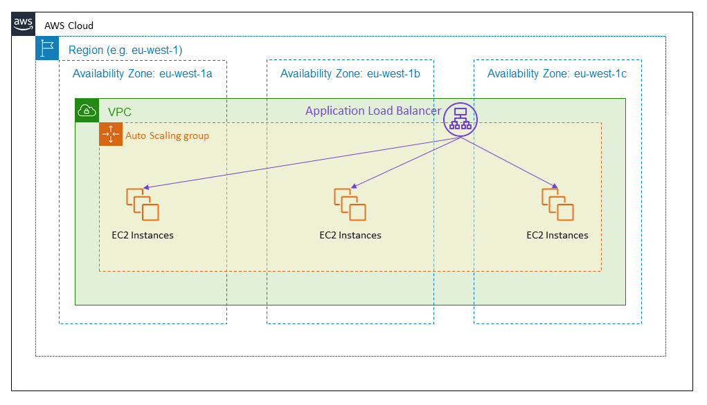

1. ##### 1. QUESTION

   A company plans to deploy an application in an Amazon EC2 instance. The application will perform the following tasks:

   - Read large datasets from an Amazon S3 bucket.
   - Execute multi-stage analysis on the datasets.
   - Save the results to Amazon RDS.

   During multi-stage analysis, the application will store a large number of temporary files in the instance storage. As the Solutions Architect, you need to recommend the fastest storage option with high I/O performance for the temporary files.

   Which of the following options fulfills this requirement?

   

   - Attach multiple Provisioned IOPS SSD volumes in the instance.
   - Configure RAID 1 in multiple instance store volumes.
   - Enable Transfer Acceleration in Amazon S3.
   - Configure RAID 0 in multiple instance store volumes.

   

   **Incorrect**

   

   **Amazon Elastic Compute Cloud (Amazon EC2)** provides scalable computing capacity in the Amazon Web Services (AWS) Cloud. You can use Amazon EC2 to launch as many or as few virtual servers as you need, configure security and networking, and manage storage. Amazon EC2 enables you to scale up or down to handle changes in requirements or spikes in popularity, reducing your need to forecast traffic.

   

   RAID 0 configuration enables you to improve your storage volumes’ performance by distributing the I/O across the volumes in a stripe. Therefore, if you add a storage volume, you get the straight addition of throughput and IOPS. This configuration can be implemented on both EBS or instance store volumes. Since the main requirement in the scenario is storage performance, you need to use an instance store volume. It uses NVMe or SATA-based SSD to deliver high random I/O performance. This type of storage is a good option when you need storage with very low latency, and you don’t need the data to persist when the instance terminates.

   Hence, the correct answer is: ***\*Configure RAID 0 in multiple instance store volumes\****.

   The option that says: ***\*Enable Transfer Acceleration in Amazon S3\**** is incorrect because S3 Transfer Acceleration is mainly used to speed up the transfer of gigabytes or terabytes of data between clients and an S3 bucket.

   The option that says: ***\*Configure RAID 1 in multiple instance volumes\**** is incorrect because RAID 1 configuration is used for data mirroring. You need to configure RAID 0 to improve the performance of your storage volumes.

   The option that says: ***\*Attach multiple Provisioned IOPS SSD volumes in the instance\**** is incorrect because persistent storage is not needed in the scenario. Also, instance store volumes have greater I/O performance than EBS volumes.

    

   **References:**

   https://docs.aws.amazon.com/AWSEC2/latest/UserGuide/InstanceStorage.html

   https://docs.aws.amazon.com/AWSEC2/latest/UserGuide/raid-config.html

    

   **Check out this Amazon EC2 Cheat Sheet:**

   https://tutorialsdojo.com/amazon-elastic-compute-cloud-amazon-ec2/

   

   

2. ##### 2. QUESTION

   An automotive company is working on an autonomous vehicle development and deployment project using AWS. The solution requires High Performance Computing (HPC) in order to collect, store and manage massive amounts of data as well as to support deep learning frameworks. The Linux EC2 instances that will be used should have a lower latency and higher throughput than the TCP transport traditionally used in cloud-based HPC systems. It should also enhance the performance of inter-instance communication and must include an OS-bypass functionality to allow the HPC to communicate directly with the network interface hardware to provide low-latency, reliable transport functionality.

   Which of the following is the MOST suitable solution that you should implement to achieve the above requirements?

   

   - Attach a Private Virtual Interface (VIF) on each Amazon EC2 instance to accelerate High Performance Computing (HPC).
   - Attach an Elastic Network Adapter (ENA) on each Amazon EC2 instance to accelerate High Performance Computing (HPC).
   - Attach an Elastic Fabric Adapter (EFA) on each Amazon EC2 instance to accelerate High Performance Computing (HPC).
   - Attach an Elastic Network Interface (ENI) on each Amazon EC2 instance to accelerate High Performance Computing (HPC).

   

   **Correct**

   

   **An Elastic Fabric Adapter (EFA)** is a network device that you can attach to your Amazon EC2 instance to accelerate High Performance Computing (HPC) and machine learning applications. EFA enables you to achieve the application performance of an on-premises HPC cluster, with the scalability, flexibility, and elasticity provided by the AWS Cloud.

   EFA provides lower and more consistent latency and higher throughput than the TCP transport traditionally used in cloud-based HPC systems. It enhances the performance of inter-instance communication that is critical for scaling HPC and machine learning applications. It is optimized to work on the existing AWS network infrastructure and it can scale depending on application requirements.

   EFA integrates with Libfabric 1.9.0 and it supports Open MPI 4.0.2 and Intel MPI 2019 Update 6 for HPC applications, and Nvidia Collective Communications Library (NCCL) for machine learning applications.

    

   

    

   The OS-bypass capabilities of EFAs are not supported on Windows instances. If you attach an EFA to a Windows instance, the instance functions as an Elastic Network Adapter, without the added EFA capabilities.

   Elastic Network Adapters (ENAs) provide traditional IP networking features that are required to support VPC networking. EFAs provide all of the same traditional IP networking features as ENAs, and they also support OS-bypass capabilities. OS-bypass enables HPC and machine learning applications to bypass the operating system kernel and to communicate directly with the EFA device.

   Hence, the correct answer is to ***\*attach an Elastic Fabric Adapter (EFA) on each Amazon EC2 instance to accelerate High Performance Computing (HPC)\****.

   ***\*Attaching an Elastic Network Adapter (ENA) on each Amazon EC2 instance to accelerate High Performance Computing (HPC)\**** is incorrect because Elastic Network Adapter (ENA) doesn’t have OS-bypass capabilities, unlike EFA.

   ***\*Attaching an Elastic Network Interface (ENI) on each Amazon EC2 instance to accelerate High Performance Computing (HPC)\**** is incorrect because an Elastic Network Interface (ENI) is simply a logical networking component in a VPC that represents a virtual network card. It doesn’t have OS-bypass capabilities that allow the HPC to communicate directly with the network interface hardware to provide low-latency, reliable transport functionality.

   ***\*Attaching a Private Virtual Interface (VIF) on each Amazon EC2 instance to accelerate High Performance Computing (HPC)\**** is incorrect because Private Virtual Interface just allows you to connect to your VPC resources on your private IP address or endpoint.

    

   **References:**

   https://docs.aws.amazon.com/AWSEC2/latest/UserGuide/efa.html

   https://docs.aws.amazon.com/AWSEC2/latest/UserGuide/enhanced-networking-ena

    

   **Check out this Elastic Fabric Adapter (EFA) Cheat Sheet:**

   https://tutorialsdojo.com/elastic-fabric-adapter-efa/

   

   

3. ##### 3. QUESTION

   A company is using an On-Demand EC2 instance to host a legacy web application that uses an Amazon Instance Store-Backed AMI. The web application should be decommissioned as soon as possible and hence, you need to terminate the EC2 instance.

   When the instance is terminated, what happens to the data on the root volume?

   

   - Data is automatically deleted.
   - Data is automatically saved as an EBS snapshot.
   - Data is automatically saved as an EBS volume.
   - Data is unavailable until the instance is restarted.

   

   **Correct**

   

   **AMIs** are categorized as either *backed by Amazon EBS* or *backed by instance store*. The former means that the root device for an instance launched from the AMI is an Amazon EBS volume created from an Amazon EBS snapshot. The latter means that the root device for an instance launched from the AMI is an instance store volume created from a template stored in Amazon S3.

   

   The data on instance store volumes persist only during the life of the instance which means that if the instance is terminated, the data will be automatically deleted.

   Hence, the correct answer is: ***\*Data is automatically deleted.\****

    

   **Reference:** 

   https://docs.aws.amazon.com/AWSEC2/latest/UserGuide/ComponentsAMIs.html

    

   **Tutorials Dojo’s AWS Certified Solutions Architect Associate Exam Study Guide:**

   https://tutorialsdojo.com/aws-certified-solutions-architect-associate/

   

   

4. ##### 4. QUESTION

   A company needs to integrate the Lightweight Directory Access Protocol (LDAP) directory service from the on-premises data center to the AWS VPC using IAM. The identity store which is currently being used is not compatible with SAML.

   Which of the following provides the most valid approach to implement the integration?

   

   - Develop an on-premises custom identity broker application and use STS to issue short-lived AWS credentials.
   - Use AWS Single Sign-On (SSO) service to enable single sign-on between AWS and your LDAP.
   - Use an IAM policy that references the LDAP identifiers and AWS credentials.
   - Use IAM roles to rotate the IAM credentials whenever LDAP credentials are updated.

   

   **Correct**

   

   If your identity store is not compatible with SAML 2.0 then you can build a custom identity broker application to perform a similar function. The broker application authenticates users, requests temporary credentials for users from AWS, and then provides them to the user to access AWS resources.

   The application verifies that employees are signed into the existing corporate network’s identity and authentication system, which might use LDAP, Active Directory, or another system. The identity broker application then obtains temporary security credentials for the employees.

   To get temporary security credentials, the identity broker application calls either **`AssumeRole`** or **`GetFederationToken`** to obtain temporary security credentials, depending on how you want to manage the policies for users and when the temporary credentials should expire. The call returns temporary security credentials consisting of an AWS access key ID, a secret access key, and a session token. The identity broker application makes these temporary security credentials available to the internal company application. The app can then use the temporary credentials to make calls to AWS directly. The app caches the credentials until they expire, and then requests a new set of temporary credentials.

   

   ***\*Using an IAM policy that references the LDAP identifiers and AWS credentials\**** is incorrect because using an IAM policy is not enough to integrate your LDAP service to IAM. You need to use SAML, STS, or a custom identity broker.

   ***\*Using AWS Single Sign-On (SSO) service to enable single sign-on between AWS and your LDAP\**** is incorrect because the scenario did not require SSO and in addition, the identity store that you are using is not SAML-compatible.

   ***\*Using IAM roles to rotate the IAM credentials whenever LDAP credentials are updated\**** is incorrect because manually rotating the IAM credentials is not an optimal solution to integrate your on-premises and VPC network. You need to use SAML, STS, or a custom identity broker.

    

   **References:** 

   https://docs.aws.amazon.com/IAM/latest/UserGuide/id_roles_common-scenarios_federated-users.html

   https://aws.amazon.com/blogs/aws/aws-identity-and-access-management-now-with-identity-federation/

    

   **Tutorials Dojo’s AWS Certified Solutions Architect Associate Exam Study Guide:**

   https://tutorialsdojo.com/aws-certified-solutions-architect-associate/

   

   

5. ##### 5. QUESTION

   A company launched a global news website that is deployed to AWS and is using MySQL RDS. The website has millions of viewers from all over the world which means that the website has read-heavy database workloads. All database transactions must be ACID compliant to ensure data integrity.

   In this scenario, which of the following is the best option to use to increase the read throughput on the MySQL database?

   

   - Use SQS to queue up the requests
   - Enable Amazon RDS Read Replicas
   - Enable Amazon RDS Standby Replicas
   - Enable Multi-AZ deployments

   

   **Correct**

   

   ***\*Amazon RDS Read Replicas\**** provide enhanced performance and durability for database (DB) instances. This feature makes it easy to elastically scale out beyond the capacity constraints of a single DB instance for read-heavy database workloads. You can create one or more replicas of a given source DB Instance and serve high-volume application read traffic from multiple copies of your data, thereby increasing aggregate read throughput. Read replicas can also be promoted when needed to become standalone DB instances. Read replicas are available in Amazon RDS for MySQL, MariaDB, Oracle, and PostgreSQL as well as Amazon Aurora.

   

   ***\*Enabling Multi-AZ deployments\**** is incorrect because the Multi-AZ deployments feature is mainly used to achieve high availability and failover support for your database.

   ***\*Enabling Amazon RDS Standby Replicas\**** is incorrect because a Standby replica is used in Multi-AZ deployments and hence, it is not a solution to reduce read-heavy database workloads.

   ***\*Using SQS to queue up the requests\**** is incorrect. Although an SQS queue can effectively manage the requests, it won’t be able to entirely improve the read-throughput of the database by itself.

    

   **References:**

   https://aws.amazon.com/rds/details/read-replicas/

   https://docs.aws.amazon.com/AmazonRDS/latest/UserGuide/USER_ReadRepl.html

    

   ***\*Amazon RDS Overview:\****

   

   <iframe title="YouTube video player" src="https://www.youtube.com/embed/aZmpLl8K1UU" frameborder="0" allowfullscreen="allowfullscreen" data-mce-fragment="1" name="fitvid0" style="box-sizing: border-box; margin: 0px; position: absolute; top: 0px; left: 0px; width: 966px; height: 543.375px;"></iframe>

   

   **Check out this Amazon RDS Cheat Sheet:**

   https://tutorialsdojo.com/amazon-relational-database-service-amazon-rds/

   

   

6. ##### 6. QUESTION

   A startup plans to develop a multiplayer game that uses UDP as the protocol for communication between clients and game servers. The data of the users will be stored in a key-value store. As the Solutions Architect, you need to implement a solution that will distribute the traffic across a number of servers.

   Which of the following could help you achieve this requirement?

   

   - Distribute the traffic using Application Load Balancer and store the data in Amazon DynamoDB.
   - Distribute the traffic using Network Load Balancer and store the data in Amazon DynamoDB.
   - Distribute the traffic using Network Load Balancer and store the data in Amazon Aurora.
   - Distribute the traffic using Application Load Balancer and store the data in Amazon RDS.

   

   **Correct**

   

   A **Network Load Balancer** functions at the fourth layer of the Open Systems Interconnection (OSI) model. It can handle millions of requests per second. After the load balancer receives a connection request, it selects a target from the target group for the default rule. For UDP traffic, the load balancer selects a target using a flow hash algorithm based on the protocol, source IP address, source port, destination IP address, and destination port. A UDP flow has the same source and destination, so it is consistently routed to a single target throughout its lifetime. Different UDP flows have different source IP addresses and ports, so they can be routed to different targets.

   

   In this scenario, a startup plans to create a multiplayer game that uses UDP as the protocol for communications. Since UDP is a Layer 4 traffic, we can limit the option that uses Network Load Balancer. The data of the users will be stored in a key-value store. This means that we should select Amazon DynamoDB since it supports both document and key-value store models.

   Hence, the correct answer is: ***\*Distribute the traffic using Network Load Balancer and store the data in Amazon DynamoDB\****.

   The option that says: ***\*Distribute the traffic using Application Load Balancer and store the data in Amazon DynamoDB\**** is incorrect because UDP is not supported in Application Load Balancer. Remember that UDP is a Layer 4 traffic. Therefore, you should use a Network Load Balancer.

   The option that says: ***\*Distribute the traffic using Network Load Balancer and store the data in Amazon Aurora\**** is incorrect because Amazon Aurora is a relational database service. Instead of Aurora, you should use Amazon DynamoDB.

   The option that says: ***\*Distribute the traffic using Application Load Balancer and store the data in Amazon RDS\**** is incorrect because Application Load Balancer only supports application traffic (Layer 7). Also, Amazon RDS is not suitable as a key-value store. You should use DynamoDB since it supports both document and key-value store models.

    

   **References:**

   https://aws.amazon.com/blogs/aws/new-udp-load-balancing-for-network-load-balancer/

   https://docs.aws.amazon.com/elasticloadbalancing/latest/network/introduction.html

    

   ***\*AWS Elastic Load Balancing Overview:\****

   

   <iframe title="YouTube video player" src="https://www.youtube.com/embed/UBl5dw59DO8" frameborder="0" allowfullscreen="allowfullscreen" data-mce-fragment="1" name="fitvid1" style="box-sizing: border-box; margin: 0px; position: absolute; top: 0px; left: 0px; width: 966px; height: 543.375px;"></iframe>

   

   **Check out this AWS Elastic Load Balancing (ELB) Cheat Sheet:**

   https://tutorialsdojo.com/aws-elastic-load-balancing-elb/

   

   

7. ##### 7. QUESTION

   A technology company is building a new cryptocurrency trading platform that allows the buying and selling of Bitcoin, Ethereum, Ripple, Tether, and many others. You were hired as a Cloud Engineer to build the required infrastructure needed for this new trading platform. On your first week at work, you started to create CloudFormation YAML scripts that define all of the needed AWS resources for the application. Your manager was shocked that you haven’t created the EC2 instances, S3 buckets, and other AWS resources straight away. He does not understand the text-based scripts that you have done and has asked for your clarification.

   In this scenario, what are the benefits of using the Amazon CloudFormation service that you should tell your manager to clarify his concerns? (Select TWO.)

   

   - A storage location for the code of your application
   - Allows you to model your entire infrastructure in a text file
   - Using CloudFormation itself is free, including the AWS resources that have been created.
   - Provides highly durable and scalable data storage
   - Enables modeling, provisioning, and version-controlling of your entire AWS infrastructure

   

   **Correct**

   

   **AWS CloudFormation** provides a common language for you to describe and provision all the infrastructure resources in your cloud environment. CloudFormation allows you to use a simple text file to model and provision, in an automated and secure manner, all the resources needed for your applications across all regions and accounts. This file serves as the single source of truth for your cloud environment. AWS CloudFormation is available at no additional charge, and you pay only for the AWS resources needed to run your applications.

   

   Hence, the correct answers are:

   ***\*– Enables modeling, provisioning, and version-controlling of your entire AWS infrastructure\****

   ***\*– Allows you to model your entire infrastructure in a text file\****

   The option that says: ***\*Provides highly durable and scalable data storage\**** is incorrect because CloudFormation is not a data storage service.

   The option that says: ***\*A storage location for the code of your application\**** is incorrect because CloudFormation is not used to store your application code. You have to use CodeCommit as a code repository and not CloudFormation.

   The option that says: ***\*Using CloudFormation itself is free, including the AWS resources that have been created\**** is incorrect because although the use of CloudFormation service is free, you have to pay the AWS resources that you created.

    

   **References:**

   https://aws.amazon.com/cloudformation/

   https://aws.amazon.com/cloudformation/faqs/

    

   **Check out this AWS CloudFormation Cheat Sheet:**

   https://tutorialsdojo.com/aws-cloudformation/

   

   

8. ##### 8. QUESTION

   A company deployed an online enrollment system database on a prestigious university, which is hosted in RDS. The Solutions Architect is required to monitor the database metrics in Amazon CloudWatch to ensure the availability of the enrollment system.

   What are the enhanced monitoring metrics that Amazon CloudWatch gathers from Amazon RDS DB instances which provide more accurate information? (Select TWO.)

   

   - OS processes
   - RDS child processes
   - Freeable Memory
   - CPU Utilization
   - Database Connections

   

   **Correct**

   

   **Amazon RDS** provides metrics in real time for the operating system (OS) that your DB instance runs on. You can view the metrics for your DB instance using the console, or consume the Enhanced Monitoring JSON output from CloudWatch Logs in a monitoring system of your choice.

   **CloudWatch** gathers metrics about CPU utilization from the hypervisor for a DB instance, and Enhanced Monitoring gathers its metrics from an agent on the instance. As a result, you might find differences between the measurements, because the hypervisor layer performs a small amount of work. The differences can be greater if your DB instances use smaller instance classes, because then there are likely more virtual machines (VMs) that are managed by the hypervisor layer on a single physical instance. Enhanced Monitoring metrics are useful when you want to see how different processes or threads on a DB instance use the CPU.

   

   In RDS, the Enhanced Monitoring metrics shown in the Process List view are organized as follows:

   **RDS child processes** – Shows a summary of the RDS processes that support the DB instance, for example `aurora` for Amazon Aurora DB clusters and `mysqld` for MySQL DB instances. Process threads appear nested beneath the parent process. Process threads show CPU utilization only as other metrics are the same for all threads for the process. The console displays a maximum of 100 processes and threads. The results are a combination of the top CPU consuming and memory consuming processes and threads. If there are more than 50 processes and more than 50 threads, the console displays the top 50 consumers in each category. This display helps you identify which processes are having the greatest impact on performance.

   ***\*RDS processes\**** – Shows a summary of the resources used by the RDS management agent, diagnostics monitoring processes, and other AWS processes that are required to support RDS DB instances.

   ***\*OS processes\**** – Shows a summary of the kernel and system processes, which generally have minimal impact on performance.

   ***\*CPU Utilization, Database Connections,\**** and ***\*Freeable Memory\**** are incorrect because these are just the regular items provided by Amazon RDS Metrics in CloudWatch. Remember that the scenario is asking for the Enhanced Monitoring metrics.

    

   **References:** 

   https://docs.aws.amazon.com/AmazonCloudWatch/latest/monitoring/rds-metricscollected.html

   https://docs.aws.amazon.com/AmazonRDS/latest/UserGuide/USER_Monitoring.OS.html#USER_Monitoring.OS.CloudWatchLogs

    

   **Check out this Amazon CloudWatch Cheat Sheet:**

   https://tutorialsdojo.com/amazon-cloudwatch/

    

   **Check out this Amazon RDS Cheat Sheet:**

   https://tutorialsdojo.com/amazon-relational-database-service-amazon-rds/

   

   

9. ##### 9. QUESTION

   A Solutions Architect is designing a monitoring application which generates audit logs of all operational activities of the company’s cloud infrastructure. Their IT Security and Compliance team mandates that the application retain the logs for 5 years before the data can be deleted.

   How can the Architect meet the above requirement?

   

   - Store the audit logs in an Amazon S3 bucket and enable Multi-Factor Authentication Delete (MFA Delete) on the S3 bucket.
   - Store the audit logs in an EFS volume and use Network File System version 4 (NFSv4) file-locking mechanism.
   - Store the audit logs in a Glacier vault and use the Vault Lock feature.
   - Store the audit logs in an EBS volume and then take EBS snapshots every month.

   

   **Correct**

   

   An **Amazon S3 Glacier (Glacier) vault** can have one resource-based vault access policy and one Vault Lock policy attached to it. A *Vault Lock policy* is a vault access policy that you can lock. Using a Vault Lock policy can help you enforce regulatory and compliance requirements. Amazon S3 Glacier provides a set of API operations for you to manage the Vault Lock policies.

   

   As an example of a Vault Lock policy, suppose that you are required to retain archives for one year before you can delete them. To implement this requirement, you can create a Vault Lock policy that denies users permissions to delete an archive until the archive has existed for one year. You can test this policy before locking it down. After you lock the policy, the policy becomes immutable. For more information about the locking process, see Amazon S3 Glacier Vault Lock. If you want to manage other user permissions that can be changed, you can use the vault access policy

   Amazon S3 Glacier supports the following archive operations: Upload, Download, and Delete. Archives are immutable and **cannot be modified.** Hence, the correct answer is to ***\*store the audit logs in a Glacier vault and use the Vault Lock feature\****.

   ***\*Storing the audit logs in an EBS volume and then taking EBS snapshots every month\**** is incorrect because this is not a suitable and secure solution. Anyone who has access to the EBS Volume can simply delete and modify the audit logs. Snapshots can be deleted too.

   ***\*Storing the audit logs in an Amazon S3 bucket and enabling Multi-Factor Authentication Delete (MFA Delete) on the S3 bucket\**** is incorrect because this would still not meet the requirement. If someone has access to the S3 bucket and also has the proper MFA privileges then the audit logs can be edited.

   ***\*Storing the audit logs in an EFS volume and using Network File System version 4 (NFSv4) file-locking mechanism\**** is incorrect because the data integrity of the audit logs can still be compromised if it is stored in an EFS volume with Network File System version 4 (NFSv4) file-locking mechanism and hence, not suitable as storage for the files. Although it will provide some sort of security, the file lock can still be overridden and the audit logs might be edited by someone else.

    

   **References:**

   https://docs.aws.amazon.com/amazonglacier/latest/dev/vault-lock.html

   https://docs.aws.amazon.com/amazonglacier/latest/dev/vault-lock-policy.html

   https://aws.amazon.com/blogs/aws/glacier-vault-lock/

    

   ***\*Amazon S3 and S3 Glacier Overview:\****

   

   <iframe title="YouTube video player" src="https://www.youtube.com/embed/1ymyeN2tki4" frameborder="0" allowfullscreen="allowfullscreen" data-mce-fragment="1" name="fitvid2" style="box-sizing: border-box; margin: 0px; position: absolute; top: 0px; left: 0px; width: 966px; height: 543.375px;"></iframe>

   

   **Check out this Amazon S3 Glacier Cheat Sheet:**

   https://tutorialsdojo.com/amazon-glacier/

   

   

10. ##### 10. QUESTION

    A company has a web application hosted in an On-Demand EC2 instance. You are creating a shell script that needs the instance’s public and private IP addresses.

    What is the best way to get the instance’s associated IP addresses which your shell script can use?

    

    - By using IAM.
    - By using a CloudWatch metric.
    - By using a Curl or Get Command to get the latest metadata information from http://169.254.169.254/latest/meta-data/
    - By using a Curl or Get Command to get the latest user data information from http://169.254.169.254/latest/user-data/

    

    **Correct**

    

    Instance metadata is data about your EC2 instance that you can use to configure or manage the running instance. Because your instance metadata is available from your running instance, you do not need to use the Amazon EC2 console or the AWS CLI. This can be helpful when you’re writing scripts to run from your instance. For example, you can access the local IP address of your instance from instance metadata to manage a connection to an external application.

    

    To view the private IPv4 address, public IPv4 address, and all other categories of instance metadata from within a running instance, use the following URL:

    ```
    http://169.254.169.254/latest/meta-data/
    ```

     

    **Reference:**

    http://docs.aws.amazon.com/AWSEC2/latest/UserGuide/ec2-instance-metadata.html

     

    **Check out this Amazon EC2 Cheat Sheet:**

    https://tutorialsdojo.com/amazon-elastic-compute-cloud-amazon-ec2/

     

    **Tutorials Dojo’s AWS Certified Solutions Architect Associate Exam Study Guide:**

    https://tutorialsdojo.com/aws-certified-solutions-architect-associate/

    

    

11. ##### 11. QUESTION

    The company you are working for has a set of AWS resources hosted in ap-northeast-1 region. You have been asked by your IT Manager to create an AWS CLI shell script that will call an AWS service which could create duplicate resources in another region in the event that ap-northeast-1 region fails. The duplicated resources should also contain the VPC Peering configuration and other networking components from the primary stack.

    Which of the following AWS services could help fulfill this task?

    

    - Amazon SNS
    - Amazon LightSail
    - Amazon SQS
    - AWS CloudFormation

    

    **Correct**

    

    **AWS CloudFormation** is a service that helps you model and set up your Amazon Web Services resources so that you can spend less time managing those resources and more time focusing on your applications that run in AWS.

    

    You can create a template that describes all the AWS resources that you want (like Amazon EC2 instances or Amazon RDS DB instances), and AWS CloudFormation takes care of provisioning and configuring those resources for you. With this, you can deploy an exact copy of your AWS architecture, along with all of the AWS resources which are hosted in one region to another.

    Hence, the correct answer is ***\*AWS CloudFormation.\****

    ***\*Amazon LightSail\**** is incorrect because you can’t use this to duplicate your resources in your VPC. You have to use CloudFormation instead.

    ***\*Amazon SQS\**** and ***\*Amazon SNS\**** are both incorrect because SNS and SQS are just messaging services.

     

    **References:**

    https://docs.aws.amazon.com/AWSCloudFormation/latest/UserGuide/Welcome.html

    https://docs.aws.amazon.com/AWSCloudFormation/latest/UserGuide/using-cfn-cli-creating-stack.html

     

    **Check out this AWS CloudFormation Cheat Sheet:**

    https://tutorialsdojo.com/aws-cloudformation/

     

    ***\*AWS CloudFormation – Templates, Stacks, Change Sets:\****

    

    <iframe title="YouTube video player" src="https://www.youtube.com/embed/9Xpuprxg7aY" frameborder="0" allowfullscreen="allowfullscreen" data-mce-fragment="1" name="fitvid3" style="box-sizing: border-box; margin: 0px; position: absolute; top: 0px; left: 0px; width: 966px; height: 543.375px;"></iframe>

    

    

    

12. ##### 12. QUESTION

    A company has a High Performance Computing (HPC) cluster that is composed of EC2 Instances with Provisioned IOPS volume to process transaction-intensive, low-latency workloads. The Solutions Architect must maintain high IOPS while keeping the latency down by setting the optimal queue length for the volume. The size of each volume is 10 GiB.

    Which of the following is the MOST suitable configuration that the Architect should set up?

    

    - Set the IOPS to 400 then maintain a low queue length.
    - Set the IOPS to 800 then maintain a low queue length.
    - Set the IOPS to 600 then maintain a high queue length.
    - Set the IOPS to 500 then maintain a low queue length.

    

    **Incorrect**

    

    **Provisioned IOPS SSD (`io1`) volumes** are designed to meet the needs of I/O-intensive workloads, particularly database workloads, that are sensitive to storage performance and consistency. Unlike `gp2`, which uses a bucket and credit model to calculate performance, an `io1` volume allows you to specify a consistent IOPS rate when you create the volume, and Amazon EBS delivers within 10 percent of the provisioned IOPS performance 99.9 percent of the time over a given year.

    An `io1` volume can range in size from 4 GiB to 16 TiB. You can provision from 100 IOPS up to 64,000 IOPS per volume on [Nitro system](https://docs.aws.amazon.com/AWSEC2/latest/UserGuide/instance-types.html#ec2-nitro-instances) instance families and up to 32,000 on other instance families. The maximum ratio of provisioned IOPS to requested volume size (in GiB) is 50:1.

    For example, a 100 GiB volume can be provisioned with up to 5,000 IOPS. On a supported instance type, any volume 1,280 GiB in size or greater allows provisioning up to the 64,000 IOPS maximum (50 × 1,280 GiB = 64,000).

    

    An `io1` volume provisioned with up to 32,000 IOPS supports a maximum I/O size of 256 KiB and yields as much as 500 MiB/s of throughput. With the I/O size at the maximum, peak throughput is reached at 2,000 IOPS. A volume provisioned with more than 32,000 IOPS (up to the cap of 64,000 IOPS) supports a maximum I/O size of 16 KiB and yields as much as 1,000 MiB/s of throughput.

    The volume queue length is the number of pending I/O requests for a device. Latency is the true end-to-end client time of an I/O operation, in other words, the time elapsed between sending an I/O to EBS and receiving an acknowledgment from EBS that the I/O read or write is complete. Queue length must be correctly calibrated with I/O size and latency to avoid creating bottlenecks either on the guest operating system or on the network link to EBS.

    Optimal queue length varies for each workload, depending on your particular application’s sensitivity to IOPS and latency. If your workload is not delivering enough I/O requests to fully use the performance available to your EBS volume then your volume might not deliver the IOPS or throughput that you have provisioned.

    Transaction-intensive applications are sensitive to increased I/O latency and are well-suited for SSD-backed `io1` and `gp2` volumes. You can maintain high IOPS while keeping latency down by maintaining a low queue length and a high number of IOPS available to the volume. Consistently driving more IOPS to a volume than it has available can cause increased I/O latency.

    Throughput-intensive applications are less sensitive to increased I/O latency, and are well-suited for HDD-backed `st1` and `sc1` volumes. You can maintain high throughput to HDD-backed volumes by maintaining a high queue length when performing large, sequential I/O.

    Therefore, for instance, a 10 GiB volume can be provisioned with up to **500** IOPS. Any volume 640 GiB in size or greater allows provisioning up to a maximum of 32,000 IOPS (50 × 640 GiB = 32,000). Hence, the correct answer is to ***\*set the IOPS to 500 then maintain a low queue length\****.

    ***\*Setting the IOPS to 400 then maintaining a low queue length\**** is incorrect because although a value of 400 is an acceptable value, it is not the maximum value for the IOPS. You will not fully utilize the available IOPS that the volume can offer if you just set it to 400.

    The options that say: ***\*Set the IOPS to 600 then maintain a high queue length\**** and ***\*Set the IOPS to 800 then maintain a low queue length\**** are both incorrect because the maximum IOPS for the 10 GiB volume is only 500. Therefore, any value greater than the maximum amount, such as 600 or 800, is wrong. Moreover, you should keep the latency down by maintaining a low queue length, and not higher.

     

    **References:**

    http://docs.aws.amazon.com/AWSEC2/latest/UserGuide/EBSVolumeTypes.html

    https://docs.aws.amazon.com/AWSEC2/latest/UserGuide/ebs-io-characteristics.html

     

    **Amazon EBS Overview – SSD vs HDD:**

    

    <iframe title="YouTube video player" src="https://www.youtube.com/embed/LW7x8wyLFvw" frameborder="0" allowfullscreen="allowfullscreen" name="fitvid4" style="box-sizing: border-box; margin: 0px; position: absolute; top: 0px; left: 0px; width: 966px; height: 543.375px;"></iframe>

    

     

    **Check out this Amazon EBS Cheat Sheet:**

    https://tutorialsdojo.com/amazon-ebs/

    

    

13. ##### 13. QUESTION

    An application is using a RESTful API hosted in AWS which uses Amazon API Gateway and AWS Lambda. There is a requirement to trace and analyze user requests as they travel through your Amazon API Gateway APIs to the underlying services.

    Which of the following is the most suitable service to use to meet this requirement?

    

    - CloudWatch
    - VPC Flow Logs
    - CloudTrail
    - AWS X-Ray

    

    **Correct**

    

    You can use [AWS X-Ray](https://docs.aws.amazon.com/xray/latest/devguide/xray-services-apigateway.html) to trace and analyze user requests as they travel through your Amazon API Gateway APIs to the underlying services. API Gateway supports AWS X-Ray tracing for all API Gateway endpoint types: regional, edge-optimized, and private. You can use AWS X-Ray with Amazon API Gateway in all regions where X-Ray is available.

    X-Ray gives you an end-to-end view of an entire request, so you can analyze latencies in your APIs and their backend services. You can use an X-Ray service map to view the latency of an entire request and that of the downstream services that are integrated with X-Ray. And you can configure sampling rules to tell X-Ray which requests to record, at what sampling rates, according to criteria that you specify. If you call an API Gateway API from a service that’s already being traced, API Gateway passes the trace through, even if X-Ray tracing is not enabled on the API.

    You can enable X-Ray for an API stage by using the API Gateway management console, or by using the API Gateway API or CLI.

     

    

     

    ***\*VPC Flow Logs\**** is incorrect because this is a feature that enables you to capture information about the IP traffic going to and from network interfaces in your entire VPC. Although it can capture some details about the incoming user requests, it is still better to use AWS X-Ray as it provides a better way to debug and analyze your microservices applications with request tracing so you can find the root cause of your issues and performance.

    ***\*CloudWatch\**** is incorrect because this is a monitoring and management service. It does not have the capability to trace and analyze user requests as they travel through your Amazon API Gateway APIs.

    ***\*CloudTrail\**** is incorrect because this is primarily used for IT audits and API logging of all of your AWS resources. It does not have the capability to trace and analyze user requests as they travel through your Amazon API Gateway APIs, unlike AWS X-Ray.

     

    **Reference:**

    https://docs.aws.amazon.com/apigateway/latest/developerguide/apigateway-xray.html

     

    **Check out this AWS X-Ray Cheat Sheet:**

    https://tutorialsdojo.com/aws-x-ray/

     

    **Instrumenting your Application with AWS X-Ray:**

    https://tutorialsdojo.com/aws-cheat-sheet-instrumenting-your-application-with-aws-x-ray/

    

    

14. ##### 14. QUESTION

    A company has a web-based order processing system that is currently using a standard queue in Amazon SQS. The IT Manager noticed that there are a lot of cases where an order was processed twice. This issue has caused a lot of trouble in processing and made the customers very unhappy. The manager has asked you to ensure that this issue will not recur.

    What can you do to prevent this from happening again in the future? (Select TWO.)

    

    - Change the message size in SQS.
    - Replace Amazon SQS and instead, use Amazon Simple Workflow service.
    - Alter the visibility timeout of SQS.
    - Alter the retention period in Amazon SQS.
    - Use an Amazon SQS FIFO Queue instead.

    

    **Correct**

    

    **Amazon SQS FIFO (First-In-First-Out) Queues** have all the capabilities of the standard queue with additional capabilities designed to enhance messaging between applications when the order of operations and events is critical, or where **duplicates can’t be tolerated**, for example:

    – Ensure that user-entered commands are executed in the right order.
    – Display the correct product price by sending price modifications in the right order.
    – Prevent a student from enrolling in a course before registering for an account.

    

    **Amazon SWF** provides useful guarantees around task assignments. It ensures that a task is never duplicated and is assigned only once. Thus, even though you may have multiple workers for a particular activity type (or a number of instances of a decider), Amazon SWF will give a specific task to only one worker (or one decider instance). Additionally, Amazon SWF keeps at most one decision task outstanding at a time for a workflow execution. Thus, you can run multiple decider instances without worrying about two instances operating on the same execution simultaneously. These facilities enable you to coordinate your workflow without worrying about duplicate, lost, or conflicting tasks.

    The main issue in this scenario is that the order management system produces duplicate orders at times. Since the company is using SQS, there is a possibility that a message can have a duplicate in case an EC2 instance failed to delete the already processed message. To prevent this issue from happening, you have to use Amazon Simple Workflow service instead of SQS.

    Therefore, the correct answers are:

    ***\*– Replace Amazon SQS and instead, use Amazon Simple Workflow service.\****

    ***\*– Use an Amazon SQS FIFO Queue instead.\****

    ***\*Altering the retention period in Amazon SQS\**** is incorrect because the retention period simply specifies if the Amazon SQS should delete the messages that have been in a queue for a certain period of time.

    ***\*Altering the visibility timeout of SQS\**** is incorrect because for standard queues, the visibility timeout isn’t a guarantee against receiving a message twice. To avoid duplicate SQS messages, it is better to design your applications to be *idempotent* (they should not be affected adversely when processing the same message more than once).

    ***\*Changing the message size in SQS\**** is incorrect because this is not related at all in this scenario.

     

    **References:** 

    https://aws.amazon.com/swf/faqs/

    https://aws.amazon.com/swf/

    https://docs.aws.amazon.com/AWSSimpleQueueService/latest/SQSDeveloperGuide/sqs-visibility-timeout.html

     

    **Check out this Amazon SWF Cheat Sheet:**

    https://tutorialsdojo.com/amazon-simple-workflow-amazon-swf/

     

    **Amazon Simple Workflow (SWF) vs AWS Step Functions vs Amazon SQS:**

    https://tutorialsdojo.com/amazon-simple-workflow-swf-vs-aws-step-functions-vs-amazon-sqs/

    

    

15. ##### 15. QUESTION

    An auto scaling group of Linux EC2 instances is created with basic monitoring enabled in CloudWatch. You noticed that your application is slow so you asked one of your engineers to check all of your EC2 instances. After checking your instances, you noticed that the auto scaling group is not launching more instances as it should be, even though the servers already have high memory usage.

    Which of the following options should the Architect implement to solve this issue?

    

    - Install AWS SDK in the EC2 instances. Create a script that will trigger the Auto Scaling event if there is high memory usage.
    - Modify the scaling policy to increase the threshold to scale out the number of instances.
    - Install the CloudWatch agent to the EC2 instances which will trigger your Auto Scaling group to scale out.
    - Enable detailed monitoring on the instances.

    

    **Incorrect**

    

    **Amazon CloudWatch agent** enables you to collect both system metrics and log files from Amazon EC2 instances and on-premises servers. The agent supports both Windows Server and Linux and allows you to select the metrics to be collected, including sub-resource metrics such as per-CPU core.

    

    The premise of the scenario is that the EC2 servers have **high memory** usage, but since this specific metric is not tracked by the Auto Scaling group by default, the scaling out activity is not being triggered. Remember that by default, CloudWatch doesn’t monitor memory usage but only the CPU utilization, Network utilization, Disk performance, and Disk Reads/Writes.

    This is the reason why you have to install a CloudWatch agent in your EC2 instances to collect and monitor the custom metric (memory usage), which will be used by your Auto Scaling Group as a trigger for scaling activities.

    Hence, the correct answer is: ***\*Install the CloudWatch agent to the EC2 instances which will trigger your Auto Scaling group to scale out.\****

    The option that says: ***\*Install AWS SDK in the EC2 instances. Create a script that will trigger the Auto Scaling event if there is a high memory usage\**** is incorrect because AWS SDK is a set of programming tools that allow you to create applications that run using Amazon cloud services. You would have to program the alert which is not the best strategy for this scenario.

    The option that says: ***\*Enable detailed monitoring on the instances\**** is incorrect because detailed monitoring does not provide metrics for memory usage. CloudWatch does not monitor memory usage in its default set of EC2 metrics and detailed monitoring just provides a higher frequency of metrics (1-minute frequency).

    The option that says: ***\*Modify the scaling policy to increase the threshold to scale out the number of instances\**** is incorrect because you are already maxing out your usage, which should in effect cause an auto-scaling event.

     

    **References:**

    https://docs.aws.amazon.com/AmazonCloudWatch/latest/monitoring/Install-CloudWatch-Agent.html

    https://docs.aws.amazon.com/AWSEC2/latest/UserGuide/viewing_metrics_with_cloudwatch.html

    https://docs.aws.amazon.com/AWSEC2/latest/UserGuide/monitoring_ec2.html

     

    **Check out these Amazon EC2 and CloudWatch Cheat Sheets:**

    https://tutorialsdojo.com/amazon-elastic-compute-cloud-amazon-ec2/

    https://tutorialsdojo.com/amazon-cloudwatch/

    

    

16. ##### 16. QUESTION

    A customer is transitioning their ActiveMQ messaging broker service onto the AWS cloud in which they require an alternative asynchronous service that supports NMS and MQTT messaging protocol. The customer does not have the time and resources needed to recreate their messaging service in the cloud. The service has to be highly available and should require almost no management overhead.

    Which of the following is the most suitable service to use to meet the above requirement?

    

    - AWS Step Functions
    - Amazon SNS
    - Amazon SQS
    - Amazon MQ

    

    **Correct**

    

    ***\*Amazon MQ\**** is a managed message broker service for Apache ActiveMQ that makes it easy to set up and operate message brokers in the cloud. Connecting your current applications to Amazon MQ is easy because it uses industry-standard APIs and protocols for messaging, including JMS, NMS, AMQP, STOMP, MQTT, and WebSocket. Using standards means that in most cases, there’s no need to rewrite any messaging code when you migrate to AWS.

    Amazon MQ, Amazon SQS, and Amazon SNS are messaging services that are suitable for anyone from startups to enterprises. If you’re using messaging with existing applications and want to move your messaging service to the cloud quickly and easily, it is recommended that you consider Amazon MQ. It supports industry-standard APIs and protocols so you can switch from any standards-based message broker to Amazon MQ without rewriting the messaging code in your applications.

    

    If you are building brand new applications in the cloud, then it is highly recommended that you consider Amazon SQS and Amazon SNS. Amazon SQS and SNS are lightweight, fully managed message queue and topic services that scale almost infinitely and provide simple, easy-to-use APIs. You can use Amazon SQS and SNS to decouple and scale microservices, distributed systems, and serverless applications, and improve reliability.

    Hence, ***\*Amazon MQ\**** is the correct answer.

    ***\*Amazon SNS\**** is incorrect because this is more suitable as a pub/sub messaging service instead of a message broker service.

    ***\*Amazon SQS\**** is incorrect. Although this is a fully managed message queuing service, it does not support an extensive list of industry-standard messaging APIs and protocol, unlike Amazon MQ. Moreover, using Amazon SQS requires you to do additional changes in the messaging code of applications to make it compatible.

    ***\*AWS Step Functions\**** is incorrect because this is a serverless function orchestrator and not a messaging service, unlike Amazon MQ, AmazonSQS, and Amazon SNS.

     

    **References:**

    https://aws.amazon.com/amazon-mq/

    https://aws.amazon.com/messaging/

    https://docs.aws.amazon.com/AWSSimpleQueueService/latest/SQSDeveloperGuide/welcome.html#sqs-difference-from-amazon-mq-sns

     

    **Check out this Amazon MQ Cheat Sheet:**

    https://tutorialsdojo.com/amazon-mq/

    

    

17. ##### 17. QUESTION

    A company has a web application hosted in AWS cloud where the application logs are sent to Amazon CloudWatch. Lately, the web application has recently been encountering some errors which can be resolved simply by restarting the instance.

    What will you do to automatically restart the EC2 instances whenever the same application error occurs?

    

    - First, look at the existing Flow logs for keywords related to the application error to create a custom metric. Then, create a CloudWatch alarm for that custom metric which invokes an action to restart the EC2 instance.
    - First, look at the existing Flow logs for keywords related to the application error to create a custom metric. Then, create a CloudWatch alarm for that custom metric which calls a Lambda function that invokes an action to restart the EC2 instance.
    - First, look at the existing CloudWatch logs for keywords related to the application error to create a custom metric. Then, create an alarm in Amazon SNS for that custom metric which invokes an action to restart the EC2 instance.
    - First, look at the existing CloudWatch logs for keywords related to the application error to create a custom metric. Then, create a CloudWatch alarm for that custom metric which invokes an action to restart the EC2 instance.

    

    **Incorrect**

    

    In this scenario, you can look at the existing CloudWatch logs for keywords related to the application error to create a custom metric. Then, create a CloudWatch alarm for that custom metric which invokes an action to restart the EC2 instance.

    

    You can create alarms that automatically stop, terminate, reboot, or recover your EC2 instances using Amazon CloudWatch alarm actions. You can use the stop or terminate actions to help you save money when you no longer need an instance to be running. You can use the reboot and recover actions to automatically reboot those instances or recover them onto new hardware if a system impairment occurs.

    Hence, the correct answer is: ***\*First, look at the existing CloudWatch logs for keywords related to the application error to create a custom metric. Then, create a CloudWatch alarm for that custom metric which invokes an action to restart the EC2 instance.\****

    The option that says: ***\*First, look at the existing CloudWatch logs for keywords related to the application error to create a custom metric. Then, create an alarm in Amazon SNS for that custom metric which invokes an action to restart the EC2 instance\**** is incorrect because you can’t create an alarm in Amazon SNS.

    The following options are incorrect because Flow Logs are used in VPC and not on specific EC2 instance:

    ***\*– First, look at the existing Flow logs for keywords related to the application error to create a custom metric. Then, create a CloudWatch alarm for that custom metric which invokes an action to restart the EC2 instance.\****

    ***\*First, look at the existing Flow logs for keywords related to the application error to create a custom metric. Then, create a CloudWatch alarm for that custom metric which calls a Lambda function that invokes an action to restart the EC2 instance.\****

     

    **Reference:** 

    https://docs.aws.amazon.com/AmazonCloudWatch/latest/monitoring/UsingAlarmActions.html

     

    **Check out this Amazon CloudWatch Cheat Sheet:**

    https://tutorialsdojo.com/amazon-cloudwatch/

    

    

18. ##### 18. QUESTION

    A new company policy requires IAM users to change their passwords’ minimum length to 12 characters. After a random inspection, you found out that there are still employees who do not follow the policy.

    How can you automatically check and evaluate whether the current password policy for an account complies with the company password policy?

    

    - Create a rule in the Amazon CloudWatch event. Build an event pattern to match events on IAM. Set the event name to “ChangePassword” in the event pattern. Configure SNS to send notifications to you whenever a user has made changes to his password.
    - Create a CloudTrail trail. Filter the result by setting the attribute to “Event Name” and lookup value to “ChangePassword”. This easily gives you the list of users who have made changes to their passwords.
    - Configure AWS Config to trigger an evaluation that will check the compliance for a user’s password periodically.
    - Create a Scheduled Lambda Function that will run a custom script to check compliance against changes made to the passwords periodically.

    

    **Correct**

    

    **AWS Config** is a service that enables you to assess, audit, and evaluate the configurations of your AWS resources. Config continuously monitors and records your AWS resource configurations and allows you to automate the evaluation of recorded configurations against desired configurations. 

    

    In the scenario given, we can utilize AWS Config to check for compliance on the password policy by configuring the Config rule to check the IAM_PASSWORD_POLICY on an account. Additionally, because Config integrates with AWS Organizations, we can improve the set up to aggregate compliance information across accounts to a central dashboard.

    Hence, the correct answer is: ***\*Configure AWS Config to trigger an evaluation that will check the compliance for a user’s password periodically\****.

    ***\**\*Create a CloudTrail trail. Filter the result by setting the attribute to “Event Name” and lookup value to “ChangePassword”. This easily gives you the list of users who have made changes to their passwords\*\**\*** is incorrect because this setup will just give you the name of the users who have made changes to their respective passwords. It will not give you the ability to check whether their passwords have met the required minimum length.

    ***\*Create a Scheduled Lambda function that will run a custom script to check compliance against changes made to the passwords periodically\**** is a valid solution but still incorrect. AWS Config is already integrated with AWS Lambda. You don’t have to create and manage your own Lambda function. You just have to define a Config rule where you will check compliance, and Lambda will process the evaluation. Moreover, you can’t directly create a scheduled function by using Lambda itself. You have to create a rule in AWS CloudWatch Events to run the Lambda functions on the schedule that you define.

    ***\*Create a rule in the Amazon CloudWatch event. Build an event pattern to match events on IAM. Set the event name to “ChangePassword” in the event pattern. Configure SNS to send notifications to you whenever a user has made changes to his password\**** is incorrect because this setup will just alert you whenever a user changes his password. Sure, you’ll have information about who made changes, but that is not enough to check whether it complies with the required minimum password length. This can be easily done in AWS Config.

     

    **References:**

    https://docs.aws.amazon.com/config/latest/developerguide/evaluate-config-rules.html

    https://aws.amazon.com/config/

     

    **Check out this AWS Config Cheat Sheet:**

    https://tutorialsdojo.com/aws-config/

    

    

19. ##### 19. QUESTION

    A company is using an Auto Scaling group which is configured to launch new `t2.micro` EC2 instances when there is a significant load increase in the application. To cope with the demand, you now need to replace those instances with a larger `t2.2xlarge` instance type.

    How would you implement this change?

    

    - Create a new launch configuration with the new instance type and update the Auto Scaling Group.
    - Create another Auto Scaling Group and attach the new instance type.
    - Just change the instance type to `t2.2xlarge` in the current launch configuration
    - Change the instance type of each EC2 instance manually.

    

    **Correct**

    

    You can only specify one launch configuration for an Auto Scaling group at a time, and you can’t modify a launch configuration after you’ve created it. Therefore, if you want to change the launch configuration for an Auto Scaling group, you must create a launch configuration and then update your Auto Scaling group with the new launch configuration.

    

    Hence, the correct answer is: ***\*Create a new launch configuration with the new instance type and update the Auto Scaling Group.\****

    The option that says: ***\*Just change the instance type to t2.2xlarge in the current launch configuration\**** is incorrect because you can’t change your launch configuration once it is created. You have to create a new one instead.

    The option that says: ***\*Create another Auto Scaling Group and attach the new instance type\**** is incorrect because you can’t directly attach or declare the new instance type to your Auto Scaling group. You have to create a new launch configuration first, with a new instance type, then attach it to your existing Auto Scaling group.

    The option that says: ***\*Change the instance type of each EC2 instance manually\**** is incorrect because you can’t directly change the instance type of your EC2 instance. This should be done by creating a brand new launch configuration then attaching it to your existing Auto Scaling group.

     

    **References:** 

    https://docs.aws.amazon.com/autoscaling/ec2/userguide/LaunchConfiguration.html

    https://docs.aws.amazon.com/autoscaling/ec2/userguide/create-asg.html

     

    **Check out this AWS Auto Scaling Cheat Sheet:**

    https://tutorialsdojo.com/aws-auto-scaling/

    

    

20. ##### 20. QUESTION

    There are a few, easily reproducible but confidential files that your client wants to store in AWS without worrying about storage capacity. For the first month, all of these files will be accessed frequently but after that, they will rarely be accessed at all. The old files will only be accessed by developers so there is no set retrieval time requirement. However, the files under a specific `tdojo-finance` prefix in the S3 bucket will be used for post-processing that requires millisecond retrieval time.

    Given these conditions, which of the following options would be the most cost-effective solution for your client’s storage needs?

    

    - Store the files in S3 then after a month, change the storage class of the `tdojo-finance` prefix to S3-IA while the remaining go to Glacier using lifecycle policy.
    - Store the files in S3 then after a month, change the storage class of the bucket to S3-IA using lifecycle policy.
    - Store the files in S3 then after a month, change the storage class of the bucket to Intelligent-Tiering using lifecycle policy.
    - Store the files in S3 then after a month, change the storage class of the `tdojo-finance` prefix to One Zone-IA while the remaining go to Glacier using lifecycle policy.

    

    **Correct**

    

    Initially, the files will be accessed frequently, and S3 is a durable and highly available storage solution for that. After a month has passed, the files won’t be accessed frequently anymore, so it is a good idea to use lifecycle policies to move them to a storage class that would have a lower cost for storing them.

    

    Since the files are easily reproducible and some of them are needed to be retrieved quickly based on a specific prefix filter (`tdojo-finance`), S3-One Zone IA would be a good choice for storing them. The other files that do not contain such prefix would then be moved to Glacier for low-cost archival. This setup would also be the most cost-effective for the client.

    Hence, the correct answer is: ***\*Store the files in S3 then after a month, change the storage class of the `tdojo-finance` prefix to One Zone-IA while the remaining go to Glacier using lifecycle policy\****.

    

    The option that says: ***\*Storing the files in S3 then after a month, changing the storage class of the bucket to S3-IA using lifecycle policy\**** is incorrect. Although it is valid to move the files to S3-IA, [this solution still](https://cubesolve.com/) costs more compared with using a combination of S3-One Zone IA and Glacier.

    The option that says: ***\*Storing the files in S3 then after a month, changing the storage class of the bucket to Intelligent-Tiering using lifecycle policy\**** is incorrect. While S3 Intelligent-Tiering can automatically move data between two access tiers (frequent access and infrequent access) when access patterns change, it is more suitable for scenarios where you don’t know the access patterns of your data. It may take some time for S3 Intelligent-Tiering to analyze the access patterns before it moves the data to a cheaper storage class like S3-IA which means you may still end up paying more in the beginning. In addition, you already know the access patterns of the files which means you can directly change the storage class immediately and save cost right away.

    The option that says: ***\*Storing the files in S3 then after a month, changing the storage class of the `tdojo-finance` prefix to S3-IA while the remaining go to Glacier using lifecycle policy\**** is incorrect. Even though S3-IA costs less than the S3 Standard storage class, it is still more expensive than S3-One Zone IA. Remember that the files are easily reproducible so you can safely move the data to S3-One Zone IA and in case there is an outage, you can simply generate the missing data again.

     

    **References:**

    https://aws.amazon.com/blogs/compute/amazon-s3-adds-prefix-and-suffix-filters-for-lambda-function-triggering

    https://docs.aws.amazon.com/AmazonS3/latest/dev/object-lifecycle-mgmt.html

    https://docs.aws.amazon.com/AmazonS3/latest/dev/lifecycle-configuration-examples.html

    https://aws.amazon.com/s3/pricing

     

    **Check out this Amazon S3 Cheat Sheet:**

    [https://tutorialsdojo.com/amazon-s3/](https://tutorialsdojo.com/aws-cheat-sheet-amazon-s3/)

    

    

21. ##### 21. QUESTION

    A company has a distributed application in AWS that periodically processes large volumes of data across multiple instances. The Solutions Architect designed the application to recover gracefully from any instance failures. He is then required to launch the application in the most cost-effective way.

    Which type of EC2 instance will meet this requirement?

    

    - Spot Instances
    - Reserved instances
    - Dedicated instances
    - On-Demand instances

    

    **Correct**

    

    You require an EC2 instance that is the most cost-effective among other types. In addition, the application it will host is designed to gracefully recover in case of instance failures.

    

    In terms of cost-effectiveness, Spot and Reserved instances are the top options. And since the application can gracefully recover from instance failures, the Spot instance is the best option for this case as it is the cheapest type of EC2 instance. Remember that when you use Spot Instances, there will be interruptions. Amazon EC2 can interrupt your Spot Instance when the Spot price exceeds your maximum price, when the demand for Spot Instances rise, or when the supply of Spot Instances decreases.

    Hence, the correct answer is: ***\*Spot Instances.\****

    ***\*Reserved instances\**** is incorrect. Although you can also use reserved instances to save costs, it entails a commitment of 1-year or 3-year terms of usage. Since your processes only run periodically, you won’t be able to maximize the discounted price of using reserved instances.

    ***\*Dedicated instances\**** and ***\*On-Demand instances\**** are also incorrect because Dedicated and on-demand instances are not a cost-effective solution to use for your application.

     

    **Reference:** 

    http://docs.aws.amazon.com/AWSEC2/latest/UserGuide/how-spot-instances-work.html

     

    **Check out this Amazon EC2 Cheat Sheet:**

    https://tutorialsdojo.com/amazon-elastic-compute-cloud-amazon-ec2/

     

    **Here is an in-depth look at Spot Instances:**

    

    <iframe title="AWS ANZ Webinar Series - Spot Instances: Benefits and Best Practices Explained" src="https://www.youtube.com/embed/PKvss-RgSjI?feature=oembed" frameborder="0" allow="accelerometer; autoplay; clipboard-write; encrypted-media; gyroscope; picture-in-picture" allowfullscreen="" name="fitvid5" style="box-sizing: border-box; margin: 0px; position: absolute; top: 0px; left: 0px; width: 966px; height: 543.375px;"></iframe>

    

    

    

22. ##### 22. QUESTION

    A media company needs to configure an Amazon S3 bucket to serve static assets for the public-facing web application. Which methods ensure that all of the objects uploaded to the S3 bucket can be read publicly all over the Internet? (Select TWO.)

    

    - Create an IAM role to set the objects inside the S3 bucket to public read.
    - Grant public read access to the object when uploading it using the S3 Console.
    - Do nothing. Amazon S3 objects are already public by default.
    - Configure the cross-origin resource sharing (CORS) of the S3 bucket to allow objects to be publicly accessible from all domains.
    - Configure the S3 bucket policy to set all objects to public read.

    

    **Correct**

    

    By default, all Amazon S3 resources such as buckets, objects, and related subresources are private which means that only the AWS account holder (resource owner) that created it has access to the resource. The resource owner can optionally grant access permissions to others by writing an access policy. In S3, you also set the permissions of the object during upload to make it public.

    Amazon S3 offers access policy options broadly categorized as resource-based policies and user policies. Access policies you attach to your resources (buckets and objects) are referred to as resource-based policies.

    For example, bucket policies and access control lists (ACLs) are resource-based policies. You can also attach access policies to users in your account. These are called user policies. You may choose to use resource-based policies, user policies, or some combination of these to manage permissions to your Amazon S3 resources.

    You can also manage the public permissions of your objects during upload. Under ***Manage public permissions**,* you can grant read access to your objects to the general public (everyone in the world), for all of the files that you’re uploading. Granting public read access is applicable to a small subset of use cases such as when buckets are used for websites.

    

    Hence, the correct answers are:

    ***\*– Grant public read access to the object when uploading it using the S3 Console.\****

    ***\*– Configure the S3 bucket policy to set all objects to public read.\****

    The option that says: ***\*Configure the cross-origin resource sharing (CORS) of the S3 bucket to allow objects to be publicly accessible from all domains\**** is incorrect. CORS will only allow objects from one domain (travel.cebu.com) to be loaded and accessible to a different domain (palawan.com). It won’t necessarily expose objects for public access all over the internet.

    The option that says: ***\*Creating an IAM role to set the objects inside the S3 bucket to public read\**** is incorrect. You can create an IAM role and attach it to an EC2 instance in order to retrieve objects from the S3 bucket or add new ones. An IAM Role, in itself, cannot directly make the S3 objects public or change the permissions of each individual object.

    The option that says: ***\*Do nothing. Amazon S3 objects are already public by default\**** is incorrect because, by default, all the S3 resources are private, so only the AWS account that created the resources can access them.

     

    **References:**

    http://docs.aws.amazon.com/AmazonS3/latest/dev/s3-access-control.html

    https://docs.aws.amazon.com/AmazonS3/latest/dev/BucketRestrictions.html

     

    **Check out this Amazon S3 Cheat Sheet:**

    https://tutorialsdojo.com/amazon-s3/

     

    **Additional learning material:** How do I configure an S3 bucket policy to Deny all actions unless they meet certain conditions?

    

    <iframe title="How do I configure an S3 bucket policy to Deny all actions unless they meet certain conditions?" src="https://www.youtube.com/embed/8ew8MSXBiA4?feature=oembed" frameborder="0" allow="accelerometer; autoplay; clipboard-write; encrypted-media; gyroscope; picture-in-picture" allowfullscreen="" name="fitvid6" style="box-sizing: border-box; margin: 0px; position: absolute; top: 0px; left: 0px; width: 966px; height: 543.375px;"></iframe>

    

    

    

23. ##### 23. QUESTION

    A company has a global news website hosted in a fleet of EC2 Instances. Lately, the load on the website has increased which resulted in slower response time for the site visitors. This issue impacts the revenue of the company as some readers tend to leave the site if it does not load after 10 seconds.

    Which of the below services in AWS can be used to solve this problem? (Select TWO.)

    

    - Use Amazon CloudFront with website as the custom origin.
    - Deploy the website to all regions in different VPCs for faster processing.
    - Use Amazon ElastiCache for the website's in-memory data store or cache.
    - For better read throughput, use AWS Storage Gateway to distribute the content across multiple regions.

    

    **Correct**

    

    The global news website has a problem with latency considering that there are a lot of readers of the site from all parts of the globe. In this scenario, you can use a content delivery network (CDN) which is a geographically distributed group of servers that work together to provide fast delivery of Internet content. And since this is a news website, most of its data are read-only, which can be cached to improve the read throughput and avoid repetitive requests from the server.

    

    In AWS, Amazon CloudFront is the global content delivery network (CDN) service that you can use and for web caching, Amazon ElastiCache is the suitable service.

    Hence, the correct answers are:

    ***\*– Use Amazon CloudFront with website as the custom origin.\****

    ***\*– Use Amazon ElastiCache for the website’s in-memory data store or cache.\****

    The option that says: ***\*For better read throughput, use AWS Storage Gateway to distribute the content across multiple regions\**** is incorrect as AWS Storage Gateway is used for storage.

    ***\*Deploying the website to all regions in different VPCs for faster processing\**** is incorrect as this would be costly and totally unnecessary considering that you can use Amazon CloudFront and ElastiCache to improve the performance of the website.

     

    **References:**

    https://aws.amazon.com/elasticache/

    http://docs.aws.amazon.com/AmazonCloudFront/latest/DeveloperGuide/Introduction.html

     

    **Check out this Amazon CloudFront Cheat Sheet:**

    https://tutorialsdojo.com/amazon-cloudfront/

    

    

24. ##### 24. QUESTION

    A company has an OLTP (Online Transactional Processing) application that is hosted in an Amazon ECS cluster using the Fargate launch type. It has an Amazon RDS database that stores data of its production website. The Data Analytics team needs to run queries against the database to track and audit all user transactions. These query operations against the production database must not impact application performance in any way.

    Which of the following is the MOST suitable and cost-effective solution that you should implement?

    

    - Set up a new Amazon RDS Read Replica of the production database. Direct the Data Analytics team to query the production data from the replica.
    - Set up a new Amazon Redshift database cluster. Migrate the product database into Redshift and allow the Data Analytics team to fetch data from it.
    - Set up a Multi-AZ deployments configuration of your production database in RDS. Direct the Data Analytics team to query the production data from the standby instance.
    - Upgrade the instance type of the RDS database to a large instance.

    

    **Incorrect**

    

    Amazon RDS Read Replicas provide enhanced performance and durability for database (DB) instances. This feature makes it easy to elastically scale out beyond the capacity constraints of a single DB instance for read-heavy database workloads.

    You can create one or more replicas of a given source DB Instance and serve high-volume application read traffic from multiple copies of your data, thereby increasing aggregate read throughput. Read replicas can also be promoted when needed to become standalone DB instances. Read replicas are available in Amazon RDS for MySQL, MariaDB, Oracle and PostgreSQL, as well as Amazon Aurora.

    

    You can reduce the load on your source DB instance by routing read queries from your applications to the read replica. These replicas allow you to elastically scale out beyond the capacity constraints of a single DB instance for read-heavy database workloads.

    Because read replicas can be promoted to master status, they are useful as part of a sharding implementation. To shard your database, add a read replica and promote it to master status, then, from each of the resulting DB Instances, delete the data that belongs to the other shard.

    Hence, the correct answer is: ***\*Set up a new Amazon RDS Read Replica of the production database. Direct the Data Analytics team to query the production data from the replica.\**** 

    The option that says: ***\*Set up a new Amazon Redshift database cluster. Migrate the product database into Redshift and allow the Data Analytics team to fetch data from it\**** is incorrect because Redshift is primarily used for OLAP (Online Analytical Processing) applications and not for OLTP.

    The option that says: ***\*Set up a Multi-AZ deployments configuration of your production database in RDS. Direct the Data Analytics team to query the production data from the standby instance\**** is incorrect because you can’t directly connect to the standby instance. This is only used in the event of a database failover when your primary instance encountered an outage.

    The option that says: ***\*Upgrade the instance type of the RDS database to a large instance\**** is incorrect because this entails a significant amount of cost. Moreover, the production database could still be affected by the queries done by the Data Analytics team. A better solution for this scenario is to use a Read Replica instead.

     

    **References:**

    https://aws.amazon.com/caching/database-caching/

    https://aws.amazon.com/rds/details/read-replicas/

    https://aws.amazon.com/elasticache/

     

    **Check out this Amazon RDS Cheat Sheet:**

    https://tutorialsdojo.com/amazon-relational-database-service-amazon-rds/

    

    

25. ##### 25. QUESTION

    A company launched an online platform that allows people to easily buy, sell, spend, and manage their cryptocurrency. To meet the strict IT audit requirements, each of the API calls on all of the AWS resources should be properly captured and recorded. You used CloudTrail in the VPC to help you in the compliance, operational auditing, and risk auditing of your AWS account.

    In this scenario, where does CloudTrail store all of the logs that it creates?

    

    - Amazon Redshift
    - A RDS instance
    - DynamoDB
    - Amazon S3

    

    **Correct**

    

    CloudTrail is enabled on your AWS account when you create it. When activity occurs in your AWS account, that activity is recorded in a CloudTrail event. You can easily view events in the CloudTrail console by going to **Event history**.

    

    Event history allows you to view, search, and download the past 90 days of supported activity in your AWS account. In addition, you can create a CloudTrail trail to further archive, analyze, and respond to changes in your AWS resources. A trail is a configuration that enables delivery of events to an Amazon S3 bucket that you specify. You can also deliver and analyze events in a trail with Amazon CloudWatch Logs and Amazon CloudWatch Events. You can create a trail with the CloudTrail console, the AWS CLI, or the CloudTrail API.

    The rest of the answers are incorrect. ***\*DynamoDB\**** and ***\*an RDS instance\**** are for database; ***\*Amazon Redshift\**** is used for data warehouse that scales horizontally and allows you to store terabytes and petabytes of data.

     

    **References:**

    https://docs.aws.amazon.com/awscloudtrail/latest/userguide/how-cloudtrail-works.html

    https://aws.amazon.com/cloudtrail/

     

    **Check out this AWS CloudTrail Cheat Sheet:**

    https://tutorialsdojo.com/aws-cloudtrail/

    

    

26. ##### 26. QUESTION

    A Solutions Architect is designing a setup for a database that will run on Amazon RDS for MySQL. He needs to ensure that the database can automatically failover to an RDS instance to continue operating in the event of failure. The architecture should also be as highly available as possible.

    Which among the following actions should the Solutions Architect do?

    

    - Create five cross-region read replicas in each region. In the event of an Availability Zone outage, promote any replica to become the primary instance.
    - Create a standby replica in another availability zone by enabling Multi-AZ deployment.
    - Create a read replica in the same region where the DB instance resides. In addition, create a read replica in a different region to survive a region’s failure. In the event of an Availability Zone outage, promote any replica to become the primary instance.
    - Create five read replicas across different availability zones. In the event of an Availability Zone outage, promote any replica to become the primary instance.

    

    **Correct**

    

    You can run an Amazon RDS DB instance in several AZs with Multi-AZ deployment. Amazon automatically provisions and maintains a secondary standby DB instance in a different AZ. Your primary DB instance is synchronously replicated across AZs to the secondary instance to provide data redundancy, failover support, eliminate I/O freezes, and minimize latency spikes during systems backup.

    

    As described in the scenario, the architecture must meet two requirements:

    1. The database should automatically failover to an RDS instance in case of failures.
    2. The architecture should be as highly available as possible.

    Hence, the correct answer is: ***\*Create a standby replica in another availability zone by enabling Multi-AZ deployment\**** because it meets both of the requirements.

    The option that says: ***\*Create a read replica in the same region where the DB instance resides. In addition, create a read replica in a different region to survive a region’s failure. In the event of an Availability Zone outage, promote any replica to become the primary instance\**** is incorrect. Although this architecture provides higher availability since it can survive a region failure, it still does not meet the first requirement since the process is not automated. The architecture should also support automatic failover to an RDS instance in case of failures.

    Both the following options are incorrect: 

    ***\*– Create five read replicas across different availability zones. In the event of an Availability Zone outage, promote any replica to become the primary instance\**** 

    ***\**\*– Create five cross-region read replicas in each region. In the event of an Availability Zone outage, promote any replica to become the primary instance\*\**\*** 

    Although it is possible to achieve high availability with these architectures by promoting a read replica into the primary instance in an event of failure, it does not support automatic failover to an RDS instance which is also a requirement in the problem.

     

    **References:**

    https://aws.amazon.com/rds/features/multi-az/

    https://docs.aws.amazon.com/AmazonRDS/latest/UserGuide/Concepts.MultiAZ.html

     

    **Check out this Amazon RDS Cheat Sheet:**

    https://tutorialsdojo.com/amazon-relational-database-service-amazon-rds/

    

    

27. ##### 27. QUESTION

    A company launched an EC2 instance in the newly created VPC. They noticed that the generated instance does not have an associated DNS hostname.

    Which of the following options could be a valid reason for this issue?

    

    - The DNS resolution and DNS hostname of the VPC configuration should be enabled.
    - Amazon Route 53 is not enabled.
    - The security group of the EC2 instance needs to be modified.
    - The newly created VPC has an invalid CIDR block.

    

    **Incorrect**

    

    When you launch an EC2 instance into a default VPC, AWS provides it with public and private DNS hostnames that correspond to the public IPv4 and private IPv4 addresses for the instance.

    

    However, when you launch an instance into a non-default VPC, AWS provides the instance with a private DNS hostname only. New instances will only be provided with public DNS hostname depending on these two DNS attributes: the **DNS resolution** and **DNS hostnames**, that you have specified for your VPC, and if your instance has a public IPv4 address.

    In this case, the new EC2 instance does not automatically get a DNS hostname because the **DNS resolution** and **DNS hostnames** attributes are disabled in the newly created VPC.

    Hence, the correct answer is: ***\*The DNS resolution and DNS hostname of the VPC configuration should be enabled.\****

    The option that says: ***\*The newly created VPC has an invalid CIDR block\**** is incorrect since it’s very unlikely that a VPC has an invalid CIDR block because of AWS validation schemes.

    The option that says: ***\*Amazon Route 53 is not enabled\**** is incorrect since Route 53 does not need to be enabled. Route 53 is the DNS service of AWS, but the VPC is the one that enables assigning of instance hostnames.

    The option that says: ***\*The security group of the EC2 instance needs to be modified\**** is incorrect since security groups are just firewalls for your instances. They filter traffic based on a set of security group rules.

     

    **References:**

    https://docs.aws.amazon.com/AmazonVPC/latest/UserGuide/vpc-dns.html

    https://aws.amazon.com/vpc/

     

    ***\*Amazon VPC Overview:\****

    

    <iframe title="YouTube video player" src="https://www.youtube.com/embed/oIDHKeNxvQQ" frameborder="0" allowfullscreen="allowfullscreen" name="fitvid7" style="box-sizing: border-box; margin: 0px; position: absolute; top: 0px; left: 0px; width: 966px; height: 543.375px;"></iframe>

    

    **Check out this Amazon VPC Cheat Sheet:**

    https://tutorialsdojo.com/amazon-vpc/

    

    

28. ##### 28. QUESTION

    A tech startup has recently received a Series A round of funding to continue building their mobile forex trading application. You are hired to set up their cloud architecture in AWS and to implement a highly available, fault tolerant system. For their database, they are using DynamoDB and for authentication, they have chosen to use Cognito. Since the mobile application contains confidential financial transactions, there is a requirement to add a second authentication method that doesn’t rely solely on user name and password.

    How can you implement this in AWS?

    

    - Add multi-factor authentication (MFA) to a user pool in Cognito to protect the identity of your users.
    - Integrate Cognito with Amazon SNS Mobile Push to allow additional authentication via SMS.
    - Develop a custom application that integrates with Cognito that implements a second layer of authentication.
    - Add a new IAM policy to a user pool in Cognito.

    

    **Correct**

    

    You can add multi-factor authentication (MFA) to a user pool to protect the identity of your users. MFA adds a second authentication method that doesn’t rely solely on user name and password. You can choose to use SMS text messages, or time-based one-time (TOTP) passwords as second factors in signing in your users. You can also use adaptive authentication with its risk-based model to predict when you might need another authentication factor. It’s part of the user pool advanced security features, which also include protections against compromised credentials.

     

    **Reference:**

    https://docs.aws.amazon.com/cognito/latest/developerguide/managing-security.html

    

    

29. ##### 29. QUESTION

    A financial firm is designing an application architecture for its online trading platform that must have high availability and fault tolerance. Their Solutions Architect configured the application to use an Amazon S3 bucket located in the us-east-1 region to store large amounts of intraday financial data. The stored financial data in the bucket must not be affected even if there is an outage in one of the Availability Zones or if there’s a regional service failure.

    What should the Architect do to avoid any costly service disruptions and ensure data durability?

    

    - Copy the S3 bucket to an EBS-backed EC2 instance.
    - Create a Lifecycle Policy to regularly backup the S3 bucket to Amazon Glacier.
    - Create a new S3 bucket in another region and configure Cross-Account Access to the bucket located in us-east-1.
    - Enable Cross-Region Replication.

    

    **Correct**

    

    In this scenario, you need to enable Cross-Region Replication to ensure that your S3 bucket would not be affected even if there is an outage in one of the Availability Zones or a regional service failure in us-east-1. When you upload your data in S3, your objects are redundantly stored on multiple devices across multiple facilities within the region only, where you created the bucket. Thus, if there is an outage on the entire region, your S3 bucket will be unavailable if you do not enable Cross-Region Replication, which should make your data available to another region.

     

    

     

    Note that an Availability Zone (AZ) is more related with Amazon EC2 instances rather than Amazon S3 so if there is any outage in the AZ, the S3 bucket is usually not affected but only the EC2 instances deployed on that zone.

    Hence, the correct answer is: ***\*Enable Cross-Region Replication.\****

    The option that says: ***\*Copy the S3 bucket to an EBS-backed EC2 instance\**** is incorrect because EBS is not as durable as Amazon S3. Moreover, if the Availability Zone where the volume is hosted goes down then the data will also be inaccessible.

    The option that says: ***\*Create a Lifecycle Policy to regularly backup the S3 bucket to Amazon Glacier\**** is incorrect because Glacier is primarily used for data archival. You also need to replicate your data to another region for better durability.

    The option that says: ***\*Create a new S3 bucket in another region and configure Cross-Account Access to the bucket located in us-east-1\**** is incorrect because Cross-Account Access in Amazon S3 is primarily used if you want to grant access to your objects to another AWS account, and not just to another AWS Region. For example, Account `MANILA` can grant another AWS account (Account `CEBU)` permission to access its resources such as buckets and objects. S3 Cross-Account Access does not replicate data from one region to another. A better solution is to enable Cross-Region Replication (CRR) instead.

     

    **References:** 

    https://aws.amazon.com/s3/faqs/

    https://aws.amazon.com/s3/features/replication/

     

    **Check out this Amazon S3 Cheat Sheet:**

    https://tutorialsdojo.com/amazon-s3/

    

    

30. ##### 30. QUESTION

    A financial company instructed you to automate the recurring tasks in your department such as patch management, infrastructure selection, and data synchronization to improve their current processes. You need to have a service which can coordinate multiple AWS services into serverless workflows.

    Which of the following is the most cost-effective service to use in this scenario?

    

    - AWS Batch
    - AWS Step Functions
    - AWS Lambda
    - SWF

    

    **Correct**

    

    ***\*AWS Step Functions\**** provides serverless orchestration for modern applications. Orchestration centrally manages a workflow by breaking it into multiple steps, adding flow logic, and tracking the inputs and outputs between the steps. As your applications execute, Step Functions maintains application state, tracking exactly which workflow step your application is in, and stores an event log of data that is passed between application components. That means that if networks fail or components hang, your application can pick up right where it left off.

    Application development is faster and more intuitive with Step Functions, because you can define and manage the workflow of your application independently from its business logic. Making changes to one does not affect the other. You can easily update and modify workflows in one place, without having to struggle with managing, monitoring and maintaining multiple point-to-point integrations. Step Functions frees your functions and containers from excess code, so your applications are faster to write, more resilient, and easier to maintain.

    ***\*SWF\**** is incorrect because this is a fully-managed state tracker and task coordinator service. It does not provide serverless orchestration to multiple AWS resources.

    ***\*AWS Lambda\**** is incorrect because although Lambda is used for serverless computing, it does not provide a direct way to coordinate multiple AWS services into serverless workflows.

    ***\*AWS Batch\**** is incorrect because this is primarily used to efficiently run hundreds of thousands of batch computing jobs in AWS.

     

    **Reference:**

    https://aws.amazon.com/step-functions/features/

     

    **Check out this AWS Step Functions Cheat Sheet:**

    https://tutorialsdojo.com/aws-step-functions/

     

    **Amazon Simple Workflow (SWF) vs AWS Step Functions vs Amazon SQS:**

    https://tutorialsdojo.com/amazon-simple-workflow-swf-vs-aws-step-functions-vs-amazon-sqs/

     

    **Comparison of AWS Services Cheat Sheets:**

    https://tutorialsdojo.com/comparison-of-aws-services/

    

    

31. ##### 31. QUESTION

    A Solutions Architect is designing the cloud architecture for the enterprise application suite of the company. Both the web and application tiers need to access the Internet to fetch data from public APIs. However, these servers should be inaccessible from the Internet.

    Which of the following steps should the Architect implement to meet the above requirements?

    

    - Deploy a NAT gateway in the public subnet and add a route to it from the private subnet where the web and application tiers are hosted.
    - Deploy a NAT gateway in the private subnet and add a route to it from the public subnet where the web and application tiers are hosted.
    - Deploy the web and application tier instances to a public subnet and then allocate an Elastic IP address to each EC2 instance.
    - Deploy the web and application tier instances to a private subnet and then allocate an Elastic IP address to each EC2 instance.

    

    **Correct**

    

    You can use a network address translation (NAT) gateway to enable instances in a private subnet to connect to the internet or other AWS services, but prevent the internet from initiating a connection with those instances. You are charged for creating and using a NAT gateway in your account.

    NAT gateway hourly usage and data processing rates apply. Amazon EC2 charges for data transfer also apply. NAT gateways are not supported for IPv6 traffic—use an egress-only internet gateway instead.

    

    To create a NAT gateway, you must specify the public subnet in which the NAT gateway should reside. You must also specify an Elastic IP address to associate with the NAT gateway when you create it. The Elastic IP address cannot be changed once you associate it with the NAT Gateway.

    After you’ve created a NAT gateway, you must update the route table associated with one or more of your private subnets to point Internet-bound traffic to the NAT gateway. This enables instances in your private subnets to communicate with the internet. Each NAT gateway is created in a specific Availability Zone and implemented with redundancy in that zone. You have a limit on the number of NAT gateways you can create in an Availability Zone.

    Hence, the correct answer is to ***\*deploy a NAT gateway in the public subnet and add a route to it from the private subnet where the web and application tiers are hosted.\****

    ***\*Deploying the web and application tier instances to a private subnet and then allocating an Elastic IP address to each EC2 instance\**** is incorrect because an Elastic IP address is just a static, public IPv4 address. In this scenario, you have to use a NAT Gateway instead.

    ***\*Deploying a NAT gateway in the private subnet and adding a route to it from the public subnet where the web and application tiers are hosted\**** is incorrect because you have to deploy a NAT gateway in the public subnet instead and not on a private one.

    ***\*Deploying the web and application tier instances to a public subnet and then allocating an Elastic IP address to each EC2 instance\**** is incorrect because having an EIP address is irrelevant as it is only a static, public IPv4 address. Moreover, you should deploy the web and application tier in the private subnet instead of a public subnet to make it inaccessible from the Internet and then just add a NAT Gateway to allow outbound Internet connection.

     

    **Reference**:

    https://docs.aws.amazon.com/vpc/latest/userguide/vpc-nat-gateway.html

     

    **Check out this Amazon VPC Cheat Sheet:**

    https://tutorialsdojo.com/amazon-vpc/

     

    **Tutorials Dojo’s AWS Certified Solutions Architect Associate Exam Study Guide:**

    https://tutorialsdojo.com/aws-certified-solutions-architect-associate/

    

    

32. ##### 32. QUESTION

    There is a new compliance rule in your company that audits every Windows and Linux EC2 instances each month to view any performance issues. They have more than a hundred EC2 instances running in production, and each must have a logging function that collects various system details regarding that instance. The SysOps team will periodically review these logs and analyze their contents using AWS Analytics tools, and the result will need to be retained in an S3 bucket.

    In this scenario, what is the most efficient way to collect and analyze logs from the instances with minimal effort?

    

    - Install AWS SDK in each instance and create a custom daemon script that would collect and push data to CloudWatch Logs periodically. Enable CloudWatch detailed monitoring and use CloudWatch Logs Insights to analyze the log data of all instances.
    - Install the unified CloudWatch Logs agent in each instance which will automatically collect and push data to CloudWatch Logs. Analyze the log data with CloudWatch Logs Insights.
    - Install AWS Inspector Agent in each instance which will collect and push data to CloudWatch Logs periodically. Set up a CloudWatch dashboard to properly analyze the log data of all instances.
    - Install the AWS Systems Manager Agent (SSM Agent) in each instance which will automatically collect and push data to CloudWatch Logs. Analyze the log data with CloudWatch Logs Insights.

    

    **Correct**

    

    To collect logs from your Amazon EC2 instances and on-premises servers into **CloudWatch Logs**, AWS offers both a new unified CloudWatch agent, and an older CloudWatch Logs agent. It is recommended to use the unified CloudWatch agent which has the following advantages:

     – You can collect both logs and advanced metrics with the installation and configuration of just one agent.

     – The unified agent enables the collection of logs from servers running Windows Server.

     – If you are using the agent to collect CloudWatch metrics, the unified agent also enables the collection of additional system metrics, for in-guest visibility.

     – The unified agent provides better performance.

    

    **CloudWatch Logs Insights** enables you to interactively search and analyze your log data in Amazon CloudWatch Logs. You can perform queries to help you quickly and effectively respond to operational issues. If an issue occurs, you can use CloudWatch Logs Insights to identify potential causes and validate deployed fixes.

    CloudWatch Logs Insights includes a purpose-built query language with a few simple but powerful commands. CloudWatch Logs Insights provides sample queries, command descriptions, query autocompletion, and log field discovery to help you get started quickly. Sample queries are included for several types of AWS service logs.

    The option that says: ***\*Install AWS SDK in each instance and create a custom daemon script that would collect and push data to CloudWatch Logs periodically. Enable CloudWatch detailed monitoring and use CloudWatch Logs Insights to analyze the log data of all instances\**** is incorrect. Although this is a valid solution, this entails a lot of effort to implement as you have to allocate time to install the AWS SDK to each instance and develop a custom monitoring solution. Remember that the question is specifically looking for a solution that can be implemented with minimal effort. In addition, it is unnecessary and not cost-efficient to enable detailed monitoring in CloudWatch in order to meet the requirements of this scenario since this can be done using CloudWatch Logs.

    The option that says: ***\*Install the AWS Systems Manager Agent (SSM Agent) in each instance which will automatically collect and push data to CloudWatch Logs. Analyze the log data with CloudWatch Logs Insights\**** is incorrect. Although this is also a valid solution, it is more efficient to use CloudWatch agent than an SSM agent. Manually connecting to an instance to view log files and troubleshoot an issue with SSM Agent is time-consuming hence, for more efficient instance monitoring, you can use the CloudWatch Agent instead to send the log data to Amazon CloudWatch Logs.

    The option that says: ***\*Install AWS Inspector Agent in each instance which will collect and push data to CloudWatch Logs periodically. Set up a CloudWatch dashboard to properly analyze the log data of all instances\**** is incorrect because AWS Inspector is simply a security assessments service which only helps you in checking for unintended network accessibility of your EC2 instances and for vulnerabilities on those EC2 instances. Furthermore, setting up an Amazon CloudWatch dashboard is not suitable since its primarily used for scenarios where you have to monitor your resources in a single view, even those resources that are spread across different AWS Regions. It is better to use CloudWatch Logs Insights instead since it enables you to interactively search and analyze your log data.

     

    **References:**

    https://docs.aws.amazon.com/AmazonCloudWatch/latest/logs/WhatIsCloudWatchLogs.html

    https://docs.aws.amazon.com/systems-manager/latest/userguide/monitoring-ssm-agent.html

    https://docs.aws.amazon.com/AmazonCloudWatch/latest/logs/AnalyzingLogData.html

     

    ***\*Amazon CloudWatch Overview:\****

    

    <iframe title="YouTube video player" src="https://www.youtube.com/embed/q0DmxfyGkeU" frameborder="0" allowfullscreen="allowfullscreen" data-mce-fragment="1" name="fitvid8" style="box-sizing: border-box; margin: 0px; position: absolute; top: 0px; left: 0px; width: 966px; height: 543.375px;"></iframe>

    

    **Check out this Amazon CloudWatch Cheat Sheet:**

    https://tutorialsdojo.com/amazon-cloudwatch/

     

    **CloudWatch Agent vs  SSM Agent vs Custom Daemon Scripts:**

    https://tutorialsdojo.com/cloudwatch-agent-vs-ssm-agent-vs-custom-daemon-scripts/

    

    

33. ##### 33. QUESTION

    A company has stored 200 TB of backup files in Amazon S3. The files are in a vendor-proprietary format. The Solutions Architect needs to use the vendor’s proprietary file conversion software to retrieve the files from their Amazon S3 bucket, transform the files to an industry-standard format, and re-upload the files back to Amazon S3. The solution must minimize the data transfer costs.

    Which of the following options can satisfy the given requirement?

    

    - Install the file conversion software in Amazon S3. Use S3 Batch Operations to perform data transformation.
    - Export the data using AWS Snowball Edge device. Install the file conversion software on the device. Transform the data and re-upload it to Amazon S3.
    - Deploy the EC2 instance in a different Region. Install the conversion software on the instance. Perform data transformation and re-upload it to Amazon S3.
    - Deploy the EC2 instance in the same Region as Amazon S3. Install the file conversion software on the instance. Perform data transformation and re-upload it to Amazon S3.

    

    **Incorrect**

    

    **Amazon S3** is object storage built to store and retrieve any amount of data from anywhere on the Internet. It’s a simple storage service that offers industry-leading durability, availability, performance, security, and virtually unlimited scalability at very low costs. Amazon S3 is also designed to be highly flexible. Store any type and amount of data that you want; read the same piece of data a million times or only for emergency disaster recovery; build a simple FTP application or a sophisticated web application.

    

    You pay for all bandwidth into and out of Amazon S3, except for the following:

    – Data transferred in from the Internet.

    – Data transferred out to an Amazon EC2 instance, when the instance is in the same AWS Region as the S3 bucket (including to a different account in the same AWS region).

    – Data transferred out to Amazon CloudFront.

    To minimize the data transfer charges, you need to deploy the EC2 instance in the same Region as Amazon S3. Take note that there is no data transfer cost between S3 and EC2 in the same AWS Region. Install the conversion software on the instance to perform data transformation and re-upload the data to Amazon S3.

    Hence, the correct answer is: ***\*Deploy the EC2 instance in the same Region as Amazon S3. Install the file conversion software on the instance. Perform data transformation and re-upload it to Amazon S3.\****

    The option that says: ***\*Install the file conversion software in Amazon S3. Use S3 Batch Operations to perform data transformation\**** is incorrect because it is not possible to install the software in Amazon S3. The S3 Batch Operations just runs multiple S3 operations in a single request. It can’t be integrated with your conversion software.

    The option that says: ***\*Export the data using AWS Snowball Edge device. Install the file conversion software on the device. Transform the data and re-upload it to Amazon S3\**** is incorrect. Although this is possible, it is not mentioned in the scenario that the company has an on-premises data center. Thus, there’s no need for Snowball.

    The option that says: ***\*Deploy the EC2 instance in a different Region. Install the file conversion software on the instance. Perform data transformation and re-upload it to Amazon S3\**** is incorrect because this approach wouldn’t minimize the data transfer costs. You should deploy the instance in the same Region as Amazon S3.

     

    **References:**

    https://aws.amazon.com/s3/pricing/

    https://docs.aws.amazon.com/AWSEC2/latest/UserGuide/AmazonS3.html

     

    **Check out this Amazon S3 Cheat Sheet:**

    https://tutorialsdojo.com/amazon-s3/

    

    

34. ##### 34. QUESTION

    A data analytics company has been building its new generation big data and analytics platform on their AWS cloud infrastructure. They need a storage service that provides the scale and performance that their big data applications require such as high throughput to compute nodes coupled with read-after-write consistency and low-latency file operations. In addition, their data needs to be stored redundantly across multiple AZs and allows concurrent connections from multiple EC2 instances hosted on multiple AZs.

    Which of the following AWS storage services will you use to meet this requirement?

    

    - S3
    - EFS
    - EBS
    - Glacier

    

    **Correct**

    

    In this question, you should take note of the two keywords/phrases: “file operation” and “allows concurrent connections from multiple EC2 instances”. There are various AWS storage options that you can choose but whenever these criteria show up, always consider using EFS instead of using EBS Volumes which is mainly used as a “block” storage and can only have one connection to one EC2 instance at a time. Amazon EFS provides the scale and performance required for big data applications that require high throughput to compute nodes coupled with read-after-write consistency and low-latency file operations.

    ***\*Amazon EFS\**** is a fully-managed service that makes it easy to set up and scale file storage in the Amazon Cloud. With a few clicks in the AWS Management Console, you can create file systems that are accessible to Amazon EC2 instances via a file system interface (using standard operating system file I/O APIs) and supports full file system access semantics (such as strong consistency and file locking).

    Amazon EFS file systems can automatically scale from gigabytes to petabytes of data without needing to provision storage. Tens, hundreds, or even thousands of Amazon EC2 instances can access an Amazon EFS file system at the same time, and Amazon EFS provides consistent performance to each Amazon EC2 instance. Amazon EFS is designed to be highly durable and highly available.

    ***\*EBS\**** is incorrect because it does not allow concurrent connections from multiple EC2 instances hosted on multiple AZs and it does not store data redundantly across multiple AZs by default, unlike EFS.

    ***\*S3\**** is incorrect because although it can handle concurrent connections from multiple EC2 instances, it does not have the ability to provide low-latency file operations, which is required in this scenario.

    ***\*Glacier\**** is incorrect because this is an archiving storage solution and is not applicable in this scenario.

     

    **References:**

    https://docs.aws.amazon.com/efs/latest/ug/performance.html

    https://aws.amazon.com/efs/faq/

     

    **Check out this Amazon EFS Cheat Sheet:**

    https://tutorialsdojo.com/amazon-efs/

     

    **Check out this Amazon S3 vs EBS vs EFS Cheat Sheet:**

    https://tutorialsdojo.com/amazon-s3-vs-ebs-vs-efs/

     

    **Here’s a short video tutorial on Amazon EFS:**

    

    <iframe src="https://www.youtube.com/embed/AvgAozsfCrY" frameborder="0" allowfullscreen="allowfullscreen" name="fitvid9" style="box-sizing: border-box; margin: 0px; position: absolute; top: 0px; left: 0px; width: 966px; height: 543.375px;"></iframe>

    

    

    

35. ##### 35. QUESTION

    A company needs to implement a solution that will process real-time streaming data of its users across the globe. This will enable them to track and analyze globally-distributed user activity on their website and mobile applications, including clickstream analysis. The solution should process the data in close geographical proximity to their users and respond to user requests at low latencies.

    Which of the following is the most suitable solution for this scenario?

    

    - Integrate CloudFront with Lambda@Edge in order to process the data in close geographical proximity to users and respond to user requests at low latencies. Process real-time streaming data using Amazon Athena and durably store the results to an Amazon S3 bucket.
    - Use a CloudFront web distribution and Route 53 with a latency-based routing policy, in order to process the data in close geographical proximity to users and respond to user requests at low latencies. Process real-time streaming data using Kinesis and durably store the results to an Amazon S3 bucket.
    - Use a CloudFront web distribution and Route 53 with a Geoproximity routing policy in order to process the data in close geographical proximity to users and respond to user requests at low latencies. Process real-time streaming data using Kinesis and durably store the results to an Amazon S3 bucket.
    - Integrate CloudFront with Lambda@Edge in order to process the data in close geographical proximity to users and respond to user requests at low latencies. Process real-time streaming data using Kinesis and durably store the results to an Amazon S3 bucket.

    

    **Correct**

    

    Lambda[@Edge](https://portal.tutorialsdojo.com/members/edge/) is a feature of Amazon CloudFront that lets you run code closer to users of your application, which improves performance and reduces latency. With Lambda[@Edge](https://portal.tutorialsdojo.com/members/edge/), you don’t have to provision or manage infrastructure in multiple locations around the world. You pay only for the compute time you consume – there is no charge when your code is not running.

    With Lambda[@Edge](https://portal.tutorialsdojo.com/members/edge/), you can enrich your web applications by making them globally distributed and improving their performance — all with zero server administration. Lambda[@Edge](https://portal.tutorialsdojo.com/members/edge/) runs your code in response to events generated by the Amazon CloudFront content delivery network (CDN). Just upload your code to AWS Lambda, which takes care of everything required to run and scale your code with high availability at an AWS location closest to your end user.

    

    By using Lambda[@Edge](https://portal.tutorialsdojo.com/members/edge/) and Kinesis together, you can process real-time streaming data so that you can track and analyze globally-distributed user activity on your website and mobile applications, including clickstream analysis. Hence, the correct answer in this scenario is the option that says: ***\*Integrate CloudFront with Lambda[@Edge](https://portal.tutorialsdojo.com/members/edge/) in order to process the data in close geographical proximity to users and respond to user requests at low latencies. Process real-time streaming data using Kinesis and durably store the results to an Amazon S3 bucket.\****

    The options that say: ***\*Use a CloudFront web distribution and Route 53 with a latency-based routing policy, in order to process the data in close geographical proximity to users and respond to user requests at low latencies. Process real-time streaming data using Kinesis and durably store the results to an Amazon S3 bucket\**** and ***\*Use a CloudFront web distribution and Route 53 with a Geoproximity routing policy in order to process the data in close geographical proximity to users and respond to user requests at low latencies. Process real-time streaming data using Kinesis and durably store the results to an Amazon S3 bucket\**** are both incorrect because you can only route traffic using Route 53 since it does not have any computing capability. This solution would not be able to process and return the data in close geographical proximity to your users since it is not using Lambda[@Edge](https://portal.tutorialsdojo.com/members/edge/).

    The option that says: ***\*Integrate CloudFront with Lambda[@Edge](https://portal.tutorialsdojo.com/members/edge/) in order to process the data in close geographical proximity to users and respond to user requests at low latencies. Process real-time streaming data using Amazon Athena and durably store the results to an Amazon S3 bucket\**** is incorrect because although using Lambda[@Edge](https://portal.tutorialsdojo.com/members/edge/) is correct, Amazon Athena is just an interactive query service that enables you to easily analyze data in Amazon S3 using standard SQL. Kinesis should be used to process the streaming data in real-time.

     

    **References:**

    **https://aws.amazon.com/lambda/edge/**

    **https://aws.amazon.com/blogs/networking-and-content-delivery/global-data-ingestion-with-amazon-cloudfront-and-lambdaedge/**

    

    

36. ##### 36. QUESTION

    A company has a set of Linux servers running on multiple On-Demand EC2 Instances. The Audit team wants to collect and process the application log files generated from these servers for their report.

    Which of the following services is best to use in this case?

    

    - Amazon S3 for storing the application log files and Amazon Elastic MapReduce for processing the log files.
    - Amazon S3 Glacier for storing the application log files and Spot EC2 Instances for processing them.
    - Amazon S3 Glacier Deep Archive for storing the application log files and AWS ParallelCluster for processing the log files.
    - A single On-Demand Amazon EC2 instance for both storing and processing the log files

    

    **Correct**

    

    **Amazon EMR** is a managed cluster platform that simplifies running big data frameworks, such as Apache Hadoop and Apache Spark, on AWS to process and analyze vast amounts of data. By using these frameworks and related open-source projects such as Apache Hive and Apache Pig, you can process data for analytics purposes and business intelligence workloads. Additionally, you can use Amazon EMR to transform and move large amounts of data into and out of other AWS data stores and databases such as Amazon Simple Storage Service (Amazon S3) and Amazon DynamoDB.

    

    Hence, the correct answer is: ***\*Amazon S3 for storing the application log files and Amazon Elastic MapReduce for processing the log files.\****

    The option that says: ***\*Amazon S3 Glacier for storing the application log files and Spot EC2 Instances for processing them\**** is incorrect as Amazon S3 Glacier is used for data archive only.

    The option that says: ***\*A single On-Demand Amazon EC2 instance for both storing and processing the log files\**** is incorrect as an EC2 instance is not a recommended storage service. In addition, Amazon EC2 does not have a built-in data processing engine to process large amounts of data.

    The option that says: ***\*Amazon S3 Glacier Deep Archive for storing the application log files and AWS ParallelCluster for processing the log files\**** is incorrect because the long retrieval time of Amazon S3 Glacier Deep Archive makes this option unsuitable. Moreover, AWS ParallelCluster is just an AWS-supported open-source cluster management tool that makes it easy for you to deploy and manage High-Performance Computing (HPC) clusters on AWS. ParallelCluster uses a simple text file to model and provision all the resources needed for your HPC applications in an automated and secure manner.

     

    **References:**

    http://docs.aws.amazon.com/emr/latest/ManagementGuide/emr-what-is-emr.html

    https://aws.amazon.com/hpc/parallelcluster/

     

    **Check out this Amazon EMR Cheat Sheet:**

    https://tutorialsdojo.com/amazon-emr/

    

    

37. ##### 37. QUESTION

    A web application requires a minimum of six Amazon Elastic Compute Cloud (EC2) instances running at all times. You are tasked to deploy the application to three availability zones in the EU Ireland region (eu-west-1a, eu-west-1b, and eu-west-1c). It is required that the system is fault-tolerant up to the loss of one Availability Zone.

    Which of the following setup is the most cost-effective solution which also maintains the fault-tolerance of your system?

    

    - 3 instances in eu-west-1a, 3 instances in eu-west-1b, and 3 instances in eu-west-1c
    - 2 instances in eu-west-1a, 2 instances in eu-west-1b, and 2 instances in eu-west-1c
    - 6 instances in eu-west-1a, 6 instances in eu-west-1b, and 6 instances in eu-west-1c
    - 6 instances in eu-west-1a, 6 instances in eu-west-1b, and no instances in eu-west-1c

    

    **Correct**

    

    Basically, fault-tolerance is the ability of a system to remain in operation even in the event that some of its components fail, without any service degradation. In AWS, it can also refer to the minimum number of running EC2 instances or resources which should be running at all times in order for the system to properly operate and serve its consumers. Take note that this is quite different from the concept of High Availability, which is just concerned with having at least one running instance or resource in case of failure.

    

    In this scenario, ***\*3 instances in eu-west-1a, 3 instances in eu-west-1b, and 3 instances in eu-west-1c\**** is the correct answer because even if there was an outage in one of the Availability Zones, the system still satisfies the requirement of having a minimum of 6 running instances. It is also the most cost-effective solution among other options.

    The option that says: ***\*6 instances in eu-west-1a, 6 instances in eu-west-1b, and 6 instances in eu-west-1c\**** is incorrect because although this solution provides the maximum fault-tolerance for the system, it entails a significant cost to maintain a total of 18 instances across 3 AZs. 

    The option that says: ***\*2 instances in eu-west-1a, 2 instances in eu-west-1b, and 2 instances in eu-west-1c\**** is incorrect because if one Availability Zone goes down, there will only be 4 running instances available. Although this is the most cost-effective solution, it does not provide fault-tolerance.

    The option that says: ***\*6 instances in eu-west-1a, 6 instances in eu-west-1b, and no instances in eu-west-1c\**** is incorrect because although it provides fault-tolerance, it is not the most cost-effective solution as compared with the options above. This solution has 12 running instances, unlike the correct answer which only has 9 instances.

     

    **References:**

    https://docs.aws.amazon.com/AWSEC2/latest/UserGuide/ec2-increase-availability.html

    https://media.amazonwebservices.com/AWS_Building_Fault_Tolerant_Applications.pdf

    

    

38. ##### 38. QUESTION

    A data analytics company, which uses machine learning to collect and analyze consumer data, is using Redshift cluster as their data warehouse. You are instructed to implement a disaster recovery plan for their systems to ensure business continuity even in the event of an AWS region outage.

    Which of the following is the best approach to meet this requirement?

    

    - Enable Cross-Region Snapshots Copy in your Amazon Redshift Cluster.
    - Use Automated snapshots of your Redshift Cluster.
    - Do nothing because Amazon Redshift is a highly available, fully-managed data warehouse which can withstand an outage of an entire AWS region.
    - Create a scheduled job that will automatically take the snapshot of your Redshift Cluster and store it to an S3 bucket. Restore the snapshot in case of an AWS region outage.

    

    **Correct**

    

    You can configure Amazon Redshift to copy snapshots for a cluster to another region. To configure cross-region snapshot copy, you need to enable this copy feature for each cluster and configure where to copy snapshots and how long to keep copied automated snapshots in the destination region. When cross-region copy is enabled for a cluster, all new manual and automatic snapshots are copied to the specified region.

    

    The option that says: ***\*Create a scheduled job that will automatically take the snapshot of your Redshift Cluster and store it to an S3 bucket. Restore the snapshot in case of an AWS region outage\**** is incorrect because although this option is possible, this entails a lot of manual work and hence, not the best option. You should configure cross-region snapshot copy instead.

    The option that says: ***\*Do nothing because Amazon Redshift is a highly available, fully-managed data warehouse which can withstand an outage of an entire AWS region\**** is incorrect because although Amazon Redshift is a fully-managed data warehouse, you will still need to configure cross-region snapshot copy to ensure that your data is properly replicated to another region.

    ***\*Using Automated snapshots of your Redshift Cluster\**** is incorrect because using automated snapshots is not enough and will not be available in case the entire AWS region is down.

     

    **Reference:**

    https://docs.aws.amazon.com/redshift/latest/mgmt/managing-snapshots-console.html

     

    **Check out this Amazon Redshift Cheat Sheet:**

    https://tutorialsdojo.com/amazon-redshift/

    

    

39. ##### 39. QUESTION

    A large electronics company is using Amazon Simple Storage Service to store important documents. For reporting purposes, they want to track and log every request access to their S3 buckets including the requester, bucket name, request time, request action, referrer, turnaround time, and error code information. The solution should also provide more visibility into the object-level operations of the bucket.

    Which is the best solution among the following options that can satisfy the requirement?

    

    - Enable AWS CloudTrail to audit all Amazon S3 bucket access.
    - Enable Amazon S3 Event Notifications for PUT and POST.
    - Enable server access logging for all required Amazon S3 buckets.
    - Enable the Requester Pays option to track access via AWS Billing.

    

    **Correct**

    

    **Amazon S3** is integrated with AWS CloudTrail, a service that provides a record of actions taken by a user, role, or an AWS service in Amazon S3. CloudTrail captures a subset of API calls for Amazon S3 as events, including calls from the Amazon S3 console and code calls to the Amazon S3 APIs.

    **AWS CloudTrail logs** provide a record of actions taken by a user, role, or an AWS service in Amazon S3, while **Amazon S3 server access logs** provide detailed records for the requests that are made to an S3 bucket.

    

    For this scenario, you can use CloudTrail and the Server Access Logging feature of Amazon S3. However, it is mentioned in the scenario that they need detailed information about every access request sent to the S3 bucket including the referrer and turn-around time information. These two records are not available in CloudTrail.

    Hence, the correct answer is: ***\*Enable server access logging for all required Amazon S3 buckets.\****

    The option that says: ***\*Enable AWS CloudTrail to audit all Amazon S3 bucket access\**** is incorrect because enabling AWS CloudTrail alone won’t give detailed logging information for object-level access.

    The option that says: ***\*Enabling the Requester Pays option to track access via AWS Billing\**** is incorrect because this action refers to AWS billing and not for logging.

    The option that says: ***\*Enabling Amazon S3 Event Notifications for PUT and POST\**** is incorrect because we are looking for a logging solution and not an event notification.

     

    **References:** 

    https://docs.aws.amazon.com/AmazonS3/latest/dev/cloudtrail-logging.html#cloudtrail-logging-vs-server-logs

    https://docs.aws.amazon.com/AmazonS3/latest/dev/LogFormat.html

    https://docs.aws.amazon.com/AmazonS3/latest/dev/ServerLogs.html

     

    **Check out this Amazon S3 Cheat Sheet:**

    https://tutorialsdojo.com/amazon-s3/

    

    

40. ##### 40. QUESTION

    A newly hired Solutions Architect is checking all of the security groups and network access control list rules of the company’s AWS resources. For security purposes, the MS SQL connection via port 1433 of the database tier should be secured. Below is the security group configuration of their Microsoft SQL Server database:

    

    The application tier hosted in an Auto Scaling group of EC2 instances is the only identified resource that needs to connect to the database. The Architect should ensure that the architecture complies with the best practice of granting least privilege.

    Which of the following changes should be made to the security group configuration?

    

    - For the MS SQL rule, change the `Source` to the Network ACL ID attached to the application tier.
    - For the MS SQL rule, change the `Source` to the static AnyCast IP address attached to the application tier.
    - For the MS SQL rule, change the `Source` to the EC2 instance IDs of the underlying instances of the Auto Scaling group.
    - For the MS SQL rule, change the `Source` to the security group ID attached to the application tier.

    

    **Correct**

    

    A **security group** acts as a virtual firewall for your instance to control inbound and outbound traffic. When you launch an instance in a VPC, you can assign up to five security groups to the instance. Security groups act at the instance level, not the subnet level. Therefore, each instance in a subnet in your VPC can be assigned to a different set of security groups.

    If you launch an instance using the Amazon EC2 API or a command line tool and you don’t specify a security group, the instance is automatically assigned to the default security group for the VPC. If you launch an instance using the Amazon EC2 console, you have an option to create a new security group for the instance.

    

    For each security group, you add *rules* that control the inbound traffic to instances, and a separate set of rules that control the outbound traffic. This section describes the basic things that you need to know about security groups for your VPC and their rules.

    Amazon security groups and network ACLs don’t filter traffic to or from link-local addresses (`169.254.0.0/16`) or AWS reserved IPv4 addresses (these are the first four IPv4 addresses of the subnet, including the Amazon DNS server address for the VPC). Similarly, flow logs do not capture IP traffic to or from these addresses.

    In the scenario, the security group configuration allows any server (0.0.0.0/0) from anywhere to establish an MS SQL connection to the database via the 1433 port. The most suitable solution here is to change the **`Source`** field to the security group ID attached to the application tier.

    Hence, the correct answer is the option that says: ***\*For the MS SQL rule, change the `Source` to the security group ID attached to the application tier\****.

    The option that says: ***\*For the MS SQL rule, change the `Source` to the EC2 instance IDs of the underlying instances of the Auto Scaling group\**** is incorrect because using the EC2 instance IDs of the underlying instances of the Auto Scaling group as the source can cause intermittent issues. New instances will be added and old instances will be removed from the Auto Scaling group over time, which means that you have to manually update the security group setting once again. A better solution is to use the security group ID of the Auto Scaling group of EC2 instances.

    The option that says: ***\*For the MS SQL rule, change the `Source` to the static AnyCast IP address attached to the application tier\**** is incorrect because a static AnyCast IP address is primarily used for AWS Global Accelerator and not for security group configurations.

    The option that says: ***\*For the MS SQL rule, change the `Source` to the Network ACL ID attached to the application tier\**** is incorrect because you have to use the security group ID instead of the Network ACL ID of the application tier. Take note that the Network ACL covers the entire subnet which means that other applications that use the same subnet will also be affected.

     

    **References:**

    https://docs.aws.amazon.com/vpc/latest/userguide/VPC_SecurityGroups.html

    https://docs.aws.amazon.com/vpc/latest/userguide/VPC_Security.html

    

    

41. ##### 41. QUESTION

    A company decided to change its third-party data analytics tool to a cheaper solution. They sent a full data export on a CSV file which contains all of their analytics information. You then save the CSV file to an S3 bucket for storage. Your manager asked you to do some validation on the provided data export.

    In this scenario, what is the most cost-effective and easiest way to analyze export data using standard SQL?

    

    - Create a migration tool to load the CSV export file from S3 to a DynamoDB instance. Once the data has been loaded, run queries using DynamoDB.
    - Use mysqldump client utility to load the CSV export file from S3 to a MySQL RDS instance. Run some SQL queries once the data has been loaded to complete your validation.
    - To be able to run SQL queries, use Amazon Athena to analyze the export data file in S3.
    - Use a migration tool to load the CSV export file from S3 to a database that is designed for online analytic processing (OLAP) such as AWS RedShift. Run some queries once the data has been loaded to complete your validation.

    

    **Correct**

    

    **Amazon Athena** is an interactive query service that makes it easy to analyze data directly in Amazon Simple Storage Service (Amazon S3) using standard SQL. With a few actions in the AWS Management Console, you can point Athena at your data stored in Amazon S3 and begin using standard SQL to run ad-hoc queries and get results in seconds.

    

    Athena is serverless, so there is no infrastructure to set up or manage, and you pay only for the queries you run. Athena scales automatically—executing queries in parallel—so results are fast, even with large datasets and complex queries.

    Athena helps you analyze unstructured, semi-structured, and structured data stored in Amazon S3. Examples include CSV, JSON, or columnar data formats such as Apache Parquet and Apache ORC. You can use Athena to run ad-hoc queries using ANSI SQL, without the need to aggregate or load the data into Athena.

    Hence, the correct answer is: ***\*To be able to run SQL queries, use Amazon Athena to analyze the export data file in S3.\****

    The rest of the options are all incorrect because it is not necessary to set up a database to be able to analyze the CSV export file. You can use a cost-effective option (AWS Athena), which is a serverless service that enables you to pay only for the queries you run.

     

    **Reference:** 

    https://docs.aws.amazon.com/athena/latest/ug/what-is.html

     

    **Check out this Amazon Athena Cheat Sheet:**

    https://tutorialsdojo.com/amazon-athena/

    

    

42. ##### 42. QUESTION

    A Fortune 500 company which has numerous offices and customers around the globe has hired you as their Principal Architect. You have staff and customers that upload gigabytes to terabytes of data to a centralized S3 bucket from the regional data centers, across continents, all over the world on a regular basis. At the end of the financial year, there are thousands of data being uploaded to the central S3 bucket which is in ap-southeast-2 (Sydney) region and a lot of employees are starting to complain about the slow upload times. You were instructed by the CTO to resolve this issue as soon as possible to avoid any delays in processing their global end of financial year (EOFY) reports.

    Which feature in Amazon S3 enables fast, easy, and secure transfer of your files over long distances between your client and your Amazon S3 bucket?

    

    - Multipart Upload
    - Cross-Region Replication
    - AWS Global Accelerator
    - Transfer Acceleration

    

    **Correct**

    

    ***\*Amazon S3 Transfer Acceleration\**** enables fast, easy, and secure transfer of files over long distances between your client and your Amazon S3 bucket. Transfer Acceleration leverages Amazon CloudFront’s globally distributed AWS Edge Locations. As data arrives at an AWS Edge Location, data is routed to your Amazon S3 bucket over an optimized network path.

    

    Amazon S3 Transfer Acceleration can speed up content transfers to and from Amazon S3 by as much as 50-500% for long-distance transfer of larger objects. Customers who have either web or mobile applications with widespread users or applications hosted far away from their S3 bucket can experience long and variable upload and download speeds over the Internet. S3 Transfer Acceleration (S3TA) reduces the variability in Internet routing, congestion and speeds that can affect transfers, and logically shortens the distance to S3 for remote applications. S3TA improves transfer performance by routing traffic through Amazon CloudFront’s globally distributed Edge Locations and over AWS backbone networks, and by using network protocol optimizations.

    Hence, ***\*Transfer Acceleration\**** is the correct answer.

    ***\*AWS Global Accelerator\**** is incorrect because this service is primarily used to optimize the path from your users to your applications which improves the performance of your TCP and UDP traffic. Using Amazon S3 Transfer Acceleration is a more suitable service for this scenario.

    ***\*Cross-Region Replication\**** is incorrect because this simply enables you to automatically copy S3 objects from one bucket to another bucket that is placed in a different AWS Region or within the same Region.

    ***\*Multipart Upload\**** is incorrect because this feature simply allows you to upload a single object as a set of parts. You can upload these object parts independently and in any order. If transmission of any part fails, you can retransmit that part without affecting other parts. After all parts of your object are uploaded, Amazon S3 assembles these parts and creates the object. In general, when your object size reaches 100 MB, you should consider using multipart uploads instead of uploading the object in a single operation.

     

    **References:** 

    https://aws.amazon.com/s3/faqs/

    https://aws.amazon.com/s3/transfer-acceleration/

     

    **Check out this Amazon S3 Cheat Sheet:**

    https://tutorialsdojo.com/amazon-s3/

    

    

43. ##### 43. QUESTION

    A web application is hosted in an Auto Scaling group of EC2 instances deployed across multiple Availability Zones behind an Application Load Balancer. You need to implement an SSL solution for your system to improve its security which is why you requested an SSL/TLS certificate from a third-party certificate authority (CA).

    Where can you safely import the SSL/TLS certificate of your application? (Select TWO.)

    

    - AWS Certificate Manager
    - IAM certificate store
    - CloudFront
    - An S3 bucket configured with server-side encryption with customer-provided encryption keys (SSE-C)
    - A private S3 bucket with versioning enabled

    

    **Correct**

    

    If you got your certificate from a third-party CA, import the certificate into ACM or upload it to the IAM certificate store. Hence, ***\*AWS Certificate Manager\**** and ***\*IAM certificate store\**** are the correct answers.

    

    ACM lets you import third-party certificates from the ACM console, as well as programmatically. If ACM is not available in your region, use AWS CLI to upload your third-party certificate to the IAM certificate store.

    ***\*A private S3 bucket with versioning enabled\**** and ***\*an S3 bucket configured with server-side encryption with customer-provided encryption keys (SSE-C)\**** are both incorrect as S3 is not a suitable service to store the SSL certificate.

    ***\*CloudFront\**** is incorrect. Although you can upload certificates to CloudFront, it doesn’t mean that you can import SSL certificates on it. You would not be able to export the certificate that you have loaded in CloudFront nor assign them to your EC2 or ELB instances as it would be tied to a single CloudFront distribution.

     

    **Reference:**

    https://docs.aws.amazon.com/AmazonCloudFront/latest/DeveloperGuide/cnames-and-https-procedures.html#cnames-and-https-uploading-certificates

     

    **Check out this Amazon CloudFront Cheat Sheet:**

    https://tutorialsdojo.com/amazon-cloudfront/

     

    ***\*AWS Security Services Overview – Secrets Manager, ACM, Macie:\****

    

    <iframe title="YouTube video player" src="https://www.youtube.com/embed/ogVamzF2Dzk" frameborder="0" allowfullscreen="allowfullscreen" name="fitvid10" style="box-sizing: border-box; margin: 0px; position: absolute; top: 0px; left: 0px; width: 966px; height: 543.375px;"></iframe>

    

    **Tutorials Dojo’s AWS Certified Solutions Architect Associate Exam Study Guide:**

    https://tutorialsdojo.com/aws-certified-solutions-architect-associate-saa-c02/

    

    

44. ##### 44. QUESTION

    An organization plans to use an AWS Direct Connect connection to establish a dedicated connection between its on-premises network and AWS. The organization needs to launch a fully managed solution that will automate and accelerate the replication of data to and from various AWS storage services.

    Which of the following solutions would you recommend?

    

    - Use an AWS Storage Gateway file gateway to store and retrieve files directly using the SMB file system protocol.
    - Use an AWS DataSync agent to rapidly move the data over the Internet.
    - Use an AWS Storage Gateway tape gateway to store data on virtual tape cartridges and asynchronously copy your backups to AWS.
    - Use an AWS DataSync agent to rapidly move the data over a service endpoint.

    

    **Incorrect**

    

    **AWS DataSync** allows you to copy large datasets with millions of files, without having to build custom solutions with open source tools or license and manage expensive commercial network acceleration software. You can use DataSync to migrate active data to AWS, transfer data to the cloud for analysis and processing, archive data to free up on-premises storage capacity, or replicate data to AWS for business continuity.

    AWS DataSync simplifies, automates, and accelerates copying large amounts of data to and from AWS storage services over the internet or AWS Direct Connect. DataSync can copy data between Network File System (NFS), Server Message Block (SMB) file servers, self-managed object storage, or AWS Snowcone, and Amazon Simple Storage Service (Amazon S3) buckets, Amazon EFS file systems, and Amazon FSx for Windows File Server file systems.

    

    You deploy an AWS DataSync agent to your on-premises hypervisor or in Amazon EC2. To copy data to or from an on-premises file server, you download the agent virtual machine image from the AWS Console and deploy to your on-premises VMware ESXi, Linux Kernel-based Virtual Machine (KVM), or Microsoft Hyper-V hypervisor. To copy data to or from an in-cloud file server, you create an Amazon EC2 instance using a DataSync agent AMI. In both cases the agent must be deployed so that it can access your file server using the NFS, SMB protocol, or the Amazon S3 API. To set up transfers between your AWS Snowcone device and AWS storage, use the DataSync agent AMI that comes pre-installed on your device.

    Since the scenario plans to use AWS Direct Connect for private connectivity between on-premises and AWS, you can use DataSync to automate and accelerate online data transfers to AWS storage services. The AWS DataSync agent will be deployed in your on-premises network to accelerate data transfer to AWS. To connect programmatically to an AWS service, you will need to use an AWS Direct Connect service endpoint.

    Hence, the correct answer is: ***\*Use an AWS DataSync agent to rapidly move the data over a service endpoint\****.

    The option that says: ***\*Use AWS DataSync agent to rapidly move the data over the Internet\**** is incorrect because the organization will be using an AWS Direct Connect connection for private connectivity. This means that the connection will not pass through the public Internet.

    The options that say: ***\*Use AWS Storage Gateway tape gateway to store data on virtual tape cartridges and asynchronously copy your backups to AWS\**** and ***\*Use AWS Storage Gateway file gateway to store and retrieve files directly using the SMB file system protocol\**** are both incorrect because, in the scenario, you need to accelerate the replication of data, and not establish a hybrid cloud storage architecture. AWS Storage Gateway only supports a few AWS storage services as a target based on the type of gateway that you launched. AWS DataSync is more suitable in automating and accelerating online data transfers to a variety of AWS storage services.**
    **

     

    **References:**

    https://aws.amazon.com/datasync/faqs/

    https://docs.aws.amazon.com/datasync/latest/userguide/what-is-datasync.html

    https://docs.aws.amazon.com/general/latest/gr/dc.html

     

    **Check out this AWS DataSync Cheat Sheet:**

    https://tutorialsdojo.com/aws-datasync/

    

    

45. ##### 45. QUESTION

    A company is using the AWS Directory Service to integrate their on-premises Microsoft Active Directory (AD) domain with their Amazon EC2 instances via an AD connector. The below identity-based policy is attached to the IAM Identities that use the AWS Directory service:

    ```
    {
       "Version":"2012-10-17",
       "Statement":[
          {
             "Sid":"DirectoryTutorialsDojo1234",
             "Effect":"Allow",
             "Action":[
                "ds:*"
             ],
             "Resource":"arn:aws:ds:us-east-1:987654321012:directory/d-1234567890"
          },
          {
             "Effect":"Allow",
             "Action":[
                "ec2:*"
             ],
             "Resource":"*"
          }
       ]
    }
    ```

    Which of the following BEST describes what the above resource policy does?

    

    - Allows all AWS Directory Service (`ds`) calls as long as the resource contains the directory ID: `d-1234567890`
    - Allows all AWS Directory Service (`ds`) calls as long as the resource contains the directory ID: `DirectoryTutorialsDojo1234`
    - Allows all AWS Directory Service (`ds`) calls as long as the resource contains the directory ID: `987654321012`
    - Allows all AWS Directory Service (`ds`) calls as long as the resource contains the directory name of: `DirectoryTutorialsDojo1234`

    

    **Correct**

    

    **AWS Directory Service** provides multiple ways to use Amazon Cloud Directory and Microsoft Active Directory (AD) with other AWS services. Directories store information about users, groups, and devices, and administrators use them to manage access to information and resources. AWS Directory Service provides multiple directory choices for customers who want to use existing Microsoft AD or Lightweight Directory Access Protocol (LDAP)–aware applications in the cloud. It also offers those same choices to developers who need a directory to manage users, groups, devices, and access.

    

    Every AWS resource is owned by an AWS account, and permissions to create or access the resources are governed by permissions policies. An account administrator can attach permissions policies to IAM identities (that is, users, groups, and roles), and some services (such as AWS Lambda) also support attaching permissions policies to resources.

    The following resource policy example allows all `ds` calls as long as the resource contains the directory ID “`d-1234567890`“.

    ```
    {
     "Version":"2012-10-17",
     "Statement":[
        {
            "Sid":"VisualEditor0",
            "Effect":"Allow",
            "Action":[
                "ds:*"
             ],
                     "Resource":"arn:aws:ds:us-east-1:123456789012:directory/d-1234567890"
        },
        {
        "Effect":"Allow",
        "Action":[
            "ec2:*"
        ],
        "Resource":"*"
        }
      ]
    }
    ```

    Hence, the correct answer is the option that says: ***\*Allows all AWS Directory Service `(ds)` calls as long as the resource contains the directory ID: `d-1234567890`\****.

    The option that says: ***\*Allows all AWS Directory Service `(ds)` calls as long as the resource contains the directory ID: `DirectoryTutorialsDojo1234`\**** is incorrect because `DirectoryTutorialsDojo1234` is the Statement ID (SID) and not the Directory ID.

    The option that says: ***\*Allows all AWS Directory Service `(ds)` calls as long as the resource contains the directory ID: `987654321012`\**** is incorrect because the numbers: `987654321012` is the Account ID and not the Directory ID.

    The option that says: ***\*Allows all AWS Directory Service `(ds)` calls as long as the resource contains the directory name of: `DirectoryTutorialsDojo1234`\**** is incorrect because `DirectoryTutorialsDojo1234` is the Statement ID (SID) and not the Directory name.

     

    **References:**

    https://docs.aws.amazon.com/directoryservice/latest/admin-guide/IAM_Auth_Access_IdentityBased.html

    https://docs.aws.amazon.com/directoryservice/latest/admin-guide/IAM_Auth_Access_Overview.html

     

    **Check out this AWS Identity & Access Management (IAM) Cheat Sheet:**

    https://tutorialsdojo.com/aws-identity-and-access-management-iam/

    

    

46. ##### 46. QUESTION

    A company has hundreds of VPCs with multiple VPN connections to their data centers spanning 5 AWS Regions. As the number of its workloads grows, the company must be able to scale its networks across multiple accounts and VPCs to keep up. A Solutions Architect is tasked to interconnect all of the company’s on-premises networks, VPNs, and VPCs into a single gateway, which includes support for inter-region peering across multiple AWS regions.

    Which of the following is the BEST solution that the architect should set up to support the required interconnectivity?

    

    - Enable inter-region VPC peering that allows peering relationships to be established between multiple VPCs across different AWS regions. Set up a networking configuration that ensures that the traffic will always stay on the global AWS backbone and never traverse the public Internet.
    - Set up an AWS VPN CloudHub for inter-region VPC access and a Direct Connect gateway for the VPN connections to the on-premises data centers. Create a virtual private gateway in each VPC, then create a private virtual interface for each AWS Direct Connect connection to the Direct Connect gateway.
    - Set up an AWS Transit Gateway in each region to interconnect all networks within it. Then, route traffic between the transit gateways through a peering connection.
    - Set up an AWS Direct Connect Gateway to achieve inter-region VPC access to all of the AWS resources and on-premises data centers. Set up a link aggregation group (LAG) to aggregate multiple connections at a single AWS Direct Connect endpoint in order to treat them as a single, managed connection. Launch a virtual private gateway in each VPC and then create a public virtual interface for each AWS Direct Connect connection to the Direct Connect Gateway.

    

    **Incorrect**

    

    **AWS Transit Gateway** is a service that enables customers to connect their Amazon Virtual Private Clouds (VPCs) and their on-premises networks to a single gateway. As you grow the number of workloads running on AWS, you need to be able to scale your networks across multiple accounts and Amazon VPCs to keep up with the growth.

    Today, you can connect pairs of Amazon VPCs using peering. However, managing point-to-point connectivity across many Amazon VPCs without the ability to centrally manage the connectivity policies can be operationally costly and cumbersome. For on-premises connectivity, you need to attach your AWS VPN to each individual Amazon VPC. This solution can be time-consuming to build and hard to manage when the number of VPCs grows into the hundreds.

    With AWS Transit Gateway, you only have to create and manage a single connection from the central gateway to each Amazon VPC, on-premises data center, or remote office across your network. Transit Gateway acts as a hub that controls how traffic is routed among all the connected networks which act like spokes. This hub and spoke model significantly simplifies management and reduces operational costs because each network only has to connect to the Transit Gateway and not to every other network. Any new VPC is simply connected to the Transit Gateway and is then automatically available to every other network that is connected to the Transit Gateway. This ease of connectivity makes it easy to scale your network as you grow.

    

    It acts as a Regional virtual router for traffic flowing between your virtual private clouds (VPC) and VPN connections. A transit gateway scales elastically based on the volume of network traffic. Routing through a transit gateway operates at layer 3, where the packets are sent to a specific next-hop attachment, based on their destination IP addresses.

    A transit gateway attachment is both a source and a destination of packets. You can attach the following resources to your transit gateway:

    – One or more VPCs

    – One or more VPN connections

    – One or more AWS Direct Connect gateways

    – One or more transit gateway peering connections

    If you attach a transit gateway peering connection, the transit gateway must be in a different Region.

    Hence, the correct answer is: ***\*Set up an AWS Transit Gateway in each region to interconnect all networks within it. Then, route traffic between the transit gateways through a peering connection.\****

    The option that says: ***\*Set up an AWS Direct Connect Gateway to achieve inter-region VPC access to all of the AWS resources and on-premises data centers. Set up a link aggregation group (LAG) to aggregate multiple connections at a single AWS Direct Connect endpoint in order to treat them as a single, managed connection. Launch a virtual private gateway in each VPC and then create a public virtual interface for each AWS Direct Connect connection to the Direct Connect Gateway\**** is incorrect. You can only create a **private** virtual interface to a Direct Connect gateway and not a **public** virtual interface. Using a link aggregation group (LAG) is also irrelevant in this scenario because it is just a logical interface that uses the Link Aggregation Control Protocol (LACP) to aggregate multiple connections at a single AWS Direct Connect endpoint, allowing you to treat them as a single, managed connection.

    The option that says: ***\*Enable inter-region VPC peering which allows peering relationships to be established between VPCs across different AWS regions. This will ensure that the traffic will always stay on the global AWS backbone and will never traverse the public Internet\**** is incorrect. This would require a lot of manual set up and management overhead to successfully build a functional, error-free inter-region VPC network compared with just using a Transit Gateway. Although the Inter-Region VPC Peering provides a cost-effective way to share resources between regions or replicate data for geographic redundancy, its connections are not dedicated and highly available. Moreover, it doesn’t support the company’s on-premises data centers in multiple AWS Regions.

    The option that says: ***\*Set up an AWS VPN CloudHub for inter-region VPC access and a Direct Connect gateway for the VPN connections to the on-premises data centers. Create a virtual private gateway in each VPC, then create a private virtual interface for each AWS Direct Connect connection to the Direct Connect gateway\**** is incorrect. This option doesn’t meet the requirement of interconnecting all of the company’s on-premises networks, VPNs, and VPCs into a **single** gateway, which includes support for inter-region peering across multiple AWS regions. As its name implies, the AWS VPN CloudHub is only for **VPNs** and not for VPCs. It is also not capable of managing hundreds of VPCs with multiple VPN connections to their data centers that span multiple AWS Regions.

     

    **References:**

    https://aws.amazon.com/transit-gateway/

    https://docs.aws.amazon.com/vpc/latest/tgw/how-transit-gateways-work.html

    https://aws.amazon.com/blogs/networking-and-content-delivery/building-a-global-network-using-aws-transit-gateway-inter-region-peering/

     

    **Check out this AWS Transit Gateway Cheat Sheet:**

    https://tutorialsdojo.com/aws-transit-gateway/

    

    

47. ##### 47. QUESTION

    A media company is using Amazon EC2, ELB, and S3 for its video-sharing portal for filmmakers. They are using a standard S3 storage class to store all high-quality videos that are frequently accessed only during the first three months of posting.

    As a Solutions Architect, what should you do if the company needs to automatically transfer or archive media data from an S3 bucket to Glacier?

    

    - Use Amazon SWF
    - Use Amazon SQS
    - Use a custom shell script that transfers data from the S3 bucket to Glacier
    - Use Lifecycle Policies

    

    **Correct**

    

    You can create a lifecycle policy in S3 to automatically transfer your data to Glacier.

    Lifecycle configuration enables you to specify the lifecycle management of objects in a bucket. The configuration is a set of one or more rules, where each rule defines an action for Amazon S3 to apply to a group of objects.

    

    These actions can be classified as follows:

    **Transition actions** – In which you define when objects transition to another storage class. For example, you may choose to transition objects to the STANDARD_IA (IA, for infrequent access) storage class 30 days after creation or archive objects to the GLACIER storage class one year after creation.

    **Expiration actions** – In which you specify when the objects expire. Then Amazon S3 deletes the expired objects on your behalf.

     

    **Reference:**

    https://docs.aws.amazon.com/AmazonS3/latest/dev/object-lifecycle-mgmt.html

     

    **Check out this Amazon S3 Cheat Sheet:**

    https://tutorialsdojo.com/amazon-s3/

    

    

48. ##### 48. QUESTION

    An online trading platform with thousands of clients across the globe is hosted in AWS. To reduce latency, you have to direct user traffic to the nearest application endpoint to the client. The traffic should be routed to the closest edge location via an Anycast static IP address. AWS Shield should also be integrated into the solution for DDoS protection.

    Which of the following is the MOST suitable service that the Solutions Architect should use to satisfy the above requirements?

    

    - AWS PrivateLink
    - AWS WAF
    - Amazon CloudFront
    - AWS Global Accelerator

    

    **Correct**

    

    ***\*AWS Global Accelerator\**** is a service that improves the availability and performance of your applications with local or global users. It provides static IP addresses that act as a fixed entry point to your application endpoints in a single or multiple AWS Regions, such as your Application Load Balancers, Network Load Balancers or Amazon EC2 instances.

    AWS Global Accelerator uses the AWS global network to optimize the path from your users to your applications, improving the performance of your TCP and UDP traffic. AWS Global Accelerator continually monitors the health of your application endpoints and will detect an unhealthy endpoint and redirect traffic to healthy endpoints in less than 1 minute.

    

    Many applications, such as gaming, media, mobile applications, and financial applications, need very low latency for a great user experience. To improve the user experience, AWS Global Accelerator directs user traffic to the nearest application endpoint to the client, thus reducing internet latency and jitter. It routes the traffic to the closest edge location via Anycast, then by routing it to the closest regional endpoint over the AWS global network. AWS Global Accelerator quickly reacts to changes in network performance to improve your users’ application performance.

    AWS Global Accelerator and Amazon CloudFront are separate services that use the AWS global network and its edge locations around the world. CloudFront improves performance for both cacheable content (such as images and videos) and dynamic content (such as API acceleration and dynamic site delivery). Global Accelerator improves performance for a wide range of applications over TCP or UDP by proxying packets at the edge to applications running in one or more AWS Regions. Global Accelerator is a good fit for non-HTTP use cases, such as gaming (UDP), IoT (MQTT), or Voice over IP, as well as for HTTP use cases that specifically require static IP addresses or deterministic, fast regional failover. Both services integrate with AWS Shield for DDoS protection.

    Hence, the correct answer is ***\*AWS Global Accelerator\****.

    ***\*Amazon CloudFront\**** is incorrect because although this service uses edge locations, it doesn’t have the capability to route the traffic to the closest edge location via an Anycast static IP address.

    ***\*AWS WAF\**** is incorrect because the this service is just a web application firewall that helps protect your web applications or APIs against common web exploits that may affect availability, compromise security, or consume excessive resources

    ***\*AWS PrivateLink\**** is incorrect because this service simply provides private connectivity between VPCs, AWS services, and on-premises applications, securely on the Amazon network. It doesn’t route traffic to the closest edge location via an Anycast static IP address.

     

    **References:**

    https://aws.amazon.com/global-accelerator/

    https://aws.amazon.com/global-accelerator/faqs/

     

    **Check out this AWS Global Accelerator Cheat Sheet:**

    https://tutorialsdojo.com/aws-global-accelerator/

    

    

49. ##### 49. QUESTION

    A startup launched a new FTP server using an On-Demand EC2 instance in a newly created VPC with default settings. The server should not be accessible publicly but only through the IP address `175.45.116.100` and nowhere else.

    Which of the following is the most suitable way to implement this requirement?

    

    - 
      Create a new Network ACL inbound rule in the subnet of the EC2 instance with the following details:

      Protocol: UDP
      Port Range: 20 – 21
      Source: `175.45.116.100/0`
      Allow/Deny: ALLOW

    - 
      Create a new inbound rule in the security group of the EC2 instance with the following details:

      Protocol: TCP
      Port Range: 20 – 21
      Source: `175.45.116.100/32`

    - 
      Create a new Network ACL inbound rule in the subnet of the EC2 instance with the following details:

      Protocol: TCP
      Port Range: 20 – 21
      Source: `175.45.116.100/0`
      Allow/Deny: ALLOW

    - 
      Create a new inbound rule in the security group of the EC2 instance with the following details:

      Protocol: UDP
      Port Range: 20 – 21
      Source: `175.45.116.100/32`

    

    **Correct**

    

    The FTP protocol uses TCP via ports 20 and 21. This should be configured in your security groups or in your Network ACL inbound rules. As required by the scenario, you should only allow the individual IP of the client and not the entire network. Therefore, in the **Source,** the proper CIDR notation should be used. The **/32** denotes one IP address and the **/0** refers to the entire network.

    It is stated in the scenario that you launched the EC2 instances in a newly created VPC with default settings. Your VPC automatically comes with a modifiable default network ACL. By default, it allows all inbound and outbound IPv4 traffic and, if applicable, IPv6 traffic. Hence, you actually don’t need to explicitly add inbound rules to your Network ACL to allow inbound traffic, if your VPC has a default setting.

    

    The below option is incorrect:

    ***\*Create a new inbound rule in the security group of the EC2 instance with the following details:\****

    ***\*Protocol: UDP\****

    ***\*Port Range: 20 – 21\****

    ***\*Source: `175.45.116.100/32`\****

    Although the configuration of the Security Group is valid, the provided Protocol is incorrect. Take note that FTP uses TCP and not UDP.

    The below option is also incorrect:

    ***\*Create a new Network ACL inbound rule in the subnet of the EC2 instance with the following details:\****

    ***\*Protocol: TCP\****

    ***\*Port Range: 20 – 21\****

    ***\*Source: `175.45.116.100/0`\****

    ***\*Allow/Deny: ALLOW\****

    Although setting up an inbound Network ACL is valid, the source is invalid since it must be an IPv4 or IPv6 CIDR block. In the provided IP address, the **/0** refers to the entire network and not a specific IP address. In addition, it is stated in the scenario that the newly created VPC has default settings and by default, the Network ACL allows all traffic. This means that there is actually no need to configure your Network ACL.

    Likewise, the below option is also incorrect:

    ***\*Create a new Network ACL inbound rule in the subnet of the EC2 instance with the following details:\****

    ***\*Protocol: UDP\****

    ***\*Port Range: 20 – 21\****

    ***\*Source: `175.45.116.100/0`\****

    ***\*Allow/Deny: ALLOW\****

    Just like in the above, the source is also invalid. Take note that FTP uses TCP and not UDP, which is one of the reasons why this option is wrong. In addition, it is stated in the scenario that the newly created VPC has default settings and by default, the Network ACL allows all traffic. This means that there is actually no need to configure your Network ACL.

     

    **References:** 

    https://docs.aws.amazon.com/vpc/latest/userguide/VPC_SecurityGroups.html

    https://docs.aws.amazon.com/vpc/latest/userguide/vpc-network-acls.html

     

    **Check out this Amazon VPC Cheat Sheet:**

    https://tutorialsdojo.com/amazon-vpc/

    

    

50. ##### 50. QUESTION

    A leading IT consulting company has an application which processes a large stream of financial data by an Amazon ECS Cluster then stores the result to a DynamoDB table. You have to design a solution to detect new entries in the DynamoDB table then automatically trigger a Lambda function to run some tests to verify the processed data.

    What solution can be easily implemented to alert the Lambda function of new entries while requiring minimal configuration change to your architecture?

    

    - Use CloudWatch Alarms to trigger the Lambda function whenever a new entry is created in the DynamoDB table.
    - Invoke the Lambda functions using SNS each time that the ECS Cluster successfully processed financial data.
    - Use Systems Manager Automation to detect new entries in the DynamoDB table then automatically invoke the Lambda function for processing.
    - Enable DynamoDB Streams to capture table activity and automatically trigger the Lambda function.

    

    **Correct**

    

    Amazon DynamoDB is integrated with AWS Lambda so that you can create *triggers*—pieces of code that automatically respond to events in DynamoDB Streams. With triggers, you can build applications that react to data modifications in DynamoDB tables.

    If you enable DynamoDB Streams on a table, you can associate the stream ARN with a Lambda function that you write. Immediately after an item in the table is modified, a new record appears in the table’s stream. AWS Lambda polls the stream and invokes your Lambda function synchronously when it detects new stream records.

    

    You can create a Lambda function which can perform a specific action that you specify, such as sending a notification or initiating a workflow. For instance, you can set up a Lambda function to simply copy each stream record to persistent storage, such as EFS or S3, to create a permanent audit trail of write activity in your table.

    Suppose you have a mobile gaming app that writes to a `TutorialsDojoCourses` table. Whenever the `TopCourse` attribute of the `TutorialsDojoScores` table is updated, a corresponding stream record is written to the table’s stream. This event could then trigger a Lambda function that posts a congratulatory message on a social media network. (The function would simply ignore any stream records that are not updates to `TutorialsDojoCourses` or that do not modify the `TopCourse` attribute.)

    Hence, ***\*enabling DynamoDB Streams to capture table activity and automatically trigger the Lambda function\**** is the correct answer because the requirement can be met with minimal configuration change using DynamoDB streams which can automatically trigger Lambda functions whenever there is a new entry.

    ***\*Using CloudWatch Alarms to trigger the Lambda function whenever a new entry is created in the DynamoDB table\**** is incorrect because CloudWatch Alarms only monitor service metrics, not changes in DynamoDB table data.

    ***\*Invoking the Lambda functions using SNS each time that the ECS Cluster successfully processed financial data\**** is incorrect because you don’t need to create an SNS topic just to invoke Lambda functions. You can enable DynamoDB streams instead to meet the requirement with less configuration.

    ***\*Using Systems Manager Automation to detect new entries in the DynamoDB table then automatically invoking the Lambda function for processing\**** is incorrect because the Systems Manager Automation service is primarily used to simplify common maintenance and deployment tasks of Amazon EC2 instances and other AWS resources. It does not have the capability to detect new entries in a DynamoDB table.

     

    **References:**

    https://docs.aws.amazon.com/amazondynamodb/latest/developerguide/Streams.Lambda.html

    https://docs.aws.amazon.com/amazondynamodb/latest/developerguide/Streams.html

     

    **Check out this Amazon DynamoDB cheat sheet:**

    https://tutorialsdojo.com/amazon-dynamodb/

    

    

51. ##### 51. QUESTION

    A company plans to migrate a NoSQL database to an EC2 instance. The database is configured to replicate the data automatically to keep multiple copies of data for redundancy. The Solutions Architect needs to launch an instance that has a high IOPS and sequential read/write access.

    Which of the following options fulfills the requirement if I/O throughput is the highest priority?

    

    - Use Memory optimized instances with EBS volume.
    - Use Compute optimized instance with instance store volume.
    - Use General purpose instances with EBS volume.
    - Use Storage optimized instances with instance store volume.

    

    **Correct**

    

    **Amazon EC2** provides a wide selection of instance types optimized to fit different use cases. Instance types comprise varying combinations of CPU, memory, storage, and networking capacity and give you the flexibility to choose the appropriate mix of resources for your applications. Each instance type includes one or more instance sizes, allowing you to scale your resources to the requirements of your target workload.

    

    A storage optimized instance is designed for workloads that require high, sequential read and write access to very large data sets on local storage. They are optimized to deliver tens of thousands of low-latency, random I/O operations per second (IOPS) to applications. Some instance types can drive more I/O throughput than what you can provision for a single EBS volume. You can join multiple volumes together in a RAID 0 configuration to use the available bandwidth for these instances.

    Based on the given scenario, the NoSQL database will be migrated to an EC2 instance. The suitable instance type for NoSQL database is I3 and I3en instances. Also, the primary data storage for I3 and I3en instances is non-volatile memory express (NVMe) SSD instance store volumes. Since the data is replicated automatically, there will be no problem using an instance store volume.

    Hence, the correct answer is: ***\*Use Storage optimized instances with instance store volume.\****

    The option that says: ***\*Use Compute optimized instances with instance store volume\**** is incorrect because this type of instance is ideal for compute-bound applications that benefit from high-performance processors. It is not suitable for a NoSQL database.

    The option that says: ***\*Use General purpose instances with EBS volume\**** is incorrect because this instance only provides a balance of computing, memory, and networking resources. Take note that the requirement in the scenario is high sequential read and write access. Therefore, you must use a storage optimized instance.

    The option that says: ***\*Use Memory optimized instances with EBS volume\**** is incorrect. Although this type of instance is suitable for a NoSQL database, it is not designed for workloads that require high, sequential read and write access to very large data sets on local storage.

     

    **References:**

    https://docs.aws.amazon.com/AWSEC2/latest/UserGuide/storage-optimized-instances.html

    https://docs.aws.amazon.com/AWSEC2/latest/UserGuide/instance-types.html

     

    ***\*Amazon EC2 Overview:\****

    

    <iframe title="YouTube video player" src="https://www.youtube.com/embed/7VsGIHT_jQE" frameborder="0" allowfullscreen="allowfullscreen" name="fitvid11" style="box-sizing: border-box; margin: 0px; position: absolute; top: 0px; left: 0px; width: 966px; height: 543.375px;"></iframe>

    

    **Check out this Amazon EC2 Cheat Sheet:**

    https://tutorialsdojo.com/amazon-elastic-compute-cloud-amazon-ec2/

    

    

52. ##### 52. QUESTION

    A technical lead of the Cloud Infrastructure team was consulted by a software developer regarding the required AWS resources of the web application that he is building. The developer knows that an Instance Store only provides ephemeral storage where the data is automatically deleted when the instance is terminated. To ensure that the data of the web application persists, the app should be launched in an EC2 instance that has a durable, block-level storage volume attached. The developer knows that they need to use an EBS volume, but they are not sure what type they need to use.

    In this scenario, which of the following is true about Amazon EBS volume types and their respective usage? (Select TWO.)

    

    - Spot volumes provide the lowest cost per gigabyte of all EBS volume types and are ideal for workloads where data is accessed infrequently, and applications where the lowest storage cost is important.
    - Magnetic volumes provide the lowest cost per gigabyte of all EBS volume types and are ideal for workloads where data is accessed infrequently, and applications where the lowest storage cost is important.
    - General Purpose SSD (gp3) volumes with multi-attach enabled offer consistent and low-latency performance, and are designed for applications requiring multi-az resiliency.
    - Single root I/O virtualization (SR-IOV) volumes are suitable for a broad range of workloads, including small to medium-sized databases, development and test environments, and boot volumes.
    - Provisioned IOPS volumes offer storage with consistent and low-latency performance, and are designed for I/O intensive applications such as large relational or NoSQL databases.

    

    **Correct**

    

    **Amazon EBS** provides three volume types to best meet the needs of your workloads: General Purpose (SSD), Provisioned IOPS (SSD), and Magnetic.

    

    General Purpose (SSD) is the new, SSD-backed, general purpose EBS volume type that is recommended as the default choice for customers. General Purpose (SSD) volumes are suitable for a broad range of workloads, including small to medium sized databases, development, and test environments, and boot volumes.

    Provisioned IOPS (SSD) volumes offer storage with consistent and low-latency performance and are designed for I/O intensive applications such as large relational or NoSQL databases. Magnetic volumes provide the lowest cost per gigabyte of all EBS volume types.

    Magnetic volumes are ideal for workloads where data are accessed infrequently, and applications where the lowest storage cost is important. Take note that this is a Previous Generation Volume. The latest low-cost magnetic storage types are Cold HDD (sc1) and Throughput Optimized HDD (st1) volumes.

    Hence, the correct answers are:

    ***\*– Provisioned IOPS volumes offer storage with consistent and low-latency performance, and are designed for I/O intensive applications such as large relational or NoSQL databases.\****

    ***\*– Magnetic volumes provide the lowest cost per gigabyte of all EBS volume types and are ideal for workloads where data is accessed infrequently, and applications where the lowest storage cost is important.\****

    The option that says: ***\*Spot volumes provide the lowest cost per gigabyte of all EBS volume types and are ideal for workloads where data is accessed infrequently, and applications where the lowest storage cost is important\**** is incorrect because there is no EBS type called a “Spot volume” however, there is an Instance purchasing option for Spot Instances.

    The option that says: ***\*General Purpose SSD (gp3) volumes with multi-attach enabled offer consistent and low-latency performance, and are designed for applications requiring multi-az resiliency\**** is incorrect because the multi-attach feature can only be enabled on EBS Provisioned IOPS io2 or io1 volumes. In addition, multi-attach won’t offer multi-az resiliency because this feature only allows an EBS volume to be attached on multiple instances **within** an availability zone.

    The option that says: ***\*Single root I/O virtualization (SR-IOV) volumes are suitable for a broad range of workloads, including small to medium-sized databases, development and test environments, and boot volumes\**** is incorrect because SR-IOV is related with Enhanced Networking on Linux and not in EBS.

     

    **References:** 

    https://docs.aws.amazon.com/AWSEC2/latest/UserGuide/EBSVolumeTypes.html

    https://docs.aws.amazon.com/AWSEC2/latest/UserGuide/AmazonEBS.html

     

    **Check out this Amazon EBS Cheat Sheet:**

    https://tutorialsdojo.com/amazon-ebs/

    

    

53. ##### 53. QUESTION

    A tech company currently has an on-premises infrastructure. They are currently running low on storage and want to have the ability to extend their storage using the AWS cloud.

    Which AWS service can help them achieve this requirement?

    

    - Amazon SQS
    - Amazon Elastic Block Storage
    - Amazon Storage Gateway
    - Amazon EC2

    

    **Correct**

    

    ***\*AWS Storage Gatewa\**y** connects an on-premises software appliance with cloud-based storage to provide seamless integration with data security features between your on-premises IT environment and the AWS storage infrastructure. You can use the service to store data in the AWS Cloud for scalable and cost-effective storage that helps maintain data security.

    

    ***\*Amazon EC2\**** is incorrect since this is a compute service, not a storage service.

    ***\*Amazon Elastic Block Storage\**** is incorrect since EBS is primarily used as a storage of your EC2 instances.

    ***\*Amazon SQS\**** is incorrect since this is a message queuing service, and does not extend your on-premises storage capacity.

     

    **Reference:** 

    http://docs.aws.amazon.com/storagegateway/latest/userguide/WhatIsStorageGateway.html

     

    ***\*AWS Storage Gateway Overview:\****

    

    <iframe title="YouTube video player" src="https://www.youtube.com/embed/pNb7xOBJjHE" frameborder="0" allowfullscreen="allowfullscreen" data-mce-fragment="1" name="fitvid12" style="box-sizing: border-box; margin: 0px; position: absolute; top: 0px; left: 0px; width: 966px; height: 543.375px;"></iframe>

    

    **Check out this AWS Storage Gateway Cheat Sheet:**

    https://tutorialsdojo.com/aws-storage-gateway/

     

    **Tutorials Dojo’s AWS Certified Solutions Architect Associate Exam Study Guide:**

    https://tutorialsdojo.com/aws-certified-solutions-architect-associate-saa-c02/

    

    

54. ##### 54. QUESTION

    A company is looking to store their confidential financial files in AWS which are accessed every week. The Architect was instructed to set up the storage system which uses envelope encryption and automates key rotation. It should also provide an audit trail that shows who used the encryption key and by whom for security purposes.

    Which combination of actions should the Architect implement to satisfy the requirement in the most cost-effective way? (Select TWO.)

    

    - Use Amazon S3 to store the data.
    - Configure Server-Side Encryption with AWS KMS-Managed Keys (SSE-KMS).
    - Use Amazon S3 Glacier Deep Archive to store the data.
    - Configure Server-Side Encryption with Customer-Provided Keys (SSE-C).
    - Configure Server-Side Encryption with Amazon S3-Managed Keys (SSE-S3).

    

    **Correct**

    

    Server-side encryption is the encryption of data at its destination by the application or service that receives it. AWS Key Management Service (AWS KMS) is a service that combines secure, highly available hardware and software to provide a key management system scaled for the cloud. Amazon S3 uses AWS KMS customer master keys (CMKs) to encrypt your Amazon S3 objects. SSE-KMS encrypts only the object data. Any object metadata is not encrypted. If you use customer-managed CMKs, you use AWS KMS via the AWS Management Console or AWS KMS APIs to centrally create encryption keys, define the policies that control how keys can be used, and audit key usage to prove that they are being used correctly. You can use these keys to protect your data in Amazon S3 buckets.

    

    A customer master key (CMK) is a logical representation of a master key. The CMK includes metadata, such as the key ID, creation date, description, and key state. The CMK also contains the key material used to encrypt and decrypt data. You can use a CMK to encrypt and decrypt up to 4 KB (4096 bytes) of data. Typically, you use CMKs to generate, encrypt, and decrypt the data keys that you use outside of AWS KMS to encrypt your data. This strategy is known as **envelope encryption.**

    You have three mutually exclusive options depending on how you choose to manage the encryption keys:

    **Use Server-Side Encryption with Amazon S3-Managed Keys (SSE-S3)** – Each object is encrypted with a unique key. As an additional safeguard, it encrypts the key itself with a master key that it regularly rotates. Amazon S3 server-side encryption uses one of the strongest block ciphers available, 256-bit Advanced Encryption Standard (AES-256), to encrypt your data.

    **Use Server-Side Encryption with Customer Master Keys (CMKs) Stored in AWS Key Management Service (SSE-KMS)** – Similar to SSE-S3, but with some additional benefits and charges for using this service. There are separate permissions for the use of a CMK that provides added protection against unauthorized access of your objects in Amazon S3. SSE-KMS also provides you with an audit trail that shows when your CMK was used and by whom. Additionally, you can create and manage customer-managed CMKs or use AWS managed CMKs that are unique to you, your service, and your Region.

    **Use Server-Side Encryption with Customer-Provided Keys (SSE-C)** – You manage the encryption keys and Amazon S3 manages the encryption, as it writes to disks, and decryption when you access your objects.

    In the scenario, the company needs to store financial files in AWS which are accessed every week and the solution should use envelope encryption. This requirement can be fulfilled by using an Amazon S3 configured with Server-Side Encryption with AWS KMS-Managed Keys (SSE-KMS). Hence, ***\*using Amazon S3 to store the data\**** and ***\*configuring Server-Side Encryption with AWS KMS-Managed Keys (SSE-KMS)\**** are the correct answers.

    ***\*Using Amazon S3 Glacier Deep Archive to store the data\**** is incorrect because although this provides the most cost-effective storage solution, it is not the appropriate service to use if the files being stored are frequently accessed every week.

    ***\*Configuring Server-Side Encryption with Customer-Provided Keys (SSE-C)\**** and ***\*configuring Server-Side Encryption with Amazon S3-Managed Keys (SSE-S3)\**** are incorrect because although you can configure automatic key rotation, these two do not provide you with an audit trail that shows when your CMK was used and by whom, unlike Server-Side Encryption with AWS KMS-Managed Keys (SSE-KMS).

     

    **References:**

    https://docs.aws.amazon.com/AmazonS3/latest/dev/serv-side-encryption.html

    https://docs.aws.amazon.com/AmazonS3/latest/dev/UsingKMSEncryption.html

    https://docs.aws.amazon.com/kms/latest/developerguide/services-s3.html

     

    **Check out this Amazon S3 Cheat Sheet:**

    https://tutorialsdojo.com/amazon-s3/

    

    

55. ##### 55. QUESTION

    A real-time data analytics application is using AWS Lambda to process data and store results in JSON format to an S3 bucket. To speed up the existing workflow, you have to use a service where you can run sophisticated Big Data analytics on your data without moving them into a separate analytics system.

    Which of the following group of services can you use to meet this requirement?

    

    - S3 Select, Amazon Neptune, DynamoDB DAX
    - Amazon X-Ray, Amazon Neptune, DynamoDB
    - Amazon Glue, Glacier Select, Amazon Redshift
    - S3 Select, Amazon Athena, Amazon Redshift Spectrum

    

    **Correct**

    

    Amazon S3 allows you to run sophisticated Big Data analytics on your data without moving the data into a separate analytics system. In AWS, there is a suite of tools that make analyzing and processing large amounts of data in the cloud faster, including ways to optimize and integrate existing workflows with Amazon S3:

    **1. S3 Select**

    Amazon S3 Select is designed to help analyze and process data within an object in Amazon S3 buckets, faster and cheaper. It works by providing the ability to retrieve a subset of data from an object in Amazon S3 using simple SQL expressions. Your applications no longer have to use compute resources to scan and filter the data from an object, potentially increasing query performance by up to 400%, and reducing query costs as much as 80%. You simply change your application to use SELECT instead of GET to take advantage of S3 Select.

    **2. Amazon Athena**

    Amazon Athena is an interactive query service that makes it easy to analyze data in Amazon S3 using standard SQL expressions. Athena is serverless, so there is no infrastructure to manage, and you pay only for the queries you run. Athena is easy to use. Simply point to your data in Amazon S3, define the schema, and start querying using standard SQL expressions. Most results are delivered within seconds. With Athena, there’s no need for complex ETL jobs to prepare your data for analysis. This makes it easy for anyone with SQL skills to quickly analyze large-scale datasets.

    **3. Amazon Redshift Spectrum**

    Amazon Redshift also includes Redshift Spectrum, allowing you to directly run SQL queries against exabytes of unstructured data in Amazon S3. No loading or transformation is required, and you can use open data formats, including Avro, CSV, Grok, ORC, Parquet, RCFile, RegexSerDe, SequenceFile, TextFile, and TSV. Redshift Spectrum automatically scales query compute capacity based on the data being retrieved, so queries against Amazon S3 run fast, regardless of data set size.

     

    **Reference:**

    https://aws.amazon.com/s3/features/#Query_in_Place

     

    **Check out these AWS Cheat Sheets:**

    https://tutorialsdojo.com/amazon-s3/

    https://tutorialsdojo.com/amazon-athena/

    https://tutorialsdojo.com/amazon-redshift/

    

    

56. ##### 56. QUESTION

    A popular augmented reality (AR) mobile game is heavily using a RESTful API which is hosted in AWS. The API uses Amazon API Gateway and a DynamoDB table with a preconfigured read and write capacity. Based on your systems monitoring, the DynamoDB table begins to throttle requests during high peak loads which causes the slow performance of the game.

    Which of the following can you do to improve the performance of your app?

    

    - Create an SQS queue in front of the DynamoDB table.
    - Use DynamoDB Auto Scaling
    - Add the DynamoDB table to an Auto Scaling Group.
    - Integrate an Application Load Balancer with your DynamoDB table.

    

    **Correct**

    

    **DynamoDB auto scaling** uses the AWS Application Auto Scaling service to dynamically adjust provisioned throughput capacity on your behalf, in response to actual traffic patterns. This enables a table or a global secondary index to increase its provisioned read and write capacity to handle sudden increases in traffic, without throttling. When the workload decreases, Application Auto Scaling decreases the throughput so that you don’t pay for unused provisioned capacity.

    ***\*Using DynamoDB Auto Scaling\**** is the best answer. DynamoDB Auto Scaling uses the AWS Application Auto Scaling service to dynamically adjust provisioned throughput capacity on your behalf.

    ***\*Integrating an Application Load Balancer with your DynamoDB table\**** is incorrect because an Application Load Balancer is not suitable to be used with DynamoDB and in addition, this will not increase the throughput of your DynamoDB table.

    ***\*Adding the DynamoDB table to an Auto Scaling Group\**** is incorrect because you usually put EC2 instances on an Auto Scaling Group, and not a DynamoDB table.

    ***\*Creating an SQS queue in front of the DynamoDB table\**** is incorrect because this is not a design principle for high throughput DynamoDB table. Using SQS is for handling queuing and polling the request. This will not increase the throughput of DynamoDB which is required in this situation.

     

    **Reference:**

    https://docs.aws.amazon.com/amazondynamodb/latest/developerguide/AutoScaling.html

     

    **Check out this Amazon DynamoDB Cheat Sheet:**

    https://tutorialsdojo.com/amazon-dynamodb/

     

    ***\*Amazon DynamoDB Overview:\****

    

    <iframe title="YouTube video player" src="https://www.youtube.com/embed/3ZOyUNIeorU" frameborder="0" allowfullscreen="allowfullscreen" data-mce-fragment="1" name="fitvid13" style="box-sizing: border-box; margin: 0px; position: absolute; top: 0px; left: 0px; width: 966px; height: 543.375px;"></iframe>

    

    

    

57. ##### 57. QUESTION

    A company is building an internal application that processes loans, accruals, and interest rates for their clients. They require a storage service that is able to handle future increases in storage capacity of up to 16 TB and can provide the lowest-latency access to their data. The web application will be hosted in a single m5ad.24xlarge Reserved EC2 instance that will process and store data to the storage service.

    Which of the following storage services would you recommend?

    

    - EFS
    - S3
    - Storage Gateway
    - EBS

    

    **Correct**

    

    Amazon Web Services (AWS) offers cloud storage services to support a wide range of storage workloads such as Amazon S3, EFS and EBS. Amazon EFS is a file storage service for use with Amazon EC2. Amazon EFS provides a file system interface, file system access semantics (such as strong consistency and file locking), and concurrently-accessible storage for up to thousands of Amazon EC2 instances. Amazon S3 is an object storage service. Amazon S3 makes data available through an Internet API that can be accessed anywhere. Amazon EBS is a block-level storage service for use with Amazon EC2. Amazon EBS can deliver performance for workloads that require the **lowest-latency access to data** from a single EC2 instance. You can also increase EBS storage for up to 16TB or add new volumes for additional storage.

    In this scenario, the company is looking for a storage service which can provide the lowest-latency access to their data which will be fetched by a single m5ad.24xlarge Reserved EC2 instance. This type of workloads can be supported better by using either EFS or EBS but in this case, the latter is the most suitable storage service. As mentioned above, EBS provides the *lowest-latency* access to the data for your EC2 instance since the volume is directly attached to the instance. In addition, the scenario does not require concurrently-accessible storage since they only have one instance.

    Hence, the correct answer is ***\*EBS\****.

    

    ***\*Storage Gateway\**** is incorrect since this is primarily used to extend your on-premises storage to your AWS Cloud.

    ***\*S3\**** is incorrect because although this is also highly available and highly scalable, it still does not provide the lowest-latency access to the data, unlike EBS. Remember that S3 does not reside within your VPC by default, which means the data will traverse the public Internet that may result to higher latency. You can set up a VPC Endpoint for S3 yet still, its latency is greater than that of EBS.

    ***\*EFS\**** is incorrect because the scenario does not require concurrently-accessible storage since the internal application is only hosted in one instance. Although EFS can provide low latency data access to the EC2 instance as compared with S3, the storage service that can provide the lowest latency access is still EBS.

     

    **References:**

    https://aws.amazon.com/ebs/

    https://aws.amazon.com/efs/faq/

     

    **Check out this Amazon EBS Cheat Sheet:**

    https://tutorialsdojo.com/amazon-ebs/

    

    

58. ##### 58. QUESTION

    A large multinational investment bank has a web application that requires a minimum of 4 EC2 instances to run to ensure that it can cater to its users across the globe. You are instructed to ensure fault tolerance of this system.

    Which of the following is the best option?

    

    - Deploy an Auto Scaling group with 1 instance in each of 4 Availability Zones behind an Application Load Balancer.
    - Deploy an Auto Scaling group with 2 instances in each of 2 Availability Zones behind an Application Load Balancer.
    - Deploy an Auto Scaling group with 4 instances in one Availability Zone behind an Application Load Balancer.
    - Deploy an Auto Scaling group with 2 instances in each of 3 Availability Zones behind an Application Load Balancer.

    

    **Correct**

    

    **Fault Tolerance** is the ability of a system to remain in operation even if some of the components used to build the system fail. In AWS, this means that in the event of server fault or system failures, the number of running EC2 instances should not fall below the minimum number of instances required by the system for it to work properly. So if the application requires a minimum of 4 instances, there should be at least 4 instances running in case there is an outage in one of the Availability Zones or if there are server issues.

    

    One of the differences between **Fault Tolerance** and **High Availability** is that the former refers to the minimum number of running instances. For example, you have a system that requires a minimum of 4 running instances and currently has 6 running instances deployed in two Availability Zones. There was a component failure in one of the Availability Zones which knocks out 3 instances. In this case, the system can still be regarded as Highly Available since there are still instances running that can accommodate the requests. However, it is not Fault-Tolerant since the required minimum of four instances has not been met.

    Hence, the correct answer is: ***\*Deploy an Auto Scaling group with 2 instances in each of 3 Availability Zones behind an Application Load Balancer.\****

    The option that says: ***\*Deploy an Auto Scaling group with 2 instances in each of 2 Availability Zones behind an Application Load Balancer\**** is incorrect because if one Availability Zone went out, there will only be 2 running instances available out of the required 4 minimum instances. Although the Auto Scaling group can spin up another 2 instances, the fault tolerance of the web application has already been compromised.

    The option that says: ***\*Deploy an Auto Scaling group with 4 instances in one Availability Zone behind an Application Load Balancer\**** is incorrect because if the Availability Zone went out, there will be no running instance available to accommodate the request.

    The option that says: ***\*Deploy an Auto Scaling group with 1 instance in each of 4 Availability Zones behind an Application Load Balancer\**** is incorrect because if one Availability Zone went out, there will only be 3 instances available to accommodate the request.

     

    **References:**

    https://media.amazonwebservices.com/AWS_Building_Fault_Tolerant_Applications.pdf

    https://d1.awsstatic.com/whitepapers/aws-building-fault-tolerant-applications.pdf

     

    **AWS Overview Cheat Sheets:**

    https://tutorialsdojo.com/aws-cheat-sheets-overview/

     

    **Tutorials Dojo’s AWS Certified Solutions Architect Associate Exam Study Guide:**

    https://tutorialsdojo.com/aws-certified-solutions-architect-associate/

    

    

59. ##### 59. QUESTION

    A company recently launched an e-commerce application that is running in eu-east-2 region, which strictly requires six EC2 instances running at all times. In that region, there are 3 Availability Zones (AZ) that you can use – eu-east-2a, eu-east-2b, and eu-east-2c.

    Which of the following deployments provide 100% fault tolerance if any single AZ in the region becomes unavailable? (Select TWO.)

    

    - eu-east-2a with four EC2 instances, eu-east-2b with two EC2 instances, and eu-east-2c with two EC2 instances
    - eu-east-2a with two EC2 instances, eu-east-2b with four EC2 instances, and eu-east-2c with two EC2 instances
    - eu-east-2a with six EC2 instances, eu-east-2b with six EC2 instances, and eu-east-2c with no EC2 instances
    - eu-east-2a with three EC2 instances, eu-east-2b with three EC2 instances, and eu-east-2c with three EC2 instances
    - eu-east-2a with two EC2 instances, eu-east-2b with two EC2 instances, and eu-east-2c with two EC2 instances

    

    **Correct**

    

    Fault Tolerance is the ability of a system to remain in operation even if some of the components used to build the system fail. In AWS, this means that in the event of server fault or system failures, the number of running EC2 instance should not fall below the minimum number of instances required by the system for it to work properly. So if the application requires a minimum of 6 instances, there should be at least 6 instances running in case there is an outage in one of the Availability Zones or if there are server issues.

     

    

     

    In this scenario, you have to simulate a situation where one Availability Zone became unavailable for each option and check whether it still has 6 running instances.

    Hence, the correct answers are: ***\*eu-east-2a with six EC2 instances, eu-east-2b with six EC2 instances, and eu-east-2c with no EC2 instances\**** and ***\*eu-east-2a with three EC2 instances, eu-east-2b with three EC2 instances, and eu-east-2c with three EC2 instances\**** because even if there is an outage in one of the Availability Zones, there are still 6 running instances:

     

    **Reference:**

    https://media.amazonwebservices.com/AWS_Building_Fault_Tolerant_Applications.pdf

    

    

60. ##### 60. QUESTION

    A company plans to develop a custom messaging service that will also be used to train their AI for an automatic response feature which they plan to implement in the future. Based on their research and tests, the service can receive up to thousands of messages a day, and all of these data are to be sent to Amazon EMR for further processing. It is crucial that none of the messages are lost, no duplicates are produced, and that they are processed in EMR in the same order as their arrival.

    Which of the following options can satisfy the given requirement?

    

    - Create an Amazon Kinesis Data Stream to collect the messages.
    - Set up a default Amazon SQS queue to handle the messages.
    - Set up an Amazon SNS Topic to handle the messages.
    - Create a pipeline using AWS Data Pipeline to handle the messages.

    

    **Correct**

    

    Two important requirements that the chosen AWS service should fulfill is that data should not go missing, is durable, and streams data in the sequence of arrival. Kinesis can do the job just fine because of its architecture. A Kinesis data stream is a set of shards that has a sequence of data records, and each data record has a sequence number that is assigned by Kinesis Data Streams. Kinesis can also easily handle the high volume of messages being sent to the service.

    

    Amazon Kinesis Data Streams enables real-time processing of streaming big data. It provides ordering of records, as well as the ability to read and/or replay records in the same order to multiple Amazon Kinesis Applications. The Amazon Kinesis Client Library (KCL) delivers all records for a given partition key to the same record processor, making it easier to build multiple applications reading from the same Amazon Kinesis data stream (for example, to perform counting, aggregation, and filtering).

    ***\*Setting up a default Amazon SQS queue to handle the messages\**** is incorrect because although SQS is a valid messaging service, it is not suitable for scenarios where you need to process the data based on the order they were received. Take note that a default queue in SQS is just a standard queue and not a FIFO (First-In-First-Out) queue. In addition, SQS does not guarantee that no duplicates will be sent.

    ***\*Setting up an Amazon SNS Topic to handle the messages\**** is incorrect because SNS is a pub-sub messaging service in AWS. SNS might not be capable of handling such a large volume of messages being received and sent at a time. It does not also guarantee that the data will be transmitted in the same order they were received.

    ***\*Creating a pipeline using AWS Data Pipeline to handle the messages\**** is incorrect because this is primarily used as a cloud-based data workflow service that helps you process and move data between different AWS services and on-premises data sources. It is not suitable for collecting data from distributed sources such as users, IoT devices, or clickstreams.

     

    **References:**

    https://docs.aws.amazon.com/streams/latest/dev/introduction.html

     

    For additional information, read the ***When should I use Amazon Kinesis Data Streams, and when should I use Amazon SQS?*** section of the Kinesis Data Stream FAQ:

    https://aws.amazon.com/kinesis/data-streams/faqs/

     

    **Check out this Amazon Kinesis Cheat Sheet:**

    https://tutorialsdojo.com/amazon-kinesis/

    

    

61. ##### 61. QUESTION

    To save costs, your manager instructed you to analyze and review the setup of your AWS cloud infrastructure. You should also provide an estimate of how much your company will pay for all of the AWS resources that they are using.

    In this scenario, which of the following will incur costs? (Select TWO.)

    

    - Public Data Set
    - A running EC2 Instance
    - Using an Amazon VPC
    - A stopped On-Demand EC2 Instance
    - EBS Volumes attached to stopped EC2 Instances

    

    **Correct**

    

    Billing commences when Amazon EC2 initiates the boot sequence of an AMI instance. Billing ends when the instance terminates, which could occur through a web services command, by running “shutdown -h”, or through instance failure. When you stop an instance, AWS shuts it down but doesn’t charge hourly usage for a stopped instance or data transfer fees. However, AWS does charge for the storage of any Amazon EBS volumes.

    Hence, ***\*a running EC2 Instance\**** and ***\*EBS Volumes attached to stopped EC2 Instances\**** are the right answers and conversely, ***\*a stopped On-Demand EC2 Instance\**** is incorrect as there is no charge for a stopped EC2 instance that you have shut down.

    ***\*Using Amazon VPC\**** is incorrect because there are no additional charges for creating and using the VPC itself. Usage charges for other Amazon Web Services, including Amazon EC2, still apply at published rates for those resources, including data transfer charges.

    ***\*Public Data Set\**** is incorrect due to the fact that Amazon stores the data sets at no charge to the community and, as with all AWS services, you pay only for the compute and storage you use for your own applications.

     

    **References:**

    https://aws.amazon.com/cloudtrail/

    https://aws.amazon.com/vpc/faqs

    https://docs.aws.amazon.com/AWSEC2/latest/UserGuide/using-public-data-sets.html

     

    **Check out this Amazon EC2 Cheat Sheet:**

    https://tutorialsdojo.com/amazon-elastic-compute-cloud-amazon-ec2/

    

    

62. ##### 62. QUESTION

    A company plans to reduce the amount of data that Amazon S3 transfers to the servers in order to lower the operating costs as well as lower the latency of retrieving the data. To accomplish this, you need to use simple structured query language (SQL) statements to filter the contents of Amazon S3 objects and retrieve just the subset of data that you need.

    Which of the following services will help you accomplish this requirement?

    

    - Redshift Spectrum
    - RDS
    - S3 Select
    - AWS Step Functions

    

    **Correct**

    

    With Amazon ***\*S3 Select\****, you can use simple structured query language (SQL) statements to filter the contents of Amazon S3 objects and retrieve just the subset of data that you need. By using Amazon S3 Select to filter this data, you can reduce the amount of data that Amazon S3 transfers, which reduces the cost and latency to retrieve this data.

    

    Amazon S3 Select works on objects stored in CSV, JSON, or Apache Parquet format. It also works with objects that are compressed with GZIP or BZIP2 (for CSV and JSON objects only), and server-side encrypted objects. You can specify the format of the results as either CSV or JSON, and you can determine how the records in the result are delimited.

    ***\*RDS\**** is incorrect. Although RDS is an SQL database where you can perform SQL operations, it is still not valid because you want to apply SQL transactions on S3 itself, and not on the database, which RDS cannot do.

    ***\*Redshift Spectrum\**** is incorrect. Although Amazon Redshift Spectrum provides a similar in-query functionality like S3 Select, this service is more suitable for querying your data from the Redshift external tables hosted in S3. The Redshift queries are run on your cluster resources against local disk. Redshift Spectrum queries run using per-query scale-out resources against data in S3 which can entail additional costs compared with S3 Select.

    ***\*AWS Step Functions\**** is incorrect because this only lets you coordinate multiple AWS services into serverless workflows so you can build and update apps quickly.

     

    **References:**

    https://docs.aws.amazon.com/AmazonS3/latest/dev/selecting-content-from-objects.html

    https://docs.aws.amazon.com/redshift/latest/dg/c-using-spectrum.html

     

    **Check out these AWS Cheat Sheets:**

    https://tutorialsdojo.com/amazon-s3/

    https://tutorialsdojo.com/amazon-athena/

    https://tutorialsdojo.com/amazon-redshift/

    

    

63. ##### 63. QUESTION

    A Solutions Architect is working for a large global media company with multiple office locations all around the world. The Architect is instructed to build a system to distribute training videos to all employees.

    Using CloudFront, what method would be used to serve content that is stored in S3, but not publicly accessible from S3 directly?

    

    - Create an S3 bucket policy that lists the CloudFront distribution ID as the principal and the target bucket as the Amazon Resource Name (ARN).
    - Create an Identity and Access Management (IAM) user for CloudFront and grant access to the objects in your S3 bucket to that IAM user.
    - Add the CloudFront account security group.
    - Create an Origin Access Identity (OAI) for CloudFront and grant access to the objects in your S3 bucket to that OAI.

    

    **Correct**

    

    When you create or update a distribution in CloudFront, you can add an origin access identity (OAI) and automatically update the bucket policy to give the origin access identity permission to access your bucket. Alternatively, you can choose to manually change the bucket policy or change ACLs, which control permissions on individual objects in your bucket.

    

    You can update the Amazon S3 bucket policy using either the AWS Management Console or the Amazon S3 API:

    – Grant the CloudFront origin access identity the applicable permissions on the bucket.

    – Deny access to anyone that you don’t want to have access using Amazon S3 URLs.

     

    **Reference:**

    https://docs.aws.amazon.com/AmazonCloudFront/latest/DeveloperGuide/private-content-restricting-access-to-s3.html#private-content-granting-permissions-to-oai

     

    **Check out this Amazon CloudFront Cheat Sheet:**

    https://tutorialsdojo.com/amazon-cloudfront/

     

    **S3 Pre-signed URLs vs CloudFront Signed URLs vs Origin Access Identity (OAI)**

    https://tutorialsdojo.com/s3-pre-signed-urls-vs-cloudfront-signed-urls-vs-origin-access-identity-oai/

     

    **Comparison of AWS Services Cheat Sheets:**

    https://tutorialsdojo.com/comparison-of-aws-services/

    

    

64. ##### 64. QUESTION

    A company recently migrated their applications to AWS. The Solutions Architect must ensure that the applications are highly available and safe from common web security vulnerabilities.

    Which is the most suitable AWS service to use to mitigate Distributed Denial of Service (DDoS) attacks from hitting your back-end EC2 instances?

    

    - AWS WAF
    - AWS Shield
    - AWS Firewall Manager
    - Amazon GuardDuty

    

    **Correct**

    

    **AWS Shield** is a managed Distributed Denial of Service (DDoS) protection service that safeguards applications running on AWS. AWS Shield provides always-on detection and automatic inline mitigations that minimize application downtime and latency, so there is no need to engage AWS Support to benefit from DDoS protection. There are two tiers of AWS Shield – Standard and Advanced.

    All AWS customers benefit from the automatic protections of AWS Shield Standard, at no additional charge. AWS Shield Standard defends against most common, frequently occurring network and transport layer DDoS attacks that target your web site or applications. When you use AWS Shield Standard with Amazon CloudFront[ ](https://aws.amazon.com/cloudfront/)and Amazon Route 53, you receive comprehensive availability protection against all known infrastructure (Layer 3 and 4) attacks.

    

    ***\*AWS WAF\**** is incorrect because this is a web application firewall service that helps protect your web apps from common exploits that could affect app availability, compromise security, or consume excessive resources. Although this can help you against DDoS attacks, AWS WAF alone is not enough to fully protect your VPC. You still need to use AWS Shield in this scenario.

    ***\*AWS Firewall Manager\**** is incorrect because this just simplifies your AWS WAF administration and maintenance tasks across multiple accounts and resources.

    ***\*Amazon GuardDuty\**** is incorrect because this is just an intelligent threat detection service to protect your AWS accounts and workloads. Using this alone will not fully protect your AWS resources against DDoS attacks.

     

    **References:**

    https://docs.aws.amazon.com/waf/latest/developerguide/waf-which-to-choose.html

    https://aws.amazon.com/answers/networking/aws-ddos-attack-mitigation/

     

    **Check out this AWS Shield Cheat Sheet:**

    https://tutorialsdojo.com/aws-shield/

     

    ***\*AWS Security Services Overview – WAF, Shield, CloudHSM, KMS:\****

    

    <iframe title="YouTube video player" src="https://www.youtube.com/embed/-1S-RdeAmMo" frameborder="0" allowfullscreen="allowfullscreen" name="fitvid14" style="box-sizing: border-box; margin: 0px; position: absolute; top: 0px; left: 0px; width: 966px; height: 543.375px;"></iframe>

    

    

    

65. ##### 65. QUESTION

    A company has a two-tier environment in its on-premises data center which is composed of an application tier and database tier. You are instructed to migrate their environment to the AWS cloud, and to design the subnets in their VPC with the following requirements:

    \1. There is an application load balancer that would distribute the incoming traffic among the servers in the application tier.
    \2. The application tier and the database tier must not be accessible from the public Internet. The application tier should only accept traffic coming from the load balancer.
    \3. The database tier contains very sensitive data. It must not share the same subnet with other AWS resources and its custom route table with other instances in the environment.
    \4. The environment must be highly available and scalable to handle a surge of incoming traffic over the Internet.

    How many subnets should you create to meet the above requirements?

    

    - 2
    - 3
    - 4
    - 6

    

    **Incorrect**

    

    The given scenario indicated 4 requirements that should be met in order to successfully migrate their two-tier environment from their on-premises data center to AWS Cloud. The first requirement means that you have to use an application load balancer (ALB) to distribute the incoming traffic to your application servers.

    The second requirement specifies that both your application and database tier should not be accessible from the public Internet. This means that you could create a single private subnet for both of your application and database tier. However, the third requirement mentioned that the database tier should not share the same subnet with other AWS resources to protect its sensitive data. This means that you should provision one private subnet for your application tier and another private subnet for your database tier.

    The last requirement alludes to the need for using at least two Availability Zones to achieve high availability. This means that you have to distribute your application servers to two AZs as well as your database which can be set up with a master-slave configuration to properly replicate the data between two zones.

    If you have more than one private subnet in the same Availability Zone that contains instances that need to be registered with the load balancer, you only need to create one public subnet. You need only one public subnet per Availability Zone; you can add the private instances in all the private subnets that reside in that particular Availability Zone.

    

    Since you have a public internet-facing load balancer that has a group of backend Amazon EC2 instances that are deployed in a private subnet, you must create the corresponding public subnets in the **same** Availability Zones. This new public subnet is on top of the private subnet that is used by your private EC2 instances. Lastly, you should associate these public subnets to the Internet-facing load balancer to complete the setup.

    To summarize, we need to have one private subnet for the application tier and another one for the database tier. We then need to create another public subnet in the same Availability Zone where the private EC2 instances are hosted, in order to properly connect the public Internet-facing load balancer to your instances. This means that we have to use a total of 3 subnets consisting of 2 private subnets and 1 public subnet.

    To meet the requirement of high availability, we have to deploy the stack to two Availability Zones. This means that you have to double the number of subnets you are using. Take note as well that you must create the corresponding public subnet in the same Availability Zone of your private EC2 servers in order for it to properly communicate with the load balancer.

    Hence, the correct answer is ***\*6\**** subnets.

     

    **References:**

    https://docs.aws.amazon.com/vpc/latest/userguide/VPC_Scenario2.html

    https://aws.amazon.com/premiumsupport/knowledge-center/public-load-balancer-private-ec2/

     

    **Check out this Amazon VPC Cheat Sheet:**

    https://tutorialsdojo.com/amazon-vpc/

    