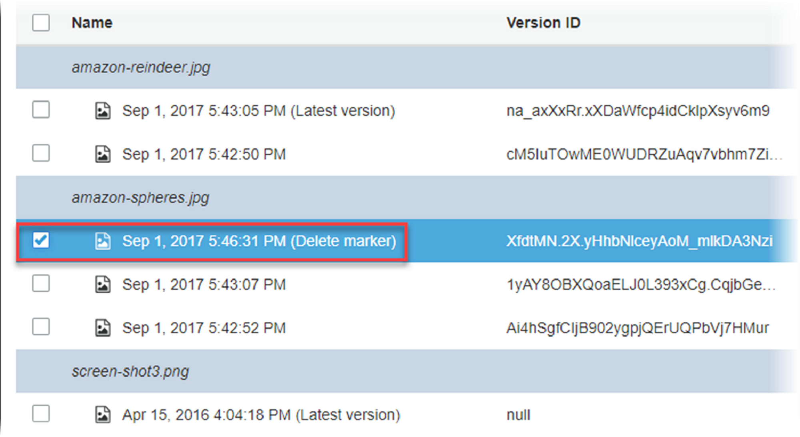
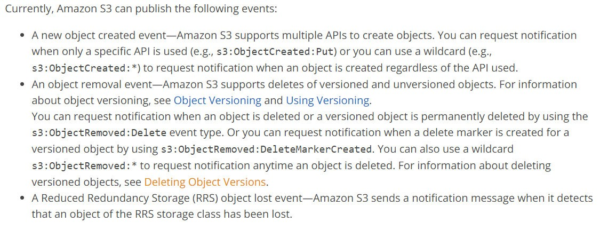

==Question 1Correct==

**Domain:** Specify Secure Applications and Architectures

Which of the following default settings are incorrect for a newly created S3 bucket? (choose 2 options)

- A. Encryption is not enabled.
- ==B. Transfer Acceleration is enabled.right==
- C. No bucket policy exists.
- ==D. Versioning is enabled.right==

###### Explanation:

**Answer: B,** **D**

When creating an S3 bucket, you can change the default configuration according to your requirements or leave the default options and continue to create the bucket. You can always change the configuration after you created the bucket.

- For option A, Default encryption is not enabled.

 

 

- For option B, Transfer Acceleration is suspended by default.

- For Option C, the bucket policy does not exist by default. We can restrict bucket access through the bucket policy.

- For option D, By default, Versioning is Disabled.

 

**Note:**

The question is, "Which of the following options are **incorrect** in terms of default settings?" 

A. Encryption is not enabled. -- we have to select the incorrect in terms of default settings, so it's not the answer.
B. Transfer Acceleration is enabled.-- we have to select the incorrect in terms of default settings, **so it's correct the answer.**
C. No bucket policy exists.-- we have to select the incorrect in terms of default settings, so it's not the answer.
D. Versioning is enabled.-- we have to select the incorrect in terms of default settings, **so it's correct the answer.**

==Question 2In Correct==

**Domain:** Other

Which of the following are S3 bucket properties? (Choose 2 options)

- ==A. Server access logging==
- ==B. Object level logging==
- C. Storage class
- D. Metadata

###### Explanation:

**Answer:** **A,** **B**

Following are S3 bucket properties.

  

- https://docs.aws.amazon.com/AmazonS3/latest/user-guide/view-bucket-properties.html

- Option C, Storage class property is at object level, not at the bucket level. Following are different storage classes.

- For more information on storage classes, refer to documentation here.
  - https://docs.aws.amazon.com/AmazonS3/latest/dev/storage-class-intro.html
- For option D, metadata is at object level property, not bucket level. For detailed information on object metadata, refer to documentation here. 
  - https://docs.aws.amazon.com/AmazonS3/latest/dev/UsingMetadata.html#object-metadata

==Question 3Correct==

**Domain:** Design Resilient Architectures

You have created an S3 bucket in the us-east-1 region with default configuration. You are located in Asia and deleted an object in the bucket using AWS CLI. However, when you tried to list the objects in the bucket, you still see the object you deleted. You are even able to download the object. What could have caused this behavior?

- A. Cross region deletes are not supported by AWS
- B. AWS provides eventual consistency for DELETES
- C. AWS keeps copy of deleted object for 7 days in STANDARD storage.
- ==D. AWS provides strong consistency for DELETES.==

###### Explanation:

**Answer: B**

 Amazon S3 offers eventual consistency for overwrite PUTS and DELETES in all regions.

  https://docs.aws.amazon.com/AmazonS3/latest/dev/Introduction.html#CoreConcepts and refer to “Amazon S3 Data Consistency Model.”

 For option A, you can perform DELETE operation from Console, CLI, programmatically from any region as long as you have access to perform.

For option C, AWS S3 deletes any object for which a DELETE request is made from an authorized IAM entity.

It does not keep a copy unless you have versioning enabled and you have multiple versions of the deleted object.

  https://docs.aws.amazon.com/AmazonS3/latest/API/RESTObjectDELETE.html

 In this case, the bucket is created with a default configuration that has versioning disabled. For option D, AWS does not provide strong consistency for DELETES.

==Question 4In Correct==

**Domain:** Other

Your organization is planning to upload a large number of files to the AWS cloud. These files need to be immediately available for download across different geographical regions right after the upload is complete. They consulted you to check if S3 is a suitable solution for the use case. What do you suggest?

- A. S3 is not suitable for immediate downloads because new AWS provides eventual consistency for new objects.
- B. S3 is suitable for immediate downloads because AWS provides read-after-write consistency for new objects.
- C. EFS is suitable for immediate downloads because AWS provides eventual consistency for new objects.
- ==D. S3 is suitable for immediate downloads because AWS provides strong consistency for new objects==

###### Explanation:

**Answer:** **B**

Amazon S3 provides read-after-write consistency for PUTS of new objects in your S3 bucket in all regions with one caveat. The caveat is that if you make a HEAD or GET request to the key name (to find if the object exists) before creating the object, Amazon S3 provides eventual consistency for read-after-write.

Option A is not true. Eventual consistency is for overwrite PUTS and DELETES. Option C is not true. EFS provides read-after-write consistency.

 

For option D, AWS provides strong consistency for DynamoDB, not for S3.

==Question 5In Correct==

**Domain:** Other

You are a solutions architect. Your organization is building an application on-premise. But would like to keep the storage on AWS. Objects/files must only be accessed via the application as there are relational and access related logics built in the application. But, as an exception, Administrators should access the objects/files directly from AWS S3 console/API bypassing the application. What solution would you provide?

- A. Cached Volume Gateway
- B. Stored Volume Gateway
- ==C. File Gateway==
- D. Custom built solution using S3

###### Explanation:

**Answer: C**

==The File Gateway presents a file interface that enables you to store files as objects in Amazon S3 using the industry-standard NFS and SMB file protocols, and access those files via NFS and SMB from your datacenter or Amazon EC2, or access those files as objects with the S3 API.==

 

- https://d1.awsstatic.com/whitepapers/aws-storage-gateway-file-gateway-for-hybrid-architectures.pdf

- For option A, with Cached Volumen Gateway, you store your data in Amazon Simple Storage Service (Amazon S3) and retain a copy of frequently accessed data subsets locally. We can take incremental backups, called snapshots of the storage volume in S3. All gateway data and snapshot data for cached volumes are stored in Amazon S3 and encrypted at rest using server-side encryption (SSE). However, you can't access this data with the Amazon S3 API or other tools such as the Amazon S3 Management Console.

- For option B, with stored volumes, you store the entire set of volume data on-premises and store periodic point-in-time backups (snapshots) in AWS. In this model, your on-premises storage is primary, delivering low-latency access to your entire dataset. AWS storage is the backup that you can restore in the event of a disaster in your data center.

- For option D, although a custom-built solution using S3 might work, it is not recommended.

AWS provided services where ever possible.

- For more information on AWS storage gateways, refer to documentation here.
  - https://docs.aws.amazon.com/storagegateway/latest/userguide/WhatIsStorageGateway.html

==Question 6Correct==

**Domain:** Other

You have created an S3 bucket in the us-east-1 region with default configurations. You have uploaded few documents and need to be shared with a group within the organization granting them access for a limited time. What is the recommended approach?

- A. Create one IAM user per person, attach managed policy for each user with GetObject action on your S3 bucket. Users can log in to AWS console and download documents.
- B. Create one IAM user per person, add them to an IAM group, attach managed policy for the group with GetObject action on your S3 bucket. Users can log in to AWS console and download documents.
- ==C. Generate a pre-signed URL with an expiry date and share the URL with all persons via email.right==
- D.  By default, the S3 bucket has public access enabled. Share the document URLs with all persons via email.

###### Explanation:

**Answer: C**

All objects by default are private. Only the object owner has permission to access these objects. However, the object owner can optionally share objects with others by creating a pre-signed URL, using their own security credentials, to grant time-limited permission to download the objects.

Anyone who receives the pre-signed URL can then access the object. For example, if you have a video in your bucket and both the bucket and the object are private, you can share the video with others by generating a pre-signed URL.

- For more information, refer to the documentation here. 
  - https://docs.aws.amazon.com/AmazonS3/latest/dev/ShareObjectPreSignedURL.html

- Although these solutions work for options A and B, it’s a lot of setup for enabling the download of documents. Also, AWS recommends using temporary credentials for use cases where users occasionally need access to AWS resources. 

In this case, a pre-signed URL grants temporary access to the S3 objects and access gets expired when the time limit has reached.

- Option D is incorrect. All objects in the S3 bucket are private by default.

 ==Question 7Correct==

**Domain:** Other

Which of the following are valid statements about Amazon S3? (Select THREE.)

- A. S3 provides strong read-after-write consistency ONLY for PUTs.
- B. S3 provides concurrent consistency for PUTs or DELETES.
- ==C. Amazon S3 does not support object locking for concurrent writers.right==
- ==D. Any read that is initiated following the receipt of a successful PUT response will return the data written by the PUT.right==
- ==E. Updates to a single key are atomic.right==

###### Explanation:

**Answer:** **C,** **D,** **E**

Option A is incorrect. Amazon S3 provides strong read-after-write consistency for PUTs and DELETEs of objects in your Amazon S3 bucket in all AWS Regions.

Option B is incorrect. AWS provides strong consistency for S3 objects. Concurrent consistency is incorrect.

Option C is CORRECT 

"Amazon S3 does not support object locking for concurrent writers. If two PUT requests are simultaneously made to the same key, the request with the latest timestamp wins. If this is an issue, you will need to build an object-locking mechanism into your application."

Option D is CORRECT

"Amazon S3 achieves high availability by replicating data across multiple servers within AWS data centers. If a PUT request is successful, your data is safely stored. Any read (GET or LIST) that is initiated following the receipt of a successful PUT response will return the data written by the PUT."

Option E is CORRECT

"Updates to a single key are atomic. For example, if you PUT to an existing key from one thread and perform a GET on the same key from a second thread concurrently, you will get either the old data or the new data, but never partial or corrupt data."

Refer to section "Amazon S3 data consistency model" on page 4 on the link: https://docs.aws.amazon.com/AmazonS3/latest/dev/s3-dg.pdf#Welcome

==Question 8In Correct==

**Domain:** Design Resilient Architectures

You are designing a web application that stores static assets in an Amazon S3 bucket. You expect this bucket to immediately receive over 400 requests with a mix of GET/PUT/DELETE per second. What should you do to ensure optimal performance?

- ==A. Amazon S3 will automatically manage performance at this scale.right==
- B. Add a random prefix to the key names.wrong
- C. Use a predictable naming scheme, such as sequential numbers or date time sequences, in the key names.
- D. Use multi-part upload.

###### Explanation:

 **Correct** **Answer:** **A**

\#####################

# Request Rate and Performance Guidelines

Amazon S3 automatically scales to high request rates. For example, your application can achieve at least 3,500 PUT/POST/DELETE and 5,500 GET requests per second per prefix in a bucket. There are no limits to the number of prefixes in a bucket. It is simple to increase your read or write performance exponentially. For example, if you create 10 prefixes in an Amazon S3 bucket to parallelize reads, you could scale your read performance to 55,000 read requests per second.

 \###################################

For More Information:

https://aws.amazon.com/about-aws/whats-new/2018/07/amazon-s3-announces-increased-request-rate-performance/

==Question 9Correct==

**Domain:** Other

You have an application running on EC2. When the application trying to upload a 7 GB file to S3, the operation fails. What could be the reason for failure, and what would be the solution?

- ==A. With a single PUT operation, you can upload objects up to 5 GB in size. Use multi-part upload for larger file uploads.right==
- B. EC2 is designed to work best with EBS volumes. Use EBS Provisioned IOPs and use an Amazon EBS-optimized instance.
- C. NAT gateway only supports data transfers going out upto 5 GB. Use EBS Provisioned IOPs and use an Amazon EBS-optimized instance.
- D. VPC Endpoints only supports data transfers going out upto 5 GB. Use EBS Provisioned IOPs and use an Amazon EBS-optimized instance.

###### Explanation:

**Answer:** **A**

AWS recommends using multi-part uploads for larger objects.

 

For more information on multi-part uploads, refer to documentation here. https://docs.aws.amazon.com/AmazonS3/latest/dev/mpuoverview.html

For option B, Amazon EBS is a storage for the drives of your virtual machines. It stores data as blocks of the same size and organizes them through a hierarchy similar to a traditional file system. EBS is not a standalone storage service like Amazon S3. So you can use it only in combination with Amazon EC2.

Objects can be stored on EBS volumes, but not cost-effective and not highly resilient and fault-tolerant compared to S3.

Options C and D are incorrect. NAT Gateway ad VPC endpoints do not have any data transfer limitations.

==Question 10Correct==

**Domain:** Design Resilient Architectures

You have an application on EC2 which stores the files in an S3 bucket. EC2 is being launched using a role that has GetObject permissions on the S3 bucket defined in its policy. The users who authenticate this application will get a pre-signed URL for the files in an S3 bucket using EC2 role temporary credentials. However, users are reporting that they get an error when accessing pre-signed URLs. What could be the reason? (SELECT TWO)

- ==A. Pre-Signed URLs expired.==
- B. Logged in user must be an IAM user to download the file through a pre-signed URL.
- ==C. Bucket has a "Deny" policy. EC2 role not whitelisted in the policy statement with Allow.==
- D. The default policy on temporary credentials does not have GetObject privileges on a S3 bucket.

###### Explanation:

**Answer: A,** **C**

All objects in S3 are private by default. Only the object owner has permission to access these objects. However, the object owner can optionally share objects with others by creating a pre-signed URL, using their own security credentials, to grant time-limited permission to download the objects.

Anyone who receives the pre-signed URL can then access the object. For example, if you have a video in your bucket and both the bucket and the object are private, you can share the video with others by generating a pre-signed URL.

- For more information, refer to the documentation here.
  - https://docs.aws.amazon.com/AmazonS3/latest/dev/ShareObjectPreSignedURL.html

- For option A, while generating pre-signed URL programmatically using SDK/API, we estimate how long the URL should be valid. When the URL is accessed after the specified duration, you will get an error.

- For option B, AWS recommends using temporary credentials whenever users need time-limited access to AWS resources instead of using IAM users for each request.

- For more information on temporary credentials, refer to the documentation here. 
  - https://docs.aws.amazon.com/IAM/latest/UserGuide/id_credentials_temp.html

- For option C, if a bucket policy contains Effect as Deny, you must whitelist all the IAM resources which need access on the bucket. Otherwise, IAM resources cannot access the S3 bucket even if they have full access.

- For detailed information on how to restrict the bucket, refer to documentation here. 
  - [https://aws.amazon.com/blogs/security/how-to-restrict-amazon-s3-bucket-access-to-a-specific-](https://aws.amazon.com/blogs/security/how-to-restrict-amazon-s3-bucket-access-to-a-specific-iam-role/)[iam-role/](https://aws.amazon.com/blogs/security/how-to-restrict-amazon-s3-bucket-access-to-a-specific-)

- For option D, the policy is an optional parameter when temporary credentials are generated using AssumeRole (which is how EC2 generates temporary credentials using instance-profile). There is no default policy.

==Question 11Correct==

**Domain:** Other

Your organization has an S3 bucket that stores confidential information. Access is granted to certain programmatic IAM users and restricted these IAM users' requests to be originated from within your organization's IP address range. However, your organization suspects there might be requests from other IP addresses to S3 buckets to download certain objects. How would you troubleshoot to find out the requester IP address? (choose 2 options)

- A. Enable VPC flow logs in the region where S3 bucket exists.
- ==B. Enable server access logging==
- ==C. Enable CloudTrail logging using OPTIONS object==
- D. Enable CloudWatch metrics

###### Explanation:

**Answer: B,** **C**

==Server access logging provides detailed records for the requests that are made to a bucket==. Server access logs are useful for many applications. For example, access log information can be useful in security and access audits.

- For details on how to enable logging for S3, refer to documentation here. 
  - https://docs.aws.amazon.com/AmazonS3/latest/dev/ServerLogs.html#server-access-logging-overview
- For information about the format of the log file, refer to documentation here.
  - https://docs.aws.amazon.com/AmazonS3/latest/dev/LogFormat.html

For option A, S3 is a managed service and not part of VPC. So enabling VPC flow logs does not report traffic sent to the S3 bucket.

Option B is correct.

Option C is correct. Using the information collected by CloudTrail, you can determine what request was made to Amazon S3, the source IP address from which the request was made, who made the request, when it was made, and so on. This information helps you to track changes made to your AWS resources and to troubleshoot operational issues.

- For detailed information about how S3 requests are tracked using CloudTrail, refer to documentation here.
  - https://docs.aws.amazon.com/AmazonS3/latest/dev/cloudtrail-logging.html#cloudtrail-logging- s3-info

  For option D, although CloudWatch has metrics for S3 requests, this does not provide detailed information about each request. It generates metrics for the number of requests sent for each type.

- For more information about S3 CloudWatch request metrics, refer to documentation here. 
  - https://docs.aws.amazon.com/AmazonS3/latest/dev/cloudwatch-monitoring.html#s3-request-cloudwatch-metrics

==Question 12In Correct==

**Domain:** Other

An organization plans to build web and mobile applications that can upload 100,000 images every day into S3. The applications expect a sudden increase in volume. However, they are lean on budget and looking for a cost-effective solution. As an architect, you are approached if S3 suits their requirements. What information will you gather to make a decision? (Choose 2 options)

- ==A. Gather information on the high availability of data and frequency of requests to choose storage class of objects in S3.==
- B. Gather information on total size to properly design prefix namespace.wrong
- C. Gather information on total size to provision storage on the S3 bucket.
- ==D. Gather information on the number of requests during peak time.==

###### Explanation:

**Answer: A,** **D**

For option A, S3 offers different storage classes. Based on the storage type, availability % would change along with the cost. If the images need to be highly available and frequently accessed, choose STANDARD. If the images need not be highly available but frequently accessed, choose REDUCED_REDUNDANCY class. If the images need to be highly available but not frequently accessed, choose STANDARD_IA class. If the images need not be highly available and not frequently accessed, choose ONEZONE_IA.The following are the prices for each storage class.

For more information on S3 storage classes, refer to the documentation here.

- https://docs.aws.amazon.com/AmazonS3/latest/dev/storage-class-intro.html

- For option B, prefix naming is required for optimal performance if we expect a higher number of objects. Option D is correct. Following is the explanation.

Amazon S3 maintains an index of object key names in each AWS Region. Object keys are stored in UTF-8 binary ordering across multiple partitions in the index. The key name determines which partition the key is stored in.

Although Amazon S3 automatically scales to high request rates, using a sequential prefix, such as a timestamp or an alphabetical sequence, increases the likelihood that Amazon S3 will target a specific partition for a large number of your keys, potentially overwhelming the I/O capacity of the partition.

When your workload is a mix of request types, introduce some randomness to key names by adding a hash string as a prefix to the key name. Introducing randomness to your key names, the I/O load will be distributed across multiple index partitions. For example, you can compute an MD5 hash of the character sequence that you plan to assign as the key and add 3 or 4 characters from the hash as a prefix to the key name. The following example shows key names with a 4 character hexadecimal hash added as a prefix.

Without the 4 character hash prefix, S3 may distribute all of this load to 1 or 2 index partitions since the name of each object begins with examplebucket/2013-26-05-15-00-0, and all objects in the index are stored in alpha-numeric order. The 4 character hash prefix ensures that the load is spread across multiple index partitions.

When your workload is sending mostly GET requests, you can add randomness to key names. Besides, you can integrate Amazon CloudFront with Amazon S3 to distribute content to your users with low latency and a high data transfer rate.

- For option C, AWS S3 storage is virtually unlimited. No need to provide any storage upfront.
- Option D is CORRECT because we need to calculate the "UsageValue" of the S3 BUCKET. One of the criteria for determining this is "The number of requests during the specified time period."

- Please refer to page 87 of the below link-
  - https://docs.aws.amazon.com/AmazonS3/latest/dev/s3-dg.pdf

==Question 13Correct==

**Domain:** Other

Which of the following are system metadata for objects in S3? (choose 3 options)

- ==A. x-amz-server-side-encryption==
- B.  x-amz-meta-object-id
- ==C. x-amz-version-id==
- ==D. Content-Length==
- E. x-amz-meta-location

###### Explanation:

Answer: A, C, D

AWS S3 bucket objects contain two kinds of metadata, system metadata and user-defined metadata.

**System** **metadata:**

Metadata such as object creation date is system controlled where only Amazon S3 can modify the value.

Other system metadata, such as the storage class configured for the object and whether the object has server-side encryption enabled, are examples of system metadata whose values you control. If your bucket is configured as a website, sometimes you might want to redirect a page request to another page or an external URL. In this case, a webpage is an object in your bucket. Amazon S3 stores the page redirect value as system metadata whose value you control.

 When you create objects, you can configure values of these system metadata items or update the values when you need to

**User-defined** **metadata:**

When uploading an object, you can also assign metadata to the object. You provide this optional information as a name-value (key-value) pair when you send a PUT or POST request to create the object. When you upload objects using the REST API, the optional user-defined metadata names must begin with **"x-amz-meta-"** to distinguish them from other HTTP headers

- For more information on object metadata, refer to documentation here. 
  - https://docs.aws.amazon.com/AmazonS3/latest/dev/UsingMetadata.html#object-metadata
- For additional information:
  - https://docs.aws.amazon.com/AmazonS3/latest/API/RESTObjectPUT.html

==Question 14In Correct==

**Domain:** Other

Your organization needs to meet audit compliance and hence need to log all the requests sent to 10 buckets that contain confidential information. These will also be periodically used to determine if any requests are being made from outside the organization’s IP address range. Your AWS application team had enabled S3 server access logging through AWS Console for all the buckets into a common logging bucket named s3-server-logging. But after few hours they noticed no logs were being written into the logging bucket. What could be the reason?

- ==A. Bucket user-defined deny policy is not allowing Log Delivery group to write into S3 logging bucket.==
- B. Bucket public access is not enabled.
- C. Write access is disabled for Log Delivery group.wrong
- D. Bucket name for server access logging should be “s3-server-access-logging” in order to write the request logs.

###### Explanation:

**Answer: A**

Server access logging provides detailed records for the requests that are made to a bucket. Server access logs are useful for many applications. For example, access log information can be useful in security and access audits.

For details on logging for S3, refer to documentation here. 

- https://docs.aws.amazon.com/AmazonS3/latest/dev/ServerLogs.html#server-access-logging-overview

- For option A, S3 buckets would often be restricted using bucket policy with Effect as Deny except for whitelisted IAM resources that would require access.

For detailed information on how to restrict the bucket, refer to documentation here. 

- https://aws.amazon.com/blogs/security/how-to-restrict-amazon-s3-bucket-access-to-a-specific-iam-role/

To provide access to the log delivery group, you need to add the following statement to your bucket policy explicitly.

{
"Version": "2012-10-17",
"Statement": [ 
       { Delivery service", 
        "Sid": "Permit access log delivery by AWS ID for Log 
        "Effect": "Allow", 
        "Principal": { 
                "AWS": "arn:aws:iam::858827067514:root" 
              }, 
        "Action": "s3:PutObject", 
        "Resource": "arn:aws:s3:::examplebucket/logs/*" 
       } 
       ]
}

Also, make sure the arn “arn:aws:iam::858827067514:root” is whitelisted in the Deny statement of your bucket policy.

- For option B, public access is not required to be enabled for writing logs into the S3 bucket. The only access required is PutObject for the Log Delivery group.
- For option C, although the log delivery group permission is disabled by default, permission will be granted when the bucket is selected as the target for logging.

- https://docs.aws.amazon.com/AmazonS3/latest/dev/enable-logging-console.html

- Option D is a false statement

==Question 15Correct==

**Domain:** Other

You are building a web application that will allow authenticated users to upload videos to the AWS S3 bucket across multiple domains. However, while testing the application, you found that the upload requests to S3 are being blocked. What should you do to make the upload work?

- A. Enable public access to allow uploads from web applications.
- ==B. Add configuration in S3 bucket CORS to allow PUT requests from web application URL.==
- C. Add Content-Length and Content-MD5 headers while sending upload requests to S3
- D. Web application URL must be added to bucket policy to allow PutObject requests.

###### Explanation:

**Answer:** **B**

Cross-origin resource sharing (CORS) defines a way for client web applications loaded in one domain to interact with resources in a different domain. With CORS support, you can build rich client-side web applications with Amazon S3 and selectively allow cross-origin access to your Amazon S3 resources.

For more information on CORS, refer to documentation here. https://docs.aws.amazon.com/AmazonS3/latest/dev/cors.html#example-scenarios-cors

For option A, enabling public access will not enable the web application to send requests to the S3 bucket. Furthermore, AWS does not recommend enabling public access on an S3 bucket unless you are hosting static assets that all can access.

For more information on securing S3 buckets, refer to documentation here: https://aws.amazon.com/premiumsupport/knowledge-center/secure-s3-resources/

For option C, Content-Length and Content-MD5 are system metadata for objects. They are set while creating/uploading an object. However, these parameters do not enable web applications to send requests to the S3 bucket.

For option D, the AWS S3 bucket policy does not grant permissions based on the web application.

URLs.

However, you can set up a condition in the policy to restrict access only if the request is being sent from a certain URL using the “aws:Referer” context-key.

[https://docs.aws.amazon.com/AmazonS3/latest/dev/example-bucket-policies.html#example- bucket-policies-use-case-4](https://docs.aws.amazon.com/AmazonS3/latest/dev/example-bucket-policies.html#example-bucket-policies-use-case-4)

==Question 16In Correct==

**Domain:** Other

You have uploaded a file to AWS S3 bucket with content ‘foo’. You have overwritten the file with the content ‘bar’. When you made a GetObject request immediately after overwrite, what output can you expect?

- A. foo
- ==B. bar==
- C. either foo or bar
- D. An error stating “Object updating. Please try after some time.”

###### Explanation:

**Answer:** **C**

Amazon S3 offers eventual consistency for overwrite PUTS and DELETES in all regions.

A process replaces an existing object and immediately attempts to read it. Until the change is fully propagated, Amazon S3 might return the prior data.

**NOTE:**

This is because Updates to an object are atomic i.e. when you do PUT for an object. After that, you GET(read) that object you will either get the updated object or the old one(before the update), you will never get partial or corrupt or no data.

AWS says, "A process replaces an existing object and immediately attempts to read it. Until the change is fully propagated, Amazon S3 might return the prior data."

- https://docs.aws.amazon.com/AmazonS3/latest/dev/Introduction.html#BasicsObjects

==Question 17Correct==

**Domain:** Design Resilient Architectures

You created a bucket named “myfirstwhizbucket” in the US West region. What are valid URLs for accessing the bucket? (Choose 2 options)

- A. https://myfirstwhizbucket.s3.us-west-1.amazonaws.com
- B. https://s3.myfirstwhizbucket.us-west-1.amazonaws.com
- C. https://s3.us-west-1.amazonaws.com/myfirstwhizbucket
- D. https://s3-us-west-1-amazonaws.com/myfirstwhizbucket
- E. https://s3.amazonaws.com/myfirstwhizbucket

###### Explanation:

**Answer: A,** **C**

 

- For option A, it matches the virtual-hosted-style URL and it is correct.
- For option B, it does not match any of the above-mentioned URL patterns. It is incorrect.
- For option C, it matches the path-style URL and it is correct.
- For option D, it does not match any of the above-mentioned URL patterns.
- For option E, it matches the path-style URL, but since the bucket is in the us-west-1 region, it must contain the region in the endpoint. So it is incorrect.
  - https://docs.aws.amazon.com/AmazonS3/latest/dev/UsingBucket.html#access-bucket-intro

**NOTE: Option C and D are different. (Dot and Hyphen).**

- Option C - https://s3.us-west-1.amazonaws.com/myfirstwhizbucket
- Option D - https://s3-us-west-1-amazonaws.com/myfirstwhizbucket

==Question 18In Correct==

**Domain:** Other

What are the minimum and maximum file sizes that can be stored in S3 respectively?

- A. 1 KB and 5 gigabytes
- B. 1 KB and 5 terabytes
- C. 1 Byte and 5 gigabyteswrong
- ==D. 0 Bytes and 5 terabytesright==

###### Explanation:

**Answer:** **D**

 

==Question 19Correct==

**Domain:** Other

Your organization writes many application logs regularly to AWS s3 bucket and are the only copies available, not stored anywhere else. These files range between 10MB-500MB in size and are not accessed regularly. They are required once in a while to troubleshoot application issues. The application team needs the last 60 days of log files to be immediately available when required. Logs older than 60 days need not be accessible immediately but need to keep a copy for reference. What approach would you recommend to keep the billing cost to a minimum?

- ==A. Set object storage class to STANDARD-IA. Use Lifecycle Management to move data from STANDARD-IA to Glacier after 60 days.right==
- B. Set object storage class to STANDARD. Use Lifecycle Management to move data from STANDARD to STANDARD-IA after 60 days.
- C. Set storage class to STANDARD. Use Lifecycle Management to move data from STANDARD to STANDARD-IA after 30 days and move data from STANDARD-IA to Glacier after 30 days.
- D. Set object storage class to One Zone-IA. Use Lifecycle Management to move data from One Zone-IA to Glacier after 60 days.

###### Explanation:

**Answer: A**

The following are the storage classes for S3 objects and their pricing models.

 STANDARD-IA offers cheaper storage than the STANDARD class. However, AWS charges $0.01 per GB of data retrieved from the Infrequent Access storage class apart from the standard download pricing.

Options B, C, D state the initial storage to be STANDARD and ONE ZONE-IA.

For the given use case, due to the following factors, STANDARD-IA is more suitable than STANDARD or ONE ZONE-IA as initial storage.

Data is not accessed regularly. STANDARD is not suitable.

Data is kept for at least 60 days, and the minimum file size is 1 MB. Meets STANDARD-IA requisites.

Data is the primary copy, not stored anywhere else. ONE ZONE-IA is not suitable.

Data needs to be available immediately when required. Available with all classes except Glacier.

After 60 days, the data can be transitioned to Glacier using Lifecycle management rules since they need not be accessible immediately.

Therefore, from the above options, A is correct.

In the question, they mentioned that "**Your organization writes a lot of application logs on a regular basis to AWS s3 bucket and are the only copies available, not stored anywhere else.**" which means the organization is not having another copy of the data at any other location. The data is just stored in S3 only.

So if we use the OneZone-IA storage class, it will not maintain a replica of your data in multiple availability zones.

AWS says, "**S3 One Zone-Infrequent Access (S3 One Zone-IA; Z-IA) is a new storage class designed for customers who want a lower-cost option for infrequently accessed data, but do not require the multiple Availability Zone data resilience model** of the S3 Standard and S3 Standard-Infrequent Access (S3 Standard-IA; S-IA) storage classes."

Based on the requirement, S3-IA is a suitable Option. 

Note: objects can be directly uploaded as the S3-IA storage type. The minimum storage duration of S3-IA is 30 days and can be extended based on costs.

==Question 20Correct==

**Domain:** Other

With S3 Versioning enabled on the bucket, how will billing be applied for the following scenario using the same key for upload?

- Total days bucket in use: 25 days.
- 1st File uploaded on 1st Day of the use – 1 GB.
- 2nd File uploaded within the same bucket on the 15th Day of the use – 5 GB.

- A. Charges 6 GB for 25 days.
- ==B. Charges 1 GB for 25 days and 5 GB for 11 days.right==
- C. Charges 1 GB for 14 days and 5 GB for 11 days.
- D. Charges 5 GB for 25 days.

###### Explanation:

**Answer:** **B**

-  When versioning is enabled on the S3 bucket, and a new version is added to an existing object, remember that the older version still remains and AWS charges the same price for old versions and new versions.

- In the given use case, 1 GB uploaded on day 1 remains in S3 for 25 days. 5 GB uploaded on day 15 will be in S3 for only 11 days.

==Question 21In Correct==

**Domain:** Other

You have a version enabled S3 bucket. You have accidentally deleted an object which contains 3 versions. You would want to restore the deleted object. What can be done?

- A. Select the deleted object and choose to restore option in More menu.wrong
- ==B. Delete the delete-marker on the object.right==
- C. Versioning in S3 only supports keeping multiple copies. It does not support restoring deleted objects.
- D. In version enabled bucket, Delete request only deletes the latest version. You can still see the older versions of the object using version Id in the GET request.

###### Explanation:

**Answer:** **B**

When you delete an object in a versioning-enabled bucket, all versions remain in the bucket, and Amazon S3 creates a delete marker for the object.

To undelete an object, you must delete the delete marker. Select the checkbox next to the object's delete marker to recover, and then choose delete from the More menu.

 

 

For more information on how to undelete objects in version enabled S3 bucket, refer to documentation here.

- https://docs.aws.amazon.com/AmazonS3/latest/user-guide/undelete-objects.html

 ==Question 22Correct==

**Domain:** Other

You have an application that writes application logs to version enabled S3 bucket. Each object has multiple versions attached to it. After 60 days, the application deletes the objects in S3 through DELETE API on the object. However, in next month’s bill, you see charges for S3 usage on the bucket. What could have caused this?

- A. DELETE API call on the object only deletes latest version.
- ==B. DELETE API call on the object does not delete the actual object, but places delete marker on the object.right==
- C. DELETE API call moves the object and its versions to S3 recycle bin from where the object can be restored till 30 days.
- D. DELETE API for all versions of the object in version enabled bucket cannot be done through API. It can be only done by bucket owners through the console.

###### Explanation:

**Answer:** **B**

When versioning is enabled, a simple DELETE cannot permanently delete an object.

Instead, Amazon S3 inserts a delete marker in the bucket, and that marker becomes the current version of the object with a new ID. When you try to GET an object whose current version is a

delete marker, Amazon S3 behaves as though the object has been deleted (even though it has not been erased) and returns a 404 error.

The following figure shows that a simple DELETE does not actually remove the specified object. Instead, Amazon S3 inserts a delete marker.

  

To permanently delete versioned objects, you must use DELETE Object versioned.

The following figure shows that deleting a specified object version permanently removes that object.

For information on how to delete versioned objects through API, refer to documentation here. 

- https://docs.aws.amazon.com/AmazonS3/latest/dev/DeletingObjectVersions.html#delete-obj-version-enabled-bucket-rest

Option A is not true. DELETE call on an object does not delete the latest version unless the DELETE call is made with the latest version id.

Option C is not true. AWS S3 does not have to recycle bin.

Option D is not true. DELETE call on a versioned object can be made through API by providing the version id of the object’s version to be deleted.

==Question 23Correct==

**Domain:** Other

You are uploading multiple files ranging 10 GB – 20 GB in size to the AWS S3 bucket by using a multi-part upload from an application on EC2. Once the upload is complete, you would like to notify a group of people who do not have AWS IAM accounts. How can you achieve this? (choose 2 options)

- ==A. Use S3 event notification and configure Lambda function which sends email using AWS SES non-sandbox.right==
- ==B. Use S3 event notification and configure SNS which sends email to subsribed email addresses.right==
- C. Write a custom script on your application side to poll S3 bucket for new files and send email through SES non-sandbox.
- D. Write a custom script on your application side to poll S3 bucket for new files and send email through SES sandbox.

###### Explanation:

**Answer:** **A,** **B**

The Amazon S3 notification feature enables you to receive notifications when certain events happen in your bucket. To enable notifications, you must first add a notification configuration identifying the events you want Amazon S3 to publish and the destinations where you want Amazon S3 to send the event notifications.

 

- https://docs.aws.amazon.com/AmazonS3/latest/dev/NotificationHowTo.html

 AWS Simple Email Service (SES) is a cost-effective email service built on the reliable and scalable infrastructure that Amazon.com developed to serve its own customer base. With Amazon SES, you can send transactional email, marketing messages, or any other type of high-quality content.

To help prevent fraud and abuse and to help protect your reputation as a sender, we apply certain restrictions to new Amazon SES accounts.

We place all new accounts in the Amazon SES sandbox. While your account is in the sandbox, you can use all of the features of Amazon SES. However, when your account is in the sandbox, we apply the following restrictions to your account:

You can only send mail to verified email addresses and domains or to the Amazon SES

mailbox simulator.

You can only send mail from verified email addresses and domains.

**Note**

This restriction applies even when your account is not in the sandbox.

You can send a maximum of 200 messages per 24-hour period.

You can send a maximum of 1 message per second.

 You can request to move out of sandbox mode when you are ready for production mode.

For more information on how to move out of sandbox mode, refer to documentation here.

- https://docs.aws.amazon.com/ses/latest/DeveloperGuide/request-production-access.html

Option A triggers Lambda function which uses non-sandbox SES to send email to people who does not have AWS IAM account nor verified in AWS SES.

Option B triggers SNS.

The following document describes how to add SNS event notifications to a bucket. 

- https://docs.aws.amazon.com/AmazonS3/latest/dev/ways-to-add-notification-config-to-bucket.html

Options C and D, although sounds feasible options, it requires compute resources to monitor S3 for new files continuously.

We should use AWS provided features where ever are applicable. Custom solutions can be built when AWS provided features do not meet the requirement.

 ==Question 24Correct==

**Domain:** Define Performant Architectures

Your organization had built a video sharing website on EC2 within the US for which the S3 bucket in us- east-1 is used to store the video files. The website has been receiving excellent feedback, and your organization decided to expand the website all over the world. However, customers in Europe and Asia started to complain that website access, upload and download of video files are slow. How can you resolve the issue? (choose 2 options)

- ==A. Use CloudFront for improving the performance on website by caching static files.==
- B. Use VPC Endpoints in Europe and Asia regions to improve S3 uploads and downloads.
- ==C. Enable Transfer Acceleration feature on S3 bucket which uses AWS edge locations to improve upload and download speeds.==
- D. Change your application design to provision higher-memory configuration EC2 instances and process S3 requests through EC2.

###### Explanation:

**Answer: A,** **C**

- Option A is correct. AWS CloudFront can be used to improve the performance of your website where network latency is an issue.
  - https://docs.aws.amazon.com/AmazonS3/latest/dev/website-hosting-cloudfront-walkthrough.html
- Option B is not correct. VPC endpoints do not support cross-region requests. Moreover, VPC endpoints are for accessing AWS resources within VPC.
- Option C is correct. Amazon S3 Transfer Acceleration enables fast, easy, and secure transfers of files over long distances between your client and an S3 bucket. Transfer Acceleration takes advantage of Amazon CloudFront’s globally distributed edge locations. As the data arrives at an edge location, data is routed to Amazon S3 over an optimized network path.
- For more information on transfer acceleration, refer to documentation here.
  - https://docs.aws.amazon.com/AmazonS3/latest/dev/transfer-acceleration.html#transfer-acceleration-why-use
- Option D is not a good design. It increases the cost of EC2 usage and does not solve the problem with slower upload and download speeds to S3.

==Question 25Correct==

**Domain:** Other

What does cross-region replication require versioning to be enabled on?

- A. Only on Destination bucket.
- B. Versioning is useful to avoid accidental deletes and not a requirement for replicating across regions.
- C. Only on Source bucket.
- ==D. Both Source and Destination buckets.right==

###### Explanation:

**Answer:** **D**

Cross-region replication is a bucket-level configuration that enables automatic, asynchronous copying of objects across buckets in different AWS Regions. We refer to these buckets as source bucket and destination bucket. These buckets can be owned by different AWS accounts.

For more information on AWS S3 cross-region replication, refer to documentation here.

- https://docs.aws.amazon.com/AmazonS3/latest/dev/crr.html

 