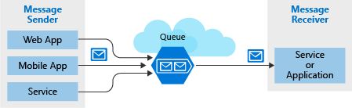

Learn how to create reliable messaging for your applications, and how to take advantage of serverless application services in Azure.

## Prerequisites

- Familiarity with C#

[Continue](https://docs.microsoft.com/en-us/learn/modules/choose-a-messaging-model-in-azure-to-connect-your-services/4-choose-event-grid/)BookmarkAdd to collection

### Modules in this learning path

https://docs.microsoft.com/en-us/learn/modules/create-serverless-logic-with-azure-functions/)

[Create serverless logic with Azure Functions](https://docs.microsoft.com/en-us/learn/modules/create-serverless-logic-with-azure-functions/)

Azure Functions allow developers to host business logic that can be executed without managing or provisioning infrastructure.

Overview

- [Introduction](https://docs.microsoft.com/en-us/learn/modules/create-serverless-logic-with-azure-functions/1-introduction/)3 min
- [Decide if serverless computing is right for your business needs](https://docs.microsoft.com/en-us/learn/modules/create-serverless-logic-with-azure-functions/2-decide-if-serverless-computing-is-right-for-your-business-need/)5 min
- [Exercise - Create a function app in the Azure portal](https://docs.microsoft.com/en-us/learn/modules/create-serverless-logic-with-azure-functions/3-create-an-azure-functions-app-in-the-azure-portal/)5 min
- [Run your code on-demand with Azure Functions](https://docs.microsoft.com/en-us/learn/modules/create-serverless-logic-with-azure-functions/4-creating-and-executing-an-azure-function/)10 min
- [Exercise - Add logic to the function app](https://docs.microsoft.com/en-us/learn/modules/create-serverless-logic-with-azure-functions/5-add-logic-to-the-function-app/)10 min
- [Summary](https://docs.microsoft.com/en-us/learn/modules/create-serverless-logic-with-azure-functions/6-summary/)3 min

https://docs.microsoft.com/en-us/learn/modules/route-and-process-data-logic-apps/)

[Route and process data automatically using Logic Apps](https://docs.microsoft.com/en-us/learn/modules/route-and-process-data-logic-apps/)

Define a workflow using built-in triggers, actions, and conditional operators. Your workflow will run automatically when data is available, process the data in the cloud, record results in a database, and send email notifications.

Overview

- [Introduction](https://docs.microsoft.com/en-us/learn/modules/route-and-process-data-logic-apps/1-introduction/)3 min
- [Design Logic Apps for your workflows](https://docs.microsoft.com/en-us/learn/modules/route-and-process-data-logic-apps/2-design-logic-apps-for-your-workflows/)8 min
- [Detect an external event using a trigger](https://docs.microsoft.com/en-us/learn/modules/route-and-process-data-logic-apps/3-detect-external-event-using-trigger/)8 min
- [Exercise - Create the social-media tracker Logic App](https://docs.microsoft.com/en-us/learn/modules/route-and-process-data-logic-apps/4-ex-create-social-media-tracker/)5 min
- [Execute an action](https://docs.microsoft.com/en-us/learn/modules/route-and-process-data-logic-apps/5-execute-an-action/)5 min
- [Exercise - Analyze the content of a tweet](https://docs.microsoft.com/en-us/learn/modules/route-and-process-data-logic-apps/6-ex-analyze-content-of-tweet/)5 min
- [Alter control flow using a control action](https://docs.microsoft.com/en-us/learn/modules/route-and-process-data-logic-apps/7-alter-control-flow-using-control-action/)5 min
- [Exercise - Branch based on tweet sentiment](https://docs.microsoft.com/en-us/learn/modules/route-and-process-data-logic-apps/8-ex-branch-based-on-tweet-sentiment/)12 min
- [Summary](https://docs.microsoft.com/en-us/learn/modules/route-and-process-data-logic-apps/9-summary/)5 min

https://docs.microsoft.com/en-us/learn/modules/choose-a-messaging-model-in-azure-to-connect-your-services/)

[Choose a messaging model in Azure to loosely connect your services](https://docs.microsoft.com/en-us/learn/modules/choose-a-messaging-model-in-azure-to-connect-your-services/)

When you have an application that consists of components running on different computers, servers, and mobile devices, reliable communications between those components can be difficult and unreliable. Azure provides several technologies that you can use to communicate more reliably, including Storage queues, Event Hubs, Event Grid, and Service Bus. This module shows you how to choose the best technology for your communication task.
https://docs.microsoft.com/en-us/learn/modules/choose-a-messaging-model-in-azure-to-connect-your-services/4-choose-event-grid/)

Overview

- [Introduction](https://docs.microsoft.com/en-us/learn/modules/choose-a-messaging-model-in-azure-to-connect-your-services/1-introduction/)5 min
- [Choose whether to use messages or events](https://docs.microsoft.com/en-us/learn/modules/choose-a-messaging-model-in-azure-to-connect-your-services/2-choose-whether-to-use-message-queues-or-events/)10 min
- [Choose a message-based delivery with queues](https://docs.microsoft.com/en-us/learn/modules/choose-a-messaging-model-in-azure-to-connect-your-services/3-choose-azure-storage-queues/)8 min
- [Choose Azure Event Grid](https://docs.microsoft.com/en-us/learn/modules/choose-a-messaging-model-in-azure-to-connect-your-services/4-choose-event-grid/)10 min
- [Choose Azure Event Hubs](https://docs.microsoft.com/en-us/learn/modules/choose-a-messaging-model-in-azure-to-connect-your-services/5-choose-azure-event-hubs/)10 min
- [Summary](https://docs.microsoft.com/en-us/learn/modules/choose-a-messaging-model-in-azure-to-connect-your-services/6-summary/)2 min

https://docs.microsoft.com/en-us/learn/modules/communicate-between-apps-with-azure-queue-storage/)

[Communicate between applications with Azure Queue storage](https://docs.microsoft.com/en-us/learn/modules/communicate-between-apps-with-azure-queue-storage/)

Implement the publish-subscribe pattern in the cloud using Azure Queue storage.

Overview

- [Introduction](https://docs.microsoft.com/en-us/learn/modules/communicate-between-apps-with-azure-queue-storage/1-introduction/)3 min
- [Create the Azure storage infrastructure](https://docs.microsoft.com/en-us/learn/modules/communicate-between-apps-with-azure-queue-storage/2-create-the-azure-storage-infrastructure/)5 min
- [Exercise - Create a storage account](https://docs.microsoft.com/en-us/learn/modules/communicate-between-apps-with-azure-queue-storage/3-exercise-create-the-azure-storage-infrastructure/)10 min
- [Identify a queue](https://docs.microsoft.com/en-us/learn/modules/communicate-between-apps-with-azure-queue-storage/4-identify-a-queue/)5 min
- [Exercise - Identify a queue](https://docs.microsoft.com/en-us/learn/modules/communicate-between-apps-with-azure-queue-storage/5-exercise-identify-a-queue/)5 min
- [Programmatically access a queue](https://docs.microsoft.com/en-us/learn/modules/communicate-between-apps-with-azure-queue-storage/6-how-to-programmatically-access-a-queue/)5 min
- [Exercise - Add a message to the queue](https://docs.microsoft.com/en-us/learn/modules/communicate-between-apps-with-azure-queue-storage/7-exercise-implement-enqueue/)10 min
- [Exercise - Retrieve a message from the queue](https://docs.microsoft.com/en-us/learn/modules/communicate-between-apps-with-azure-queue-storage/8-exercise-implement-dequeue/)10 min
- [Summary](https://docs.microsoft.com/en-us/learn/modules/communicate-between-apps-with-azure-queue-storage/9-summary/)3 min

https://docs.microsoft.com/en-us/learn/modules/enable-reliable-messaging-for-big-data-apps-using-event-hubs/)

**<u>Enable reliable messaging for Big Data applications using Azure Event Hubs</u>**

Connect sending and receiving applications with Event Hubs so you can handle extremely high loads without losing data.

Overview

- [Introduction](https://docs.microsoft.com/en-us/learn/modules/enable-reliable-messaging-for-big-data-apps-using-event-hubs/1-introduction/)3 min
- [Create an Event Hub using the Azure CLI](https://docs.microsoft.com/en-us/learn/modules/enable-reliable-messaging-for-big-data-apps-using-event-hubs/2-create-an-event-hub-using-azure-cli/)10 min
- [Exercise - Use the Azure CLI to Create an Event Hub](https://docs.microsoft.com/en-us/learn/modules/enable-reliable-messaging-for-big-data-apps-using-event-hubs/3-exercise-create-an-event-hub-using-azure-cli/)10 min
- [Configure applications to send or receive messages through an Event Hub](https://docs.microsoft.com/en-us/learn/modules/enable-reliable-messaging-for-big-data-apps-using-event-hubs/4-configure-applications-to-send-or-receive-messages-through-an-event-hub/)5 min
- [Exercise - Configure applications to send or receive messages through an Event Hub](https://docs.microsoft.com/en-us/learn/modules/enable-reliable-messaging-for-big-data-apps-using-event-hubs/5-exercise-configure-applications-to-send-or-receive-messages-through-an-event-hub/)10 min
- [Evaluate the performance of the deployed Event Hub using the Azure portal](https://docs.microsoft.com/en-us/learn/modules/enable-reliable-messaging-for-big-data-apps-using-event-hubs/6-evaluate-the-performance-of-the-deployed-event-hub-using-the-azure-portal/)5 min
- [Exercise - Evaluate the performance of the deployed Event Hub using the Azure portal](https://docs.microsoft.com/en-us/learn/modules/enable-reliable-messaging-for-big-data-apps-using-event-hubs/7-exercise-evaluate-the-performance-of-the-deployed-event-hub-using-the-azure-portal/)10 min
- [Summary](https://docs.microsoft.com/en-us/learn/modules/enable-reliable-messaging-for-big-data-apps-using-event-hubs/8-summary/)3 min

https://docs.microsoft.com/en-us/learn/modules/implement-message-workflows-with-service-bus/)

**<u>Implement message-based communication workflows with Azure Service Bus</u>**

Write C# code in a custom application that sends and receives messages using Azure Service Bus topics and queues.

Overview

- [Introduction](https://docs.microsoft.com/en-us/learn/modules/implement-message-workflows-with-service-bus/1-introduction/)3 min
- [Choose a messaging platform](https://docs.microsoft.com/en-us/learn/modules/implement-message-workflows-with-service-bus/2-choose-a-messaging-platform/)8 min
- [Exercise - Implement a Service Bus topic and queue](https://docs.microsoft.com/en-us/learn/modules/implement-message-workflows-with-service-bus/3-exercise-implement-a-service-bus-topic-and-queue/)10 min
- [Write code that uses Service Bus queues](https://docs.microsoft.com/en-us/learn/modules/implement-message-workflows-with-service-bus/4-write-code-that-uses-service-bus-queues/)5 min
- [Exercise - Write code that uses Service Bus queues](https://docs.microsoft.com/en-us/learn/modules/implement-message-workflows-with-service-bus/5-exercise-write-code-that-uses-service-bus-queues/)10 min
- [Write code that uses Service Bus topics](https://docs.microsoft.com/en-us/learn/modules/implement-message-workflows-with-service-bus/6-write-code-that-uses-service-bus-topics/)5 min
- [Exercise - Write code that uses Service Bus topics](https://docs.microsoft.com/en-us/learn/modules/implement-message-workflows-with-service-bus/7-exercise-write-code-that-uses-service-bus-topics/)10 min
- [Summary](https://docs.microsoft.com/en-us/learn/modules/implement-message-workflows-with-service-bus/8-summary/)3 min

https://docs.microsoft.com/en-us/learn/modules/react-to-state-changes-using-event-grid/)

**<u>React to state changes in your Azure services by using Event Grid</u>**

Build a serverless application architecture, automate your operations, and integrate applications by handling Azure events with Event Grid.

Overview

- [Introduction](https://docs.microsoft.com/en-us/learn/modules/react-to-state-changes-using-event-grid/1-introduction/)2 min
- [Respond to Azure events by using Event Grid](https://docs.microsoft.com/en-us/learn/modules/react-to-state-changes-using-event-grid/2-respond-using-event-grid/)7 min
- [Exercise - Trigger a logic app by using Event Grid](https://docs.microsoft.com/en-us/learn/modules/react-to-state-changes-using-event-grid/3-exercise-trigger-logic-app/)7 min
- [Build logic that responds to an event](https://docs.microsoft.com/en-us/learn/modules/react-to-state-changes-using-event-grid/4-build-logic-respond-event/)5 min
- [Exercise - Send an email when virtual machines change](https://docs.microsoft.com/en-us/learn/modules/react-to-state-changes-using-event-grid/5-exercise-email-vm-change/)7 min
- [Summary](https://docs.microsoft.com/en-us/learn/modules/react-to-state-changes-using-event-grid/6-summary/)5 min

[Expose hybrid services securely with Azure Relay](https://docs.microsoft.com/en-us/learn/modules/expose-hybrid-services-with-azure-relay/)

Securely expose services that run in your on-premises network to clients in the cloud, without having to open a port on your firewall or make intrusive changes to your corporate network infrastructure.

Overview

- [Introduction](https://docs.microsoft.com/en-us/learn/modules/expose-hybrid-services-with-azure-relay/1-introduction/)2 min
- [Create an Azure Relay hybrid connection](https://docs.microsoft.com/en-us/learn/modules/expose-hybrid-services-with-azure-relay/2-create-azure-relay-hybrid-connection/)10 min
- [Exercise - Create an Azure Relay hybrid connection](https://docs.microsoft.com/en-us/learn/modules/expose-hybrid-services-with-azure-relay/3-exercise-create-azure-relay-hybrid-connection/)10 min
- [Send requests through an Azure Relay hybrid connection](https://docs.microsoft.com/en-us/learn/modules/expose-hybrid-services-with-azure-relay/4-send-requests-through-relay/)10 min
- [Exercise - Send requests through an Azure Relay hybrid connection](https://docs.microsoft.com/en-us/learn/modules/expose-hybrid-services-with-azure-relay/5-exercise-send-requests-through-relay/)10 min
- [Summary](https://docs.microsoft.com/en-us/learn/modules/expose-hybrid-services-with-azure-relay/6-summary/)2 min

-----------------------------

# Choose a messaging model in Azure to loosely connect your services

- 22 min remaining
- Module
- 3 of 6 units completed

 4.6 (3,585)

Rate it

Beginner

Developer

Solution Architect

Azure

Service Bus

Event Grid

Event Hubs

When you have an application that consists of components running on different computers, servers, and mobile devices, reliable communications between those components can be difficult and unreliable. Azure provides several technologies that you can use to communicate more reliably, including Storage queues, Event Hubs, Event Grid, and Service Bus. This module shows you how to choose the best technology for your communication task.

## Learning objectives

In this module, you will:

- Describe events and messages, and the challenges you can use them to solve in a distributed application
- Identify scenarios in which Storage queue is the best messaging technology for an application
- Identify scenarios in which Event Grid is the best messaging technology for an application
- Identify scenarios in which Event Hubs is the best messaging technology for an application
- Identify scenarios in which Service Bus is the best messaging technology for an application

[Continue](https://docs.microsoft.com/en-us/learn/modules/choose-a-messaging-model-in-azure-to-connect-your-services/4-choose-event-grid/)BookmarkAdd to collection

## Prerequisites

None

## This module is part of these learning paths

- [Connect your services together](https://docs.microsoft.com/learn/paths/connect-your-services-together/)
- [Architect message brokering and serverless applications in Azure](https://docs.microsoft.com/learn/paths/architect-messaging-serverless/)

- [Introduction](https://docs.microsoft.com/en-us/learn/modules/choose-a-messaging-model-in-azure-to-connect-your-services/1-introduction)5 min
- [Choose whether to use messages or events](https://docs.microsoft.com/en-us/learn/modules/choose-a-messaging-model-in-azure-to-connect-your-services/2-choose-whether-to-use-message-queues-or-events)10 min
- [Choose a message-based delivery with queues](https://docs.microsoft.com/en-us/learn/modules/choose-a-messaging-model-in-azure-to-connect-your-services/3-choose-azure-storage-queues)8 min
- [Choose Azure Event Grid](https://docs.microsoft.com/en-us/learn/modules/choose-a-messaging-model-in-azure-to-connect-your-services/4-choose-event-grid)10 min
- [Choose Azure Event Hubs](https://docs.microsoft.com/en-us/learn/modules/choose-a-messaging-model-in-azure-to-connect-your-services/5-choose-azure-event-hubs)10 min
- [Summary](https://docs.microsoft.com/en-us/learn/modules/choose-a-messaging-model-in-azure-to-connect-your-services/6-summary)2 min

# Introduction

- 5 minutes

Many applications consist of programs that run on several different computers or devices. In such distributed applications, messages must be sent between the components across networks and long distances. Even on the same server or in the same data center, loosely coupled architectures require mechanisms for components to communicate. Reliable messaging is often a critical problem.

Suppose you work at a software company that develops a music-sharing application. Musicians can upload music they create to your platform by using a web front end or a mobile app. They can listen to and comment on other members' work. The application consists of a website that runs at your ISP, a mobile app that runs on users' mobile devices, a web API that runs in Azure, and an Azure SQL Database where data is stored.

You have observed that at times of high demand, some music files are not successfully uploaded, and some comments are not posted. Your testing shows that these issues are caused by dropped messages between front-end components and the web API. You plan to solve these issues by using one or more of the following technologies: Azure Storage queues, Azure Event Hubs, Azure Event Grid, and Azure Service Bus.

Here, you will learn how to choose the right messaging technology in Azure for each communication task in a distributed application.

## Learning objectives

In this module, you will:

- Describe events and messages, and the challenges you can use them to solve in a distributed application.
- Identify scenarios in which Storage queue is the best messaging technology for an application.
- Identify scenarios in which Event Grid is the best messaging technology for an application.
- Identify scenarios in which Event Hubs is the best messaging technology for an application.
- Identify scenarios in which Service Bus is the best messaging technology for an application.

# Choose whether to use messages or events

- 10 minutes

Suppose you are planning the architecture of a distributed music-sharing application. You want to ensure that the application is as reliable and scalable as possible, and you intend to use Azure technologies to build a robust communication infrastructure.

Before you can choose the right Azure technology, you must understand each individual communication that the components of the application exchange. For each communication, you can choose a different Azure technology.

The first thing to understand about a communication is whether it sends **messages** or **events**. This knowledge will help you choose the appropriate Azure service to use.

#### Communication strategies in Azure (APIs)

## What is a message?

In the terminology of distributed applications, **messages** have the following characteristics:

- A message contains raw data, produced by one component, that will be consumed by another component.
- A message contains the data itself, not just a reference to that data.
- The sending component expects the message content to be processed in a certain way by the destination component. The integrity of the overall system may depend on both sender and receiver doing a specific job.

For example, suppose a user uploads a new song by using the mobile music-sharing app. The mobile app must send that song to the web API that runs in Azure. The song media file itself must be sent, not just an alert that indicates that a new song has been added. The mobile app expects that the web API will store the new song in the database and make it available to other users. This is an example of a message.

## What is an event?

**Events** are lighter weight than messages, and are most often used for broadcast communications. The components sending the event are known as **publishers**, and receivers are known as **subscribers**.

With events, receiving components will generally decide in which communications they are interested, and will "subscribe" to those events. The subscription is managed by an intermediary, like Azure Event Grid or Azure Event Hubs. When publishers send an event, the intermediary will route that event to interested subscribers. This pattern is known as a "publish-subscribe architecture." It's not the only way to deal with events, but it is the most common.

Events have the following characteristics:

- An event is a lightweight notification that indicates that something happened.
- The event may be sent to multiple receivers, or to none at all.
- Events are often intended to "fan out," or have a large number of subscribers for each publisher.
- The publisher of the event has no expectation about the action a receiving component takes.
- Some events are discrete units and unrelated to other events.
- Some events are part of a related and ordered series.

For example, suppose the music file upload has been completed, and the new song has been added to the database. In order to inform users of the new file, the web API must inform the web front end and mobile app users of the new file. The users can choose whether to listen to the new song, so the initial notification does not include the music file but only notifies users that the song exists. The sender does not have a specific expectation that the event receivers will do anything particular in responsiveness of receiving this event.

This scenario is an example of a discrete event.

## How to choose messages or events

A single application is likely to use events for some purposes and messages for others. Before you choose, you must analyze your application's architecture and all its use cases, to identify all the different purposes where its components have to communicate with each other.

Events are more likely to be used for broadcasts and are often ephemeral, meaning a communication might not be handled by any receiver if none is currently subscribing. Messages are more likely to be used where the distributed application requires a guarantee that the communication will be processed.

For each communication, consider the following question: **Does the sending component expect the communication to be processed in a particular way by the destination component?**

If the answer is *yes*, choose to use a message. If the answer is *no*, you may be able to use events.

Understanding how your components need to communicate will help you to choose how your components will communicate. Let's start with messages.

## Check your knowledge

\1.  Suppose you have a distributed application with a web service that authenticates users. When a user logs on, the web service notifies all the client applications so they can display that user's status as "Online". Is the login notification an example of a message or an event?

Message

==Event==

\2. Suppose you have a distributed application with a web service that lets users manage their account. Users can sign up, edit their profile, and delete their account. When a user deletes their account, your web service notifies your data layer so the user's data will be removed from the database. Is the delete-account notification an example of a message or an event?

==Message==

Event

# Choose a message-based delivery with queues

- 8 minutes

Suppose you are planning the architecture for your music-sharing application. You want to ensure that music files are uploaded to the web API reliably from the mobile app. You then want to deliver the details about new songs directly to the app when an artist adds new music to their collection. This scenario is a perfect use of a message-based system and Azure offers two solutions to this problem:

- Azure Queue Storage
- Azure Service Bus

## What is Azure Queue Storage?

[Queue storage](https://azure.microsoft.com/services/storage/queues/) is a service that uses Azure Storage to store large numbers of messages that can be securely accessed from anywhere in the world using a simple REST-based interface. Queues can contain millions of messages, limited only by the capacity of the storage account that owns it.

## What is Azure Service Bus Queues?

[Service Bus](https://azure.microsoft.com/services/service-bus/) is a message broker system intended for enterprise applications. These apps often utilize multiple communication protocols, have different data contracts, higher security requirements, and can include both cloud and on-premises services. Service Bus is built on top of a dedicated messaging infrastructure designed for exactly these scenarios.

Both of these services are based on the idea of a *queue*, which holds sent messages until the target is ready to receive them.

## What are Azure Service Bus Topics?

Azure Service Bus topics are like queues, but can have multiple subscribers. When a message is sent to a topic instead of a queue, multiple components can be triggered to do their work. Imagine in a music-sharing application, a user is listening to a song. The mobile app might send a message to the "Listened" topic. That topic will have a subscription for "UpdateUserListenHistory", and a different subscription for "UpdateArtistsFanList". Each of those functions is handled by a different component that receives its own copy of the message.

Internally, topics use queues. When you post to a topic, the message is copied and dropped into the queue for each subscription. The queue means that the message copy will stay around to be processed *by each subscription branch* even if the component processing that subscription is too busy to keep up.

## Benefits of queues

Queue infrastructures can support many advanced features that make them useful in the following ways.

### Increased reliability

Queues are used by distributed applications as a temporary storage location for messages pending delivery to a destination component. The source component can add a message to the queue and destination components can retrieve the message at the front of the queue for processing. Queues increase the reliability of the message exchange because, at times of high demand, messages can wait until a destination component is ready to process them.

### Message delivery guarantees

Queuing systems usually guarantee delivery of each message in the queue to a destination component. However, these guarantees can take different approaches:

- **At-Least-Once Delivery**: In this approach, each message is guaranteed delivery to at least one of the components that retrieve messages from the queue. Note, however, that in certain circumstances, it is possible that the same message may be delivered more than once. For example, if there are two instances of a web app retrieving messages from a queue, ordinarily each message goes to only one of those instances. However, if one instance takes a long time to process the message, and a time-out expires, the message may be sent to the other instance as well. Your web app code should be designed with this possibility in mind.
- **At-Most-Once Delivery**: In this approach, each message is not guaranteed for delivery, and there is a small chance that it may not arrive. However, unlike At-Least-Once delivery, there is no chance that the message will be delivered twice. This is sometimes referred to as *automatic duplicate detection*.
- **First-In-First-Out (FIFO)**: In most messaging systems, messages usually leave the queue in the same order in which they were added, but you should consider whether this delivery is guaranteed. If your distributed application requires that messages are processed in precisely the correct order, you must choose a queue system that includes a FIFO guarantee.

### Transactional support

Some closely related groups of messages may cause problems when delivery fails for one message in the group.

For example, consider an e-commerce application. When the user clicks the **Buy** button, a series of messages might be generated and sent off to various processing destinations:

- A message with the order details is sent to a fulfillment center
- A message with the total and payment details is sent to a credit card processor.
- A message with the receipt information is sent to a database to generate an invoice for the customer

In this case, we want to make sure *all* messages get processed, or none of them are processed. We won't be in business long if the credit card message is not delivered, and all our orders are fulfilled without payment! You can avoid these kinds of problems by grouping the two messages into a transaction. Message transactions succeed or fail as a single unit - just like in the database world. If the credit card details message delivery fails, so will the order details message.

## Which service should I choose?

Having understood that the communication strategy for this architecture should be a message, you must choose whether to use Azure Storage queues or Azure Service Bus, both of which can be used to store and deliver messages between your components. Each has a slightly different feature set, which means you can choose one or the other, or use both, depending on the problem you are solving.

#### Use Service Bus topics if you:

- Need multiple receivers to handle each message

#### Use Service Bus queues if you:

- Need an At-Most-Once delivery guarantee.
- Need a FIFO guarantee.
- Need to group messages into transactions.
- Want to receive messages without polling the queue.
- Need to provide a role-based access model to the queues.
- Need to handle messages larger than 64 KB but less than 256 KB.
- Queue size will not grow larger than 80 GB.
- Want to publish and consume batches of messages.

Queue storage isn't quite as feature rich, but if you don't need any of those features, it can be a simpler choice. In addition, it's the best solution if your app has any of the following requirements.

#### Use Queue storage if you:

- Need an audit trail of all messages that pass through the queue.
- Expect the queue to exceed 80 GB in size.
- Want to track progress for processing a message inside of the queue.

A queue is a simple, temporary storage location for messages sent between the components of a distributed application. Use a queue to organize messages and gracefully handle unpredictable surges in demand.

Use Storage queues when you want a simple and easy-to-code queue system. For more advanced needs, use Service Bus queues. If you have multiple destinations for a single message, but need queue-like behavior, use Service Bus topics.


# Choose Azure Event Grid

- 10 minutes

Many applications use a publish-subscribe model to notify distributed components that something happened, or that some object changed. Suppose you have a music-sharing application with a Web API that runs in Azure. When a user uploads a new song, you need to notify all the mobile apps installed on user devices around the world who are interested in that genre.

In this architecture, the publisher of the sound file doesn't need to know about any of the subscribers interested in the shared music. Also, we want to have a one-to-many relationship where we can have multiple subscribers who can optionally decide whether they are interested in this new song. Azure Event Grid is a perfect solution for this sort of architecture.

## What is Azure Event Grid?

==Azure [Event Grid](https://azure.microsoft.com/services/event-grid/) is a fully-managed event routing service running on top of Azure [Service Fabric](https://azure.microsoft.com/services/service-fabric/).== Event Grid distributes *events* from different sources, such as Azure [Blob storage accounts](https://azure.microsoft.com/services/storage/blobs/) or Azure [Media Services](https://azure.microsoft.com/services/media-services/), to different handlers, such as Azure [Functions](https://azure.microsoft.com/services/functions/) or Webhooks. Event Grid was created to make it easier to build event-based and serverless applications on Azure.

Event Grid supports most Azure services as a publisher or subscriber and can be used with third-party services. It provides a dynamically scalable, low-cost, messaging system that allows publishers to notify subscribers about a status change. The following illustration shows Azure Event Grid receiving messages from multiple sources and distributing them to event handlers based on subscription.

There are several concepts in Azure Event Grid that connect a source to a subscriber:

- **Events:** What happened.
- **Event sources:** Where the event took place.
- **Topics:** The endpoint where publishers send events.
- **Event subscriptions:** The endpoint or built-in mechanism to route events, sometimes to multiple handlers. Subscriptions are also used by handlers to filter incoming events intelligently.
- **Event handlers:** The app or service reacting to the event.

The following illustration shows an Azure Event Grid positioned between multiple event sources and multiple event handlers. The event sources send events to the Event Grid and the Event Grid forwards relevant events to the subscribers. Event Grid use topics to decide which events to send to which handlers. Events sources tag each event with one or more topics, and event handlers subscribe to the topics they are interested in.


### What is an event?

==**Events** are the data messages passing through Event Grid that describe what has taken place.== Each event is self-contained, can be up to 64 KB, and contains several pieces of information based on a schema defined by Event Grid:

JSONCopy

```json
[
  {
    "topic": string,
    "subject": string,
    "id": string,
    "eventType": string,
    "eventTime": string,
    "data":{
      object-unique-to-each-publisher
    },
    "dataVersion": string,
    "metadataVersion": string
  }
]
```

| Field               | Description                                                  |
| :------------------ | :----------------------------------------------------------- |
| **topic**           | The full resource path to the event source. Event Grid provides this value. |
| **subject**         | Publisher-defined path to the event subject.                 |
| **id**              | The unique identifier for event.                             |
| **eventType**       | One of the registered event types for this event source. This is a value you can create filters against, e.g. `CustomerCreated`, `BlobDeleted`, `HttpRequestReceived`, etc. |
| **eventTime**       | The time the event was generated based on the provider's UTC time. |
| **data**            | Specific information that is relevant to the type of event. For example, an event about a new file being created in Azure Storage has details about the file, such as the `lastTimeModified` value. Or, an Event Hubs event has the URL of the Capture file. This field is optional. |
| **dataVersion**     | The schema version of the data object. The publisher defines the schema version. |
| **metadataVersion** | The schema version of the event metadata. Event Grid defines the schema of the top-level properties. Event Grid provides this value. |

 Tip

Event Grid sends an event to indicate something has happened or changed. However, the *actual object* that was changed is not part of the event data. Instead, a URL or identifier is often passed to reference the changed object.

### What is an event source?

==Event sources are responsible for sending events to Event Grid==. Each event source is related to one or more event types. For example, Azure Storage is the event source for blob created events. IoT Hub is the event source for device created events. Your application is the event source for custom events that you define. We'll look at event sources in more detail in a moment.

Azure Event Hub has the concept of an event publisher which is often confused with the event source. A publisher to Event Hub is the user or organization that decides to send events to Event Grid. For example, Microsoft publishes events for several Azure services. You can publish events from your own application. Organizations that host services outside of Azure can publish events through Event Grid. The event source is the publisher and the specific service generating the event for that publisher. In this unit, we use "publisher" and "event source" interchangeably to represent the entity sending the message to Event Hub.

### What is an event topic?

==Event topics categorize events into groups.== Topics are represented by a public endpoint and are where the event source sends events *to*. When designing your application, you can decide how many topics to create. Larger solutions will create a custom topic for each category of related events, while smaller solutions might send all events to a single topic. For example, consider an application that sends events related to modifying user accounts and processing orders. It's unlikely any event handler wants both categories of events. Create two custom topics and let event handlers subscribe to the one that interests them. Event subscribers can filter for the event types they want from a specific topic.

Topics are divided into **system** topics, and **custom** topics.

#### System topics

==System topics are built-in topics provided by Azure services.== You don't see system topics in your Azure subscription because the publisher owns the topics, but you can subscribe to them. To subscribe, you provide information about the resource you want to receive events from. As long as you have access to the resource, you can subscribe to its events.

#### Custom topics

==Custom topics are application and third-party topics.== When you create or are assigned access to a custom topic, you see that custom topic in your subscription.

### What is an event subscription?

==Event Subscriptions define which events on a topic an event handler wants to receive.== A subscription can also filter events by their type or subject, so you can ensure an event handler only receives relevant events.

### What is an event handler?

==An event handler (sometimes referred to as an event "subscriber") is any component (application or resource) that can receive events from Event Grid==. For example, Azure Functions can execute code in response to the new song being added to the Blob storage account. Subscribers can decide which events they want to handle and Event Grid will efficiently notify each interested subscriber when a new event is available - no polling required.

## Types of event sources

Events can be generated by the following Azure resource types:

- **Azure Subscriptions and Resource Groups:** Subscriptions and resource groups generate events related to management operations in Azure. For example, when a user creates a virtual machine, this source generates an event.
- **Container registry:** The Azure Container Registry service generates events when images in the registry are added, removed, or changed.
- **Event Hub:** Event Hub can be used to process and store events from a variety of data sources - typically logging or telemetry related. Event Hub can generate events to Event Grid when files are captured.
- **Service Bus:** Service bus can generate events to Event Grid when there are active messages with no active listeners.
- **Storage accounts:** Storage accounts can generate events when users add blobs, files, table entries, or queue messages. You can use both blob accounts and General-purpose V2 accounts as event sources.
- **Media Services:** Media Services hosts video and audio media and provides advanced management features for media files. Media Services can generate events when an encoding job is started or completed on a video file.
- **Azure IoT Hub:** IoT Hub communicates with and gathers telemetry from IoT devices. It can generate events whenever such communications arrive.
- **Custom events:** Custom events can be generated using the REST API, or with the Azure SDK on Java, GO, .NET, Node, Python, and Ruby. For example, you could create a custom event in the Web Apps feature of Azure App Service. This can happen in the worker role when it picks up a message from a storage queue.

This deep integration with diverse event sources within Azure ensures that Event Grid can distribute events that relate to almost any Azure resource.

## Event handlers

The following object types in Azure can receive and handle events from Event Grid:

- **Azure Functions:** Custom code that runs in Azure, without the need for explicit configuration of a host virtual server or container. Use an Azure function as an event handler when you want to code a custom response to the event.
- **Webhooks:** A webhook is a web API that implements a push architecture.
- **Azure Logic Apps:** An Azure logic app hosts a business process as a workflow.
- **Microsoft Power Automate:** Flow also hosts workflows, but it is easier for non-technical staff to use.

## Should you use Event Grid?

Use Event Grid when you need these features:

- **Simplicity:** It is straightforward to connect sources to subscribers in Event Grid.
- **Advanced filtering:** Subscriptions have close control over the events they receive from a topic.
- **Fan-out:** You can subscribe to an unlimited number of endpoints to the same events and topics.
- **Reliability:** Event Grid retries event delivery for up to 24 hours for each subscription.
- **Pay-per-event:** Pay only for the number of events that you transmit.

Event Grid is a simple but versatile event distribution system. Use it to deliver discrete events to subscribers, which will receive those events reliably and quickly. We have one more messaging model to examine - what if we want to deliver a large *stream* of events? In this scenario, Event Grid isn't a great solution because it's designed for one-event-at-a-time delivery. Instead, we need to turn to another Azure service: Event Hubs.

# Choose Azure Event Hubs

- 10 minutes

There are certain applications that produce a massive number of events from almost as many sources. We often hear the term "Big Data" applied to these situations, and they require unique infrastructure to handle them.

Imagine you work for Contoso Aircraft Engines. The engines your employer manufactures have hundreds of sensors. Before an aircraft can be flown each morning, its engines are connected to a test harness and put through their paces. Additionally, cached in-flight data is streamed when the aircraft is connected to ground equipment.

You want to use historic sensor data to find patterns in the sensor readings that indicate engine failure is likely to happen soon. You want the real-time sensor readings to be compared against these failure patterns. You can then warn users in near real time if an engine is showing worrisome readings.

## What is Azure Event Hubs?

[Event Hubs](https://azure.microsoft.com/services/event-hubs/) is an intermediary for the publish-subscribe communication pattern. Unlike [Event Grid](https://azure.microsoft.com/services/event-grid/), however, it is optimized for extremely high throughput, a large number of publishers, security, and resiliency.

#### What is an Event Hub?

==Whereas Event Grid fits perfectly into the publish-subscribe pattern in that it simply manages subscriptions and routes communications to those subscribers, Event Hubs performs quite a few additional services. These additional services make it look more like a service bus or message queue, than a simple event broadcaster.==

#### Partitions

==As Event Hubs receives communications, it divides them into partitions. Partitions are buffers into which the communications are saved. Because of the event buffers, events are not completely ephemeral, and an event isn't missed just because a subscriber is busy or even offline.== The subscriber can always use the buffer to "catch up." By default, events stay in the buffer for 24 hours before they automatically expire.

The buffers are called partitions because the data is divided amongst them. Every event hub has at least two partitions, and each partition has a separate set of subscribers.

#### Capture

Event Hubs can send all your events immediately to Azure [Data Lake](https://azure.microsoft.com/services/storage/data-lake-storage/) or Azure Blob storage for inexpensive, permanent persistence.

#### Authentication

All publishers are authenticated and issued a token. This means Event Hubs can accept events from external devices and mobile apps, without worrying that fraudulent data from pranksters could ruin our analysis.

## Using Event Hubs

Event Hubs has support for pipelining event streams to other Azure services. Using it with Azure Stream Analytics, for instance, allows complex analysis of data in near real time, with the ability to correlate multiple events and look for patterns. In this case, Stream Analytics would be considered a subscriber.

For our aircraft engines, we'll set up our architecture so that Event Hubs will authenticate the communications from our engines. We will then have it use capture to save all the data to Data Lake. Later, we can use all that data to retrain and improve our machine learning models. Finally, our event streams will be picked up by Stream Analytics subscribers. Stream Analytics will use our machine learning model to look for patterns in the sensor data that might indicate problems.

Because we have several partitions, and each engine sends all its data to only one partition, each instance of our Stream Analytics subscriber only needs to deal with a subset of our overall data. It does not have to filter and correlate over all of it.

## Which service should I choose?

Just like our queue choice, selecting between these two event delivery services can seem tricky at first. Both support *At Least Once* semantics.

==Choose Event Hubs if:
You need to support authenticating a large number of publishers
You need to save a stream of events to Data Lake or Blob storage.
You need aggregation or analytics on your event stream.
You need reliable messaging or resiliency.
Otherwise, if you need a simple event publish-subscribe infrastructure, with trusted publishers (for instance, your own web server), you should choose Event Grid.==

Event Hubs lets you build a big data pipeline capable of processing millions of events per second with low latency. It can handle data from concurrent sources and route it to a variety of stream-processing infrastructures and analytics services. It enables real-time processing and supports repeated replay of stored raw data.

------

# Summary

In this module, you have explored four different Azure services that allow you to create reliable and resilient distributed applications. Choosing between them is a matter of deciding the type of data that needs to be passed between components (messages or events), and then what features you need to deliver and process the data.

Continue learning with the other Microsoft Learn modules that will show you how to use each of these messaging components in Azure!

--------------------------

# Communicate between applications with Azure Queue storage

Implement the publish-subscribe pattern in the cloud using Azure Queue storage.

## Learning objectives

In this module, you will:

- Create an Azure Storage account that supports queues
- Create a queue using C# and the Azure Storage Client Library for .NET
- Add, retrieve, and remove messages from a queue using C# and the Azure Storage Client Library for .NET

[Start](https://docs.microsoft.com/en-us/learn/modules/communicate-between-apps-with-azure-queue-storage/1-introduction/)BookmarkAdd to collection

## Prerequisites

None

## This module is part of these learning paths

- [Connect your services together](https://docs.microsoft.com/learn/paths/connect-your-services-together/)
- [Architect message brokering and serverless applications in Azure](https://docs.microsoft.com/learn/paths/architect-messaging-serverless/)

- [Introduction](https://docs.microsoft.com/en-us/learn/modules/communicate-between-apps-with-azure-queue-storage/1-introduction)3 min
- [Create the Azure storage infrastructure](https://docs.microsoft.com/en-us/learn/modules/communicate-between-apps-with-azure-queue-storage/2-create-the-azure-storage-infrastructure)5 min
- [Exercise - Create a storage account](https://docs.microsoft.com/en-us/learn/modules/communicate-between-apps-with-azure-queue-storage/3-exercise-create-the-azure-storage-infrastructure)10 min
- [Identify a queue](https://docs.microsoft.com/en-us/learn/modules/communicate-between-apps-with-azure-queue-storage/4-identify-a-queue)5 min
- [Exercise - Identify a queue](https://docs.microsoft.com/en-us/learn/modules/communicate-between-apps-with-azure-queue-storage/5-exercise-identify-a-queue)5 min
- [Programmatically access a queue](https://docs.microsoft.com/en-us/learn/modules/communicate-between-apps-with-azure-queue-storage/6-how-to-programmatically-access-a-queue)5 min
- [Exercise - Add a message to the queue](https://docs.microsoft.com/en-us/learn/modules/communicate-between-apps-with-azure-queue-storage/7-exercise-implement-enqueue)10 min
- [Exercise - Retrieve a message from the queue](https://docs.microsoft.com/en-us/learn/modules/communicate-between-apps-with-azure-queue-storage/8-exercise-implement-dequeue)10 min
- [Summary](https://docs.microsoft.com/en-us/learn/modules/communicate-between-apps-with-azure-queue-storage/9-summary)3 min

# Introduction

- 3 minutes

Imagine you work for a major news organization that reports breaking news alerts. Our company employs a worldwide network of journalists that are constantly sending updates through a web portal and a mobile app. A middle tier web service layer then takes those alert updates and publishes them online through several channels.

However, it's been noticed the system is missing alerts when globally significant events occur. This is a *huge* problem because we're being "scooped" by our competition! You've been hand-selected as the company's top developer to identify and fix the problem.

The middle tier provides plenty of capacity to handle normal loads. However, a look at the server logs revealed the system was overloaded when several journalists tried to upload larger breaking stories at the same time. Some writers complained the portal became unresponsive, and others said they lost their stories altogether. You've spotted a direct correlation between the reported issues and the spike in demand on the middle tier servers.

Clearly, you need a way to handle these unexpected peaks. You don't want to add more instances of the website and middle tier web service because they're expensive and, under normal conditions, redundant. We could dynamically spin up instances, but this takes time and we'd have the issue waiting for new servers to come online.

You can solve this problem by using ==Azure Queue storage.== A storage queue ==is a high-performance message buffer that can act as a broker between the front-end components (the "producers") and the middle tier (the "consumer").==

Our front-end components place a message for each new alert into a queue. The middle tier then retrieves these messages one at a time from the queue for processing. At times of high-demand, the queue may grow in length, but no stories will be lost, and the application will remain responsive. When demand drops back to normal levels, the web service will catch up by working through the queue backlog.

Let's learn how to use Azure Queue storage to handle high demand and improve resilience in your distributed applications.

## Learning objectives

- Create an Azure Storage account that supports queues.
- Create a queue using C# and the Azure Storage Client Library for .NET.
- Add, retrieve, and remove messages from a queue using C# and the Azure Storage Client Library for .NET.

# Create the Azure storage infrastructure

- 5 minutes

Direct communication between the components of a distributed application can be problematic because it might be disrupted when network bandwidth is low or when demand is high.

We've seen this in our system: the web portal calls a web service, which works great if the service responds in a timely manner. High traffic causes problems and so the plan is to use a queue to eliminate the direct link between the front-end apps and your middle-tier web service.

## What is Azure Queue storage?

Azure [Queue storage](https://azure.microsoft.com/services/storage/queues/) is an Azure service that implements cloud-based queues. Each queue maintains a list of messages. Application components access a queue using a REST API or an Azure-supplied client library. Typically, you will have one or more *sender* components and one or more *receiver* components. Sender components add messages to the queue. Receiver components retrieve messages from the front of the queue for processing. The following illustration shows multiple sender applications adding messages to the Azure Queue and one receiver application retrieving the messages.



Pricing is based on queue size and number of operations. Larger message queues cost more than smaller queues. Charges are also incurred for each operation, such as adding a message and deleting a message. For pricing details, see [Azure Queue storage pricing](https://azure.microsoft.com/pricing/details/storage/queues/).

## Why use queues?

A queue increases resiliency by temporarily storing waiting messages. At times of low or normal demand, the size of the queue remains small because the destination component removes messages from the queue faster than they are added. At times of high demand, the queue may increase in size, but messages are not lost. The destination component can catch up and empty the queue as demand returns to normal.

A single queue can be up to **500 TB** in size, so it can potentially store *millions* of messages. The target throughput for a single queue is 2000 messages per second, allowing it to handle high-volume scenarios.

Queues let your application scale automatically and immediately when demand changes. This makes them useful for critical business data that would be damaging to lose. Azure offers many other services that scale automatically. For example, the **Autoscale** feature is available on Azure virtual machine scale sets, cloud services, Azure App Service plans, and App Service environments. This lets you define rules that Azure uses to identify periods of high demand and automatically add capacity without involving an administrator. Autoscaling responds to demand quickly, but not instantaneously. By contrast, Azure Queue storage instantaneously handles high demand by storing messages until processing resources are available.

## What is a message?

A message in a queue is a byte array of up to 64 KB. Message contents are not interpreted at all by any Azure component.

If you want to create a structured message, you could format the message content using XML or JSON. Your code is responsible for generating and interpreting your custom format. For example, you could make a custom JSON message that looks like the following:

JSONCopy

```json
{
    "Message": {
        "To": "news@contoso.com",
        "From": "writer@contoso.com",
        "Subject": "Support request",
        "Body": "Send me a photographer!"
    }
}
```

## Creating a storage account

A queue must be part of a [storage account](https://azure.microsoft.com/services/storage/). You can create a storage account using the Azure CLI (or PowerShell), or Azure portal. The portal is easiest because it's all guided and prompts you for each piece of information.

The following screenshot shows the location of the Storage accounts category.


There are several options you can supply when you create the account, most of which you can use the default selection. We covered these options in a previous module, but you can hover over the `(i)` tip associated with each option to get a reminder of what it does. Here's an example of filling out the portal pane.

The following screenshot displays the Create storage account pane and the information required to create a storage account.


### Settings for queues

When you create a storage account that will contain queues, you should consider the following settings:

- Queues are only available as part of Azure general-purpose storage accounts (v1 or v2). You cannot add them to Blob storage accounts.
- The **Access tier** setting which is shown for StorageV2 accounts applies only to Blob storage and does not affect queues.
- You should choose a location that is close to either the source components or destination components or (preferably) both.
- Data is always replicated to multiple servers to guard against disk failures and other hardware problems. You have a choice of ==replication strategies: **Locally Redundant Storage (LRS)** is low-cost but vulnerable to disasters that affect an entire data center while **Geo-Redundant Storage (GRS)** replicates data to other Azure data centers.==Choose the replication strategy that meets your redundancy needs.
- ==The performance tier determines how your messages are stored: **Standard** uses magnetic drives while **Premium** uses solid-state drives. Choose Standard if you expect peaks in demand to be short. Consider Premium if queue length sometimes becomes long and you need to minimize the time to access messages.==
- Require secure transfer if sensitive information may pass through the queue. This setting ensures that all connections to the queue are encrypted using Secure Sockets Layer (SSL).

# Create the Azure storage infrastructure

- 5 minutes

Direct communication between the components of a distributed application can be problematic because it might be disrupted when network bandwidth is low or when demand is high.

We've seen this in our system: the web portal calls a web service, which works great if the service responds in a timely manner. High traffic causes problems and so the plan is to use a queue to eliminate the direct link between the front-end apps and your middle-tier web service.

## What is Azure Queue storage?

Azure [Queue storage](https://azure.microsoft.com/services/storage/queues/) is an Azure service that implements cloud-based queues. Each queue maintains a list of messages. Application components access a queue using a REST API or an Azure-supplied client library. Typically, you will have one or more *sender* components and one or more *receiver* components. Sender components add messages to the queue. Receiver components retrieve messages from the front of the queue for processing. The following illustration shows multiple sender applications adding messages to the Azure Queue and one receiver application retrieving the messages.


Pricing is based on queue size and number of operations. Larger message queues cost more than smaller queues. Charges are also incurred for each operation, such as adding a message and deleting a message. For pricing details, see [Azure Queue storage pricing](https://azure.microsoft.com/pricing/details/storage/queues/).

## Why use queues?

A queue increases resiliency by temporarily storing waiting messages. At times of low or normal demand, the size of the queue remains small because the destination component removes messages from the queue faster than they are added. At times of high demand, the queue may increase in size, but messages are not lost. The destination component can catch up and empty the queue as demand returns to normal.

A single queue can be up to **500 TB** in size, so it can potentially store *millions* of messages. The target throughput for a single queue is 2000 messages per second, allowing it to handle high-volume scenarios.

Queues let your application scale automatically and immediately when demand changes. This makes them useful for critical business data that would be damaging to lose. Azure offers many other services that scale automatically. For example, the **Autoscale** feature is available on Azure virtual machine scale sets, cloud services, Azure App Service plans, and App Service environments. This lets you define rules that Azure uses to identify periods of high demand and automatically add capacity without involving an administrator. Autoscaling responds to demand quickly, but not instantaneously. By contrast, Azure Queue storage instantaneously handles high demand by storing messages until processing resources are available.

## What is a message?

A message in a queue is a byte array of up to 64 KB. Message contents are not interpreted at all by any Azure component.

If you want to create a structured message, you could format the message content using XML or JSON. Your code is responsible for generating and interpreting your custom format. For example, you could make a custom JSON message that looks like the following:

JSONCopy

```json
{
    "Message": {
        "To": "news@contoso.com",
        "From": "writer@contoso.com",
        "Subject": "Support request",
        "Body": "Send me a photographer!"
    }
}
```

## Creating a storage account

A queue must be part of a [storage account](https://azure.microsoft.com/services/storage/). You can create a storage account using the Azure CLI (or PowerShell), or Azure portal. The portal is easiest because it's all guided and prompts you for each piece of information.

The following screenshot shows the location of the Storage accounts category.


There are several options you can supply when you create the account, most of which you can use the default selection. We covered these options in a previous module, but you can hover over the `(i)` tip associated with each option to get a reminder of what it does. Here's an example of filling out the portal pane.

The following screenshot displays the Create storage account pane and the information required to create a storage account.


### Settings for queues

When you create a storage account that will contain queues, you should consider the following settings:

- Queues are only available as part of Azure general-purpose storage accounts (v1 or v2). You cannot add them to Blob storage accounts.
- The **Access tier** setting which is shown for StorageV2 accounts applies only to Blob storage and does not affect queues.
- You should choose a location that is close to either the source components or destination components or (preferably) both.
- Data is always replicated to multiple servers to guard against disk failures and other hardware problems. You have a choice of replication strategies: **Locally Redundant Storage (LRS)** is low-cost but vulnerable to disasters that affect an entire data center while **Geo-Redundant Storage (GRS)** replicates data to other Azure data centers. Choose the replication strategy that meets your redundancy needs.
- The performance tier determines how your messages are stored: **Standard** uses magnetic drives while **Premium** uses solid-state drives. Choose Standard if you expect peaks in demand to be short. Consider Premium if queue length sometimes becomes long and you need to minimize the time to access messages.
- Require secure transfer if sensitive information may pass through the queue. This setting ensures that all connections to the queue are encrypted using Secure Sockets Layer (SSL).

# Exercise - Create a storage account

- 10 minutes

Sandbox activated! Time remaining: 

3 hr 59 min

You have used 2 of 10 sandboxes for today. More sandboxes will be available tomorrow.

You've discovered that spikes in traffic can overwhelm our middle-tier. To deal with this, you've decided to add a queue between the front-end and the middle tier in your article-upload application.

The first step in creating a queue is to create the Azure Storage Account that will store our data.

## Create a Storage Account with the Azure CLI

 Tip

Normally, you'd start a new project by creating a *resource group* to hold all the associated resources. In this case, we'll be using the Azure sandbox which provides a resource group named learn-4abdf9f3-fab6-4b18-8e56-36ddf212db73.

Use the `az storage account create` command to create the storage account. You can type the command into the Cloud Shell window on the right.

The command needs several parameters:

| Parameter | Value                                                        |
| :-------- | :----------------------------------------------------------- |
| `--name`  | Sets the name. Remember that storage accounts use the name to generate a public URL - so it has to be unique. In addition, the account name must be between 3 and 24 characters, and be composed of numbers and lowercase letters only. We recommend you use the prefix **articles** with a random number suffix but you can use whatever you like. |
| `-g`      | Supplies the **Resource Group**, use *learn-4abdf9f3-fab6-4b18-8e56-36ddf212db73* as the value. |
| `--kind`  | Sets the **Storage Account type**: *StorageV2* to create a general-purpose V2.account. |
| `--sku`   | Sets the **Replication and Storage type**, it defaults to *Standard_RAGRS*. Let's use *Standard_LRS* which means it's only locally redundant within the data center. |
| `-l`      | Sets the **Location** independent of the resource group owner. It's optional, but you can use it to place the queue in a different region than the resource group. Place it close to you, choosing from the below list of available regions in the sandbox. |

The free sandbox allows you to create resources in a subset of the Azure global regions. Select a region from this list when you create resources:

- westus2
- southcentralus
- centralus
- eastus
- westeurope

- southeastasia
- japaneast
- brazilsouth
- australiasoutheast
- centralindia

Here's an example command line that uses the above parameters. Make sure to change the `--name` parameter.

Azure CLICopy

```azurecli
az storage account create --name [unique-name] -g learn-4abdf9f3-fab6-4b18-8e56-36ddf212db73 --kind StorageV2 --sku Standard_LRS
```

 Tip

You can use the **Copy** button to copy commands to the clipboard. To paste, right-click on a new line in the Cloud Shell window and select **Paste** or use the Shift+Insert keyboard shortcut (+V on macOS).

# Identify a queue

- 5 minutes

Now that we have a storage account, let's look at how we work with the queue that it will hold.

To access a queue, you need three pieces of information:

1. Storage account name
2. Queue name
3. Authorization token

This information is used by both applications that talk to the queue (the web front end that adds messages and the mid-tier that processes them).

## Queue identity

Every queue has a name that you assign during creation. The name must be unique within your storage account but doesn't need to be globally unique (unlike the storage account name).

The combination of your storage account name and your queue name uniquely identifies a queue.

## Access authorization

Every request to a queue must be authorized and there are several options to choose from.

| Authorization Type          | Description                                                  |
| :-------------------------- | :----------------------------------------------------------- |
| **Azure Active Directory**  | You can use role-based authentication and identify specific clients based on AAD credentials. |
| **Shared Key**              | Sometimes referred to as an **account key**, this is an encrypted key signature associated with the storage account. Every storage account has two of these keys that can be passed with each request to authenticate access. Using this approach is like using a root password - it provides *full access* to the storage account. |
| **Shared access signature** | A shared access signature (SAS) is a generated URI that grants limited access to objects in your storage account to clients. You can restrict access to specific resources, permissions, and scope to a data range to automatically turn off access after a period of time. |

 Note

We will use the account key authorization because it is the simplest way to get started working with queues, however it's recommended that you either use shared access signature (SAS) or Azure Active Directory (AAD) in production apps.

### Retrieving the account key

Your account key is available in the **Settings > Access keys** section of your storage account in the Azure portal, or you can retrieve it through the command line:

Azure CLICopy

```azurecli
az storage account keys list ...
```

PowerShellCopy

```powershell
Get-AzStorageAccountKey ...
```

## Accessing queues

You access a queue using a REST API. To do this, you'll use a URL that combines the name you gave the storage account with the domain `queue.core.windows.net` and the path to the queue you want to work with. For example: `http://<storage account>.queue.core.windows.net/<queue name>`. An `Authorization` header must be included with every request. The value can be any of the three authorization styles.

### Using the Azure Storage Client Library for .NET

The Azure Storage Client Library for .NET is a library provided by Microsoft that formulates REST requests and parses REST responses for you. This greatly reduces the amount of code you need to write. Access using the client library still requires the same pieces of information (storage account name, queue name, and account key); however, they are organized differently.

The client library uses a **connection string** to establish your connection. Your connection string is available in the **Settings** section of your Storage Account in the Azure portal, or through the Azure CLI and PowerShell.

A connection string is a string that combines a storage account name and account key and must be known to the application to access the storage account. The format looks like this:

C#Copy

```csharp
string connectionString = "DefaultEndpointsProtocol=https;AccountName=<your storage account name>;AccountKey=<your key>;EndpointSuffix=core.windows.net"
```

 Warning

This string value should be stored in a secure location since anyone who has access to this connection string would be able to manipulate the queue.

Notice that the connection string doesn't include the queue name. The queue name is supplied in your code when you establish a connection to the queue.

Let's get our connection string from Azure and set up a new application to use it.

# Exercise - Identify a queue

- 5 minutes

Sandbox activated! Time remaining: 

3 hr 55 min

You have used 2 of 10 sandboxes for today. More sandboxes will be available tomorrow.

Let's create a client application to work with a queue. Then we'll add our connection string to the code.

 Note

You can create the client application on your local computer if you have .NET Core installed, or directly in the Cloud Shell environment.

## Create the application

We'll create a .NET Core application that you can run on Linux, macOS, or Windows. Let's name it **QueueApp**. For simplicity, we'll use a single app that will both send and receive messages through our queue.

1. Use the `dotnet new` command to create a new console app with the name **QueueApp**. You can type commands into the Cloud Shell on the right, or if you are working locally, in a terminal/console window. This command creates a simple app with a single source file: `Program.cs`.

   Azure CLICopy

   ```azurecli
   dotnet new console -n QueueApp
   ```

2. Switch to the newly created `QueueApp` folder and build the app to verify that all is well.

   Azure CLICopy

   ```azurecli
   cd QueueApp
   ```

   Azure CLICopy

   ```azurecli
   dotnet build
   ```

## Get your connection string

Recall that your connection string is available in the Azure portal **Settings > Access keys** section of your storage account.

You can also retrieve it through the Azure CLI or PowerShell tools. Let's use the Azure CLI command. Remember to replace the `<name>` with the specific name of the storage account you created. You can use `az storage account list` if you need a reminder.

Azure CLICopy

```azurecli
az storage account show-connection-string --name <name> --resource-group learn-4abdf9f3-fab6-4b18-8e56-36ddf212db73
```

This command will return a JSON block with your connection string. It will include the storage account name and the account key:

JSONCopy

```json
{
  "connectionString": "DefaultEndpointsProtocol=https;EndpointSuffix=core.windows.net;AccountName=<name>;AccountKey=vyw6aKz2PtSAgQ4ljJQgJFgxbCETdXt39ZyYQ5fLqoBJj/gT+43TbrhoVco7Rqj/AAJVlvFORRfnYqGHiX9QcQ=="
}
```

## Add the connection string to the application

Finally, let's add the connection string into our app so it can access the storage account.

 Warning

For simplicity, you will place the connection string in the **Program.cs** file. In a production application, you should store it in a secure location. For server side use, we recommend using Azure Key Vault.

1. Type `code .` in the terminal to open the online code editor. Alternatively, if you are working on your own you can use the IDE of your choice. We recommend Visual Studio Code, which is an excellent cross-platform IDE.
2. Open the `Program.cs` source file in the project.
3. In the `Program` class, add a `const string` value to hold the connection string. You only need the value (it starts with the text **DefaultEndpointsProtocol**).
4. Save the file. You can click the ellipse "..." in the right corner of the cloud editor, or use the accelerator key (Ctrl+S on Windows and Linux, Cmd+S on macOS).

Your code should look something like this (the string value will be unique to your account).

C#Copy

```csharp
using System;

namespace QueueApp
{
    class Program
    {
        private const string ConnectionString = "DefaultEndpointsProtocol=https; ...";
        
        static void Main(string[] args)
        {
            Console.WriteLine("Hello World!");
        }
    }
}
```

Now that we have this starter project setup, let's look at how to work with a queue in code. It all starts with *messages*.

# Programmatically access a queue

- 5 minutes

Queues hold messages - packets of data whose shape is known to the sender application and receiver application. The sender creates the queue and adds a message. The receiver retrieves a message, processes it, and then deletes the message from the queue. The following illustration shows a typical flow of this process.


Notice that `get` and `delete` are separate operations. This arrangement handles potential failures in the receiver and implements a concept called *at-least-once delivery*. After the receiver gets a message, that message remains in the queue but is invisible for 30 seconds. If the receiver crashes or experiences a power failure during processing, then it will never delete the message from the queue. After 30 seconds, the message will reappear in the queue and another instance of the receiver can process it to completion.

## The Azure Storage Client Library for .NET

The **Azure Storage Client Library for .NET** provides types to represent each of the objects you need to interact with:

- `CloudStorageAccount` represents your Azure storage account.
- `CloudQueueClient` represents Azure Queue storage.
- `CloudQueue` represents one of your queue instances.
- `CloudQueueMessage` represents a message.

You will use these classes to get programmatic access to your queue. The library has both synchronous and asynchronous methods; you should prefer to use the asynchronous versions to avoid blocking the client app.

 Note

The Azure Storage Client Library for .NET is available in the **Azure.Storage.Queues** NuGet package. You can install it through an IDE, Azure CLI, or through PowerShell `Install-Package Azure.Storage.Queues`.

## How to connect to a queue

To connect to a queue, you first create a `CloudStorageAccount` with your connection string. The resulting object can then create a `CloudQueueClient`, which in turn can open a `CloudQueue` instance. The basic code flow is shown below.

C#Copy

```csharp
CloudStorageAccount account = CloudStorageAccount.Parse(connectionString);

CloudQueueClient client = account.CreateCloudQueueClient();

CloudQueue queue = client.GetQueueReference("myqueue");
```

Creating a `CloudQueue` doesn't necessarily mean the *actual* storage queue exists. However, you can use this object to create, delete, and check for an existing queue. As mentioned above, all methods support both synchronous and asynchronous versions, but we will only be using the `Task`-based asynchronous versions.

## How to create a queue

You will use a common pattern for queue creation: the sender application should always be responsible for creating the queue. This keeps your application more self-contained and less dependent on administrative set-up.

To make the creation simple, the client library exposes a `CreateIfNotExistsAsync` method that will create the queue if necessary, or return `false` if the queue already exists.

Typical code is shown below.

C#Copy

```csharp
CloudQueue queue;
//...

await queue.CreateIfNotExistsAsync();
```

 Note

You must have `Write` or `Create` permissions for the storage account to use this API. This is always true if you use the **Access Key** security model, but you can lock down permissions to the account with other approaches that will only allow read operations against the queue.

## How to send a message

To send a message, you instantiate a `CloudQueueMessage` object. The class has a few overloaded constructors that load your data into the message. We will use the constructor that takes a `string`. After creating the message, you use a `CloudQueue` object to send it.

Here's a typical example:

C#Copy

```csharp
var message = new CloudQueueMessage("your message here");

CloudQueue queue;
//...

await queue.AddMessageAsync(message);
```

 Note

While the total queue size can be up to 500 TB, the individual messages in it can only be up to 64 KB in size (48 KB when using Base64 encoding). If you need a larger payload you can combine queues and blobs  passing the URL to the actual data (stored as a Blob) in the message. This approach would allow you to enqueue up to 200 GB for a single item.

## How to receive and delete a message

In the receiver, you get the next message, process it, and then delete it after processing succeeds. Here's a simple example:

C#Copy

```csharp
CloudQueue queue;
//...

CloudQueueMessage message = await queue.GetMessageAsync();

if (message != null)
{
    // Process the message
    //...

    await queue.DeleteMessageAsync(message);
}
```

Let's now apply this new knowledge to our application!

# Exercise - Add a message to the queue

- 10 minutes

Sandbox activated! Time remaining: 

3 hr 48 min

You have used 2 of 10 sandboxes for today. More sandboxes will be available tomorrow.

Now that all the requirements are in place, you can write code that creates a new storage queue and adds a message. We would typically place this code in our front-end apps that generate the data.

## Add the client library for Azure Storage

Let's start by adding the **Azure Storage Client Library for .NET** to our app. It can be installed with NuGet (a .NET package manager).

 Note

WindowsAzure.Storage is the old version of Azure.Storage.Queues. We are working on updating this content.

1. Install the `WindowsAzure.Storage` package to the project with the `dotnet add package` command. You can do this in the terminal window *below* the Cloud Shell, or if you are working on your local computer, in a terminal/console window in the same folder as the project.

Azure CLICopy

```azurecli
dotnet add package WindowsAzure.Storage
```

## Add a method to send a news alert

Next, let's create a new method to send a news story into a queue.

1. Open the `Program.cs` file in your code editor.

2. At the top of the file, add the following namespaces. We'll be using types from both of these to connect to Azure Storage and then to work with queues.

   - `System.Threading.Tasks`
   - `Microsoft.WindowsAzure.Storage`
   - `Microsoft.WindowsAzure.Storage.Queue`

3. Create a static method in the `Program` class named `SendArticleAsync` that takes a `string` and returns a `Task`. We'll use this method to send a news article in to our service. Name the input parameter `newsMessage` as shown below.

   C#Copy

   ```csharp
   ...
   using System.Threading.Tasks;
   using Microsoft.WindowsAzure.Storage;
   using Microsoft.WindowsAzure.Storage.Queue; 
   
   class Program
   {
       ...
   
       static async Task SendArticleAsync(string newsMessage)
       {
       }
   }
   ```

4. In your new method, use the static `CloudStorageAccount.Parse` method to parse your connection string (recall we placed it into a constant string). This method returns a `CloudStorageAccount` object that needs to be stored in a variable.

5. Call the `CreateCloudQueueClient()` method on the storage account object to get a client object and store that in a variable.

6. Next, call `GetQueueReference` method on the client object and pass the string "newsqueue" for the queue name. This returns a `CloudQueue` object that we can use to work with the queue. It's OK if the queue does not exist yet.

7. Call `CreateIfNotExistsAsync()` on the `CloudQueue` object to ensure the queue is ready for use. This will create the queue if necessary.

   - Since this is an asynchronous method, use the C# `await` keyword to ensure we work properly with it. That also means you need to decorate the *method* with the `async` keyword.
   - `CreateIfNotExistsAsync` returns a `bool` value that will be `true` if the queue was created and `false` if it already exists. Output a message to the console if we created the queue.
   - Here's an example if you need some help.

   C#Copy

   ```csharp
   static async Task SendArticleAsync(string newsMessage)
   {
       // Not Shown here - code from prior steps
       ...
       bool createdQueue = await queue.CreateIfNotExistsAsync();
       if (createdQueue)
       {
           Console.WriteLine("The queue of news articles was created.");
       }
   }
   ```

8. Create an instance of a `CloudQueueMessage`.

   - It takes a `string` parameter, pass in the method parameter (`newsMessage`). This will be the *body* of the message. There is also a static method named that can create a binary message payload.

9. Call `AddMessageAsync` on the `CloudQueue` object to add the message to the queue. This is also an asynchronous method and you will need to use the `await` keyword to ensure we properly interact with it.

10. Save the file and build it by typing `dotnet build` into the command window. Fix any errors, you can use the following code to check your work.

    C#Copy

    ```csharp
    static async Task SendArticleAsync(string newsMessage)
    {
        CloudStorageAccount storageAccount = CloudStorageAccount.Parse(ConnectionString);
    
        CloudQueueClient queueClient = storageAccount.CreateCloudQueueClient();
    
        CloudQueue queue = queueClient.GetQueueReference("newsqueue");
        bool createdQueue = await queue.CreateIfNotExistsAsync();
        if (createdQueue)
        {
            Console.WriteLine("The queue of news articles was created.");
        }
    
        CloudQueueMessage articleMessage = new CloudQueueMessage(newsMessage);
        await queue.AddMessageAsync(articleMessage);
    }
    ```

## Add code to send a message

Let's modify the `Main` method to pass any parameters received into our new method so we can test our new send method.

1. Locate the `Main` method.

2. Check the passed `args` parameter to see if any data was passed to the command line. If so, use `String.Join` to create a single string from all the words using a space as the separator.

3. Pass that to the new `SendArticleAsync` method.

4. Once it returns, use `Console.WriteLine` to output the message we sent.

5. Save the file and build the program (`dotnet build`), you can use the code below to check your work.

    Note

   Since our method is technically asynchronous, we will want to use the `await` keyword, however that feature isn't available on your `Main` method unless you are using C# 7.1 or later. Just call `Wait()` on the method to actually block waiting for the method to return, we'll fix that in a minute.

   C#Copy

   ```csharp
   static void Main(string[] args)
   {
       if (args.Length > 0)
       {
           string value = String.Join(" ", args);
           SendArticleAsync(value).Wait();
           Console.WriteLine($"Sent: {value}");
       }
   }
   ```

## Execute the application

The application can now send messages. To test it, you can run it from the command line with the `dotnet run` command. Any additional strings are passed as parameters to the application.

 Warning

Make sure you have saved all the files in the online editor before you build and run the program.

As an example, you can type:

Azure CLICopy

```azurecli
dotnet run Send this message
```

This should add the string `"Send this message"` into the queue.

## Check your results

You can check queues in the Azure portal using the **Storage Explorer**, if you open that product it will let you explore the data in each storage account you own.

Alternatively, you can use the Azure CLI or PowerShell. Try this command in the shell, replacing the `<connection-string>` value with your specific connection string:

Azure CLICopy

```azurecli
az storage message peek --queue-name newsqueue --connection-string "<connection-string>" 
```

This should dump the information for your message, which will look something like this:

JSONCopy

```json
[
  {
    "content": "U2VuZCB0aGlzIG1lc3NhZ2U=",
    "dequeueCount": 0,
    "expirationTime": "2018-09-05T02:43:40+00:00",
    "id": "b47cbe9f-a246-4a81-86ae-fa02ea8d98bc",
    "insertionTime": "2018-09-24T02:43:40+00:00",
    "popReceipt": null,
    "timeNextVisible": null
  }
]
```

There are several other commands available that you can try with the tools - check out both `az storage queue --help` and `az storage message --help` to explore them.

 Tip

Put your connection string value into an environment variable named `AZURE_STORAGE_CONNECTION_STRING` to save yourself from having to type the `--connection-string` parameter every time!

## Optional - Use the async versions of the methods

We used `Wait()` on the send method above but that's not an efficient use of our computing resources. Instead, we want to use the C# `async` and `await` methods. However, we will need to be using *at least* C# 7.1 to be able to apply these keywords to our **Main** method.

### Switch to C# 7.1

C#'s `async` and `await` keywords were not valid keywords in **Main** methods until C# 7.1. We can easily switch to that compiler through a flag in the **.csproj** file.

1. Open the **QueueApp.csproj** file in the editor.

2. Add `<LangVersion>7.1</LangVersion>` into the first `PropertyGroup` in the build file. It should look like the following when you are finished.

   XMLCopy

   ```xml
   <Project Sdk="Microsoft.NET.Sdk">
   
     <PropertyGroup>
       <OutputType>Exe</OutputType>
       <TargetFramework>netcoreapp2.2</TargetFramework>
       <LangVersion>7.1</LangVersion> 
     </PropertyGroup>
   ...
   ```

### Apply the async keyword

Next, apply the `async` keyword to the **Main** method. We will have to do three things.

1. Add the `async` keyword onto the **Main** method signature.
2. Change the return type from `void` to `Task`.
3. Remove the call to `Wait()` on the call to `SendArticleAsync` and replace it with `await`.

Try running the app again - it should still work exactly as before, but now the code is able to release the thread back to the .NET threadpool while we wait for the message to be queued.

Now that we have sent a message, the last step is to add support to *receive* the message.

# Exercise - Retrieve a message from the queue

- 10 minutes

Sandbox activated! Time remaining: 

3 hr 41 min

You have used 2 of 10 sandboxes for today. More sandboxes will be available tomorrow.

Now we want to complete the application by writing code to read the next message in the queue, process it, and delete it from the queue.

We're going to place this code into the same application and execute it when you don't pass any parameters, however in our news service scenario, we would really place this code into our middle-tier servers to process the stories.

## Dequeue a message

Let's add a new method that retrieves the next message from the queue.

1. Open the `Program.cs` source file in your editor.

2. Create a static method in the `Program` class named `ReceiveArticleAsync` that takes no parameters and returns a `Task<string>`. We'll use this method to pull a news article from the queue and return it.

   - Go ahead and add the `async` keyword to the method since we'll be using some asynchronous `Task`-based methods.

   C#Copy

   ```csharp
   static async Task<string> ReceiveArticleAsync()
   {
   }
   ```

3. All of the setup code to get a `CloudQueue` will be identical to what we did in the last exercise. Code duplication is a bad habit, even in samples so go ahead and, refactor the code that obtains the `CloudQueue` to a new method named `GetQueue` and change the `SendArticleAsync` to use your new method.

   - Make sure to leave the code that *creates* the queue in the `SendArticleAsync` method; remember only the **publisher** should create the queue.

   C#Copy

   ```csharp
   const string ConnectionString = ...;
   // ...
   
   static CloudQueue GetQueue()
   {
       CloudStorageAccount storageAccount = CloudStorageAccount.Parse(ConnectionString);
   
       CloudQueueClient queueClient = storageAccount.CreateCloudQueueClient();
       return queueClient.GetQueueReference("newsqueue");
   }
   ```

4. In your `ReceiveArticleAsync` method, call the new `GetQueue` method to retrieve your queue reference and assign it to a variable.

5. Next, call the `ExistsAsync` method on the `CloudQueue` object; this will return whether the queue has been created. If we attempt to retrieve a message from a non-existent queue, the API will throw an exception.

   - This method is asynchronous so use `await` to get the return value.
   - You should already have the `async` keyword on the `ReceiveArticleAsync` method, but if not add it now.

6. Add an `if` block that uses the return value from `ExistsAsync`. We'll add our code to read a value from the queue into the block. Add a final return string to the method that indicates no value was read. Your method should be looking something like this:

C#Copy

```csharp
static async Task<string> ReceiveArticleAsync()
{
    CloudQueue queue = GetQueue();
    bool exists = await queue.ExistsAsync();
    if (exists)
    {
    }

    return "<queue empty or not created>";
}
```

1. Call `GetMessageAsync` on the `CloudQueue` object to get the first `CloudQueueMessage` from the queue. The return value will be `null` if the queue is empty.
2. If it's non-null, use the `AsString` property on the `CloudQueueMessage` object to get the contents of the message.
3. Call `DeleteMessageAsync` on the `CloudQueue` object to delete the message from the queue.

The final method implementation should resemble:

C#Copy

```csharp
static async Task<string> ReceiveArticleAsync()
{
    CloudQueue queue = GetQueue();
    bool exists = await queue.ExistsAsync();
    if (exists)
    {
        CloudQueueMessage retrievedArticle = await queue.GetMessageAsync();
        if (retrievedArticle != null)
        {
            string newsMessage = retrievedArticle.AsString;
            await queue.DeleteMessageAsync(retrievedArticle);
            return newsMessage;
        }
    }

    return "<queue empty or not created>";
}
```

## Call the ReceiveArticleAsync method

Finally, let's add support to invoke our new method. We'll do this when we don't pass any parameters into the program.

1. Locate the `Main` method and specifically the `if` block you added earlier to look for parameters.
2. Add an `else` condition and call the `ReceiveArticleAsync` method.
3. Since it's asynchronous, use the `await` keyword to retrieve the result and print it to the console window. If you didn't convert your app to C# 7.1, you can get the value using the `Result` property from the returning task.

Your code should look something like:

C#Copy

```csharp
if (args.Length > 0)
{
    // ...
}
else
{
    string value = await ReceiveArticleAsync();
    Console.WriteLine($"Received {value}");
}
```

## Execute the application

The code is now complete. It can now send and retrieve messages.

 Warning

Make sure you have saved all the files in the online editor before you build and run the program.

To test it, use `dotnet run` and pass parameters to send messages, and leave off parameters to read a single message.

If you want to test when a queue doesn't exist, you can delete the queue (and all the data) with the Azure CLI. Make sure to replace the `<connection-string>` parameter (or set the environment variable).

Azure CLICopy

```azurecli
az storage queue delete --name newsqueue --connection-string <connection-string> 
```

The next time you add a message, the queue should be re-created.

 Note

The delete operation actually occurs asynchronously. If it has not completed you may get an exception when you attempt to re-create the queue.

# Summary

- 3 minutes

In this module, you've seen how queues in Azure storage accounts are used to pass messages between components in a distributed application. Using queues in this way can help to make a distributed application more reliable and resilient to failures and periods of high demand. If you use the Microsoft Azure Storage Client Library for .NET, you can easily write C# or VB.NET code that creates queues, adds messages, or retrieves and removes messages from queues.

## Clean up

The sandbox automatically cleans up your resources when you're finished with this module.

When you're working in your own subscription, it's a good idea at the end of a project to identify whether you still need the resources you created. Resources left running can cost you money. You can delete resources individually or delete the resource group to delete the entire set of resources.

## Check your knowledge

\1. 

Suppose you work for a government agency that plans the long-term expansion of the highway system. You receive traffic data from thousands of sensors and analyze it to make your recommendations. The amount of incoming data varies throughout the day; for example, it spikes during the morning and evening commuting hours. True or false: a server-side architecture consisting of an Azure Queue connected to a single virtual machine is a reasonable choice for this workload?

==True => The queue will handle spikes in traffic and ensure no data is lost. If the VM cannot keep up with the flow of incoming messages, it will process the message backlog during low-traffic times.==

False

\2. What information uniquely identifies a queue?

Queue name

Account key

==Storage account name and queue name => Storage account names must be globally unique. Queue names must be unique within their containing storage account. This means the combination of storage account name and queue name uniquely identifies a queue.==

\3. True or false: when a client programmatically retrieves a message from a queue, the message is automatically deleted from the queue?

True

==False==

# Enable reliable messaging for Big Data applications using Azure Event Hubs

Connect sending and receiving applications with Event Hubs so you can handle extremely high loads without losing data.

## Learning objectives

In this module, you will:

- Create an Event Hub using the Azure CLI
- Configure applications to send or receive messages through an Event Hub
- Evaluate Event Hub performance using the Azure portal

## Prerequisites

- Experience creating and managing resources using the Azure portal
- Experience with using Azure CLI to sign into Azure, and to create resources
- Knowledge of basic big data concepts such as streaming and event processing

## This module is part of these learning paths

- [Connect your services together](https://docs.microsoft.com/learn/paths/connect-your-services-together/)
- [Architect message brokering and serverless applications in Azure](https://docs.microsoft.com/learn/paths/architect-messaging-serverless/)

- [Introduction](https://docs.microsoft.com/en-us/learn/modules/enable-reliable-messaging-for-big-data-apps-using-event-hubs/1-introduction)3 min
- [Create an Event Hub using the Azure CLI](https://docs.microsoft.com/en-us/learn/modules/enable-reliable-messaging-for-big-data-apps-using-event-hubs/2-create-an-event-hub-using-azure-cli)10 min
- [Exercise - Use the Azure CLI to Create an Event Hub](https://docs.microsoft.com/en-us/learn/modules/enable-reliable-messaging-for-big-data-apps-using-event-hubs/3-exercise-create-an-event-hub-using-azure-cli)10 min
- [Configure applications to send or receive messages through an Event Hub](https://docs.microsoft.com/en-us/learn/modules/enable-reliable-messaging-for-big-data-apps-using-event-hubs/4-configure-applications-to-send-or-receive-messages-through-an-event-hub)5 min
- [Exercise - Configure applications to send or receive messages through an Event Hub](https://docs.microsoft.com/en-us/learn/modules/enable-reliable-messaging-for-big-data-apps-using-event-hubs/5-exercise-configure-applications-to-send-or-receive-messages-through-an-event-hub)10 min
- [Evaluate the performance of the deployed Event Hub using the Azure portal](https://docs.microsoft.com/en-us/learn/modules/enable-reliable-messaging-for-big-data-apps-using-event-hubs/6-evaluate-the-performance-of-the-deployed-event-hub-using-the-azure-portal)5 min
- [Exercise - Evaluate the performance of the deployed Event Hub using the Azure portal](https://docs.microsoft.com/en-us/learn/modules/enable-reliable-messaging-for-big-data-apps-using-event-hubs/7-exercise-evaluate-the-performance-of-the-deployed-event-hub-using-the-azure-portal)10 min
- [Summary](https://docs.microsoft.com/en-us/learn/modules/enable-reliable-messaging-for-big-data-apps-using-event-hubs/8-summary)3 min

# Introduction

- 3 minutes

Big data apps must be able to process increased throughput by scaling out to meet increased transaction volumes.

Suppose you work in the credit card department of a bank. You're part of a team that manages the system responsible for fraud testing to determine whether to approve or decline each transaction. Your system receives a stream of transactions and needs to process them in real time.

The load on your system can spike during weekends and holidays. The system must handle the increased throughput efficiently and accurately. Given the sensitive nature of the transactions, even the slightest error can have a considerable impact.

Azure Event Hubs can receive and process a large number of transactions. It can also be configured to scale dynamically, when required, to handle increased throughput.

In this module, you'll learn how to connect Event Hubs to your app and reliably process large transaction volumes.

## Learning objectives

In this module, you will:

- Create an Event Hub using the Azure CLI.
- Configure apps to send or receive messages through an Event Hub.
- Evaluate Event Hub performance using the Azure portal.

# Create an Event Hub using the Azure CLI

- 10 minutes

Your team has decided to use the capabilities of Azure Event Hubs to manage and process the increasing transaction volumes coming through your system.

An Event Hub is an Azure resource, so your first step is to create a new hub in Azure, and configure it to meet the specific requirements of your apps.

## What is an Azure Event Hub?

Azure [Event Hubs](https://azure.microsoft.com/services/event-hubs/) is a cloud-based, event-processing service that can receive and process millions of events per second. Event Hubs acts as a front door for an event pipeline, to receive incoming data and stores this data until processing resources are available.

An entity that sends data to the Event Hubs is called a *publisher*, and an entity that reads data from the Event Hubs is called a *consumer* or a *subscriber*. Azure Event Hubs sits between these two entities to divide the production (from the publisher) and consumption (to a subscriber) of an event stream. This decoupling helps to manage scenarios where the rate of event production is much higher than the consumption. The following illustration shows the role of an Event Hub.


### Events

An **event** is a small packet of information (a *datagram*) that contains a notification. Events can be published individually, or in batches, but a single publication (individual or batch) can't exceed 1 MB.

### Publishers and subscribers

Event publishers are any app or device that can send out events using either HTTPS or Advanced Message Queuing Protocol (AMQP) 1.0.

For publishers that send data frequently, AMQP has better performance. However, it has a higher initial session overhead, because a persistent bidirectional socket and transport-level security (TLS) or SSL/TLS has to be set up first.

For more intermittent publishing, HTTPS is the better option. Though HTTPS requires additional overhead for each request, there isn't the session initialization overhead.

 Note

Existing Kafka-based clients, using Apache Kafka 1.0 and newer client versions, can also act as Event Hubs publishers.

Event subscribers are apps that use one of two supported programmatic methods to receive and process events from an Event Hub.

- **EventHubReceiver** - A simple method that provides limited management options.
- **EventProcessorHost** - An efficient method that we'll use later in this module.

### Consumer groups

An Event Hub **consumer group** represents a specific view of an Event Hub data stream. By using separate consumer groups, multiple subscriber apps can process an event stream independently, and without affecting other apps. However, the use of many consumer groups isn't a requirement, and for many apps, the single default consumer group is sufficient.

### Pricing

There are three pricing tiers for Azure Event Hubs: Basic, Standard, and Dedicated. The tiers differ in terms of supported connections, the number of available Consumer groups, and throughput. When using Azure CLI to create an Event Hubs namespace, if you don't specify a pricing tier, the default of **Standard** (20 Consumer groups, 1000 Brokered connections) is assigned.

## Create and configure new Azure Event Hubs

There are two main steps when creating and configuring new Azure Event Hubs. The first step is to define the Event Hubs **namespace**. The second step is to create an Event Hub in that namespace.

### Define an Event Hubs namespace

An Event Hubs namespace is a containing entity for managing one or more Event Hubs. Creating an Event Hubs namespace typically involves the following configuration:

### Define namespace-level settings

Certain settings such as namespace capacity (configured using **throughput units**), pricing tier, and performance metrics are defined at the namespace level. These settings apply to all the Event Hubs within that namespace. If you don't define these settings, a default value is used: *1* for capacity and *Standard* for pricing tier.

Keep the following aspects in mind:

- You must balance your configuration against your Azure budget expectations.

- You might consider configuring different Event Hubs for different throughput requirements. For example, if you have a sales data app, and you're planning for two Event Hubs, it would make sense to use a separate namespace for each hub.

  You'll configure one namespace for high throughput collection of real-time sales data telemetry and one namespace for infrequent event log collection. This way, you only need to configure (and pay for) high throughput capacity on the telemetry hub.

1. Select a unique name for the namespace. The namespace is accessible through this URL: **namespace\*.servicebus.windows.net*
2. Define the following optional properties:
   - Enable Kafka. This option enables Kafka apps to publish events to the Event Hub.
   - Make this namespace zone redundant. Zone-redundancy replicates data across separate data centers with their independent power, networking, and cooling infrastructures.
   - Enable Auto-Inflate and Auto-Inflate Maximum Throughput Units. Auto-Inflate provides an automatic scale-up option by increasing the number of throughput units up to a maximum value. This option is useful to avoid throttling in situations when incoming or outgoing data rates exceed the currently set number of throughput units.

### Azure CLI commands to create an Event Hubs namespace

To create a new Event Hubs namespace, use the `az eventhubs namespace` commands. Here's a brief description of the subcommands you'll use in the exercise.

| Command              | Description                                                  |
| :------------------- | :----------------------------------------------------------- |
| `create`             | Create the Event Hubs namespace.                             |
| `authorization-rule` | All Event Hubs within the same Event Hubs namespace share common connection credentials. You'll need these credentials when you configure apps to send and receive messages using the Event Hub. This command returns the connection string for your Event Hubs namespace. |

### Configure a new Event Hub

After you create the Event Hubs namespace, you can create an Event Hub. When creating a new Event Hub, there are several mandatory parameters.

The following parameters are required to create an Event Hub:

- Event Hub name

   

  \- Event Hub name that is unique within your subscription and:

  - Is between 1 and 50 characters long.
  - Contains only letters, numbers, periods, hyphens, and underscores.
  - Starts and ends with a letter or number.

- **Partition Count** - The number of partitions required in an Event Hub (between 2 and 32). The partition count should be directly related to the expected number of concurrent consumers and can't be changed after the hub has been created. The partition separates the message stream so that consumer or receiver apps only need to read a specific subset of the data stream. If not defined, this value defaults to *4*.

- **Message Retention** - The number of days (between 1 and 7) that messages will remain available if the data stream needs to be replayed for any reason. If not defined, this value defaults to *7*.

You can also optionally configure an Event Hub to stream data to an Azure Blob storage or Azure Data Lake Store account.

### Azure CLI commands to create an Event Hub

To create a new Event Hub with the Azure CLI, you'll run the `az eventhubs eventhub` command set. Here's a brief description of the subcommands we'll be using.

| Command  | Description                                     |
| :------- | :---------------------------------------------- |
| `create` | Creates the Event Hub in a specified namespace. |
| `show`   | Displays the details of your Event Hub.         |

## Summary

To deploy Azure Event Hubs, you must configure an Event Hubs namespace, and then configure the Event Hub itself. In the next unit, you'll go through the detailed configuration steps to create a new namespace and Event Hub.

# Exercise - Use the Azure CLI to Create an Event Hub

- 10 minutes

Sandbox activated! Time remaining: 

3 hr 59 min

You have used 3 of 10 sandboxes for today. More sandboxes will be available tomorrow.

You're now ready to create a new Event Hub. After creating the Event Hub, you'll use the Azure portal to view your new hub.

## Create an Event Hubs namespace

Let's create an Event Hubs namespace using Bash shell supported by Azure Cloud shell.

1. First, set default values for the Azure CLI in the Cloud Shell. This will keep you from having to enter these values every time. In particular, let's set the *resource group* and *location*. Type the following command into the Azure CLI, feel free to replace the location with one close to you.

   The free sandbox allows you to create resources in a subset of the Azure global regions. Select a region from this list when you create resources:

   - westus2
   - southcentralus
   - centralus
   - eastus
   - westeurope

   - southeastasia
   - japaneast
   - brazilsouth
   - australiasoutheast
   - centralindia

   Azure CLICopy

   ```azurecli
   az configure --defaults group=learn-031d9068-7d9c-466d-9126-6bc3391eee09 location=westus2
   ```

2. Create the Event Hubs namespace running the `az eventhubs namespace create` command. Use the following parameters.

   | Parameter                   | Description                                                  |
   | :-------------------------- | :----------------------------------------------------------- |
   | --name (required)           | Enter a 6-50 characters-long unique name for your Event Hubs namespace. The name should contain only letters, numbers, and hyphens. It should start with a letter and end with a letter or number. |
   | --resource-group (required) | This will be the pre-created Azure sandbox resource group supplied from the defaults. |
   | --l (optional)              | Enter the location of your nearest Azure datacenter, this will use your default. |
   | --sku (optional)            | The pricing tier for the namespace [Basic / Standard], defaults to *Standard*. This determines the connections and consumer thresholds. |

   Set the name into an environment variable so we can reuse it.

   BashCopy

   ```bash
   NS_NAME=ehubns-$RANDOM
   ```

    Tip

   You can use the **Copy** button to copy commands to the clipboard. To paste, right-click on a new line in the Cloud Shell window and select **Paste** or use the Shift+Insert keyboard shortcut (+V on macOS).

   Azure CLICopy

   ```azurecli
   az eventhubs namespace create --name $NS_NAME
   ```

    Note

   Azure will validate the name you enter, and the CLI returns **Bad Request** if the name exists or is invalid. Try a different name by changing your environment variable and reissuing the command.

3. Fetch the connection string for your Event Hubs namespace running the following command. You'll need this to configure applications to send and receive messages using your Event Hub.

   Azure CLICopy

   ```azurecli
   az eventhubs namespace authorization-rule keys list \
       --name RootManageSharedAccessKey \
       --namespace-name $NS_NAME
   ```

   | Parameter                   | Description                                                  |
   | :-------------------------- | :----------------------------------------------------------- |
   | --resource-group (required) | This will be the pre-created Azure sandbox resource group supplied from the defaults. |
   | --namespace-name (required) | Enter the name of the namespace you created.                 |

   This command returns a JSON block with the connection string for your Event Hubs namespace that you'll use later to configure your publisher and consumer applications. Save the value of the following keys for later use.

   - **primaryConnectionString**
   - **primaryKey**

## Create an Event Hub

Now let's create your new Event Hub.

1. Sign in to the [Azure portal](https://portal.azure.com/learn.docs.microsoft.com) using the same account you activated the sandbox with.

2. Create a new Event Hub running the `eventhub create` command. It needs the following parameters.

   | Parameter                   | Description                      |
   | :-------------------------- | :------------------------------- |
   | --name (required)           | Enter a name for your Event Hub. |
   | --resource-group (required) | Resource group owner.            |
   | --namespace-name (required) | Enter the namespace you created. |

   Let's define the Event Hub name in an environment variable first.

   Azure CLICopy

   ```azurecli
   HUB_NAME=hubname-$RANDOM
   ```

   Azure CLICopy

   ```azurecli
   az eventhubs eventhub create --name $HUB_NAME --namespace-name $NS_NAME
   ```

3. View the details of your Event Hub running the `eventhub show` command. It needs the following parameters.

   | Parameter                   | Description                      |
   | :-------------------------- | :------------------------------- |
   | --resource-group (required) | Resource group owner.            |
   | --namespace-name (required) | Enter the namespace you created. |
   | --name (required)           | Name of the Event Hub.           |

   Azure CLICopy

   ```azurecli
   az eventhubs eventhub show --namespace-name $NS_NAME --name $HUB_NAME
   ```

## View the Event Hub in the Azure portal

Next, let's see what this looks like in the Azure portal.

1. Find your Event Hubs namespace using the Search bar at the top of portal.

2. Select your namespace to open it.

3. Select **Event Hubs namespace** under the **ENTITIES** section.

4. Select **Event Hubs**.

   Your Event Hub appears with a status of **Active**, and default values for **Message Retention** (*7*) and **Partition Count** of (*4*).

   

## Summary

You've now created a new Event Hub, and you've all the necessary information ready to configure your publisher and consumer applications.

# Configure applications to send or receive messages through an Event Hub

- 5 minutes

After you've created and configured your Event Hub, you'll need to configure applications to send and receive event data streams.

For example, a payment processing solution will use some form of sender application to collect customer's credit card data and a receiver application to verify that the credit card is valid.

Although there are differences in how a Java application is configured, compared to a .NET application, the principles are the same for enabling applications to connect to an Event Hub, and to successfully send or receive messages.

## What are the minimum Event Hub application requirements?

To configure an application to send messages to an Event Hub, you must provide the following information, so that the application can create connection credentials:

- Event Hub namespace name
- Event Hub name
- Shared access policy name
- Primary shared access key

To configure an application to receive messages from an Event Hub, provide the following information, so that the application can create connection credentials:

- Event Hub namespace name
- Event Hub name
- Shared access policy name
- Primary shared access key
- Storage account name
- Storage account connection string
- Storage account container name

If you have a receiver application that stores messages in Azure Blob Storage, you'll also need to configure a storage account.

## Azure CLI commands to create a general-purpose standard storage account

The Azure CLI provides a set of commands you can use to create and manage a storage account. We'll work with them in the next unit, but here's a basic synopsis of the commands.

 Tip

There are several MS Learn modules that cover storage accounts, starting in the module **Introduction to Azure Storage**.

| Command                                  | Description                                                  |
| :--------------------------------------- | :----------------------------------------------------------- |
| `storage account create`                 | Create a general-purpose V2 Storage account.                 |
| `storage account key list`               | Retrieve the storage account key.                            |
| `storage account show-connection-string` | Retrieve the connection string for an Azure Storage account. |
| `storage container create`               | Creates a new container in a storage account.                |

## Shell command to clone an application GitHub repository

Git is a collaboration tool that uses a distributed version control model, and is designed for collaborative working on software and documentation projects. Git clients are available for multiple platforms, including Windows, and the Git command line is included in the Azure Bash cloud shell. GitHub is a web-based hosting service for Git repositories.

If you have an application that is hosted as a project in GitHub, you can make a local copy of the project, by cloning its repository using the **git clone** command.

## Edit files in the Cloud Shell

You can use one of the built-in editors in the Cloud Shell to modify all the files that make up the application and add your Event Hub namespace, Event Hub name, shared access policy name, and primary key.

The Cloud Shell supports **nano**, **vim**, **emacs, and the Cloud Shell editor (code)**. Just type the name of the editor you want and it will launch in the environment. We'll use the Cloud Shell editor (**code**) editor in the next unit.

## Summary

Sender and receiver applications must be configured with specific information about the Event Hub environment. You create a storage account if your receiver application stores messages in Blob Storage. If your application is hosted on GitHub, you have to clone it to your local directory. Text editors, such as **nano** are used to add your namespace to the application.

# Exercise - Configure applications to send or receive messages through an Event Hub

- 10 minutes

Sandbox activated! Time remaining: 

3 hr 38 min

You have used 2 of 10 sandboxes for today. More sandboxes will be available tomorrow.

You're now ready to configure your publisher and consumer applications for your Event Hub.

In this unit, you'll configure these applications to send or receive messages through your Event Hub. These applications are stored in a GitHub repository.

You'll configure two separate applications; one acts as the message sender (**SimpleSend**), the other as the message receiver (**EventProcessorSample**). These are Java applications, which enable you to do everything within the browser. However, the same configuration is needed for any platform, such as .NET.

## Create a general-purpose, standard storage account

The Java receiver application, that you'll configure in this unit, stores messages in Azure Blob Storage. Blob Storage requires a storage account.

1. In the Cloud Shell, create a storage account (general-purpose V2) running the `storage account create` command. Remember we set a default resource group and location, so even though those parameters are normally *required*, we can leave them off.

   | Parameter                   | Description                                                  |
   | :-------------------------- | :----------------------------------------------------------- |
   | --name (required)           | A name for your storage account.                             |
   | --resource-group (required) | The resource group owner. We'll use the pre-created sandbox resource group. |
   | --location (optional)       | An optional location if you want the storage account in a specific place vs. the resource group location. |

   Set the storage account name into a variable. It must be between 3 and 24 characters in length and use numbers and lower-case letters only. It also must be unique within Azure.

   Azure CLICopy

   ```azurecli
   STORAGE_NAME=storagename$RANDOM
   ```

   Then use this command to create the storage account.

   Azure CLICopy

   ```azurecli
   az storage account create --name $STORAGE_NAME --sku Standard_RAGRS --encryption-service blob
   ```

    Tip

   If the storage account creation fails, change your environment variable and try again.

2. List all the access keys associated with your storage account running the `account keys list` command. It takes your account name and the resource group (which is defaulted).

   Azure CLICopy

   ```azurecli
   az storage account keys list --account-name $STORAGE_NAME
   ```

   Access keys associated with your storage account are listed. Copy and save the value of **key** for future use. You'll need this key to access your storage account.

3. View the connections string for your storage account running the following command.

   Azure CLICopy

   ```azurecli
   az storage account show-connection-string -n $STORAGE_NAME
   ```

   This command returns the connection details for the storage account. Copy and save the *value* of **connectionString**. It should look something like.

   OutputCopy

   ```output
   "DefaultEndpointsProtocol=https;EndpointSuffix=core.windows.net;AccountName=storage_account_name;AccountKey=VZjXuMeuDqjCkT60xX6L5fmtXixYuY2wiPmsrXwYHIhwo736kSAUAj08XBockRZh7CZwYxuYBPe31hi8XfHlWw=="
   ```

4. Create a container called **messages** in your storage account running the following command. Use the **connectionString** you copied in the previous step.

   Azure CLICopy

   ```azurecli
   az storage container create --name messages --connection-string "<connection string here>"
   ```

## Clone the Event Hubs GitHub repository

Perform the following steps to clone the Event Hubs GitHub repository with `git`. You can execute this right in the Cloud Shell.

1. The source files for the applications that you'll build in this unit are located in a [GitHub repository](https://github.com/Azure/azure-event-hubs). Run the following commands to make sure that you are in your home directory in Cloud Shell, and then to clone this repository.

   BashCopy

   ```bash
   cd ~
   git clone https://github.com/Azure/azure-event-hubs.git
   ```

   The repository is cloned to your home folder.

## Edit SimpleSend.java

You're going to use the built-in Cloud Shell editor. You'll use the editor to modify the SimpleSend application, and add your Event Hubs namespace, Event Hub name, shared access policy name, and primary key. The main commands appear at the bottom of the editor window.

You'll need to write out your edits by pressing Ctrl+O, and then pressing Enter to confirm the output file name. Exit the editor by pressing Ctrl+X. Alternatively, the editor has a "..." menu in the top/right corner for all the editing commands.

1. Change to the **SimpleSend** folder.

   BashCopy

   ```bash
   cd ~/azure-event-hubs/samples/Java/Basic/SimpleSend/src/main/java/com/microsoft/azure/eventhubs/samples/SimpleSend
   ```

2. Open the Cloud Shell editor in the current folder. This shows a list of files on the left and an editor space on the right.

   BashCopy

   ```bash
   code .
   ```

3. Open the **SimpleSend.java** file by selecting it from the file list.

4. In the editor, locate and replace the following strings:

   - `"Your Event Hubs namespace name"` with the name of your Event Hub namespace.
   - `"Your Event Hub"` with the name of your Event Hub.
   - `"Your policy name"` with **RootManageSharedAccessKey**.
   - `"Your primary SAS key"` with the value of the **primaryKey** key for your Event Hub namespace that you saved earlier.

    Tip

   Unlike the terminal window, the editor can use typical copy/paste keyboard accelerator keys for your OS.

   If you've forgotten some of them, you can switch down to the terminal window below the editor and run the `echo` command to list out one of the environment variables. For example:

   BashCopy

   ```bash
   echo $NS_NAME
   echo $HUB_NAME
   echo $STORAGE_NAME
   ```

   When you create an Event Hubs namespace, a 256-bit SAS key called **RootManageSharedAccessKey** is created that has an associated pair of primary and secondary keys that grant send, listen, and manage rights to the namespace. In the previous unit, you displayed the key running an Azure CLI command, and you can also find this key by opening the **Shared access policies** page for your Event Hubs namespace in the Azure portal.

5. Save **SimpleSend.java** either through the "..." menu, or the accelerator key (Ctrl+S on Windows and Linux, Cmd+S on macOS).

6. Close the editor with the "..." menu, or the accelerator key CTRL+Q.

## Use Maven to build SimpleSend.java

You'll now build the Java application running **mvn** commands.

1. Revert to the main **SimpleSend** folder.

   BashCopy

   ```bash
   cd ~/azure-event-hubs/samples/Java/Basic/SimpleSend
   ```

2. Build the Java SimpleSend application. This ensures that your application uses the connection details for your Event Hub.

   BashCopy

   ```bash
   mvn clean package -DskipTests
   ```

   The build process may take several minutes to complete. Ensure that you see the **[INFO] BUILD SUCCESS** message before continuing.

   

## Edit EventProcessorSample.java

You'll now configure a **receiver** (also known as **subscribers** or **consumers**) application to ingest data from your Event Hub.

For the receiver application, two classes are available: **EventHubReceiver** and **EventProcessorHost**. EventProcessorHost is built on top of EventHubReceiver, but provides simpler programmatic interface than EventHubReceiver. EventProcessorHost can automatically distribute message partitions across multiple instances of EventProcessorHost using the same storage account.

In this unit, you'll use the EventProcessorHost method. You'll edit the EventProcessorSample application to add your Event Hubs namespace, Event Hub name, shared access policy name and primary key, storage account name, connection string, and container name.

1. Change to the **EventProcessorSample** folder running the following command.

   BashCopy

   ```bash
   cd ~/azure-event-hubs/samples/Java/Basic/EventProcessorSample/src/main/java/com/microsoft/azure/eventhubs/samples/eventprocessorsample
   ```

2. Open the Cloud Shell editor.

   BashCopy

   ```bash
   code .
   ```

3. Select the **EventProcessorSample.java** file.

4. Locate and replace the following strings in the editor:

   - `----ServiceBusNamespaceName----` with the name of your Event Hubs namespace.
   - `----EventHubName----` with the name of your Event Hub.
   - `----SharedAccessSignatureKeyName----` with **RootManageSharedAccessKey**.
   - `----SharedAccessSignatureKey----` with the value of the **primaryKey** key for your Event Hubs namespace that you saved earlier.
   - `----AzureStorageConnectionString----` with your storage account connection string that you saved earlier.
   - `----StorageContainerName----` with "messages".
   - `----HostNamePrefix----` with the name of your storage account.

5. Save **EventProcessorSample.java** either with the "..." menu, or the accelerator key (Ctrl+S on Windows and Linux, Cmd+S on macOS).

6. Close the editor.

## Use Maven to build EventProcessorSample.java

1. Change to the main **EventProcessorSample** folder running the following command.

   BashCopy

   ```bash
   cd ~/azure-event-hubs/samples/Java/Basic/EventProcessorSample
   ```

2. Build the Java SimpleSend application running the following command. This ensures that your application uses the connection details for your Event Hub.

   BashCopy

   ```bash
   mvn clean package -DskipTests
   ```

   The build process may take several minutes to complete. Ensure that you see a **[INFO] BUILD SUCCESS** message before continuing.

   

## Start the sender and receiver apps

1. Run Java application from the command line by running the **java** command, and specifying a .jar package. Run the following commands to start the SimpleSend application.

   BashCopy

   ```bash
   cd ~/azure-event-hubs/samples/Java/Basic/SimpleSend
   java -jar ./target/simplesend-1.0.0-jar-with-dependencies.jar
   ```

2. When you see **Send Complete...**, press Enter.

   OutputCopy

   ```output
   jar-with-dependencies.jar
   SLF4J: Failed to load class "org.slf4j.impl.StaticLoggerBinder".
   SLF4J: Defaulting to no-operation (NOP) logger implementation
   SLF4J: See http://www.slf4j.org/codes.html#StaticLoggerBinder for further details.
   2018-09-18T19:42:15.146Z: Send Complete...
   ```

3. Start the EventProcessorSample application running the following command.

   BashCopy

   ```bash
   cd ~/azure-event-hubs/samples/Java/Basic/EventProcessorSample
   java -jar ./target/eventprocessorsample-1.0.0-jar-with-dependencies.jar
   ```

4. When messages stop appearing on the console, press Enter or press CTRL+C to end the program.

   OutputCopy

   ```output
   ...
   SAMPLE: Partition 0 checkpointing at 1064,19
   SAMPLE (3,1120,20): "Message 80"
   SAMPLE (3,1176,21): "Message 84"
   SAMPLE (3,1232,22): "Message 88"
   SAMPLE (3,1288,23): "Message 92"
   SAMPLE (3,1344,24): "Message 96"
   SAMPLE: Partition 3 checkpointing at 1344,24
   SAMPLE (2,1120,20): "Message 83"
   SAMPLE (2,1176,21): "Message 87"
   SAMPLE (2,1232,22): "Message 91"
   SAMPLE (2,1288,23): "Message 95"
   SAMPLE (2,1344,24): "Message 99"
   SAMPLE: Partition 2 checkpointing at 1344,24
   SAMPLE: Partition 1 batch size was 3 for host mystorageacct2018-46d60a17-7060-4b53-b0e0-cca70c970a47
   SAMPLE (0,1120,20): "Message 81"
   SAMPLE (0,1176,21): "Message 85"
   SAMPLE: Partition 0 batch size was 10 for host mystorageacct2018-46d60a17-7060-4b53-b0e0-cca70c970a47
   SAMPLE: Partition 0 got event batch
   SAMPLE (0,1232,22): "Message 89"
   SAMPLE (0,1288,23): "Message 93"
   SAMPLE (0,1344,24): "Message 97"
   SAMPLE: Partition 0 checkpointing at 1344,24
   SAMPLE: Partition 3 batch size was 8 for host mystorageacct2018-46d60a17-7060-4b53-b0e0-cca70c970a47
   SAMPLE: Partition 2 batch size was 9 for host mystorageacct2018-46d60a17-7060-4b53-b0e0-cca70c970a47
   SAMPLE: Partition 0 batch size was 3 for host mystorageacct2018-46d60a17-7060-4b53-b0e0-cca70c970a47
   ```

## Summary

You've now configured a sender application ready to send messages to your Event Hub. You've also configured a receiver application ready to receive messages from your Event Hub.

# Evaluate the performance of the deployed Event Hub using the Azure portal

- 5 minutes

When using Event Hubs, you must monitor your hub to ensure that it's working as expected.

Continuing with the banking example, suppose you've deployed Azure Event Hubs and configured sender and receiver applications. Your applications are ready for testing the payment processing solution. The sender application collects customer's credit card data, and the receiver application verifies the credit card is valid. Because of the sensitive nature of your employer's business, it's essential your payment processing is robust and reliable, even when it's temporarily unavailable.

Evaluate your Event Hub by testing that your Event Hub is processing data as expected. The metrics available in the Event Hubs allow you to ensure that it's working fine.

## How do you use the Azure portal to view your Event Hub activity?

The Azure portal > Overview page for your Event Hub shows message counts. These message counts represent the data (events) received and sent by the Event Hub. You can choose the timescale for viewing these events.


## How can you test Event Hub resilience?

Azure Event Hubs keeps received messages from your sender application, even when the hub is unavailable. Messages received after the hub becomes unavailable are successfully transmitted to our application as soon as the hub becomes available.

To test this functionality, you can use the Azure portal to disable your Event Hub.

When you re-enable your Event Hub, you can rerun your receiver application, and use Event Hubs metrics for your namespace to check whether all sender messages are successfully transmitted and received.

Other useful metrics available in the Event Hubs include:

- Throttled Requests: The number of throttled requests because the throughput exceeded unit usage.
- ActiveConnections: The number of active connections on a namespace or Event Hub.
- Incoming/Outgoing Bytes: The number of bytes sent to/received from the Event Hubs service over a specified period.

## Summary

The Azure portal provides message counts and other metrics that you can use as a health check for your Event Hubs.

# Exercise - Evaluate the performance of the deployed Event Hub using the Azure portal

- 10 minutes

Sandbox activated! Time remaining: 

3 hr 9 min

You have used 2 of 10 sandboxes for today. More sandboxes will be available tomorrow.

In this unit, you'll use the Azure portal to verify your Event Hub is working according to expectations. You'll also test how Event Hub messaging works when it's temporarily unavailable, and use Event Hubs metrics to check the performance of your Event Hub.

## View Event Hub activity

1. Sign into the [Azure portal](https://portal.azure.com/learn.docs.microsoft.com) using the same account you activated the sandbox with.

2. Find your Event Hub using the Search bar, and open it as we did in the previous exercise.

3. On the Overview page, view the message counts.

   

4. The SimpleSend and EventProcessorSample applications are configured to send/receive 100 messages. You'll see that the Event Hub has processed 100 messages from the SimpleSend application and has transmitted 100 messages to the EventProcessorSample application.

## Test Event Hub resilience

Perform the following steps to see what happens when an application sends messages to an Event Hub while it's temporarily unavailable.

1. Resend messages to the Event Hub using the SimpleSend application. Run the following command.

   Azure CLICopy

   ```azurecli
   cd ~
   cd azure-event-hubs/samples/Java/Basic/SimpleSend
   java -jar ./target/simplesend-1.0.0-jar-with-dependencies.jar
   ```

2. When you see **Send Complete**, press Enter.

3. Select your Event Hub in the **Overview** screen - this will show details specific to the Event Hub. You can also get to this screen with the **Event Hubs** entry from the namespace page.

4. Select **Settings** > **Properties**.

5. Under **EVENT HUB STATUS**, select **Disabled**. Save the changes.

   

   **Wait for a minimum of five minutes.**

6. Select **Active** under Event Hub state to re-enable your Event Hub, and save your changes.

7. Rerun the EventProcessorSample application to receive messages. Run the following command.

   Azure CLICopy

   ```azurecli
   cd ~
   cd azure-event-hubs/samples/Java/Basic/EventProcessorSample
   java -jar ./target/eventprocessorsample-1.0.0-jar-with-dependencies.jar
   ```

8. When messages stop being appearing on the console, press Enter.

9. Back in the Azure portal, go back to your Event Hub Namespace. If you're still on the Event Hub page, you can use the breadcrumb on the top of the screen to go backwards. Or you can search for the namespace, and select it.

10. Select **Monitoring** > **Metrics**.

    

11. From the **Metric** list, select **Incoming Messages**, and then select **Add metric**.

12. From the **Metric** list, select **Outgoing Messages**, and then select **Add metric**.

13. At the top right of the chart, select **Last 24 hours (Automatic)** to change the time period to **Last 30 minutes** to expand the data graph.

You'll see that though the messages were sent before the Event Hub was taken offline for a period, all 100 messages were successfully transmitted.

## Summary

In this unit, you used the Event Hubs metrics to test that your Event Hub is successfully processing the sending and receiving messages.

# Summary

- 3 minutes

Azure Event Hubs provides big data applications the capability to process large volume of data. It can also scale out during exceptionally high-demand periods, as required. Azure Event Hubs decouples the sending and receiving messages to manage the data processing. This helps eliminate the risk of overwhelming consumer application and data loss because of any unplanned interruptions.

In this module, you've seen how to deploy Azure Event Hubs as part of an event processing solution.

You learned how to:

- Use the Azure CLI commands to create an Event Hubs namespace and an event hub in that namespace.
- Configure sender and receiver applications to send and receive messages through the event hub.
- Use the Azure portal to view your event hub status and performance.

## Clean up

The sandbox automatically cleans up your resources when you're finished with this module.

When you're working in your own subscription, it's a good idea at the end of a project to identify whether you still need the resources you created. Resources left running can cost you money. You can delete resources individually or delete the resource group to delete the entire set of resources.

## Check your knowledge

\1. Applications that publish messages to Azure Event Hub very frequently will get the best performance using Advanced Message Queuing Protocol (AMQP) because it establishes a persistent socket.

==True==

False

\2. By default, how many partitions will a new Event Hub have?

1

2

3

==4==

\3. What is the maximum size for a single publication (individual or batch) that is allowed by Azure Event Hub?

256 KB

==512 KB==

1 MB

2 MB