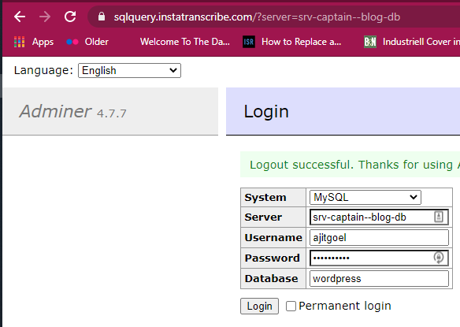

**Getting Started:** https://caprover.com/docs/get-started.html
Create a VM in digital ocean using caprover image.
**on local machine:** 
npm install -g caprover
caprover serversetup
Caprover Demo:
https://www.youtube.com/watch?v=VPHEXPfsvyQ&feature=youtu.be
**Check domain name:** https://mxtoolbox.com/SuperTool.aspx?action=a%3amusicapp.tk&run=toolpage
**Configure A record for Domain name:** https://my.freenom.com/clientarea.php?managedns=movieapp.tk&domainid=1100519513

**Login into wordpress database using adminer**:
url: https://sqlquery.instatranscribe.com/?server=srv-captain--blog-db
password: SonFirstName@YearOfBirth

https://instatranscribe.com/
https://captain.instatranscribe.com/#/apps/details/blog-db
password: SonFirstName@YearOfBirth

