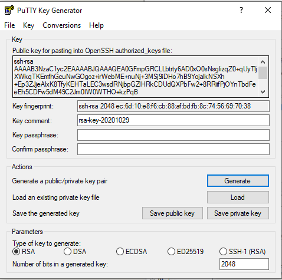
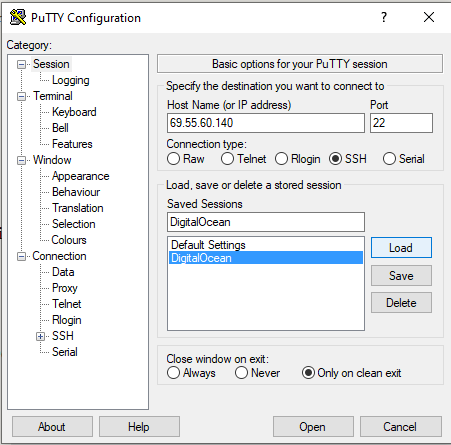
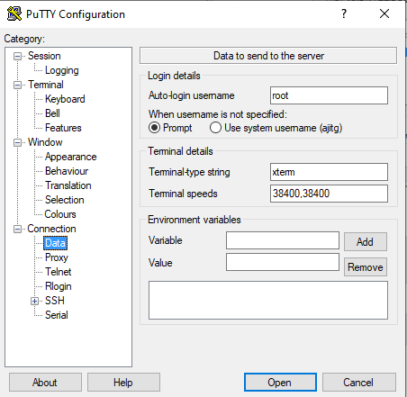
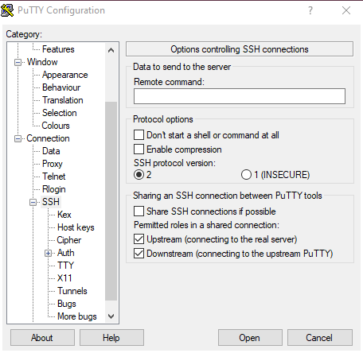
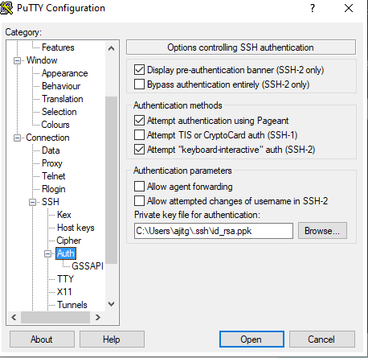

**<u>Public/ Private Key creation using Putty:</u>**
Generate public\private key using Putty keygen. Save the text in putty keygen as id_rsa.pub text file. 
Click on Conversions=>Export OpenSSH key and save file as id_rsa private key file(without file extension). 



Use the Dokku image to create a 5$ VM in digital Ocean, use the public key mentioned above
Login into the VM on your windows machine, using Putty and the IP address of the Digital Ocean VM created above. 

**<u>Putty configuration:</u>**

|  | <br /> |
| ------------------------------------------------------------ | ------------------------------------------------------------ |
|  |  |

```
# from your local machine
# SSH access to github must be enabled on this host
git clone https://github.com/heroku/ruby-getting-started
```

```
# on the Dokku host
dokku apps:create ruby-getting-started
```

Create the backing services:

```

# on the Dokku host
# install the postgres plugin
# plugin installation requires root, hence the user change
sudo dokku plugin:install https://github.com/dokku/dokku-postgres.git

# create a postgres service with the name railsdatabase
dokku postgres:create railsdatabase
```

### Linking backing services to applications:

```
# on the Dokku host
# each official datastore offers a `link` method to link a service to any application
dokku postgres:link railsdatabase ruby-getting-started
```

### Deploy the app:

```
# from your local machine
# the remote username *must* be dokku or pushes will fail
cd ruby-getting-started
git remote add dokku dokku@<IPAddressOfMachine>:ruby-getting-started
git push dokku master
```

If the application does not work then disable and enable firewall. 

sudo ufw disable
sudo ufw enable