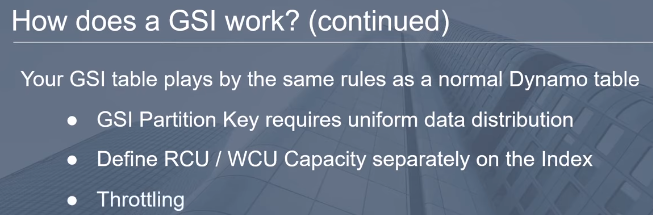
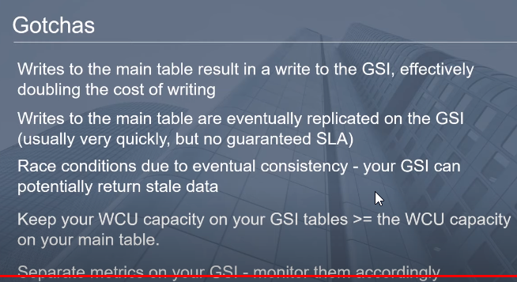

==Scaling a traditional, relational database is difficult because transactional guarantees (atomicity, consistency, isolation, and durability, also known as ACID) require communication among all nodes of the database. The more nodes you add, the slower your database becomes, because more nodes must coordinate transactions between each other. The way to tackle this has been to use databases that don’t==
==adhere to these guarantees. They’re called NoSQL databases.==
There are four types of NoSQL databases—document, graph, columnar, and key-value store  

**Primary keys**
A primary key is unique within a table and identifies an item. You need the primary key to look up an item. The primary key is either a hash or a hash and a range. 
==**Hash keys** A hash key uses a single attribute of an item to create a hash index.== If you want to look up an item based on its hash key, you need to know the exact hash key. ==A user table could use the user’s email as a hash primary key. A user then can be retrieved if you know the hash key (email, in this case).==
==**HASH AND RANGE KEYS**== : A hash and range key uses two attributes of an item to create a more powerful index. The first attribute is the hash part of the key, and the second part is the range. ==To look up an item, you need to know the exact hash part of the key, but you don’t need to know the range part. The range part is sorted within the hash. This allows you to query the range part of the key from a certain starting point. A message table can use a hash and range as its primary key; the hash is the email of the user, and the range is a timestamp. You can now look up all messages of a user that are newer than a specific timestamp.==  

------

# What is a DynamoDB LSI (Local Secondary Index) 

https://www.youtube.com/watch?v=ihMOlb8EZKE

# What is a DynamoDB GSI (Global Secondary Index) 

I figured the best way to explain what GS eyes are are through a practical example walking through a potential use case so assume that we have here some kind of bank account table and our table contains three attributes the account ID the creation date and the origin country and we have four rows here account IDs with one two three and four and the origin country kind of corresponds to where this account was opened so by default CIN DynamoDB we can do some very quick lookups on the account ID provided you have the actual account ID so you know the one that you're looking for so say for instance if I had account ID - it would be very quick to look up this row that contains all this other contextual information so this is all well and good but what happens if our use case changes and we suddenly need to answer a very different question a question that may look like this so give me all the rows where the origin country is equal to Germany so at first glance obviously we're looking for this row here the fourth row with a count of 84 where the country is equal to Germany so I'd encourage you to think about how you would answer this so we know the criteria we're looking for we're looking for the role that has the country Germany but we don't have enough information to retrieve the rows by the primary key right so we don't know that this is account ID for that has this attribute now a naive approach would to do something like this where we use a DynamoDB scan operation and in conjunction use a filter expression to only return the results that match our criteria now there's nothing inherently wrong with this approach it'll certainly return the correct results however recall that a scan operation scans every single row in your table and as the size of your table grows to thousands million billions maybe this quickly becomes a very infeasible operation both in terms of latency and in terms of cost so how something like this would actually look like if you were to perform a scan with the filter expression on your table would be like this so scan is looking at one sees the country does not equal Germany goes to the next goes to the next goes to the next finally finds the one that where it equals Germany and then returns that all the way back so it should be pretty obvious why this won't work from a latency or even a cost perspective as the size of your table grows this quickly becomes very infeasible and so this is where GSIS come in so in short GSIS allow you to query for attributes of a row that are not the partition key that you originally selected when you created your table so recall in normal circumstances we can do direct lookups using the partition key which is a count ID in this case now with a GSI say we specify the one on Origin country we can do a direct look-up on our table to find the row that contains Germany right away without having to do any kind of scan operation on the entire contents of the table so as you can imagine this results in much lower latency for queries and reduce costs since we don't have to necessarily scan the entire table like we were doing it in the previous approach so in short this gives us a very high degree of flexibility to query for different attributes if our use case changes so if you're attempting to perform a query on a GSI it's very similar to how it would look when performing a normal query the only difference is that we provide an index name which is origin country in this case and so this would signal to dynamo to use the index and give you that direct lookup on this row so in terms of how a GSI works you as a user define a GSI index and this involves selecting a new partition key and a sort key if that's what you want so looking into the console here this is an example of what you would see when you click on the create index button so you have your partition key that you need to specify in our case we would have put an Origin country you'd name your index so again we were using origin country we're using the same name as our actual attribute but this can be anything you want there's a concept of projected attributes so on your GSI if you only care about certain types or certain attributes on your table and maybe not all the other ones that are present in your original table you can only select a subset of the attributes that you actually care about and then in addition you also need to select your read and write capacity units which I'll get into a little bit more later so in terms of how GS eyes work behind the scenes creating a GSI clones your primary table using your new partition key but keeps these two tables in sync so recall that our original table looked like this where our partition key is the account ID and the origin country is the attribute so after you specify your index dynamo will actually create a secondary table that flips your data and depending on the partition key that you set in our case we set origin country as the partition key now that is the true partition key so we are going to be doing lookups on the origin country as opposed to the account ID when we provide origin country as the GSI index in our query expression so also behind the scenes whenever you perform any kind of update whether that be an insert a modification or a delete operation dynamo behind the scene is going to keep these two tables in sync so say for instance if we want to change any of these rows it'll be eventually propagated on to our GSI table so that change will be reflected there as well so moving on a little bit here so your GSI table plays by the exact same rules as a normal dynamo table it's not special in any way it's only a secondary table compared to your primary so you have to worry about many of the same things that you worry about on your main table so your partition key of your GSI requires uniform data distribution so this is especially important if you're operating at high loads or higher read and write capacities secondly you need to define RC use and WCU's separately on the end so your index has its own settings that you can tune based on your use case and third you actually need to worry about throttling as well since you can have throttling on your GSI table and not necessarily have throttling on your main table if any of these terms seem confusing you don't know what they are I highly suggest checking out my video on DynamoDB schema design where I talk about all these concepts in detail and I'll put a clickable on the top right and a link to it in the description below so 

in terms of gotchas there's actually quite a few so recall that with every GS size we are effectively creating a clone of our primary table so rights to the main table result in the write to the GSI which effectively double the cost of writing so this isn't a free lunch you're not just getting all the benefits and not having to pay for free there's a cost that you incur by using a GSI so that means if you have 5 GS is on a table and you perform one right or one update to your original table that's going to result in 6 updates in total one to the primary and one for each of your GSIS and you can actually have a maximum of only 20 GS is so this is an unlimited amount previously this number was only 5 GS is but of as of December I believe of 2018 they move this up to 20 so you can have much more flexibility on queries for your table secondly writes to the main table are eventually replicated on the GSI and this typically happens very quickly but there's no guaranteed SLA and this is important leading up into the second point here which is that you can have race conditions due to the nature of eventual consistency your GSI can potentially return stale data if there is a substantial delay between when your update or delete happens on your primary and when that is eventually propagated into your GSI so those are you that are reading off of your GSI and attempting to make updates using that record as the source of truth on your main table be very very careful about doing that because you can potentially be retrieving stale data on your GSI and putting that back into your primary table which would lead to some very very difficult to debug scenarios another big gotcha that I've personally faced in the past is due to throttling so you should keep your right capacity units on your GSI tables greater than or equal to the right capacity units on your main table and this has to do with data replication that I talked about previously so right to your main will result in a right to all of your GSI tables now if your GSIS don't have enough write capacity units it could eventually lead to throttle the requests when writing to your main table so be very careful about setting this I would highly suggest to use auto scaling on your GSI and tick the box that says use the same settings as my primary table at least do that for your right capacity you don't necessarily need to do that for your read capacity and the final point that I wanted to make is that you have separate metrics on your GSI so you need to monitor them accordingly so this means error count Slayton C's etc all those things that you typically would alarm on or care about on your main table you also need to set up alarms and care about those things on your GSI as well in order to maintain a healthy table so thank you so much for watching folks if you've enjoyed this video please don't forget to like and subscribe if you have any comments or questions please feel free to leave them in the comment section below thanks so much and I'll see you next time