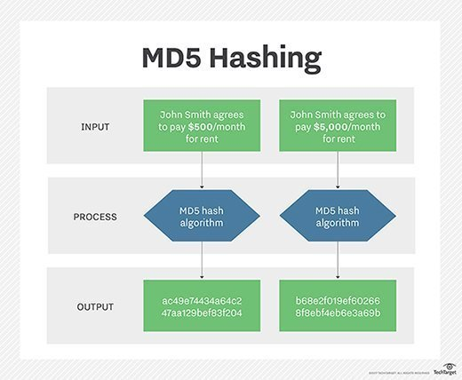

# MD5

### What is MD5?

==The MD5 (message-digest algorithm) hashing algorithm is a one-way cryptographic function that accepts a message of any length as input and returns as output a fixed-length digest value to be used for authenticating the original message.==

The MD5 hash function was originally designed for use as a secure cryptographic hash algorithm for authenticating [digital signatures](https://www.techtarget.com/searchsecurity/definition/digital-signature). But MD5 has been deprecated for uses other than as a noncryptographic checksum to verify data integrity and detect unintentional data corruption.

### What is MD5 used for?

Although originally designed as a cryptographic [message authentication code](https://www.techtarget.com/searchsecurity/definition/message-authentication-code-MAC) algorithm for use on the internet, ==MD5 hashing is no longer considered reliable for use as a [cryptographic checksum](https://www.techtarget.com/searchsecurity/definition/cryptographic-checksum)== because security experts have demonstrated techniques capable of easily producing MD5 collisions on commercial off-the-shelf computers. An encryption collision means two files have the same hash. Hash functions are used for message security, password security, computer forensics and cryptocurrency.

Ronald Rivest, founder of RSA Data Security LLC and professor at Massachusetts Institute of Technology, designed MD5 in 1991 as an improvement to a prior message-digest algorithm, MD4. Describing it in Internet Engineering Task Force ([IETF](https://whatis.techtarget.com/definition/IETF-Internet-Engineering-Task-Force)) Request for Comments (RFC) 1321, "The MD5 Message-Digest Algorithm," he wrote:

> The algorithm takes as input a message of arbitrary length and produces as output a 128-bit 'fingerprint' or 'message digest' of the input. It is conjectured that it is computationally infeasible to produce two messages having the same message digest, or to produce any message having a given prespecified target message digest. The MD5 algorithm is intended for digital signature applications, where a large file must be 'compressed' in a secure manner before being encrypted with a private (secret) key under a public-key cryptosystem such as RSA.

IETF suggests MD5 hashing can still be used for integrity protection, noting: "Where the MD5 checksum is used inline with the protocol solely to protect against errors, an MD5 checksum is still an acceptable use." However, it added that "any application and protocol that employs MD5 for any purpose needs to clearly state the expected security services from their use of MD5."

This graphic shows an example of the MD5 hashing process for two scenarios.

### Message-digest algorithm characteristics

Message digests, also known as *hash functions*, are one-way functions; they accept a message of any size as input and produce as output a fixed-length message digest.

MD5 is the third message-digest algorithm Rivest created. MD2, MD4 and MD5 have similar structures, but MD2 was optimized for 8-bit machines, in comparison with the two later algorithms, which are designed for 32-bit machines. The MD5 algorithm is an extension of MD4, which the critical review found to be fast but potentially insecure. In comparison, MD5 is not quite as fast as the MD4 algorithm, but offered much more assurance of data security.

### How does MD5 work?

The MD5 message-digest hashing algorithm processes data in 512-bit strings, broken down into 16 words composed of 32 bits each. The output from MD5 is a 128-bit message-digest value.

Computation of the MD5 digest value is performed in separate stages that process each 512-bit block of data along with the value computed in the preceding stage. The first stage begins with the message-digest values initialized using consecutive [hexadecimal](https://whatis.techtarget.com/definition/hexadecimal) numerical values. Each stage includes four message-digest passes, which manipulate values in the current data block and values processed from the previous block. The final value computed from the last block becomes the MD5 digest for that block.

### Is MD5 secure?

The goal of any message-digest function is to produce digests that appear to be random. To be considered cryptographically secure, the hash function should meet two requirements:

1. It is impossible for an attacker to generate a message matching a specific hash value.
2. It is impossible for an attacker to create two messages that produce the same hash value.

MD5 hashes are no longer considered cryptographically secure methods and should not be used for cryptographic authentication, according to IETF.

In 2011, IETF published RFC 6151, "Updated Security Considerations for the MD5 Message-Digest and the HMAC-MD5 Algorithms," which cited a number of recent attacks against MD5 hashes. It mentioned one that generated hash collisions in a minute or less on a standard notebook and another that could generate a collision in as little as 10 seconds on a 2.6 gigahertz Pentium 4 system. As a result, IETF suggested that new protocol designs should not use MD5 at all and that the recent research attacks against the algorithm "have provided sufficient reason to eliminate MD5 usage in applications where collision resistance is required such as digital signatures."

### Alternatives to MD5

A major concern with MD5 is the potential it has for message collisions when message hash codes are inadvertently duplicated. MD5 hash code strings also are limited to 128 bits. This makes them easier to breach than other hash code algorithms that followed.

Alternate hash codes to MD5 include the following.

**Secure Hash Algorithm** **1** **(SHA-1)****.** Developed by the U.S. government in the 1990s, SHA-1 used techniques like those of MD5 in the design of message-digest algorithms. But ==SHA-1 generated more secure 160-bit values when compared to MD5's 128-bit hash value lengths.== Despite this, [SHA-1 had some weaknesses](https://www.techtarget.com/searchsecurity/tip/SHA-1-collision-How-the-attack-completely-breaks-the-hash-function) and did not prove to be the ultimate algorithmic methodology for encryption, either. ==Security concerns began to emerge==, prompting companies like Microsoft to discontinue support for SHA-1 in its software.

**The SHA-2 hash code family.** The more secure successor to SHA-1 and one that is widely used today is the SHA-2 family of hash codes. SHA-2 hash codes were created by the U.S. National Security Agency in 2001. They represent a significant departure from SHA-1 in that the SHA-2 message-digest algorithms were longer and harder to break. ==The SHA-2 family of algorithms delivers hash values that are 224, 256, 384 and 512 bits in length. They are known by the names of their message-digest lengths -- for example, SHA-224 and SHA-256.==

**C****yclic redundancy check (C****RC****)** **codes.** CRC codes are often suggested as possible substitutions for MD5 because both MD5 and CRC perform hashing functions, and both deliver checksums. But the similarity ends there. A 32-bit CRC code is used to detect errors during data transmissions so corrupted or lost data can be identified. Meanwhile, MD5 is a secure hash algorithm and a cryptographic hash function that can detect some data corruption but is primarily intended for the secure encryption of data that is being transmitted and the verification of digital certificates.