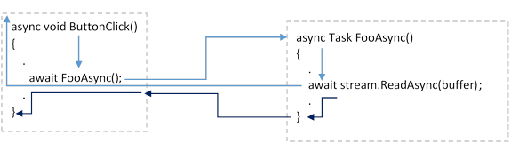
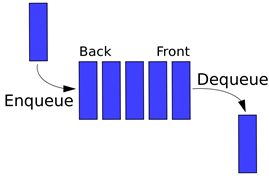

# Async/Await Explained with Diagrams and Examples

Explains program flow when using await in various scenarioss

In this article, we start out with some simple basic concepts and slowly work our way up to the more advanced concepts. The following discussion is primarily from a WPF point of view, though I do occasionally look at WinForms.

## Introduction

This documentation explains how Async/Await works. It can be a confusing subject. We'll start out with some simple basic concepts and slowly work our way up to the more advanced concepts. Hopefully, the visual diagrams will help those who are visual learners.

The following discussion is primarily from a WPF point of view, though I do occasionally look at WinForms.

## Contents

- [Nomenclature](https://www.codeproject.com/Articles/5299501/Async-Await-Explained-with-Diagrams-and-Examples#nomenclature)
- [Sync Calling Sync](https://www.codeproject.com/Articles/5299501/Async-Await-Explained-with-Diagrams-and-Examples#synccallsync)
- [Async awaiting Async](https://www.codeproject.com/Articles/5299501/Async-Await-Explained-with-Diagrams-and-Examples#asyncawaitasync)
- [Sync calling Task.Run()](https://www.codeproject.com/Articles/5299501/Async-Await-Explained-with-Diagrams-and-Examples#synctaskrun)
- [Async awaiting Task.Run()](https://www.codeproject.com/Articles/5299501/Async-Await-Explained-with-Diagrams-and-Examples#asynctaskrun)
- [Async calling Sync](https://www.codeproject.com/Articles/5299501/Async-Await-Explained-with-Diagrams-and-Examples#asyncoversync)
- [Sync calling Async = ☠](https://www.codeproject.com/Articles/5299501/Async-Await-Explained-with-Diagrams-and-Examples#syncoverasync)
- [Returning a value](https://www.codeproject.com/Articles/5299501/Async-Await-Explained-with-Diagrams-and-Examples#returnavalue)
- [Passing Parameters](https://www.codeproject.com/Articles/5299501/Async-Await-Explained-with-Diagrams-and-Examples#passparam)
- [Completing on Any Thread](https://www.codeproject.com/Articles/5299501/Async-Await-Explained-with-Diagrams-and-Examples#completeonany)
- [Using CancellationToken with Task.Run()](https://www.codeproject.com/Articles/5299501/Async-Await-Explained-with-Diagrams-and-Examples#canceltoken)
- [Getting Back To the UI Thread](https://www.codeproject.com/Articles/5299501/Async-Await-Explained-with-Diagrams-and-Examples#getbackuithread) ([Message Queue](https://www.codeproject.com/Articles/5299501/Async-Await-Explained-with-Diagrams-and-Examples#messagequeue), [Message Loop](https://www.codeproject.com/Articles/5299501/Async-Await-Explained-with-Diagrams-and-Examples#messageloop), [SynchronizationContext](https://www.codeproject.com/Articles/5299501/Async-Await-Explained-with-Diagrams-and-Examples#synchronizationcontext))
- [How Await Works](https://www.codeproject.com/Articles/5299501/Async-Await-Explained-with-Diagrams-and-Examples#magic)
- [Async, Method Signatures, and Interfaces](https://www.codeproject.com/Articles/5299501/Async-Await-Explained-with-Diagrams-and-Examples#asyncsignature)
- [Proper Use of Async/Await](https://www.codeproject.com/Articles/5299501/Async-Await-Explained-with-Diagrams-and-Examples#properasyncuse)
- [Converting Code to Async](https://www.codeproject.com/Articles/5299501/Async-Await-Explained-with-Diagrams-and-Examples#convertingtoasync)
- [Fixing Code that has Async Sprinkled In Various Places](https://www.codeproject.com/Articles/5299501/Async-Await-Explained-with-Diagrams-and-Examples#fixingasync)
- [References](https://www.codeproject.com/Articles/5299501/Async-Await-Explained-with-Diagrams-and-Examples#references)
- [History](https://www.codeproject.com/Articles/5299501/Async-Await-Explained-with-Diagrams-and-Examples#history)

## Nomenclature

We'll start out by defining some nomenclature.

### Synchronous (Sync) Method

A synchronous (`sync`) method is a regular method which is not marked `async` and does not have an `await` in it. For example:

C#

Copy Code

```csharp
private void Foo()
{
    ...
}
```

### Asynchronous (Async) Method

An asynchronous (`async`) method is a method which is marked `async` and has an `await` in it. For example:

C#

Copy Code

```csharp
private async Task FooAsync()
{
    await BarAsync();
}
```

Asynchronous method names often end with “`…Async()`”.

An async method should return a `Task`. The only place it is **OK** to have an `async` method return `void` is in an event handler, such as a button click event handler:

C#

Copy Code

```csharp
private async void Button_Click(object sender, RoutedEventArgs e)
{
    await FooAsync();
}
```

### Synchronous Call

A synchronous call is a call which does not include an `await`. It may or may not return a value. For example:

C#

Copy Code

```csharp
    Bar();
OR
    int x = Bar();
```

### Asynchronous Call

An asynchronous call is a call in which `await` is used. It may or may not return a value. For example:

C#

Copy Code

```csharp
await BarAsync();
```

OR:

C#

Copy Code

```csharp
int x = await BarAsync();
```

Note the `await` does not ‘launch’ the call to `BarAsync()`; instead, the `await` determines what is done with the *result* of `BarAsync();` which may be an incomplete Task or a completed Task.

An analogy would be the `return` in the following statement:

C#

Copy Code

```csharp
return Bar();
```

Here, we do not say the `return` ‘launches’ `Bar();` instead, the `return` determines what is done with the *result* of `Bar();`

## Sync Calling Sync

### A Regular Call


`Foo()` calls `Bar()`. `Bar()` runs and then returns to `Foo()`.

### A Regular Call to stream.Read()


`Foo()` calls `stream.Read()`. The thread waits until `stream.Read()` completes, and then continues.

## ==Async awaiting Async==

### await stream.ReadAsync()


==`ButtonClick()` calls `await stream.ReadAsync()`. Instead of waiting for the read to complete, the thread returns to the caller of `ButtonClick()`, allowing the thread to do other things.Typically `ButtonClick()` is called from the UI thread's *Message Loop* (described below) and runs on the UI thread. By returning during the await, the UI thread is able to process other messages in the *Message Queue* and update the screen.Later, when the `stream.ReadAsync()` completes, the rest of the `ButtonClick()` method runs on the UI thread (dark blue).==

How we get the UI thread to run the rest of `ButtonClick()` after `stream.ReadAsync()` completes is a bit complicated and will be explained later.

#### Doing Two Things at Once with One Thread

In the above scenario, `ButtonClick()` calls `await stream.ReadAsync()`. Instead of waiting for the read to complete, the UI thread returns to the caller of `ButtonClick()`, allowing the UI thread to do other things.

At this point, it could be said we are doing two things simultaneously:

1. We are waiting for the `ReadAsync()` call to complete
2. The UI thread is processing messages in the *Message Queue*

It's a matter of sematics whether or not *waiting* actually counts as doing something (typically it does not count). We are indeed waiting, and we do have things set up so that when this wait completes the rest of the code after the `await stream.ReadAsync()` will execute; however, it is a passive wait, and we are not tying up the UI thread during this wait period. The UI thread is free to do other things while we also passively wait for the `await stream.ReadAsync()` to complete. Note there is still only one thread, the UI thread, and that thread is still doing all the work.

### ButtonClick calling FooAsync calling stream.ReadAsync()



`ButtonClick()` calls `await FooAsync()`. `FooAsync()` calls `await stream.ReadAsync()`. Instead of waiting for the read to complete, an uncompleted Task is returned to the caller of `FooAsync()`. `await FooAsync()` sees the Task returned to it is incomplete, so it returns to its caller, which is the UI thread's *Message Loop*. This allows the UI thread to process other messages in the *Message Queue* and update the screen.

Later, when `ReadAsync()` completes, the rest of `FooAsync()` runs (dark blue). When `FooAsync()` reaches the end it returns a completed Task to `await FooAsync()` and the rest of `ButtonClick()` runs.

All of the action in this example happens on the UI thread. The UI thread is freed up while waiting for a read to complete. When the read is complete, the rest of `FooAsync()` runs on the UI thread, and when `FooAsync()` returns to `ButtonClick()` the rest of `ButtonClick()` runs on the UI thread. The details behind how this is achieved will be explained later below.

## Sync calling Task.Run()

### ==Sync → Task.Run() → Sync==


==`Foo()` queues `Bar()` to run on a `ThreadPool` thread. `Foo()` continues executing without waiting for `Bar()` to complete. `Bar()` runs independently on a `ThreadPool` thread.==

### Sync → Task.Run() → Sync and Waiting


1. `Task.Run()` queues `Bar()` to run on a `ThreadPool` thread.

2. ```
   Foo()
   ```

    

   waits for task

    

   ```
   t
   ```

    

   to complete.

   1. The thread running `Foo()` enters a wait state by setting its execution state to “`WaitSleepJoin`” (the blocked state), and yields the remainder of its processor time slice. (This frees the CPU to run other threads.) The thread consumes no processor time until its blocking condition is satisfied.
   2. Later, when `Bar()` completes, the thread running `Foo()` has its execution state set back to “`Running`,” and resumes running when the Thread Manager has a time slice available for it.

Performing a `.Wait()` on the UI thread is ill-advised as that can make the program unresponsive. We don’t want to be tying up the UI thread doing nothing. (Consider converting `Foo()` to an async method and using `await Task.Run(()=>Bar());` instead.)

If instead `Foo()` is running on a `ThreadPool` thread, then performing a `.Wait()` is once again ill-advised, as now we are blocking a `ThreadPool` thread waiting for *another* `ThreadPool` thread to run `Bar()`. Why start another thread and then just wait for it to finish when you could be doing that work yourself?

This brings us to a general rule regarding waiting for `Tasks` to complete:

#### Avoid using Task.Wait and Task.Result

“There are very few ways to use `Task.Result` and `Task.Wait` correctly so the general advice is to completely avoid using them in your code.”
David Fowler, Partner Software Architect at Microsoft
—https://github.com/davidfowl/AspNetCoreDiagnosticScenarios/blob/master/AsyncGuidance.md

## Async awaiting Task.Run()

### Async awaiting Task.Run() Launching Sync Method


1. `FooAsync()` queues `Bar()` to run on a `ThreadPool` thread and returns to its caller. (If `FooAsync()` is running on the UI thread, the UI thread is not blocked, which is good.)
2. `Bar()` runs (red).
3. When `Bar()` completes, the task running `Bar()` completes. `FooAsync()` then continues using the same `SynchronizationContext` it started on (blue). This means if `FooAsync()` was running on the UI thread then `FooAsync()` continues on the UI thread; if `FooAsync()` was running on a `ThreadPool` thread, then `FooAsync()` continues using *any* `ThreadPool` thread.

Note `FooAsync()` is not awaiting on method `Bar()` to complete, `FooAsync()` is awaiting on the *task* running `Bar()` to complete.

### Async awaiting Task.Run() Launching Async Method


1. `await Task.Run(async () => await BarAsync())` queues `BarAsync()` to run on a `ThreadPool` thread and returns to its caller. (If `FooAsync()` is running on the UI thread, the UI thread is not blocked, which is good.)
2. `BarAsync()` runs (red).
3. When `BarAsync()` comes to the `await stream.ReadAsync(buffer)` statement, instead of waiting for the read to complete, `BarAsync()` returns and the `ThreadPool` thread running `BarAsync()` is freed to run other tasks.
4. When `stream.ReadAsync(buffer)` completes, the rest of `BarAsync()` runs on *any* available `ThreadPool` thread.
5. When method `BarAsync()` completes, the task running `BarAsync()` completes, and the rest of `FooAsync()` continues using the same `SynchronizationContext` it started on (blue). This means if `FooAsync()` was running on the UI thread then `FooAsync()` continues on the UI thread; if `FooAsync()` was running on a `ThreadPool` thread, then the rest of `FooAsync()` continues using *any* `ThreadPool` thread.

Note `FooAsync()` is not awaiting on method `BarAsync()` to complete, `FooAsync()` is awaiting on the *task* running `BarAsync()` to complete.

## Async calling Sync


In general, an asynchronous method can call a synchronous method. The asynchronous method just pretends for a moment that it's a synchronous method calling a synchronous method. For example, asynchronous code can call a simple synchronous function which multiples two numbers together and returns the result.

There are cases where using `await` to asynchronously call a synchronous method that returns a `Task` can get one into trouble. There are also cases where this is perfectly acceptable. It depends on details of the returned `Task`. This issue will be discussed further in a follow-up article on `async`/`await`.

## Sync calling Async = ☠

The term “Sync over Async” refers to Synchronous code calling Asynchronous code. Synchronous code cannot await asynchronous code, therefore it’s difficult to know when the Asynchronous code has completed. Even worse, waiting for asynchronous code to complete can result in a deadlock in certain situations. This leads us to the general rule for synchronous code calling asynchronous code:

*Sync over Async is bad. Don’t do it.*

Below, we examine what perils can happen when we attempt to call Async code from Sync code.

### Sync → Async


Non-async `Foo()` calls `BarAsync()`. When `BarAsync()` calls `await stream.ReadAsync(buffer)`, it returns to `Foo()` which continues executing.

Later, after `stream.ReadAsync(buffer)` completes, the rest of `BarAsync()` runs (dark blue).

Note we cannot await the call to `BarAsync()` because `Foo()` is a synchronous method which does not support `await`. We have no way of knowing when or if the rest of `BarAsync()` runs. It may never run and we’d never know it.

### Sync → Async → .Wait() ☠

**Warning: Can lead to deadlock.**


1. `ButtonClick()` running on the UI thread calls `BarAsync()`.
2. `BarAsync()` calls `await stream.ReadAsync(buffer)`, which at some point returns an incomplete task, which is stored as `Task t` in `ButtonClick()`.
3. `ButtonClick()` then calls `t.Wait()`. The UI Thread is now tied up waiting for task `t` to complete.
4. Later, when `ReadAsync` completes, it queues the rest of `BarAsync()` to run on the UI thread. Unfortunately, `ButtonClick()` is tying up the UI thread waiting for `BarAsync()` to complete. This results in a deadlock: `ButtonClick()` is waiting for `BarAsync()`, and `BarAsync()` is waiting for `ButtonClick()`. Since `ButtonClick()` is blocking the UI thread, the entire program freezes and is unable to respond to keyboard keys or mouse clicks.

Note it’s possible that in some situations the code will not deadlock: if `stream.ReadAsync()` is replaced with `Task.Delay(0)` then the `await` will skip the time consuming “return an incomplete task to the caller” ordeal and just continue running. However, if that `Task.Delay(0)` is replaced with `Task.Yield()` then the code will always deadlock.

Let’s see what happens when we try to fix this by calling the async method with a `Task.Run()`.

### Sync → Task.Run() → Async


`ButtonClick()` running on the UI thread creates task `t` running `BarAsync()`. `ButtonClick()` then continues on its way, never further checking task `t`.

Separately, task `t` runs `BarAsync()` on a `ThreadPool` thread. (Tasks started with `Task.Run()` run on `ThreadPool` theads.) When `BarAsync()` comes to the `await stream.ReadAsync(buffer)` it returns freeing the `ThreadPool` thread so that thread can work on something else.

Later, when the `ReadAsync(buffer)` completes, the rest of `BarAsync()` runs on *any* available `ThreadPool` thread. The reason it can complete on any available `ThreadPool` thread is because philosophically, all `ThreadPool` threads are the same. (A more technical explanation would be because `ThreadPool` threads have no `SynchronizationContext`, so the ‘default’ `SynchronizationContext` is used, which translates to “Any `ThreadPool` thread.”)

We still have the problem of not knowing when our async task completes. Let’s see what happens now if we introduce a `.Wait()` to wait for the task to complete.

### UI Thread → Task.Run() → Async → .Wait()


Non-async `ButtonClick()` running on the UI thread uses `Task.Run()` to create task `t` running `BarAsync()`. `ButtonClick()` then calls `t.Wait()` and waits for task `t` to complete, blocking the UI thread.

Meanwhile, task `t` runs `BarAsync()` on a `ThreadPool` thread. (Tasks started with `Task.Run()` run on `ThreadPool` theads.) When `BarAsync()` comes to the `await stream.ReadAsync(buffer)`, it returns freeing the `ThreadPool` thread to work on something else.

Later, when the `ReadAsync(buffer)` completes, the rest of `BarAsync()` runs on *any* available `ThreadPool` thread.

When method `BarAsync` completes, the task `t` running `BarAsync` completes, the `t.Wait()` completes, and the rest of `ButtonClick` continues to run on the UI thread.

Even though this won’t deadlock, it does tie up the UI thread with a `.Wait()`, making our program unresponsive to user input while we wait. It would be much better to convert `ButtonClick()` to an `async` method and `await` task `t` instead.

### ThreadPool → Task.Run() → Async → .Wait ☠


Assume `Foo()` is running on a `ThreadPool` thread. `Foo()` calls `Task.Run()` to create a task `t` running `BarAsync()`. `Foo()` then calls `t.Wait()` and waits for task `t` to complete, blocking the `ThreadPool` thread it’s running on.

Meanwhile, task `t` runs `BarAsync()` on another `ThreadPool` thread. (Tasks started with `Task.Run()` run on `ThreadPool` theads.) When `BarAsync()` comes to the `await stream.ReadAsync(buffer)`, it returns freeing the `ThreadPool` thread to work on something else.

Later, when the `ReadAsync(buffer)` completes, the rest of `BarAsync()` runs on *any* available `ThreadPool` thread.

**ThreadPool Starvation**

The potential problem here is `Foo()` is blocking a `ThreadPool` thread, and we need *another* `ThreadPool` thread to complete `BarAsync()` after the `await`. It’s possible to conjure up a scenario where we launch multiple instances of `Foo()` tying up `ThreadPool` threads until there are no more `ThreadPool` threads left. *All* the `ThreadPool` threads are blocked waiting for yet *another* `ThreadPool` thread to finish running `BarAsync()`.

At this point, the operating system sees the need for more `ThreadPool` threads, so it creates a new `ThreadPool` thread. This new `ThreadPool` thread might run the remainder of `BarAsync()`; or, it might run *another* instance of `Foo()`. Which method the new `ThreadPool` thread runs depends on the program details and how the `ThreadPool` queues are managed. If the new `ThreadPool` thread always runs the remainder of `BarAsync()` the system will start to recover; however, if the new `ThreadPool` thread instead always runs another instance of `Foo()`, then we are doomed: `Foo()` will block the new `ThreadPool` thread and we will be back to our `ThreadPool` starvation state, except the `ThreadPool` will have increased in size. The system may never recover, with the `ThreadPool` slowly increasing in size indefinitely, with all the `ThreadPool` threads blocked, each one forever waiting for just one more `ThreadPool` thread to come save it.

An example of this type of `ThreadPool` starvation is at [this link](https://medium.com/criteo-labs/net-threadpool-starvation-and-how-queuing-makes-it-worse-512c8d570527).

------

## Returning a Value

### Sync Calling Sync Returning Value

C#

Copy Code

```csharp
int x = Bar();
```


### Async Awaiting Async Returning Value

C#

Copy Code

```csharp
int x = await BarAsync();
```


This is the normal way of calling an `async` method:

1. `FooAsync()` calls `BarAsync()`
2. `BarAsync()` encounters the `await Task.Delay(2000);` and returns an incomplete task to `FooAsync()`, which returns the incomplete task to its caller.
3. Later, `BarAsync()` completes and returns 7 to `FooAsync()` which stores the 7 in variable `x`.
4. `FooAsync()` continues running now that it has a value for `x`.

### Task.Run() Returning Value

#### Sync calling Task.Run() waiting on Sync method returning value

`Foo()` launches task, waits for task to complete, gets result from task.

C#

Copy Code

```csharp
Task<int> t = new Task<int>(Bar);
t.Start();
t.Wait();
int x = t.Result;
```

OR:

C#

Copy Code

```csharp
Task<int> t = Task.Run( () => Bar() );
t.Wait();
int x = t.Result;
```

OR:

C#

Copy Code

```csharp
Task<int> t = Task.Run( () => Bar() );
int x = t.Result;
```

OR:

C#

Copy Code

```csharp
int x = Task.Run( () => Bar() ).Result;
```

#### Async awaiting Task.Run() returning value

##### int x = await Task.Run on sync method returning value


This is a standard way of awaiting on time consuming synchronous code.

1. `FooAsync()` queues `Bar()` to run on a `ThreadPool` thread and returns to its caller. (If `FooAsync()` is running on the UI thread, the UI thread is not blocked, which is good.)
2. `Bar()` runs (red).
3. When `Bar()` completes, the task running `Bar()` completes, and 7 is stored in variable `x`.
4. `FooAsync()` then continues: If `FooAsync()` was running on the UI thread, then `FooAsync()` continues on the UI thread; if `FooAsync()` was running on a `ThreadPool` thread, then `FooAsync()` continues on *any* `ThreadPool` thread.

##### int x = await Task.Run on async method returning value


1. `int x = await Task.Run(async () => await BarAsync())` queues `BarAsync()` to run on a `PoolThread` thread and returns to its caller. (If `FooAsync()` is running on the UI thread, the UI thread is not blocked, which is good.)
2. `BarAsync()` runs (red).
3. When `BarAsync()` comes to the `await stream.ReadAsync(buffer)` statement, instead of waiting for the read to complete, `BarAsync()` returns and the `ThreadPool` thread running `BarAsync()` is freed to run other tasks.
4. When `stream.ReadAsync(buffer)` completes, the rest of `BarAsync()` runs on *any* available `ThreadPool` thread.
5. When method `BarAsync()` completes, the task running `BarAsync()` completes, and 7 is stored in variable x.
6. `FooAsync()` then continues: If `FooAsync()` was running on the UI thread then `FooAsync()` continues on the UI thread; if `FooAsync()` was running on a `ThreadPool` thread, then `FooAsync()` continues on *any* available `ThreadPool` thread.

In this case, one may consider removing the `Task.Run` part and just using `int x = await BarAsync();`

#### await BarAsync() vs. await Task.Run(async () => await BarAsync())

C#

Copy Code

```csharp
await BarAsync()
```

Runs `BarAsync()` directly. If `BarAsync()` takes some time and does not `await` on time consuming code (e.g., perhaps it’s doing some CPU intensive calculation, so it can’t `await` that because it’s not waiting, it’s working), then the caller must wait while `BarAsync()` does it’s time consuming work.

C#

Copy Code

```csharp
await Task.Run(async ()=> await BarAsync())
```

Here, we are awaiting on the Task which is running `BarAsync`. This frees the caller to do other things while it awaits for the `Task` to complete. The task runs on a background `ThreadPool` thread.

### Sync Calling Async Returning Value

Can’t be done because `BarAsync()` returns a `Task<int>`, not an `int`.

C#

Copy Code

```csharp
private async Task<int> BarAsync()
{
    await Task.Delay(2000);
    return 7;
}

<s>int x = BarAsync();</s>  "Cannot implicitly convert Task<int> to int."
```

The caller needs to be an `async` method.

### Sync Calling Task.Run() Launching Async Task and Waiting for Return Value

**Can lead to Deadlock!** (See [Threadpool Starvation](https://www.codeproject.com/Articles/5299501/Async-Await-Explained-with-Diagrams-and-Examples#threadpoolstarvation))

Don’t `.Wait()` on an async task. Instead, use `await` for an async task (or remove the `Task.Run()` and just await the method).

### Async Calling Sync Returning Value

```
int x = Bar();
```


This is generally OK as long as `Bar()` does not return a Task which we later wait on to complete. Sometimes, that's OK and sometimes that can lead to trouble. The details of that case will be discussed in a separate follow-up article on async/await.

## Passing Parameters

C#

Copy Code

```csharp
int x = await Task.Run(() => Bar(a, b, c));
int x = await Task.Run(async () => await BarAsync(a, b, c));
```

One could also do:

C#

Copy Code

```csharp
int x = Task.Run(() => Bar(a, b, c)).Result;
```

though in this case one could just omit the `Task.Run` and do:

C#

Copy Code

```csharp
int x = Bar(a, b, c);
```

*Don’t wait on an async method or task.*

Don’t do:

C#

Copy Code

```csharp
int x = Task.Run(async () => await BarAsync(a, b, c)).Result;
```

as that can lead to a threadpool starvation deadlock. (See [ThreadPool Starvation](https://www.codeproject.com/Articles/5299501/Async-Await-Explained-with-Diagrams-and-Examples#threadpoolstarvation).)

## Completing on Any Thread


Adding `.ConfigureAwait(false)` allows the continuation after the await to run on any available thread (dark red). Typically, this will be a `ThreadPool` thread. This is convenient when we know the rest of `ButtonClick()` doesn’t need to be run on the UI thread.

#### Two Threads Not Doing Two Things at Once

In the above example, we have an instance of two threads running due to the `.ConfigureAwait(false)` which allows the remainder of `ButtonClick()` to run on a background `ThreadPool` thread, while the UI thread which started running `ButtonClick()` is free to do other things. Yet we are not doing two things at once, because even though the rest of `ButtonClick()` runs on a different thread, it still does not run until after the call to `ReadAsync(buffer)` completes. We're never doing two things at once, even though we're using two threads.

### Async Calling Async Completing on Any Thread


1. `ButtonClick()` starts on the UI thread.
2. `ButtonClick()` calls `await FooAsync()`.
3. `FooAsync()` calls `await stream.ReadAsync()`.
4. `stream.ReadAsync()` returns an incomplete task to `ButtonClick()`, which in turn returns to its caller (the *message loop*).
5. When `stream.ReadAsync()` completes, the rest of `FooAsync()` runs on *any* available thread, likely a `ThreadPool` thread due to the `.ConfigureAwait(false);` (which is just a shorter way of saying `.ConfigureAwait(continueOnCapturedContext:false);`).
6. `FooAsync()` completes and returns to `ButtonClick()`.
7. The rest of `ButtonClick()` runs on the UI thread (because the call to `FooAsync()` does not have `.ConfigureAwait(false);` appended).

## Using CancellationToken with Task.Run()

Since I have numerous examples of using `Task.Run()`, I should include an example of using a `CancellationToken` with `Task.Run()` which is always a good idea.

From Microsoft documentation:

> “When the owning object calls `CancellationTokenSource.Cancel()`, the `IsCancellationRequested` property on every copy of the cancellation token is set to `true`.”

C#

Copy Code

```csharp
using System.Threading;
using System.Threading.Tasks;
using System.Windows;

CancellationTokenSource cts;
Task<int> task;

private async void Button_Click(object sender, RoutedEventArgs e)
{
    this.cts?.Cancel();
    this.cts = new CancellationTokenSource();
    this.task = Task.Run(() => SomeTask(cts.Token), cts.Token);
    int x = await this.task;
    this.task.Dispose();
    this.task = null;
}

private async Task<int> SomeTask(CancellationToken ct)
{
    for(int i=0; i < 20; ++i)
    {
        ct.ThrowIfCancellationRequested();
        await Task.Delay(500);
    }   
    return 5;
}
```

Note how the cancellation token is passed twice to `Task.Run()`.

1. It’s passed as a parameter to `SomeTask(cts.**Token**)`
   Passing the cancellation token to `SomeTask()` allows `SomeTask()` to periodically check the state of the `Token` to see if it’s been set to the “`Cancel`” state so it can abort the procedure if it has.
2. It’s passed as the 2nd parameter to `Task.Run(…, cts.**Token**);`
   Passing the cancellation token as the 2nd parameter to `Task.Run()` allows `Task.Run()` to skip running `SomeTask()` if the Cancellation Token is already set to “`Cancel`” when `Task.Run()` is called.

Note that Microsoft developer [Stephen Toub](https://devblogs.microsoft.com/pfxteam/author/toub/) feels Tasks do not need to be disposed of so the above code which disposes of the Task may be overkill. See: https://devblogs.microsoft.com/pfxteam/do-i-need-to-dispose-of-tasks/

## Getting Back to the UI Thread

In order to understand how `await` gets back to the UI thread when it needs to, we need to explain the concepts of the *Message Queue*, the *Message Loop*, and what a *SynchronizationContext* is.

### The Message Queue

Windows programs that have a GUI (Graphical User Interface) have an individual *message queue* for each thread that has created a window. Usually, only the initial thread creates windows and maintains the *message queue* for the program. This thread is known as the “**UI Thread**” (User Interface thread) or GUI Thread (Graphical User Interface thread). (They’re the same thing.)

Events, such as button clicks or keyboard keys, get placed into this *message queue*.

Here is a visual diagram of a *message queue*. This is known as a “First In First Out” (FIFO) queue. Messages are retrieved in the order they go in. Imagine that each blue rectangle is a ‘message’, such as a Button Click event message, or a “**Keyboard Key was Pressed Down**” message.



Events which may be placed in the message queue include:

- `WM_KEYDOWN`
- `WM_KEYUP`
- `WM_LBUTTONDBLCLK`
- `WM_MOUSEMOVE`

(Search for file *WinUser.h* to see the full list of `WM_*` messages.)

The Windows operating system is responsible for sending event messages to the message queue. It determines which window on the desktop has focus, and sends the messages to the *message queue* associated with the thread that created that window.

More on **Messages** and **Message Queues** can be found here:
https://docs.microsoft.com/en-us/windows/win32/winmsg/about-messages-and-message-queues

#### Posting a Message

Enqueueing a message to the *message queue* is known as “Posting” the message.

A message is added to the *message queue* by calling the operating system’s `PostMessage()` library routine.

### The Message Loop

The UI thread runs code known as the *message loop* (also known as a *message pump*). This is the code which removes messages from the *message queue* and processes them. The code is an endless loop which runs for the duration of the program and looks something like this:

C#

Copy Code

```csharp
while(frame.Continue)
{
    if (!GetMessage(ref msg, IntPtr.Zero, 0, 0))
        break;

    TranslateAndDispatchMessage(ref msg);
}
```

If there is no message in the message queue, `GetMessage()` blocks; that is, `GetMessage()` waits until there is a message to return and then returns the message.

This endless loop doesn't exit until the program is requested to terminate.

PowerPoint Presentation on **Windows and Messages**:
https://www.slideserve.com/finn/windows-and-messages

#### Caveat: The WM_TIMER Message

`WM_TIMER` messages are handled in a special way that is not "First In First Out" (FIFO). The `SetTimer` system function sets up a system timer with a counter containing the appropriate number of “ticks” until the timer expires. On every hardware timer tick, Windows decrements the counter of the timer. When the counter reaches 0, Windows sets a timer expired flag in the appropriate application’s message queue header. When the message loop calls `GetMessage`, if the message queue is empty, it then checks the timer expired flag, and if it is set, the function will return a `WM_TIMER` message and reset the flag. This means a `WM_TIMER` message may be delayed if the CPU is busy and there is a delay in emptying the message queue. It also means multiple `WM_TIMER` messages can't "pile up." Multiple timers may expire, setting the timer expired flag multiple times, yet only one `WM_TIMER` message will be generated before resetting the flag. It's also possible `GetMessage` could return a `WM_TIMER` message just before another time period expires, and, subsequently, return a second `WM_TIMER` message almost immediately after the first.

### The Message Loop in WPF

Every WPF program has a `Main()` entry point which one can view by looking under *App.xaml* in Visual Studio's Solution Explorer and selecting `Main()`:


The code may be explicit, or in this case, it's implicit, auto-generated (hence the '**g**' in the file name ***App.g.i.cs***).

The UI thread is the thread which runs this `Main()` method. `Main()` creates an instance of class `App` which in turn specifies window `MainWindow` is to be created.


Method `Main()` then calls `app.InitializeComponent();` and lastly calls `app.Run();` This is where the *message loop* is. Method `Main()` does not return until the program exists. It spends its life as the UI thread running the *message loop*.

Class `App` inherits from `System.Windows.Application`. The code for `System.Windows.Application` can be viewed at [this link](https://referencesource.microsoft.com/#PresentationFramework/src/Framework/System/Windows/Application.cs).

Find the `Run()` method there and trace it to the *message loop*.

`Run` → `RunInternal` → `RunDispatcher` → `Dispatcher.Run()` → `PushFrame` → `dispatcher.PushFrame` → *message loop*

### Getting Back to the UI Thread

#### WinForms

In WinForms, a background thread can launch code to be run on the UI thread by using:

C#

Copy Code

```csharp
control.BeginInvoke(delegate)
```

where `delegate` is the code we want to execute on the UI thread. This posts the delegate to the *message queue* of the thread that created the control (typically the UI thread).

#### WPF

In WPF, a background thread can launch code to be run on the UI thread by using:

C#

Copy Code

```csharp
Dispatcher.CurrentDispatcher.BeginInvoke(delegate)
```

where `delegate` is the code we want to execute on the UI thread. The delegate is posted to the Dispatcher where it eventually gets run. (A `Dispatcher` is the combination of a thread and a *message queue*. Typically, the thread is the UI thread for the program.)

### SynchronizationContext

This is how we determine if we are on the UI thread or not.

A `SynchronizationContext` allows the code to get back to the UI thread *if* we were running on the UI thread when we entered the await.

In WPF, there are two versions of `SynchronzationContext`:

- `SynchronizationContext` has a method `**Post()**` that queues methods to run on a `ThreadPool` thread. (This base class is actually not used. It's probably leftover from an earlier design iteration.)
- `DispatcherSynchronizationContext` inherits from `SynchronizationContext` and overrides `**Post()**` with a method that queues methods to run on the UI thread.

To obtain a `SynchronizationContext`, one calls `SynchronizationContext.Current`. For example:

C#

Copy Code

```csharp
SynchronizationContext sc = SynchronizationContext.Current;
```

If we are currently on the UI thread, then for WPF projects, this returns an instance of `DispatcherSynchronizationContext`. (Similarly, for WinForms projects this returns an instance of `WindowsFormsSynchronizationContext` which also inherits from `SynchronizationContext`.) On the other hand, if we are on a `ThreadPool` thread, then `SynchronizationContext.Current` returns `null`.

The code for `DispatcherSynchronizationContext` can be seen [at this link](https://referencesource.microsoft.com/#WindowsBase/Base/System/Windows/Threading/DispatcherSynchronizationContext.cs).

The `Post()` method for `DispatcherSynchronizationContext` is:

C#

Copy Code

```csharp
public override void Post(SendOrPostCallback d, Object state)
{
    _dispatcher.BeginInvoke(_priority, d, state);
}
```

The constructor of `DispatcherSynchronizationContext` sets `_dispatcher = Dispatcher.CurrentDispatcher`

## How Await Works

Now that we've discussed how the UI thread handles the *message queue* and *message loop*, and how a `SynchronizationContext` gets us back to the UI thread, we can now answer the question of how `await` works.

When we enter an `await`, if we're on the UI thread, then we want to later resume on the UI thread after the `await`. On the other hand, if we're on a `ThreadPool` thread when we enter the `await`, then we want to resume on a `ThreadPool` thread after the `await`.

Now consider the following code:

C#

Copy Code

```csharp
private async void ButtonClick()
{
    await stream.ReadAsyc(this.buffer);
    UpdateGUI(this.buffer);
}
```

Here, `ButtonClick()` is called from the UI thread. The method first calls `ReadAsync()` to fetch some data into `this.buffer`. This read takes a long time, so `ReadAsync()` returns an incomplete Task to `await` which in turn returns to the caller of `ButtonClick()`, which is the *message loop*. This frees up the UI thread to process other messages in the *message loop*.

Later, after the `ReadAsync()` completes, we want to resume running the rest of `ButtonClick()` on the UI thread.

To accomplish this, when the compiler encounters the `await` keyword, it generates code before the call to `stream.ReadAsync(this.buffer)` which captures the `SynchronizationContext`. The code looks something like this:

C#

Copy Code

```csharp
SynchronizationContext sc = SynchronizationContext.Current;
```

At runtime, if we're on the UI thread, then `sc` becomes an instance of `DispatcherSynchronizationContext` (which inherits from `SynchronizationContext` so it is a `SynchronizationContext`); otherwise, if we're on a `ThreadPool` thread then `sc` gets set to `null`.

After the `await`, the compiler generates code that looks something like this:

C#

Copy Code

```csharp
if (sc == null)
    RestOfMethod();
else
    sc.Post(delegate { RestOfMethod(); }, null);
```

This can be interpreted as, "If we don't have a `SynchronizationContext`, then just run the rest of the code using whatever thread we happen to be on; otherwise, use the `SynchronizationContext` to get us back to the UI thread."

#### How the Rest of Await Works

There's still a bit more about the `await` keyword which I have not explained here. When the compiler encounters the `await` keyword, it creates a state machine to handle all the details of breaking up the code into sections: the section before the `await`, and the section after the await. This gets a bit messy, as one can imagine, and I am quite happy to let the compiler handle those details. There are many excellent articles on the internet which explain the details behind this state machine if the reader is interested.

------

## Async, Method Signatures, and Interfaces

(From the book *Async in C# 5.0* by Alex Davies)

https://www.oreilly.com/library/view/async-in-c/9781449337155/ch04.html

> The `async` keyword appears in the declaration of a method, just like the `public` or `static` keywords do. Despite that, `async` is not part of the signature of the method, in terms of overriding other methods, implementing interfaces, or being called.
>
> The only effect that the `async` keyword has is on the compilation of the method to which it is applied, unlike the other keywords that are applied to a method, which change how it interacts with the outside world. Because of this, the rules around overriding methods and implementing interfaces completely ignore the `async` keyword.
>
> C#
>
> Copy Code
>
> ```csharp
> class BaseClass
> {
>     public virtual async Task<int> AlexsMethod()
>     {
>         ...
>     }
> }
> 
> class SubClass : BaseClass
> {
>     // This overrides AlexsMethod above
>     public override Task<int> AlexsMethod()
>     {
>         ...
>     }
> }
> ```
>
> Interfaces can’t use `async` in a method declaration, simply because there is no need. If an interface requires that a method returns `Task`, the implementation may choose to use `async`, but whether it does or not is a choice for the implementing method. The interface doesn’t need to specify whether to use `async` or not.

The one issue with a method returning a Task is sometimes the method expects that Task to be waited on via a synchronous `task.Wait();`, while other times the method expects the Task to be waited on via an asynchronous `await task;`. Using the wrong type of wait on the task can lead to deadlocks and other problems. This will be discussed further in a separate follow-up article.

------

## Proper Use of Async/Await

Don't block on async code. (See: https://blog.stephencleary.com/2012/07/dont-block-on-async-code.html)

A method with `Async` in its name should have `await` in front of it when called.

An `async` method eventually needs to call an async I/O routine.

Starting with the .NET Framework 4.5, the I/O types include async methods to simplify asynchronous operations. An async method contains `Async` in its name, such as `ReadAsync()`, `WriteAsync()`, `CopyToAsync()`, `FlushAsync()`, `ReadLineAsync()`, and `ReadToEndAsync()`. These async methods are implemented on stream classes, such as `Stream`, `FileStream`, and `MemoryStream`, and on classes that are used for reading from or writing to streams, such `TextReader` and `TextWriter`.

Efforts to be `async` amount to nothing unless the entire callstack is async. (`Async` methods all the way, starting with the `async` button click event handler, going all the way down to the async I/O system call.)

If there are no natively async methods in the code, there is no reason to convert anything to `async`, you’ll just end up with “async over sync” or “sync over async” somewhere in the code. That is, somewhere an `async` method will call a sync method, or a sync method will call an async method.

Also, don't mix `List<T>.ForEach()` with async methods (or indeed `Parallel.ForEach` which has exactly the same problem). See: *C# Async Antipatterns: Antipattern #5: Mixing `ForEach` with `async` methods*, at: https://markheath.net/post/async-antipatterns

## Converting Code to Async

1. Identify a native I/O call that can be changed to an Async I/O call. For example, `Read()` → `ReadAsync()`.
2. Convert the native I/O call to an Async I/O call. [e.g. convert `Read()` → `ReadAsync()`.] Designate the method as an `async` method.
3. All methods calling this async method now need to be converted to async methods. (The compiler is your friend. Let it tell you what needs fixing.)
4. Repeat that last step until there are no more methods that need converting to async methods. All methods up the call chain will be converted to async methods until reaching an event handler, such as a button click event handler.

Don’t leave a synchronous method calling an asynchronous method. (Sync over async.)

## Fixing Code that Already has Async Sprinkled In Various Places

Do the async methods eventually call a native async I/O method, such as `ReadAsync` or `WriteAsync`? Are the async methods called by async methods all the way up the call chain to an event handler? Is there any instance of a synchronous method calling an asynchronous method ("Sync over Async")? If there is, can the sync methods be changed to async methods up the call chain? Or, perhaps the async methods aren't neccessary and can be converted to synchronous methods?