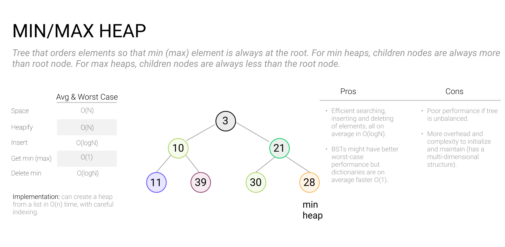
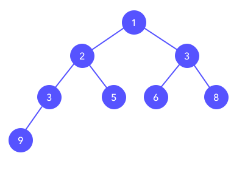
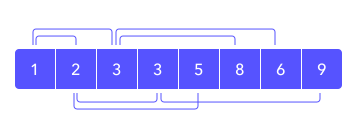

# Heaps

### 

A **heap**, also known as a priority queue, is a tree-like data structure optimized for finding the minimum or maximum value in a list of values. The underlying data structure is an array, but you can visualize the heap as an almost complete binary tree except for the lowest level which is filled up from the left.

The **min or max value** is stored at the root of the tree, which when represented in the array is at index 0. Since this is an almost complete binary tree we can find each node's left node at `2i + 1`, right node at `2i + 2`, and parent at `floor((i-1)/2` where `i` is the index of the node.

Here's a visualization of the same min-heap drawn in two different ways. First is the binary tree representation:

and the second is the underlying array structure.

### When to use a heap in an interview

Heaps are great when you care about knowing the min or max value in a list, but they are not optimized for searching or random access of the items they contain. You can also use heaps to sort a list or find its top N values. You don't have to store only simple values in a heap; you can also use them to prioritize more complex types as long as you can calculate the priority.

### Calculating memory usage

Since they are typically represented by an array, heaps have little memory overhead besides the size of the array itself. In fact, heaps rely on an in-place sorting algorithm known as *heapsort*, so you can actually build a heap using an existing array and no additional memory!

### Common heap operations

- Insert an item
- Pop the top item
- Peek the top item
- Remove an item
- Update an item

### Practice problems

- [Find the Largest Numbers](https://www.tryexponent.com/courses/software-engineering/swe-practice/largest-numbers)
- [K-Messed Array Sort](https://www.tryexponent.com/courses/software-engineering/swe-practice/largest-numbers)