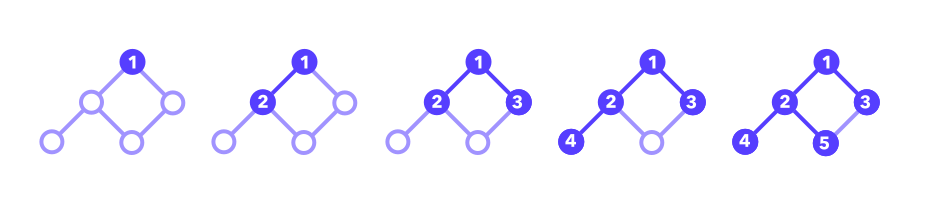
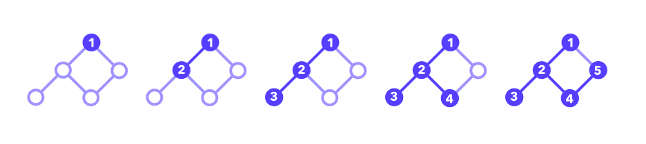

# Graph Search

### 

Graph search algorithms are used to solve any problem that can be expressed with a [graph](https://www.tryexponent.com/courses/software-engineering/algorithms/graphs-trees) data structure. We won’t cover all of them here, but you should be familiar with **breadth-first search (BFS)**, **Depth-first search (DFS)**, and **Dijkstra's shortest path** algorithm since they can be used to solve a variety of many common coding problems.

### Breadth-first search (BFS)

==BFS searches a tree data structure *one level of depth at a time*. This means that we explore all of a node’s neighbors before exploring any children.==



BFS uses a [queue](https://www.tryexponent.com/courses/software-engineering/algorithms/stacks-queues) to track the next-up locations to search. BFS can find the shortest path between two nodes, though it consumes more memory than another popular graph search algorithm (DFS) as each connected node must be stored in memory. Common applications of BFS are pathfinding, as it always finds the shortest path, as well as finding spanning trees and crawling websites efficiently.

**Here's a simple implementation of BFS.**

Given a graph G and a starting vertex root of G:

```python
function bfs(node, neighbors) {
  const q = [node];
  const explored = {node: true}

  while (q.length > 0) {
    const v = q.shift();
		
		for (const neighbor of neighbors[v]) {
      if (!explored[neighbor]) {
				q.push(neighbor);
				explored[neighbor] = true;
			} 
    }
  }
}
```

### Depth-first search (DFS)

==In DFS, we traverse *as far as possible* along each branch before backtracking, exploring until we reach a node without edges or a node that we’ve previously visited.==



DFS uses a [stack](https://www.tryexponent.com/courses/software-engineering/algorithms/stacks-queues) rather than a queue to track locations to search next. DFS is naturally suited to traverse an entire graph — It's not optimized to find the shortest path between nodes, as is BFS. Common applications for DFS are finding paths, cycles, and topological sorting.

**Here's a recursive implementation of DFS.**

Given a graph *G* and a vertex *v* of *G*

```python
// Iterative version
function dfs(node, neighbors) {
  const s = [node];
  const explored = {node: true}

  while (s.length > 0) {
    const v = s.pop();
		  
		for (const neighbor of neighbors[v]) {
      if (!explored[neighbor]) {
				s.push(neighbor);
				explored[neighbor] = true;
			}
    }
  }
}

// Recursive version
function dfs(node, neighbors, explored) {
  explored[node] = true;
	for (const neighbor of neighbors[node]) {
    if (!explored[neighbor]) {
      return dfs(neighbor, neighbors, explored);
     }
   }
}
```

### Dijkstra’s shortest path algorithm

Finding the shortest path between two vertices in a graph is a common problem. Dijkstra’s algorithm is an important variant of BFS that works on graphs with weighted edges and is often implemented using a min-priority queue to visit vertices *in order of distance*.

There are many variants of Dijkstra's algorithm. One popular variant affixes a given node as the "source", then finds the shortest path from the source to all other nodes, quickly finding the shortest-path tree.

### Practice problems

- [Number of Islands](https://www.tryexponent.com/courses/software-engineering/swe-practice/number-islands)
- [Find a Sales Path](https://www.tryexponent.com/courses/software-engineering/swe-practice/sales-path)
- [Find the Shortest Cell Path](https://www.tryexponent.com/courses/software-engineering/swe-practice/shortest-cell-path)