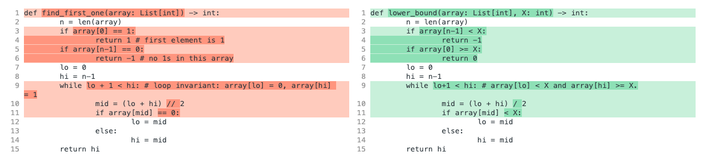

# Binary Search

### 

### What is binary search?

Binary search is a versatile technique for *finding an element within a sorted list.* The key is in taking advantage of *sorted* data to divide the search space in half at every step. Often, you can speed up naive algorithms from O(n) to O(log n), which is a huge improvement.

The binary search implementation we'll review below might differ slightly from what's readily found online, but we think it's a bit easier to remember and less prone to off-by-one errors. Remember, however, that memorizing won't serve you when prepping for technical interviews. If you understand *why* binary search works, you'll be able to write good code that's applicable to a wide variety of problems.

Let's begin with a simple example.

### Problem statement

Let's say we have an array that consists of `0`s and `1`s, and you are guaranteed that all `0`s appear before all `1`s. For example, arrays like `[0, 0, 1, 1, 1]`, `[1, 1, 1]`, and `[0, 0, 0, 0]` are valid, while `[1, 0]`, `[0, 1, 0, 1]` are not valid. In this problem, we want to find the first index of the array that is a `1`. If no elements are `1`, then return `-1`.

The signature for this function looks like this (in python):

```python
def find_first_one(array: List[int]) -> int:
	pass
```

### Naive algorithm

A naive solution for the above would be:

```python
def find_first_one(array: List[int]) -> int:
	for i in range(len(array)):
		if array[i] == 1:
			return i
	return -1
```

The worst case runtime of the naive algorithm is O(n) since in the worst case we'll have n-1 0s and one 1, and we'll need to scan the entire array.

### Optimizing with Binary Search

We can speed this up with binary search.

> **Tip**: Take a moment to review [**"loop invariants"**](https://en.wikipedia.org/wiki/Loop_invariant), or, properties of a given loop which are true before and after each loop iteration.

We start with two pointers, called `lo` and `hi`, which represent the lowest and highest number that a possible answer could be. In this case, since the answer is always an index, we can set `lo = 0` and `hi = len(array)-1` initially.

For this problem, we'll let the loop invariant be `array[lo] = 0` and `array[hi] = 1`.

This may not be the case initially, but we explicitly check those cases first. For example, if `array[0] = 1`, then that means the answer is just `0` since `0` is the first index where `1` appears. If `array[n-1] == 0` then the answer is `-1` since there are no `1`s in the array.

In each iteration of binary search, we'll try to halve our search space. We take the midpoint between `lo` and `hi` (which can be computed as `(lo+hi)/2`), and depending on whether the value of the array at that index is `0` or `1`, we can update either `lo` or `hi` to the midpoint.

```python
def find_first_one(array: List[int]) -> int:
	n = len(array)
	if array[0] == 1:
		return 1 # first element is 1
	if array[n-1] == 0:
		return -1 # no 1s in this array
	lo = 0
	hi = n-1
	while lo + 1 < hi: # loop invariant: array[lo] = 0, array[hi] = 1
		mid = (lo + hi) // 2
		if array[mid] == 0:
			lo = mid
		else:
			hi = mid
	return hi
```

it's easy to see why we set `lo = mid` when `array[mid] == 0`; that is, we want to ensure that that loop invariant is true.

Now for our stopping condition. Notice `lo+1 < hi`. The reason we did this is that when `lo+1 = hi`, then `lo` and `hi` are adjacent indices in the array. Once we have that, then we immediately see that `hi` is the first index that is a `1` because it has a `0` immediately before it. Another way to think of this is finding the place where the array switches from `0` to `1` (rather than finding the first `1` ).

To compute the time complexity, we can note that at each iteration, we halve the distance between `lo` and `hi`, and this is O(log n).

### Other applications for binary search

Binary search can be applied if there is only one point in time where a condition switches from false to true (or vice versa). In the example above, the condition is "array is equal to one". In other problems, this condition can be different, but as long as the underlying array has some structure where some prefix is all False and suffix is all True (or vice versa), then binary search can be applied.

Let's try it out with a few more examples.

### Problem statement

Given a sorted array, find the index of the first element ≥ X (return -1 if no element ≥ X).

```python
def lower_bound(array: List[int], X: int) -> int:
	pass
```

**Hint**: consider loop invariants `array[lo] < X` and `array[hi] >= X`

Here's the full solution.

```python
def lower_bound(array: List[int], X: int) -> int:
	n = len(array)
	if array[n-1] < X:
		return -1
	if array[0] >= X:
		return 0
	lo = 0
	hi = n-1
	while lo+1 < hi: # array[lo] < X and array[hi] >= X.
		mid = (lo + hi) / 2
		if array[mid] < X:
			lo = mid
		else:
			hi = mid
	return hi
```



*Diff of `find_first_one` and `lower_bound`*

Note that this code is very similar to `find_first_one` with the exception of the different boundary checks. The time complexity of this solution is O(\log_2(n)).

### Problem statement

Binary search works on data structures beyond arrays. To demonstrate, let's compute the square root of a non-negative number (to a certain level of precision.) We'll use loop invariants similarly to what we did above.

```python
PRECISION = 1e-6
def square_root(X: float) -> float:
	lo = 0
	hi = X
	while (hi - lo) > PRECISION: # lo^2 < X, hi^2 >= X
		mid = (lo + hi) / 2
		if mid*mid < X:
			lo = mid
		else:
			hi = mid
	return (lo + hi) / 2
```

Here, we've changed the termination condition to take into account precision. We also know the answer will be between lo and hi, so at the end, we can approximate it as `(lo+hi)/2`.

The runtime of this is `O(log (X / PRECISION))`

### Practice problems

- [Find the Largest Smaller BST Key](https://www.tryexponent.com/courses/software-engineering/swe-practice/largest-smaller-bst-key)
- [BST Successor Search](https://www.tryexponent.com/courses/software-engineering/swe-practice/bst-successor-search)