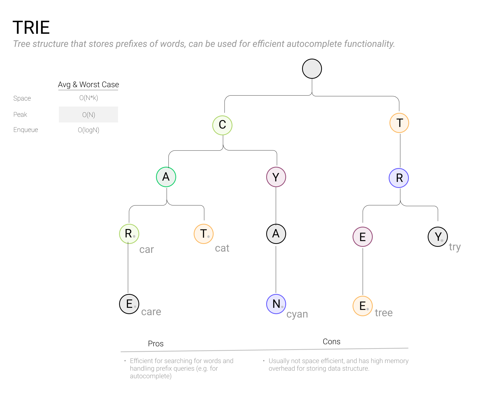

# Graphs and Trees

### 

### What is a graph?

==A **graph** is a data structure that consists of vertices (or “nodes”) and links between these vertices, called “edges.”== Edges can be directed or undirected, depending on the application. Graph representations of data have many practical use cases; in social networks we can represent people as vertices and friendships as undirected edges, and for maps and GPS navigation, we can represent intersections as vertices and road segments as directed edges.

Graphs are often implemented in one of two ways depending on your desired performance characteristics:

- as an adjacency *list of edges* for each vertex, which uses less space, or
- as an adjacency *matrix*, which uses more space but can answer the question “Is this vertex connected to this vertex” in constant time.

Performance of graph algorithms is often expressed in terms of vertices V and edges E, rather than N.

### When to use a graph in an interview

In most cases it will be obvious when to use a graph representation; you’ll either be explicitly told or the data will be described as containing nodes and edges.

### Calculating memory usage

The memory used by a graph is a function of the number of vertices V and the number of edges E. For an adjacency list implementation, the total space usage can be expressed as `V + E`, where edges are IDs or pointers. For an adjacency matrix, the memory usage is `V^2` since the state of all edges is stored.

### Common graph operations

- Insert a node into a graph
- Remove a node from a graph
- Add an edge between two nodes
- Find the neighbors of a node
- Find a path between two nodes

### Trees

Trees are both fundamental and ubiquitous, often appearing in search and traversal questions. A tree can be defined as a collection of nodes, where each node contains references to zero or more child trees. (The fact that trees are defined recursively is a strong hint that recursive algorithms are usually a good fit for dealing with this data structure). These nodes are very similar to the ones we learned about with linked lists, except instead of each node only containing one memory pointer to a successor node, they can contain an arbitrary number of memory pointers to child nodes. Importantly, no cycles are allowed in trees, meaning each node is only referenced once.

Trees are therefore a subcategory of graphs - technically directed acyclic graphs - meaning many basic algorithms like [*breadth-first search* and *depth-first search*](https://www.tryexponent.com/courses/software-engineering/data-structures/graph-search) can be used in the contexts of both graphs and trees, as we'll explore below.

Take a moment to review key terms having to do with trees.

- **Leaf node**: A node that doesn’t have any children.
- **Root node**: The topmost node in a tree. Note that this will almost always be the node you are given when implementing an algorithm to manipulate a tree.
- **Height** The distance between the root node and the lowest leaf node.
- **Subtree**: A node beneath the root node and all of its descendants. Each node is in effect the root node of its own subtree.

### Tree traversals

It's possible to use both depth-first search and breadth-first search on trees. **Depth-first search** on a tree requires a series of recursive calls. There are a few different orders to choose from. **1) Pre-order traversal**, where each recursive call:

- Traverses the left subtree
- Visits the current node
- Traverse the right subtree

**2) In-order traversal**, where each recursive call:

- Traverses the right subtree
- Visits the current node
- Traverses the right subtree

**3) Post-order reversal**, where each recursive call:

- Traverses the left subtree
- Traverses the right subtree
- Traverses the left subtree

A **breadth-first** tree traversal is called a **level-order traversal.** This algorithm is *not* performed recursively. Instead, it works by visiting the current node, placing its children nodes in a queue, and then while the queue is nonempty, dequeuing the next node and repeating the first two steps.

There are a few other flavors of tree to be aware of. A **binary tree** has up to two child nodes, usually referred to as left and right. These are one of the most common forms of trees you will encounter in interview questions. **Binary search trees** are a variant of binary trees in which for every node, all values contained in the left subtree are guaranteed to be less than the value of the current node, and all values contained in the right subtree are guaranteed to be greater than the value of the current node. This allows for O(log n) search times in well-balanced trees (but O(n) worst-case if the tree is unbalanced, as you’re essentially searching a linked list).


Finally, **tries** are a specialized type of tree in which nodes usually store strings, and for which all of the possible depth-first search traversals represent all of the possible entries in a collection of strings. Tries lend themselves to applications like predictive typing and autocomplete.



### Practice problems

- [Edit Distance](https://www.tryexponent.com/courses/software-engineering/swe-practice/bst-successor-search)
- [Degrees of Friendship](https://www.tryexponent.com/courses/software-engineering/swe-practice/bst-successor-search)
- [Number of Islands](https://www.tryexponent.com/courses/software-engineering/swe-practice/number-islands)
- [Balanced Tree](https://www.tryexponent.com/courses/software-engineering/swe-practice/balanced-tree)

------

# BST Successor Search

[In a Binary Search Tree (BST), an **Inorder Successor** of a node is defined as the node with the smallest key greater than the key of the input node (see examples below). Given a node `inputNode` in a BST, you’re asked to write a function `findInOrderSuccessor` that returns the Inorder Successor of `inputNode`. If `inputNode` has no Inorder Successor, return `null`.

Explain your solution and analyze its time and space complexities.

In this diagram, the inorder successor of **9** is **11** and the inorder successor of **14** is **20**.


**Example:**

In the diagram above, for `inputNode` whose `key = 11`

**Your function would return:**

The Inorder Successor node whose `key = 12`

Give it a try using the code editor below:

JavascriptC#PythonC#

 }

 public static Node findInOrderSuccessor(Node inputNode)

 {

  // your code goes here

 }

 static void Main(string[] args)

 {

  // test findInOrderSuccessor here

 }

  public Node left;

  public Node right;

  public Node parent;

}

Run codeRun tests

### Hints

Need a refresher on Binary Search Trees? Check out Exponent's lesson on Trees and take this interactive [BST visualizer](https://www.cs.usfca.edu/~galles/visualization/BST.html) out for a spin.

Look again at the examples above (both the diagram and the text below.) Can you discern the two different cases in which a node is an Inorder Successor of a given input node?

### Our solution

Let’s denote the Inorder Successor of `inputNode` as `successorNode`. To arrive to the solution, we distinguish between two cases:

- `inputNode` has a right child. In this case `successorNode` would be the node with the minimum key in `inputNode`'s right subtree.
- `inputNode` doesn't have a right child. In this case `successorNode` would be one of `inputNode`'s ancestors. More specifically, within `inputNode`'s ancestor chain (starting from `inputNode` all the way up to the root), `successorNode` is the first parent that has a left child in that chain.

If `inputNode` doesn't have a right child and all of its ancestors are right children to their parents, `inputNode` doesn't have a successor (`successorNode` would be null).

So why is this always true? Well, if `inputNode` was inserted to the tree prior to `successorNode`, then since `successorNode.key` is greater than `inputNode.key`, but also smaller than all other keys greater than `successorNode.key`, `successorNode` has to be in `inputNode`'s right subtree.

Now, if `inputNode` was inserted to the tree after `successorNode` was, then since `inputNode.key` is smaller than `successorNode.key`, but also larger than all other keys smaller than `successorNode.key`, `inputNode` has to be in `successorNode`'s left subtree.

**Pseudocode:**

```python
function findInOrderSuccessor(inputNode):
    if (inputNode.right != null):
        # return the node with minimum key in the right subtree
        return findMinKeyWithinTree(inputNode.right)

    ancestor = inputNode.parent
    child = inputNode

    # travel up using the parent pointer until you see
    # a node which is the left child of its parent. The parent
    # of such a node is successorNode.
    while (ancestor != null AND child == ancestor.right):
        child = ancestor
        ancestor = child.parent

    return ancestor

function findMinKeyWithinTree(inputNode):
    while (inputNode.left != null):
        inputNode = inputNode.left

    return inputNode
```

**Time Complexity:** in both cases where either `inputNode` has a right child or doesn’t have one, we are visiting only `O(H)` number of nodes, where `H` is the height of the BST. For a balanced BST, since `H = log(N)`, where `N` is the number of nodes in the BST, the time complexity is `O(log(N))`. For an unbalanced BST, the time complexity is `O(N)`.

**Space Complexity:** throughout the entire algorithm we used only a constant amount of space, hence the space complexity is `O(1)`.