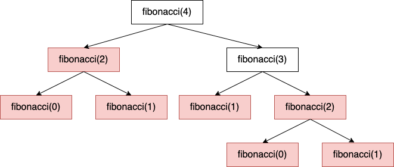
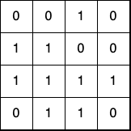
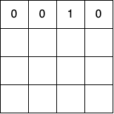

# Dynamic Programming

### 

Dynamic programming (DP) is a technique for improving the runtime performance of problems with **optimal substructure** by saving previously calculated values that are repeated frequently. This is often accomplished by maintaining a hash table of previous values outside of the inner loop so that future iterations can reference previously saved values. More generally, DP uses caching to ensure that each subproblem is solved at most once.

> **Note**: As a rule of thumb, any problem that can be solved with DP can also be solved recursively, but DP is most helpful when the problem has **overlapping subproblems**.

Dynamic programming often appears in programming interviews, but even if you aren't directly asked to solve a problem using DP, it’s a great way to improve your brute force solution.

### When to use dynamic programming in an interview

You'll recognize DP problems via their two common properties:

- **Optimal substructure**: We say that a problem has optimal substructure if its optimal solution for an input of size n can be expressed as a combination of the optimal solutions for smaller inputs of size `m<n`. For example, consider the "paths in a grid" problem from the Recursion lesson - given a rectangular grid and the ability to move either down or right, return the number of paths from the upper left-hand corner to the lower right-hand corner. We already determined that we could express the answer as the sum of the paths from the squares directly to the right and below of the current square:

```
NumberOfPaths(i,j) = NumberOfPaths(i+1,j) + NumberOfPaths(i,j+1)
```

- **Overlapping subproblems**: We say that a problem has overlapping subproblems if — when the problem is broken down into recursive subproblems — some subproblems are solved more than once. For example, consider a function `Fibonacci(n)` that outputs the n-th Fibonacci number `(F_n)`. As a refresher, the Fibonacci sequence is defined by the recurrence relation `F_n = F_(n-2) + F(n-1)`, with base cases of `F_0 = 0` and `F_1 = 1`. Then the recursive function call tree for `fibonacci(4)` might look something like this:



But all of the red boxes are calculations that happen more than once - in total, we actually compute `fibonacci(1)` three times in this tree! In fact, the runtime complexity of this solution is `O(2^n)`, since each increment of `n` by 1 approximately doubles the amount of computation required. In DP, we use caching to optimize this solution by ensuring that we never have to repeat a calculation.

### Memoization (Top-Down DP)

***Memoization = Recursion + Caching***

In the previous section, we saw how recursive algorithms with overlapping subproblems are often inefficient to compute because many sub-problems are repeated. In memoization, we solve this problem by caching the result of a calculation the first time we encounter it and re-using it for future calls on the same input. The code for this might look something like this:

```python
memo = {}

def fibonacci(n: int):
	# Check if we've encountered this input before.
	if n in memo:
		return memo[n]

	# Base cases
	if n == 0 or n == 1:
		return n

	# Recursive step
	output = fibonacci(n-2) + fibonacci(n-1)

	# Memoize the solution before returning
	memo[n] = output
	return output
```

Now since we only compute `fibonacci(i)` once for each possible `0 ≤ i ≤ n`, we've reduced the runtime for `fibonacci(n)` from O(2^n) to O(n). This is known as a **top-down** solution because we recursively compute the solution starting from the largest input and move towards the base case.

However, sometimes we may not be able to use a cache as straightforward as a hash map. If we're searching in multiple dimensions or axes, we may need a multidimensional cache as well. Let's look at an example - suppose you have an `m x n` matrix filled with 0s and 1s. How would you implement a function `maximal_square(arr)` to find the area of the largest square containing only 1s?



We can see that in this example, `maximal_square(arr)=4`. But to solve it algorithmically, we can start by noticing the overlapping subproblems. If we were to solve this in a brute force way, we could first identify the largest square of 1s that any cell `(i,j)` forms the lower right hand corner of. Let's call the function that returns the side length of this square `max_s_at(i,j)`. Then, we could identify the cell with the largest such square, and return that square's area as our answer. In short, `maximal_square(arr)=max_{i,j}(max_s_at(i,j))^2`.

However, for a given cell `(i,j)` that contains a 1, it can only be the lower right corner of a square of size `s^2` if its neighbors directly to the north, west, and northwest are the lower right-hand corners of squares of size **at least** `(s-1)^2`. To see this, consider the bolded cell below.

_15d69f31be.png)

Its north, west, and northwest neighbors are colored in green, blue, and red, respectively. We can similarly color code the largest square that each of these neighbors belongs to. As shown above, the northwest (red) cell forms the corner of a square of size 4, whereas the north (green) and west (blue) neighbors form corners of squares of size 1 each. Then by our previously stated rule, the largest value that `s` can have in this case is 2. In summary, `s` is one more than the minimum side-length of the squares that its north, west, and northwest neighbors are the corners of. We can express this more precisely as:

```python
max_s_at(i,j) = 1 + min(max_s_at(i-1,j), max_s_at(i,j-1), max_s_at(i-1,j))
```

As we can see, this is the recursive step in a recursive algorithm! In a DP context, this is sometimes also known as a **recurrence relation.** Furthermore, this recurrence relation has overlapping subproblems - for instance, both `max_s_at(1,0)` and `max_s_at(0,1)` require calculating `max_s_at(0,0)`, which we can memoize. Since our input now consists of two arguments, we can use a two-dimensional array as our cache instead, where the row and column indices correspond exactly to the indices of the input array. Putting this all together, our code might look something like this:

```python
def maximal_square(arr):
    if not arr:
        return 0
    
    m = len(arr)
    n = len(arr[0])
    dp = [[None for _ in range(n)] for _ in range(m)] 
    
    def max_s_at(i, j):
        # Check bounds
        if i < 0 or j < 0 or i > m or j > n:
            return 0

        if arr[i][j] == 0:
            dp[i][j] = 0
            return 0
        
        # Check the cache
        if dp[i][j] is not None:
            return dp[i][j]

				# Recurrence relation
        north = max_s_at(i-1, j)
        west = max_s_at(i, j-1)
        northwest = max_s_at(i-1, j-1)
        out = 1 + min(min(north, west), northwest)

				# Store the new results in the cache and return
        dp[i][j] = out
        return out
    
    max_area_so_far = 0
    for i in range(m):
        for j in range(n):
            max_s_curr = max_s_at(i,j)
            if max_s_curr**2 > max_area_so_far:
                max_area_so_far = max_s_curr**2
    return max_area_so_far
```

### Bottom-Up

Above, we used recursion combined with caching to ensure that no sub-problems were solved more than once. However, this approach still required recursion, which can be costly both in execution time and in stack memory. We could optimize our solution even more if we could solve the problem iteratively!

**Bottom-up dynamic programming** accomplishes this by iteratively populating the entire cache, rather than recursively populating individual elements of the cache whenever a new input is encountered. If we already know what the base case and recurrence relation are, we can simply start by filling in the value for the base case, and then using the recurrence relation to populate the rest of the cache.

Let's return to the maximal square example above. Since we are filling in the areas for the maximal squares that each cell could be the lower right hand corner of, it makes sense to start in the upper left hand corner. We know that all cells in the upper row can only be parts of squares of area at most 1, so the first row of our cache is the same as the first row of the array:



Next, we can continue using our recurrence relation from before to fill in the rest of the cache, going from left to right and top to bottom. For example,

```python
dp[1,0] = 1 + min(dp[1,-1]dp[0,0],dp[0,-1])
        = 1 + min(0,0,0)
        = 1
```

and so on. Filling in the entire cache gives:

_44a706b4fa.png)

Since we know that the `(i,j)-th` cell in `dp` contains the value of `max_s_at(i,j)` and `maximal_square(arr)=max_{i,j}(max_s_at(i,j))^2` , we can obtain the final answer by finding the maximum value in `dp` and squaring it to calculate the area. Now we've not only found the answer in `O(mn)` time and space, but we also didn't require any recursive calls in order to do so!

Lastly, some sample code for this problem might look like this:

```python
def maximal_square_bottom_up(arr):
    if not arr:
        return 0
    
    m = len(arr)
    n = len(arr[0])
    dp = [[0 for _ in range(n)] for _ in range(m)] 
    
    # Fill in the cache and keep track of max
    max_area_so_far = 0
    for i in range(m):
        for j in range(n):
            if arr[i][j]:
                north = dp[i-1][j] if i else 0
                west = dp[i][j-1] if j else 0
                northwest = dp[i-1][j-1] if (i and j) else 0
                dp[i][j] = 1 + min(min(north, west), northwest)
            
            curr_area = dp[i][j]**2
            if curr_area > max_area_so_far:
                max_area_so_far = curr_area
    return max_area_so_far
```

### Practice problems

- [Fibonacci Numbers](https://www.tryexponent.com/courses/software-engineering/swe-practice/fibonacci)
- [Sales Path](https://www.tryexponent.com/courses/software-engineering/swe-practice/sales-path)
- [Flatten a Dictionary](https://www.tryexponent.com/courses/software-engineering/swe-practice/flatten-a-dictionary)
- [Sudoku Solver](https://www.tryexponent.com/courses/software-engineering/swe-practice/sudoku-solver)
- [Build a Basic Regex Parser](https://www.tryexponent.com/courses/software-engineering/swe-practice/basic-regex-parser)