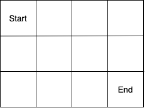
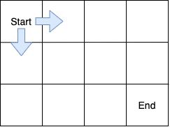
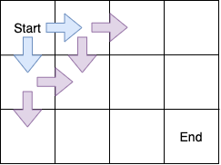
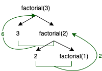
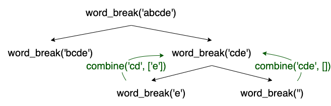

# Recursion

### 

### What is recursion?

A **recursive** algorithm is one that can be defined in terms of itself, usually by applying the algorithm to smaller portions of the input and then combining those results together to obtain the solution for the original input.

### When to use recursion in an interview

You can typically recognize a recursive problem by first assuming that you have an algorithm `A` for solving the problem, and figuring out whether the solution on your original input `x` can be obtained by combining the solutions `A(x_1)`,`A(x_2)`,`...` where `x_1`,`x_2`,`...` are sub-parts of your original input `x`. This is known as a **divide-and-conquer** algorithm, because we first **divide** the problem into multiple smaller parts, **delegate** the sub-problems to the recursive algorithm, and **combine** the solutions of the sub-problems into the final solution for the original input. To make this idea more concrete, let's go through a few examples:

- **Determine if a string is a palindrome.** Given a string (e.g. `"abcba"`), return `True` if the string is a palindrome, and `False` if not. We can break down this problem by starting from both ends of the string and checking if the characters at either end of the string (e.g. `"a"` and `"a"`) are equal. If they are, then it suffices to check if the remaining substring (e.g. `"bcb"`) is also a palindrome, which we can do with a recursive call. Put more precisely,

```python
IsPalindrome("abcba") = IsEqual("a", "a") AND IsPalindrome("bcb")
```

We can continue breaking down the remaining `IsPalindrome` call, as follows:

```python
IsPalindrome("bcb") = IsEqual("b", "b") AND IsPalindrome("c")
```

Putting together what we've come up with so far, we have:

```python
IsPalindrome("abcba") = IsEqual("a", "a") AND (IsEqual("b", "b") AND IsPalindrome("c"))
```

Now the only `IsPalindrome` call remaining on the right hand side of our expression is `IsPalindrome("c")`, for which we can trivially return `True`, since we know that any single character is a palindrome. When we have reduced our logic down to the simplest possible input like this, we have reached the **base case**, which we'll discuss more in detail later.

- **Paths in a grid.** Given an *m* x *n* grid, supposing that you start at the upper left corner and can only move right or down, return the number of paths that you can take to reach the lower right corner. For reference, here's an example grid:



where we'll denote the `Start` square as having coordinates `(0, 0)` and the `End` square as having coordinates `(2,3)`. For this problem, let's name our function `NumberOfPathsFrom(x,y)`, which returns the number of paths from the square at `(x,y)` to the `End` square. Now let's look at the possible first steps that we can take:



Since these are the only two steps we can possibly take from the `Start` square, we know that every path from `Start` to `End` must begin with one of these two steps. This means that we can simply count the number of paths that start from either `(1,0)` or `(0,1)`:

```python
NumberOfPaths(0,0) = NumberOfPaths(1,0) + NumberOfPaths(0,1)
```

Notice that this recursively applies our original function! Now we can consider what happens after the first step. Either we're at `(1,0)` or `(0,1)`, so our possible next steps look like this:



Repeating the same logic as before, we have:

```python
NumberOfPaths(1,0) = NumberOfPaths(2,0) + NumberOfPaths(1,1)
NumberOfPaths(0,1) = NumberOfPaths(1,1) + NumberOfPaths(0,2)
```

and so on. When we eventually reach the squares directly above and to the left of the `End` square (the squares at `(2,2)` and `(1, 3)`, we know that there is only one path from each of these squares to the `End` square, so our base cases are `NumberOfPaths(2,2)=1` and `NumberOfPaths(1,3)=1`.

> Now that we've worked out what recursive problems generally look like and an initial strategy for breaking them down into simpler sub-problems, we'll get more into the details of exactly how to formulate a recursive algorithm.

### Formulating a recursive algorithm

Now that we know how to identify a recursive problem, we have to actually design the algorithm for solving the recursive problem. Typically, a recursive algorithm consists of two main components:

***Base case:*** This is the simplest possible input for the problem - a case where we can no longer break down the problem into simpler sub-problems. The base case is usually some form of empty input, such as an empty list, string, or 0. Sometimes you may need multiple base cases!

In the palindrome example above, we actually need two base cases: 1) `IsPalindrome("")=True` (for when the original string has an even number of characters) and 2) `IsPalindrome("a")=True`, which actually applies for any input that consists only of a single character (for when the original string has an odd number of characters.)

In the grid example above, we also need two base cases. Letting `(n,k)` be the coordinates of the `End` square, we know that the last step we can take before arriving at the `End` square must be directly from above or to the left, which correspond to the coordinate pairs `(n-1,k)` and `(n,k-1)` respectively. Then our base cases are exactly `NumberOfPaths(n-1,k)=1` and `NumberOfPaths(n,k-1)=1`.

***Recursive step:*** This is the formula by which you decompose the problem in terms of smaller sub-problems and recursively apply your algorithm to the sub-problems. Usually this involves breaking down the inputs in some way (e.g. removing a character from a substring, removing an element from a list) and re-combining the outputs from the recursive calls in some way (e.g. adding, appending to a list).

In the palindrome example above, we can decompose the problem in terms of the first character, last character, and substring in between the first and last characters. Supposing that the input string has length `n`, the recursive step boils down to `IsPalindrome(input)=IsEqual(input[0], input[n-1]) AND IsPalindrome(input[1:n-1])`. Putting this together with the base cases, our code might look something like:

```python
        def is_palindrome(input_str: str):
        	n = len(input_str)
        	# Base cases
        	if not input_str or n == 1:
        		return True
        	# Recursive step
        	return (input_str[0] == input_str[n-1]) & is_palindrome(input_str[1:n-1])
```

In the grid example above, we identified that the number of paths from each square to the `End` square can be expressed in terms of the number of paths from the square directly to the right and below. In other words, the recursive step is: `NumberOfPaths(i,j)=NumberOfPaths(i+1,j)+NumberOfPaths(i,j+1)`, assuming that these coordinate pairs are all in range. Putting this together with the base cases, our code might look something like:

```python
        def number_of_paths(i: int, j: int, end_coords: List[int]):
        	# Check bounds
        	if i < 0 or j < 0 or i > end_coords[0] or j > end_coords[1]:
        		return 0
        	# Base cases
        	if ((i,j) == (end_coords[0]-1, end_coords[1]) 
        			or (i,j) == (end_coords[0], end_coords[1]-1)):
        		return 1
        	# Recursive step
        	return number_of_paths(i+1, j) + number_of_paths(i, j+1)
```

### Types of recursion

***Head Recursion***

In head recursion, the recursive call comes at the beginning of the function, and we post-process the results of the recursive call before returning. For example, consider the following function for calculating the factorial of input integer `n`:

```python
def factorial_head(n: int):
  output = None
  if n == 0:
    output = n
  elif n > 0:
    output = n * factorial_head(n-1)
  return output
```

Rather than directly returning the result of `factorial_head(n-1)`, we first post-process its output by multiplying it by `n` before returning.

It's sometimes easier to visualize these recursive functions via a tree diagram that depicts the flow of logic:


The above diagram shows what happens when we add recursive calls to the function call stack. Now let's draw in what happens when we start returning from the recursive calls and coming back up the function call stack:



The green arrows are labeled with the output from each level of the tree. `factorial(2) = 2 x factorial(1) = 2, factorial(3) = 3 x factorial(2) = 6`, and so on.

***Tail Recursion***

In tail recursion, the function does its work *before* the recursive call and directly returns the result of the recursive call. Thus, the recursive call occurs at the *tail* end of the function. Here's an example of how we can rewrite the factorial function as a tail recursive function:

```python
def factorial_tail(n: int, accum: int):
  if n == 0:
    return accum
  accum = accum * n
  return factorial_tail(n-1, accum)
```

As before, we can also draw the recursion tree:

_25f45b1c62.png)

Unlike in head recursion, a tail recursive function does all its processing as it's going down the recursive function call stack, and directly returns the answer of the recursive calls. This is typically more efficient than head recursion, since we no longer need to store intermediate variables while we wait for the results of the recursive calls.

### ***Tree Recursion***

Lastly, many recursive algorithms require **multiple recursive calls in the same function call,** forming "branches" in our function call tree (hence the name tree recursion).

For example, consider the word break problem. Given a string `s='abcde'` and a dictionary of valid words `valid_words=['a', 'ab', 'cd', 'cde', 'e']`, return all possible ways to break down the string into only valid words (e.g. `['ab cd e', 'ab cde']`). We can decompose this problem by first identifying which valid words are also prefixes of `s` (e.g. 'a' and 'ab'), and then applying `word_break()` recursively to the rest of the string (e.g. 'bcde' and 'cde'). In this example, the valid words 'a' and 'ab' are both prefixes of `s`. The remaining substrings corresponding to these prefixes are 'bcde' and 'cde', respectively, so we need to recursively call both `word_break('bcde')` and `word_break('cde')`. Here's our recursion tree so far:


where the left child node corresponds to the prefix 'a' and the right one corresponds to prefix 'ab'. Next, we follow the same decomposition step and check to see which valid words are prefixes of either 'bcde' or 'cde'. There are no valid words that 'bcde' starts with, but 'cde' starts with both 'cd' and 'cde'. If we remove these from the start of 'cde', the remaining strings that we need to break down are 'e' and '', respectively:


Great! Now we see that since 'e' is a valid word and the empty string '' is our base case, we're ready to return back up our function call tree. But how do we combine the results of `word_break('e') = ['e']` and `word_break('') = []` with the valid words that we broke off from the parent node (i.e. 'cd' and 'cde' respectively) earlier? In this case, we know that our output needs to be a list of space-separated strings consisting of the valid words that we identified, so we can simply join our output strings with spaces. Then the function that we use to merge the results of recursive calls with the current prefix might look something like this:

```python
def combine(prefix, accum_list):
    """Combines a prefix with previous word_break results.
    
    Ex: combine('a', ['bc d', 'bcd']) -> ['a bc d', 'a bcd']
		Ex: combine('a', []) -> []
    """
    output = []
    for prev_result in accum_list:
        output.append(f"{prefix} {prev_result}")
    return output
```

So now we can apply this to the results of our recursive calls:



So now we have `combine('cd', ['e']) = ['cd e']` and `combine('cde',[]) = ['cde']`. Since we know that each `word_break(...)` call needs to return a list of strings, we can simply concatenate the results of these two `combine` calls to obtain `word_break('cde') = ['cd e', 'cde']. Now let's continue back up the function call stack:

_ea896dbdb2.png)

Moving up the function call tree, we continue combining the prefix for each node with the results of the `word_break(...)` calls in the child nodes (e.g. the prefix for 'cde' is 'ab', so we call `combine('ab', word_break('cde'))`). In summary, this tree encodes the following logic:

```python
word_break('abcde') = combine('a',word_break('bcde')) + combine('ab',word_break('cde'))
                    =  combine('a', []) + combine('ab', ['cde', 'cde'])
                    = ['ab cd e', 'ab cde']
```

An example of what the code for the above logic might look like would be:

```python
def word_break(s: str, valid_words: List[str]):
  outputs = []
    
  # Base case
  if not s:
     return []
    
  # s is a valid word itself
    if s in valid_words:
      outputs.append(s)
    
    # Scan through prefixes of s to find prefixes that are valid words
    for i in range(len(s)):
      prefix = s[:i]
      if prefix not in valid_words:
        continue
            
      # The prefix is a valid word, so now we break down
      # the rest of the string.
      suffix = s[i:]
      suffix_break_down = word_break(suffix, valid_words)
      outputs += combine(prefix, suffix_break_down)
  return outputs
```

### Practice problems

- [Find a Sales Path](https://www.tryexponent.com/courses/software-engineering/swe-practice/sales-path)
- [Flatten a Dictionary](https://www.tryexponent.com/courses/software-engineering/swe-practice/flatten-a-dictionary)
- [Build a Basic Regex Parser](https://www.tryexponent.com/courses/software-engineering/swe-practice/basic-regex-parser)
- [Sudoku Solver](https://www.tryexponent.com/courses/software-engineering/swe-practice/sudoku-solver)