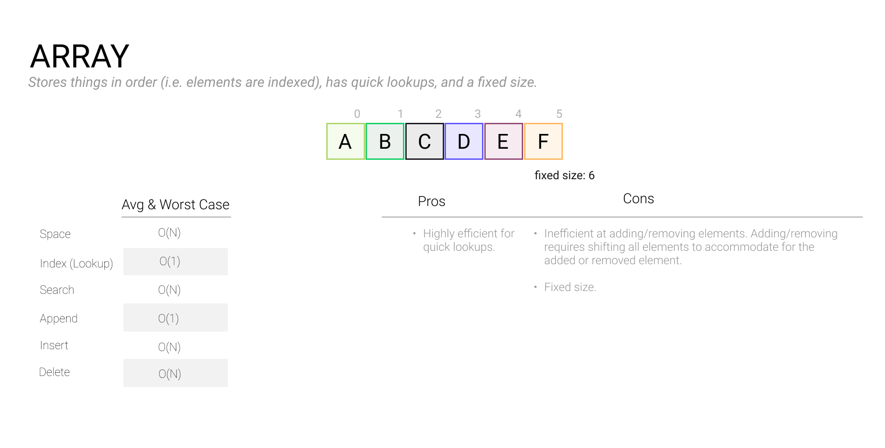
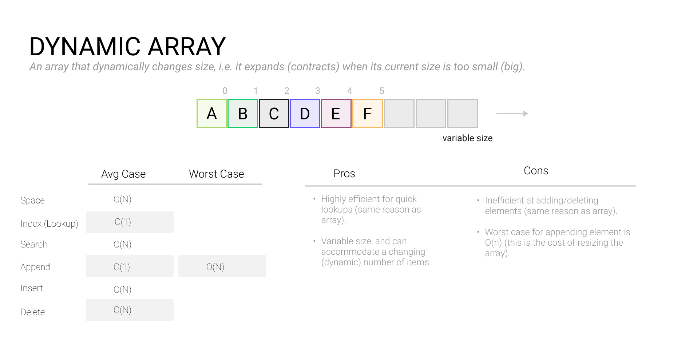

# Arrays

### 

Arrays may be the simplest data structure we'll discuss in this course, but that does not make them any less important!

An **array** is an ordered list of data that we access with a numerical index. Generally speaking, an array is allocated upfront as a single block of memory based on the number of elements and type of data we want the array to hold. This allows us to read and write elements into the array efficiently since our program knows exactly where each element is stored in memory.

On the other hand, removing, inserting, or finding arbitrary values in an array can be a linear-time operation. Removing (or “splicing”) requires shifting all elements over by one to fill the gap; inserting a new element requires shifting or allocating a larger array to hold the elements, and finding values requires iterating over the entire array in the worst case.



### Dynamic arrays

It's worth noting that in many *statically* typed programming languages (e.g. Java, C/C++), an array is limited to its initially declared size. All modern languages support (or simply default to) dynamically sized arrays, which automatically increase or decrease their size by allocating a new copy of the array when it begins to run out of space. Dynamic arrays guarantee better **amortized performance** by only performing these costly operations when necessary.



### 2D Arrays

At a higher level, arrays can be used to store references to other types - even other arrays. 2D arrays are a common array-of-arrays pattern that can be used to store tabulated data, like a location on a grid, or the price per unit of goods at different volumes. These 2D arrays are indexed by two subscripts, one for the row and another for the column.

When calculating the size of a 2D array, simply multiply the number of elements by the size of each element.

### 2 pointer traversals

As we mentioned below, removing, inserting, or finding values in arrays can be time-consuming. 2 pointer traversal is a useful technique for efficiently working with sorted arrays. It involves two distinct "pointers" which move through the array according to preset conditions until they reach a preset stopping point.

```python
public static void reverseArray(int arr[], int n) {
	int  i = 0, j = n-1;
	while(i < j) {
		int temp = arr[i];
		arr[i] = arr[j];
		arr[j] = temp;
		i++;
		j--;
	}
}
```

If you're asked to operate on a sorted array, you may want to consider using the 2 pointer technique. You might designate one pointer as a fast-runner and the other as a slow-runner — or you may place one pointer at the beginning and the other at the end, depending on the question you're asked.

### Calculating memory usage

To calculate the memory footprint of an array, simply multiply the size of the array with the size of the data type.

**Question**: What is the memory usage of an array that contains one thousand 32-bit integers?

**Answer**: `1,000 * 32 bits = 1,000 * 4 bytes = 4 Kb`

**Question**: What is the memory usage of an array that contains one hundred 10-character strings?

**Answer**: `100 * 10 chars = 100 * 10 * 1 byte = 1 Kb`

### When to use an **array** in an interview

Use an array when you need data in an ordered list with fast indexing or compact memory footprint. Don’t use an array if you need to search for unsorted items efficiently or insert and remove items frequently.

### Common array operations

Here are some common array operations that you should know how to perform during an interview in your language of choice:

- Insert an item
- Remove an item
- Update an item
- Find an item
- Loop over an array
- Copy an array
- Copy part of an array
- Sort an array
- Reverse an array
- Swap two items
- Filter an array

### Practice problems

- [Find the Difference of Arrays](https://www.tryexponent.com/courses/software-engineering/swe-practice/difference-of-arrays)
- [Find the Largest Numbers](https://www.tryexponent.com/courses/software-engineering/swe-practice/largest-numbers)
- [Degrees of Friendship](https://www.tryexponent.com/courses/software-engineering/swe-practice/degrees-of-friendship)
- [Number of Islands](https://www.tryexponent.com/courses/software-engineering/swe-practice/number-islands)
- [Copy a Spiral Matrix](https://www.tryexponent.com/courses/software-engineering/swe-practice/matrix-spiral-copy)
- [Find the Duplicates](https://www.tryexponent.com/courses/software-engineering/swe-practice/find-the-duplicates)