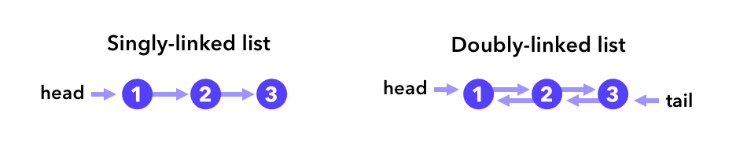
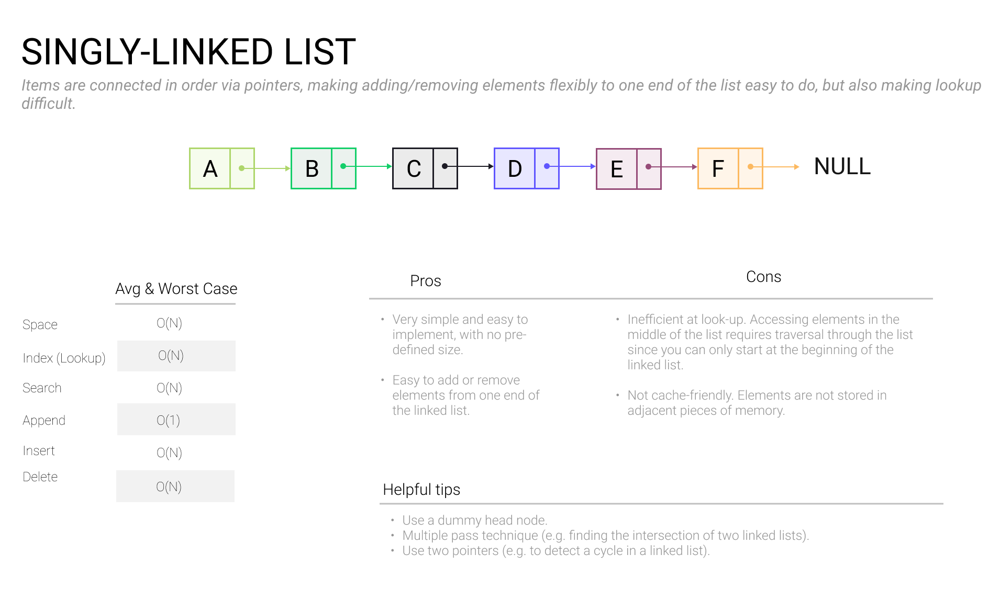
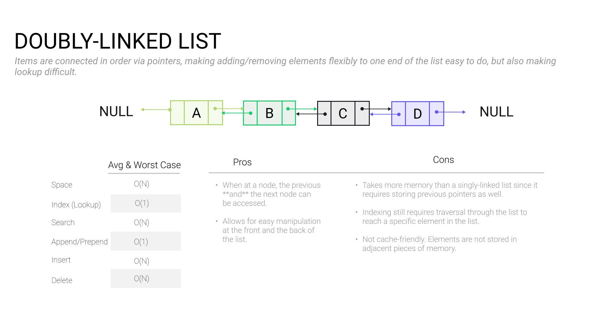

# Linked Lists

### 

Linked lists are another fundamental data structure. Unlike arrays, values in linked lists aren’t stored in adjacent blocks of memory but rather in “nodes” that are connected via memory pointers. A *singly-linked* list consists of nodes that store references to the next node in the list, and a *doubly-linked* list has nodes to both next and previous nodes.

Linked lists allow us to insert and remove arbitrary elements from the list without re-allocating or moving elements, preventing the worst performance case of an array. They also serve as a building block for more complex data structures, as we’ll explore later.

### When to use in an interview

Use a linked list when you need to efficiently insert or delete items from a list, and when you need the size of the list to be flexible. On the other hand, linked lists by themselves aren’t as good for indexing as arrays or as good for searching as hash tables and trees.

### Calculating memory usage

The memory usage of a linked list is slightly more complex than an array. In addition to the data we are storing in each node, we are also storing the pointers between nodes: a singly-linked list has one pointer for every node and a doubly-linked list has two pointers. Typically a memory pointer today is an 8-byte memory address (for software running on 64-bit machines).

**Question**: What is the memory usage of a doubly-linked list that contains one million 32-bit integers?

**Answer**: `10^6 * (32 bits + 64 bits * 2) = 10^6 * 20 bytes = 20 MB`

### Common linked list operations

Here are some common linked list operations that you should know how to perform during an interview in your language of choice:

- Insert a node
- Remove a node
- Update a node
- Find a node
- Loop over linked list
- Reverse a linked list
- Swap two nodes

### Practice problems

- [LRU Cache](https://www.tryexponent.com/courses/software-engineering/swe-practice/lru-cache)
- [Merge Linked Lists](https://www.tryexponent.com/courses/software-engineering/swe-practice/merge-linked-lists)