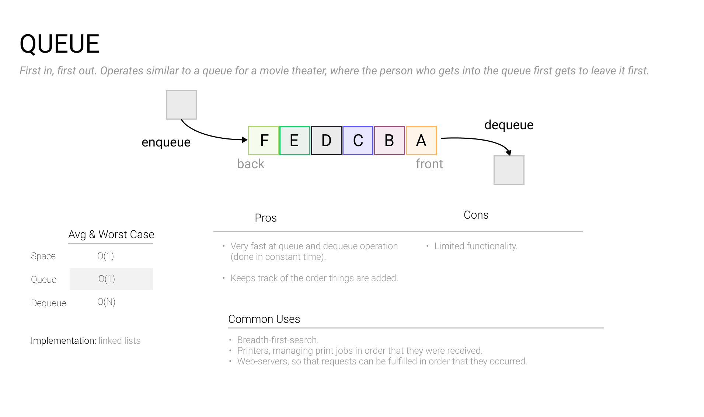

# Stacks and Queues

### 

Stacks and queues are two higher-order data structures that store a list of elements.

**Queues obey** a “first-in, first-out” (FIFO) behavior in which elements are enqueued and dequeued in the same order they arrive (like a line at the bank.)

**Stacks** use a “last-in, first-out” (LIFO) approach that allows elements to be retrieved in the opposite order of their arrival (like a stack of pancakes).

Stacks and queues are usually implemented with an underlying linked list or array, and are fundamental to many common algorithms and concepts in computer science: the call stack, network queues, and more.

### When to use a stack or queue in an interview

Consider using a queue whenever you need to process items in the order you receive them, or use a stack for the reverse order. Common real-world applications include graph search algorithms, web crawlers, and storing application history (“undo/redo”).

### Calculating memory usage

The memory footprint of a stack or queue depends on its underlying implementation — typically arrays are used to build fixed-size stacks and queues, whereas linked lists are used to build variable-sized stacks and queues.

### Common stack and queue operations

Here are some common stack and queue operations you may need to perform during an interview in your language of choice:

- Enqueue an item
- Dequeue an item
- Push an item to a stack
- Pop an item from a stack
- Loop over a stack or queue
- Peek at the top of a stack
- Reverse a stack
- Get size of stack or queue

### Practice problems

- [Number of Islands](https://www.tryexponent.com/courses/software-engineering/swe-practice/number-islands)
- [Reverse a Sentence](https://www.tryexponent.com/courses/software-engineering/swe-practice/sentence-reverse)
- [Find the Shortest Cell Path](https://www.tryexponent.com/courses/software-engineering/swe-practice/shortest-cell-path)