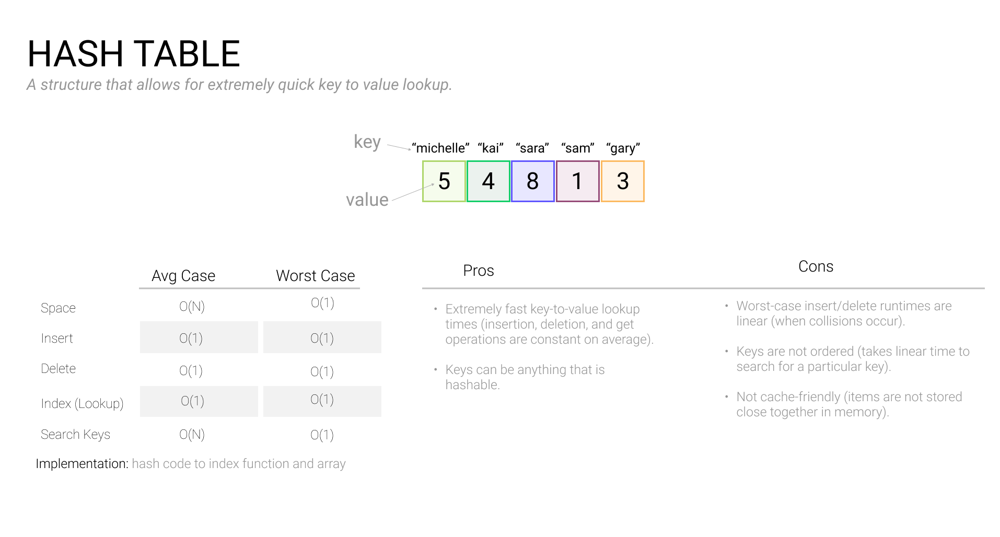

# Hash Tables

### 

A **hash table** is an important key-value data structure that is implemented with three components:

- An array
- A linked list
- A hashing function.

The **hashing function** transforms the **key**, which could be any arbitrarily-sized data, into an **array index** of fixed size for faster lookup. That array index becomes your hash table. Also known as hash maps or dictionaries, they are one of the most important and commonly used data structures.

Note that there are many, *many*, hashing functions to choose from, but good hash functions share a few characteristics.

- They're simple.
- They distribute keys uniformly across the hash table.
- The minimize **hash collisions**, which arise when more than one element is mapped to the same hash value.

> **Note**: Collisions are bound to happen, but a well-executed hash table minimizes the chances of this. Keep potential for collisions in mind when using hash tables for coding questions - it's a great area to talk through as you build your solution.

### When to use a hash table in an interview

Reach for a hash table whenever you need constant-time lookup, insertion, or deletion of items by key. Hash tables are not good for storing sorted data, and searching by value instead of by key is still O(N).

### Calculating memory usage

Dictionaries, sets, and objects in various coding languages are all built on hash tables. For example:

- Python: Dictionaries, Sets
- javascript: Object, Set
- Java: HashMap, Set

The memory usage of a hash table is complex and varies based on language and implementation. Typically, a hash table requires an array of a fixed size, plus linked lists to store the entries.

### Common hash table operations

- Insert a key-value pair
- Find the value for a key
- Update the value for a key
- Check if a key has been used
- Loop over key-value pairs
- Delete a key-value pair
- Search for a value

### Practice problems

- [Find the Most Common Words](https://www.tryexponent.com/courses/software-engineering/swe-practice/most-common-words)
- [Find the Difference of Arrays](https://www.tryexponent.com/courses/software-engineering/swe-practice/difference-of-arrays)
- [LRU Cache](https://www.tryexponent.com/courses/software-engineering/swe-practice/lru-cache)