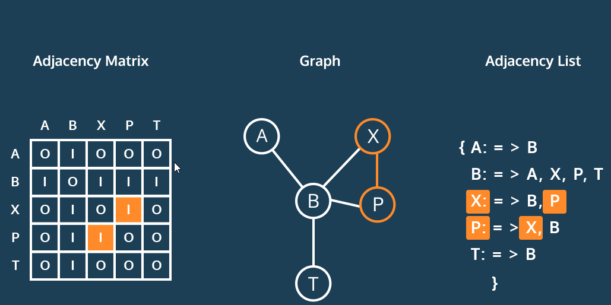

GRAPHS: CONCEPTUAL

**Directed Graphs**

Imagine you’re a superhero escaping a villain’s lair. As you move from perilous room to perilous room, the doors close immediately behind you, barring any return.

For this dramatic example, we need a *directed* graph, where edges restrict the direction of movement between vertices.

We can move from `spikes` to `lasers`, but not from `lasers` to `spikes`. This differs from earlier examples when every edge was bi-directional.

Note the path `spikes` to `lasers` to `piranhas` to `spikes`. This path is a *cycle*, because it ends on the vertex where it began: `spikes`.

### Instructions

Consider a city with one-way streets, how would you model this with a directed graph?

What other cycles exist in this graph?

### Concept Review

Want to quickly review some of the concepts you’ve been learning? Take a look at this material's [cheatsheet](https://www.codecademy.com/learn/complex-data-structures/modules/cspath-graphs/cheatsheet)!

### Community Forums

Still have questions? View this exercise's thread in the [Codecademy Forums](https://discuss.codecademy.com/t/373266).

**Representing Graphs**

We typically represent the vertex-edge relationship of a graph in two ways: an adjacency list or an adjacency matrix.

An adjacency matrix is a table. Across the top, every vertex in the graph appears as a column. Down the side, every vertex appears again as a row. Edges can be bi-directional, so each vertex is listed twice.

To find an edge between `B` and `P`, we would look for the `B` row and then trace across to the `P` column. The contents of this cell represent a possible edge.

Our diagram uses `1` to mark an edge, `0` for the absence of an edge. In a weighted graph, the cell contains the cost of that edge.

In an adjacency list, each vertex contains a list of the vertices where an edge exists. To find an edge, one looks through the list for the desired vertex.

### Instructions

What kind of graph would have an adjacency matrix with every cell filled?

Looking for an edge in the adjacency list, how many vertices do we need to search through for `P`?

How many for `B`?

**Reviewing Key Terms**

Graphs are an essential data structure in computer science for modeling networks. Let’s review some key terms:

- `vertex`: A node in a graph.
- `edge`: A connection between two vertices.
- `adjacent`: When an edge exists between vertices.
- `path`: A sequence of one or more edges between vertices.
- `disconnected`: Graph where at least two vertices have no path connecting them.
- `weighted`: Graph where edges have an associated cost.
- `directed`: Graph where travel between vertices can be restricted to a single direction.
- `cycle`: A path which begins and ends at the same vertex.
- `adjacency matrix`: Graph representation where vertices are both the rows and the columns. Each cell represents a possible edge.
- `adjacency list`: Graph representation where each vertex has a list of all the vertices it shares an edge with.

### Instructions

Graphs are one of the most common data structures in computer science. Modeling complex problems with a graph is essential for a career in software development.

What does it mean for two vertices, or nodes, to be adjacent?

The vertices have an edge with a low cost.
The vertices have the same data type.(Selected)
Correct:The vertices are directly connected by an edge.

👏Correct! Adjacent vertices have at least a single edge connecting them.

The vertices have a bi-directional edge between them.

In a directed graph, you can always move between two vertices as long as an edge exists between them.

False(Selected)Incorrect:True

In a directed graph, edges are not bi-directional by default. The direction is specified for each edge.