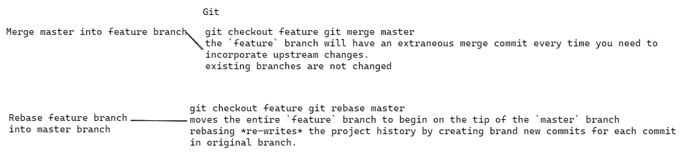

| Gitflow                                                      | Trunk-based development                                      |
| ------------------------------------------------------------ | ------------------------------------------------------------ |
| is a stricter development model                              | is a [version control management](https://www.atlassian.com/git/tutorials/what-is-version-control) practice where developers merge small, frequent updates to a core “trunk” or main branch |
| maintains code quality and minimizes the number of bugs.     | enables teams to iterate quickly and implement [CI/CD](https://www.atlassian.com/continuous-delivery). |
| only certain individuals can approve changes to the main code. | all developers have access to the main code.                 |


# Merging vs. Rebasing




## Conceptual Overview

The first thing to understand about `git rebase` is that it solves the same problem as `git merge`. ==Both of these commands are designed to integrate changes from one branch into another branch==—they just do it in very different ways.

Consider what happens when you start working on a new feature in a dedicated branch, then another team member updates the `master` branch with new commits. This results in a forked history, which should be familiar to anyone who has used Git as a collaboration tool.


Now, let’s say that the new commits in `master` are relevant to the feature that you’re working on. To incorporate the new commits into your `feature` branch, you have two options: merging or rebasing.

### The Merge Option

The easiest option is to merge the `master` branch into the feature branch using something like the following:

```
git checkout feature git merge master
```

Or, you can condense this to a one-liner:

```
 git merge feature master
```

==This creates a new “merge commit” in the `feature` branch that ties together the histories of both branches, giving you a branch structure that looks like this:==


==Merging is nice because it’s a *non-destructive* operation. The existing branches are not changed in any way.==This avoids all of the potential pitfalls of rebasing (discussed below).

On the other hand, this also means that ==the `feature` branch will have an extraneous merge commit every time you need to incorporate upstream changes.== If `master` is very active, this can pollute your feature branch’s history quite a bit. While it’s possible to mitigate this issue with advanced `git log` options, it can make it hard for other developers to understand the history of the project.

### The Rebase Option

As an alternative to merging, you can rebase the `feature` branch onto `master` branch using the following commands:

```
git checkout feature git rebase master
```

==This moves the entire `feature` branch to begin on the tip of the `master` branch==, effectively incorporating all of the new commits in `master`. But, instead of using a merge commit, ==rebasing *re-writes* the project history by creating brand new commits for each commit in the original branch.==


==The major benefit of rebasing is that you get a much cleaner project history.== First, it eliminates the unnecessary merge commits required by `git merge`. Second, as you can see in the above diagram, rebasing also results in a perfectly linear project history—you can follow the tip of `feature` all the way to the beginning of the project without any forks. This makes it easier to navigate your project with commands like `git log`, `git bisect`, and `gitk`.

But, there are two trade-offs for this pristine commit history: safety and traceability. If you don’t follow the [Golden Rule of Rebasing](https://www.atlassian.com/git/tutorials/merging-vs-rebasing#the-golden-rule-of-rebasing), re-writing project history can be potentially catastrophic for your collaboration workflow. And, less importantly, ==rebasing loses the context provided by a merge commit—you can’t see when upstream changes were incorporated into the feature.==

**==How do you revert a commit that has already been pushed and made public?==**

One or more commits can be reverted through the use of *git revert*. This command, in essence, creates a new commit with patches that cancel out the changes introduced in specific commits. In case the commit that needs to be reverted has already been published or changing the repository history is not an option, *git revert* can be used to revert commits. Running the following command will revert the last two commits:

```
git revert HEAD~2..HEAD
```

Alternatively, one can always checkout the state of a particular commit from the past, and commit it anew.

**=> ==How do you squash last N commits into a single commit?==**

Squashing multiple commits into a single commit will overwrite history, and should be done with caution. However, this is useful when working in feature branches. To squash the last N commits of the current branch, run the following command (with {N} replaced with the number of commits that you want to squash):

```
git rebase -i HEAD~{N}
```

Upon running this command, an editor will open with a list of these N commit messages, one per line. Each of these lines will begin with the word “pick”. Replacing “pick” with “squash” or “s” will tell Git to combine the commit with the commit before it. To combine all N commits into one, set every commit in the list to be squash except the first one. Upon exiting the editor, and if no conflict arises, *git rebase* will allow you to create a new commit message for the new combined commit.

==How do you find a list of files that has changed in a particular commit?==

```
git diff-tree -r {hash}
```

Given the commit hash, this will list all the files that were changed or added in that commit. The *-r* flag makes the command list individual files, rather than collapsing them into root directory names only.

The output will also include some extra information, which can be easily suppressed by including a couple of flags:

```
git diff-tree --no-commit-id --name-only -r {hash}
```

Here *--no-commit-id* will supress the commit hashes from appearing in the output, and *--name-only* will only print the file names, instead of their paths.

==How do you setup a script to run every time a repository receives new commits through push?==

To configure a script to run every time a repository receives new commits through push, one needs to define either a pre-receive, update, or a post-receive hook depending on when exactly the script needs to be triggered.

Pre-receive hook in the destination repository is invoked when commits are pushed to it. Any script bound to this hook will be executed before any references are updated. This is a useful hook to run scripts that help enforce development policies.

Update hook works in a similar manner to pre-receive hook, and is also triggered before any updates are actually made. However, the update hook is called once for every commit that has been pushed to the destination repository.

Finally, post-receive hook in the repository is invoked after the updates have been accepted into the destination repository. This is an ideal place to configure simple deployment scripts, invoke some continuous integration systems, dispatch notification emails to repository maintainers, etc.

Hooks are local to every Git repository and are not versioned. Scripts can either be created within the hooks directory inside the “.git” directory, or they can be created elsewhere and links to those scripts can be placed within the directory.

==What is `git bisect`? How can you use it to determine the source of a (regression) bug?==

Git provides a rather efficient mechanism to find bad commits. Instead of making the user try out every single commit to find out the first one that introduced some particular issue into the code, *git bisect* allows the user to perform a sort of binary search on the entire history of a repository.

By issuing the command *git bisect start*, the repository enters bisect mode. After this, all you have to do is identify a bad and a good commit:

```
git bisect bad # marks the current version as bad
git bisect good {hash or tag} # marks the given hash or tag as good, ideally of some earlier commit
```

Once this is done, Git will then have a range of commits that it needs to explore. At every step, it will checkout a certain commit from this range, and require you to identify it as good or bad. After which the range will be effectively halved, and the whole search will require a lot less number of steps than the actual number of commits involved in the range. Once the first bad commit has been found, or the bisect mode needs to be ended, the following command can be used to exit the mode and reset the bisection state:

```
git bisect reset
```

==What are the different ways you can refer to a commit?==

In Git each commit is given a unique hash. These hashes can be used to identify the corresponding commits in various scenarios (such as while trying to checkout a particular state of the code using the *git checkout {hash}* command).

Additionally, Git also maintains a number of aliases to certain commits, known as refs. Also, every tag that you create in the repository effectively becomes a ref (and that is exactly why you can use tags instead of commit hashes in various git commands). Git also maintains a number of special aliases that change based on the state of the repository, such as HEAD, FETCH_HEAD, MERGE_HEAD, etc.

Git also allows commits to be referred as relative to one another. For example, HEAD~1 refers to the commit parent to HEAD, HEAD~2 refers to the grandparent of HEAD, and so on. In case of merge commits, where the commit has two parents, ^ can be used to select one of the two parents, e.g. HEAD^2 can be used to follow the second parent.

And finally, refspecs. These are used to map local and remote branches together. However, these can be used to refer to commits that reside on remote branches allowing one to control and manipulate them from a local Git environment.

=> **==What is `git rebase` and how can it be used to resolve conflicts in a feature branch before merge?==**

In simple words, ==*git rebase* allows one to move the first commit of a branch to a new starting location.== For example, if a feature branch was created from master, and since then the master branch has received new commits, *git rebase* can be used to move the feature branch to the tip of master. The command effectively will replay the changes made in the feature branch at the tip of master, allowing conflicts to be resolved in the process. When done with care, this will allow the feature branch to be merged into master with relative ease and sometimes as a simple fast-forward operation.

==How do you configure a Git repository to run code sanity checking tools right before making commits, and preventing them if the test fails?==

This can be done with a simple script bound to the pre-commit hook of the repository. The pre-commit hook is triggered right before a commit is made, even before you are required to enter a commit message. In this script one can run other tools, such as linters and perform sanity checks on the changes being committed into the repository. For example, the following script:

```
#!/bin/sh
files=$(git diff --cached --name-only --diff-filter=ACM | grep '.go$')
if [ -z files ]; then
    exit 0
fi
unfmtd=$(gofmt -l $files)
if [ -z unfmtd ]; then
    exit 0
fi
echo “Some .go files are not fmt’d”
exit 1
```

… checks to see if any .go file that is about to be commited needs to be passed through the standard Go source code formatting tool *gofmt*. By exiting with a non-zero status, the script effectively prevents the commit from being applied to the repository.

==One of your teammates accidentally deleted a branch, and has already pushed the changes to the central git repo. There are no other git repos, and none of your other teammates had a local copy. How would you recover this branch?==

Check out the latest commit to this branch in the reflog, and then check it out as a new branch.

=> **==How can you copy a commit made in one branch to another (e.g. a hot fix commit from released branch to current development branch)?==**

==You need to use the `cherry-pick` command. It provides the possibility to play back an existing commit to your current location/branch. So you need to switch to the target branch (e.g. `git checkout development`) and call `git cherry-pick {hash of that commit}`.==

In spite of applying the same changes, it will be a new commit with a new hash because the changes are applied to a different destination.

==How do you cherry-pick a merge commit?==

Cherry-pick uses a diff to find the difference between branches.

As a merge commit belongs to a different branch, it has two parents and two changesets.

For example, if you have merge commt ref `63ad84c`, you have to specify `-m` and use parent `1` as a base:

```
git checkout release_branch
git cherry-pick -m 1 63ad84c
```

=> **==What is the difference between `git pull` and `git fetch`?==**

==`git fetch` only downloads new data from a remote repository, but it doesn’t integrate any of the downloaded data into your working files. All it does is provide a view of this data.
`git pull` downloads as well as merges the data from a remote repository into your local working files. It may also lead to merge conflicts if your local changes are not yet committed.== Use the `git stash` command to hide your local changes.

=> **==What is a conflict in git and how can it be resolved?==**

A conflict arises when more than one commit that has to be merged has some change in the same place or same line of code. Git will not be able to predict which change should take precedence. This is a git conflict.