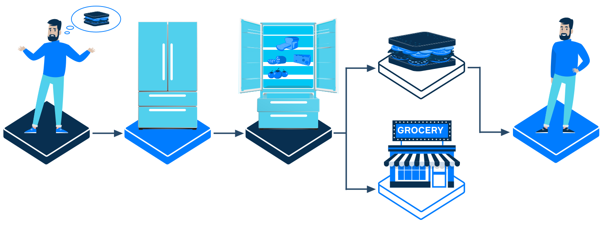

## Computer algorithms

##### Theory

You have probably heard something about **algorithms** in real life. Simply put, an algorithm is a step-by-step sequence of actions you need to perform to achieve the desired result. It can be an algorithm for cooking a sandwich described by a recipe or an algorithm for getting dressed according to today's weather and your mood.

Among all algorithms, there is one special group called **computer algorithms.** They are usually created for and utilized by computers. In this topic, we will discuss in detail what computer algorithms are, as well as explain why it is important to learn them.

##### Computer algorithms

Computer algorithms are everywhere around us. Your smartphone is able to guide you through a city from one point to another using a certain algorithm. Other algorithms can control the behavior of your enemies in a computer game. Services like Google or Yahoo apply sophisticated algorithms to provide you with the most relevant results when you use them to search for information on the Web. Algorithms are also used to calculate the trajectory of rockets. And they even help doctors to determine diagnoses correctly!

An important difference between real-life and computer algorithms is that a computer cannot guess what we intend to do. If something goes wrong or an algorithm is not clear, a human can adjust the algorithm based on their experience. Computers cannot do the same. Let's get back to our sandwich algorithm. If we realize that we are out of bread, a human would think of going to the store and buying some more. On the other hand, a computer would report the absence of such an ingredient or proceed with its work without even noticing that, which would result in incorrect output. Thus, it is our responsibility to describe a computer algorithm precisely and unambiguously.

##### Programs and algorithms

As you may know, a program is a sequence of instructions to perform some tasks on a computer. The difference between programs and algorithms is that programs are written using a specific programming language while algorithms are usually described at a higher level than programming language statements. In other words, an algorithm is like an abstract schema, and a program can be its implementation.

All this also means that algorithms are language-agnostic: you can implement one algorithm using different programming languages. For example, you may use Java, Python, Kotlin, or other languages to implement the same algorithm.

Programming languages usually contain implementations of some basic algorithms for solving typical problems. These algorithms are provided in standard libraries, and software developers can reuse them instead of implementing a new one each time. However, to be able to use such algorithms correctly and efficiently and to understand how other developers use them, it is essential to learn these basic algorithms and get familiar with how they work under the hood. Moreover, the methods and tricks used in these approaches may come in handy while building your own algorithms as well. It is similar to solving exercises at school: these here are the examples you solve with your teacher during the class, and at home you have to solve other tasks using the methods discussed during the lesson.

Algorithms from standard libraries cannot cover all possible problems developers can encounter, so you will usually have to construct and implement your own algorithms for your problems. Classic algorithms serve as nice examples for learning the basic principles of algorithm construction.

Furthermore, there are so many well-known problems and their efficient solutions that standard libraries typically implement only the most prominent ones. Thus, sometimes you will need to implement a classic solution for a problem yourself, from scratch. This is yet another reason why it is essential to learn algorithms: you need to know which one and when to apply and how to implement it efficiently.

##### Summary

==An algorithm is a sequence of actions you need to perform to achieve a certain result.== An important group of algorithms is computer algorithms: the ones created for computers and utilized by them. There are several reasons why it is essential to learn computer algorithms:

- Software developers often encounter tasks of the same type while working on different projects. For such typical tasks, programming languages provide ready-to-use algorithms in standard libraries. To utilize these algorithms efficiently, you need to understand how they work under the hood;
- There are numerous well-known algorithms that cannot be found as ready-to-use functions from libraries. Sometimes you may even encounter problems that are impossible to solve using only well-known algorithms. In both cases, you need to implement a suitable algorithm yourself. To be able to do that, you need to know basic algorithmic approaches, their pros and cons, and which one to apply in a particular case;
- Often you need not only to write the code yourself, but also to read the code written by other developers. If you want to understand the algorithms they might be likely to use, you need to know basic algorithms and algorithmic approaches as well;
- Implementing algorithms will help you improve your programming skills.

We believe that there are other reasons why learning algorithms is worth it. If you have some ideas, don't hesitate to write them in the comments.

Good luck with learning algorithms!