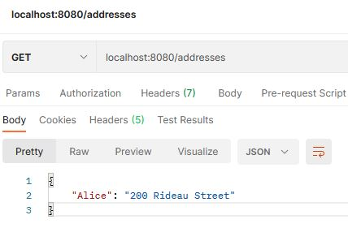

## The Collections Framework overview

Java provides the **collections framework** which consists of classes and interfaces for commonly reusable data structures such as lists, dynamic arrays, sets, and so on. The framework has a unified architecture for representing and manipulating collections, enabling collections to be used independently of implementation details via its interfaces.

The framework includes:

- interfaces that represent different types of collections;
- primary implementations of the interfaces;
- legacy implementations from earlier releases (known as "old collections");
- special-purpose implementations (like immutable collections);
- algorithms represented by static methods that perform useful operations on collections.

In this topic, we will only consider the basic interfaces from the collections framework placed in the `java.util` package.

##### Commonly used interfaces

There are two root generic interfaces `Collection<E>` and `Map<K,V>`, and some more specific interfaces to represent different types of collections.

****

The interface `Collection<E>` represents an abstract collection, which is a container for objects of the same type. It provides some common methods for all other types of collections.

The interfaces `List<E>`, `Set<E>`, `Queue<E>`, `SortedSet<E>`, and `Deque<E>` represent different types of collections. You cannot directly create an object of them since they are just interfaces. But each of them has several implementations. As an example, the `ArrayList` class, that represents a resizable array, is a primary representation of the `List<E>` interface. Other interfaces, as well as their implementations, will be considered in the following topics.

Another root interface is `Map<K,V>` that represents a map (or dictionary) for storing *key-value pairs* where `K` is the type of keys and `V` is the type of stored values. In the real world, a good example of a map is a phone book where keys are names of your friends and values are their phones. The `Map<K,V>` interface **is not** a subtype of the `Collection` interface, but maps are often considered as collections since they are part of the collection framework and have similar methods.

Note, the `Collection` and `Map` interfaces do not extend each other.

##### The Collection interface

Here are common methods provided by the `Collection` interface.

- `int size()` returns the number of elements in this collection;
- `boolean isEmpty()` returns `true` if this collection contains no elements;
- `boolean contains(Object o)` returns `true` if this collection contains the specified element;
- `boolean add(E e)` adds an element to the collection. Returns `true`, if the element was added, else returns `false`;
- `boolean remove(Object o)` removes a single instance of the specified element;
- `boolean removeAll(Collection<?> collection)` removes elements from this collection that are also contained in the specified collection;
- `void clear()` removes all elements from this collection.

It is possible to refer to any particular collection via this base interface since, as you know, the superclass can be used to refer to any subclass object derived from that superclass.

Let's create `languages` collection and add three elements to it:

```java
Collection<String> languages = new ArrayList<>();
languages.add("English");
languages.add("Deutsch");
languages.add("Français");
System.out.println(languages.size()); // 3
```

This approach allows you to replace the concrete collection at any time without changing the code that uses it. It also fosters software reuse by providing a standard interface for collections and algorithms to manipulate them. It may sound complicated now, but the more you work with collections, the more understandable it will become.

It is impossible to get an element by index via the `Collection` interface because it is very abstract and does not provide such a method. But if it doesn't matter for you which particular collection to use, you can work via this interface.

It is important to understand that the order of the elements in the `ArrayList` is still preserved. We simply cannot call the `get` method via the `Collection` interface.

Every collection can be cast to a string by using `toString` and compared with another collection using the `equals` method. These methods come from `Object` and their behavior depends on elements stored in the collection and the type of the collection itself.

##### Mutable and Immutable collections

All collections can be divided into two large groups: mutable and immutable. They both implement the `Collection<E>` interface, but immutable collections will throw `UnsupportedOperationException` when trying to invoke some methods which change them: for example, `add`, `remove`, `clear`.

In the next topics, we will consider how to create and when to use immutable collections. Now just remember that they are present here.

##### Iterating over collections

If you would like to iterate over all elements of *any* collection, you can use the *for-each* style loop. Let's return to our `languages` collection:

```java
for (String lang : languages) {
    System.out.println(lang);
}
```

This code prints all elements of this collection.

```java
English
Deutsch
Français
```

The order of elements when iterating depends on a type of particular collection that is actually being used.

If you are already familiar with method references or lambda expressions, you can use another style for iterations using the `forEach(Consumer<T> consumer)` method:

```java
languages.forEach(System.out::println); // with method reference
languages.forEach(elem -> System.out.println(elem)); // with lambda expression
```

This looks very readable but is optional for use.

##### Removing elements

It is also possible to remove elements from a mutable collection (like `ArrayList`).

```java
languages.remove("Deutsch");
System.out.println(languages.size()); // 2
```

Note, the `remove` as well as the `contains` methods rely on the method `equals` of the elements. If you store non-standard classes in the collection, `equals` together with `hashCode` should be overridden.

Again, if you are already familiar with lambda expressions, you can invoke the `removeIf` method to remove all of the elements that satisfy the given predicate:

```java
languages.removeIf(lang -> lang.startsWith("E")); // it removes English
System.out.println(languages.size()); // 1
```

Use any way you like.

##### Conclusion

Java collections framework provides a set of interfaces with common methods for different types of collections. We've considered the `Collection<E>` interface which is an abstract container for storing values of the same type. Any particular collection (excluding maps) can be used through it in a program and can be iterated through by using the *for-each* loop or the `forEach` method.

For now, we confine ourselves to this much. All other interfaces including `Map<K,V>` will be considered in the following topics.

## Build tools

##### What is a build tool?

A **build tool** is a program that automates the process of creating executable applications from source code. The build process includes compiling sources and linking and packaging the code into a usable or executable form.

In small projects (like projects for learning), developers can manually invoke the build process. However, this approach is not efficient for larger projects, when it is pretty hard to keep track of what needs to be built. Automating the build process minimizes the risk of human error. Additionally, an automated build tool typically runs faster than someone performing the same steps manually. As a consequence, an automated build process improves the quality of the product and saves time and money.

##### What can build tools do?

Modern build tools can perform a wide variety of tasks that software developers do in their day-to-day activities:

1. ==**Downloading and adding dependencies.**== This is especially convenient when your project depends on a large number of libraries.
2. ==**Compiling source code into bytecode**.== Build tools will invoke compiler for all the files in your project.
3. ==**Packaging compiled code.**== You will have a production-ready application archive like JAR, APK, or some other.
4. **==Running tests.==** For example, testing the application archive every time to check if it works correctly. It allows programmers to avoid bugs after modifying the application.
5. **==Deploying==** to a production environment.

This list of tasks is not complete and may be different depending on the particular build tool used. Some additional features might be available; for example, you can use some tools to generate documentation after the build.

##### Build tools for Java-based projects

There are three main build tools for Java-based projects: **Apache Ant**, **Apache Maven**, and **Gradle**.

**Apache Ant** was released in 2000. It is the oldest of these three build tools. Coders rarely use **Ant** in new projects but it still occurs in practice. You can use this tool together with **Apache Ivy** to manage dependencies.

**Apache Maven** was released in 2004, and now it is one of the most popular choices for Java developers (especially for server-side development). Many projects, both old and new, use Maven as a build tool because of its powerful dependency management possibilities.

**==Maven==** follows the *Convention Over Configuration* concept which means that a developer needs to specify only unconventional aspects of the application, and all standard aspects work by default.

**==Gradle==** is a new tool compared to Ant and Maven. It was released in 2007 and is now standard for Android applications. Also, developers use it for server and desktop development. **Gradle** aims to *“combine the power and flexibility of Ant with the dependency management and conventions of Maven into a more effective way to build.”*

All of these build tools are free and can be used in any operating system.

Note: **Apache Maven** and **Gradle** are more than simply build tools. They manage almost the entire lifecycle of an application.

There is also another build tool called **sbt** (*Scala Build Tool*). It is primarily used for Scala projects but you can use it for Java or Kotlin as well.

If you are interested, [here](https://en.wikipedia.org/wiki/List_of_build_automation_software) you can find a list of build tools for different languages.

##### Conclusion

In summary, a build tool is a software that creates executable applications from source code. Using a build tool minimizes the risk of human error, fastens the process, improves the quality of the product, and saves time and money. Modern build tools do plenty of jobs such as downloading and adding dependencies, compiling source code, packaging compiled code, running tests, deploying to a production environment. For Java-based projects, widely used build tools are "oldie" Apache Ant, popular Apache Maven, and a "new" Gradle.

## Gradle basics

**==Gradle==** is a modern automation tool that helps build and manage projects written in Java, Kotlin, Scala, and other JVM-based languages. It ==describes project dependencies and determines how to build a project.== Gradle uses a well-designed plugin system, that is why it is a highly extendable tool. You can use plugins for automatic versioning, automatic testing, reporting about the build, and so on.

==One of the best things about Gradle is its [Groovy-based](https://en.wikipedia.org/wiki/Apache_Groovy) domain-specific language (DSL) that gives developers a specific way to form custom build scripts.== The Kotlin developers are especially lucky since Gradle also started to support Kotlin for such scripts. So, ==there are two languages to write the Gradle build scripts (Groovy and Kotlin)== and you can choose any of them.

Please, note, that ==DSL is a computer language specialized to a particular application domain (like build automation).== This is in contrast to a general-purpose language (GPL), which is broadly applicable across domains.

Nowadays, Gradle is a de-facto standard for building Android applications. However, programmers use it for server-side and desktop development gradually replacing other build tools with it. Here is [the full list of features](https://gradle.org/features/), if you want to get more information on them.

##### The key concepts

The key features of Gradle are as follows:

- **Settings files.** Gradle uses several types of settings files to describe how to build a project.
- **Build-by-convention.** A programmer doesn't need to specify every building step that needs to be done. Instead, Gradle uses default settings and behavior. Although, every step of the default build process can be customized if necessary.
- **Dependency management.** Gradle automatically downloads specified external libraries and solves conflict cases with dependencies. You can declare as many dependencies as you need for a project.
- **Builds**. Gradle allows programmers to design well-structured and easily maintained comprehensible builds. It also supports complex cases such as multi-project or partial builds.
- **Ease of migration**. Gradle can easily adapt to any project structure you have. Therefore, you can always develop your project exactly the way you want.
- **DSL** (based on Groovy and Kotlin) for writing scripts in settings files.

##### Downloading and installing Gradle

You can download Gradle from [the official website](https://gradle.org/releases/) and unpack the archive somewhere on your computer. We recommend choosing version 5.0 or higher.

To install Gradle, follow [the installation instructions](https://gradle.org/releases/) for your operating system.

To verify that the installation has been completed correctly, run the following command:

```java
gradle -v
```

The result should look similar to:

```java
------------------------------------------------------------
Gradle 5.6.4
------------------------------------------------------------
```

Your version of Gradle may differ; the main thing is that the command should successfully work. If you have errors, try to google them, read the docs, or write us a comment describing your issue.

##### Conclusion

Even though it’s yet another build tool, Gradle builds are more neat and concise thanks to its DSL. It provides a rich infrastructure to build, test, automate, and deliver your project. Next, we will learn how to create the simplest Gradle project.

## Basic project with Gradle

In this topic, you will learn how to create a simple Gradle project and how Gradle manages it. We assume that you have already installed Gradle on your computer. Otherwise, follow [the installation instructions](https://gradle.org/install/). To verify that the installation has been successful, run the `gradle -v` command. If you get errors, try to google them, read the docs, or write us a comment describing the issue.

##### The key concepts of Gradle

Let's start with an introduction to the key concepts in Gradle: **projects** and **tasks**.

- ==A **project** might represent either **something to be built** (e.g. a JAR file or ZIP archive) or **a thing to do** (e.g. deploying the application). Every Gradle build contains one or more projects.==
- ==A **task** is a single piece of work that a build performs.== This can include compiling classes, running tests, generating docs, and so on. ==Every project is essentially a collection of one or several tasks.==

The following picture illustrates the relationships between these concepts:


In simple cases, a build will contain only a single project with several tasks. This will be a common situation in your learning process. Do not worry, if the concepts look a bit abstract. We will study a more specific example soon.

##### Initializing a basic project managed by Gradle

Let's initialize a new project with Gradle using a terminal in your OS.

In the future, you most likely will not have to do this manually since modern IDEs can do this for you automatically.

\1. Create a new directory to store files of your project and go to it.

```java
mkdir gradle-demo
cd gradle-demo
```

\2. Invoke ==the `gradle init` command== to generate a simple project. Modern versions of Gradle will ask you to fill several parameters in a dialogue form. To get acquainted with the process just choose `basic` as the type of project and `Groovy` as the build script DSL.

This command will produce the following output:

```java
> Task :init

BUILD SUCCESSFUL in 10s
2 actionable tasks: 2 executed
```

Gradle performed some tasks for you and now there is a simple project with the most basic structure:

```java
.
├── build.gradle
├── gradle
│   └── wrapper
│       ├── gradle-wrapper.jar
│       └── gradle-wrapper.properties
├── gradlew
├── gradlew.bat
└── settings.gradle
```

Here is brief info about all the generated files:

- The `build.gradle` file is a primary file that specifies the Gradle's project, including its tasks and external libraries. For now, this file doesn't contain anything useful, but in real projects it is often updated with new information.
- The files `gradle-wrapper.jar`, `gradle-wrapper.properties`, `gradlew` and `gradlew.bat` belong to Gradle Wrapper which allows you to run Gradle without its manual installation.
- The `settings.gradle` file specifies which projects to include in your build. This file is optional for a build that has only one project, but it is mandatory for a multi-project build.

Let's build our project invoking ==the `gradle build` command== from the same location where `build.gradle` resides. It will produce an output like this:

```java
> Task :buildEnvironment
------------------------------------------------------------
Root project
------------------------------------------------------------
...

BUILD SUCCESSFUL in 725ms
1 actionable task: 1 executed
```

So, the project was successfully built with one executed task.

You can also invoke `build` and other commands like `./gradlew build` for Unix-based systems and `gradlew.bat build` for Windows. It will automatically download Gradle and run the specified command. Using wrappers allows developers to start working with a Gradle-based project without having to install it manually.

##### Modifying the build file

Let's make our build more interesting by adding some properties and one task to the `build.gradle` file using Groovy DSL.

```java
description = "A basic Gradle project"

task helloGradle {
    doLast {
        println 'Hello, Gradle!'
    }
}
```

Here, we set the `description` property and define a simple task that prints a 'hello' message. There is an output after executing the task with ==the `gradle -q helloGradle` command==:

```java
> Task :buildEnvironment

------------------------------------------------------------
Root project - A basic Gradle project
------------------------------------------------------------

...

> Task :helloGradle
Hello, Gradle!

BUILD SUCCESSFUL in 831ms
2 actionable tasks: 2 executed
```

This build was completed with 2 tasks executed. Our new task printed the `Hello, Gradle!` message. In addition, we modified the description of the project in the build. The `-q` argument just simplifies the command output.

You can also use Kotlin as DSL inside the build file. To allow it, you need to specify Kotlin as DSL when creating a project. In this case, the name of the file will be `build.gradle.kts`.

##### The list of all the tasks

If you would like to see all the possible Gradle tasks to perform, just run ==the `gradle tasks --all` command.== The list will include our tasks as well:

```java
> Task :tasks

------------------------------------------------------------
Tasks runnable from root project - A basic Gradle project
------------------------------------------------------------

Build Setup tasks
-----------------
init - Initializes a new Gradle build.
wrapper - Generates Gradle wrapper files.

Help tasks
----------
buildEnvironment - Displays all buildscript dependencies declared in root project 'gradle-demo'.
...

Other tasks
-----------
helloGradle
```

In a real project, the list of tasks will be much larger, because, in addition to standard tasks, it will contain a lot of tasks from various plugins (like Java or Kotlin plugin).

We've considered all Gradle-related files from the generated simple project in isolation from any source code files.

##### Conclusion

You've learned the key concepts of Gradle projects and studied all the files from a simple generated project in isolation from any source code files. Now it's time to combine Gradle together with your favorite programming language!

## Building apps using Gradle

We hope you already got a basic understanding of what Gradle is and how to use it. In this topic, we will consider the basic structure of the `build.gradle` file, and then build and run a small application. The knowledge you obtain here can be used for any JVM-based programming language supported by Gradle (e.g. Java or Kotlin).

This article was written using **Gradle 6.8.1**. There may be some differences for other versions of Gradle. If you have troubles with this article, you can read the comments or just follow [official Gradle doc](https://docs.gradle.org/current/samples/sample_building_java_applications_multi_project.html) instead of this.

##### Initializing an application

We assume that you already have some experience with the terminal of your operating system and will interact with Gradle using it. First of all, create a new empty folder named what you want (e.g., `demo`). In this folder, you need to invoke the `gradle init` command to start initialising a new Gradle-based project. This command will show you a dialogue form to set up the project you need.

In this form, choose `application` as the type of the project; **Java** or **Kotlin** as the implementation language; and `org.hyperskill.gradleapp` as the project name if you would like to precisely follow our example (but it isn't required). For all other questions, you can choose their default options, since it doesn't matter now.

Below is an example of choosing options.

```java
Select type of project to generate:
  1: basic
  2: application
  3: library
  4: Gradle plugin
Enter selection (default: basic) [1..4] 2

Select implementation language:
  1: C++
  2: Groovy
  3: Java
  4: Kotlin
  5: Scala
  6: Swift
Enter selection (default: Java) [1..6] 3

Split functionality across multiple subprojects?:
  1: no - only one application project
  2: yes - application and library projects
Enter selection (default: no - only one application project) [1..2] 

Select build script DSL:
  1: Groovy
  2: Kotlin
Enter selection (default: Groovy) [1..2] 

Select test framework:
  1: JUnit 4
  2: TestNG
  3: Spock
  4: JUnit Jupiter
Enter selection (default: JUnit 4) [1..4]  

Project name (default: demo): org.hyperskill.gradleapp
Source package (default: org.hyperskill.gradleapp): 
```

After the initialisation is completed, the project structure will be the following:

```java
.
├── app
│   ├── build.gradle
│   └── src
│       ├── main
│       │   ├── java
│       │   │   └── org
│       │   │       └── hyperskill
│       │   │           └── gradleapp
│       │   │               └── App.java
│       │   └── resources
│       └── test
│           ├── java
│           │   └── org
│           │       └── hyperskill
│           │           └── gradleapp
│           │               └── AppTest.java
│           └── resources
├── gradle
│   └── wrapper
│       ├── gradle-wrapper.jar
│       └── gradle-wrapper.properties
├── gradlew
├── gradlew.bat
└── settings.gradle
```

This structure includes a lot of files we have already considered (`settings.gradle`, wrapper files, etc). The most important file called `build.gradle`, which contains tasks and external libraries, is located within the `app` directory. This folder exists because we've chosen `application` as the type of the project and the folder represents our application.

There is also the `src` directory inside `app`. It contains two sub-directories `main` and `test`. This is a quite standard project structure when using Gradle. In our case, the package `org.hyperskill.gradleapp` has some Java source code (`App.java`).

If you chose Kotlin as the implementation language, the project structure will be the same except for Kotlin source code files (`.kt` instead of `.java`) and `kotlin` folders instead of `java` ones.

Please note, it is a good practice for Java and Kotlin projects to include the name of your organization in the path to your source code files as a package name like `org.hyperskill`. We follow this recommendation too.

##### Running the application

If you look at the list of available tasks for managing the project using the command `gradle tasks --all`, you will see that the list is fairly long. Here is a shortened version of it:

```java
Application tasks
-----------------
run - Runs this project as a JVM application

Build tasks
-----------
assemble - Assembles the outputs of this project.
build - Assembles and tests this project.
...
```

There is the command `run` which can start the application. To do it, just invoke the `gradle run` command or use a Gradle wrapper script for your OS. This command will build and run the application. Here is an output example:

```java
> Task :app:run
Hello World!

BUILD SUCCESSFUL in 623ms
2 actionable tasks: 1 executed, 1 up-to-date
```

As you can see, the autogenerated application can already display a welcome string. If you get a similar result, it means that everything is OK: your application works and Gradle can manage it!

If you look at the project structure again, you will see that it has some new files, including files with bytecode (`App.class`, `AppTest.class`). Actually, Gradle built and started the `App.class` file when we invoked the `run` command.

Now, let's consider the build file (`build.gradle` for Groovy DSL or `build.gradle.kts` for Kotlin DSL) thanks to which we can build our application successfully and run it using Gradle. This file specifies project structure and adds some tasks and external libraries to the project. We will not present the entire file here, only its main parts.

##### Plugins

==The `plugins` section adds some plugins to extend the capabilities of the project: e.g., to add new tasks or properties.==

```java
plugins {
    // Apply the application plugin to add support for building a CLI application
    id("application")

    // Apply the plugin which adds support for Java
    id("java")

    // Apply the plugin which adds support for Kotlin/JVM
    id("org.jetbrains.kotlin.jvm")
}
```

Here, `id` is a globally unique identifier, or name, for plugins. Core Gradle plugins are special in that they provide short names, such as `"java"` or `"application"`.

Basically, plugins for Kotlin and Java know how to build, package, and run tests on the project. The `application` plugin facilitates creating an executable JVM application.

There is an alternative way to use a plugin in the project. It's more like a legacy way of applying plugins which is not widely used now, but just in case you see it somewhere, here it is:

```java
apply plugin: "application"   // for Groovy DSL
apply(plugin = "application") // for Kotlin DSL
```

There are many other plugins already available for you, and you can find them at the [official Gradle Plugins page](https://plugins.gradle.org/). A large project can use dozens and hundreds of them. Gradle does not limit the maximum number of plugins used in a project.

##### Repositories and dependencies

Usually you don't need to write your program from scratch – you use already written pieces of code, either yours or other developers'. This is where the dependency system comes in handy.

==The `repositories` section declares locations from which dependencies will be downloaded and added to the project.==

```java
repositories {
    jcenter()
}
```

==There are plenty of public repositories: **JCenter**, **Maven Central**, **Google** and others.== Usually, a description of a dependency says which repository contains it.

==The `dependencies` section is used to add external libraries to the project.== Gradle will automatically download them from the repositories and put in the archive with the application. Right now your `dependencies` section should contain at least a testing library like `JUnit` or something else, depending on your choice when the project was initialized.

```java
dependencies {
    // Use JUnit test framework.
    testImplementation 'junit:junit:4.13'
    // This dependency is used by the application.
    implementation 'com.google.guava:guava:29.0-jre'
}
```

We will take a closer look at repositories and dependencies in the next topics.

This is a standard Gradle build structure. You apply some plugins and specify dependencies for your project. This structure will be the same for any project managed by Gradle.

##### Configurations for the application plugin

The auto-generated `build.gradle(.kts)` file has a section which configures the `application` plugin thanks to which the application runs with the `gradle run` command as mentioned above.

```java
application {
    // Defines the main class for the application
    mainClassName = "org.hyperskill.gradleapp.App"
}
```

==The `mainClassName` property defines a class with the entry point of the application. It allows us to run the application invoking the `gradle run` command.==

##### Generating and running Jar archive

The classic way to run a JVM-based application is to use the `java -jar` command. This command can be run without Gradle, you only need to have a JAR beforehand.

So let's build the JAR file for our application:

```java
gradle jar

BUILD SUCCESSFUL in 748ms
2 actionable tasks: 2 executed
```

Now, the JAR file is in the `app/build/libs` directory.

If you want to clean the project folder from all generated artifacts, just run the `gradle clean` command.

However, if you now try to run our generated application using the classic approach, there will be a problem:

```java
java -jar app/build/libs/app.jar
no main manifest attribute, in app/build/libs/app.jar
```

The thing is that the application does not contain the `Main-Class` attribute in the `MANIFEST.MF` file. So, the JVM does not know the path to the entry point of the application.

To fix this we need to add the required attribute when generating an archive for the application. Just add the following declaration to the `build.gradle(.kts)` file:

```java
jar {
    manifest {
        attributes("Main-Class": "org.hyperskill.gradleapp.App")   // for Groovy DSL
        attributes("Main-Class" to "org.hyperskill.gradleapp.App") // for Kotlin DSL
    }
}
```

This code adds the `Main-Class` attribute to the manifest property of the jar task. See the manifest as a map of properties where we put our pair `Main-Class -> Main`.

So, now when we execute `gradle jar` followed by `java -jar app/build/libs/gradleapp.jar`, everything should work as planned and you will see the output line `Hello world!`. What is good about this way of running applications is that `java -jar` command can be run without Gradle, you only need to have a JAR beforehand.

##### Building the application

If you would like to generate a bundle of the application with all its dependencies and a script to start the application, ==use the `gradle build` command.==

```java
BUILD SUCCESSFUL in 1s
7 actionable tasks: 7 executed
```

If everything is OK, Gradle will have produced the archive in two formats for you: `app/build/distributions/app.tar` and `app/build/distributions/app.zip`. Now, you can distribute your application!

##### Conclusion

In this topic, you've learned how to generate Gradle-based applications with source code in Java or Kotlin as well as how to run this application using both `gradle run` and `java -jar` commands. You have also become familiar with the basic structure of the `build.gradle(.kts)` file and got initial information about plugins, repositories, and dependencies. You will learn more about these things further on.

## Dependency management

Small programs that you write when learning a language may not use any external libraries at all. When you need some functionality, you will find it in the standard library or create it yourself. However, it is quite difficult to develop a real application that doesn't use any libraries because they save tons of your time and provide solutions tested by millions of people around the world.

In this topic, we will learn how to add external libraries to our applications using Gradle.

##### How to add dependencies?

==In Gradle terminology, all external libraries are called **dependencies**. As a rule, they are packaged in JAR files.== Gradle can automatically download them and add them to the project. It saves a lot of time and solves possible conflicts between versions of libraries.

Where do we get these dependencies and how do we add them to a project? To use a class, you need to have it locally, and your JVM must know that you have it. If you want to do it manually, you need to find and download such jars on your own and add them to the classpath of your project. Sounds quite tedious, right?

Fortunately, dependency management is one of the key features of Gradle. You don’t even need a plugin for it. To add an external library to a project, you need to do exactly two steps:

1. **Define a repository** where to search for dependencies.
2. **Define a dependency** that you want to include in your project.

Now, let's consider these steps in more detail.

##### Repository definition

Repositories are just places where libraries are stored. Any project can use zero or more repositories.

There are different possible formats of repositories:

- a Maven compatible repository (e.g.: [Maven Central](https://mvnrepository.com/repos/central), [JCenter](https://bintray.com/bintray/jcenter), [Google](https://maven.google.com/web/index.html))
- an Ivy compatible repository;
- local (flat) directories.

It's possible to host repositories like **Maven** or **JCenter** locally in your organization, but that is out of the scope of this tutorial. We will only consider public online versions of them.

Gradle has four aliases that you can use when adding Maven compatible repositories to the project.

- `mavenCentral()`: fetches dependencies from the [Maven Central Repository](https://mvnrepository.com/repos/central).
- `jcenter()`: fetches dependencies from the [Bintray’s JCenter Maven repository](https://bintray.com/bintray/jcenter).
- `mavenLocal()`: fetches dependencies from the local Maven repository.
- `google()`: fetches dependencies from [Google Maven repository](https://maven.google.com/web/index.html).

Defining a repository in Gradle is a piece of cake. Just add this to your `build.gradle` file:

```java
repositories {
    mavenCentral()
    jcenter()
}
```

Also, you can just download the jars you need and place them into some directory on your computer, commonly in the `libs` folder of your project. This comes in handy when the jars you need are not available in public repositories.

```groovy
repositories {
    flatDir {
        dirs 'lib'
    }
}
```

The following picture demonstrates how to add dependencies from different repositories using Gradle.


Now let's find out how to download dependencies from these repositories.

##### Dependencies definition

==To add a new dependency to your project, first, you need to identify it by the following attributes: `group`, `name` and `version`.== ==All these attributes are required when you use Maven compatible repositories.== If you use other repositories, some attributes might be optional. For example, a flat repository only needs a name and a version.

There are several ways to find these attributes. Some library maintainers are nice enough to list them on their website or git repository. Also, you can just search for them in your preferred repository.


Maven Central search example

All the dependencies are grouped into a named set of dependencies called **configurations**. Each of them has different characteristics and determines the following points:

- the availability of dependencies on building steps;
- the need to include dependencies in the final build artifact;
- the visibility of dependencies for programmers who use your project as a library.

The `'java'` and `'kotlin'` plugins add a number of these configurations to your project. There are four of them:

- `implementation` configuration means that the dependency is available at compile-time and it can't be exposed to people who use your compiled code as an external library in their own projects. This configuration is considered the default one.
- `compileOnly` configuration is used to define dependencies that should only be available at compile-time, but you do not need them at runtime.
- `runtimeOnly` is used to define dependencies that you need only during runtime, and not at compile time.
- `api` configuration is similar to `implementation`, but will be exposed to the programmers who use your compiled code as a library in their projects.

In an existing project, you may see `compile` and `runtime` configurations as well, but they are deprecated now. Consider using `implementation` and `runtimeOnly` instead.

There also exist the same configurations only with the `test` prefix (e.g. `testImplementation`). Since tests are compiled and run separately and are not included in the final JAR (as well as their dependencies), they have their own set of dependencies. It helps decrease the size of a JAR, which is especially useful in Android development.

Please, note, that at this moment, you do not need to understand everything about configurations. Usually, the type of dependency configuration is already specified when you copy dependency info from an online repository or a website. If you would like to read more about configurations, [see the official Gradle docs](https://docs.gradle.org/current/userguide/java_library_plugin.html#sec:java_library_configurations_graph).

When we decided on what dependencies we want and settled on their configurations, we are ready to add them to our `build.gradle`, which is as simple as adding repositories.

```java
dependencies {
    // This dependency is used by the application.
    implementation group: 'com.google.guava', name: 'guava', version: '28.0-jre'
    // Use JUnit test framework only for testing
    testImplementation 'junit:junit:4.12'
    // It is only needed to compile the application
    compileOnly 'org.projectlombok:lombok:1.18.4'
}
```

Here, we add these three dependencies as an example:

- **Guava** library, provides useful collections and utils for a project;
- **JUnit**, used for testing purposes;
- **Lombok**, modifies bytecode at compile time and isn't necessary anymore after compilation.

As you may have noticed, there are two ways of declaring dependencies: the one where we explicitly declare group, name, and version, and the one where we just list them separated by the colon. Both are perfectly fine and are up to your preferences. Note that Groovy syntax is flexible and you can use either single or double quotes for the dependency string and optionally enclose it in parentheses. ==All the following declarations are equally valid:==

```java
// 1
implementation("com.google.guava:guava:28.0-jre")
// 2
implementation "com.google.guava:guava:28.0-jre"
// 3
implementation 'com.google.guava:guava:28.0-jre'
// 4
def guava_version = "28.0-jre"
implementation "com.google.guava:guava:$guava_version"
```

After adding dependencies in the `build.gradle` file, you can use the libraries in your source code, but do not forget to import them. Gradle will automatically download the libraries from repositories when building the project.

##### Colorful world

As an example of using external libraries, we take a look at a program that prints colored text messages.

\1. In the **dependencies** section of the `build.gradle` file we need to include JCDP library:

```java
implementation group: 'com.diogonunes', name: 'JCDP', version: '2.0.3.1'
```

\2. And then import and use it inside the source code. Here are Java and Kotlin examples.

Java:

```java
package org.hyperskill.gradleapp;
import com.diogonunes.jcdp.color.ColoredPrinter;
import com.diogonunes.jcdp.color.api.Ansi;
public class App {
    public static void main(String[] args) {
        ColoredPrinter printer = new ColoredPrinter.Builder(1, false).build();
        printer.print("Hello, colorful world!", Ansi.Attribute.BOLD, Ansi.FColor.BLUE, Ansi.BColor.WHITE);
    }
}
```

Kotlin:

```kotlin
package com.hyperskill.gradleapp
import com.diogonunes.jcdp.color.ColoredPrinter
import com.diogonunes.jcdp.color.api.Ansi
fun main(args: Array<String>) {
    val printer = ColoredPrinter.Builder(1, false).build()
    printer.print("Hello, colorful world!",
            Ansi.Attribute.BOLD, Ansi.FColor.BLUE, Ansi.BColor.WHITE)
}
```

Both programs print the same colored message: **Hello, colorful world!**

##### Conclusion

You've learned only the basics of dependency management, but this is enough to write programs with external libraries. As you may have noticed, Gradle is a very flexible tool for managing dependencies. It allows you to choose repositories where to download them and also to configure when to use dependencies: during compile-time, during runtime, or when testing, and so on. As an example, we examined a program that prints colored messages using an external library.

## External resources

You have learned how to write simple lines of code. But chances are that eventually you’ll run into a problem that every developer faces from time to time: what should I do if my code doesn’t work at all, works too slowly, is badly written or I just don’t know what to do next?

The first thing that comes to mind is Google. Don’t be afraid to use it! Some people think that developers must know all about the tools they use, but in reality, no one can know and remember everything. Even the most skilled developers often google things they don’t know. Also, putting the problem into words usually helps you find a solution.

Now that you know googling is helpful, let us introduce you to some more specific resources that have saved many coders from nervous breakdowns and confusion. Note them down: you are sure to find them useful.

##### Documentation

Let’s face it: programming is complicated. Every programming language, framework, or technology has a lot of its own nuances. Moreover, technologies are always changing, with new versions replacing the old. So the first thing to do if you have chosen a specific language or technology is to look at the **documentation**. Technical documentation is a complete description of the technology which explains its functionality and how to use it. Programming language documentation usually also contains a description of syntax and language elements and even includes a simple tutorial.

No matter which language you are working with, documentation is easily available. Here is where you can find documentation for a few basic languages:

- Python 3: https://docs.python.org/3/
- Java: https://docs.oracle.com/en/java/javase/12/
- Kotlin: https://kotlinlang.org/docs/reference/

It is considered a good practice to write complete and readable documentation, so most of the programming tools’ docs are pretty comprehensive, with each function or method described, syntax nuances noted and examples included. Always look at the docs of the tool you are using, especially when you are not familiar with it: it will save you a lot of time.

However, reading the documentation can turn out to be hard. That is because documentation, albeit a very useful resource which contains everything about the technology, is written in dry technical language and is loaded with information. It’s like reading texts in a language you’re trying to learn: at first, it’s hard, but when you get used to it, it seems much easier. Moreover, finding the information you need in the documentation is a separate skill and takes practice and patience.
Don’t be afraid if you are finding it hard to read the documentation — it’s a challenge all of us face. But what if your question is so abstract or complicated that reading the docs won’t help? Here comes another powerful resource!

##### Stack Overflow

[stackoverflow.com](https://stackoverflow.com/) is the Bible of every developer, the largest question-and-answer site for programmers. Stack Overflow contains almost every question about programming ever asked. If you google some programming-related questions, it’s very likely that the first link will lead to this site. In fact, some programming environments even have the option “Search Stack Overflow” that pops every time you get an error!

You can improve your search query by using [Google advanced search operators.](https://ahrefs.com/blog/google-advanced-search-operators/)

Here's an example from [*Google Colaboratory*](https://colab.research.google.com/), a powerful programming environment:


(of course, the site contains questions and answers about almost every programming language, not only Python)

So, Stack Overflow is the first resource you can turn to if your code doesn’t work and reading the docs isn’t helping, after Google and your own brilliant mind, of course. If you haven’t found the answer to your problem, you can go ahead and ask a question, maybe you’ll be the first person who ever asked that! Community and peer help are a very important part of learning, so don’t be afraid to ask.

##### Geeksforgeeks

Enjoyed the [“algorithmic" section](https://hyperskill.org/knowledge-map/521) in our Knowledge map? Well, there is more computer science for you! And if you haven’t read it, definitely put it on your list; meanwhile, here’s a resource that would help you get a better grasp of computer science topics.

[GeeksForGeeks.org](https://www.geeksforgeeks.org/) is a portal devoted to computer science. It contains all the information about **algorithms and data structures**; it also touches on a lot of coding problems and questions that one can encounter at job interviews. Most information on this site is programming language-independent, related more to the math used in computer science than language-specific features. Solving problems and puzzles described on this site is a good way to get a better understanding of data structures and improve your coding and analytical skills. Also, if you’ve got a more theoretical question, there is a good chance that you will find an answer at GeeksForGeeks.

And again, if you don’t understand something, don’t be afraid to ask!

##### Conclusion

As you see, you don’t have to be alone with your code that won’t work for whatever reason: there are many great sources out there that can help. If you wonder how to handle exceptions in Java, try StackOverflow, but “how do I reverse a linked list” is a good question for GeeksForGeeks. The last fundamental advice is this: use your brain and don’t panic. Finding and correcting your errors might be frustrating, but once you get the hang of it, it becomes easier and starts seeming more like a routine than a catastrophe.

Remember: there is no such thing as “stupid question”, as any question brings you a bit closer to your goal. Learn, improve and benefit from the existing resources: it’s a smart move.

## Tags and attributes

HTML documents consist of words that contain instructions on how to display a web page properly. These instructions are called **tags**. They indicate which block to display.

When a browser receives an HTML document, it analyzes the tags and uses them to form elements that we can see and interact with. In other words, tags are the bricks that build a web page. The current HTML specification includes about 100 tags. Take a look at [the complete list](https://www.w3schools.com/tags/) of all existing tags by W3 Schools. It will take time to memorize them all!

Tag syntax is very simple. The name of an element is written between the `<` and `>` symbols. Tag names are case-insensitive, but it is considered good practice to write them in **lowercase**.

All tags in HTML language are divided into two main types: **paired** and **unpaired**. Let's consider them both in more detail.

You can use [CodePen](https://codepen.io/pen/) to try out all examples by yourself.

##### Paired tags

Paired HTML tags consist of two instructions — an **opening** tag (also called a **starting** tag) that marks the beginning of a block, and a **closing** tag that looks the same but with an additional slash `/`.

As an example, we will consider the `<p>` tag. It represents a text paragraph:

```html
<p>Some kind of a text</p>
```

Here, `<p>` is a starting tag, `Some kind of a text` is the content, and `</p>` is a closing tag.

The tags are basically containers where we can put (enclose) something. Paired HTML tags usually contain either other tags or some information, for instance, text.

##### Unpaired tags

Unpaired tags have **no content** inside. They form graphic HTML elements or symbols on a page. So, unpaired HTML tags have only an opening tag.

Here is an example of an unpaired tag:

```html
<hr>
```

A browser will draw a horizontal line once it detects this tag. Another example of an unpaired tag is `<br>` that defines a single line break.

##### Nested tags

Tags can be also nested:

```html
<p>You have learned HTML <b>tags</b> <br>Congratulations!</p>
```

Here, `<b>` is used to bold a word.

This HTML line is rendered as:


A nested tag must be closed before closing the initial one.

The outer tag is called a **parent element**, and the inner tag is a **child element**.

##### Tag attributes

To extend the capabilities of individual tags and manage them easier, we can use **attributes**. Attributes are clarifications for the browser on how to display a tag.

Each HTML attribute consists of **names** and **values**. The following example shows the syntax of attributes:

```html
<a href="https://hyperskill.org">The link</a>
```

Here, the `<a>` tag means a link, `href` is the name of an attribute, and `"https://hyperskill.org"` is the value. The attribute is assigned to a value with an equals sign `=`. HTML allows you to specify attribute values without quotes if they consist of one word. However, using quotes is a good practice. The value of an attribute can be enclosed in double or single quotes (`""` or `''`).

Another important feature of the HTML attribute syntax is that an attribute must be written in the angle brackets:

```html

```

In this example, an image is added to a web page with the unpaired `` tag. A link to the file is specified in the `src` attribute. The value of the attribute is the reference to the desired image.

There are many attributes out there. It can be worth your while [checking them out](https://www.w3schools.com/tags/ref_attributes.asp).

##### Conclusion

In this topic, we have covered several useful tags and some attributes. Tags provide information to the browser about the structure of a web page. Remember that the name of a tag is enclosed between `<` and `>` in lowercase. They are subdivided into opening and closing, paired and unpaired. Each subtype has its own purpose. Tag attributes also play a vital role. They refine tags and provide additional information about tags and help your browser. HTML comprises a good number of tags and attributes; some are common, some are not. But remember — practice makes perfect!

## Dynamic array

##### Introduction

Many programs need to store and process sequences of elements of the same type like numbers, strings, or even more complex objects. An **array** is a widely used structure to represent such data sequences since an element can be accessed in constant time by index. However, regular arrays suffer from a significant drawback – they have a fixed size. This does not allow one to create an array if the number of elements is unknown in advance. In such cases, using a **dynamic array** is a possible solution.

##### Essentials

A **dynamic array** is a linear data structure that is able to increase and, in some implementations, shrink when its size changes. As a rule, it has an internal regular array that actually stores data under the hood and provides some additional operations on top of it.

A dynamic array has two important properties:

- **size** – the number of elements already stored in it;
- **capacity** – a possible number of elements to be stored that corresponds to the size of the internal regular array.

Usually, there are two paths: either to specify a **capacity** for a new dynamic array or to set a constant default value (e.g. 10). In contrast to basic arrays, dynamic arrays have operations for adding/removing elements to or from any position. This way, we can add and remove elements one by one after a dynamic array has been created.

The picture below demonstrates a dynamic array to which we added four numbers. The actual size is 4 and the capacity is 10 (initial):


##### Scaling factor

If the number of elements exceeds the **capacity**, all elements will be copied to a new internal array of a bigger size. There are a number of different scaling strategies for the size of it. The most common ones are the multiplication of the initial capacity by 1.5 (Java) or 2 (C++, the GCC STL implementation). There are also more unique cases like the Golang dynamic array ("slice"), which doubles the size until 1024 elements (after that the ratio is 5/4).

It is a trade-off between time and space complexities. With a bigger growth factor, we have more insertions before we would have to extend an array, thus decreasing time complexity.

But what is the best scaling factor? That is, what value will have both time and space complexities? It turns out, that the value must be equal to the golden ratio, 1.618031.61803. As you may notice, 1.51.5 is as close to it as it can get. If you're curious to know more, you can [read it up there](https://stackoverflow.com/questions/1100311/what-is-the-ideal-growth-rate-for-a-dynamically-allocated-array).

It may also be necessary to support the shrinking of the internal array when removing elements to reduce the required size.

##### Common operations

==**Add an element to the end of the array.**== As discussed above, in the base case scenario where we just add an element to an array without specifying the index, we'll have these complexities:

- ==O(1)*O*(1) – in average cases, since we just insert an element to already allocated memory (less than capacity);==
- ==O(n)*O*(*n*) – in the worst case, where we ran out of space and need to allocate a new array and copy every element into it.==

The average estimate for adding an element to the end of the array is called amortized. Since it is rather difficult to tell from the first glance that it is O(1)*O*(1), we have to use a special analysis for that. If anyone is interested they can [read about it here](https://en.wikipedia.org/wiki/Amortized_analysis).

==**Add an element at the specified index**.== This operation is used when we want to add an element between some already placed elements. Its complexities ( both average and worst) would be ==O(n)*O*(*n*) since on each insertion we must move an element at the index we want and then move every element one index to the right.==


==**Update value at the specified index**.== This operation replaces the element at the specified index with the element. All this is done in constant time since it is just like the assignment in the basic array, so the complexities are both ==O(1)*O*(1).==

**Remove an element by value/index**. These methods either remove the first occurrence of an element specified or an element at the index specified. Both are similar to adding an element at the specified index in the sense that we would have to move some (or all) of the remaining elements one index to the left; therefore their complexities would also be ==O(n)*O*(*n*).==


**Clear**. Here we just want to remove every element from the array. Since insertion is done via computation on the current array size, we can just reset the size to zero and override the old elements during the following inserts. That would leave the elements hanging out in memory (so the garbage collector won't be able to collect them) until they are overridden. The simplest form would have complexities of O(1)*O*(1), but the right one would have O(n)*O*(*n*).

**Get element by index**. Since a dynamic array is basically just a normal array, we can access elements by their index in constant time, so complexities are O(1)*O*(1).

##### Conclusion

A dynamic array is just like a regular array, but the number of stored elements can be changed. If adding operations run out of space to store elements, a new bigger array is allocated, and every element of the old array is copied to the new one. The scaling factor is a trade-off between time (speed) and space. With a bigger factor we have fewer allocations and less copying, but higher chances of running out of memory. The most common factors are 1.5 and 2. In some implementations, a dynamic array can support shrinking to reduce the used memory after removing elements.

## ArrayList

[Theory](https://hyperskill.org/learn/step/3567)Practice

12% completed, 0 problems solved

##### Theory

 36 minutes reading

Verify to skipStart practicing

##### Resizable arrays

One of the most widely used classes of Java Class Library is a class named `ArrayList` that represents a resizable array of objects of a specified type. Unlike the standard array denoted as `[]`, it can dynamically grow after the addition and shrink after the removal of its elements. This behavior is very useful if you do not know the size of the array in advance or you need one that can change size over the lifetime of a program.

In fact, this class is built on top of a standard Java array, extending it with a set of convenient operations. Like a standard array, it allows getting the current number of elements (its size) as well as accessing its elements by their indexes.

There is only one restriction: `ArrayList`: being a generic class, it cannot store primitive types. However, it can store any reference types, including `String`'s, wrapper classes (like `Integer`'s), other `ArrayList`'s, and custom classes.

##### Creating an instance of ArrayList

To start using the class by its short name, make the following import:

```java
import java.util.ArrayList;
```

Let's consider several ways to create instances of this class.

\1) The simplest way is to use a no-argument constructor:

```java
ArrayList<String> list = new ArrayList<>();
```

The created list is empty, but its initial capacity is 10 (by default).

\2) We can also specify the initial capacity of it:

```java
ArrayList<String> list = new ArrayList<>(50);
```

This list is empty, but its initial capacity is set to 50.

\3) Or you can construct an `ArrayList` that consists of elements of another list:

```java
ArrayList<String> list = new ArrayList<>(anotherList);
```

Regardless of how you create an instance of `ArrayList`, its size will dynamically change. In this lesson, we will create a list with the default capacity like in the first example.

If you are an advanced user, you know that it is better to create and use an `ArrayList` via its `List` interface. We will do it in the next lessons after learning **inheritance**. We believe that the current approach is enough for now since it requires less knowledge to start using dynamic collections.

##### Basic methods

The collection has a set of convenient methods that emulate and extend the functionality of standard arrays. Let's discuss what they are. First, let's initialize some collection:

```java
ArrayList<String> names = new ArrayList<>(); // empty collection of strings
```

First of all, there's a method to determine the size of the collection `size` that returns the number of elements of the list. Let's try learning the size of ours:

```java
System.out.println(names.size()); // 0
```

As expected, it is empty and the result is zero. We also might want to learn the value of the specified position of the object. For that, collections have a `get(int index)` method that returns the object of the list which is present at the specified index.

Next, there are a bunch of methods to add elements and set values of a collection:

- `add(Object o)` adds a passed element to the last position of the collection;
- `add(int index, Object o)` adds a passed element to the specified position of the collection;
- `set(int index, Object o)` replaces the element present at the specified index with the object;

Let's add some names to our collection:

```java
names.add("Justin");      // [Justin]
names.add("Helen");       // [Justin, Helen]
names.add(1, "Joshua");   // [Justin, Joshua, Helen]
names.add(0, "Laura");    // [Laura, Justin, Joshua, Helen]
```

And replace one name with another:

```java
names.set(3, "Marie"); // now: [Laura, Justin, Joshua, Marie]
```

We can check that everything is as expected:

```java
System.out.println(names);        // [Laura, Justin, Joshua, Marie]
System.out.println(names.size()); // 4
System.out.println(names.get(0)); // the first element is "Laura"
System.out.println(names.get(3)); // the last element is "Marie"
```

Finally, there are methods for removing elements from the collection:

- `remove(Object o)` removes **the first occurrence** of the specified element from this list, if it is present;
- `remove(int index)` removes the element at the specified position in this list;
- `clear()` removes all elements from the collection.

Let's try removing elements by value and index:

```java
names.remove("Justin"); // [Laura, Joshua, Marie]
names.remove(1);        // [Laura, Marie]
names.clear();          // []
```


Important: indexes of elements start with 0 just like for standard arrays


Try to play with this code by yourself and enjoy the power of `ArrayList` .

##### More ArrayList methods

We've illustrated the possibilities of basic methods for collections in Java applied to an `ArrayList` object. But this class has some more methods of its own. First, let's create another `ArrayList`:

```java
/* an ArrayList of Integers, not ints */
ArrayList<Integer> numbers = new ArrayList<>();

numbers.add(1);
numbers.add(2);
numbers.add(3);
numbers.add(1);
```

There's also an `addAll(Collection c)` method for adding the whole collection to an `ArrayList`. It appends elements of the provided collection to the end of the list:

```java
ArrayList<Integer> numbers2 = new ArrayList<>();    // creating another list of Integers
numbers2.add(100);
numbers2.addAll(numbers); // [100, 1, 2, 3, 1]
```

The class also has a method called `contains` that checks whether a list contains a value or not, and two methods `indexOf `and`lastIndexOf` that find the index of the first and the last occurrences of an element, respectively. They return `-1` if there is no such index.

Let's see:

```java
System.out.println(numbers.contains(2));    // true
System.out.println(numbers.contains(4));    // false
System.out.println(numbers.indexOf(1));     // 0
System.out.println(numbers.lastIndexOf(1)); // 3
System.out.println(numbers.lastIndexOf(4)); // -1
```

As you see, this class provides a rich set of methods to work with elements. You do not have to write them by yourself, as you do for standard arrays.

##### Iterating over ArrayList

It is possible to iterate over elements of an instance of the class. It is done in the same way as iterating over an array. In the following example, we use *for* and *for-each* loops to add the five first powers of ten in a list and then print the numbers to the standard output.

```java
ArrayList<Long> powersOfTen = new ArrayList<>();

int count = 5;
for (int i = 0; i < count; i++) {
    long power = (long) Math.pow(10, i);
    powersOfTen.add(power);
}

for (Long value : powersOfTen) {
    System.out.print(value + " ");
}
```

The code prints the following:

```java
1 10 100 1000 10000 
```

It is not harder than using a standard array.

##### Conclusion

We've considered the `ArrayList` class from the `java.util` package. This class is similar to standard Java arrays but has the possibility to dynamically change its size. It has methods to get the size, add, remove and access elements by their indexes. In addition, `ArrayList` provides a set of useful methods that check whether an element is present in the array and find it. A regular array does not have such methods built-in.

## The List interface

As you know, lists are the closest type to arrays, except their size can be changed dynamically while an array's size is constrained. Moreover, lists provide more advanced behavior than arrays. In this topic, you will deepen your knowledge of lists and their relationship with the Collections Framework.

A list is an *ordered* collection of elements. It means that each element has a position in the list specified by an integer index like in regular arrays.

##### The List interface

The `List<E>` interface represents a list as an abstract data type. It extends the `Collection<E>` interface acquiring its methods and adds some new methods:

- `E set(int index, E element)` replaces the element at the specified position in this list with the specified element and returns the element that was replaced;
- `E get(int index)` returns the element at the specified position in the list;
- `int indexOf(Object obj)` returns the index of the first occurrence of the element in the list or `-1` if there is no such element;
- `int lastIndexOf(Object obj)` returns the index of the last occurrence of the element in the list or `-1` if there is no such element;
- `List<E> subList(int fromIndex, int toIndex)` returns a sublist of this list from `fromIndex` included to`toIndex` excluded.

As you can see, the methods presume that a list is an ordered collection.

You cannot create an instance of the `List` interface, but you can create an instance of one of its implementations: `ArrayList` or `LinkedList` or an *immutable* list, and then use it through the common `List` interface. You will have access to all methods declared in both `List<E>` and `Collection<E>` interfaces.

Working with lists through the `List` interface is considered good practice in programming since your code will not depend on the internal mechanisms of a specific implementation.

##### Immutable lists

The simplest way to create a list is to invoke the `of` method of the `List` interface.

```java
List<String> emptyList = List.of(); // 0 elements
List<String> names = List.of("Larry", "Kenny", "Sabrina"); // 3 elements
List<Integer> numbers = List.of(0, 1, 1, 2, 3, 5, 8, 13);  // 8 elements
```

It returns an **immutable** list containing either all the passed elements or an empty list. Using this method is convenient when creating list constants or testing some code.

Let's perform some operations:

```java
List<String> daysOfWeek = List.of(
        "Monday",
        "Tuesday",
        "Wednesday",
        "Thursday",
        "Friday",
        "Saturday",
        "Sunday"
);
System.out.println(daysOfWeek.size()); // 7
System.out.println(daysOfWeek.get(1)); // Tuesday
System.out.println(daysOfWeek.indexOf("Sunday")); // 6
List<String> weekDays = daysOfWeek.subList(0, 5);
System.out.println(weekDays); // [Monday, Tuesday, Wednesday, Thursday, Friday]
```

Since it is **immutable,** only methods that do not change the elements in the list will work. Others will throw an exception.

```java
daysOfWeek.set(0, "Funday"); // throws UnsupportedOperationException
daysOfWeek.add("Holiday");   // throws UnsupportedOperationException
```

This situation clearly demonstrates when immutable lists are needed. It's hard to imagine that someone renames a day or adds another one!

Be careful when working with immutable lists. Sometimes even experienced developers get `UnsupportedOperationException`.

Prior to Java 9, another way to create unmodifiable lists was the following:

```java
List<Integer> numbers = Arrays.asList(1, 2, 3, 4, 5);
```

To use it, the class `java.util.Arrays` must be imported.

##### Mutable lists

When you need to use a mutable list, you can take one of two commonly used mutable implementations of the `List` interface.

One of them is familiar to you: the `ArrayList<E>` class. It represents a resizable array. In addition to implementing the `List` interface, it provides methods to manipulate the size of the array that is used internally. These methods are not needed in programs often, so it is better to use an object of this class through the `List` interface.

```java
List<Integer> numbers = new ArrayList<>();
numbers.add(15);
numbers.add(10);
numbers.add(20);
System.out.println(numbers); // [15, 10, 20]
numbers.set(0, 30); // no exceptions here
System.out.println(numbers); // [30, 10, 20]
```

If you have an immutable list, you can take the mutable version from it using the following code:

```java
List<String> immutableList = Arrays.asList("one", "two", "three");
List<String> mutableList = new ArrayList<>(immutableList); 
```

Another mutable implementation of the `List` interface is the `LinkedList` class. It represents a **doubly-linked list** based on connected nodes. All operations that index into the list will traverse the list from the beginning or from the end, whichever is closer to the specified index.

```java
List<Integer> numbers = new LinkedList<>();
numbers.add(10);
numbers.add(20);
numbers.add(30);
System.out.println(numbers); // [10, 20, 30]
```

Access to the first and the last element of the list is always carried out in constant time `O(1)` because links are permanently stored in the first and the last element, so adding an item to the end of the list does not mean that you have to iterate the whole list in search of the last element. But accessing/setting an element by its index takes `O(n)` time for a linked list.

In the general case, `LinkedList` loses to `ArrayList` in memory consumption and speed of operations. But it depends on the problem you are trying to solve.

##### Iterating over a list

There are no problems to iterate over elements of a list.

```java
List<String> names = List.of("Larry", "Kenny", "Sabrina");
```

\1) Using the "for-each" loop:

```java
// print every name
for (String name : names) {
    System.out.println(name);
}
```

\2) Using indexes and the `size()` method:

```java
// print every second name
for (int i = 0; i < names.size(); i += 2) {
    System.out.println(names.get(i));
}
```

When you need to go through all elements of a list, we recommend choosing the first way to iterate. The second way is good when you need to skip some elements based on their positions in the list.

##### List equality

The final question is how lists are compared. Two lists are equal when they contain the same elements in the same order. The equality does not depend on the types of the lists themselves (`ArrayList`, `LinkedList` or something else).

```java
Objects.equals(List.of(1, 2, 3), List.of(1, 2, 3));    // true
Objects.equals(List.of(1, 2, 3), List.of(1, 3, 2));    // false
Objects.equals(List.of(1, 2, 3), List.of(1, 2, 3, 1)); // false
List<Integer> numbers = new ArrayList<>();
numbers.add(1);
numbers.add(2);
numbers.add(3);
Objects.equals(numbers, List.of(1, 2, 3)); // true
```

With this, we have finished our discussion of the `List` interface and common features for all lists. There was a lot of theory. If there's something you do not yet understand, try to practice and go back to the theory when questions arise.

## The Set interface

When you need to keep only unique elements within a collection, to get rid of duplicates in a sequence, or if you intend to perform some mathematical operations, you may use a **set**.

A **set** is a collection of unique elements like a mathematical set. A set is significantly different from an array or a list since it's impossible to get an element by its index.

In this topic, we will consider **mutable** and **immutable** sets and their differences. All our examples will use strings and numbers, since storing objects of custom classes as elements has some significant points. It will be considered in other topics.

##### The Set interface

*The Collections framework* provides the `Set<E>` interface to represent a **set** as an abstract data type. It inherits all the methods from the `Collection<E>` interface but doesn't add any new ones. The most widely used methods include `contains`, `add`, `addAll`, `remove`, `removeAll`, `size,` and others we've considered in the earlier topic on the Collections framework.

The `add` and `addAll` methods add elements to the set only if those elements are not already in the set. A set always contains only unique elements.

One method is worth special attention when talking about `Set<E>` interface, as it is often used with sets: `retainAll(Collection<E> coll)`. It retains only those set elements that are contained in the specified collection.

To start using a set, you need to instantiate one of its implementations: `HashSet`, `TreeSet`, and `LinkedHashSet`. These are mutable sets and they use different rules for ordering elements and have some additional methods. They are also optimized for different types of operations. There are also **immutable** sets, whose names are not important for programmers. They also implement the `Set<E>` interface.

As an addition, there is a high-performance implementation `EnumSet` for `enum` types. We will not consider it in this topic.

##### Immutable sets

The simplest way to create a **set** is to invoke the `of` method of the `Set` interface.

```java
Set<String> emptySet = Set.of();
Set<String> persons = Set.of("Larry", "Kenny", "Sabrina");
Set<Integer> numbers = Set.of(100, 200, 300, 400);
```

It returns an **immutable** set containing either all the passed elements or an empty set. Using the `of` method is convenient when creating set constants or testing some code.

The order of elements of **immutable** sets is not fixed:

```java
System.out.println(emptySet); // []
System.out.println(persons);  // [Kenny, Larry, Sabrina] or another order
System.out.println(numbers);  // [400, 200, 300, 100] or another order
```

One of the most widely used set operations is checking whether a set contains an element. Here is an example:

```java
System.out.println(emptySet.contains("hello")); // false
System.out.println(persons.contains("Sabrina")); // true
System.out.println(persons.contains("John")); // false
System.out.println(numbers.contains(300)); // true
```

For **immutable** sets, it's only possible to invoke `contains`, `size`, and `isEmpty` methods. All others will throw `UnsupportedOperationException` since they try to change the set. If you'd like to add / remove elements, use one of `HashSet`, `TreeSet` or `LinkedHashSet`.

Next, we will consider three primary **mutable** implementations of the `Set` interface.

##### HashSet

The `HashSet` class represents a set backed by a **hash table**. It uses hash codes of elements to effectively store them. It makes no guarantees as to the iteration order of the set; in particular, it does not guarantee that the order will remain constant over time.

The following example demonstrates creating a `HashSet` and adding countries to it (with a duplicate). The output result does not contain duplicates.

```java
Set<String> countries = new HashSet<>();

countries.add("India");
countries.add("Japan");
countries.add("Switzerland");
countries.add("Japan");
countries.add("Brazil");

System.out.println(countries); // [Japan, Brazil, Switzerland, India]
System.out.println(countries.contains("Switzerland")); // true
```

Although technically the order of `HashSet` is somewhat determined by `hashCode`, it is a bad practice to rely on such features, since the dependency is quite complicated. `HashSet` should be treated as an unordered set.

You must not rely on the order of elements in this set even with the **for-each** loop.

The `HashSet` class offers constant time `O(1)` performance for the basic operations (`add`, `remove`, and `contains`), assuming the hash function disperses the elements properly among the buckets.

In practice, sets are often used to check whether some elements belong to them. The `HashSet` class is especially recommended for such cases since its `contains` operation is highly optimized.

##### TreeSet

==The `TreeSet` class represents a set that gives us guarantees on the order of the elements.== It corresponds to the sorting order of the elements determined either by their natural order (if they implement the `Comparable` interface) or by specific `Comparator` implementation.

The order in which the elements would be sorted is the same as if you used a sort algorithm on an array or list containing these elements.

The `TreeSet` class implements the `SortedSet` interface which extends the base `Set` interface. The `SortedSet` interface provides some new methods related to comparisons of elements:

- `Comparator<? super E> comparator()` returns the **comparator** used to order elements in the set or `null` if the set uses the natural ordering of its elements;
- `SortedSet<E> headSet(E toElement)` returns a subset containing elements that are strictly less than `toElement`;
- `SortedSet<E> tailSet(E fromElement)` returns a subset containing elements that are greater than or equal to `fromElement`;
- `SortedSet<E> subSet(E fromElement, E toElement)` returns a subset containing elements in the range `fromElement` (inclusive) `toElement` (exclusive);
- `E first()` returns the first (lowest) element in the set;
- `E last()` returns the last (highest) element in the set.

The following example demonstrates some of the listed methods:

```java
SortedSet<Integer> sortedSet = new TreeSet<>();

sortedSet.add(10);
sortedSet.add(15);
sortedSet.add(13);
sortedSet.add(21);
sortedSet.add(17);

System.out.println(sortedSet); // [10, 13, 15, 17, 21]

System.out.println(sortedSet.headSet(15)); // [10, 13]
System.out.println(sortedSet.tailSet(15)); // [15, 17, 21]
 
System.out.println(sortedSet.subSet(13,17)); // [13, 15] 

System.out.println(sortedSet.first()); // minimum is 10
System.out.println(sortedSet.last());  // maximum is 21
```

Note, while `HashSet` is much faster than `TreeSet`: constant-time versus log-time for most operations, it offers no ordering guarantees. If you need to use the operations from the `SortedSet` interface or if the value-ordered iteration is required, use `TreeSet`; otherwise, `HashSet` would be a better choice.

##### LinkedHashSet

The `LinkedHashSet` class represents a set with linked elements. It differs from `HashSet` by guaranteeing that the order of the elements is the same as the order they were inserted to the set. Reinserting an element that is already in the `LinkedHashSet` does not change this order.

In some sense, `LinkedHashSet` is something intermediate between `HashSet` and `TreeSet`. Implemented as a hash table with a linked list running through it, this set provides *insertion-ordered* iteration and runs nearly as fast as `HashSet`.

The following example demonstrates this.

```java
Set<Character> characters = new LinkedHashSet<>();

for (char c = 'a'; c <= 'k'; c++) {
    characters.add(c);
}
        
System.out.println(characters); // [a, b, c, d, e, f, g, h, i, j, k]
```

In this code, the order of characters is always the same and matches the order in which they are inserted into the set.

The `LinkedHashSet` implementation spares its clients from the chaotic ordering provided by `HashSet` without incurring the increased time cost of operations associated with `TreeSet`. But `LinkedHashSet` requires more memory for storing elements.

##### Set operations

You have already seen some operations on sets. Now let's look at operations that are usually called as **set theoretic operations** that come from math. It's funny that in Java they are common for all collections, not only for sets.

Here is an example of such operations. First of all, we create a mutable set. Then, we apply operations to it, changing the elements.

```java
// getting a mutable set from an immutable one
Set<String> countries = new HashSet<>(List.of("India", "Japan", "Switzerland"));

countries.addAll(List.of("India", "Germany", "Algeria"));
System.out.println(countries); // [Japan, Algeria, Switzerland, Germany, India]

countries.retainAll(List.of("Italy", "Japan", "India", "Germany"));
System.out.println(countries); // [Japan, Germany, India]

countries.removeAll(List.of("Japan", "Germany", "USA"));
System.out.println(countries); // [India]
```

After performing `addAll`, the set `countries` does not contain duplicate countries. The `retainAll` and `removeAll` operations affect only those elements which are specified in the passed sets. It is also possible to use any class that implements the `Collection` interface for these methods (e.g. `ArrayList`).

In math and other programming languages, the demonstrated set operations are known as **union** (`addAll`), **intersection** (`retainAll`) and **difference** (`removeAll`).

There is also a method that allows us to check whether a set is a subset of (i.e. contained in) another set.

```java
Set<String> countries = new HashSet<>(List.of("India", "Japan", "Algeria"));

System.out.println(countries.containsAll(Set.of())); // true
System.out.println(countries.containsAll(Set.of("India", "Japan")));   // true
System.out.println(countries.containsAll(Set.of("India", "Germany"))); // false
System.out.println(countries.containsAll(Set.of("Algeria", "India", "Japan"))); // true
```

As you can see, this method returns `true` even for an empty set and a set that is fully equal to the initial set.

##### Set equality

Last but not least is how sets are compared. Two sets are equal when they contain the same elements. Equality does not depend on the types of sets themselves.

```java
Objects.equals(Set.of(1, 2, 3), Set.of(1, 3));    // false
Objects.equals(Set.of(1, 2, 3), Set.of(1, 2, 3)); // true
Objects.equals(Set.of(1, 2, 3), Set.of(1, 3, 2)); // true

Set<Integer> numbers = new HashSet<>();

numbers.add(1);
numbers.add(2);
numbers.add(3);

Objects.equals(numbers, Set.of(1, 2, 3)); // true
```

We assume that the given examples do not need any comments.

##### Summary

We finished the consideration of the `Set` interface and common features for all sets. Remember, there are immutable and mutable sets. They can be both unordered and ordered and never contain duplicates. The `HashSet` is highly optimized for some operations by effectively storing elements, but it does not guarantee their order. `TreeSet` guarantees the order of elements based on their value, but the time cost of operations is higher. `LinkedHashSet` keeps the order of the elements as they were inserted and requires more memory for storing. Each type of set is best suitable for a specific purpose. We hope you get the basic understanding of how to use them effectively.

## Introduction to Spring boot

##### The Spring Framework

**Spring** is one of the most popular application development frameworks for the Java Platform. First of all, we use it to develop web applications, but we can also apply it to the desktop and even to the command-line applications. In a way, Spring is a framework of frameworks that work together providing standard functionality to applications. That's why we sometimes call Spring a platform meaning it's more than just a framework.

**Spring's logo**

Spring is huge, and it can do a lot of useful things. Here is just a small list of some parts of Spring providing services necessary to most of the real-world applications:

- **component container** for managing the life cycle of objects inside the application;
- **data access framework** for working with different types of databases;
- **web framework** for building web applications with a web server;
- **security framework** for supporting user authentication and authorization processes;
- **testing framework** for writing tests for all parts of the application.

Despite its popularity and all its features, Spring is not a perfect framework, and its creators understand it. One of the main issues is that the configuration of the Spring-based applications is very complex. This slows down the development process and creates extra complexity for the beginners.

Fortunately, Spring developers realized that it was possible to automate much of this work, so they developed a new framework called **Spring Boot**. This framework solves many configuration problems and makes Spring one of the most successful and convenient web development platforms among all.

##### What is Spring Boot?

**Spring Boot** is a part of Spring platform that allows the developers to create stand-alone production-grade Spring-based applications that you can "just run".

This framework has greatly simplified the configuration of applications by applying the **convention over configuration** approach. This means a programmer does not need to configure everything; instead, the framework defines some default components, behaviors, and automatic configurations for each of the major use cases in Spring. At the same time, when using it, you still have access to all the features of the Spring Framework together with the acquired ease of development.

**Spring Boot's logo**

Spring Boot also provides a few additional cool features, here are some of them:

- command-line interface;
- monitoring the status of your running applications (health/metrics);
- embedded application server for running your application.

We hope that you find this interesting and soon will see all the simplicity and fun when developing an application with the Spring Boot! We tried not to bore you with history in this topic. If you would like to read some history and philosophy of the Spring framework and Spring Boot, you can visit [the official documentation](https://docs.spring.io/spring/docs/current/spring-framework-reference/overview.html) and then come back to their application.

## Getting started with Spring Boot

In this topic, you will learn how to create your first Spring Boot application. This application is quite simple and does nothing useful, but still, it will demonstrate the basic structure of any Spring Boot project.

##### Generating a Spring Boot application

It is often hard to start a new project from scratch, especially for a beginner. You need to set up the basic structure, create configurations and manage all external dependencies. Fortunately, there is a special web site called [Spring Initializr](https://start.spring.io/) that can generate the basic Spring Boot project based on your wishes.


This site may look slightly different, but the general idea remains the same. There are several important options you need to specify before generating a project:

- the build tool: Maven or Gradle
- one of the possible JVM-based languages: Java (8, 11 or higher), Kotlin, Groovy
- a version of Spring Boot framework (e.g, the last released version without `SNAPSHOT`, `M` and other suffixes).
- metadata like `group`, `artifact`, `description` and `package name`
- external dependencies (other frameworks and libraries)

If you are interested in the naming rules for Spring Boot versions and the meaning of the diverse suffixes, you can read [this short article](https://www.baeldung.com/spring-projects-version-naming).

In our example, we've chosen Gradle as the build tool and Java 11 as the language. You can choose a more recent version if you'd like. Our application is named `demo`.

By default, the packaging type for Spring Boot is **Jar.** It means that your application should be packed in a `.jar` file that contains all the required dependencies. This type of file is more simple to use than a `.war` file, which should be deployed on an external application server.

After you've chosen all the necessary settings and dependencies, just click **Generate Project** to get the project's archive. This archive contains the basic structure of a typical Spring Boot application without application logic; it is just a template, you need to write some logic there.

Note that another way to generate a Spring Boot application is to use an [IDE like IntelliJ IDEA](https://www.javadevjournal.com/spring-boot/spring-boot-application-intellij/).

##### Running the application

Although the generated application is useless at the moment, it is a good template to start with.

Let's run it! First, unpack the application and then visit the project's directory. In our examples, we will use Gradle as it is a common build automation system.

First, we should build the application:

```bash
./gradlew build
```

It creates a `.jar` file using Gradle Wrapper and puts it in the `build/libs/` directory. Gradle automatically downloads all the necessary dependencies while building.

When finished, it should print:

```bash
BUILD SUCCESSFUL in 1s
```

Now, it is time to run the program represented as a `.jar` file.

```bash
java -jar build/libs/*.jar
```

After running, this application just prints the Spring logo and several log lines that we skipped.

```bash
  .   ____          _            __ _ _
 /\\ / ___'_ __ _ _(_)_ __  __ _ \ \ \ \
( ( )\___ | '_ | '_| | '_ \/ _` | \ \ \ \
 \\/  ___)| |_)| | | | | || (_| |  ) ) ) )
  '  |____| .__|_| |_|_| |_\__, | / / / /
 =========|_|==============|___/=/_/_/_/
 :: Spring Boot ::                (v2.4.4)
```

You may also build and start an application using a single line:

```bash
./gradlew build && java -jar build/libs/*.jar
```

Congratulations! You've just created and started your first application using the Spring Boot framework even without a single line of code, except for a pair of commands.

## Synchronous, asynchronous, parallel

When we are considering some complex process, let's call it **workflow**, various parts of it may run differently. Sometimes actions go one by one, sometimes they go in random order overlapping each other, and sometimes things go simultaneously and in parallel. The workflow can evolve differently. There are three sorts of workflow executions sequence: synchronous, asynchronous, and parallel.

Many terms related to computer program processing are not just technical ones. They describe a wide variety of real-world phenomena. In some sense, the processes taking place inside a computer are not that different from those in real life. Moreover, on some level of abstraction, they are practically identical. So, let's try to use them and explore their base concepts using a real-life example.

An appropriate example of a complex process is customer service. Let's use it to study some basic types of workflow from the point of view of the sequence of execution.

##### Synchronous workflow

There are many models to manage customer flows. The simplest approach is one shop with one seller. The seller deals with each client from the beginning to the end of each sale *and* performs all the roles from storekeeper to cashier.


When there are many customers at the same time, this approach is very far from perfect as the seller can deal only with one client per time, while others have to wait in the line. They serve each client separately one by one which means starting to serve the next client only after finishing with the current. We name this type of action a **synchronous** one.

Synchronous workflows are very common. Most of the activities should go synchronously if their goal is to achieve some specific results. The number of examples is enormous. Scenes in a movie plot, car assembling, words in a sentence, cooking, you name it.

##### Asynchronous workflow

Let's imagine our old shop becomes fancier, this is a pizza shop now. After the first client has ordered their pizza, they need to wait for it to be cooked. At this point, the seller leaves the first customer alone for a while, and now the second one can make their order, then the third and so on.


When the first client's pizza is ready, the seller returns to them to complete the sale. That's how this story will be repeating again and again.

Our old friend seller can serve several customers simultaneously in overlapping periods. We call such behavior **asynchronous**.

Operations of this kind often emerge when there is a need for waiting. Imagine you are reading on an aircraft while flying, or you do the dishes while something is cooking; those pairs of activities are asynchronous.

##### Parallel processing

As the pizza shop sales are growing, now one worker is not enough for the whole business. So, we should hire several. If each seller has a separate compact oven for preparing exactly one pizza at a time, then we can divide the queue of buyers among the sellers.


Now each of them works independently, and this is a case of **parallel** processing. Each task in parallel processing is running in a continuous period as a whole unit process. The parallel execution is possible only if there is more than one executor. Cashiers in a supermarket are one of the examples of parallel processing in everyday life, as well as highways.

##### Conclusion

So, there are three types of workflow processing. The first is synchronous, the second is asynchronous, and the third is parallel.

- Synchronous: one task at a time, the next starts when the previous is done.
- Asynchronous: multiple tasks at the same time in overlapping periods, executing by little parts.
- Parallel: multiple or one task split into parts being executed continuously by different executors in parallel.

## Processes and threads

Imagine that you come to a food court at lunchtime and see a line of pizza shops there. Each shop's mission is to sell pizza and each of them has several workers. Their purpose is to sell pizza too, but they can't sell it by themselves without the equipment provided by the shop. On the other hand, any pizza shop can't sell anything without its staff. There has to be at least one worker to do the job.

It's similar to how a computer runs applications and manages multitasking and parallel execution. To understand it better, let's consider such concepts as *processes* and *threads*, as well as some similarities between these notions of computer science and the properties of a pizza shop.


##### Process

==The **process** is the self-contained unit of execution that has all the things necessary to accomplish the mission.== In short, the process is the container for its threads, all necessities for their work, and their shared resources. It’s cheaper to arrange access to shared resources once than to do it every time you spawn a new thread. The process has to have at least one thread as they do all the work. There is no such thing as a thread without its process or a process without at least one thread.


If we look at the pizza business, a single pizza shop would serve as an analogy for the process. It has all the environment and equipment required for a worker to do the job. Equipment is expensive, so it's cheaper and more efficient when workers share it. There is no need for each worker to acquire personal equipment. On the other hand, the shop can't do anything without the workers. It is essential to have at least one worker because without them all the equipment would be useless. Altogether, these things form a process of making and selling pizza.

##### Thread

In computer science, the **thread** of execution is a stream of instructions inside a process that can be scheduled and run independently. Each thread has its executor, and this executor can perform only one thread at a time. Several threads inside the same process can run concurrently or in parallel.

To understand what the term *thread* means, think about employees in a pizzeria. They work according to their job descriptions. They complete various tasks according to the rules stated by the shop using shared resources granted by the shop.

Workers in a pizzeria play the role of thread executors. Tasks that workers accomplish are the threads in the pizza shop "process".

##### Internal or lightweight concurrency

Workers can play different roles during the process of selling pizza. Each of them can concurrently be a vendor, a cashier, or a cook at different points of the process. This concurrency is not among the workers but among the roles each worker plays. An important thing about these roles is that their tasks are typically fast enough and don't require a considerable amount of time and shared resources. They are **lightweight**.

If tasks are lightweight and don't require access to any shared resources except the executor's time and attention, there's no need to run them in different threads. It's cheaper to arrange their concurrent execution with time-slicing *inside one thread*. The concurrency of this sort is called internal for obvious reasons. Often it is also called lightweight because the tasks inside such a thread are typically small and quick.

The following image represents an example of a possible worker's thread with lightweight concurrency using time-slicing:


##### Conclusion

- ==Processes are some sort of containers for workers' threads, shared resources, and parameters united by a common goal. Each of them always has at least one thread.==
- ==Threads are independent execution units inside a process; they can run concurrently or in parallel with each other.==
- ==Concurrent tasks that compete only for executor's time and don't require a lot of resources to be completed can run concurrently inside the same thread. These tasks are called lightweight, and this type of concurrency is called an internal or lightweight one. The execution inside threads can be synchronous or asynchronous but never parallel.==

## Threads as objects

##### Threads in Java

Java was originally designed with built-in multithreading support. Threads are supported at the level of JVM, at the level of language by special keywords and at the level of the standard library. Every Java program has at least one thread, that is called **main,** created automatically by the JVM process to execute statements inside the `main` method. Any Java program has some other default threads as well (for example, a separate thread for the garbage collector).

Throughout all stages of development of the Java language, the approach to multithreading has changed from the using of low-level threads to some high-level abstractions. However, understanding the fundamental base remains very important for a good developer.

##### A class for threads

Each thread is represented by an object that is an instance of the `java.lang.Thread` class (or its subclass). This class has a static method named `currentThread` to obtain a reference to the currently executing thread object:

```java
Thread thread = Thread.currentThread(); // the current thread
```

Any thread has a name, an identifier (`long`), a priority, and some other characteristics that can be obtained through its methods.

##### The information about the main thread

The example below demonstrates how to obtain the characteristics of the **main** thread by making reference to it through an object of the `Thread`class.

```java
public class MainThreadDemo {
    public static void main(String[] args) {
        Thread t = Thread.currentThread(); // main thread

        System.out.println("Name: " + t.getName());
        System.out.println("ID: " + t.getId());
        System.out.println("Alive: " + t.isAlive());
        System.out.println("Priority: " + t.getPriority());
        System.out.println("Daemon: " + t.isDaemon());

        t.setName("my-thread");
        System.out.println("New name: " + t.getName());
    }
}
```

All statements in this program are executed by the **main** thread.
The invocation `t.isAlive()` returns whether the thread has been started and hasn't died yet. Every thread has a **priority**, and the `getPriority()` method returns the priority of a given thread. Threads with a higher priority are executed in preference to threads with lower priorities. The invocation `t.isDaemon()` checks whether the thread is a **daemon**. ==A daemon thread (comes from UNIX terminology) is a low priority thread that runs in the background to perform tasks such as garbage collection and so on.== JVM does not wait for daemon threads before exiting while it waits for non-daemon threads.

The output of the program will look like:

```java
Name: main
ID: 1
Alive: true
Priority: 5
Daemon: false
New name: my-thread
```

The same code can be applied to any current thread, not just **main**.

## Custom threads

The **main** thread is a starting place from which you may spawn new threads to perform your tasks. To do that you have to write code to be executed in a separated thread and then start it.

##### Create custom threads

==Java has two primary ways to create a new thread that performs a task you need.==

- ==by extending the `Thread` class and overriding its `run` method;==

```java
class HelloThread extends Thread {
    @Override
    public void run() {
        String helloMsg = String.format("Hello, i'm %s", getName());
        System.out.println(helloMsg);
    }
}
```

- ==by implementing the `Runnable` interface and passing the implementation to the constructor of the `Thread` class.==

```java
class HelloRunnable implements Runnable {
    @Override
    public void run() {
        String threadName = Thread.currentThread().getName();
        String helloMsg = String.format("Hello, i'm %s", threadName);
        System.out.println(helloMsg);
    }
}
```

In both cases, you should override the `run` method, which is a regular Java method and contains code to perform a task. What approach to choose depends on the task and on your preferences. If you extend the `Thread` class, you can accept fields and methods of the base class, but you cannot extend other classes since Java doesn't have multiple-inheritance of classes.

Here are two objects obtained by the approaches described above accordingly:

```java
Thread t1 = new HelloThread(); // a subclass of Thread

Thread t2 = new Thread(new HelloRunnable()); // passing runnable
```

And here's another way to specify a name of your thread by passing it to the constructor:

```java
Thread myThread = new Thread(new HelloRunnable(), "my-thread");
```

If you are already familiar with lambda expressions, you may do the whole thing like this:

```java
Thread t3 = new Thread(() -> {
    System.out.println(String.format("Hello, i'm %s", Thread.currentThread().getName()));
});
```

Now you've created objects for threads, but you're not done yet. To perform the tasks you need, you'll have to start them.

##### Starting threads

The class `Thread` has a method called `start()` that is used to start a thread. ==At some point after you invoke the `start()` method, the method `run` will be invoked automatically, but it'll not happen immediately.==

Let's suppose that inside the **main** method you create an object of `HelloThread` named `t` and start it.

```java
Thread t = new HelloThread(); // an object representing a thread
t.start();
```

Eventually, it prints something like:

```no-highlight
Hello, i'm Thread-0
```

Here's a picture that explains how a thread actually starts and why it is not happening immediately.


As you may see, there is some delay between starting a thread and the moment when it really starts working (running).

By default, a new thread is running in **non-daemon** mode. Reminder: the difference between the **daemon** and the **non-daemon** mode is that JVM will not terminate the running program while there're still **non-daemon** threads left, while the **daemon** threads won't prevent JVM from terminating.

==Do not confuse methods `run` and `start`. You must invoke `start` if you'd like to execute your code inside `run` in a separate thread. If you invoke `run` directly, the code will be executed in the same thread.==

If you try to start a thread more than once, the `start` throws `IllegalThreadStateException`.

Despite the fact that within a single thread all statements are executed sequentially, it is impossible to determine the relative order of statements between multiple threads without additional measures that we will not consider in this lesson.

Consider the following code:

```java
public class StartingMultipleThreads {

    public static void main(String[] args) {
        Thread t1 = new HelloThread();
        Thread t2 = new HelloThread();
        t1.start();
        t2.start();
        System.out.println("Finished");
    }
}
```

The order of displaying messages may be different. Here is one of them:

```no-highlight
Hello, i'm Thread-1
Finished
Hello, i'm Thread-0
```

It is even possible that all threads may print their text after the **main** thread prints **"Finished":**

```no-highlight
Finished
Hello, i'm Thread-0
Hello, i'm Thread-1
```

This means that ==even though we call the `start` method sequentially for each thread, we do not know when the `run` method will be actually called.==

Do not rely on the order of execution of statements between different threads, unless you've taken special measures.

##### A simple multithreaded program

Let's consider a simple multithreaded program with two threads. The first thread reads numbers from the standard input and prints out their squares. At the same time, the **main** thread occasionally prints messages to the standard output. Both threads work simultaneously.

Here is a thread that reads numbers in a loop and squares them. It has a break statement to stop the loop if the given number is 0.

```java
class SquareWorkerThread extends Thread {
    private final Scanner scanner = new Scanner(System.in);
    public SquareWorkerThread(String name) {
        super(name);
    }
    @Override
    public void run() {
        while (true) {
            int number = scanner.nextInt();
            if (number == 0) {
                break;
            }
            System.out.println(number * number);
        }
        System.out.println(String.format("%s finished", getName()));
    }
}
```

Inside the `main` method, the program starts an object of `SquareWorkerThread` class that writes messages to the standard output from the **main** thread.

```java
public class SimpleMultithreadedProgram {
    public static void main(String[] args) {
        Thread worker = new SquareWorkerThread("square-worker");
        worker.start(); // start a worker (not run!)
        for (long i = 0; i < 5_555_555_543L; i++) {
            if (i % 1_000_000_000 == 0) {
                System.out.println("Hello from the main!");
            }
        }
    }
}
```

Here is an example of inputs and outputs with comments:

```java
Hello from the main!   // the program outputs it
2                      // the program reads it
4                      // the program outputs it
Hello from the main!   // outputs it
3                      // reads it
9                      // outputs it
5                      // reads it
Hello from the main!   // outputs it
25                     // outputs it
0                      // reads it
square-worker finished // outputs it
Hello from the main!   // outputs it
Hello from the main!   // outputs it

Process finished with exit code 0
```

As you can see, this program performs two tasks **"at the same time"**: one in the **main** thread and another one in the **worker** thread. It may not be **"the same time"** in the physical sense, however, both tasks are given some time to be executed.

## Thread management

We've already learned how to start a new thread by simply invoking the `start` method on a corresponding object. However, ==sometimes it is necessary to manage the lifecycle of a thread using `sleep()` and `join()` while it's working rather than just start it and leave it be.==

In this topic we will consider two commonly used methods in multithreading programming: `sleep()` and `join()`. Both methods may throw a checked `InterruptedException` that is omitted here for brevity.

##### Sleeping

==The static method `Thread.sleep()` causes the currently executing thread to suspend execution for the specified number of milliseconds.== This is an efficient means of making processor time available for the other threads of an application or other applications that might be running on a computer.

We will often use this method throughout our educational platform to simulate expensive calls and difficult tasks.

```java
System.out.println("Started");
Thread.sleep(2000L); // suspend current thread for 2000 millis      
System.out.println("Finished");
```

Let's see what this code does. At first, it prints **"Started"**. Then ==the current thread is suspended for 2000 milliseconds (it may be longer, but not less than indicated)==. Eventually, the thread wakes up and prints **"Finished"**.

Another way to make the current thread sleep is to use the special class `TimeUnit` from the package `java.util.concurrent:`

- `TimeUnit.MILLISECONDS.sleep(2000)` performs `Thread.sleep` for 2000 milliseconds;
- `TimeUnit.SECONDS.sleep(2)` performs `Thread.sleep` for 2 seconds;

There are more existing periods: `NANOSECONDS`, `MICROSECONDS`, `MILLISECONDS`, `SECONDS`, `MINUTES`, `HOURS`, `DAYS`.

##### Joining

==The `join` method forces the current thread to wait for the completion of another thread on which the method was called.== In the following example, the string **"do something else"** will not be printed until the thread terminates.

```java
Thread thread = ...
thread.start(); // start thread

System.out.println("Do something useful");

thread.join();  // waiting for thread to die

System.out.println("Do something else");
```

The overloaded version of this method takes a waiting time in milliseconds:

```java
thread.join(2000L);
```

This is used to avoid waiting for too long or even infinitely in case the thread is hung.

Let's consider another example. The `Worker` class is developed to solve "a difficult task" simulated by the sleep:

```java
class Worker extends Thread {
    
    @Override
    public void run() {
        try {
            System.out.println("Starting a task");
            Thread.sleep(2000L); // it solves a difficult task
            System.out.println("The task is finished");
        } catch (Exception ignored) {
        }
    }
}
```

Here is the `main` method where the **main** thread waits for completion of the `worker`.

```java
public class JoiningExample {
    public static void main(String []args) throws InterruptedException {
        Thread worker = new Worker();
        worker.start(); // start the worker
       
        Thread.sleep(100L);
        System.out.println("Do something useful");
        
        worker.join(3000L);  // waiting for the worker
        System.out.println("The program stopped");
    }
}
```

The main thread waits for `worker` and cannot print the message `The program stopped` until the worker terminates or the timeout is exceeded. We know exactly only that `Starting a task` precedes `The task is finished` and `Do something useful` precedes `The program stopped`**.** There are several possible outputs

First possible output (the task is completed before the timeout is exceeded):

```java
Starting a task
Do something useful
The task is finished
The program stopped
```

Second possible output (the task is completed before the timeout is exceeded):

```java
Do something useful
Starting a task
The task is finished
The program stopped
```

Third possible output:

```java
Do something useful
Starting a task
The program stopped
The task is finished
```

Fourth possible output:

```java
Starting a task
Do something useful
The program stopped
The task is finished
```

## Exceptions in threads

==If one of the threads of your program throws an exception that is not caught by any method within the invocation stack, the thread will be terminated.== If such an exception occurs in a single-threaded program, the entire program will stop, because JVM terminates the running program as soon as there are no more **non-daemon** threads left.

Here is a tiny example:

```java
public class SingleThreadProgram {
    public static void main(String[] args) {
        System.out.println(2 / 0);
    }
}
```

This program outputs:

```java
Exception in thread "main" java.lang.ArithmeticException: / by zero
  at org.example.multithreading.exceptions.SingleThreadProgram.main(SingleThreadProgram.java:6)

Process finished with exit code 1
```

The code `1` means the process was finished with an error.

==If an error occurs inside the new thread we've created, the whole process will not be stopped:==

```java
public class ExceptionInThreadExample {
    public static void main(String[] args) throws InterruptedException {
        Thread thread = new CustomThread();
        thread.start();
        thread.join(); // wait for thread with exception to terminate
        System.out.println("I am printed!"); // this line will be printed
    }
}
class CustomThread extends Thread {
    @Override
    public void run() {
        System.out.println(2 / 0);
    }
}
```

Despite the uncaught exception, the program will be successfully completed.

```java
Exception in thread "Thread-0" java.lang.ArithmeticException: / by zero  at org.example.multithreading.exceptions.CustomThread.run(ExceptionInThreadExample.java:15)
I am printed!
Process finished with exit code 0
```

The code `0` means the process successfully finished.

Exceptions in different threads are handled independently. While the process has an alive non-daemon thread, it won't be stopped in case an uncaught exception occurs. ==Still the good practice is to handle exceptions in threads.==

## Shared data

##### Sharing data between threads

==Threads that belong to the same process share the common memory (that is called **Heap**). They may communicate by using shared data in memory. To be able to access the same data from multiple threads, each thread must have a reference to this data (by an object). T==he picture below demonstrates the idea.

****

**Multiple threads of a single process have references to objects in the Heap**

Let's consider an example. Here's a class named `Counter`.

```java
class Counter {
    private int value = 0;
    public void increment() {
        value++;
    }
    public int getValue() {
        return value;
    }
}
```

The class has two methods: `increment` and `getValue`. Each invocation of `increment` adds 1 to the field `value` and calling `getValue` returns the current value of the field.

And here's a class that extends `Thread`:

```java
class MyThread extends Thread {
    private final Counter counter;
    public MyThread(Counter counter) {
        this.counter = counter;
    }
    @Override
    public void run() {
        counter.increment();
    }
}
```

The constructor of `MyThread` takes an instance of `Counter` and stores it to the field. The method `run` invokes the method `increment` of the `counter` object.

Let's now create an instance of `Counter` and two instances of `MyThread`. Both instances of `MyThread` have the same reference to the `counter` object.

```java
Counter counter = new Counter();
MyThread thread1 = new MyThread(counter);
MyThread thread2 = new MyThread(counter);
```

Now let's see what happens when we start both threads one by one and print out the result of `counter.getValue().`

```java
thread1.start(); // start the first thread
thread1.join();  // wait for the first thread
thread2.start(); // start the second thread
thread2.join();  // wait for the second thread
System.out.println(counter.getValue()); // it prints 2
```

As you can see if you try it by yourself the result is 2, because ==both threads work with the same data by using a reference.==

In this example, we started the first thread and waited until it has completed its work (by this time an increment happened), then we started the second thread and waited till it also has completed its work (increment's happened again). The result is exactly as we would've expected.

==When you write your code in different threads that work with the same data concurrently,== it is important to understand a few things:

- some operations are non-atomic;
- ==changes of a variable performed by one thread may be invisible to the other threads;==
- ==if changes are visible, their order might not be (reordering).==

Let's now learn more about those.

##### Thread interference

A non-atomic operation is an operation that consists of multiple steps. A thread may operate on an intermediate value of non-atomic operation performed by another thread. This leads to a problem called **thread interference:** the sequences of steps of non-atomic operations performed by several threads may overlap.

Let's start by explaining why **increment** is a non-atomic operation and how exactly it works. As an example, consider the class `Counter` again.

```java
class Counter {
    private int value = 0;
    public void increment() {
        value++; // the same thing as value = value + 1   
    }
    public int getValue() {
        return value;
    }
}
```

Note: in the previous example, the two threads did not work with the data at the same time. Before the start of the second thread, the first has already terminated.

The operation `value++` can be decomposed into three steps:

1. read the current value;
2. increment the value by 1;
3. write the incremented value back in the field;

Since the increment operation is non-atomic and takes 3 steps to work the **thread interference** may occur in case two threads call the method `increment` of the same instance of `Counter`**,*

In the same way, the operation `value--` may be decomposed into three steps.

Suppose that we have an instance of the `Counter` class:

```java
Counter counter = new Counter();
```

The initial value of the field is 0.

Now if `Thread A `invokes the method `increment` of this instance and `Thread B `also invokes the method at the same time, the following happens:

1. **Thread A:** read value from the variable.
2. **Thread** **A:** increment the read value by 1.
3. **Thread B:** read value from the variable (it reads an intermediate value 0).
4. **Thread A:** write the result in the variable (now, the current value of the field is 1).
5. **Thread B:** increment the read value by 1.
6. **Thread B:** write the result in the variable (now, the current value of the field is 1).

In this case after calling the method `increment` from two threads we may obtain the unexpected result (1 instead of 2). That means that the result of `Thread A` was lost, overwritten by `Thread B`. Although sometimes the result may be correct, this particular interleaving is possible.

We've just seen how increment and decrement are non-atomic operations. In this topic, we will not discuss how this problem may be solved, just keep it in mind for now.

Let's consider another case: an assignment of 64-bit values. It may be surprising, but even the reading and writing fields of `double` and `long` types (64-bits) may not be atomic on some platforms.

```java
class MyClass {
    long longVal; // reading and writing may be not atomic
    double doubleVal; // reading and writing may be not atomic
}
```

It means while a thread writes a value to a variable, another thread can access an intermediate result (for example, only 32 written bits). ==To make these operations atomic, fields should be declared using the `volatile` keyword.==

```java
class MyClass {
    volatile long longVal; // reading and writing are atomic now
    volatile double doubleVal; // reading and writing are atomic now
}
```

The reading of and writing to the fields of other primitive types (boolean, byte, short, int, char, float) are guaranteed to be **atomic**.

In large applications, **thread interference** bugs can be difficult to detect.

##### Visibility between threads

Sometimes, when a thread changes shared data, another thread may not notice these changes or obtain them in a different order. It means different threads may have inconsistent views of the same data.

The reasons are different, including caching values for threads, compiler optimization, and more. Fortunately, most programmers do not need a detailed understanding of the causes. All that is needed is a strategy for avoiding them in the first place.

**Example.** Here's an `int` field, defined and initialized:

```java
int number = 0;
```

The field is shared between two threads:` Thread A` and `Thread B`.

`Thread A` increments the `number` by 5.

```java
number += 5;
```

Right after it, `Thread B` prints `number` in the standard output:

```java
System.out.println(number);
```

The output may be either 0 or 5, because there is no guarantee that the change performed by `Thread A` is visible to `Thread B`**.**

As we've already mentioned, the keyword `volatile` is used for **visibility**. ==To make visible changes of a value made by one thread to other threads, we should declare the field with the keyword `volatile`.==

```java
volatile int number = 0;
```

When the field is declared as **volatile** all changes made to this field by a thread are guaranteed to be visible for another thread when it's reading the value from this field.

==The `volatile` keyword may be written in an instance and static fields declaration.==

##### Other cases of visibility

Sometimes we don't need to write the `volatile` keyword. The following procedures will also guarantee visibility:

- changes of variables performed by a thread **before starting** a new thread are always visible to the new thread;
- changes of variables inside a thread are always visible to any other threads after it successfully returns from a `join` on the thread (we used this one at the beginning of this topic).

We will not consider all existing ways to guarantee visibility now. They are formalized using a special relationship named **"Happens-before"**. For now, keep in mind the use of the `volatile` and two cases above.

##### More on volatile keyword

Again, the `volatile` keyword allows us to make visible changes of a field made by one thread to other threads. This keyword also makes writing to `double` and `long` fields atomic. But the keyword doesn't make the increment/decrement and similar operations atomic.

In fact, there's more abstract and complex things about `volatile` , but we'll skip this information for now.

## Thread synchronization

Working concurrently with shared data from multiple threads may cause unexpected or erroneous behavior. Fortunately, Java provides a mechanism ==to control the access of multiple threads to a shared resource of any type. The mechanism is known as **thread synchronization**.==

##### Important terms and concepts

Before we start using synchronization in our code, let's introduce terms and concepts we're going to use.

\1) ==A **critical** **section** is a region of code that accesses shared resources and should not be executed by more than one thread at the same time.== A shared resource may be a variable, file, input/output port, database or something else.

Let's consider an example. A class has a static field named `counter`:

```java
public static long counter = 0;
```

Two threads increment the field (increase by 1) 10 000 000 times concurrently. The final value should be 20 000 000. But, as we've discussed in previous topics, the result often might turn out wrong, for example, 10 999 843.

This happens because sometimes a thread does not see changes of shared data performed by another thread, and sometimes a thread may see an intermediate value of the non-atomic operation. Those are visibility and atomicity problems we deal with while working with shared data.

This is why increasing value by multiple threads is a **critical section**. Of course, this example is very simple, a critical section may be way more complicated.

\2) ==The **monitor** is a special mechanism to control concurrent access to an object.== In Java, each object and class has an associated implicit monitor. ==A thread can acquire a monitor, then other threads cannot acquire this monitor at the same time. They will wait until the owner (the thread that acquired the monitor) releases it.==

Thus, a thread can be locked by the **monitor** of an object and wait for its release. This mechanism allows programmers to protect **critical sections** from being accessed by multiple threads concurrently.

##### The synchronized keyword

The "classic" and simplest way to protect code from being accessed by multiple threads concurrently is using the keyword **synchronized**.

It is used in two different forms:

- synchronized method (a static or an instance method)
- synchronized blocks or statements (inside a static or an instance method)

A synchronized method or block needs an object for locking threads. The monitor associated with this object controls concurrent access to the specified critical section. Only one thread can execute code in a synchronized block or method at the same time. Other threads are blocked until the thread inside the synchronized block or method exits it.

##### Static synchronized methods

When we synchronize static methods using the **synchronized** keyword the monitor is the class itself. ==Only one thread can execute the body of a synchronized static method at the same time.== This can be summarized as *"one thread per class"*.

Here is an example of a class with a single synchronized static method named `doSomething`.

```java
class SomeClass {
    public static synchronized void doSomething() {        
        String threadName = Thread.currentThread().getName();
        System.out.println(String.format("%s entered the method", threadName));
        System.out.println(String.format("%s leaves the method", threadName));
    }
}
```

The method `doSomething` is declared as synchronized. It can be invoked only from one thread at the same time. The method is synchronized on the class the static method belongs to (the monitor is `SomeClass`).

Let's call the method from two threads concurrently. The result will always be similar to:

```java
Thread-0 entered the method
Thread-0 leaves the method
Thread-1 entered the method
Thread-1 leaves the method
```

It's impossible for more than one thread to execute code inside the method.

##### Instance synchronized methods

==Instance methods are synchronized on the instance (object).== The monitor is the current object (`this`) that owns the method. If we have two instances of a class, each instance has a monitor for synchronizing.

Only one thread can execute code in a synchronized instance method of a particular instance. But different threads can execute methods of different objects at the same time. This can be summarized as *"one thread per instance"*.

Here is an example of a class with a single synchronized instance method named `doSomething`. The class also has a constructor for distinguishing instances.

```java
class SomeClass {
    private String name;
    public SomeClass(String name) {
        this.name = name;
    }
    public synchronized void doSomething() {
        String threadName = Thread.currentThread().getName();
        System.out.println(String.format("%s entered the method of %s", threadName, name));
        System.out.println(String.format("%s leaves the method of %s", threadName, name));
    }
}
```

Let's create two instances of the class and three threads invoking `doSomething`. The first and second threads take the same instance of the class, and the third thread takes another one.

```java
SomeClass instance1 = new SomeClass("instance-1");
SomeClass instance2 = new SomeClass("instance-2");
MyThread first = new MyThread(instance1);
MyThread second = new MyThread(instance1);
MyThread third = new MyThread(instance2);
first.start();
second.start();
third.start();
```

The result will look like this:

```java
Thread-0 entered the method of instance-1
Thread-2 entered the method of instance-2
Thread-0 leaves the method of instance-1
Thread-1 entered the method of instance-1
Thread-2 leaves the method of instance-2
Thread-1 leaves the method of instance-1
```

As you can see, there are no threads executing the code in `doSomething` of the `**instance-1**` at the same time. Try running it many times.

##### Synchronized blocks (statements)

Sometimes you need to synchronize only a part of a method. This is possible by using synchronized blocks (statements). They must specify an object for locking threads.

Here is a class with a static and an instance method. Both methods are unsynchronized but have synchronized parts inside.

```java
class SomeClass {
    public static void staticMethod() {
        // unsynchronized code                
        synchronized (SomeClass.class) { // synchronization on the class
            // synchronized code
        }
    }
    public void instanceMethod() {
        // unsynchronized code
        synchronized (this) { // synchronization on this instance
            // synchronized code
        }
    }
}
```

==The block inside `staticMethod` is synchronized on the class, which means only one thread can execute code in this block.==

==The block inside `instanceMethod` is synchronized on `this` instance, which means only one thread can execute the block of the instance. But some other thread is able to execute the block of different instances at the same time.==

==Synchronized blocks may resemble synchronized methods, but they allow programmers to synchronize only necessary parts of methods.==

##### Synchronization and visibility of changes

The *Java Language Specification* guarantees that changes performed by a thread are visible to other threads if they are synchronized on the same monitor. More precisely, if a thread has changed shared data (for example, a variable) inside a synchronized block or a method and released the monitor, other threads can see all changes after acquiring the same monitor.

##### Example: a synchronized counter

Here is an example. It's a synchronized counter with two synchronized instance methods: `increment` and `getValue`.

```java
class SynchronizedCounter {    
    private int count = 0;
    public synchronized void increment() {
        count++;
    }
    public synchronized int getValue() {
        return count;
    }
}
```

When multiple threads invoke `increment` on the same instance, no problem arises because the **synchronized** keyword protects the shared field. Only one thread can change the field. Other threads will wait until the thread releases the monitor. All changes of the variable `count` are visible.

The method `getValue` doesn't modify the field. It only reads the current value. The method is synchronized so that the reading thread always reads the actual value; otherwise, there is no guarantee that the reading thread will see the `**count**` as it is after it's changed.

Here is a class called `Worker` that extends `Thread`. The class takes an instance of `SynchronizedCounter` and calls the method `increment` 10 000 000 times.

```java
class Worker extends Thread {
    private final SynchronizedCounter counter;
    public Worker(SynchronizedCounter counter) {
        this.counter = counter;
    }
    @Override
    public void run() {
        for (int i = 0; i < 10_000_000; i++) {
            counter.increment();
        }
    }
}
```

The following code creates an instance of `SynchronizedCounter`, starts threads and prints the result.

```java
SynchronizedCounter counter = new SynchronizedCounter();

Worker worker1 = new Worker(counter);
Worker worker2 = new Worker(counter);
worker1.start();
worker2.start();
worker1.join();
worker2.join();
System.out.println(counter.getValue()); // the result is 20_000_000
```

Sometimes, however, there's no need to synchronize methods that only read shared data (including getters):

- If we have a guarantee that the reading thread successfully returns from `join` on all writing threads when it reads a field. That's true about the code above and we can remove the synchronized keyword from the declaration of `getValue`.

- If a shared field is declared with the `volatile` keyword. In that case, we will always see the actual value of this field.

Be extra careful when you decide not to synchronize read methods.

##### One monitor and multiple synchronized methods and blocks

**Important:** an object or a class that has only one monitor and only one thread can execute synchronized code on the same monitor.

It means that if a class has several synchronized instance methods and a thread invokes one of them, other threads cannot execute either of these methods on the same instance until the first thread releases the monitor of the instance.

Here is an example: a class with three instance methods. Two methods are synchronized and the third one has an internal synchronized block. Both methods and the block are synchronized on the monitor of `this` instance.

```java
class SomeClass {
    public synchronized void method1() {
        // do something useful
    }
    public synchronized void method2() {
        // do something useful
    }    
    public void method3() {
        synchronized (this) {
            // do something useful
        }
    }
}
```

If a thread invokes `method1` and executes statements inside the method, no other thread can execute statements inside `method2` or in the synchronized block in `method3` because `this` monitor is already acquired. The threads will wait for the release of the monitor.

The same behavior is correct when a class monitor is used.

##### Reentrant synchronization

A thread cannot acquire a lock owned by another thread. But a thread can acquire a lock that it already owns. This behavior is called **reentrant synchronization**.

Take a look at the following example:

```java
class SomeClass {
    public static synchronized void method1() {
        method2(); // legal invocation because a thread has acquired monitor of SomeClass
    }
    public static synchronized void method2() {
        // do something useful
    }
}
```

The code above is correct. When a thread is inside `method1` it can invoke `method2` because both methods are synchronized on the same object (`SomeClass`).

##### Fine-grained synchronization

Sometimes a class has several fields that are never used together. It's possible to protect these fields by using the same monitor, but in this case, only one thread will be able to access one of these fields, despite their independence. To improve the concurrency rate it's possible to use an idiom with additional objects as monitors.

Here is an example: a class with two methods. The class stores the number of calls to each method in a special field.

```java
class SomeClass {
    private int numberOfCallingMethod1 = 0;
    private int numberOfCallingMethod2 = 0;
    final Object lock1 = new Object(); // an object for locking
    final Object lock2 = new Object(); // another object for locking
    public void method1() {
        System.out.println("method1...");
        synchronized (lock1) {
            numberOfCallingMethod1++;
        }
    }
    public void method2() {
        System.out.println("method2...");
        
        synchronized (lock2) {
            numberOfCallingMethod2++;
        }
    }
}
```

As you can see, the class has two additional fields that are the locks for separating monitors for each critical section.

If we have an instance of the class, one thread may work inside the synchronized block of the first method and, at the same time, another thread may work inside the synchronized block of the second method.

##### Synchronization and performance of programs

==Remember, the code protected by the synchronization mechanism can be executed only by one thread at the same time. It reduces the parallelism and responsiveness of the program.==

==Do not synchronize all your code. Try to use synchronization only when it really is necessary. Determine small parts of the code to be synchronized. Sometimes it's better to use a synchronization block instead of synchronizing a whole method (if the method is complex).==

## Collections and thread-safety

##### Classic collections and multithreading

As you already know, several threads may access the same data concurrently that often leads to different problems if we do not use some kind of synchronization.

Similar problems occur when multiple threads access a collection:

- most of the classic collections like `ArrayList`, `LinkedList`, `HashMap` and others are non-synchronized and, as a consequence, they do not provide thread-safety;
- there is a set of old collections like `Vector`, `Stack`, and `Hashtable` that are totally synchronized and thread-safe, but they have low performance;
- when one thread is iterating over a standard totally synchronized collection and another thread tries to add a new element to it then we get a runtime exception called `ConcurrentModificationException`.

The following program demonstrates a race condition that appears when two threads add elements to the same collection.

```java
import java.util.ArrayList;
import java.util.List;
public class NeedOfConcurrentCollectionsDemo {
    public static void main(String[] args) throws InterruptedException {
        ArrayList<Integer> numbers = new ArrayList<>();
        Thread writer = new Thread(() -> addNumbers(numbers));
        writer.start();
        addNumbers(numbers); // add number from the main thread
        writer.join(); // wait for writer thread
        System.out.println(numbers.size()); // the result can be any
    }
    private static void addNumbers(ArrayList<Integer> target) {
        for (int i = 0; i < 100_000; i++) {
            target.add(i);
        }
    }
}
```

The expected result is 200000 (100000 + 100000), but in fact, it changes every time you run this code. Some elements of a list are lost.

We started the program three times and get the following results:

```java
196797
154802
181359
```

You may also try it yourself.

So, it is a bad idea to use standard collections in multithreaded environments without explicit synchronization. Again, though, such synchronization may lead to poor performance and hard-to-find errors in large programs.

##### Concurrent collections

==To avoid all the problems associated with custom synchronization, Java Class Library provides alternative collection implementations in the `java.util.concurrent` package that are adapted to be used in multithreaded applications and they are fully thread-safe.== You may find them in the `java.util.concurrent` package that includes lists, queues, maps and other collections which make it easier to develop modern Java applications.

These concurrent collections allow you to avoid custom synchronization in many cases as well as they have high performance close to classic collections. Concurrent collections do not use the `synchronized` keyword but rely on more complex synchronization primitives and lock-free algorithm that allows them to be both thread-safe and high-performance. However, if you do not really need multithreading, use classic collections, since they are still more efficient than concurrent ones.

You will learn the different types of concurrent collections later on.

## Postman

If you already know something about REST services but haven't quite used them yet, it's time to try! REST requests are simple HTTP requests, but it's not convenient to make them through a browser as you'd usually do with most of the web content. You need a client to create requests, and [Postman](https://www.getpostman.com/) is a good one to try out.

We will use endpoints of the free API server [Reqres](https://reqres.in/) to make our example requests. It has the implementation of all basic HTTP methods: *GET, POST, PUT, DELETE*.

##### Installation

**Postman** is a collaboration platform for API development. It has more functions than a simple API client, but all we need now is its ability to create requests to API endpoints.

You can get the application on Postman's [official website](https://www.getpostman.com/downloads/). Once you download the executable file for Windows or an archive for Linux, unpack it if needed and run the app. You should see a page like this:


Using Postman is free, so you can use your email or Google account to sign in. This will help you share your workspace on several devices. The registration is not obligatory, so you can close this window for now and start using Postman anonymously.

We use Postman 7.15.0 for our illustrations here. The UI interface of your version may look slightly different, but the behavior of the application should be the same.

##### GET requests

We are almost ready to make the first request. For this example, we will use a free test API server. Reqres API has several endpoints; you can get their descriptions on the [official site](https://reqres.in/).

Postman is similar to a browser: you have tabs for your requests. Let's open the first one. Just hit the *plus* tab, and Postman will show the full panel.


To create a simple *GET* request without query parameters, add the address of an endpoint of the service. In the image you can see that we use `https://reqres.in/api/users/2` for this purpose. Then press the *Send* button*,* and you will see a nicely formatted response.


If you want to use any query parameters, you can add them as key-value pairs. Notice that we used endpoint `https://reqres.in/api/users` this time.


Query parameters and key-value pairs are interchangeable in the application, so you can use any method you want. Postman will fill the other one automatically.

We know how to get data from the server, but sometimes we need to send data with *POST* requests, so let's see how you can do it with Postman.

##### POST requests

A useful feature of *POST* requests is that we can fill the body of it with sensitive data. If we send our login and password through query parameters, it's easy to read them for someone who sees the traffic from your computer, for example, your internet service provider. We will try our best with registration and authentication to the server through API requests, but do not use real data for it though.

To create a *POST* request, open a new tab as you did earlier. Reqres allows you to use only defined emails that you receive in the previous example at the endpoint `https://reqres.in/api/register`. Let's choose "*tracey.ramos@reqres.in*" as the user's login for the registration. Change the request type to *POST*, add key-value pairs with email and password (any password you want) in the body of the request, and press *Send*:


We receive a response with a token. Tokens are identifiers that you can use for authorization. We almost repeated our previous requests, but this time choosing different parameters.

Sometimes it's preferable to use JSON to send data to the server, for example, when we have nested fields. Though we don't need to make a nested structure to send a login request, we try to make a JSON to show out how it works.

Choose a raw format for a body and JSON type for the data type. Then paste JSON with email and password to the editor and send the request to the server:


And again we succeed and get a token.

##### Other requests

Postman allows you to create HTTP requests with other methods: *DELETE, PUT, PATCH*... You should select the one you want as the request type:


You know enough to fill the fields by yourself and practice *DELETE, PUT, PATCH* with the [Reqres API](https://reqres.in/) server.

Before using any API, do not forget to read the documentation first, or you can make some inappropriate changes on the server.

Now you are ready to send a request to any server you want!

##### Conclusion

Postman is a simple and useful tool for making API requests. It includes all basic requests like POST, GET, PUT, DELETE, etc. You can use it as an API testing tool to reliably check HTTP requests.

## Hashing: overview

Hashing is a technique widely used in programming. Whether you send a message over the internet, log in to a website, or search for a file on your computer, you are using **hash functions**! But what are they and what do they do?

##### What is hashing?

Formally, ==hash functions are functions that we can use to map data of arbitrary size to fixed-size values.== That's quite vague, so let's look at a real-life comparison to understand them better:

Imagine you have a friend Paul who keeps a phone book. Your friend is lazy and doesn't want to spend a lot of time writing the full names of his contacts. So, instead, Paul writes only the consonants in their names. For example, instead of *John Smith,* Paul writes *Jhn Smth.* In quite a few ways, this process is similar to **hashing**. We can consider that "remove all vowels" is the **hash function**. We call the result of applying a hash function to some input a **hash value**, or simply its hash. In our case, *Jhn Smth* is the hash value of *John Smith*. Now, not all hash values will be distinct: think about two people with names *Tim Black* and *Tom Black*. The hash value for both of those names will be *Tm Blck.* When this happens, we call it a **collision**.


The main difference between our example and a real hash function is that, in our case, the hash values do not have a fixed size. A more accurate example would be if Paul wrote the first 5 letters in their names. The hash value for *John Smith* would be *John S*, for *Tim Black* it would be *Tim Bl*, and for *Tim Blacksmith,* it would be *Tim Bl* too. There are more names than possible ways to write 5 letters, so we are guaranteed to have collisions. The same thing is also true for ==hash functions. They take input that can be really big and return something of a fixed size, so there is no way to completely avoid collisions!==

##### Applications of hash functions

As we mentioned in the beginning, hash functions have many applications. Let's look at a few of the most important ones:

- Message digests

Say you have a message that you want to send to a friend over the internet but are afraid that someone might change its contents before it reaches your friend. One of the things you can do is to compute a hash value for your message before sending it. When your friends receive it, they compute the hash value of the message using the same hash function as you. You can then compare the two hashes and check that they are equal. Hash functions used for this have the property that it is hard to find collisions. Such hash functions are called **cryptographic** hash functions. They can have other properties too, like the one in the following example.

- Password Storage

Ever wondered why websites don't have an option to send you your password in case you forget it, and they make you reset it? To be able to send it back, they have to store it in plain text. By doing so, if someone gets access to the password database, they can easily steal all the accounts! What websites do is store a hash of your password. When you send the password to log in, they compute its hash and check if it is equal to what they have stored. In this case, finding collisions is not such a big problem. Here, you need to know that if someone finds the hash of your password, they should not be able to find out your password from it.

- Hash tables

A more common use in day-to-day programming is hash tables. They are fast and convenient data structures that use hashing. With them, you can search, insert, or remove elements from a table. The main idea behind them is that you want to use hash values to index data in an array. For example, if you want to use a hash table to store a phone book, you can save the pair *(**Tim Black, 0123456789)* at index *Tm Blck.* Then, to find Tim's phone number, you only have to search at index *Tm Blck.* After that, you can also save *(Tom Black**, 9876543210)* at the same index and, whenever you need to find Tim's or Tom's phone number, you only have to search between two pairs, rather than the whole phone book. Hash functions used in hash tables are less restrictive than the ones used for message digests and password storage, and their hash values are, generally, numbers. We will look closer at hash tables in the following topics.

##### Conclusion

You now have an idea about hashing and hash functions, what they are and where you can use them. This should be more than enough for now to emphasize their importance. In the next topics, we will study in more detail hash functions, hash tables, and collisions.

## Hash function

##### Introduction

==In theory, a **hash function** is any function that can take any large value and output a fixed-sized value.== However, not all functions with this property are useful as different use cases need different properties. To understand it better, we will now look at some general properties of hash functions and a few examples of them.

##### Defining a good hash function

What's the difference between just any hash function and a good one? To define a ==good hash function==, we need to learn three of ==its properties: efficient, deterministic, and uniform.==

An efficient hash function should compute the hash value in constant time: O(1) in the size of the input. Say you have an array of n*n* integers. Then, a good hash function would take time O(n), as n is the size of the input, and would be able to compute hashes for n > 100,000,000*n*>100,000,000 in under a second. Now say another hash function takes time O(n^2). Then it could barely compute hashes for n \sim 10,000*n*∼10,000 in one second.

If two inputs are equal, they should have the same hash value, that's why we need a hash function to be deterministic. There are two things to remember here:

- First, deterministic means that the function cannot be random. For example, the function that returns 0 or 1 randomly, independently of the input, is a hash function, but not a deterministic one.
- Secondly, imagine you have two distinct variables, both with the same value, say 7. For a computer, they take different spots in memory, so they are different, but these variables are equal if the values are compared. In this case, we want the hash function to return the same value. An example of a hash function that does not do that is the function that returns the address in memory of the value.

As you already know, the third property is uniform: the hash values are distributed uniformly. This means that the inputs should be mapped equally among the possible hash values. Another way to put it: if we group possible inputs by their hash value, we want the groups to have sizes close to each other.

Those are the general properties that any hash function should have. Let's look at some common ones to see how it works.

##### Standard hash functions

To use hash functions, we need to learn the notation first. Hash functions are usually denoted by *h\*h**. The hash value for a particular object x*x* is denoted by *h(x)\*h*(\*x*)*. Hash functions used in day-to-day programming usually take one type of value and return integers. They are used in hash tables and have all three properties we discussed above. These are some of the easiest and most commonly used hashes:

- Integers*:* we use the identity function, which always returns the value it is given: ***\*h(x) = x\*h\*(\*x\*)=\*x\*\****, or the modulo operation: ***\*h(x) = x \ \%\ p\*h\*(\*x\*)=\*x\* % \*p\*\****, for some number **p\*p\*** (usually a prime). The [modulo](https://en.wikipedia.org/wiki/Modulo_operation) operation x\ \%\ p*x* % *p* returns the remainder when dividing x*x* by p*p*. Let's see how these functions work for some random number, say 10. The identity function will always return the number it is given, so we have h(10)=10*h*(10)=10. For the modulo operation, if we pick p = 7*p*=7, then we have h(10) = 10\ \%\ 7 = 3*h*(10)=10 % 7=3. If we pick p = 10*p*=10, then we have h(10) = 10\ \%\ 10 = 0*h*(10)=10 % 10=0.
- Integer arrays: say the array has the form [v_1, v_2,...,v_n][*v*1,*v*2,...,*v**n*]. The idea is to start from left to right and convert each value to a single integer. At each step, multiply the integer you have by some number and add the next value to it. We can write this mathematically as h_0 = 0,\ h_{i+1}=h_i*p\ +\ v_{i+1}*h*0=0, *h**i*+1=*h**i*∗*p* + *v**i*+1, where p*p* is some number (usually a prime). Then h_n*h**n* will be the hash value. Let's look at what we get: h_n= v_1*p^{n-1} + v_2*p^{n-2}+...+v_n*h**n*=*v*1∗*p**n*−1+*v*2∗*p**n*−2+...+*v**n*. This considers every element but in different proportions. What if we take just the normal sum of all elements? Then all arrays with the same elements, possibly in a different order, will have the same hash value. But they are not equal! This trick helps distinguish between such cases.
- General arrays: what if your arrays have some other type of data, rather than integers? First, choose a hash function for that data type, let's call it h'*h*′, which has the properties above and outputs integers. Then, you can do the same thing as before, but, instead of adding the next value, add its hash. Mathematically, the only change is: h_{i+1}=h_i*p\ +\ h'(v_{i+1})*h**i*+1=*h**i*∗*p* + *h*′(*v**i*+1), that's it! For example, imagine we want to calculate the hash for an array of integer arrays. We can use the updated hash formula if we choose h'*h*′ to be a hash function for integer arrays.
- Strings: strings are nothing more than arrays of characters. A character is, in general, an integer between 0 and 255, so we can compute the hash function in the same way as for an array of integers!

To make it clear, let's look at how we compute the hash value for the array [1, 2, 3, 4][1,2,3,4] using p = 5*p*=5:

- h_1 = h_0*p\ +\ v_1 = 0*5\ +\ 1=1*h*1=*h*0∗*p* + *v*1=0∗5 + 1=1
- h_2 = h_1*p\ +\ v_2 = 1*5\ +\ 2=7*h*2=*h*1∗*p* + *v*2=1∗5 + 2=7
- h_3 = h_2*p\ +\ v_3 = 7*5\ +\ 3=38*h*3=*h*2∗*p* + *v*3=7∗5 + 3=38
- h_4 = h_3*p\ +\ v_4 = 38*5\ +\ 4=194*h*4=*h*3∗*p* + *v*4=38∗5 + 4=194

So we have hash value 194194. Note that the hash grows fast! Because of this, we usually choose another prime q*q* different from p*p* and much larger, and we modify the step to h_{i+1}=(h_i*p\ +\ h'(v_{i+1}))\ \%\ q*h**i*+1=(*h**i*∗*p* + *h*′(*v**i*+1)) % *q*. The modulo is the remainder of dividing by q*q*, so, this way, the hash value will always be less than q*q*. With a bit of math, we can show that taking the modulo at every step gives the same result as only taking the modulo of h_n*h**n*, so we keep all the properties that we want!

Now, what happens if we change the order of the values in the array while keeping p=5*p*=5? For [2,1,3,4][2,1,3,4] the hash value is h_4' = 294*h*4′=294 and for [1, 2, 4, 3][1,2,4,3] we have h_4''=198*h*4′′=198. The closer to the start, the bigger the difference!

##### Cryptographic hash functions

Cryptographic hashes are made to work with any input of any length and type by considering it as a sequence of bits: 1's and 0's. They also output a sequence of bits, but of fixed length. The computer can work quite well with it, but for us, it's quite hard to "see" if we don't format it clearly. Typically, there are a few hundred bits in the output, so what we do is consider it as a large number in base 2, convert it to base 16 and write it as a string.

Cryptographic hashes still respect the properties above, but they are more complex. They have fewer use cases but are extremely important in security. Let's see what properties they need:

- Imagine a company that stores a table of username-password pairs for a website you use. If that table gets leaked, then anyone can see your password. So, what they do is save the hash of your password instead. Whenever you send them your password, they compute the hash and check if it is the same as the one saved. Now, if the table is leaked, an attacker must find a password that hashes to the same value as your password to be able to log in as you. So, the hash function must make it very difficult for an attacker to find such a password. Such a function is called **pre-image resistant**: given a hash value h*h*, it is hard to find a message m*m* with hash(m) = h*ha**s**h*(*m*)=*h*.
- One of the ways we can make sure a message was not changed is by sending the hash of the message together with the message itself. Suppose that an attacker wants to change the message, but cannot change the hash. Then she or he has to find a different message that hashes to the same value. Even if the new message might not make sense, it can affect communication in some ways. To prevent such situations, we can use a **second pre-image resistant**, or **weak collision-resistant** hash function. When we use it, given a message m_1*m*1, it will be hard to find a different message m_2*m*2 with hash(m_1) = hash(m_2)*ha**s**h*(*m*1)=*ha**s**h*(*m*2).
- In some very specific use cases, finding any pair of messages that have the same hash might result in problems. A hash function that makes sure it is hard to find any messages m_1, m_2*m*1,*m*2 such that hash(m_1) = hash(m_2)*ha**s**h*(*m*1)=*ha**s**h*(*m*2) is called **collision-resistant**, or **strong collision-resistant**.

When we say it's hard to find some value, that means that finding a value with the needed properties would take years, even with the most powerful supercomputers. If you think that it's hard to get those properties, you're right! Not everyone can create such a function. Fortunately, there are a few standard ones that are widely used today. Their implementations are complicated, so we will not go into detail.

First, let's look at MD5. It was created in 1992 as a better alternative to its predecessor, MD4. It takes any input and outputs a 128-bit hash value. Initially, it was believed to be collision-resistant, but in 2004 it was proved that it wasn't the case. It took 12 years and a lot of research to find this, so it's better to stick with existing hashes than try and create new ones!

Another cryptographic hash function, more secure, is SHA256. Its output is 256-bit long and is used in many places, one of them being the [Bitcoin proof of work](https://en.bitcoin.it/wiki/Proof_of_work). Let's look at some examples and see what small changes in the input do to the hash value:

SHA256("Hashes\ are\ fun!") = c128f0e84f60397828b11eaa3cbb67262b99f4d11f3ad630139ffa36cc600278*S**H**A*256("*H**a**s**h**es* *a**re* *f**u**n*!")=*c*128*f*0*e*84*f*60397828*b*11*e**aa*3*c**bb*67262*b*99*f*4*d*11*f*3*a**d*630139*ff**a*36*cc*600278

SHA256("hashes\ are\ fun!"\ )=9659f1fcdf143e3e1f66a922d71500d86c3b7d8f3a5ef03e1d9676547632317e*S**H**A*256("*ha**s**h**es* *a**re* *f**u**n*!" )=9659*f*1*f**c**df*143*e*3*e*1*f*66*a*922*d*71500*d*86*c*3*b*7*d*8*f*3*a*5*e**f*03*e*1*d*9676547632317*e*

SHA256("Hashes\ are\ fun.")=b2cde78b638667158fb91d0c665d1d20cc247925b45d9eccb7d25c08721fea12*S**H**A*256("*H**a**s**h**es* *a**re* *f**u**n*.")=*b*2*c**d**e*78*b*638667158*f**b*91*d*0*c*665*d*1*d*20*cc*247925*b*45*d*9*ecc**b*7*d*25*c*08721*f**e**a*12

SHA256("Hashes\ are\ fnu!")=c75bb5fed45a21695e0c607376cc1c925939a02c38fac8e7d5488b8820487bca*S**H**A*256("*H**a**s**h**es* *a**re* *f**n**u*!")=*c*75*bb*5*f**e**d*45*a*21695*e*0*c*607376*cc*1*c*925939*a*02*c*38*f**a**c*8*e*7*d*5488*b*8820487*b**c**a*

Even small changes produce huge differences! This is the consequence of collision resistance and pre-image resistance.

##### Conclusion

Now you know what hash functions and cryptographic hash functions are. We learned the standard properties of hash functions: efficient, deterministic, and uniform, and how to build hash functions for some standard data types. We also saw the different use cases of cryptographic hash functions and their importance. Now you are ready to dig deeper and learn some other hashing techniques, for example, hash tables!

## Hash table

##### Introduction

Let's imagine the following scenario: you have a lot of friends and a big shelf full of books. Some of your friends want to borrow your books, some want to return them, and some want to know if you have a certain book. So, you want to write a program that lets you *add* books, *remove* books, and *check* if a book is available. For this scenario, what would be the best data structure to use?


==**Hash tables** are structures that allow us to insert and remove values, and check if a value is present in time O(1)*O*(1) for each of those operations.== Hash tables alone cannot guarantee this time. However, paired with a good hash function, everything works well, making it one of the best data structures for this purpose.

##### Hash tables

==Hash tables are arrays where each entry is a **bucket==**. Buckets can hold 0 or more values of a type. They are identified by their index in the array. If we want to insert a value in the hash table, we compute its hash value and insert it in the bucket at an index equal to the hash value (modulo the size of the array if the hash value is too large). You can do the same to remove an object or search for it.

Let's look at an example now. Say we have a hash table with 5 buckets, and we are inserting integers {1, 3, 5, 6} with the identity hash function. The table looks like this:

| Index  | 0    | 1      | 2    | 3    | 4    |
| ------ | ---- | ------ | ---- | ---- | ---- |
| Values | {5}  | {1, 6} | {}   | {3}  | {}   |

Now let's figure out how it works. Since we're using the identity function, the hash value is equal to the value itself. Because of this, you can see that 1 and 3 are in buckets at indexes 1 and 3 respectively. Now, 5 and 6 have hash values 5 and 6, but there are too few buckets! To find a bucket for them, we take the modulo of the hash value by the total number of buckets, in this case, 5. So, 5 modulo 5 is 0, and 6 modulo 5 is 1, and you can see in the table that the values are placed in the correct buckets.

There are two types of hash tables. The one above is called a **hash set**. We can use it in scenarios where we only need to check if a value is present: for example, the book scenario in the introduction. We can still add or remove elements to a hash set, but in most cases we are not interested in getting a value out of a hash set. This happens because we already have an equal value that we need in order to search a hash table. Implementations of hash sets are *unordered_set* in C++ and *HashSet* in Java.

Another type of hash table is a **hash map**. Imagine you want to keep a phone book of names and numbers of friends, and want to search for phone numbers using a friend's name. If you kept a hash set of the name-number pairs, you would need to know the number to be able to search. Here, hash maps can help you. They are very similar to hash sets, but they store pairs. The first entry in the pair is called the *key*, and the second is the *value*. Only the hash of the key is used, and, when searching, we look for the value associated with a key. In the example above, the keys would be the names, and the values would be the phone numbers. Implementations of hash maps are *unordered_map* in C++ and *HashMap* in Java.

##### Load factor

Having huge buckets is always bad news! Imagine a hash table with one bucket and a huge number of elements. Then every time we want to do something, we have to search through the whole bucket to find the elements we need. That's the same thing as putting all the elements into an array without any order! If we allowed this to happen, what would be the point of using a hash table?

Now, think about a more common example: a hash table with 100 buckets and 200 values in it. An ideal hash function would spread the values uniformly, and we would have 2 values in each bucket. Then, whenever we check for a value, we have to check for equality with both values in the corresponding bucket. This is not bad, but, ideally, buckets should have 1 or 0 elements. We can't always guarantee it, but we can improve the average number if, for example, we have more buckets than elements. For this, we have to introduce the load factor.

The **load factor** of a hash table is a real number **l\*l*** between 0 and 1 that tells us how full the hash table is. We can calculate it at any time with this formula:

l = { \#elements \over \#buckets}*l*=#*b**u**c**k**e**t**s*#*e**l**e**m**e**n**t**s*.

Most hash tables have a **max load factor** **\alpha\*α***, a constant number between 0 and 1 that is an upper limit for the load factor. After we insert a new value to the hash table, we calculate the new load factor **l\*l**.* If **l > \alpha\*l\*>\*α***, then we increase the number of buckets in the hash table, usually by creating a new array of twice as many buckets and inserting in it all the values from the old one. Note that we have to recompute the indices of all elements, since their indices are based on both hash values and the total number of buckets. A common value for the max load factor is 0.75, which helps us make sure there are enough buckets, while not wasting a lot of memory on empty ones.


This picture illustrates that the emptier the bucket, the better it is for the performance of the hash table. The load factor helps us keep the buckets as close to empty as reasonably possible. A too low load factor, however, may also be a bad sign, as it means that we use a lot of unnecessary memory to store empty buckets.

##### Why are hash tables so fast?

Earlier we mentioned that hash tables take O(1)*O*(1) to insert, remove, or search for a value when using a good hash function. Let's see why this is true!

For all those operations, the hash table has to do exactly 2 things: compute the hash value and search in only one bucket for the initial value, namely in the bucket whose index is equal to the computed hash value. A good hash function is *efficient*, so it takes O(1)*O*(1) to compute the hash value and is *deterministic*, so the hash value will be the same for any equal values, meaning that we will search the correct bucket. Next, a good hash function is *uniform*, so there will not be some very large buckets, while others are empty or almost empty. This, together with the load factor we explained above, makes sure that, on average, there is no more than one element in a bucket. So, searching the bucket takes time O(1)*O*(1). Finally, we can implement buckets so that inserting and deleting from them also takes O(1)*O*(1), for example, using linked lists. So, if we are using a good hash function, all operations on a hash table will take O(1)*O*(1).

##### Summary

- Hash tables are data structures that support fast inserting and removing values, and checking if a value is present.
- Hash tables consist of buckets holding zero, one, several values.
- Hash functions are used to determine a bucket for a value.
- Hash sets store objects based on their hash values; hash maps store key-value pairs based on the keys' hash values.
- Load factor is typically used to determine when to resize the hash table to keep it fast.

## The Map interface

In some situations, you need to store pairs of associated objects. For example, when counting the number of words in a text, the first one is a word and the second one is the number of its occurrences in the text. There is a special type of collections called **map** to effectively store such pairs of objects.

==A **map** is a collection of key-value pairs. Keys are always unique while values can repeat.==

A good example of a map from the real world is a phone book where keys are names of your friends and values are phones associated with them.

```java
Keys  : Values
-----------------------
Bob   : +1-202-555-0118
James : +1-202-555-0220
Katy  : +1-202-555-0175
```

Maps have some similarities with sets and arrays;

- **keys** of a map form a **set**, but each key has an associated value;
- **keys** of a map are similar to **indexes of an array**, but the keys can have any type including integer numbers, strings and so on.

Due to these reasons, you can encounter some kind of *deja vu* effect when learning maps.

Next, all our examples will use string and numbers as keys since using custom classes as types of keys have some significant points the same as for sets. It will be considered in other topics.

##### The Map interface

***The Collections Framework*** provides the `Map<K,V>` interface to represent a **map** as an abstract data type. Here, `K` is a type of keys, and `V` is a type of associated values. The `Map` interface is not a subtype of the `Collection` interface, but maps are often considered as collections since they are part of the framework.

The interface declares a lot of methods to work with maps. Some of the methods are similar to methods of `Collection`, while others are unique to maps.

**1) Collection-like methods:**

- `int size()` returns the number of elements in the map;
- `boolean isEmpty()` returns `true` if the map does not contain elements and `false` otherwise;
- `void clear()` removes all elements from the map.

We hope, these methods do not need any comments.

**2) Keys and values processing:**

- `V put(K key, V value)` associates the specified `value` with the specified `key` and returns the previously associated value with this `key` or `null`;
- `V get(Object key)` returns the value associated with the key, or `null` otherwise;
- `V remove(Object key`) removes the mapping for a `key` from the map;
- `boolean containsKey(Object key)` returns `true` if the map contains the specified `key`;
- `boolean containsValue(Object value)` returns `true` if the map contains the specified `value`.

These methods are similar to the methods of collections, except they process key-value pairs.

**3) Advanced methods:**

- `V putIfAbsent(K key, V value)` puts a pair if the specified key is not already associated with a value (or is mapped to `null`) and return `null`, otherwise, returns the current value;
- `V getOrDefault(Object key, V defaultValue)` returns the value to which the specified key is mapped, or `defaultValue` if this map contains no mapping for the key.

These methods together with some others are often used in real projects.

**4) Methods which return other collections:**

- `Set<K> keySet()` Returns a `Set` view of the keys contained in this map;
- `Collection<V> values() `returns a `Collection` view of the values contained in this map;
- `Set<Map.Entry<K, V>> entrySet()` returns a `Set` view of the entries (associations) contained in this map.

This is even not a complete list of methods since `Map` is really a huge interface. The documentation really helps when using maps.

To start using a map, you need to instantiate one of its implementations: `HashMap`, `TreeMap`, and `LinkedHashMap`. They use different rules for ordering elements and have some additional methods. There are also **immutable** maps whose names are not important for programmers.

##### Immutable maps

The simplest way to create a **map** is to invoke the `of` method of the `Map` interface. The method takes zero or any even number of arguments in the format `key1, value1, key2, value2, ...` and returns an **immutable** map.

```java
Map<String, String> emptyMap = Map.of();

Map<String, String> friendPhones = Map.of(
        "Bob", "+1-202-555-0118",
        "James", "+1-202-555-0220",
        "Katy", "+1-202-555-0175"
);
```

Now let's consider some operations that can be applied to **immutable** maps using our example with `friendPhones`.

The size of a map equals to the number of pairs contained in it.

```java
System.out.println(emptyMap.size());     // 0
System.out.println(friendPhones.size()); // 3
```

It is possible to get a value from a map by its key:

```java
String bobPhone = friendPhones.get("Bob"); // +1-202-555-0118
String alicePhone = friendPhones.get("Alice"); // null
String phone = friendPhones.getOrDefault("Alex", "Unknown phone"); // Unknown phone
```

Note that the `getOrDefault` method provides a simple way to prevent **NPE** since it avoids `null`'s.

It is also possible to check whether a map contains a particular key or value by using `containsKey` and `containsValue` methods.

We can directly access the set of keys and collection of values from a map:

```java
System.out.println(friendPhones.keySet()); // [James, Bob, Katy]
System.out.println(friendPhones.values()); // [+1-202-555-0220, +1-202-555-0118, +1-202-555-0175]
```

Since it is **immutable,** only methods that do not change the elements of this map will work. Others will throw an exception `UnsupportedOperationException`. If you'd like to put or to remove elements, use one of `HashMap`, `TreeMap` or `LinkedHashMap`.

##### HashMap

The `HashMap` class represents a map backed by a **hash table**. This implementation provides constant-time performance for `get` and `put` methods assuming the hash function disperses the elements properly among the buckets.

The following example demonstrates a map of products where key is the product code and value is the name.

```java
Map<Integer, String> products = new HashMap<>();

products.put(1000, "Notebook");
products.put(2000, "Phone");
products.put(3000, "Keyboard");

System.out.println(products); // {2000=Phone, 1000=Notebook, 3000=Keyboard}

System.out.println(products.get(1000)); // Notebook

products.remove(1000);

System.out.println(products.get(1000)); // null

products.putIfAbsent(3000, "Mouse"); // it does not change the current element

System.out.println(products.get(3000)); // Keyboard
```

This implementation is often used in practice since it is highly-optimized for putting and getting pairs.

##### LinkedHashMap

The `LinkedHashMap` stores the order in which elements were inserted.

Let's see a part of the previous example again:

```java
Map<Integer, String> products = new LinkedHashMap<>(); // ordered map of products

products.put(1000, "Notebook");
products.put(2000, "Phone");
products.put(3000, "Keyboard");

System.out.println(products); // it's always ordered {1000=Notebook, 2000=Phone, 3000=Keyboard}
```

In this code, the order of pairs is always the same and matches the order in which they are inserted into the map.

##### TreeMap

The `TreeMap` class represents a map that gives us guarantees on the order of the elements. It is corresponding to the sorting order of the keys determined either by their natural order (if they implement the `Comparable` interface) or by specific `Comparator` implementation.

This class implements the `SortedMap` interface which extends the base `Map` interface. It provides some new methods, related to comparisons of keys:

- `Comparator<? super K> comparator()` returns the comparator used to order elements in the map or `null` if the map uses the natural ordering of its keys;
- `E firstKey()` returns the first (lowest) key in the map;
- `E lastKey()` returns the last (highest) key in the map;
- `SortedMap<K, V> headMap(K toKey)` returns a submap containing elements whose keys are strictly less than `toKey`;
- `SortedMap<K, V> tailMap(K fromKey)` returns a submap containing elements whose keys are greater than or equal to `fromKey`;
- `SortedMap<K, V> subMap(K fromKey, E toKey)` returns a submap containing elements whose keys are in range `fromKey` (inclusive) `toKey` (exclusive);

The example below demonstrates how to create and use an object of `TreeMap`. This map is filled with events, each of them has a date (key) and title (value).

`LocalDate` is a class that represents a date. The invocation of `LocalDate.of(year, month, day)` method creates the specified date object with the given year, month and day.

```java
SortedMap<LocalDate, String> events = new TreeMap<>();

events.put(LocalDate.of(2017, 6, 6), "The Java Conference");
events.put(LocalDate.of(2017, 6, 7), "Another Java Conference");
events.put(LocalDate.of(2017, 6, 8), "Discussion: career or education?");
events.put(LocalDate.of(2017, 6, 9), "The modern art");
events.put(LocalDate.of(2017, 6, 10), "Coffee master class");

LocalDate fromInclusive = LocalDate.of(2017, 6, 8);
LocalDate toExclusive = LocalDate.of(2017, 6, 10);

System.out.println(events.subMap(fromInclusive, toExclusive));
```

The code outputs the resulting submap:

```java
{2017-06-08=Discussion: career or education?, 2017-06-09=The modern art}
```

Use `TreeMap` only when you really need the sorting order of elements, since this implementation is less efficient than `HashMap`.

##### Iterating over maps

It is impossible to directly iterate over a map since it does not implement the `Iterable` interface. Fortunately, some methods of maps return other collections which are iterable. The order of elements when iterating depends on the concrete implementation of the `Map` interface.

The following code shows how to get keys and values in a for-each loop:

```java
Map<String, String> friendPhones = Map.of(
        "Bob", "+1-202-555-0118",
        "James", "+1-202-555-0220",
        "Katy", "+1-202-555-0175"
);

// printing names
for (String name : friendPhones.keySet()) {
    System.out.println(name);
}

// printing phones
for (String phone : friendPhones.values()) {
    System.out.println(phone);
}
```

If you want to print a key and its associated value at the same iteration, you can get `entrySet()` and iterate over it.

```java
for (var entry : friendPhones.entrySet()) {
    System.out.println(entry.getKey() + ": " + entry.getValue());
}
```

This code prints all pairs as we expect:

```java
Bob: +1-202-555-0118
James: +1-202-555-0220
Katy: +1-202-555-0175
```

We use `var` released in Java 10 to declare the loop's variable `entry`, but it is not necessary. If you have an older version of Java or just don't want to use `var`, you can write the data type explicitly like `Map.Entry<String, String>`.

The same behavior can be achieved by using a lambda expression with two arguments if you prefer this way:

```java
friendPhones.forEach((name, phone) -> System.out.println(name + ": " + phone));
```

##### Other collections as values

It is possible to store other collections as values in maps since collections are objects as well.

Here is an example with a map of synonyms:

```java
Map<String, Set<String>> synonyms = new HashMap<>();

synonyms.put("Do", Set.of("Execute"));
synonyms.put("Make", Set.of("Set", "Attach", "Assign"));
synonyms.put("Keep", Set.of("Hold", "Retain"));

// {Keep=[Hold, Retain], Make=[Attach, Assign, Set], Do=[Execute]}
System.out.println(synonyms);
```

Storing collections as keys of a map, on the other hand, is not a common case and it has some restrictions. Such keys should be represented by **immutable** collections. We will not consider this case here.

##### Map equality

Two maps are considered equal if they contain the same keys and values. Types of maps are not important.

So, the following maps are fully equal:

```java
Map<String, Integer> namesToAges1 = Map.of("John", 30, "Alice", 28);
Map<String, Integer> namesToAges2 = new HashMap<>();

namesToAges2.put("Alice", 28);
namesToAges2.put("John", 30);

System.out.println(Objects.equals(namesToAges1, namesToAges2)); // true
```

But the following two maps are different since the second map does not include "Alice":

```java
Map<String, Integer> namesToAges1 = Map.of("John", 30, "Alice", 28);
Map<String, Integer> namesToAges2 = Map.of("John", 28);

System.out.println(Objects.equals(namesToAges1, namesToAges2)); // false
```

By this, we are finishing our consideration of maps. There was a lot of theory. If there's something you don't understand, try to practice anyway and return to the theory when questions arise.

## YAML

##### Introduction

Imagine objects with complex structures. For example, you have a large dictionary or a list with a bunch of other values. You need to preserve such an object without losing its structure. In other words, you want to serialize it. It's also good if the format of serialization has a simple syntax and is human-readable. So, let's get acquainted with a famous data format called YAML.

**YAML** is a recursive acronym for *YAML Ain't Markup Language***.** It's a human-readable data serialization standard for all programming languages. It is commonly used for configuration files, and for storing and transferring data. It’s difficult to escape YAML if you’re doing anything related to software configuration. The usual extensions for YAML files are *.yaml* and *.yml*.

Let's take a closer look at this language in order to appreciate all its simplicity and functionality. We'll go over basic types, structures, and syntax.

##### Basic data types

YAML supports all essential data types like numbers, strings, booleans, etc. It recognizes some language-specific data types, such as dates, timestamps, and special numerical values. So, the list of basic YAML data types includes:

- *integers* like 15, 123
- *strings* like "15", 'Hello, YAML!', which may be enclosed either in double or single quotation marks
- *floats* like 15.033
- *booleans* (true or false)
- *null type* (null)

YAML auto-detects the type of data, but users can specify the type they need using `!!`. For example, if you need to specify the string *yes*, you need to write `!!str yes`.

Now you know the basic data types in YAML. Let's figure out the structures and their syntax.

##### Maps

Mapping consists of key-value pairs. For example:

```yaml
---
object: Book

metadata:  
  name: Three Men in a Boat
  author: Jerome K Jerome 
  genre: humorous account
  
published:
  year: 1889
  country: United Kingdom
```

The first line is a separator. It's optional unless you’re trying to define multiple structures in a single file. Then there is a set of `key: value` pairs as a block. Pairs are called *scalars*. The syntax is clean and simple; the usual format symbols, such as braces, square brackets, closing tags, or quotation marks, are unnecessary. Scalars are colon-separated, and there should be a space between the map elements. Note, that In YAML indentation is always done with spaces, not tabs.

##### Lists

The lists in YAML are sequences of objects, as the example below shows.

```yaml
animals:
  - cat
  - dog
  - bird
```

The number of items in the list is not limited. Each item on the list should start with a dash. Elements are separated from the parent with spaces; after a parent name there should be a colon. The example above represents a block style. In flow style, the list looks like this: `[cat, dog, bird]`.

These are the structures. Next, we'll learn how to combine them.

##### Combination

Maps and lists can be combined, so that one may have maps of maps, or maps of lists, or lists of lists, or lists of maps. Let's consider an example of a to-do map, where keys are weekends and values are lists of things to do during each day:

```yaml
weekend:
  saturday: 
    - order cleaning
    - order a pizza
    - watch new series
  sunday: 
    - go to yoga 
    - hang out with a friend 
```

Also, if you need to denote a string that preserves newlines instead of a list, use `|` character:

```yaml
saturday: |
  order cleaning
  order a pizza
  watch new series
```

Great, now you know how to use structures. The last important thing we should mention here is comments.

##### Comments

One may add comments to the YAML file. Comments start with `#` and go till newline. They can be made anywhere in the line, for example:

```yaml
# The comment
metadata:  # this is metadata
  name: Three Men in a Boat
  author: Jerome K Jerome
  genre: humorous account
```

##### Conclusion

To sum up, we've discussed that

- YAML is a human-readable text-based format that lets you easily specify configuration-type information
- YAML supports integers, strings, floats, booleans, and null data types
- there are two data structures in YAML, lists and maps, that can also be combined
- comments can be added to YAML file

Let's get to the tasks!

## Basic project structure

In this topic, you will consider the basic structure of any Spring Boot application. If you don't have such an application, just visit [the Spring Initializr site](https://start.spring.io/) and generate it with Gradle and Java.

##### Gradle as a skeleton

The basic structure of a Spring Boot application depends on a build tool that we use for the project. Since we use Gradle, our project has the `build.gradle` file that describes how to build and manage the dependencies of the project.

```java
.
├── build.gradle
├── gradle
│   └── ...
├── gradlew
├── gradlew.bat
├── HELP.md
├── settings.gradle
└── src
    ├── main
    │   ├── java
    │   │   └── org
    │   │       └── hyperskill
    │   │           └── demo
    │   │               └── DemoApplication.java
    │   └── resources
    │       └── application.properties
    └── test
        └── java
            └── org
                └── hyperskill
                    └── demo
                        └── DemoApplicationTests.java
```

There are also other Gradle-related files that you probably already know.

The initially generated Spring Boot application has several dependencies specified in the `build.gradle` file.

```java
dependencies {
    implementation 'org.springframework.boot:spring-boot-starter'
    testImplementation 'org.springframework.boot:spring-boot-starter-test'
}
```

The first dependency adds the Spring Boot framework to this project, and the second one brings test libraries integrated with Spring Boot. It is enough for the simplest Spring Boot application. As you can see, no boring configurations or excessive amount of dependencies!

These dependencies are called **starters** and there are more of them. Each such starter dependency is a group of related dependencies. Instead of specifying a lot of related dependencies and their versions (Spring approach), we can add a Spring Boot starter that contains a group of tested-for-compatibility dependencies. All the starters follow a similar naming pattern: `spring-boot-starter**-\***`, where ***** denotes a particular type of application. For example, if we want to use Spring Web for creating web apps, we can include the `spring-boot-starter**-web**` dependency that contains web-related dependencies, or if we want to secure our app we can add `spring-boot-starter**-security**` instead of a bunch of security-related dependencies. This approach greatly simplifies dependency management, is less error-prone, and speeds up the development process.

The source code is placed in the `src` directory in `main` and `test` subdirectories.

##### The application properties

Spring Boot uses **Convention Over Configuration** approach. It means that a developer only needs to specify unconventional aspects of the application, while all other aspects work by default.

To configure some aspects of a Spring Boot application, there is an `application.properties` file located in `src/main/resources`. In a newly generated project, this file is empty, but the application still works thanks to default implicit configurations.

We will modify the properties in the next topics.

The properties can also be stored in the YAML format within the `application.yml` file. We intend to add their examples in the future.

##### The Application class

The entry point of our application is `DemoApplication` class located in `org.hyperskill.demo` package. This class contains the `main` method that is commonly-known among Java developers.

```java
@SpringBootApplication
public class DemoApplication {
    public static void main(String[] args) {
        SpringApplication.run(DemoApplication.class, args);
    }
}
```

The presented program looks very simple, almost like a typical *hello-world* Java program. Inside `main`, the `SpringApplication.run()` method is invoked to launch the application with given arguments.

There is also an important ==annotation `@SpringBootApplication` that does all the Spring Boot magic! It makes your application work with incredible abilities: autoconfiguration, managing lifecycle of application components== and a lot of other useful things that we will consider later. This annotation shows the convenient approach in Spring Boot: annotating classes and their members to get all features provided by Spring Boot.

That is all about the basic structure of Spring Boot applications. In the next topics, you will create new classes and set up configurations to develop an application that behaves as you like.

##### Changing the default logo

As you know, when starting a Spring Boot application, you can see the default Spring logo. Let's take a look at one simple but amazing feature as a bonus: you can change the logo to any other, e.g. the logo of your company or the project. To change the logo, first, you need to create a file named `banner.txt` that contains your custom logo and then put it in the `/src/main/resources` directory (next to the `application.properties` file).

Here is our result after running an application with a custom logo:

```java
 __    __   __          __    __       _______. __  
|  |  |  | |  |        |  |  |  |     /       ||  | 
|  |__|  | |  |        |  |__|  |    |   (----`|  | 
|   __   | |  |        |   __   |     \   \    |  | 
|  |  |  | |  |  __    |  |  |  | .----)   |   |__| 
|__|  |__| |__| (_ )   |__|  |__| |_______/    (__) 
                 |/                                 
```

To create a stunning logo, you can use this [Spring Boot Banner Generator](https://github.com/Turbots/spring-boot-banner-gen). We hope this small bonus will help you have more fun and remember the structure of a Spring Boot project!

## Introduction to Spring Web MVC

**Spring Web MVC**, commonly known as **Spring MVC,** is one of the modules of the core Spring framework. Spring MVC is used to create websites and RESTful services. It provides ready components that simplify and speed up the development process.

As the name suggests, the Spring MVC framework follows the MVC (Model, View, Controller) pattern which helps to organize code by separating different parts of an application: input logic, UI logic, and business logic.

Applications commonly created with Spring MVC can be described by the type of data they return:

- HTML: application creates web pages that can be viewed via a web browser (client). This type of app fully uses the underlying MVC pattern. The model stores the application data. The view is responsible for rendering model data and generating HTML output. The controller processes user requests, builds an appropriate model, and passes it to the view for rendering.
- JSON/XML: the application provides RESTful services that generate JSON or XML data. Various kinds of clients, including other services, can use this kind of data. The structure of this type of program is similar to the first type, but View is absent and Spring MVC is no longer responsible for it. Instead, JSON/XML data is returned and some other program (client) is responsible for rendering and visualizing the returned model data.

There are more types and formats that this framework can handle.

In this topic, you'll learn about the Spring Web MVC framework and we'll create a very simple web application that returns a "Welcome!" page. We'll start with the basics and won't be showing yet how MVC is implemented in Spring MVC. You'll learn that and other interesting features of this framework in the upcoming topics.

##### Dependency

To develop and run a Spring MVC web application in Spring Boot we need to include the following dependency in Spring Boot project.

For Gradle-based Spring Boot projects:

```xml
dependencies {
   // ...
   implementation 'org.springframework.boot:spring-boot-starter-web'
   // ...
}
```

For Maven-based Spring Boot projects:

```xml
<dependency>
    <groupId>org.springframework.boot</groupId>
    <artifactId>spring-boot-starter-web</artifactId>
</dependency>
```

This starter dependency is a combination of dependencies that are required to start writing web apps. It also provides auto-configuration, which means that after we've added the dependency we can start writing the application code. We can also override auto-configuration if we need to.

One of the included dependencies is an **embedded server** dependency.

##### Web server

As you probably know, the difference between a web application and a usual app is that a web app requires a web server — a special program that is used to run it.

A server is called embedded when it is part of an application and we don't need to install it separately. This is convenient because it allows us to package the whole application in one executable `.jar` file that we can move and run like a regular application.


We can also package an application in a `.war` file that doesn't contain a web server. Such an app should be deployed on an external server. In our projects, we'll only use the `.jar` format.

The default embedded server is **Apache Tomcat** — free, open-source, lightweight, and one of the most popular servers. It remains actively developed and kept up to date.

Now that we know how to add Spring MVC to a project and what an embedded server means, let's create and run a web app.

##### Log

Let's assume that we started a new Spring Boot project and just added a web dependency without any code.

Don't forget that we can generate a basic Spring Boot project using [Spring Initializr](https://start.spring.io/) or special IDE. Here is a [link](https://www.jetbrains.com/idea/guide/tutorials/getting-started-spring-data-jpa/creating-spring-boot-project/) describing how to generate project using IntelliJ IDEA. In this topic we use `jar` packaging.

If we run such an app it will start the built-in Tomcat server and we'll see some new log information related to Spring MVC in the console:


Let's examine some of the log entries. The first line related to Spring MVC contains the following information:

```xml
... Tomcat initialized with port(s): 8080 (http)
```

The line shows that embedded Tomcat is starting on port `8080`. This is the default port provided by auto-configuration. We will use this port in the upcoming steps and topics unless otherwise specified. It is followed by some additional initialization, and we see a line that contains the Apache Tomcat version:

```xml
... Starting Servlet engine: [Apache Tomcat/9.0.45]
```

In our case, the version is `9.0.45`. This information is useful in some cases. After this, more initialization follows, and the last line related to Spring MVC contains the following information:

```xml
... Tomcat started on port(s): 8080 (http) with context path ''
```

The line indicates that the initialization was completed successfully and the Tomcat server is running. It also shows the default **context path**.

The context path is the prefix of a URL path at which we can access the application. It is also known as sub-path or sub-directory. As we can see, the default context path is empty. It means that the web app can be accessed from `http://localhost:8080/` URL. Apps are often hosted somewhere other than the default context path. For example, a context path like `blog` means that the app can be accessed via a URL like `http://localhost:8080/blog`. A context path can also be nested: `blog/v1`.

You'll learn how to change the default port and context path in the upcoming sections — but first let's complete our app.

##### Web page

To complete the app, we'll create a simple HTML file in a folder responsible for **static content**, and then open it via a web browser. The location of the folder is `/resources/static`.

Note If there is no `static` folder in the `resources` folder, we need to create it manually.

This is the folder in which we can place any static content (images, stylesheets, JavaScript, and so forth) that we want to serve to the browser. Initially, it's empty. If we place an HTML file there with the name `index.html` it will be available at the root URL.

Let's create an `index.html` file with the following content:

```html
<!DOCTYPE html>
<html lang="en">
<head>
    <meta charset="UTF-8">
    <title>Main</title>
</head>
<body>
    <h1>Welcome!</h1>
</body>
</html>
```

Now, if we run the application again and point our web browser to `http://localhost:8080/`, we'll see the following web page:


Also, we can access the file by its name: `http://localhost:8080/index.html`.

We can have multiple HTML files and access them by name as in the example above. Feel free to experiment with this. The page can look much more complex with CSS and JS.

This approach can be used to create simple web apps that return hardcoded pages. More complex programs require us to add at least some amount of code. For example, we may need to include some data from a database in a web page. To do that, we will need to write the code that fetches the data from a database and adds it to the page.

As mentioned earlier, we can change the default port and context path. Now, let's learn how to do that.

##### Configuration

Usually, it's a good idea to prefer auto-configuration, but there are cases when we may want to have a custom context path or port, as well as change some other properties of the app. We can do that in the `application.properties` file.

This is how we can change the port:

```xml
server.port=9090
```

While writing a project, you may come across a situation when your program can't start and the log shows that the port is already in use. It means that some other program is already using the port on which you are trying to run your app. Changing the port should solve the problem.

And here is how you can change the context path in Spring Boot 2.x:

```xml
server.servlet.context-path=/myapp
```

If we change the port and context path and run the application again we'll see that the log in the console includes these changes:

```xml
... Tomcat started on port(s): 9090 (http) with context path '/myapp'
```

From now on, a web app can be accessed from `http://localhost:9090/myapp` URL.

##### Conclusion

Here's what we've learned in this topic:

- Spring MVC is a framework used to create web apps. You can add it to a project by using the starter dependency we discussed.
- An embedded server is an embedded component of a web app required to run it. The default server for Spring MVC is Apache Tomcat.
- That default port is `8080` and the **context path** is empty.
- You can change the default port and context path in the `application.properties` file.
- If we place an `index.html` file in the `/resources/static` folder, it will be available at the root URL.
- We can place multiple HTML files in `/resources/static` folder and access them by name.

In the upcoming topics, you'll learn more about Spring Web MVC, but before you continue learning new features of this framework, let's practice what we've just learned by solving some tasks!

## Getting data from REST

Web-based applications communicate with a server via **API** — various methods that can be processed through **HTTP** (HyperText Transfer Protocol) **requests**. A **controller** is a part of the application that handles these API methods.

In this topic, we will take a look at how you can implement a basic **REST-based controller** for retrieving data through `GET` requests. The diagram below outlines the typical flow of a REST API when a `GET` request is sent to the server through Spring.


##### Rest Controller

The `@RestController` annotation usually sits on top of the class. It makes a class provide exact endpoints (a requested URL) to access the REST methods. The class along with class methods can tell which requests suit your case. All appropriate requests will be sent to the specific method of this class.

Suppose that we want to create an API. When a user accesses a specific URL, they receive `1`. To make it possible with Spring, we will implement two annotations. The first annotation is ==`@RestController` that is used to handle any REST requests sent by a user to the application.== To create a `@RestController`, we should create a Java class and annotate it with `@RestController`:

```java
import org.springframework.web.bind.annotation.*;
@RestController
public class TaskController {
}
```

The `@RestController` annotation is a wrapper of two different annotations:

1. `@Controller` contains handler methods for various requests. Since we opt for `@RestController`, the methods are related to REST requests.
2. `@ResponseBody` contains an object of each handler method. They will be represented in JSON format. When we send a request, the response we receive is in JSON format. This will become clear when we start working with objects in our `GET` requests.

We can implement methods to handle various REST requests in `@RestController`. ==To implement a `GET` request, we can use a `@GetMapping` annotation. It indicates what URL path should be associated with a `GET` request.== After that, we can implement a method that is executed when the `GET` request is received at that path. For example, we can create a `GET` request that returns `1` when *http://localhost:8080/test* is accessed:

```java
@RestController
public class TaskController {
    @GetMapping("/test")
    public int returnOne() {
        return 1;
    }
}
```

When you send a request to `http://localhost:8080/test`, you will receive `1` in return.


In addition to Postman, it is also possible to send a `GET`request to the server through a browser. To do so, simply open the browser, and navigate to the same URL as Postman (in this example, *http://localhost:8080/test*).

##### GET with Collections

A list is a good way to store data. Sometimes, we want to return a full list or a specific list index when a `GET` request is received. We can adjust our `@GetMapping` annotation to do so.

We need to create a simple object to store in our list. Call it `Task`. It will implement a **basic constructor** as well as **getters** and **setters** for each of the object properties:

```java
public class Task {
    private int id;
    private String name;
    private String description;
    private boolean completed;
    public Task() {}
    public Task(int id, String name, String description, boolean completed) {
        this.id = id;
        this.name = name;
        this.description = description;
        this.completed = completed;
    }
    // getters and setters
}
```


It is very important to implement getters and setters. If they are not implemented, Spring will not be able to display object contents correctly. Spring will try to return all data from our controller in JSON format or similar. To construct a representation of our object that can be read properly, Spring needs getters and setters to access the object properties.

After that, we can implement a collection to store our tasks. We are going to use a list. When we work with Spring, we can end up facing a lot of `GET` requests at the same time. In this case, it would be a good idea to use an immutable collection to eliminate any thread-based issues. We also need to make sure that our collection can be used by our application:

```java
@RestController
public class TaskController {
    List<Task> taskList = List.of(
            new Task(1, "task1", "A first test task", false),
            new Task(2, "task2", "A second test task", true)
    );
}
```

In the snippet above, we have created the `Task` list and populated it with sample tasks. You can start working with the object from a database query right away. After that, we need to create a `@GetMapping` function that can be used to retrieve data from the tasks collection.

```java
@RestController
public class TaskController {
    List<Task> taskList = List.of(
            new Task(1, "task1", "A first test task", false),
            new Task(2, "task2", "A second test task", true)
    );
    @GetMapping("/tasks")
    public List<Task> getTasks() {
        return taskList;
    }
}
```

Now, when we make a request to *http://localhost:8080/tasks/*, we will see all tasks that have been added earlier:


In addition to a `List`, it is also possible to return other types of collections from a `RestController`. As in case of a list, a `Set` is converted to a JSON array. However, a `Map` is converted to a JSON key-value structure.

##### @PathVariable

We may want to modify the code above so that users could enter an ID to specify which task they would like to retrieve. To do this, ==we will need to add a `@PathVariable` annotation to `@GetMapping`.== The code below shows how we can add an ID to our `getTask` function:

```java
@RestController
public class TaskController {
    List<Task> taskList = List.of(
        new Task(1, "task1", "A first test task", false),
        new Task(2, "task2", "A second test task", true)
    );
    @GetMapping("/tasks/{id}")
    public Task getTask(@PathVariable int id) {
        return taskList.get(id - 1); // list indices start from 0
    }
}
```

We added `{id}` to the `@GetMapping` annotation to tell Spring that we expect the `id` parameter. We can place the `id` variable as `@PathVariable` in the arguments of our `getTask` method. It indicates to Spring how to map the parameter provided in `@GetMapping` to the function. After that, the function will return only one element rather than the whole collection. A request to *http://localhost:8080/tasks/1* gives us the first task in the list:


However, if we provide an invalid id, we will receive a **500 error**, similar to what is pictured below:


##### Customizing the status code

By default, a method annotated with `@GetMapping` returns the status code `200 OK` in the response if a request has been processed successfully and the status code `500` if there is an uncaught exception. However, ==we can change this default status code by returning an object of the `ResponseEntity<T>` class as the result.==

There is an example below when we return `202 ACCEPTED` instead of `200 OK`.

```java
@GetMapping("/tasks/{id}")
public ResponseEntity<Task> getTasks(@PathVariable int id) {
    return new ResponseEntity<>(taskList.get(id - 1), HttpStatus.ACCEPTED);
}
```

Actually, the status code `202 ACCEPTED` is not the best example for this case, but it clearly demonstrates the possibility to change the status code.

##### Conclusion

A controller is the first component that meets and greets a web request. In this topic, we have covered how to define a `GET` method in a `@RestController` annotated class to receive data from a web application. This request type is common in APIs and is often required to return sets or single elements.

On the one hand, web-app developers need to keep the handlers short and clear as it helps to find the right handler and create a correct request quickly. On the other hand, web apps are clients for other web apps. It means that they can call controllers of other applications. That's why you also need to know foreign handlers to figure out what requests they can handle.

## Posting and deleting data via REST

When users receive data from web applications, they may want to **add** new or **delete** the existing data. With `POST` requests users can add new information by sending **values** they want to upload. A `DELETE` request allows users to remove the existing data from an application. When users send `POST` or `DELETE` requests, they are processed by the `@RestController`. The controller takes the appropriate actions depending on the method. In this topic, we will learn how to implement `POST` and `DELETE` methods via **Spring**.

We will use the [REST Resource Naming Guide](https://restfulapi.net/resource-naming/) throughout this topic; it governs standard naming conventions. Use this site if you want to learn more about API namings.

##### @PostMapping

Suppose you want to create an application where users can add names and addresses of the people they know. To add a person to the address book, a user needs to send the data to the server, while the server needs to store it somewhere. To make it possible, implement `@PostMapping` in the `@RestController`.

We advise you to use a **thread-safe object** to work with data in `@RestController`. The controller can get multiple requests at the same time, and the requests are processed by different threads. If the object is not thread-safe, multiple requests can lead to data loss and other unexpected errors when data is processed with `POST` or `DELETE` requests

In our example, we want to store mappings from people to addresses, so use a `Map` object in Java. We can use `ConcurrentHashMap` to implement a thread-safe `Map` in our application:

```java
@RestController
public class AddressController {
    private ConcurrentMap<String, String> addressBook = new ConcurrentHashMap<>();
}
```

With `ConcurrentHashMap` we can set up a `@PostMapping` that takes a person's name and address and adds them to the `Map`. Since the user wants to send data with a `POST` request, we need to use a `@RequestParam` to send the data with a `POST` request.

`@RequestParam` is a **variable** provided by a user in the **query parameters**. It is used during handling of `POST` requests. `@RequestParam` can be provided in two ways:

1. In the query parameters section of a REST request. In Postman, it can be found in the **Params** section, labeled as **Query Params**;
2. In the URL path, in the following format: `localhost:<port>/<ApiPath>?<Param>=<value>&<Param>=<value>`.

In the examples below, the Spring port is set to 8080, so all `POST` and `DELETE` requests are made at `localhost:8080`.

When we provide a parameter through the query parameters, we need to set a name and a value. The name of the parameter should match the name of the `@RequestParam`, and the value should be the same type as the `@RequestParam` variable. The following code is an example of how `@RequestParam` can be used with `@PostMapping` to add the data to the address book:

```java
@RestController
public class AddressController {
    private ConcurrentMap<String, String> addressBook = new ConcurrentHashMap<>();
    
    @PostMapping("/addresses")
    public void postAddress(@RequestParam String name, @RequestParam String address) {
        addressBook.put(name, address);
    }       
}
```

In this `@PostMapping`, we expect two `@RequestParam` with a request. The first is the name of the `String` type. The second is the address, also of the `String` type. When users send a `POST` request to the `/addresses` path, they provide two parameters in the request body. When the request is sent, the name and address are added to `ConcurrentHashMap`.


To test whether the `POST` was a success, you can implement a `GET` request that returns a requested address based on the provided name:

```java
@RestController
public class AddressController {
    private ConcurrentMap<String, String> addressBook = new ConcurrentHashMap<>();
    
    @PostMapping("/addresses")
    public void postAddress(@RequestParam String name, @RequestParam String address) {
        addressBook.put(name, address);
    }       
    
    @GetMapping("/addresses/{name}")
    public String getAddress(@PathVariable String name) {
        return addressBook.get(name);
    }
}
```

In the previous `POST` request, we have added `Bob` that is mapped to `123 Younge Street`. Now, if we send a request to `/addresses/Bob`, we expect to get `123 Younge Street` as shown below:


But what happens when a parameter is either missing or invalid? A user will receive `400 Bad Request` as shown below:


If this error occurs, reexamine the parameters to make sure that they are correct.

##### @DeleteMapping

Apart from adding new data, sometimes users need to delete some data too. In our address book, we may want to delete a name if it is no longer required. In this situation, we can use `@DeleteMapping` to send a request to delete some portion of our data.

Using `@RequestParam` we can pass a parameter to the `@DeleteMapping` handler. The parameter that needs to be passed in our example is the name of the person we want to delete. Once the name has been provided, we can remove the value from the `Map` and return a message to indicate that it has been successfully deleted:

```java
@RestController
public class AddressController {
    private ConcurrentMap<String, String> addressBook = new ConcurrentHashMap<>();

    @DeleteMapping("/addresses")
    public String removeAddress(@RequestParam String name) {
        addressBook.remove(name);
        return name + " removed from address book!";
    }
}
```

To verify that the mapping has been removed, we can send a `GET` to return the contents of the `addressBook` variable. Take a look at the snippet below. It shows the whole controller:

```java
@RestController
public class AddressController {
    private ConcurrentMap<String, String> addressBook = new ConcurrentHashMap<>();
    
    @PostMapping("/addresses")
    public void postAddress(@RequestParam String name, @RequestParam String address) {
        addressBook.put(name, address);
    }       
    
    @GetMapping("/addresses")
    public ConcurrentMap<String, String> getAddressBook() {
        return addressBook;
    }
    
    @DeleteMapping("/addresses")
    public String removeAddress(@RequestParam String name) {
        addressBook.remove(name);
        return name + " removed from address book!";
    }
}
```

Once `@DeleteMapping` has been established, we only need to send a `DELETE` request to the `/addresses` URL with the address we want to delete in the query parameters. To test this, let's first populate our `Map` with data. To do this, we can send a few `POST` requests to the web application. Consider the following two `POST` requests:

- `localhost:8080/addresses?name=Bob&address=123 Younge Street`
- `localhost:8080/addresses?name=Alice&address=200 Rideau Street`

This will add two entries to the `Map`, the first is `Bob` living on `123 Younge Street`. The second is `Alice` living on `200 Rideau Street`. We can verify whether the entries were added with a `GET` request to `/addresses`.

Now, suppose that we want to delete the entry associated with `Bob`. We need to send a `DELETE` request to the `/addresses` mapping, passing the name parameter with the `Bob` value.


Once the data has been removed, we can verify that the request has been completed successfully by sending another `GET` request for the whole `Map`. As a result, the value for Bob is removed from the `Map`:



##### Conclusion

In this topic, we have discussed how we can add and remove data with `POST` and `DELETE` requests. ==With `@RequestParam` annotation, it is possible to send data through the query parameters, rather than through the path as with `@PathVariable`.== 
==When we work with the stored data in a `@RestController`, it is important to remember that the application can process multiple requests at once. So, it is essential to implement thread-safe objects. They ensure that no thread-related data errors occur.==
When you work with `@RequestParam`, remember that the `400 Bad Request` error will occur if parameters are missing or incorrect. Review the parameters if you happen to see this error. Make sure that none of them are incorrect or missing. This will help you with building complex but steady REST APIs that can handle user input.

## Handling requests with bodies

When we want to pass information to a web application server, we usually opt for `POST` methods. We can actually send information of any type, even an unformatted raw string. But we tend to work with JSON, as it is one of the easiest formats to work with. JSON data can be easily converted to Java objects with Spring, so we can work with more complex data.

We will use an annotation called `@RequestBody` to accept JSON data via `@RestController`. This annotation can send data of a specific format, including JSON, in a request's body.

We will use the basic project. If you don't have this application, visit the [Spring Initializr](https://start.spring.io/) site and generate it with Gradle and Java.

##### Sending an object to the server

==The `@RequestBody` annotation is used in `@RestController` to send data to a path through the **body** of the request.== A request body can be used to send data in a variety of formats. By default, Spring expects data in **JSON format**, so we will start by looking at how JSON data can be sent using a `@RequestBody` annotation.

First, we will create an object to represent the JSON data that will be sent to the application. In this example, we will create an application that works with user data, including the name, id, phone number, and status of the user's account. Our object can be set up as shown below:

```java
public class UserInfo {
    private int id;
    private String name;
    private String phone;
    private boolean enabled;
    // getters and setters
    UserInfo() {}
}
```

Now, let's create a simple `POST` request that accepts a JSON representation of the `UserInfo` object. The `POST` request will return the user's account name and the status of the account:

```java
@RestController
public class UserInfoController {
    @PostMapping("/user")
    public String userStatus(@RequestBody UserInfo user) {
        if (user.isEnabled()) {
            return String.format("Hello! %s. Your account is enabled.", user.getName());
        } else {
            return String.format("Hello! Nice to see you, %s! Your account is disabled",user.getName()
            );
        }
    }
}
```

When we generate our `POST` request to the `/user` path, we need to provide a **query body** that defines a valid `UserInfo` object. This data is provided so that each object property is defined as **an entry to the JSON object**. This means that the request should contain an id, name, phone, and status:


When adding a body in Postman, you can choose the JSON format by setting the raw option and navigating to JSON in the dropdown menu. It sends the provided JSON data in the request body to the `user` object in our code. Spring can construct a `UserInfo` object with JSON properties and initialize it with getters and setters implemented in the code.

We can send more complex data to our application with `@RequestBody`. There are a few other formats we can utilize in the`@RequestBody` annotation. We will explore them in the next section.

##### Sending multiple objects

It is possible to send multiple JSON objects in a single request using a list of objects in our `@RequestBody`.To implement a list-based `@RequestBody` , we need to change the type from a single object to a list of objects:

```java
@RestController
public class UserInfoController {    
    @PostMapping("/user")
    public String userStatus(@RequestBody List<UserInfo> userList) {
        return String.format("Added %d users", userList.size());
    }
}
```

In this example, our `@RequestBody` now accepts a list of `UserInfo` type. So the JSON we send to the server should now be **a list** of JSON objects. Use rectangular brackets `[]` to create a list of JSON objects. A list contains a sequence of one or more JSON objects, as shown below:


After the request has been sent, the JSON array can be iterated, and each object is placed in the `UserInfo` list. In our example above, we output the number of objects that have been passed through the request.

##### Additional data formats

In addition to JSON arrays, it is also possible to use a different format. ==For example, we can use XML to pass objects through our `@RequestBody` annotation. To do this, we need to add `consumes = MediaType.APPLICATION_XML_VALUE` to the `@PostMapping` annotation:==

```java
@RestController
public class UserInfoController {    
    @PostMapping(value = "/user", consumes = MediaType.APPLICATION_XML_VALUE)
    public String userStatus(@RequestBody UserInfo user) {return String.format("Added User %s", user);
    }
}
```

Using the `consumes` argument, it is possible to customize the data that is sent to the `POST` request. When the `consumes` argument is added to the mapping, we also need to label the path argument with `value`. This allows Spring to distinguish between the arguments. If a `consumes` argument is not provided, it will be JSON by default. There are many other `MediaType` values. For example, `TEXT_PLAIN` can be used for **plain text**, and `TEXT_HTML` can be used for **HTML** formats.

A full list of available formats can be found in the [official documentation](https://docs.spring.io/spring-framework/docs/current/javadoc-api/org/springframework/http/MediaType.html).

##### Conclusion

In this topic, we have discussed a few ways to make `@RestController` handle requests with bodies:

1. ==Add a `@RequestBody` annotation to the parameter of the mapping;==
2. Create a class to map a body to an object with **getters** and **setters**;
3. ==If we want to include a consumable that isn't JSON, add the consumes argument to mapping.For example, we can use XML to pass objects through our `@RequestBody` annotation. To do this, we need to add `consumes = MediaType.APPLICATION_XML_VALUE` to the `@PostMapping` annotation:==

After these steps, your method will be able to read a passed request body in any required format.