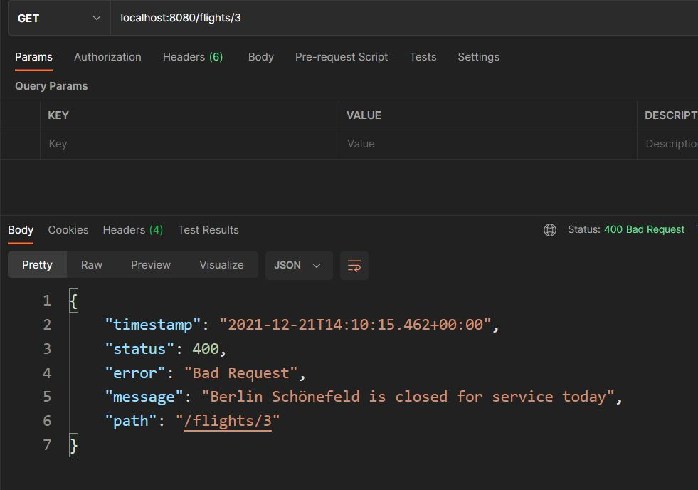
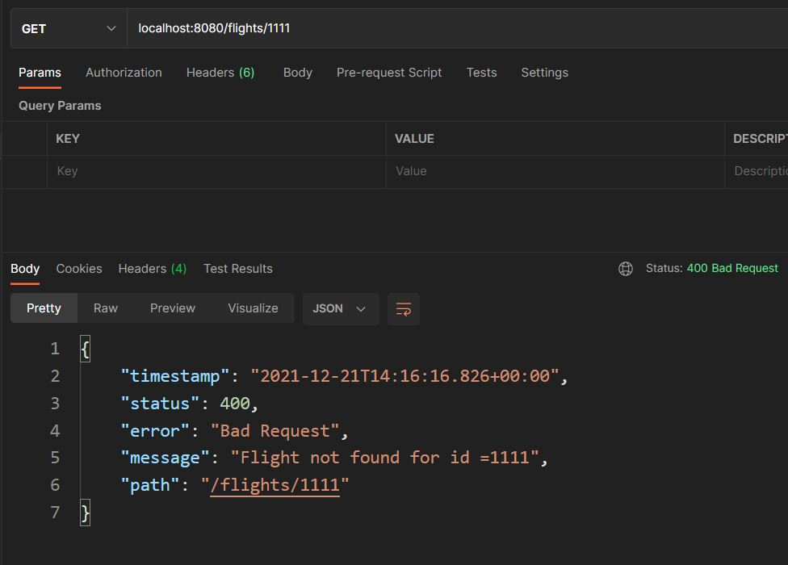

## 3/6: Authorization

**Topics you need to learn in order to complete the current stage:**

[Exception handling](https://hyperskill.org/projects/232/stages/1163/preview#)

Use the material from these topics and the skills you’ve learned to successfully complete this stage of the project.

**You will be working on the following in this project stage**

Implement roles and grant access rights to users.

##### Description

An enterprise anti-fraud system has hundreds of merchant users who take advantage of the system by checking the validity of the transactions only. These users do not want to delve into a list of stolen cards, suspicious IP addresses, and who else uses the app. On the other hand, the number of users responsible for reporting stolen cards/IPs and excluding them from the blacklist is limited. These users don't have access to user-management functions. Finally, we have several users who are 100%-trusted and are allowed to access and modify more sensitive data.

In this stage, you need to add the **authorization** feature. Authorization is a process when the system decides whether an authenticated client has permission to access the requested resource. Authorization always follows authentication.

Let's implement the role model for our system:

|                                 | Anonymous | MERCHANT | ADMINISTRATOR | SUPPORT |
| ------------------------------- | --------- | -------- | ------------- | ------- |
| POST /api/auth/user             | +         | +        | +             | +       |
| DELETE /api/auth/user           | -         | -        | +             | -       |
| GET /api/auth/list              | -         | -        | +             | +       |
| POST /api/antifraud/transaction | -         | +        | -             | -       |
| POST /api/antifraud/access      | -         | -        | +             | -       |

Let's talk about roles. ==`ADMINISTRATOR` is the user who has registered first, all other users should receive the `MERCHANT` roles. All users added after `ADMINISTRATOR` must be locked by default and unlocked later by `ADMINISTRATOR`==. The `SUPPORT` role should be assigned by `ADMINISTRATOR` to one of the users later.

##### Objectives

- Add authorization to the service and implement the role model shown in the table above. ==The first registered user should receive the `ADMINISTRATOR` role; the rest — `MERCHANT`.== In case of authorization violation, respond with the `HTTP Forbidden` status (`403`). ==Mind that only one role can be assigned to a user;==
- ==All users, except `ADMINISTRATOR`, must be locked immediately after registration; only `ADMINISTRATOR` can unlock users;==
- ==Change the response for the `POST /api/auth/user` endpoint. It should respond with the `HTTP Created` status (`201`) and the body with the JSON object containing the information about a user. Add the `role` field in the response:==

```json
{
   "id": <Long value, not empty>,
   "name": "<String value, not empty>",
   "username": "<String value, not empty>",
   "role": "<String value, not empty>"
}
```

- ~~Change the response for the `GET /api/auth/list` endpoint. Add the `role` field in the response:~~

```json
[
    {
        "id": <user1 id>,
        "name": "<user1 name>",
        "username": "<user1 username>",
        "role": "<user1 role>"
    },
     ...
    {
        "id": <userN id>,
        "name": "<userN name>",
        "username": "<userN username>",
        "role": "<userN role>"
    }
]
```

- ~~Add the `PUT /api/auth/role` endpoint that changes user roles. It must accept the following JSON body:~~

```json
{
   "username": "<String value, not empty>",
   "role": "<String value, not empty>"
}
```

~~If successful, respond with the `HTTP OK` status (`200`) and the body like this:~~

```json
{
   "id": <Long value, not empty>,
   "name": "<String value, not empty>",
   "username": "<String value, not empty>",
   "role": "<String value, not empty>"
}
```

- ~~If a user is not found, respond with the `HTTP Not Found` status (`404`);~~
- ~~If a role is not `SUPPORT` or `MERCHANT`, respond with `HTTP Bad Request` status (`400`);~~
- ~~If you want to assign a role that has been already provided to a user, respond with the `HTTP Conflict` status (`409`);~~
- ~~Add the `PUT /api/auth/access` endpoint that locks/unlocks users. It accepts the following JSON body:~~

```json
{
   "username": "<String value, not empty>",
   "operation": "<[LOCK, UNLOCK]>"  // determines whether the user will be activated or deactivated
}
```

~~If successful, respond with the `HTTP OK` status (`200`) and the following body:~~

```json
{
    "status": "User <username> <[locked, unlocked]>!"
}
```

- ~~For safety reasons, `ADMINISTRATOR` cannot be blocked. In this case, respond with the `HTTP Bad Request` status (`400`);~~
- ~~If a user is not found, the endpoint must respond with `HTTP Not Found` status (`404`).~~

##### Examples

**Example 1:** *a POST request for /api/auth/user with the correct user credentials*

*Request body:*

```json
{
   "name": "John Doe",
   "username": "JohnDoe",
   "password": "secret"
}
```

*Response:* `201 CREATED`

*Response body:*

```json
{
   "id": 1,
   "name": "John Doe",
   "username": "JohnDoe",
   "role": "ADMINISTRATOR"
}
```

**Example 2:** *a GET request for /api/auth/list*

*R**esponse:* `200 OK`

```json
[
  {
    "name":"John Doe",
    "username":"JohnDoe",
    "role": "ADMINISTRATOR"
  },
  {
    "name":"JohnDoe2",
    "username":"JohnDoe2",
    "role": "MERCHANT"
  }
]
```

**Example 3:** *a PUT request for /api/auth/role with the correct authentication under the ADMINISTRATOR role:*

*Request body:*

```json
{
   "username": "JohnDoe1",
   "role": "SUPPORT"
}
```

*Response:* `200 OK`

*Response body:*

```json
{
   "id": 1,
   "name": "John Doe 1",
   "username": "JohnDoe1",
   "role": "SUPPORT"
}
```

**Example 4:** *a PUT request for /api/auth/role with the correct authentication under the ADMINISTRATOR role:*

*Request body:*

```json
{
   "username": "JohnDoe1",
   "role": "ADMINISTRATOR"
}
```

*Response:* `400 HTTP Bad Request`

**Example 5:** *a PUT request for /api/auth/role with the correct authentication under the ADMINISTRATOR role:*

*Request body:*

```json
{
   "username": "JohnDoe1",
   "role": "SUPPORT"
}
```

*Response:* `409 HTTP Conflict`

**Example 6:** *a PUT request for /api/auth/access with the correct authentication under the ADMINISTRATOR role:*

*Request body:*

```json
{
   "username": "JohnDoe1",
   "operation": "UNLOCK"
}
```

*Response:* `200 OK`

*Response body:*

```json
{
   "status": "User JohnDoe1 unlocked!"
}
```

**Example 7:** *a PUT request for /api/auth/access with the correct authentication under the ADMINISTRATOR role:*

*Request body:*

```json
{
   "username": "Administrator",
   "operation": "LOCK"
}
```

*Response:* `400 Bad Request`

## Exception handling

Returning errors to a user is crucial during web application development. When users send an incorrect request that cannot be processed or want to get information on a non-existing object, your web application should let them know what is wrong. There are different general HTTP status codes, for example, `400` for `Bad Request` or `404` for `Not Found`. Handling errors is very important, as it allows users to understand what is wrong right away.

Here you will find two ways to return an error message in Spring Boot applications. You can either use the `ResponseStatusException` Spring class or create your own exception using the `@ResponseStatus` annotation. Let's write a simple code and show how it works.

##### Controller preparation

Imagine a web app that returns information about a flight by its number. It would look like this in JSON:

```json
{
  "from": "Berlin Tegel",
  "to": "Stuttgart",
  "gate": "D80"
}
```

In the example below, we create a simple `FlightInfo` class with information about the airport, city, and gate. We do not provide the flight date and time for the sake of brevity:

```java
public class FlightInfo {

    private String from;
    private String to;
    private String gate;
 
    // constructor
 
    // getters and setters
 
}
```

Now we can implement a simple `FlightController` controller with a list of flights. We will also use a method that returns a `FlightInfo` object from the `flightInfoList` list to get information about the specific flight:

```java
@RestController
public class FlightController {

    private static final List<FlightInfo> flightInfoList;

    static {
        flightInfoList = new ArrayList<>();
        flightInfoList.add(new FlightInfo("Delhi Indira Gandhi", "Stuttgart", "D80"));
        flightInfoList.add(new FlightInfo("Tokyo Haneda", "Frankfurt", "110"));
        flightInfoList.add(new FlightInfo("Kilimanjaro Arusha", "Boston", "15"));
        flightInfoList.add(new FlightInfo("Berlin Schönefeld", "Tenerife", "15"));
    }

    @GetMapping("flights/{id}")
    public static FlightInfo getFlightInfo(@PathVariable int id) {
        return flightInfoList.get(id);
    }

}
```

Finally, we are ready to focus on handling exceptions!

##### ResponseStatusException

The first way to return an error is to use the `ResponseStatusException` class introduced in Spring 5 for basic error handling as part of `org.springframework.web.server` package. It's `RuntimeException` and that's why we don't need to add it to a method signature.

There are three constructors in Spring to generate `ResponseStatusException`:

```java
ResponseStatusException(HttpStatus status)
ResponseStatusException(HttpStatus status, java.lang.String reason)
ResponseStatusException(
        HttpStatus status, 
        java.lang.String reason, 
        java.lang.Throwable cause
)
```

We have created an instance providing `HttpStatus` and, optionally, the reason and cause. The reason is a simple message that explains the exception. The cause is a nested exception.

So, what `HttpStatus` types are there? The most common are `200 OK`, `404 NOT_FOUND`, `400 BAD_REQUEST`, `403 FORBIDDEN`, and `500 INTERNAL_SERVER_ERROR`.

Let's change our `getFlightInfo` method and write a code that generates an instance of `ResponseStatusException`. Let's say users are looking for some information about a flight from the Berlin Schönefeld airport, but the airport is closed for maintenance. In this situation, we should return `ResponseStatusException` with `BAD_REQUEST` status and reason message:

```java
@GetMapping("flights/{id}")
public static FlightInfo getFlightInfo(@PathVariable int id) {
    FlightInfo flightInfo = flightInfoList.get(id);
    if (Objects.equals(flightInfo.getFrom(), "Berlin Schönefeld")) {
        throw new ResponseStatusException(HttpStatus.BAD_REQUEST, 
                "Berlin Schönefeld is closed for service today");
    }
    return flightInfo;
}
```

If we try to test it, we will see the standard error info format as a response:



This JSON instance provides more information about the situation than a specified message — the timestamp, error name, status code, and the REST path of the request.

By default, Spring Boot doesn't include the `message` field in a response. To enable it, add this line in the `application.properties` file: `server.error.include-message=always`

Let's talk about the pros and cons of `ResponseStatusException`.

It has many benefits, allowing us to:

- process exceptions of the same type separately;
- set different status codes for the response;
- avoid creating any additional exception classes;
- throw an exception at any place;

The disadvantage is the code duplication since we have to write the same code in several controllers.

If your application throws an uncaught exception like `RuntimeException` or any other that doesn't have explicit details on the HTTP code, it will be converted to `500 Internal Server Error`. This status code indicates that something is bad with your server, and it should be fixed because the user requests cannot be processed properly.

##### Custom exceptions

It is also possible to set the response code and status for the custom exception. We can write a class that extends `RuntimeException` and add the `@ResponseStatus` annotation to the exception like this:

==@ResponseStatus(code = HttpStatus.BAD_REQUEST)==
class FlightNotFoundException extends RuntimeException {    
    public FlightNotFoundException(String cause) {
        super(cause);
    }
}

Now, we can throw this exception in the same way as `ResponseStatusException`. The status will be set automatically.

For example, in the flight controller:

@GetMapping("flights/{id}")
public FlightInfo getFlightInfo(@PathVariable int id) {
    if (id > flightInfoList.size()) {
        ==throw new FlightNotFoundException("Flight not found for id =" + id);==
    }
    return flightInfoList.get(id);
}
If we test this exception with a nonexistent `id=1111`, we get a response with the new status code `400`.



The main advantage is that we can create our own specific exceptions and keep our code more readable.

On the other hand, custom exceptions require implementing additional classes.

##### Conclusion

Remember that bad exception processing may result in bugs and low readability. We have considered two ways of handling exceptions in Spring. Now you can:

- throw `ResponseStatusException`
- create custom exceptions using the `@ResponseStatus` annotation and throw them like `ResponseStatusException`

Each way has its advantages and disadvantages. Use the second option for specific exceptions or the first one to avoid additional exception classes.

## Exception handling

You need to create your own exception like in the example below. You want all your `YourExcepNameException` exceptions to generate the same `HttpStatus` code, for example, `NOT_FOUND` in the response. How can you do it?

```
class YourExcepNameException extends RuntimeException {
    // ...
}
```

Add @ResponseStatus(NOT_FOUND)

==Add @ResponseStatus(code = HttpStatus.NOT_FOUND)==

Add @ResponseStatusCode(HttpStatus.NOT_FOUND)

Add @ResponseStatusCode(value = HttpStatus.NOT_FOUND)