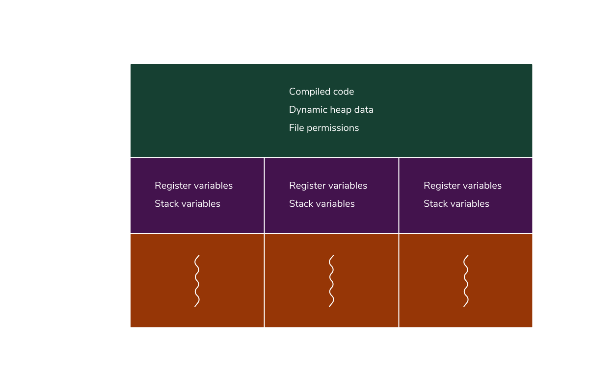
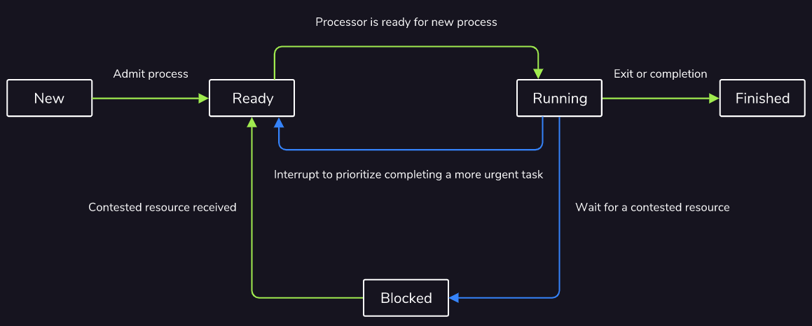
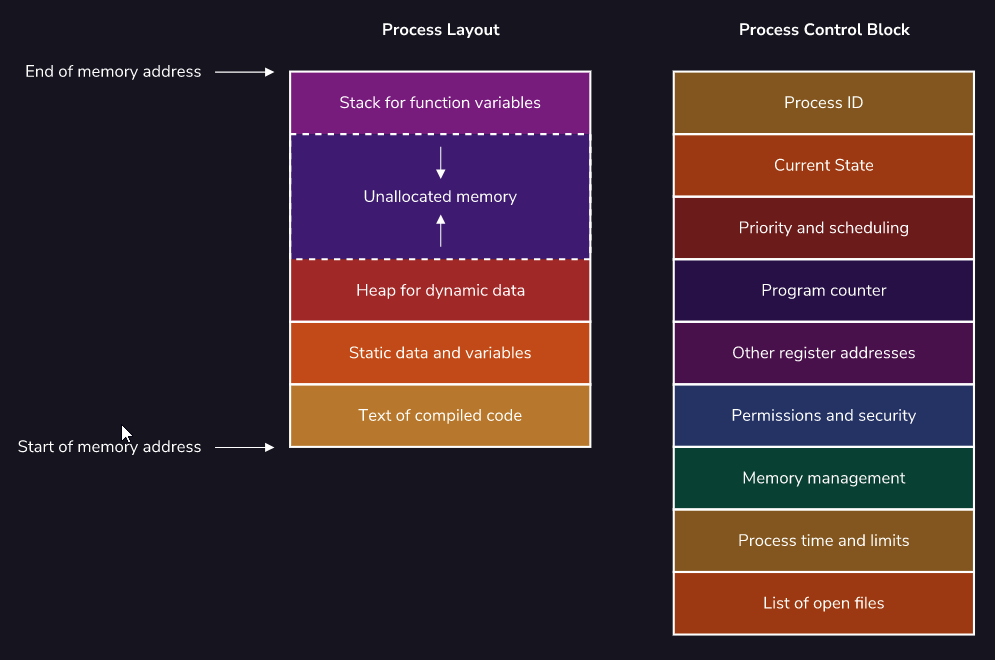
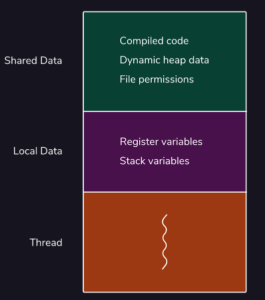
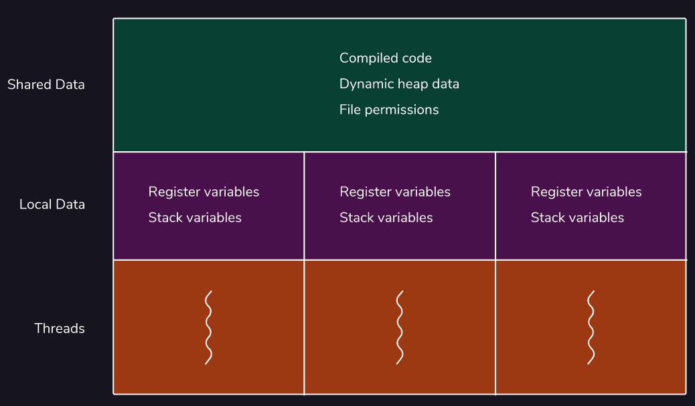
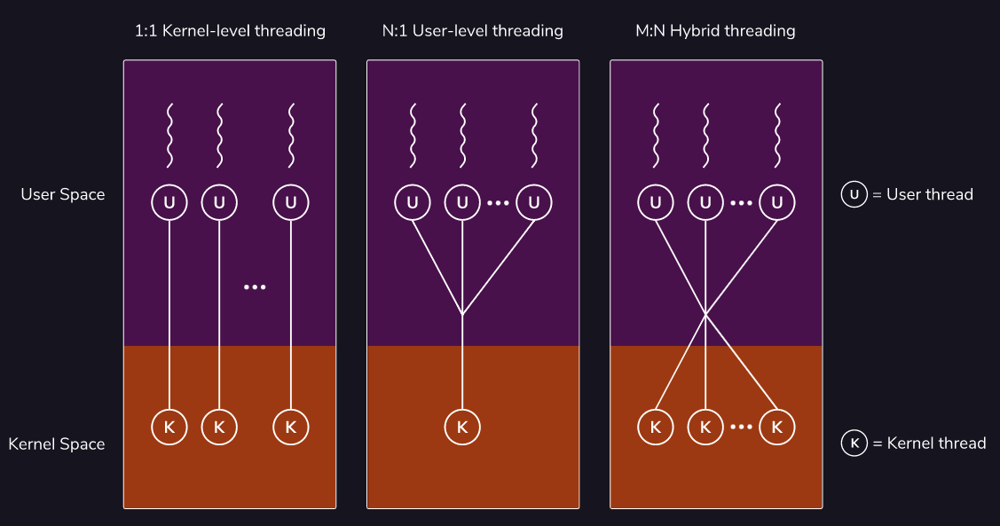

Computer Programs

A *computer program* is a collection of instructions used to perform a certain task.

User vs Kernel Threads

User threads can be mapped to kernel threads in a variety of ways: 1:1 Kernel-Level threading, N:1 User-Level threading, or M:N Hybrid threading.

Context Switching

*Context switching* allows CPU cores to alternate between ready and blocked processes to best take advantage of limited computing resources.

Process Multithreading

*Multithreading* is the capability for a single CPU core to execute multiple threads at once. This improves system utilization and responsiveness by more efficiently splitting up tasks

Process Control Block

Every process is initialized with a *process control block* that is required by the operating system to be able to identify and control the process

------

**Introduction to Processes**

When using a computer, multiple programs can often be found running at the same time. Perhaps one for playing music, another for creating documents, and one for browsing the web. All of these programs have certain functionalities, but on their own they do nothing. To actually make use of them, they must be executed.

While a computer program is a static collection of coded instructions stored on a disk, a ==*process* is an abstraction representing the program when it is running.== A process is created when a program is executed. These processes are not only central for the usability of a computer, but they are the building blocks of an operating system. Managing these processes is central to operating system development.

Processes can sometimes also be called “tasks” or “jobs”, although these definitions are ambiguous. The key defining factor is that ==processes generally operate independently and do not share data;== for example, a music player program will launch a music player process that would be independent of the process managing an office suite.

### Instructions

All of the processes running on your system can be found in the operating system’s process manager:

- Task Manager in Windows
- Activity Monitor in MacOS
- System Monitor or top in most Linux Distributions

**Lifecycle of a Process**

To best optimize the performance of processes as their priority changes or as they wait for access to a limited resource, processes are put into one of five states:

- `New`: The program has been started and waits to be added into memory in order to become a full process.
- `Ready`: Process fully initialized, loaded into memory, and waiting to be picked up by the processor.
- `Running`: Currently being executed by the processor.
- `Blocked`: The process requires a contested resource that it must wait for.
- `Finished`: The process has been completed.

The life cycle of a process is its journey between these five states, beginning with `New` and ending with `Finished`. As CPU cores traditionally only executed one task at a time, managing the state of processes allows the processor to interleave these tasks and allows multiple processes to best share these cores and other limited computer resources. For example, instead of a process occupying the processor while waiting for user input, it can be marked as blocked to have the processor focus on another process in the ready state until that input arrives.

Blocking isn’t inherently negative as some tasks require more time. Marking these processes as blocked allows the processor to prioritize other tasks, creating a more responsive and efficient system. Similarly, some processes may also be reverted to the `Ready` state through preemption, where tasks are temporarily interrupted by an external scheduler for urgent reasons, such as a hardware interrupt signal asking the system to shutdown.

All of these switching processes do come with overhead that is best to be avoided. This is called *context switching* and is typically an expensive operation as the current state of the process needs to be stored and then be reloaded later to resume execution.

### Instructions

How could the `Blocked` state be further broken down to be more descriptive?

**Process Layout and Process Control Block**

When a process is initialized, its layout within memory has four distinct sections:

- A text section for the compiled code
- A data section for initialized variables
- A stack for local variables defined within functions
- A heap for dynamic memory allocation

Processes are also initialized with a *Process Control Block* that is required by the operating system for managing the process. This contains:

- A unique process ID and the ID of any parent processes that launched the current one
- The current process state
- How long the process has been running and any time limits the process may have
- Allowed system resources and other permissions
- The priority of the process
- The program counter for the address of the instruction currently being executed
- The address of other registers within the CPU holding intermediate values
- Information required for memory management such as page and segment tables

Additionally, when one process launches another, the original enters a parent-child relationship with the newly-launched process that shares much of the above data. For example, when an existing music player process starts a new process for scanning the user’s music library, both of these processes generally share the same system resources and permissions. Parent processes usually also wait for their children to complete before terminating themselves, unless the child was created specifically to run independently in the background.

### Instructions

What other information may be useful to store on the Process Control Block?

**Introduction to Threads**

==While a **process** is an abstract data structure that represents all of the necessary information to run a program, a ***thread*** represents the actual sequence of processor instructions that are actively being executed.==

Each process contains at least one thread to be able to execute, although more can be created to allow for concurrent processing if it is supported by the CPU. These threads live within the process and share all of the common resources available to it, such as memory pages and active files, as shown in the image to the right.

These shared resources are critical for the definition of a thread. While each process is typically independent, multiple threads usually work together within the context of a process. By sharing data directly, there is faster communication and context switching between threads than what is possible for processes, all while taking fewer system resources.

For example, within a video game process, multiple threads may exist to manage separate services relating to the operation of the game, such as one thread for collecting user inputs and another for producing sounds. As these threads live within the same process, they can easily share information about the game, such as the type of ground the player is walking on. This can be used to affect both the speed the character moves from the input thread as well as the noises created by the sound thread.

### Instructions

Why might a browser application prefer to create each tab as a separate process instead of a thread?

**Multithreading**

Typically, a single CPU core can only execute one thread, and therefore one process, at a time. With a clever use of blocking and context switching, this limitation can be obscured to users through nanosecond-long pauses that allow processes to be completed near-simultaneously. With some hardware advances, single CPU cores can now execute multiple threads at once, which is a capability called *multithreading*.

Parallelizing computations have a variety of benefits, such as improved system utilization and system responsiveness. This is because tasks can be more evenly split between multiple threads, exhausting all available computing resources and allowing longer tasks to run in the background, separate from user input. The image to the right shows how threads share data to achieve this.

However, these optimizations come with disadvantages due to the additional complexity required for the implementation. Not only are these programs more difficult to write because of their non-sequential nature, but they also create whole new classes of bugs.

The two of the most common examples are data races, where multiple threads attempt to modify the same piece of data, and deadlocks, where multiple threads all attempt to wait for each other and freeze the system. Also, since these bugs are usually related to the tight timing of CPU interactions, the programs can be considered non-deterministic and therefore untestable, compounding the problem.

**Kernel Threads vs User Threads**

Threads can behave differently depending on the environment they are created in.

A thread built into the existing process is considered a *kernel thread*. This means that the kernel within the operating system is fully aware of these threads and directly manages their execution.

There are also *user threads* that exist solely in userspace and, while functionally identical, are not known or controlled by the kernel. This allows for more fine-grained control by developers. These threads are even more efficient than their kernel counterparts as they save on the costly indirection of making a system call to constantly interact with the kernel.

While these user threads typically operate independently of the kernel, they do need to be mapped to existing kernel threads in order to have the operating system execute them. There are three common models for mapping user threads to kernel threads, as shown in the image to the right:

- **1:1 Kernel-level threading** for a simple implementation that best allows for hardware acceleration provided by the kernel threads.
- **N:1 User-level threading** for ultra-light threads that can quickly communicate and context switch, but do not benefit from hardware acceleration due to sharing the same kernel thread.
- **M:N Hybrid threading** to get the best of both of the above solutions: very light and fast threads that can be hardware accelerated as necessary. However, this complex implementation can lead to bugs such as priority inversion where less important tasks are mistakenly prioritized and run first.

### Instructions

Which mapping of user threads to kernels threads would be preferred if the computer hardware does not support multiple kernel threads?

**Review and Wrap-up**

Congratulations! You have finished learning about some of the key foundations of an operating system: the processes and threads that all of the other code on the system rests upon.

A process is an abstraction within the operating system that represents the program while it is in execution. These processes exist in five states that are leveraged to allow the CPU cores to alternate between ready and blocked processes to best take advantage of limited computing resources.

A thread represents the actual sequence of processor instructions that are actively being executed. Each process contains at least one thread and can contain many such structures that all share resources among each other to allow for faster communication and context switching between them. This all allows them to be “lighter” and require fewer system resources. With the hardware advancement of multithreading, individual cores can also execute multiple threads at once, further improving system utilization and responsiveness by more efficiently splitting up tasks.

Threads behave differently depending on the environment they were created in. Kernel threads are constructed through system calls to the kernel while user threads are constructed using local function calls. User threads, therefore, allow for more fine-grained control by developers that can be more efficient than their kernel counterparts. However, these user threads have to be mapped to their kernel counterparts in order to be actually executed.

### Instructions

All of the processes running on your system can be found in the operating system’s process manager:

- Task Manager in Windows
- Activity Monitor in MacOS
- System Monitor or top in most Linux Distributions