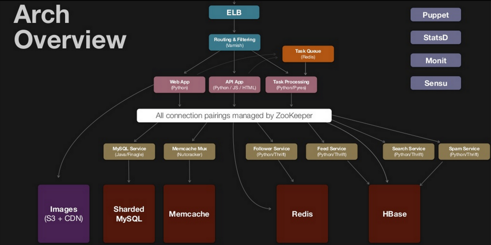
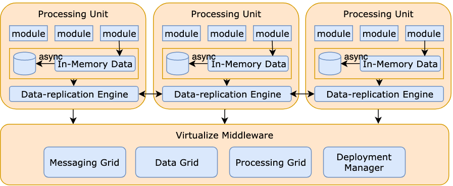
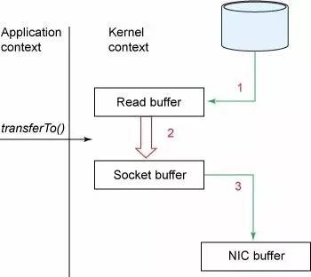
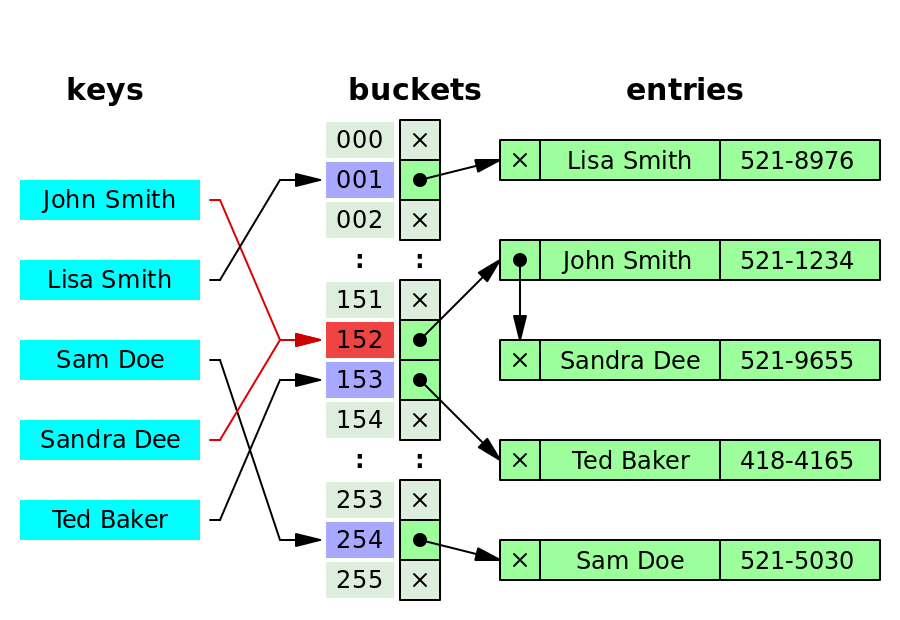

# Hacking the Software Engineer Interview

 

# Table of Contents 


- [Table of Contents](https://tianpan.co/hacking-the-software-engineer-interview#table-of-contents)
- Overview
  - [How to crack the coding interview?](https://tianpan.co/hacking-the-software-engineer-interview#how-to-crack-the-coding-interview)
  - [What can we communicate in the interview?](https://tianpan.co/hacking-the-software-engineer-interview#what-can-we-communicate-in-the-interview)
- [Experience Deep Dive](https://tianpan.co/hacking-the-software-engineer-interview#experience-deep-dive)
- [Cracking the System Design Interview (Designing Pinterest or Instagram as an example)](https://tianpan.co/hacking-the-software-engineer-interview#cracking-the-system-design-interview-designing-pinterest-or-instagram-as-an-example)
- System Design Theories
  - [Introduction to Architecture](https://tianpan.co/hacking-the-software-engineer-interview#introduction-to-architecture)
  - [Data Partition and Routing](https://tianpan.co/hacking-the-software-engineer-interview#data-partition-and-routing)
  - [Replica and Consistency](https://tianpan.co/hacking-the-software-engineer-interview#replica-and-consistency)
  - Availability (TODO)
    - [Improving availability with failover](https://tianpan.co/hacking-the-software-engineer-interview#improving-availability-with-failover)
  - [Big Data Algorithms and Data Structures](https://tianpan.co/hacking-the-software-engineer-interview#big-data-algorithms-and-data-structures)
  - [Resource Management and Scheduler (TODO)](https://tianpan.co/hacking-the-software-engineer-interview#resource-management-and-scheduler-todo)
  - [Distributed Coordination System (TODO)](https://tianpan.co/hacking-the-software-engineer-interview#distributed-coordination-system-todo)
  - Data Stores (TODO)
    - [Intro to Relational Database / SQL Database](https://tianpan.co/hacking-the-software-engineer-interview#intro-to-relational-database-sql-database)
    - Intro to 4 kinds of NoSQL database: Key-value Store vs. Document Store vs. Column-oriented Store vs. Graph Database
      - [KV store](https://tianpan.co/hacking-the-software-engineer-interview#kv-store)
  - [Stream and Batch Processing](https://tianpan.co/hacking-the-software-engineer-interview#stream-and-batch-processing)
  - [Cloud Design Patterns](https://tianpan.co/hacking-the-software-engineer-interview#cloud-design-patterns)
  - Communication Protocols and APIs
    - [Public API Choices: JSON RPC vs. GraphQL vs. REST vs. gRPC](https://tianpan.co/hacking-the-software-engineer-interview#public-api-choices-json-rpc-vs-graphql-vs-rest-vs-grpc)
  - [Lambda architecture](https://tianpan.co/hacking-the-software-engineer-interview#lambda-architecture)
  - [iOS Architecture Patterns](https://tianpan.co/hacking-the-software-engineer-interview#ios-architecture-patterns)
- System Design in Practice
  - [Designing Uber (or a realtime marketplace)](https://tianpan.co/hacking-the-software-engineer-interview#designing-uber-or-a-realtime-marketplace)
  - [Scaling Facebook social graph store](https://tianpan.co/hacking-the-software-engineer-interview#scaling-facebook-social-graph-store)
  - [Designing Netflix view state service](https://tianpan.co/hacking-the-software-engineer-interview#designing-netflix-view-state-service)
  - [Designing robust and predictable APIs with idempotency](https://tianpan.co/hacking-the-software-engineer-interview#designing-robust-and-predictable-apis-with-idempotency)
  - [Designing video streaming over HTTP](https://tianpan.co/hacking-the-software-engineer-interview#designing-video-streaming-over-http)
  - [Designing a distributed logging system](https://tianpan.co/hacking-the-software-engineer-interview#designing-a-distributed-logging-system)
  - [Designing a url shortener](https://tianpan.co/hacking-the-software-engineer-interview#designing-a-url-shortener)
  - [Designing a key-value store with external storage](https://tianpan.co/hacking-the-software-engineer-interview#designing-a-key-value-store-with-external-storage)
  - [Designing Memcached or an in-memory KV store](https://tianpan.co/hacking-the-software-engineer-interview#designing-memcached-or-an-in-memory-kv-store)
  - [Designing Facebook Photo Storage (or a Blob storage)](https://tianpan.co/hacking-the-software-engineer-interview#designing-facebook-photo-storage-or-a-blob-storage)
  - [Designing Stock Exchange](https://tianpan.co/hacking-the-software-engineer-interview#designing-stock-exchange)
  - [Designing Smart Notification of Stock Price Changes](https://tianpan.co/hacking-the-software-engineer-interview#designing-smart-notification-of-stock-price-changes)
  - [Designing Square Cash or PayPal Money Transfer System](https://tianpan.co/hacking-the-software-engineer-interview#designing-square-cash-or-paypal-money-transfer-system)
  - [Designing payment webhook](https://tianpan.co/hacking-the-software-engineer-interview#designing-payment-webhook)
  - [Designing a metric system](https://tianpan.co/hacking-the-software-engineer-interview#designing-a-metric-system)
- [How to write solid code?](https://tianpan.co/hacking-the-software-engineer-interview#how-to-write-solid-code)


# Overview 

The overall process:

1. HR screen: HR will clarify the interview process and ask quick questions to filter out know-nothings
2. Phone screen: 1 or 2 rounds of phone screens on coding
3. Onsite: spending a whole day interviewing at the office in person
   1. 2 or 3 rounds of coding interviews
   2. 1 round of system design and architecture
   3. 1 round of behavior questions or culture fit
   4. (optional) 1 round of bar raiser interview
4. Making decisions and negotiating. Never accept an offer without negotiating!

If the candidate is local, phone screens can be reduced or even skipped.

If it is a internship position, onsite is skipped.

## How to crack the coding interview? 

1. throw your book *Cracking the Coding Interview* into the trash. The coding questions there are obsolete and too easy. *Elements of Programming Interviews* is better. However, by and large, books are not very helpful because what you need is deliberate practice not reading books.
2. Go to Online Judge like Leetcode and Lintcode. Solve at least 70 medium to hard questions. The key is to practice in a large amount and with speed repeatedly.

Since OJ can help you tackle the coding interviews, here in this documentation we focus on soft skills, experience deep dive, system design and architectures.

## What can we communicate in the interview? 

# [What can we communicate in soft skills interview?](https://tianpan.co/notes/63-soft-skills-interview)

## What is an interview? 

An interview is a process for workers to find future co-workers, during which they are finding signals to answer the following three key questions:

1. capability question - can you do the job?
2. willingness question - will you do the job?
3. culture-fit question - will you fit in?

## Why is soft skill so important? 

None of the critical questions above can be answered without good communication. Your job will be taken away by people who can talk better than you.

## Generic answers (stories) to prepare 

1. hard-won triumph. How do you deal with failure? Briefly talk about the harshest moment, and then focus on how you battled back, and then salute the people who helped you. It demonstrates that you have the grit, team-building skills, and relevance to the job.
2. influence. Can you guide people to yes? `leaders = visionaries who inspire self-sacrifice`. A leader does not exist without the ability to persuade.
3. technical skills. Do you have a story proving your great technical skills?
4. culture-fit. The FBI used to ask prospective agents what books they read until an underground network of tipsters figured out the ideal answer: “Tom Clancy spy novels.”
5. fascination. What’s fascinating about you? What makes you different from other people?

# Experience Deep Dive 

# [Experience Deep Dive](https://tianpan.co/notes/2018-07-20-experience-deep-dive)

## Intended Audience 

Moderate experience or less, or anyone who was not in a leadership or design position (either formal or informal) in their previous position

## Question Description 

Describe one of your previous projects that was particularly interesting or memorable to you. Followup questions:

What about it made it interesting? What was the most challenging part of the project, and how did you address those challenges? What did you learn from the project, and what do you wish you had known before you started? What other designs/implementation methods did you consider? Why did you choose the one that you did? If you were to do the same project over again, what would you do differently?

## Interviewer tips 

Since the goal here is to assess the technical communication skill and interest level of someone who has not necessarily ever been in a role that they could conduct a crash course in, you should be prepared to keep asking them questions (either for more details, or about other aspects of the project). If they are a recent grad and did a thesis, that’s often a good choice to talk about. While this question is in many ways similar to the Resume Questions question from phone screen one, this question is intended to be approximately four times as long, and should get into proportionally more detail about what it is that they have done. As such, the scoring criteria are similar, but should be evaluated with both higher expectations and more data.

## Scoring 

A great candidate will

- Be able to talk for the full time about the project, with interaction from the interviewer being conversational rather than directing
- Be knowledgeable about the project as a whole, rather than only their area of focus, and be able to articulate the intent and design of the project
- Be passionate about whatever the project was, and able to describe the elements of the project that inspired that passion clearly
- Be able to clearly explain what alternatives were considered, and why they chose the implementation strategy that they did.
- Have reflected on and learned from their experiences

A good candidate will

- May have some trouble talking for the full time, but will be able to with some help and questions from the interviewer
- May lack some knowledge about the larger scope of the project, but still have strong knowledge of their particular area and pieces that directly interacted with them
- May seem passionate, but be unable to clearly explain what inspired that passion
- May be able to discuss alternatives to what they did, but not have considered them in depth
- Have reflected on and learned from their experiences

A bad candidate will

- Have difficulty talking for the full time. The interviewer may feel as if they are interrogating rather than conversing with the candidate
- May lack detailed knowledge of the project, even within the area that they were working. They may not understand why their piece was designed the way it was, or may not understand how it interacted with other systems
- Does not seem very interested in the project - remember that you are asking them about the most interesting project that they have done, they should be very - interested in whatever it was
- May not be familiar with potential alternatives to their implementation method
- Does not seem to have learned from or reflected on their experiences with the project. A key sign of this is that the answer to ‘what did you learn’ and ‘what would you do differently’ are short and/or nearly identical.

# Cracking the System Design Interview (Designing Pinterest or Instagram as an example) 

# [Crack the System Design Interview](https://tianpan.co/notes/2016-02-13-crack-the-system-design-interview)

Update 2019-09-25: Welcome to join us for discussion: https://t.me/system_design_and_architecture

Update 2018/10/18: This article is collected in the topic [hacking the software engineer interview](https://puncsky.com/hacking-the-software-engineer-interview/?isAdmin=true)

Building applications is not a rocket science, but having the vision of the overall architecture really makes a difference. We have to crack the system interview sooner or later in our career as a software engineer or engineering manager.

Interviewers are looking for future teammates that they like to work with. The future teammates are expected to be, at least, capable of solving problems independently. There are so many solutions to any given problem, but not all of them are suited given the context. So the interviewee has to specify different choices and their tradeoffs. To summarize, **system design interview is a happy show-off of our knowledge on technologies and their tradeoffs. Ideally, keep talking what the interviewer expect throughout the interview, before they even have to ask.**

Keep talking for 45 mins could be easy, as long as we are armed with the following **four steps and three common topics**. Take **“design Pinterest”** for example.

## 1. Four steps to Crack the System Design Interview 

Breaking down a complex task into small chunks helps us handle the problem at a better pace and in a more actionable way.

### 1.1 Step 1. Clarify Requirements and Specs 

First things first, the ultimate goals should always be clear.

Pinterest is a highly scalable photo-sharing service:

- features: user profile, upload photos, news feed, etc.
- scaling out: horizontal scalability and micro services.

### 1.2 Step 2. Sketch Out High Level Design 

**Do not dive into details before outlining the big picture.** Otherwise, going off too far towards a wrong direction would make it harder to even provide a roughly correct solution. We will regret wasting time on irrelevant details when we do not have time to finish the task.

OK, let us sketch out the following diagram without concerning too much about the implementation detail of these components.



So far so good! To some extent, congrats, we have solved the problem!

### 1.3 Step 3. Discuss individual components and how they interact in detail 

When we truly understand a system, we should be able to identify what each component is and explain how they interact with one another. Take these components in the above diagram and specify each one by one. This could lead to more general discussions, such as the three common topics in Section 2, and to more specific domains, like how to [design the photo storage data layout](https://www.usenix.org/legacy/event/osdi10/tech/full_papers/Beaver.pdf)…

#### 1.3.1 Load Balancer 

Generally speaking, load balancers fall into three categories:

- ==DNS Round Robin (rarely used): clients get a randomly-ordered list of IP addresses.==
  - pros: easy to implement and free
  - cons: hard to control and not responsive, since DNS cache needs time to expire
- ==L3/L4 Load Balancer: traffic is routed by IP address and port. L3 is network layer (IP). L4 is transport layer (TCP).==
  - pros: better granularity, simple, responsive.
- ==L7 Load Balancer: traffic is routed by what is inside the HTTP protocol. L7 is application layer (HTTP).==

It is good enough to talk in this level of detail on this topic, but in case the interviewer wants more, we can suggest exact algorithms like round robin, weighted round robin, least loaded, least loaded with slow start, utilization limit, latency, cascade, etc.

#### 1.3.2 Reverse Proxy 

Reverse proxy, like varnish, ==centralizes internal services and provides unified interfaces to the public.== For example, [www.example.com/index](http://www.example.com/index) and [www.example.com/sports](http://www.example.com/sports) appear to come from the same domain, but in fact they are from different micro services behind the reverse proxy. Reverse proxy could ==also help with caching and load balancing.==


#### 1.3.3 (Frontend) Web Tier 

This is where web pages are served, and usually combined with the service / backend tier in the very early stage of a web service.

##### Stateless 

**There are two major bottlenecks of the whole system – requests per second (rps) and bandwidth.** We could ==improve the situation by using more efficient tech stack, like frameworks with [async== and non-blocking reactor pattern](http://www.puncsky.com/blog/2015/01/13/understanding-reactor-pattern-for-highly-scalable-i-o-bound-web-server/), and enhancing the hardware, like ==**scaling up (aka vertical scaling) or scaling out (aka horizontal scaling)**.==

Internet companies prefer scaling out, since it is more cost-efficient with a huge number of commodity machines. This is also good for recruiting, because the target skillsets are equipped by. After all, people rarely play with super computers or mainframes at home.

==**Frontend web tier and service tier must be stateless in order to add or remove hosts conveniently, thus achieving horizontal scalability.** As for feature switch or configs, there could be a database table / standalone service to keep those states.==

##### Web Application and API 

**MVC(MVT) or MVVC** pattern is the dominant pattern for this layer. Traditionally, view or template is rendered to HTML by the server at runtime. In the age of mobile computing, view can be as simple as serving the minimal package of data transporting to the mobile devices, which is called **web API**. People believe that the API can be shared by clients and browsers. And that is why **single page web applications** are becoming more and more popular, especially with the assistance of frontend frameworks like react.js, angular.js, backbone.js, etc.

#### 1.3.4 App Service Tier 

**The single responsibility principle** advocates small and autonomous services that work together, so that each service can do one thing well and not block others. Small teams with small services can plan much more aggressively for the sake of hyper-growth.

##### Service Discovery 

How do those services find each other? [Zookeeper](https://www.slideshare.net/sauravhaloi/introduction-to-apache-zookeeper) is a popular and centralized choice. ==Instances with name, address, port, etc. are registered into the path in ZooKeeper for each service. If one service does not know where to find another service, it can query Zookeeper for the location== and memorize it until that location is unavailable.

==Zookeeper is a CP system in terms of CAP theorem (See Section 2.3 for more discussion), which means it stays consistent in the case of failures, but the leader of the centralized consensus will be unavailable for registering new services.==

In contrast to Zookeeper, Uber is doing interesting work in a decentralized way, named [hyperbahn](https://github.com/uber/hyperbahn), based on [Ringpop consisten hash ring](https://github.com/uber/ringpop-node). Read [Amazon’s Dynamo](http://www.allthingsdistributed.com/files/amazon-dynamo-sosp2007.pdf) to understand AP and eventual consistency.

##### Micro Services 

For the Pinterest case, these micro services could be user profile, follower, feed, search, spam, etc. Any of those topics could lead to an in-depth discussion. Useful links are listed in Section 3: Future Studies, to help us deal with them.

However, for a general interview question like “design Pinterest”, it is good enough to leave those services as black boxes… If we want to show more passion, elaborate with some sample endpoints / APIs for those services would be great.

#### 1.3.5 Data Tier 

Although a relational database can do almost all the storage work, please remember **==do not save a blob, like a photo, into a relational database==, and choose the right database for the right service.** For example, ==read performance is important for follower service, therefore it makes sense to use a key-value cache==. Feeds are generated as time passes by, so HBase / Cassandra’s timestamp index is a great fit for this use case. ==Users have relationships with other users or objects, so a relational database is our choice by default in an user profile service.==

Data and storage is a rather wide topic, and we will discuss it later in Section 2.2 Storage.

### 1.4 (Optional) Step 4. Back-of-the-envelope Calculation 

The final step, estimating how many machines are required, is optional, because time is probably up after all the discussions above and three common topics below. In case we run into this topic, we’d better prepare for it as well. It is a little tricky… we need come up with some variables and a function first, and then make some guesses for the values of those variables, and finally calculate the result.

The cost is a function of CPU, RAM, storage, bandwidth, number and size of the images uploaded each day.

- *N* users 10^10
- *i* images / (user * day) 10
- *s* size in bytes / image 10^6
- viewed *v* times / image 100
- *d* days
- *h* requests / sec 10^4 (bottleneck)
- *b* bandwidth (bottleneck)
- Server cost: $1000 / server
- Storage cost: $0.1 / GB
- Storage = Nisd

Remember the two bottlenecks we mentioned in section 1.3.3 Web Tier? – requests per second (rps) and bandwidth. So the final expression would be

*Number of required servers = max(Niv/h, Nivs/b)*

## 2 Three Common Topics 

There are three common topics that could be applied to almost every system design question. They are extracted and summarized in this section.

### 2.1 Communication 

How do different components interact with each other? – communication protocols.

Here is a simple comparison of those protocols.

- UDP and TCP are both transport layer protocols. TCP is reliable and connection-based. UDP is connectionless and unreliable.
- HTTP is in the application layer and normally TCP based, since HTTP assumes a reliable transport.
- RPC, a session layer (or application layer in TCP/IP layer model) protocol, is an inter-process communication that allows a computer program to cause a subroutine or procedure to execute in another address space (commonly on another computer on a shared network), without the programmer explicitly coding the details for this remote interaction. That is, ==the programmer writes essentially the same code whether the subroutine is local to the executing program, or remote.== In an Object-Oriented Programming context, RPC is also called remote invocation or remote method invocation (RMI).

##### Further discussions 

Since ==RPC== is super useful, some interviewers may ask how RPC works. The following picture is a brief answer.


*Stub procedure: ==a local procedure that marshals the procedure identifier and the arguments into a request message, and then to send via its communication module to the server. When the reply message arrives, it unmarshals the results.==

We do not have to implement our own RPC protocols. There are off-the-shelf frameworks.

- Google Protobuf: an open source RPC with only APIs but no RPC implementations. Smaller serialized data and slightly faster. Better documentations and cleaner APIs.
- Facebook Thrift: supports more languages, richer data structures: list, set, map, etc. that Protobuf does not support) Incomplete documentation and hard to find good examples.
  - User case: Hbase/Cassandra/Hypertable/Scrib/…
- Apache Avro: Avro is heavily used in the hadoop ecosystem and based on dynamic schemas in Json. It features dynamic typing, untagged data, and no manually-assigned field IDs.

Generally speaking, RPC is internally used by many tech companies for performance issues, but it is rather hard to debug and not flexible. So for public APIs, we tend to use HTTP APIs, and are usually following the RESTful style.

- REST (Representational state transfer of resources)
  - Best practice of HTTP API to interact with resources.
  - URL only decides the location. Headers (Accept and Content-Type, etc.) decide the representation. HTTP methods(GET/POST/PUT/DELETE) decide the state transfer.
  - minimize the coupling between client and server (a huge number of HTTP infras on various clients, data-marshalling).
  - stateless and scaling out.
  - service partitioning feasible.
  - used for public API.

### 2.2 Storage 

#### 2.2.1 Relational Database 

Relational database is the default choice for most use cases, by reason of ==ACID (atomicity, consistency, isolation, and durability==). One tricky thing is **==consistency – it means that any transaction will bring database from one valid state to another==, (different from the consistency in CAP**, which will be discussed in Section 2.3).

##### Schema Design and 3rd Normal Form (3NF) 

To reduce redundancy and improve consistency, people follow 3NF when designing database schemas:

- 1NF: tabular, each row-column intersection contains only one value
- 2NF: only the primary key determines all the attributes
- 3NF: only the candidate keys determine all the attributes (and non-prime attributes do not depend on each other)

##### Db Proxy 

What if we want to eliminate single point of failure? What if the dataset is too large for one single machine to hold? For MySQL, the answer is to use a DB proxy to distribute data, [either by clustering or by sharding](http://dba.stackexchange.com/questions/8889/mysql-sharding-vs-mysql-cluster).

Clustering is a decentralized solution. Everything is automatic. Data is distributed, moved, rebalanced automatically. Nodes gossip with each other, (though it may cause group isolation).

Sharding is a centralized solution. If we get rid of properties of clustering that we don’t like, sharding is what we get. Data is distributed manually and does not move. Nodes are not aware of each other.

#### 2.2.2 NoSQL 

In a regular Internet service, the read write ratio is about 100:1 to 1000:1. However, when reading from a hard disk, a database join operation is time consuming, and 99% of the time is spent on disk seek. Not to mention a distributed join operation across networks.

To optimize the read performance, **denormalization** is introduced by adding redundant data or by grouping data. These four categories of NoSQL are here to help.

##### Key-value Store 

The abstraction of a KV store is a giant hashtable/hashmap/dictionary.

==The main reason we want to use a key-value cache is to reduce latency for accessing active data.== Achieve an O(1) read/write performance on a fast and expensive media (like memory or SSD), instead of a traditional O(logn) read/write on a slow and cheap media (typically hard drive).

There are three major factors to consider when we design the cache.

1. Pattern: How to cache? is it read-through/write-through/write-around/write-back/cache-aside?
2. Placement: Where to place the cache? client side/distinct layer/server side?
3. Replacement: When to expire/replace the data? LRU/LFU/ARC?

Out-of-box choices: Redis/Memcache? ==Redis supports data persistence while memcache does not.== Riak, Berkeley DB, HamsterDB, Amazon Dynamo, Project Voldemort, etc.

##### ==Document Store== 

The abstraction of a document store is like a KV store, but documents, like XML, JSON, BSON, and so on, are stored in the value part of the pair.

==The main reason we want to use a document store is for flexibility and performance. Flexibility is obtained by schemaless document, and performance is improved by breaking 3NF.== Startup’s business requirements are changing from time to time. Flexible schema empowers them to move fast.

Out-of-box choices: ==MongoDB==, CouchDB, Terrastore, OrientDB, RavenDB, etc.

##### ==Column-oriented Store== 

The abstraction of a column-oriented store is like a giant nested map: ColumnFamily<RowKey, Columns<Name, Value, Timestamp>>.

==The main reason we want to use a column-oriented store is that it is distributed, highly-available, and optimized for write.==

Out-of-box choices: Cassandra, HBase, Hypertable, Amazon SimpleDB, etc.

##### ==Graph Database== 

As the name indicates, this database’s abstraction is a graph. ==It allows us to store entities and the relationships between them.==

==If we use a relational database to store the graph, adding/removing relationships may involve schema changes and data movement, which is not the case when using a graph database. On the other hand, when we create tables in a relational database for the graph, we model based on the traversal we want; if the traversal changes, the data will have to change.==

Out-of-box choices: Neo4J, Infinitegraph, OrientDB, FlockDB, etc.

### 2.3 CAP Theorem 

==When we design a distributed system, **trading off among CAP (consistency, availability, and partition tolerance)** is almost the first thing we want to consider.==

- ==**Consistency**: all nodes see the same data at the same time==
- ==**Availability**: a guarantee that every request receives a response about whether it succeeded or failed==
- ==**Partition tolerance**: system continues to operate despite arbitrary message loss or failure of part of the system==

==In a distributed context, the choice is between CP and AP.== Unfortunately, CA is just a joke, because single point of failure is a red flag in the real distributed systems world.

==To ensure consistency==, there are some popular protocols to consider: 2PC, ==eventual consistency== (vector clock + RWN), Paxos, [In-Sync Replica](http://www.confluent.io/blog/hands-free-kafka-replication-a-lesson-in-operational-simplicity/), etc.

==To ensure availability, we can add replicas for the data.== As to components of the whole system, people usually do [cold standby, warm standby, hot standby, and active-active](https://www.ibm.com/developerworks/community/blogs/RohitShetty/entry/high_availability_cold_warm_hot?lang=en) to handle the failover.

## 3 Future Studies 

Just as everything else, preparation and practice makes perfect. Here are more resources I prepared for you to know more. Enjoy! ;)

- [Hacking the software engineer interview](https://puncsky.com/hacking-the-software-engineer-interview/?isAdmin=true)
- [Tian’s notes on big data from a programmer’s perspective](https://docs.google.com/document/d/1dNKjHICogW5f94MKoBr8wDA3TASbhP0nrcy4eKiuA8Q/edit?usp=sharing)

EOF

# System Design Theories 

## Introduction to Architecture 

# [Introduction to Architecture](https://tianpan.co/notes/145-introduction-to-architecture)

## What is architecture? 

Architecture is the shape of the software system. Thinking it as a big picture of physical buildings.

- paradigms are bricks.
- design principles are rooms.
- components are buildings.

Together they serve a specific purpose like a hospital is for curing patients and a school is for educating students.

## Why do we need architecture? 

### Behavior vs. Structure 

Every software system provides two different values to the stakeholders: behavior and structure. Software developers are responsible for ensuring that both those values remain high.

Software architects are, by virtue of their job description, more focused on the structure of the system than on its features and functions.

### Ultimate Goal - saving human resources costs per feature 

Architecture serves the full lifecycle of the software system to make it easy to understand, develop, test, deploy, and operate. The goal is to minimize the human resources costs per business use-case.

The O’Reilly book Software Architecture Patterns by Mark Richards is a simple but effective introduction to these five fundamental architectures.

## 1. Layered Architecture 

The layered architecture is the most common in adoption, well-known among developers, and hence the de facto standard for applications. If you do not know what architecture to use, use it.


Examples

- TCP / IP Model: Application layer > transport layer > internet layer > network access layer
- [Facebook TAO](https://puncsky.com/notes/49-facebook-tao): web layer > cache layer (follower + leader) > database layer

Pros and Cons

- Pros
  - ease of use
  - separation of responsibility
  - testability
- Cons
  - monolithic
    - hard to adjust, extend or update. You have to make changes to all the layers.

## 2. Event-Driven Architecture 

A state change will emit an event to the system. All the components communicate with each other through events.


A simple project can combine the mediator, event queue, and channel. Then we get a simplified architecture:


Examples

- QT: Signals and Slots
- Payment Infrastructure: Bank gateways usually have very high latencies, so they adopt async technologies in their architecture design.

## 3. Micro-kernel Architecture (aka Plug-in Architecture) 

The software’s responsibilities are divided into one “core” and multiple “plugins”. The core contains the bare minimum functionality. Plugins are independent of each other and implement shared interfaces to achieve different goals.


Examples

- Visual Studio Code, Eclipse
- MINIX operating system

## 4. Microservices Architecture 

A massive system is decoupled to multiple micro-services, each of which is a separately deployed unit, and they communicate with each other via [RPCs](https://tianpan.co/blog/2016-02-13-crack-the-system-design-interview#21-communication).


Examples

- Uber: See [designing Uber](https://puncsky.com/notes/120-designing-uber)
- Smartly

## 5. Space-based Architecture 

This pattern gets its name from “tuple space”, which means “distributed shared memory". There is no database or synchronous database access, and thus no database bottleneck. All the processing units share the replicated application data in memory. These processing units can be started up and shut down elastically.



Examples: See [Wikipedia](https://en.wikipedia.org/wiki/Tuple_space#Example_usage)

- Mostly adopted among Java users: e.g., JavaSpaces

# [How to scale a web service?](https://tianpan.co/notes/41-how-to-scale-a-web-service)

AKF scale cube visualizes the scaling process into three dimensions…


1. Horizontal Duplication and Cloning (X-Axis). Having a farm of identical and preferably stateless instances behind a load balancer or reverse proxy. Therefore, every request can be served by any of those hosts and there will be no single point of failure.
2. Functional Decomposition and Segmentation - Microservices (Y-Axis). e.g. auth service, user profile service, photo service, etc
3. Horizontal Data Partitioning - Shards (Z-Axis). Replicate the whole stack to different “pods”. Each pod can target a specific large group of users. For example, Uber had China and US data centers. Each datacenter might have different “pods” for different regions.

Want an example? Go to see [how Facebook scale its social graph data store](https://tianpan.co/notes/49-facebook-tao).

# [ACID vs BASE](https://tianpan.co/notes/2018-07-26-acid-vs-base)

==ACID (Consistency over Availability)==

- **Atomicity** ensures transaction succeeds completely or fails completely.
- **Consistency**: In ACID, the C means that a transaction pre-serves all the database rules, such as unique keys, triggers, cascades. In contrast, the C in CAP refers only to single copy consistency, a strict subset of ACID consistency.
- **Isolation** ensures that concurrent execution of transactions leaves the database in the same state that would have been obtained if the transactions were executed sequentially.
- **Durability** ensures that once a transaction has been committed, it will remain committed even in the case of a system failure (e.g. power outage or crash).

==BASE (Availability over Consistency)==

- Basically available indicates that the system is guaranteed to be available
- Soft state indicates that the state of the system may change over time, even without input. This is mainly due to the eventually consistent model.
- Eventual consistency indicates that the system will become consistent over time, given that the system doesn’t receive input during that time.

==Although most NoSQL takes BASE priciples, they are learning from or moving toward ACID==. e.g. Google Spanner provides strong consistency. MongoDB 4.0 adds support for multi-document ACID transactions.

## Data Partition and Routing 

# [Data Partition and Routing](https://tianpan.co/notes/2018-07-21-data-partition-and-routing)

## Why data partition and routing? 

large dataset ⟶ scale out ⟶ data shard / partition ⟶ 1) routing for data access 2) replica for availability

- Pros
  - availability
  - read(parallelization, single read efficiency)
- Cons
  - consistency

## How to do data partition and routing? 

The routing abstract model is essentially just two maps: 1) key-partition map 2) partition-machine map

### Hash partition 

1. hash and mod
   - (+) simple
   - (-) flexibility (tight coupling two maps: adding and removing nodes (partition-machine map) disrupt existing key-partition map)
2. Virtual buckets: key–(hash)–>vBucket, vBucket–(table lookup)–>servers
   - Usercase: Membase a.k.a Couchbase, Riak
   - (+) flexibility, decoupling two maps
   - (-) centralized lookup table
3. Consistent hashing and DHT
   - [Chord] implementation
   - virtual nodes: for load balance in heterogeneous data center
   - Usercase: Dynamo, Cassandra
   - (+) flexibility, hashing space decouples two maps. two maps use the same hash, but adding and removing nodes only impact succeeding nodes.
   - (-) network complexity, hard to maintain

### Range partition 

sort by primary key, shard by range of primary key

range-server lookup table (e.g. HBase .META. table) + local tree-based index (e.g. LSM, B+)

(+) search for a range (-) log(n)

Usercase: Yahoo PNUTS, Azure, Bigtable

## Replica and Consistency 

# [Replica, Consistency, and CAP theorem](https://tianpan.co/notes/2018-07-24-replica-and-consistency)

## Why replica and consistency? 

large dataset ⟶ scale out ⟶ data shard / partition ⟶ 1) routing for data access 2) replica for availability ⟶ consistency challenge

## Consistency trade-offs for CAP theorem 


- Consistency: all nodes see the same data at the same time
- Availability: a guarantee that every request receives a response about whether it succeeded or failed
- Partition tolerance: system continues to operate despite arbitrary message loss or failure of part of the system

Any networked shared-data system can have only two of three desirable properties.

- rDBMS prefer CP ⟶ ACID
- NoSQL prefer AP ⟶ BASE

## “2 of 3” is mis-leading 

12 years later, the author Eric Brewer said “2 of 3” is mis-leading, because

1. partitions are rare, there is little reason to forfeit C or A when the system is not partitioned.
2. choices can be actually applied to multiple places within the same system at very fine granularity.
3. choices are not binary but with certain degrees.

Consequently, when there is no partition (nodes are connected correctly), which is often the case, we should have both AC. When there are partitions, deal them with 3 steps:

1. detect the start of a partition,
2. enter an explicit partition mode that may limit some operations, and
3. initiate partition recovery (compensate for mistakes) when communication is restored.

# [Load Balancer Types](https://tianpan.co/notes/2018-07-23-load-balancer-types)

Generally speaking, load balancers fall into three categories:

- DNS Round Robin (rarely used): clients get a randomly-ordered list of IP addresses.
  - pros: easy to implement and free
  - cons: hard to control and not responsive, since DNS cache needs time to expire
- Network (L3/L4) Load Balancer: traffic is routed by IP address and ports.L3 is network layer (IP). L4 is session layer (TCP).
  - pros: better granularity, simple, responsive
- Application (L7) Load Balancer: traffic is routed by what is inside the HTTP protocol. L7 is application layer (HTTP).

## Availability (TODO) 

### Improving availability with failover 

# [Improving availability with failover](https://tianpan.co/notes/85-improving-availability-with-failover)

Cold Standby: Use heartbeat or metrics/alerts to track failure. Provision new standby nodes when a failure occurs. Only suitable for stateless services.

Hot Standby: Keep two active systems undertaking the same role. Data is mirrored in near real time, and both systems will have identical data.

Warm Standby: Keep two active systems but the secondary one does not take traffic unless the failure occurs.

Checkpointing (or like Redis snapshot): Use write-ahead log (WAL) to record requests before processing. Standby node recovers from the log during the failover.

- cons
  - time-consuming for large logs
  - lose data since the last checkpoint
- usercase: Storm, WhillWheel, Samza

Active-active (or all active): Keep two active systems behind a load balancer. Both of them take in parallel. Data replication is bi-directional.

## Big Data Algorithms and Data Structures 

# [Bloom Filter](https://tianpan.co/notes/68-bloom-filter)

A Bloom filter is a data structure used to detect whether an element is in a set in a time and space efficient way.

False positive matches are possible, but false negatives are not – in other words, a query returns either “possibly in set” or “definitely not in set”. Elements can be added to the set, but not removed (though this can be addressed with a “counting” bloom filter); the more elements that are added to the set, the larger the probability of false positives.

Usecases

- Cassandra uses Bloom filters to determine whether an SSTable has data for a particular row.
- An HBase Bloom Filter is an efficient mechanism to test whether a StoreFile contains a specific row or row-col cell.
- A website’s anti-fraud system can use bloom filters to reject banned users effectively.
- The Google Chrome web browser used to use a Bloom filter to identify malicious URLs.

# [Skiplist](https://tianpan.co/notes/69-skiplist)

A skip-list is essentially a linked list that allows you to binary search on it. The way it accomplishes this is by adding extra nodes that will enable you to ‘skip’ sections of the linked-list. Given a random coin toss to create the extra nodes, the skip list should have O(logn) searches, inserts and deletes.

Usecases

- LevelDB MemTable
- Redis SortedSet
- Lucene inverted index

# [B tree vs. B+ tree](https://tianpan.co/notes/2018-07-22-b-tree-vs-b-plus-tree)


Pros of B tree

- Data associated with each key ⟶ frequently accessed nodes can lie closer to the root, and therefore can be accessed more quickly.

Pros of B+ tree

- No data associated in the interior nodes ⟶ more keys in memory ⟶ fewer cache misses
- Leaf nodes of B+ trees are linked ⟶ easier to traverse ⟶ fewer cache misses

## Resource Management and Scheduler (TODO) 

## Distributed Coordination System (TODO) 

## Data Stores (TODO) 

### Intro to Relational Database / SQL Database 

# [Intro to Relational Database](https://tianpan.co/notes/80-relational-database)

Relational database is the default choice for most storage use cases, by reason of ACID (atomicity, consistency, isolation, and durability). One tricky thing is “consistency” – it means that any transaction will bring database from one valid state to another, which is different from Consistency in [CAP theorem](https://tianpan.co/notes/2018-07-24-replica-and-consistency).

## Schema Design and 3rd Normal Form (3NF) 

To reduce redundancy and improve consistency, people follow 3NF when designing database schemas:

- 1NF: tabular, each row-column intersection contains only one value
- 2NF: only the primary key determines all the attributes
- 3NF: only the candidate keys determine all the attributes (and non-prime attributes do not depend on each other)

## Db Proxy 

What if we want to eliminate single point of failure? What if the dataset is too large for one single machine to hold? For MySQL, the answer is to use a DB proxy to distribute data, [either by clustering or by sharding](http://dba.stackexchange.com/questions/8889/mysql-sharding-vs-mysql-cluster)

Clustering is a decentralized solution. Everything is automatic. Data is distributed, moved, rebalanced automatically. Nodes gossip with each other, (though it may cause group isolation).

Sharding is a centralized solution. If we get rid of properties of clustering that we don’t like, sharding is what we get. Data is distributed manually and does not move. Nodes are not aware of each other.

### Intro to 4 kinds of NoSQL database: Key-value Store vs. Document Store vs. Column-oriented Store vs. Graph Database 

# [4 Kinds of No-SQL](https://tianpan.co/notes/78-four-kinds-of-no-sql)

In a regular Internet service, the read:write ratio is about 100:1 to 1000:1. However, when reading from a hard disk, a database join operation is time-consuming, and 99% of the time is spent on disk seek. Not to mention a distributed join operation across networks.

To optimize the read performance, **denormalization** is introduced by adding redundant data or by grouping data. These four categories of NoSQL are here to help.

## Key-value Store 

The abstraction of a KV store is a giant hashtable/hashmap/dictionary.

The main reason ==we want to use a key-value cache is to reduce latency for accessing active data.== Achieve an O(1) read/write performance on a fast and expensive media (like memory or SSD), instead of a traditional O(logn) read/write on a slow and cheap media (typically hard drive).

There are three major factors to consider when we design the cache.

1. Pattern: How to cache? is it read-through/write-through/write-around/write-back/cache-aside?
2. Placement: Where to place the cache? client-side/distinct layer/server side?
3. Replacement: When to expire/replace the data? LRU/LFU/ARC?

Out-of-box choices: Redis/Memcache? ==Redis supports data persistence while Memcache does not.== Riak, Berkeley DB, HamsterDB, Amazon Dynamo, Project Voldemort, etc.

## Document Store 

The abstraction of a document store is like a KV store, but documents, like XML, JSON, BSON, and so on, are stored in the value part of the pair.

The main reason ==we want to use a document store is for flexibility and performance. Flexibility is achieved by the schemaless document, and performance is improved by breaking 3NF.== Startup’s business requirements are changing from time to time. Flexible schema empowers them to move fast.

Out-of-box choices: ==MongoDB==, CouchDB, Terrastore, OrientDB, RavenDB, etc.

## Column-oriented Store 

The abstraction of a column-oriented store is like a giant nested map: ColumnFamily<RowKey, Columns<Name, Value, Timestamp>>.

The main reason ==we want to use a column-oriented store is that it is distributed, highly-available, and optimized for write.==

Out-of-box choices: Cassandra, HBase, Hypertable, Amazon SimpleDB, etc.

## ==Graph Database== 

As the name indicates, this database’s abstraction is a graph. It allows us to store entities and the relationships between them.

==If we use a relational database to store the graph, adding/removing relationships may involve schema changes and data movement, which is not the case when using a graph database. On the other hand, when we create tables in a relational database for the graph, we model based on the traversal we want; if the traversal changes, the data will have to change.==

Out-of-box choices: Neo4J, Infinitegraph, OrientDB, FlockDB, etc.

#### KV store 

# [Key value cache](https://tianpan.co/notes/122-key-value-cache)

KV cache is like a giant hash map and used to reduce the latency of data access, typically by

1. Putting data from slow and cheap media to fast and expensive ones.
2. Indexing from tree-based data structures of `O(log n)` to hash-based ones of `O(1)` to read and write

There are various cache policies like read-through/write-through(or write-back), and cache-aside. By and large, Internet services have a read to write ratio of 100:1 to 1000:1, so we usually optimize for read.

In distributed systems, we choose those policies according to the business requirements and contexts, under the guidance of [CAP theorem](https://puncsky.com/notes/2018-07-24-replica-and-consistency).

## Regular Patterns 

- Read
  - Read-through: the clients read data from the database via the cache layer. The cache returns when the read hits the cache; otherwise, it fetches data from the database, caches it, and then return the vale.
- Write
  - Write-through: clients write to the cache and the cache updates the database. The cache returns when it finishes the database write.
  - Write-behind / write-back: clients write to the cache, and the cache returns immediately. Behind the cache write, the cache asynchronously writes to the database.
  - Write-around: clients write to the database directly, around the cache.

## Cache-aside pattern 

When a cache does not support native read-through and write-through operations, and the resource demand is unpredictable, we use this cache-aside pattern.

- ==Read: try to hit the cache. If not hit, read from the database and then update the cache.==
- ==Write: write to the database first and then delete the cache entry.== A common pitfall here is that [people mistakenly update the cache with the value, and double writes in a high concurrency environment will make the cache dirty](https://www.quora.com/Why-does-Facebook-use-delete-to-remove-the-key-value-pair-in-Memcached-instead-of-updating-the-Memcached-during-write-request-to-the-backend).

There are still chances for dirty cache in this pattern. It happens when these two cases are met in a racing condition:

1. read database and update cache
2. update database and delete cache

## ==Where to put the cache?== 

- ==client-side==
- ==distinct layer==
- ==server-side==

## What if data volume reaches the cache capacity? Use ==cache replacement policies== 

- ==LRU(Least Recently Used):== check time, and evict the most recently used entries and keep the most recently used ones.
- ==LFU(Least Frequently Used):== check frequency, and evict the most frequently used entries and keep the most frequently used ones.
- ARC(Adaptive replacement cache): it has a better performance than LRU. It is achieved by keeping both the most frequently and frequently used entries, as well as a history for eviction. (Keeping MRU+MFU+eviction history.)

## Who are the King of the cache usage? 

[Facebook TAO](https://puncsky.com/notes/49-facebook-tao)

## Stream and Batch Processing 

# [Stream and Batch Processing Frameworks](https://tianpan.co/notes/137-stream-and-batch-processing)

## Why such frameworks? 

- process high-throughput in low latency.
- fault-tolerance in distributed systems.
- generic abstraction to serve volatile business requirements.
- for bounded data set (batch processing) and for unbounded data set (stream processing).

## Brief history of batch/stream processing 

1. Hadoop and MapReduce. Google made batch processing as simple as MR `result = pairs.map((pair) => (morePairs)).reduce(somePairs => lessPairs)` in a distributed system.
2. Apache Storm and DAG Topology. MR doesn’t efficiently express iterative algorithms. Thus Nathan Marz abstracted stream processing into a graph of spouts and bolts.
3. Spark in-memory Computing. Reynold Xin said Spark sorted the same data **3X faster** using **10X fewer machines** compared to Hadoop.
4. Google Dataflow based on Millwheel and FlumeJava. Google supports both batch and streaming computing with the windowing API.

### Wait… But why is Flink gaining popularity? 

1. its fast adoption of Google Dataflow/Beam programming model.
2. its highly efficient implementation of Chandy-Lamport checkpointing.

## How? 

### Architectural Choices 

To serve requirements above with commodity machines, the steaming framework use distributed systems in these architectures…

- master-slave (centralized): apache storm with zookeeper, apache samza with YARN.
- P2P (decentralized): apache s4.

### Features 

1. DAG Topology for Iterative Processing. e.g. GraphX in Spark, topologies in Apache Storm, DataStream API in Flink.
2. Delivery Guarantees. How guaranteed to deliver data from nodes to nodes? at-least once / at-most once / exactly once.
3. Fault-tolerance. Using [cold/warm/hot standby, checkpointing, or active-active](https://tianpan.co/notes/85-improving-availability-with-failover).
4. Windowing API for unbounded data set. e.g. Stream Windows in Apache Flink. Spark Window Functions. Windowing in Apache Beam.

## Comparison 

| Framework                   | Storm         | Storm-trident | Spark        | Flink        |
| :-------------------------- | :------------ | :------------ | :----------- | :----------- |
| Model                       | native        | micro-batch   | micro-batch  | native       |
| Guarentees                  | at-least-once | exactly-once  | exactly-once | exactly-once |
| Fault-tolerance             | Record-Ack    | record-ack    | checkpoint   | checkpoint   |
| Overhead of fault-tolerance | high          | medium        | medium       | low          |
| latency                     | very-low      | high          | high         | low          |
| throughput                  | low           | medium        | high         | high         |

## Cloud Design Patterns 

# [Cloud Design Patterns](https://tianpan.co/notes/2018-07-10-cloud-design-patterns)

## Availability patterns 

- Health Endpoint Monitoring: Implement functional checks in an application that external tools can access through exposed endpoints at regular intervals.
- Queue-Based Load Leveling: Use a queue that acts as a buffer between a task and a service that it invokes in order to smooth intermittent heavy loads.
- Throttling: Control the consumption of resources used by an instance of an application, an individual tenant, or an entire service.

## Data Management patterns 

- Cache-Aside: Load data on demand into a cache from a data store
- Command and Query Responsibility Segregation: Segregate operations that read data from operations that update data by using separate interfaces.
- Event Sourcing: Use an append-only store to record the full series of events that describe actions taken on data in a domain.
- Index Table: Create indexes over the fields in data stores that are frequently referenced by queries.
- Materialized View: Generate prepopulated views over the data in one or more data stores when the data isn’t ideally formatted for required query operations.
- Sharding: Divide a data store into a set of horizontal partitions or shards.
- Static Content Hosting: Deploy static content to a cloud-based storage service that can deliver them directly to the client.

## Security Patterns 

- Federated Identity: Delegate authentication to an external identity provider.
- Gatekeeper: Protect applications and services by using a dedicated host instance that acts as a broker between clients and the application or service, validates and sanitizes requests, and passes requests and data between them.
- Valet Key: Use a token or key that provides clients with restricted direct access to a specific resource or service.

## Communication Protocols and APIs 

### Public API Choices: JSON RPC vs. GraphQL vs. REST vs. gRPC 

# [Public API Choices](https://tianpan.co/notes/66-public-api-choices)

In summary, to choose a tool for the public API, API gateway, or BFF (Backend For Frontend) gateway, I prefer GraphQL for its features like tailing results, batching nested queries, performance tracing, and explicit caching.

|                      | JSON RPC                                             | GraphQL                                       | REST                                                     | gRPC                                                         |
| :------------------- | :--------------------------------------------------- | :-------------------------------------------- | :------------------------------------------------------- | :----------------------------------------------------------- |
| Usecases             | Etherum                                              | Github V2, Airbnb, Facebook BFF / API Gateway | Swagger                                                  | High performance, Google, internal endpoints                 |
| Single Endpoint      | ✅                                                    | ✅                                             | ❌                                                        | ✅                                                            |
| Type System          | ✅ as weak as JSON No uint64                          | ✅ No uint64                                   | ✅ w/ Swagger No uint64                                   | ✅ has uint64                                                 |
| Tailored Results     | ❌                                                    | ✅                                             | ❌                                                        | ❌                                                            |
| Batch nested queries | ❌                                                    | ✅                                             | ❌                                                        | ❌                                                            |
| Versioning           | ❌                                                    | Schema Extension                              | Yes, w/ v1/v2 route s                                    | Field Numbers in protobuf                                    |
| Error Handling       | Structured                                           | Structured                                    | HTTP Status Code                                         | Structured                                                   |
| Cross-platform       | ✅                                                    | ✅                                             | ✅                                                        | ✅                                                            |
| Playground UI        | ❌                                                    | GraphQL Bin                                   | Swagger                                                  | ❌                                                            |
| Performance tracing  | ?                                                    | Apollo plugin                                 | ?                                                        | ?                                                            |
| caching              | No or HTTP cache control                             | Apollo plugin                                 | HTTP cache control                                       | Native support not yet. but still yes w/ HTTP cache control  |
| Problem              | Lack of community support and toolchainBarrister IDL | 42.51 kb client-side bundle size              | Unstructured with multiple endpoints. awful portability. | Grpc-web dev in progress140kb JS bundle. Compatibility issues: not all places support HTTP2 and grpc dependencies |

## Lambda architecture 

# [Lambda Architecture](https://tianpan.co/notes/83-lambda-architecture)

## Why lambda architecture? 

To solve three problems introduced by big data

1. Accuracy (好)
2. Latency (快)
3. Throughput (多)

e.g. problems with scaling a pageview service in a traditional way

1. You start with a traditional relational database.
2. Then adding a pub-sub queue.
3. Then scaling by horizontal partitioning or sharding
4. Fault-tolerance issues begin
5. Data corruption happens

The key point is that X-axis dimension alone of the [AKF scale cube](https://tianpan.co/notes/41-how-to-scale-a-web-service) is not good enough. We should introduce Y-axis / functional decomposition as well. Lambda architecture tells us how to do it for a data system.

## What is lambda architecture? 

If we define a data system as

```txt
Query = function(all data)
```

Then a lambda architecture is


```txt
batch view = function(all data at the batching job's execution time)
realtime view = function(realtime view, new data)

query = function(batch view. realtime view)
```

Lambda architecture = CQRS (batch layer + serving layer) + speed layer


## iOS Architecture Patterns 

# [iOS Architecture Patterns Revisited](https://tianpan.co/notes/123-ios-architecture-patterns-revisited)

## Why bother with architecture? 

Answer: [for reducing human resources costs per feature](https://puncsky.com/notes/10-thinking-software-architecture-as-physical-buildings#ultimate-goal-saving-human-resources-costs-per-feature).

Mobile developers evaluate the architecture in three dimensions.

1. Balanced distribution of responsibilities among feature actors.
2. Testability
3. Ease of use and maintainability

|                    | Distribution of Responsibility | Testability                             | Ease of Use     |
| :----------------- | :----------------------------- | :-------------------------------------- | :-------------- |
| Tight-coupling MVC | ❌                              | ❌                                       | ✅               |
| Cocoa MVC          | ❌ VC are coupled               | ❌                                       | ✅⭐              |
| MVP                | ✅ Separated View Lifecycle     | ✅                                       | Fair: more code |
| MVVM               | ✅                              | Fair: because of View’s UIKit dependant | Fair            |
| VIPER              | ✅⭐️                             | ✅⭐️                                      | ❌               |

## Tight-coupling MVC 


For example, in a multi-page web application, page completely reloaded once you press on the link to navigate somewhere else. The problem is that the View is tightly coupled with both Controller and Model.

## Cocoa MVC 

Apple’s MVC, in theory, decouples View from Model via Controller.


Apple’s MVC in reality encourages massive view controllers. And the view controller ends up doing everything.


It is hard to test coupled massive view controllers. However, Cocoa MVC is the best architectural pattern regarding the speed of the development.

## MVP 

In an MVP, Presenter has nothing to do with the life cycle of the view controller, and the View can be mocked easily. We can say the UIViewController is actually the View.


There is another kind of MVP: the one with data bindings. And as you can see, there is tight coupling between View and the other two.


## MVVM 

It is similar to MVP but binding is between View and View Model.


## VIPER 

There are five layers (VIPER View, Interactor, Presenter, Entity, and Routing) instead of three when compared to MV(X). This distributes responsibilities well but the maintainability is bad.


When compared to MV(X), VIPER

1. Model logic is shifted to Interactor and Entities are left as dumb data structures.
2. UI related business logic is placed into Presenter, while the data altering capabilities are placed into Interactor.
3. It introduces Router for the navigation responsibility.

# System Design in Practice 

## Designing Uber (or a realtime marketplace) 

# [Designing Uber](https://tianpan.co/notes/120-designing-uber)

Disclaimer: All things below are collected from public sources or purely original. No Uber-confidential stuff here.

## Requirements 

- ride hailing service targeting the transportation markets around the world
- realtime dispatch in massive scale
- backend design

## Architecture 


## Why micro services? 

Conway’s law says structures of software systems are copies of the organization structures.

|                                                        | Monolithic Service                                         | Micro Services                                               |
| :----------------------------------------------------- | :--------------------------------------------------------- | :----------------------------------------------------------- |
| Productivity, when teams and codebases are small       | ✅ High                                                     | ❌ Low                                                        |
| Productivity, when teams and codebases are large       | ❌ Low                                                      | ✅ High (Conway’s law)                                        |
| Requirements on Engineering Quality                    | ❌ High (under-qualified devs break down the system easily) | ✅ Low (runtimes are segregated)                              |
| Dependency Bump                                        | ✅ Fast (centrally managed)                                 | ❌ Slow                                                       |
| Multi-tenancy support / Production-staging Segregation | ✅ Easy                                                     | ❌ Hard (each individual service has to either 1) build staging env connected to others in staging 2) Multi-tenancy support across the request contexts and data storage) |
| Debuggability, assuming same modules, metrics, logs    | ❌ Low                                                      | ✅ High (w/ distributed tracing)                              |
| Latency                                                | ✅ Low (local)                                              | ❌ High (remote)                                              |
| DevOps Costs                                           | ✅ Low (High on building tools)                             | ❌ High (capacity planning is hard)                           |

Combining monolithic codebase and micro services can bring benefits from both sides.

## Dispatch Service 

- consistent hashing sharded by geohash
- data is transient, in memory, and thus there is no need to replicate. (CAP: AP over CP)
- single-threaded or locked matching in a shard to prevent double dispatching

## Payment Service 

The key is to have an async design, because payment systems usually have a very long latency for ACID transactions across multiple systems.

- leverage event queues
- payment gateway w/ Braintree, PayPal, [Card.io](http://card.io/), Alipay, etc.
- logging intensively to track everything
- [APIs with idempotency, exponential backoff, and random jitter](https://puncsky.com/notes/43-how-to-design-robust-and-predictable-apis-with-idempotency)

## UserProfile Service and Trip Service 

- low latency with caching
- UserProfile Service has the challenge to serve users in increasing types (driver, rider, restaurant owner, eater, etc) and user schemas in different regions and countries.

## Push Notification Service 

- Apple Push Notifications Service (not quite reliable)
- Google Cloud Messaging Service GCM （it can detect the deliverability) or
- SMS service is usually more reliable

## Scaling Facebook social graph store 

# [How Facebook Scale its Social Graph Store? TAO](https://tianpan.co/notes/49-facebook-tao)

## What are the challenges? 

Before TAO, use cache-aside pattern


Social graph data is stored in MySQL and cached in Memcached

3 problems:

1. list update operation in Memcached is inefficient. cannot append but update the whole list.
2. clients have to manage cache
3. Hard to offer read-after-write consistency

To solve those problems, we have 3 goals:

- online data graph service that is efficiency at scale
- optimize for read (its read-to-write ratio is 500:1)
  - low read latency
  - high read availability (eventual consistency)
- timeliness of writes (read-after-write)

## Data Model 

- Objects (e.g. user, location, comment) with unique IDs
- Associations (e.g. tagged, like, author) between two IDs
- Both have key-value data as well as a time field

## Solutions: TAO 

1. Efficiency at scale and reduce read latency
   - graph-specific caching
   - a standalone cache layer between the stateless service layer and the DB layer (aka [Functional Decomposition](https://tianpan.co/notes/41-how-to-scale-a-web-service))
   - subdivide data centers (aka [Horizontal Data Partitioning](https://tianpan.co/notes/41-how-to-scale-a-web-service))
2. Write timeliness
   - write-through cache
   - follower/leader cache to solve thundering herd problem
   - async replication
3. Read availability
   - Read Failover to alternate data sources

## TAO’s Architecture 

- MySQL databases → durability
- Leader cache → coordinates writes to each object
- Follower caches → serve reads but not writes. forward all writes to leader.


Read failover


## Designing Netflix view state service 

# [How Netflix Serves Viewing Data?](https://tianpan.co/notes/45-how-to-design-netflix-view-state-service)

## Motivation 

How to keep users’ viewing data in scale (billions of events per day)?

Here, viewing data means…

1. viewing history. What titles have I watched?
2. viewing progress. Where did I leave off in a given title?
3. on-going viewers. What else is being watched on my account right now?

## Architecture 


The viewing service has two tiers:

1. stateful tier = active views stored in memory

   - Why? to support the highest volume read/write

   - How to scale out?

     - partitioned into N stateful nodes by

        

       ```
       account_id mod N
       ```

       - One problem is that load is not evenly distributed and hence the system is subject to hot spots

     - CP over AP in

        

       CAP theorem

       , and there is no replica of active states.

       - One failed node will impact `1/nth` of the members. So they use stale data to degrade gracefully.

2. stateless tier = data persistence = Cassandra + Memcached

   - Use Cassandra for very high volume, low latency writes.
     - Data is evenly distributed. No hot spots because of consistent hashing with virtual nodes to partition the data.
   - Use Memcached for very high volume, low latency reads.
     - How to update the cache?
       - after writing to Cassandra, write the updated data back to Memcached
       - eventually consistent to handling multiple writers with a short cache entry TTL and a periodic cache refresh.
     - in the future, prefer Redis’ appending operation to a time-ordered list over “read-modify-writes” in Memcached.

## Designing robust and predictable APIs with idempotency 

# [How to design robust and predictable APIs with idempotency?](https://tianpan.co/notes/43-how-to-design-robust-and-predictable-apis-with-idempotency)

How could APIs be un-robust and un-predictable?

1. Networks are unreliable.
2. Servers are more reliable but may still fail.

How to solve the problem? 3 Principles:

1. Client retries to ensure consistency.

2. Retry with idempotency and idempotency keys to allow clients to pass a unique value.

   1. In RESTful APIs, the PUT and DELETE verbs are idempotent.

   2. However, POST may cause

       

      “double-charge” problem in payment

      . So we use a

       

      idempotency key

       

      to identify the request.

      1. If the failure happens before the server, then there is a retry, and the server will see it for the first time, and process it normally.
      2. If the failure happens in the server, then ACID database will guarantee the transaction by the idempotency key.
      3. If the failure happens after the server’s reply, then client retries, and the server simply replies with a cached result of the successful operation.

3. Retry with exponential backoff and random jitter. Be considerate of the thundering herd problem that servers that may be stuck in a degraded state and a burst of retries may further hurt the system.

For example, Stripe’s client retry calculates the delay like this…

```ruby
def self.sleep_time(retry_count)
  # Apply exponential backoff with initial_network_retry_delay on the
  # number of attempts so far as inputs. Do not allow the number to exceed
  # max_network_retry_delay.
  sleep_seconds = [Stripe.initial_network_retry_delay * (2 ** (retry_count - 1)), Stripe.max_network_retry_delay].min

  # Apply some jitter by randomizing the value in the range of (sleep_seconds
  # / 2) to (sleep_seconds).
  sleep_seconds = sleep_seconds * (0.5 * (1 + rand()))

  # But never sleep less than the base sleep seconds.
  sleep_seconds = [Stripe.initial_network_retry_delay, sleep_seconds].max

  sleep_seconds
end
```

## Designing video streaming over HTTP 

# [How to stream video over HTTP for mobile devices? HTTP Live Streaming (HLS)](https://tianpan.co/notes/38-how-to-stream-video-over-http)

## Motivation 

Video service over Http Live Streaming for mobile devices, which…

1. has limited memory/storage
2. suffers from the unstable network connection and variable bandwidth, and needs midstream quality adjustments.

## Solution 

1. Server-side: In a typical configuration, a hardware encoder takes audio-video input, encodes it as H.264 video and AAC audio, and outputs it in an MPEG-2 Transport Stream
   1. the stream is then broken into a series of short media files (.ts possibly 10s) by a software stream segmenter.
   2. The segmenter also creates and maintains an index(.m3u8) file containing a list of the media files.
   3. Both the media fils and the index files are published on the web server.
2. Client-side: client reads the index, then requests the listed media files in order and displays them without any pauses or gaps between segments.

## Architecture 


## Designing a distributed logging system 

# [What is Apache Kafka?](https://tianpan.co/notes/61-what-is-apache-kafka)

Apache Kafka is a distributed streaming platform.

## Why use Apache Kafka? 

Its abstraction is a queue and it features

- a distributed pub-sub messaging system that resolves N^2 relationships to N. Publishers and subscribers can operate at their own rates.
- super fast with zero-copy technology
- support fault-tolerant data persistence

It can be applied to

- logging by topics
- messaging system
- geo-replication
- stream processing

## Why is Kafka so fast? 

Kafka is using zero copy in which that CPU does not perform the task of copying data from one memory area to another.

Without zero copy:


With zero copy:



## Architecture 

Looking from outside, producers write to brokers, and consumers read from brokers.


Data is stored in topics and split into partitions which are replicated.


1. Producer publishes messages to a specific topic.
   - Write to in-memory buffer first and flush to disk.
   - append-only sequence write for fast write.
   - Available to read after write to disks.
2. Consumer pulls messages from a specific topic.
   - use an “offset pointer” (offset as seqId) to track/control its only read progress.
3. A topic consists of partitions, load balance, partition (= ordered + immutable seq of msg that is continually appended to)
   - Partitions determine max consumer (group) parallelism. One consumer can read from only one partition at the same time.

How to serialize data? Avro

What is its network protocol? TCP

What is a partition’s storage layout? O(1) disk read


## How to tolerate fault? 

In-sync replica (ISR) protocol. It tolerates (numReplicas - 1) dead brokers. Every partition has one leader and one or more followers.

```
Total Replicas = ISRs + out-of-sync replicas
```

1. ISR is the set of replicas that are alive and have fully caught up with the leader (note that the leader is always in ISR).
2. When a new message is published, the leader waits until it reaches all replicas in the ISR before committing the message.
3. If a follower replica fails, it will be dropped out of the ISR and the leader then continues to commit new messages with fewer replicas in the ISR. Notice that now, the system is running in an under replicated mode. If a leader fails, an ISR is picked to be a new leader.
4. Out-of-sync replica keeps pulling message from the leader. Once catches up with the leader, it will be added back to the ISR.

## Is Kafka an AP or CP system in [CAP theorem](https://tianpan.co/notes/2018-07-24-replica-and-consistency)? 

Jun Rao says it is CA, because “Our goal was to support replication in a Kafka cluster within a single datacenter, where network partitioning is rare, so our design focuses on maintaining highly available and strongly consistent replicas.”

However, it actually depends on the configuration.

1. Out of the box with default config (min.insync.replicas=1, default.replication.factor=1) you are getting AP system (at-most-once).
2. If you want to achieve CP, you may set min.insync.replicas=2 and topic replication factor of 3 - then producing a message with acks=all will guarantee CP setup (at-least-once), but (as expected) will block in cases when not enough replicas (<2) are available for particular topic/partition pair.

## Designing a url shortener 

# [Designing a URL shortener](https://tianpan.co/notes/84-designing-a-url-shortener)

Design a system to take user-provided URLs and transform them to a shortened URLs that redirect back to the original. Describe how the system works. How would you allocate the shorthand URLs? How would you store the shorthand to original URL mapping? How would you implement the redirect servers? How would you store the click stats?

Assumptions: I generally don’t include these assumptions in the initial problem presentation. Good candidates will ask about scale when coming up with a design.

- Total number of unique domains registering redirect URLs is on the order of 10s of thousands
- New URL registrations are on the order of 10,000,000/day (100/sec)
- Redirect requests are on the order of 10B/day (100,000/sec)
- Remind candidates that those are average numbers - during peak traffic (either driven by time, such as ‘as people come home from work’ or by outside events, such as ‘during the Superbowl’) they may be much higher.
- Recent stats (within the current day) should be aggregated and available with a 5 minute lag time
- Long look-back stats can be computed daily

## Assumptions 

1B new URLs per day, 100B entries in total the shorter, the better show statics (real-time and daily/monthly/yearly)

## Encode Url 

http://blog.codinghorror.com/url-shortening-hashes-in-practice/

Choice 1. md5(128 bit, 16 hex numbers, collision, birthday paradox, 2^(n/2) = 2^64) truncate? (64bit, 8 hex number, collision 2^32), Base64.

- Pros: hashing is simple and horizontally scalable.
- Cons: too long, how to purify expired URLs?

Choice 2. Distributed Seq Id Generator. (Base62: a~z, A~Z, 0~9, 62 chars, 62^7), sharding: each node maintains a section of ids.

- Pros: easy to outdate expired entries, shorter
- Cons: coordination (zookeeper)

## KV store 

MySQL(10k qps, slow, no relation), KV (100k qps, Redis, Memcached)

A great candidate will ask about the lifespan of the aliases and design a system that purges aliases past their expiration.

## Followup 

Q: How will shortened URLs be generated?

- A poor candidate will propose a solution that uses a single id generator (single point of failure) or a solution that requires coordination among id generator servers on every request. For example, a single database server using an auto-increment primary key.
- An acceptable candidate will propose a solution using an md5 of the URL, or some form of UUID generator that can be done independently on any node. While this allows distributed generation of non- colliding IDs, it yields large “shortened” URLs
- A good candidate will design a solution that utilizes a cluster of id generators that reserve chunks of the id space from a central coordinator (e.g. ZooKeeper) and independently allocate IDs from their chunk, refreshing as necessary.

Q: How to store the mappings?

- A poor candidate will suggest a monolithic database. There are no relational aspects to this store. It is a pure key-value store.
- A good candidate will propose using any light-weight, distributed store. MongoDB/HBase/Voldemort/etc.
- A great candidate will ask about the lifespan of the aliases and design a system that purges aliases past their expiration

Q: How to implement the redirect servers?

- A poor candidate will start designing something from scratch to solve an already solved problem
- A good candidate will propose using an off-the-shelf HTTP server with a plug-in that parses the shortened URL key, looks the alias up in the DB, updates click stats and returns a 303 back to the original URL. Apache/Jetty/Netty/tomcat/etc. are all fine.

Q: How are click stats stored?

- A poor candidate will suggest write-back to a data store on every click
- A good candidate will suggest some form of aggregation tier that accepts clickstream data, aggregates it, and writes back a persistent data store periodically

Q: How will the aggregation tier be partitioned?

- A great candidate will suggest a low-latency messaging system to buffer the click data and transfer it to the aggregation tier.
- A candidate may ask how often the stats need to be updated. If daily, storing in HDFS and running map/reduce jobs to compute stats is a reasonable approach If near real-time, the aggregation logic should compute stats

Q: How to prevent visiting restricted sites?

- A good candidate can answer with maintaining a blacklist of hostnames in a KV store.
- A great candidate may propose some advanced scaling techniques like bloom filter.

## Designing a key-value store with external storage 

# [Designing a KV store with external storage](https://tianpan.co/notes/97-designing-a-kv-store-with-external-storage)

## Requirements 

1. Data size: Data size of values is too large to be held in memory, and we should leverage the external storage for them. However, we can still keep the data keys in memory.
2. Single-host solution. No distributed design.
3. Optimize for write.

## Solution 

- In-memory hashmap index + index hint file + data files
- Append-only for write optimization. Have only one active data file for write. And compact active data to the older data file(s) for read.

## Components 

1. In-memory `HashMap<Key, <FildId, ValueOffset, ValueSize, Timestamp>>`
2. Data file layout

```txt
|crc|timestamp|key_size|value_size|key|value|
...
```

1. (index) hint file that the in-memory hashmap can recover from

## Operations 

Delete: get the location by the in-memory hashmap, if it exists, then go to the location on the disk to set the value to a magic number.

Get: get the location by the in-memory hashmap, and then go to the location on the disk for the value.

Put: append to the active data file and update the in-memory hash map.

Periodical compaction strategies

- Copy latest entries: In-memory hashmap is always up-to-date. Stop and copy into new files. Time complexity is O(n) n is the number of valid entries.
  - Pros: Efficient for lots of entries out-dated or deleted.
  - Cons: Consume storage if little entries are out-dated. May double the space. (can be resolved by having a secondary node do the compression work with GET/POST periodically. E.g., Hadoop secondary namenode).
- Scan and move: foreach entry, if it is up-to-date, move to the tail of the validated section. Time complexity is O(n) n is the number of all the entries.
  - Pros:
    - shrink the size
    - no extra storage space needed
  - Cons:
    - Complex and need to sync hashmap and storage with transactions. May hurt performance.

Following up questions

- How to detect records that can be compacted?
  - Use timestamp.
- What if one hashmap cannot fit into a single machine’s memory?
  - Consistent hashing, chord DHT, query time complexity is O(logn) with the finger table, instead of O(1) here with a hashmap.

## Designing Memcached or an in-memory KV store 

# [Designing Memcached or an in-memory KV store](https://tianpan.co/notes/174-designing-memcached)

## Requirements 

1. High-performance, distributed key-value store

- Why distributed?
  - Answer: to hold a larger size of data 

1. For in-memory storage of small data objects
2. Simple server (pushing complexity to the client) and hence reliable and easy to deploy

## Architecture 

Big Picture: Client-server


- client
- given a list of Memcached servers
- chooses a server based on the key
- server
- store KVs into the internal hash table
- LRU eviction

The Key-value server consists of a fixed-size hash table + single-threaded handler + coarse locking



How to handle collisions? Mostly three ways to resolve:

1. Separate chaining: the collided bucket chains a list of entries with the same index, and you can always append the newly collided key-value pair to the list.
2. open addressing: if there is a collision, go to the next index until finding an available bucket.
3. dynamic resizing: resize the hash table and allocate more spaces; hence, collisions will happen less frequently.

## How does the client determine which server to query? 

See [Data Partition and Routing](https://puncsky.com/notes/2018-07-21-data-partition-and-routing)

## How to use cache? 

See [Key value cache](https://puncsky.com/notes/122-key-value-cache)

## How to further optimize? 

See [How Facebook Scale its Social Graph Store? TAO](https://puncsky.com/notes/49-facebook-tao)

## Designing Facebook Photo Storage (or a Blob storage) 

# [Designing Facebook photo storage](https://tianpan.co/notes/121-designing-facebook-photo-storage)

## Motivation & Assumptions 

- PB-level Blob storage
- Traditional NFS based desgin (Each image stored as a file) has metadata bottleneck: large metadata size severely limits the metadata hit ratio.
  - Explain more about the metadata overhead

> For the Photos application most of this metadata, such as permissions, is unused and thereby wastes storage capacity. Yet the more significant cost is that the file’s metadata must be read from disk into memory in order to find the file itself. While insignificant on a small scale, multiplied over billions of photos and petabytes of data, accessing metadata is the throughput bottleneck.

## Solution 

Eliminates the metadata overhead by aggregating hundreds of thousands of images in a single haystack store file.

## Architecture 


## Data Layout 

index file (for quick memory load) + haystack store file containing needles.

index file layout 


haystack store file


### CRUD Operations 

- Create: write to store file and then async write index file, because index is not critical
- Read: read(offset, key, alternate_key, cookie, data_size)
- Update: Append only. If the app meets duplicate keys, then it can choose one with largest offset to update.
- Delete: soft delete by marking the deleted bit in the flag field. Hard delete is executed by the compact operation.

## Usecases 

Upload


Download


## Designing Stock Exchange 

# [Designing Stock Exchange](https://tianpan.co/notes/161-designing-stock-exchange)

## Requirements 

- order-matching system for

   

  ```
  buy
  ```

   

  and

   

  ```
  sell
  ```

   

  orders. Types of orders:

  - Market Orders
  - Limit Orders
  - Stop-Loss Orders
  - Fill-or-Kill Orders
  - Duration of Orders

- high availability and low latency for millions of users

  - async design - use messaging queue extensively (btw. side-effect: engineers work on one service pub to a queue and does not even know where exactly is the downstream service and hence cannot do evil.)

## Architecture 

Reverse ProxyAPI GatewayOrder MatchingUser StoresettleOrdersStock MetaauthCacheBalances & Bookkeepingexternal pricingclearing
houseBank, ACH, Visa, etcPaymentAudit & Report

## Components and How do they interact with each other. 

### order matching system 

- shard by stock code

- order’s basic data model (other metadata are omitted): `Order(id, stock, side, time, qty, price)`

- the core abstraction of the order book is the matching algorithm. there are a bunch of matching algorithms([ref to stackoverflow](http://web.archive.org/web/20120626161034/http://www.cmegroup.com/confluence/display/EPICSANDBOX/Match+Algorithms), [ref to medium](https://medium.com/lgogroup/a-matching-engine-for-our-values-part-1-795a29b400fa))

- example 1:

   

  price-time FIFO

   

  \- a kind of 2D vector cast or flatten into 1D vector

  - x-axis is price
  - y-axis is orders. Price/time priority queue, FIFO.
    - Buy-side: ascending in price, descending in time.
    - Sell-side: ascending in price, ascending in time.
  - in other words
    - Buy-side: the higher the price and the earlier the order, the nearer we should put it to the center of the matching.
    - Sell-side: the lower the price and the earlier the order, the nearer we should put it to the center of the matching.

x-axis


with y-axis cast into x-axis

```text
Id   Side    Time   Qty   Price   Qty    Time   Side  
---+------+-------+-----+-------+-----+-------+------
#3                        20.30   200   09:05   SELL  
#1                        20.30   100   09:01   SELL  
#2                        20.25   100   09:03   SELL  
#5   BUY    09:08   200   20.20                       
#4   BUY    09:06   100   20.15                       
#6   BUY    09:09   200   20.15                       
```

Order book from Coinbase Pro


[The Single Stock-Exchange Simulator](http://homepages.gold.ac.uk/nikolaev/aalts.htm)


- example 2: pro-rata


How to implement the price-time FIFO matching algorithm?

- shard by stock, CP over AP: one stock one partition
- stateful in-memory tree-map
  - periodically iterate the treemap to match orders
- data persistence with cassandra
- in/out requests of the order matching services are made through messaging queues
- failover
  - the in-memory tree-maps are snapshotting into database
  - in an error case, recover from the snapshot and de-duplicate with cache

How to transmit data of the order book to the client-side in realtime?

- websocket

How to support different kinds of orders?

- same

   

  ```
  SELL or BUY: qty @ price
  ```

   

  in the treemap with different creation setup and matching conditions

  - Market Orders: place the order at the last market price.
  - Limit Orders: place the order with at a specific price.
  - Stop-Loss Orders: place the order with at a specific price, and match it in certain conditions.
  - Fill-or-Kill Orders: place the order with at a specific price, but match it only once.
  - Duration of Orders: place the order with at a specific price, but match it only in the given time span.

### Orders Service 

- Preserves all active orders and order history.
- Writes to order matching when receives a new order.
- Receives matched orders and settle with external clearing house (async external gateway call + cronjob to sync DB)

### References 

- How Exchange Happen? [Simulating a financial exchange in Scala](http://falconair.github.io/2015/01/05/financial-exchange.html)
- Open Sources
  - [GitHub - objectcomputing/liquibook: Modern C++ order matching engine](https://github.com/objectcomputing/liquibook)
  - [GitHub - cyanly/gotrade: A proof of concept of an electronic trading system written in Golang](https://github.com/cyanly/gotrade)
- [The Financial Information eXchange (“FIX”) Protocol](http://help.cqg.com/continuum/default.htm#!Documents/fixserver.htm)
- Types of orders: [Technical Analysis Course. Training,Coaching & Mentoring for Traders / Investors - Types of orders used when buying or selling a stock](http://www.tradersplace.in/TypesofOrders.html)
- [GitHub - fmstephe/matching_engine: A simple financial trading matching engine. Built to learn more about how they work.](https://github.com/fmstephe/matching_engine)
- [Automated Algorithmic Trading: Learning Agents for Limit Order Book Trading](http://homepages.gold.ac.uk/nikolaev/aalts.htm)

## Designing Smart Notification of Stock Price Changes 

# [Designing Smart Notification of Stock Price Changes](https://tianpan.co/notes/162-designing-smart-notification-of-stock-price-changes)

## Requirements 

- 3 million users
- 5000 stocks + 250 global stocks
- a user gets notified about the price change when
  1. subscribing the stock
  2. the stock has 5% or 10% changes
  3. since a) the last week or b) the last day
- extensibility. may support other kinds of notifications like breaking news, earnings call, etc.

## Sketching out the Architecture 

Contexts:

- What is clearing? Clearing is the procedure by which financial trades settle – that is, the correct and timely transfer of funds to the seller and securities to the buyer. Often with clearing, a specialized organization acts as an intermediary known as a clearinghouse.
- What is a stock exchange? A facility where stock brokers and traders can buy and sell securities.

Apple Push Notification service
(APNs)Google Firebase Cloud Messaging
(FCM)Email Services
AWS SES /sendgrid/etcnotifierExternal Vendors

Market PricesRobinhood AppAPI GatewayReverse Proxybatch writeprice
tickerTime-series DB
influx or prometheusTick every 5 minsperiorical readprice
watcherUser SettingsNotification Queuethrottler cachecronjob

## What are those components and how do they interact with each other? 

- Price ticker
  - data fetching policies
    - option 1 preliminary: fetches data every 5 mins and flush into the time-series database in batches.
    - option 2 advanced: nowadays external systems usually push data directly so that we do not have to pull all the time.
  - ~6000 points per request or per price change.
  - data retention of 1 week, because this is just the speeding layer of the lambda architecture.
- Price watcher
  - read the data ranging from last week or last 24 hours for each stock.
  - calculate if the fluctuation exceeds 5% or 10% in those two time spans. we get tuples like (stock, up 5%, 1 week).
    - corner case: should we normalize the price data? for example, some abnormal price like someone sold UBER mistakenly for $1 USD.
  - **ratelimit (because 5% or 10% delta may occur many times within one day)**, and then emit an event `PRICE_CHANGE(STOCK_CODE, timeSpan, percentage)` to the notification queue.
- Periodical triggers are cron jobs, e.g. Airflow, Cadence.
- notification queue
  - may not necessarily be introduced in the first place when users and stocks are small.
  - may accept generic messaging event, like `PRICE_CHANGE`, `EARNINGS_CALL`, `BREAKING_NEWS`, etc.
- Notifier
  - subscribe the notification queue to get the event
  - and then fetch who to notify from the user settings service
  - finally based on user settings, send out messages through APNs, FCM or AWS SES.

## Designing Square Cash or PayPal Money Transfer System 

# [Designing Square Cash or PayPal Money Transfer System](https://tianpan.co/notes/167-designing-paypal-money-transfer)

## Clarifying Requirements 

Designing a service money transfer backend system like Square Cash (we will call this system Cash App below) or PayPal to

1. Deposit from and payout to bank
2. Transfer between accounts
3. High scalability and availability
4. i18n: language, timezone, currency exchange
5. Deduplication for non-idempotent APIs and for at-least-once delivery.
6. Consistency across multiple data sources.

## Architecture 

AWS CloudHSMPresentation LayerSDK/Docsmobile-dashboardweb-dashboarddashboard-clientmobile-walletweb-walletwallet-clientMerchant 
UserEnd Userweb-chrome-extensionOperatorspaymenttask-queuefinancial-reporterpayment-gatewaybanks / 
vendorsside-effect makerhelp service portalUser
Profiles
AuthDB
api-gateway
monolithic
Payment
DB
Aurorarisk controlrisk controlEvent
Queue

## Features and Components 

### Payment Service 

The payment data model is essentially “[double-entry bookkeeping](https://en.wikipedia.org/wiki/Double-entry_bookkeeping_system)”. Every entry to an account requires a corresponding and opposite entry to a different account. Sum of all debit and credit equals to zero.

#### Deposit and Payout 

Transaction: new user Jane Doe deposits $100 from bank to Cash App. This one transaction involves those DB entries:

bookkeeping table (for history)

```txt
+ debit, USD, 100, CashAppAccountNumber, txId
- credit, USD, 100, RoutingNumber:AccountNumber, txId
```

transaction table

```txt
txId, timestamp, status(pending/confirmed), [bookkeeping entries], narration
```

Once the bank confirmed the transaction, update the pending status above and the following balance sheet in one transaction.

balance sheet

```txt
CashAppAccountNumber, USD, 100
```

#### Transfer between accounts within Cash App 

Similar to the case above, but there is no pending state because we do not need the slow external system to change their state. All changes in bookkeeping table, transaction table, and balance sheet table happen in one transaction.

### i18n 

We solve the i18n problems in 3 dimensions.

1. Language: All texts like copywriting, push notifications, emails are picked up according to the `accept-language` header.
2. Timezones: All server timezones are in UTC. We transform timestamps to the local timezone in the client-side.
3. Currency: All user transferring transactions must be in the same currency. If they want to move across currencies, they have to exchange the currency first, in a rate that is favorable to the Cash App.

For example, Jane Doe wants to exchange 1 USD with 6.8 CNY with 0.2

bookkeeping table

```txt
- credit, USD, 1, CashAppAccountNumber, txId
+ debit, CNY, 6.8, CashAppAccountNumber, txId, @7.55 CNY/USD
+ debit, USD, 0.1, ExpensesOfExchangeAccountNumber, txId
```

Transaction table, balance sheet, etc. are similar to the transaction discussed in Deposit and Payout. The major difference is that the bank or the vendor provides the exchange service.

### How to sync across the transaction table and external banks and vendors? 

- [retry with idempotency to improve the success rate of the external calls and ensure no duplicate orders](https://tianpan.co/notes/43-how-to-design-robust-and-predictable-apis-with-idempotency).
- two ways to check if the PENDING orders are filled or failed.
  1. `poll`: cronjobs (SWF, Airflow, Cadence, etc.) to poll the status for PENDING orders.
  2. `callback`: provide a callback API for the external vendors.
- Graceful shutdown. The bank gateway calls may take tens of seconds to finish, and restarting the servers may resume unfinished transactions from the database. The process may create too many connections. To reduce connections, before the shutdown, stop accepting new requests and wait for the existing outgoing ones to wrap up.

### Deduplication 

Why is Deduplication a concern?

1. not all endpoints are idempotent
2. Event queue may be at-least-once.

#### not all endpoints are idempotent: what if the external system is not idempotent? 

For the `poll` case above, if the external gateway does not support idempotent APIs, in order not to flood with duplicate entries, we must keep record of the order ID or the reference ID the external system gives us with 200, and query `GET` by the order ID instead of `POST` all the time.

For the `callback` case, we can ensure we implement with idempotent APIs, and we mutate `pending` to `confirmed` anyway.

#### Event queue may be at-least-once 

- For the even queue, we can use an exactly-once Kafka with the producer throughput declines only by 3%.
- In the database layer, we can use [idempotency key or deduplication key](https://tianpan.co/notes/43-how-to-design-robust-and-predictable-apis-with-idempotency).
- In the service layer, we can use Redis key-value store.

### Availability and Scalability 

- Overall failover strategies: [Improving availability with failover](https://tianpan.co/notes/85-improving-availability-with-failover): Cold Standby, Hot Standby, Warm Standby, Active-active.
- Service layer scaling: [AKF Scale Cube](https://tianpan.co/notes/41-how-to-scale-a-web-service)
- Data layer scaling: CQRS Pattern
- Needing a speed layer? [Lambda Architecture](https://tianpan.co/notes/83-lambda-architecture)

## Designing payment webhook 

# [Designing payment webhook](https://tianpan.co/notes/166-designing-payment-webhook)

## 1. Clarifying Requirements 

1. Webhook to callback the merchant once the payment succeeds.
2. Analytics & metrics.
3. High availability & Failure-resilience.
   1. Async design. Assuming that the servers of merchants are located across the world, and may have a very high latency like 15s.
   2. At-least-once delivery.
   3. Robust & predicable retry.
4. Security: informing the merchants whether a payment succeeds involves real money real transactions, and thus, security is always a concern.

## 2. Sketch out the high-level design 

async design + retry + queuing + time-series DB + security

Merchants over Internetsubscribe eventsget webhook URI, secret, and settingswebhook
gatewayTime-series DBpublish eventspayment
state machineuser settingsDashboardEvent Queue

## 3. Features and Components 

### Webhook Gateway 

1. Subscribe to the event queue for payment success events published by a payment state machine or other services.
2. Once accept an event, fetch webhook URI, secret, and settings from the user settings service. Prepare the request based on those settings.
3. Make an HTTP POST request to the external merchant’s endpoints with event payload and security headers.

### API Definition 

```json5
// POST https://example.com/webhook/
{
    "id": 1,
    "scheduled_for": "2017-01-31T20:50:02Z",
    "event": {
        "id": "24934862-d980-46cb-9402-43c81b0cdba6",
        "resource": "event",
        "type": "charge:created",
        "api_version": "2018-03-22",
        "created_at": "2017-01-31T20:49:02Z",
        "data": {
          "code": "66BEOV2A", // or order ID the user need to fulfill
          "name": "The Sovereign Individual",
          "description": "Mastering the Transition to the Information Age",
          "hosted_url": "https://commerce.coinbase.com/charges/66BEOV2A",
          "created_at": "2017-01-31T20:49:02Z",
          "expires_at": "2017-01-31T21:49:02Z",
          "metadata": {},
          "pricing_type": "CNY",
          "payments": [
            // ...
          ],
          "addresses": {
            // ...
          }
        }
    }
}
```

The merchant server should respond with a 200 HTTP status code to acknowledge receipt of a webhook.

If there is no acknowledgment of receipt, we will [retry with exponential backoff for up to three days. The maximum retry interval is 1 hour.](https://puncsky.com/notes/43-how-to-design-robust-and-predictable-apis-with-idempotency)

#### Security 

- All webhooks from user settings must be in https
- All callback requests are with header `x-webhook-signature` SHA256 HMAC signature. Its value is `HMAC(webhook secret, raw request payload);`. We generate the secret for the developer to use.

> Background Knowledge: HMAC (message authentication code). A short piece of information used to authenticate a message — In other words, to confirm that the message came from the stated sender (its authenticity) and has not been changed in transit (its integrity). The integrity can be verified by the shared secret between trusted parties against the digest of the original message.

### Metrics 

The webhook gateway service emits statuses into the time-series DB for metrics.

Using Influx DB vs. Prometheus?

- InfluxDB: Application pushes data to InfluxDB. It has a monolithic DB for metrics and indices.
- Prometheus: Prometheus server pulls the metrics values from the running application periodically. It uses LevelDB for indices, but each metric is stored in its own file.

I will probably choose InfluxDB for easier maintenance of the monolithic data store.

Depending on how much further data aggregation we need, we can build more advanced data pipeline. However, for just counting success/ failures, a simple time-series DB solves the problem.

## Designing a metric system 

# [Designing a metric system](https://tianpan.co/notes/168-designing-a-metric-system)

## Requirements 

Log v.s Metric: A log is an event that happened, and a metric is a measurement of the health of a system.

We are assuming that this system’s purpose is to serve metrics - namely, counters, conversion rate, timers, etc. for monitoring the system performance and health. If the conversion rate drops drastically, the system should alert the on-call.

1. Monitoring business metrics like signup funnel’s conversion rate
2. Supporting various queries, like on different platforms (IE/Chrome/Safari, iOS/Android/Desktop, etc.)
3. data visualization
4. Scalability and Availability

## Architecture 

Two ways to build the system:

1. Push Model: Influx/Telegraf/Grafana
2. Pull Model: Prometheus/Grafana

The pull model is more scalable because it decreases the number of requests going into the metrics databases - there is no hot path and concurrency issue.

Server FarmwritetelegrafInfluxDBREST APIGrafanaInfluxDB Push ModelPrometheus Pull ModelApplicationExporterclient library3rd Party
ApplicationpullPrometheusRetrievalService DiscoveryStoragePromQLAlertmanagerWeb UI / Grafana / API ClientsPagerDutyEmail

## Features and Components 

### Measuring Sign-up Funnel 

Take a four-step sign up on the mobile app for example

```txt
INPUT_PHONE_NUMBER -> VERIFY_SMS_CODE -> INPUT_NAME -> INPUT_PASSWORD
```

Every step has `IMPRESSION` and `POST_VERIFICATION` phases. And emit metrics like this:

```json5
{
  "sign_up_session_id": "uuid",
  "step": "VERIFY_SMS_CODE",
  "os": "iOS",
  "phase": "POST_VERIFICATION",
  "status": "SUCCESS",
  // ... ts, contexts, ...
}
```

Consequently, we can query the overall conversion rate of `VERIFY_SMS_CODE` step on `iOS` like

```txt
(counts of step=VERIFY_SMS_CODE, os=iOS, status: SUCCESS, phase: POST_VERIFICATION) / (counts of step=VERIFY_SMS_CODE, os=iOS, phase: IMPRESSION)
```

### Data Visualization 

Graphana is mature enough for the data visualization work. If you do not want to expose the whole site, you can use [Embed Panel with iframe](https://grafana.com/docs/reference/sharing/#embed-panel).

# How to write solid code? 

1. empathy / perspective-taking is the most important.
   1. realize that code is written for human to read first and then for machines to execute.
   2. software is so “soft” and there are many ways to achieve one thing. It’s all about making the proper trade-offs to fulfill the requirements.
2. choose a sustainable architecture to reduce human resources costs per feature.

# [3 Programming Paradigms](https://tianpan.co/notes/11-three-programming-paradigms)

Structured programming vs. OO programming vs. Functional programming

1. Structured programming is discipline imposed upon direct transfer of control.

   1. Testability: software is like science: Science does not work by proving statements true, but rather by proving statements false. Structured programming forces us to recursively decompose a program into a set of small provable functions.

2. OO programming is discipline imposed upon indirect transfer of control.

   1. Capsulation, inheritance, polymorphism(pointers to functions) are not unique to OO.

   2. But OO makes polymorphism safe and convenient to use. And then enable the powerful

      plugin architecture

      with dependency inversion

      1. Source code denpendencies and flow of control are typically the same. However, if we make them both depend on interfaces, dependency is inverted.
   2. Interfaces empower independent deployability. e.g. when deploying Solidity smart contracts, importing and using interfaces consume much less gases than doing so for the entire implementation.
   
3. ==Functional programming: Immutability. is discipline imposed upon variable assignment.==

   1. ==Why important? All race conditions, deadlock conditions, and concurrent update problems are due to mutable variables.==
   2. Event sourcing is a strategy wherein we store the transactions, but not the state. When state is required, we simply apply all the transactions from the beginning of time.

# [SOLID Design Principles](https://tianpan.co/notes/12-solid-design-principles)

SOLID is an acronym of design principles that help software engineers write solid code within a project.

1. S - **Single Responsibility Principle**. A module should be responsible to one, and only one, actor. a module is just a cohesive set of functions and data structures.
2. O - **Open/Closed Principle**. A software artifact should be open for extension but closed for modification.
3. L - **Liskov’s Substitution Principle**. Simplify code with interface and implementation, generics, sub-classing, and duck-typing for inheritance.
4. I - **Interface Segregation Principle**. Segregate the monolithic interface into smaller ones to decouple modules.
5. D - **Dependency Inversion Principle**. The source code dependencies are inverted against the flow of control. most visible organizing principle in our architecture diagrams.
   1. Things should be stable concrete, Or stale abstract, not concrete and volatile.
   2. So use abstract factory to create volatile concrete objects (manage undesirable dependency.) 产生 interface 的 interface
   3. DIP violations cannot be entirely removed. Most systems will contain at least one such concrete component — this component is often called main.

1. adopt patterns and best practices.
2. avoid anti-patterns
   - missing error-handling
   - callback hell = spaghetti code + unpredictable error handling
   - over-long inheritance chain
   - circular dependency
   - over-complicated code
     - nested tertiary operation
     - comment out unused code
   - missing i18n, especially RTL issues
   - don’t repeat yourself
     - simple copy-and-paste
     - unreasonable comments
3. effective refactoring
   - semantic version
   - never introduce breaking change to non major versions
     - two legged change