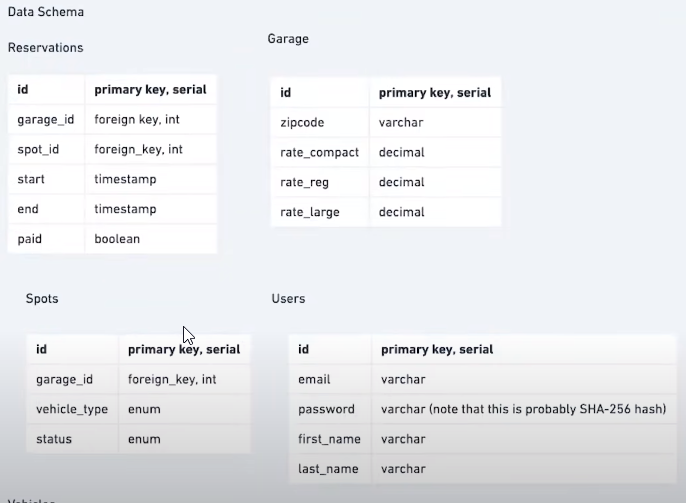

**Availabability**: 99s, 999's
**Latency:** 1-3 seconds
**Throughput:** 
**Scale:** How many customers
**Customer base:** majorly US, India

**UI Static:** Blob Store(S3), CDN to serve-CloudFlare
Load Balancer: 
Access Control: 
Caching: 
	Client Side caching \ Server side caching, 
	Cache Eviction policy
Database design:
Database per region:
	asynchronous replication
Code Execution policy:
	Rate limiting Policy: simple Key value store using Redis
workers: Horizontally scalable
Logging: 

------

Product requirements
public endpoints
Internal endpoints
Database design
High level architecture
	High consistency: More read than writes

horizontal shard postgres database based on userid
have a pub\sub queue for each set of user ids
**Database sharding:**
	Hot spots, shards replication, 
**Load Balancers:**
	
**Map Reduce:**
	
	

