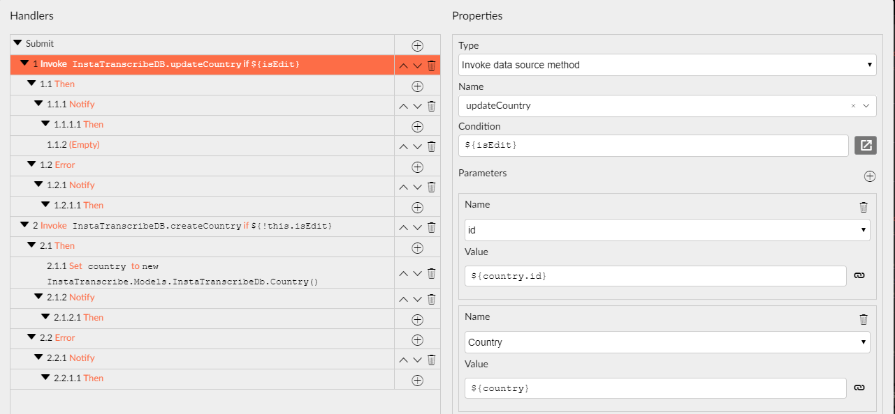
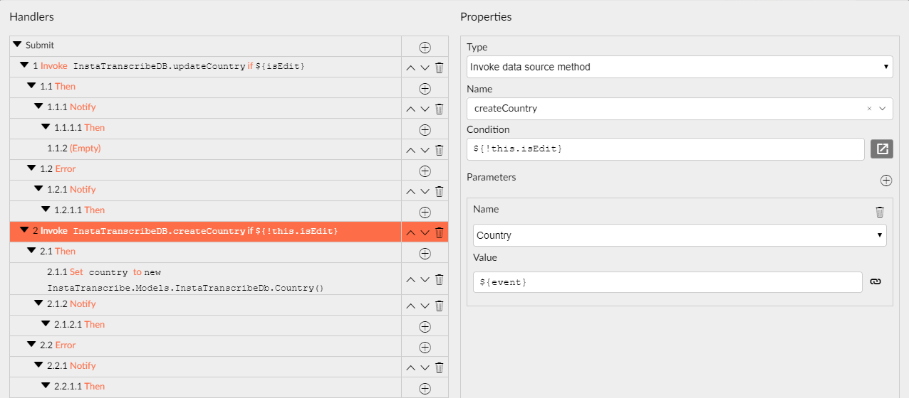

# Expressions

Expressions are snippets enclosed in a `${}` block. Radzen uses expressions to display a suggestion list of the available properties (page properties and implicit properties).

Here are a few examples:

- `${event.OrderID}` - access a property of the event argument
- `${getOrdersResult}` - get the value of the `getOrdersResult` page property
- `${DateTime.Now}` - use C# code to initialize a new Date object
- `${parameters.ID}` - get the `ID` page parameter
- `${Security.IsInRole("Admin")}` - check if the current user is a member of the `Admin` role.

You can use expressions in the event editor (when handling events) and the property grid (when setting component properties).

## [Implicit properties](https://www.radzen.com/documentation/blazor/expressions/#implicit-properties)

Radzen provides context specific (a.k.a. implicit) properties in its suggestion box. Those provide context-aware info - event argument, page parameters, template data item.

### [event](https://www.radzen.com/documentation/blazor/expressions/#event)

The `event` implicit property is available in the event editor. It represents the argument of the current event. For example the `RowClick` event of the DataGrid provides the current data item as `${event}`. Thus one can access the data item properties like this `${event.OrderID}`.

### [result](https://www.radzen.com/documentation/blazor/expressions/#result)

The `result` implicit property is available in the **Then** and **Error** events of the **Invoke data source method**, **Invoke method**, **Execute C#** and **Open Dialog** actions. It represents the result of the action. You can access the properties of the result like this `${result.value}`.

### [data](https://www.radzen.com/documentation/blazor/expressions/#data)

The `data` implicit property is available in component templates. It represents the current data item. Again you can access the properties of the template data item like this `${data.OrderID}`.

### [parameters](https://www.radzen.com/documentation/blazor/expressions/#parameters)

The `parameters` implicit property contains the parameters which the current page has been open with (either via the **Open dialog** or **Navigate to page** actions). Each parameter is available as a property of `parameters` - `${parameters.ID}`.

### [Security](https://www.radzen.com/documentation/blazor/expressions/#security)

The `Security` implicit property is a reference to the Radzen [Security service](https://www.radzen.com/documentation/blazor/security-api/#security-methods).

## [Using code in expressions](https://www.radzen.com/documentation/blazor/expressions/#using-code-in-expressions)

You can use C# code in expressions: `${getOrdersResult.Take(10)}`, `${data.Name.ToLower()}`.

## [Omitting the `${}` block](https://www.radzen.com/documentation/blazor/expressions/#omitting-the--block)

One can omit the `${}` block of an expression it but has to be careful. Blazor uses a special syntax for component properties - all page properties should be prefixed with `@` - `@getOrdersResult`. To be on the safe side prefer using `${}` which Radzen knows how to transform for the right target - .cs or .razor file.

==**Query Builder:** String values must be quoted e.g. `"${stringProperty}"` or `"test"`. Date-time values can be picked with date-picker. You can use expressions (`${}`) to specify values.==

**Add\Edit in same screen:**

