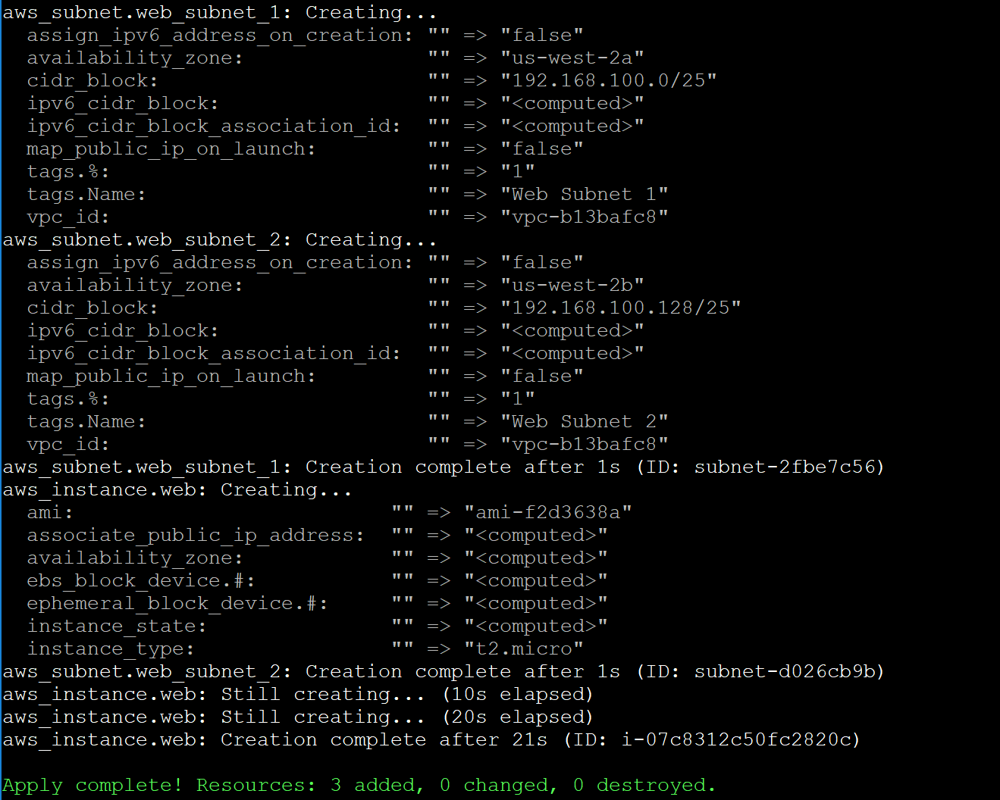

**Creating an AWS Resource with Terraform**

### Introduction

Terraform is an [open-source project](https://github.com/hashicorp/terraform) maintained by HashiCorp for building, changing, and combining infrastructure safely and efficiently. Some of the benefits of using Terraform to provision and manage infrastructure include:

- Version-controlled infrastructure as code
- Multi-cloud support with over 100 providers including Amazon Web Services, Microsoft Azure, and Google Cloud Platform
- Separate plan and apply stages so you can verify changes to your infrastructure before they happen
- A public registry of modules that make provisioning common groups of resources easy

HashiCorp also provides enterprise versions of Terraform that provide additional features for collaboration, infrastructure policy, and governance. The enterprise versions are built on top of the open-source version. What you learn in Cloud Academy Labs that use the open-source version applies to enterprise versions as well.

In this Lab Step, you will install Terraform on a Linux virtual machine. HashiCorp releases individual Terraform binaries making the installation process a breeze.

### Instructions

\1. Download a release package:

[**Copy code**](https://cloudacademy.com/lab/create-aws-resources-with-terraform/installing-terraform/?context_id=284&context_resource=lp#)

```
wget https://releases.hashicorp.com/terraform/1.0.1/terraform_1.0.1_linux_amd64.zip
```

This Lab uses version 1.0.1 of Terraform to ensure consistent behavior even as newer versions are released. The most recent version of Terraform for all platforms can be found on [Terraform's downloads page](https://www.terraform.io/downloads.html).

\2. Extract the zip archive containing the Terraform binary to the `/usr/local/bin` directory:

[**Copy code**](https://cloudacademy.com/lab/create-aws-resources-with-terraform/installing-terraform/?context_id=284&context_resource=lp#)

```
sudo unzip terraform_1.0.1_linux_amd64.zip -d /usr/local/bin/
```


`/usr/local/bin` is included in the PATH environment variable allowing you to run `terraform` from any directory.

 

\3. Remove the release package:

[**Copy code**](https://cloudacademy.com/lab/create-aws-resources-with-terraform/installing-terraform/?context_id=284&context_resource=lp#)

```
rm terraform_1.0.1_linux_amd64.zip
```

 

\4. Confirm **Terraform** version **1.0.1** is installed:

[**Copy code**](https://cloudacademy.com/lab/create-aws-resources-with-terraform/installing-terraform/?context_id=284&context_resource=lp#)

```
terraform version
```


 

### Summary

In this Lab Step, you installed Terraform into a directory available in your PATH. You will use the binary in upcoming Lab Steps.

### Introduction

Terraform uses a plugin architecture to manage all of the resource providers that it supports. No providers are included when you first install Terraform. You declare which providers you need to use in a configuration file. Terraform configuration files have a *.tf* file extension. The configuration is written using HashiCorp Configuration Language (HCL). HCL attempts to strike a balance between human- and machine-readability. JavaScript Object Notation (JSON) can also be used but is discouraged because it is less human-readable and doesn't support commenting.

Terraform includes an initialization command that reads the providers in a configuration and downloads the appropriate provider plugin. You will see how all of this works in this Lab Step.

### Instructions

\1. Make a directory for organizing your Terraform configuration, and change into it:

[**Copy code**](https://cloudacademy.com/lab/create-aws-resources-with-terraform/configuring-providers-terraform/?context_id=284&context_resource=lp#)

```
mkdir infra && cd infra
```

\2. Create a Terraform configuration file declaring the [AWS provider](https://www.terraform.io/docs/providers/aws/index.html#argument-reference):

cat > main.tf <<EOF
terraform {
  required_providers {
    aws = {
      source  = "hashicorp/aws"
      version = "3.48.0"
    }
  }  
}
provider "aws" {
	==#region is only required argument for `aws` provider. An example of an optional argument for the AWS provider is `access_key` and `secret_key` credentials.==
  region = "us-west-2" # Oregon
}
EOF

==The configuration file contents are wrapped between the **EOF** delimiters.== Each block is defined using curly braces `{ }`. Take note of the following aspects of the configuration:

- ==The `terraform` block contains a `required_providers` object with `aws` defined.==
- ==The `source` location defines the address of the provider you intend to use.==
- ==The `version` constraint defines the specific provider version.==
- ==The `provider` keyword is followed by the name of the provider you want to use.==
- ==The name `aws` is a string and all strings must be enclosed in double-quotes in HCL.==
- ==Argument values are assigned using an equal sign `=`.== 
- ==Any text following a `#` is a comment==

==The `region` is the only required argument for the `aws` provider. An example of an optional argument for the AWS provider is `access_key` and `secret_key` credentials. Because you are using an EC2 instance to run Terraform, Terraform is able to use the IAM instance profile to authenticate any requests to AWS.== 

\3. Initialize the working directory by running the `init` command:

==terraform init==


In addition to downloading referenced providers, the `init` command downloads any referenced modules from the Terraform registry when modules are included in the configuration.

 

\4. List all of the directories to see what the `init` command has created:

[**Copy code**](https://cloudacademy.com/lab/create-aws-resources-with-terraform/configuring-providers-terraform/?context_id=284&context_resource=lp#)

```
ls -A
```


==The .**terraform** directory stores the downloaded AWS provider plugin== in **.terraform/providers/registry.terraform.io/hashicorp/
aws/3.48.0/linux_amd64/**:


 The **.terraform** directory will also store any other data terraform needs later on for managing your infrastructure.

### Summary

In this Lab Step, you configured the AWS Terraform provider. You use the `init` command to download the AWS provider plugin. With the plugin downloaded, you are now able to manage resources provided by the provider.

### Introduction

The AWS Terraform provider allows you to manage resources in AWS. You can create resources provided by a provider by adding resource blocks to Terraform configuration files. The syntax of a resource block resembles the following:

[**Copy code**](https://cloudacademy.com/lab/create-aws-resources-with-terraform/creating-aws-resource-terraform/?context_id=284&context_resource=lp#)

```
resource "resource_type" "identifier" {
  argument1 = value1
  argument2 = value2
}
```

The resource_type is a type of resource provided by the provider. The name of the provider of the resource type is always the first part and is a string type. For example, AWS resources all have types beginning with `aws_`. A list of all supported resource types for the AWS provider is available in the sidebar of the [AWS provider page](https://www.terraform.io/docs/providers/aws/index.html). The `identifier` is used within Terraform to identify the resource.

To demonstrate how to create a resource with the AWS provider, you will create an Amazon Virtual Private Cloud (VPC) resource using Terraform in this Lab Step.

### Instructions 

\1. Append an `aws_vpc` resource block to your **main.tf** Terraform configuration file:

[**Copy code**](https://cloudacademy.com/lab/create-aws-resources-with-terraform/creating-aws-resource-terraform/?context_id=284&context_resource=lp#)

```
cat >> main.tf <<EOF

resource "aws_vpc" "web_vpc" {
  cidr_block = "192.168.100.0/24"
  enable_dns_hostnames = true

  tags = {
    Name = "Web VPC"
  }
}
EOF
```

- The `cidr_block` is the only required argument for an `aws_vpc` resource.
- The `enable_dns_hostnames` and `tags` arguments are both optional and demonstrate a boolean value (`true`), and a mapping that includes the `Name` key.

The full list of arguments for the `aws_vpc `resource type is provided on the [resource's information page](https://www.terraform.io/docs/providers/aws/r/vpc.html). 

\2. Issue the `apply` command to have Terraform generate a plan that you can review before actually applying:

==terraform apply==


The Terraform **plan** is output and indicates the number of resources to **add**, **change**, or **destroy**. The plan details use the following symbols for each type of action:

- **+**: Add
- **-**: Destroy
- **~**: Change

The **+ aws_vpc.web_vpc** action lists all of the *attributes* of the resource. The resource attributes are values that you can reference after the resource is created. Some values are known in advance because you specified them as arguments to the resource, or because they have default values, such as **enable_dns_support**. The values that are known after the resource is created are given the placeholder value of **<computed>**.

\3. Accept and apply the execution plan by entering *yes* at the prompt.

The following confirmation output is displayed:


 

The **a****pply** command is **complete** **after 1** second. The **ID** of the VPC is also given in parentheses.

\4. Use the AWS command-line interface (CLI) to confirm that the VPC has been created with the arguments you specified:

aws ec2 describe-vpcs --region us-west-2 --filter "Name=tag:Name,Values=Web VPC"


The AWS CLI describe-vpcs command you entered lists all of the VPCs in the us-west-2 region with a Name tag that has a value of Web VPC. You can confirm that the **Name** tag has a **Value** of **Web VPC**, and the **CidrBlock** is **192.168.100.0/24**.

 

\5. Enter the following command to determine if DNS hostnames support is enabled for the VPC:

aws ec2 describe-vpc-attribute --region us-west-2 --attribute enableDnsHostnames --vpc-id <VPC_ID>

where you should replace *<VPC_ID>* with the value of the **VpcId** property in the output of the previous command. The value will resemble **vpc-xxxx1234**. The output confirms that the DNS hostname support has been enabled as you specified in the Terraform configuration:


 

### Summary

In this Lab Step, you created a VPC resource using the AWS provider. You observed the two-phase plan and apply a strategy that Terraform uses to avoid unintentional changes. You would follow the same approach for any other resource type. The available resource types and arguments are available from the [AWS provider documentation](https://www.terraform.io/docs/providers/aws/index.html). Other Cloud Academy Labs cover the topics of changing and destroying resources.

------

[Manage AWS Resources with Terraform](https://cloudacademy.com/lab/manage-aws-resources-terraform/?context_id=284&context_resource=lp)

**Connecting to the Virtual Machine using SSH**

### Introduction

In this Lab Step, you will employ a Secure Shell (SSH) client to connect to a remote Linux server. SSH is a cryptographic network protocol for securing data communication. SSH establishes a secure channel over an unsecured network. Common applications include remote login and remote command execution. You should use the user name of **ec2-user** when connecting to the VM.

*Note*: If you are connecting to an instance automatically created by the Cloud Academy Lab environment, it can take a few minutes to appear. If the instance is not visible, please refresh after a minute or two until it appears.

 

### Instructions

**Downloading the appropriate key pair**

If you are using Linux or macOS, download the Privacy-enhanced Electronic Mail (**PEM**) key pair automatically generated by the Cloud Academy platform. If you are using Windows, download the PuTTY Private Key (**PPK**) key pair. Both the PEM and PPK are available in the **Credentials** section in the upper-left corner of this lab.

*Note*: [Cloud Academy enterprise accounts also provide an enterprise bridge feature](https://support.cloudacademy.com/hc/en-us/articles/360044562991) that allows you to bypass corporate network and software installation policies that may otherwise prevent you from completing this lab step.

###  

**Locating the virtual machine IP address**

\1. In the AWS Management Console search bar, enter *EC2*, and click the **EC2** result under **Services**:


 

\2. In the left-hand menu, click **Instances**:


The **Instances** list page will load.

 

\3. Select the target virtual machine and look for the **Public IPv4 address** field:


The IP address is displayed in the **Networking** tab and as a column in the **Instances** list.

 

\4. To copy the **Public IPv4 address**, next to the IP address, click the copy icon:


The public IP address of the instance has been copied to your clipboard.

*Note*: If you are connecting to an instance automatically created by the Cloud Academy Lab environment, it can take a few minutes to appear. If the instance is not visible, please refresh every minute or two until it appears.

 

\5. Paste the IP address somewhere you can easily retrieve it.

In a moment you will use it to connect to the instance.

Cloud Academy recommends using a draft email to temporarily store notes during a lab.

###  

**Connecting using Linux/macOS**

Linux distributions and macOS include a SSH client that accepts standard PEM keys. Complete the following steps to connect using the included terminal applications:

a. Open your terminal application. If you need assistance finding the terminal application, search for *terminal* using your operating system's application finder or search commands.

 

b. Enter the following command and press *Enter*:

==ssh -i /Path/To/Your/KeyPair.pem AMIUserName@YourIPv4Address==

where the command details are:

*ssh* initiates the SSH connection

*-i* specifies the identity file

/*Path*/*To*/*Your*/*Keypair.*pem specifies the location and name of your key pair. An example location might be /*Home*/*YourUserName*/*Downloads*/*KeyPair*.pem.

*AMIUserName* specifies the SSH user:

For the Amazon Linux Amazon Machine Image (AMI), a standard SSH user is *ec2-user*.
For Ubuntu images, a standard SSH user is *ubuntu*. 
For CentOS images, a standard SSH user is *centos*. 
For Debian images, a standard SSH user is *admin*.
For Red Hat 6.4 and later images, a standard SSH user is *ec2-user*.

*YourIPv4Address* is the IPv4 address noted earlier in the instructions.

*Note*: Your SSH client may refuse to start the connection due to key permissions. If you receive a warning that the key pair file is unprotected, you must change the permissions. Enter the following command and try the connection command again:

[**Copy code**](https://cloudacademy.com/lab/manage-aws-resources-terraform/connecting-to-the-virtual-machine-using-ssh/?context_id=284&context_resource=lp#)

```
chmod 600 /Path/To/Your/KeyPair.pem
```

 

c.  After successfully connecting to the virtual machine, you should reach a terminal prompt similar to the one shown in the image below.

*Note*: If you receive a warning that the host is unknown, enter *y* or *yes* to add the host and complete the connection.


 

**Connecting using Windows**

Windows does not include an SSH client; you must download an application that includes one. A free, and useful utility, is called PuTTY. PuTTY supports SSH connections, as well as key generation and conversion. Download PuTTY at [http://www.putty.org](http://www.putty.org/). Complete the following steps to use PuTTY to create an SSH connection.

a. Open PuTTY and insert the IPv4 public IP address in the **Host Name (or IP address)** field.


 

b. Navigate to the **Connection** > **SSH** > **Auth** section. Select the PPK key pair you downloaded earlier, and click **Open**.


 

c. Wait several seconds for the authentication prompt. Enter the SSH username for the virtual machine operating system, such as *ec2-user* for Amazon Linux, and press *Enter*.

Additional example SSH usernames include:

For Amazon Linux, a standard SSH user is *ec2-user*.
For Ubuntu images, a standard SSH user is *ubuntu*.
For CentOS images, a standard SSH user is *centos*.
For Debian images, a standard SSH user is *admin*.
==For Red Hat 6.4 and later images, a standard SSH user is *ec2-user*.==

 Summary

In this Lab Step, you connected to a virtual machine using an SSH client. 

# Importing an AWS Resource into Terraform

### Introduction

Terraform keeps track of the infrastructure it manages by maintaining *state*. The state information contains what is needed to map between real-world infrastructure and configuration files along with other metadata. By default, the state is stored in a file called terraform.tfstate. To facilitate collaboration, [the state can also be stored on a remote server](https://www.terraform.io/docs/state/remote.html), but this is outside of the scope of this Lab.

When you create resources with Terraform, the state is automatically maintained. But you can also import existing infrastructure so that it can be managed by Terraform. This is useful for migrating your infrastructure management to Terraform and recovering from accidental deletion of a state file. The `import` command is used to map existing resources into the Terraform state. As of version 0.11.3, the corresponding configuration for the imported resource must be created manually. Future versions will automatically generate a configuration from the imported resource. Many resources can be imported, but [not all resources can be imported](https://www.terraform.io/docs/import/importability.html). Lastly, resources must be imported one at a time, but future versions will support bulk importing.

In this Lab Step, you will use the import command to bring an existing VPC under the control of Terraform and verify its addition to the Terraform state. 

### Instructions 

\1. Change into the **infra** directory which includes a Terraform configuration and initialized working directory:

[**Copy code**](https://cloudacademy.com/lab/manage-aws-resources-terraform/importing-aws-resource-terraform/?context_id=284&context_resource=lp#)

```
cd infra
```

 

\2. List all the files in the directory:

[**Copy code**](https://cloudacademy.com/lab/manage-aws-resources-terraform/importing-aws-resource-terraform/?context_id=284&context_resource=lp#)

```
ls -A
```


The listing has two entries:

1. **main.tf**: A Terraform configuration file
2. **.terraform**: A directory created by the `init` command that includes the AWS Terraform provider plugin

Also, observe that ==there is no **terraform.tfstate** file, indicating that Terraform is not currently managing any resources.==

\3. ==View the contents of the **main.tf** configuration file:==

==more main.tf==


If not all of the output fits on the terminal at once, press space bar to tell `more` to display the next page until all the contents have been displayed. The configuration declares the use of the `aws` provider and an Amazon Virtual Private Cloud (VPC) with a name of **Web VPC**. 

\4. Use the AWS command-line interface (CLI) to verify that a VPC with the `Name` tag set to Web VPC already exists:

[**Copy code**](https://cloudacademy.com/lab/manage-aws-resources-terraform/importing-aws-resource-terraform/?context_id=284&context_resource=lp#)

```
aws ec2 describe-vpcs --region us-west-2 --filter "Name=tag:Name,Values='Web VPC'"
```


A JavaScript Object Notation (JSON) representation of the VPC is output. The **Name** tag and **Web VPC** value are included in the **Tags** property along with tags generated during the Cloud Academy Lab start-up phase. You can also confirm the **CidrBlock** matches the one in the configuration file. Also, note the **VpcId** which you will use to import the resource to Terraform's management.

\5. ==Import the VPC into Terraform's state==

==terraform import aws_vpc.web_vpc <VpcId>==

where you replace *<VpcId>* with the value of the **VpcId** output by the previous command. The value of **VpcId** will be similar to vpc-abcd1234. The `aws_vpc.web_vpc` is referred to as the address of the resource and is formed by joining the resource type and identifier of the resource in the configuration file. Output similar to the following is displayed:


 

\6. List the files in the current directory:

ls


Terraform has created the **terraform.tfstate** file to keep track of the resource it has imported.

 

\7. View the contents of the state file:

more terraform.tfstate


In the middle of the output is the **resources** property which includes the **aws_vpc.web_vpc** resource. The **primary.attributes** property includes all of the attributes Terraform stores for the resource. By keeping the attributes in the state, Terraform doesn't always need to send requests to the provider to query the attribute values. ==You shouldn't modify the state file directly. When you modify a configuration, Terraform can compare the configuration to the state to determine if any resource needs to be updated.==

 

\8. ==Use the `show` command to show the attributes in the state file:==

==terraform show==


 

\9. ==Show the available `state` subcommands for working directly with the state:==

[**Copy code**](https://cloudacademy.com/lab/manage-aws-resources-terraform/importing-aws-resource-terraform/?context_id=284&context_resource=lp#)

```
terraform state
```


The state subcommands are mainly for advanced scenarios. ==If you ever have to work directly with state, you should make use of these subcommands instead of editing the state file.==

 

\10. ==Use the state show subcommand to show the attributes of the web_vpc managed by Terraform:==

[**Copy code**](https://cloudacademy.com/lab/manage-aws-resources-terraform/importing-aws-resource-terraform/?context_id=284&context_resource=lp#)

```
terraform state show aws_vpc.web_vpc
```


 

### Summary

In this Lab Step, you learned about Terraform state and imported an existing resource into Terraform's state. Importing is useful for migrating existing resources to be managed by Terraform. Imported resources should be managed exclusively by Terraform and not modified outside of Terraform. For example, modifying the Web VPC in the AWS portal would create an inconsistency between the state stored by Terraform and the actual resource. Terraform will update the state whenever you use `apply`, detect the change, and modify the resource to bring it back to the desired state described in the configuration.

# Creating an EC2 Instance with Terraform

### Introduction

In this Lab Step, you will create an EC2 instance inside of the VPC managed by Terraform. You will also create subnets as a requirement for creating an EC2 instance in a VPC. In doing so, you will become familiar with two features of Terraform configuration:

1. [Interpolation syntax](https://www.terraform.io/docs/configuration/interpolation.html), and
2. Implicit dependencies.

==Interpolation== syntax allows you to do several things, but what is important in this Lab Step ==is the ability to reference resource attributes in a configuration file.== Interpolation is used within strings being assigned argument values in a configuration. The basic ==syntax for interpolating attribute values is: ${resource_type.identifier.attribute}==

Terraform provides an interactive console for experimenting with interpolations before using them in a configuration. You can access the console by running the `console` command. However, this Lab Step will provide you with the interpolations you need.

A resource that interpolates attribute values from another resource, is said to depend on that other resource. The dependencies create an order for creating and updating resources. Terraform uses interpolation references to determine the dependencies automatically. This is referred to as an implicit dependency. You can explicitly add a depends_on argument for situations where a dependency isn't implicitly captured. But you should not include an explicit dependency when an implicit dependency exists. This makes configurations more maintainable.

### Instructions 

\1. Add a couple of subnets to the Terraform configuration:

cat >> main.tf <<'EOF'
resource "aws_subnet" "web_subnet_1" {
	==#use interpolation syntax to obtain the Web VPC ID==
  ==vpc_id            = "${aws_vpc.web_vpc.id}"==
  cidr_block        = "192.168.100.0/25"  
   availability_zone = "us-west-2a"
  tags {
    Name = "Web Subnet 1"
  }
}
resource "aws_subnet" "web_subnet_2" {
  vpc_id            = "${aws_vpc.web_vpc.id}"
  cidr_block        = "192.168.100.128/25"  
  availability_zone = "us-west-2b"
  tags {
    Name = "Web Subnet 2"
  }
}EOF

The subnets `vpc_id` argument use interpolation syntax to obtain the Web VPC ID. Attributes for a resource are listed on the Terraform docs page for the resource. For example, [the attributes for AWS VPCs are listed here](https://www.terraform.io/docs/providers/aws/r/vpc.html#attributes-reference). To keep the configuration minimal, the subnets will be private subnets only accessible inside the VPC. That is, you won't add an internet gateway and modify route tables to make the instances accessible over the internet. The two subnet configurations have a lot of duplication. You will see how to avoid duplication in configurations in the next Lab Step.

\2. Add an EC2 instance to the first subnet in the configuration:

cat >> main.tf <<'EOF'
resource "aws_instance" "web" {
  ami           = "ami-0fb83677"
  instance_type = "t2.micro"  
  subnet_id     = "${aws_subnet.web_subnet_1.id}"    
  tags {
    Name = "Web Server 1"
  }}EOF
The `subnet_id` is set using interpolation syntax to the ID of the first web subnet. Terraform is able to determine the order it needs to create the resources to be able to use the interpolate the values. Particularly, `web_subnet_1` must be created before `web`, and `web_vpc` must be created before both `web_subnet_1` and `web_subnet_2`.

\3. Plan and apply the changes using the `apply` command:

terraform apply


Note that ==the first action Terraform takes is to **Refreshing state**. That is so Terraform can detect if the VPC resource has diverged from the desired state described in the configuration.== In this case, the actual state matches the desired state for the VPC resource and no changes are required. After that, three resources that will be added are listed. 

\4. Enter *yes* to accept the execution plan, and create the resources:



Observe the order that the resources were created in and verify they follow the implicit dependencies in the configuration file.

\5. View the Terraform state file to see that the implicit dependencies have been stored in the state:

more terraform.tfstate

```

```


The **depends_on** property lists all dependencies of a resource. In the above image, the dependence of the **web** instance on **web_subnet_1** is shown. The `graph` command visualizes the dependency graph created by all of the dependencies. The graph for the current configuration is as follows:


If you want to learn more on the graph command, follow [this link](https://www.terraform.io/docs/commands/graph.html).

### Summary

In this Lab Step, you created an EC2 instance using Terraform. You learned how to use interpolation syntax in a Terraform configuration file to reference resource attributes and implicitly create dependencies between resources. You also observed the dependency graph generated by the `graph` command.

# Using Variables to Generalize Terraform Configuration

### Introduction

You have seen how interpolation can access resource attributes inside of a configuration. Another use case of interpolation is accessing input variables. You can define variables in the same configuration file, by passing them as command-line arguments, by entering them interactively when running the `apply` command, using environment variables, or in variable files. This Lab uses a separate variable file because having separate variable files keep the configuration organized and are easy to version control.

You can define strings, numbers, booleans, list, and map variable types. You will see examples of each in this Lab Step. ==To reference variables within a configuration, you use the following syntax:== 

==${var.variable_name}==

At this point it is worth mentioning that a feature of interpolation is that, within the braces, you can you can perform basic mathematical operations use a variety of built-in functions. Built-in functions can concatenate strings, return a specific element in a list, lookup map values, and much more. [The full list of built-in functions is available at this link](https://www.terraform.io/docs/configuration/interpolation.html#built-in-functions).

Terraform also supports output variables. Output variables allow you to have Terraform interpolate and save values after running `apply`. You will see how to use input and output variables to generalize and better organize the configuration you created in the last Lab Step. This time you will create two subnets in different availabilty zones, as before, but also two instances in different subnets.

### Instructions 

\1. Delete the configuration changes you made in the last Lab Step:

sed -i '/.*web_subnet_1.*/,$d' main.tf
This deletes all the lines in the configuration file starting from the line that declares `web_subnet_1`.

\2. Apply the configuration changes to realize the new desired state with the subnets and instance removed, and enter *yes* when prompted:

terraform apply


 

\3. Create a variable file named **variables.tf**:

cat > variables.tf <<'EOF'
#Example of a string variable
variable network_cidr {
  default = "192.168.100.0/24"
}
#Example of a list variable
variable availability_zones {
  default = ["us-west-2a", "us-west-2b"]
}
#Example of an integer variable
variable instance_count {
  default = 2
}
#Example of a map variable
variable ami_ids {
  default = {
    "us-west-2" = "ami-0fb83677"
    "us-east-1" = "ami-97785bed"
  }
}
EOF

The `default` value for each variable is used unless overridden. ==You can use the `validate` command to check for any syntax errors when writing your own variable files.==

\4. Add the following configuration that uses the variables to dynamically create subnet and instance resources:

cat >> main.tf <<'EOF'
	resource "aws_subnet" "web_subnet" {  
	#Use the count meta-parameter to create multiple copies  
	count             = 2
	vpc_id            = "${aws_vpc.web_vpc.id}"  
	#cidrsubnet function splits a cidr block into subnets
  	cidr_block        = "${cidrsubnet(==var.network_cidr==, 1, count.index)}"  
	#element retrieves a list element at a given index  
	availability_zone = "${element(==var.availability_zones==, count.index)}"
	tags {
    	Name = "Web Subnet ${count.index + 1}"
	}
}
resource "aws_instance" "web" {  
	count         = "${var.instance_count}"
	#lookup returns a map value for a given key  
	ami           = "${lookup(==var.ami_ids==, "us-west-2")}"
	instance_type = "t2.micro"  #Use the subnet ids as an array and evenly distribute instances  
	subnet_id     = "${element(aws_subnet.web_subnet.*.id, count.index % length(aws_subnet.web_subnet.*.id))}"    
	tags {
		Name = "Web Server ${count.index + 1}"
  }}EOF

The `count` metaparameter allows you to create multiple copies of a resource. Interpolation using `count.index` allows you to modify the copies. `index` is zero for the first copy, one for the second, etc. For example, the instances are distributed between the two subnets that are created by using count.index to select between the subnets. There is no duplication between resources compared to the configuration in the last Lab Step.

\5. Create an output variable file called outputs.tf that 

cat > outputs.tf <<'EOF'
output "ips" {
  #join all the instance private IPs with commas separating them
  value = "${join(", ", aws_instance.web.*.private_ip)}"
}
EOF

When you run `apply`, Terraform loads all files in the directory ending with .tf, so both input and output variable files are loaded.

\6. ==View the execution plan by issuing the apply command:==

==terraform apply==
You can verify some interpolation results in the plan. For example, the **availability_zone**, **cidr_block**, and **tags.Name** of the subnets:

 

 

\7. Enter *yes* at the prompt to apply the execution plan to create the resources.

 In the output you can see the instances are created in different subnets:


The output variables are shown at the end of the output:


 

\8. ==Use the `output` command to retrieve the ips output value:==

==terraform output ips==


Creating outputs is more convenient than sifting through all the state attributes, and can make integration with automation scripts easy.

### Summary

In this Lab Step, you used input variables and built-in interpolation functions to create a pair of subnets in different availability zones, and a pair of instances in different subnets. You also used an output to make retrieving the IP addresses of the instances easy. You separated the input and output variables into different files to organize the configuration.