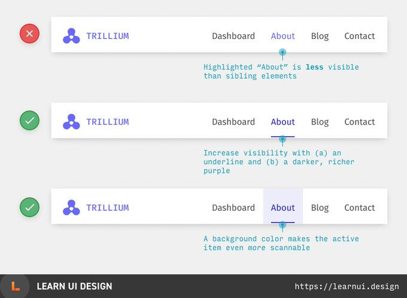
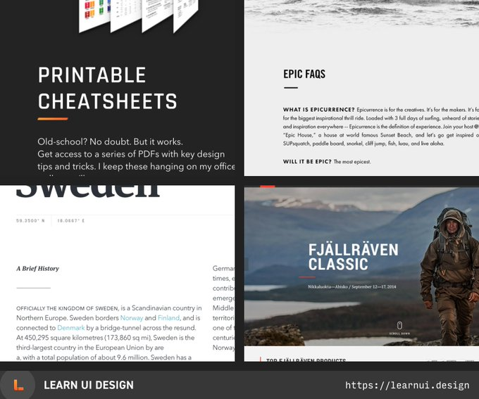
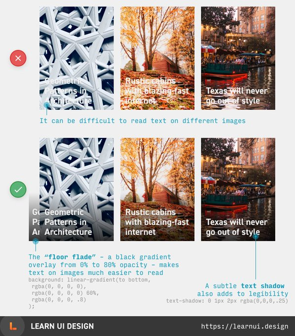
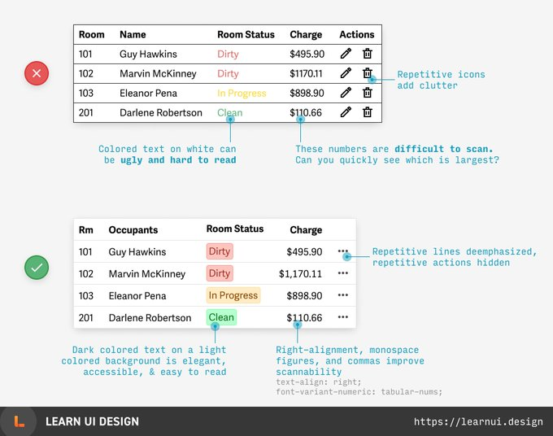

Color is a great way to show which element is selected, but if your brand color is lighter than the default text color, you need to attract attention in other ways.

“Tiny underlines” are a dead-simple detail to spice up text that might otherwise look boring.

Text on images can be hard to read! Try using a floor fade – a gradient overlay from 0% to ~70% opacity black at the bottom of the image. Then use white text, and add a subtle shadow for extra readability.

The 80/20 of branding is to know the 4 most common brand types. Compare the images to understand how they’re communicated with fonts, colors, copy, and more. (4/50)

Tips for designing tables: (1) Lighten or remove repeating elements to reduce clutter (2) Right-align numbers that are digit-for-digit comparable (using monospace figures) (3) Avoid ugly, inaccessible colored text (5/50)

[

