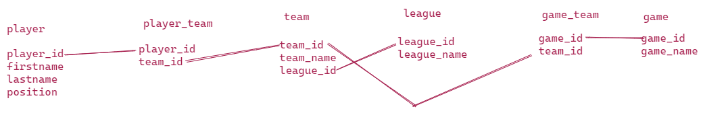

https://leetcode.com/discuss/interview-experience/304327/wayfair-senior-engineer-interview

### Phone Screen

Given 2 tables Employees(id, dept_id, salary, name) and department (id, name).
==a. find the dept id with the max salary and number of employees==

==create table employees(id int, dept_id int, salary int, name varchar(max));==
==create table department(id int, name varchar(max));==
==insert into employees values(1,10, 1000, 'ajit');==
==insert into employees values(2,10, 2000, 'Meetha');==
==insert into employees values(3,20, 3000, 'Sachi');==
==insert into employees values(4,20, 4000, 'Rishi');==
==insert into employees values(5,20, 5000, 'Ramu');==
==insert into department values(10, 'Department1');==
==insert into department values(20, 'Department2');==
 ===> select a.name, b.max_salary,b.no_of_employees from department a,== 
==(select b.id, max(salary) 'max_salary', count(a.id) 'no_of_employees' from employees a, department b where a.dept_id=b.id group by b.id) b==
==where a.id=b.id==

==b. find the dept name with max salary and number of employees==
==c. find the dept name with no employees==
===> select name from department where id not in (select dept_id from employees)==

Given a phone pad as below. List out all the phone numbers that can be made with 7 digits. The method of generating the numbers would be the movement of a rook. It can move vertically and horizontally by any number of steps.
1 2 3
4 5 6
7 8 9

## Onsite

#### Round 1

design four square or check-in based system.

### Round 2

Design Roulette(Object Oriented Desgin) and implement how much a user could win based on previous results. For eg if after 4 reds there will always be a black. How to use this information to determine how much will a user win.

### Round 3

Sports league database design. players are employees, belong to multiple teams, team belongs to league, games are played between teams.
Query for all teams and leagues that a player given first and last name belongs to.
Query all players on al teams that play at a particular position
query all players that are not on a team.



### Round 4

describe your past projects etc.
describe a time when you had an underperforming colleague.
describe a time when you had to disagree with a colleague.
describe a time when you had to convince a client that your approach is correct.
why wayfair

------

https://leetcode.com/discuss/interview-experience/282167/wayfair-software-engineer-interview

I recently went through a Wayfair interview and wanted to contribute the questions I faced which can be helpful to others who are preparing.
Note: Wayfair is a large company and your interview panel may be completely different since you might be interviewed for a different team. For the reference I was interviewed for their Supply chain and Engineering Team aka Transportation team.

**Technical Phone Interview:**
Given an array of weights and a target weight find if the array contains two values that are equal to the target weight.
eg: [1 2 5 6 9], Target 10 : true

**Follow up Questions:**

1. What are some other ways you can solve this problem?
2. Could you write some test cases for your logic?
3. How can you get the input if it is too large?

5-7 SQL questions on topics like
JOINS (Different types of JOINS), GROUP BY & HAVING CLAUSE on sample data provided by the interviewer

**On-site Interview : Boston, MA**

**Four rounds:**

**First round:**
1.Cultural Fit: Tell me a situation where you have developed a scrappy solution?
\2. Why Wayfair and what do you know about Wayfair?
\3. Tell me a difficult technical problem that you have faced in your career and how did you solve it?

**Second Round:**
Design classes and Interfaces for Automated Parking Garage (Object Oriented Design)

**Third Round:**
Design a Checkin Application similar to Instagram where you can able to tag places (System Design)

**Fourth Round:**
Netflix/ImDb Database Design

------

##### Wayfair Karat Interview | 20 mins Scenario Based System Design

**Position**: Senior Software Engineer (Wayfair L4)
**Location**: Boston, MA
**Interview format**: Live Coding interview with a third party interviewing company called Karat, which companies like Wayfair, Compass, etc. use for it's first technical screening. The recruiter mentioned that it would be a 45-50 minute interview, with first 20 minutes revolving around System Design design concepts, followed by coding questions. I was asked two coding questions, and roughly 5 to 6 scenario based questions on System design. I shall add the link to coding quesitons asked at the end of this post.

**Questions**:

I do not remember the exact wording of the the questions, but can give a general idea from what I remember. Roughly 5 or 6 different scenario based questions were asked revolving around system design concepts. I can roughly recall the following:

1. For the following scenarios, which would be better - Strong consistency/Eventual consistency. Explain reasons why. About 3 scenarios were given, one of which was a Banking application.
2. The interview gave a scenario for Google docs and multiple users can access the same document, and google docs uses a Round Robin load balancing approach. Do you see any issues with using such an approach.
3. One question was related to finding the max throughput of a system. It was sort of like a graph diagram, with various about 6 stages labeled A to F, and the throughput they operate on. I was asked to calculate the max throuhput of the system.
4. One question was related to a scenario where they were using a relational database, and two tables were provided with a foreign key reference. They wanted to see how we can scale such a system (I believe they were looking for data partitioning/sharding techniques that we could apply.)
5. Another scenario was something like that there was a bug on an application, and you ended up having a lot of failed requests. You have a database that stores all IDs that are there, and you also have large log files from about 500 different production servers that log the IDs of the successful requests. How would you come up with a solution to find the IDs that were missing/

Overall, a good understanding of core system design concepts such as load balancing,caching, map-reduce, throughput, etc. should be helpful to answer these questions.

**Links to coding questions asked**:

1. https://leetcode.com/discuss/interview-question/1257950/Wayfair-or-Karat-Interview-or-L4-Senior-Software-Engineer-or-Question-1-Find-Contiguous-URL-History
2. https://leetcode.com/discuss/interview-question/1257952/Wayfair-or-Karat-Interview-or-L4-Senior-Software-Engineer-or-Question-2-Find-Purchased-Users-data

**Result**: The recruiter reached out the next day to move forward to the Virtual onsite interview. Any pointers for that would be really appreciated. Thanks!

hey , can you write sample answers , points for SD questions ?

[@vikadb](https://leetcode.com/vikadb) Yes.. That's quite similar to the approaches I proposed.
For the 2nd question, I also added that a round robin approach might work in the scenario when no new servers are being added. In the case when new servers are added/removed, the load may not be properly balanced. This link can be helpful to understand it better: https://jaxenter.com/load-balancing-round-robin-164101.html

1. For the following scenarios, which would be better - Strong consistency/Eventual consistency. Explain reasons why. About 3 scenarios were given, one of which was a Banking application.

Ans : depends on the feature of the banking application . Suppose if it's about balance or anything related to money, it should be strong consistency. Suppose if the application is some thing whose current state is not super critical for further interaction and any updates currently going can be just flagged and user be presented with a stale version can be eventual consistent. Google docs, sheets , dropbox or any editing systems are best examples.

1. [Not sure] The interview gave a scenario for Google docs and multiple users can access the same document, and google docs uses a Round Robin load balancing approach. Do you see any issues with using such an approach
   Ans : if each edit and save is treat as a request, if we try each different servers at different times, may be we are getting a different version of the document itself since the changes may time to propagate across the systems .. ???
2. One question was related to a scenario where they were using a relational database, and two tables were provided with a foreign key reference. They wanted to see how we can scale such a system (I believe they were looking for data partitioning/sharding techniques that we could apply.)

Ans : we can employ vertical partitioning where we can partition the two tables on to two servers. Further, we can partition each such partition into shards (range based partitions as the size grows for each relational table). Since we have a referential integrity constraint here, some databases have solutions and some don't. So, i feel like if application layer is handling referential integrity and cleaning up any dangling references, we could proceed and partition the referenced table too (second one)
so, am proposing vertical partitioning and then range based partitioning/ directory based if each individual entity grows.

1. Another scenario was something like that there was a bug on an application, and you ended up having a lot of failed requests. You have a database that stores all IDs that are there, and you also have large log files from about 500 different production servers that log the IDs of the successful requests. How would you come up with a solution to find the IDs that were missing ?

Ans : Yes, we could definitely employ a divide and conquer kind of approach i.e map reduce.
Lets say we have three phases
Map phase : each file falls into a bucket for processing and sorts the file into pre-determined ID ranges. this range scheme can be determined based on id range of database.
re-arrange phase : Now each map file out file is mapped to a range depending on range of values it holds.
reduce : Now, we have the range figured out and map the values against the range (imagine a giant set where we mark each existing id as marked) and end output the ones that are not marked.

[@garpraveen](https://leetcode.com/garpraveen) I am not sure how my posts got deleted. It looks like Leetcode took them down.
I have the second question that I was asked, along with the solution that I had attempted.
import [java.io](http://java.io/).*;
import java.util.*;

/*
The people who buy ads on our network don't have enough data about how ads are working for their business. They've asked us to find out which ads produce the most purchases on their website.

Our client provided us with a list of user IDs of customers who bought something on a landing page after clicking one of their ads:

# Each user completed 1 purchase.

completed_purchase_user_ids = [
"3123122444","234111110", "8321125440", "99911063"]

And our ops team provided us with some raw log data from our ad server showing every time a user clicked on one of our ads:

ad_clicks = [
\#"IP_Address,Time,Ad_Text",
"122.121.0.1,2016-11-03 11:41:19,Buy wool coats for your pets",
"96.3.199.11,2016-10-15 20:18:31,2017 Pet Mittens",
"122.121.0.250,2016-11-01 06:13:13,The Best Hollywood Coats",
"82.1.106.8,2016-11-12 23:05:14,Buy wool coats for your pets",
"92.130.6.144,2017-01-01 03:18:55,Buy wool coats for your pets",
"122.121.0.155,2017-01-01 03:18:55,Buy wool coats for your pets",
"92.130.6.145,2017-01-01 03:18:55,2017 Pet Mittens",
]

//2017 Pet Mittens [3123122444, 96.3.199.11]

The client also sent over the IP addresses of all their users.

all_user_ips = [
\#"User_ID,IP_Address",
"2339985511,122.121.0.155",
"234111110,122.121.0.1",
"3123122444,92.130.6.145",
"39471289472,2001:0db8:ac10:fe01:0000:0000:0000:0000",
"8321125440,82.1.106.8",
"99911063,92.130.6.144"
]

Write a function to parse this data, determine how many times each ad was clicked, then return the ad text, that ad's number of clicks, and how many of those ad clicks were from users who made a purchase.

Expected output:

1 of 2 2017 Pet Mittens
0 of 1 The Best Hollywood Coats
3 of 4 Buy wool coats for your pets

purchases: number of purchase IDs
clicks: number of ad clicks
ips: number of IP addresses
*/
public class WayFairInterview1 {

```
public static List<String> findPurchasedUsersData(String[] completedPurchaseUsers, String[] adClicks,
        String[] allUserIps) {
    List<String> result = new ArrayList<String>();
    Map<String, List<String>> map = new HashMap<String, List<String>>();
    Map<String, String> ipUserMap = new HashMap<String, String>();
    Set<String> usersWhoMadePurchases = new HashSet<String>();
    for (String user : completedPurchaseUsers) {
        usersWhoMadePurchases.add(user);
    }

    for (String ip : allUserIps) {
        String[] splits = ip.split(",");
        ipUserMap.put(splits[1], splits[0]);
    }

    for (String adClick : adClicks) {
        String[] splits = adClick.split(",");
        String iPAddress = splits[0];
        String userID = ipUserMap.getOrDefault(iPAddress, "");
        String adText = splits[2];
        List<String> inner = map.getOrDefault(adText, new ArrayList<String>());
        inner.add(userID);
        map.put(adText, inner);
    }

    for (String key : map.keySet()) {
        int totalClicks = map.get(key).size();
        List<String> usersWhoClicked = map.get(key);
        int purchasedCount = getPurchasedCount(usersWhoClicked, usersWhoMadePurchases);
        String outputString = purchasedCount + " of " + totalClicks + "	 " + key;
        result.add(outputString);
    }

    // System.out.println(map);

    return result;

}

public static int getPurchasedCount(List<String> usersWhoClicked, Set<String> usersWhoMadePurchases) {
    int count = 0;
    for (String user : usersWhoClicked) {
        if (usersWhoMadePurchases.contains(user)) {
            count++;
        }
    }
    return count;
}

public static void main(String[] argv) {
    String[] completedPurchaseUsers = { "3123122444", "234111110", "8321125440", "99911063" };

    // "IP Address, timestamp, Ad text"
    String[] adClicks = { "122.121.0.1,2016-11-03 11:41:19,Buy wool coats for your pets",
            "96.3.199.11,2016-10-15 20:18:31,2017 Pet Mittens",
            "122.121.0.250,2016-11-01 06:13:13,The Best Hollywood Coats",
            "82.1.106.8,2016-11-12 23:05:14,Buy wool coats for your pets",
            "92.130.6.144,2017-01-01 03:18:55,Buy wool coats for your pets",
            "122.121.0.155,2017-01-01 03:18:55,Buy wool coats for your pets",
            "92.130.6.145,2017-01-01 03:18:55,2017 Pet Mittens" };

    // "User ID, IP address"
    String[] allUserIps = { "2339985511,122.121.0.155", "234111110,122.121.0.1", "3123122444,92.130.6.145",
            "39471289472,2001:0db8:ac10:fe01:0000:0000:0000:0000", "8321125440,82.1.106.8",
            "99911063,92.130.6.144" };

    System.out.println(findPurchasedUsersData(completedPurchaseUsers, adClicks, allUserIps));

}
```


}


The interview gave a scenario for Google docs and multiple users can access the same document, and google docs uses a Round Robin load balancing approach. Do you see any issues with using such an approach. -- I was asked this too. As an additional detail - the round robin is done on a document level. All users accessing a particular document will connect to the server assigned to the document.

Another coding Q asked - Match the given word in the 2D char matrix and list the coordinates. Was told they don't care about the optimal solution. Just the execution and completeness. Can move only below and right.(row+1 and col+1)
Was given 28-30 mins to read Q, formulate answer, code, debug, execute and edge test cases.

[@hitspon](https://leetcode.com/hitspon) Could you please share OOD, SD and Coding questions from your virtual onsite?

[@ArindamGanguly](https://leetcode.com/ArindamGanguly) I had it on Oct 7 and it was really good. I had the following rounds.

1. Application design and Data modeling - Object Orient Design design
   1. API design
   2. Class design
   3. Database design
2. System Design
3. Coding round ( LC easy / medium )
4. Behavioral and Teambuilding

All the rounds were pretty good and unforturnelty I could not manage my time for the first-round and second-round so I got rejection.
Overall it was really good.

[@chinnappasai](https://leetcode.com/chinnappasai) I don't think they are looking for any one specific answer. They would only be looking at how you would be approaching it from my understanding.
I am not sure what I answered was right/wrong but I tried to explain the reason behind what I answered, so that might have helped. I think you should be good with your approach as well. Good luck [@knightfury13](https://leetcode.com/knightfury13) I had the same question too, I picked the node which has the least weight (10 in the question). Though other nodes can process at higher throughput this particular node with low weight would be a bottleneck to complete the processing requests. Not sure if my answer is right either..

Did you have to answer the value in the given example, or were u asked to code it ?

[@sonalimthakkar](https://leetcode.com/sonalimthakkar) From what I recall, I simply chose the max on each path and summed it up. I am not sure if it was right or wrong, but that's the only approach I could think of at that time.

[@knightfury13](https://leetcode.com/knightfury13) Can you post the questions of your virtual onsite ?

------

https://1o24bbs.com/t/topic/7966

Phone Screen - 60 mins

1. Simple Leet Code problem.
2. PHP Code walkthrough - You will have to read PHP code taking help from recruiter.
3. SQL Query

Onsite -
1st Round - Behavioral round with Director for 30 mins.
2nd Round - Coding (Simple -> Medium) for 30 mins. System Design - Design a tiny URL for the next 30 mins.
3rd Round - Object Oriented Design - Design a parking lot (30 mins). SQL Query questions for next 30 mins.
4th Round - Debrief with recruiter.

------

https://www.aboutwayfair.com/careers/tech-blog/commencing-your-technology-journey-at-wayfair-the-interview-process-for-software-engineers

# Commencing Your Technology Journey at Wayfair: The Interview Process for Software Engineers

*Interviewing for a new job should be an exciting time, especially when it comes to a company like Wayfair. As you begin looking into a career here, I want to take a moment to emphasize that Wayfair is a great place to work. This starts with our commitment to innovation and constant experimentation, where taking smart risks is encouraged as we all strive to remain on the cutting-edge. Underlying this drive is a universal passion for learning and always providing customers with the most exceptional online experiences possible. Put it all together and what you have is an environment offering you endless opportunities to thrive.* 

*When you begin the interview process, the onus is on our team to show you this side of the business, get to know you better, and make sure we are a great fit. If you’re curious what type of people we are seeking out, here’s your answer—we want individuals who love technology, are committed to solving problems, and are openly communicating how and why they are making decisions. I will get more into this as we walk through the process of interviewing for a Wayfair software engineering role, and the steps you can take to succeed in the process.*

## Real problems, no tricks

Before diving into the nitty-gritty, there are a few points worth touching on first. For anyone looking to join our engineering team, you need to understand the basics of software engineering. Naturally, the expectations for more depth and breadth in experience grow as the roles we are looking to fill become more senior. You can use Google to look up syntax or function names (what good engineer isn’t good at using Google?!), and for coding challenges, you can pick the language you want to use. Regardless, it comes down to two areas.

- First, you need to know a few computer science and programming fundamentals to succeed at Wayfair. These include data structures, and time and space complexity. These are essential to all roles. 
- Next comes your critical thinking skills. You can talk out loud as much or as little as you want. We understand people have different communication styles. In fact, we welcome this range of styles. But at the end of the day, you should be able to clearly explain your solutions one way or another and step back to think about what your solution will look like at Wayfair’s scale with millions of users.

## Addressing Bias

I also want to address bias in the interview process and the steps Wayfair takes to ensure all interactions with candidates are objective and evidence-based. We know everyone has [unconscious biases,](https://www.youtube.com/watch?v=dVp9Z5k0dEE) and we work hard to make this process as objective as possible to ensure that Wayfair is [Diverse, Equitable, and Inclusive](https://www.aboutwayfair.com/dei).

How do we do this? Every one of our interviewers goes through an internal interview training process to align on a consistent approach. For each step, we have a rubric that guides our interviewers on how to assess the candidate in that section. Following these discussions, interviewers submit their feedback on candidates before beginning any discussions with the rest of the interview panel. This process is baked into the feedback forms, which include reminders that each person must use objective statements and evidence from the interview in their feedback.

With that, let’s move on to the process.


## The Process

There are generally five parts to our software engineering interviews. These include:

1. Recruiter Call
2. Technical Screen
3. Phone Screen
4. Onsite Panel
5. Fit & Sell Call(s)

### Recruiter Call

Here, the recruiter will give you an overview of Wayfair’s business and the Wayfair Technology team. Next, they will explain some of the roles we have open, and most importantly, get a sense of what you’re looking for so we can make sure it matches one (or more!) of our open positions. I encourage everyone to ask questions because this will help us find the right fit for you.

### Technical Screen

For the technical component of the process, we do an assessment of your coding, database, and system design skills. And for this, we often use [Karat](https://karat.com/). If you are not familiar with Karat, it’s a company focused on helping businesses conduct fair, unbiased, and measurable technical assessments that fit their individual skills and needs. This system also provides flexibility to you as a candidate. For example, Karat assessments allow you to interview almost any time you want - including nights and weekends.

In addition to Karat, we also use other assessment models depending on the role. One example is a case study, which helps us to understand how well your technical skills match with what we need. Either way, your recruiter will let you know exactly what to expect and how to best prepare. In most cases, these screens help us get an initial look at your capabilities in areas such as coding and system design (you can read more about this in the "Onsite Panel" section below).

### Phone Screen

In general, we use phone screening to look at your softer skills and your overall ability to drive impactful solutions. You should also be prepared to answer technical questions about your work and the thought process behind the decisions you have made. We suggest using the [S.T.A.R.](https://www.thebalancecareers.com/what-is-the-star-interview-response-technique-2061629) (**S**ituation, **T**ask, **A**ction, **R**esult) method as a guide for structuring your responses to questions in this round.

### Onsite (or Virtual) Panel

In non-COVID times, we’ll bring you into one of our technology offices to meet with everyone in person. Since early 2020, we’ve been conducting virtual "onsite" interviews using various tools, including Google Meet.

Our onsite and virtual panels are split into four sessions that are aligned with one of our [People Principles](https://www.aboutwayfair.com/how-we-work):

- Coding and We Drive Results
- App Architecture/Data Modeling and We Are Always Improving
- System Design and We Drive Results
- Team Building/Leadership and We Win Together

At the end of each session, we leave 5-10 minutes for you to ask questions. Some people like to ask the same question in each session to gain different perspectives from across the organization. Others prefer to ask different questions each time. Either way, it is an excellent opportunity for you to learn more about Wayfair and get additional information about what it’s like to work here.

***Coding\***
After a brief introduction, we’ll dive right into a coding challenge. Here we provide a [Codility](http://codility.com/) playground for you to work in, and you can use whatever language you are most comfortable with. The playground will execute your code and highlight syntax errors and warnings. There are no tricks here. This is a chance for you to showcase your ability to write simple code, and when complete, our team will be looking at a number of areas.

These include:

- **Style**: Here, we examine areas such as readability, planning ahead, refactoring, and syntax.
- **Comprehension**: We look at how you handled defined requirements and ambiguity and discuss technical trade-offs.
- **Speed**: What we look for here is how quickly you came up with an algorithm and wrote working code.
- **Testing**: At this stage, we examine writing unit tests and running code as you iterate.
- **Communication**: Last but not least, we look to make sure you fully understand the requirements, explain your choices, and respond to coaching.

***A Few Tips\***
In the coding stage, it’s crucial that you assess the time complexity of your solution. We understand you want to showcase your skills and impress the teams, but sometimes it’s better to get working code for a suboptimal solution than to spend too much time looking for the perfect solution. We also recommend breaking code into functions—in my experience, it’s always easier to reason with smaller chunks of code.

Once you get going, feel free to ask questions and talk out loud as much as you feel comfortable - the interviewer will be there with you looking at the same screen you see. As I said at the beginning, this isn’t solely about writing code. We’re also looking at your ability to think and be coached, as well as your comfort level when it comes to seeking help. It’s always better to ask for help than get stuck and end up with an unfinished solution.

***System Design\***
After a similar introduction, we’ll talk about the system you are going to design. Using [Sketchboard](https://sketchboard.me/home) for video interviews or a whiteboard in the office, we will ask you to design the high-level physical architecture of a full-stack system.

In this session, here’s what we are looking for:

- **Requirements gathering**: Do you understand the problem, ask clarifying questions, and propose more guardrails beyond what we’ve provided?
- **Component design**: Can what you created function as a complete system according to the requirements?
- **Protocols and networking**: Does what you created demonstrate your understanding of how networks operate and how distributed systems coordinate?
- **Capacity and scaling**: Did you build for scale in the right places and show an understanding of where bottlenecks will appear?
- **Operational support**: Can your team monitor and diagnose problems, and do you provide analytics to your business partners?

***App Architecture and Data Modeling\***
Again we’ll start with a brief introduction and then explain the application you’ll be asked to design. Using [Sketchboard](https://sketchboard.me/home) or a whiteboard, we will be looking at your ability to design the next level of detail as a logical implementation architecture. From our experience, we’ve found that in the allotted 45 minutes, you will only have time to do a “deep dive” into two out of three main areas (API design, class design, data schema). That being said, you should still have sufficient time to touch on each area.

In this session, we’re looking for:

- **API design**: The top-level interface of your application with a focus more on the input and output than the underlying details.
- **Class design**: Each class serves a distinct purpose and demonstrates encapsulation and proper use of inheritance and composition.
- **Data schema**: Tables, columns, sensible relationships between tables, and primary and foreign keys.

***Team Building and Leadership\***
At this point, the process is almost complete. In this session, there will be a two-way conversation between you and the interviewer. We’ll ask about a project on which you played a significant role. We expect you to explain the business context of the project, what the outcomes were, who was involved, what your role was, what you learned from the project, and what you would do differently next time. We are also very interested in knowing the impact the project has on the business and how you measured success. Similar to the initial phone screen, we suggest you follow the [S.T.A.R.](https://www.thebalancecareers.com/what-is-the-star-interview-response-technique-2061629) method to structure your answers.

Next, we’ll ask about a challenging relationship you had, how you made it workable, and a time you had to compromise on a technical decision or implementation plan. If you’re interviewing for a management position, we’ll also ask for additional insights and examples. This includes details around how you have approached career development for junior and senior engineers, how you have kept teams motivated through tough times, methods you’ve used to deal with underperformers, and how you have handled situations with employees that you needed to let go, if applicable.

### Internal Review

At this point, your work is done. Now your interviewers will write feedback about their session based on the rubrics explained previously. The recruiter will gather everyone’s feedback, then the whole interview panel will meet to decide whether to move forward and make you an offer. Either way, your recruiter will be in touch within a few days of your onsite interview. If you receive an offer, the recruiter will have all of the details about compensation, specifics about the role, and more. Please ask them any and all questions you have - taking a new job is a big decision, and we are here to help! In addition to the recruiting team, all hiring managers and engineers are more than happy to jump on a call to answer questions!

### Fit & Sell Call(s)

After receiving the offer details from your recruiter, the next step is to find a mutual fit with the team and role you’ll be joining. This is important, and to get it right, we’ll set up one or more sessions between you and your hiring manager. This will give them a chance to go through the details of your role. As with every other step, you’ll have the opportunity to ask any questions to make sure this is the right opportunity for you before making your final decision to join us at Wayfair.

Ready to put these tips into practice? Check out our open roles [here](https://www.aboutwayfair.com/careers) and apply to be part of our Wayfair Technology team!
